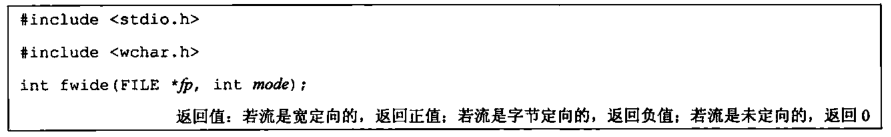

- [第一章 UNIX 基础知识](#chapter1)
- [第二章 UNIX 标准及实现](#chapter2)
- [第三章 文件 I/O](#chapter3)
- [第四章 文件和目录](#chapter4)
- [第五章 标准 I/O 库](#chapter5)
- [第六章 系统数据文件和信息](#chapter6)
- [第七章 进程环境](#chapter7)

<h1 id='chapter1'>第一章 UNIX 基础知识</h1>


## 1.5 输入和输出

### 1. 文件描述符

> 小的非负整数，内核用来标识一个特定进程正在>访问的文件

### 2.标准输入、标准输出、标准错误

一般默认指向终端

```
    > out.file
    < enter.file
```

上述命令输出重定向到 out.file

输入重定向到 enter.file

### 3.不带缓冲的 I/O

> 函数 open、read、write、lseek 和 close 提供了不带缓冲的 I/O，均使用文件描述符

### 4.标准 I/O

> 无需担心如何选取最佳的缓冲区大小

## 1.6 程序和进程

### 1. 程序

> 内核使用 exec 函数，将程序读入内存，并执行程序

### 2. 进程和进程 ID

> 程序的执行实例被称为进程(process)
>
> 唯一数字标识符，进程 ID 总是一个非负整数

### 3. 进程控制

> 3 个用于进程控制的主要函数：fork、exec、waitpid

## 1.7 出错处理

> 文件<errno.h>中定义了 errno 以及可以赋予它的各种常量
>
> 对于 errno 应当注意：
>
> 1.  如果没有出错，其值不会被例程清除
> 2.  任何函数不会将 errno 值设置为 0

> 出错恢复
>
> 可以将<errno.h>中定义的各种出错分成致命性和非致命性两类

## 1.8 用户标识

> 1.  用户 ID
> 2.  组 ID
> 3.  附属组 ID

```
    /etc/group
```

## 1.9 信号

> 进程有以下 3 种处理信号的方式
>
> 1.  忽略信号
> 2.  按系统默认方式处理
> 3.  提供一个函数，信号发生时调用该函数，捕捉该信号

> 终端键盘上中断键（Delete/Ctrl+C）和退出键（常为 Ctrl+\）可产生信号，中断当前进程
>
> kill 函数可向另一个进程发送信号

## 1.10 时间值

> - 日历时间（time_t）
> - 进程时间（clock_t）
>   - 时钟时间
>   - 用户 CPU 时间
>   - 系统 CPU 时间

## 1.11 系统调用和库函数


<h1 id='chapter2'>第二章 UNIX 标准及实现</h1>

## 2.2 UNIX 标准化

### 2.2.1 ISO C

> C 程序设计语言的标准，现由 WG14 工作组维护和开发
>
> 下图中头文件在 4 种 UNIX 实现（FreeBSD8.0、Linux3.2.0、Mac OS X10.6.8 和 Solaris10）中都支持


### 2.2.2 IEEE POSIX

> 图示四种 UNIX 系统包含的必需、可选头文件

必需头文件


可选头文件


### 2.2.3 Single UNIX Specification

> POSIX.1 标准的一个超集

## 2.3 UNIX 系统实现

> SVR4、4.4BSD、FreeBSD、Linux、Mac OS X、Solaris 等

## 2.4 标准和实现的关系

> 前面提到的各个标准定义了任一实际系统的子集

## 2.5 限制

问题：某些限制在一个给定的实现中可能是固定的（头文件中定义），而在另一个实现中则可能是变动的（需要一个运行时函数调用）

解决方案：

提供以下三种限制

> 1.  编译时限制（头文件）
> 2.  与文件或目录无关的运行时限制（sysconf 函数）
> 3.  与文件或目录有关的运行时限制（pathconf 和 fpathconf 函数）

### ISO C 限制

ISO C 顶一顶所有编译时限制都在头文件<limits.h>中

三种特别强调常量：

> 1.  FOPEN_MAX (<stdio.h>中，保证可同时打开的标准 I/O 流的最小个数，POSIX.1 中的 STREAM_MAX 应与其具有相同的值)
> 2.  TMP_MAX(<stdio.h>中，由 tmpnam 函数产生的唯一文件名的最大个数)
> 3.  FILENAME_MAX(应避免使用因为 POSIX.1 提供了更好的 NAME_MAX 和 PATH_MAX)


### POSIX 限制（略）

### 函数 sysconf、pathconf 和 fpathconf

调用这三个函数获得运行时限制


- 如果 name 参数并不是一个合适的常量，这三个函数都返回-1，并把 errno 置为 EINVAL
- 有些 name 返回一个变量值（>=0）或者提示该值不确定（-1）

### 不确定的运行时限制

> 路径名、最大打开文件数等（需运行时判断手动设置或其他处理方式）

## 2.6 选项

POSIX.1 三种处理选项的方法

> 1.  编译时选项定义在<unistd.h>中
> 2.  与文件或目录无关的运行时选项用 sysconf 函数来判断
> 3.  与文件或目录有关的运行时选项通过调用 pathconf 或 fpathconf 函数来判断

对于每一个选项，有以下三种可能的平台支持状态

> 1.  如果符号常量没有定义或者定义值为-1，name 该平台在编译时并不支持相应选项
> 2.  如果符号常量的定义值大于 0，那么该平台支持相应选项
> 3.  如果符号常量的定义值为 0，则必须调用 sysconf、pathconf 或 fpathconf 来判断相应选项是否受到支持

## 2.7 功能测试宏

\_POSIX_C_SOURCE、\_XOPEN_SOURCE 等

> \_POSIX_C_SOURCE（编译一个程序时，希望它只与 POSIX 的定义相关，不与任何实现定义的常量冲突则定义该常量）

以下命令定义该宏

```
    cc -D_POSIX_C_SOURCE=200809L file.c
```

## 2.8 基本系统数据类型

头文件<sys/types.h>和其他头文件中定义了某些与实现有关的数据类型，它们被称为基本系统数据类型，都是用 C 的 typedef 来定义的，绝大多数以\_t 结尾


## 2.9 标准之间的冲突

主要关注 ISO C 标准和 POSIX.1 之间的差别，如果出现冲突，POSIX.1 服从 ISO C 标准，但是 clock_t 和某些函数仍然有细微差别

<h1 id='chapter3'>第三章 文件I/O</h1>

## 3.2 文件描述符

对于内核而言，所有打开的文件都通过文件描述符引用（一个非负整数）。当打开一个现有文件或创建一个新文件时，内核向进程返回一个文件描述符。当读、写一个文件时，使用 open 或 create 返回的文件描述符标识该文件，将其作为参数传送给 read 或 write。

## 3.3 函数 open 和 openat

调用 open 或 openat 函数打开或创建一个文件

```
    #include <fcntl.h>

    int open(const char *path, int aflag, ...);

    int openat(int fd, const char *path, int aflag, ...);
```

由 open 和 openat 函数返回的文件描述符一定是最小的未用描述符数值

fd 参数把 open 和 openat 函数区分开

1.  path 参数指定的是绝对路径名，fd 参数被忽略，openat===open
2.  path 参数指定的是相对路径名，fd 参数为相对路径名在文件系统中的开始地址
3.  path 参数指定相对路径名，fd 参数具有特殊值 AT_FDCWD。路径名在当前工作目录中获取

## 3.4 函数 creat

创建新文件

```
    #include <fcntl.h>

    int creat(const char *path, mode_t mode)
```

返回值：成功则返回只写打开的文件描述符，出错返回-1

## 3.5 函数 close

关闭一个打开的文件

```
    #include <unistd.h>

    int close (int fd)
```

返回值：成功 0，出错-1

关闭一个文件时还会释放该进程加在该文件上的所有记录锁

## 3.6 函数 lseek

每个打开文件都有一个与其相关联的“当前文件偏移量”

调用 lseek 可为一个打开文件设置偏移量

```
    #include <unistd.h>

    off_t lseek(int fd, off_t offset, int whence)
```

返回值：成功 -> 新的文件偏移量，出错 -> -1

对参数 offset 的解释与参数 whence 的值有关

1.  若 whence 是 SEEK_SET，则将该文件的偏移量设置为距文件开始处 offset 个字节
2.  若 whence 是 SEEK_CUR，则将该文件的偏移量设置为当前值加 offset，offset 可正可负
3.  若 whence 是 SEEK_END，则将该文件的偏移量设置为文件长度加 offset，offset 可正可负

## 3.7 函数 read

从打开文件中读数据

```
    #include <unistd.h>

    ssize_t read(int fd, void *buf, size_t nbytes)
```

返回值：读到的字节数，若已到文件尾，返回 0，出错，-1

实际读到的字节数少于要求读的字节数的情况：

1.  读普通文件时，读到要求字节数之前已到达了文件尾端
2.  从终端设备读时，通常一次最多读一行
3.  从网络读时，网络中的缓冲机制
4.  从管道或 FIFO 读时，管道包含的字节少于所需数量
5.  从某些面向记录的设备读时，一次最多返回一个记录
6.  一信号造成中断，而已读了部分数据量

## 3.8 函数 write

向打开文件写数据

```
    #include <unistd.h>

    ssize_t write(int fd, const void *buf, size_t nbytes);
```

返回值：成功 -> 已写的字节数，出错 -> -1

## 3.9 I/O 的效率

## 3.10 文件共享

UNIX 系统支持在不同进程间共享打开文件

1.  每个进程在进程表中都有一个记录项，包含一张打开文件描述符表（文件描述符标志、指向一个文件表项的指针）
2.  内核为所有打开文件维持一张文件表（文件状态标志、当前文件偏移量、指向该文件 v 节点表项的指针）
3.  每个打开文件都有一个 v 节点结构


## 3.11 原子操作

一般而言，原子操作指的是由多步组成的一个操作

1.  追加文件末尾
    > 打开文件时设置 O_APPEND 标志
2.  函数 pread 和 pwrite
    > 
3.  创建一个文件
    > open 函数的 O_CREAT 和 O_EXCL 选项

## 3.12 函数 dup 和 dup2

均为原子操作


复制一个描述符的另一种方法是使用 fcntl 函数

## 3.13 函数 sync、fsync 和 fdatasync

通常，当内核需要重用缓冲区来存放其他磁盘块数据时，会把所有延迟写数据块写入磁盘。为保证磁盘上实际文件系统与缓冲区中内容的一致性，UNIX 系统提供了 sync、fsync 和 fdatasync 三个函数


sync 只将所有修改过的块缓冲区排入写队列就返回

update 系统守护进程周期性调用 sync 函数。保证定期冲洗内核的块缓冲区

fsync 函数只对由文件描述符 fd 指定的一个文件起作用，且等待写磁盘操作结束才返回

fdatasync 函数类似于 fsync，但它只影响文件的数据部分

## 3.14 函数 fcntl

fcntl 函数可以改变已经打开文件的属性

```
    #include <fcntl.h>

    int fcntl(int fd, int cmd, .../* int arg */)
```

返回值：成功 -> 依赖 cmd，出错 -> -1

以下 5 种功能：

1.  复制一个已有的描述符（cmd=F_DUPFD 或 F_DUPFD_CLOEXEC）
2.  获取/设置文件描述符标志（cmd=F_GETFD 或 F_SETFD）
3.  获取/设置文件状态标志（cmd=F_GETFL 或 F_SETFL）
4.  获取/设置异步 I/O 所有权（cmd=F_GETOWN 或 F_SETOWN）
5.  获取/设置记录锁（cmd=F_GETLK、F_SETLK 或 F_SETLKW）

## 3.15 函数 ioctl

ioctl 函数一直是 I/O 操作的杂物箱


## 3.16 /dev/fd

较新的系统都提供名为/dev/fd 的目录，其目录项是名为 0、1、2 等的文件。打开文件/dev/fd/n 等效于复制描述符 n（如果描述符 n 是打开的）

<h1 id='chapter4'>第四章 文件和目录</h1>

## 4.2 函数 stat、fstat、fstatat、lstat


## 4.3 文件类型

1.  普通文件
2.  目录文件
3.  块特殊文件
4.  字符特殊文件
5.  FIFO
6.  套接字
7.  符号链接

## 4.4 设置用户 ID 和设置组 ID

与一个进程相关联的 ID 有 6 个或更多


每个文件有一个所有者和组所有者，所有者由 stat 结构中的 st_uid 指定，组所有者则由 st_gid 指定

## 4.5 文件访问权限

进程每次打开、创建或删除一个文件时，内核就进行文件访问权限测试，具体如下：

1.  若进程的有效用户 ID 是 0（超级用户），则允许访问
2.  若进程的有效用户 ID 等于文件的所有者 ID（进程拥有此文件），那么如果所有者适当的访问权限位被设置，则允许访问，否则拒绝访问
3.  若进程的有效组 ID 或附属组 ID 之一等于文件的组 ID，那么如果适当的访问权限位被设置，则允许访问，否则拒绝访问
4.  若其他用户适当的访问权限位被设置，则允许访问，否则拒绝访问

## 4.6 新文件和目录的所有权

新文件的用户 ID 设置为进程的有效用户 ID，组 ID ，POSIX.1 允许实现选择下列之一

> 进程的有效组 ID
>
> 文件所在目录的组 ID

## 4.7 函数 access 和 faccessat

access 和 faccessat 按实际用户 ID 和实际组 ID 进行访问权限测试（步骤同 4.5）

```
    #include <unistd.h>
    int access(const char *pathname, int mode);
    int faccessat(int fd, const char *pathname, int mode, int flag);
```

返回值：成功 -> 0，出错 -> -1

## 4.8 函数 umask

umask 函数为进程设置文件模式创建屏蔽字，并返回之前的值（少数几个没有出错返回函数中的一个）

八进制数（屏蔽的权限）/符号形式（许可的权限）

## 4.9 函数 chmod、fchmod、fchmodat

更改现有文件的访问权限

```
    #include <sys/stat.h>

    int chmod(const char *pathname, mode_t mode);

    int fchmod(int fd, mode_t mode);

    int fchmodat(int fd, const char *pathname, mode_t mode, int flag);
```

返回值：成功 -> 0，出错 -> -1

chmod 在指定的文件上进行操作，fchmod 对已打开的文件进行操作

进程的有效用户 ID 必须等于文件的所有者 ID，或者进程具有超级用户权限

## 4.10 粘着位

## 4.11 函数 chown、fchown、fchownat、lchown

用于更改文件的用户 ID 和组 ID。如果两个参数 owner 或 group 中的任意一个是-1，则对应的 ID 不变


## 4.12 文件长度

stat 结构成员 st_size 表示以字节为单位的文件的长度

### 文件中的空洞

## 4.13 文件截断


## 4.14 文件系统

本节讨论 UFS 文件系统


.png>)

## 4.15 函数 link、linkat、unlink、unlinkat、remove

创建一个指向现有文件的链接的方法是使用 link 函数或 linkat 函数


## 4.16 函数 rename 和 renameat

文件或目录可以用 rename 或 renameat 重命名


## 4.17 符号链接

符号链接是对一个文件的间接指针，而上节硬链接直接指向文件 i 节点，符号链接用来避开硬链接的一些限制。


## 4.18 创建和读取符号链接

用 symlink 或 symlinkat 创建

readlink 和 readlinkat 读取

## 4.19 文件的时间


## 4.20 函数 futimens、utimensat、utimes

更改文件的访问和修改时间


执行函数所要求的优先权取决于 times 参数的值

## 4.21 函数 mkdir、mkdirat、rmdir

mkdir、mkdirat 创建目录，rmdir 删除目录


## 4.22 读目录

对某个目录具有访问权限的任一用户都可以读该目录，只有内核才能写目录。一个目录的写权限位和执行权限位决定了在该目录中能否创建新文件以及删除文件，不表示能否写目录本身

目录实际格式依赖于 UNIX 系统实现和文件系统的设计


## 4.23 函数 chdir、fchdir、getcwd

每个进程都有一个当前工作目录，是进程的一个属性，起始目录则是登录名的一个属性

进程调用 chdir 或 fchdir 可以更改当前工作目录

getcwd 取得当前工作目录


## 4.24 设备特殊文件

两个宏 major、minor 访问主、次设备号

## 4.25 文件访问权限位小结


<h1 id='chapter5'>第五章 标准I/O库</h1>

## 5.2 流和 FILE 对象

第三章中打开一个文件时，返回一个文件描述符用于后续的 I/O 操作。而对于标准 I/O 库，它们的操作是围绕流进行的。当用标准 I/O 库打开或创建一个文件时，已使一个流与一个文件相关联

对于 ASCII 字符集，一个字符用一个字节表示。对于国际字符集，一个字符可用多个字节表示。

流的定向决定了所读、写的字符是单字节还是多字节的。

> 当一个流最初被创建时，它并没有定向。若在未定向的流上使用一个多字节 I/O 函数，则将该流的定向设置为宽定向的，使用一个单字节 I/O 函数，则设为字节定向的。
>
> 只有两个函数可改变流的定向：freopen 清除一个流的定向，fwide 设置流的定向。



1.  mode 为负，fwide 将试图指定的流是字节定向的
2.  mode 为正，fwide 将试图指定的流是宽定向的
3.  mode 为 0，fwide 将不试图设置流的定向，但返回标识该流定向的值

注意：fwide 不改变已定向流的定向，无出错返回。

当打开一个流时，标准 I/O 函数 fopen 返回一个指向 FILE 对象的指针

## 5.3 标准输入、标准输出、标准错误

对一个进程预定义了 3 个流，且这三个流可以自动地被进程使用，通过预定义文件指针 stdin、stdout、stderr 加以引用

## 5.4 缓冲

1.  全缓冲
2.  行缓冲
3.  不带缓冲

标准错误流 stderr 通常是不带缓冲的，使得出错信息可以尽快显示出来

ISO C 要求：

- 当且仅当标准输入和标准输出并不指向交互式设备时，它们才是全缓冲的
- 标准错误决不会是全缓冲的

很多系统默认：

- 标准错误是不带缓冲的
- 若是指向终端设备的流，则是行缓冲的，否则是全缓冲的

不喜欢系统默认，可以调用下列函数更改缓冲类型


mode: \_IOFBF 全缓冲、\_IOLBF 行缓冲、\_IONBF 不带缓冲

不带缓冲的流忽略 buf 和 size 参数。全缓冲或行缓冲，则 buf 和 size 可选择地指定一个缓冲区及其长度。该流带缓冲，而 buf 是 null，则标准 I/O 库将自动地为该流分配适当长度的缓冲区，通常是由常量 BUFSIZ 所指定的值


任何时候，我们都可以强制冲洗一个流。

```
    #include <stdio.h>

    int fflush(FILE *fp)
```

返回值：成功 -> 0，出错 -> EOF

次函数使该流所有未写的数据都被传送至内核，若 fp 是 null，则此函数将导致所有输出流被冲洗

## 5.5 打开流

下列三个函数打开一个标准 I/O 流


三个函数区别如下：

1.  fopen 函数打开路径名为 pathname 的一个指定的文件
2.  freopen 在一个指定的流上打开一个指定的文件，若该流已打开，则先关闭该流。若该流已定向，则使用 freopen 清除该定向。一般用于将一个指定的文件打开为一个预定义的流：标准输入、标准输出或标准错误。
3.  fdopen 函数取一个已有的文件描述符，并使一个标准的 I/O 流与该描述符相结合。常用于由创建管道和网络通信通道函数返回的描述符。

type 参数指定对该 I/O 流的读、写方式，ISO C 规定 type 参数可以有以下 15 种不同的值


当以读和写类型打开一个文件时，具有下列限制：

- 如果中间没有 fflush、fseek、fsetpos 或 rewind，则在输出的后面不能直接跟随输入
- 如果中间没有 fseek、fsetpos 或 rewind，或者一个输入操作没有到达文件尾端，则在输入操作之后不能直接跟随输出

除非流引用终端设备，否则按系统默认，流被打开时是全缓冲的。若流引用终端设备，则该流是行缓冲的。

调用 fclose 关闭一个打开的流

```
    #include <stdio.h>

    int fclose(FILE *fp)
```

返回值：成功 -> 0，出错 -> EOF

该文件被关闭之前，冲洗缓冲中的输出数据，缓冲区中的任何输入数据被丢弃。若标准 I/O 库已经为该流自动分配了一个缓冲区，则释放此缓冲区。

当一个进程正常终止时（exit，从 main 函数中返回），则所有带未写缓冲数据的标准 I/O 流都被冲洗，所有打开的标准 I/O 流都被关闭

## 5.6 读和写流

1.  每次一个字符的 I/O。一次读或写一个字符，如果流是带缓冲的，则标准 I/O 函数处理所有缓冲。
2.  每次一行的 I/O。若果想要一次读或写一行，使用 fgets 和 fputs。
3.  直接 I/O（二进制 I/O）。

输入函数

以下 3 个函数可用于一次读一个字符


注意：不管是出错还是到达文件尾端，这 3 个函数都返回同样的值。为了区分这两种不同的情况，必须调用 ferror 或 feof


大多数实现中，为每个流在 File 对象中维护了两个标志：出错标志、文件结束标志。调用 clearerr 可以清楚这两个标志。

从流中读取数据以后，可以调用 ungetc 将字符再压送回流中(没有将它们写到底层文件中或设备上，只是将它们写回标准 I/O 库的流缓冲区中)

输出函数

对应于上面所述的每个输入函数都有一个输出函数


## 每次一行 I/O

下面两个函数提供每次输入一行的功能


这两个函数都指定了缓冲区的地址，读入的行将送入其中。gets 从标准输入读，而 fgets 则从指定的流读。

fputs 和 puts 提供每次输出一行的功能


## 5.8 标准 I/O 的效率


## 5.9 二进制 I/O

下列两个函数执行二进制 I/O 操作


## 5.10 定位流

3 种方法定位标准 I/O 流

1.  ftell 和 fseek 函数
2.  ftello 和 fseeko 函数
3.  fgetpos 和 fsetpos 函数


## 5.11 格式化 I/O

格式化输出

5 个 printf 函数来处理


格式化输入

执行格式化输入处理的是 3 个 scanf 函数


scanf 族用于分析输入字符串，并将字符序列转换成指定类型的变量

## 5.12 实现细节

在 UNIX 中，标准 I/O 库最终都要调用第三章中说明的 I/O 例程。每个标准 I/O 流都有一个与其相关联的文件描述符，可以对一个流调用 fileno 函数以获得其描述符。


如果要调用 dup 或 fcntl 等函数，则需要此函数

## 5.13 临时文件

ISO C 标准 I/O 库提供了两个函数以帮助创建临时文件。


## 5.14 内存流

3 个函数用于内存流的创建


<h1 id='chapter6'>第六章 系统数据文件和信息</h1>

## 6.2 口令文件

UNIX 系统口令文件包含了图 6-1 中所示的各字段，这些字段包含在<pwd.h>中定义的 passwd 结构中


由于历史原因，口令文件是/etc/passed，而且是一个 ASCII 文件。

## 6.3 阴影口令

加密口令是经单向加密算法处理过的用户口令副本。单向的，不能从加密口令猜测到原来的口令。

用于访问阴影口令文件的函数


## 6.4 组文件

UNIX 组文件包含了图 6-4 所示字段，包含在<grp.h>中所定义的 group 结构中


## 6.5 附属组 ID

使用附属组 ID 的有点是不必再显式地经常更改组。一个用户会参与多个项目，因此需要同时属于多个组，以下 3 个函数获取和设置附属组 ID。


## 6.7 其他数据文件


## 6.10 时间和日期例程

<h1 id='chapter7'>第七章 进程环境</h1>

## 7.2 main 函数

调用 main 前先调用一个特殊的启动例程。可执行程序文件将此启动例程指定为程序的起始地址---由连接编辑器设置，而连接编辑器则由 C 编译器调用。

## 7.3 进程终止

8 种方式使进程终止，其中 5 种为正常终止：

1.  从 main 返回
2.  调用 exit
3.  调用\_exit 或\_Exit
4.  最后一个线程从其启动例程返回
5.  从最后一个线程调用 pthread_exit

异常终止的三种方式：

1.  调用 abort
2.  接到一个信号
3.  组后一个线程对取消请求做出响应

退出函数：

\_exit 和\_Exit 立即进入内核，exit 则先执行一些清理处理，然后返回内核

函数 atexit，登记函数（终止处理程序）

一个 C 程序是如何启动的，以及它终止的各种方式：


## 7.4 命令行参数

当执行一个程序时，调用 exec 的进程可将命令行参数传递给该新程序。

## 7.5 环境表

每个程序都接收到一张环境表。（字符指针数组）


## 7.6 C 程序的存储空间布局

沿袭至今，C 程序一直由下列几部分组成：

- 正文段（由 CPU 执行的及其指令部分）
- 初始化数据段（包含了程序中需明确地赋初值的变量）
- 未初始化数据段
- 栈
- 堆


## 7.7 共享库

## 7.8 存储空间分配

ISOC 说明了 3 个用于存储空间动态分配的函数

1.  malloc，分配指定字节数的存储区（初始值不确定）
2.  为指定数量指定长度的对象分配存储空间（每一位初始化为 0）
3.  realloc，增加或减少以前分配区的长度

## 7.9 环境变量

ISOC 定义了一个函数 getenv，可以用其取环境变量值，但是该标准又称环境的内容是由实现定义的


## 7.10 函数 setjmp 和 longjmp

## 7.11 函数 getrlimit 和 setrlimit

每个进程都有一组资源限制，其中一些可以用 getrlimit 和 setrlimit 函数查询和更改

更改资源限制时，须遵循下列 3 条规则

1.  任何一个进程都可将一个软限制值更改为小于或等于其硬限制值
2.  热河一个进程都可降低其硬限制值，但它必须大于或等于其软限制值（对普通用户而言不可逆）
3.  只有超级用户进程可以提高硬限制值
