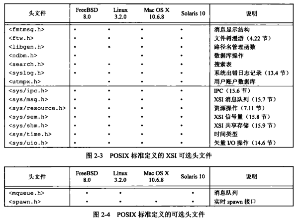

- [第一章 UNIX 基础知识](#chapter1)
- [第二章 UNIX 标准及实现](#chapter2)
- [第三章 文件 I/O](#chapter3)

<h1 id='chapter1'>第一章 UNIX 基础知识</h1>


## 1.5 输入和输出

### 1. 文件描述符

> 小的非负整数，内核用来标识一个特定进程正在>访问的文件

### 2.标准输入、标准输出、标准错误

一般默认指向终端

```
    > out.file
    < enter.file
```

上述命令输出重定向到 out.file

输入重定向到 enter.file

### 3.不带缓冲的 I/O

> 函数 open、read、write、lseek 和 close 提供了不带缓冲的 I/O，均使用文件描述符

### 4.标准 I/O

> 无需担心如何选取最佳的缓冲区大小

## 1.6 程序和进程

### 1. 程序

> 内核使用 exec 函数，将程序读入内存，并执行程序

### 2. 进程和进程 ID

> 程序的执行实例被称为进程(process)
>
> 唯一数字标识符，进程 ID 总是一个非负整数

### 3. 进程控制

> 3 个用于进程控制的主要函数：fork、exec、waitpid

## 1.7 出错处理

> 文件<errno.h>中定义了 errno 以及可以赋予它的各种常量
>
> 对于 errno 应当注意：
>
> 1.  如果没有出错，其值不会被例程清除
> 2.  任何函数不会将 errno 值设置为 0

> 出错恢复
>
> 可以将<errno.h>中定义的各种出错分成致命性和非致命性两类

## 1.8 用户标识

> 1.  用户 ID
> 2.  组 ID
> 3.  附属组 ID

```
    /etc/group
```

## 1.9 信号

> 进程有以下 3 种处理信号的方式
>
> 1.  忽略信号
> 2.  按系统默认方式处理
> 3.  提供一个函数，信号发生时调用该函数，捕捉该信号

> 终端键盘上中断键（Delete/Ctrl+C）和退出键（常为 Ctrl+\）可产生信号，中断当前进程
>
> kill 函数可向另一个进程发送信号

## 1.10 时间值

> - 日历时间（time_t）
> - 进程时间（clock_t）
>   - 时钟时间
>   - 用户 CPU 时间
>   - 系统 CPU 时间

## 1.11 系统调用和库函数


<h1 id='chapter2'>第二章 UNIX 标准及实现</h1>

## 2.2 UNIX 标准化

### 2.2.1 ISO C

> C 程序设计语言的标准，现由 WG14 工作组维护和开发
>
> 下图中头文件在 4 种 UNIX 实现（FreeBSD8.0、Linux3.2.0、Mac OS X10.6.8 和 Solaris10）中都支持


### 2.2.2 IEEE POSIX

> 图示四种 UNIX 系统包含的必需、可选头文件

必需头文件


可选头文件



### 2.2.3 Single UNIX Specification

> POSIX.1 标准的一个超集

## 2.3 UNIX 系统实现

> SVR4、4.4BSD、FreeBSD、Linux、Mac OS X、Solaris 等

## 2.4 标准和实现的关系

> 前面提到的各个标准定义了任一实际系统的子集

## 2.5 限制

问题：某些限制在一个给定的实现中可能是固定的（头文件中定义），而在另一个实现中则可能是变动的（需要一个运行时函数调用）

解决方案：

提供以下三种限制

> 1.  编译时限制（头文件）
> 2.  与文件或目录无关的运行时限制（sysconf 函数）
> 3.  与文件或目录有关的运行时限制（pathconf 和 fpathconf 函数）

### ISO C 限制

ISO C 顶一顶所有编译时限制都在头文件<limits.h>中

三种特别强调常量：

> 1.  FOPEN_MAX (<stdio.h>中，保证可同时打开的标准 I/O 流的最小个数，POSIX.1 中的 STREAM_MAX 应与其具有相同的值)
> 2.  TMP_MAX(<stdio.h>中，由 tmpnam 函数产生的唯一文件名的最大个数)
> 3.  FILENAME_MAX(应避免使用因为 POSIX.1 提供了更好的 NAME_MAX 和 PATH_MAX)


### POSIX 限制（略）

### 函数 sysconf、pathconf 和 fpathconf

调用这三个函数获得运行时限制


- 如果 name 参数并不是一个合适的常量，这三个函数都返回-1，并把 errno 置为 EINVAL
- 有些 name 返回一个变量值（>=0）或者提示该值不确定（-1）

### 不确定的运行时限制

> 路径名、最大打开文件数等（需运行时判断手动设置或其他处理方式）

## 2.6 选项

POSIX.1 三种处理选项的方法

> 1.  编译时选项定义在<unistd.h>中
> 2.  与文件或目录无关的运行时选项用 sysconf 函数来判断
> 3.  与文件或目录有关的运行时选项通过调用 pathconf 或 fpathconf 函数来判断

对于每一个选项，有以下三种可能的平台支持状态

> 1.  如果符号常量没有定义或者定义值为-1，name 该平台在编译时并不支持相应选项
> 2.  如果符号常量的定义值大于 0，那么该平台支持相应选项
> 3.  如果符号常量的定义值为 0，则必须调用 sysconf、pathconf 或 fpathconf 来判断相应选项是否受到支持

## 2.7 功能测试宏

\_POSIX_C_SOURCE、\_XOPEN_SOURCE 等

> \_POSIX_C_SOURCE（编译一个程序时，希望它只与 POSIX 的定义相关，不与任何实现定义的常量冲突则定义该常量）

以下命令定义该宏

```
    cc -D_POSIX_C_SOURCE=200809L file.c
```

## 2.8 基本系统数据类型

头文件<sys/types.h>和其他头文件中定义了某些与实现有关的数据类型，它们被称为基本系统数据类型，都是用 C 的 typedef 来定义的，绝大多数以\_t 结尾


## 2.9 标准之间的冲突

主要关注 ISO C 标准和 POSIX.1 之间的差别，如果出现冲突，POSIX.1 服从 ISO C 标准，但是 clock_t 和某些函数仍然有细微差别

<h1 id='chapter3'>第三章 文件I/O</h1>

## 3.2 文件描述符

对于内核而言，所有打开的文件都通过文件描述符引用（一个非负整数）。当打开一个现有文件或创建一个新文件时，内核向进程返回一个文件描述符。当读、写一个文件时，使用 open 或 create 返回的文件描述符标识该文件，将其作为参数传送给 read 或 write。

## 3.3 函数 open 和 openat

调用 open 或 openat 函数打开或创建一个文件

```
    #include <fcntl.h>

    int open(const char *path, int aflag, ...);

    int openat(int fd, const char *path, int aflag, ...);
```

由 open 和 openat 函数返回的文件描述符一定是最小的未用描述符数值

fd 参数把 open 和 openat 函数区分开

1.  path 参数指定的是绝对路径名，fd 参数被忽略，openat===open
2.  path 参数指定的是相对路径名，fd 参数为相对路径名在文件系统中的开始地址
3.  path 参数指定相对路径名，fd 参数具有特殊值 AT_FDCWD。路径名在当前工作目录中获取

## 3.4 函数 creat

创建新文件

```
    #include <fcntl.h>

    int creat(const char *path, mode_t mode)
```

返回值：成功则返回只写打开的文件描述符，出错返回-1

## 3.5 函数 close

关闭一个打开的文件

```
    #include <unistd.h>

    int close (int fd)
```

返回值：成功 0，出错-1

关闭一个文件时还会释放该进程加在该文件上的所有记录锁

## 3.6 函数 lseek

每个打开文件都有一个与其相关联的“当前文件偏移量”

调用 lseek 可为一个打开文件设置偏移量

```
    #include <unistd.h>

    off_t lseek(int fd, off_t offset, int whence)
```

返回值：成功 -> 新的文件偏移量，出错 -> -1
