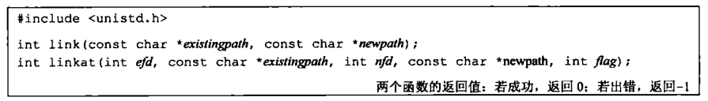
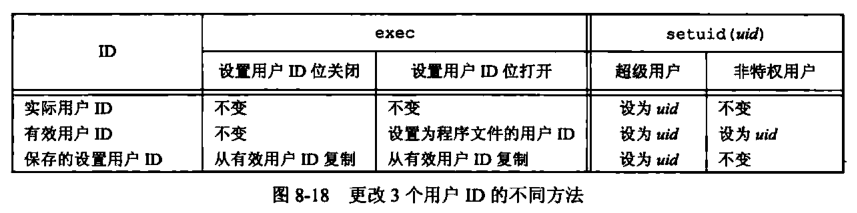
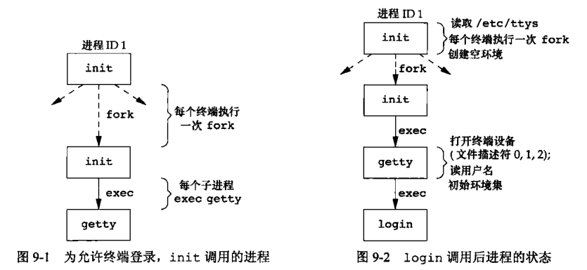
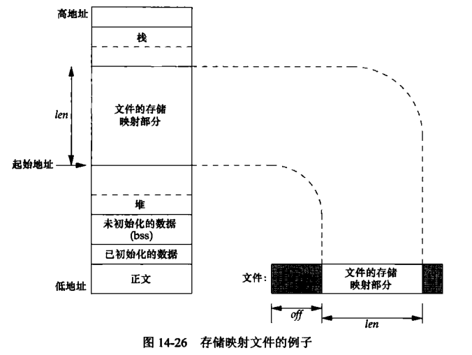

- [第一章 UNIX 基础知识](#chapter1)
- [第二章 UNIX 标准及实现](#chapter2)
- [第三章 文件 I/O](#chapter3)
- [第四章 文件和目录](#chapter4)
- [第五章 标准 I/O 库](#chapter5)
- [第六章 系统数据文件和信息](#chapter6)
- [第七章 进程环境](#chapter7)
- [第八章 进程控制](#chapter8)
- [第九章 进程关系](#chapter9)
- [第十章 信号](#chapter10)
- [第十一章 线程](#chapter11)
- [第十二章 线程控制](#chapter12)
- [第十三章 守护进程](#chapter13)
- [第十四章 高级 I/O](#chapter14)
- [第十五章 进程间通信](#chapter15)

<h1 id='chapter1'>第一章 UNIX 基础知识</h1>


## 1.5 输入和输出

### 1. 文件描述符

> 小的非负整数，内核用来标识一个特定进程正在>访问的文件

### 2.标准输入、标准输出、标准错误

一般默认指向终端

```
    > out.file
    < enter.file
```

上述命令输出重定向到 out.file

输入重定向到 enter.file

### 3.不带缓冲的 I/O

> 函数 open、read、write、lseek 和 close 提供了不带缓冲的 I/O，均使用文件描述符

### 4.标准 I/O

> 无需担心如何选取最佳的缓冲区大小

## 1.6 程序和进程

### 1. 程序

> 内核使用 exec 函数，将程序读入内存，并执行程序

### 2. 进程和进程 ID

> 程序的执行实例被称为进程(process)
>
> 唯一数字标识符，进程 ID 总是一个非负整数

### 3. 进程控制

> 3 个用于进程控制的主要函数：fork、exec、waitpid

## 1.7 出错处理

> 文件<errno.h>中定义了 errno 以及可以赋予它的各种常量
>
> 对于 errno 应当注意：
>
> 1.  如果没有出错，其值不会被例程清除
> 2.  任何函数不会将 errno 值设置为 0

> 出错恢复
>
> 可以将<errno.h>中定义的各种出错分成致命性和非致命性两类

## 1.8 用户标识

> 1.  用户 ID
> 2.  组 ID
> 3.  附属组 ID

```
    /etc/group
```

## 1.9 信号

> 进程有以下 3 种处理信号的方式
>
> 1.  忽略信号
> 2.  按系统默认方式处理
> 3.  提供一个函数，信号发生时调用该函数，捕捉该信号

> 终端键盘上中断键（Delete/Ctrl+C）和退出键（常为 Ctrl+\）可产生信号，中断当前进程
>
> kill 函数可向另一个进程发送信号

## 1.10 时间值

> - 日历时间（time_t）
> - 进程时间（clock_t）
>   - 时钟时间
>   - 用户 CPU 时间
>   - 系统 CPU 时间

## 1.11 系统调用和库函数


<h1 id='chapter2'>第二章 UNIX 标准及实现</h1>

## 2.2 UNIX 标准化

### 2.2.1 ISO C

> C 程序设计语言的标准，现由 WG14 工作组维护和开发
>
> 下图中头文件在 4 种 UNIX 实现（FreeBSD8.0、Linux3.2.0、Mac OS X10.6.8 和 Solaris10）中都支持


### 2.2.2 IEEE POSIX

> 图示四种 UNIX 系统包含的必需、可选头文件

必需头文件


可选头文件


### 2.2.3 Single UNIX Specification

> POSIX.1 标准的一个超集

## 2.3 UNIX 系统实现

> SVR4、4.4BSD、FreeBSD、Linux、Mac OS X、Solaris 等

## 2.4 标准和实现的关系

> 前面提到的各个标准定义了任一实际系统的子集

## 2.5 限制

问题：某些限制在一个给定的实现中可能是固定的（头文件中定义），而在另一个实现中则可能是变动的（需要一个运行时函数调用）

解决方案：

提供以下三种限制

> 1.  编译时限制（头文件）
> 2.  与文件或目录无关的运行时限制（sysconf 函数）
> 3.  与文件或目录有关的运行时限制（pathconf 和 fpathconf 函数）

### ISO C 限制

ISO C 顶一顶所有编译时限制都在头文件<limits.h>中

三种特别强调常量：

> 1.  FOPEN_MAX (<stdio.h>中，保证可同时打开的标准 I/O 流的最小个数，POSIX.1 中的 STREAM_MAX 应与其具有相同的值)
> 2.  TMP_MAX(<stdio.h>中，由 tmpnam 函数产生的唯一文件名的最大个数)
> 3.  FILENAME_MAX(应避免使用因为 POSIX.1 提供了更好的 NAME_MAX 和 PATH_MAX)


### POSIX 限制（略）

### 函数 sysconf、pathconf 和 fpathconf

调用这三个函数获得运行时限制


- 如果 name 参数并不是一个合适的常量，这三个函数都返回-1，并把 errno 置为 EINVAL
- 有些 name 返回一个变量值（>=0）或者提示该值不确定（-1）

### 不确定的运行时限制

> 路径名、最大打开文件数等（需运行时判断手动设置或其他处理方式）

## 2.6 选项

POSIX.1 三种处理选项的方法

> 1.  编译时选项定义在<unistd.h>中
> 2.  与文件或目录无关的运行时选项用 sysconf 函数来判断
> 3.  与文件或目录有关的运行时选项通过调用 pathconf 或 fpathconf 函数来判断

对于每一个选项，有以下三种可能的平台支持状态

> 1.  如果符号常量没有定义或者定义值为-1，name 该平台在编译时并不支持相应选项
> 2.  如果符号常量的定义值大于 0，那么该平台支持相应选项
> 3.  如果符号常量的定义值为 0，则必须调用 sysconf、pathconf 或 fpathconf 来判断相应选项是否受到支持

## 2.7 功能测试宏

\_POSIX_C_SOURCE、\_XOPEN_SOURCE 等

> \_POSIX_C_SOURCE（编译一个程序时，希望它只与 POSIX 的定义相关，不与任何实现定义的常量冲突则定义该常量）

以下命令定义该宏

```
    cc -D_POSIX_C_SOURCE=200809L file.c
```

## 2.8 基本系统数据类型

头文件<sys/types.h>和其他头文件中定义了某些与实现有关的数据类型，它们被称为基本系统数据类型，都是用 C 的 typedef 来定义的，绝大多数以\_t 结尾


## 2.9 标准之间的冲突

主要关注 ISO C 标准和 POSIX.1 之间的差别，如果出现冲突，POSIX.1 服从 ISO C 标准，但是 clock_t 和某些函数仍然有细微差别

<h1 id='chapter3'>第三章 文件I/O</h1>

## 3.2 文件描述符

对于内核而言，所有打开的文件都通过文件描述符引用（一个非负整数）。当打开一个现有文件或创建一个新文件时，内核向进程返回一个文件描述符。当读、写一个文件时，使用 open 或 create 返回的文件描述符标识该文件，将其作为参数传送给 read 或 write。

## 3.3 函数 open 和 openat

调用 open 或 openat 函数打开或创建一个文件

```
    #include <fcntl.h>

    int open(const char *path, int aflag, ...);

    int openat(int fd, const char *path, int aflag, ...);
```

由 open 和 openat 函数返回的文件描述符一定是最小的未用描述符数值

fd 参数把 open 和 openat 函数区分开

1.  path 参数指定的是绝对路径名，fd 参数被忽略，openat===open
2.  path 参数指定的是相对路径名，fd 参数为相对路径名在文件系统中的开始地址
3.  path 参数指定相对路径名，fd 参数具有特殊值 AT_FDCWD。路径名在当前工作目录中获取

## 3.4 函数 creat

创建新文件

```
    #include <fcntl.h>

    int creat(const char *path, mode_t mode)
```

返回值：成功则返回只写打开的文件描述符，出错返回-1

## 3.5 函数 close

关闭一个打开的文件

```
    #include <unistd.h>

    int close (int fd)
```

返回值：成功 0，出错-1

关闭一个文件时还会释放该进程加在该文件上的所有记录锁

## 3.6 函数 lseek

每个打开文件都有一个与其相关联的“当前文件偏移量”

调用 lseek 可为一个打开文件设置偏移量

```
    #include <unistd.h>

    off_t lseek(int fd, off_t offset, int whence)
```

返回值：成功 -> 新的文件偏移量，出错 -> -1

对参数 offset 的解释与参数 whence 的值有关

1.  若 whence 是 SEEK_SET，则将该文件的偏移量设置为距文件开始处 offset 个字节
2.  若 whence 是 SEEK_CUR，则将该文件的偏移量设置为当前值加 offset，offset 可正可负
3.  若 whence 是 SEEK_END，则将该文件的偏移量设置为文件长度加 offset，offset 可正可负

## 3.7 函数 read

从打开文件中读数据

```
    #include <unistd.h>

    ssize_t read(int fd, void *buf, size_t nbytes)
```

返回值：读到的字节数，若已到文件尾，返回 0，出错，-1

实际读到的字节数少于要求读的字节数的情况：

1.  读普通文件时，读到要求字节数之前已到达了文件尾端
2.  从终端设备读时，通常一次最多读一行
3.  从网络读时，网络中的缓冲机制
4.  从管道或 FIFO 读时，管道包含的字节少于所需数量
5.  从某些面向记录的设备读时，一次最多返回一个记录
6.  一信号造成中断，而已读了部分数据量

## 3.8 函数 write

向打开文件写数据

```
    #include <unistd.h>

    ssize_t write(int fd, const void *buf, size_t nbytes);
```

返回值：成功 -> 已写的字节数，出错 -> -1

## 3.9 I/O 的效率

## 3.10 文件共享

UNIX 系统支持在不同进程间共享打开文件

1.  每个进程在进程表中都有一个记录项，包含一张打开文件描述符表（文件描述符标志、指向一个文件表项的指针）
2.  内核为所有打开文件维持一张文件表（文件状态标志、当前文件偏移量、指向该文件 v 节点表项的指针）
3.  每个打开文件都有一个 v 节点结构


## 3.11 原子操作

一般而言，原子操作指的是由多步组成的一个操作

1.  追加文件末尾
    > 打开文件时设置 O_APPEND 标志
2.  函数 pread 和 pwrite
    > 
3.  创建一个文件
    > open 函数的 O_CREAT 和 O_EXCL 选项

## 3.12 函数 dup 和 dup2

均为原子操作


复制一个描述符的另一种方法是使用 fcntl 函数

## 3.13 函数 sync、fsync 和 fdatasync

通常，当内核需要重用缓冲区来存放其他磁盘块数据时，会把所有延迟写数据块写入磁盘。为保证磁盘上实际文件系统与缓冲区中内容的一致性，UNIX 系统提供了 sync、fsync 和 fdatasync 三个函数


sync 只将所有修改过的块缓冲区排入写队列就返回

update 系统守护进程周期性调用 sync 函数。保证定期冲洗内核的块缓冲区

fsync 函数只对由文件描述符 fd 指定的一个文件起作用，且等待写磁盘操作结束才返回

fdatasync 函数类似于 fsync，但它只影响文件的数据部分

## 3.14 函数 fcntl

fcntl 函数可以改变已经打开文件的属性

```
    #include <fcntl.h>

    int fcntl(int fd, int cmd, .../* int arg */)
```

返回值：成功 -> 依赖 cmd，出错 -> -1

以下 5 种功能：

1.  复制一个已有的描述符（cmd=F_DUPFD 或 F_DUPFD_CLOEXEC）
2.  获取/设置文件描述符标志（cmd=F_GETFD 或 F_SETFD）
3.  获取/设置文件状态标志（cmd=F_GETFL 或 F_SETFL）
4.  获取/设置异步 I/O 所有权（cmd=F_GETOWN 或 F_SETOWN）
5.  获取/设置记录锁（cmd=F_GETLK、F_SETLK 或 F_SETLKW）

## 3.15 函数 ioctl

ioctl 函数一直是 I/O 操作的杂物箱


## 3.16 /dev/fd

较新的系统都提供名为/dev/fd 的目录，其目录项是名为 0、1、2 等的文件。打开文件/dev/fd/n 等效于复制描述符 n（如果描述符 n 是打开的）

<h1 id='chapter4'>第四章 文件和目录</h1>

## 4.2 函数 stat、fstat、fstatat、lstat


## 4.3 文件类型

1.  普通文件
2.  目录文件
3.  块特殊文件
4.  字符特殊文件
5.  FIFO
6.  套接字
7.  符号链接

## 4.4 设置用户 ID 和设置组 ID

与一个进程相关联的 ID 有 6 个或更多


每个文件有一个所有者和组所有者，所有者由 stat 结构中的 st_uid 指定，组所有者则由 st_gid 指定

## 4.5 文件访问权限

进程每次打开、创建或删除一个文件时，内核就进行文件访问权限测试，具体如下：

1.  若进程的有效用户 ID 是 0（超级用户），则允许访问
2.  若进程的有效用户 ID 等于文件的所有者 ID（进程拥有此文件），那么如果所有者适当的访问权限位被设置，则允许访问，否则拒绝访问
3.  若进程的有效组 ID 或附属组 ID 之一等于文件的组 ID，那么如果适当的访问权限位被设置，则允许访问，否则拒绝访问
4.  若其他用户适当的访问权限位被设置，则允许访问，否则拒绝访问

## 4.6 新文件和目录的所有权

新文件的用户 ID 设置为进程的有效用户 ID，组 ID ，POSIX.1 允许实现选择下列之一

> 进程的有效组 ID
>
> 文件所在目录的组 ID

## 4.7 函数 access 和 faccessat

access 和 faccessat 按实际用户 ID 和实际组 ID 进行访问权限测试（步骤同 4.5）

```
    #include <unistd.h>
    int access(const char *pathname, int mode);
    int faccessat(int fd, const char *pathname, int mode, int flag);
```

返回值：成功 -> 0，出错 -> -1

## 4.8 函数 umask

umask 函数为进程设置文件模式创建屏蔽字，并返回之前的值（少数几个没有出错返回函数中的一个）

八进制数（屏蔽的权限）/符号形式（许可的权限）

## 4.9 函数 chmod、fchmod、fchmodat

更改现有文件的访问权限

```
    #include <sys/stat.h>

    int chmod(const char *pathname, mode_t mode);

    int fchmod(int fd, mode_t mode);

    int fchmodat(int fd, const char *pathname, mode_t mode, int flag);
```

返回值：成功 -> 0，出错 -> -1

chmod 在指定的文件上进行操作，fchmod 对已打开的文件进行操作

进程的有效用户 ID 必须等于文件的所有者 ID，或者进程具有超级用户权限

## 4.10 粘着位

## 4.11 函数 chown、fchown、fchownat、lchown

用于更改文件的用户 ID 和组 ID。如果两个参数 owner 或 group 中的任意一个是-1，则对应的 ID 不变


## 4.12 文件长度

stat 结构成员 st_size 表示以字节为单位的文件的长度

### 文件中的空洞

## 4.13 文件截断


## 4.14 文件系统

本节讨论 UFS 文件系统


.png>)

## 4.15 函数 link、linkat、unlink、unlinkat、remove

创建一个指向现有文件的链接的方法是使用 link 函数或 linkat 函数



## 4.16 函数 rename 和 renameat

文件或目录可以用 rename 或 renameat 重命名


## 4.17 符号链接

符号链接是对一个文件的间接指针，而上节硬链接直接指向文件 i 节点，符号链接用来避开硬链接的一些限制。


## 4.18 创建和读取符号链接

用 symlink 或 symlinkat 创建

readlink 和 readlinkat 读取

## 4.19 文件的时间


## 4.20 函数 futimens、utimensat、utimes

更改文件的访问和修改时间


执行函数所要求的优先权取决于 times 参数的值

## 4.21 函数 mkdir、mkdirat、rmdir

mkdir、mkdirat 创建目录，rmdir 删除目录


## 4.22 读目录

对某个目录具有访问权限的任一用户都可以读该目录，只有内核才能写目录。一个目录的写权限位和执行权限位决定了在该目录中能否创建新文件以及删除文件，不表示能否写目录本身

目录实际格式依赖于 UNIX 系统实现和文件系统的设计


## 4.23 函数 chdir、fchdir、getcwd

每个进程都有一个当前工作目录，是进程的一个属性，起始目录则是登录名的一个属性

进程调用 chdir 或 fchdir 可以更改当前工作目录

getcwd 取得当前工作目录


## 4.24 设备特殊文件

两个宏 major、minor 访问主、次设备号

## 4.25 文件访问权限位小结


<h1 id='chapter5'>第五章 标准I/O库</h1>

## 5.2 流和 FILE 对象

第三章中打开一个文件时，返回一个文件描述符用于后续的 I/O 操作。而对于标准 I/O 库，它们的操作是围绕流进行的。当用标准 I/O 库打开或创建一个文件时，已使一个流与一个文件相关联

对于 ASCII 字符集，一个字符用一个字节表示。对于国际字符集，一个字符可用多个字节表示。

流的定向决定了所读、写的字符是单字节还是多字节的。

> 当一个流最初被创建时，它并没有定向。若在未定向的流上使用一个多字节 I/O 函数，则将该流的定向设置为宽定向的，使用一个单字节 I/O 函数，则设为字节定向的。
>
> 只有两个函数可改变流的定向：freopen 清除一个流的定向，fwide 设置流的定向。


1.  mode 为负，fwide 将试图指定的流是字节定向的
2.  mode 为正，fwide 将试图指定的流是宽定向的
3.  mode 为 0，fwide 将不试图设置流的定向，但返回标识该流定向的值

注意：fwide 不改变已定向流的定向，无出错返回。

当打开一个流时，标准 I/O 函数 fopen 返回一个指向 FILE 对象的指针

## 5.3 标准输入、标准输出、标准错误

对一个进程预定义了 3 个流，且这三个流可以自动地被进程使用，通过预定义文件指针 stdin、stdout、stderr 加以引用

## 5.4 缓冲

1.  全缓冲
2.  行缓冲
3.  不带缓冲

标准错误流 stderr 通常是不带缓冲的，使得出错信息可以尽快显示出来

ISO C 要求：

- 当且仅当标准输入和标准输出并不指向交互式设备时，它们才是全缓冲的
- 标准错误决不会是全缓冲的

很多系统默认：

- 标准错误是不带缓冲的
- 若是指向终端设备的流，则是行缓冲的，否则是全缓冲的

不喜欢系统默认，可以调用下列函数更改缓冲类型


mode: \_IOFBF 全缓冲、\_IOLBF 行缓冲、\_IONBF 不带缓冲

不带缓冲的流忽略 buf 和 size 参数。全缓冲或行缓冲，则 buf 和 size 可选择地指定一个缓冲区及其长度。该流带缓冲，而 buf 是 null，则标准 I/O 库将自动地为该流分配适当长度的缓冲区，通常是由常量 BUFSIZ 所指定的值


任何时候，我们都可以强制冲洗一个流。

```
    #include <stdio.h>

    int fflush(FILE *fp)
```

返回值：成功 -> 0，出错 -> EOF

次函数使该流所有未写的数据都被传送至内核，若 fp 是 null，则此函数将导致所有输出流被冲洗

## 5.5 打开流

下列三个函数打开一个标准 I/O 流


三个函数区别如下：

1.  fopen 函数打开路径名为 pathname 的一个指定的文件
2.  freopen 在一个指定的流上打开一个指定的文件，若该流已打开，则先关闭该流。若该流已定向，则使用 freopen 清除该定向。一般用于将一个指定的文件打开为一个预定义的流：标准输入、标准输出或标准错误。
3.  fdopen 函数取一个已有的文件描述符，并使一个标准的 I/O 流与该描述符相结合。常用于由创建管道和网络通信通道函数返回的描述符。

type 参数指定对该 I/O 流的读、写方式，ISO C 规定 type 参数可以有以下 15 种不同的值


当以读和写类型打开一个文件时，具有下列限制：

- 如果中间没有 fflush、fseek、fsetpos 或 rewind，则在输出的后面不能直接跟随输入
- 如果中间没有 fseek、fsetpos 或 rewind，或者一个输入操作没有到达文件尾端，则在输入操作之后不能直接跟随输出

除非流引用终端设备，否则按系统默认，流被打开时是全缓冲的。若流引用终端设备，则该流是行缓冲的。

调用 fclose 关闭一个打开的流

```
    #include <stdio.h>

    int fclose(FILE *fp)
```

返回值：成功 -> 0，出错 -> EOF

该文件被关闭之前，冲洗缓冲中的输出数据，缓冲区中的任何输入数据被丢弃。若标准 I/O 库已经为该流自动分配了一个缓冲区，则释放此缓冲区。

当一个进程正常终止时（exit，从 main 函数中返回），则所有带未写缓冲数据的标准 I/O 流都被冲洗，所有打开的标准 I/O 流都被关闭

## 5.6 读和写流

1.  每次一个字符的 I/O。一次读或写一个字符，如果流是带缓冲的，则标准 I/O 函数处理所有缓冲。
2.  每次一行的 I/O。若果想要一次读或写一行，使用 fgets 和 fputs。
3.  直接 I/O（二进制 I/O）。

输入函数

以下 3 个函数可用于一次读一个字符


注意：不管是出错还是到达文件尾端，这 3 个函数都返回同样的值。为了区分这两种不同的情况，必须调用 ferror 或 feof


大多数实现中，为每个流在 File 对象中维护了两个标志：出错标志、文件结束标志。调用 clearerr 可以清楚这两个标志。

从流中读取数据以后，可以调用 ungetc 将字符再压送回流中(没有将它们写到底层文件中或设备上，只是将它们写回标准 I/O 库的流缓冲区中)

输出函数

对应于上面所述的每个输入函数都有一个输出函数


## 每次一行 I/O

下面两个函数提供每次输入一行的功能


这两个函数都指定了缓冲区的地址，读入的行将送入其中。gets 从标准输入读，而 fgets 则从指定的流读。

fputs 和 puts 提供每次输出一行的功能


## 5.8 标准 I/O 的效率


## 5.9 二进制 I/O

下列两个函数执行二进制 I/O 操作


## 5.10 定位流

3 种方法定位标准 I/O 流

1.  ftell 和 fseek 函数
2.  ftello 和 fseeko 函数
3.  fgetpos 和 fsetpos 函数


## 5.11 格式化 I/O

格式化输出

5 个 printf 函数来处理


格式化输入

执行格式化输入处理的是 3 个 scanf 函数


scanf 族用于分析输入字符串，并将字符序列转换成指定类型的变量

## 5.12 实现细节

在 UNIX 中，标准 I/O 库最终都要调用第三章中说明的 I/O 例程。每个标准 I/O 流都有一个与其相关联的文件描述符，可以对一个流调用 fileno 函数以获得其描述符。


如果要调用 dup 或 fcntl 等函数，则需要此函数

## 5.13 临时文件

ISO C 标准 I/O 库提供了两个函数以帮助创建临时文件。


## 5.14 内存流

3 个函数用于内存流的创建


<h1 id='chapter6'>第六章 系统数据文件和信息</h1>

## 6.2 口令文件

UNIX 系统口令文件包含了图 6-1 中所示的各字段，这些字段包含在<pwd.h>中定义的 passwd 结构中


由于历史原因，口令文件是/etc/passed，而且是一个 ASCII 文件。

## 6.3 阴影口令

加密口令是经单向加密算法处理过的用户口令副本。单向的，不能从加密口令猜测到原来的口令。

用于访问阴影口令文件的函数


## 6.4 组文件

UNIX 组文件包含了图 6-4 所示字段，包含在<grp.h>中所定义的 group 结构中


## 6.5 附属组 ID

使用附属组 ID 的有点是不必再显式地经常更改组。一个用户会参与多个项目，因此需要同时属于多个组，以下 3 个函数获取和设置附属组 ID。


## 6.7 其他数据文件


## 6.10 时间和日期例程

<h1 id='chapter7'>第七章 进程环境</h1>

## 7.2 main 函数

调用 main 前先调用一个特殊的启动例程。可执行程序文件将此启动例程指定为程序的起始地址---由连接编辑器设置，而连接编辑器则由 C 编译器调用。

## 7.3 进程终止

8 种方式使进程终止，其中 5 种为正常终止：

1.  从 main 返回
2.  调用 exit
3.  调用\_exit 或\_Exit
4.  最后一个线程从其启动例程返回
5.  从最后一个线程调用 pthread_exit

异常终止的三种方式：

1.  调用 abort
2.  接到一个信号
3.  组后一个线程对取消请求做出响应

退出函数：

\_exit 和\_Exit 立即进入内核，exit 则先执行一些清理处理，然后返回内核

函数 atexit，登记函数（终止处理程序）

一个 C 程序是如何启动的，以及它终止的各种方式：


## 7.4 命令行参数

当执行一个程序时，调用 exec 的进程可将命令行参数传递给该新程序。

## 7.5 环境表

每个程序都接收到一张环境表。（字符指针数组）


## 7.6 C 程序的存储空间布局

沿袭至今，C 程序一直由下列几部分组成：

- 正文段（由 CPU 执行的及其指令部分）
- 初始化数据段（包含了程序中需明确地赋初值的变量）
- 未初始化数据段
- 栈
- 堆


## 7.7 共享库

## 7.8 存储空间分配

ISOC 说明了 3 个用于存储空间动态分配的函数

1.  malloc，分配指定字节数的存储区（初始值不确定）
2.  为指定数量指定长度的对象分配存储空间（每一位初始化为 0）
3.  realloc，增加或减少以前分配区的长度

## 7.9 环境变量

ISOC 定义了一个函数 getenv，可以用其取环境变量值，但是该标准又称环境的内容是由实现定义的


## 7.10 函数 setjmp 和 longjmp

## 7.11 函数 getrlimit 和 setrlimit

每个进程都有一组资源限制，其中一些可以用 getrlimit 和 setrlimit 函数查询和更改

更改资源限制时，须遵循下列 3 条规则

1.  任何一个进程都可将一个软限制值更改为小于或等于其硬限制值
2.  热河一个进程都可降低其硬限制值，但它必须大于或等于其软限制值（对普通用户而言不可逆）
3.  只有超级用户进程可以提高硬限制值

<h1 id='chapter8'>第八章 进程控制</h1>

## 8.2 进程标识

每个进程都有一个非负整形表示的唯一进程 ID。

ID 为 0 的进程通常是调度进程，常被称为交换进程（系统进程），ID 为 1 的进程通常是 init 进程，自举过程结束时由内核调用。

除了进程 ID，每个进程还有一些其他标识符：


## 函数 fork

一个现有的进程可以调用 fork 函数创建一个新进程

由 fork 创建的新进程被称为子进程。

子进程和父进程继续执行 fork 调用之后的指令。子进程是父进程的副本（不共享存储空间部分，共享正文段）

> 写时复制
> 文件共享

一般来说，在 fork 之后是父进程先执行还是子进程先执行是不确定的，这取决于内核所使用的调度算法。


在 fork 之后处理文件描述符有以下两种常见的情况

1.  父进程等待子进程完成
2.  父进程和子进程各自执行不同的程序段

父进程和子进程之间的区别具体如下：

- fork 的返回值不同
- 进程 ID 不同
- 这两个进程的父进程 ID 不同
- 子进程的 tms_utime、tms_stime、tms_cutime 和 tms_ustime 的值设置为 0
- 子进程不继承父进程设置的文件锁
- 子进程的未处理闹钟被清除
- 子进程的未处理信号集设置为空集

fork 失败的两个主要原因：

1.  系统中已经有了太多的进程
2.  该实际用户 ID 的进程总数超过了系统限制

fork 有以下两种用法：

1.  一个父进程希望复制自己，使父进程和子进程同时执行不同的代码段
2.  一个进程要执行一个不同的程序

## 8.4 函数 vfork

vfork 函数的调用序列和返回值与 fork 相同，但两者的语义不同（vfork 不建议使用）

## 8.5 函数 exit

不管进程如何终止，最后都会执行内核中的同一段代码。这段代码为相应进程关闭所有打开描述符，释放它所使用的存储器等。

> 退出状态，终止状态
>
> 僵死进程
>
> init 进程收养

## 8.6 函数 wait 和 waitpid

当一个进程正常或异常终止时，内核就向其父进程发送 SIGCHLD 信号。

调用 wait 或 waitpid 时：

1.  如果其所有子进程都还在运行，则阻塞
2.  如果一个子进程已终止，正等待父进程获取其终止状态，则取得该子进程的终止状态立即返回
3.  如果它没有任何子进程，则立即出错返回

如果进程由于接收到 SIGCHLD 信号而调用 wait，我们期望 wait 会立即返回。但是如果随机时间点调用 wait，则进程可能会阻塞。


## 8.7 函数 waitid

Single UNIX Specification 包括了另一个取得进程终止状态的函数--waitid，类似于 waitpid，但更灵活

## 8.8 函数 wait3 和 wait4

## 8.9 竞争条件

当多个进程都企图对共享数据进行某种处理，而最后的结果又取决于进程运行的顺序时，发生了竞争条件

## 8.10 函数 exec


## 8.11 更改用户 ID 和更改组 ID

在 UNIX 系统中，特权以及访问控制，是基于用户 ID 和组 ID 的




## 8.12 解释器文件

所有现今的 UNIX 系统都支持解释器文件

## 8.13 函数 system

## 8.14 进程会计

大多数 UNIX 系统提供了一个选项以进行进程会计处理。

## 8.15 用户标识

getlogin 获取登录名，getpwnam 在口令文件中查找用户的相应记录

守护进程

## 8.16 进程调度

UNIX 系统历史上对进程提供的只是基于调度优先级的粗粒度的控制，调度策略和调度优先级是由内核确定的。

进程可以通过 nice 函数获取或更改它的 nice 值。

getpriority 函数可以获取本进程或相关进程的 nice 值

setpriority 函数可用于为进程、进程组和属于特定用户 ID 的所有进程设置优先级

## 8.17 进程时间

任一进程都可调用 times 函数获得它自己以及已终止子进程的墙上时钟时间、用户 CPU 时间和系统 CPU 时间

<h1 id='chapter9'>第九章 进程关系</h1>

## 9.2 终端登录

早期的 UNIX 系统中，用户用哑终端进行登录。或本地或远程，这两种情况下，登录都经由内核中的终端设备驱动程序。

位映射图形终端的出现 ----- 窗口系统

1.  BSD 终端登录



因为最初的 init 进程具有超级用户特权，所以图 9-2 中的所有进程都有超级用户特权。图 9-2 中底部 3 个进程的进程 ID 相同，因为进程 ID 不会因执行 exc 而改变。并且，除了最初的 init 进程，所有进程的父进程 ID 均为 1。


2.  Mac OS X 终端登录

与 BSD 终端登录进程的工作步骤基本相同，但是也有不同之处：

- init 的工作是由 launchd 完成的
- 一开始提供的就是图形终端

3.  Linux 终端登录

与 BSD 登录过程的主要区别在于说明终端配置的方式

4.  Solaris 终端登录

支持两种形式的终端登录：getty 方式（控制台）、ttymon 登录方式（其他终端）

## 9.3 网络登录

为使一个软件既能处理终端登录，又能处理网络登录，系统使用了一种称为伪终端的软件驱动程序，仿真串行终端的运行行为，并将终端操作映射为网络操作，反之亦然。

1.  BSD 网络登录
2.  MAC OS X 网络登录
3.  Linux 网络登录
4.  Solaris 网络登录


## 9.4 进程组

每个进程除了有一个进程 ID 之外，还属于一个进程组，进程组是一个或多个进程的集合。

getpgrp、getpgid

每个进程组有一个组长进程，组长进程的进程组 ID 等于其进程 ID


## 9.5 会话

会话是一个或多个进程组的集合


通常是由 shell 的管道将几个进程编成一组的。例如，上图中的安排可能是由下列形式的 shell 命令形成的：

```
    proc1 | proc2 & proc3 | proc4 | proc5
```

调用 setsid 函数建立一个新会话，如果调用此函数的进程不是一个进程组的组长，则此函数创建一个新会话。具体会发生以下三件事：

1.  该进程变成新会话的会话首进程，此时，该进程是新会话中的唯一进程
2.  该进程称为一个新进程组的组长进程。新进程组 ID 是该调用进程的进程 ID
3.  该进程没有控制终端

如果该调用进程已经是一个进程组的组长，则次函数返回出错。

## 9.6 控制终端

会话和进程组其他特性：

- 一个会话可有一个控制终端。
- 建立与控制终端连接的会话首进程被称为控制进程
- 一个会话中的几个进程组可被分成一个前台进程组以及一个或多个后台进程组
- 如果一个会话有一个控制终端，则它有一个前台进程组，其他进程组为后台进程组
- 无论何时键入终端的中断键，都会将中断信号发送至前台进程组的所有进程
- 无论何时键入终端的退出键，都会将退出信号发送至前台进程组的所有进程
- 如果终端接口检测到调制解调器已经断开链接，则将挂断信号发送至控制进程


## 9.7 函数 tcgetpgrp、tcsetpgrp 和 tcgetsid


## 9.8 作业控制

作业控制是 BSD 在 1980 年左右增加的一个特性。它允许在一个终端上启动多个作业（进程组），它控制哪一个作业可以访问该终端以及哪些作业在后台运行。

作业控制要求以下 3 种形式的支持：

1.  支持作业控制的 shell
2.  内核中的终端驱动程序必须支持作业控制
3.  内核必须提供对某些作业控制信号的支持

当启动一个后台作业时，shell 赋予它一个作业标识符，并打印一个或多个进程 ID

## 9.9 shell 执行程序


## 9.10 孤儿进程组

## 9.11 FreeBSD 实现


<h1 id='chapter10'>第十章 信号</h1>

## 10.2 信号概念

每个信号都有一个以三个字符 SIG 开头的名字。

可以产生信号的条件：

1.  用户按某些终端键
2.  硬件异常产生信号：除数为 0、无效的内存引用等
3.  进程调用 kill(2)函数可将任意信号发送给另一个进程或进程组
4.  用户可用 kill(1)命令将信号发送给其他进程
5.  当检测到某种软件条件已经发生，并应将其通知有关进程时也产生信号。

信号是异步事件的经典实例

某个信号出现时，可以告诉内核按下列 3 种方式之一进程处理：

1.  忽略此信号（不能忽略 SIGKILL 和 SIGSTOP）
2.  捕捉信号（不能捕捉 SIGKILL 和 SIGSTOP）
3.  执行系统默认动作


下列条件下不产生 core 文件：

- 进程是设置用户 ID 的，而且当前用户并非程序文件的所有者
- 进程是设置组 ID 的，而且当前用户并非该程序文件的组所有者
- 用户没有写当前工作目录的权限
- 文件已存在，而且用户对该文件没有写权限
- 文件太大

## 10.3 函数 signal

UNIX 系统信号机制最简单的接口是 signal 函数


1.  程序启动（当执行一个程序时，所有信号的状态都是系统默认或忽略）
2.  进程创建（当一个进程调用 fork 时，其子进程继承父进程的信号处理方式）

## 10.4 不可靠的信号

早期的 UNIX 版本中，信号是不可靠的。可能会丢失，同时，进程对信号的控制能力较差，不能关闭信号。

## 10.5 中断的系统调用

低速系统调用：


## 10.6 可重入函数

进程捕捉到信号并对其进行处理时，进程正在执行的正常指令序列就被信号处理程序临时中断，它首先执行该信号处理程序中的指令。

single UNIX Specification 说明了在信号处理程序中保证调用安全的函数。这些函数是可重入的并被称为是异步信号安全的。在信号处理操作期间，会阻塞任何会引起不一致的信号发送。


## 10.7 SIGCLD 语义

SIGCLD 是 System V 的一个信号名，对于 SIGCLD 的早期处理方式是：

1.  如果进程明确地将该信号的配置设置为 SIG_IGN，则调用进程的子进程将不产生僵死进程。
2.  如果将 SIGCLD 的配置设置为捕捉，则内核立即检查是否有子进程准备好被等待，如果是这样，则调用 SIGCLD 处理程序

## 10.8 可靠信号术语和语义

在信号产生和递送之间的时间间隔内，称信号是未决的。

## 10.9 函数 kill 和 raise

kill 函数将信号发送给进程或进程组。raise 函数则允许进程向自身发送信号

## 10.10 函数 alarm 和 pause

使用 alarm 函数可以设置一个定时器，在将来的某个时刻该定时器会超市。当定时器超时时，产生 SIGALRM 信号。如果忽略或不捕捉此信号，则其默认动作是终止调用该 alarm 函数的进程

pause 函数使调用进程挂起直至捕捉到一个信号

## 10.11 信号集

一个能表示多个信号的数据类型（sigset_t）

5 个处理信号集的函数：


## 10.12 函数 sigprocmask

检测或更改进程的信号屏蔽字


## 10.13 函数 sigpending

## 10.14 函数 sigaction

检查或修改与指定信号相关联的处理动作


## 10.15 函数 sigsetjmp 和 siglongjmp

在信号处理程序中进行非局部转移时应当使用这两个函数


## 10.16 函数 sigsuspend

在一个原子操作中先恢复信号屏蔽字，然后使进程休眠

## 10.17 函数 abort

使程序异常终止，ISOC 规定，调用 abort 将向主机环境递送一个未成功终止的通知，其方法是调用 raise(SIGABRT)函数

## 10.18 函数 system

POSIX.1 要求 system 忽略 SIGINT 和 SIGQUI，阻塞 SIGCHLD

## 10.19 函数 sleep、nanosleep 和 clock_nanosleep


sleep 函数使调用进程被挂起直到满足下面两个条件之一：

1.  已经过了 seconds 所指定的墙上时钟时间
2.  调用进程捕捉到一个信号并从信号处理程序返回

nanosleep 函数与 sleep 函数类似，但提供了纳秒级的精度

clock_nanosleep 相对于特定时钟的延迟时间来挂起调用线程

## 10.20 函数 sigqueue

使用排队信号必须做以下几个操作：

1.  使用 sigaction 函数安装信号处理程序时指定 SA_SIGINFO 标志
2.  在 sigaction 结构的 sa_sigaction 成员中提供信号处理程序
3.  使用 sigqueue 函数发送信号


## 10.21 作业控制信号


除 SIGCHLD 以外，大多数应用程序并不处理这些信号，交互式 shell 则通常会处理这些信号的所有工作

## 10.22 信号名和编号

<h1 id='chapter11'>第十一章 线程</h1>

## 11.2 线程概念

多线程的好处：

1.  通过为每种事件类型分配单独的处理线程，可以简化处理异步事件的代码。
2.  多个进程必须使用操作系统提供的复杂机制才能实现内存和文件描述符的共享，而多个线程自动地可以访问相同的存储地址空间和文件描述符
3.  有些问题可以分解从而提高整个程序的吞吐量
4.  交互的程序同样可以通过使用多线程来改善响应时间，多线程可以把程序中处理用户输入输出的不分与其他部分分开

## 11.3 线程标识

像每个进程有一个进程 ID 一样，每个线程也有一个线程 ID，线程 ID 只有在它所属的进程上下文中才有意义

线程可以通过调用 pthread_self 函数获得自身的线程 ID


## 11.4 线程创建

pthread_create 函数创建线程

## 11.5 线程终止

单个线程可以通过 3 种方式退出，因此可以在不终止整个进程的情况下，停止它的控制流：

1.  线程可以简单地从启动例程中返回，返回值是线程的退出码
2.  线程可以被同一进程中的其他线程取消
3.  线程调用 pthread_exit

pthread_cancel 请求取消同一进程中的其他线程


## 11.6 线程同步

当多个控制线程共享相同的内存时，需要确保每个线程看到一致的数据视图


### 11.6.1 互斥量

可以使用 pthread 的互斥接口来保护数据，确保同一时间只有一个线程访问数据

### 11.6.2 避免死锁

如果线程试图对同一个互斥量加锁两次，那么它自身就会陷入死锁状态，但是使用互斥量时，还有其他不太明显的方式也能产生死锁。

### 11.6.3 函数 pthread_mutex_timedlock

当线程试图获取一个已加锁的互斥量时，pthread_mutex_timedlock 互斥量原语允许绑定线程阻塞时间

### 11.6.4 读写锁

读写锁与互斥量类似，不过读写锁允许更高的并行性。读写锁可以有三种状态：读模式下加锁状态，写模式下加锁状态，不加锁状态。一次只有一个线程可以占有写模式的读写锁，但是多个线程可以同时占有读模式的读写锁。

读写锁也叫共享互斥锁

与互斥量相比，读写锁在使用之前必须初始化，在释放它们底层的内存之前必须销毁

### 11.6.5 带有超时的读写锁

使应用程序在获取读写锁时避免陷入永久阻塞状态

### 11.6.6 条件变量 ！

条件变量是线程可用的另一种同步机制，给多个线程提供了一个会合的场所。与互斥量一起使用时，允许线程以无竞争的方式等待特定的条件发生。

### 11.6.7 自旋锁

自旋锁与互斥量类似，但它不是通过休眠使进程阻塞，而是在获取锁之前一直处于忙等阻塞状态。

适用情况：锁被持有的时间短，而且线程并不希望在重新调度上花费太多的成本

通常作为底层原语用于实现其他类型的锁

### 11.6.8 屏障

屏障是用户协调多个线程并行工作的同步机制，屏障允许每个线程等待，直到所有的合作线程都到达某一点，然后从该点继续执行

<h1 id='chapter12'>第十二章 线程控制</h1>

## 12.2 线程限制


## 12.3 线程属性

1.  每个对象与它自己类型的属性对象进行关联，一个属性对象可以代表多个属性，属性对象对应用程序来说是不透明的
2.  有一个初始化函数，把属性设置为默认值
3.  还有一个销毁属性对象的函数
4.  每个属性都有一个从属性对象中获取属性值的函数
5.  每个属性都有一个设置属性值的函数

分离线程、线程栈属性

## 12.4 同步属性

就像线程具有属性一样，线程的同步对象也有属性。

### 12.4.1 互斥量属性 ！

用 pthread_mutexattr_t 结构表示的

在进程中，多个线程可以访问同一个同步对象。

互斥量健壮属性与在多个进程间共享的互斥量有关。


### 12.4.2 读写锁属性

读写锁与互斥量类似，也是有属性的，读写锁支持的唯一属性是进程共享属性，与互斥量的进程共享属性是相同的。

### 12.4.3 条件变量属性

进程共享属性和时钟属性

### 12.4.4 屏障属性

进程共享属性

## 12.5 重入

如果一个函数在相同的时间点可以被多个线程安全地调用，就称该函数是线程安全的。


## 12.6 线程特定数据

线程特定数据，也称线程私有数据，是存储和查询某个特定线程相关数据的一种机制，我们希望每个线程可以访问它自己单独的数据副本，而不需要担心与其他线程的同步访问问题。

在分配线程特定数据之前，需要创建与该数据关联的键，用于获取对线程特定数据的访问。

## 12.7 取消选项

有两个线程属性并没有包含在 pthread_attr_t 结构中，它们是可取消状态和可取消类型，这两个属性影响着线程在响应 pthread_cancel 函数调用时所呈现的行为。

## 12.8 线程和信号 ！

即使是在基于进程的编程范型中，信号的处理有时候也是很复杂的，把线程引入编程范型，使信号的处理变得更加复杂。

## 12.9 线程和 fork

当线程调用 fork 时，就为子进程创建了整个进程地址空间的副本，子进程通过继承整个地址空间的副本，还从父进程那儿继承了每个互斥量、读写锁和条件变量的状态。如果父进程包含一个以上的线程，子进程在 fork 返回以后，如果紧接着不是马上调用 exec 的话，就需要清理锁状态。

在多线程的进程中，为了避免不一致状态的问题，POSIX.1 声明，在 fork 返回和子进程调用其中一个 exec 函数之间，子进程只能调用异步信号安全的函数。

要清除锁状态，可以通过调用 pthread_atfork 函数简历 fork 处理程序

虽然 pthread_atfork 机制的意图是使 fork 之后的锁状态保持一致，但还是存在一些不足之处：

- 没有很好的办法对比较复杂的同步对象（如条件变量或者屏障）进行状态的重新初始化
- 某些错误检查的互斥量实现在 child fork 处理程序试图对被父进程加锁的互斥量进行解锁时会产生错误
- 递归互斥量不能在 child fork 处理程序中清理，因为没有办法确定该互斥量被加锁的次数
- 如果子进程只允许调用异步信号安全的函数，child fork 处理程序就不可能清理同步对象，因为用于操作清理的所有函数都不是异步信号安全的。实际的问题是同步对象在某个线程调用 fork 时可能处于中间状态，除非同步对象处于一致状态，否则无法被清理。
- 如果应用程序在信号处理程序中调用了 fork，pthread_atfork 注册的 fork 处理程序只能调用异步信号安全的函数，否则结果将是未定义的。

## 12.10 线程和 I/O

pread 和 pwrite 函数（原子操作）

<h1 id='chapter13'>第十三章 守护进程</h1>

## 13.2 守护进程的特征

系统进程依赖于操作系统实现。父进程 ID 为 0 的各进程通常是内核进程，它们作为系统引导装入过程的一部分而启动。

在 ps 的输出实例中，内核守护进程的名字出现在方括号中。

对于需要在进程上下文执行工作但却不被用户层进程上下文调用的每一个内核组件，通常有它自己的内核守护进程。例如，在 linux 中：

- kswapd 守护进程也称内存换页守护进程。它支持虚拟内存子系统在经过一段时间后将脏页面慢慢地写回磁盘来回收这些页面。
- flush 守护进程在可用内存达到设置的最小阈值时将脏页面冲洗至磁盘。
- sync_supers 守护进程定期将文件系统元数据冲洗至磁盘。
- jbd 守护进程帮助实现了 ext4 文件系统中的日志功能。

## 13.3 编成规则

在编写守护进程程序时需遵循一些基本规则，以防止产生不必要的交互作用。

1.  首先要做的是调用 umask 将文件模式创建屏蔽字设置为一个已知值（通常是 0）
2.  调用 fork，然后使父进程 exit。
3.  调用 setsid 创建一个新会话
4.  将当前工作目录更改为根目录。
5.  关闭不再需要的文件描述符。
6.  某些守护进程打开/dev/null 使其具有文件描述符 0、1 和 2，这样，任何一个试图读标准输入、写标准输出或标准错误的库例程都不会产生任何效果。

## 13.4 出错记录

守护进程存在的一个问题是如何处理出错消息。因为它本就不应该有控制终端，所以不能只是简单地写到标准错误上。


有以下三种产生日志消息的方法

1.  内核例程可以调用 log 函数
2.  大多数用户进程（守护进程）调用 syslog(3)函数来产生日志消息。
3.  无论一个用户进程是在此主机上，还是在通过 TCP/IP 网络连接到此主机的其他主机上，都可将日志消息发现 UDP 端口 514

通常，syslogd 守护进程读取所有三种格式的日志消息。此守护进程在启动时读一个配置文件，其文件名一般为/etc/syslog.conf，该文件决定了不同种类的消息应送向何处。

openlog，closelog，syslog，setlogmask

## 13.5 单实例守护进程

为了正常运作，某些守护进程会实现为，在任一时刻只运行该守护进程的一个副本。

文件和记录锁机制为一种方法提供了基础，该方法保证一个守护进程只有一个副本在运行。

## 13.6 守护进程的惯例

在 UNIX 系统中，守护进程遵循下列通用惯例：

1.  若守护进程使用锁文件，那么该文件通常存储在/var/run 目录中
2.  若守护进程支持配置选项，那么配置文件通常存放在/etc 目录中
3.  守护进程可用命令行启动，但通常它们是由系统初始化脚本之一启动的
4.  若一个守护进程有一个配置文件，那么当该守护进程启动时会读该文件，但在此之后一般就不会再查看它。

## 13.7 客户进程-服务器进程模型

守护进程常常用作服务器进程，一般而言，服务器进程等待客户进程与其联系，提出某种类型的服务要求。

客户进程和服务器进程之间的通信是单向的。

在服务器进程中调用 fork 然后 exec 另一个程序来向客户进程提供服务是很常见的。

<h1 id='chapter14'>第十四章 高级I/O</h1>

## 14.2 非阻塞 I/O

10.5 节中曾将系统调用分成两类：“低速”系统调用和其他。低速系统调用是可能会使进程永远阻塞的一类系统调用，包括：

- 如果某些文件类型的数据并不存在，读操作可能会使调用者永远阻塞
- 如果数据不能被相同的文件类型立即接受，写操作可能会使调用者永远阻塞
- 在某种条件发生之前打开某些文件类型可能会发生阻塞
- 对已经加上强制性记录锁的文件进行读写
- 某些 ioctl 操作
- 某些进程间通信函数

非阻塞 I/O 使我们可以发出 open、read 和 write 这样的 I/O 操作，并使这些操作不会永远阻塞，如果这种操作不能完成，则调用立即出错返回，表示该操作如继续执行将阻塞。

对于一个给定的描述符，有两种为其制定非阻塞 I/O 的方法：

1.  如果调用 open 获得描述符，则可指定 O_NONBLOCK 标志
2.  对于已经打开的一个描述符，则可调用 fcntl，由该函数打开 O_NONBLOCK 文件状态标志。

## 14.3 记录锁

记录锁的功能是：当第一个进程正在读或修改文件的某个部分时，使用记录锁可以阻止其他进程修改同一文件区。


fcntl 记录锁

如果一个进程对一个文件区间已经有了一把锁，后来该进程又企图在同一文件区间再加一把锁，那么新锁将替换已有所。

加读锁时，该描述符必须是读打开，写锁时，必须是写打开

死锁，检测到死锁时，内核必须选择一个进程接收出错返回

锁的隐含继承和释放：

1.  锁与进程和文件两者相关联
2.  由 fork 产生的子进程不继承父进程所设置的锁
3.  在执行 exec 后，新程序可以继承原执行程序的锁


在对相对于文件尾端的字节范围加锁或解锁时需要特别小心

建议性锁和强制性锁，合作进程和非合作进程

## 14.4 I/O 多路转接 !

多进程，多线程，轮询，异步 I/O，I/O 多路转接

### 14.4.1 函数 select 和 pselect

在所有 POSIX 兼容的平台上，select 函数使我们可以执行 I/O 多路转接。传给 select 的参数告诉内核：

- 我们所关心的描述符
- 对于每个描述符我们所关心的条件
- 愿意等待多长时间

从 select 返回时，内核告诉我们：

- 已准备好的描述符的总数量
- 对于读、写或异常这三个条件中的每一个，哪些描述符已准备好

## 14.5 异步 I/O ！

使用上一节说明的 select 和 poll 可以实现异步形式的通知

使用 POSIX 异步 I/O 接口，会带来下列麻烦：

- 每个异步操作有三处可能产生错误的地方：操作提交的部分、操作本身的结果、用于决定异步操作状态的函数中。
- 与 POSIX 异步 I/O 接口的传统方法相比，它们本身涉及大量的额外设置和处理规则
- 从错误中恢复可能会比较困难

System V 异步 I/O、BSD 异步 I/O、POSIX 异步 I/O

## 14.6 函数 readv 和 writev

readv 和 writev 函数用于在一次函数调用中读、写多个非连续缓冲区

## 14.7 函数 readn 和 writen

管道、FIFO 以及某些设备（特别是终端和网络）有下列两种性质：

1.  一次 read 操作所返回的数据可能少于所要求的数据，即使还没达到文件尾端也可能是这样
2.  一次 write 操作的返回值也可能少于指定输出的字节数

在读、写磁盘文件时从未见到过这种情况，除非文件系统用完了空间，或者接近了配额限制，不能将要求写的数据全部写出。

通常，在读、写一个管道、网络设备或终端时，需要考虑这些特性，readn、writen 分别是读、写指定的 N 字节数据

## 14.8 存储映射 I/O

存储映射 I/O 能将一个磁盘文件映射到存储空间中的一个缓冲区上，于是，当从缓冲区中取数据时，就相当于读文件中的相应字节。与此类似，将数据存入缓冲区时，相应字节就自动写入文件，就可以在不使用 read 和 write 的情况下执行 I/O

先用 mmap 告诉内核将一个给定的文件映射到一个存储区域中



- 映射区相关的信号有 SIGSEGV 和 SIGBUS。
- 子进程能通过 fork 继承存储映射区，新程序则不能通过 exec 继承存储映射区。
- 调用 mprotect 可以更改一个现有映射的权限
- 当进程终止时，会自动解除存储映射区的映射，或者直接调用 munmap 函数也可以解除映射区。

<h1 id='chapter15'>第十五章 进程间通信</h1>

## 15.2 管道

管道是 UNIX 系统 IPC 的最古老形式，所有 UNIX 系统都提供此种通信机制。管道有以下两种局限性：

1.  历史上，它们是半双工的。现在，某些系统提供全双工管道，但是为了最佳的可移植性，我们决不应预先假定系统支持全双工管道。
2.  管道只能在具有公共祖先的两个进程之间使用

FIFO 没有第二种局限性，UNIX 域套接字没有这两种局限性。


当管道的一端被关闭后，下列两条规则起作用：

1.  当读一个写端已被关闭的管道时，在所有数据都被读取后，read 返回 0，表示文件结束。
2.  如果写一个读端已被关闭的管道，则产生信号 SIGPIPE

## 15.3 函数 popen 和 pclose

创建一个管道，fork 一个子进程，关闭未使用的管道端，执行一个 shell 运行命令，然后等待命令终止。

## 15.4 协同进程

UNIX 系统过滤程序从标准输入读取数据，向标准输出写数据。几个过滤程序通常在 shell 管道中线性连接。当一个过滤程序既产生某个过滤程序的输入，又读取该过滤程序的输出时，它就变成了协同进程。


## 15.5 FIFO

FIFO 有时被称为命名管道。未命名的管道只能在两个相关的进程之间使用，而且这两个相关的进程还要有一个共同的创建了它们的祖先进程。但是，通过 FIFO，不想关的进程也能交换数据。

当 open 一个 FIFO 时，非阻塞标志（O_NONBLOCK）会产生下列影响：

- 在一般情况下，只读 open 要阻塞到某个其他进程为写而打开这个 FIFO 为止。类似地，只写 open 要阻塞到某个其他进程为读而打开它为止。
- 如果指定了 O_NONBLOCK，则只读 open 立即返回

类似于管道，若 write 一个尚无进程为读而打开的 FIFO，则产生信号 SIGPIPE。若某个 FIFO 的最后一个写进程关闭了该 FIFO，则将为该 FIFO 的读进程产生一个文件结束标志

FIFO 有以下两种用途

1.  shell 命令使用 FIFO 将数据从一条管道传送到另一条时，无需创建中间临时文件
2.  客户进程-服务器进程应用程序中，FIFO 用作汇聚点，在客户进程和服务器进程二者之间传递数据


## 15.6 XSI IPC

有三种称作 XSI IPC 的 IPC：消息队列、信号量以及共享存储器

### 15.6.1 标识符和键

每个内核中的 IPC 结构（消息队列、信号量或共享存储段）都用一个非负整数的标识符加以引用。

标识符是 IPC 对象的内部名。为使多个合作进程能够在同一 IPC 对象上汇聚，需要提供一个外部命名方案。为此，每个 IPC 对象都与一个键相关联，将这个键作为该对象的外部名。

无论何时创建 IPC 结构，都应指定一个键。这个键的数据类型是基本系统数据类型 key_t，通常在头文件<sys/types.h>中被定义为长整形。这个键由内核变换成标识符。

有多种方法使客户进程和服务器进程在同一 IPC 结构上汇聚：

1.  服务器进程可以指定键 IPC_PRIVATE 创建一个新 IPC 结构，将返回的标识符存放在某处以便客户进程取用
2.  可以在一个公用头文件中定义一个客户进程和服务器进程都认可的键
3.  客户进程和服务器进程认同一个路径名和项目 ID，接着，调用库函数 ftok 将这两个值变换为一个键，然后在方法 2 中使用此键

### 15.6.2 权限结构

XSI IPC 为每一个 IPC 结构关联了一个 ipc_perm 结构，该结构规定了权限和所有者，它至少包括下列成员：


每个实现会包括另外一些成员。参见<sys/ipc.h>

### 15.6.3 结构限制

所有三种形式的 XSI IPC 都有内置限制，大多数限制可以通过重新配置内核来改变

### 15.6.4 优点和缺点

XSI IPC 的一个基本问题是：IPC 结构是在系统范围内起作用的，没有引用计数

另一个问题是：这些 IPC 结构在文件系统中没有名字


## 15.7 消息队列

消息队列是消息的链接表，存储在内核中，由消息队列标识符标识。


msgget、msgsnd、msgrcv


## 15.8 信号量

信号量与已经介绍过的 IPC 机构不同，它是一个计数器，用于为多个进程提供对共享数据对象的访问。

为了获得共享资源，进程需要执行下列操作：

1.  测试控制该资源的信号量
2.  若此信号量的值为正，则进程可以使用该资源
3.  否则，若此信号量的值为 0，则进程进入休眠状态，直到信号量值大于 0.进程被唤醒后，返回至步骤 1

常用的信号量形式被称为二元信号量
