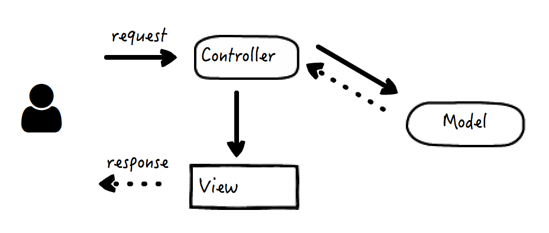

# 编译原理之美

# 第一章  网络协议和WEB接口

- [01 | 网络互联的昨天、今天和明天：HTTP 协议的演化](#chapter1)
- [02 | 为HTTP穿上盔甲：HTTPS](#chapter2)
- [03 | 换个角度解决问题：服务端推送技术](#chapter3)
- [04 | 工整与自由的风格之争：SOAP和REST](#chapter4)
- [05 | 权衡的艺术：漫谈Web API的设计](#chapter5)
- [07 | 解耦是永恒的主题：MVC框架的发展](#chapter7)
- [08 | MVC架构解析：模型（Model）篇](#chapter8)
- [09 | MVC架构解析：视图（View）篇](#chapter9)
- [10 | MVC架构解析：控制器（Controller）篇](#chapter10)
- [11 | 剑走偏锋：面向切面编程](#chapter11)
- [12 | 唯有套路得人心：谈谈Java EE的那些模式](#chapter12)
- [14 | 别有洞天：从后端到前端](#chapter14)
- [14 | 别有洞天：从后端到前端](#chapter14)
- [14 | 别有洞天：从后端到前端](#chapter14)
- [14 | 别有洞天：从后端到前端](#chapter14)
- [14 | 别有洞天：从后端到前端](#chapter14)
- [14 | 别有洞天：从后端到前端](#chapter14)

<h1 id="chapter1">01 | 网络互联的昨天、今天和明天：HTTP 协议的演化</h1>

## HTTP/1.0

HTTP 1.0 版本就稳定而成熟了，也是如今浏览器广泛支持的最低版本 HTTP 协议。引入了返回码，引入了 header，引入了多字符集，也终于支持多行请求了。

当然，它的问题也还有很多，支持的特性也远没有后来的 1.1 版本多样。比如，方法只支持 GET、HEAD、POST 这几个。但是，麻雀虽小五脏俱全，这是第一个具备广泛实际应用价值的协议版本。

懂一点特定的协议，使用简单的命令行和文本编辑工具，我们就已经可以做很多事情了。比如改变 UA 头的办法，可以模拟不同的浏览器，就是用来分析浏览器适配（指根据不同浏览器的兼容性返回不同的页面数据）的常用方法。

## HTTP/1.1

在 HTTP 1.0 版本时，每一组请求和响应的交互，都要完成一次 TCP 的连接和关闭操作，这在曾经的互联网资源比较贫瘠的时候并没有暴露出多大的问题，但随着互联网的迅速发展，这种通讯模式显然过于低效了。

于是这个问题的解决方案——HTTP 的长连接，就自然而然地出现了，它指的是打开一次 TCP 连接，可以被连续几次报文传输重用，这样一来，我们就不需要给每次请求和响应都创建专门的连接了：


可以看到，**通过建立长连接，中间的几次 TCP 连接开始和结束的握手都省掉了。**

在长连接开启的情况下，使用 Content-Length 还是 chunked 头，必须具备其中一种。**分块传输编码大大地提高了 HTTP 交互的灵活性，**服务端可以在还不知道最终将传递多少数据的时候，就可以一块一块将数据传回来。

事实上 HTTP/1.1 还增加了很多其它的特性，比如更全面的方法，以及更全面的返回码，对指定客户端缓存策略的支持，对 content negotiation 的支持（即通过客户端请求的以 Accept 开头的头部来告知服务端它能接受的内容类型），等等。

## HTTP/2

现在最广泛使用的 HTTP 协议还是 1.1 ，但是 HTTP/2 已经提出，在保持兼容性的基础上，包含了这样几个重要改进：

- 设计了一种机制，允许客户端来选择使用的 HTTP 版本，这个机制被命名为 ALPN；

- HTTP 头的压缩，在 HTTP/2 以前，HTTP 正文支持多种方式的压缩，但是 HTTP 头部却不能；

- 多路复用，允许客户端同时在一个连接中同时传输多组请求响应的方法；

- 服务端的 push 机制，比方说客户端去获取一个网页的时候，下载网页，分析网页内容，得知还需要一个 js 文件和一个 css 文件，于是再分别下载，而服务端的 push 机制可以提前就把这些资源推送到客户端，而不需要客户端来索取，从而节约网页加载总时间。

最后，我想说的是，**HTTP 协议的进化史，恰恰是互联网进化史的一个绝佳缩影，**从中你可以看到互联网发展的数个特质。比方说，长连接和分块传输很大程度上增强了 HTTP 交互模型上的灵活性，使得 B/S 架构下的消息即时推送成为可能。

## 注意：

1. http1.1长连接和2.0多路复用的区别
2. 抓包中除了HTTP请求和响应报文之外，是TCP报文。

<h1 id="chapter2">02 | 为HTTP穿上盔甲：HTTPS</h1>

## HTTP，SSL/TLS 和 HTTPS

在一开始的时候，HTTP 的设计者并没有把专门的加密安全传输放进协议设计里面。因此单独使用 HTTP 进行明文的数据传输，一定存在着许多的安全问题。比方说，现在有一份数据需要使用 HTTP 协议从客户端 A 发送到服务端 B，而第三方 C 尝试来做点坏事，于是就可能产生如下四大类安全问题：

- Interception：拦截。传输的消息可以被中间人 C 截获，并泄露数据。

- Spoofing：伪装。A 和 B 都可能被 C 冒名顶替，因此消息传输变成了 C 发送到 B，或者 A 发送到 C。

- Falsification：篡改。C 改写了传输的消息，因此 B 收到了一条被篡改的消息而不知情。

- Repudiation：否认。这一类没有 C 什么事，而是由于 A 或 B 不安好心。A 把消息成功发送了，但之后 A 否认这件事发生过；或者 B 其实收到了消息，但是否认他收到过。

但是，与其重新设计一套安全传输方案，倒不如发挥一点拿来主义的精神，把已有的和成熟的安全协议直接拿过来套用，最好它位于呈现层（Presentation Layer），因此正好加塞在 HTTP 所在的应用层（Application Layer）下面，**这样这个过程对于 HTTP 本身透明，也不影响原本 HTTP 以下的协议（例如 TCP）**。

这个协议就是 SSL/TLS，它使得上面四大问题中，和传输本身密切相关的前三大问题都可以得到解决（第四个问题还需要引入数字签名来解决）。于是，HTTP 摇身一变成了 HTTPS：

> HTTP + SSL/TLS = HTTPS

SSL 指的是 Secure Socket Layer，而 TLS 指的是 Transport Layer Security，事实上，一开始只有 SSL，但是在 3.0 版本之后，SSL 被标准化并通过 RFC 2246 以 SSL 为基础建立了 TLS 的第一个版本，因此可以简单地认为 SSL 和 TLS 是具备父子衍生关系的同一类安全协议。

## 动手捕获 TLS 报文

命令行执行抓包命令，指明要抓 https://www.google.com 的包（当然，你也可以使用其他 HTTPS 网站地址），注意 HTTPS 的默认端口是 443（-i 指定的 interface 可能因为不同的操作系统有所区别，在我的 Mac 上是 en0）

```java
sudo tcpdump -i en0 -v 'host www.google.com and port 443' -w https.cap
```

再新建一个命令行窗口，使用 curl 命令来访问 Google 主页：

```java
curl https://www.google.com
```

于是在看到类似如下抓包后 CTRL + C 停止：

```java
tcpdump: listening on en0, link-type EN10MB (Ethernet), capture size 262144 bytes
^C49 packets captured
719 packets received by filter
0 packets dropped by kernel
```

接着使用 Wireshark 打开刚才抓的 https.cap，在 filter 中输入 tls，得到如下请求和响应报文：


可以看到，这里有五个重要的握手消息，在它们之后的所有消息都是用于承载实际数据的“Application Data”了。握手的过程略复杂，接下来我会尽可能用通俗的语言把最主要的流程讲清楚。

## 对称性和非对称性加密

对称性加密（Symmetric Cryptography），指的是加密和解密使用相同的密钥。这种方式相对简单，加密解密速度快，但是由于加密和解密需要使用相同的密钥，如何安全地传递密钥，往往成为一个难题。

非对称性加密（Asymmetric Cryptography），指的是数据加密和解密需要使用不同的密钥。通常一个被称为公钥（Public Key），另一个被称为私钥（Private Key），二者一般同时生成，但是**公钥往往可以公开和传播，而私钥不能。经过公钥加密的数据，需要用私钥才能解密；**反之亦然。这种方法较为复杂，且性能较差，好处就是由于加密和解密的密钥具有相对独立性，公钥可以放心地传播出去，不用担心安全性问题

> 原始数据 + 公钥 → 加密数据
> 加密数据 + 私钥 → 原始数据

## TLS 连接建立原理


**Step 1: Client Hello.** 客户端很有礼貌，先向服务端打了个招呼，并携带以下信息：

- 客户端产生的随机数 A；

- 客户端支持的加密方法列表。

**Step 2: Server Hello.**服务端也很有礼貌，向客户端回了个招呼：

- 服务端产生的随机数 B；

- 服务端根据客户端的支持情况确定出的加密方法组合（Cipher Suite）。

**Step 3: Certificate, Server Key Exchange, Server Hello Done.** 服务端在招呼之后也紧跟着告知：

- Certificate，证书信息，证书包含了服务端生成的公钥。

客户端收到消息后，验证确认证书真实有效，那么这个证书里面的公钥也就是可信的了.

接着客户端再生成一个随机数 C（Pre-master Secret），于是现在共有随机数 A、B 和 C，根据约好的加密方法组合，三者可生成新的密钥 X（Master Secret），而由 X 可继续生成真正用于后续数据进行加密和解密的对称密钥。因为它是在本次 TLS 会话中生成的，所以也被称为会话密钥（Session Secret）。简言之：

> 客户端随机数 A + 服务端随机数 B + 客户端 Pre-master Secret C → 会话密钥

需要注意的是，实际这个 Pre-master Secret 的生成方法不是固定的，而会根据加密的具体算法不同而不同：

- 上述我介绍的是传统 RSA 方式，即 Pre-master Secret 由客户端独立生成，加密后再通过 Client Key Exchange 发回服务端。

- 还有一种是 ECDHE 方式，这种方式下无论在客户端还是服务端，Pre-master Secret 需要通过 Client Key Exchange 和 Server Key Exchange 两者承载的参数联合生成。

**Step 4: Client Key Exchange, Change Cipher Spec, Encrypted Handshake Message.** 接着客户端告诉服务端：

- Client Key Exchange，本质上它就是上面说的这个 C，但使用了服务端通过证书发来的公钥加密；

- Change Cipher Spec，客户端同意正式启用约好的加密方法和密钥了，后面的数据传输全部都使用密钥 X 来加密；

- Encrypted Handshake Message，快速验证：这是客户端对于整个对话进行摘要并加密得到的串，如果经过服务端解密，和原串相等，就证明整个握手过程是成功的。

服务端收到消息后，用自己私钥解密上面的 Client Key Exchange，得到了 C，这样它和客户端一样，也得到了 A、B 和 C，继而到 X，以及最终的会话密钥。

于是，客户端和服务端都得到了能够加密解密传输数据的对称密钥——会话密钥。

因此，我们可以看到：**TLS 是通过非对称加密技术来保证握手过程中的可靠性（公钥加密，私钥解密），再通过对称加密技术来保证数据传输过程中的可靠性的。**

这种通过较严格、较复杂的方式建立起消息交换渠道，再通过相对简单且性能更高的方式来实际完成主体的数据传输，并且前者具有长效性（即公钥和私钥相对稳定），后者具有一过性（密钥是临时生成的），这样的模式，我们还将在全栈的知识体系中，继续见到。

**Step 5: Change Cipher Spec, Encrypted Handshake Message.** 服务端最后也告知客户端

- Change Cipher Spec，服务端也同意要正式启用约好的加密方法和密钥，后面的数据传输全部都使用 X 来加密。

- Encrypted Handshake Message，快速验证：这是服务端对于整个对话进行摘要并加密得到的串，如果经过客户端解密，和原串相等，就证明整个握手过程是成功的。

<h1 id="chapter3">03 | 换个角度解决问题：服务端推送技术</h1>

## Pull 模型的问题

先来看两个容易弄混的概念：Pull 和 Poll。

“Pull”指的是去主动发起行为获取消息，一般在客户端 / 服务器（C/S，Client/Server）或浏览器 / 服务器（B/S，Browser/Server）交互中，客户端或浏览器主动发起的网络请求数据的行为

而“Poll”，尽管在某些场景下也和 Pull 通用了，但在计算机网络的领域里，通常把它解释为“轮询”，或者“周期性查询”，在 Pull 的基础上增加了“周期性”的概念，这也是它和 Pull 相比最本质的区别。

相应地，和 Pull 行为相对的，从服务端主动发起，发送数据到客户端的行为叫做“Push”。Push 相比 Pull 而言，具备这样两个明显的优势：

- **高效性。**如果没有更新发生，就不会有任何更新消息推送的动作，即每次消息推送都发生在确确实实的更新事件之后，都是有意义的，不会出现请求和响应的资源浪费

- **实时性。**事件发生后的第一时间即可触发通知操作，理论上不存在任何可能导致通知延迟的硬伤。

可是，有趣的是，事实上 Pull 的应用却远比 Push 更广泛，特别是在分布式系统中。这里有多个原因，其中很重要的一条是：

服务端不需要维护客户端的列表，不需要知晓客户端的情况，不需要了解客户端查询的策略。**这有助于把服务端从对客户端繁重的管理工作中解放出来，而成为无状态的简单服务，变得具备幂等性（idempotent，指执行多次和执行一次的结果一样），更容易横向扩展。**

尤其在分布式系统中，状态经常成为毒药，有了状态，就不得不考虑状态的保存、丢失、一致性等问题，因此这种无状态往往可以很大程度地简化系统的设计。

## 服务端推送技术

有了这些基础知识，我们就可以来谈谈实际的服务端推送技术了，这些都从一定程度上解决了 HTTP 传统方式 Pull 的弊端。

## 1. Comet

严格说，Comet 是一种 Web 应用客户端和服务端交互的模型，它有几种服务端推送的具体实现，但是，它们的大致原理是一样的：**客户端发送一个普通的 HTTP 请求到服务端以后，服务端不像以往一样在处理后立即返回数据，而是保持住连接不释放，每当有更新事件发生，就使用分块传输的方式返回数据。**

若干次数据返回以后可以完成此次请求响应过程（分块传输返回长度为 0 的块，表示传输结束），等待客户端下一次请求发送。这种过程看起来也属于轮询，但是每个周期可包含多次服务端数据返回，因而也被形象地称为“长轮询”（Long Polling）。

在服务端推送技术中，Comet 最大的好处是，它 100% 由 HTTP 协议实现，当然，分块传输要求 HTTP 至少是 1.1 版本。但也正因为这点，它也存在一些弊端，比如，客户端必须在服务端结束当次传输后才能向服务端发送消息；HTTP 协议限制了它在每次请求和响应中必须携带完整的头部，这在一定程度上也造成了浪费（这种为了传输实际数据而使用的额外开销叫做 overhead）。

下面我给出了一个 Comet 实现的示例图。浏览器在发出 1 号请求要求数据，连接保持，接着陆续收到几个不同大小的响应数据，并且最后一个大小为 0，浏览器被告知此次传输完成。过了一会儿，浏览器又发出 2 号请求，开始第二轮的类似交互。


在 Comet 方式下，**看起来服务端有了推送行为，其实只是对于客户端请求有条件、讲时机的多次返回**，因此我们把它称为服务端“假 Push”

## 2. WebSocket

HTML 5 规范定义了 WebSocket 协议，它可以通过 HTTP 的端口（或者 HTTPS 的端口）来完成，从而最大程度上对 HTTP 协议通透的防火墙保持友好。但是，**它是真正的双向、全双工协议，也就是说，客户端和服务端都可以主动发起请求，回复响应，而且两边的传输都互相独立。**

和上文的 Comet 不同，WebSocket 的服务端推送是完全可以由服务端独立、主动发起的，因此它是服务端的“真 Push”。

WebSocket 是一个可谓“科班出身”的二进制协议，也没有那么大的头部开销，因此它的传输效率更高。同时，和 HTTP 不一样的是，它是一个带有状态的协议，双方可以约定好一些状态，而不用在传输的过程中带来带去。而且，WebSocket 相比于 HTTP，它没有同源的限制，服务端的地址可以完全和源页面地址无关，即不会出现臭名昭著的浏览器“跨域问题”。

另外，它和我们之前学习的加密传输也丝毫不冲突，由于它在网络分层模型中位于 TLS 上方，因此他可以使用和 HTTP 一样的加密方式传输：

> HTTP → WS
> HTTPS → WSS

最后，最有意思的事情在于，和我们之前的认识不同，WebSocket 是使用 HTTP 协议“升级”的方法来帮助建立连接的，下面我们动手来试一试。

首先，我们需要找到一个可以支持 WebSocket 测试的网站，比如 websocket.org，然后我们将使用 Chrome 的网络工具来捕获和显示通过浏览器发送和接收的消息。

使用 Chrome 打开 Echo Test 页面，在这里你可以发送建立一个 WebSocket 连接。但是别急，我们先打开 Chrome 的开发者工具，并选中 Network 标签，接着点击左上角的清除按钮，把已有页面加载的网络消息清除掉，以获得一个清爽的网络报文监视界面


接着，确保页面上建立 WebSocket 连接的对端地址和传递的信息都已经填写，比如：

```java
Location:
wss://echo.websocket.org
Message:
Rock it with HTML5 WebSocket
```

于是就可以点击“Connect”按钮了，旁边的日志框将出现“CONNECTED”字样，同时，Chrome 开发者工具将捕获这样的请求（如果在开发者工具中网络监视界面上，选中消息的消息头处于“parsed”展示模式，你需要点击 Request Headers 右侧的 “view source” 链接来查看原始消息头）：

```java
GET wss://echo.websocket.org/?encoding=text HTTP/1.1
Host: echo.websocket.org
Origin: https://www.websocket.org
Connection: Upgrade
Upgrade: websocket
Sec-WebSocket-Version: 13
Sec-WebSocket-Key: xxx
... (省略其它 HTTP 头)
```

好，你可以看到，这是一个普普通通的 HTTP GET 请求，但是 URL 是以加密连接“wss”开头的，并且有几个特殊的 HTTP 头：Origin 指出了请求是从哪个页面发起的，Connection: Upgrade 和 Upgrade: websocket 这两个表示客户端要求升级 HTTP 协议为 WebSocket。

好，再来看响应，消息的头部为：

```java
HTTP/1.1 101 Web Socket Protocol Handshake
Connection: Upgrade
Sec-WebSocket-Accept: xxx
Upgrade: websocket
... (省略其它 HTTP 头)
```

嗯，返回码是 101，描述是“Web Socket Protocol Handshake”，并且，它确认了连接升级为“websocket”的事实。

## 3. 更多推送技术

到这里，我已经介绍了几种服务端的推送技术，事实上还有更多，但是，**如果你依次了解以后认真思考，就会发现，这些原理居然都在某种程度上和我介绍的 Comet 和 WebSocket 这两种类似，有的甚至来自于它们。**

这些技术包括:

- SSE，即 Server-Sent Events，又叫 EventSource，是一种已被写入 HTML 5 标准的服务端事件推送技术，它允许客户端和服务端之间建立一个单向通道，以让服务端向客户端单方向持续推送事件消息；

- 为了提高性能，HTTP/2 规范中新添加的服务端推送机制，我们在 [第 01 讲] 中提到过，并在该讲的扩展阅读中有它的原理介绍；

- WebRTC，即 Web Real-Time Communication，它是一个支持网页进行视频、语音通信的协议标准，不久前已被加入 W3C 标准，最新的 Chrome 和 Firefox 等主流浏览器都支持；

- 还有一些利用浏览器插件和扩展达成的服务端推送技术，比如使用 Flash 的 XMLSocket，比如使用 Java 的 Applet，但这些随着 HTML 5 的普及，正慢慢被淘汰。

<h1 id="chapter4">04 | 工整与自由的风格之争：SOAP和REST</h1>

SOAP，Simple Object Access Protocol，即简单对象访问协议，定义了数据对象传输的格式，以便在网络的节点之间交换信息。你可能会问，HTTP 不就是干这事的吗？其实，它们都在 OSI 7 层模型的应用层上，但却互不冲突，SOAP 并不依赖于 HTTP 而存在，而且它们可以互相配合。

HTTP 负责信息的传输，比如传递文本数据，关心的是消息的送达，但却不关心这个数据代表着什么。这个数据可能本来是一个内存里的对象，是一篇文章，或者是一张图片。但是 SOAP 恰恰相反，它关心的就是怎样把这个数据给序列化成 XML 格式的文本，在传输到对端以后，再还原回来。

用一个形象的比喻就是，**消息传输就像快递，HTTP 主要关心的是信封，而 SOAP 主要关心的是信封里的物件。**今天我们讨论的 SOAP，不仅仅是协议本身，更主要的是它的风格。

REST，Representational State Transfer，即表现层状态转换，指的是一种为了信息能在互联网上顺利传递而设计的软件架构风格。对，请注意，**SOAP 是协议，但 REST 是风格，而非协议或标准**，至于 HTTP，它是 REST 风格的重要载体。重要，但不是唯一，因为载体并不只有 HTTP 一个，比如还有 HTML 和 XML，它们恰当地互相配合，组合在一起，来贯彻和体现 REST 的风格。

SOAP 和 REST，由于概念层次上的不同，其实原本是无法放到一起比较的，但是当我们旨在风格层面上讨论 SOAP 和 REST 的时候，这件事却变得可行而有趣了。

现在让我们用一个实际例子来进一步认识它们。这个例子很常见，假设我们要设计一个图书馆，馆中的书可以增删改查（CRUD），特别是要添加一本书的时候，我们分别来看看，应用 SOAP 该怎么做，应用 REST 又该怎么做。

## SOAP

这是一个最简单的给图书馆添加一本书的 XML 消息体：

```xml
<?xml version="1.0" encoding="UTF-8"?>
<soap:Envelope
 xmlns:soap="https://www.w3.org/2003/05/soap-envelope/"
 soap:encodingStyle="https://www.w3.org/2003/05/soap-encoding">
  <soap:Body xmlns:b="...">
    <b:CreateBook>
      <b:Name>...</m:Name>
      <b:Author>...</m:Author>
      ...
    </b:CreateBook>
  </soap:Body>
</soap:Envelope>
```

简单解释一下：

1. 第一行指明了这个消息本身格式是 XML，包括它的版本号和编码格式。

2. 这里的很多标签都带有“soap:”的前缀，其实，这里的“soap”就是 XML 的命名空间（其中“xmlns”就是指“xml namespace”），并且通过 XML schema 的方式预先定义好了如下两个 SOAP 消息必须要遵从的规则：

- 一个是代码片段第 3 行的 soap-envelope，它定义了基本的语法规则，比如标签的从属关系，比如同级某标签的个数限制等等，举例来说，你可以看到例子中有一个 Body 标签位于 Envelope 内部，这就是它定义的；

- 另一个是代码片段第 4 行的 soap-encoding，它定义了编码和数据类型等规则

3. 在 Body 标签内部，有一个 CreateBook 标签，这是我们的业务标签，命名空间 b 也是我们自己定义的。通过在内部封装姓名（Name）和作者（Author）等书本信息，实现了在图书馆中添加书本的需求。

上面是一个最简单的例子，实际在 Envelope 中还可以添加 Head 标签，用于存放头部信息，在 Body 中可以添加 Fault 标签，用于存放错误信息。关于这些，都在 XML schema 中做了严格的定义，通过它可以帮助验证一个 XML 是否符合格式，从而可以在最短的时间内验证并发现消息中的格式问题。

SOAP 通常是通过 HTTP POST 的方式发送到对端的，这个图书馆对书本的增删改查操作，URL 可以是同一个，这是因为 SOAP 消息的具体内容写明了具体要干什么（上述的 CreateBook 标签）。比如下面这个例子，请注意其中的 Content-Type，它是令响应具备自我描述特性的重要组成部分：

```java
POST /books HTTP/1.1
Host: xxx
Content-Type: application/soap+xml; charset=utf-8
Content-Length: xxx

... (省略前述的 SOAP 消息体)
```

最后，谈谈经常和 SOAP 放在一起谈论的 WSDL，Web Service Description Language。

WSDL 用于描述一个 Web Service，说白了，就是用来说明某个 Web 服务该怎样使用，有怎样的接口方法，支持怎样的参数，会有怎样的返回。由于支持 SOAP 的服务端接口是经常使用 WSDL 来描述，因此我们才看到它们总被放在一起讨论，于是在这种情况下，**WSDL 常常被形容成 SOAP 服务的使用说明书**，但是请注意，本质上它们之间不存在依赖关系。

**这种将服务和服务的描述解耦开设计的方式非常普遍**，希望你可以去类比和联想。在软件的世界里，我们经常谈论这个“描述”的行为，以及描述者和被描述者。比如元属性描述数据，方法签名描述方法，类描述对象等等。

## REST

现在，我们再来看 REST 的做法。**REST 的核心要素包括资源、表现层和状态转换这三个部分**。我们把前面客户端发送请求的过程使用 REST 风格再来实现一遍，你将看到这三个要点是怎样体现出来的：

### 1. 协议

我们将使用 HTTP 协议，在加密的情况下，协议是 HTTPS，但这对我们的实现来说没有什么区别。

### 2. URL

通常来说，这个 URL 要包括域名、版本号以及实体名称，而这个 URL 整体，代表了 REST 中的一类或一项“资源”。比如说：

```
https://xxx/v1/books
```

请注意其中的实体名称，它往往是一个单纯的名词，并且以复数形式出现

这里提到了 URL，我想给经常混用的 URL、URI 做个简要的说明：URL 指的是 Uniform Resource Locator，URI 指的是 Uniform Resource Identifier，前者是统一资源定位符，后者是统一资源标识符。**Identifier 可以有多种形式，而 locator 只是其中一种，因此 URI 更宽泛，URL 只是 URI 的其中一种形式。**

当我们提到一个完整的地址，例如 https://www.google.com， 它就是 URL，因为它可以被“定位”，它当然也是 URI；但是如果我们只提到上面地址的一个片段，例如 www.google.com，那么由于缺少了具体协议，我们无法完成完整的定位，因此这样的东西只能被叫做一个标识符，故而只能算 URI，而非 URL。

### 3. 方法

HTTP 的方法反映了这个接口上将执行的行为，如果用自然语言描述，它将是一个动词。比如说，给图书馆添加一本图书，那么这个行为将是“添加”。在以 REST 风格主导的设计中，我们将使用这样的 HTTP 方法来代表增删改查（CRUD）的不同动作：


重点解释下表格的最后两列：

- **幂等性指的是对服务端的数据状态，执行多次操作是否和执行一次产生的结果一样。**从表格中你可以看到，创建资源单位不是幂等的，执行多次就意味着创建了多个资源单位，而其它操作都是幂等的。通常来说，**幂等操作是可以被重试而不产生副作用的。**

- **安全性指的是该操作是否对服务端的数据状态产生了影响。**从表格中可以看到，获取资源的操作是安全的，不会对资源数据产生影响，但是其它操作都是不安全的。一定条件下，**安全操作是可以被缓存的**，而不安全的操作，必定对服务端的状态产生了影响，这体现了 REST 的“状态转换”这一要素。

全栈系统的设计和优化都需要紧密围绕幂等性和安全性进行，这是两个非常重要的概念，在我们后续的学习中，你还会反复见到它们，并和它们打交道。

你看，通过这样的办法，就把 HTTP 的方法和实际对资源的操作行为绑定起来了。当然，还有一些其它方法，比较常见的有：

- PATCH：和 PUT 类似，也用于资源更新，但支持的是资源单位的部分更新，并且在资源不存在的时候，能够自动创建资源，这个方法实际使用比较少。

- HEAD：这个方法只返回资源的头部，避免了资源本身获取和传输的开销。这种方法很有用，经常用来检查资源是否存在，以及有无修改。

- OPTIONS：这个方法常用来返回服务器对于指定资源所支持的方法列表。

### 4. 正文

POST 和 PUT 请求都是有 HTTP 正文的，正文的类型和 Content-Type 的选取有关，比如 JSON 就是最典型的一种格式。请不要轻视这里的 Content-Type，从本质上说，它代表了资源的表现形式，从而体现了 REST 定义中的“表现层”这一要素。

最后，回到我们实际的图书馆添加图书的问题。SOAP 添加一本书的消息，用 REST 风格的 POST 请求实现就会变成这样：

```json
POST /v1/books HTTP/1.1
HOST: ...
Content-Type: application/json

{
  "name": "...",
  "author": "...",
  ...
}
```

## 风格之争

看到这儿，你应该已经感受到了，SOAP 和 REST 代表了两种迥异的风格。在我们取舍技术的时候，如果没有给出具体场景和限制，我们往往是很难讲出谁更“好”，而是需要进行比较，权衡利弊的。

SOAP 明显是更“成熟”的那一个。它在数据传输的协议层面做了更多的工作，藉由 XML schema，它具备更严格的检查和校验，配合 WSDL，在真正发送请求前，几乎就对所有远程接口事无巨细的问题有了答案。但是，它的复杂度令人望而生畏，也是它最受人诟病的地方。

REST 则相反，新接口的学习成本很低，只需要知道资源名称，根据我们熟知的规约，就可以创建出 CRUD 的请求来。但是直到真正发送请求去测试为止，并没有办法百分百确定远程接口的调用是否能工作，或者说，并不知道接口定义上是否有不规范、不合常规的坑在里面。

对于互联网来说，SOAP 已经是一项“古老”的技术了，晚辈 REST 似乎更切合互联网的潮流。在大多数情况下，REST 要易用和流行得多，于是很多人都不喜欢繁琐的 SOAP 协议。**技术的发展总是有这样的规律，一开始无论问题还是办法都很简单，可是随着需求的进一步增加，解决的方法也缓慢演化，如 SOAP 一般强大而复杂，直到某一天突然掉到谷底，如 REST 一般返璞归真。**

但是别忘了，有利必有弊。首先，正是因为 REST 只是一个缺乏限制的风格，而非一个严谨的规范，有太多不明确、不一致的实现导致的问题，这些问题轻者给接口调用者带来困惑，重者导致接口调用错误，甚至服务端数据错误。

其次，REST 通过 HTTP 方法实现本身，也受到了 HTTP 方法的局限性制约。比如最常见的 GET 请求，有时需要一个复杂的查询条件集合，因此参数需要结构化，而 GET 只支持一串键值对组合的参数传递，无法适应业务需要。对于这样的问题，有一些 workaround，比如使用 POST 消息体来传递查询条件的结构体，但那已经偏离了 REST 的最佳实践，丢失了 GET 本身的优势，也带来了实现不一致等一系列问题。

最后，REST 还存在的一个更本质的问题，资源是它的核心概念，这原本带来了抽象和简洁的优势，但如今也成为了它的桎梏。或者说，前面反复提到的增删改查是它最拿手的本事，可是互联网的需求是千变万化的，远不只有简单的增删改查。有时需要一个复杂的多步操作，有时则需要一个异步事务（需要回调或者二次查询等等方式来实现），这些都没有一个完美统一的 REST 风格的解决方案。即便实现出来了，也可谓五花八门，同时失去了以往我们所熟知的 REST 的简洁优势。

**互联网总在变复杂，但矛盾的是，人们却希望互联网上的交互会不断变简单。**于是这引发了 REST 的流行，可即便 REST 再流行，依旧有它不适合的场景；SOAP 虽古老，依然有它的用武之地。

对于全栈工程师或者期待修炼全栈技能的你我来说，trade-off 是永恒的话题。另外，除了 SOAP 和 REST，其实我们还有其它选择。我将在下一讲，结合实例具体介绍如何选择技术，并设计和实现远程接口。

<h1 id="chapter5">05 | 权衡的艺术：漫谈Web API的设计</h1>

今天，我们该根据之前所学，来谈谈具体怎样设计 Web API 接口了。我们围绕的核心，是“权衡”（trade-off）这两个字，事实上，它不只是 Web API 接口设计的核心，还是软件绝大多数设计问题的核心。

## 概念

在一切开始之前，我们先来明确概念。什么是 Web API？

你应该很熟悉 API，即 Application Programming Interface，应用程序的接口。它指的就是一组约定，不同系统之间的沟通必须遵循的协议。使用者知道了 API，就知道该怎样和它沟通，使用它的功能，而不关心它是怎么实现的。

Web API 指的依然是应用程序接口，只不过它现在暴露在了 Web 的环境里。并且，我们通常意义上讲 Web API 的时候，无论是在 B/S（浏览器 / 服务器）模型还是 C/S（客户端 / 服务器）模型下，往往都心照不宣地默认它在服务端，并被动地接受请求消息，返回响应。

通常一个 Web API 需要包括哪些内容呢？

回答这个问题前，让我们先闭上眼想一想，如果没有“Web”这个修饰词，普通的 API 要包括哪些内容呢？嗯，功能、性能、入参、返回值……它们都对，看起来几乎是所有普通 API 的特性，在 Web API 中也全都存在。而且，因为 Web 的特性，它还具备我们谈论普通 API 时不太涉及的内容：

- 比如承载协议。这里可以有多个协议，因为协议是分层的。HTTP 协议和 TCP 协议就是并存的。

- 再比如请求和响应格式。Web API 将普通 API 的方法调用变成了网络通信，因此参数的传入变成了请求传入，结果返回变成了响应传出。

正是有了 Web API，网络中的不同应用才能互相协作，分布式系统才能正常工作，互联网才能如此蓬勃发展。而我们，不能只停留在“知道”的层面，还要去深入了解它们。

## Web API 的设计步骤

### 第一步：明确核心问题，确定问题域

和普通的 API 设计、程序的库设计一样，Web API 并不是东打一枪，西打一炮的。想想写代码的时候，我们还要让同类型的方法，以某种方式组织在类和对象中，实现功能上的内聚呢，一个类还要遵循单一职责的原则呢。

因此，一组 Web API，就是要专注于一类问题，核心问题必须是最重要的一个。

在上一讲中我举了个图书管理系统的例子，那么可以想象，图书的增删改查 API 就可以放到一起，而如果有一个新的 API 用于查询图书馆内部员工的信息，那么它显然应该单独归纳到另外的类别中，甚至是另外的系统中。

### 第二步：结合实际需求和限制，选择承载技术

这里有两件事情需要你考虑，一个是需求，一个是限制。我们虽然经常这样分开说，但严格来说，限制也是需求的一种。比方说，如果对网络传输的效率要求很高，时延要求很短，这就是需求，而且是非功能性的需求。

大多数功能性的需求大家都能意识到，但是一些非功能性的需求，或者一些“限制”就容易被忽略了。比如说，向前的兼容性，不同版本同时运行，鉴权和访问控制，库依赖限制，易测试性和可维护性，平滑发布（如新老接口并行），等等。

再来说说承载技术。承载技术指的是实现接口，以及它的请求响应传输所需要使用到的技术集合，比如 HTTP + JSON。我们前面提到的要求网络传输效率高、时延短，Protobuf 就是一个值得考察的技术；但有时候，我们更需要消息直观、易读，那么显然 Protobuf 就不是一个适合的技术。这里我们通过分析技术优劣来做选择，这就是权衡。

虽说 Web API 主要的工作在服务端，但在技术分析时还需要考虑客户端。特别是一些技术要求自动生成客户端，而有些技术则允许通过一定方式“定制”客户端（例如使用 DSL，Domain Specific Language，领域特定语言）。

### 第三步：确定接口风格

技术的选择将很大程度地影响接口的风格

角度一：易用性和通用性的平衡，或者说是设计“人本接口”还是“最简接口”。

比如一个图书管理的接口，一种设计是让其返回“流行书籍”，实际的规则是根据出版日期、借阅人数、引进数量等等做了复杂的查询而得出；而另一种设计则是让用户来自行决定和传入这几个参数，服务端不理解业务含义，接口本身保持通用。

**前者偏向“易用”，更接近人的思维；后者偏向“通用”，提供了最简化的接口。**虽说多数情况下我们还是会见到后者多一些，但二者却不能说谁对谁错，它们实际代表了不同的风格，各有优劣。

角度二：接口粒度的划分。

比如用户还书的过程包括：还书排队登记、检查书本状况、图书入库，这一系列过程是设计成一个大的接口一并完成，还是设计成三个单独的接口分别调用完成？

其实，这二者各有优劣。**设计成大接口往往可以增加易用性，便于内部优化提高性能（而且只需调用一次）；设计成小接口可以增加可重用性，便于功能的组合。**

### 第四步：定义具体接口形式

在上面这三步通用和共性的步骤完成之后，我们就可以正式跳进具体的接口定义中，去确定 URL、参数、返回和异常等通用而具体的形式了。还记得上一讲中对 REST 请求发送要点的分解吗？在它的基础上，我们将继续以 REST 风格为例，进行更深刻的讨论。

1. 条件查询

我们在上一讲的例子中使用 HTTP GET 请求从图书馆获取书本信息，从而完成增删改查中的“查”操作：

```
/books/123
/books/123/price
```

分别查询了 ID 为 123 的图书的全部属性，和该图书的价格信息。

但是，实际的查所包含的内容可远比这个例子多，比如不是通过 ID 查询，而是通过条件查询：

```
/books?author=Smith&page=2&pageSize=10&sortBy=name&order=desc
```

你看条件查询书籍，查询条件通过参数传入，指定了作者，要求显示第二页，每页大小为 10 条记录，按照书名降序排列。

除了使用 Query String（问号后的参数）来传递查询条件，多级路径也是一种常见的设计，这种设计让条件的层级关系更清晰。比如：

```
/category/456/books?author=Smith
```

它表示查询图书分类为“艺术”（编号为 456）的图书，并且作者是 Smith。看到这里，你可能会产生这样两个疑问。

疑问一：使用 ID 多不直观啊，我们能使用具体名称吗？

当然可以！**可以使用具备业务意义的字段来代替没有可读性的 ID，但是这个字段不可重复，也不宜过长**，比如例子中的 category 就可以使用名称，而图书，则可以使用国际标准书号 ISBN。于是 URI 就变成了：

```
/category/Arts/books?author=Smith
```

疑问二：category 可以通过 Query String 传入吗？比如下面这样：

```
/books?author=Smith&category=Arts
```

当然可以！“category”可以放置在路径中，也可以放置在查询参数串中。**这是 REST 设计中的一个关于设计上合理冗余的典型例子，可以通过不同的方式来完成相同的查询。**如果你学过 Perl，你可能听过“There’s more than one way to do it”这样的俗语，这是一样的道理，也是 REST 风格的一部分。

当然，从这也可以看出上一讲我们提到过的，REST 在统一性、一致性方面的约束力较弱。

2. 消息正文封装

有时候我们还需要传递消息正文，比如当我们使用 POST 请求创建对象，和使用 PUT 请求修改对象的时候，我们可以选择使用一种技术来封装它，例如 JSON 和 XML。通常来说，既然我们选择了 REST 风格，我们在相关技术的选择上也可以继续保持简约的一致性，因此 JSON 是更为常见的那一个。

```json
{
  "name": "...",
  "category": "Arts",
  "authorId": 999,
  "price": {
    "currency": "CNY",
    "value": 12.99
  },
  "ISBN": "...",
  "quantity": 100,
  ...
}
```

上面的消息体内容就反映了一本书的属性，但是，在设置属性的时候，往往牵涉到对象关联，上面这个小小的例子就包含了其中三种典型的方式：

- 传递唯一业务字段：例如上面的 category 取值是具备实际业务意义的“Arts”；

- 传递唯一 id：例如上面的 authorId，请注意，这里不能传递实际作者名，因为作者可能会重名；

- 传递关联对象：例如上面的 price，这个对象通常可以是一个不完整的对象，这里指定了货币为人民币 CNY，也指定了价格数值为 12.99。

3. 响应和异常设计

HTTP 协议中规定了返回的状态码，我想你可能知道一些常见的返回码，大致上，它们分为这样五类：

- 1xx：表示请求已经被接受，但还需要继续处理。这时你可能还记得在 [第 03 讲] 中，我们将普通的 HTTP 请求升级成为 WebSocket 的过程，101 就是确认连接升级的状态码。

- 2xx：表示请求已经被接受和成功处理。最常见的就是 204，表示请求成功处理，且返回中没有正文内容。

- 3xx：表示重定向，请客户端使用重定向后的新地址继续请求。其中，301 是永久重定向，而 302 是临时重定向，新地址一般在响应头“Location”字段中指定。

- 4xx：表示客户端错误。服务端已经接到了请求，但是处理失败了，并且这个锅服务端不背。这可能是我们最熟悉的返回码了，比如最常见的 404，表示页面不存在。常见的还有 400，表示请求格式错误，以及 401，鉴权和认证失败。

- 5xx：表示服务端错误。这回这个处理失败的锅在服务端这边。最常见的是 500，通用的和未分类的服务端内部错误，还有 503，服务端暂时不可用。

错误处理是 Web API 设计中很重要的一部分，我们需要告知用户是哪个请求出错了，什么时间出错了，以及为什么出错。比如：

```json
{
    "errorCode": 543,
    "timeStamp": 12345678,
    "message": "The requested book is not found.",
    "detailedInfomation": "...",
    "reference": "https://...",
    "requestId": "..."
}
```

在这个例子中，你可以看到上面提到的要素都具备了，注意这里的 errorCode 不是响应中的 HTTP 状态码，而是一个具备业务意义的内部定义的错误码。在有些设计里面，也会把 HTTP 状态码放到这个正文中，以方便客户端处理，这种冗余的设计当然也是可以的。

## 总结思考

还记得我们是通过怎样的步骤来设计 Web API 的吗？其实可以总结为八个字：**问题、技术、风格和定义**，由问题到实现，由概要到细节。

<h1 id="chapter7">07 | 解耦是永恒的主题：MVC框架的发展</h1>

## JSP 和 Servlet

## 1. 概念介绍

如果你有使用 Java 作为主要语言开发网站的经历，那么你一定听过别人谈论 JSP 和 Servlet。其中，Servlet 指的是服务端的一种 Java 写的组件，它可以接收和处理来自浏览器的请求，并生成结果数据，通常它会是 HTML、JSON 等常见格式，写入 HTTP 响应，返回给用户。

至于 JSP，它的全称叫做 Java Server Pages，它允许静态的 HTML 页面插入一些类似于“<% %>”这样的标记（scriptlet），而在这样的标记中，还能以表达式或代码片段的方式，嵌入一些 Java 代码，在 Web 容器响应 HTTP 请求时，这些标记里的 Java 代码会得到执行，这些标记也会被替换成代码实际执行的结果，嵌入页面中一并返回。这样一来，原本静态的页面，就能动态执行代码，并将执行结果写入页面了。

- 第一次运行时，系统会执行编译过程，并且这个过程只会执行一次：JSP 会处理而生成 Servlet 的 Java 代码，接着代码会被编译成字节码（class 文件），在 Java 虚拟机上运行。

- 之后每次就只需要执行运行过程了，Servlet 能够接受 HTTP 请求，并返回 HTML 文本，最终以 HTTP 响应的方式返回浏览器。

这个过程大致可以这样描述

> 编译过程：JSP 页面 → Java 文件（Servlet）→ class 文件（Servlet）

> 运行过程：HTTP 请求 + class 文件（Servlet）→ HTML 文本

## 2. 动手验证

安装java和tomcat

[https://www.cnblogs.com/lpgit/p/10929507.html]

好，现在启动 Tomcat：

```
catalina run
```

在浏览器中访问 http://localhost:8080/，你应该能看到 Tomcat 的主页面：


接着，我们在 ${CATALINA_HOME}/webapps/ROOT 下建立文件 hello_world.jsp，写入：

```jsp
Hello world! Time: <%= new java.util.Date() %>
```

接着，访问 http://localhost:8080/hello_world.jsp，你将看到类似下面这样的文本：

```
Hello world! Time: Sat Jul 27 20:39:19 PDT 2019
```

嗯，代码被顺利执行了。可是根据我们学到的原理，我们应该能找到这个 JSP 文件生成的 Java 和 class 文件，它们应该藏在某处。没错，现在进入如下目录 ${CATALINA_HOME}/work/Catalina/localhost/ROOT/org/apache/jsp，你可以看到这样几个文件：

```
index_jsp.java
hello_005fworld_jsp.java
index_jsp.class
hello_005fworld_jsp.class
```

你看，前两个 Java 文件就是根据 JSP 生成的 Servlet 的源代码，后两个就是这个 Servlet 编译后的字节码。以 index 开头的文件就是 Tomcat 启动时你最初看到的主页面，而以 hello 开头的这两个文件则完全来自于我们创建的 hello_world.jsp。

现在你可以打开 hello_005fworld_jsp.java，如果你有 Java 基础，那么你应该可以看得懂其中的代码。代码中公有类 hello_005fworld_jsp 继承自 HttpJspBase 类，而如果你查看 Tomcat 的 API 文档，你就会知道，原来它进一步继承自 HttpServlet 类，也就是说，这个自动生成的 Java 文件，就是 Servlet。

在 117 行附近，你可以找到我们写在 JSP 页面中的内容，它们以流的方式被写入了 HTTP 响应：

```java
out.write("Hello world! Time: ");
out.print( new java.util.Date() );
out.write('\n');
```

通过自己动手，我想你现在应该更加理解 JSP 的工作原理了。你看，JSP 和 Servlet 并不是完全独立的“两个人”，**JSP 实际工作的时候，是以 Servlet 的形式存在的**，也就是说，前者其实是可以转化成后者的。

## 3. 深入理解

好，那么问题来了，我们为什么不直接使用 Servlet，而要设计出 JSP 这样的技术，让其在实际运行中转化成 Servlet 来执行呢？

最重要的原因，**从编程范型的角度来看，JSP 页面的代码多是基于声明式（Declarative），而 Servlet 的代码则多是基于命令式（Imperative）**，这两种技术适合不同的场景。这两个概念，最初来源于编程范型的分类，声明式编程，是去描述物件的性质，而非给出指令，而命令式编程则恰恰相反。

比方说，典型的 JSP 页面代码中，只有少数一些 scriptlet，大部分还是 HTML 等格式的文本，而 HTML 文本会告诉浏览器，这里显示一个按钮，那里显示一个文本输入框，随着程序员对代码的阅读，可以形象地在脑海里勾勒出这个页面的样子，这也是声明式代码的一大特点。全栈工程师经常接触到的 HTML、XML、JSON 和 CSS 等，都是声明式代码。你可能注意到了，这些代码都不是使用编程语言写的，而是使用标记语言写的，但是，编程语言其实也有声明式的，比如 Prolog。

再来说命令式代码，在 Servlet 中，它会一条一条语句告诉计算机下一步该做什么，这个过程就是命令式的。我们绝大多数的代码都是命令式的。声明式代码是告诉计算机“什么样”，而不关注“怎么做”；命令式代码则是告诉计算机“怎么做”，而不关注“什么样”。

为什么需要两种方式？因为人的思维是很奇特的，**对于某些问题，使用声明式会更符合直觉，更形象，因而更接近于人类的语言；而另一些问题，则使用命令式，更符合行为步骤的思考模式，更严谨，也更能够预知机器会怎样执行。**

计算机生来就是遵循命令执行的，因此声明式的 JSP 页面会被转化成一行行命令式的 Servlet 代码，交给计算机执行。可是，你可以想象一下，如果 HTML 那样适合声明式表述的代码，程序员使用命令式来手写会是怎样的一场噩梦——代码将会变成无趣且易错的一行行字符串拼接。

## MVC 的演进

我想你一定听过 MVC 这种经典的架构模式，它早在 20 世纪 70 年代就被发明出来了，直到现在，互联网上的大多数网站，都是遵从 MVC 实现的，这足以见其旺盛的生命力。MVC 模式包含这样三层：

- 控制器（Controller），恰如其名，主要负责请求的处理、校验和转发。

- 视图（View），将内容数据以界面的方式呈现给用户，也捕获和响应用户的操作。

- 模型（Model），数据和业务逻辑真正的集散地。

你可能会想，这不够全面啊，这三层之间的交互和数据流动在哪里？别急，MVC 在历史上经历了多次演进，这三层，再加上用户，它们之间的交互模型，是逐渐变化的。哪怕在今天，不同的 MVC 框架的实现在这一点上也是有区别的。

## 1. JSP Model 1

JSP Model 1 是整个演化过程中最古老的一种，请求处理的整个过程，包括参数验证、数据访问、业务处理，到页面渲染（或者响应构造），全部都放在 JSP 页面里面完成。JSP 页面既当爹又当妈，静态页面和嵌入动态表达式的特性，使得它可以很好地容纳声明式代码；而 JSP 的 scriptlet，又完全支持多行 Java 代码的写入，因此它又可以很好地容纳命令式代码。


## 2. JSP Model 2

在 Model 1 中，你可以对 JSP 页面上的内容进行模块和职责的划分，但是由于它们都在一个页面上，物理层面上可以说是完全耦合在一起，因此模块化和单一职责无从谈起。和 Model 1 相比，Model 2 做了明显的改进。

- JSP 只用来做一件事，那就是页面渲染，换言之，JSP 从全能先生转变成了单一职责的页面模板；

- 引入 JavaBean 的概念，它将数据库访问等获取数据对象的行为封装了起来，成为业务数据的唯一来源；

- 请求处理和派发的活交到纯 Servlet 手里，它成为了 MVC 的“大脑”，它知道创建哪个 JavaBean 准备好业务数据，也知道将请求引导到哪个 JSP 页面去做渲染。


通过这种方式，你可以看到，原本全能的 JSP 被解耦开了，分成了三层，这三层其实就是 MVC 的 View、Model 和 Controller。于是殊途同归，MVC 又一次进入了人们的视野，今天的 MVC 框架千差万别，原理上却和这个版本基本一致。

上面提到了一个概念 JavaBean，随之还有一个常见的概念 POJO，这是在 Java 领域中经常听到的两个名词，但有时它们被混用。在此，我想对这两个概念做一个简短的说明。

- JavaBean 其实指的是一类特殊的封装对象，这里的“Bean”其实指的就是可重用的封装对象。它的特点是可序列化，包含一个无参构造器，以及遵循统一的 getter 和 setter 这样的简单命名规则的存取方法。

- POJO，即 Plain Old Java Object，还是最擅长创建软件概念的 Martin Fowler 的杰作。它指的就是一个普通和简单的 Java 对象，没有特殊限制，也不和其它类有关联（它不能继承自其它类，不能实现任何接口，也不能被任何注解修饰）。

所以，二者是两个类似的概念，通常认为它们之间具备包含关系，即 JavaBean 可以视作 POJO 的一种。但它们二者也有一些共性，比如，它们都是可以承载实际数据状态，都定义了较为简单的方法，概念上对它们的限制只停留在外在表现（即内部实现可以不“plain”，可以很复杂，比如 JavaBean 经常在内部实现中读写数据库）。

## 3. MVC 的一般化

JSP Model 2 已经具备了 MVC 的基本形态，但是，它却对技术栈有着明确限制——Servlet、JSP 和 JavaBean。今天我们见到的 MVC，已经和实现技术无关了，并且，在 MVC 三层大体职责确定的基础上，其中的交互和数据流动却是有许多不同的实现方式的。

不同的 MVC 框架下实现的 MVC 架构不同，有时即便是同一个框架，不同的版本之间其 MVC 架构都有差异（比如 ASP.NET MVC），在这里我只介绍最典型的两种情况，如果你在学习的过程中见到其它类型，请不要惊讶，重要的是理解其中的原理。

## 第一种：



上图是第一种典型情况，这种情况下，用户请求发送给 Controller，而 Controller 是大总管，需要主动调用 Model 层的接口去取得实际需要的数据对象，之后将数据对象发送给需要渲染的 View，View 渲染之后返回页面给用户。

在这种情况下，Controller 往往会比较大，因为它要知道需要调用哪个 Model 的接口获取数据对象，还需要知道要把数据对象发送给哪个 View 去渲染；View 和 Model 都比较简单纯粹，它们都只需要被动地根据 Controller 的要求完成它们自己的任务就好了。

## 第二种：


上图是第二种典型情况，请和第一种比较，注意到了区别没有？这种情况在更新操作中比较常见，Controller 调用 Model 的接口发起数据更新操作，接着就直接转向最终的 View 去了；View 会调用 Model 去取得经过 Controller 更新操作以后的最新对象，渲染并返回给用户。

在这种情况下，Controller 相对就会比较简单，而这里写操作是由 Controller 发起的，读操作是由 View 发起的，二者的业务对象模型可以不相同，非常适合需要 CQRS（Command Query Responsibility Segregation，命令查询职责分离）的场景，我在 [第 08 讲] 中会进一步介绍 CQRS。

## 4. MVC 的变体

MVC 的故事还没完，当它的核心三层和它们的基本职责发生变化，这样的架构模式就不再是严格意义上的 MVC 了。这里我介绍两种 MVC 的变体：MVP 和 MVVM。

MVP 包含的三层为 Model、View 和 Presenter，它往往被用在用户的界面设计当中，和 MVC 比起来，Controller 被 Presenter 替代了。

- Model 的职责没有太大的变化，依然是业务数据的唯一来源。

- View 变成了纯粹的被动视图，它被动地响应用户的操作来触发事件，并将其转交给 Presenter；反过来，它的视图界面被动地由 Presenter 来发起更新。

- Presenter 变成了 View 和 Model 之间的协调者（Middle-man），它是真正调度逻辑的持有者，会根据事件对 Model 进行状态更新，又在 Model 层发生改变时，相应地更新 View。


MVVM 是在 MVP 的基础上，将职责最多的 Presenter 替换成了 ViewModel，它实际是一个数据对象的转换器，将从 Model 中取得的数据简化，转换为 View 可以识别的形式返回给 View。View 和 ViewModel 实行双向绑定，成为命运共同体，即 View 的变化会自动反馈到 ViewModel 中，反之亦然。关于数据双向绑定的知识我还会在 [第 10 讲] 中详解。


<h1 id="chapter8">08 | MVC架构解析：模型（Model）篇</h1>

## 概念

首先我们要了解的是，我们总在谈“模型”，那到底什么是模型？

简单说来，**模型就是当我们使用软件去解决真实世界中各种实际问题的时候，对那些我们关心的实际事物的抽象和简化。**比如我们在软件系统中设计“人”这个事物类型的时候，通常只会考虑姓名、性别和年龄等一些系统用得着的必要属性，而不会把性格、血型和生辰八字等我们不关心的东西放进去。

更进一步讲，我们会谈领域模型（Domain Model）。“领域”两个字显然给出了抽象和简化的范围，不同的软件系统所属的领域是不同的，比如金融软件、医疗软件和社交软件等等。如今领域模型的概念包含了比其原本范围定义以外更多的内容，**我们会更关注这个领域范围内各个模型实体之间的关系。**

MVC 中的“模型”，说的是“模型层”，它正是由上述的领域模型来实现的，可是当我们讲这一层的时候，它包含了模型上承载的实实在在的业务数据，还有不同数据间的关联关系。因此，**我们在谈模型层的时候，有时候会更关心领域模型这一抽象概念本身，有时候则会更关心数据本身。**

## 贫血模型和充血模型

其实，这两兄弟是 Martin Fowler 造出来的概念。要了解它们，得先知道这里讲的“血”是什么。

这里的“血”，就是逻辑。它既包括我们最关心的业务逻辑，也包含非业务逻辑 。因此，**贫血模型（Anemic Domain Model），意味着模型实体在设计和实现上，不包含或包含很少的逻辑。**通常这种情况下，逻辑是被挪了出去，由其它单独的一层代码（比如这层代码是“Service”）来完成。

严格说起来，贫血模型不是面向对象的，因为对象需要数据和逻辑的结合，这也是贫血模型反对者的重要观点之一。如果主要逻辑在 Service 里面，这一层对外暴露的接口也在 Service 上，那么事实上它就变成了面向“服务”的了，而模型实体，实际只扮演了 Service API 交互入参出参的角色，或者从本质上说，它只是遵循了一定封装规则的容器而已。

**这时的模型实体，不包含逻辑，但包含状态，而逻辑被解耦到了无状态 Service 中。**既然没有了状态，Service 中的方法，就成为过程式代码的了。请注意，不完全面向对象并不代表它一定“不好”，事实上，在互联网应用设计中，贫血模型和充血模式都有很多成功的使用案例，且非常常见。

比如这样的一个名为 Book 的类：

```java
public class Book {
    private int id;
    private boolean onLoan;
    
    public int getId() {
        return this.id;
    }
    public void setId(int id) {
        this.id = id;
    }
    public boolean isOnLoan() {
        return this.loan;
    }
    public void setOnLoan(boolean onLoan) {
        this.onLoan = onLoan;
    }
}
```

你可以看到，它并没有任何实质上的逻辑在里面，方法也只有简单的 getters 和 setters 等属性获取和设置方法，它扮演的角色基本只是一个用作封装的容器。

那么真正的逻辑，特别是业务逻辑在哪里呢？有这样一个 Service：

```java
public class BookService {
    public Book lendOut(int bookId, int userId, Date date) { ... }
}
```

这个 lendOut 方法表示将书从图书馆借出，因此它需要接收图书 id 和 用户 id。在实现中，可能需要校验参数，可能需要查询数据库，可能需要将从数据源获得的原始数据装配到返回对象中，可能需要应用过滤条件，这里的内容，就是逻辑。

现在，我们再来了解一下充血模型（Rich Domain Model）。**在充血模型的设计中，领域模型实体就是有血有肉的了，既包含数据，也包含逻辑，具备了更高程度的完备性和自恰性**，并且，充血模型的设计才是真正面向对象的。在这种设计下，我们看不到 XXXService 这样的类了，而是通过操纵有状态的模型实体类，就可以达到数据变更的目的。

```java
public class Book {
    private int id;
    private boolean onLoan;
    public void lendOut(User user, Date date) { ... }
    ... // 省略属性的获取和设置方法
}
```

在这种方式下，lendOut 方法不再需要传入 bookId，因为它就在 Book 对象里面存着呢；也不再需要传出 Book 对象作为返回值，因为状态的改变直接反映在 Book 对象内部了，即 onLoan 会变成 true。

也就是说，Book 的行为和数据完完全全被封装的方法控制起来了，中间不会存在不应该出现的不一致状态，因为任何改变状态的行为只能通过 Book 的特定方法来进行，而它是可以被设计者严格把控的。

也就是说，Book 的行为和数据完完全全被封装的方法控制起来了，中间不会存在不应该出现的不一致状态，因为任何改变状态的行为只能通过 Book 的特定方法来进行，而它是可以被设计者严格把控的。

但是请注意，**无论是充血模型还是贫血模型，它和 Model 层做到何种程度的解耦往往没有太大关系**。比如说这个 lendOut 方法，在某些设计中，它可以拆分出去。对于贫血模型来说，它并非完全属于 BookService，可以拿到新建立的“借书关系”的服务中去，比如：

```java
public class LoanService {
    public Loan add(int bookId, int userId, Date date) { ... }
}
```

这样一来，借书的关系就可以单独维护了，借书行为发生的时候，Book 和 User 两个实体对应的数据都不需要发生变化，只需要改变这个借书关系的数据就可以了。对于充血模型来说，一样可以做类似拆分。

## 内部层次划分

软件的耦合和复杂性问题往往都可以通过分层解决，模型层内部也一样，但是我们需要把握其中的度。**层次划分过多、过细，并不利于开发人员严格遵从和保持层次的清晰，也容易导致产生过多的无用样板代码，从而降低开发效率。**下面是一种比较常见的 Model 层，它是基于贫血模型的分层方式。


在这种划分方式下，每一层都可以调用自身所属层上的其它类，也可以调用自己下方一层的类，但是不允许往上调用，即依赖关系总是“靠上面的层”依赖着“靠下面的层”。最上面三层是和业务模型实体相关的，而最下面一层是基础设施服务，和业务无关。从上到下，我把各层依次简单介绍一下：

- 第一层 Facade，提供粗粒度的接口，逻辑上是对 Service 功能的组合。有时候由于事务需要跨多个领域模型的实体控制，那就适合放在这里。举例来说，创建用户的时候，我们同时免费赠送一本电子书给用户，我们既要调用 UserService 去创建用户对象，也要调用 SubscriptionService 去添加一条订购（赠送）记录，而这两个属于不同 Service 的行为需要放到一处 Facade 类里面做统一事务控制。在某些较小系统的设计里面，Service 和 Facade 这两层是糅合在一起的。

- 第二层 Service，前面已经介绍了，通常会存放仅属于单个领域模型实体的操作。

- 第三层数据访问层，在某些类型的数据访问中需要，比如关系型数据库，这里存放数据库字段和模型对象之间的 ORM（Object-Relational Mapping，对象关系映射）关系。

- 第四层基础设施层，这一层的通用性最好，必须和业务无关。某些框架会把基础设施的工作给做了，但有时候也需要我们自己实现。比如 S3Service，存放数据到亚马逊的分布式文件系统。

## CQRS 模式

你也许听说过数据库的读写分离，其实，在模型的设计中，也有类似读写分离的机制，其中最常见的一种就叫做 CQRS（Command Query Responsibility Segregation，命令查询职责分离）。

一般我们设计的业务模型，会同时被用作读（查询模式）和写（命令模式），但是，实际上这两者是有明显区别的，在一些业务场景中，我们希望这两者被分别对待处理，那么这种情况下，CQRS 就是一个值得考虑的选项。

为什么要把命令和查询分离？我举个例子来说明吧，比如这样的贫血模型:

```java
class Book {
    private long id;
    private String name;
    private Date publicationDate;
    private Date creationDate;
    ... // 省略其它属性和 getter/setter 方法
}
```

那么，相应地，就有这样一个 BookService：

```java
class BookService {
    public Book add(Book book);
    public Pagination<Book> query(Book book);
}
```

这个接口提供了两个方法：

一个叫做 add 方法，接收一个 book 对象，这个对象的 name 和 publicationDate 属性会被当做实际值写入数据库，但是 id 会被忽略，因为 id 是数据库自动生成的，具备唯一性，creationDate 也会被忽略，因为它也是由数据库自动生成的，表示数据条目的创建时间。写入数据库完成后，返回一个能够反映实际写入库中数据的 Book 对象，它的 id 和 creationDate 都填上了数据库生成的实际值。

你看，这个方法，实际做了两件事，一件是插入数据，即写操作；另一件是返回数据库写入的实际对象，即读操作。

另一个方法是 query 方法，用于查询，这个 Book 入参，被用来承载查询参数了 。比方说，如果它的 author 值为“Jim”，表示查询作者名字为“Jim”的图书，返回一个分页对象，内含分页后的结果列表。

但这个方法，其实有着明显的问题。这个问题就是，查询条件的表达，并不能用简单的业务模型很好地表达。换言之，这个模型 Book，能用来表示写入，却不适合用来表示查询。为什么呢？

比方说，你要查询出版日期从 2018 年到 2019 年之间的图书，你该怎么构造这个 Book 对象？很难办对吧，因为 Book 只能包含一个 publicationDate 参数，这种“难办”的本质原因，是模型的不匹配，即这个 Book 对象根本就不适合用来做查询调用的模型。

在清楚了问题以后，解决方法 CQRS 就自然而然产生了。**简单来说，CQRS 模式下，模型层的接口分为且只分为两种：**

- 命令（Command），它不返回任何结果，但会改变数据的状态。

- 查询（Query），它返回结果，但是不会改变数据的状态。

也就是说，它把命令和查询的模型彻底分开了。上面的例子 ，使用 CQRS 的方式来改写一下，会变成这样：

```java
class BookService {
    public void add(Book book);
    public Pagination<Book> query(Query bookQuery);
}
```

你看，在 add 操作的时候，不再有返回值；而在 query 操作的时候，入参变成了一个 Query 对象，这是一个专门的“查询对象”，查询对象里面可以放置多个查询条件，比如：

```java
Query bookQuery = new Query(Book.class);
query.addCriteria(Criteria.greaterThan("publicationDate", date_2018));
query.addCriteria(Criteria.lessThan("publicationDate", date_2019));
```

读到这里，不知道你有没有联想到这样两个知识点：

第一个知识点，在 [第 04 讲] 我们学习 REST 风格的时候，我们把 HTTP 的请求从两个维度进行划分，是否幂等，以及是否安全。**按照这个角度来考量，CQRS 中的命令，可能是幂等的（例如对象更新），也可能不是幂等的（例如对象创建），但一定是不安全的；CQRS 中的查询，一定是幂等的，且一定是安全的。**

第二个知识点，在 [第 07 讲] 我们学习 MVC 的一般化，其中的“第二种”典型情况时，Controller 会调用 Model 层的，执行写入操作；而 View 层会调用 Model 层，执行只读操作——看起来这不就是最适合 CQRS 的一种应用场景吗？

**所以说，技术确实都是相通的！！！！**

<h1 id="chapter9">09 | MVC架构解析：视图（View）篇</h1>

## 概念

首先，我想问一问，什么是视图？有程序员说是界面，有程序员说是 UI（User Interface），这些都对，但是都不完整。

我认为 **MVC 架构中的视图是指将数据有目的、按规则呈现出来的组件**。因此，如果返回和呈现给用户的不是图形界面，而是 XML 或 JSON 等特定格式组织呈现的数据，它依然是视图，而用 MVC 来解决的问题，也绝不只是具备图形界面的网站或者 App 上的问题。

## 页面聚合技术

虽然视图的定义实际更宽泛，但是我们平时讲到的视图，多半都是指“页面”。这里，就不得不提花样繁多的页面聚合技术了。

回想一下，之前我们在讲 Model 层的时候，是怎样解耦的？我们的办法就是继续分层，或是模块化；而对于 View 层来说，我们的办法则是拆分页面，分别处理，最终聚合起来。具体来说，这里提到的页面聚合，是指将展示的信息通过某种技术手段聚合起来，并形成最终的视图呈现给用户。页面聚合有这样两种典型类型。

- **结构聚合：指的是将一个页面中不同的区域聚合起来，这体现的是分治的思想**。例如一个页面，具备页眉、导航栏、目录、正文、页脚，这些区域可能是分别生成的，但是最后需要把它们聚合在一起，再呈现给用户。

- **数据 - 模板聚合：指的是聚合静态的模板和动态的数据，这体现的是解耦的思想**。例如有的新闻网站首页整个页面的 HTML 是静态的，用户每天看到的样子都是差不多的，但每时每刻的新闻列表却是动态的，是不断更新的。

请注意这两者并不矛盾，很多网站的页面都兼具这两种聚合方式。

## 服务端和客户端聚合方式的比较

客户端聚合技术的出现远比服务端晚，因为和服务端聚合不同，这种聚合方式对于客户端的运算能力，客户端的 JavaScript 技术，以及浏览器的规范性都有着明确的要求。但是，客户端聚合技术却是如今更为流行的技术，其原因包括：

**架构上，客户端聚合达成了客户端 - 服务端分离和模板 - 数据聚合这二者的统一，这往往可以简化架构，保持灵活性。**

比如说，对于模板和静态资源（如脚本、样式、图片等），可以利用 CDN（Content Delivery Network，内容分发网络）技术，从网络中距离最近的节点获取，以达到快速展示页面的目的；而动态的数据则可以从中心节点异步获取，速度会慢一点，但保证了数据的一致性。数据抵达浏览器以后，再完成聚合，静态和动态的资源可以根据实际情况分别做服务端和客户端的优化，比如浏览器适配、缓存等等。如下图：


你看上面这个例子，浏览器在上海，模板和静态资源从本地的上海节点获取，而数据异步从北京的中心节点获取。这种方式下，静态资源的访问是比较快的，而为了保证一致性，数据是从北京的中心节点获取的，这个速度会慢一些。在模板抵达浏览器以后，先展示一个等待的效果，并等待数据返回。在数据也抵达浏览器以后，则立即通过 JavaScript 进行客户端的聚合，展示聚合后的页面。

如果我们使用服务端聚合，就必须在服务端同时准备好模板和数据，聚合形成最终的页面，再返回给浏览器。整个过程涉及到的处理环节更多，架构更为复杂，而且同样为了保证一致性，数据必须放在北京节点，那么模板也就被迫从北京节点取得，聚合完成之后再返回，这样用户的等待时间会更长，用户也会看到浏览器的进度条迟迟完不成。见下图：


**资源上，客户端聚合将服务器端聚合造成的计算压力，分散到了客户端。**可是实际上，这不只是计算的资源，还有网络传输的资源等等。比如说，使用服务端聚合，考虑到数据是会变化的，因而聚合之后的报文无法被缓存；而客户端聚合则不然，通常只有数据是无法被缓存，模板是可以被缓存起来的。

但是，**客户端聚合也有它天然的弊端。其中最重要的一条，就是客户端聚合要求客户端具备一定的规范性和运算能力。**这在现在多数的浏览器中都不是问题，但是如果是手机浏览器，这样的问题还是很常见的，由于操作系统和浏览器版本的不同，考虑聚合逻辑的兼容性，客户端聚合通常对终端适配有更高的要求，需要更多的测试。

在实际项目中，我们往往能见到客户端聚合和服务端聚合混合使用。具体来说，Web 页面通常主要使用客户端聚合，而某些低端设备页面，甚至 Wap 页面（常用于较为低端的手机上）则主要使用服务端聚合。下面我们就来学习一些具体的聚合技术。

## 常见的聚合技术

## 1. iFrame 聚合

iFrame 是一种最为原始和简单的聚合方式，也是 CSI（Client Side Includes，客户端包含）的一种典型方式，现在很多门户网站的广告投放，依然在使用。具体实现，只需要在 HTML 页面中嵌入这样的标签即可：

```html
<iframe src="https://..."></iframe>
```

这种方式本质上是给当前页面嵌入了一个子页面，对于浏览器来说，它们是完全独立的两个页面。其优势在于，不需要考虑跨域问题，而且如果这个子页面出了问题，往往也不会影响到父页面的展示。

不过，这种方式的缺点也非常明显，也是因为它们是两个独立的页面。比如子页面和父页面之间的交互和数据传递往往比较困难，再比如预留 iFrame 的位置也是静态的，不方便根据 iFrame 实际的内容和浏览器的窗口情况自适应并动态调整占用位置和大小，再比如对搜索引擎的优化不友好等等。

## 2. 模板引擎

模板引擎是最完备、最强大的解决方案，无论客户端还是服务端，都有许许多多优秀的模板引擎可供选择。比如 Mustache，它不但可以用作客户端，也可以用作服务端的聚合，这是因为它既有 JavaScript 的库，也有后端语言，比如 Java 的库，再比如非常常用的 Underscore.js，性能非常出色。

某些前端框架，为了达到功能或性能上的最优，也会自带一套自己的模板引擎，比如 AngularJS，我在下一章讲前端的时候会介绍。

**在使用模板引擎的时候，需要注意保持 View 层代码职责的清晰和纯粹**，这在全栈项目开发的过程中尤为重要。负责视图，就只做展示的工作，不要放本该属于 Model 层的业务逻辑，也不要干请求转发和流程控制等 Controller 的活。回想上一讲我们学的 JSP 模板，就像 JSP Model 1 一样，功能多未必代表着模板引擎的优秀，有时候反而是留下了一个代码耦合的后门。

## 3. Portlet

Portlet 在早几年的门户应用（Portal）中很常见，它本身是一种 Web 的组件，每个 Portlet 会生成一个标记段，多个 Portlets 生成的标记段可以最终聚集并嵌入到同一个页面上，从而形成一个完整的最终页面。

技术上，Portlet 可以做到远程聚合（服务端），也可以做到本地聚合（客户端），数据来源的业务节点可以部署得非常灵活，因此在企业级应用中也非常常见。

Java 的 Portlet 规范经历了三个版本，详细定义了 Portlet 的生命周期、原理机制、容器等等方方面面。从最终的呈现来看，网站应用 Portlet 给用户的体验就像是在操作本地计算机一样，多个窗口层叠或平铺在桌面，每个窗口都是独立的，自包含的，并且可以任意调整位置，改变布局和大小。

如今 Portlet 因为其实现的复杂性、自身的限制，和较陡峭的学习曲线，往往显得比较笨重，因此应用面并不是很广泛。


## 4. SSI

还记得前面讲过的 CSI，客户端包含吗？与之相对的，自然也有服务端包含——SSI（ Server Side Includes）。它同样是一种非常简单的服务端聚合方式，大多数流行的 Web 服务器都支持 SSI 的语法。

比如下面这样的一条“注释”，从 HTML 的角度来讲，它确实是一条普通的注释，但是对于支持 SSL 的服务器来说，它就是一条特殊的服务器端包含的指令：

```html
<!--#include file="extend.html" -->
```

## 模板引擎的工作机制

还记得 [第 07 讲] 介绍的 JSP 工作原理吗？类似的，模板引擎把渲染的工作分为编译和执行两个环节，并且只需要编译一次，每当数据改变的时候，模板并没有变，因而反复执行就可以了。

只不过这次，**我们在编译后生成的目标代码，不再是 class 文件了，而是一个 JavaScript 的函数。**因此我们可以尽量把工作放到预编译阶段去，生成函数以后，原始的模板就不再使用了，后面每次需要执行和渲染的时候直接调用这个函数传入参数就可以了。

比如这样的 Handlebars 模板，使用一个循环，要在一个表格中列出图书馆所有图书的名字和描述：

```html
<table>
  {{#each books}}
  <tr>
    <td>
      {{this.name}}
    </td>
    <td>
      {{this.desc}}
    </td>
  </tr>
  {{/each}}
</table>
```

接着，模板被加载到变量 templateContent 里面，传递给 Handlebars 来进行编译，编译的结果是一个可执行的函数 func。编译过程完成后，就可以进行执行的过程了，func 接受一个图书列表的入参，输出模板执行后的结果。这两个过程如下：

```javascript
var func = Handlebars.compile(templateContent);
var result = func({
    books : [
        { name : "A", desc : "..." },
        { name : "B", desc : "..." }
    ]
});
```

如果我们想对这个 func 一窥究竟，我们将看到类似这样的代码：

```js
var buffer = "", stack1, functionType="function", escapeExpression=this.escapeExpression, self=this;

function program1(depth0,data) {
  var buffer = "", stack1;
  buffer += "\n  <tr>\n    <td>"
    + escapeExpression(((stack1 = depth0.name),typeof stack1 === functionType ? stack1.apply(depth0) : stack1))
    + "</td>\n    <td>"
    + escapeExpression(((stack1 = depth0.desc),typeof stack1 === functionType ? stack1.apply(depth0) : stack1))
    + "</td>\n  </tr>\n  ";
  return buffer;
}
 
buffer += "\n<table>\n  ";
stack1 = helpers.each.call(depth0, depth0.books, {hash:{},inverse:self.noop,fn:self.program(1, program1, data),data:data});
if(stack1 || stack1 === 0) { buffer += stack1; }
buffer += "\n</table>\n";
return buffer;
```

我们不需要对上面代码的每一处都了解清楚，但是可以看到一个大概的执行步骤，模板被编译后生成了一个字符串拼接的方法，即模板本身的字符串，去拼接实际传出的数据：

- 由于模板中定义了一个循环，因此方法 program1 在循环中被调用若干次

- 对于 td 标签中间的数据，会判断是直接拼接，还是作为方法递归调用，拼接其返回值。

## 总结思考

对于五花八门的页面聚合技术，我们需要抓住其本质，和前面学习 Model 层的解耦一样，应对软件复杂性的问题，绝招别无二致，就是“拆分”。

**无论是分层、分模块，还是分离静态模板和动态数据，当我们定义了不同的拆分方法，我们就把一个复杂的东西分解成组成单一、职责清晰的几个部分，分别处理以后，再聚合起来，不同的聚合方法正是由这些不同的拆分方法所决定的。**

<h1 id="chapter10">10 | MVC架构解析：控制器（Controller）篇</h1>

控制器用于接收请求，校验参数，调用 Model 层获取业务数据，构造和绑定上下文，并转给 View 层去渲染。也就是说，控制器是 MVC 的大脑，它知道接下去该让谁去做什么事。控制器层是大多数 MVC 框架特别愿意做文章的地方，我相信你可能耳闻、了解，甚至熟练使用过一些 MVC 框架了。

那么与其去抽象地学习这一层的重要概念、原理，或是单纯地学习这些框架在这一层略显乏味的具体配置，我想我们今天“不走寻常路”一次，把这两者结合起来——**我们来比较 Servlet、Struts 和 Spring MVC 这三种常见的技术和 MVC 框架，在控制器层的工作路数，以及和业务代码整合配置的方式，看看任这些框架形式千变万化，到底有哪些其实是不变的“套路”呢？**

随着请求到达控制器，让我们顺着接下去的请求处理流程，看看控制器会通过怎样的步骤，履行完它的职责，并最终转到相应的视图吧。

## 1. 路径映射和视图指向

我们不妨把 MVC 架构的控制器想象成一个黑盒。当 HTTP 请求从客户端送达的时候，这个黑盒要完成一系列使命，那么它就有一个入口路由和一个出口路由：

- 入口路由就是路径映射，根据配置的规则，以及请求 URI 的路径，找到具体接收和处理这个请求的控制器逻辑；

- 出口路由就是视图指向，根据配置的规则，以及控制器处理完毕后返回的信息，找到需要渲染的视图页面。

这两件事情，我们当然可以使用原始的 if-else 来完成，但是一般的 MVC 都提供了更清晰和独立的解决方案。

我们还是从老朋友 Servlet 开始讲起，在 Tomcat 的 web.xml 中，我们可以配置这样的路径映射：

```xml
<servlet>
    <servlet-name>BookServlet</servlet-name>
    <servlet-class>com.xxx.xxx.BookServlet</servlet-class>
</servlet>
<servlet-mapping>
    <servlet-name>BookServlet</servlet-name>
    <url-pattern>/books</url-pattern>
</servlet-mapping>
```

你看，对于路径映射，一旦请求是 /books 这种形式的，就会被转到 BookServlet 里去处理。而对于视图指向，Servlet 是通过代码完成的，比如：

```java
request.getRequestDispatcher("/book.jsp").forward(request, response);
```

但是，Servlet 路径映射的表达式匹配不够灵活，而且配置过于冗长；而视图指向更是完全通过代码调用来完成，视图的位置信息完全耦合在控制器主代码逻辑中，而且也并没有体现出配置的集中、清晰的管理优势。于是现今的 MVC 框架都提供了一套自己的映射匹配逻辑，例如 Struts 2：

```xml
<action name="books" class="xxx.xxx.BookAction">
    <result name="success" type="dispatcher">/success.jsp</result>
    <result name="input" ... />
</action>
```

其中，name=“books” 这样的配置就会将 /books 的请求转给 BookAction。至于接下来的两个 result 标签，是根据控制器返回的视图名来配对具体的视图页面，也就是说，一旦 BookAction 处理完毕，通过返回的视图名字，请求可以被转发给相应的视图。

这个路径映射的配置是简单一些了，可是都需要放在一个其它位置的、单独的 XML 中配置。不过，Java 5 开始支持注解，因此许多 MVC 框架都开始支持使用注解来让这样的配置变得更加轻量，也就是将路径映射和它所属的控制器代码放在一起。见下面 Struts 的例子：

```java
public class BookAction extends ActionSupport {
    @Action(value="/books", results={
        @Result(name="success",location="/book.jsp")
    })
    public String get() {
        ...
        return "success";
    }
}
```

代码依然很好理解，当以 /books 为路径的 GET 请求到来时，会被转给 BookAction 的 get 方法。在控制器的活干完之后，根据返回的名称 success，下一步请求就会转到视图 /book.jsp 中去。

你看，对于路径映射和视图指向，为了不把这样的信息和主流程代码耦合在一起，上面讲了两种实现方法，它们各有优劣：

- 放到配置文件中，好处是所有的映射都在一个文件里，方便管理。但是对于任何一个控制器逻辑，要寻找它对应的配置信息，需要去别的位置（即上文的 XML 中）寻找。**这是一种代码横向分层解耦的方式，即分层方式和业务模块无关，或者说二者是“正交”的**，这种方式我在 [第 11 讲] 讲解 IoC（控制反转）时会继续介绍。

- 使用注解，和控制器逻辑放在一起，好处是映射本身是和具体的控制器逻辑放在一起，当然，它们并非代码层面的耦合，而是通过注解的方式分离开。坏处是，如果需要考察所有的映射配置，那么就没有一个统一的文件可供概览。**这是一种代码纵向分层解耦的方式，也就是说，配置是跟着业务模块走的。**

无论使用以上哪一种方法，本质上都逃不过需要显式配置的命运。但无论哪种方法，其实都已经够简单了，可历史总是惊人的相似，总有帮“难伺候”的程序员，还是嫌麻烦！于是就有人想出了一个“终极偷懒”的办法——免掉配置。

这就需要利用 **CoC 原则（Convention over Configuration，即规约优于配置）**。比如，在使用 Spring MVC 这个 MVC 框架时，声明了 ControllerClassNameHandlerMapping 以后，对于这样没有配置任何映射信息的方法，会根据 Controller 类名的规约来完成映射：

```java
public class BooksController extends AbstractController {
    @Override
    protected ModelAndView handleRequestInternal() throws Exception {
        ...
    }
}
```

在使用 /books 去访问的时候，请求就会被自动转交给定义好的控制器逻辑。

你看，规约优于配置看起来可以省掉很多工作对不对？没错！但是任何技术都有两面性，**CoC 虽然省掉了一部分实际的配置工作，却没有改变映射匹配的流程本身，也不能省掉任何为了理解规约背后的“隐性知识”的学习成本。**而且，规约往往只方便于解决最常见的配置，也就意味着，**当需要更灵活的配置时，我们还是会被迫退化回显式配置。**

## 2. 请求参数绑定

请求被送到了指定的控制器方法，接下去，需要从 HTTP 请求中把参数取出来，绑定到控制器这一层，以便使用。**整个控制器的流程中，有两次重要的数据绑定，这是第一次，是为了控制器而绑定请求数据**，后面在视图上下文构造这一步中还有一次绑定，那是为了视图而进行的。

和路径映射的配置一样，最先被考虑的方式，一定是用编程的方法实现的。比如在 Servlet 中，可以这样做：

```java
request.getParameter("name")
```

这并没有什么稀奇的对不对，想想我们前面学习的处理方法，参数应该能通过某种配置方式自动注入到控制器的对象属性或者方法参数中吧？一点都没错，并且，Struts 和 Spring MVC 各有各的做法，二者加起来，就恰巧印证了这句话。

还记得前面 Struts 的那个例子吗？给 BookAction 设置一个和参数同名的属性，并辅以规则的 get/set 方法，就能将请求中的参数自动注入。更强大的地方在于，如果这个属性是个复杂对象，只要参数按照规约命名了，那么它也能够被正确处理：

```java
public class BookAction extends ActionSupport {
    private Page page;
    public void setPage { ... }
    public Page getPage { ... }
}
```

在这种设定下，如果 URI 是：

```
/books?page.pageSize=1&page.pageNo=2&page.orderBy=desc
```

那么，pageSize、pageNo 和 orderBy 这三个值就会被设置到一个 Page 对象中，而这个 Page 对象则会被自动注入到 BookAction 的实例中去。

再来看看 Spring MVC 使用注解的方式来处理，和 URL 的结构放在一起观察，这种方式显然更为形象直观：

```java
@RequestMapping("/{category}/books")
public ModelAndView get(@PathVariable("category") String category, @RequestParam("author") String author){ ... }
```

在这种配置下，如果 URI 是：

```
/comic/books?author=Jim
```

那么，分类 comic 就会作为方法参数 category 的值传入，而作者 Jim 就会作为方法参数 author 的值传入。

## 3. 参数验证

参数验证的操作因为和请求对象密切相关，因此通常都是在控制器层完成的。在参数验证没有通过的情况下，往往会执行异常流程，转到错误页面，返回失败请求。Struts 提供了一个将参数验证解耦到配置文件的办法，请看下面的例子：

```xml
<validators>
  <field name="name">
    <field-validator type="requiredstring">
      <param name="trim">true</param>
      <message>书名不得为空</message>
    </field-validator>
    <field-validator type="stringlength">
      <param name="maxLength">100</param>
      <param name="minLength">1</param>
      <message>书名的长度必须在 1~100 之间</message>
    </field-validator>
  </field>
</validators>
```

这就是一个非常简单的参数验证的规则，对于属性 name 定义了两条规则，一条是不得为空，另一条是长度必须在 1~100 之间，否则将返回错误信息。

类似的，Struts 也提供了基于注解的参数验证方式，上面的例子，如果使用注解来实现，就需要将注解加在自动注入参数的 set 方法处。代码见下：

```java
@RequiredFieldValidator(trim = true, message = "书名不得为空.")
@StringLengthFieldValidator(minLength = "1", maxLength = "100", message = "书名的长度必须在 1~100 之间")
void setName(String name) { ... }
```

## 4. 视图上下文绑定

在控制器中，我们经常需要将数据传入视图层，它可能会携带用户传入的参数，也可能会携带在控制器中查询模型得到的数据，而这个传入方式，就是**将数据绑定到视图的上下文中。这就是我刚刚提到过的控制器层两大绑定中的第二个。**

如果是使用 Servlet，那么我们一般可以用 setAttribute 的方法将参数设置到 request 对象中，这样在视图层就可以相应地使用 getAttribute 方法把该参数的值取出来。

```java
request.setAttribute("page", xxx);
```

对于 Struts 来说，它的方法和前面说的请求参数绑定统一了，即可以将想传递的值放到 Action 的对象属性中，这种方式绑定的属性，和请求参数自动绑定的属性没有什么区别，在视图层都可以直接从上下文中取出来。

接着前面 BookAction 的例子，绑定了一个 Page 对象，那么在视图层中就可以使用 OGNL（Object-Graph Navigation Language，对象导航图语言）表达式直接取得：

```html
<p>第 ${page.pageNo} 页</p>
```

对于 Spring MVC，则是需要在控制器方法中传入一个类型为 Model 的对象，同时将需要绑定的对象通过调用 addAttribute 来完成绑定，这个过程和 Servlet 是类似的。

## 总结思考

今天我们学习了 MVC 架构中的控制器层，整个控制器的逻辑比较密集，从请求抵达，到转出到视图层去渲染，控制器的逻辑通常包括下面这几步，但是，严格说起来，下面这些步骤的任何一步，根据实际情况，都是可以省略的。


<h1 id="chapter11">11 | 剑走偏锋：面向切面编程</h1>

## “给我一把锤子，满世界都是钉子”

我记得曾经有这样一个相当流行的观点，是说，编程语言只需要学习一门就够了，学那么多也没有用，因为技术是一通百通的，别的编程语言可以说是大同小异。我相信至今抱有这种观点的程序员也不在少数。

可惜，事实远没有那么美好。这个观点主要有两处值得商榷：

- 其一，不同的技术，在一定程度上确实是相通的，可是，技术之间的关联性，远不是“一通百通”这四个简简单单的字能够解释的。妄想仅仅凭借精通一门编程语言，就能够自动打通其它所有编程语言的任督二脉，这是不现实的。

- 其二，通常来说，说编程语言大同小异其实是很不客观的。编程语言经过了长时间的发展演化，如今已经发展出非常多的类型，用作编程语言分类标准之一的编程范型也可谓是百花齐放。

因此我们要学习多种编程语言，特别是那些能带来新的思维模式的编程语言。现在，把这个观点泛化到普遍的软件技术上，也一样适用。我们都知道要“一切从实际出发”，都知道要“具体问题具体分析”，可是，**在眼界还不够开阔的时候，特别是职业生涯的早期，程序员在武器库里的武器还非常有限的时候，依然无法避免“给我一把锤子，满世界都是钉子”，在技术选择的时候眼光相对局限。**

所以我们要学习全栈技术，尤其是要学习这些不一样，但一定层面上和已掌握知识相通的典型技术。今天我们要学习的这项在 MVC 框架中广泛使用的技术，是和面向对象编程一类层面的编程范型，叫做面向切面编程。

互联网有许多功能，如果使用传统的基于单个请求处理流程的方式来编码，代码就会非常繁琐，而使用 AOP 的方式，代码可以得到很大程度上的简化。希望通过今天的学习，你的武器库里，能够多一把重型机枪。

## AOP 的概念

**面向切面编程是一种通过横切关注点（Cross-cutting Concerns）分离来增强代码模块性的方法，它能够在不修改业务主体代码的情况下，对它添加额外的行为。**

不好理解吗？没关系，我们来对它做进一步的说明

首先需要明确的是，AOP 的目标是增强代码模块性，也就是说，本质上它是一种“解耦”的方法，在这方面它和我们之前介绍的分层等方法是类似的，可是，它分离代码的角度与我们传统、自然的模块设计思路截然不同。

我们来看下面这样一个例子，对于图书馆系统来说，有许多业务流程，其中借书和还书是最典型的两条。对于这些业务流程来说，从图书系统接收到请求开始，需要完成若干个步骤，但这些步骤都有一些“共性”，比如鉴权，比如事务控制：


那么，如果我们按照自然的思考方式，我们会把代码按照流程分解成一个一个的步骤，在每个步骤完成的前后添加这些“共性”逻辑。可是这样，这些逻辑就会散落在代码各处了，即便我们把它们按照重复代码抽取的原则，抽出来放到单独的方法中，这样的方法的“调用”还是散落在各处，无论是对软件工程上的可维护性，还是代码阅读时对于业务流程的专注度，都是不利的。

藉由 AOP 则可以有效地解决这些问题，对于图中横向的业务流程，我们能够保持它们独立不变，而把鉴权、事务这样的公共功能，彻底拿出去，放到单独的地方，这样整个业务流程就变得纯粹和干净，没有任何代码残留的痕迹，就好像武林高手彻底隐形了一般，但是，功能却没有任何丢失。就好比面条一般顺下来的业务流程，水平地切了几刀，每一刀，都是一个 AOP 的功能实现。

我们可能在 Java 的世界中谈论 AOP 比较多，但请注意，它并不是 Java 范畴的概念，它不依赖于任何框架，也和编程语言本身无关。

## Spring 中的应用

Spring 作为一个应用程序框架，提供了对于 AOP 功能上完整的支持，下面让我们通过例子来学习。还记得我们在 [第 08 讲] 中举例介绍的将图书借出的方法吗？

```java
public class BookService {
    public Book lendOut(String bookId, String userId, Date date) { ... (0) }
}
```

现在，我们要给很多的业务方法以 AOP 的方式添加功能，而 lendOut 就是其中之一。定义一个 TransactionAspect 类：

```java
public class TransactionAspect {
    public void doBefore(JoinPoint jp) { ... (1) }
    public void doAfter(JoinPoint jp) { ... (2) }
    public void doThrowing(JoinPoint jp, Throwable ex) { ... (3) }
    public void doAround(ProceedingJoinPoint pjp) throws Throwable {
        ... (4)
        pjp.proceed();
        ... (5)
    }
}
```

你看，我给每一处可以实现的代码都用数字做了标记。我们希望在 doBefore 方法中添加事务开始逻辑，doAfter 方法中添加事务结束的提交逻辑，doThrowing 方法中添加事务失败的回滚逻辑，而在 doAround 方法中业务执行前后添加日志打印逻辑，其中的 pjp.proceed() 方法表示对原方法的调用。

接着，我们需要写一些 XML 配置，目的就是把原方法和 AOP 的切面功能连接起来。配置片段如下：

```xml
<bean id="bookService" class="xxx.BookService"></bean>
<bean id="transactionAspect" class="xxx.TransactionAspect"></bean>

<aop:config>
  <aop:pointcut expression="execution(* xxx.BookService.*(..))" id="transactionPointcut"/>
  <aop:aspect ref="transactionAspect">
    <aop:before method="doBefore" pointcut-ref="transactionPointcut"/>
    <aop:after-returning method="doAfter" pointcut-ref="transactionPointcut"/>
    <aop:after-throwing method="doThrowing" pointcut-ref="transactionPointcut" throwing="ex"/>
    <aop:around method="doAround" pointcut-ref="transactionPointcut"/>
  </aop:aspect>
</aop:config>
```

在这段配置中，前两行分别是对 BookService 和 TransactionAspect 这两个 Bean 的声明，接下来在 aop:config 中，我们定义了 pointcut 的切面匹配表达式，表示要捕获 BookService 的所有方法，并在 aop:aspect 标签内定义了我们希望实施的 AOP 功能。

在实际执行的过程中，如果没有异常抛出，上述这些逻辑的执行顺序将是：

```
(1) → (4) → (0) → (5) → (2)
```

## 实现原理

讲了 AOP 怎样配置，怎么表现，现在我要来讲讲它的实现原理了。通过这部分内容，希望你可以搞清楚，为什么不需要对代码做任何改动，就可以在业务逻辑的流水中切一刀，插入我们想要执行的其它逻辑呢？

对于常见的实现，我们根据其作用的不同时间阶段进行分类，有这样两种：

**编译期间的静态织入，又称为编译时增强**。织入（Weaving），指的是将切面代码和源业务代码链接起来的过程。AspectJ 就是这样一个面向切面的 Java 语言扩展，称呼其为语言的“扩展”，就是因为它扩展了 Java 语言的语法，需要特定的编译器来把 AspectJ 的代码编译成 JVM 可识别的 class 文件。

**运行期间的动态代理，又称为运行时增强**。这种方式是在程序运行时，依靠预先创建或运行时创建的代理类来完成切面功能的。比如 JDK 基于接口的动态代理技术，或 CGLib 基于类的代理对象生成技术就属于这一种。

Spring AOP 默认支持的是后者——运行期间的动态代理。至于具体实现，通常来说，我们应该优先考虑使用 JDK 的动态代理技术；但是如果目标类没有实现接口，我们只能退而求其次，使用 CGLib。

动态代理的方式由于在运行时完成代理类或代理对象的创建，需要用到 Java 的拦截、反射和字节码生成等技术，因此运行时的性能表现往往没有静态织入好，功能也有较多限制，但是由于使用起来简便（不需要语言扩展，不需要特殊的编译器等），它的实际应用更为广泛。

## 控制反转 IoC

通过 AOP 我们知道，某些问题如果我们换个角度来解决，会很大程度地简化代码。现在，让我们来了解在 Spring 中另一个经常和面向切面编程一起出现的概念——控制反转。控制反转是一种设计思想，也是通过“换个角度”来解决问题的。

控制反转，IoC，即 Inversion of Control，言下之意，指的是把原有的控制方向掉转过来了。在我们常规的程序流程中，对象是由主程序流程创建的，例如，在业务流程中使用 new 关键字来创建依赖对象。

但是，当我们使用 Spring 框架的时候，**Spring 把对象创建的工作接管过来，它作为对象容器，来负责对象的查找、匹配、创建、装配，依赖管理，等等。而主程序流程，则不用关心对象是怎么来的，只需要使用对象就可以了**。我们还是拿 BookService 举例子：

```java
public class BookService {
    @Autowired
    private BookDao bookDao;
    @Autowired
    private LoanDao loanDao;
    public Book lendOut(String bookId, String userId, Date date) {
        bookDao.update( ... );
        loanDao.insert( ... );
    }
}
```

比如 BookService 的借出方法，假如它的实现中，我们希望：

- 调用数据访问对象 bookDao 的方法来更新被借书的状态；

- 调用借阅行为的访问对象 loanDao 来增加一条借阅记录。

在这种情况下，我们可以通过 @Autowired 注解，让容器将实际的数据访问对象注入进来，主程序流程不用关心“下一层”的数据访问对象到底是怎么创建的，怎么初始化的，甚至是怎么注入进来的，而是直接用就可以了，因为这些对象都已经被 Spring 管理起来了。

如果这些注入的对象之间还存在依赖关系，初始化它们的顺序就至关重要了，可是在这种情况下，Service 层依然不用关心，因为 Spring 已经根据代码或配置中声明的依赖关系自动确定了。总之，Service 层的业务代码，只管调用其下的数据访问层的方法就好了。

读到这里，你可能会回想起前文 AOP 的内容，和 IoC 似乎有一个共同的特点：都是**为了尽可能保证主流程的纯粹和简洁**，而将这些不影响主流程的逻辑拿出去，只不过这两种技术，“拿出去”的是不同的逻辑。值得注意的是，对象之间的依赖关系，各层之间的依赖关系，并没有因为 IoC 而发生任何的改变。

**IoC 在实现上包含两种方式，一种叫做依赖查找（DL，Dependency Lookup），另一种叫做依赖注入（DI，Dependency Injection）**。二者缺一不可，Spring 容器做到了两者，就如同上面的例子，容器需要先查找到 bookDao 和 loanDao 所对应的对象，再把它们注入进来。当然，我们平时听到的更多是第二种。

有了一个大致的感受，那么 IoC 到底能带来什么好处呢？我觉得主要有这样两个方面：

- **资源统一配置管理**。这个方面很好，但并不是 IoC 最大的优势，因为，如果你不把资源交给容器管理，而是自己建立一个资源管理类来管理某项资源，一样可以得到“统一管理”的所有优势。

- **业务代码不再包含依赖资源的访问逻辑，因此资源访问和业务流程的代码解耦开了**。我觉得这里的“解耦”才是 IoC 最核心的优势，它让各层之间的依赖关系变得松散。就如同上面的代码例子一样，如果哪一天我想把它依赖的 bookDao 和 loanDao 替换掉（比如，我想为 Service 层做测试），Service 一行代码都不用改，它压根都不需要知道。

<h1 id="chapter12">12 | 唯有套路得人心：谈谈Java EE的那些模式</h1>

## 背景和概念

我相信很多人都接触过面向对象模式，可是，模式是个通用词，面向对象只是其中的一个分支而已。事实上，我们本章的重点 MVC 本身就是一种典型的模式，介绍过的 CQRS 是模式，学习过的 AOP、IoC，这些其实也都是模式。

因此，和其它领域的技术相比，作为全栈工程师的我们，更有机会接触到各种模式。这些模式可以帮助我们在设计开发工作中拓宽思路，使用精巧的代码结构来解决实际问题。

说到这里，你可能会问，为什么这次谈论模式的时候，要使用 Java EE 这个编程语言前缀？模式不是应该和语言无关吗？

一点都没错，模式就是和语言无关的，但是，诞生模式最多的温床，就是 Java 语言。

世界上没有任何一门语言，像 Java 一样，几乎一直被黑，但是生态圈一直在壮大，且在工业界具备如此统治力。**很多人说，Java 是一门平庸的语言，这可能没错，但是它对于底层细节的封装和语言本身的难度做到了很好的平衡**，它不一定会有多精巧、多出彩，但是新手也可以顺利完成工作，且不容易写出破坏性强、其他人难以接手的代码，这对于要规模、要量产的工业界来说，简直是超级福音。

**使用 Java 的人可以快速上手，也可以把精力专注在高层的架构和设计上面，这就是为什么使用 Java 的人往往对模式特别敏感的原因。**

当然，语言本身的江湖地位也和生态圈密切相关，更先进、更合理的语言一直在出现，但要把整个语言推翻另起炉灶，其难度可想而知，毕竟一门语言还涉及到社区、厂商、开源库、标准等等。

在互联网的战场上，我们一直能看到类似的例子，比如在前端领域 JavaScript 就是一个相对“草率”，有着诸多缺陷的语言，在它之后有许多更先进的语言尝试把它替代（比如 Google 强推的 Dart），但是这件事情是极其困难的。

那么，什么是 Java EE，为什么是 Java EE？

Java EE，全称为 Java Platform Enterprise Edition，即 Java 平台企业版，是 Java 的三大平台之一，另两大是 Java SE（标准版）和 Java ME（微型版）。企业市场对软件的需求和大众市场是完全不同的，尤其是在互联网的早些时候，对吞吐量、数据规模和服务质量等都有着更高级别的要求，而且企业花钱多，因而带来的回报也高得多。

但如今这个特点已经有了变化，但是从当时开始逐步确立下来的企业级规范和技术标准，直到现在还在广泛使用，并不断发展。它使得 Java EE 平台孕育了比其它语言和平台更多的软件架构和设计思想，而这些优秀的思想，以及通用的“套路”，在这个过程中不断被程序员总结成“模式”。

## 概览

Java EE 的模式涉及的面非常广泛，下图是来自经典的 Core J2EE Patterns: Best Practices and Design Strategies 一书，对我们从宏观上理解 Java EE 模式有一定的指导意义。但是请不要以为这就是一个完整的 Java EE 的模式列表，它只是列出了在当时比较常见的那一些而已。


从图中我们可以看到，这些“核心模式”大致分为呈现层（Presentation Tier，绿色部分）、业务层（Business Tier，紫色部分）和集成层（Integration Tier，红色部分）三大部分，模式之间有的通过实线箭头连接，表示着不同模式之间的单向关联关系，有的通过虚线箭头连接，表示着模式之间“使用包含”的依赖关系。

这里面的内容其实有很多在本章已经涉及到了，比如 Front Controller 和 Business Object，但是，我还想补充和细化其中的两个模式，它们在网站开发的项目中非常常用：Intercepting Filter 和 Data Access Object。

## 拦截过滤器

拦截过滤器（Intercepting Filter）正如图中的“Apply zero or more”和 Servlet 规范所述一样，应当具备一个链式结构。这个链式结构中的每个过滤器，互相之间应当是一个互不依赖的松耦合关系，以便于组合容易。这个过滤器链条，出现的位置通常在控制器 Front Controller 之前，在还没有进行到 Servlet 的 URL 映射前，请求需要先通过它的过滤逻辑。

## Tomcat 中配置过滤器

还记得我们在 [第 10 讲] 的加餐中使用 Servlet、JSP 和 JavaBean 实现的简单 MVC 系统吗？现在，让我们来动动手，添加一个基于 URL 映射的过滤器。

首先，打开 ${CATALINA_HOME}/webapps/ROOT/WEB-INF/web.xml，在我们原本的 BookServlet 配置前，添加如下内容：

```xml
<filter>
  <filter-name>AuthFilter</filter-name>
  <filter-class>AuthFilter</filter-class>
</filter>
<filter-mapping>
  <filter-name>AuthFilter</filter-name>
  <url-pattern>/*</url-pattern>
</filter-mapping>

<filter>
  <filter-name>BookFilter</filter-name>
  <filter-class>BookFilter</filter-class>
</filter>
<filter-mapping>
  <filter-name>BookFilter</filter-name>
  <url-pattern>/books/*</url-pattern>
</filter-mapping>
```

你看，为了显示过滤器链的效果，我们配置了两个过滤器，第一个 AuthFilter 用来对所有的请求实施权限控制，因此 URL 使用 /* 匹配所有请求；第二个 BookFilter 我们希望它只对访问图书的请求实施权限控制。

现在建立 AuthFilter，创建 ${CATALINA_HOME}/webapps/ROOT/WEB-INF/classes/AuthFilter.java，写入：

```java
import javax.servlet.*;
import java.util.logging.Logger;
import java.io.IOException;

public class AuthFilter implements Filter {
    private Logger logger = Logger.getLogger(AuthFilter.class.getName());
    public void doFilter(ServletRequest request, ServletResponse response, FilterChain chain) throws IOException, ServletException {
        logger.info("Check permission...");
        chain.doFilter(request, response);
    }
}
```

这个用于鉴权的过滤器，现在只打印日志，未来我们可以加入真正的鉴权逻辑。

接着建立 BookFilter，创建 ${CATALINA_HOME}/webapps/ROOT/WEB-INF/classes/BookFilter.java，写入：

```java
import javax.servlet.*;
import java.io.IOException;
import java.util.logging.Logger;
import java.util.concurrent.atomic.AtomicInteger;

public class BookFilter implements Filter {
    private Logger logger = Logger.getLogger(BookFilter.class.getName());
    private AtomicInteger count = new AtomicInteger();
    public void doFilter(ServletRequest request, ServletResponse response, FilterChain chain) throws IOException, ServletException {
        logger.info("Add book accessing count...");
        int current = this.count.incrementAndGet();
        request.setAttribute("count", current);
        chain.doFilter(request, response);
    }
}
```

在这个过滤器中 ，我们先打印了日志，接着创建了一个计数器，使用 AtomicInteger 而不是 int 这个原语类型的目的是为了正确处理在多线程情况下并发计数器的情形，再把当前对 books 请求的计数放到 request 中。

编译一下：

```
javac AuthFilter.java BookFilter.java -classpath ${CATALINA_HOME}/lib/servlet-api.jar
```

我们再回到曾经建立的 ${CATALINA_HOME}/webapps/ROOT/book.jsp，在页面尾部添加一行输出计数器的计数：

```java
Count: ${count}
```

最后在浏览器中访问 http://localhost:8080/books?category=art，你将看到类似这样的输出，并且每刷新一次页面，这个计数就加 1。

```
Category name: art, date: 2019-8-11 Count: 1
```

再回到控制台，你应该能看到类似这样的日志，从中可见过滤器的调用顺序：

```s
11-Aug-2019 11:08:50.131 INFO [http-nio-8080-exec-1] AuthFilter.doFilter Check permission...
11-Aug-2019 11:08:50.132 INFO [http-nio-8080-exec-1] BookFilter.doFilter Add book accessing count...
```

好，动手实践暂时就先到这里。就如同上面的例子这样，过滤器也是可以配置映射关系的，并且，在过滤器中，我们可以实现一组不同类型请求的处理所共有的逻辑。学到这里，不知道你有没有联想到一个相关的，且在这一讲之前我们才学过的模式？对，它就是 AOP，过滤器本质上就是面向切面编程这种模式的一种子模式。

## Struts 的拦截器

Struts 提供了拦截器（Interceptor）这样功能更加强大的组件，对于一些常见的功能，它已经预置了数十种常见的拦截器，比如异常、参数验证、文件上传和国际化支持等等，既包括预处理（Action 执行之前），也包括后处理（Action 执行之后）的拦截逻辑，只需要配置使用即可。

举例来说，如果定义了这样一个的拦截器栈，它包含了两个拦截器，一个是异常拦截器，一个是校验拦截器，并且配置了 ping 方法不需要经过拦截器的校验，这两个拦截器组合成为 commonInterceptorStack 这个拦截器栈：

```xml
<interceptor-stack name="commonInterceptorStack">
  <interceptor-ref name="exception"/>
  <interceptor-ref name="validation">
    <param name="excludeMethods">ping</param>
  </interceptor-ref>
</interceptor-stack>
```

配置完毕后就可以使用了，对于一个控制器层的 bookAction，我们规定请求必须经过一个 alias 拦截器，和刚才定义的 commonInterceptorStack 拦截器栈：

```xml
<action name="bookAction" class="BookAction">
  <interceptor-ref name="alias"/>
  <interceptor-ref name="commonInterceptorStack"/>
</action>
```

## 数据访问对象

我们在 [第 08 讲] 中介绍持久层框架的时候，已经谈到了 DAO（Data Access Object），今天让我们进一步学习一下。

**DAO 本质上是能够为某种特定数据持久化的机制提供抽象结构的对象**。虽然我们谈论 DAO 基本上是默认这里的数据持久化的介质就是数据库，但需要明确的是，实际上并没有这样的约束。换句话说，DAO 可以把数据持久化到数据库中，但也可以持久化到文件里，甚至会以网络请求的方式把数据持久化到某个远程服务中去。

数据访问对象最大的好处依然是我们反复强调的“解耦”，业务代码不需要关心数据是怎样持久化的。在测试其上方的 Service 层的时候，只要把实际的 DAO 替换成“桩代码”，就可以不实际执行持久化逻辑而完成测试；如果哪一天希望更换 DAO 的实现，例如把关系数据库存储改为更一般的键值存储，其上方的 Service 层不修改逻辑就可以实现。

但事物都有两面性，DAO 也不是完美的，比如说，**多加一层就会从额外的抽象层次上带来软件的复杂性，它经常和“抽象泄露（Leaky Abstraction）”这样的现象联系起来**。

这里是说，理想状况下，程序员只需要关心“某一抽象层之上”的逻辑和调用，这也是我们分层的一大好处。可是，现实总是和理想有距离的，一旦抽象之下的部分出错，程序员很可能必须去了解和深入这部分的内容，这就违背了抽象分层的初衷，但是在很多情况下这是不可避免的，这也是整个软件体系日渐复杂，我们需要学习的内容越来越多的原因之一。

# 重点！！！！！

- **第一，技术是分级的，具体说，是分短命和长寿的，也是分表面和本质的。我们要学习各种技术，但是我们要把足够的精力放到长寿的技术以及技术本质上。**

- **第二，基础知识和能力的训练需要长期坚持，无论是在工作中，还是工作以外。**

<h1 id="chapter14">14 | 别有洞天：从后端到前端</h1>

## 为什么要学习前端技术？

**首先，它可以帮助你开阔眼界，为你的思维模式带来新的选项，整个全栈技术都有这样的特点，但是前端技术在这方面尤其明显。**前端技术的结构和软件其它领域有着显著的不同，技术发展极其迅速，技术之水深不见底，开源社区百花齐放。我们也将在本章中体会到前端领域所需要的不同的思维模式。

**其次，它可以帮助你形成快速原型、即时验证和独立展示演示的优势，在迅捷的反馈中设计和编程**。在我参与过的 Hackthon（黑客马拉松）数天的短期竞赛中，产品经理、程序员和数据科学家被认为是最合理的一组搭配，懂前端技术的程序员总是对互联网的用户交互、数据采集等方面特别有经验，在展示环节还可以快速地做出非常优秀的效果来。

**再次，它可以帮助你建立产品思维。**有人认为它能用来解决用户的核心问题，但实际上往往不是，解决核心问题主要还是靠后端的代码，但是前端的代码却是和用户最贴近和交互的部分，一个优秀的前端工程师总是具备非常强烈的产品属性。

**最后，前端技术是全栈工程的必备技能**。它可以让你拍着胸脯对用户说，“这个可以做”，“这个不能做”，而不是说，“我去和前端确认一下这个交互能不能实现”。产品做出来，也不至于成为一个号称装着高性能引擎，却裹着破布毯子的“豪车”。

因此我的建议是：**职业生涯不宜过早做过细的规划，除了技术深度，也需要在技术广度上积累，等到一定程度以后再来选择自己的发展分支路线。**而且，某些特定技术领域，在程序员给自己打标签的时候，压根还没有发展成熟，等到发展起来，时机真正到来的时候，只有那些原本“不偏食”的优秀的程序员才能够脱颖而出。

## 思维模式的转变

如果你具备后端开发的经验，刚刚开始从后端转向前端，你可能会发现，有很多想当然的理解，不再适用，有很多想当然的解决方法，也不再有效。

## 1. 应用事件驱动编程

来看这样一段 JavaScript 代码：

```js
console.log("1");

setTimeout(function timeout() {
    console.log("2");
}, 0);

setTimeout(function timeout() {
    console.log("3");
}, 5000);

console.log("4");
```

代码中有四处打印，setTimeout 接受两个参数，第一个参数表示调用逻辑，第二个参数表示等待多少毫秒后再来执行该调用逻辑。

在 Chrome 中，任意一个页面打开浏览器的开发者工具，在 Console 标签下，把上面的代码复制粘贴进去，于是我们看到这样的输出：

```
1
4
undefined
2
3
```

在写后端代码的时候，你可能已经习惯了使用进程（process）或者线程（thread）来对付需要并行处理的逻辑，Java 如此，Python 也如此。进程或线程可以说是“真并行”，虽然微观地看，它们可能会顺序占用 CPU 时间片，但宏观地看，代码在二者中执行互不阻塞，是并行执行的。

而在 JavaScript 中，在浏览器中，你看到眼花缭乱的效果和变化，却是“假并行”，是一个彻头彻尾的“骗局”。为什么这么说？

因为浏览器中 JavaScript 代码的执行通常是单线程的（对于 Web Worker 这样的“例外”我们暂不讨论）——一个线程，一个调用栈，一次只做一件事。

具体说来，在整个 JavaScript 的世界里，引起代码运行的行为是通过事件驱动的，并且**全部是通过这唯一的一个勤奋的工作线程来执行的。那么当有事件产生的时候，这个工作线程不一定空闲，这就需要一个机制来让新产生的事件排队“等一等”**，等当前的工作完成之后，再来处理它。这个机制就是 Event Loop，这个等一等的事件，就被放在一个被称为事件（回调）队列的数据结构中。

你看，通过这种方式，JavaScript 可以让不同的任务在一个线程中完成，而整个任务编排的机制，**从代码的角度看，所有的逻辑都是通过七七八八的“异步回调”来完成的；而从程序员思维方式的角度看，以往基于线程的编程，变成了事件驱动的编程。**


上图来自 The Case of Threads vs. Events，很好地对比了两者的不同之处，其中：

对于逻辑的触发，基于线程编程需要不断地由监视线程去查询被监视线程的某一个状态，如果状态满足某个条件，则触发相应的逻辑；而事件驱动则通过事件处理器，在事件发生时执行挂载的回调逻辑。不知你是否联想起了 [第 03 讲] 中我介绍的 push 和 pull，在这里，前者正类似于 pull 的形式，而后者则类似于 push 的形式。

基于线程的方式可以阻塞线程，等待时间或某个条件满足后再继续执行；而事件驱动则相反，发送一条消息后无阻塞等待回调的发生。阻塞线程的方式对资源的消耗往往更加显著，因为无论是否执行线程都被占用，但从人直观理解的角度来说，代码更直白，更符合人对顺序执行的理解；而事件驱动的方式则相反，资源消耗上更优，但是代码的执行顺序，以及由此产生的系统状态判断变得难以预知。

请注意的是，在 JavaScript 中我们通常无法使用基于线程的编程，但是在很多情况下，例如 Java 和 Python 这些传统的后端编程语言中，我们可以混合使用基于线程和事件驱动的编程，它们是互不矛盾的。

最后，为什么 JavaScript 要被设计成单线程的，多线程难道就不行吗？最重要的原因，就是为了让整个模型简单。如果引入多线程，这里有很多问题需要解决，例如事件处理的依赖关系（多线程的事件处理就不再是简单队列的挨个处理了），例如资源的共享和修改（无锁编程不再有效，必须要考虑同步等加锁机制了），整个系统会变得极其复杂，不只是对于浏览器的开发者而言，对前端的开发者也一样。

另外，需要说明的是，浏览器的 JavaScript 执行是单线程的，但不代表浏览器是单线程的。浏览器通常还包含其它线程，比如说：

- 界面（GUI）渲染线程，这个线程的执行和上述的 JavaScript 工作线程是互斥的，即二者不可同时执行；

- 事件触发线程，这个也很好理解，我们介绍过有一个神秘人物帮着往队列中放入事件（例子中的回调打印 2 和回调打印 3），这个神秘人物就是事件触发线程。

## 2. 学写声明式代码

**声明式代码和命令式代码一样，都需要设计，且都需要测试**。我见过不少工程师能够写出优秀的命令式代码，甚至已经习惯了，但是在写声明式代码的时候，却缺乏条理。

## 3. 培养交互思维

前端工程师必须具备敏感的交互思维。通常来说，前端的代码，兼具着“甲方”和“乙方”的角色：

- 对用户和前端的交互来说，客户是甲方，享受服务；前端就是乙方，提供服务。

- 对和服务端的交互来说，前端就是甲方，从服务端获得数据和服务；服务端就是乙方，提供数据和服务。

而无论是和用户，还是和服务端的交互，都是学习前端技术中需要领会的部分。**和用户的交互要求开发前端的程序员具备产品思维，而和服务端的交互则要求开发前端的程序员具备工程思维。**

一头是用户，另一头是后端工程师，前端的开发人员，在整个庞大的研发体系中，既像粘合剂，又像润滑剂，要从产品和工程两个视角去思考问题，作出判断；不但要交付实实在在的功能，要引导好的工程架构，还要给用户带来优秀的产品体验。


