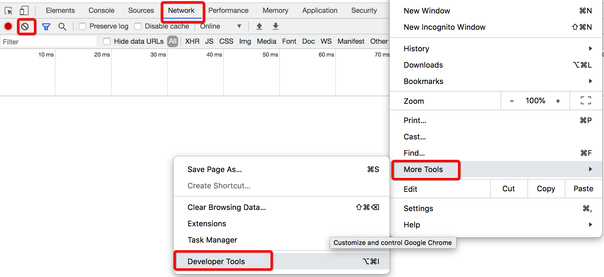

# 编译原理之美

# 第一章  网络协议和WEB接口

- [01 | 网络互联的昨天、今天和明天：HTTP 协议的演化](#chapter1)
- [02 | 为HTTP穿上盔甲：HTTPS](#chapter2)
- [03 | 换个角度解决问题：服务端推送技术](#chapter3)
- [04 | 工整与自由的风格之争：SOAP和REST](#chapter4)
- [05 | 权衡的艺术：漫谈Web API的设计](#chapter5)
- [01 | 网络互联的昨天、今天和明天：HTTP 协议的演化](#chapter1)

<h1 id="chapter1">01 | 网络互联的昨天、今天和明天：HTTP 协议的演化</h1>

## HTTP/1.0

HTTP 1.0 版本就稳定而成熟了，也是如今浏览器广泛支持的最低版本 HTTP 协议。引入了返回码，引入了 header，引入了多字符集，也终于支持多行请求了。

当然，它的问题也还有很多，支持的特性也远没有后来的 1.1 版本多样。比如，方法只支持 GET、HEAD、POST 这几个。但是，麻雀虽小五脏俱全，这是第一个具备广泛实际应用价值的协议版本。

懂一点特定的协议，使用简单的命令行和文本编辑工具，我们就已经可以做很多事情了。比如改变 UA 头的办法，可以模拟不同的浏览器，就是用来分析浏览器适配（指根据不同浏览器的兼容性返回不同的页面数据）的常用方法。

## HTTP/1.1

在 HTTP 1.0 版本时，每一组请求和响应的交互，都要完成一次 TCP 的连接和关闭操作，这在曾经的互联网资源比较贫瘠的时候并没有暴露出多大的问题，但随着互联网的迅速发展，这种通讯模式显然过于低效了。

于是这个问题的解决方案——HTTP 的长连接，就自然而然地出现了，它指的是打开一次 TCP 连接，可以被连续几次报文传输重用，这样一来，我们就不需要给每次请求和响应都创建专门的连接了：


可以看到，**通过建立长连接，中间的几次 TCP 连接开始和结束的握手都省掉了。**

在长连接开启的情况下，使用 Content-Length 还是 chunked 头，必须具备其中一种。**分块传输编码大大地提高了 HTTP 交互的灵活性，**服务端可以在还不知道最终将传递多少数据的时候，就可以一块一块将数据传回来。

事实上 HTTP/1.1 还增加了很多其它的特性，比如更全面的方法，以及更全面的返回码，对指定客户端缓存策略的支持，对 content negotiation 的支持（即通过客户端请求的以 Accept 开头的头部来告知服务端它能接受的内容类型），等等。

## HTTP/2

现在最广泛使用的 HTTP 协议还是 1.1 ，但是 HTTP/2 已经提出，在保持兼容性的基础上，包含了这样几个重要改进：

- 设计了一种机制，允许客户端来选择使用的 HTTP 版本，这个机制被命名为 ALPN；

- HTTP 头的压缩，在 HTTP/2 以前，HTTP 正文支持多种方式的压缩，但是 HTTP 头部却不能；

- 多路复用，允许客户端同时在一个连接中同时传输多组请求响应的方法；

- 服务端的 push 机制，比方说客户端去获取一个网页的时候，下载网页，分析网页内容，得知还需要一个 js 文件和一个 css 文件，于是再分别下载，而服务端的 push 机制可以提前就把这些资源推送到客户端，而不需要客户端来索取，从而节约网页加载总时间。

最后，我想说的是，**HTTP 协议的进化史，恰恰是互联网进化史的一个绝佳缩影，**从中你可以看到互联网发展的数个特质。比方说，长连接和分块传输很大程度上增强了 HTTP 交互模型上的灵活性，使得 B/S 架构下的消息即时推送成为可能。

## 注意：

1. http1.1长连接和2.0多路复用的区别
2. 抓包中除了HTTP请求和响应报文之外，是TCP报文。

<h1 id="chapter2">02 | 为HTTP穿上盔甲：HTTPS</h1>

## HTTP，SSL/TLS 和 HTTPS

在一开始的时候，HTTP 的设计者并没有把专门的加密安全传输放进协议设计里面。因此单独使用 HTTP 进行明文的数据传输，一定存在着许多的安全问题。比方说，现在有一份数据需要使用 HTTP 协议从客户端 A 发送到服务端 B，而第三方 C 尝试来做点坏事，于是就可能产生如下四大类安全问题：

- Interception：拦截。传输的消息可以被中间人 C 截获，并泄露数据。

- Spoofing：伪装。A 和 B 都可能被 C 冒名顶替，因此消息传输变成了 C 发送到 B，或者 A 发送到 C。

- Falsification：篡改。C 改写了传输的消息，因此 B 收到了一条被篡改的消息而不知情。

- Repudiation：否认。这一类没有 C 什么事，而是由于 A 或 B 不安好心。A 把消息成功发送了，但之后 A 否认这件事发生过；或者 B 其实收到了消息，但是否认他收到过。

但是，与其重新设计一套安全传输方案，倒不如发挥一点拿来主义的精神，把已有的和成熟的安全协议直接拿过来套用，最好它位于呈现层（Presentation Layer），因此正好加塞在 HTTP 所在的应用层（Application Layer）下面，**这样这个过程对于 HTTP 本身透明，也不影响原本 HTTP 以下的协议（例如 TCP）**。

这个协议就是 SSL/TLS，它使得上面四大问题中，和传输本身密切相关的前三大问题都可以得到解决（第四个问题还需要引入数字签名来解决）。于是，HTTP 摇身一变成了 HTTPS：

> HTTP + SSL/TLS = HTTPS

SSL 指的是 Secure Socket Layer，而 TLS 指的是 Transport Layer Security，事实上，一开始只有 SSL，但是在 3.0 版本之后，SSL 被标准化并通过 RFC 2246 以 SSL 为基础建立了 TLS 的第一个版本，因此可以简单地认为 SSL 和 TLS 是具备父子衍生关系的同一类安全协议。

## 动手捕获 TLS 报文

命令行执行抓包命令，指明要抓 https://www.google.com 的包（当然，你也可以使用其他 HTTPS 网站地址），注意 HTTPS 的默认端口是 443（-i 指定的 interface 可能因为不同的操作系统有所区别，在我的 Mac 上是 en0）

```java
sudo tcpdump -i en0 -v 'host www.google.com and port 443' -w https.cap
```

再新建一个命令行窗口，使用 curl 命令来访问 Google 主页：

```java
curl https://www.google.com
```

于是在看到类似如下抓包后 CTRL + C 停止：

```java
tcpdump: listening on en0, link-type EN10MB (Ethernet), capture size 262144 bytes
^C49 packets captured
719 packets received by filter
0 packets dropped by kernel
```

接着使用 Wireshark 打开刚才抓的 https.cap，在 filter 中输入 tls，得到如下请求和响应报文：


可以看到，这里有五个重要的握手消息，在它们之后的所有消息都是用于承载实际数据的“Application Data”了。握手的过程略复杂，接下来我会尽可能用通俗的语言把最主要的流程讲清楚。

## 对称性和非对称性加密

对称性加密（Symmetric Cryptography），指的是加密和解密使用相同的密钥。这种方式相对简单，加密解密速度快，但是由于加密和解密需要使用相同的密钥，如何安全地传递密钥，往往成为一个难题。

非对称性加密（Asymmetric Cryptography），指的是数据加密和解密需要使用不同的密钥。通常一个被称为公钥（Public Key），另一个被称为私钥（Private Key），二者一般同时生成，但是**公钥往往可以公开和传播，而私钥不能。经过公钥加密的数据，需要用私钥才能解密；**反之亦然。这种方法较为复杂，且性能较差，好处就是由于加密和解密的密钥具有相对独立性，公钥可以放心地传播出去，不用担心安全性问题

> 原始数据 + 公钥 → 加密数据
> 加密数据 + 私钥 → 原始数据

## TLS 连接建立原理


**Step 1: Client Hello.** 客户端很有礼貌，先向服务端打了个招呼，并携带以下信息：

- 客户端产生的随机数 A；

- 客户端支持的加密方法列表。

**Step 2: Server Hello.**服务端也很有礼貌，向客户端回了个招呼：

- 服务端产生的随机数 B；

- 服务端根据客户端的支持情况确定出的加密方法组合（Cipher Suite）。

**Step 3: Certificate, Server Key Exchange, Server Hello Done.** 服务端在招呼之后也紧跟着告知：

- Certificate，证书信息，证书包含了服务端生成的公钥。

客户端收到消息后，验证确认证书真实有效，那么这个证书里面的公钥也就是可信的了.

接着客户端再生成一个随机数 C（Pre-master Secret），于是现在共有随机数 A、B 和 C，根据约好的加密方法组合，三者可生成新的密钥 X（Master Secret），而由 X 可继续生成真正用于后续数据进行加密和解密的对称密钥。因为它是在本次 TLS 会话中生成的，所以也被称为会话密钥（Session Secret）。简言之：

> 客户端随机数 A + 服务端随机数 B + 客户端 Pre-master Secret C → 会话密钥

需要注意的是，实际这个 Pre-master Secret 的生成方法不是固定的，而会根据加密的具体算法不同而不同：

- 上述我介绍的是传统 RSA 方式，即 Pre-master Secret 由客户端独立生成，加密后再通过 Client Key Exchange 发回服务端。

- 还有一种是 ECDHE 方式，这种方式下无论在客户端还是服务端，Pre-master Secret 需要通过 Client Key Exchange 和 Server Key Exchange 两者承载的参数联合生成。

**Step 4: Client Key Exchange, Change Cipher Spec, Encrypted Handshake Message.** 接着客户端告诉服务端：

- Client Key Exchange，本质上它就是上面说的这个 C，但使用了服务端通过证书发来的公钥加密；

- Change Cipher Spec，客户端同意正式启用约好的加密方法和密钥了，后面的数据传输全部都使用密钥 X 来加密；

- Encrypted Handshake Message，快速验证：这是客户端对于整个对话进行摘要并加密得到的串，如果经过服务端解密，和原串相等，就证明整个握手过程是成功的。

服务端收到消息后，用自己私钥解密上面的 Client Key Exchange，得到了 C，这样它和客户端一样，也得到了 A、B 和 C，继而到 X，以及最终的会话密钥。

于是，客户端和服务端都得到了能够加密解密传输数据的对称密钥——会话密钥。

因此，我们可以看到：**TLS 是通过非对称加密技术来保证握手过程中的可靠性（公钥加密，私钥解密），再通过对称加密技术来保证数据传输过程中的可靠性的。**

这种通过较严格、较复杂的方式建立起消息交换渠道，再通过相对简单且性能更高的方式来实际完成主体的数据传输，并且前者具有长效性（即公钥和私钥相对稳定），后者具有一过性（密钥是临时生成的），这样的模式，我们还将在全栈的知识体系中，继续见到。

**Step 5: Change Cipher Spec, Encrypted Handshake Message.** 服务端最后也告知客户端

- Change Cipher Spec，服务端也同意要正式启用约好的加密方法和密钥，后面的数据传输全部都使用 X 来加密。

- Encrypted Handshake Message，快速验证：这是服务端对于整个对话进行摘要并加密得到的串，如果经过客户端解密，和原串相等，就证明整个握手过程是成功的。

<h1 id="chapter3">03 | 换个角度解决问题：服务端推送技术</h1>

## Pull 模型的问题

先来看两个容易弄混的概念：Pull 和 Poll。

“Pull”指的是去主动发起行为获取消息，一般在客户端 / 服务器（C/S，Client/Server）或浏览器 / 服务器（B/S，Browser/Server）交互中，客户端或浏览器主动发起的网络请求数据的行为

而“Poll”，尽管在某些场景下也和 Pull 通用了，但在计算机网络的领域里，通常把它解释为“轮询”，或者“周期性查询”，在 Pull 的基础上增加了“周期性”的概念，这也是它和 Pull 相比最本质的区别。

相应地，和 Pull 行为相对的，从服务端主动发起，发送数据到客户端的行为叫做“Push”。Push 相比 Pull 而言，具备这样两个明显的优势：

- **高效性。**如果没有更新发生，就不会有任何更新消息推送的动作，即每次消息推送都发生在确确实实的更新事件之后，都是有意义的，不会出现请求和响应的资源浪费

- **实时性。**事件发生后的第一时间即可触发通知操作，理论上不存在任何可能导致通知延迟的硬伤。

可是，有趣的是，事实上 Pull 的应用却远比 Push 更广泛，特别是在分布式系统中。这里有多个原因，其中很重要的一条是：

服务端不需要维护客户端的列表，不需要知晓客户端的情况，不需要了解客户端查询的策略。**这有助于把服务端从对客户端繁重的管理工作中解放出来，而成为无状态的简单服务，变得具备幂等性（idempotent，指执行多次和执行一次的结果一样），更容易横向扩展。**

尤其在分布式系统中，状态经常成为毒药，有了状态，就不得不考虑状态的保存、丢失、一致性等问题，因此这种无状态往往可以很大程度地简化系统的设计。

## 服务端推送技术

有了这些基础知识，我们就可以来谈谈实际的服务端推送技术了，这些都从一定程度上解决了 HTTP 传统方式 Pull 的弊端。

## 1. Comet

严格说，Comet 是一种 Web 应用客户端和服务端交互的模型，它有几种服务端推送的具体实现，但是，它们的大致原理是一样的：**客户端发送一个普通的 HTTP 请求到服务端以后，服务端不像以往一样在处理后立即返回数据，而是保持住连接不释放，每当有更新事件发生，就使用分块传输的方式返回数据。**

若干次数据返回以后可以完成此次请求响应过程（分块传输返回长度为 0 的块，表示传输结束），等待客户端下一次请求发送。这种过程看起来也属于轮询，但是每个周期可包含多次服务端数据返回，因而也被形象地称为“长轮询”（Long Polling）。

在服务端推送技术中，Comet 最大的好处是，它 100% 由 HTTP 协议实现，当然，分块传输要求 HTTP 至少是 1.1 版本。但也正因为这点，它也存在一些弊端，比如，客户端必须在服务端结束当次传输后才能向服务端发送消息；HTTP 协议限制了它在每次请求和响应中必须携带完整的头部，这在一定程度上也造成了浪费（这种为了传输实际数据而使用的额外开销叫做 overhead）。

下面我给出了一个 Comet 实现的示例图。浏览器在发出 1 号请求要求数据，连接保持，接着陆续收到几个不同大小的响应数据，并且最后一个大小为 0，浏览器被告知此次传输完成。过了一会儿，浏览器又发出 2 号请求，开始第二轮的类似交互。


在 Comet 方式下，**看起来服务端有了推送行为，其实只是对于客户端请求有条件、讲时机的多次返回**，因此我们把它称为服务端“假 Push”

## 2. WebSocket

HTML 5 规范定义了 WebSocket 协议，它可以通过 HTTP 的端口（或者 HTTPS 的端口）来完成，从而最大程度上对 HTTP 协议通透的防火墙保持友好。但是，**它是真正的双向、全双工协议，也就是说，客户端和服务端都可以主动发起请求，回复响应，而且两边的传输都互相独立。**

和上文的 Comet 不同，WebSocket 的服务端推送是完全可以由服务端独立、主动发起的，因此它是服务端的“真 Push”。

WebSocket 是一个可谓“科班出身”的二进制协议，也没有那么大的头部开销，因此它的传输效率更高。同时，和 HTTP 不一样的是，它是一个带有状态的协议，双方可以约定好一些状态，而不用在传输的过程中带来带去。而且，WebSocket 相比于 HTTP，它没有同源的限制，服务端的地址可以完全和源页面地址无关，即不会出现臭名昭著的浏览器“跨域问题”。

另外，它和我们之前学习的加密传输也丝毫不冲突，由于它在网络分层模型中位于 TLS 上方，因此他可以使用和 HTTP 一样的加密方式传输：

> HTTP → WS
> HTTPS → WSS

最后，最有意思的事情在于，和我们之前的认识不同，WebSocket 是使用 HTTP 协议“升级”的方法来帮助建立连接的，下面我们动手来试一试。

首先，我们需要找到一个可以支持 WebSocket 测试的网站，比如 websocket.org，然后我们将使用 Chrome 的网络工具来捕获和显示通过浏览器发送和接收的消息。

使用 Chrome 打开 Echo Test 页面，在这里你可以发送建立一个 WebSocket 连接。但是别急，我们先打开 Chrome 的开发者工具，并选中 Network 标签，接着点击左上角的清除按钮，把已有页面加载的网络消息清除掉，以获得一个清爽的网络报文监视界面



接着，确保页面上建立 WebSocket 连接的对端地址和传递的信息都已经填写，比如：

```java
Location:
wss://echo.websocket.org
Message:
Rock it with HTML5 WebSocket
```

于是就可以点击“Connect”按钮了，旁边的日志框将出现“CONNECTED”字样，同时，Chrome 开发者工具将捕获这样的请求（如果在开发者工具中网络监视界面上，选中消息的消息头处于“parsed”展示模式，你需要点击 Request Headers 右侧的 “view source” 链接来查看原始消息头）：

```java
GET wss://echo.websocket.org/?encoding=text HTTP/1.1
Host: echo.websocket.org
Origin: https://www.websocket.org
Connection: Upgrade
Upgrade: websocket
Sec-WebSocket-Version: 13
Sec-WebSocket-Key: xxx
... (省略其它 HTTP 头)
```

好，你可以看到，这是一个普普通通的 HTTP GET 请求，但是 URL 是以加密连接“wss”开头的，并且有几个特殊的 HTTP 头：Origin 指出了请求是从哪个页面发起的，Connection: Upgrade 和 Upgrade: websocket 这两个表示客户端要求升级 HTTP 协议为 WebSocket。

好，再来看响应，消息的头部为：

```java
HTTP/1.1 101 Web Socket Protocol Handshake
Connection: Upgrade
Sec-WebSocket-Accept: xxx
Upgrade: websocket
... (省略其它 HTTP 头)
```

嗯，返回码是 101，描述是“Web Socket Protocol Handshake”，并且，它确认了连接升级为“websocket”的事实。

## 3. 更多推送技术

到这里，我已经介绍了几种服务端的推送技术，事实上还有更多，但是，**如果你依次了解以后认真思考，就会发现，这些原理居然都在某种程度上和我介绍的 Comet 和 WebSocket 这两种类似，有的甚至来自于它们。**

这些技术包括:

- SSE，即 Server-Sent Events，又叫 EventSource，是一种已被写入 HTML 5 标准的服务端事件推送技术，它允许客户端和服务端之间建立一个单向通道，以让服务端向客户端单方向持续推送事件消息；

- 为了提高性能，HTTP/2 规范中新添加的服务端推送机制，我们在 [第 01 讲] 中提到过，并在该讲的扩展阅读中有它的原理介绍；

- WebRTC，即 Web Real-Time Communication，它是一个支持网页进行视频、语音通信的协议标准，不久前已被加入 W3C 标准，最新的 Chrome 和 Firefox 等主流浏览器都支持；

- 还有一些利用浏览器插件和扩展达成的服务端推送技术，比如使用 Flash 的 XMLSocket，比如使用 Java 的 Applet，但这些随着 HTML 5 的普及，正慢慢被淘汰。

<h1 id="chapter4">04 | 工整与自由的风格之争：SOAP和REST</h1>

SOAP，Simple Object Access Protocol，即简单对象访问协议，定义了数据对象传输的格式，以便在网络的节点之间交换信息。你可能会问，HTTP 不就是干这事的吗？其实，它们都在 OSI 7 层模型的应用层上，但却互不冲突，SOAP 并不依赖于 HTTP 而存在，而且它们可以互相配合。

HTTP 负责信息的传输，比如传递文本数据，关心的是消息的送达，但却不关心这个数据代表着什么。这个数据可能本来是一个内存里的对象，是一篇文章，或者是一张图片。但是 SOAP 恰恰相反，它关心的就是怎样把这个数据给序列化成 XML 格式的文本，在传输到对端以后，再还原回来。

用一个形象的比喻就是，**消息传输就像快递，HTTP 主要关心的是信封，而 SOAP 主要关心的是信封里的物件。**今天我们讨论的 SOAP，不仅仅是协议本身，更主要的是它的风格。

REST，Representational State Transfer，即表现层状态转换，指的是一种为了信息能在互联网上顺利传递而设计的软件架构风格。对，请注意，**SOAP 是协议，但 REST 是风格，而非协议或标准**，至于 HTTP，它是 REST 风格的重要载体。重要，但不是唯一，因为载体并不只有 HTTP 一个，比如还有 HTML 和 XML，它们恰当地互相配合，组合在一起，来贯彻和体现 REST 的风格。

SOAP 和 REST，由于概念层次上的不同，其实原本是无法放到一起比较的，但是当我们旨在风格层面上讨论 SOAP 和 REST 的时候，这件事却变得可行而有趣了。

现在让我们用一个实际例子来进一步认识它们。这个例子很常见，假设我们要设计一个图书馆，馆中的书可以增删改查（CRUD），特别是要添加一本书的时候，我们分别来看看，应用 SOAP 该怎么做，应用 REST 又该怎么做。

## SOAP

这是一个最简单的给图书馆添加一本书的 XML 消息体：

```xml
<?xml version="1.0" encoding="UTF-8"?>
<soap:Envelope
 xmlns:soap="https://www.w3.org/2003/05/soap-envelope/"
 soap:encodingStyle="https://www.w3.org/2003/05/soap-encoding">
  <soap:Body xmlns:b="...">
    <b:CreateBook>
      <b:Name>...</m:Name>
      <b:Author>...</m:Author>
      ...
    </b:CreateBook>
  </soap:Body>
</soap:Envelope>
```

简单解释一下：

1. 第一行指明了这个消息本身格式是 XML，包括它的版本号和编码格式。

2. 这里的很多标签都带有“soap:”的前缀，其实，这里的“soap”就是 XML 的命名空间（其中“xmlns”就是指“xml namespace”），并且通过 XML schema 的方式预先定义好了如下两个 SOAP 消息必须要遵从的规则：

- 一个是代码片段第 3 行的 soap-envelope，它定义了基本的语法规则，比如标签的从属关系，比如同级某标签的个数限制等等，举例来说，你可以看到例子中有一个 Body 标签位于 Envelope 内部，这就是它定义的；

- 另一个是代码片段第 4 行的 soap-encoding，它定义了编码和数据类型等规则

3. 在 Body 标签内部，有一个 CreateBook 标签，这是我们的业务标签，命名空间 b 也是我们自己定义的。通过在内部封装姓名（Name）和作者（Author）等书本信息，实现了在图书馆中添加书本的需求。

上面是一个最简单的例子，实际在 Envelope 中还可以添加 Head 标签，用于存放头部信息，在 Body 中可以添加 Fault 标签，用于存放错误信息。关于这些，都在 XML schema 中做了严格的定义，通过它可以帮助验证一个 XML 是否符合格式，从而可以在最短的时间内验证并发现消息中的格式问题。

SOAP 通常是通过 HTTP POST 的方式发送到对端的，这个图书馆对书本的增删改查操作，URL 可以是同一个，这是因为 SOAP 消息的具体内容写明了具体要干什么（上述的 CreateBook 标签）。比如下面这个例子，请注意其中的 Content-Type，它是令响应具备自我描述特性的重要组成部分：

```java
POST /books HTTP/1.1
Host: xxx
Content-Type: application/soap+xml; charset=utf-8
Content-Length: xxx

... (省略前述的 SOAP 消息体)
```

最后，谈谈经常和 SOAP 放在一起谈论的 WSDL，Web Service Description Language。

WSDL 用于描述一个 Web Service，说白了，就是用来说明某个 Web 服务该怎样使用，有怎样的接口方法，支持怎样的参数，会有怎样的返回。由于支持 SOAP 的服务端接口是经常使用 WSDL 来描述，因此我们才看到它们总被放在一起讨论，于是在这种情况下，**WSDL 常常被形容成 SOAP 服务的使用说明书**，但是请注意，本质上它们之间不存在依赖关系。

**这种将服务和服务的描述解耦开设计的方式非常普遍**，希望你可以去类比和联想。在软件的世界里，我们经常谈论这个“描述”的行为，以及描述者和被描述者。比如元属性描述数据，方法签名描述方法，类描述对象等等。

## REST

现在，我们再来看 REST 的做法。**REST 的核心要素包括资源、表现层和状态转换这三个部分**。我们把前面客户端发送请求的过程使用 REST 风格再来实现一遍，你将看到这三个要点是怎样体现出来的：

### 1. 协议

我们将使用 HTTP 协议，在加密的情况下，协议是 HTTPS，但这对我们的实现来说没有什么区别。

### 2. URL

通常来说，这个 URL 要包括域名、版本号以及实体名称，而这个 URL 整体，代表了 REST 中的一类或一项“资源”。比如说：

```
https://xxx/v1/books
```

请注意其中的实体名称，它往往是一个单纯的名词，并且以复数形式出现

这里提到了 URL，我想给经常混用的 URL、URI 做个简要的说明：URL 指的是 Uniform Resource Locator，URI 指的是 Uniform Resource Identifier，前者是统一资源定位符，后者是统一资源标识符。**Identifier 可以有多种形式，而 locator 只是其中一种，因此 URI 更宽泛，URL 只是 URI 的其中一种形式。**

当我们提到一个完整的地址，例如 https://www.google.com， 它就是 URL，因为它可以被“定位”，它当然也是 URI；但是如果我们只提到上面地址的一个片段，例如 www.google.com，那么由于缺少了具体协议，我们无法完成完整的定位，因此这样的东西只能被叫做一个标识符，故而只能算 URI，而非 URL。

### 3. 方法

HTTP 的方法反映了这个接口上将执行的行为，如果用自然语言描述，它将是一个动词。比如说，给图书馆添加一本图书，那么这个行为将是“添加”。在以 REST 风格主导的设计中，我们将使用这样的 HTTP 方法来代表增删改查（CRUD）的不同动作：


重点解释下表格的最后两列：

- **幂等性指的是对服务端的数据状态，执行多次操作是否和执行一次产生的结果一样。**从表格中你可以看到，创建资源单位不是幂等的，执行多次就意味着创建了多个资源单位，而其它操作都是幂等的。通常来说，**幂等操作是可以被重试而不产生副作用的。**

- **安全性指的是该操作是否对服务端的数据状态产生了影响。**从表格中可以看到，获取资源的操作是安全的，不会对资源数据产生影响，但是其它操作都是不安全的。一定条件下，**安全操作是可以被缓存的**，而不安全的操作，必定对服务端的状态产生了影响，这体现了 REST 的“状态转换”这一要素。

全栈系统的设计和优化都需要紧密围绕幂等性和安全性进行，这是两个非常重要的概念，在我们后续的学习中，你还会反复见到它们，并和它们打交道。

你看，通过这样的办法，就把 HTTP 的方法和实际对资源的操作行为绑定起来了。当然，还有一些其它方法，比较常见的有：

- PATCH：和 PUT 类似，也用于资源更新，但支持的是资源单位的部分更新，并且在资源不存在的时候，能够自动创建资源，这个方法实际使用比较少。

- HEAD：这个方法只返回资源的头部，避免了资源本身获取和传输的开销。这种方法很有用，经常用来检查资源是否存在，以及有无修改。

- OPTIONS：这个方法常用来返回服务器对于指定资源所支持的方法列表。

### 4. 正文

POST 和 PUT 请求都是有 HTTP 正文的，正文的类型和 Content-Type 的选取有关，比如 JSON 就是最典型的一种格式。请不要轻视这里的 Content-Type，从本质上说，它代表了资源的表现形式，从而体现了 REST 定义中的“表现层”这一要素。

最后，回到我们实际的图书馆添加图书的问题。SOAP 添加一本书的消息，用 REST 风格的 POST 请求实现就会变成这样：

```json
POST /v1/books HTTP/1.1
HOST: ...
Content-Type: application/json

{
  "name": "...",
  "author": "...",
  ...
}
```

## 风格之争

看到这儿，你应该已经感受到了，SOAP 和 REST 代表了两种迥异的风格。在我们取舍技术的时候，如果没有给出具体场景和限制，我们往往是很难讲出谁更“好”，而是需要进行比较，权衡利弊的。

SOAP 明显是更“成熟”的那一个。它在数据传输的协议层面做了更多的工作，藉由 XML schema，它具备更严格的检查和校验，配合 WSDL，在真正发送请求前，几乎就对所有远程接口事无巨细的问题有了答案。但是，它的复杂度令人望而生畏，也是它最受人诟病的地方。

REST 则相反，新接口的学习成本很低，只需要知道资源名称，根据我们熟知的规约，就可以创建出 CRUD 的请求来。但是直到真正发送请求去测试为止，并没有办法百分百确定远程接口的调用是否能工作，或者说，并不知道接口定义上是否有不规范、不合常规的坑在里面。

对于互联网来说，SOAP 已经是一项“古老”的技术了，晚辈 REST 似乎更切合互联网的潮流。在大多数情况下，REST 要易用和流行得多，于是很多人都不喜欢繁琐的 SOAP 协议。**技术的发展总是有这样的规律，一开始无论问题还是办法都很简单，可是随着需求的进一步增加，解决的方法也缓慢演化，如 SOAP 一般强大而复杂，直到某一天突然掉到谷底，如 REST 一般返璞归真。**

但是别忘了，有利必有弊。首先，正是因为 REST 只是一个缺乏限制的风格，而非一个严谨的规范，有太多不明确、不一致的实现导致的问题，这些问题轻者给接口调用者带来困惑，重者导致接口调用错误，甚至服务端数据错误。

其次，REST 通过 HTTP 方法实现本身，也受到了 HTTP 方法的局限性制约。比如最常见的 GET 请求，有时需要一个复杂的查询条件集合，因此参数需要结构化，而 GET 只支持一串键值对组合的参数传递，无法适应业务需要。对于这样的问题，有一些 workaround，比如使用 POST 消息体来传递查询条件的结构体，但那已经偏离了 REST 的最佳实践，丢失了 GET 本身的优势，也带来了实现不一致等一系列问题。

最后，REST 还存在的一个更本质的问题，资源是它的核心概念，这原本带来了抽象和简洁的优势，但如今也成为了它的桎梏。或者说，前面反复提到的增删改查是它最拿手的本事，可是互联网的需求是千变万化的，远不只有简单的增删改查。有时需要一个复杂的多步操作，有时则需要一个异步事务（需要回调或者二次查询等等方式来实现），这些都没有一个完美统一的 REST 风格的解决方案。即便实现出来了，也可谓五花八门，同时失去了以往我们所熟知的 REST 的简洁优势。

**互联网总在变复杂，但矛盾的是，人们却希望互联网上的交互会不断变简单。**于是这引发了 REST 的流行，可即便 REST 再流行，依旧有它不适合的场景；SOAP 虽古老，依然有它的用武之地。

对于全栈工程师或者期待修炼全栈技能的你我来说，trade-off 是永恒的话题。另外，除了 SOAP 和 REST，其实我们还有其它选择。我将在下一讲，结合实例具体介绍如何选择技术，并设计和实现远程接口。

<h1 id="chapter5">05 | 权衡的艺术：漫谈Web API的设计</h1>

今天，我们该根据之前所学，来谈谈具体怎样设计 Web API 接口了。我们围绕的核心，是“权衡”（trade-off）这两个字，事实上，它不只是 Web API 接口设计的核心，还是软件绝大多数设计问题的核心。

## 概念

在一切开始之前，我们先来明确概念。什么是 Web API？

你应该很熟悉 API，即 Application Programming Interface，应用程序的接口。它指的就是一组约定，不同系统之间的沟通必须遵循的协议。使用者知道了 API，就知道该怎样和它沟通，使用它的功能，而不关心它是怎么实现的。

Web API 指的依然是应用程序接口，只不过它现在暴露在了 Web 的环境里。并且，我们通常意义上讲 Web API 的时候，无论是在 B/S（浏览器 / 服务器）模型还是 C/S（客户端 / 服务器）模型下，往往都心照不宣地默认它在服务端，并被动地接受请求消息，返回响应。

通常一个 Web API 需要包括哪些内容呢？

回答这个问题前，让我们先闭上眼想一想，如果没有“Web”这个修饰词，普通的 API 要包括哪些内容呢？嗯，功能、性能、入参、返回值……它们都对，看起来几乎是所有普通 API 的特性，在 Web API 中也全都存在。而且，因为 Web 的特性，它还具备我们谈论普通 API 时不太涉及的内容：

- 比如承载协议。这里可以有多个协议，因为协议是分层的。HTTP 协议和 TCP 协议就是并存的。

- 再比如请求和响应格式。Web API 将普通 API 的方法调用变成了网络通信，因此参数的传入变成了请求传入，结果返回变成了响应传出。

正是有了 Web API，网络中的不同应用才能互相协作，分布式系统才能正常工作，互联网才能如此蓬勃发展。而我们，不能只停留在“知道”的层面，还要去深入了解它们。

## Web API 的设计步骤

### 第一步：明确核心问题，确定问题域

和普通的 API 设计、程序的库设计一样，Web API 并不是东打一枪，西打一炮的。想想写代码的时候，我们还要让同类型的方法，以某种方式组织在类和对象中，实现功能上的内聚呢，一个类还要遵循单一职责的原则呢。

因此，一组 Web API，就是要专注于一类问题，核心问题必须是最重要的一个。

在上一讲中我举了个图书管理系统的例子，那么可以想象，图书的增删改查 API 就可以放到一起，而如果有一个新的 API 用于查询图书馆内部员工的信息，那么它显然应该单独归纳到另外的类别中，甚至是另外的系统中。

### 第二步：结合实际需求和限制，选择承载技术

这里有两件事情需要你考虑，一个是需求，一个是限制。我们虽然经常这样分开说，但严格来说，限制也是需求的一种。比方说，如果对网络传输的效率要求很高，时延要求很短，这就是需求，而且是非功能性的需求。

大多数功能性的需求大家都能意识到，但是一些非功能性的需求，或者一些“限制”就容易被忽略了。比如说，向前的兼容性，不同版本同时运行，鉴权和访问控制，库依赖限制，易测试性和可维护性，平滑发布（如新老接口并行），等等。

再来说说承载技术。承载技术指的是实现接口，以及它的请求响应传输所需要使用到的技术集合，比如 HTTP + JSON。我们前面提到的要求网络传输效率高、时延短，Protobuf 就是一个值得考察的技术；但有时候，我们更需要消息直观、易读，那么显然 Protobuf 就不是一个适合的技术。这里我们通过分析技术优劣来做选择，这就是权衡。

虽说 Web API 主要的工作在服务端，但在技术分析时还需要考虑客户端。特别是一些技术要求自动生成客户端，而有些技术则允许通过一定方式“定制”客户端（例如使用 DSL，Domain Specific Language，领域特定语言）。

### 第三步：确定接口风格

技术的选择将很大程度地影响接口的风格

角度一：易用性和通用性的平衡，或者说是设计“人本接口”还是“最简接口”。

比如一个图书管理的接口，一种设计是让其返回“流行书籍”，实际的规则是根据出版日期、借阅人数、引进数量等等做了复杂的查询而得出；而另一种设计则是让用户来自行决定和传入这几个参数，服务端不理解业务含义，接口本身保持通用。

**前者偏向“易用”，更接近人的思维；后者偏向“通用”，提供了最简化的接口。**虽说多数情况下我们还是会见到后者多一些，但二者却不能说谁对谁错，它们实际代表了不同的风格，各有优劣。

角度二：接口粒度的划分。

比如用户还书的过程包括：还书排队登记、检查书本状况、图书入库，这一系列过程是设计成一个大的接口一并完成，还是设计成三个单独的接口分别调用完成？

其实，这二者各有优劣。**设计成大接口往往可以增加易用性，便于内部优化提高性能（而且只需调用一次）；设计成小接口可以增加可重用性，便于功能的组合。**

### 第四步：定义具体接口形式

在上面这三步通用和共性的步骤完成之后，我们就可以正式跳进具体的接口定义中，去确定 URL、参数、返回和异常等通用而具体的形式了。还记得上一讲中对 REST 请求发送要点的分解吗？在它的基础上，我们将继续以 REST 风格为例，进行更深刻的讨论。

1. 条件查询

我们在上一讲的例子中使用 HTTP GET 请求从图书馆获取书本信息，从而完成增删改查中的“查”操作：

```
/books/123
/books/123/price
```

分别查询了 ID 为 123 的图书的全部属性，和该图书的价格信息。

但是，实际的查所包含的内容可远比这个例子多，比如不是通过 ID 查询，而是通过条件查询：

```
/books?author=Smith&page=2&pageSize=10&sortBy=name&order=desc
```

你看条件查询书籍，查询条件通过参数传入，指定了作者，要求显示第二页，每页大小为 10 条记录，按照书名降序排列。

除了使用 Query String（问号后的参数）来传递查询条件，多级路径也是一种常见的设计，这种设计让条件的层级关系更清晰。比如：

```
/category/456/books?author=Smith
```

它表示查询图书分类为“艺术”（编号为 456）的图书，并且作者是 Smith。看到这里，你可能会产生这样两个疑问。

疑问一：使用 ID 多不直观啊，我们能使用具体名称吗？

当然可以！**可以使用具备业务意义的字段来代替没有可读性的 ID，但是这个字段不可重复，也不宜过长**，比如例子中的 category 就可以使用名称，而图书，则可以使用国际标准书号 ISBN。于是 URI 就变成了：

```
/category/Arts/books?author=Smith
```

疑问二：category 可以通过 Query String 传入吗？比如下面这样：

```
/books?author=Smith&category=Arts
```

当然可以！“category”可以放置在路径中，也可以放置在查询参数串中。**这是 REST 设计中的一个关于设计上合理冗余的典型例子，可以通过不同的方式来完成相同的查询。**如果你学过 Perl，你可能听过“There’s more than one way to do it”这样的俗语，这是一样的道理，也是 REST 风格的一部分。

当然，从这也可以看出上一讲我们提到过的，REST 在统一性、一致性方面的约束力较弱。

2. 消息正文封装

有时候我们还需要传递消息正文，比如当我们使用 POST 请求创建对象，和使用 PUT 请求修改对象的时候，我们可以选择使用一种技术来封装它，例如 JSON 和 XML。通常来说，既然我们选择了 REST 风格，我们在相关技术的选择上也可以继续保持简约的一致性，因此 JSON 是更为常见的那一个。

```json
{
  "name": "...",
  "category": "Arts",
  "authorId": 999,
  "price": {
    "currency": "CNY",
    "value": 12.99
  },
  "ISBN": "...",
  "quantity": 100,
  ...
}
```

上面的消息体内容就反映了一本书的属性，但是，在设置属性的时候，往往牵涉到对象关联，上面这个小小的例子就包含了其中三种典型的方式：

- 传递唯一业务字段：例如上面的 category 取值是具备实际业务意义的“Arts”；

- 传递唯一 id：例如上面的 authorId，请注意，这里不能传递实际作者名，因为作者可能会重名；

- 传递关联对象：例如上面的 price，这个对象通常可以是一个不完整的对象，这里指定了货币为人民币 CNY，也指定了价格数值为 12.99。

3. 响应和异常设计

HTTP 协议中规定了返回的状态码，我想你可能知道一些常见的返回码，大致上，它们分为这样五类：

- 1xx：表示请求已经被接受，但还需要继续处理。这时你可能还记得在 [第 03 讲] 中，我们将普通的 HTTP 请求升级成为 WebSocket 的过程，101 就是确认连接升级的状态码。

- 2xx：表示请求已经被接受和成功处理。最常见的就是 204，表示请求成功处理，且返回中没有正文内容。

- 3xx：表示重定向，请客户端使用重定向后的新地址继续请求。其中，301 是永久重定向，而 302 是临时重定向，新地址一般在响应头“Location”字段中指定。

- 4xx：表示客户端错误。服务端已经接到了请求，但是处理失败了，并且这个锅服务端不背。这可能是我们最熟悉的返回码了，比如最常见的 404，表示页面不存在。常见的还有 400，表示请求格式错误，以及 401，鉴权和认证失败。

- 5xx：表示服务端错误。这回这个处理失败的锅在服务端这边。最常见的是 500，通用的和未分类的服务端内部错误，还有 503，服务端暂时不可用。

错误处理是 Web API 设计中很重要的一部分，我们需要告知用户是哪个请求出错了，什么时间出错了，以及为什么出错。比如：

```json
{
    "errorCode": 543,
    "timeStamp": 12345678,
    "message": "The requested book is not found.",
    "detailedInfomation": "...",
    "reference": "https://...",
    "requestId": "..."
}
```

在这个例子中，你可以看到上面提到的要素都具备了，注意这里的 errorCode 不是响应中的 HTTP 状态码，而是一个具备业务意义的内部定义的错误码。在有些设计里面，也会把 HTTP 状态码放到这个正文中，以方便客户端处理，这种冗余的设计当然也是可以的。

## 总结思考

还记得我们是通过怎样的步骤来设计 Web API 的吗？其实可以总结为八个字：**问题、技术、风格和定义**，由问题到实现，由概要到细节。


