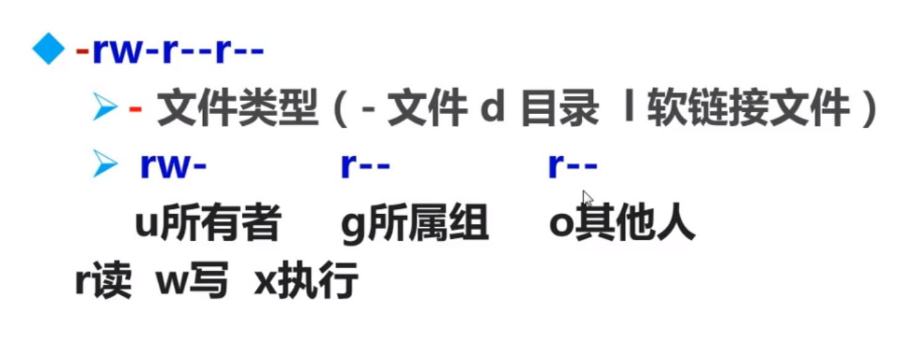
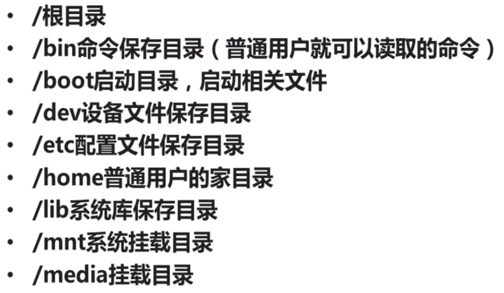
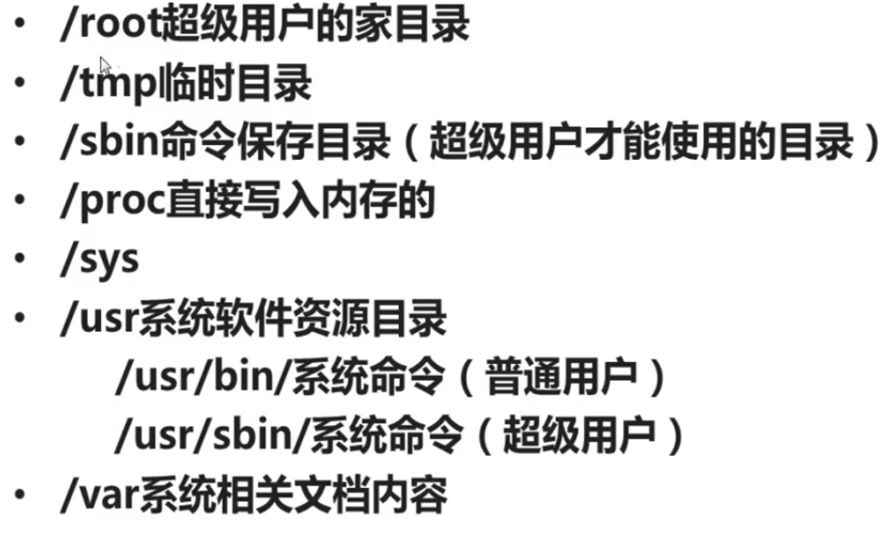
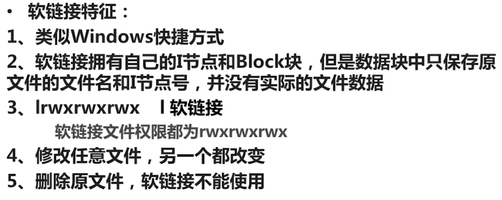
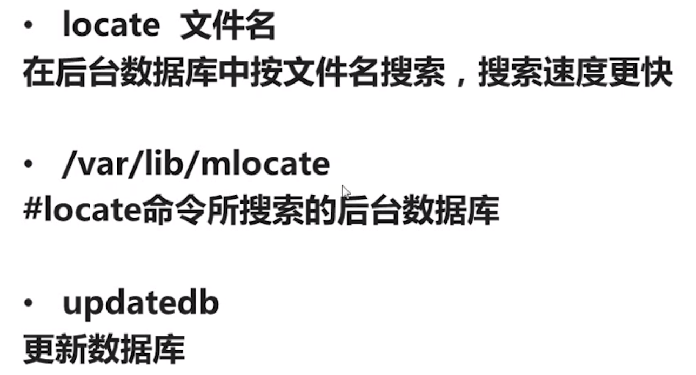
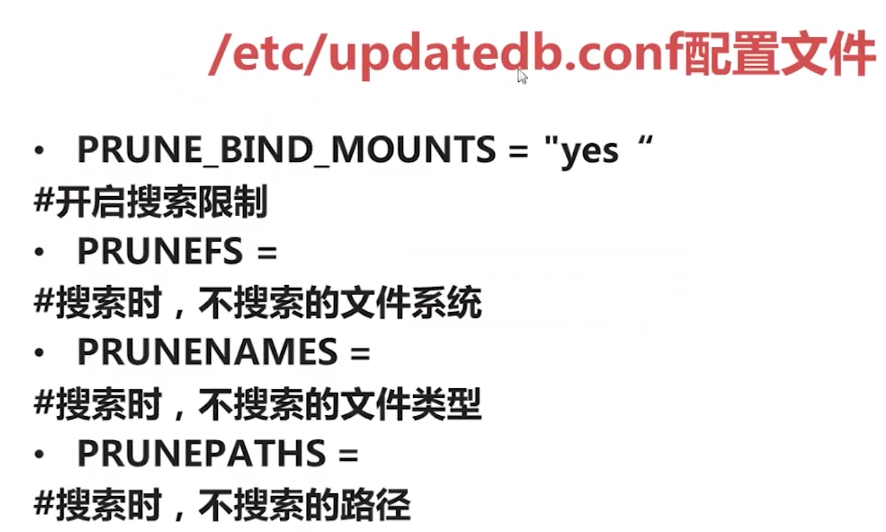
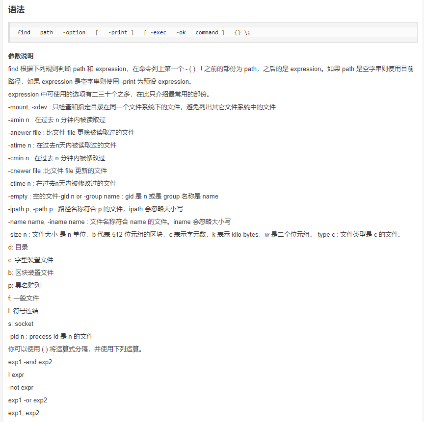

# [LINUX 基本使用](https://www.imooc.com/video/3473)



### 文件处理命令：

```
    mkdir -p
    cd  (./../~/ /-)
    pwd
    rm -rf
    cp  (r/p/d/a)
    mv
```

### 常见目录作用：




### 链接命令:ln

```
    ln  (s)
```




### 搜索命令

#### locate 命令





#### whereis、which

whereis (b/s)
搜索命令所在路径及帮助文档


which 搜索命令所在路径及别名

#### find 命令

> 避免大范围搜索，非常耗费系统资源
> find 完全匹配，模糊搜索需要使用通配符



