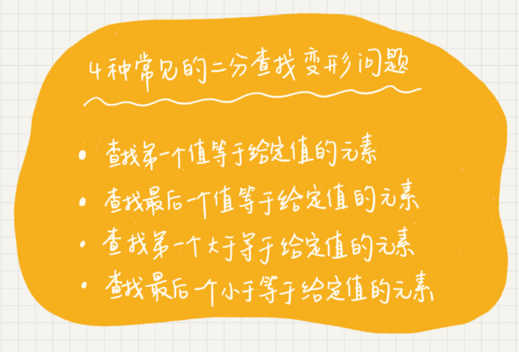

# 数据结构与算法之美

- [复杂度分析](#complexity)
- [数组](#array)
- [链表](#linkedList)
- [栈](#stack)
- [队列](#queue)
- [递归](#recursion)
- [排序](#sort)
- [线性排序](#lineSort)
- [二分查找](#binarySearch)
- [跳表](#skipList)
- [散列表](#hashTable)
- [哈希算法](#hash)
- [树](#tree)

<h1 id="complexity">复杂度分析</h1>

## 大 O 复杂度表示法

T(n) = O(f(n))

- T(n) 代码执行时间
- n 数据规模的大小
- f(n) 每行代码执行的次数总和

> 大 O 时间复杂度实际上并不具体表示代码真正的执行时间， 而是表示代码执行时间随数据规模增长的变化趋势， 所以， 也叫作渐进时间复杂度， 简称时间复杂度。 

## 时间复杂度分析

三个比较实用的方法

1. 只关注循环执行次数最多的一段代码
2. 加法法则： 总复杂度等于量级最大的那段代码的复杂度
3. 乘法法则： 嵌套代码的复杂度等于嵌套内外的代码复杂度的乘积


分为多项式量级和非多项式量级（O(2<sup>n</sup>)、 O(n<sup>2</sup>)）

### O(logn)

> 因为对数之间可以相互转换， 所以统一用 logn 表示

```javascript
i = 1;
while (i <= n) {
    i = i * 2;
}
```

### O(m+n)， O(m\*n)

## 空间复杂度分析

> 又叫渐进空间复杂度，表示算法的存储空间与数据规模之间的增长关系。

常见空间复杂度：O(1)，O(n)，O(n<sup>2</sup>)

## 最好、最坏、平均、均摊时间复杂度

```javascript
  // n 表示数组 array 的长度
  int find(int[] array, int n, int x) {
    int i = 0;
    int pos = -1;
    for (; i < n; ++i) {
      if (array[i] == x) {
        pos = i;
        break;
      }
    }
    return pos;
  }
```

> 最好最坏复杂度意义不大：最好情况时间复杂度：O(1)、最坏情况时间复杂度：O(n)

平均情况时间复杂度（加权平均时间复杂度）


均摊时间复杂度 （摊还分析法）


<h1 id="array">数组</h1>

> 数组是一种线性表数据结构。它用一组连续的内存空间，来存储一组具有相同类型的数据。

线性表（只有简单的前后关系）


非线性表（不只有简单的前后关系喽）


当计算机需要访问数组中的某个元素时，它会首先通过寻址公式，计算出该元素存储的内存地址。

```javascript
  a[i]_address = base_address + i * data_type_size
```

根据下标随机访问的时间复杂度是O(1)

## 低效的插入和删除

插入操作：

> 如果要向有序数组第 k 个位置插入一个数据，需要将之后的数据依次后移一位，平均情况时间复杂度为O(n)
> 
> 如果数组无序，可以将原来第 k 个位置的元素放到末尾，新元素放到第 k 个位置即可。

删除操作：

> 如果要删除数组第 k 个位置的数据，需要将之后的数据依次前移一位，平均情况时间复杂度为O(n)

## 警惕数组的访问越界问题

> c语言中下标越界仍然可以访问到该地址所对应的数据！

## 容器能否完全替代数组？

个人认为，ArrayList最大的优势是可以将很多数组操作的细节封装起来。还有一个优势是动态扩容。

直接使用数组的几种情况


总结一下，对于业务开发，直接使用容器就足够了，省时省力。毕竟损耗一丢丢性能，完全不会影响到系统整体的性能。但如果你是做一些非常底层的开发，比如开发网络框架，性能的优化需要做到极致，这个时候数组就会优于容器，成为首选。

## 为什么下标从0开始

从数组存储的内存模型上来看，“下标”最确切的定义应该是“偏移（offset）”。前面也讲到，如果用 a 来表示数组的首地址，a[0] 就是偏移为 0 的位置，也就是首地址，a[k] 就表示偏移 k 个 type_size 的位置，所以计算 a[k] 的内存地址只需要用这个公式：

```
  a[k]_address = base_address + k * type_size
```

但是，如果数组从 1 开始计数，那我们计算数组元素 a[k] 的内存地址就会变为：

```
  a[k]_address = base_address + (k-1)*type_size
```

每次随机访问数组元素都多了一次减法运算，对于CPU来说就是多了一次减法指令。

> 不过我认为，上面解释得再多其实都算不上压倒性的证明，说数组起始编号非 0 开始不可。所以我觉得最主要的原因可能是历史原因。

> 实际上，很多语言中数组也并不是从 0 开始计数的，比如 Matlab。甚至还有一些语言支持负数下标，比如 Python。

<h1 id="linkedList">链表</h1>

LRU 缓存淘汰算法

> 缓存的大小有限，当缓存被用满时，哪些数据应该被清理出去，哪些数据应该被保留？这就需要缓存淘汰策略来决定。常见的策略有三种：先进先出策略 FIFO（First In，First Out）、最少使用策略 LFU（Least Frequently Used）、最近最少使用策略 LRU（Least Recently Used）。

## 五花八门的链表结构

数组与链表的区别

> 底层的存储结构

从图中可以看到，数组需要一块连续的内存空间来存储，对内存的要求比较高。如果我们申请一个 100MB 大小的数组，当内存中没有连续的、足够大的存储空间时，即便内存的剩余总可用空间大于 100MB，仍然会申请失败。

而链表恰恰相反，它并不需要一块连续的内存空间，它通过“指针”将一组零散的内存块串联起来使用，所以如果我们申请的是 100MB 大小的链表，根本不会有问题。


三种最常见的链表结构：单链表、双向链表、循环链表


### 单链表：

把内存块称为<strong>“结点”</strong>。为了将所有的结点串起来，每个链表的结点除了存储数据之外，还需要记录链上的下一个结点的地址。如图所示，我们把这个记录下个结点地址的指针叫作 <strong>后继指针 next</strong>


第一个结点（头结点），最后一个结点（尾结点）比较特殊

其中，头结点用来记录链表的基地址。有了它，我们就可以遍历得到整条链表。而尾结点特殊的地方是：指针不是指向下一个结点，而是指向一个空地址 NULL，表示这是链表上最后一个结点。

在链表中插入和删除一个数据是非常快速的，我们只需要考虑相邻结点的指针改变，所以对应的时间复杂度是 O(1)。


随机访问第 k 个元素没有数组高效，因为链表中的数据并非连续存储的，所以无法像数组那样，根据首地址和下标，通过寻址公式就能直接计算出对应的内存地址，而是需要根据指针一个结点一个结点地依次遍历，直到找到相应的结点，时间复杂度为 O(n)。

### 循环链表：

> 是一种特殊的单链表


和单链表相比，循环链表的优点是从链尾到链头比较方便。当要处理的数据具有环型结构特点时，就特别适合采用循环链表。比如著名的[约瑟夫问题](https://zh.wikipedia.org/wiki/%E7%BA%A6%E7%91%9F%E5%A4%AB%E6%96%AF%E9%97%AE%E9%A2%98)。尽管用单链表也可以实现，但是用循环链表实现的话，代码就会简洁很多。

### 双向链表


用空间换时间：

> 双向链表需要额外的两个空间来存储后继结点和前驱结点的地址。所以，如果存储同样多的数据，双向链表要比单链表占用更多的内存空间。虽然两个指针比较浪费存储空间，但可以支持双向遍历，这样也带来了双向链表操作的灵活性。


删除操作：

删除结点中“值等于某个给定值”的结点。

> 不管是单链表还是双向链表，为了查找到值等于给定值的结点，都需要从头结点开始一个一个依次遍历对比，直到找到值等于给定值的结点，然后再通过指针操作将其删除。时间复杂度 O(n)

删除给定指针指向的结点。

> 已经找到了要删除的结点，但是删除某个结点 q 需要知道其前驱结点，而单链表并不支持直接获取前驱结点，所以，还是要从头结点开始遍历链表。
> 
> 所以时间复杂度单链表 O(n)，双向链表 O(1)

同理要在链表的某个结点前面插入一个结点，单链表 O(n)，双向链表 O(1)。

如果是有序链表，双向链表的按值查询的效率也要比单链表高一些，因为可以记录上次位置和值进行比对决定向前或者向后查找。

### 双向循环链表


### 链表 VS 数组性能比拼


### 用链表实现 LRU 缓存淘汰算法

> 我的思路是这样的：我们维护一个有序单链表，越靠近链表尾部的结点是越早之前访问的。当有一个新的数据被访问时，我们从链表头开始顺序遍历链表。
> 
> 1. 如果此数据之前已经被缓存在链表中了，我们遍历得到这个数据对应的结点，并将其从原来的位置删除，然后再插入到链表的头部。
> 2. 如果此数据没有在缓存链表中，又可以分为两种情况：
> - 如果此时缓存未满，则将此结点直接插入到链表的头部；
> - 如果此时缓存已满，则链表尾结点删除，将新的数据结点插入链表的头部。

## 思考

如果字符串使用单链表储存的，如何判断是否为回文字符串。

## 如何轻松写出正确的链表代码

### 一、理解指针或引用的含义

### 二、警惕指针丢失和内存泄漏

删除链表结点时，也一定要记得手动释放内存空间（c语言）

### 三、利用哨兵简化实现难度

针对链表的插入、删除操作，需要对插入第一个结点和删除最后一个结点的情况进行特殊处理。

> 哨兵，解决的是国家之间的边界问题。同理，这里说的哨兵也是解决“边界问题”的，不直接参与业务逻辑。

如果我们引入哨兵结点，在任何时候，不管链表是不是空，head 指针都会一直指向这个哨兵结点。我们也把这种有哨兵结点的链表叫带头链表。相反，没有哨兵结点的链表就叫作不带头链表

带头链表


### 四、重点留意边界条件处理

经常用来检查链表代码是否正确的边界条件有这样几个：

- 如果链表为空时，代码是否能正常工作？
- 如果链表只包含一个结点时，代码是否能正常工作？
- 如果链表只包含两个结点时，代码是否能正常工作？
- 代码逻辑在处理头结点和尾结点的时候，是否能正常工作？

### 五、举例画图，辅助思考

例如


### 六、多写多练，没有捷径

精选了 5 个常见的链表操作。只要把这几个操作都能写熟练，不熟就多写几遍，之后再也不会害怕写链表代码。

- 单链表反转
- 链表中环的检测
- 两个有序的链表合并
- 删除链表倒数第 n 个结点
- 求链表的中间结点

<h1 id="stack">栈</h1>

> 类似放置一摞盘子，先进后出，后进先出。


> 栈是一种“操作受限”的线性表，只允许在一端插入和删除数据。

当某个数据集合只涉及在一端插入和删除数据，并且满足后进先出、先进后出的特性，我们就应该首选“栈”这种数据结构。

实际上，栈既可以用数组来实现，也可以用链表来实现。用数组实现的栈，我们叫作 <strong>顺序栈</strong>，用链表实现的栈，我们叫作 <strong>链式栈</strong>

## 如何实现一个栈

```JAVA
  // 基于数组实现的顺序栈
public class ArrayStack {
  private String[] items;  // 数组
  private int count;       // 栈中元素个数
  private int n;           // 栈的大小

  // 初始化数组，申请一个大小为 n 的数组空间
  public ArrayStack(int n) {
    this.items = new String[n];
    this.n = n;
    this.count = 0;
  }

  // 入栈操作
  public boolean push(String item) {
    // 数组空间不够了，直接返回 false，入栈失败。
    if (count == n) return false;
    // 将 item 放到下标为 count 的位置，并且 count 加一
    items[count] = item;
    ++count;
    return true;
  }
  
  // 出栈操作
  public String pop() {
    // 栈为空，则直接返回 null
    if (count == 0) return null;
    // 返回下标为 count-1 的数组元素，并且栈中元素个数 count 减一
    String tmp = items[count-1];
    --count;
    return tmp;
  }
}

```

## 支持动态扩容的顺序栈


## 栈在函数调用的应用

函数调用栈

我们知道，操作系统给每个线程分配了一块独立的内存空间，这块内存被组织成“栈”这种结构, 用来存储函数调用时的临时变量。每进入一个函数，就会将临时变量作为一个栈帧入栈，当被调用函数执行完成，返回之后，将这个函数对应的栈帧出栈。为了更好地理解，我们一块来看下这段代码的执行过程。

```java
int main() {
  int a = 1; 
  int ret = 0;
  int res = 0;
  ret = add(3, 5);
  res = a + ret;
  printf("%d", res);
  reuturn 0;
}

int add(int x, int y) {
  int sum = 0;
  sum = x + y;
  return sum;
}

```

在执行到 add() 函数时，函数调用栈的情况：


## 栈在表达式求值中的应用

简单起见，分析运算表达式：3+5*8-6

实际上，编译器就是通过两个栈来实现的。其中一个保存操作数的栈，另一个是保存运算符的栈。我们从左向右遍历表达式，当遇到数字，我们就直接压入操作数栈；当遇到运算符，就与运算符栈的栈顶元素进行比较。

如果比运算符栈顶元素的优先级高，就将当前运算符压入栈；如果比运算符栈顶元素的优先级低或者相同，从运算符栈中取栈顶运算符，从操作数栈的栈顶取 2 个操作数，然后进行计算，再把计算完的结果压入操作数栈，继续比较。


## 栈在括号匹配中的应用

## 实现浏览器中的前进后退功能

> 用两个栈就可以非常完美地解决这个问题

使用两个栈，X 和 Y，我们把首次浏览的页面依次压入栈 X，当点击后退按钮时，再依次从栈 X 中出栈，并将出栈的数据依次放入栈 Y。当我们点击前进按钮时，我们依次从栈 Y 中取出数据，放入栈 X 中。当栈 X 中没有数据时，那就说明没有页面可以继续后退浏览了。当栈 Y 中没有数据，那就说明没有页面可以点击前进按钮浏览了。

<h1 id="queue">队列</h1>


> 队列跟栈一样，也是一种操作受限的线性表数据结构

## 顺序队列和链式队列

用数组实现的队列叫作顺序队列，用链表实现的队列叫做链式队列。


基于数组的队列实现方法

```java
  // 用数组实现的队列
public class ArrayQueue {
  // 数组：items，数组大小：n
  private String[] items;
  private int n = 0;
  // head 表示队头下标，tail 表示队尾下标
  private int head = 0;
  private int tail = 0;

  // 申请一个大小为 capacity 的数组
  public ArrayQueue(int capacity) {
    items = new String[capacity];
    n = capacity;
  }

    // 入队操作，将 item 放入队尾
  public boolean enqueue(String item) {
    // tail == n 表示队列末尾没有空间了
    if (tail == n) {
      // tail ==n && head==0，表示整个队列都占满了
      if (head == 0) return false;
      // 数据搬移
      for (int i = head; i < tail; ++i) {
        items[i-head] = items[i];
      }
      // 搬移完之后重新更新 head 和 tail
      tail -= head;
      head = 0;
    }
    
    items[tail] = item;
    ++tail;
    return true;
  }


  // 出队
  public String dequeue() {
    // 如果 head == tail 表示队列为空
    if (head == tail) return null;
    // 为了让其他语言的同学看的更加明确，把 -- 操作放到单独一行来写了
    String ret = items[head];
    ++head;
    return ret;
  }
}

```

基于链表的队列实现方法


## 循环队列

> 要想写出没有bug的循环队列的实现代码，关键是确定好队空和队满的判定条件

队满时


(tail+1) % n = head

当队列满时，图中的 tail 指向的位置实际上是没有存储数据的。所以，循环队列会浪费一个数组的存储空间。

```java
public class CircularQueue {
  // 数组：items，数组大小：n
  private String[] items;
  private int n = 0;
  // head 表示队头下标，tail 表示队尾下标
  private int head = 0;
  private int tail = 0;

  // 申请一个大小为 capacity 的数组
  public CircularQueue(int capacity) {
    items = new String[capacity];
    n = capacity;
  }

  // 入队
  public boolean enqueue(String item) {
    // 队列满了
    if ((tail + 1) % n == head) return false;
    items[tail] = item;
    tail = (tail + 1) % n;
    return true;
  }

  // 出队
  public String dequeue() {
    // 如果 head == tail 表示队列为空
    if (head == tail) return null;
    String ret = items[head];
    head = (head + 1) % n;
    return ret;
  }
}

```

## 阻塞队列和并发队列

> 阻塞队列其实就是在队列基础上增加了阻塞操作。简单来说，就是在队列为空的时候，从队头取数据会被阻塞。因为此时还没有数据可取，直到队列中有了数据才能返回；如果队列已经满了，那么插入数据的操作就会被阻塞，直到队列中有空闲位置后再插入数据，然后再返回。

生产者-消费者模型


线程安全的队列我们叫作并发队列。最简单直接的实现方式是直接在 enqueue()、dequeue() 方法上加锁，但是锁粒度大并发度会比较低，同一时刻仅允许一个存或者取操作。实际上，基于数组的循环队列，利用 CAS 原子操作，可以实现非常高效的并发队列。这也是循环队列比链式队列应用更加广泛的原因。

## 线程池

实际上，对于大部分资源有限的场景，当没有空闲资源时，基本上都可以通过“队列”这种数据结构来实现请求排队。

<h1 id="recursion">递归</h1>

## 递归需要满足的三个条件

1. 一个问题的解可以分解为几个子问题的解
2. 这个问题与分解之后的子问题，除了数据规模不同，求解思路完全一样
3. 存在递归终止条件

## 如何编写递归代码

> 关键是写出递推公式，找到终止条件

<span style='color:orange'>写递归代码的关键就是找到如何将大问题分解为小问题的规律，并且基于此写出递推公式，然后再推敲终止条件，最后将递推公式和终止条件翻译成代码</span>

编写递归代码的关键是，只要遇到递归，我们就把它抽象成一个递推公式，不用想一层层的调用关系，不要试图用人脑去分解递归的每个步骤

## 递归代码要警惕堆栈溢出

限制递归深度伪代码

```java
// 全局变量，表示递归的深度。
int depth = 0;

int f(int n) {
  ++depth；
  if (depth > 1000) throw exception;
  
  if (n == 1) return 1;
  return f(n-1) + 1;
}
```

但这种做法并不能完全解决问题，因为最大允许的递归深度跟当前线程剩余的栈空间大小有关，事先无法计算。如果实时计算，代码过于复杂，就会影响代码的可读性。所以，如果最大深度比较小，比如 10、50，就可以用这种方法，否则这种方法并不是很实用。

## 递归代码要警惕重复计算

为了避免重复计算，我们可以通过一个数据结构（比如散列表）来保存已经求解过的 f(k)。当递归调用到 f(k) 时，先看下是否已经求解过了。如果是，则直接从散列表中取值返回，不需要重复计算，这样就能避免刚讲的问题了。

除了堆栈溢出、重复计算这两个常见的问题。递归代码还有很多别的问题。

在时间效率上，递归代码里多了很多函数调用，当这些函数调用的数量较大时，就会积聚成一个可观的时间成本。在空间复杂度上，因为递归调用一次就会在内存栈中保存一次现场数据，所以在分析递归代码空间复杂度时，需要额外考虑这部分的开销。

## 怎么讲递归代码改写为非递归代码

```java
// 递归
int f(int n) {
  if (n == 1) return 1;
  return f(n-1) + 1;
}

// 非递归
int f(int n) {
  int ret = 1;
  for (int i = 2; i <= n; ++i) {
    ret = ret + 1;
  }
  return ret;
}
```

```java
// 递归
int f(int n) {
  if (n == 1) return 1;
  if (n == 2) return 2;
  return f(n-1) + f(n-2);
}

// 非递归
int f(int n) {
  if (n == 1) return 1;
  if (n == 2) return 2;
  
  int ret = 0;
  int pre = 2;
  int prepre = 1;
  for (int i = 3; i <= n; ++i) {
    ret = pre + prepre;
    prepre = pre;
    pre = ret;
  }
  return ret;
}
```

笼统地讲，所有递归代码都可以改成非递归的模式。因为递归本身就是借助栈来实现的，只不过我们使用的栈是系统或者虚拟机本身提供的，我们没有感知罢了。如果我们自己在内存堆上实现栈，手动模拟入栈、出栈过程，这样任何递归代码都可以改写成看上去不是递归代码的样子。

但是这种思路实际上是将递归改为了“手动”递归，本质并没有变，而且也并没有解决前面讲到的某些问题，徒增了实现的复杂度。

## 思考： 如何调试递归

1. 打印日志，发现递归值
2. 结合条件断点进行调试

<h1 id="sort">排序</h1>


<strong><span style="color:orange">插入排序和冒泡排序的时间复杂度相同，都是 O(n<sup>2</sup>)，在实际的软件开发里，为什么我们更倾向于使用插入排序算法而不是冒泡排序算法呢？</span></strong>

## 如何分析一个排序算法

1. 最好情况、最坏情况、平均情况时间复杂度

> 为什么要区分这三种时间复杂度呢？第一，有些排序算法会区分，为了好对比，所以我们最好都做一下区分。第二，对于要排序的数据，有的接近有序，有的完全无序。有序度不同的数据，对于排序的执行时间肯定是有影响的，我们要知道排序算法在不同数据下的性能表现。

2. 时间复杂度的系数、常数、低阶

> 我们知道，时间复杂度反应的是数据规模 n 很大的时候的一个增长趋势，所以它表示的时候会忽略系数、常数、低阶。但是实际的软件开发中，我们排序的可能是 10 个、100 个、1000 个这样规模很小的数据，所以，在对同一阶时间复杂度的排序算法性能对比的时候，我们就要把系数、常数、低阶也考虑进来。

3. 比较次数和交换（或移动）次数

> 基于比较的排序算法的执行过程，会涉及两种操作，一种是元素比较大小，另一种是元素交换或移动。所以，如果我们在分析排序算法的执行效率的时候，应该把比较次数和交换（或移动）次数也考虑进去。

<span style="color:orange">排序算法的内存消耗</span>

算法的内存消耗可以通过空间复杂度来衡量，排序算法也不例外。不过，针对排序算法的空间复杂度，我们还引入了一个新的概念，原地排序（Sorted in place）。原地排序算法，就是特指空间复杂度是 O(1) 的排序算法。接下来的三种排序算法，都是原地排序算法。

<span style="color:orange">排序算法的稳定性</span>

仅仅用执行效率和内存消耗来衡量排序算法的好坏是不够的。针对排序算法，我们还有一个重要的度量指标，稳定性。这个概念是说，如果待排序的序列中存在值相等的元素，经过排序之后，相等元素之间原有的先后顺序不变。

## 冒泡排序

冒泡排序只会操作相邻的两个数据。每次冒泡操作都会对相邻的两个元素进行比较，看是否满足大小关系要求。如果不满足就让它俩互换。一次冒泡会让至少一个元素移动到它应该在的位置，重复 n 次，就完成了 n 个数据的排序工作。

我们要对一组数据 4，5，6，3，2，1，从小到到大进行排序。第一次冒泡操作的详细过程就是这样：


要想完成所有数据的排序，我们只要进行 6 次这样的冒泡操作就行了。


实际上，刚讲的冒泡过程还可以优化。当某次冒泡操作已经没有数据交换时，说明已经达到完全有序，不用再继续执行后续的冒泡操作。


```java
// 冒泡排序，a 表示数组，n 表示数组大小
public void bubbleSort(int[] a, int n) {
  if (n <= 1) return;
 
 for (int i = 0; i < n; ++i) {
    // 提前退出冒泡循环的标志位
    boolean flag = false;
    for (int j = 0; j < n - i - 1; ++j) {
      if (a[j] > a[j+1]) { // 交换
        int tmp = a[j];
        a[j] = a[j+1];
        a[j+1] = tmp;
        flag = true;  // 表示有数据交换      
      }
    }
    if (!flag) break;  // 没有数据交换，提前退出
  }
}
```

### 冒泡排序是原地排序算法吗？

冒泡的过程只涉及相邻数据的交换操作，只需要常量级的临时空间，所以它的空间复杂度为 O(1)，是一个原地排序算法。

### 冒泡排序是稳定的排序算法吗？

在冒泡排序中，只有交换才可以改变两个元素的前后顺序。为了保证冒泡排序算法的稳定性，当有相邻的两个元素大小相等的时候，我们不做交换，相同大小的数据在排序前后不会改变顺序，所以冒泡排序是稳定的排序算法。

### 冒泡排序的时间复杂度是多少？

最好情况下，要排序的数据已经是有序的了，我们只需要进行一次冒泡操作，就可以结束了，所以最好情况时间复杂度是 O(n)。而最坏的情况是，要排序的数据刚好是倒序排列的，我们需要进行 n 次冒泡操作，所以最坏情况时间复杂度为 O(n<sup>2</sup>)。

平均时间复杂度

如果用概率论方法定量分析平均时间复杂度，涉及的数学推理和计算就会很复杂。我这里还有一种思路，通过“有序度”和“逆序度”这两个概念来进行分析。

对于一个倒序排列的数组，比如 6，5，4，3，2，1，有序度是 0；对于一个完全有序的数组，比如 1，2，3，4，5，6，有序度就是n*(n-1)/2，也就是 15。我们把这种完全有序的数组的有序度叫作满有序度。

逆序度 = 满有序度 - 有序度

要排序的数组的初始状态是 4，5，6，3，2，1 ，其中，有序元素对有 (4，5) (4，6)(5，6)，所以有序度是 3。n=6，所以排序完成之后终态的满有序度为 n*(n-1)/2=15。


冒泡排序包含两个操作原子，比较和交换。。每交换一次，有序度就加 1。不管算法怎么改进，交换次数总是确定的，即为逆序度，也就是n*(n-1)/2–初始有序度。此例中就是 15–3=12，要进行 12 次交换操作。

平均情况下，需要 n*(n-1)/4 次交换操作，比较操作肯定要比交换操作多，而复杂度的上限是 O(n<sup>2</sup>)，所以平均情况下的时间复杂度就是 O(n<sup>2</sup>)。

此推导方法不严格，但是很实用。

## 插入排序

首先，我们将数组中的数据分为两个区间，已排序区间和未排序区间。初始已排序区间只有一个元素，就是数组的第一个元素。插入算法的核心思想是取未排序区间中的元素，在已排序区间中找到合适的插入位置将其插入，并保证已排序区间数据一直有序。重复这个过程，直到未排序区间中元素为空，算法结束。

如图所示，要排序的数据是 4，5，6，1，3，2，其中左侧为已排序区间，右侧是未排序区间。


也包含两种操作：元素的比较、元素的移动

对于不同的查找插入点方法（从头到尾、从尾到头），元素的比较次数是有区别的。但对于一个给定的初始序列，移动操作的次数总是固定的，就等于逆序度。

```java
// 插入排序，a 表示数组，n 表示数组大小
public void insertionSort(int[] a, int n) {
  if (n <= 1) return;

  for (int i = 1; i < n; ++i) {
    int value = a[i];
    int j = i - 1;
    // 查找插入的位置
    for (; j >= 0; --j) {
      if (a[j] > value) {
        a[j+1] = a[j];  // 数据移动
      } else {
        break;
      }
    }
    a[j+1] = value; // 插入数据
  }
}
```

- 是否原地排序：是
- 是否稳定排序：是
- 时间复杂度：O(n<sup>2</sup>)

## 选择排序

选择排序算法的实现思路有点类似插入排序，也分已排序区间和未排序区间。但是选择排序每次会从未排序区间中找到最小的元素，将其放到已排序区间的末尾。


- 是否原地排序：是
- 是否稳定排序：否
- 时间复杂度：O(n<sup>2</sup>)

## 比较


我们前面分析冒泡排序和插入排序的时候讲到，冒泡排序不管怎么优化，元素交换的次数是一个固定值，是原始数据的逆序度。插入排序是同样的，不管怎么优化，元素移动的次数也等于原始数据的逆序度。

但是，从代码实现上来看，冒泡排序的数据交换要比插入排序的数据移动要复杂，冒泡排序需要 3 个赋值操作，而插入排序只需要 1 个。

## 归并排序

归并排序的核心思想还是蛮简单的。如果要排序一个数组，我们先把数组从中间分成前后两部分，然后对前后两部分分别排序，再将排好序的两部分合并在一起，这样整个数组就都有序了。


归并排序使用的就是分治思想。分治，顾名思义，就是分而治之，将一个大问题分解成小的子问题来解决。小的子问题解决了，大问题也就解决了。

```javascript
//递推公式：
merge_sort(p…r) = merge(merge_sort(p…q), merge_sort(q+1…r))

//终止条件：
p >= r 不用再继续分解
```

伪代码具体实现

```java
// 归并排序算法, A 是数组，n 表示数组大小
merge_sort(A, n) {
  merge_sort_c(A, 0, n-1)
}

// 递归调用函数
merge_sort_c(A, p, r) {
  // 递归终止条件
  if p >= r  then return

  // 取 p 到 r 之间的中间位置 q
  q = (p+r) / 2
  // 分治递归
  merge_sort_c(A, p, q)
  merge_sort_c(A, q+1, r)
  // 将 A[p...q] 和 A[q+1...r] 合并为 A[p...r]
  merge(A[p...r], A[p...q], A[q+1...r])
}

merge(A[p...r], A[p...q], A[q+1...r]) {
  var i := p，j := q+1，k := 0 // 初始化变量 i, j, k
  var tmp := new array[0...r-p] // 申请一个大小跟 A[p...r] 一样的临时数组
  while i<=q AND j<=r do {
    if A[i] <= A[j] {
      tmp[k++] = A[i++] // i++ 等于 i:=i+1
    } else {
      tmp[k++] = A[j++]
    }
  }
  // 判断哪个子数组中有剩余的数据
  var start := i，end := q
  if j<=r then start := j, end:=r
  // 将剩余的数据拷贝到临时数组 tmp
  while start <= end do {
    tmp[k++] = A[start++]
  }
  // 将 tmp 中的数组拷贝回 A[p...r]
  for i:=0 to r-p do {
    A[p+i] = tmp[i]
  }
}
```

可借助哨兵简化merge函数

## 归并排序的性能分析

### 一、归并排序是稳定的排序算法吗？

归并排序稳不稳定关键要看merge()函数，也就是两个有序子数组合并成一个有序数组的那部分代码。

### 二、归并排序的时间复杂度是多少？

递归的适用场景是，一个问题 a 可以分解为多个子问题 b、c，那求解问题 a 就可以分解为求解问题 b、c。问题 b、c 解决之后，我们再把 b、c 的结果合并成 a 的结果。

如果我们定义求解问题 a 的时间是 T(a)，求解问题 b、c 的时间分别是 T(b) 和 T( c)，那我们就可以得到这样的递推关系式：

```
T(a) = T(b) + T(c) + K
```

我们假设对 n 个元素进行归并排序需要的时间是 T(n)，那分解成两个子数组排序的时间都是 T(n/2)。我们知道，merge() 函数合并两个有序子数组的时间复杂度是 O(n)。所以，套用前面的公式，归并排序的时间复杂度的计算公式就是：

```java
T(1) = C；//n=1 时，只需要常量级的执行时间，所以表示为 C。
T(n) = 2*T(n/2) + n； n>1
```

```java
T(n) = 2*T(n/2) + n
     = 2*(2*T(n/4) + n/2) + n = 4*T(n/4) + 2*n
     = 4*(2*T(n/8) + n/4) + 2*n = 8*T(n/8) + 3*n
     = 8*(2*T(n/16) + n/8) + 3*n = 16*T(n/16) + 4*n
     ......
     = 2^k * T(n/2^k) + k * n
     ......
```

当 T(n/2^k)=T(1) 时，也就是 n/2^k=1，我们得到 k=log<sup>2</sup>n 。我们将 k 值代入上面的公式，得到 T(n)=Cn+nlog<sup>2</sup>n 。如果我们用大 O 标记法来表示的话，T(n) 就等于 O(nlogn)。所以归并排序的时间复杂度是 O(nlogn)。

### 三、归并排序的空间复杂度是多少？

尽管每次合并操作都需要申请额外的内存空间，但在合并完成之后，临时开辟的内存空间就被释放掉了。在任意时刻，CPU 只会有一个函数在执行，也就只会有一个临时的内存空间在使用。临时内存空间最大也不会超过 n 个数据的大小，所以空间复杂度是 O(n)。

## 快速排序

快排的思想是这样的：如果要排序数组中下标从 p 到 r 之间的一组数据，我们选择 p 到 r 之间的任意一个数据作为 pivot（分区点）。

我们遍历 p 到 r 之间的数据，将小于 pivot 的放到左边，将大于 pivot 的放到右边，将 pivot 放到中间。经过这一步骤之后，数组 p 到 r 之间的数据就被分成了三个部分，前面 p 到 q-1 之间都是小于 pivot 的，中间是 pivot，后面的 q+1 到 r 之间是大于 pivot 的。


```java
//递推公式：
quick_sort(p…r) = quick_sort(p…q-1) + quick_sort(q+1, r)

//终止条件：
p >= r
```

```java
// 快速排序，A 是数组，n 表示数组的大小
quick_sort(A, n) {
  quick_sort_c(A, 0, n-1)
}
// 快速排序递归函数，p,r 为下标
quick_sort_c(A, p, r) {
  if p >= r then return
  
  q = partition(A, p, r) // 获取分区点
  quick_sort_c(A, p, q-1)
  quick_sort_c(A, q+1, r)
}
```

归并排序中有一个 merge() 合并函数，我们这里有一个 partition() 分区函数。partition() 分区函数实际上我们前面已经讲过了，就是随机选择一个元素作为 pivot（一般情况下，可以选择 p 到 r 区间的最后一个元素），然后对 A[p…r] 分区，函数返回 pivot 的下标。

非原地方法分区


原地分区函数伪代码

```java
partition(A, p, r) {
  pivot := A[r]
  i := p
  for j := p to r-1 do {
    if A[j] < pivot {
      swap A[i] with A[j]
      i := i+1
    }
  }
  swap A[i] with A[r]
  return i
}
```


因为分区的过程涉及交换操作，如果数组中有两个相同的元素，比如序列 6，8，7，6，3，5，9，4，在经过第一次分区操作之后，两个 6 的相对先后顺序就会改变。所以，快速排序并不是一个稳定的排序算法。

快速排序和归并排序的区别：


可以发现，归并排序的处理过程是由下到上的，先处理子问题，然后再合并。而快排正好相反，它的处理过程是由上到下的，先分区，然后再处理子问题。归并排序虽然是稳定的、时间复杂度为 O(nlogn) 的排序算法，但是它是非原地排序算法。我们前面讲过，归并之所以是非原地排序算法，主要原因是合并函数无法在原地执行。快速排序通过设计巧妙的原地分区函数，可以实现原地排序，解决了归并排序占用太多内存的问题。

## 快速排序的性能分析

如果每次分区都能把数组分成大小接近相等的两个小区间，则其时间复杂度公式和归并排序相同。所以，此时快排的时间复杂度也是O(nlogn)（最好情况时间复杂度）。

```java
T(1) = C;  //n=1 时，只需要常量级的执行时间，所以表示为 C。
T(n) = 2*T(n/2) + n； n>1
```

但是上述情况是最好情况，比较难实现。

最坏情况是数组中的数据原来已经是有序的，比如1,3,5,6,8。如果每次选择最后一个元素作为pivot，那每次分区得到的两个区间都是不均等的。时间复杂度从O(nlogn)退化成了O(n<sup>2</sup>)（最坏情况时间复杂度）。

## 如何用快排思想在O(n)内查找第K大元素？

我们选择数组区间 A[0…n-1] 的最后一个元素 A[n-1] 作为 pivot，对数组 A[0…n-1] 原地分区，这样数组就分成了三部分，A[0…p-1]、A[p]、A[p+1…n-1]。

如果 p+1=K，那 A[p] 就是要求解的元素；如果 K>p+1, 说明第 K 大元素出现在 A[p+1…n-1] 区间，我们再按照上面的思路递归地在 A[p+1…n-1] 这个区间内查找。同理，如果 K<p+1，那我们就在 A[0…p-1] 区间查找。


## 思考

现在你有 10 个接口访问日志文件，每个日志文件大小约 300MB，每个文件里的日志都是按照时间戳从小到大排序的。你希望将这 10 个较小的日志文件，合并为 1 个日志文件，合并之后的日志仍然按照时间戳从小到大排列。如果处理上述排序任务的机器内存只有 1GB，你有什么好的解决思路，能“快速”地将这 10 个日志文件合并吗？

<h1 id="lineSort">线性排序</h1>

桶排序、计数排序、基数排序

之所以能做到线性的时间复杂度，主要原因是，这三个算法是非基于比较的排序算法，都不涉及元素之间的比较操作。

## 桶排序（Bucket sort）


为什么桶排序的时间复杂度是O(n)

如果要排序的数据有 n 个，我们把它们均匀地划分到 m 个桶内，每个桶里就有 k=n/m 个元素。每个桶内部使用快速排序，时间复杂度为 O(k * logk)。m 个桶排序的时间复杂度就是 O(m * k * logk)，因为 k=n/m，所以整个桶排序的时间复杂度就是 O(n*log(n/m))。当桶的个数 m 接近数据个数 n 时，log(n/m) 就是一个非常小的常量，这个时候桶排序的时间复杂度接近 O(n)。

实际上，桶排序对要排序数据的要求是非常苛刻的。

首先，要排序的数据需要很容易就能划分成 m 个桶，并且，桶与桶之间有着天然的大小顺序。这样每个桶内的数据都排序完之后，桶与桶之间的数据不需要再进行排序。

其次，数据在各个桶之间的分布是比较均匀的。如果数据经过桶的划分之后，有些桶里的数据非常多，有些非常少，很不平均，那桶内数据排序的时间复杂度就不是常量级了。在极端情况下，如果数据都被划分到一个桶里，那就退化为 O(nlogn) 的排序算法了。

桶排序比较适合用在外部排序中。所谓的外部排序就是数据存储在外部磁盘中，数据量比较大，内存有限，无法将数据全部加载到内存中。

## 计数排序（Counting sort）

计数排序其实是桶排序的一种特殊情况

当要排序的 n 个数据，所处的范围并不大的时候，比如最大值是 k，我们就可以把数据划分成 k 个桶。每个桶内的数据值都是相同的，省掉了桶内排序的时间。

```java
// 计数排序，a 是数组，n 是数组大小。假设数组中存储的都是非负整数。
public void countingSort(int[] a, int n) {
  if (n <= 1) return;

  // 查找数组中数据的范围
  int max = a[0];
  for (int i = 1; i < n; ++i) {
    if (max < a[i]) {
      max = a[i];
    }
  }

  int[] c = new int[max + 1]; // 申请一个计数数组 c，下标大小 [0,max]
  for (int i = 0; i <= max; ++i) {
    c[i] = 0;
  }

  // 计算每个元素的个数，放入 c 中
  for (int i = 0; i < n; ++i) {
    c[a[i]]++;
  }

  // 依次累加
  for (int i = 1; i <= max; ++i) {
    c[i] = c[i-1] + c[i];
  }

  // 临时数组 r，存储排序之后的结果
  int[] r = new int[n];
  // 计算排序的关键步骤，有点难理解
  for (int i = n - 1; i >= 0; --i) {
    int index = c[a[i]]-1;
    r[index] = a[i];
    c[a[i]]--;
  }

  // 将结果拷贝给 a 数组
  for (int i = 0; i < n; ++i) {
    a[i] = r[i];
  }
}
```

计数排序只能用在数据范围不大的场景中，如果数据范围 k 比要排序的数据 n 大很多，就不适合用计数排序了。而且，计数排序只能给非负整数排序，如果要排序的数据是其他类型的，要将其在不改变相对大小的情况下，转化为非负整数。

## 基数排序（Radix sort）

再来看这样一个排序问题。假设我们有 10 万个手机号码，希望将这 10 万个手机号码从小到大排序，你有什么比较快速的排序方法呢？

刚刚这个问题里有这样的规律：假设要比较两个手机号码 a，b 的大小，如果在前面几位中，a 手机号码已经比 b 手机号码大了，那后面的几位就不用看了。


根据每一位来排序，我们可以用刚讲过的桶排序或者计数排序，它们的时间复杂度可以做到 O(n)。如果要排序的数据有 k 位，那我们就需要 k 次桶排序或者计数排序，总的时间复杂度是 O(k*n)。当 k 不大的时候，比如手机号码排序的例子，k 最大就是 11，所以基数排序的时间复杂度就近似于 O(n)。

注意：每一位的排序一定是稳定排序才可以

总结一下：

基数排序对要排序的数据是有要求的，需要可以分割出独立的“位”来比较，而且位之间有递进的关系，如果 a 数据的高位比 b 数据大，那剩下的低位就不用比较了。除此之外，每一位的数据范围不能太大，要可以用线性排序算法来排序，否则，基数排序的时间复杂度就无法做到 O(n) 了。

## 排序优化

如何实现一个通用的、高性能的排序函数？


如何优化快速排序

先来看下，为什么最坏情况下快速排序的时间复杂度是 O(n<sup>2</sup>) 呢？前面讲过，如果数据原来就是有序的或者接近有序的，每次分区点都选择最后一个数据，那快速排序算法就会变得非常糟糕，时间复杂度就会退化为 O(n<sup>2</sup>)。实际上，这种 O(n<sup>2</sup>) 时间复杂度出现的主要原因还是因为我们分区点选的不够合理。

最理想的分区点是：被分区点分开的两个分区中，数据的数量差不多。

两个比较常用、比较简单的分区算法：

1. 三数取中法

我们从区间的首、尾、中间，分别取出一个数，然后对比大小，取这 3 个数的中间值作为分区点。这样每间隔某个固定的长度，取数据出来比较，将中间值作为分区点的分区算法，肯定要比单纯取某一个数据更好。但是，如果要排序的数组比较大，那“三数取中”可能就不够了，可能要“五数取中”或者“十数取中”。

2. 随机法

随机法就是每次从要排序的区间中，随机选择一个元素作为分区点。这种方法并不能保证每次分区点都选的比较好，但是从概率的角度来看，也不大可能会出现每次分区点都选的很差的情况，所以平均情况下，这样选的分区点是比较好的。时间复杂度退化为最糟糕的 O(n<sup>2</sup>) 的情况，出现的可能性不大。

我们知道，快速排序是用递归来实现的。我们在递归那一节讲过，递归要警惕堆栈溢出。为了避免快速排序里，递归过深而堆栈过小，导致堆栈溢出，我们有两种解决办法：第一种是限制递归深度。一旦递归过深，超过了我们事先设定的阈值，就停止递归。<strong>第二种是通过在堆上模拟实现一个函数调用栈，手动模拟递归压栈、出栈的过程，这样就没有了系统栈大小的限制<strong>。

<h1 id="binarySearch">二分查找</h1>


二分查找针对的是一个有序的数据集合，查找思想有点类似分治思想。每次都通过跟区间的中间元素对比，将待查找的区间缩小为之前的一半，直到找到要查找的元素，或者区间被缩小为 0。

时间复杂度：O(logn)

这是一种极其高效的时间复杂度，有的时候甚至比时间复杂度是常量级 O(1) 的算法还要高效。为什么这么说呢？

因为 logn 是一个非常“恐怖”的数量级，即便 n 非常非常大，对应的 logn 也很小。比如 n 等于 2 的 32 次方，这个数很大了吧？大约是 42 亿。也就是说，如果我们在 42 亿个数据中用二分查找一个数据，最多需要比较 32 次。

用大 O 标记法表示时间复杂度的时候，会省略掉常数、系数和低阶。对于常量级时间复杂度的算法来说，O(1) 有可能表示的是一个非常大的常量值，比如 O(1000)、O(10000)。所以，常量级时间复杂度的算法有时候可能还没有 O(logn) 的算法执行效率高。

## 二分查找的递归与非递归实现

有序数组中不存在重复元素

```java
public int bsearch(int[] a, int n, int value) {
  int low = 0;
  int high = n - 1;

  while (low <= high) {
    int mid = low+((high-low)>>1);
    if (a[mid] == value) {
      return mid;
    } else if (a[mid] < value) {
      low = mid + 1;
    } else {
      high = mid - 1;
    }
  }
  return -1;
}
```

```java
// 二分查找的递归实现
public int bsearch(int[] a, int n, int val) {
  return bsearchInternally(a, 0, n - 1, val);
}

private int bsearchInternally(int[] a, int low, int high, int value) {
  if (low > high) return -1;

  int mid =  low + ((high - low) >> 1);
  if (a[mid] == value) {
    return mid;
  } else if (a[mid] < value) {
    return bsearchInternally(a, mid+1, high, value);
  } else {
    return bsearchInternally(a, low, mid-1, value);
  }
}
```

## 二分查找应用场景的局限性

首先，二分查找依赖的是顺序表结构，简单点说就是数组。

其次，二分查找针对的是有序数据。

二分查找只能用在插入、删除操作不频繁，一次排序多次查找的场景中。针对动态变化的数据集合，二分查找将不再适用。那针对动态数据集合，如何在其中快速查找某个数据呢？别急，等到二叉树会详细讲。

再次，数据量太小不适合二分查找。

不过，这里有一个例外。如果数据之间的比较操作非常耗时，不管数据量大小，都推荐使用二分查找。比如，数组中存储的都是长度超过 300 的字符串，如此长的两个字符串之间比对大小，就会非常耗时。我们需要尽可能地减少比较次数，而比较次数的减少会大大提高性能，这个时候二分查找就比顺序遍历更有优势。

最后，数据量太大也不适合二分查找。

## 二分查找的变形问题



### 变体一：查找第一个值等于给定值的元素

```java
public int bsearch(int[] a, int n, int value) {
  int low = 0;
  int high = n - 1;
  while (low <= high) {
    int mid = low + ((high - low) >> 1);
    if (a[mid] >= value) {
      high = mid - 1;
    } else {
      low = mid + 1;
    }
  }

  if (low < n && a[low]==value) return low;
  else return -1;
}
```

### 变体二：查找最后一个值等于给定值的元素

```java
public int bsearch(int[] a, int n, int value) {
  int low = 0;
  int high = n - 1;
  while (low <= high) {
    int mid =  low + ((high - low) >> 1);
    if (a[mid] > value) {
      high = mid - 1;
    } else if (a[mid] < value) {
      low = mid + 1;
    } else {
      if ((mid == n - 1) || (a[mid + 1] != value)) return mid;
      else low = mid + 1;
    }
  }
  return -1;
}
```

### 变体三：查找第一个大于等于给定值的元素

```java
public int bsearch(int[] a, int n, int value) {
  int low = 0;
  int high = n - 1;
  while (low <= high) {
    int mid =  low + ((high - low) >> 1);
    if (a[mid] >= value) {
      if ((mid == 0) || (a[mid - 1] < value)) return mid;
      else high = mid - 1;
    } else {
      low = mid + 1;
    }
  }
  return -1;
}
```

### 变体四：查找最后一个小于等于给定值的元素

```java
public int bsearch7(int[] a, int n, int value) {
  int low = 0;
  int high = n - 1;
  while (low <= high) {
    int mid =  low + ((high - low) >> 1);
    if (a[mid] > value) {
      high = mid - 1;
    } else {
      if ((mid == n - 1) || (a[mid + 1] > value)) return mid;
      else low = mid + 1;
    }
  }
  return -1;
}
```

容易出错的细节有：<strong>终止条件、区间上下界更新方法、返回值选择</strong>

<h1 id="skipList">跳表</h1>

对于一个单链表来讲，即便链表中存储的数据是有序的，如果我们要想在其中查找某个数据，也只能从头到尾遍历链表。这样查找效率就会很低，时间复杂度会很高，是 O(n)。


那怎么来提高查找效率呢？如果像图中那样，对链表建立一级“索引”，查找起来是不是就会更快一些呢？每两个结点提取一个结点到上一级，我们把抽出来的那一级叫作索引或索引层。你可以看下图。图中的 down 表示 down 指针，指向下一级结点。


## 用跳表查询到底有多快？

每两个结点会抽出一个结点作为上一级索引的结点，那第一级索引的结点个数大约就是 n/2，第二级索引的结点个数大约就是 n/4，第三级索引的结点个数大约就是 n/8，依次类推，也就是说，第 k 级索引的结点个数是第 k-1 级索引的结点个数的 1/2，那第 k级索引结点的个数就是 n/(2<sup>k</sup>)。

n-1。如果包含原始链表这一层，整个跳表的高度就是 log<sub>2</sub>n。在跳表中查询某个数据的时候，每一层都要遍历3个结点。所以在跳表中查询任意数据的时间复杂度就是O(logn)。

这个查找的时间复杂度跟二分查找是一样的。换句话说，我们其实是基于单链表实现了二分查找，是不是很神奇？不过，天下没有免费的午餐，这种查询效率的提升，前提是建立了很多级索引，<strong>空间换时间</strong>。

## 跳表是不是很浪费内存？

跳表的空间复杂度分析并不难，我在前面说了，假设原始链表大小为 n，那第一级索引大约有 n/2 个结点，第二级索引大约有 n/4 个结点，以此类推，每上升一级就减少一半，直到剩下 2 个结点。如果我们把每层索引的结点数写出来，就是一个等比数列。

这几级索引的结点总和就是 n/2+n/4+n/8…+8+4+2=n-2。所以，跳表的空间复杂度是 O(n)。也就是说，如果将包含 n 个结点的单链表构造成跳表，我们需要额外再用接近 n 个结点的存储空间。那我们有没有办法降低索引占用的内存空间呢？

如果每三个结点或五个结点，抽一个结点到上级索引，是不是就不用那么多索引结点了呢？画了一个每三个结点抽一个的示意图，你可以看下。


通过等比数列求和公式，总的索引结点大约就是 n/3+n/9+n/27+…+9+3+1=n/2。尽管空间复杂度还是 O(n)，但比上面的每两个结点抽一个结点的索引构建方法，要减少了一半的索引结点存储空间。

实际上，在软件开发中，我们不必太在意索引占用的额外空间。在讲数据结构和算法时，我们习惯性地把要处理的数据看成整数，但是在实际的软件开发中，原始链表中存储的有可能是很大的对象，而索引结点只需要存储关键值和几个指针，并不需要存储对象，所以当对象比索引结点大很多时，那索引占用的额外空间就可以忽略了。

## 高效的动态插入和删除（Ologn）

插入：

我们知道，在单链表中，一旦定位好要插入的位置，插入结点的时间复杂度是很低的，就是 O(1)。但是，这里为了保证原始链表中数据的有序性，我们需要先找到要插入的位置，这个查找操作就会比较耗时。


删除：

如果这个结点在索引中也有出现，我们除了要删除原始链表中的结点，还要删除索引中的。因为单链表中的删除操作需要拿到要删除结点的前驱结点，然后通过指针操作完成删除。所以在查找要删除的结点的时候，一定要获取前驱结点。当然，如果我们用的是双向链表，就不需要考虑这个问题了。

## 跳表索引动态更新

当我们不停地往跳表中插入数据时，如果我们不更新索引，就有可能出现某 2 个索引结点之间数据非常多的情况。极端情况下，跳表还会退化成单链表。


作为一种动态数据结构，我们需要某种手段来维护索引与原始链表大小之间的平衡，也就是说，如果链表中结点多了，索引结点就相应地增加一些，避免复杂度退化，以及查找、插入、删除操作性能下降。

当我们往跳表中插入数据的时候，我们可以选择同时将这个数据插入到部分索引层中。如何选择加入哪些索引层呢？

我们通过一个随机函数，来决定将这个结点插入到哪几级索引中，比如随机函数生成了值 K，那我们就将这个结点添加到第一级到第 K 级这 K 级索引中。


随机函数的选择很有讲究，从概率上来讲，能够保证跳表的索引大小和数据大小平衡性，不至于性能过度退化。

## 为什么 Redis 要用跳表来实现有序集合，而不是红黑树？

Redis 中的有序集合是通过跳表来实现的，严格点讲，其实还用到了散列表。不过散列表我们后面才会讲到，所以我们现在暂且忽略这部分。如果你去查看 Redis 的开发手册，就会发现，Redis 中的有序集合支持的核心操作主要有下面这几个：

- 插入一个数据
- 删除一个数据
- 查找一个数据
- 按照区间查找数据
- 迭代输出有序序列

其中，插入、删除、查找以及迭代输出有序序列这几个操作，红黑树也可以完成，时间复杂度跟跳表是一样的。但是，按照区间来查找数据这个操作，红黑树的效率没有跳表高。

对于按照区间查找数据这个操作，跳表可以做到 O(logn) 的时间复杂度定位区间的起点，然后在原始链表中顺序往后遍历就可以了。这样做非常高效。

当然，Redis 之所以用跳表来实现有序集合，还有其他原因，比如，跳表更容易代码实现。虽然跳表的实现也不简单，但比起红黑树来说还是好懂、好写多了，而简单就意味着可读性好，不容易出错。还有，跳表更加灵活，它可以通过改变索引构建策略，有效平衡执行效率和内存消耗。

<h1 id="hashTable">散列表</h1>

## 散列思想

散列表用的是数组支持按照下标随机访问数据的特性，所以散列表其实就是数组的一种扩展，由数组演化而来。可以说，如果没有数组，就没有散列表。


我们可以总结出这样的规律：散列表用的就是数组支持按照下标随机访问的时候，时间复杂度是 O(1) 的特性。我们通过散列函数把元素的键值映射为下标，然后将数据存储在数组中对应下标的位置。当我们按照键值查询元素时，我们用同样的散列函数，将键值转化数组下标，从对应的数组下标的位置取数据。

## 散列函数

散列函数，顾名思义，它是一个函数。我们可以把它定义成hash(key)，其中 key 表示元素的键值，hash(key) 的值表示经过散列函数计算得到的散列值。

三点散列函数设计的基本要求：

1. 散列函数计算得到的散列值是一个非负整数
2. 如果key1 = key2，那hash(key1) == hash(key2)
3. 如果key1 &ne; key2，那hash(key1) &ne; hash(key2)

## 散列冲突

常用的散列冲突解决方法有两类，开放寻址法（open addressing）和链表法（chaining）。

### 开放寻址法

开放寻址法的核心思想是，如果出现了散列冲突，我们就重新探测一个空闲位置，将其插入。那如何重新探测新的位置呢？我先讲一个比较简单的探测方法，线性探测（Linear Probing）。

举个例子


这里面黄色的色块表示空闲位置，橙色的色块表示已经存储了数据。

从图中可以看出，散列表的大小为 10，在元素 x 插入散列表之前，已经 6 个元素插入到散列表中。x 经过 Hash 算法之后，被散列到位置下标为 7 的位置，但是这个位置已经有数据了，所以就产生了冲突。于是我们就顺序地往后一个一个找，看有没有空闲的位置，遍历到尾部都没有找到空闲的位置，于是我们再从表头开始找，直到找到空闲位置 2，于是将其插入到这个位置。

在散列表中查找元素的过程有点儿类似插入过程。我们通过散列函数求出要查找元素的键值对应的散列值，然后比较数组中下标为散列值的元素和要查找的元素。如果相等，则说明就是我们要找的元素；否则就顺序往后依次查找。如果遍历到数组中的空闲位置，还没有找到，就说明要查找的元素并没有在散列表中。

删除的情况例外，我们可以将删除的元素，特殊标记为 deleted。当线性探测查找的时候，遇到标记为 deleted 的空间，并不是停下来，而是继续往下探测。


对于开放寻址冲突解决方法，除了线性探测方法之外，还有另外两种比较经典的探测方法，<strong>二次探测</strong>（Quadratic probing）和<strong>双重散列</strong>（Double hashing）。

所谓二次探测，跟线性探测很像，线性探测每次探测的步长是 1，那它探测的下标序列就是 hash(key)+0，hash(key)+1，hash(key)+2……而二次探测探测的步长就变成了原来的“二次方”，也就是说，它探测的下标序列就是 hash(key)+0，hash(key)+1<sup>2</sup>，hash(key)+2<sup>2</sup>……

所谓双重散列，意思就是不仅要使用一个散列函数。我们使用一组散列函数 hash1(key)，hash2(key)，hash3(key)……我们先用第一个散列函数，如果计算得到的存储位置已经被占用，再用第二个散列函数，依次类推，直到找到空闲的存储位置。

不管采用哪种探测方法，当散列表中空闲位置不多的时候，散列冲突的概率就会大大提高。为了尽可能保证散列表的操作效率，一般情况下，我们会尽可能保证散列表中有一定比例的空闲槽位。我们用<strong>装载因子</strong>（load factor）来表示空位的多少。

装载因子的计算公式是：

```
散列表的装载因子 = 填入表中的元素个数 / 散列表的长度
```

### 链表法

链表法是一种更加常用的散列冲突解决办法，相比开放寻址法，它要简单很多。我们来看这个图，在散列表中，每个“桶（bucket）”或者“槽（slot）”会对应一条链表，所有散列值相同的元素我们都放到相同槽位对应的链表中。


当插入的时候，我们只需要通过散列函数计算出对应的散列槽位，将其插入到对应链表中即可，所以插入的时间复杂度是 O(1)。当查找、删除一个元素时，我们同样通过散列函数计算出对应的槽，然后遍历链表查找或者删除。那查找或删除操作的时间复杂度是多少呢？

实际上，这两个操作的时间复杂度跟链表的长度 k 成正比，也就是 O(k)。对于散列比较均匀的散列函数来说，理论上讲，k=n/m，其中 n 表示散列中数据的个数，m 表示散列表中“槽”的个数。

## word文档中单词拼写检查功能

常用的英文单词有 20 万个左右，假设单词的平均长度是 10 个字母，平均一个单词占用 10 个字节的内存空间，那 20 万英文单词大约占 2MB 的存储空间，就算放大 10 倍也就是 20MB。对于现在的计算机来说，这个大小完全可以放在内存里面。所以我们可以用散列表来存储整个英文单词词典。

当用户输入某个英文单词时，我们拿用户输入的单词去散列表中查找。如果查到，则说明拼写正确；如果没有查到，则说明拼写可能有误，给予提示。借助散列表这种数据结构，我们就可以轻松实现快速判断是否存在拼写错误。

## 总结

散列表来源于数组，它借助散列函数对数组这种数据结构进行扩展，利用的是数组支持按照下标随机访问元素的特性。散列表两个核心问题是<strong>散列函数设计</strong>和<strong>散列冲突解决</strong>。散列冲突有两种常用的解决方法，开放寻址法和链表法。散列函数设计的好坏决定了散列冲突的概率，也就决定散列表的性能。

## 如何打造一个工业级水平的散列表？

散列表的查询效率并不能笼统地说成是 O(1)。它跟散列函数、装载因子、散列冲突等都有关系。如果散列函数设计得不好，或者装载因子过高，都可能导致散列冲突发生的概率升高，查询效率下降。

在极端情况下，有些恶意的攻击者，还有可能通过精心构造的数据，使得所有的数据经过散列函数之后，都散列到同一个槽里。如果我们使用的是基于链表的冲突解决方法，那这个时候，散列表就会退化为链表，查询的时间复杂度就从 O(1) 急剧退化为 O(n)。

如果散列表中有 10 万个数据，退化后的散列表查询的效率就下降了 10 万倍。更直接点说，如果之前运行 100 次查询只需要 0.1 秒，那现在就需要 1 万秒。这样就有可能因为查询操作消耗大量 CPU 或者线程资源，导致系统无法响应其他请求，从而达到拒绝服务攻击（DoS）的目的。这也就是散列表碰撞攻击的基本原理。

那么，如何设计一个可以应对各种异常情况的工业级散列表，来避免在散列冲突的情况下，散列表性能的急剧下降，并且能抵抗散列碰撞攻击？

## 如何设计散列函数？

首先，散列函数的设计不能太复杂。过于复杂的散列函数，势必会消耗很多计算时间，也就间接的影响到散列表的性能。其次，散列函数生成的值要尽可能随机并且均匀分布，这样才能避免或者最小化散列冲突，而且即便出现冲突，散列到每个槽里的数据也会比较平均，不会出现某个槽内数据特别多的情况。

举例：

1. 处理手机号码，因为手机号码前几位重复的可能性很大，但是后面几位就比较随机，我们可以取手机号的后四位作为散列值。这种散列函数的设计方法，我们一般叫作“数据分析法”。
2. word拼写检查，第二个例子就是上一节的开篇思考题，如何实现 Word 拼写检查功能。这里面的散列函数，我们就可以这样设计：将单词中每个字母的ASCll 码值“进位”相加，然后再跟散列表的大小求余、取模，作为散列值。比如，英文单词 nice，我们转化出来的散列值就是下面这样：

```java
hash("nice")=(("n" - "a") * 26*26*26 + ("i" - "a")*26*26 + ("c" - "a")*26+ ("e"-"a")) / 78978
```

实际上，散列函数的设计方法还有很多，比如直接寻址法、平方取中法、折叠法、随机数法等，这些只要了解就行了，不需要全都掌握。

## 装载因子过大了怎么办

对于动态散列表来说，数据集合是频繁变动的，我们事先无法预估将要加入的数据个数，所以我们也无法事先申请一个足够大的散列表。随着数据慢慢加入，装载因子就会慢慢变大。当装载因子大到一定程度之后，散列冲突就会变得不可接受。这个时候，我们该如何处理呢？

针对散列表，当装载因子过大时，我们也可以进行动态扩容，重新申请一个更大的散列表，将数据搬移到这个新散列表中。假设每次扩容我们都申请一个原来散列表大小两倍的空间。如果原来散列表的装载因子是 0.8，那经过扩容之后，新散列表的装载因子就下降为原来的一半，变成了 0.4。

针对数组的扩容，数据搬移操作比较简单。但是，针对散列表的扩容，数据搬移操作要复杂很多。因为散列表的大小变了，数据的存储位置也变了，所以我们需要通过散列函数重新计算每个数据的存储位置。


插入一个数据，最好情况下，不需要扩容，最好时间复杂度是 O(1)。最坏情况下，散列表装载因子过高，启动扩容，我们需要重新申请内存空间，重新计算哈希位置，并且搬移数据，所以时间复杂度是 O(n)。用摊还分析法，均摊情况下，时间复杂度接近最好情况，就是 O(1)。

实际上，对于动态散列表，随着数据的删除，散列表中的数据会越来越少，空闲空间会越来越多。如果我们对空间消耗非常敏感，我们可以在装载因子小于某个值之后，启动动态缩容。当然，如果我们更加在意执行效率，能够容忍多消耗一点内存空间，那就可以不用费劲来缩容了。

装载因子阈值的设置要权衡时间、空间复杂度。如果内存空间不紧张，对执行效率要求很高，可以降低负载因子的阈值；相反，如果内存空间紧张，对执行效率要求又不高，可以增加负载因子的值，甚至可以大于 1。

## 如何避免低效地扩容

我们刚刚分析得到，大部分情况下，动态扩容的散列表插入一个数据都很快，但是在特殊情况下，当装载因子已经到达阈值，需要先进行扩容，再插入数据。这个时候，插入数据就会变得很慢，甚至会无法接受。

为了解决一次性扩容耗时过多的情况，我们可以将扩容操作穿插在插入操作的过程中，分批完成。当装载因子触达阈值之后，我们只申请新空间，但并不将老的数据搬移到新散列表中。

当有新数据要插入时，我们将新数据插入新散列表中，并且从老的散列表中拿出一个数据放入到新散列表。每次插入一个数据到散列表，我们都重复上面的过程。经过多次插入操作之后，老的散列表中的数据就一点一点全部搬移到新散列表中了。这样没有了集中的一次性数据搬移，插入操作就都变得很快了。


这期间的查询操作怎么来做呢？对于查询操作，为了兼容了新、老散列表中的数据，我们先从新散列表中查找，如果没有找到，再去老的散列表中查找。

## 如何选择冲突解决方法？

### 开放寻址法

优点：

开放寻址法不像链表法，需要拉很多链表。散列表中的数据都存储在数组中，可以有效地利用 CPU 缓存加快查询速度。而且，这种方法实现的散列表，序列化起来比较简单。链表法包含指针，序列化起来就没那么容易。你可不要小看序列化，很多场合都会用到的。我们后面就有一节会讲什么是数据结构序列化、如何序列化，以及为什么要序列化。

缺点：

上一节我们讲到，用开放寻址法解决冲突的散列表，删除数据的时候比较麻烦，需要特殊标记已经删除掉的数据。而且，在开放寻址法中，所有的数据都存储在一个数组中，比起链表法来说，冲突的代价更高。所以，使用开放寻址法解决冲突的散列表，装载因子的上限不能太大。这也导致这种方法比链表法更浪费内存空间。

所以，当数据量比较小、装载因子小的时候，适合采用开放寻址法。这也是 Java 中的ThreadLocalMap使用开放寻址法解决散列冲突的原因。

### 链表法

首先，链表法对内存的利用率比开放寻址法要高。因为链表结点可以在需要的时候再创建，并不需要像开放寻址法那样事先申请好。实际上，这一点也是我们前面讲过的链表优于数组的地方。

链表法比起开放寻址法，对大装载因子的容忍度更高。开放寻址法只能适用装载因子小于 1 的情况。接近 1 时，就可能会有大量的散列冲突，导致大量的探测、再散列等，性能会下降很多。但是对于链表法来说，只要散列函数的值随机均匀，即便装载因子变成 10，也就是链表的长度变长了而已，虽然查找效率有所下降，但是比起顺序查找还是快很多。

实际上，我们对链表法稍加改造，可以实现一个更加高效的散列表。那就是，我们将链表法中的链表改造为其他高效的动态数据结构，比如跳表、红黑树。这样，即便出现散列冲突，极端情况下，所有的数据都散列到同一个桶内，那最终退化成的散列表的查找时间也只不过是 O(logn)。这样也就有效避免了前面讲到的散列碰撞攻击。


总结一下，基于链表的散列冲突处理方法比较适合存储大对象、大数据量的散列表，而且，比起开放寻址法，它更加灵活，支持更多的优化策略，比如用红黑树代替链表。

## 工业级散列表举例分析

Java中的HashMap

### 初始大小

HashMap 默认的初始大小是 16，当然这个默认值是可以设置的，如果事先知道大概的数据量有多大，可以通过修改默认初始大小，减少动态扩容的次数，这样会大大提高 HashMap 的性能。

### 装载因子和动态扩容

最大装载因子默认是 0.75，当 HashMap 中元素个数超过 0.75*capacity（capacity 表示散列表的容量）的时候，就会启动扩容，每次扩容都会扩容为原来的两倍大小。

### 散列冲突解决方法

HashMap 底层采用链表法来解决冲突。即使负载因子和散列函数设计得再合理，也免不了会出现拉链过长的情况，一旦出现拉链过长，则会严重影响 HashMap 的性能。

于是，在 JDK1.8 版本中，为了对 HashMap 做进一步优化，我们引入了红黑树。而当链表长度太长（默认超过 8）时，链表就转换为红黑树。我们可以利用红黑树快速增删改查的特点，提高 HashMap 的性能。当红黑树结点个数少于 8 个的时候，又会将红黑树转化为链表。因为在数据量较小的情况下，红黑树要维护平衡，比起链表来，性能上的优势并不明显。

### 散列函数

散列函数的设计并不复杂，追求的是简单高效、分布均匀。

```java
int hash(Object key) {
    int h = key.hashCode()；
    return (h ^ (h >>> 16)) & (capitity -1); //capicity 表示散列表的大小
}
```

## 散列表和链表为何经常一起使用

### LRU缓存淘汰算法

一个缓存（cache）系统主要包含下面这几个操作：

- 往缓存中添加一个数据
- 从缓存中删除一个数据
- 在缓存中查找一个数据

这三个操作都要涉及“查找”操作，如果单纯地采用链表的话，时间复杂度只能是 O(n)。如果我们将散列表和链表两种数据结构组合使用，可以将这三个操作的时间复杂度都降低到 O(1)。具体的结构就是下面这个样子：


因为我们的散列表是通过链表法解决散列冲突的，所以每个结点会在两条链中。一个链是刚刚我们提到的双向链表，另一个链是散列表中的拉链。前驱和后继指针是为了将结点串在双向链表中，hnext 指针是为了将结点串在散列表的拉链中。

查找一个数据：

散列表中查找数据的时间复杂度接近 O(1)，所以通过散列表，我们可以很快地在缓存中找到一个数据。当找到数据之后，我们还需要将它移动到双向链表的尾部。

删除一个数据：

我们需要找到数据所在的结点，然后将结点删除。借助散列表，我们可以在 O(1) 时间复杂度里找到要删除的结点。因为我们的链表是双向链表，双向链表可以通过前驱指针 O(1) 时间复杂度获取前驱结点，所以在双向链表中，删除结点只需要 O(1) 的时间复杂度。

添加一个数据：

添加数据到缓存稍微有点麻烦，我们需要先看这个数据是否已经在缓存中。如果已经在其中，需要将其移动到双向链表的尾部；如果不在其中，还要看缓存有没有满。如果满了，则将双向链表头部的结点删除，然后再将数据放到链表的尾部；如果没有满，就直接将数据放到链表的尾部。

这整个过程涉及的查找操作都可以通过散列表来完成。其他的操作，比如删除头结点、链表尾部插入数据等，都可以在 O(1) 的时间复杂度内完成。所以，这三个操作的时间复杂度都是 O(1)。至此，我们就通过散列表和双向链表的组合使用，实现了一个高效的、支持 LRU 缓存淘汰算法的缓存系统原型。

### Redis有序集合

细化一下Redis有序集合的操作：

- 添加一个成员对象
- 按照键值来删除一个成员对象
- 按照键值来查找一个成员对象
- 按照分值区间查找数据，比如查找积分在[100,356]之间的成员对象
- 按照分值从小到大排序成员变量

如果我们仅仅按照分值将成员对象组织成跳表的结构，那按照键值来删除、查询成员对象就会很慢，解决方法与 LRU 缓存淘汰算法的解决方法类似。我们可以再按照键值构建一个散列表，这样按照 key 来删除、查找一个成员对象的时间复杂度就变成了 O(1)。同时，借助跳表结构，其他操作也非常高效。

实际上，Redis 有序集合的操作还有另外一类，也就是查找成员对象的排名（Rank）或者根据排名区间查找成员对象。这个功能单纯用刚刚讲的这种组合结构就无法高效实现了。这块内容我后面再讲。

### Java LinkedHashMap

前面我们讲了两个散列表和链表结合的例子，现在我们再来看另外一个，Java 中的 LinkedHashMap 这种容器。

```java
// 10 是初始大小，0.75 是装载因子，true 是表示按照访问时间排序
HashMap<Integer, Integer> m = new LinkedHashMap<>(10, 0.75f, true);
m.put(3, 11);
m.put(1, 12);
m.put(5, 23);
m.put(2, 22);

m.put(3, 26);
m.get(5);

for (Map.Entry e : m.entrySet()) {
  System.out.println(e.getKey());
}
```

这段代码打印的结果是 1，2，3，5。来具体分析一下，为什么这段代码会按照这样顺序来打印。

每次调用 put() 函数，往 LinkedHashMap 中添加数据的时候，都会将数据添加到链表的尾部，所以，在前四个操作完成之后，链表中的数据是下面这样：


在第 8 行代码中，再次将键值为 3 的数据放入到 LinkedHashMap 的时候，会先查找这个键值是否已经有了，然后，再将已经存在的 (3,11) 删除，并且将新的 (3,26) 放到链表的尾部。所以，这个时候链表中的数据就是下面这样：


当第 9 行代码访问到 key 为 5 的数据的时候，我们将被访问到的数据移动到链表的尾部。所以，第 9 行代码之后，链表中的数据是下面这样：


所以，最后打印出来的数据是 1，2，3，5。从上面的分析，你有没有发现，按照访问时间排序的 LinkedHashMap 本身就是一个支持 LRU 缓存淘汰策略的缓存系统？实际上，它们两个的实现原理也是一模一样的。

LinkedHashMap 是通过双向链表和散列表这两种数据结构组合实现的。LinkedHashMap 中的“Linked”实际上是指的是双向链表，并非指用链表法解决散列冲突。

### 总结：

散列表和链表为何经常一起使用

散列表这种数据结构虽然支持非常高效的数据插入、删除、查找操作，但是散列表中的数据都是通过散列函数打乱之后无规律存储的。也就说，它无法支持按照某种顺序快速地遍历数据。如果希望按照顺序遍历散列表中的数据，那我们需要将散列表中的数据拷贝到数组中，然后排序，再遍历。

因为散列表是动态数据结构，不停地有数据的插入、删除，所以每当我们希望按顺序遍历散列表中的数据的时候，都需要先排序，那效率势必会很低。为了解决这个问题，我们将散列表和链表（或者跳表）结合在一起使用。

<h1 id="hash">哈希算法</h1>

## 什么是哈希算法

> 我们前面几节讲到“散列表”“散列函数”，这里又讲到“哈希算法”，你是不是有点一头雾水？实际上，不管是“散列”还是“哈希”，这都是中文翻译的差别，英文其实就是“Hash”。所以，我们常听到有人把“散列表”叫作“哈希表”“Hash 表”，把“哈希算法”叫作“Hash 算法”或者“散列算法”。那到底什么是哈希算法呢？

将任意长度的二进制值串映射为固定长度的二进制值串，这个映射的规则就是哈希算法，而通过原始数据映射之后得到的二进制值串就是哈希值。

一个优秀的哈希算法需要满足的几点要求：

- 从哈希值不能反向推导出原始数据（所以哈希算法也叫单向哈希算法）
- 对输入数据非常敏感，哪怕原始数据只修改了一个Bit,最后得到的哈希值也大不相同
- 散列冲突的概率要很小，对于不同的原始数据，哈希值相同的概率非常小
- 哈希算法的执行效率要尽量高效，针对较长的文本，也能快速地计算出哈希值。

哈希算法的应用非常非常多，最常见的七个分别是安全加密、唯一标识、数据校验、散列函数、负载均衡、数据分片、分布式存储。这节我们先来看前四个应用。

## 应用一、安全加密

最常用于加密的哈希算法是MD5（MD5 Message-Digest Algorithm，MD5 消息摘要算法）和SHA（Secure Hash Algorithm，安全散列算法）。

前面讲到的哈希算法四点要求，对用于加密的哈希算法来说，有两点格外重要。第一点是很难根据哈希值反向推导出原始数据，第二点是散列冲突的概率要很小。

第一点很好理解，加密的目的就是防止原始数据泄露，所以很难通过哈希值反向推导原始数据，这是一个最基本的要求。所以我着重讲一下第二点。实际上，不管是什么哈希算法，我们只能尽量减少碰撞冲突的概率，理论上是没办法做到完全不冲突的。为什么这么说呢？

我们知道，哈希算法产生的哈希值的长度是固定且有限的。比如前面举的 MD5 的例子，哈希值是固定的 128 位二进制串，能表示的数据是有限的，最多能表示 2^128 个数据，而我们要哈希的数据是无穷的。基于鸽巢原理，如果我们对 2^128+1 个数据求哈希值，就必然会存在哈希值相同的情况。这里你应该能想到，一般情况下，哈希值越长的哈希算法，散列冲突的概率越低。

如果我们拿到一个 MD5 哈希值，希望通过毫无规律的穷举的方法，找到跟这个 MD5 值相同的另一个数据，那耗费的时间应该是个天文数字。所以，即便哈希算法存在冲突，但是在有限的时间和资源下，哈希算法还是被很难破解的。

除此之外，没有绝对安全的加密。越复杂、越难破解的加密算法，需要的计算时间也越长。比如 SHA-256 比 SHA-1 要更复杂、更安全，相应的计算时间就会比较长。密码学界也一直致力于找到一种快速并且很难被破解的哈希算法。我们在实际的开发过程中，也需要权衡破解难度和计算时间，来决定究竟使用哪种加密算法。

## 应用二、唯一标识

我先来举一个例子。如果要在海量的图库中，搜索一张图是否存在，我们不能单纯地用图片的元信息（比如图片名称）来比对，因为有可能存在名称相同但图片内容不同，或者名称不同图片内容相同的情况。那我们该如何搜索呢？

我们可以给每一个图片取一个唯一标识，或者说信息摘要。比如，我们可以从图片的二进制码串开头取 100 个字节，从中间取 100 个字节，从最后再取 100 个字节，然后将这 300 个字节放到一块，通过哈希算法（比如 MD5），得到一个哈希字符串，用它作为图片的唯一标识。通过这个唯一标识来判定图片是否在图库中，这样就可以减少很多工作量。

如果还想继续提高效率，我们可以把每个图片的唯一标识，和相应的图片文件在图库中的路径信息，都存储在散列表中。当要查看某个图片是不是在图库中的时候，我们先通过哈希算法对这个图片取唯一标识，然后在散列表中查找是否存在这个唯一标识。

如果不存在，那就说明这个图片不在图库中；如果存在，我们再通过散列表中存储的文件路径，获取到这个已经存在的图片，跟现在要插入的图片做全量的比对，看是否完全一样。如果一样，就说明已经存在；如果不一样，说明两张图片尽管唯一标识相同，但是并不是相同的图片。

## 应用三、数据校验

我们知道，BT 下载的原理是基于 P2P 协议的。我们从多个机器上并行下载一个 2GB 的电影，这个电影文件可能会被分割成很多文件块（比如可以分成 100 块，每块大约 20MB）。等所有的文件块都下载完成之后，再组装成一个完整的电影文件就行了。

但是，网络传输是不安全的，下载的文件块有可能是被宿主机器恶意修改过的，又或者下载过程中出现了错误，所以下载的文件块可能不是完整的。如果我们没有能力检测这种恶意修改或者文件下载出错，就会导致最终合并后的电影无法观看，甚至导致电脑中毒。现在的问题是，如何来校验文件块的安全、正确、完整呢？

一种思路是通过哈希算法，对 100 个文件块分别取哈希值，并且保存在种子文件中。我们在前面讲过，哈希算法有一个特点，对数据很敏感。只要文件块的内容有一丁点儿的改变，最后计算出的哈希值就会完全不同。所以，当文件块下载完成之后，我们可以通过相同的哈希算法，对下载好的文件块逐一求哈希值，然后跟种子文件中保存的哈希值比对。如果不同，说明这个文件块不完整或者被篡改了，需要再重新从其他宿主机器上下载这个文件块。

## 应用四、散列函数

我们前两节讲到，散列函数是设计一个散列表的关键。它直接决定了散列冲突的概率和散列表的性能。不过，相对哈希算法的其他应用，<strong>散列函数对于散列算法冲突的要求要低很多</strong>。即便出现个别散列冲突，只要不是过于严重，我们都可以通过开放寻址法或者链表法解决。

不仅如此，散列函数对于散列算法计算得到的值，<strong>是否能反向解密也并不关心</strong>。

散列函数中用到的散列算法，更加关注散列后的值<strong>是否能平均分布</strong>，也就是，一组数据是否能均匀地散列在各个槽中。

除此之外，散列函数执行的快慢，也会影响散列表的性能，所以，散列函数用的散列算法一般都<strong>比较简单</strong>，<strong>比较追求效率</strong>。

## 分布式系统中的应用

## 应用五、负载均衡

我们知道，负载均衡算法有很多，比如轮询、随机、加权轮询等。那如何才能实现一个会话粘滞（session sticky）的负载均衡算法呢？也就是说，我们需要在同一个客户端上，在一次会话中的所有请求都路由到同一个服务器上。

我们可以通过哈希算法，对客户端 IP 地址或者会话 ID 计算哈希值，将取得的哈希值与服务器列表的大小进行取模运算，最终得到的值就是应该被路由到的服务器编号。 这样，我们就可以把同一个 IP 过来的所有请求，都路由到同一个后端服务器上。

## 应用六、数据分片

1. 如何统计“搜索关键词”出现的次数？

假如我们有 1T 的日志文件，这里面记录了用户的搜索关键词，我们想要快速统计出每个关键词被搜索的次数，该怎么做呢？

我们来分析一下。这个问题有两个难点，第一个是搜索日志很大，没办法放到一台机器的内存中。第二个难点是，如果只用一台机器来处理这么巨大的数据，处理时间会很长。

我们可以先对数据进行分片，然后采用多台机器处理的方法，来提高处理速度。具体的思路是这样的：为了提高处理的速度，我们用 n 台机器并行处理。我们从搜索记录的日志文件中，依次读出每个搜索关键词，并且通过哈希函数计算哈希值，然后再跟 n 取模，最终得到的值，就是应该被分配到的机器编号。

这样，哈希值相同的搜索关键词就被分配到了同一个机器上。也就是说，同一个搜索关键词会被分配到同一个机器上。每个机器会分别计算关键词出现的次数，最后合并起来就是最终的结果。

实际上，这里的处理过程也是 MapReduce 的基本设计思想。

2. 如何快速判断图片是否在图库中？

假设现在我们的图库中有 1 亿张图片，很显然，在单台机器上构建散列表是行不通的。因为单台机器的内存有限，而 1 亿张图片构建散列表显然远远超过了单台机器的内存上限。

我们同样可以对数据进行分片，然后采用多机处理。准备 n 台机器，让每台机器只维护某一部分图片对应的散列表。我们每次从图库中读取一个图片，计算唯一标识，然后与机器个数 n 求余取模，得到的值就对应要分配的机器编号，然后将这个图片的唯一标识和图片路径发往对应的机器构建散列表。

当我们要判断一个图片是否在图库中的时候，我们通过同样的哈希算法，计算这个图片的唯一标识，然后与机器个数 n 求余取模。假设得到的值是 k，那就去编号 k 的机器构建的散列表中查找。

那么，给这 1 亿张图片构建散列表大约需要多少台机器。

散列表中每个数据单元包含两个信息，哈希值和图片文件的路径。假设我们通过 MD5 来计算哈希值，那长度就是 128 比特，也就是 16 字节。文件路径长度的上限是 256 字节，我们可以假设平均长度是 128 字节。如果我们用链表法来解决冲突，那还需要存储指针，指针只占用 8 字节。所以，散列表中每个数据单元就占用 152 字节（这里只是估算，并不准确）。

假设一台机器的内存大小为 2GB，散列表的装载因子为 0.75，那一台机器可以给大约 1000 万（2GB*0.75/152）张图片构建散列表。所以，如果要对 1 亿张图片构建索引，需要大约十几台机器。在工程中，这种估算还是很重要的，能让我们事先对需要投入的资源、资金有个大概的了解，能更好地评估解决方案的可行性。

实际上，针对这种海量数据的处理问题，我们都可以采用多机分布式处理。借助这种分片的思路，可以突破单机内存、CPU 等资源的限制。

## 应用七、分布式存储

现在互联网面对的都是海量的数据、海量的用户。我们为了提高数据的读取、写入能力，一般都采用分布式的方式来存储数据，比如分布式缓存。我们有海量的数据需要缓存，所以一个缓存机器肯定是不够的。于是，我们就需要将数据分布在多台机器上。

但是，如果数据增多，原来的 10 个机器已经无法承受了，我们就需要扩容了，比如扩到 11 个机器，这时候麻烦就来了。因为，这里并不是简单地加个机器就可以了。

原来的数据是通过与 10 来取模的。比如 13 这个数据，存储在编号为 3 这台机器上。但是新加了一台机器中，我们对数据按照 11 取模，原来 13 这个数据就被分配到 2 号这台机器上了。


因此，所有的数据都要重新计算哈希值，然后重新搬移到正确的机器上。这样就相当于，缓存中的数据一下子就都失效了。所有的数据请求都会穿透缓存，直接去请求数据库。这样就可能发生[雪崩效应](https://zh.wikipedia.org/wiki/%E9%9B%AA%E5%B4%A9%E6%95%88%E5%BA%94)，压垮数据库。

所以，我们需要一种方法，使得在新加入一个机器后，并不需要做大量的数据搬移。这时候，一致性哈希算法就要登场了。

假设我们有 k 个机器，数据的哈希值的范围是 [0, MAX]。我们将整个范围划分成 m 个小区间（m 远大于 k），每个机器负责 m/k 个小区间。当有新机器加入的时候，我们就将某几个小区间的数据，从原来的机器中搬移到新的机器中。这样，既不用全部重新哈希、搬移数据，也保持了各个机器上数据数量的均衡。

一致性哈希算法的基本思想就是这么简单。除此之外，它还会借助一个虚拟的环和虚拟结点，更加优美地实现出来。这里我就不展开讲了，如果感兴趣，你可以看下这个[介绍](https://www.cnblogs.com/color-my-life/p/5799903.html)。

除了我们上面讲到的分布式缓存，实际上，一致性哈希算法的应用非常广泛，在很多分布式存储系统中，都可以见到一致性哈希算法的影子。

## 内容小结

在负载均衡应用中，利用哈希算法替代映射表，可以实现一个会话粘滞的负载均衡策略。在数据分片应用中，通过哈希算法对处理的海量数据进行分片，多机分布式处理，可以突破单机资源的限制。在分布式存储应用中，利用一致性哈希算法，可以解决缓存等分布式系统的扩容、缩容导致数据大量搬移的难题。

<h1 id="tree">树</h1>

树，非线性表结构


父节点、子节点、兄弟节点、根节点、叶子结点。

高度、深度、层


## 二叉树

每个节点最多有两个“叉”，左子节点、右子节点。


编号2，叶子结点全都在最底层，除了叶子节点之外，每个节点都有左右两个子节点，这种二叉树就叫做满二叉树。

编号 3 的二叉树中，叶子节点都在最底下两层，最后一层的叶子节点都靠左排列，并且除了最后一层，其他层的节点个数都要达到最大，这种二叉树叫作完全二叉树。

要理解完全二叉树定义的由来，我们需要先了解，如何表示（或者存储）一棵二叉树？

想要存储一棵二叉树，我们有两种方法，一种是基于指针或者引用的二叉链式存储法，一种是基于数组的顺序存储法。

先来看比较简单、只管的链式存储法。从图中你应该可以很清楚地看到，每个节点有三个字段，其中一个存储数据，另外两个是指向左右子节点的指针。我们只要拎住根节点，就可以通过左右子节点的指针，把整棵树都串起来。这种存储方式我们比较常用。大部分二叉树代码都是通过这种结构来实现的。


再来看基于数组的顺序存储法。我们把根节点存储在下标 i = 1 的位置，那左子节点存储在下标 2 * i = 2 的位置，右子节点存储在 2 * i + 1 = 3 的位置。以此类推，B 节点的左子节点存储在 2 * i = 2 * 2 = 4 的位置，右子节点存储在 2 * i + 1 = 2 * 2 + 1 = 5 的位置。


不过，我刚刚举的例子是一棵完全二叉树，所以仅仅“浪费”了一个下标为 0 的存储位置。如果是非完全二叉树，其实会浪费比较多的数组存储空间。你可以看下面这个例子。


所以，如果某棵二叉树是一棵完全二叉树，那用数组存储无疑是最节省内存的一种方式。因为数组的存储方式并不需要像链式存储法那样，要存储额外的左右子节点的指针。这也是为什么完全二叉树会单独拎出来的原因，也是为什么完全二叉树要求最后一层的子节点都靠左的原因。

当讲到堆和堆排序的时候，你会发现，堆其实就是一种完全二叉树，最常用的存储方式就是数组。

## 二叉树的遍历

如何将所有节点都遍历打印出来呢？经典的方法有三种，前序遍历、中序遍历和后序遍历。其中，前、中、后序，表示的是节点与它的左右子树节点遍历打印的先后顺序。

- 前序遍历是指，对于树中的任意节点来说，先打印这个节点，然后再打印它的左子树，最后打印它的右子树。

- 中序遍历是指，对于树中的任意节点来说，先打印它的左子树，然后再打印它本身，最后打印它的右子树。

- 后序遍历是指，对于树中的任意节点来说，先打印它的左子树，然后再打印它的右子树，最后打印这个节点本身。


实际上，二叉树的前、中、后序遍历就是一个递归的过程。比如，前序遍历，其实就是先打印根节点，然后再递归地打印左子树，最后递归地打印右子树。

写递归代码的关键，就是看能不能写出递推公式，而写递推公式的关键就是，如果要解决问题 A，就假设子问题 B、C 已经解决，然后再来看如何利用 B、C 来解决 A。所以，我们可以把前、中、后序遍历的递推公式都写出来。

```java
前序遍历的递推公式：
preOrder(r) = print r->preOrder(r->left)->preOrder(r->right)

中序遍历的递推公式：
inOrder(r) = inOrder(r->left)->print r->inOrder(r->right)

后序遍历的递推公式：
postOrder(r) = postOrder(r->left)->postOrder(r->right)->print r
```

有了递推公式，代码写起来就简单多了。

```java
void preOrder(Node* root) {
  if (root == null) return;
  print root // 此处为伪代码，表示打印 root 节点
  preOrder(root->left);
  preOrder(root->right);
}

void inOrder(Node* root) {
  if (root == null) return;
  inOrder(root->left);
  print root // 此处为伪代码，表示打印 root 节点
  inOrder(root->right);
}

void postOrder(Node* root) {
  if (root == null) return;
  postOrder(root->left);
  postOrder(root->right);
  print root // 此处为伪代码，表示打印 root 节点
}
```

时间复杂度：

从我前面画的前、中、后序遍历的顺序图，可以看出来，每个节点最多会被访问两次，所以遍历操作的时间复杂度，跟节点的个数 n 成正比，也就是说二叉树遍历的时间复杂度是 O(n)。


