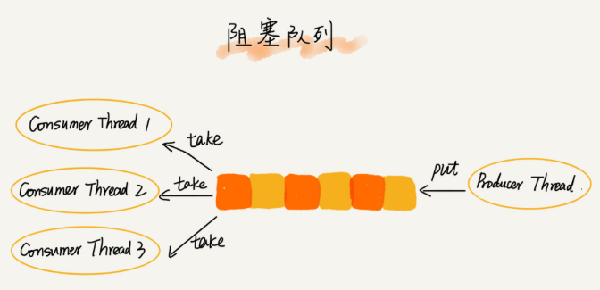
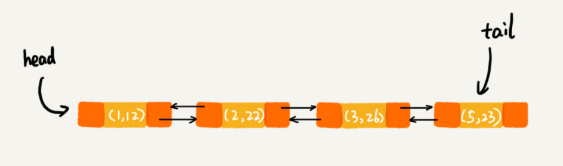
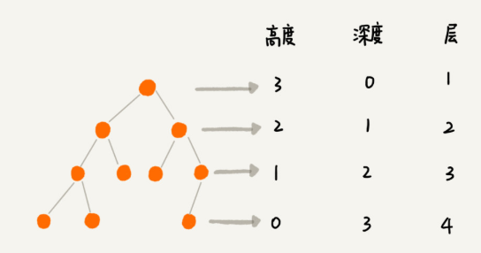
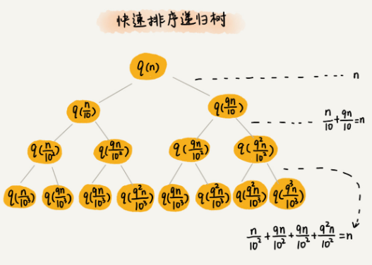
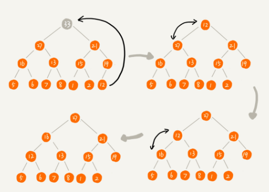
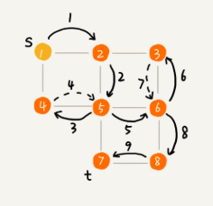

# 数据结构与算法之美

- [复杂度分析](#complexity)
- [数组](#array)
- [链表](#linkedList)
- [栈](#stack)
- [队列](#queue)
- [递归](#recursion)
- [排序](#sort)
- [线性排序](#lineSort)
- [二分查找](#binarySearch)
- [跳表](#skipList)
- [散列表](#hashTable)
- [哈希算法](#hash)
- [树](#tree)
  - [二叉树](#binaryTree)
  - [红黑树](#redBlackTree)
- [图](#graph)
- [字符串匹配](#matchStr)
- [Trie树](#Trie)
- [AC自动机](#AhoCorasick)


<h1 id="complexity">复杂度分析</h1>

## 大 O 复杂度表示法

T(n) = O(f(n))

- T(n) 代码执行时间
- n 数据规模的大小
- f(n) 每行代码执行的次数总和

> 大 O 时间复杂度实际上并不具体表示代码真正的执行时间， 而是表示代码执行时间随数据规模增长的变化趋势， 所以， 也叫作渐进时间复杂度， 简称时间复杂度。 

## 时间复杂度分析

三个比较实用的方法

1. 只关注循环执行次数最多的一段代码
2. 加法法则： 总复杂度等于量级最大的那段代码的复杂度
3. 乘法法则： 嵌套代码的复杂度等于嵌套内外的代码复杂度的乘积


分为多项式量级和非多项式量级（O(2<sup>n</sup>)、 O(n<sup>2</sup>)）

### O(logn)

> 因为对数之间可以相互转换， 所以统一用 logn 表示

```javascript
i = 1;
while (i <= n) {
    i = i * 2;
}
```

### O(m+n)， O(m\*n)

## 空间复杂度分析

> 又叫渐进空间复杂度，表示算法的存储空间与数据规模之间的增长关系。

常见空间复杂度：O(1)，O(n)，O(n<sup>2</sup>)

## 最好、最坏、平均、均摊时间复杂度

```javascript
  // n 表示数组 array 的长度
  int find(int[] array, int n, int x) {
    int i = 0;
    int pos = -1;
    for (; i < n; ++i) {
      if (array[i] == x) {
        pos = i;
        break;
      }
    }
    return pos;
  }
```

> 最好最坏复杂度意义不大：最好情况时间复杂度：O(1)、最坏情况时间复杂度：O(n)

平均情况时间复杂度（加权平均时间复杂度）


均摊时间复杂度 （摊还分析法）


<h1 id="array">数组</h1>

> 数组是一种线性表数据结构。它用一组连续的内存空间，来存储一组具有相同类型的数据。

线性表（只有简单的前后关系）


非线性表（不只有简单的前后关系喽）


当计算机需要访问数组中的某个元素时，它会首先通过寻址公式，计算出该元素存储的内存地址。

```javascript
  a[i]_address = base_address + i * data_type_size
```

根据下标随机访问的时间复杂度是O(1)

## 低效的插入和删除

插入操作：

> 如果要向有序数组第 k 个位置插入一个数据，需要将之后的数据依次后移一位，平均情况时间复杂度为O(n)
> 
> 如果数组无序，可以将原来第 k 个位置的元素放到末尾，新元素放到第 k 个位置即可。

删除操作：

> 如果要删除数组第 k 个位置的数据，需要将之后的数据依次前移一位，平均情况时间复杂度为O(n)

## 警惕数组的访问越界问题

> c语言中下标越界仍然可以访问到该地址所对应的数据！

## 容器能否完全替代数组？

个人认为，ArrayList最大的优势是可以将很多数组操作的细节封装起来。还有一个优势是动态扩容。

直接使用数组的几种情况


总结一下，对于业务开发，直接使用容器就足够了，省时省力。毕竟损耗一丢丢性能，完全不会影响到系统整体的性能。但如果你是做一些非常底层的开发，比如开发网络框架，性能的优化需要做到极致，这个时候数组就会优于容器，成为首选。

## 为什么下标从0开始

从数组存储的内存模型上来看，“下标”最确切的定义应该是“偏移（offset）”。前面也讲到，如果用 a 来表示数组的首地址，a[0] 就是偏移为 0 的位置，也就是首地址，a[k] 就表示偏移 k 个 type_size 的位置，所以计算 a[k] 的内存地址只需要用这个公式：

```
  a[k]_address = base_address + k * type_size
```

但是，如果数组从 1 开始计数，那我们计算数组元素 a[k] 的内存地址就会变为：

```
  a[k]_address = base_address + (k-1)*type_size
```

每次随机访问数组元素都多了一次减法运算，对于CPU来说就是多了一次减法指令。

> 不过我认为，上面解释得再多其实都算不上压倒性的证明，说数组起始编号非 0 开始不可。所以我觉得最主要的原因可能是历史原因。

> 实际上，很多语言中数组也并不是从 0 开始计数的，比如 Matlab。甚至还有一些语言支持负数下标，比如 Python。

<h1 id="linkedList">链表</h1>

LRU 缓存淘汰算法

> 缓存的大小有限，当缓存被用满时，哪些数据应该被清理出去，哪些数据应该被保留？这就需要缓存淘汰策略来决定。常见的策略有三种：先进先出策略 FIFO（First In，First Out）、最少使用策略 LFU（Least Frequently Used）、最近最少使用策略 LRU（Least Recently Used）。

## 五花八门的链表结构

数组与链表的区别

> 底层的存储结构

从图中可以看到，数组需要一块连续的内存空间来存储，对内存的要求比较高。如果我们申请一个 100MB 大小的数组，当内存中没有连续的、足够大的存储空间时，即便内存的剩余总可用空间大于 100MB，仍然会申请失败。

而链表恰恰相反，它并不需要一块连续的内存空间，它通过“指针”将一组零散的内存块串联起来使用，所以如果我们申请的是 100MB 大小的链表，根本不会有问题。


三种最常见的链表结构：单链表、双向链表、循环链表


### 单链表：

把内存块称为<strong>“结点”</strong>。为了将所有的结点串起来，每个链表的结点除了存储数据之外，还需要记录链上的下一个结点的地址。如图所示，我们把这个记录下个结点地址的指针叫作 <strong>后继指针 next</strong>


第一个结点（头结点），最后一个结点（尾结点）比较特殊

其中，头结点用来记录链表的基地址。有了它，我们就可以遍历得到整条链表。而尾结点特殊的地方是：指针不是指向下一个结点，而是指向一个空地址 NULL，表示这是链表上最后一个结点。

在链表中插入和删除一个数据是非常快速的，我们只需要考虑相邻结点的指针改变，所以对应的时间复杂度是 O(1)。


随机访问第 k 个元素没有数组高效，因为链表中的数据并非连续存储的，所以无法像数组那样，根据首地址和下标，通过寻址公式就能直接计算出对应的内存地址，而是需要根据指针一个结点一个结点地依次遍历，直到找到相应的结点，时间复杂度为 O(n)。

### 循环链表：

> 是一种特殊的单链表


和单链表相比，循环链表的优点是从链尾到链头比较方便。当要处理的数据具有环型结构特点时，就特别适合采用循环链表。比如著名的[约瑟夫问题](https://zh.wikipedia.org/wiki/%E7%BA%A6%E7%91%9F%E5%A4%AB%E6%96%AF%E9%97%AE%E9%A2%98)。尽管用单链表也可以实现，但是用循环链表实现的话，代码就会简洁很多。

### 双向链表


用空间换时间：

> 双向链表需要额外的两个空间来存储后继结点和前驱结点的地址。所以，如果存储同样多的数据，双向链表要比单链表占用更多的内存空间。虽然两个指针比较浪费存储空间，但可以支持双向遍历，这样也带来了双向链表操作的灵活性。


删除操作：

删除结点中“值等于某个给定值”的结点。

> 不管是单链表还是双向链表，为了查找到值等于给定值的结点，都需要从头结点开始一个一个依次遍历对比，直到找到值等于给定值的结点，然后再通过指针操作将其删除。时间复杂度 O(n)

删除给定指针指向的结点。

> 已经找到了要删除的结点，但是删除某个结点 q 需要知道其前驱结点，而单链表并不支持直接获取前驱结点，所以，还是要从头结点开始遍历链表。
> 
> 所以时间复杂度单链表 O(n)，双向链表 O(1)

同理要在链表的某个结点前面插入一个结点，单链表 O(n)，双向链表 O(1)。

如果是有序链表，双向链表的按值查询的效率也要比单链表高一些，因为可以记录上次位置和值进行比对决定向前或者向后查找。

### 双向循环链表


### 链表 VS 数组性能比拼


### 用链表实现 LRU 缓存淘汰算法

> 我的思路是这样的：我们维护一个有序单链表，越靠近链表尾部的结点是越早之前访问的。当有一个新的数据被访问时，我们从链表头开始顺序遍历链表。
> 
> 1. 如果此数据之前已经被缓存在链表中了，我们遍历得到这个数据对应的结点，并将其从原来的位置删除，然后再插入到链表的头部。
> 2. 如果此数据没有在缓存链表中，又可以分为两种情况：
> - 如果此时缓存未满，则将此结点直接插入到链表的头部；
> - 如果此时缓存已满，则链表尾结点删除，将新的数据结点插入链表的头部。

## 思考

如果字符串使用单链表储存的，如何判断是否为回文字符串。

## 如何轻松写出正确的链表代码

### 一、理解指针或引用的含义

### 二、警惕指针丢失和内存泄漏

删除链表结点时，也一定要记得手动释放内存空间（c语言）

### 三、利用哨兵简化实现难度

针对链表的插入、删除操作，需要对插入第一个结点和删除最后一个结点的情况进行特殊处理。

> 哨兵，解决的是国家之间的边界问题。同理，这里说的哨兵也是解决“边界问题”的，不直接参与业务逻辑。

如果我们引入哨兵结点，在任何时候，不管链表是不是空，head 指针都会一直指向这个哨兵结点。我们也把这种有哨兵结点的链表叫带头链表。相反，没有哨兵结点的链表就叫作不带头链表

带头链表


### 四、重点留意边界条件处理

经常用来检查链表代码是否正确的边界条件有这样几个：

- 如果链表为空时，代码是否能正常工作？
- 如果链表只包含一个结点时，代码是否能正常工作？
- 如果链表只包含两个结点时，代码是否能正常工作？
- 代码逻辑在处理头结点和尾结点的时候，是否能正常工作？

### 五、举例画图，辅助思考

例如


### 六、多写多练，没有捷径

精选了 5 个常见的链表操作。只要把这几个操作都能写熟练，不熟就多写几遍，之后再也不会害怕写链表代码。

- 单链表反转
- 链表中环的检测
- 两个有序的链表合并
- 删除链表倒数第 n 个结点
- 求链表的中间结点

<h1 id="stack">栈</h1>

> 类似放置一摞盘子，先进后出，后进先出。


> 栈是一种“操作受限”的线性表，只允许在一端插入和删除数据。

当某个数据集合只涉及在一端插入和删除数据，并且满足后进先出、先进后出的特性，我们就应该首选“栈”这种数据结构。

实际上，栈既可以用数组来实现，也可以用链表来实现。用数组实现的栈，我们叫作 <strong>顺序栈</strong>，用链表实现的栈，我们叫作 <strong>链式栈</strong>

## 如何实现一个栈

```JAVA
  // 基于数组实现的顺序栈
public class ArrayStack {
  private String[] items;  // 数组
  private int count;       // 栈中元素个数
  private int n;           // 栈的大小

  // 初始化数组，申请一个大小为 n 的数组空间
  public ArrayStack(int n) {
    this.items = new String[n];
    this.n = n;
    this.count = 0;
  }

  // 入栈操作
  public boolean push(String item) {
    // 数组空间不够了，直接返回 false，入栈失败。
    if (count == n) return false;
    // 将 item 放到下标为 count 的位置，并且 count 加一
    items[count] = item;
    ++count;
    return true;
  }
  
  // 出栈操作
  public String pop() {
    // 栈为空，则直接返回 null
    if (count == 0) return null;
    // 返回下标为 count-1 的数组元素，并且栈中元素个数 count 减一
    String tmp = items[count-1];
    --count;
    return tmp;
  }
}

```

## 支持动态扩容的顺序栈


## 栈在函数调用的应用

函数调用栈

我们知道，操作系统给每个线程分配了一块独立的内存空间，这块内存被组织成“栈”这种结构, 用来存储函数调用时的临时变量。每进入一个函数，就会将临时变量作为一个栈帧入栈，当被调用函数执行完成，返回之后，将这个函数对应的栈帧出栈。为了更好地理解，我们一块来看下这段代码的执行过程。

```java
int main() {
  int a = 1; 
  int ret = 0;
  int res = 0;
  ret = add(3, 5);
  res = a + ret;
  printf("%d", res);
  reuturn 0;
}

int add(int x, int y) {
  int sum = 0;
  sum = x + y;
  return sum;
}

```

在执行到 add() 函数时，函数调用栈的情况：


## 栈在表达式求值中的应用

简单起见，分析运算表达式：3+5*8-6

实际上，编译器就是通过两个栈来实现的。其中一个保存操作数的栈，另一个是保存运算符的栈。我们从左向右遍历表达式，当遇到数字，我们就直接压入操作数栈；当遇到运算符，就与运算符栈的栈顶元素进行比较。

如果比运算符栈顶元素的优先级高，就将当前运算符压入栈；如果比运算符栈顶元素的优先级低或者相同，从运算符栈中取栈顶运算符，从操作数栈的栈顶取 2 个操作数，然后进行计算，再把计算完的结果压入操作数栈，继续比较。


## 栈在括号匹配中的应用

## 实现浏览器中的前进后退功能

> 用两个栈就可以非常完美地解决这个问题

使用两个栈，X 和 Y，我们把首次浏览的页面依次压入栈 X，当点击后退按钮时，再依次从栈 X 中出栈，并将出栈的数据依次放入栈 Y。当我们点击前进按钮时，我们依次从栈 Y 中取出数据，放入栈 X 中。当栈 X 中没有数据时，那就说明没有页面可以继续后退浏览了。当栈 Y 中没有数据，那就说明没有页面可以点击前进按钮浏览了。

<h1 id="queue">队列</h1>


> 队列跟栈一样，也是一种操作受限的线性表数据结构

## 顺序队列和链式队列

用数组实现的队列叫作顺序队列，用链表实现的队列叫做链式队列。


基于数组的队列实现方法

```java
  // 用数组实现的队列
public class ArrayQueue {
  // 数组：items，数组大小：n
  private String[] items;
  private int n = 0;
  // head 表示队头下标，tail 表示队尾下标
  private int head = 0;
  private int tail = 0;

  // 申请一个大小为 capacity 的数组
  public ArrayQueue(int capacity) {
    items = new String[capacity];
    n = capacity;
  }

    // 入队操作，将 item 放入队尾
  public boolean enqueue(String item) {
    // tail == n 表示队列末尾没有空间了
    if (tail == n) {
      // tail ==n && head==0，表示整个队列都占满了
      if (head == 0) return false;
      // 数据搬移
      for (int i = head; i < tail; ++i) {
        items[i-head] = items[i];
      }
      // 搬移完之后重新更新 head 和 tail
      tail -= head;
      head = 0;
    }
    
    items[tail] = item;
    ++tail;
    return true;
  }


  // 出队
  public String dequeue() {
    // 如果 head == tail 表示队列为空
    if (head == tail) return null;
    // 为了让其他语言的同学看的更加明确，把 -- 操作放到单独一行来写了
    String ret = items[head];
    ++head;
    return ret;
  }
}

```

基于链表的队列实现方法


## 循环队列

> 要想写出没有bug的循环队列的实现代码，关键是确定好队空和队满的判定条件

队满时


(tail+1) % n = head

当队列满时，图中的 tail 指向的位置实际上是没有存储数据的。所以，循环队列会浪费一个数组的存储空间。

```java
public class CircularQueue {
  // 数组：items，数组大小：n
  private String[] items;
  private int n = 0;
  // head 表示队头下标，tail 表示队尾下标
  private int head = 0;
  private int tail = 0;

  // 申请一个大小为 capacity 的数组
  public CircularQueue(int capacity) {
    items = new String[capacity];
    n = capacity;
  }

  // 入队
  public boolean enqueue(String item) {
    // 队列满了
    if ((tail + 1) % n == head) return false;
    items[tail] = item;
    tail = (tail + 1) % n;
    return true;
  }

  // 出队
  public String dequeue() {
    // 如果 head == tail 表示队列为空
    if (head == tail) return null;
    String ret = items[head];
    head = (head + 1) % n;
    return ret;
  }
}

```

## 阻塞队列和并发队列

> 阻塞队列其实就是在队列基础上增加了阻塞操作。简单来说，就是在队列为空的时候，从队头取数据会被阻塞。因为此时还没有数据可取，直到队列中有了数据才能返回；如果队列已经满了，那么插入数据的操作就会被阻塞，直到队列中有空闲位置后再插入数据，然后再返回。

生产者-消费者模型



线程安全的队列我们叫作并发队列。最简单直接的实现方式是直接在 enqueue()、dequeue() 方法上加锁，但是锁粒度大并发度会比较低，同一时刻仅允许一个存或者取操作。实际上，基于数组的循环队列，利用 CAS 原子操作，可以实现非常高效的并发队列。这也是循环队列比链式队列应用更加广泛的原因。

## 线程池

实际上，对于大部分资源有限的场景，当没有空闲资源时，基本上都可以通过“队列”这种数据结构来实现请求排队。

<h1 id="recursion">递归</h1>

## 递归需要满足的三个条件

1. 一个问题的解可以分解为几个子问题的解
2. 这个问题与分解之后的子问题，除了数据规模不同，求解思路完全一样
3. 存在递归终止条件

## 如何编写递归代码

> 关键是写出递推公式，找到终止条件

<span style='color:orange'>写递归代码的关键就是找到如何将大问题分解为小问题的规律，并且基于此写出递推公式，然后再推敲终止条件，最后将递推公式和终止条件翻译成代码</span>

编写递归代码的关键是，只要遇到递归，我们就把它抽象成一个递推公式，不用想一层层的调用关系，不要试图用人脑去分解递归的每个步骤

## 递归代码要警惕堆栈溢出

限制递归深度伪代码

```java
// 全局变量，表示递归的深度。
int depth = 0;

int f(int n) {
  ++depth；
  if (depth > 1000) throw exception;
  
  if (n == 1) return 1;
  return f(n-1) + 1;
}
```

但这种做法并不能完全解决问题，因为最大允许的递归深度跟当前线程剩余的栈空间大小有关，事先无法计算。如果实时计算，代码过于复杂，就会影响代码的可读性。所以，如果最大深度比较小，比如 10、50，就可以用这种方法，否则这种方法并不是很实用。

## 递归代码要警惕重复计算

为了避免重复计算，我们可以通过一个数据结构（比如散列表）来保存已经求解过的 f(k)。当递归调用到 f(k) 时，先看下是否已经求解过了。如果是，则直接从散列表中取值返回，不需要重复计算，这样就能避免刚讲的问题了。

除了堆栈溢出、重复计算这两个常见的问题。递归代码还有很多别的问题。

在时间效率上，递归代码里多了很多函数调用，当这些函数调用的数量较大时，就会积聚成一个可观的时间成本。在空间复杂度上，因为递归调用一次就会在内存栈中保存一次现场数据，所以在分析递归代码空间复杂度时，需要额外考虑这部分的开销。

## 怎么讲递归代码改写为非递归代码

```java
// 递归
int f(int n) {
  if (n == 1) return 1;
  return f(n-1) + 1;
}

// 非递归
int f(int n) {
  int ret = 1;
  for (int i = 2; i <= n; ++i) {
    ret = ret + 1;
  }
  return ret;
}
```

```java
// 递归
int f(int n) {
  if (n == 1) return 1;
  if (n == 2) return 2;
  return f(n-1) + f(n-2);
}

// 非递归
int f(int n) {
  if (n == 1) return 1;
  if (n == 2) return 2;
  
  int ret = 0;
  int pre = 2;
  int prepre = 1;
  for (int i = 3; i <= n; ++i) {
    ret = pre + prepre;
    prepre = pre;
    pre = ret;
  }
  return ret;
}
```

笼统地讲，所有递归代码都可以改成非递归的模式。因为递归本身就是借助栈来实现的，只不过我们使用的栈是系统或者虚拟机本身提供的，我们没有感知罢了。如果我们自己在内存堆上实现栈，手动模拟入栈、出栈过程，这样任何递归代码都可以改写成看上去不是递归代码的样子。

但是这种思路实际上是将递归改为了“手动”递归，本质并没有变，而且也并没有解决前面讲到的某些问题，徒增了实现的复杂度。

## 思考： 如何调试递归

1. 打印日志，发现递归值
2. 结合条件断点进行调试

<h1 id="sort">排序</h1>


<strong><span style="color:orange">插入排序和冒泡排序的时间复杂度相同，都是 O(n<sup>2</sup>)，在实际的软件开发里，为什么我们更倾向于使用插入排序算法而不是冒泡排序算法呢？</span></strong>

## 如何分析一个排序算法

1. 最好情况、最坏情况、平均情况时间复杂度

> 为什么要区分这三种时间复杂度呢？第一，有些排序算法会区分，为了好对比，所以我们最好都做一下区分。第二，对于要排序的数据，有的接近有序，有的完全无序。有序度不同的数据，对于排序的执行时间肯定是有影响的，我们要知道排序算法在不同数据下的性能表现。

2. 时间复杂度的系数、常数、低阶

> 我们知道，时间复杂度反应的是数据规模 n 很大的时候的一个增长趋势，所以它表示的时候会忽略系数、常数、低阶。但是实际的软件开发中，我们排序的可能是 10 个、100 个、1000 个这样规模很小的数据，所以，在对同一阶时间复杂度的排序算法性能对比的时候，我们就要把系数、常数、低阶也考虑进来。

3. 比较次数和交换（或移动）次数

> 基于比较的排序算法的执行过程，会涉及两种操作，一种是元素比较大小，另一种是元素交换或移动。所以，如果我们在分析排序算法的执行效率的时候，应该把比较次数和交换（或移动）次数也考虑进去。

<span style="color:orange">排序算法的内存消耗</span>

算法的内存消耗可以通过空间复杂度来衡量，排序算法也不例外。不过，针对排序算法的空间复杂度，我们还引入了一个新的概念，原地排序（Sorted in place）。原地排序算法，就是特指空间复杂度是 O(1) 的排序算法。接下来的三种排序算法，都是原地排序算法。

<span style="color:orange">排序算法的稳定性</span>

仅仅用执行效率和内存消耗来衡量排序算法的好坏是不够的。针对排序算法，我们还有一个重要的度量指标，稳定性。这个概念是说，如果待排序的序列中存在值相等的元素，经过排序之后，相等元素之间原有的先后顺序不变。

## 冒泡排序

冒泡排序只会操作相邻的两个数据。每次冒泡操作都会对相邻的两个元素进行比较，看是否满足大小关系要求。如果不满足就让它俩互换。一次冒泡会让至少一个元素移动到它应该在的位置，重复 n 次，就完成了 n 个数据的排序工作。

我们要对一组数据 4，5，6，3，2，1，从小到到大进行排序。第一次冒泡操作的详细过程就是这样：


要想完成所有数据的排序，我们只要进行 6 次这样的冒泡操作就行了。


实际上，刚讲的冒泡过程还可以优化。当某次冒泡操作已经没有数据交换时，说明已经达到完全有序，不用再继续执行后续的冒泡操作。


```java
// 冒泡排序，a 表示数组，n 表示数组大小
public void bubbleSort(int[] a, int n) {
  if (n <= 1) return;
 
 for (int i = 0; i < n; ++i) {
    // 提前退出冒泡循环的标志位
    boolean flag = false;
    for (int j = 0; j < n - i - 1; ++j) {
      if (a[j] > a[j+1]) { // 交换
        int tmp = a[j];
        a[j] = a[j+1];
        a[j+1] = tmp;
        flag = true;  // 表示有数据交换      
      }
    }
    if (!flag) break;  // 没有数据交换，提前退出
  }
}
```

### 冒泡排序是原地排序算法吗？

冒泡的过程只涉及相邻数据的交换操作，只需要常量级的临时空间，所以它的空间复杂度为 O(1)，是一个原地排序算法。

### 冒泡排序是稳定的排序算法吗？

在冒泡排序中，只有交换才可以改变两个元素的前后顺序。为了保证冒泡排序算法的稳定性，当有相邻的两个元素大小相等的时候，我们不做交换，相同大小的数据在排序前后不会改变顺序，所以冒泡排序是稳定的排序算法。

### 冒泡排序的时间复杂度是多少？

最好情况下，要排序的数据已经是有序的了，我们只需要进行一次冒泡操作，就可以结束了，所以最好情况时间复杂度是 O(n)。而最坏的情况是，要排序的数据刚好是倒序排列的，我们需要进行 n 次冒泡操作，所以最坏情况时间复杂度为 O(n<sup>2</sup>)。

平均时间复杂度

如果用概率论方法定量分析平均时间复杂度，涉及的数学推理和计算就会很复杂。我这里还有一种思路，通过“有序度”和“逆序度”这两个概念来进行分析。

对于一个倒序排列的数组，比如 6，5，4，3，2，1，有序度是 0；对于一个完全有序的数组，比如 1，2，3，4，5，6，有序度就是n*(n-1)/2，也就是 15。我们把这种完全有序的数组的有序度叫作满有序度。

逆序度 = 满有序度 - 有序度

要排序的数组的初始状态是 4，5，6，3，2，1 ，其中，有序元素对有 (4，5) (4，6)(5，6)，所以有序度是 3。n=6，所以排序完成之后终态的满有序度为 n*(n-1)/2=15。


冒泡排序包含两个操作原子，比较和交换。。每交换一次，有序度就加 1。不管算法怎么改进，交换次数总是确定的，即为逆序度，也就是n*(n-1)/2–初始有序度。此例中就是 15–3=12，要进行 12 次交换操作。

平均情况下，需要 n*(n-1)/4 次交换操作，比较操作肯定要比交换操作多，而复杂度的上限是 O(n<sup>2</sup>)，所以平均情况下的时间复杂度就是 O(n<sup>2</sup>)。

此推导方法不严格，但是很实用。

## 插入排序

首先，我们将数组中的数据分为两个区间，已排序区间和未排序区间。初始已排序区间只有一个元素，就是数组的第一个元素。插入算法的核心思想是取未排序区间中的元素，在已排序区间中找到合适的插入位置将其插入，并保证已排序区间数据一直有序。重复这个过程，直到未排序区间中元素为空，算法结束。

如图所示，要排序的数据是 4，5，6，1，3，2，其中左侧为已排序区间，右侧是未排序区间。


也包含两种操作：元素的比较、元素的移动

对于不同的查找插入点方法（从头到尾、从尾到头），元素的比较次数是有区别的。但对于一个给定的初始序列，移动操作的次数总是固定的，就等于逆序度。

```java
// 插入排序，a 表示数组，n 表示数组大小
public void insertionSort(int[] a, int n) {
  if (n <= 1) return;

  for (int i = 1; i < n; ++i) {
    int value = a[i];
    int j = i - 1;
    // 查找插入的位置
    for (; j >= 0; --j) {
      if (a[j] > value) {
        a[j+1] = a[j];  // 数据移动
      } else {
        break;
      }
    }
    a[j+1] = value; // 插入数据
  }
}
```

- 是否原地排序：是
- 是否稳定排序：是
- 时间复杂度：O(n<sup>2</sup>)

## 选择排序

选择排序算法的实现思路有点类似插入排序，也分已排序区间和未排序区间。但是选择排序每次会从未排序区间中找到最小的元素，将其放到已排序区间的末尾。


- 是否原地排序：是
- 是否稳定排序：否
- 时间复杂度：O(n<sup>2</sup>)

## 比较


我们前面分析冒泡排序和插入排序的时候讲到，冒泡排序不管怎么优化，元素交换的次数是一个固定值，是原始数据的逆序度。插入排序是同样的，不管怎么优化，元素移动的次数也等于原始数据的逆序度。

但是，从代码实现上来看，冒泡排序的数据交换要比插入排序的数据移动要复杂，冒泡排序需要 3 个赋值操作，而插入排序只需要 1 个。

## 归并排序

归并排序的核心思想还是蛮简单的。如果要排序一个数组，我们先把数组从中间分成前后两部分，然后对前后两部分分别排序，再将排好序的两部分合并在一起，这样整个数组就都有序了。


归并排序使用的就是分治思想。分治，顾名思义，就是分而治之，将一个大问题分解成小的子问题来解决。小的子问题解决了，大问题也就解决了。

```javascript
//递推公式：
merge_sort(p…r) = merge(merge_sort(p…q), merge_sort(q+1…r))

//终止条件：
p >= r 不用再继续分解
```

伪代码具体实现

```java
// 归并排序算法, A 是数组，n 表示数组大小
merge_sort(A, n) {
  merge_sort_c(A, 0, n-1)
}

// 递归调用函数
merge_sort_c(A, p, r) {
  // 递归终止条件
  if p >= r  then return

  // 取 p 到 r 之间的中间位置 q
  q = (p+r) / 2
  // 分治递归
  merge_sort_c(A, p, q)
  merge_sort_c(A, q+1, r)
  // 将 A[p...q] 和 A[q+1...r] 合并为 A[p...r]
  merge(A[p...r], A[p...q], A[q+1...r])
}

merge(A[p...r], A[p...q], A[q+1...r]) {
  var i := p，j := q+1，k := 0 // 初始化变量 i, j, k
  var tmp := new array[0...r-p] // 申请一个大小跟 A[p...r] 一样的临时数组
  while i<=q AND j<=r do {
    if A[i] <= A[j] {
      tmp[k++] = A[i++] // i++ 等于 i:=i+1
    } else {
      tmp[k++] = A[j++]
    }
  }
  // 判断哪个子数组中有剩余的数据
  var start := i，end := q
  if j<=r then start := j, end:=r
  // 将剩余的数据拷贝到临时数组 tmp
  while start <= end do {
    tmp[k++] = A[start++]
  }
  // 将 tmp 中的数组拷贝回 A[p...r]
  for i:=0 to r-p do {
    A[p+i] = tmp[i]
  }
}
```

可借助哨兵简化merge函数

## 归并排序的性能分析

### 一、归并排序是稳定的排序算法吗？

归并排序稳不稳定关键要看merge()函数，也就是两个有序子数组合并成一个有序数组的那部分代码。

### 二、归并排序的时间复杂度是多少？

递归的适用场景是，一个问题 a 可以分解为多个子问题 b、c，那求解问题 a 就可以分解为求解问题 b、c。问题 b、c 解决之后，我们再把 b、c 的结果合并成 a 的结果。

如果我们定义求解问题 a 的时间是 T(a)，求解问题 b、c 的时间分别是 T(b) 和 T( c)，那我们就可以得到这样的递推关系式：

```
T(a) = T(b) + T(c) + K
```

我们假设对 n 个元素进行归并排序需要的时间是 T(n)，那分解成两个子数组排序的时间都是 T(n/2)。我们知道，merge() 函数合并两个有序子数组的时间复杂度是 O(n)。所以，套用前面的公式，归并排序的时间复杂度的计算公式就是：

```java
T(1) = C；//n=1 时，只需要常量级的执行时间，所以表示为 C。
T(n) = 2*T(n/2) + n； n>1
```

```java
T(n) = 2*T(n/2) + n
     = 2*(2*T(n/4) + n/2) + n = 4*T(n/4) + 2*n
     = 4*(2*T(n/8) + n/4) + 2*n = 8*T(n/8) + 3*n
     = 8*(2*T(n/16) + n/8) + 3*n = 16*T(n/16) + 4*n
     ......
     = 2^k * T(n/2^k) + k * n
     ......
```

当 T(n/2^k)=T(1) 时，也就是 n/2^k=1，我们得到 k=log<sup>2</sup>n 。我们将 k 值代入上面的公式，得到 T(n)=Cn+nlog<sup>2</sup>n 。如果我们用大 O 标记法来表示的话，T(n) 就等于 O(nlogn)。所以归并排序的时间复杂度是 O(nlogn)。

### 三、归并排序的空间复杂度是多少？

尽管每次合并操作都需要申请额外的内存空间，但在合并完成之后，临时开辟的内存空间就被释放掉了。在任意时刻，CPU 只会有一个函数在执行，也就只会有一个临时的内存空间在使用。临时内存空间最大也不会超过 n 个数据的大小，所以空间复杂度是 O(n)。

## 快速排序

快排的思想是这样的：如果要排序数组中下标从 p 到 r 之间的一组数据，我们选择 p 到 r 之间的任意一个数据作为 pivot（分区点）。

我们遍历 p 到 r 之间的数据，将小于 pivot 的放到左边，将大于 pivot 的放到右边，将 pivot 放到中间。经过这一步骤之后，数组 p 到 r 之间的数据就被分成了三个部分，前面 p 到 q-1 之间都是小于 pivot 的，中间是 pivot，后面的 q+1 到 r 之间是大于 pivot 的。


```java
//递推公式：
quick_sort(p…r) = quick_sort(p…q-1) + quick_sort(q+1, r)

//终止条件：
p >= r
```

```java
// 快速排序，A 是数组，n 表示数组的大小
quick_sort(A, n) {
  quick_sort_c(A, 0, n-1)
}
// 快速排序递归函数，p,r 为下标
quick_sort_c(A, p, r) {
  if p >= r then return
  
  q = partition(A, p, r) // 获取分区点
  quick_sort_c(A, p, q-1)
  quick_sort_c(A, q+1, r)
}
```

归并排序中有一个 merge() 合并函数，我们这里有一个 partition() 分区函数。partition() 分区函数实际上我们前面已经讲过了，就是随机选择一个元素作为 pivot（一般情况下，可以选择 p 到 r 区间的最后一个元素），然后对 A[p…r] 分区，函数返回 pivot 的下标。

非原地方法分区


原地分区函数伪代码

```java
partition(A, p, r) {
  pivot := A[r]
  i := p
  for j := p to r-1 do {
    if A[j] < pivot {
      swap A[i] with A[j]
      i := i+1
    }
  }
  swap A[i] with A[r]
  return i
}
```


因为分区的过程涉及交换操作，如果数组中有两个相同的元素，比如序列 6，8，7，6，3，5，9，4，在经过第一次分区操作之后，两个 6 的相对先后顺序就会改变。所以，快速排序并不是一个稳定的排序算法。

快速排序和归并排序的区别：


可以发现，归并排序的处理过程是由下到上的，先处理子问题，然后再合并。而快排正好相反，它的处理过程是由上到下的，先分区，然后再处理子问题。归并排序虽然是稳定的、时间复杂度为 O(nlogn) 的排序算法，但是它是非原地排序算法。我们前面讲过，归并之所以是非原地排序算法，主要原因是合并函数无法在原地执行。快速排序通过设计巧妙的原地分区函数，可以实现原地排序，解决了归并排序占用太多内存的问题。

## 快速排序的性能分析

如果每次分区都能把数组分成大小接近相等的两个小区间，则其时间复杂度公式和归并排序相同。所以，此时快排的时间复杂度也是O(nlogn)（最好情况时间复杂度）。

```java
T(1) = C;  //n=1 时，只需要常量级的执行时间，所以表示为 C。
T(n) = 2*T(n/2) + n； n>1
```

但是上述情况是最好情况，比较难实现。

最坏情况是数组中的数据原来已经是有序的，比如1,3,5,6,8。如果每次选择最后一个元素作为pivot，那每次分区得到的两个区间都是不均等的。时间复杂度从O(nlogn)退化成了O(n<sup>2</sup>)（最坏情况时间复杂度）。

## 如何用快排思想在O(n)内查找第K大元素？

我们选择数组区间 A[0…n-1] 的最后一个元素 A[n-1] 作为 pivot，对数组 A[0…n-1] 原地分区，这样数组就分成了三部分，A[0…p-1]、A[p]、A[p+1…n-1]。

如果 p+1=K，那 A[p] 就是要求解的元素；如果 K>p+1, 说明第 K 大元素出现在 A[p+1…n-1] 区间，我们再按照上面的思路递归地在 A[p+1…n-1] 这个区间内查找。同理，如果 K<p+1，那我们就在 A[0…p-1] 区间查找。


## 思考

现在你有 10 个接口访问日志文件，每个日志文件大小约 300MB，每个文件里的日志都是按照时间戳从小到大排序的。你希望将这 10 个较小的日志文件，合并为 1 个日志文件，合并之后的日志仍然按照时间戳从小到大排列。如果处理上述排序任务的机器内存只有 1GB，你有什么好的解决思路，能“快速”地将这 10 个日志文件合并吗？

<h1 id="lineSort">线性排序</h1>

桶排序、计数排序、基数排序

之所以能做到线性的时间复杂度，主要原因是，这三个算法是非基于比较的排序算法，都不涉及元素之间的比较操作。

## 桶排序（Bucket sort）


为什么桶排序的时间复杂度是O(n)

如果要排序的数据有 n 个，我们把它们均匀地划分到 m 个桶内，每个桶里就有 k=n/m 个元素。每个桶内部使用快速排序，时间复杂度为 O(k * logk)。m 个桶排序的时间复杂度就是 O(m * k * logk)，因为 k=n/m，所以整个桶排序的时间复杂度就是 O(n*log(n/m))。当桶的个数 m 接近数据个数 n 时，log(n/m) 就是一个非常小的常量，这个时候桶排序的时间复杂度接近 O(n)。

实际上，桶排序对要排序数据的要求是非常苛刻的。

首先，要排序的数据需要很容易就能划分成 m 个桶，并且，桶与桶之间有着天然的大小顺序。这样每个桶内的数据都排序完之后，桶与桶之间的数据不需要再进行排序。

其次，数据在各个桶之间的分布是比较均匀的。如果数据经过桶的划分之后，有些桶里的数据非常多，有些非常少，很不平均，那桶内数据排序的时间复杂度就不是常量级了。在极端情况下，如果数据都被划分到一个桶里，那就退化为 O(nlogn) 的排序算法了。

桶排序比较适合用在外部排序中。所谓的外部排序就是数据存储在外部磁盘中，数据量比较大，内存有限，无法将数据全部加载到内存中。

## 计数排序（Counting sort）

计数排序其实是桶排序的一种特殊情况

当要排序的 n 个数据，所处的范围并不大的时候，比如最大值是 k，我们就可以把数据划分成 k 个桶。每个桶内的数据值都是相同的，省掉了桶内排序的时间。

```java
// 计数排序，a 是数组，n 是数组大小。假设数组中存储的都是非负整数。
public void countingSort(int[] a, int n) {
  if (n <= 1) return;

  // 查找数组中数据的范围
  int max = a[0];
  for (int i = 1; i < n; ++i) {
    if (max < a[i]) {
      max = a[i];
    }
  }

  int[] c = new int[max + 1]; // 申请一个计数数组 c，下标大小 [0,max]
  for (int i = 0; i <= max; ++i) {
    c[i] = 0;
  }

  // 计算每个元素的个数，放入 c 中
  for (int i = 0; i < n; ++i) {
    c[a[i]]++;
  }

  // 依次累加
  for (int i = 1; i <= max; ++i) {
    c[i] = c[i-1] + c[i];
  }

  // 临时数组 r，存储排序之后的结果
  int[] r = new int[n];
  // 计算排序的关键步骤，有点难理解
  for (int i = n - 1; i >= 0; --i) {
    int index = c[a[i]]-1;
    r[index] = a[i];
    c[a[i]]--;
  }

  // 将结果拷贝给 a 数组
  for (int i = 0; i < n; ++i) {
    a[i] = r[i];
  }
}
```

计数排序只能用在数据范围不大的场景中，如果数据范围 k 比要排序的数据 n 大很多，就不适合用计数排序了。而且，计数排序只能给非负整数排序，如果要排序的数据是其他类型的，要将其在不改变相对大小的情况下，转化为非负整数。

## 基数排序（Radix sort）

再来看这样一个排序问题。假设我们有 10 万个手机号码，希望将这 10 万个手机号码从小到大排序，你有什么比较快速的排序方法呢？

刚刚这个问题里有这样的规律：假设要比较两个手机号码 a，b 的大小，如果在前面几位中，a 手机号码已经比 b 手机号码大了，那后面的几位就不用看了。


根据每一位来排序，我们可以用刚讲过的桶排序或者计数排序，它们的时间复杂度可以做到 O(n)。如果要排序的数据有 k 位，那我们就需要 k 次桶排序或者计数排序，总的时间复杂度是 O(k*n)。当 k 不大的时候，比如手机号码排序的例子，k 最大就是 11，所以基数排序的时间复杂度就近似于 O(n)。

注意：每一位的排序一定是稳定排序才可以

总结一下：

基数排序对要排序的数据是有要求的，需要可以分割出独立的“位”来比较，而且位之间有递进的关系，如果 a 数据的高位比 b 数据大，那剩下的低位就不用比较了。除此之外，每一位的数据范围不能太大，要可以用线性排序算法来排序，否则，基数排序的时间复杂度就无法做到 O(n) 了。

## 排序优化

如何实现一个通用的、高性能的排序函数？


如何优化快速排序

先来看下，为什么最坏情况下快速排序的时间复杂度是 O(n<sup>2</sup>) 呢？前面讲过，如果数据原来就是有序的或者接近有序的，每次分区点都选择最后一个数据，那快速排序算法就会变得非常糟糕，时间复杂度就会退化为 O(n<sup>2</sup>)。实际上，这种 O(n<sup>2</sup>) 时间复杂度出现的主要原因还是因为我们分区点选的不够合理。

最理想的分区点是：被分区点分开的两个分区中，数据的数量差不多。

两个比较常用、比较简单的分区算法：

1. 三数取中法

我们从区间的首、尾、中间，分别取出一个数，然后对比大小，取这 3 个数的中间值作为分区点。这样每间隔某个固定的长度，取数据出来比较，将中间值作为分区点的分区算法，肯定要比单纯取某一个数据更好。但是，如果要排序的数组比较大，那“三数取中”可能就不够了，可能要“五数取中”或者“十数取中”。

2. 随机法

随机法就是每次从要排序的区间中，随机选择一个元素作为分区点。这种方法并不能保证每次分区点都选的比较好，但是从概率的角度来看，也不大可能会出现每次分区点都选的很差的情况，所以平均情况下，这样选的分区点是比较好的。时间复杂度退化为最糟糕的 O(n<sup>2</sup>) 的情况，出现的可能性不大。

我们知道，快速排序是用递归来实现的。我们在递归那一节讲过，递归要警惕堆栈溢出。为了避免快速排序里，递归过深而堆栈过小，导致堆栈溢出，我们有两种解决办法：第一种是限制递归深度。一旦递归过深，超过了我们事先设定的阈值，就停止递归。<strong>第二种是通过在堆上模拟实现一个函数调用栈，手动模拟递归压栈、出栈的过程，这样就没有了系统栈大小的限制<strong>。

<h1 id="binarySearch">二分查找</h1>


二分查找针对的是一个有序的数据集合，查找思想有点类似分治思想。每次都通过跟区间的中间元素对比，将待查找的区间缩小为之前的一半，直到找到要查找的元素，或者区间被缩小为 0。

时间复杂度：O(logn)

这是一种极其高效的时间复杂度，有的时候甚至比时间复杂度是常量级 O(1) 的算法还要高效。为什么这么说呢？

因为 logn 是一个非常“恐怖”的数量级，即便 n 非常非常大，对应的 logn 也很小。比如 n 等于 2 的 32 次方，这个数很大了吧？大约是 42 亿。也就是说，如果我们在 42 亿个数据中用二分查找一个数据，最多需要比较 32 次。

用大 O 标记法表示时间复杂度的时候，会省略掉常数、系数和低阶。对于常量级时间复杂度的算法来说，O(1) 有可能表示的是一个非常大的常量值，比如 O(1000)、O(10000)。所以，常量级时间复杂度的算法有时候可能还没有 O(logn) 的算法执行效率高。

## 二分查找的递归与非递归实现

有序数组中不存在重复元素

```java
public int bsearch(int[] a, int n, int value) {
  int low = 0;
  int high = n - 1;

  while (low <= high) {
    int mid = low+((high-low)>>1);
    if (a[mid] == value) {
      return mid;
    } else if (a[mid] < value) {
      low = mid + 1;
    } else {
      high = mid - 1;
    }
  }
  return -1;
}
```

```java
// 二分查找的递归实现
public int bsearch(int[] a, int n, int val) {
  return bsearchInternally(a, 0, n - 1, val);
}

private int bsearchInternally(int[] a, int low, int high, int value) {
  if (low > high) return -1;

  int mid =  low + ((high - low) >> 1);
  if (a[mid] == value) {
    return mid;
  } else if (a[mid] < value) {
    return bsearchInternally(a, mid+1, high, value);
  } else {
    return bsearchInternally(a, low, mid-1, value);
  }
}
```

## 二分查找应用场景的局限性

首先，二分查找依赖的是顺序表结构，简单点说就是数组。

其次，二分查找针对的是有序数据。

二分查找只能用在插入、删除操作不频繁，一次排序多次查找的场景中。针对动态变化的数据集合，二分查找将不再适用。那针对动态数据集合，如何在其中快速查找某个数据呢？别急，等到二叉树会详细讲。

再次，数据量太小不适合二分查找。

不过，这里有一个例外。如果数据之间的比较操作非常耗时，不管数据量大小，都推荐使用二分查找。比如，数组中存储的都是长度超过 300 的字符串，如此长的两个字符串之间比对大小，就会非常耗时。我们需要尽可能地减少比较次数，而比较次数的减少会大大提高性能，这个时候二分查找就比顺序遍历更有优势。

最后，数据量太大也不适合二分查找。

## 二分查找的变形问题


### 变体一：查找第一个值等于给定值的元素

```java
public int bsearch(int[] a, int n, int value) {
  int low = 0;
  int high = n - 1;
  while (low <= high) {
    int mid = low + ((high - low) >> 1);
    if (a[mid] >= value) {
      high = mid - 1;
    } else {
      low = mid + 1;
    }
  }

  if (low < n && a[low]==value) return low;
  else return -1;
}
```

### 变体二：查找最后一个值等于给定值的元素

```java
public int bsearch(int[] a, int n, int value) {
  int low = 0;
  int high = n - 1;
  while (low <= high) {
    int mid =  low + ((high - low) >> 1);
    if (a[mid] > value) {
      high = mid - 1;
    } else if (a[mid] < value) {
      low = mid + 1;
    } else {
      if ((mid == n - 1) || (a[mid + 1] != value)) return mid;
      else low = mid + 1;
    }
  }
  return -1;
}
```

### 变体三：查找第一个大于等于给定值的元素

```java
public int bsearch(int[] a, int n, int value) {
  int low = 0;
  int high = n - 1;
  while (low <= high) {
    int mid =  low + ((high - low) >> 1);
    if (a[mid] >= value) {
      if ((mid == 0) || (a[mid - 1] < value)) return mid;
      else high = mid - 1;
    } else {
      low = mid + 1;
    }
  }
  return -1;
}
```

### 变体四：查找最后一个小于等于给定值的元素

```java
public int bsearch7(int[] a, int n, int value) {
  int low = 0;
  int high = n - 1;
  while (low <= high) {
    int mid =  low + ((high - low) >> 1);
    if (a[mid] > value) {
      high = mid - 1;
    } else {
      if ((mid == n - 1) || (a[mid + 1] > value)) return mid;
      else low = mid + 1;
    }
  }
  return -1;
}
```

容易出错的细节有：<strong>终止条件、区间上下界更新方法、返回值选择</strong>

<h1 id="skipList">跳表</h1>

对于一个单链表来讲，即便链表中存储的数据是有序的，如果我们要想在其中查找某个数据，也只能从头到尾遍历链表。这样查找效率就会很低，时间复杂度会很高，是 O(n)。


那怎么来提高查找效率呢？如果像图中那样，对链表建立一级“索引”，查找起来是不是就会更快一些呢？每两个结点提取一个结点到上一级，我们把抽出来的那一级叫作索引或索引层。你可以看下图。图中的 down 表示 down 指针，指向下一级结点。


## 用跳表查询到底有多快？

每两个结点会抽出一个结点作为上一级索引的结点，那第一级索引的结点个数大约就是 n/2，第二级索引的结点个数大约就是 n/4，第三级索引的结点个数大约就是 n/8，依次类推，也就是说，第 k 级索引的结点个数是第 k-1 级索引的结点个数的 1/2，那第 k级索引结点的个数就是 n/(2<sup>k</sup>)。

n-1。如果包含原始链表这一层，整个跳表的高度就是 log<sub>2</sub>n。在跳表中查询某个数据的时候，每一层都要遍历3个结点。所以在跳表中查询任意数据的时间复杂度就是O(logn)。

这个查找的时间复杂度跟二分查找是一样的。换句话说，我们其实是基于单链表实现了二分查找，是不是很神奇？不过，天下没有免费的午餐，这种查询效率的提升，前提是建立了很多级索引，<strong>空间换时间</strong>。

## 跳表是不是很浪费内存？

跳表的空间复杂度分析并不难，我在前面说了，假设原始链表大小为 n，那第一级索引大约有 n/2 个结点，第二级索引大约有 n/4 个结点，以此类推，每上升一级就减少一半，直到剩下 2 个结点。如果我们把每层索引的结点数写出来，就是一个等比数列。

这几级索引的结点总和就是 n/2+n/4+n/8…+8+4+2=n-2。所以，跳表的空间复杂度是 O(n)。也就是说，如果将包含 n 个结点的单链表构造成跳表，我们需要额外再用接近 n 个结点的存储空间。那我们有没有办法降低索引占用的内存空间呢？

如果每三个结点或五个结点，抽一个结点到上级索引，是不是就不用那么多索引结点了呢？画了一个每三个结点抽一个的示意图，你可以看下。


通过等比数列求和公式，总的索引结点大约就是 n/3+n/9+n/27+…+9+3+1=n/2。尽管空间复杂度还是 O(n)，但比上面的每两个结点抽一个结点的索引构建方法，要减少了一半的索引结点存储空间。

实际上，在软件开发中，我们不必太在意索引占用的额外空间。在讲数据结构和算法时，我们习惯性地把要处理的数据看成整数，但是在实际的软件开发中，原始链表中存储的有可能是很大的对象，而索引结点只需要存储关键值和几个指针，并不需要存储对象，所以当对象比索引结点大很多时，那索引占用的额外空间就可以忽略了。

## 高效的动态插入和删除（Ologn）

插入：

我们知道，在单链表中，一旦定位好要插入的位置，插入结点的时间复杂度是很低的，就是 O(1)。但是，这里为了保证原始链表中数据的有序性，我们需要先找到要插入的位置，这个查找操作就会比较耗时。


删除：

如果这个结点在索引中也有出现，我们除了要删除原始链表中的结点，还要删除索引中的。因为单链表中的删除操作需要拿到要删除结点的前驱结点，然后通过指针操作完成删除。所以在查找要删除的结点的时候，一定要获取前驱结点。当然，如果我们用的是双向链表，就不需要考虑这个问题了。

## 跳表索引动态更新

当我们不停地往跳表中插入数据时，如果我们不更新索引，就有可能出现某 2 个索引结点之间数据非常多的情况。极端情况下，跳表还会退化成单链表。


作为一种动态数据结构，我们需要某种手段来维护索引与原始链表大小之间的平衡，也就是说，如果链表中结点多了，索引结点就相应地增加一些，避免复杂度退化，以及查找、插入、删除操作性能下降。

当我们往跳表中插入数据的时候，我们可以选择同时将这个数据插入到部分索引层中。如何选择加入哪些索引层呢？

我们通过一个随机函数，来决定将这个结点插入到哪几级索引中，比如随机函数生成了值 K，那我们就将这个结点添加到第一级到第 K 级这 K 级索引中。


随机函数的选择很有讲究，从概率上来讲，能够保证跳表的索引大小和数据大小平衡性，不至于性能过度退化。

## 为什么 Redis 要用跳表来实现有序集合，而不是红黑树？

Redis 中的有序集合是通过跳表来实现的，严格点讲，其实还用到了散列表。不过散列表我们后面才会讲到，所以我们现在暂且忽略这部分。如果你去查看 Redis 的开发手册，就会发现，Redis 中的有序集合支持的核心操作主要有下面这几个：

- 插入一个数据
- 删除一个数据
- 查找一个数据
- 按照区间查找数据
- 迭代输出有序序列

其中，插入、删除、查找以及迭代输出有序序列这几个操作，红黑树也可以完成，时间复杂度跟跳表是一样的。但是，按照区间来查找数据这个操作，红黑树的效率没有跳表高。

对于按照区间查找数据这个操作，跳表可以做到 O(logn) 的时间复杂度定位区间的起点，然后在原始链表中顺序往后遍历就可以了。这样做非常高效。

当然，Redis 之所以用跳表来实现有序集合，还有其他原因，比如，跳表更容易代码实现。虽然跳表的实现也不简单，但比起红黑树来说还是好懂、好写多了，而简单就意味着可读性好，不容易出错。还有，跳表更加灵活，它可以通过改变索引构建策略，有效平衡执行效率和内存消耗。

<h1 id="hashTable">散列表</h1>

## 散列思想

散列表用的是数组支持按照下标随机访问数据的特性，所以散列表其实就是数组的一种扩展，由数组演化而来。可以说，如果没有数组，就没有散列表。


我们可以总结出这样的规律：散列表用的就是数组支持按照下标随机访问的时候，时间复杂度是 O(1) 的特性。我们通过散列函数把元素的键值映射为下标，然后将数据存储在数组中对应下标的位置。当我们按照键值查询元素时，我们用同样的散列函数，将键值转化数组下标，从对应的数组下标的位置取数据。

## 散列函数

散列函数，顾名思义，它是一个函数。我们可以把它定义成hash(key)，其中 key 表示元素的键值，hash(key) 的值表示经过散列函数计算得到的散列值。

三点散列函数设计的基本要求：

1. 散列函数计算得到的散列值是一个非负整数
2. 如果key1 = key2，那hash(key1) == hash(key2)
3. 如果key1 &ne; key2，那hash(key1) &ne; hash(key2)

## 散列冲突

常用的散列冲突解决方法有两类，开放寻址法（open addressing）和链表法（chaining）。

### 开放寻址法

开放寻址法的核心思想是，如果出现了散列冲突，我们就重新探测一个空闲位置，将其插入。那如何重新探测新的位置呢？我先讲一个比较简单的探测方法，线性探测（Linear Probing）。

举个例子


这里面黄色的色块表示空闲位置，橙色的色块表示已经存储了数据。

从图中可以看出，散列表的大小为 10，在元素 x 插入散列表之前，已经 6 个元素插入到散列表中。x 经过 Hash 算法之后，被散列到位置下标为 7 的位置，但是这个位置已经有数据了，所以就产生了冲突。于是我们就顺序地往后一个一个找，看有没有空闲的位置，遍历到尾部都没有找到空闲的位置，于是我们再从表头开始找，直到找到空闲位置 2，于是将其插入到这个位置。

在散列表中查找元素的过程有点儿类似插入过程。我们通过散列函数求出要查找元素的键值对应的散列值，然后比较数组中下标为散列值的元素和要查找的元素。如果相等，则说明就是我们要找的元素；否则就顺序往后依次查找。如果遍历到数组中的空闲位置，还没有找到，就说明要查找的元素并没有在散列表中。

删除的情况例外，我们可以将删除的元素，特殊标记为 deleted。当线性探测查找的时候，遇到标记为 deleted 的空间，并不是停下来，而是继续往下探测。


对于开放寻址冲突解决方法，除了线性探测方法之外，还有另外两种比较经典的探测方法，<strong>二次探测</strong>（Quadratic probing）和<strong>双重散列</strong>（Double hashing）。

所谓二次探测，跟线性探测很像，线性探测每次探测的步长是 1，那它探测的下标序列就是 hash(key)+0，hash(key)+1，hash(key)+2……而二次探测探测的步长就变成了原来的“二次方”，也就是说，它探测的下标序列就是 hash(key)+0，hash(key)+1<sup>2</sup>，hash(key)+2<sup>2</sup>……

所谓双重散列，意思就是不仅要使用一个散列函数。我们使用一组散列函数 hash1(key)，hash2(key)，hash3(key)……我们先用第一个散列函数，如果计算得到的存储位置已经被占用，再用第二个散列函数，依次类推，直到找到空闲的存储位置。

不管采用哪种探测方法，当散列表中空闲位置不多的时候，散列冲突的概率就会大大提高。为了尽可能保证散列表的操作效率，一般情况下，我们会尽可能保证散列表中有一定比例的空闲槽位。我们用<strong>装载因子</strong>（load factor）来表示空位的多少。

装载因子的计算公式是：

```
散列表的装载因子 = 填入表中的元素个数 / 散列表的长度
```

### 链表法

链表法是一种更加常用的散列冲突解决办法，相比开放寻址法，它要简单很多。我们来看这个图，在散列表中，每个“桶（bucket）”或者“槽（slot）”会对应一条链表，所有散列值相同的元素我们都放到相同槽位对应的链表中。


当插入的时候，我们只需要通过散列函数计算出对应的散列槽位，将其插入到对应链表中即可，所以插入的时间复杂度是 O(1)。当查找、删除一个元素时，我们同样通过散列函数计算出对应的槽，然后遍历链表查找或者删除。那查找或删除操作的时间复杂度是多少呢？

实际上，这两个操作的时间复杂度跟链表的长度 k 成正比，也就是 O(k)。对于散列比较均匀的散列函数来说，理论上讲，k=n/m，其中 n 表示散列中数据的个数，m 表示散列表中“槽”的个数。

## word文档中单词拼写检查功能

常用的英文单词有 20 万个左右，假设单词的平均长度是 10 个字母，平均一个单词占用 10 个字节的内存空间，那 20 万英文单词大约占 2MB 的存储空间，就算放大 10 倍也就是 20MB。对于现在的计算机来说，这个大小完全可以放在内存里面。所以我们可以用散列表来存储整个英文单词词典。

当用户输入某个英文单词时，我们拿用户输入的单词去散列表中查找。如果查到，则说明拼写正确；如果没有查到，则说明拼写可能有误，给予提示。借助散列表这种数据结构，我们就可以轻松实现快速判断是否存在拼写错误。

## 总结

散列表来源于数组，它借助散列函数对数组这种数据结构进行扩展，利用的是数组支持按照下标随机访问元素的特性。散列表两个核心问题是<strong>散列函数设计</strong>和<strong>散列冲突解决</strong>。散列冲突有两种常用的解决方法，开放寻址法和链表法。散列函数设计的好坏决定了散列冲突的概率，也就决定散列表的性能。

## 如何打造一个工业级水平的散列表？

散列表的查询效率并不能笼统地说成是 O(1)。它跟散列函数、装载因子、散列冲突等都有关系。如果散列函数设计得不好，或者装载因子过高，都可能导致散列冲突发生的概率升高，查询效率下降。

在极端情况下，有些恶意的攻击者，还有可能通过精心构造的数据，使得所有的数据经过散列函数之后，都散列到同一个槽里。如果我们使用的是基于链表的冲突解决方法，那这个时候，散列表就会退化为链表，查询的时间复杂度就从 O(1) 急剧退化为 O(n)。

如果散列表中有 10 万个数据，退化后的散列表查询的效率就下降了 10 万倍。更直接点说，如果之前运行 100 次查询只需要 0.1 秒，那现在就需要 1 万秒。这样就有可能因为查询操作消耗大量 CPU 或者线程资源，导致系统无法响应其他请求，从而达到拒绝服务攻击（DoS）的目的。这也就是散列表碰撞攻击的基本原理。

那么，如何设计一个可以应对各种异常情况的工业级散列表，来避免在散列冲突的情况下，散列表性能的急剧下降，并且能抵抗散列碰撞攻击？

## 如何设计散列函数？

首先，散列函数的设计不能太复杂。过于复杂的散列函数，势必会消耗很多计算时间，也就间接的影响到散列表的性能。其次，散列函数生成的值要尽可能随机并且均匀分布，这样才能避免或者最小化散列冲突，而且即便出现冲突，散列到每个槽里的数据也会比较平均，不会出现某个槽内数据特别多的情况。

举例：

1. 处理手机号码，因为手机号码前几位重复的可能性很大，但是后面几位就比较随机，我们可以取手机号的后四位作为散列值。这种散列函数的设计方法，我们一般叫作“数据分析法”。
2. word拼写检查，第二个例子就是上一节的开篇思考题，如何实现 Word 拼写检查功能。这里面的散列函数，我们就可以这样设计：将单词中每个字母的ASCll 码值“进位”相加，然后再跟散列表的大小求余、取模，作为散列值。比如，英文单词 nice，我们转化出来的散列值就是下面这样：

```java
hash("nice")=(("n" - "a") * 26*26*26 + ("i" - "a")*26*26 + ("c" - "a")*26+ ("e"-"a")) / 78978
```

实际上，散列函数的设计方法还有很多，比如直接寻址法、平方取中法、折叠法、随机数法等，这些只要了解就行了，不需要全都掌握。

## 装载因子过大了怎么办

对于动态散列表来说，数据集合是频繁变动的，我们事先无法预估将要加入的数据个数，所以我们也无法事先申请一个足够大的散列表。随着数据慢慢加入，装载因子就会慢慢变大。当装载因子大到一定程度之后，散列冲突就会变得不可接受。这个时候，我们该如何处理呢？

针对散列表，当装载因子过大时，我们也可以进行动态扩容，重新申请一个更大的散列表，将数据搬移到这个新散列表中。假设每次扩容我们都申请一个原来散列表大小两倍的空间。如果原来散列表的装载因子是 0.8，那经过扩容之后，新散列表的装载因子就下降为原来的一半，变成了 0.4。

针对数组的扩容，数据搬移操作比较简单。但是，针对散列表的扩容，数据搬移操作要复杂很多。因为散列表的大小变了，数据的存储位置也变了，所以我们需要通过散列函数重新计算每个数据的存储位置。


插入一个数据，最好情况下，不需要扩容，最好时间复杂度是 O(1)。最坏情况下，散列表装载因子过高，启动扩容，我们需要重新申请内存空间，重新计算哈希位置，并且搬移数据，所以时间复杂度是 O(n)。用摊还分析法，均摊情况下，时间复杂度接近最好情况，就是 O(1)。

实际上，对于动态散列表，随着数据的删除，散列表中的数据会越来越少，空闲空间会越来越多。如果我们对空间消耗非常敏感，我们可以在装载因子小于某个值之后，启动动态缩容。当然，如果我们更加在意执行效率，能够容忍多消耗一点内存空间，那就可以不用费劲来缩容了。

装载因子阈值的设置要权衡时间、空间复杂度。如果内存空间不紧张，对执行效率要求很高，可以降低负载因子的阈值；相反，如果内存空间紧张，对执行效率要求又不高，可以增加负载因子的值，甚至可以大于 1。

## 如何避免低效地扩容

我们刚刚分析得到，大部分情况下，动态扩容的散列表插入一个数据都很快，但是在特殊情况下，当装载因子已经到达阈值，需要先进行扩容，再插入数据。这个时候，插入数据就会变得很慢，甚至会无法接受。

为了解决一次性扩容耗时过多的情况，我们可以将扩容操作穿插在插入操作的过程中，分批完成。当装载因子触达阈值之后，我们只申请新空间，但并不将老的数据搬移到新散列表中。

当有新数据要插入时，我们将新数据插入新散列表中，并且从老的散列表中拿出一个数据放入到新散列表。每次插入一个数据到散列表，我们都重复上面的过程。经过多次插入操作之后，老的散列表中的数据就一点一点全部搬移到新散列表中了。这样没有了集中的一次性数据搬移，插入操作就都变得很快了。


这期间的查询操作怎么来做呢？对于查询操作，为了兼容了新、老散列表中的数据，我们先从新散列表中查找，如果没有找到，再去老的散列表中查找。

## 如何选择冲突解决方法？

### 开放寻址法

优点：

开放寻址法不像链表法，需要拉很多链表。散列表中的数据都存储在数组中，可以有效地利用 CPU 缓存加快查询速度。而且，这种方法实现的散列表，序列化起来比较简单。链表法包含指针，序列化起来就没那么容易。你可不要小看序列化，很多场合都会用到的。我们后面就有一节会讲什么是数据结构序列化、如何序列化，以及为什么要序列化。

缺点：

上一节我们讲到，用开放寻址法解决冲突的散列表，删除数据的时候比较麻烦，需要特殊标记已经删除掉的数据。而且，在开放寻址法中，所有的数据都存储在一个数组中，比起链表法来说，冲突的代价更高。所以，使用开放寻址法解决冲突的散列表，装载因子的上限不能太大。这也导致这种方法比链表法更浪费内存空间。

所以，当数据量比较小、装载因子小的时候，适合采用开放寻址法。这也是 Java 中的ThreadLocalMap使用开放寻址法解决散列冲突的原因。

### 链表法

首先，链表法对内存的利用率比开放寻址法要高。因为链表结点可以在需要的时候再创建，并不需要像开放寻址法那样事先申请好。实际上，这一点也是我们前面讲过的链表优于数组的地方。

链表法比起开放寻址法，对大装载因子的容忍度更高。开放寻址法只能适用装载因子小于 1 的情况。接近 1 时，就可能会有大量的散列冲突，导致大量的探测、再散列等，性能会下降很多。但是对于链表法来说，只要散列函数的值随机均匀，即便装载因子变成 10，也就是链表的长度变长了而已，虽然查找效率有所下降，但是比起顺序查找还是快很多。

实际上，我们对链表法稍加改造，可以实现一个更加高效的散列表。那就是，我们将链表法中的链表改造为其他高效的动态数据结构，比如跳表、红黑树。这样，即便出现散列冲突，极端情况下，所有的数据都散列到同一个桶内，那最终退化成的散列表的查找时间也只不过是 O(logn)。这样也就有效避免了前面讲到的散列碰撞攻击。


总结一下，基于链表的散列冲突处理方法比较适合存储大对象、大数据量的散列表，而且，比起开放寻址法，它更加灵活，支持更多的优化策略，比如用红黑树代替链表。

## 工业级散列表举例分析

Java中的HashMap

### 初始大小

HashMap 默认的初始大小是 16，当然这个默认值是可以设置的，如果事先知道大概的数据量有多大，可以通过修改默认初始大小，减少动态扩容的次数，这样会大大提高 HashMap 的性能。

### 装载因子和动态扩容

最大装载因子默认是 0.75，当 HashMap 中元素个数超过 0.75*capacity（capacity 表示散列表的容量）的时候，就会启动扩容，每次扩容都会扩容为原来的两倍大小。

### 散列冲突解决方法

HashMap 底层采用链表法来解决冲突。即使负载因子和散列函数设计得再合理，也免不了会出现拉链过长的情况，一旦出现拉链过长，则会严重影响 HashMap 的性能。

于是，在 JDK1.8 版本中，为了对 HashMap 做进一步优化，我们引入了红黑树。而当链表长度太长（默认超过 8）时，链表就转换为红黑树。我们可以利用红黑树快速增删改查的特点，提高 HashMap 的性能。当红黑树结点个数少于 8 个的时候，又会将红黑树转化为链表。因为在数据量较小的情况下，红黑树要维护平衡，比起链表来，性能上的优势并不明显。

### 散列函数

散列函数的设计并不复杂，追求的是简单高效、分布均匀。

```java
int hash(Object key) {
    int h = key.hashCode()；
    return (h ^ (h >>> 16)) & (capitity -1); //capicity 表示散列表的大小
}
```

## 散列表和链表为何经常一起使用

### LRU缓存淘汰算法

一个缓存（cache）系统主要包含下面这几个操作：

- 往缓存中添加一个数据
- 从缓存中删除一个数据
- 在缓存中查找一个数据

这三个操作都要涉及“查找”操作，如果单纯地采用链表的话，时间复杂度只能是 O(n)。如果我们将散列表和链表两种数据结构组合使用，可以将这三个操作的时间复杂度都降低到 O(1)。具体的结构就是下面这个样子：


因为我们的散列表是通过链表法解决散列冲突的，所以每个结点会在两条链中。一个链是刚刚我们提到的双向链表，另一个链是散列表中的拉链。前驱和后继指针是为了将结点串在双向链表中，hnext 指针是为了将结点串在散列表的拉链中。

查找一个数据：

散列表中查找数据的时间复杂度接近 O(1)，所以通过散列表，我们可以很快地在缓存中找到一个数据。当找到数据之后，我们还需要将它移动到双向链表的尾部。

删除一个数据：

我们需要找到数据所在的结点，然后将结点删除。借助散列表，我们可以在 O(1) 时间复杂度里找到要删除的结点。因为我们的链表是双向链表，双向链表可以通过前驱指针 O(1) 时间复杂度获取前驱结点，所以在双向链表中，删除结点只需要 O(1) 的时间复杂度。

添加一个数据：

添加数据到缓存稍微有点麻烦，我们需要先看这个数据是否已经在缓存中。如果已经在其中，需要将其移动到双向链表的尾部；如果不在其中，还要看缓存有没有满。如果满了，则将双向链表头部的结点删除，然后再将数据放到链表的尾部；如果没有满，就直接将数据放到链表的尾部。

这整个过程涉及的查找操作都可以通过散列表来完成。其他的操作，比如删除头结点、链表尾部插入数据等，都可以在 O(1) 的时间复杂度内完成。所以，这三个操作的时间复杂度都是 O(1)。至此，我们就通过散列表和双向链表的组合使用，实现了一个高效的、支持 LRU 缓存淘汰算法的缓存系统原型。

### Redis有序集合

细化一下Redis有序集合的操作：

- 添加一个成员对象
- 按照键值来删除一个成员对象
- 按照键值来查找一个成员对象
- 按照分值区间查找数据，比如查找积分在[100,356]之间的成员对象
- 按照分值从小到大排序成员变量

如果我们仅仅按照分值将成员对象组织成跳表的结构，那按照键值来删除、查询成员对象就会很慢，解决方法与 LRU 缓存淘汰算法的解决方法类似。我们可以再按照键值构建一个散列表，这样按照 key 来删除、查找一个成员对象的时间复杂度就变成了 O(1)。同时，借助跳表结构，其他操作也非常高效。

实际上，Redis 有序集合的操作还有另外一类，也就是查找成员对象的排名（Rank）或者根据排名区间查找成员对象。这个功能单纯用刚刚讲的这种组合结构就无法高效实现了。这块内容我后面再讲。

### Java LinkedHashMap

前面我们讲了两个散列表和链表结合的例子，现在我们再来看另外一个，Java 中的 LinkedHashMap 这种容器。

```java
// 10 是初始大小，0.75 是装载因子，true 是表示按照访问时间排序
HashMap<Integer, Integer> m = new LinkedHashMap<>(10, 0.75f, true);
m.put(3, 11);
m.put(1, 12);
m.put(5, 23);
m.put(2, 22);

m.put(3, 26);
m.get(5);

for (Map.Entry e : m.entrySet()) {
  System.out.println(e.getKey());
}
```

这段代码打印的结果是 1，2，3，5。来具体分析一下，为什么这段代码会按照这样顺序来打印。

每次调用 put() 函数，往 LinkedHashMap 中添加数据的时候，都会将数据添加到链表的尾部，所以，在前四个操作完成之后，链表中的数据是下面这样：


在第 8 行代码中，再次将键值为 3 的数据放入到 LinkedHashMap 的时候，会先查找这个键值是否已经有了，然后，再将已经存在的 (3,11) 删除，并且将新的 (3,26) 放到链表的尾部。所以，这个时候链表中的数据就是下面这样：


当第 9 行代码访问到 key 为 5 的数据的时候，我们将被访问到的数据移动到链表的尾部。所以，第 9 行代码之后，链表中的数据是下面这样：



所以，最后打印出来的数据是 1，2，3，5。从上面的分析，你有没有发现，按照访问时间排序的 LinkedHashMap 本身就是一个支持 LRU 缓存淘汰策略的缓存系统？实际上，它们两个的实现原理也是一模一样的。

LinkedHashMap 是通过双向链表和散列表这两种数据结构组合实现的。LinkedHashMap 中的“Linked”实际上是指的是双向链表，并非指用链表法解决散列冲突。

### 总结：

散列表和链表为何经常一起使用

散列表这种数据结构虽然支持非常高效的数据插入、删除、查找操作，但是散列表中的数据都是通过散列函数打乱之后无规律存储的。也就说，它无法支持按照某种顺序快速地遍历数据。如果希望按照顺序遍历散列表中的数据，那我们需要将散列表中的数据拷贝到数组中，然后排序，再遍历。

因为散列表是动态数据结构，不停地有数据的插入、删除，所以每当我们希望按顺序遍历散列表中的数据的时候，都需要先排序，那效率势必会很低。为了解决这个问题，我们将散列表和链表（或者跳表）结合在一起使用。

<h1 id="hash">哈希算法</h1>

## 什么是哈希算法

> 我们前面几节讲到“散列表”“散列函数”，这里又讲到“哈希算法”，你是不是有点一头雾水？实际上，不管是“散列”还是“哈希”，这都是中文翻译的差别，英文其实就是“Hash”。所以，我们常听到有人把“散列表”叫作“哈希表”“Hash 表”，把“哈希算法”叫作“Hash 算法”或者“散列算法”。那到底什么是哈希算法呢？

将任意长度的二进制值串映射为固定长度的二进制值串，这个映射的规则就是哈希算法，而通过原始数据映射之后得到的二进制值串就是哈希值。

一个优秀的哈希算法需要满足的几点要求：

- 从哈希值不能反向推导出原始数据（所以哈希算法也叫单向哈希算法）
- 对输入数据非常敏感，哪怕原始数据只修改了一个Bit,最后得到的哈希值也大不相同
- 散列冲突的概率要很小，对于不同的原始数据，哈希值相同的概率非常小
- 哈希算法的执行效率要尽量高效，针对较长的文本，也能快速地计算出哈希值。

哈希算法的应用非常非常多，最常见的七个分别是安全加密、唯一标识、数据校验、散列函数、负载均衡、数据分片、分布式存储。这节我们先来看前四个应用。

## 应用一、安全加密

最常用于加密的哈希算法是MD5（MD5 Message-Digest Algorithm，MD5 消息摘要算法）和SHA（Secure Hash Algorithm，安全散列算法）。

前面讲到的哈希算法四点要求，对用于加密的哈希算法来说，有两点格外重要。第一点是很难根据哈希值反向推导出原始数据，第二点是散列冲突的概率要很小。

第一点很好理解，加密的目的就是防止原始数据泄露，所以很难通过哈希值反向推导原始数据，这是一个最基本的要求。所以我着重讲一下第二点。实际上，不管是什么哈希算法，我们只能尽量减少碰撞冲突的概率，理论上是没办法做到完全不冲突的。为什么这么说呢？

我们知道，哈希算法产生的哈希值的长度是固定且有限的。比如前面举的 MD5 的例子，哈希值是固定的 128 位二进制串，能表示的数据是有限的，最多能表示 2^128 个数据，而我们要哈希的数据是无穷的。基于鸽巢原理，如果我们对 2^128+1 个数据求哈希值，就必然会存在哈希值相同的情况。这里你应该能想到，一般情况下，哈希值越长的哈希算法，散列冲突的概率越低。

如果我们拿到一个 MD5 哈希值，希望通过毫无规律的穷举的方法，找到跟这个 MD5 值相同的另一个数据，那耗费的时间应该是个天文数字。所以，即便哈希算法存在冲突，但是在有限的时间和资源下，哈希算法还是被很难破解的。

除此之外，没有绝对安全的加密。越复杂、越难破解的加密算法，需要的计算时间也越长。比如 SHA-256 比 SHA-1 要更复杂、更安全，相应的计算时间就会比较长。密码学界也一直致力于找到一种快速并且很难被破解的哈希算法。我们在实际的开发过程中，也需要权衡破解难度和计算时间，来决定究竟使用哪种加密算法。

## 应用二、唯一标识

我先来举一个例子。如果要在海量的图库中，搜索一张图是否存在，我们不能单纯地用图片的元信息（比如图片名称）来比对，因为有可能存在名称相同但图片内容不同，或者名称不同图片内容相同的情况。那我们该如何搜索呢？

我们可以给每一个图片取一个唯一标识，或者说信息摘要。比如，我们可以从图片的二进制码串开头取 100 个字节，从中间取 100 个字节，从最后再取 100 个字节，然后将这 300 个字节放到一块，通过哈希算法（比如 MD5），得到一个哈希字符串，用它作为图片的唯一标识。通过这个唯一标识来判定图片是否在图库中，这样就可以减少很多工作量。

如果还想继续提高效率，我们可以把每个图片的唯一标识，和相应的图片文件在图库中的路径信息，都存储在散列表中。当要查看某个图片是不是在图库中的时候，我们先通过哈希算法对这个图片取唯一标识，然后在散列表中查找是否存在这个唯一标识。

如果不存在，那就说明这个图片不在图库中；如果存在，我们再通过散列表中存储的文件路径，获取到这个已经存在的图片，跟现在要插入的图片做全量的比对，看是否完全一样。如果一样，就说明已经存在；如果不一样，说明两张图片尽管唯一标识相同，但是并不是相同的图片。

## 应用三、数据校验

我们知道，BT 下载的原理是基于 P2P 协议的。我们从多个机器上并行下载一个 2GB 的电影，这个电影文件可能会被分割成很多文件块（比如可以分成 100 块，每块大约 20MB）。等所有的文件块都下载完成之后，再组装成一个完整的电影文件就行了。

但是，网络传输是不安全的，下载的文件块有可能是被宿主机器恶意修改过的，又或者下载过程中出现了错误，所以下载的文件块可能不是完整的。如果我们没有能力检测这种恶意修改或者文件下载出错，就会导致最终合并后的电影无法观看，甚至导致电脑中毒。现在的问题是，如何来校验文件块的安全、正确、完整呢？

一种思路是通过哈希算法，对 100 个文件块分别取哈希值，并且保存在种子文件中。我们在前面讲过，哈希算法有一个特点，对数据很敏感。只要文件块的内容有一丁点儿的改变，最后计算出的哈希值就会完全不同。所以，当文件块下载完成之后，我们可以通过相同的哈希算法，对下载好的文件块逐一求哈希值，然后跟种子文件中保存的哈希值比对。如果不同，说明这个文件块不完整或者被篡改了，需要再重新从其他宿主机器上下载这个文件块。

## 应用四、散列函数

我们前两节讲到，散列函数是设计一个散列表的关键。它直接决定了散列冲突的概率和散列表的性能。不过，相对哈希算法的其他应用，<strong>散列函数对于散列算法冲突的要求要低很多</strong>。即便出现个别散列冲突，只要不是过于严重，我们都可以通过开放寻址法或者链表法解决。

不仅如此，散列函数对于散列算法计算得到的值，<strong>是否能反向解密也并不关心</strong>。

散列函数中用到的散列算法，更加关注散列后的值<strong>是否能平均分布</strong>，也就是，一组数据是否能均匀地散列在各个槽中。

除此之外，散列函数执行的快慢，也会影响散列表的性能，所以，散列函数用的散列算法一般都<strong>比较简单</strong>，<strong>比较追求效率</strong>。

## 分布式系统中的应用

## 应用五、负载均衡

我们知道，负载均衡算法有很多，比如轮询、随机、加权轮询等。那如何才能实现一个会话粘滞（session sticky）的负载均衡算法呢？也就是说，我们需要在同一个客户端上，在一次会话中的所有请求都路由到同一个服务器上。

我们可以通过哈希算法，对客户端 IP 地址或者会话 ID 计算哈希值，将取得的哈希值与服务器列表的大小进行取模运算，最终得到的值就是应该被路由到的服务器编号。 这样，我们就可以把同一个 IP 过来的所有请求，都路由到同一个后端服务器上。

## 应用六、数据分片

1. 如何统计“搜索关键词”出现的次数？

假如我们有 1T 的日志文件，这里面记录了用户的搜索关键词，我们想要快速统计出每个关键词被搜索的次数，该怎么做呢？

我们来分析一下。这个问题有两个难点，第一个是搜索日志很大，没办法放到一台机器的内存中。第二个难点是，如果只用一台机器来处理这么巨大的数据，处理时间会很长。

我们可以先对数据进行分片，然后采用多台机器处理的方法，来提高处理速度。具体的思路是这样的：为了提高处理的速度，我们用 n 台机器并行处理。我们从搜索记录的日志文件中，依次读出每个搜索关键词，并且通过哈希函数计算哈希值，然后再跟 n 取模，最终得到的值，就是应该被分配到的机器编号。

这样，哈希值相同的搜索关键词就被分配到了同一个机器上。也就是说，同一个搜索关键词会被分配到同一个机器上。每个机器会分别计算关键词出现的次数，最后合并起来就是最终的结果。

实际上，这里的处理过程也是 MapReduce 的基本设计思想。

2. 如何快速判断图片是否在图库中？

假设现在我们的图库中有 1 亿张图片，很显然，在单台机器上构建散列表是行不通的。因为单台机器的内存有限，而 1 亿张图片构建散列表显然远远超过了单台机器的内存上限。

我们同样可以对数据进行分片，然后采用多机处理。准备 n 台机器，让每台机器只维护某一部分图片对应的散列表。我们每次从图库中读取一个图片，计算唯一标识，然后与机器个数 n 求余取模，得到的值就对应要分配的机器编号，然后将这个图片的唯一标识和图片路径发往对应的机器构建散列表。

当我们要判断一个图片是否在图库中的时候，我们通过同样的哈希算法，计算这个图片的唯一标识，然后与机器个数 n 求余取模。假设得到的值是 k，那就去编号 k 的机器构建的散列表中查找。

那么，给这 1 亿张图片构建散列表大约需要多少台机器。

散列表中每个数据单元包含两个信息，哈希值和图片文件的路径。假设我们通过 MD5 来计算哈希值，那长度就是 128 比特，也就是 16 字节。文件路径长度的上限是 256 字节，我们可以假设平均长度是 128 字节。如果我们用链表法来解决冲突，那还需要存储指针，指针只占用 8 字节。所以，散列表中每个数据单元就占用 152 字节（这里只是估算，并不准确）。

假设一台机器的内存大小为 2GB，散列表的装载因子为 0.75，那一台机器可以给大约 1000 万（2GB*0.75/152）张图片构建散列表。所以，如果要对 1 亿张图片构建索引，需要大约十几台机器。在工程中，这种估算还是很重要的，能让我们事先对需要投入的资源、资金有个大概的了解，能更好地评估解决方案的可行性。

实际上，针对这种海量数据的处理问题，我们都可以采用多机分布式处理。借助这种分片的思路，可以突破单机内存、CPU 等资源的限制。

## 应用七、分布式存储

现在互联网面对的都是海量的数据、海量的用户。我们为了提高数据的读取、写入能力，一般都采用分布式的方式来存储数据，比如分布式缓存。我们有海量的数据需要缓存，所以一个缓存机器肯定是不够的。于是，我们就需要将数据分布在多台机器上。

但是，如果数据增多，原来的 10 个机器已经无法承受了，我们就需要扩容了，比如扩到 11 个机器，这时候麻烦就来了。因为，这里并不是简单地加个机器就可以了。

原来的数据是通过与 10 来取模的。比如 13 这个数据，存储在编号为 3 这台机器上。但是新加了一台机器中，我们对数据按照 11 取模，原来 13 这个数据就被分配到 2 号这台机器上了。


因此，所有的数据都要重新计算哈希值，然后重新搬移到正确的机器上。这样就相当于，缓存中的数据一下子就都失效了。所有的数据请求都会穿透缓存，直接去请求数据库。这样就可能发生[雪崩效应](https://zh.wikipedia.org/wiki/%E9%9B%AA%E5%B4%A9%E6%95%88%E5%BA%94)，压垮数据库。

所以，我们需要一种方法，使得在新加入一个机器后，并不需要做大量的数据搬移。这时候，一致性哈希算法就要登场了。

假设我们有 k 个机器，数据的哈希值的范围是 [0, MAX]。我们将整个范围划分成 m 个小区间（m 远大于 k），每个机器负责 m/k 个小区间。当有新机器加入的时候，我们就将某几个小区间的数据，从原来的机器中搬移到新的机器中。这样，既不用全部重新哈希、搬移数据，也保持了各个机器上数据数量的均衡。

一致性哈希算法的基本思想就是这么简单。除此之外，它还会借助一个虚拟的环和虚拟结点，更加优美地实现出来。这里我就不展开讲了，如果感兴趣，你可以看下这个[介绍](https://www.cnblogs.com/color-my-life/p/5799903.html)。

除了我们上面讲到的分布式缓存，实际上，一致性哈希算法的应用非常广泛，在很多分布式存储系统中，都可以见到一致性哈希算法的影子。

## 内容小结

在负载均衡应用中，利用哈希算法替代映射表，可以实现一个会话粘滞的负载均衡策略。在数据分片应用中，通过哈希算法对处理的海量数据进行分片，多机分布式处理，可以突破单机资源的限制。在分布式存储应用中，利用一致性哈希算法，可以解决缓存等分布式系统的扩容、缩容导致数据大量搬移的难题。

<h1 id="tree">树</h1>

树，非线性表结构


父节点、子节点、兄弟节点、根节点、叶子结点。

高度、深度、层




<h2 id="binaryTree">二叉树</h2>

每个节点最多有两个“叉”，左子节点、右子节点。


编号2，叶子结点全都在最底层，除了叶子节点之外，每个节点都有左右两个子节点，这种二叉树就叫做满二叉树。

编号 3 的二叉树中，叶子节点都在最底下两层，最后一层的叶子节点都靠左排列，并且除了最后一层，其他层的节点个数都要达到最大，这种二叉树叫作完全二叉树。

要理解完全二叉树定义的由来，我们需要先了解，如何表示（或者存储）一棵二叉树？

想要存储一棵二叉树，我们有两种方法，一种是基于指针或者引用的二叉链式存储法，一种是基于数组的顺序存储法。

先来看比较简单、只管的链式存储法。从图中你应该可以很清楚地看到，每个节点有三个字段，其中一个存储数据，另外两个是指向左右子节点的指针。我们只要拎住根节点，就可以通过左右子节点的指针，把整棵树都串起来。这种存储方式我们比较常用。大部分二叉树代码都是通过这种结构来实现的。


再来看基于数组的顺序存储法。我们把根节点存储在下标 i = 1 的位置，那左子节点存储在下标 2 * i = 2 的位置，右子节点存储在 2 * i + 1 = 3 的位置。以此类推，B 节点的左子节点存储在 2 * i = 2 * 2 = 4 的位置，右子节点存储在 2 * i + 1 = 2 * 2 + 1 = 5 的位置。


不过，我刚刚举的例子是一棵完全二叉树，所以仅仅“浪费”了一个下标为 0 的存储位置。如果是非完全二叉树，其实会浪费比较多的数组存储空间。你可以看下面这个例子。


所以，如果某棵二叉树是一棵完全二叉树，那用数组存储无疑是最节省内存的一种方式。因为数组的存储方式并不需要像链式存储法那样，要存储额外的左右子节点的指针。这也是为什么完全二叉树会单独拎出来的原因，也是为什么完全二叉树要求最后一层的子节点都靠左的原因。

当讲到堆和堆排序的时候，你会发现，堆其实就是一种完全二叉树，最常用的存储方式就是数组。

## 二叉树的遍历

如何将所有节点都遍历打印出来呢？经典的方法有三种，前序遍历、中序遍历和后序遍历。其中，前、中、后序，表示的是节点与它的左右子树节点遍历打印的先后顺序。

- 前序遍历是指，对于树中的任意节点来说，先打印这个节点，然后再打印它的左子树，最后打印它的右子树。

- 中序遍历是指，对于树中的任意节点来说，先打印它的左子树，然后再打印它本身，最后打印它的右子树。

- 后序遍历是指，对于树中的任意节点来说，先打印它的左子树，然后再打印它的右子树，最后打印这个节点本身。


实际上，二叉树的前、中、后序遍历就是一个递归的过程。比如，前序遍历，其实就是先打印根节点，然后再递归地打印左子树，最后递归地打印右子树。

写递归代码的关键，就是看能不能写出递推公式，而写递推公式的关键就是，如果要解决问题 A，就假设子问题 B、C 已经解决，然后再来看如何利用 B、C 来解决 A。所以，我们可以把前、中、后序遍历的递推公式都写出来。

```java
前序遍历的递推公式：
preOrder(r) = print r->preOrder(r->left)->preOrder(r->right)

中序遍历的递推公式：
inOrder(r) = inOrder(r->left)->print r->inOrder(r->right)

后序遍历的递推公式：
postOrder(r) = postOrder(r->left)->postOrder(r->right)->print r
```

有了递推公式，代码写起来就简单多了。

```java
void preOrder(Node* root) {
  if (root == null) return;
  print root // 此处为伪代码，表示打印 root 节点
  preOrder(root->left);
  preOrder(root->right);
}

void inOrder(Node* root) {
  if (root == null) return;
  inOrder(root->left);
  print root // 此处为伪代码，表示打印 root 节点
  inOrder(root->right);
}

void postOrder(Node* root) {
  if (root == null) return;
  postOrder(root->left);
  postOrder(root->right);
  print root // 此处为伪代码，表示打印 root 节点
}
```

时间复杂度：

从我前面画的前、中、后序遍历的顺序图，可以看出来，每个节点最多会被访问两次，所以遍历操作的时间复杂度，跟节点的个数 n 成正比，也就是说二叉树遍历的时间复杂度是 O(n)。

## 二叉查找树（Binary Search Tree）

二叉查找树最大的特点就是，支持动态数据集合的快速插入、删除、查找操作。

我们之前说过，散列表也是支持这些操作的，并且散列表的这些操作比二叉查找树更高效，时间复杂度是 O(1)。既然有了这么高效的散列表，使用二叉树的地方是不是都可以替换成散列表呢？有没有哪些地方是散列表做不了，必须要用二叉树来做的呢？

<strong>二叉查找树要求，在树中的任意一个节点，其左子树中的每个节点的值，都要小于这个节点的值，而右子树节点的值都大于这个节点的值。</strong>


### 一、二叉查找树的查找操作

首先，我们看如何在二叉查找树中查找一个节点。我们先取根节点，如果它等于我们要查找的数据，那就返回。如果要查找的数据比根节点的值小，那就在左子树中递归查找；如果要查找的数据比根节点的值大，那就在右子树中递归查找。


```java
public class BinarySearchTree {
  private Node tree;

  public Node find(int data) {
    Node p = tree;
    while (p != null) {
      if (data < p.data) p = p.left;
      else if (data > p.data) p = p.right;
      else return p;
    }
    return null;
  }

  public static class Node {
    private int data;
    private Node left;
    private Node right;

    public Node(int data) {
      this.data = data;
    }
  }
}
```

### 二、二叉查找树的插入操作

二叉查找树的插入过程有点类似查找操作。新插入的数据一般都是在叶子节点上，所以我们只需要从根节点开始，依次比较要插入的数据和节点的大小关系。

如果要插入的数据比节点的数据大，并且节点的右子树为空，就将新数据直接插到右子节点的位置；如果不为空，就再递归遍历右子树，查找插入位置。同理，如果要插入的数据比节点数值小，并且节点的左子树为空，就将新数据插入到左子节点的位置；如果不为空，就再递归遍历左子树，查找插入位置。


```java
public void insert(int data) {
  if (tree == null) {
    tree = new Node(data);
    return;
  }

  Node p = tree;
  while (p != null) {
    if (data > p.data) {
      if (p.right == null) {
        p.right = new Node(data);
        return;
      }
      p = p.right;
    } else { // data < p.data
      if (p.left == null) {
        p.left = new Node(data);
        return;
      }
      p = p.left;
    }
  }
}
```

### 三、二叉查找树的删除操作

二叉查找树的查找、插入操作都比较简单易懂，但是它的删除操作就比较复杂了 。针对要删除节点的子节点个数的不同，我们需要分三种情况来处理。

- 第一种情况是，如果要删除的节点没有子节点，我们只需要直接将父节点中，指向要删除节点的指针置为 null。比如图中的删除节点 55。
- 第二种情况是，如果要删除的节点只有一个子节点（只有左子节点或者右子节点），我们只需要更新父节点中，指向要删除节点的指针，让它指向要删除节点的子节点就可以了。比如图中的删除节点 13。
- 第三种情况是，如果要删除的节点有两个子节点，这就比较复杂了。我们需要找到这个节点的右子树中的最小节点，把它替换到要删除的节点上。然后再删除掉这个最小节点，因为最小节点肯定没有左子节点（如果有左子结点，那就不是最小节点了），所以，我们可以应用上面两条规则来删除这个最小节点。比如图中的删除节点 18。


```java
public void delete(int data) {
  Node p = tree; // p 指向要删除的节点，初始化指向根节点
  Node pp = null; // pp 记录的是 p 的父节点
  while (p != null && p.data != data) {
    pp = p;
    if (data > p.data) p = p.right;
    else p = p.left;
  }
  if (p == null) return; // 没有找到

  // 要删除的节点有两个子节点
  if (p.left != null && p.right != null) { // 查找右子树中最小节点
    Node minP = p.right;
    Node minPP = p; // minPP 表示 minP 的父节点
    while (minP.left != null) {
      minPP = minP;
      minP = minP.left;
    }
    p.data = minP.data; // 将 minP 的数据替换到 p 中
    p = minP; // 下面就变成了删除 minP 了
    pp = minPP;
  }

  // 删除节点是叶子节点或者仅有一个子节点
  Node child; // p 的子节点
  if (p.left != null) child = p.left;
  else if (p.right != null) child = p.right;
  else child = null;

  if (pp == null) tree = child; // 删除的是根节点
  else if (pp.left == p) pp.left = child;
  else pp.right = child;
}
```

实际上，关于二叉查找树的删除操作，还有个非常简单、取巧的方法，就是单纯将要删除的节点标记为“已删除”，但是并不真正从树中将这个节点去掉。这样原本删除的节点还需要存储在内存中，比较浪费内存空间，但是删除操作就变得简单了很多。而且，这种处理方法也并没有增加插入、查找操作代码实现的难度。

### 四、二叉查找树的其他操作

除了插入、删除、查找操作之外，二叉查找树中还可以支持快速地查找最大节点和最小节点、前驱节点和后继节点。

二叉查找树除了支持上面几个操作之外，还有一个重要的特性，就是中序遍历二叉查找树，可以输出有序的数据序列，时间复杂度是 O(n)，非常高效。因此，二叉查找树也叫作二叉排序树。

## 支持重复数据的二叉查找树

前面讲二叉查找树的时候，我们默认树中节点存储的都是数字。很多时候，在实际的软件开发中，我们在二叉查找树中存储的，是一个包含很多字段的对象。我们利用对象的某个字段作为键值（key）来构建二叉查找树。我们把对象中的其他字段叫作卫星数据。

前面我们讲的二叉查找树的操作，针对的都是不存在键值相同的情况。那如果存储的两个对象键值相同，这种情况该怎么处理呢？我这里有两种解决方法。

第一种方法比较容易。二叉查找树中每一个节点不仅会存储一个数据，因此我们通过链表和支持动态扩容的数组等数据结构，把值相同的数据都存储在同一个节点上。

第二种方法比较不好理解，不过更加优雅。

每个节点仍然只存储一个数据。在查找插入位置的过程中，如果碰到一个节点的值，与要插入数据的值相同，我们就将这个要插入的数据放到这个节点的右子树，也就是说，把这个新插入的数据当作大于这个节点的值来处理。


当要查找数据的时候，遇到值相同的节点，我们并不停止查找操作，而是继续在右子树中查找，直到遇到叶子节点，才停止。这样就可以把键值等于要查找值的所有节点都找出来。

对于删除操作，我们也需要先查找到每个要删除的节点，然后再按前面讲的删除操作的方法，依次删除。


## 二叉查找树的时间复杂度分析

实际上，二叉查找树的形态各式各样。比如这个图中，对于同一组数据，我们构造了三种二叉查找树。它们的查找、插入、删除操作的执行效率都是不一样的。图中第一种二叉查找树，根节点的左右子树极度不平衡，已经退化成了链表，所以查找的时间复杂度就变成了 O(n)。


我刚刚其实分析了一种最糟糕的情况，我们现在来分析一个最理想的情况，二叉查找树是一棵完全二叉树（或满二叉树）。这个时候，插入、删除、查找的时间复杂度是多少呢？

从我前面的例子、图，以及还有代码来看，不管操作是插入、删除还是查找，时间复杂度其实都跟树的高度成正比，也就是 O(height)。既然这样，现在问题就转变成另外一个了，也就是，如何求一棵包含 n 个节点的完全二叉树的高度？

完全二叉树的层数小于等于 log<sub>2</sub>n +1，也就是说，完全二叉树的高度小于等于 log<sub>2</sub>n。

显然，极度不平衡的二叉查找树，它的查找性能肯定不能满足我们的需求。我们需要构建一种不管怎么删除、插入数据，在任何时候，都能保持任意节点左右子树都比较平衡的二叉查找树，这就是我们下一节课要详细讲的，一种特殊的二叉查找树，平衡二叉查找树。平衡二叉查找树的高度接近 logn，所以插入、删除、查找操作的时间复杂度也比较稳定，是 O(logn)。

## 为何用二叉查找树

我们在散列表那节中讲过，散列表的插入、删除、查找操作的时间复杂度可以做到常量级的 O(1)，非常高效。而二叉查找树在比较平衡的情况下，插入、删除、查找操作时间复杂度才是 O(logn)，相对散列表，好像并没有什么优势，那我们为什么还要用二叉查找树呢？

1. 散列表中的数据是无序存储的，如果要输出有序的数据，需要先进行排序。而对于二叉查找树来说，我们只需要中序遍历，就可以在 O(n) 的时间复杂度内，输出有序的数据序列。
2. 散列表扩容耗时很多，而且当遇到散列冲突时，性能不稳定，尽管二叉查找树的性能不稳定，但是在工程中，我们最常用的平衡二叉查找树的性能非常稳定，时间复杂度稳定在 O(logn)。
3. 笼统地来说，尽管散列表的查找等操作的时间复杂度是常量级的，但因为哈希冲突的存在，这个常量不一定比 logn 小，所以实际的查找速度可能不一定比 O(logn) 快。加上哈希函数的耗时，也不一定就比平衡二叉查找树的效率高。
4. 散列表的构造比二叉查找树要复杂，需要考虑的东西很多。比如散列函数的设计、冲突解决办法、扩容、缩容等。平衡二叉查找树只需要考虑平衡性这一个问题，而且这个问题的解决方案比较成熟、固定。
5. 为了避免过多的散列冲突，散列表装载因子不能太大，特别是基于开放寻址法解决冲突的散列表，不然会浪费一定的存储空间。

综合这几点，平衡二叉查找树在某些方面还是优于散列表的，所以，这两者的存在并不冲突。我们在实际的开发过程中，需要结合具体的需求来选择使用哪一个。

<h2 id="redBlackTree">红黑树</h2>

## 什么是“平衡二叉查找树”？

平衡二叉树的严格定义是这样的：二叉树中任意一个节点的左右子树的高度相差不能大于 1。从这个定义来看，上一节我们讲的完全二叉树、满二叉树其实都是平衡二叉树，但是非完全二叉树也有可能是平衡二叉树。


平衡二叉查找树不仅满足上面平衡二叉树的定义，还满足二叉查找树的特点。最先被发明的平衡二叉查找树是[AVL 树](https://zh.wikipedia.org/wiki/AVL%E6%A0%91)，它严格符合我刚讲到的平衡二叉查找树的定义，即任何节点的左右子树高度相差不超过 1，是一种高度平衡的二叉查找树。

但是很多平衡二叉查找树其实并没有严格符合上面的定义（树中任意一个节点的左右子树的高度相差不能大于 1），比如我们下面要讲的红黑树，它从根节点到各个叶子节点的最长路径，有可能会比最短路径大一倍。

平衡二叉查找树中“平衡”的意思，其实就是让整棵树左右看起来比较“对称”、比较“平衡”，不要出现左子树很高、右子树很矮的情况。这样就能让整棵树的高度相对来说低一些，相应的插入、删除、查找等操作的效率高一些。

## 如何定义一棵红黑树

平衡二叉查找树其实有很多，比如，Splay Tree（伸展树）、Treap（树堆）等，但是我们提到平衡二叉查找树，听到的基本都是红黑树。它的出镜率甚至要高于“平衡二叉查找树”这几个字，有时候，我们甚至默认平衡二叉查找树就是红黑树，那我们现在就来看看这个“明星树”。

红黑树的英文是“Red-Black Tree”，简称 R-B Tree。它是一种不严格的平衡二叉查找树，我前面说了，它的定义是不严格符合平衡二叉查找树的定义的。那红黑树究竟是怎么定义的呢？

顾名思义，红黑树中的节点，一类被标记为黑色，一类被标记为红色。除此之外，一棵红黑树还需要满足这样几个要求：

- 根节点是黑色的
- 每个叶子结点都是黑色的空节点（NIL），也就是说，叶子节点不存储数据
- 任何相邻的节点都不能同时为红色，也就是说，红色节点是被黑色节点隔开的
- 每个节点，从该节点到达其可达子节点的所有路径，都包含相同数目的黑色节点

这节我们暂时不考虑“叶子节点都是黑色的空节点”这一点，所以，在画图和讲解的时候，我将黑色的、空的叶子节点都省略掉了。


## 为什么说红黑树是“近似平衡”的？

“平衡”的意思可以等价为性能不退化。“近似平衡”就等价为性能不会退化的太严重。

我们在上一节讲过，二叉查找树很多操作的性能都跟树的高度成正比。一棵极其平衡的二叉树（满二叉树或完全二叉树）的高度大约是 log<sub>2</sub>n，所以如果要证明红黑树是近似平衡的，我们只需要分析，红黑树的高度是否比较稳定地趋近 log<sub>2</sub>n 就好了。

<strong>首先，我们来看，如果我们将红色节点从红黑树中去掉，那单纯包含黑色节点的红黑树的高度是多少呢？</strong>

红色节点删除之后，有些节点就没有父节点了，它们会直接拿这些节点的祖父节点（父节点的父节点）作为父节点。所以，之前的二叉树就变成了四叉树。


上一节我们说，完全二叉树的高度近似 log<sub>2</sub>n，这里的四叉“黑树”的高度要低于完全二叉树，所以去掉红色节点的“黑树”的高度也不会超过 log<sub>2</sub>n。

从上面我画的红黑树的例子和定义看，在红黑树中，红色节点不能相邻，也就是说，有一个红色节点就要至少有一个黑色节点，将它跟其他红色节点隔开。红黑树中包含最多黑色节点的路径不会超过 log<sub>2</sub>n，所以加入红色节点之后，最长路径不会超过 2log<sub>2</sub>n，也就是说，红黑树的高度近似 2log<sub>2</sub>n。

## 为什么工程中都用红黑树？

我们前面提到 Treap、Splay Tree，绝大部分情况下，它们操作的效率都很高，但是也无法避免极端情况下时间复杂度的退化。尽管这种情况出现的概率不大，但是对于单次操作时间非常敏感的场景来说，它们并不适用。

AVL 树是一种高度平衡的二叉树，所以查找的效率非常高，但是，有利就有弊，AVL 树为了维持这种高度的平衡，就要付出更多的代价。每次插入、删除都要做调整，就比较复杂、耗时。所以，对于有频繁的插入、删除操作的数据集合，使用 AVL 树的代价就有点高了。

红黑树只是做到了近似平衡，并不是严格的平衡，所以在维护平衡的成本上，要比 AVL 树要低。

所以，红黑树的插入、删除、查找各种操作性能都比较稳定。对于工程应用来说，要面对各种异常情况，为了支撑这种工业级的应用，我们更倾向于这种性能稳定的平衡二叉查找树。

## 实现红黑树的基本思想

实际上，红黑树的平衡过程跟魔方复原非常神似，大致过程就是：<strong>遇到什么样的节点排布，我们就对应怎么去调整</strong>。只要按照这些固定的调整规则来操作，就能将一个非平衡的红黑树调整成平衡的。

在正式开始之前，我先介绍两个非常重要的操作，<strong>左旋（rotate left）</strong>、<strong>右旋（rotate right）</strong>。左旋全称其实是叫<strong>围绕某个节点的左旋</strong>，那右旋的全称估计你已经猜到了，就叫<strong>围绕某个节点的右旋</strong>。


## 插入操作的平衡调整

<strong>红黑树规定，插入的节点必须是红色的。而且，二叉查找树中新插入的节点都是放在叶子节点上</strong>。所以，关于插入操作的平衡调整，有这样两种特殊情况，但是也都非常好处理。

- 如果插入节点的父节点是黑色的，那我们什么都不用做，它仍然满足红黑树的定义。
- 如果插入的节点是根节点，那我们直接改变它的颜色，把它变成黑色就可以了。

除此之外，其他情况都会违背红黑树的定义，于是我们就需要进行调整，调整的过程包含两种基础的操作：左右旋转和改变颜色。

红黑树的平衡调整过程是一个迭代的过程。我们把正在处理的节点叫作<strong>关注节点</strong>。关注节点会随着不停地迭代处理，而不断发生变化。最开始的关注节点就是新插入的节点。

我们下面依次来看每种情况的调整过程。提醒你注意下，为了简化描述，我把父节点的兄弟节点叫作叔叔节点，父节点的父节点叫作祖父节点。

<strong>CASE 1：如果关注节点是 a，它的叔叔节点 d 是红色</strong>，我们就依次执行下面的操作：

- 将关注节点 a 的父节点 b、叔叔节点 d 的颜色都设置成黑色；
- 将关注节点 a 的祖父节点 c 的颜色设置成红色；
- 关注节点变成 a 的祖父节点 c；
- 跳到 CASE  2 或者 CASE  3。


<strong>CASE 2：如果关注节点是 a，它的叔叔节点 d 是黑色，关注节点 a 是其父节点 b 的右子节点</strong>，我们就依次执行下面的操作：

- 关注节点变成节点 a 的父节点 b；
- 围绕新的关注节点b 左旋；
- 调到 CASE 3。


<strong>CASE 3：如果关注节点是 a，它的叔叔节点 d 是黑色，关注节点 a 是其父节点 b 的左子节点</strong>，我们就依次执行下面的操作：

- 围绕关注节点 a 的祖父节点 c 右旋；
- 将关注节点 a 的父节点 b、兄弟节点 c 的颜色互换。
- 调整结束。


## 删除操作的平衡调整

删除操作的平衡调整分为两步，第一步是<strong>针对删除节点初步调整</strong>。初步调整只是保证整棵红黑树在一个节点删除之后，仍然满足最后一条定义的要求，也就是说，每个节点，从该节点到达其可达叶子节点的所有路径，都包含相同数目的黑色节点；第二步是<strong>针对关注节点进行二次调整</strong>，让它满足红黑树的第三条定义，即不存在相邻的两个红色节点。

### 初步调整

这里需要注意一下，红黑树的定义中“只包含红色节点和黑色节点”，经过初步调整之后，为了保证满足红黑树定义的最后一条要求，有些节点会被标记成两种颜色，“红 - 黑”或者“黑 - 黑”。如果一个节点被标记为了“黑 - 黑”，那在计算黑色节点个数的时候，要算成两个黑色节点。

<strong>CASE 1：如果要删除的节点是 a，它只有一个子节点 b</strong>，那我们就依次进行下面的操作：

- 删除节点 a，并且把节点 b 替换到节点 a 的位置，这一部分操作跟普通的二叉查找树的删除操作一样；
- 节点 a 只能是黑色，节点 b 也只能是红色，其他情况均不符合红黑树的定义。这种情况下，我们把节点 b 改为黑色；
- 调整结束，不需要进行二次调整。


<strong>CASE 2：如果要删除的节点 a 有两个非空子节点，并且它的后继节点就是节点 a 的右子节点 c</strong>。我们就依次进行下面的操作：

- 如果节点 a 的后继节点就是右子节点 c，那右子节点 c 肯定没有左子树。我们把节点 a 删除，并且将节点 c 替换到节点 a 的位置。这一部分操作跟普通的二叉查找树的删除操作无异；
- 然后把节点 c 的颜色设置为跟节点 a 相同的颜色；
- 如果节点 c 是黑色，为了不违反红黑树的最后一条定义，我们给节点 c 的右子节点 d 多加一个黑色，这个时候节点 d 就成了“红 - 黑”或者“黑 - 黑”；
- 这个时候，关注节点变成了节点 d，第二步的调整操作就会针对关注节点来做。


<strong>CASE 3：如果要删除的是节点 a，它有两个非空子节点，并且节点 a 的后继节点不是右子节点</strong>，我们就依次进行下面的操作：

- 找到后继节点 d，并将它删除，删除后继节点 d 的过程参照 CASE  1；
- 将节点 a 替换成后继节点 d；
- 把节点 d 的颜色设置为跟节点 a 相同的颜色；
- 如果节点 d 是黑色，为了不违反红黑树的最后一条定义，我们给节点 d 的右子节点 e 多加一个黑色，这个时候节点 e 就成了“红 - 黑”或者“黑 - 黑”；
- 这个时候，关注节点变成了节点 e，第二步的调整操作就会针对关注节点来做。


### 针对关注节点进行二次调整

经过初步调整之后，关注节点变成了“红 - 黑”或者“黑 - 黑”节点。针对这个关注节点，我们再分四种情况来进行二次调整。二次调整是为了让红黑树中不存在相邻的红色节点。

<strong>CASE 1：如果关注节点是 a，它的兄弟节点 c 是红色的</strong>，我们就依次进行下面的操作：

- 围绕关注节点 a 的父节点 b 左旋；
- 关注节点 a 的父节点 b 和祖父节点 c 交换颜色；
- 关注节点不变；
- 继续从四种情况中选择适合的规则来调整。


<strong>CASE 2：如果关注节点是 a，它的兄弟节点 c 是黑色的，并且节点 c 的左右子节点 d、e 都是黑色的</strong>，我们就依次进行下面的操作：

- 将关注节点 a 的兄弟节点 c 的颜色变成红色；
- 从关注节点 a 中去掉一个黑色，这个时候节点 a 就是单纯的红色或者黑色；
- 给关注节点 a 的父节点 b 添加一个黑色，这个时候节点 b 就变成了“红 - 黑”或者“黑 - 黑”；
- 关注节点从 a 变成其父节点 b；
- 继续从四种情况中选择符合的规则来调整。


<strong>CASE 3：如果关注节点是 a，它的兄弟节点 c 是黑色，c 的左子节点 d 是红色，c 的右子节点 e 是黑色</strong>，我们就依次进行下面的操作：

- 围绕关注节点 a 的兄弟节点 c 右旋；
- 节点 c 和节点 d 交换颜色；
- 关注节点不变；
- 跳转到 CASE  4，继续调整。


<strong>CASE 4：如果关注节点 a 的兄弟节点 c 是黑色的，并且 c 的右子节点是红色的</strong>，我们就依次进行下面的操作：

- 围绕关注节点 a 的父节点 b 左旋；
- 将关注节点 a 的兄弟节点 c 的颜色，跟关注节点 a 的父节点 b 设置成相同的颜色；
- 将关注节点 a 的父节点 b 的颜色设置为黑色；
- 从关注节点 a 中去掉一个黑色，节点 a 就变成了单纯的红色或者黑色；
- 将关注节点 a 的叔叔节点 e 设置为黑色；
- 调整结束。


## 红黑树总结

1. <strong>把红黑树的平衡调整的过程比作魔方复原，不要过于深究这个算法的正确性</strong>
2. <strong>找准关注节点，不要搞丢、搞错关注节点</strong>
3. <strong>插入操作的平衡调整比较简单，但是删除操作就比较复杂</strong>

## 递归树：如何借助树来求解递归算法的时间复杂度？

我们前面讲过，递归的思想就是，将大问题分解为小问题来求解，然后再将小问题分解为小小问题。这样一层一层地分解，直到问题的数据规模被分解得足够小，不用继续递归分解为止。

如果我们把这个一层一层的分解过程画成图，它其实就是一棵树。我们给这棵树起一个名字，叫作递归树。我这里画了一棵斐波那契数列的递归树，你可以看看。节点里的数字表示数据的规模，一个节点的求解可以分解为左右子节点两个问题的求解。


那么如何应用递归树来求解时间复杂度？

举例说明：归并排序


因为每次分解都是一分为二，所以代价很低，我们把时间上的消耗记作常量 1。归并算法中比较耗时的是归并操作，也就是把两个子数组合并为大数组。从图中我们可以看出，每一层归并操作消耗的时间总和是一样的，跟要排序的数据规模有关。我们把每一层归并操作消耗的时间记作 n。

现在，我们只需要知道这棵树的高度 h，用高度 h乘以每一层的时间消耗 n，就可以得到总的时间复杂度 O(n*h)。可以看出归并排序递归树是一棵满二叉树，也就是 O(nlogn)。

### 实战一：分析快速排序的时间复杂度

假设平均情况下，每次分区之后，两个分区的大小比例是1:9，递归树是如下



快速排序的过程中，每次分区都要遍历待分区区间的所有数据，所以，每一层分区操作所遍历的数据的个数之和就是 n。我们现在只要求出递归树的高度 h，这个快排过程遍历的数据个数就是 h*n ，也就是说，时间复杂度就是 O(h*n)。

因为每次分区并不是均匀地一分为二，所以递归树并不是满二叉树。这样一个递归树的高度是多少呢？

我们知道，快速排序结束的条件就是待排序的小区间，大小为 1，也就是说叶子节点里的数据规模是 1。从根节点 n 到叶子节点 1，递归树中最短的一个路径每次都乘以 1/10，最长的一个路径每次都乘以 9/10。通过计算，我们可以得到，从根节点到叶子节点的最短路径是 log<sub>10</sub>n，最长的路径是 log<sub>10/9</sub>n。

时间复杂度仍是 O(nlogn)。

### 实战二：分析斐波那契数列的时间复杂度


最长路径大约是n，最短路径大约是n/2。

每次分解之后的合并操作只需要一次加法运算，我们把这次加法运算的时间消耗记作 1.

如果路径长度都为n，那么总和就是 2<sup>n</sup>-1。


如果路径长度都为n/2，那么总和就是 2<sup>n/2</sup>-1。


所以时间复杂度介于 O(2<sup>n</sup>)和 O(2<sup>n/2</sup>)之间。指数级的，很高。

### 实战三：分析全排列的时间复杂度

如果我们确定了最后一位数据，那就变成了求解剩下 n-1 个数据的排列问题。而最后一位数据可以是 n 个数据中的任意一个，因此它的取值就有 n 种情况。所以，“n 个数据的排列”问题，就可以分解成 n 个“n-1 个数据的排列”的子问题。

```java
假设数组中存储的是 1，2， 3...n。
        
f(1,2,...n) = {最后一位是 1, f(n-1)} + {最后一位是 2, f(n-1)} +...+{最后一位是 n, f(n-1)}。
```

```java
// 调用方式：
// int[]a = a={1, 2, 3, 4}; printPermutations(a, 4, 4);
// k 表示要处理的子数组的数据个数
public void printPermutations(int[] data, int n, int k) {
  if (k == 1) {
    for (int i = 0; i < n; ++i) {
      System.out.print(data[i] + " ");
    }
    System.out.println();
  }

  for (int i = 0; i < k; ++i) {
    int tmp = data[i];
    data[i] = data[k-1];
    data[k-1] = tmp;

    printPermutations(data, n, k - 1);

    tmp = data[i];
    data[i] = data[k-1];
    data[k-1] = tmp;
  }
}
```


交换次数之和：

```java
n + n*(n-1) + n*(n-1)*(n-2) +... + n*(n-1)*(n-2)*...*2*1
```

所以时间复杂度大于 O(n!)，小于 O(n*n!)，是非常高的。

## 堆（特殊的树）

### 如何理解堆？

什么样的树是一个堆

- 堆是一个完全二叉树
- 堆中每一个节点的值都必须大于等于（或小于等于）其子树中每个节点的值。

对于每个节点的值都大于等于子树中每个节点值的堆，我们叫作“大顶堆”。对于每个节点的值都小于等于子树中每个节点值的堆，我们叫作“小顶堆”。


第一个和第二个是大顶推，第三个是小顶堆，第四个不是堆。对于同一组数据，可以构建多种不同形态的堆。

### 如何实现一个堆？

先要知道，堆都支持哪些操作以及如何存储一个堆。

用数组存储堆的例子：


堆上的操作（大顶堆为例）：

1. 往堆中插入一个元素

不能单纯的放到堆的最后，需要让其重新满足堆的特性，起名堆化过程。

堆化：从下往上和从上往下。先看从下往上：


堆化非常简单，就是顺着节点所在的路径，向上或者向下，对比，然后交换。


```java
public class Heap {
  private int[] a; // 数组，从下标 1 开始存储数据
  private int n;  // 堆可以存储的最大数据个数
  private int count; // 堆中已经存储的数据个数

  public Heap(int capacity) {
    a = new int[capacity + 1];
    n = capacity;
    count = 0;
  }

  public void insert(int data) {
    if (count >= n) return; // 堆满了
    ++count;
    a[count] = data;
    int i = count;
    while (i/2 > 0 && a[i] > a[i/2]) { // 自下往上堆化
      swap(a, i, i/2); // swap() 函数作用：交换下标为 i 和 i/2 的两个元素
      i = i/2;
    }
  }
 }
```

2. 删除堆顶元素

假设我们构造的是大顶堆，堆顶元素就是最大的元素。当我们删除堆顶元素之后，就需要把第二大的元素放到堆顶，那第二大元素肯定会出现在左右子节点中。然后我们再迭代地删除第二大节点，以此类推，直到叶子节点被删除。

这里我也画了一个分解图。不过这种方法有点问题，就是最后堆化出来的堆并不满足完全二叉树的特性。


实际上，我们稍微改变一下思路，就可以解决这个问题。你看我画的下面这幅图。我们把最后一个节点放到堆顶，然后利用同样的父子节点对比方法。对于不满足父子节点大小关系的，互换两个节点，并且重复进行这个过程，直到父子节点之间满足大小关系为止。这就是从上往下的堆化方法。



```java
public void removeMax() {
  if (count == 0) return -1; // 堆中没有数据
  a[1] = a[count];
  --count;
  heapify(a, count, 1);
}

private void heapify(int[] a, int n, int i) { // 自上往下堆化
  while (true) {
    int maxPos = i;
    if (i*2 <= n && a[i] < a[i*2]) maxPos = i*2;
    if (i*2+1 <= n && a[maxPos] < a[i*2+1]) maxPos = i*2+1;
    if (maxPos == i) break;
    swap(a, i, maxPos);
    i = maxPos;
  }
}
```

我们知道，一个包含 n 个节点的完全二叉树，树的高度不会超过 log<sub>2</sub>n。堆化的过程是顺着节点所在路径比较交换的，所以堆化的时间复杂度跟树的高度成正比，也就是 O(logn)。插入数据和删除堆顶元素的主要逻辑就是堆化，所以，往堆中插入一个元素和删除堆顶元素的时间复杂度都是 O(logn)。

### 如何基于堆实现排序？

这里我们借助于堆这种数据结构实现的排序算法，就叫作堆排序。这种排序方法的时间复杂度非常稳定，是 O(nlogn)，并且它还是原地排序算法。如此优秀，它是怎么做到的呢？

我们可以把堆排序的过程大致分解成两个大的步骤，建堆和排序。

1. 建堆

先将数组原地建成一个堆。

一种思路是借助我们前面讲的，在堆中插入一个元素的思路。尽管数组中包含 n 个数据，但是我们可以假设，起初堆中只包含一个数据，就是下标为 1 的数据。然后，我们调用前面讲的插入操作，将下标从 2 到 n 的数据依次插入到堆中。这样我们就将包含 n 个数据的数组，组织成了堆。

第二种实现思路，跟第一种截然相反，也是我这里要详细讲的。第一种建堆思路的处理过程是从前往后处理数组数据，并且每个数据插入堆中时，都是从下往上堆化。而第二种实现思路，是从后往前处理数组，并且每个数据都是从上往下堆化。

举了一个例子，并且画了一个第二种实现思路的建堆分解步骤图，你可以看下。因为叶子节点往下堆化只能自己跟自己比较，所以我们直接从第一个非叶子节点开始，依次堆化就行了。


```java
private static void buildHeap(int[] a, int n) {
  for (int i = n/2; i >= 1; --i) {
    heapify(a, n, i);
  }
}

private static void heapify(int[] a, int n, int i) {
  while (true) {
    int maxPos = i;
    if (i*2 <= n && a[i] < a[i*2]) maxPos = i*2;
    if (i*2+1 <= n && a[maxPos] < a[i*2+1]) maxPos = i*2+1;
    if (maxPos == i) break;
    swap(a, i, maxPos);
    i = maxPos;
  }
}
```

那么，建堆操作的时间复杂度是多少呢？

每个节点堆化的时间复杂度是 O(logn)，那 n/2 + 1 个节点堆化的总时间复杂度是不是就是 O(nlogn) 呢？这个答案虽然也没错，但是这个值还是不够精确。实际上，堆排序的建堆过程的时间复杂度是 O(n)。下面进行推导。

我把每一层的节点个数和对应的高度画了出来，你可以看看。我们只需要将每个节点的高度求和，得出的就是建堆的时间复杂度。


我们将每个非叶子节点的高度求和，就是下面这个公式：


因为 h = log<sub>2</sub>n， 代入公式 S，就能得到 S = O(n)，所以，建堆的时间复杂度就是 O(n)。

2. 排序

建堆结束之后，数组中的数据已经是按照大顶堆的特性来组织的。数组中的第一个元素就是堆顶，也就是最大的元素。我们把它跟最后一个元素交换，那最大元素就放到了下标为 n 的位置。

这个过程有点类似上面讲的“删除堆顶元素”的操作，当堆顶元素移除之后，我们把下标为 n 的元素放到堆顶，然后再通过堆化的方法，将剩下的 n-1 个元素重新构建成堆。堆化完成之后，我们再取堆顶的元素，放到下标是 n-1 的位置，一直重复这个过程，直到最后堆中只剩下标为 1 的一个元素，排序工作就完成了。


```java
// n 表示数据的个数，数组 a 中的数据从下标 1 到 n 的位置。
public static void sort(int[] a, int n) {
  buildHeap(a, n);
  int k = n;
  while (k > 1) {
    swap(a, 1, k);
    --k;
    heapify(a, k, 1);
  }
}
```

堆排序的时间复杂度、空间复杂度以及稳定性。

整个堆排序的过程，都只需要极个别临时存储空间，所以堆排序是原地排序算法。堆排序包括建堆和排序两个操作，建堆过程的时间复杂度是 O(n)，排序过程的时间复杂度是 O(nlogn)，所以，堆排序整体的时间复杂度是 O(nlogn)。

堆排序不是稳定的排序算法，因为在排序的过程，存在将堆的最后一个节点跟堆顶节点互换的操作，所以就有可能改变值相同数据的原始相对顺序。

### 实际开发中，为什么快速排序比堆排序性能好？

第一点，堆排序数据访问的方式没有快速排序友好。

对于快速排序来说，数据是顺序访问的。而对于堆排序来说，数据是跳着访问的。 比如，堆排序中，最重要的一个操作就是数据的堆化。比如下面这个例子，对堆顶节点进行堆化，会依次访问数组下标是 1,2,4,8 的元素，而不是像快速排序那样，局部顺序访问，所以，这样对 CPU 缓存是不友好的。

第二点，对于同样的数据，在排序过程中，堆排序算法的数据交换次数要多于快速排序。

我们在讲排序的时候，提过两个概念，有序度和逆序度。对于基于比较的排序算法来说，整个排序过程就是由两个基本的操作组成的，比较和交换（或移动）。快速排序数据交换的次数不会比逆序度多。

但是堆排序的第一步是建堆，建堆的过程会打乱数据原有的相对先后顺序，导致原数据的有序度降低。比如，对于一组已经有序的数据来说，经过建堆之后，数据反而变得更无序了。


## 堆的应用

### 堆的应用一：优先级队列

优先级队列，顾名思义，它首先应该是一个队列。我们前面讲过，队列最大的特性就是先进先出。不过，在优先级队列中，数据的出队顺序不是先进先出，而是按照优先级来，优先级最高的，最先出队。

1. 合并有序小文件

假设我们有 100 个小文件，每个文件的大小是 100MB，每个文件中存储的都是有序的字符串。我们希望将这些 100 个小文件合并成一个有序的大文件。这里就会用到优先级队列。

整体思路有点像归并排序中的合并函数。我们从这 100 个文件中，各取第一个字符串，放入数组中，然后比较大小，把最小的那个字符串放入合并后的大文件中，并从数组中删除。

假设，这个最小的字符串来自于 13.txt 这个小文件，我们就再从这个小文件取下一个字符串，放到数组中，重新比较大小，并且选择最小的放入合并后的大文件，将它从数组中删除。依次类推，直到所有的文件中的数据都放入到大文件为止。

这里就可以用到优先级队列，也可以说是堆。我们将从小文件中取出来的字符串放入到小顶堆中，那堆顶的元素，也就是优先级队列队首的元素，就是最小的字符串。我们将这个字符串放入到大文件中，并将其从堆中删除。然后再从小文件中取出下一个字符串，放入到堆中。循环这个过程，就可以将 100 个小文件中的数据依次放入到大文件中。

2. 高性能定时器

假设我们有一个定时器，定时器中维护了很多定时任务，每个任务都设定了一个要触发执行的时间点。定时器每过一个很小的单位时间（比如 1 秒），就扫描一遍任务，看是否有任务到达设定的执行时间。如果到达了，就拿出来执行。


我们按照任务设定的执行时间，将这些任务存储在优先级队列中，队列首部（也就是小顶堆的堆顶）存储的是最先执行的任务。

拿队首任务的执行时间点，与当前时间点相减，得到一个时间间隔 T。这个时间间隔 T 就是，从当前时间开始，需要等待多久，才会有第一个任务需要被执行。这样，定时器就可以设定在 T 秒之后，再来执行任务。从当前时间点到（T-1）秒这段时间里，定时器都不需要做任何事情。

当 T 秒时间过去之后，定时器取优先级队列中队首的任务执行。然后再计算新的队首任务的执行时间点与当前时间点的差值，把这个值作为定时器执行下一个任务需要等待的时间。

### 堆的应用二：利用堆求 Top K

我把这种求 Top K 的问题抽象成两类。一类是针对静态数据集合，也就是说数据集合事先确定，不会再变。另一类是针对动态数据集合，也就是说数据集合事先并不确定，有数据动态地加入到集合中。

针对静态数据，如何在一个包含 n 个数据的数组中，查找前 K 大数据呢？我们可以维护一个大小为 K 的小顶堆，顺序遍历数组，从数组中取出数据与堆顶元素比较。如果比堆顶元素大，我们就把堆顶元素删除，并且将这个元素插入到堆中；如果比堆顶元素小，则不做处理，继续遍历数组。这样等数组中的数据都遍历完之后，堆中的数据就是前 K 大数据了。

遍历数组需要 O(n) 的时间复杂度，一次堆化操作需要 O(logK) 的时间复杂度，所以最坏情况下，n 个元素都入堆一次，时间复杂度就是 O(nlogK)。

### 堆的应用三：利用堆求中位数


对于一组静态数据，中位数是固定的，我们可以先排序，第 n/2 个数据就是中位数。每次询问中位数的时候，我们直接返回这个固定的值就好了。所以，尽管排序的代价比较大，但是边际成本会很小。但是，如果我们面对的是动态数据集合，中位数在不停地变动，如果再用先排序的方法，每次询问中位数的时候，都要先进行排序，那效率就不高了。

<strong>借助堆这种数据结构，我们不用排序，就可以非常高效地实现求中位数操作。我们来看看，它是如何做到的？</strong>

我们需要维护两个堆，一个大顶堆，一个小顶堆。大顶堆中存储前半部分数据，小顶堆中存储后半部分数据，且小顶堆中的数据都大于大顶堆中的数据。


我们前面也提到，数据是动态变化的，当新添加一个数据的时候，我们如何调整两个堆，让大顶堆中的堆顶元素继续是中位数呢？

如果新加入的数据小于等于大顶堆的堆顶元素，我们就将这个新数据插入到大顶堆；否则，我们就将这个新数据插入到小顶堆。

 然后，我们可以从一个堆中不停地将堆顶元素移动到另一个堆，通过这样的调整，来让两个堆中的数据满足大顶堆中的数据个数=小顶堆中的个数（+1）。

 于是，我们就可以利用两个堆，一个大顶堆、一个小顶堆，实现在动态数据集合中求中位数的操作。插入数据因为需要涉及堆化，所以时间复杂度变成了 O(logn)，但是求中位数我们只需要返回大顶堆的堆顶元素就可以了，所以时间复杂度就是 O(1)。

<h1 id="graph">图</h1>

## 如何理解图

我们前面讲过了树这种非线性表数据结构，今天我们要讲另一种非线性表数据结构，图（Graph）。和树比起来，这是一种更加复杂的非线性表结构。

图中的元素叫做顶点（vertex）。从图中可以看出来，图中的一个顶点可以与任意其他顶点建立连接关系。我们把这种建立的关系叫作边（edge）。


顶点的度：跟顶点相连接的边的条数。

可以单向关注的话可以引入边的“方向”概念。


有向图中，把度分为入度（In-degree）和出度（Out-degree）。

顶点的入度，表示有多少条边指向这个顶点；顶点的出度，表示有多少条边是以这个顶点为起点指向其他顶点。对应到微博的例子，入度就表示有多少粉丝，出度就表示关注了多少人。

另一种图，带权图（weighted graph）。在带权图中，每条边都有一个权重（weight），我们可以通过这个权重来表示 QQ 好友间的亲密度。


## 如何存储图

### 邻接矩阵存储方法

图最直观的一种存储方法就是，邻接矩阵（Adjacency Matrix）。

邻接矩阵的底层依赖一个二维数组。对于无向图来说，如果顶点 i 与顶点 j 之间有边，我们就将 A[i][j] 和 A[j][i] 标记为 1；对于有向图来说，如果顶点 i 到顶点 j 之间，有一条箭头从顶点 i 指向顶点 j 的边，那我们就将 A[i][j] 标记为 1。同理，如果有一条箭头从顶点 j 指向顶点 i 的边，我们就将 A[j][i] 标记为 1。对于带权图，数组中就存储相应的权重。


对于无向图来说，如果 A[i][j] 等于 1，那 A[j][i] 也肯定等于 1。实际上，我们只需要存储一个就可以了。也就是说，无向图的二维数组中，如果我们将其用对角线划分为上下两部分，那我们只需要利用上面或者下面这样一半的空间就足够了，另外一半白白浪费掉了。

还有，如果我们存储的是稀疏图（Sparse Matrix），也就是说，顶点很多，但每个顶点的边并不多，那邻接矩阵的存储方法就更加浪费空间了。比如微信有好几亿的用户，对应到图上就是好几亿的顶点。但是每个用户的好友并不会很多，一般也就三五百个而已。如果我们用邻接矩阵来存储，那绝大部分的存储空间都被浪费了。

但这也并不是说，邻接矩阵的存储方法就完全没有优点。首先，邻接矩阵的存储方式简单、直接，因为基于数组，所以在获取两个顶点的关系时，就非常高效。其次，用邻接矩阵存储图的另外一个好处是方便计算。这是因为，用邻接矩阵的方式存储图，可以将很多图的运算转换成矩阵之间的运算。比如求解最短路径问题时会提到一个[Floyd-Warshall 算法](https://zh.wikipedia.org/wiki/Floyd-Warshall%E7%AE%97%E6%B3%95)，就是利用矩阵循环相乘若干次得到结果。

### 邻接表存储方法

我画了一张邻接表的图，你可以先看下。乍一看，邻接表是不是有点像散列表？每个顶点对应一条链表，链表中存储的是与这个顶点相连接的其他顶点。另外我需要说明一下，图中画的是一个有向图的邻接表存储方式，每个顶点对应的链表里面，存储的是指向的顶点。对于无向图来说，也是类似的，不过，每个顶点的链表中存储的，是跟这个顶点有边相连的顶点，你可以自己画下。


还记得我们之前讲过的时间、空间复杂度互换的设计思想吗？邻接矩阵存储起来比较浪费空间，但是使用起来比较节省时间。相反，邻接表存储起来比较节省空间，但是使用起来就比较耗时间。

就像图中的例子，如果我们要确定，是否存在一条从顶点 2 到顶点 4 的边，那我们就要遍历顶点 2 对应的那条链表，看链表中是否存在顶点 4。而且，我们前面也讲过，链表的存储方式对缓存不友好。所以，比起邻接矩阵的存储方式，在邻接表中查询两个顶点之间的关系就没那么高效了。

我们可以将邻接表中的链表改成平衡二叉查找树。实际开发中，我们可以选择用红黑树。这样，我们就可以更加快速地查找两个顶点之间是否存在边了。当然，这里的二叉查找树可以换成其他动态数据结构，比如跳表、散列表等。除此之外，我们还可以将链表改成有序动态数组，可以通过二分查找的方法来快速定位两个顶点之间否是存在边。

### 如何存储社交网络中的好友关系？

需要支持下面几个操作：

- 判断用户 A 是否关注了用户 B；
- 判断用户 A 是否是用户 B 的粉丝；
- 用户 A 关注用户 B；
- 用户 A 取消关注用户 B；
- 根据用户名称的首字母排序，分页获取用户的粉丝列表；
- 根据用户名称的首字母排序，分页获取用户的关注列表。

因为社交网络是一张稀疏图，使用邻接矩阵存储比较浪费存储空间。所以，这里我们采用邻接表来存储。

不过，用一个邻接表来存储这种有向图是不够的。我们去查找某个用户关注了哪些用户非常容易，但是如果要想知道某个用户都被哪些用户关注了，也就是用户的粉丝列表，是非常困难的。

基于此，我们需要一个逆邻接表。邻接表中存储了用户的关注关系，逆邻接表中存储的是用户的被关注关系。对应到图上，邻接表中，每个顶点的链表中，存储的就是这个顶点指向的顶点，逆邻接表中，每个顶点的链表中，存储的是指向这个顶点的顶点。如果要查找某个用户关注了哪些用户，我们可以在邻接表中查找；如果要查找某个用户被哪些用户关注了，我们从逆邻接表中查找。


基础的邻接表不适合快速判断两个用户之间是否是关注与被关注的关系，所以我们选择改进版本，将邻接表中的链表改为支持快速查找的动态数据结构。选择哪种动态数据结构呢？红黑树、跳表、有序动态数组还是散列表呢？

因为我们需要按照用户名称的首字母排序，分页来获取用户的粉丝列表或者关注列表，用跳表这种结构再合适不过了。这是因为，跳表插入、删除、查找都非常高效，时间复杂度是 O(logn)，空间复杂度上稍高，是 O(n)。最重要的一点，跳表中存储的数据本来就是有序的了，分页获取粉丝列表或关注列表，就非常高效。

如果像微博那样有上亿的用户，数据规模太大，我们就无法全部存储在内存中了。这个时候该怎么办呢？

我们可以通过哈希算法等数据分片方式，将邻接表存储在不同的机器上。你可以看下面这幅图，我们在机器 1 上存储顶点 1，2，3 的邻接表，在机器 2 上，存储顶点 4，5 的邻接表。逆邻接表的处理方式也一样。当要查询顶点与顶点关系的时候，我们就利用同样的哈希算法，先定位顶点所在的机器，然后再在相应的机器上查找。


## 深度和广度优先搜索

给你一个用户，如何找出这个用户的所有三度（其中包含一度、二度和三度）好友关系？

### 什么是“搜索”算法？

我们知道，算法是作用于具体数据结构之上的，深度优先搜索算法和广度优先搜索算法都是基于“图”这种数据结构的。这是因为，图这种数据结构的表达能力很强，大部分涉及搜索的场景都可以抽象成“图”。

图上的搜索算法，最直接的理解就是，在图中找出从一个顶点出发，到另一个顶点的路径。具体方法有很多，比如今天要讲的两种最简单、最“暴力”的深度优先、广度优先搜索，还有 A*、IDA* 等启发式搜索算法。

深度优先搜索算法和广度优先搜索算法，既可以用在无向图，也可以用在有向图上。接下来都针对无向图。

```java
public class Graph { // 无向图
  private int v; // 顶点的个数
  private LinkedList<Integer> adj[]; // 邻接表

  public Graph(int v) {
    this.v = v;
    adj = new LinkedList[v];
    for (int i=0; i<v; ++i) {
      adj[i] = new LinkedList<>();
    }
  }

  public void addEdge(int s, int t) { // 无向图一条边存两次
    adj[s].add(t);
    adj[t].add(s);
  }
}
```

### 广度优先搜索（BFS）

广度优先搜索（Breadth-First-Search），我们平常都把简称为 BFS。直观地讲，它其实就是一种“地毯式”层层推进的搜索策略，即先查找离起始顶点最近的，然后是次近的，依次往外搜索。理解起来并不难，所以我画了一张示意图，你可以看下。


这里面，bfs() 函数就是基于之前定义的，图的广度优先搜索的代码实现。其中 s 表示起始顶点，t 表示终止顶点。我们搜索一条从 s 到 t 的路径。实际上，这样求得的路径就是从 s 到 t 的最短路径。

```java
public void bfs(int s, int t) {
  if (s == t) return;
  boolean[] visited = new boolean[v];
  visited[s]=true;
  Queue<Integer> queue = new LinkedList<>();
  queue.add(s);
  int[] prev = new int[v];
  for (int i = 0; i < v; ++i) {
    prev[i] = -1;
  }
  while (queue.size() != 0) {
    int w = queue.poll();
   for (int i = 0; i < adj[w].size(); ++i) {
      int q = adj[w].get(i);
      if (!visited[q]) {
        prev[q] = w;
        if (q == t) {
          print(prev, s, t);
          return;
        }
        visited[q] = true;
        queue.add(q);
      }
    }
  }
}

private void print(int[] prev, int s, int t) { // 递归打印 s->t 的路径
  if (prev[t] != -1 && t != s) {
    print(prev, s, prev[t]);
  }
  System.out.print(t + " ");
}
```

<strong>visited</strong>是用来记录已经被访问的顶点，用来避免顶点被重复访问。如果顶点 q 被访问，那相应的 visited[q] 会被设置为 true。

<strong>queue</strong>是一个队列，用来存储已经被访问、但相连的顶点还没有被访问的顶点。因为广度优先搜索是逐层访问的，也就是说，我们只有把第 k 层的顶点都访问完成之后，才能访问第 k+1 层的顶点。当我们访问到第 k 层的顶点的时候，我们需要把第 k 层的顶点记录下来，稍后才能通过第 k 层的顶点来找第 k+1 层的顶点。所以，我们用这个队列来实现记录的功能。

<strong>prev</strong>用来记录搜索路径。当我们从顶点 s 开始，广度优先搜索到顶点 t 后，prev 数组中存储的就是搜索的路径。不过，这个路径是反向存储的。prev[w] 存储的是，顶点 w 是从哪个前驱顶点遍历过来的。比如，我们通过顶点 2 的邻接表访问到顶点 3，那 prev[3] 就等于 2。为了正向打印出路径，我们需要递归地来打印，你可以看下 print() 函数的实现方式。


复杂度：

最坏情况下，终止顶点 t 离起始顶点 s 很远，需要遍历完整个图才能找到。这个时候，每个顶点都要进出一遍队列，每个边也都会被访问一次，所以，广度优先搜索的时间复杂度是 O(V+E)，其中，V 表示顶点的个数，E 表示边的个数。当然，对于一个连通图来说，也就是说一个图中的所有顶点都是连通的，E 肯定要大于等于 V-1，所以，广度优先搜索的时间复杂度也可以简写为 O(E)。

广度优先搜索的空间消耗主要在几个辅助变量 visited 数组、queue 队列、prev 数组上。这三个存储空间的大小都不会超过顶点的个数，所以空间复杂度是 O(V)。

### 深度优先搜索（DFS）

深度优先搜索（Depth-First-Search），简称 DFS。最直观的例子就是“走迷宫”。

假设你站在迷宫的某个岔路口，然后想找到出口。你随意选择一个岔路口来走，走着走着发现走不通的时候，你就回退到上一个岔路口，重新选择一条路继续走，直到最终找到出口。这种走法就是一种深度优先搜索策略。

深度优先搜索找出来的路径，并不是顶点 s 到顶点 t 的最短路径。



实际上，深度优先搜索用的是一种比较著名的算法思想，回溯思想。

我们发现，深度优先搜索代码实现也用到了 prev、visited 变量以及 print() 函数，它们跟广度优先搜索代码实现里的作用是一样的。不过，深度优先搜索代码实现里，有个比较特殊的变量 found，它的作用是，当我们已经找到终止顶点 t 之后，我们就不再递归地继续查找了。

```java
boolean found = false; // 全局变量或者类成员变量

public void dfs(int s, int t) {
  found = false;
  boolean[] visited = new boolean[v];
  int[] prev = new int[v];
  for (int i = 0; i < v; ++i) {
    prev[i] = -1;
  }
  recurDfs(s, t, visited, prev);
  print(prev, s, t);
}

private void recurDfs(int w, int t, boolean[] visited, int[] prev) {
  if (found == true) return;
  visited[w] = true;
  if (w == t) {
    found = true;
    return;
  }
  for (int i = 0; i < adj[w].size(); ++i) {
    int q = adj[w].get(i);
    if (!visited[q]) {
      prev[q] = w;
      recurDfs(q, t, visited, prev);
    }
  }
}
```

复杂度：

从我前面画的图可以看出，每条边最多会被访问两次，一次是遍历，一次是回退。所以，图上的深度优先搜索算法的时间复杂度是 O(E)，E 表示边的个数。

深度优先搜索算法的消耗内存主要是 visited、prev 数组和递归调用栈。visited、prev 数组的大小跟顶点的个数 V 成正比，递归调用栈的最大深度不会超过顶点的个数，所以总的空间复杂度就是 O(V)。

### 总结

广度优先搜索和深度优先搜索是图上的两种最常用、最基本的搜索算法，比起其他高级的搜索算法，比如 A*、IDA* 等，要简单粗暴，没有什么优化，所以，也被叫作暴力搜索算法。所以，这两种搜索算法仅适用于状态空间不大，也就是说图不大的搜索。

广度优先搜索，通俗的理解就是，地毯式层层推进，从起始顶点开始，依次往外遍历。广度优先搜索需要借助队列来实现，遍历得到的路径就是，起始顶点到终止顶点的最短路径。深度优先搜索用的是回溯思想，非常适合用递归实现。换种说法，深度优先搜索是借助栈来实现的。在执行效率方面，深度优先和广度优先搜索的时间复杂度都是 O(E)，空间复杂度是 O(V)。

<h1 id="matchStr">字符串匹配</h1>

## BF 算法

BF 算法中的 BF 是 Brute Force 的缩写，中文叫作暴力匹配算法，也叫朴素匹配算法。从名字可以看出，这种算法的字符串匹配方式很“暴力”，当然也就会比较简单、好懂，但相应的性能也不高。

主串和模式串。

比方说，我们在字符串 A 中查找字符串 B，那字符串 A 就是主串，字符串 B 就是模式串。我们把主串的长度记作 n，模式串的长度记作 m。因为我们是在主串中查找模式串，所以 n>m。

作为最简单、最暴力的字符串匹配算法，BF 算法的思想可以用一句话来概括，那就是，我们在主串中，检查起始位置分别是 0、1、2…n-m 且长度为 m 的 n-m+1 个子串，看有没有跟模式串匹配的。


从上面的算法思想和例子，我们可以看出，在极端情况下，比如主串是“aaaaa…aaaaaa”（省略号表示有很多重复的字符 a），模式串是“aaaaab”。我们每次都比对 m 个字符，要比对 n-m+1 次，所以，这种算法的最坏情况时间复杂度是 O(n*m)。

尽管理论上，BF 算法的时间复杂度很高，是 O(n*m)，但在实际的开发中，它却是一个比较常用的字符串匹配算法。为什么这么说呢？原因有两点。

第一，实际的软件开发中，大部分情况下，模式串和主串的长度都不会太长。而且每次模式串与主串中的子串匹配的时候，当中途遇到不能匹配的字符的时候，就可以就停止了，不需要把 m 个字符都比对一下。所以，尽管理论上的最坏情况时间复杂度是 O(n*m)，但是，统计意义上，大部分情况下，算法执行效率要比这个高很多。

第二，朴素字符串匹配算法思想简单，代码实现也非常简单。简单意味着不容易出错，如果有 bug 也容易暴露和修复。在工程中，在满足性能要求的前提下，简单是首选。这也是我们常说的[KISS（Keep it Simple and Stupid）设计原则](https://zh.wikipedia.org/wiki/KISS%E5%8E%9F%E5%88%99)。

所以，在实际的软件开发中，绝大部分情况下，朴素的字符串匹配算法就够用了。

## RK 算法

RK 算法的全称叫 Rabin-Karp 算法，是由它的两位发明者 Rabin 和 Karp 的名字来命名的。这个算法理解起来也不是很难。我个人觉得，它其实就是刚刚讲的 BF 算法的升级版。

RK 算法的思路是这样的：我们通过哈希算法对主串中的 n-m+1 个子串分别求哈希值，然后逐个与模式串的哈希值比较大小。如果某个子串的哈希值与模式串相等，那就说明对应的子串和模式串匹配了（这里先不考虑哈希冲突的问题，后面我们会讲到）。因为哈希值是一个数字，数字之间比较是否相等是非常快速的，所以模式串和子串比较的效率就提高了。

不过，通过哈希算法计算子串的哈希值的时候，我们需要遍历子串中的每个字符。尽管模式串与子串比较的效率提高了，但是，算法整体的效率并没有提高。有没有方法可以提高哈希算法计算子串哈希值的效率呢？

这就需要哈希算法设计的非常有技巧了。我们假设要匹配的字符串的字符集中只包含 K 个字符，我们可以用一个 K 进制数来表示一个子串，这个 K 进制数转化成十进制数，作为子串的哈希值。

比如要处理的字符串只包含 a～z 这 26 个小写字母，那我们就用二十六进制来表示一个字符串。我们把 a～z 这 26 个字符映射到 0～25 这 26 个数字，a 就表示 0，b 就表示 1，以此类推，z 表示 25。


相邻两个子串的哈希值的计算公式的关系：


不过，这里有一个小细节需要注意，那就是 26^(m-1) 这部分的计算，我们可以通过查表的方法来提高效率。我们事先计算好 26^0、26^1、26^2……26^(m-1)，并且存储在一个长度为 m 的数组中，公式中的“次方”就对应数组的下标。当我们需要计算 26 的 x 次方的时候，就可以从数组的下标为 x 的位置取值，直接使用，省去了计算的时间。

RK 算法的时间复杂度：

整个 RK 算法包含两部分，计算子串哈希值和模式串哈希值与子串哈希值之间的比较。第一部分，我们前面也分析了，可以通过设计特殊的哈希算法，只需要扫描一遍主串就能计算出所有子串的哈希值了，所以这部分的时间复杂度是 O(n)。

模式串哈希值与每个子串哈希值之间的比较的时间复杂度是 O(1)，总共需要比较 n-m+1 个子串的哈希值，所以，这部分的时间复杂度也是 O(n)。所以，RK 算法整体的时间复杂度就是 O(n)。

这里还有一个问题就是，模式串很长，相应的主串中的子串也会很长，通过上面的哈希算法计算得到的哈希值就可能很大，如果超过了计算机中整型数据可以表示的范围，那该如何解决呢？

上述方法无哈希冲突，改为允许冲突的哈希算法即可。

哈希算法的设计方法有很多，我举一个例子说明一下。假设字符串中只包含 a～z 这 26 个英文字母，那我们每个字母对应一个素数，我们可以把字符串中每个字母对应的数字相加，最后得到的和作为哈希值。这种哈希算法产生的哈希值的数据范围就相对要小很多了。

允许哈希冲突的算法中，发现一个子串的哈希值和模式串的哈希值相等的时候，仍然需要再对比一下子串和模式串本身是否相等。

所以，哈希算法的冲突概率要相对控制得低一些，如果存在大量冲突，就会导致 RK 算法的时间复杂度退化，效率下降。极端情况下，如果存在大量的冲突，每次都要再对比子串和模式串本身，那时间复杂度就会退化成 O(n*m)。但也不要太悲观，一般情况下，冲突不会很多，RK 算法的效率还是比 BF 算法高的。

## BM 算法


在这个例子里，主串中的 c，在模式串中是不存在的，所以，模式串向后滑动的时候，只要 c 与模式串有重合，肯定无法匹配。所以，我们可以一次性把模式串往后多滑动几位，把模式串移动到 c 的后面。

### BM 算法原理

BM 算法包含两部分，分别是坏字符规则（bad character rule）和好后缀规则（good suffix shift）。

1. 坏字符规则

而 BM 算法的匹配顺序比较特别，它是按照模式串下标从大到小的顺序，倒着匹配的。


我们从模式串的末尾往前倒着匹配，当我们发现某个字符没法匹配的时候。我们把这个没有匹配的字符叫作坏字符（主串中的字符）。


我们拿坏字符 c 在模式串中查找，发现模式串中并不存在这个字符，也就是说，字符 c 与模式串中的任何字符都不可能匹配。这个时候，我们可以将模式串直接往后滑动三位，将模式串滑动到 c 后面的位置，再从模式串的末尾字符开始比较。


这个时候，我们发现，模式串中最后一个字符 d，还是无法跟主串中的 a 匹配，这个时候，还能将模式串往后滑动三位吗？答案是不行的。因为这个时候，坏字符 a 在模式串中是存在的，模式串中下标是 0 的位置也是字符 a。这种情况下，我们可以将模式串往后滑动两位，让两个 a 上下对齐，然后再从模式串的末尾字符开始，重新匹配。


当发生不匹配的时候，我们把坏字符对应的模式串中的字符下标记作 si。如果坏字符在模式串中存在，我们把这个坏字符在模式串中的下标记作 xi。如果不存在，我们把 xi 记作 -1。那模式串往后移动的位数就等于 si-xi。（注意，我这里说的下标，都是字符在模式串的下标）。


这里我要特别说明一点，如果坏字符在模式串里多处出现，那我们在计算 xi 的时候，选择最靠后的那个，因为这样不会让模式串滑动过多，导致本来可能匹配的情况被滑动略过。

不过，单纯使用坏字符规则还是不够的。因为根据 si-xi 计算出来的移动位数，有可能是负数，比如主串是 aaaaaaaaaaaaaaaa，模式串是 baaa。不但不会向后滑动模式串，还有可能倒退。所以，BM 算法还需要用到“好后缀规则”。

2. 好后缀规则

好后缀规则实际上跟坏字符规则的思路很类似。你看我下面这幅图。当模式串滑动到图中的位置的时候，模式串和主串有 2 个字符是匹配的，倒数第 3 个字符发生了不匹配的情况。


我们把已经匹配的 bc 叫作好后缀，记作{u}。我们拿它在模式串中查找，如果找到了另一个跟{u}相匹配的子串{u*}，那我们就将模式串滑动到子串{u*}与主串中{u}对齐的位置。


如果好后缀在模式串中不存在可匹配的子串，那在我们一步一步往后滑动模式串的过程中，只要主串中的{u}与模式串有重合，那肯定就无法完全匹配。但是当模式串滑动到前缀与主串中{u}的后缀有部分重合的时候，并且重合的部分相等的时候，就有可能会存在完全匹配的情况。


所以，针对这种情况，我们不仅要看好后缀在模式串中，是否有另一个匹配的子串，我们还要考察好后缀的后缀子串，是否存在跟模式串的前缀子串匹配的。


我们可以分别计算好后缀和坏字符往后滑动的位数，然后取两个数中最大的，作为模式串往后滑动的位数。这种处理方法还可以避免我们前面提到的，根据坏字符规则，计算得到的往后滑动的位数，有可能是负数的情况。

### BM 算法代码实现

如果我们拿坏字符，在模式串中顺序遍历查找，这样就会比较低效，势必影响这个算法的性能。有没有更加高效的方式呢？我们之前学的散列表，这里可以派上用场了。我们可以将模式串中的每个字符及其下标都存到散列表中。这样就可以快速找到坏字符在模式串的位置下标了。

掌握了坏字符规则之后，我们先把 BM 算法代码的大框架写好，先不考虑好后缀规则，仅用坏字符规则，并且不考虑 si-xi 计算得到的移动位数可能会出现负数的情况。

```java
private static final int SIZE = 256; // 全局变量或成员变量
private void generateBC(char[] b, int m, int[] bc) {
  for (int i = 0; i < SIZE; ++i) {
    bc[i] = -1; // 初始化 bc
  }
  for (int i = 0; i < m; ++i) {
    int ascii = (int)b[i]; // 计算 b[i] 的 ASCII 值
    bc[ascii] = i;
  }
}

public int bm(char[] a, int n, char[] b, int m) {
  int[] bc = new int[SIZE]; // 记录模式串中每个字符最后出现的位置
  generateBC(b, m, bc); // 构建坏字符哈希表
  int i = 0; // i 表示主串与模式串对齐的第一个字符
  while (i <= n - m) {
    int j;
    for (j = m - 1; j >= 0; --j) { // 模式串从后往前匹配
      if (a[i+j] != b[j]) break; // 坏字符对应模式串中的下标是 j
    }
    if (j < 0) {
      return i; // 匹配成功，返回主串与模式串第一个匹配的字符的位置
    }
    // 这里等同于将模式串往后滑动 j-bc[(int)a[i+j]] 位
    i = i + (j - bc[(int)a[i+j]]); 
  }
  return -1;
}
```


至此，我们已经实现了包含坏字符规则的框架代码，只剩下往框架代码中填充好后缀规则了。现在，我们就来看看，如何实现好后缀规则。它的实现要比坏字符规则复杂一些。

好后缀的处理规则中最核心的内容：

- 在模式串中，查找跟好后缀匹配的另一个子串；
- 在好后缀的后缀子串中，查找最长的、能跟模式串前缀子串匹配的后缀子串；

我们拿下标从 0 到 i 的子串（i 可以是 0 到 m-2）与整个模式串，求公共后缀子串。如果公共后缀子串的长度是 k，那我们就记录 suffix[k]=j（j 表示公共后缀子串的起始下标）。如果 j 等于 0，也就是说，公共后缀子串也是模式串的前缀子串，我们就记录 prefix[k]=true。


```java
// b 表示模式串，m 表示长度，suffix，prefix 数组事先申请好了
private void generateGS(char[] b, int m, int[] suffix, boolean[] prefix) {
  for (int i = 0; i < m; ++i) { // 初始化
    suffix[i] = -1;
    prefix[i] = false;
  }
  for (int i = 0; i < m - 1; ++i) { // b[0, i]
    int j = i;
    int k = 0; // 公共后缀子串长度
    while (j >= 0 && b[j] == b[m-1-k]) { // 与 b[0, m-1] 求公共后缀子串
      --j;
      ++k;
      suffix[k] = j+1; //j+1 表示公共后缀子串在 b[0, i] 中的起始下标
    }
    i
    if (j == -1) prefix[k] = true; // 如果公共后缀子串也是模式串的前缀子串
  }
}
```

假设好后缀的长度是 k。我们先拿好后缀，在 suffix 数组中查找其匹配的子串。如果 suffix[k] 不等于 -1（-1 表示不存在匹配的子串），那我们就将模式串往后移动 j-suffix[k]+1 位（j 表示坏字符对应的模式串中的字符下标）。如果 suffix[k] 等于 -1，表示模式串中不存在另一个跟好后缀匹配的子串片段。我们可以用下面这条规则来处理。


好后缀的后缀子串 b[r, m-1]（其中，r 取值从 j+2 到 m-1）的长度 k=m-r，如果 prefix[k] 等于 true，表示长度为 k 的后缀子串，有可匹配的前缀子串，这样我们可以把模式串后移 r 位。


如果两条规则都没有找到可以匹配好后缀及其后缀子串的子串，我们就将整个模式串后移 m 位。


至此，好后缀规则的代码实现我们也讲完了。我们把好后缀规则加到前面的代码框架里，就可以得到 BM 算法的完整版代码实现。

```java
// a,b 表示主串和模式串；n，m 表示主串和模式串的长度。
public int bm(char[] a, int n, char[] b, int m) {
  int[] bc = new int[SIZE]; // 记录模式串中每个字符最后出现的位置
  generateBC(b, m, bc); // 构建坏字符哈希表
  int[] suffix = new int[m];
  boolean[] prefix = new boolean[m];
  generateGS(b, m, suffix, prefix);
  int i = 0; // j 表示主串与模式串匹配的第一个字符
  while (i <= n - m) {
    int j;
    for (j = m - 1; j >= 0; --j) { // 模式串从后往前匹配
      if (a[i+j] != b[j]) break; // 坏字符对应模式串中的下标是 j
    }
    if (j < 0) {
      return i; // 匹配成功，返回主串与模式串第一个匹配的字符的位置
    }
    int x = j - bc[(int)a[i+j]];
    int y = 0;
    if (j < m-1) { // 如果有好后缀的话
      y = moveByGS(j, m, suffix, prefix);
    }
    i = i + Math.max(x, y);
  }
  return -1;
}

// j 表示坏字符对应的模式串中的字符下标 ; m 表示模式串长度
private int moveByGS(int j, int m, int[] suffix, boolean[] prefix) {
  int k = m - 1 - j; // 好后缀长度
  if (suffix[k] != -1) return j - suffix[k] +1;
  for (int r = j+2; r <= m-1; ++r) {
    if (prefix[m-r] == true) {
      return r;
    }
  }
  return m;
}
```

### BM 算法的性能分析及优化

内存消耗：

整个算法用到了额外的 3 个数组，其中 bc 数组的大小跟字符集大小有关，suffix 数组和 prefix 数组的大小跟模式串长度 m 有关。

如果我们处理字符集很大的字符串匹配问题，bc 数组对内存的消耗就会比较多。因为好后缀和坏字符规则是独立的，如果我们运行的环境对内存要求苛刻，可以只使用好后缀规则，不使用坏字符规则，这样就可以避免 bc 数组过多的内存消耗。不过，单纯使用好后缀规则的 BM 算法效率就会下降一些了。

时间复杂度：

实际上，BM 算法的时间复杂度分析起来是非常复杂，这篇论文[“A new proof of the linearity of the Boyer-Moore string searching algorithm”](https://dl.acm.org/citation.cfm?id=1382431.1382552)证明了在最坏情况下，BM 算法的比较次数上限是 5n。这篇论文[“Tight bounds on the complexity of the Boyer-Moore string matching algorithm”](https://dl.acm.org/citation.cfm?id=127830)证明了在最坏情况下，BM 算法的比较次数上限是 3n。你可以自己阅读看看。

## KMP 算法

### KMP 算法基本原理

KMP 算法是根据三位作者（D.E.Knuth，J.H.Morris 和 V.R.Pratt）的名字来命名的，算法的全称是 Knuth Morris Pratt 算法，简称为 KMP 算法。

还记得我们上面讲到的好后缀和坏字符吗？这里我们可以类比一下，在模式串和主串匹配的过程中，把不能匹配的那个字符仍然叫作坏字符，把已经匹配的那段字符串叫作好前缀。


当遇到坏字符的时候，我们就要把模式串往后滑动，在滑动的过程中，只要模式串和好前缀有上下重合，前面几个字符的比较，就相当于拿好前缀的后缀子串，跟模式串的前缀子串在比较。这个比较的过程能否更高效了呢？可以不用一个字符一个字符地比较了吗？


KMP 算法就是在试图寻找一种规律：在模式串和主串匹配的过程中，当遇到坏字符后，对于已经比对过的好前缀，能否找到一种规律，将模式串一次性滑动很多位？

我们只需要拿好前缀本身，在它的后缀子串中，查找最长的那个可以跟好前缀的前缀子串匹配的。假设最长的可匹配的那部分前缀子串是{v}，长度是 k。我们把模式串一次性往后滑动 j-k 位，相当于，每次遇到坏字符的时候，我们就把 j 更新为 k，i 不变，然后继续比较。


为了表述起来方便，我把好前缀的所有后缀子串中，最长的可匹配前缀子串的那个后缀子串，叫作最长可匹配后缀子串；对应的前缀子串，叫作最长可匹配前缀子串。

类似 BM 算法中的 bc、suffix、prefix 数组，KMP 算法也可以提前构建一个数组，用来存储模式串中每个前缀（这些前缀都有可能是好前缀）的最长可匹配前缀子串的结尾字符下标。我们把这个数组定义为next 数组，很多书中还给这个数组起了一个名字，叫失效函数（failure function）。

数组的下标是每个前缀结尾字符下标，数组的值是这个前缀的最长可以匹配前缀子串的结尾字符下标。这句话有点拗口，我举了一个例子，你一看应该就懂了。


有了 next 数组，我们很容易就可以实现 KMP 算法了。我先假设 next 数组已经计算好了，先给出 KMP 算法的框架代码。

```java
// a, b 分别是主串和模式串；n, m 分别是主串和模式串的长度。
public static int kmp(char[] a, int n, char[] b, int m) {
  int[] next = getNexts(b, m);
  int j = 0;
  for (int i = 0; i < n; ++i) {
    while (j > 0 && a[i] != b[j]) { // 一直找到 a[i] 和 b[j]
      j = next[j - 1] + 1;
    }
    if (a[i] == b[j]) {
      ++j;
    }
    if (j == m) { // 找到匹配模式串的了
      return i - m + 1;
    }
  }
  return -1;
}
```

### 失效函数计算方法

当然，我们可以用非常笨的方法，比如要计算下面这个模式串 b 的 next[4]，我们就把 b[0, 4] 的所有后缀子串，从长到短找出来，依次看看，是否能跟模式串的前缀子串匹配。很显然，这个方法也可以计算得到 next 数组，但是效率非常低。有没有更加高效的方法呢？


类似于动态规划

如果 next[i-1]=k-1，也就是说，子串 b[0, k-1] 是 b[0, i-1] 的最长可匹配前缀子串。如果子串 b[0, k-1] 的下一个字符 b[k]，与 b[0, i-1] 的下一个字符 b[i] 匹配，那子串 b[0, k] 就是 b[0, i] 的最长可匹配前缀子串。所以，next[i] 等于 k。但是，如果 b[0, k-1] 的下一字符 b[k] 跟 b[0, i-1] 的下一个字符 b[i] 不相等呢？这个时候就不能简单地通过 next[i-1] 得到 next[i] 了。这个时候该怎么办呢？


我们假设 b[0, i] 的最长可匹配后缀子串是 b[r, i]。如果我们把最后一个字符去掉，那 b[r, i-1] 肯定是 b[0, i-1] 的可匹配后缀子串，但不一定是最长可匹配后缀子串。所以，既然 b[0, i-1] 最长可匹配后缀子串对应的模式串的前缀子串的下一个字符并不等于 b[i]，那么我们就可以考察 b[0, i-1] 的次长可匹配后缀子串 b[x, i-1] 对应的可匹配前缀子串 b[0, i-1-x] 的下一个字符 b[i-x] 是否等于 b[i]。如果等于，那 b[x, i] 就是 b[0, i] 的最长可匹配后缀子串。


可是，如何求得 b[0, i-1] 的次长可匹配后缀子串呢？次长可匹配后缀子串肯定被包含在最长可匹配后缀子串中，而最长可匹配后缀子串又对应最长可匹配前缀子串 b[0, y]。于是，查找 b[0, i-1] 的次长可匹配后缀子串，这个问题就变成，查找 b[0, y] 的最长匹配后缀子串的问题了。


按照这个思路，我们可以考察完所有的 b[0, i-1] 的可匹配后缀子串 b[y, i-1]，直到找到一个可匹配的后缀子串，它对应的前缀子串的下一个字符等于 b[i]，那这个 b[y, i] 就是 b[0, i] 的最长可匹配后缀子串。

前面已经给出 KMP 算法的框架代码了，现在我把这部分的代码也写出来了。这两部分代码合在一起，就是整个 KMP 算法的代码实现。

```java
// b 表示模式串，m 表示模式串的长度
private static int[] getNexts(char[] b, int m) {
  int[] next = new int[m];
  next[0] = -1;
  int k = -1;
  for (int i = 1; i < m; ++i) {
    while (k != -1 && b[k + 1] != b[i]) {
      k = next[k];
    }
    if (b[k + 1] == b[i]) {
      ++k;
    }
    next[i] = k;
  }
  return next;
}
```

### KMP 算法复杂度分析

空间复杂度很容易分析，KMP 算法只需要一个额外的 next 数组，数组的大小跟模式串相同。所以空间复杂度是 O(m)，m 表示模式串的长度。

KMP 算法包含两部分，第一部分是构建 next 数组，第二部分才是借助 next 数组匹配。所以，关于时间复杂度，我们要分别从这两部分来分析。

计算 next 数组的代码中，第一层 for 循环中 i 从 1 到 m-1，也就是说，内部的代码被执行了 m-1 次。for 循环内部代码有一个 while 循环，如果我们能知道每次 for 循环、while 循环平均执行的次数，假设是 k，那时间复杂度就是 O(k*m)。但是，while 循环执行的次数不怎么好统计，所以我们放弃这种分析方法。

我们可以找一些参照变量，i 和 k。i 从 1 开始一直增加到 m，而 k 并不是每次 for 循环都会增加，所以，k 累积增加的值肯定小于 m。而 while 循环里 k=next[k]，实际上是在减小 k 的值，k 累积都没有增加超过 m，所以 while 循环里面 k=next[k] 总的执行次数也不可能超过 m。因此，next 数组计算的时间复杂度是 O(m)。

我们再来分析第二部分的时间复杂度。分析的方法是类似的。

i 从 0 循环增长到 n-1，j 的增长量不可能超过 i，所以肯定小于 n。而 while 循环中的那条语句 j=next[j-1]+1，不会让 j 增长的，那有没有可能让 j 不变呢？也没有可能。因为 next[j-1] 的值肯定小于 j-1，所以 while 循环中的这条语句实际上也是在让 j 的值减少。而 j 总共增长的量都不会超过 n，那减少的量也不可能超过 n，所以 while 循环中的这条语句总的执行次数也不会超过 n，所以这部分的时间复杂度是 O(n)。

所以，综合两部分的时间复杂度，KMP 算法的时间复杂度就是 O(m+n)。

<h1 id="Trie">Trie树</h1>

## 什么是“Trie 树”？

Trie 树，也叫“字典树”。顾名思义，它是一个树形结构。它是一种专门处理字符串匹配的数据结构，用来解决在一组字符串集合中快速查找某个字符串的问题。

当然，这样一个问题可以有多种解决方法，比如散列表、红黑树，或者我们前面几节讲到的一些字符串匹配算法，但是，Trie 树在这个问题的解决上，有它特有的优点。不仅如此，Trie 树能解决的问题也不限于此，我们一会儿慢慢分析。

现在，我们先来看下，Trie 树到底长什么样子。

举个简单的例子来说明一下。有 6 个字符串，它们分别是：how，hi，her，hello，so，see。我们希望在里面多次查找某个字符串是否存在。如果每次查找，都是拿要查找的字符串跟这 6 个字符串依次进行字符串匹配，那效率就比较低，有没有更高效的方法呢？

这个时候，我们就可以先对这 6 个字符串做一下预处理，组织成 Trie 树的结构，之后每次查找，都是在 Trie 树中进行匹配查找。Trie 树的本质，就是利用字符串之间的公共前缀，将重复的前缀合并在一起。最后构造出来的就是下面这个图中的样子。


其中，根节点不包含任何信息。每个节点表示一个字符串中的字符，从根节点到红色节点的一条路径表示一个字符串（注意：红色节点并不都是叶子节点）。

当我们在 Trie 树中查找一个字符串的时候，比如查找字符串“her”，那我们将要查找的字符串分割成单个的字符 h，e，r，然后从 Trie 树的根节点开始匹配。如图所示，绿色的路径就是在 Trie 树中匹配的路径。


## 如何实现一棵 Trie 树？

Trie 树主要有两个操作，一个是将字符串集合构造成 Trie 树。这个过程分解开来的话，就是一个将字符串插入到 Trie 树的过程。另一个是在 Trie 树中查询一个字符串。

了解了 Trie 树的两个主要操作之后，我们再来看下，如何存储一个 Trie 树？

从前面的图中，我们可以看出，Trie 树是一个多叉树。我们知道，二叉树中，一个节点的左右子节点是通过两个指针来存储的。那对于多叉树来说，我们怎么存储一个节点的所有子节点的指针呢？

我先介绍其中一种存储方式，也是经典的存储方式，大部分数据结构和算法书籍中都是这么讲的。还记得我们前面讲到的散列表吗？借助散列表的思想，我们通过一个下标与字符一一映射的数组，来存储子节点的指针。这句话稍微有点抽象，不怎么好懂，我画了一张图你可以看看。


当我们在 Trie 树中查找字符串的时候，我们就可以通过字符的 ASCII 码减去“a”的 ASCII 码，迅速找到匹配的子节点的指针。比如，d 的 ASCII 码减去 a 的 ASCII 码就是 3，那子节点 d 的指针就存储在数组中下标为 3 的位置中。

```java
public class Trie {
  private TrieNode root = new TrieNode('/'); // 存储无意义字符

  // 往 Trie 树中插入一个字符串
  public void insert(char[] text) {
    TrieNode p = root;
    for (int i = 0; i < text.length; ++i) {
      int index = text[i] - 'a';
      if (p.children[index] == null) {
        TrieNode newNode = new TrieNode(text[i]);
        p.children[index] = newNode;
      }
      p = p.children[index];
    }
    p.isEndingChar = true;
  }

  // 在 Trie 树中查找一个字符串
  public boolean find(char[] pattern) {
    TrieNode p = root;
    for (int i = 0; i < pattern.length; ++i) {
      int index = pattern[i] - 'a';
      if (p.children[index] == null) {
        return false; // 不存在 pattern
      }
      p = p.children[index];
    }
    if (p.isEndingChar == false) return false; // 不能完全匹配，只是前缀
    else return true; // 找到 pattern
  }

  public class TrieNode {
    public char data;
    public TrieNode[] children = new TrieNode[26];
    public boolean isEndingChar = false;
    public TrieNode(char data) {
      this.data = data;
    }
  }
}
```

时间复杂度是多少？

如果要在一组字符串中，频繁地查询某些字符串，用 Trie 树会非常高效。构建 Trie 树的过程，需要扫描所有的字符串，时间复杂度是 O(n)（n 表示所有字符串的长度和）。但是一旦构建成功之后，后续的查询操作会非常高效。

每次查询时，如果要查询的字符串长度是 k，那我们只需要比对大约 k 个节点，就能完成查询操作。跟原本那组字符串的长度和个数没有任何关系。所以说，构建好 Trie 树后，在其中查找字符串的时间复杂度是 O(k)，k 表示要查找的字符串的长度。

## Trie 树很耗内存吗？

刚刚我们在讲 Trie 树的实现的时候，讲到用数组来存储一个节点的子节点的指针。如果字符串中包含从 a 到 z 这 26 个字符，那每个节点都要存储一个长度为 26 的数组，并且每个数组存储一个 8 字节指针（或者是 4 字节，这个大小跟 CPU、操作系统、编译器等有关）。而且，即便一个节点只有很少的子节点，远小于 26 个，比如 3、4 个，我们也要维护一个长度为 26 的数组。

我们前面讲过，Trie 树的本质是避免重复存储一组字符串的相同前缀子串，但是现在每个字符（对应一个节点）的存储远远大于 1 个字节。按照我们上面举的例子，数组长度为 26，每个元素是 8 字节，那每个节点就会额外需要 26*8=208 个字节。而且这还是只包含 26 个字符的情况。

如果字符串中不仅包含小写字母，还包含大写字母、数字、甚至是中文，那需要的存储空间就更多了。所以，也就是说，在某些情况下，Trie 树不一定会节省存储空间。在重复的前缀并不多的情况下，Trie 树不但不能节省内存，还有可能会浪费更多的内存。

我们可以稍微牺牲一点查询的效率，将每个节点中的数组换成其他数据结构，来存储一个节点的子节点指针。用哪种数据结构呢？我们的选择其实有很多，比如有序数组、跳表、散列表、红黑树等。

假设我们用有序数组，数组中的指针按照所指向的子节点中的字符的大小顺序排列。查询的时候，我们可以通过二分查找的方法，快速查找到某个字符应该匹配的子节点的指针。但是，在往 Trie 树中插入一个字符串的时候，我们为了维护数组中数据的有序性，就会稍微慢了点。

实际上，Trie 树的变体有很多，都可以在一定程度上解决内存消耗的问题。比如，缩点优化，就是对只有一个子节点的节点，而且此节点不是一个串的结束节点，可以将此节点与子节点合并。这样可以节省空间，但却增加了编码难度。这里我就不展开详细讲解了，你如果感兴趣，可以自行研究下。


## Trie 树与散列表、红黑树的比较

在刚刚讲的这个场景，在一组字符串中查找字符串，Trie 树实际上表现得并不好。它对要处理的字符串有及其严苛的要求。

- 第一，字符串中包含的字符集不能太大。我们前面讲到，如果字符集太大，那存储空间可能就会浪费很多。即便可以优化，但也要付出牺牲查询、插入效率的代价。
- 第二，要求字符串的前缀重合比较多，不然空间消耗会变大很多。
- 第三，如果要用 Trie 树解决问题，那我们就要自己从零开始实现一个 Trie 树，还要保证没有 bug，这个在工程上是将简单问题复杂化，除非必须，一般不建议这样做。
- 第四，我们知道，通过指针串起来的数据块是不连续的，而 Trie 树中用到了指针，所以，对缓存并不友好，性能上会打个折扣。

实际上，Trie 树只是不适合精确匹配查找，这种问题更适合用散列表或者红黑树来解决。Trie 树比较适合的是查找前缀匹配的字符串，也就是搜索关键词的提示功能。

<h1 id="AhoCorasick">AC自动机</h1>

多模式串匹配算法

## 基于单模式串和 Trie 树实现的敏感词过滤


