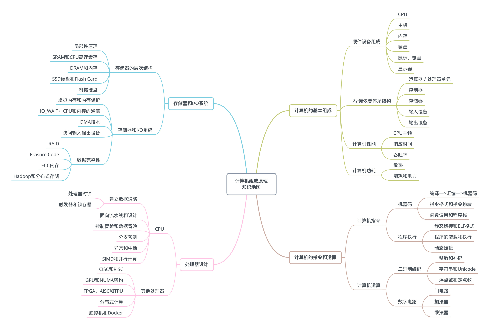
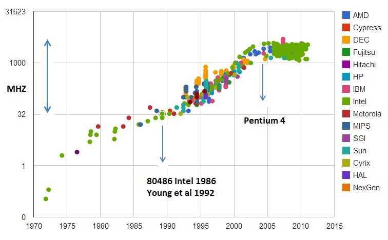

# 深入浅出计算机组成原理

- [开篇词 | 为什么你需要学习计算机组成原理？](#chapter0)
- [01 | 冯·诺依曼体系结构：计算机组成的金字塔](#chapter1)
- [02 | 给你一张知识地图，计算机组成原理应该这么学](#chapter2)
- [03 | 通过你的CPU主频，我们来谈谈“性能”究竟是什么？](#chapter3)
- [04 | 穿越功耗墙，我们该从哪些方面提升“性能”？](#chapter4)
- [05 | 计算机指令：让我们试试用纸带编程](#chapter5)
- [06 | 指令跳转：原来if...else就是goto](#chapter6)
- [07 | 函数调用：为什么会发生stack overflow？](#chapter7)
- [08 | ELF和静态链接：为什么程序无法同时在Linux和Windows下运行？](#chapter8)


<h1 id="chapter0">开篇词 | 为什么你需要学习计算机组成原理？</h1>

正所谓“练拳不练功，到老一场空”。**如果越早去弄清楚计算机的底层原理，在你的知识体系中“储蓄”起这些知识，也就意味着你有越长的时间来收获学习知识的“利息”。虽然一开始可能不起眼，但是随着时间带来的复利效应，你的长线投资项目，就能让你在成长的过程中越走越快。**

## 计算机底层知识的“第一课”

我们直接用肉眼来看，计算机是由 CPU、内存、显示器这些设备组成的硬件，但是，计算机系的学生毕业之后，大部分却都是从事各种软件开发工作。显然，在硬件和软件之间需要一座桥梁，而“计算机组成原理”就扮演了这样一个角色，它既隔离了软件和硬件，也提供了让软件无需关心硬件，就能直接操作硬件的接口。

也就是说，你只需要对硬件有原理性的理解，就可以信赖硬件的可靠性，安安心心用高级语言来写程序。无论是写操作系统和编译器这样的硬核代码，还是写 Web 应用和手机 App 这样的应用层代码，你都可以做到心里有底。

除此之外，组成原理是计算机其他核心课程的一个“导引”。学习组成原理之后，向下，你可以学习数字电路相关的课程，向上，你可以学习编译原理、操作系统这些核心课程。如果想要深入理解，甚至设计一台自己的计算机，体系结构是必不可少的一门课，而组成原理是计算机体系结构的一个入门版本。


## 理论和实践相结合

说了这么多计算机组成原理的重要性，但到底该怎么学呢？

互联网时代，我们从来不缺少资料。无论是 Coursera 上北京大学的《计算机组成》开放课程，还是图灵奖作者写的《计算机组成与设计：硬件 / 软件接口》，都珠玉在前，是非常优秀的学习资料。不过“买书如山倒，读书如抽丝”。从业这么多年，周围想要好好学一学组成原理的工程师不少，但是真的坚持下来学完、学好的却不多。大部分买来的书，都是前面 100 页已经发黄了，后面 500 页从来没有打开过；更有不少非科班出身的程序员，直接说“这些书根本看不懂”。

对这些问题，找到了三个主要原因：

1. 广。组成原理中的概念非常多，每个概念的信息量也非常大。比如想要理解 CPU 中的算术逻辑单元（也就是 ALU）是怎么实现加法的，需要牵涉到如何把整数表示成二进制，还需要了解这些表示背后的电路、逻辑门、CPU 时钟、触发器等知识。
2. 深。组成原理中的很多概念，阐述开来就是计算机学科的另外一门核心课程。比如，计算机的指令是怎么从你写的 C、Java 这样的高级语言，变成计算机可以执行的机器码的？如果我们展开并深入讲解这个问题，就会变成《编译原理》这样一门核心课程。
3. 学不能致用。学东西是要拿来用的，但因为这门课本身的属性，很多人在学习时，常常沉溺于概念和理论中，无法和自己日常的开发工作联系起来，以此来解决工作中遇到的问题，所以，学习往往没有成就感，就很难有动力坚持下去。

**因此，要把这些知识点和日常工作、生活以及整个计算机行业的发展史联系起来，真正看懂、学会、记住组成原理的核心内容，更多地从“为什么”这个角度，去理解这些知识点，而不是只是去记忆“是什么”。**

<h1 id="chapter1">01 | 冯·诺依曼体系结构：计算机组成的金字塔</h1>

## 计算机的基本硬件组成

早年，要自己组装一台计算机，要先有三大件，CPU、内存和主板。

在这三大件中，我们首先要说的是 **CPU**，它是计算机最重要的核心配件，全名你肯定知道，叫中央处理器（Central Processing Unit）。为什么说 CPU 是“最重要”的呢？因为计算机的所有“计算”都是由 CPU 来进行的。自然，CPU 也是整台计算机中造价最昂贵的部分之一。

第二个重要的配件，就是**内存**（Memory）。你撰写的程序、打开的浏览器、运行的游戏，都要加载到内存里才能运行。程序读取的数据、计算得到的结果，也都要放在内存里。内存越大，能加载的东西自然也就越多。

存放在内存里的程序和数据，需要被 CPU 读取，CPU 计算完之后，还要把数据写回到内存。然而 CPU 不能直接插到内存上，反之亦然。于是，就带来了最后一个大件——**主板**（Motherboard）。

主板是一个有着各种各样，有时候多达数十乃至上百个插槽的配件。我们的 CPU 要插在主板上，内存也要插在主板上。主板的**芯片组**（Chipset）和**总线**（Bus）解决了 CPU 和内存之间如何通信的问题。芯片组控制了数据传输的流转，也就是数据从哪里到哪里的问题。总线则是实际数据传输的高速公路。因此，**总线速度**（Bus Speed）决定了数据能传输得多快。

有了三大件，只要配上**电源**供电，计算机差不多就可以跑起来了。但是现在还缺少各类输入（Input）/ 输出（Output）设备，也就是我们常说的 **I/O 设备**。如果你用的是自己的个人电脑，那显示器肯定必不可少，只有有了显示器我们才能看到计算机输出的各种图像、文字，这也就是所谓的**输出设备**。

同样的，鼠标和键盘也都是必不可少的配件。这样我才能输入文本，写下这篇文章。它们也就是所谓的**输入设备**。

最后，你自己配的个人计算机，还要配上一个硬盘。这样各种数据才能持久地保存下来。绝大部分人都会给自己的机器装上一个机箱，配上风扇，解决灰尘和散热的问题。不过机箱和风扇，算不上是计算机的必备硬件，我们拿个纸板或者外面放个电风扇，也一样能用。

说了这么多，其实你应该有感觉了，显示器、鼠标、键盘和硬盘这些东西并不是一台计算机必须的部分。你想一想，我们其实只需要有 I/O 设备，能让我们从计算机里输入和输出信息，是不是就可以了？答案当然是肯定的。

你肯定去过网吧吧？不知道你注意到没有，很多网吧的计算机就没有硬盘，而是直接通过局域网，读写远程网络硬盘里面的数据。我们日常用的各类云服务器，只要让计算机能通过网络，SSH 远程登陆访问就好了，因此也没必要配显示器、鼠标、键盘这些东西。这样不仅能够节约成本，还更方便维护。

还有一个很特殊的设备，就是**显卡**（Graphics Card）。现在，使用图形界面操作系统的计算机，无论是 Windows、Mac OS 还是 Linux，显卡都是必不可少的。有人可能要说了，我装机的时候没有买显卡，计算机一样可以正常跑起来啊！那是因为，现在的主板都带了内置的显卡。如果你用计算机玩游戏，做图形渲染或者跑深度学习应用，你多半就需要买一张单独的显卡，插在主板上。显卡之所以特殊，是因为显卡里有除了 CPU 之外的另一个“处理器”，也就是 **GPU**（Graphics Processing Unit，图形处理器），GPU 一样可以做各种“计算”的工作。

鼠标、键盘以及硬盘，这些都是插在主板上的。作为外部 I/O 设备，它们是通过主板上的**南桥**（SouthBridge）芯片组，来控制和 CPU 之间的通信的。“南桥”芯片的名字很直观，一方面，它在主板上的位置，通常在主板的“南面”。另一方面，它的作用就是作为“桥”，来连接鼠标、键盘以及硬盘这些外部设备和 CPU 之间的通信。

有了南桥，自然对应着也有“北桥”。是的，以前的主板上通常也有“北桥”芯片，用来作为“桥”，连接 CPU 和内存、显卡之间的通信。不过，随着时间的变迁，现在的主板上的“北桥”芯片的工作，已经被移到了 CPU 的内部，所以你在主板上，已经看不到北桥芯片了。

## 冯·诺依曼体系结构

那我们平时最常用的智能手机的组成，也是这样吗？

我们手机里只有 SD 卡（Secure Digital Memory Card）这样类似硬盘功能的存储卡插槽，并没有内存插槽、CPU 插槽这些东西。没错，因为手机尺寸的原因，手机制造商们选择把 CPU、内存、网络通信，乃至摄像头芯片，都封装到一个芯片，然后再嵌入到手机主板上。这种方式叫 **SoC**，也就是 System on a Chip（系统芯片）。

这样看起来，个人电脑和智能手机的硬件组成方式不太一样。可是，我们写智能手机上的 App，和写个人电脑的客户端应用似乎没有什么差别，都是通过“高级语言”这样的编程语言撰写、编译之后，一样是把代码和数据加载到内存里来执行。这是为什么呢？因为，无论是个人电脑、服务器、智能手机，还是 Raspberry Pi 这样的微型卡片机，都遵循着同一个“计算机”的抽象概念。这是怎么样一个“计算机”呢？这其实就是，计算机祖师爷之一冯·诺依曼（John von Neumann）提出的**冯·诺依曼体系结构**（Von Neumann architecture），也叫**存储程序计算机**。

什么是存储程序计算机呢？这里面其实暗含了两个概念，一个是“**可编程**”计算机，一个是“**存储**”计算机。

说到“可编程”，估计你会有点懵，你可以先想想，什么是“不可编程”。计算机是由各种门电路组合而成的，然后通过组装出一个固定的电路板，来完成一个特定的计算程序。一旦需要修改功能，就要重新组装电路。这样的话，计算机就是“不可编程”的，因为程序在计算机硬件层面是“写死”的。最常见的就是老式计算器，电路板设好了加减乘除，做不了任何计算逻辑固定之外的事情。

我们再来看“存储”计算机。这其实是说，程序本身是存储在计算机的内存里，可以通过加载不同的程序来解决不同的问题。有“存储程序计算机”，自然也有不能存储程序的计算机。典型的就是早年的“Plugboard”这样的插线板式的计算机。整个计算机就是一个巨大的插线板，通过在板子上不同的插头或者接口的位置插入线路，来实现不同的功能。这样的计算机自然是“可编程”的，但是编写好的程序不能存储下来供下一次加载使用，不得不每次要用到和当前不同的“程序”的时候，重新插板子，重新“编程”。

可以看到，无论是“不可编程”还是“不可存储”，都会让使用计算机的效率大大下降。而这个对于效率的追求，也就是“存储程序计算机”的由来。

于是我们的冯祖师爷，基于当时在秘密开发的 EDVAC 写了一篇报告[First Draft of a Report on the EDVAC](https://en.wikipedia.org/wiki/First_Draft_of_a_Report_on_the_EDVAC)，描述了他心目中的一台计算机应该长什么样。这篇报告在历史上有个很特殊的简称，叫 **First Draft**，翻译成中文，其实就是《第一份草案》。这样，现代计算机的发展就从祖师爷写的一份草案开始了。

**First Draft** 里面说了一台计算机应该有哪些部分组成，我们一起来看看。

首先是一个包含算术逻辑单元（Arithmetic Logic Unit，ALU）和处理器寄存器（Processor Register）的**处理器单元**（Processing Unit），用来完成各种算术和逻辑运算。因为它能够完成各种数据的处理或者计算工作，因此也有人把这个叫作数据通路（Datapath）或者运算器。

然后是一个包含指令寄存器（Instruction Register）和程序计数器（Program Counter）的**控制器单元**（Control Unit/CU），用来控制程序的流程，通常就是不同条件下的分支和跳转。在现在的计算机里，上面的算术逻辑单元和这里的控制器单元，共同组成了我们说的 CPU。

接着是用来存储数据（Data）和指令（Instruction）的**内存**。以及更大容量的**外部存储**，在过去，可能是磁带、磁鼓这样的设备，现在通常就是硬盘。

最后就是各种**输入和输出设备**，以及对应的输入和输出机制。我们现在无论是使用什么样的计算机，其实都是和输入输出设备在打交道。个人电脑的鼠标键盘是输入设备，显示器是输出设备。我们用的智能手机，触摸屏既是输入设备，又是输出设备。而跑在各种云上的服务器，则是通过网络来进行输入和输出。这个时候，网卡既是输入设备又是输出设备。

<orange>任何一台计算机的任何一个部件都可以归到运算器、控制器、存储器、输入设备和输出设备中，而所有的现代计算机也都是基于这个基础架构来设计开发的。</orange>

而所有的计算机程序，也都可以抽象为从**输入设备**读取输入信息，通过**运算器**和**控制器**来执行存储在**存储器**里的程序，最终把结果输出到**输出设备**中。而我们所有撰写的无论高级还是低级语言的程序，也都是基于这样一个抽象框架来进行运作的。


## 总结延伸

可以说，冯·诺依曼体系结构确立了我们现在每天使用的计算机硬件的基础架构。因此，学习计算机组成原理，其实就是学习和拆解冯·诺依曼体系结构。

具体来说，学习组成原理，其实就是学习控制器、运算器的工作原理，也就是 CPU 是怎么工作的，以及为何这样设计；学习内存的工作原理，从最基本的电路，到上层抽象给到 CPU 乃至应用程序的接口是怎样的；学习 CPU 是怎么和输入设备、输出设备打交道的。

学习组成原理，就是在理解从控制器、运算器、存储器、输入设备以及输出设备，从电路这样的硬件，到最终开放给软件的接口，是怎么运作的，为什么要设计成这样，以及在软件开发层面怎么尽可能用好它。

<h1 id="chapter2">02 | 给你一张知识地图，计算机组成原理应该这么学</h1>



从这张图可以看出来，**整个计算机组成原理，就是围绕着计算机是如何组织运作展开的**。

## 计算机组成原理知识地图

计算机组成原理的英文叫 Computer Organization。这里的 Organization 是“组织机构”的意思。计算机由很多个不同的部件放在一起，变成了一个“组织机构”。这个组织机构最终能够进行各种计算、控制、读取输入，进行输出，达成各种强大的功能。

在这张图里面，我们把整个计算机组成原理的知识点拆分成了四大部分，分别是计算机的基本组成、计算机的指令和计算、处理器设计，以及存储器和 I/O 设备。

首先，我们来看**计算机的基本组成**。

这一部分，你需要学习计算机是由哪些硬件组成的。这些硬件，又是怎么对应到经典的冯·诺依曼体系结构中的，也就是<orange>运算器、控制器、存储器、输入设备和输出设备这五大基本组件</orange>。除此之外，你还需要了解<orange>计算机的两个核心指标，性能和功耗</orange>。性能和功耗也是我们在应用和设计五大基本组件中需要重点考虑的因素。

了解了组成部分，接下来你需要掌握**计算机的指令和计算**。

在计算机指令部分，你需要搞明白，我们每天撰写的一行行 C、Java、PHP 程序，是怎么在计算机里面跑起来的。这里面，你既需要了解我们的程序是怎么通过编译器和汇编器，变成一条条机器指令这样的编译过程（如果把编译过程展开的话，可以变成一门完整的编译原理课程），还需要知道我们的操作系统是怎么链接、装载、执行这些程序的（这部分知识如果再深入学习，又可以变成一门操作系统课程）。而这一条条指令执行的控制过程，就是由计算机五大组件之一的**控制器**来控制的。

在计算机的计算部分，你要从二进制和编码开始，理解我们的数据在计算机里的表示，以及我们是怎么从数字电路层面，实现加法、乘法这些基本的运算功能的。实现这些运算功能的 ALU（Arithmetic Logic Unit/ALU），也就是算术逻辑单元，其实就是我们计算机五大组件之一的**运算器**。

这里面有一个在今天看起来特别重要的知识点，就是浮点数（Floating Point）。浮点数是我们在日常运用中非常容易用错的一种数据表示形式。掌握浮点数能让你对数据的编码、存储和计算能够有一个从表到里的深入理解。尤其在 AI 火热的今天，浮点数是机器学习中重度使用的数据表示形式，掌握它更是非常有必要。

明白计算机指令和计算是如何运转的，我们就可以深入到 **CPU 的设计**中去一探究竟了。

CPU 时钟可以用来构造寄存器和内存的锁存器和触发器，因此，CPU 时钟应该是我们学习 CPU 的前导知识。搞明白我们为什么需要 CPU 时钟（CPU Clock），以及寄存器和内存是用什么样的硬件组成的之后，我们可以再来看看，整个计算机的数据通路是如何构造出来的。

数据通路，其实就是连接了整个运算器和控制器，并最终组成了 CPU。而出于对于性能和功耗的考虑，你要进一步理解和掌握面向流水线设计的 CPU、数据和控制冒险，以及分支预测的相关技术。

既然 CPU 作为控制器要和输入输出设备通信，那么我们就要知道异常和中断发生的机制。在 CPU 设计部分的最后，我会讲一讲指令的并行执行，看看如何直接在 CPU 层面，通过 SIMD 来支持并行计算。

最后，我们需要看一看，计算机五大组成部分之一，**存储器的原理**。通过存储器的层次结构作为基础的框架引导，你需要掌握从上到下的 CPU 高速缓存、内存、SSD 硬盘和机械硬盘的工作原理，它们之间的性能差异，以及实际应用中利用这些设备会遇到的挑战。存储器其实很多时候又扮演了输入输出设备的角色，所以你需要进一步了解，CPU 和这些存储器之间是如何进行通信的，以及我们最重视的性能问题是怎么一回事；理解什么是 IO_WAIT，如何通过 DMA 来提升程序性能。

对于存储器，我们不仅需要它们能够正常工作，还要确保里面的数据不能丢失。于是你要掌握我们是如何通过 RAID、Erasure Code、ECC 以及分布式 HDFS，这些不同的技术，来确保数据的完整性和访问性能。

## 学习计算机组成原理，究竟有没有好办法？

首先，**学会提问自己来串联知识点**。学完一个知识点之后，你可以从下面两个方面，问一下自己。

- 我写的程序，是怎样从输入的代码，变成运行的程序，并得到最终结果的？
- 整个过程中，计算器层面到底经历了哪些步骤，有哪些地方是可以优化的？

无论是程序的编译、链接、装载和执行，以及计算时需要用到的逻辑电路、ALU，乃至 CPU 自发为你做的流水线、指令级并行和分支预测，还有对应访问到的硬盘、内存，以及加载到高速缓存中的数据，这些都对应着我们学习中的一个个知识点。建议你自己脑子里过一遍，最好时口头表述一遍或者写下来，这样对你彻底掌握这些知识点都会非常有帮助。

其次，**写一些示例程序来验证知识点**。

最后，**通过和计算机硬件发展的历史做对照**。

比如说，奔腾 4 和 SPARC 的失败，以及 ARM 的成功，能让我们记住 CPU 指令集的繁与简、权衡性能和功耗的重要性，而现今高速发展的机器学习和边缘计算，又给计算机硬件设计带来了新的挑战。

## 给松鼠症患者的学习资料

## 入门书籍

一本是《计算机是怎样跑起来的》，另一本是《程序是怎样跑起来的》。

除此之外，计算机组成中，硬件层面的基础实现，比如寄存器、ALU 这些电路是怎么回事，你可以去看一看 Coursera 上的北京大学免费公开课[《Computer Organization》](https://www.coursera.org/learn/jisuanji-zucheng)。这个视频课程的视频部分也就 10 多个小时。在学习专栏相应章节的前后去浏览一遍，相信对你了解程序在电路层面会变成什么样子有所帮助。

## 深入学习书籍

《计算机组成与设计：硬件 / 软件接口》和经典的《深入理解计算机系统》这两本书。

如果引发了你对于计算机体系结构的兴趣，你还可以深入读一读《计算机体系结构：量化研究方法》。

## 课外阅读

在上面这些教材之外，对于资深程序员来说，来自 Redhat 的 **What Every Programmer Should Know About Memory** 是写出高性能程序不可不读的经典材料。而 LMAX 开源的 Disruptor，则是通过实际应用程序，来理解计算机组成原理中各个知识点的最好范例了。

《编码：隐匿在计算机软硬件背后的语言》和《程序员的自我修养：链接、装载和库》是理解计算机硬件和操作系统层面代码执行的优秀阅读材料。

<h1 id="chapter3">03 | 通过你的CPU主频，我们来谈谈“性能”究竟是什么？</h1>

## 什么是性能？时间的倒数

计算机的性能，其实和我们干体力劳动很像，好比是我们要搬东西。对于计算机的性能，我们需要有个标准来衡量。这个标准中主要有两个指标。

第一个是**响应时间**（Response time）或者叫执行时间（Execution time）。想要提升响应时间这个性能指标，你可以理解为让计算机“跑得更快”。


> 图中是我们实际系统里性能监测工具 NewRelic 中的响应时间，代表了每个外部的 Web 请求的执行时间

第二个是**吞吐率**（Throughput）或者带宽（Bandwidth），想要提升这个指标，你可以理解为让计算机“搬得更多”。


所以说，响应时间指的就是，我们执行一个程序，到底需要花多少时间。花的时间越少，自然性能就越好。

而吞吐率是指我们在一定的时间范围内，到底能处理多少事情。这里的“事情”，在计算机里就是处理的数据或者执行的程序指令。

和搬东西来做对比，如果我们的响应时间短，跑得快，我们可以来回多跑几趟多搬几趟。所以说，缩短程序的响应时间，一般来说都会提升吞吐率。

除了缩短响应时间，我们还有别的方法吗？当然有，比如说，我们还可以多找几个人一起来搬，这就类似现代的服务器都是 8 核、16 核的。人多力量大，同时处理数据，在单位时间内就可以处理更多数据，吞吐率自然也就上去了。

提升吞吐率的办法有很多。大部分时候，我们只要多加一些机器，多堆一些硬件就好了。但是响应时间的提升却没有那么容易，因为 CPU 的性能提升其实在 10 年前就处于“挤牙膏”的状态了，所以我们得慎重地来分析对待。

我们一般把性能，定义成响应时间的倒数，也就是：

> 性能 = 1/ 响应时间

这样一来，响应时间越短，性能的数值就越大。同样一个程序，在 Intel 最新的 CPU Coffee Lake 上，只需要 30s 就能运行完成，而在 5 年前 CPU Sandy Bridge 上，需要 1min 才能完成。那么我们自然可以算出来，Coffee Lake 的性能是 1/30，Sandy Bridge 的性能是 1/60，两个的性能比为 2。于是，我们就可以说，Coffee Lake 的性能是 Sandy Bridge 的 2 倍。

过去几年流行的手机跑分软件，就是把多个预设好的程序在手机上运行，然后根据运行需要的时间，算出一个分数来给出手机的性能评估。而在业界，各大 CPU 和服务器厂商组织了一个叫作 **SPEC**（Standard Performance Evaluation Corporation）的第三方机构，专门用来指定各种“跑分”的规则。


SPEC 提供的 CPU 基准测试程序，就好像 CPU 届的“高考”，通过数十个不同的计算程序，对于 CPU 的性能给出一个最终评分。这些程序丰富多彩，有编译器、解释器、视频压缩、人工智能国际象棋等等，涵盖了方方面面的应用场景。感兴趣的话，你可以点击[这个链接](https://www.spec.org/cpu2017/results/cpu2017.html)看看。

## 计算机的计时单位：CPU 时钟

虽然时间是一个很自然的用来衡量性能的指标，但是用时间来衡量时，有两个问题。

**第一个就是时间不“准”**。如果用你自己随便写的一个程序，来统计程序运行的时间，每一次统计结果不会完全一样。有可能这一次花了 45ms，下一次变成了 53ms。

计算机可能同时运行着好多个程序，CPU 实际上不停地在各个程序之间进行切换。在这些走掉的时间里面，很可能 CPU 切换去运行别的程序了。而且，有些程序在运行的时候，可能要从网络、硬盘去读取数据，要等网络和硬盘把数据读出来，给到内存和 CPU。所以说，**要想准确统计某个程序运行时间，进而去比较两个程序的实际性能，我们得把这些时间给刨除掉**。

那这件事怎么实现呢？Linux 下有一个叫 time 的命令，可以帮我们统计出来，同样的 Wall Clock Time 下，程序实际在 CPU 上到底花了多少时间。

我们简单运行一下 time 命令。它会返回三个值，第一个是 **real time**，也就是我们说的 Wall Clock Time，也就是运行程序整个过程中流逝掉的时间；第二个是 **user time**，也就是 CPU 在运行你的程序，在用户态运行指令的时间；第三个是 **sys time**，是 CPU 在运行你的程序，在操作系统内核里运行指令的时间。而**程序实际花费的 CPU 执行时间（CPU Time），就是 user time 加上 sys time**。

```c++
$ time seq 1000000 | wc -l
1000000


real  0m0.101s
user  0m0.031s
sys   0m0.016s
```

在我给的这个例子里，你可以看到，实际上程序用了 0.101s，但是 CPU time 只有 0.031+0.016 = 0.047s。运行程序的时间里，只有不到一半是实际花在这个程序上的。


**其次，即使我们已经拿到了 CPU 时间，我们也不一定可以直接“比较”出两个程序的性能差异**。即使在同一台计算机上，CPU 可能满载运行也可能降频运行，降频运行的时候自然花的时间会多一些。

除了 CPU 之外，时间这个性能指标还会受到主板、内存这些其他相关硬件的影响。所以，我们需要对“时间”这个我们可以感知的指标进行拆解，把程序的 CPU 执行时间变成 CPU 时钟周期数（CPU Cycles）和 时钟周期时间（Clock Cycle）的乘积。

> 程序的 CPU 执行时间 =CPU 时钟周期数×时钟周期时间

我们先来理解一下什么是时钟周期时间。你在买电脑的时候，一定关注过 CPU 的主频。比如我手头的这台电脑就是 Intel Core-i7-7700HQ 2.8GHz，这里的 2.8GHz 就是电脑的主频（Frequency/Clock Rate）。这个 2.8GHz，我们可以先粗浅地认为，CPU 在 1 秒时间内，可以执行的简单指令的数量是 2.8G 条。

如果想要更准确一点描述，这个 2.8GHz 就代表，我们 CPU 的一个“钟表”能够识别出来的最小的时间间隔。就像我们挂在墙上的挂钟，都是“滴答滴答”一秒一秒地走，所以通过墙上的挂钟能够识别出来的最小时间单位就是秒。

而在 CPU 内部，和我们平时戴的电子石英表类似，有一个叫晶体振荡器（Oscillator Crystal）的东西，简称为晶振。我们把晶振当成 CPU 内部的电子表来使用。晶振带来的每一次“滴答”，就是时钟周期时间。

在我这个 2.8GHz 的 CPU 上，这个时钟周期时间，就是 1/2.8G。我们的 CPU，是按照这个“时钟”提示的时间来进行自己的操作。主频越高，意味着这个表走得越快，我们的 CPU 也就“被逼”着走得越快。

如果你自己组装过台式机的话，可能听说过“超频”这个概念，这说的其实就相当于把买回来的 CPU 内部的钟给调快了，于是 CPU 的计算跟着这个时钟的节奏，也就自然变快了。当然这个快不是没有代价的，CPU 跑得越快，散热的压力也就越大。就和人一样，超过生理极限，CPU 就会崩溃了。

我们现在回到上面程序 CPU 执行时间的公式。

> 程序的 CPU 执行时间 =CPU 时钟周期数×时钟周期时间

最简单的提升性能方案，自然缩短时钟周期时间，也就是提升主频。换句话说，就是换一块好一点的 CPU。不过，这个是我们这些软件工程师控制不了的事情，所以我们就把目光挪到了乘法的另一个因子——CPU 时钟周期数上。如果能够减少程序需要的 CPU 时钟周期数量，一样能够提升程序性能。

对于 CPU 时钟周期数，我们可以再做一个分解，把它变成“指令数×**每条指令的平均时钟周期数**（Cycles Per Instruction，简称 CPI）”。不同的指令需要的 Cycles 是不同的，加法和乘法都对应着一条 CPU 指令，但是乘法需要的 Cycles 就比加法要多，自然也就慢。在这样拆分了之后，我们的程序的 CPU 执行时间就可以变成这样三个部分的乘积。

程序的 CPU 执行时间 = 指令数×CPI×Clock Cycle Time

因此，如果我们想要解决性能问题，其实就是要优化这三者。

1. 时钟周期时间，就是计算机主频，这个取决于计算机硬件。

2. 每条指令的平均时钟周期数 CPI，就是一条指令到底需要多少 CPU Cycle。

> 在后面讲解 CPU 结构的时候，我们会看到，现代的 CPU 通过流水线技术（Pipeline），让一条指令需要的 CPU Cycle 尽可能地少。因此，对于 CPI 的优化，也是计算机组成和体系结构中的重要一环。

3. 指令数，代表执行我们的程序到底需要多少条指令、用哪些指令。

> 这个很多时候就把挑战交给了编译器。同样的代码，编译成计算机指令时候，就有各种不同的表示方式。

## 总结延伸

主要对于“响应时间”这个性能指标进行抽丝剥茧，拆解成了计算机时钟周期、CPI 以及指令数这三个独立的指标的乘积，并且为你指明了优化计算机性能的三条康庄大道。

也就是，提升计算机主频，优化 CPU 设计使得在单个时钟周期内能够执行更多指令，以及通过编译器来减少需要的指令数。

<h1 id="chapter4">04 | 穿越功耗墙，我们该从哪些方面提升“性能”？</h1>

## 功耗：CPU 的“人体极限”

然而，计算机科学界从来不相信“大力出奇迹”。奔腾 4 的 CPU 主频从来没有达到过 10GHz，最终它的主频上限定格在 3.8GHz。这还不是最糟的，更糟糕的事情是，大家发现，奔腾 4 的主频虽然高，但是它的实际性能却配不上同样的主频。想要用在笔记本上的奔腾 4 2.4GHz 处理器，其性能只和基于奔腾 3 架构的奔腾 M 1.6GHz 处理器差不多。

于是，这一次的“大力出悲剧”，不仅让 Intel 的对手 AMD 获得了喘息之机，更是代表着“主频时代”的终结。后面几代 Intel CPU 主频不但没有上升，反而下降了。到如今，2019 年的最高配置 Intel i9 CPU，主频也只不过是 5GHz 而已。相较于 1978 年到 2000 年，这 20 年里 300 倍的主频提升，从 2000 年到现在的这 19 年，CPU 的主频大概提高了 3 倍。



> CPU 的主频变化，在奔腾 4 时代进入了瓶颈期，

奔腾 4 的主频为什么没能超过 3.8GHz 的障碍呢？答案就是功耗问题。什么是功耗问题呢？我们先看一个直观的例子。

一个 3.8GHz 的奔腾 4 处理器，满载功率是 130 瓦。这个 130 瓦是什么概念呢？机场允许带上飞机的充电宝的容量上限是 100 瓦时。如果我们把这个 CPU 安在手机里面，不考虑屏幕内存之类的耗电，这个 CPU 满载运行 45 分钟，充电宝里面就没电了。而 iPhone X 使用 ARM 架构的 CPU，功率则只有 4.5 瓦左右。

我们的 CPU，一般都被叫作**超大规模集成电路**（Very-Large-Scale Integration，VLSI）。这些电路，实际上都是一个个晶体管组合而成的。CPU 在计算，其实就是让晶体管里面的“开关”不断地去“打开”和“关闭”，来组合完成各种运算和功能。

想要计算得快，一方面，我们要在 CPU 里，同样的面积里面，多放一些晶体管，也就是**增加密度**；另一方面，我们要让晶体管“打开”和“关闭”得更快一点，也就是**提升主频**。而这两者，都会增加功耗，带来耗电和散热的问题。

这么说可能还是有点抽象，我还是给你举一个例子。你可以把一个计算机 CPU 想象成一个巨大的工厂，里面有很多工人，相当于 CPU 上面的晶体管，互相之间协同工作。

为了工作得快一点，我们要在工厂里多塞一点人。你可能会问，为什么不把工厂造得大一点呢？这是因为，人和人之间如果离得远了，互相之间走过去需要花的时间就会变长，这也会导致性能下降。这就好像如果 CPU 的面积大，晶体管之间的距离变大，电信号传输的时间就会变长，运算速度自然就慢了。

除了多塞一点人，我们还希望每个人的动作都快一点，这样同样的时间里就可以多干一点活儿了。这就相当于提升 CPU 主频，但是动作快，每个人就要出汗散热。要是太热了，对工厂里面的人来说会中暑生病，对 CPU 来说就会崩溃出错。

我们会在 CPU 上面抹硅脂、装风扇，乃至用上水冷或者其他更好的散热设备，就好像在工厂里面装风扇、空调，发冷饮一样。但是同样的空间下，装上风扇空调能够带来的散热效果也是有极限的。

因此，在 CPU 里面，能够放下的晶体管数量和晶体管的“开关”频率也都是有限的。一个 CPU 的功率，可以用这样一个公式来表示：

> 功耗 ~= 1/2 ×负载电容×电压的平方×开关频率×晶体管数量

那么，为了要提升性能，我们需要不断地增加晶体管数量。同样的面积下，我们想要多放一点晶体管，就要把晶体管造得小一点。这个就是平时我们所说的提升“制程”。从 28nm 到 7nm，相当于晶体管本身变成了原来的 1/4 大小。这个就相当于我们在工厂里，同样的活儿，我们要找瘦小一点的工人，这样一个工厂里面就可以多一些人。我们还要提升主频，让开关的频率变快，也就是要找手脚更快的工人。


但是，功耗增加太多，就会导致 CPU 散热跟不上，这时，我们就需要降低电压。这里有一点非常关键，在整个功耗的公式里面，功耗和电压的平方是成正比的。这意味着电压下降到原来的 1/5，整个的功耗会变成原来的 1/25。

事实上，从 5MHz 主频的 8086 到 5GHz 主频的 Intel i9，CPU 的电压已经从 5V 左右下降到了 1V 左右。这也是为什么我们 CPU 的主频提升了 1000 倍，但是功耗只增长了 40 倍。比如说，我写这篇文章用的是 Surface Go，在这样的轻薄笔记本上，微软就是选择了把电压下降到 0.25V 的低电压 CPU，使得笔记本能有更长的续航时间。

## 并行优化，理解阿姆达尔定律

虽然制程的优化和电压的下降，在过去的 20 年里，让我们的 CPU 性能有所提升。但是从上世纪九十年代到本世纪初，软件工程师们所用的“面向摩尔定律编程”的套路越来越用不下去了。“写程序不考虑性能，等明年 CPU 性能提升一倍，到时候性能自然就不成问题了”，这种想法已经不可行了。

于是，从奔腾 4 开始，Intel 意识到通过提升主频比较“难”去实现性能提升，边开始推出 Core Duo 这样的多核 CPU，通过提升“吞吐率”而不是“响应时间”，来达到目的。

这也是一个最常见的提升性能的方式，**通过并行提高性能**。

但是，并不是所有问题，都可以通过并行提高性能来解决。如果想要使用这种思想，需要满足这样几个条件。

- 第一，需要进行的计算，本身可以分解成几个可以并行的任务。好比上面的乘法和加法计算，几个人可以同时进行，不会影响最后的结果。
- 第二，需要能够分解好问题，并确保几个人的结果能够汇总到一起。
- 第三，在“汇总”这个阶段，是没有办法并行进行的，还是得顺序执行，一步一步来。

这就引出了我们在进行性能优化中，常常用到的一个经验定律，**阿姆达尔定律**（Amdahl’s Law）。这个定律说的就是，对于一个程序进行优化之后，处理器并行运算之后效率提升的情况。具体可以用这样一个公式来表示：

> 优化后的执行时间 = 受优化影响的执行时间 / 加速倍数 + 不受影响的执行时间


## 总结延伸

我们可以看到，无论是简单地通过提升主频，还是增加更多的 CPU 核心数量，通过并行来提升性能，都会遇到相应的瓶颈。仅仅简单地通过“堆硬件”的方式，在今天已经不能很好地满足我们对于程序性能的期望了。于是，工程师们需要从其他方面开始下功夫了。

在“摩尔定律”和“并行计算”之外，在整个计算机组成层面，还有这样几个原则性的性能提升方法。

1. 加速大概率事件。
2. 通过流水线提高性能。
3. 通过预测提高性能。

<h1 id="chapter5">05 | 计算机指令：让我们试试用纸带编程</h1>

当年学写程序的时候，不像现在这样，都是用一种古老的物理设备，叫作“打孔卡（Punched Card）”。用这种设备写程序，可没法像今天这样，掏出键盘就能打字，而是要先在脑海里或者在纸上写出程序，然后在纸带或者卡片上打洞。这样，要写的程序、要处理的数据，就变成一条条纸带或者一张张卡片，之后再交给当时的计算机去处理。


你看这个穿孔纸带是不是有点儿像我们现在考试用的答题卡？那个时候，人们在特定的位置上打洞或者不打洞，来代表“0”或者“1”。

为什么早期的计算机程序要使用打孔卡，而不能像我们现在一样，用 C 或者 Python 这样的高级语言来写呢？原因很简单，因为计算机或者说 CPU 本身，并没有能力理解这些高级语言。即使在 2019 年的今天，我们使用的现代个人计算机，仍然只能处理所谓的“机器码”，也就是一连串的“0”和“1”这样的数字。

## 在软硬件接口中，CPU 帮我们做了什么事？

我们常说，CPU 就是计算机的大脑。CPU 的全称是 Central Processing Unit，中文是中央处理器。

从**硬件**的角度来看，CPU 就是一个超大规模集成电路，通过电路实现了加法、乘法乃至各种各样的处理逻辑。

如果我们从**软件**工程师的角度来讲，CPU 就是一个执行各种**计算机指令**（Instruction Code）的逻辑机器。这里的计算机指令，就好比一门 CPU 能够听得懂的语言，我们也可以把它叫作**机器语言**（Machine Language）。

不同的 CPU 能够听懂的语言不太一样。比如，我们的个人电脑用的是 Intel 的 CPU，苹果手机用的是 ARM 的 CPU。这两者能听懂的语言就不太一样。类似这样两种 CPU 各自支持的语言，就是两组不同的**计算机指令集**，英文叫 Instruction Set。这里面的“Set”，其实就是数学上的集合，代表不同的单词、语法。

所以，如果我们在自己电脑上写一个程序，然后把这个程序复制一下，装到自己的手机上，肯定是没办法正常运行的，因为这两者语言不通。而一台电脑上的程序，简单复制一下到另外一台电脑上，通常就能正常运行，因为这两台 CPU 有着相同的指令集，也就是说，它们的语言相通的。

一个计算机程序，不可能只有一条指令，而是由成千上万条指令组成的。但是 CPU 里不能一直放着所有指令，所以计算机程序平时是存储在存储器中的。这种程序指令存储在存储器里面的计算机，我们就叫作**存储程序型计算机**（Stored-program Computer）。

说到这里，你可能要问了，难道还有不是存储程序型的计算机么？其实，在没有现代计算机之前，有着聪明才智的工程师们，早就发明了一种叫 Plugboard Computer 的计算设备。我把它直译成“插线板计算机”。在一个布满了各种插口和插座的板子上，工程师们用不同的电线来连接不同的插口和插座，从而来完成各种计算任务。下面这个图就是一台 IBM 的 Plugboard，看起来是不是有一股满满的蒸汽朋克范儿？

## 从编译到汇编，代码怎么变成机器码？

了解了计算机指令和计算机指令集，接下来我们来看看，平时编写的代码，到底是怎么变成一条条计算机指令，最后被 CPU 执行的呢？我们拿一小段真实的 C 语言程序来看看。

```c++
// test.c
int main()
{
  int a = 1; 
  int b = 2;
  a = a + b;
}
```

这是一段再简单不过的 C 语言程序，即便你不了解 C 语言，应该也可以看懂。我们给两个变量 a、b 分别赋值 1、2，然后再将 a、b 两个变量中的值加在一起，重新赋值给了 a 整个变量。

要让这段程序在一个 Linux 操作系统上跑起来，我们需要把整个程序翻译成一个**汇编语言**（ASM，Assembly Language）的程序，这个过程我们一般叫编译（Compile）成汇编代码。

针对汇编代码，我们可以再用汇编器（Assembler）翻译成机器码（Machine Code）。这些机器码由“0”和“1”组成的机器语言表示。这一条条机器码，就是一条条的**计算机指令**。这样一串串的 16 进制数字，就是我们 CPU 能够真正认识的计算机指令。

在一个 Linux 操作系统上，我们可以简单地使用 gcc 和 objdump 这样两条命令，把对应的汇编代码和机器码都打印出来。

```shell
$ gcc -g -c test.c
$ objdump -d -M intel -S test.o
```

可以看到，左侧有一堆数字，这些就是一条条机器码；右边有一系列的 push、mov、add、pop 等，这些就是对应的汇编代码。一行 C 语言代码，有时候只对应一条机器码和汇编代码，有时候则是对应两条机器码和汇编代码。汇编代码和机器码之间是一一对应的。

```c++
test.o:     file format elf64-x86-64
Disassembly of section .text:
0000000000000000 <main>:
int main()
{
   0:   55                      push   rbp
   1:   48 89 e5                mov    rbp,rsp
  int a = 1; 
   4:   c7 45 fc 01 00 00 00    mov    DWORD PTR [rbp-0x4],0x1
  int b = 2;
   b:   c7 45 f8 02 00 00 00    mov    DWORD PTR [rbp-0x8],0x2
  a = a + b;
  12:   8b 45 f8                mov    eax,DWORD PTR [rbp-0x8]
  15:   01 45 fc                add    DWORD PTR [rbp-0x4],eax
}
  18:   5d                      pop    rbp
  19:   c3                      ret    
```

这个时候你可能又要问了，我们实际在用 GCC（GUC 编译器套装，GNU Compiler Collectipon）编译器的时候，可以直接把代码编译成机器码呀，为什么还需要汇编代码呢？原因很简单，你看着那一串数字表示的机器码，是不是摸不着头脑？但是即使你没有学过汇编代码，看的时候多少也能“猜”出一些这些代码的含义。

因为汇编代码其实就是“给程序员看的机器码”，也正因为这样，机器码和汇编代码是一一对应的。我们人类很容易记住 add、mov 这些用英文表示的指令，而 8b 45 f8 这样的指令，由于很难一下子看明白是在干什么，所以会非常难以记忆。尽管早年互联网上到处流传，大神程序员着拿小刀在光盘上刻出操作系统的梗，但是要让你用打孔卡来写个程序，估计浪费的卡片比用上的卡片要多得多。


从高级语言到汇编代码，再到机器码，就是一个日常开发程序，最终变成了 CPU 可以执行的计算机指令的过程。

## 解析指令和机器码

了解了这个过程，下面我们放大局部，来看看这一行行的汇编代码和机器指令，到底是什么意思。

我们就从平时用的电脑、手机这些设备来说起。这些设备的 CPU 到底有哪些指令呢？这个还真有不少，我们日常用的 Intel CPU，有 2000 条左右的 CPU 指令，实在是太多了，所以我没法一一来给你讲解。不过一般来说，常见的指令可以分成五大类。

- 第一类是**算术类指令**。我们的加减乘除，在 CPU 层面，都会变成一条条算术类指令。

- 第二类是**数据传输类指令**。给变量赋值、在内存里读写数据，用的都是数据传输类指令。

- 第三类是**逻辑类指令**。逻辑上的与或非，都是这一类指令。

- 第四类是**条件分支类指令**。日常我们写的“if/else”，其实都是条件分支类指令。

- 最后一类是**无条件跳转指令**。写一些大一点的程序，我们常常需要写一些函数或者方法。在调用函数的时候，其实就是发起了一个无条件跳转指令。


下面我们来看看，汇编器是怎么把对应的汇编代码，翻译成为机器码的。

我们说过，不同的 CPU 有不同的指令集，也就对应着不同的汇编语言和不同的机器码。为了方便你快速理解这个机器码的计算方式，我们选用最简单的 MIPS 指令集，来看看机器码是如何生成的。

MIPS 是一组由 MIPS 技术公司在 80 年代中期设计出来的 CPU 指令集。就在最近，MIPS 公司把整个指令集和芯片架构都完全开源了。想要深入研究 CPU 和指令集的同学，这里推荐[一些资料](https://www.mips.com/mipsopen/)，你可以自己了解下。


MIPS 的指令是一个 32 位的整数，高 6 位叫**操作码**（Opcode），也就是代表这条指令具体是一条什么样的指令，剩下的 26 位有三种格式，分别是 R、I 和 J。

**R 指令**是一般用来做算术和逻辑操作，里面有读取和写入数据的寄存器的地址。如果是逻辑位移操作，后面还有位移操作的位移量，而最后的功能码，则是在前面的操作码不够的时候，扩展操作码表示对应的具体指令的。

**I 指令**，则通常是用在数据传输、条件分支，以及在运算的时候使用的并非变量还是常数的时候。这个时候，没有了位移量和操作码，也没有了第三个寄存器，而是把这三部分直接合并成了一个地址值或者一个常数。

**J 指令**就是一个跳转指令，高 6 位之外的 26 位都是一个跳转后的地址。

```c++
add $t0,$s2,$s1
```

以一个简单的加法算术指令 add t0,s1, $s2, 为例，给你解释。为了方便，我们下面都用十进制来表示对应的代码。

对应的 MIPS 指令里 opcode 是 0，rs 代表第一个寄存器 s1 的地址是 17，rt 代表第二个寄存器 s2 的地址是 18，rd 代表目标的临时寄存器 t0 的地址，是 8。因为不是位移操作，所以位移量是 0。把这些数字拼在一起，就变成了一个 MIPS 的加法指令。

为了读起来方便，我们一般把对应的二进制数，用 16 进制表示出来。在这里，也就是 0X02324020。这个数字也就是这条指令对应的机器码。


回到开头我们说的打孔带。如果我们用打孔代表 1，没有打孔代表 0，用 4 行 8 列代表一条指令来打一个穿孔纸带，那么这条命令大概就长这样：


## 总结延伸

到这里，想必你也应该明白了，我们在这一讲的开头介绍的打孔卡，其实就是一种存储程序型计算机。

只是这整个程序的机器码，不是通过计算机编译出来的，而是由程序员，用人脑“编译”成一张张卡片的。对应的程序，也不是存储在设备里，而是存储成一张打好孔的卡片。但是整个程序运行的逻辑和其他 CPU 的机器语言没有什么分别，也是处理一串“0”和“1”组成的机器码而已。

然而，单单理解一条指令是怎么变成机器码的肯定是不够的。接下来的几节，我会深入讲解，包含条件、循环、函数、递归这些语句的完整程序，是怎么在 CPU 里面执行的。

<h1 id="chapter6">06 | 指令跳转：原来if...else就是goto</h1>

## CPU 是如何执行指令的？

拿我们用的 Intel CPU 来说，里面差不多有几百亿个晶体管。实际上，一条条计算机指令执行起来非常复杂。好在 CPU 在软件层面已经为我们做好了封装。对于我们这些做软件的程序员来说，我们只要知道，写好的代码变成了指令之后，是一条一条**顺序**执行的就可以了。

我们先不管几百亿的晶体管的背后是怎么通过电路运转起来的，逻辑上，我们可以认为，CPU 其实就是由一堆寄存器组成的。而寄存器就是 CPU 内部，由多个触发器（Flip-Flop）或者锁存器（Latches）组成的简单电路。

触发器和锁存器，其实就是两种不同原理的数字电路组成的逻辑门。这块内容并不是我们这节课的重点，所以你只要了解就好。如果想要深入学习的话，你可以学习数字电路的相关课程，这里我们不深入探讨。

好了，现在我们接着前面说。N 个触发器或者锁存器，就可以组成一个 N 位（Bit）的寄存器，能够保存 N 位的数据。比方说，我们用的 64 位 Intel 服务器，寄存器就是 64 位的。


一个 CPU 里面会有很多种不同功能的寄存器。我这里给你介绍三种比较特殊的。

一个是 **PC 寄存器**（Program Counter Register），我们也叫**指令地址寄存器**（Instruction Address Register）。顾名思义，它就是用来存放下一条需要执行的计算机指令的内存地址。

第二个是**指令寄存器**（Instruction Register），用来存放当前正在执行的指令。

第三个是**条件码寄存器**（Status Register），用里面的一个一个标记位（Flag），存放 CPU 进行算术或者逻辑计算的结果。

除了这些特殊的寄存器，CPU 里面还有更多用来存储数据和内存地址的寄存器。这样的寄存器通常一类里面不止一个。我们通常根据存放的数据内容来给它们取名字，比如整数寄存器、浮点数寄存器、向量寄存器和地址寄存器等等。有些寄存器既可以存放数据，又能存放地址，我们就叫它通用寄存器。


实际上，一个程序执行的时候，CPU 会根据 PC 寄存器里的地址，从内存里面把需要执行的指令读取到指令寄存器里面执行，然后根据指令长度自增，开始顺序读取下一条指令。可以看到，一个程序的一条条指令，在内存里面是连续保存的，也会一条条顺序加载。

而有些特殊指令，比如上一讲我们讲到 J 类指令，也就是跳转指令，会修改 PC 寄存器里面的地址值。这样，下一条要执行的指令就不是从内存里面顺序加载的了。事实上，这些跳转指令的存在，也是我们可以在写程序的时候，使用 if…else 条件语句和 while/for 循环语句的原因。

## 从 if…else 来看程序的执行和跳转

```c++
// test.c


#include <time.h>
#include <stdlib.h>


int main()
{
  srand(time(NULL));
  int r = rand() % 2;
  int a = 10;
  if (r == 0)
  {
    a = 1;
  } else {
    a = 2;
  } 
}
```

我们用 rand 生成了一个随机数 r，r 要么是 0，要么是 1。当 r 是 0 的时候，我们把之前定义的变量 a 设成 1，不然就设成 2。

```
$ gcc -g -c test.c
$ objdump -d -M intel -S test.o 
```

我们把这个程序编译成汇编代码。你可以忽略前后无关的代码，只关注于这里的 if…else 条件判断语句。对应的汇编代码是这样的：

```c++
    if (r == 0)
  3b:   83 7d fc 00             cmp    DWORD PTR [rbp-0x4],0x0
  3f:   75 09                   jne    4a <main+0x4a>
    {
        a = 1;
  41:   c7 45 f8 01 00 00 00    mov    DWORD PTR [rbp-0x8],0x1
  48:   eb 07                   jmp    51 <main+0x51>
    }
    else
    {
        a = 2;
  4a:   c7 45 f8 02 00 00 00    mov    DWORD PTR [rbp-0x8],0x2
  51:   b8 00 00 00 00          mov    eax,0x0
    } 
```

可以看到，这里对于 r ==  0 的条件判断，被编译成了 cmp 和 jne 这两条指令。

cmp 指令比较了前后两个操作数的值，这里的 DWORD PTR 代表操作的数据类型是 32 位的整数，而[rbp-0x4]则是一个寄存器的地址。所以，第一个操作数就是从寄存器里拿到的变量 r 的值。第二个操作数 0x0 就是我们设定的常量 0 的 16 进制表示。cmp 指令的比较结果，会存入到***条件码寄存器**当中去。

在这里，如果比较的结果是 True，也就是 r == 0，就把**零标志条件码**（对应的条件码是 ZF，Zero Flag）设置为 1。除了零标志之外，Intel 的 CPU 下还有**进位标志**（CF，Carry Flag）、**符号标志**（SF，Sign Flag）以及**溢出标志**（OF，Overflow Flag），用在不同的判断条件下。

cmp 指令执行完成之后，PC 寄存器会自动自增，开始执行下一条 jne 的指令。

跟着的 jne 指令，是 jump if not equal 的意思，它会查看对应的零标志位。如果为 0，会跳转到后面跟着的操作数 4a 的位置。这个 4a，对应这里汇编代码的行号，也就是上面设置的 else 条件里的第一条指令。当跳转发生的时候，PC 寄存器就不再是自增变成下一条指令的地址，而是被直接设置成这里的 4a 这个地址。这个时候，CPU 再把 4a 地址里的指令加载到指令寄存器中来执行。

跳转到执行地址为 4a 的指令，实际是一条 mov 指令，第一个操作数和前面的 cmp 指令一样，是另一个 32 位整型的寄存器地址，以及对应的 2 的 16 进制值 0x2。mov 指令把 2 设置到对应的寄存器里去，相当于一个赋值操作。然后，PC 寄存器里的值继续自增，执行下一条 mov 指令。

这条 mov 指令的第一个操作数 eax，代表累加寄存器，第二个操作数 0x0 则是 16 进制的 0 的表示。这条指令其实没有实际的作用，它的作用是一个占位符。我们回过头去看前面的 if 条件，如果满足的话，在赋值的 mov 指令执行完成之后，有一个 jmp 的无条件跳转指令。跳转的地址就是这一行的地址 51。我们的 main 函数没有设定返回值，而 mov eax, 0x0 其实就是给 main 函数生成了一个默认的为 0 的返回值到累加器里面。if 条件里面的内容执行完成之后也会跳转到这里，和 else 里的内容结束之后的位置是一样的。


上一讲我们讲打孔卡的时候说到，读取打孔卡的机器会顺序地一段一段地读取指令，然后执行。执行完一条指令，它会自动地顺序读取下一条指令。如果执行的当前指令带有跳转的地址，比如往后跳 10 个指令，那么机器会自动将卡片带往后移动 10 个指令的位置，再来执行指令。同样的，机器也能向前移动，去读取之前已经执行过的指令。这也就是我们的 while/for 循环实现的原理。

## 如何通过 if…else 和 goto 来实现循环？

```c++
int main()
{
    int a = 0;
    for (int i = 0; i < 3; i++)
    {
        a += i;
    }
}
```

我们再看一段简单的利用 for 循环的程序。我们循环自增变量 i 三次，三次之后，i>=3，就会跳出循环。整个程序，对应的 Intel 汇编代码就是这样的：

```java
    for (int i = 0; i < 3; i++)
   b:   c7 45 f8 00 00 00 00    mov    DWORD PTR [rbp-0x8],0x0
  12:   eb 0a                   jmp    1e <main+0x1e>
    {
        a += i;
  14:   8b 45 f8                mov    eax,DWORD PTR [rbp-0x8]
  17:   01 45 fc                add    DWORD PTR [rbp-0x4],eax
    for (int i = 0; i < 3; i++)
  1a:   83 45 f8 01             add    DWORD PTR [rbp-0x8],0x1
  1e:   83 7d f8 02             cmp    DWORD PTR [rbp-0x8],0x2
  22:   7e f0                   jle    14 <main+0x14>
  24:   b8 00 00 00 00          mov    eax,0x0
    }
```

可以看到，对应的循环也是用 1e 这个地址上的 cmp 比较指令，和紧接着的 jle 条件跳转指令来实现的。主要的差别在于，这里的 jle 跳转的地址，在这条指令之前的地址 14，而非 if…else 编译出来的跳转指令之后。往前跳转使得条件满足的时候，PC 寄存器会把指令地址设置到之前执行过的指令位置，重新执行之前执行过的指令，直到条件不满足，顺序往下执行 jle 之后的指令，整个循环才结束。


如果你看一长条打孔卡的话，就会看到卡片往后移动一段，执行了之后，又反向移动，去重新执行前面的指令。

其实，你有没有觉得，jle 和 jmp 指令，有点像程序语言里面的 goto 命令，直接指定了一个特定条件下的跳转位置。虽然我们在用高级语言开发程序的时候反对使用 goto，但是实际在机器指令层面，无论是 if…else…也好，还是 for/while 也好，都是用和 goto 相同的跳转到特定指令位置的方式来实现的。

## 总结延伸

这一节，我们在单条指令的基础上，学习了程序里的多条指令，究竟是怎么样一条一条被执行的。除了简单地通过 PC 寄存器自增的方式顺序执行外，条件码寄存器会记录下当前执行指令的条件判断状态，然后通过跳转指令读取对应的条件码，修改 PC 寄存器内的下一条指令的地址，最终实现 if…else 以及 for/while 这样的程序控制流程。

你会发现，虽然我们可以用高级语言，可以用不同的语法，比如 if…else 这样的条件分支，或者 while/for 这样的循环方式，来实现不用的程序运行流程，但是回归到计算机可以识别的机器指令级别，其实都只是一个简单的地址跳转而已，也就是一个类似于 goto 的语句。

想要在硬件层面实现这个 goto 语句，除了本身需要用来保存下一条指令地址，以及当前正要执行指令的 PC 寄存器、指令寄存器外，我们只需要再增加一个条件码寄存器，来保留条件判断的状态。这样简简单单的三个寄存器，就可以实现条件判断和循环重复执行代码的功能。

下一节，我们会进一步讲解，如果程序中出现函数或者过程这样可以复用的代码模块，对应的指令是怎么样执行的，会和我们这里的 if…else 有什么不同。

<h1 id="chapter7">07 | 函数调用：为什么会发生stack overflow？</h1>

在开发软件的过程中我们经常会遇到错误，如果你用 Google 搜过出错信息，那你多少应该都访问过Stack Overflow这个网站。作为全球最大的程序员问答网站，Stack Overflow 的名字来自于一个常见的报错，就是栈溢出（stack overflow）。

## 为什么我们需要程序栈？

和前面几讲一样，我们还是从一个非常简单的 C 程序 function_example.c 看起。

```c++
// function_example.c
#include <stdio.h>
int static add(int a, int b)
{
    return a+b;
}

int main()
{
    int x = 5;
    int y = 10;
    int u = add(x, y);
}
```

这个程序定义了一个简单的函数 add，接受两个参数 a 和 b，返回值就是 a+b。而 main 函数里则定义了两个变量 x 和 y，然后通过调用这个 add 函数，来计算 u=x+y，最后把 u 的数值打印出来。

```c++
$ gcc -g -c function_example.c
$ objdump -d -M intel -S function_example.o
```

我们把这个程序编译之后，objdump 出来。我们来看一看对应的汇编代码。

```c++
int static add(int a, int b)
{
   0:   55                      push   rbp
   1:   48 89 e5                mov    rbp,rsp
   4:   89 7d fc                mov    DWORD PTR [rbp-0x4],edi
   7:   89 75 f8                mov    DWORD PTR [rbp-0x8],esi
    return a+b;
   a:   8b 55 fc                mov    edx,DWORD PTR [rbp-0x4]
   d:   8b 45 f8                mov    eax,DWORD PTR [rbp-0x8]
  10:   01 d0                   add    eax,edx
}
  12:   5d                      pop    rbp
  13:   c3                      ret    
0000000000000014 <main>:
int main()
{
  14:   55                      push   rbp
  15:   48 89 e5                mov    rbp,rsp
  18:   48 83 ec 10             sub    rsp,0x10
    int x = 5;
  1c:   c7 45 fc 05 00 00 00    mov    DWORD PTR [rbp-0x4],0x5
    int y = 10;
  23:   c7 45 f8 0a 00 00 00    mov    DWORD PTR [rbp-0x8],0xa
    int u = add(x, y);
  2a:   8b 55 f8                mov    edx,DWORD PTR [rbp-0x8]
  2d:   8b 45 fc                mov    eax,DWORD PTR [rbp-0x4]
  30:   89 d6                   mov    esi,edx
  32:   89 c7                   mov    edi,eax
  34:   e8 c7 ff ff ff          call   0 <add>
  39:   89 45 f4                mov    DWORD PTR [rbp-0xc],eax
  3c:   b8 00 00 00 00          mov    eax,0x0
}
  41:   c9                      leave  
  42:   c3                      ret    
```

可以看出来，在这段代码里，main 函数和上一节我们讲的的程序执行区别并不大，它主要是把 jump 指令换成了函数调用的 call 指令。call 指令后面跟着的，仍然是跳转后的程序地址。

这些你理解起来应该不成问题。我们下面来看一个有意思的部分。

我们来看 add 函数。可以看到，add 函数编译之后，代码先执行了一条 push 指令和一条 mov 指令；在函数执行结束的时候，又执行了一条 pop 和一条 ret 指令。这四条指令的执行，其实就是在进行我们接下来要讲**压栈**（Push）和**出栈**（Pop）操作。

你有没有发现，函数调用和上一节我们讲的 if…else 和 for/while 循环有点像。它们两个都是在原来顺序执行的指令过程里，执行了一个内存地址的跳转指令，让指令从原来顺序执行的过程里跳开，从新的跳转后的位置开始执行。

但是，这两个跳转有个区别，if…else 和 for/while 的跳转，是跳转走了就不再回来了，就在跳转后的新地址开始顺序地执行指令，就好像徐志摩在《再别康桥》里面写的：“我挥一挥衣袖，不带走一片云彩”，继续进行新的生活了。而函数调用的跳转，在对应函数的指令执行完了之后，还要再回到函数调用的地方，继续执行 call 之后的指令，就好像贺知章在《回乡偶书》里面写的那样：“少小离家老大回，乡音未改鬓毛衰”，不管走多远，最终还是要回来。

不过，仔细琢磨一下，你会发现这个方法有些问题。如果函数 A 调用了函数 B，然后函数 B 再调用函数 A，我们就得面临在 A 里面插入 B 的指令，然后在 B 里面插入 A 的指令，这样就会产生无穷无尽地替换。就好像两面镜子面对面放在一块儿，任何一面镜子里面都会看到无穷多面镜子。

看来，把被调用函数的指令直接插入在调用处的方法行不通。那我们就换一个思路，能不能把后面要跳回来执行的指令地址给记录下来呢？就像前面讲 PC 寄存器一样，我们可以专门设立一个“程序调用寄存器”，来存储接下来要跳转回来执行的指令地址。等到函数调用结束，从这个寄存器里取出地址，再跳转到这个记录的地址，继续执行就好了。

但是在多层函数调用里，简单只记录一个地址也是不够的。我们在调用函数 A 之后，A 还可以调用函数 B，B 还能调用函数 C。这一层又一层的调用并没有数量上的限制。在所有函数调用返回之前，每一次调用的返回地址都要记录下来，但是我们 CPU 里的寄存器数量并不多。像我们一般使用的 Intel i7 CPU 只有 16 个 64 位寄存器，调用的层数一多就存不下了。

最终，计算机科学家们想到了一个比单独记录跳转回来的地址更完善的办法。我们在内存里面开辟一段空间，用栈这个**后进先出**（LIFO，Last In First Out）的数据结构。栈就像一个乒乓球桶，每次程序调用函数之前，我们都把调用返回后的地址写在一个乒乓球上，然后塞进这个球桶。这个操作其实就是我们常说的**压栈**。如果函数执行完了，我们就从球桶里取出最上面的那个乒乓球，很显然，这就是**出栈**。

拿到出栈的乒乓球，找到上面的地址，把程序跳转过去，就返回到了函数调用后的下一条指令了。如果函数 A 在执行完成之前又调用了函数 B，那么在取出乒乓球之前，我们需要往球桶里塞一个乒乓球。而我们从球桶最上面拿乒乓球的时候，拿的也一定是最近一次的，也就是最下面一层的函数调用完成后的地址。乒乓球桶的底部，就是**栈底**，最上面的乒乓球所在的位置，就是**栈顶**。


在真实的程序里，压栈的不只有函数调用完成后的返回地址。比如函数 A 在调用 B 的时候，需要传输一些参数数据，这些参数数据在寄存器不够用的时候也会被压入栈中。整个函数 A 所占用的所有内存空间，就是函数 A 的**栈帧**（Stack Frame）。Frame 在中文里也有“相框”的意思，所以，每次到这里，我都有种感觉，整个函数 A 所需要的内存空间就像是被这么一个“相框”给框了起来，放在了栈里面。

而实际的程序栈布局，顶和底与我们的乒乓球桶相比是倒过来的。底在最上面，顶在最下面，这样的布局是因为栈底的内存地址是在一开始就固定的。而一层层压栈之后，栈顶的内存地址是在逐渐变小而不是变大。


对应上面函数 add 的汇编代码，我们来仔细看看，main 函数调用 add 函数时，add 函数入口在 0～1 行，add 函数结束之后在 12～13 行。

我们在调用第 34 行的 call 指令时，会把当前的 PC 寄存器里的下一条指令的地址压栈，保留函数调用结束后要执行的指令地址。而 add 函数的第 0 行，push rbp 这个指令，就是在进行压栈。这里的 rbp 又叫栈帧指针（Frame Pointer），是一个存放了当前栈帧位置的寄存器。push rbp 就把之前调用函数，也就是 main 函数的栈帧的栈底地址，压到栈顶。

接着，第 1 行的一条命令 mov rbp, rsp 里，则是把 rsp 这个栈指针（Stack Pointer）的值复制到 rbp 里，而 rsp 始终会指向栈顶。这个命令意味着，rbp 这个栈帧指针指向的地址，变成当前最新的栈顶，也就是 add 函数的栈帧的栈底地址了。

而在函数 add 执行完成之后，又会分别调用第 12 行的 pop rbp 来将当前的栈顶出栈，这部分操作维护好了我们整个栈帧。然后，我们可以调用第 13 行的 ret 指令，这时候同时要把 call 调用的时候压入的 PC 寄存器里的下一条指令出栈，更新到 PC 寄存器中，将程序的控制权返回到出栈后的栈顶。

## 如何构造一个 stack  overflow？

通过引入栈，我们可以看到，无论有多少层的函数调用，或者在函数 A 里调用函数 B，再在函数 B 里调用 A，这样的递归调用，我们都只需要通过维持 rbp 和 rsp，这两个维护栈顶所在地址的寄存器，就能管理好不同函数之间的跳转。不过，栈的大小也是有限的。如果函数调用层数太多，我们往栈里压入它存不下的内容，程序在执行的过程中就会遇到栈溢出的错误，这就是大名鼎鼎的“stack  overflow”。

要构造一个栈溢出的错误并不困难，最简单的办法，就是我们上面说的 Infiinite Mirror Effect 的方式，让函数 A 调用自己，并且不设任何终止条件。这样一个无限递归的程序，在不断地压栈过程中，将整个栈空间填满，并最终遇上 stack  overflow。

```c++
int a()
{
  return a();
}

int main()
{
  a();
  return 0;
}
```

除了无限递归，递归层数过深，在栈空间里面创建非常占内存的变量（比如一个巨大的数组），这些情况都很可能给你带来 stack  overflow。相信你理解了栈在程序运行的过程里面是怎么回事，未来在遇到 stackoverflow 这个错误的时候，不会完全没有方向了。

## 如何利用函数内联进行性能优化？

上面我们提到一个方法，把一个实际调用的函数产生的指令，直接插入到的位置，来替换对应的函数调用指令。尽管这个通用的函数调用方案，被我们否决了，但是如果被调用的函数里，没有调用其他函数，这个方法还是可以行得通的。

事实上，这就是一个常见的编译器进行自动优化的场景，我们通常叫函数内联（Inline）。我们只要在 GCC 编译的时候，加上对应的一个让编译器自动优化的参数 -O，编译器就会在可行的情况下，进行这样的指令替换。

我们来看一段代码。

```c++
#include <stdio.h>
#include <time.h>
#include <stdlib.h>

int static add(int a, int b)
{
    return a+b;
}

int main()
{
    srand(time(NULL));
    int x = rand() % 5
    int y = rand() % 10;
    int u = add(x, y)
    printf("u = %d\n", u)
}
```

为了避免编译器优化掉太多代码，我小小修改了一下 function_example.c，让参数 x 和 y 都变成了，通过随机数生成，并在代码的最后加上将 u 通过 printf 打印出来的语句。

```c++
$ gcc -g -c -O function_example_inline.c
$ objdump -d -M intel -S function_example_inline.o
```

上面的 function_example_inline.c 的编译出来的汇编代码，没有把 add 函数单独编译成一段指令顺序，而是在调用 u = add(x, y) 的时候，直接替换成了一个 add 指令。

```c++
    return a+b;
  4c:   01 de                   add    esi,ebx
```

除了依靠编译器的自动优化，你还可以在定义函数的地方，加上 inline 的关键字，来提示编译器对函数进行内联。

内联带来的优化是，CPU 需要执行的指令数变少了，根据地址跳转的过程不需要了，压栈和出栈的过程也不用了。

不过内联并不是没有代价，内联意味着，我们把可以复用的程序指令在调用它的地方完全展开了。如果一个函数在很多地方都被调用了，那么就会展开很多次，整个程序占用的空间就会变大了。


这样没有调用其他函数，只会被调用的函数，我们一般称之为**叶子函数（或叶子过程）**。

## 总结延伸

这一节，我们讲了一个程序的函数间调用，在 CPU 指令层面是怎么执行的。其中一定需要你牢记的，就是**程序栈**这个新概念。

我们可以方便地通过压栈和出栈操作，使得程序在不同的函数调用过程中进行转移。而函数内联和栈溢出，一个是我们常常可以选择的优化方案，另一个则是我们会常遇到的程序 Bug。

通过加入了程序栈，我们相当于在指令跳转的过程种，加入了一个“记忆”的功能，能在跳转去运行新的指令之后，再回到跳出去的位置，能够实现更加丰富和灵活的指令执行流程。这个也为我们在程序开发的过程中，提供了“函数”这样一个抽象，使得我们在软件开发的过程中，可以复用代码和指令，而不是只能简单粗暴地复制、粘贴代码和指令。

<h1 id="chapter8">08 | ELF和静态链接：为什么程序无法同时在Linux和Windows下运行？</h1>

## 编译、链接和装载：拆解程序执行

我们说过，写好的 C 语言代码，可以通过编译器编译成汇编代码，然后汇编代码再通过汇编器变成 CPU 可以理解的机器码，于是 CPU 就可以执行这些机器码了。你现在对这个过程应该不陌生了，但是这个描述把过程大大简化了。下面，我们一起具体来看，C 语言程序是如何变成一个可执行程序的。

不知道你注意到没有，过去几节，我们通过 gcc 生成的文件和 objdump 获取到的汇编指令都有些小小的问题。我们先把前面的 add 函数示例，拆分成两个文件 add_lib.c 和 link_example.c。

```c++
// add_lib.c
int add(int a, int b)
{
    return a+b;
}
```

```c++
// link_example.c

#include <stdio.h>
int main()
{
    int a = 10;
    int b = 5;
    int c = add(a, b);
    printf("c = %d\n", c);
}
```

我们通过 gcc 来编译这两个文件，然后通过 objdump 命令看看它们的汇编代码。

```c++
$ gcc -g -c add_lib.c link_example.c
$ objdump -d -M intel -S add_lib.o
$ objdump -d -M intel -S link_example.o
```

```c++
add_lib.o:     file format elf64-x86-64
Disassembly of section .text:
0000000000000000 <add>:
   0:   55                      push   rbp
   1:   48 89 e5                mov    rbp,rsp
   4:   89 7d fc                mov    DWORD PTR [rbp-0x4],edi
   7:   89 75 f8                mov    DWORD PTR [rbp-0x8],esi
   a:   8b 55 fc                mov    edx,DWORD PTR [rbp-0x4]
   d:   8b 45 f8                mov    eax,DWORD PTR [rbp-0x8]
  10:   01 d0                   add    eax,edx
  12:   5d                      pop    rbp
  13:   c3                      ret    
```

```c++
link_example.o:     file format elf64-x86-64
Disassembly of section .text:
0000000000000000 <main>:
   0:   55                      push   rbp
   1:   48 89 e5                mov    rbp,rsp
   4:   48 83 ec 10             sub    rsp,0x10
   8:   c7 45 fc 0a 00 00 00    mov    DWORD PTR [rbp-0x4],0xa
   f:   c7 45 f8 05 00 00 00    mov    DWORD PTR [rbp-0x8],0x5
  16:   8b 55 f8                mov    edx,DWORD PTR [rbp-0x8]
  19:   8b 45 fc                mov    eax,DWORD PTR [rbp-0x4]
  1c:   89 d6                   mov    esi,edx
  1e:   89 c7                   mov    edi,eax
  20:   b8 00 00 00 00          mov    eax,0x0
  25:   e8 00 00 00 00          call   2a <main+0x2a>
  2a:   89 45 f4                mov    DWORD PTR [rbp-0xc],eax
  2d:   8b 45 f4                mov    eax,DWORD PTR [rbp-0xc]
  30:   89 c6                   mov    esi,eax
  32:   48 8d 3d 00 00 00 00    lea    rdi,[rip+0x0]        # 39 <main+0x39>
  39:   b8 00 00 00 00          mov    eax,0x0
  3e:   e8 00 00 00 00          call   43 <main+0x43>
  43:   b8 00 00 00 00          mov    eax,0x0
  48:   c9                      leave  
  49:   c3                      ret    
```

既然代码已经被我们“编译”成了指令，我们不妨尝试运行一下 ./link_example.o。

不幸的是，文件没有执行权限，我们遇到一个 Permission denied 错误。即使通过 chmod 命令赋予 link_example.o 文件可执行的权限，运行./link_example.o 仍然只会得到一条 cannot execute binary file: Exec format error 的错误。

我们再仔细看一下 objdump 出来的两个文件的代码，会发现两个程序的地址都是从 0 开始的。如果地址是一样的，程序如果需要通过 call 指令调用函数的话，它怎么知道应该跳转到哪一个文件里呢？

这么说吧，无论是这里的运行报错，还是 objdump 出来的汇编代码里面的重复地址，都是因为 add_lib.o 以及 link_example.o 并不是一个**可执行文件**（Executable Program），而是**目标文件**（Object File）。只有通过链接器（Linker）把多个目标文件以及调用的各种函数库链接起来，我们才能得到一个可执行文件。

我们通过 gcc 的 -o 参数，可以生成对应的可执行文件，对应执行之后，就可以得到这个简单的加法调用函数的结果。

```c++
$ gcc -o link-example add_lib.o link_example.o
$ ./link_example
c = 15
```

实际上，“**C 语言代码 - 汇编代码 - 机器码**”  这个过程，在我们的计算机上进行的时候是由两部分组成的。

第一个部分由编译（Compile）、汇编（Assemble）以及链接（Link）三个阶段组成。在这三个阶段完成之后，我们就生成了一个可执行文件。

第二部分，我们通过装载器（Loader）把可执行文件装载（Load）到内存中。CPU 从内存中读取指令和数据，来开始真正执行程序。


## ELF 格式和链接：理解链接过程

程序最终是通过装载器变成指令和数据的，所以其实我们生成的可执行代码也并不仅仅是一条条的指令。我们还是通过 objdump 指令，把可执行文件的内容拿出来看看。

```c++
link_example:     file format elf64-x86-64
Disassembly of section .init:
...
Disassembly of section .plt:
...
Disassembly of section .plt.got:
...
Disassembly of section .text:
...

 6b0:   55                      push   rbp
 6b1:   48 89 e5                mov    rbp,rsp
 6b4:   89 7d fc                mov    DWORD PTR [rbp-0x4],edi
 6b7:   89 75 f8                mov    DWORD PTR [rbp-0x8],esi
 6ba:   8b 55 fc                mov    edx,DWORD PTR [rbp-0x4]
 6bd:   8b 45 f8                mov    eax,DWORD PTR [rbp-0x8]
 6c0:   01 d0                   add    eax,edx
 6c2:   5d                      pop    rbp
 6c3:   c3                      ret    
00000000000006c4 <main>:
 6c4:   55                      push   rbp
 6c5:   48 89 e5                mov    rbp,rsp
 6c8:   48 83 ec 10             sub    rsp,0x10
 6cc:   c7 45 fc 0a 00 00 00    mov    DWORD PTR [rbp-0x4],0xa
 6d3:   c7 45 f8 05 00 00 00    mov    DWORD PTR [rbp-0x8],0x5
 6da:   8b 55 f8                mov    edx,DWORD PTR [rbp-0x8]
 6dd:   8b 45 fc                mov    eax,DWORD PTR [rbp-0x4]
 6e0:   89 d6                   mov    esi,edx
 6e2:   89 c7                   mov    edi,eax
 6e4:   b8 00 00 00 00          mov    eax,0x0
 6e9:   e8 c2 ff ff ff          call   6b0 <add>
 6ee:   89 45 f4                mov    DWORD PTR [rbp-0xc],eax
 6f1:   8b 45 f4                mov    eax,DWORD PTR [rbp-0xc]
 6f4:   89 c6                   mov    esi,eax
 6f6:   48 8d 3d 97 00 00 00    lea    rdi,[rip+0x97]        # 794 <_IO_stdin_used+0x4>
 6fd:   b8 00 00 00 00          mov    eax,0x0
 702:   e8 59 fe ff ff          call   560 <printf@plt>
 707:   b8 00 00 00 00          mov    eax,0x0
 70c:   c9                      leave  
 70d:   c3                      ret    
 70e:   66 90                   xchg   ax,ax
...
Disassembly of section .fini:
...
```

你会发现，可执行代码 dump 出来内容，和之前的目标代码长得差不多，但是长了很多。因为在 Linux 下，可执行文件和目标文件所使用的都是一种叫 **ELF**（Execuatable and Linkable File Format）的文件格式，中文名字叫**可执行与可链接文件格式**，这里面不仅存放了编译成的汇编指令，还保留了很多别的数据。
