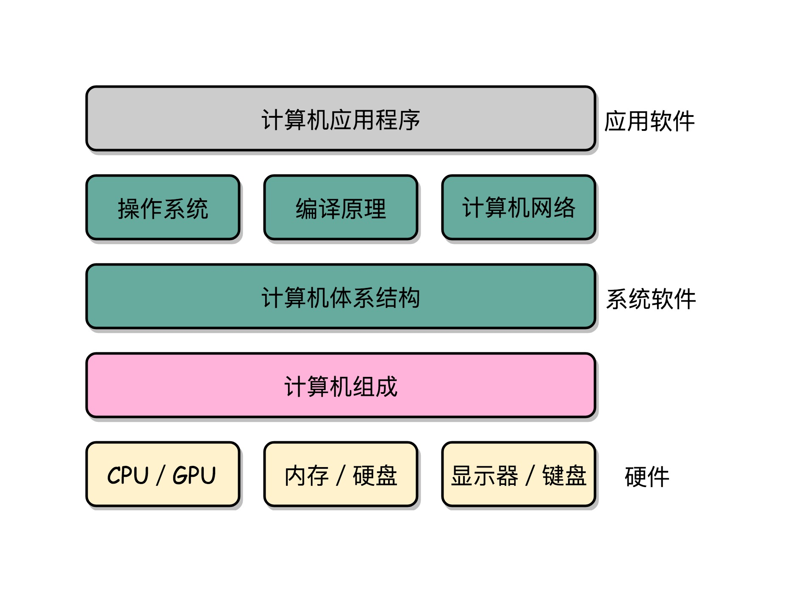

# 深入浅出计算机组成原理

- [开篇词 | 为什么你需要学习计算机组成原理？](#chapter0)
- [01 | 冯·诺依曼体系结构：计算机组成的金字塔](#chapter1)
- [02 | 给你一张知识地图，计算机组成原理应该这么学](#chapter2)
- [03 | 通过你的CPU主频，我们来谈谈“性能”究竟是什么？](#chapter3)
- [04 | 穿越功耗墙，我们该从哪些方面提升“性能”？](#chapter4)
- 


<h1 id="chapter0">开篇词 | 为什么你需要学习计算机组成原理？</h1>

正所谓“练拳不练功，到老一场空”。**如果越早去弄清楚计算机的底层原理，在你的知识体系中“储蓄”起这些知识，也就意味着你有越长的时间来收获学习知识的“利息”。虽然一开始可能不起眼，但是随着时间带来的复利效应，你的长线投资项目，就能让你在成长的过程中越走越快。**

## 计算机底层知识的“第一课”

我们直接用肉眼来看，计算机是由 CPU、内存、显示器这些设备组成的硬件，但是，计算机系的学生毕业之后，大部分却都是从事各种软件开发工作。显然，在硬件和软件之间需要一座桥梁，而“计算机组成原理”就扮演了这样一个角色，它既隔离了软件和硬件，也提供了让软件无需关心硬件，就能直接操作硬件的接口。

也就是说，你只需要对硬件有原理性的理解，就可以信赖硬件的可靠性，安安心心用高级语言来写程序。无论是写操作系统和编译器这样的硬核代码，还是写 Web 应用和手机 App 这样的应用层代码，你都可以做到心里有底。

除此之外，组成原理是计算机其他核心课程的一个“导引”。学习组成原理之后，向下，你可以学习数字电路相关的课程，向上，你可以学习编译原理、操作系统这些核心课程。如果想要深入理解，甚至设计一台自己的计算机，体系结构是必不可少的一门课，而组成原理是计算机体系结构的一个入门版本。



## 理论和实践相结合

说了这么多计算机组成原理的重要性，但到底该怎么学呢？

互联网时代，我们从来不缺少资料。无论是 Coursera 上北京大学的《计算机组成》开放课程，还是图灵奖作者写的《计算机组成与设计：硬件 / 软件接口》，都珠玉在前，是非常优秀的学习资料。不过“买书如山倒，读书如抽丝”。从业这么多年，周围想要好好学一学组成原理的工程师不少，但是真的坚持下来学完、学好的却不多。大部分买来的书，都是前面 100 页已经发黄了，后面 500 页从来没有打开过；更有不少非科班出身的程序员，直接说“这些书根本看不懂”。

对这些问题，找到了三个主要原因：

1. 广。组成原理中的概念非常多，每个概念的信息量也非常大。比如想要理解 CPU 中的算术逻辑单元（也就是 ALU）是怎么实现加法的，需要牵涉到如何把整数表示成二进制，还需要了解这些表示背后的电路、逻辑门、CPU 时钟、触发器等知识。
2. 深。组成原理中的很多概念，阐述开来就是计算机学科的另外一门核心课程。比如，计算机的指令是怎么从你写的 C、Java 这样的高级语言，变成计算机可以执行的机器码的？如果我们展开并深入讲解这个问题，就会变成《编译原理》这样一门核心课程。
3. 学不能致用。学东西是要拿来用的，但因为这门课本身的属性，很多人在学习时，常常沉溺于概念和理论中，无法和自己日常的开发工作联系起来，以此来解决工作中遇到的问题，所以，学习往往没有成就感，就很难有动力坚持下去。

**因此，要把这些知识点和日常工作、生活以及整个计算机行业的发展史联系起来，真正看懂、学会、记住组成原理的核心内容，更多地从“为什么”这个角度，去理解这些知识点，而不是只是去记忆“是什么”。**

<h1 id="chapter1">01 | 冯·诺依曼体系结构：计算机组成的金字塔</h1>

## 计算机的基本硬件组成

早年，要自己组装一台计算机，要先有三大件，CPU、内存和主板。

在这三大件中，我们首先要说的是 **CPU**，它是计算机最重要的核心配件，全名你肯定知道，叫中央处理器（Central Processing Unit）。为什么说 CPU 是“最重要”的呢？因为计算机的所有“计算”都是由 CPU 来进行的。自然，CPU 也是整台计算机中造价最昂贵的部分之一。

第二个重要的配件，就是**内存**（Memory）。你撰写的程序、打开的浏览器、运行的游戏，都要加载到内存里才能运行。程序读取的数据、计算得到的结果，也都要放在内存里。内存越大，能加载的东西自然也就越多。

存放在内存里的程序和数据，需要被 CPU 读取，CPU 计算完之后，还要把数据写回到内存。然而 CPU 不能直接插到内存上，反之亦然。于是，就带来了最后一个大件——**主板**（Motherboard）。

主板是一个有着各种各样，有时候多达数十乃至上百个插槽的配件。我们的 CPU 要插在主板上，内存也要插在主板上。主板的**芯片组**（Chipset）和**总线**（Bus）解决了 CPU 和内存之间如何通信的问题。芯片组控制了数据传输的流转，也就是数据从哪里到哪里的问题。总线则是实际数据传输的高速公路。因此，**总线速度**（Bus Speed）决定了数据能传输得多快。

有了三大件，只要配上**电源**供电，计算机差不多就可以跑起来了。但是现在还缺少各类输入（Input）/ 输出（Output）设备，也就是我们常说的 **I/O 设备**。如果你用的是自己的个人电脑，那显示器肯定必不可少，只有有了显示器我们才能看到计算机输出的各种图像、文字，这也就是所谓的**输出设备**。

同样的，鼠标和键盘也都是必不可少的配件。这样我才能输入文本，写下这篇文章。它们也就是所谓的**输入设备**。

最后，你自己配的个人计算机，还要配上一个硬盘。这样各种数据才能持久地保存下来。绝大部分人都会给自己的机器装上一个机箱，配上风扇，解决灰尘和散热的问题。不过机箱和风扇，算不上是计算机的必备硬件，我们拿个纸板或者外面放个电风扇，也一样能用。

说了这么多，其实你应该有感觉了，显示器、鼠标、键盘和硬盘这些东西并不是一台计算机必须的部分。你想一想，我们其实只需要有 I/O 设备，能让我们从计算机里输入和输出信息，是不是就可以了？答案当然是肯定的。

你肯定去过网吧吧？不知道你注意到没有，很多网吧的计算机就没有硬盘，而是直接通过局域网，读写远程网络硬盘里面的数据。我们日常用的各类云服务器，只要让计算机能通过网络，SSH 远程登陆访问就好了，因此也没必要配显示器、鼠标、键盘这些东西。这样不仅能够节约成本，还更方便维护。

还有一个很特殊的设备，就是**显卡**（Graphics Card）。现在，使用图形界面操作系统的计算机，无论是 Windows、Mac OS 还是 Linux，显卡都是必不可少的。有人可能要说了，我装机的时候没有买显卡，计算机一样可以正常跑起来啊！那是因为，现在的主板都带了内置的显卡。如果你用计算机玩游戏，做图形渲染或者跑深度学习应用，你多半就需要买一张单独的显卡，插在主板上。显卡之所以特殊，是因为显卡里有除了 CPU 之外的另一个“处理器”，也就是 **GPU**（Graphics Processing Unit，图形处理器），GPU 一样可以做各种“计算”的工作。

鼠标、键盘以及硬盘，这些都是插在主板上的。作为外部 I/O 设备，它们是通过主板上的**南桥**（SouthBridge）芯片组，来控制和 CPU 之间的通信的。“南桥”芯片的名字很直观，一方面，它在主板上的位置，通常在主板的“南面”。另一方面，它的作用就是作为“桥”，来连接鼠标、键盘以及硬盘这些外部设备和 CPU 之间的通信。

有了南桥，自然对应着也有“北桥”。是的，以前的主板上通常也有“北桥”芯片，用来作为“桥”，连接 CPU 和内存、显卡之间的通信。不过，随着时间的变迁，现在的主板上的“北桥”芯片的工作，已经被移到了 CPU 的内部，所以你在主板上，已经看不到北桥芯片了。

## 冯·诺依曼体系结构

那我们平时最常用的智能手机的组成，也是这样吗？

我们手机里只有 SD 卡（Secure Digital Memory Card）这样类似硬盘功能的存储卡插槽，并没有内存插槽、CPU 插槽这些东西。没错，因为手机尺寸的原因，手机制造商们选择把 CPU、内存、网络通信，乃至摄像头芯片，都封装到一个芯片，然后再嵌入到手机主板上。这种方式叫 **SoC**，也就是 System on a Chip（系统芯片）。

这样看起来，个人电脑和智能手机的硬件组成方式不太一样。可是，我们写智能手机上的 App，和写个人电脑的客户端应用似乎没有什么差别，都是通过“高级语言”这样的编程语言撰写、编译之后，一样是把代码和数据加载到内存里来执行。这是为什么呢？因为，无论是个人电脑、服务器、智能手机，还是 Raspberry Pi 这样的微型卡片机，都遵循着同一个“计算机”的抽象概念。这是怎么样一个“计算机”呢？这其实就是，计算机祖师爷之一冯·诺依曼（John von Neumann）提出的**冯·诺依曼体系结构**（Von Neumann architecture），也叫**存储程序计算机**。

什么是存储程序计算机呢？这里面其实暗含了两个概念，一个是“**可编程**”计算机，一个是“**存储**”计算机。

说到“可编程”，估计你会有点懵，你可以先想想，什么是“不可编程”。计算机是由各种门电路组合而成的，然后通过组装出一个固定的电路板，来完成一个特定的计算程序。一旦需要修改功能，就要重新组装电路。这样的话，计算机就是“不可编程”的，因为程序在计算机硬件层面是“写死”的。最常见的就是老式计算器，电路板设好了加减乘除，做不了任何计算逻辑固定之外的事情。

我们再来看“存储”计算机。这其实是说，程序本身是存储在计算机的内存里，可以通过加载不同的程序来解决不同的问题。有“存储程序计算机”，自然也有不能存储程序的计算机。典型的就是早年的“Plugboard”这样的插线板式的计算机。整个计算机就是一个巨大的插线板，通过在板子上不同的插头或者接口的位置插入线路，来实现不同的功能。这样的计算机自然是“可编程”的，但是编写好的程序不能存储下来供下一次加载使用，不得不每次要用到和当前不同的“程序”的时候，重新插板子，重新“编程”。

可以看到，无论是“不可编程”还是“不可存储”，都会让使用计算机的效率大大下降。而这个对于效率的追求，也就是“存储程序计算机”的由来。

于是我们的冯祖师爷，基于当时在秘密开发的 EDVAC 写了一篇报告[First Draft of a Report on the EDVAC](https://en.wikipedia.org/wiki/First_Draft_of_a_Report_on_the_EDVAC)，描述了他心目中的一台计算机应该长什么样。这篇报告在历史上有个很特殊的简称，叫 **First Draft**，翻译成中文，其实就是《第一份草案》。这样，现代计算机的发展就从祖师爷写的一份草案开始了。

**First Draft** 里面说了一台计算机应该有哪些部分组成，我们一起来看看。

首先是一个包含算术逻辑单元（Arithmetic Logic Unit，ALU）和处理器寄存器（Processor Register）的**处理器单元**（Processing Unit），用来完成各种算术和逻辑运算。因为它能够完成各种数据的处理或者计算工作，因此也有人把这个叫作数据通路（Datapath）或者运算器。

然后是一个包含指令寄存器（Instruction Register）和程序计数器（Program Counter）的**控制器单元**（Control Unit/CU），用来控制程序的流程，通常就是不同条件下的分支和跳转。在现在的计算机里，上面的算术逻辑单元和这里的控制器单元，共同组成了我们说的 CPU。

接着是用来存储数据（Data）和指令（Instruction）的**内存**。以及更大容量的**外部存储**，在过去，可能是磁带、磁鼓这样的设备，现在通常就是硬盘。

最后就是各种**输入和输出设备**，以及对应的输入和输出机制。我们现在无论是使用什么样的计算机，其实都是和输入输出设备在打交道。个人电脑的鼠标键盘是输入设备，显示器是输出设备。我们用的智能手机，触摸屏既是输入设备，又是输出设备。而跑在各种云上的服务器，则是通过网络来进行输入和输出。这个时候，网卡既是输入设备又是输出设备。

<orange>任何一台计算机的任何一个部件都可以归到运算器、控制器、存储器、输入设备和输出设备中，而所有的现代计算机也都是基于这个基础架构来设计开发的。</orange>

而所有的计算机程序，也都可以抽象为从**输入设备**读取输入信息，通过**运算器**和**控制器**来执行存储在**存储器**里的程序，最终把结果输出到**输出设备**中。而我们所有撰写的无论高级还是低级语言的程序，也都是基于这样一个抽象框架来进行运作的。


## 总结延伸

可以说，冯·诺依曼体系结构确立了我们现在每天使用的计算机硬件的基础架构。因此，学习计算机组成原理，其实就是学习和拆解冯·诺依曼体系结构。

具体来说，学习组成原理，其实就是学习控制器、运算器的工作原理，也就是 CPU 是怎么工作的，以及为何这样设计；学习内存的工作原理，从最基本的电路，到上层抽象给到 CPU 乃至应用程序的接口是怎样的；学习 CPU 是怎么和输入设备、输出设备打交道的。

学习组成原理，就是在理解从控制器、运算器、存储器、输入设备以及输出设备，从电路这样的硬件，到最终开放给软件的接口，是怎么运作的，为什么要设计成这样，以及在软件开发层面怎么尽可能用好它。

<h1 id="chapter2">02 | 给你一张知识地图，计算机组成原理应该这么学</h1>


从这张图可以看出来，**整个计算机组成原理，就是围绕着计算机是如何组织运作展开的**。

## 计算机组成原理知识地图

计算机组成原理的英文叫 Computer Organization。这里的 Organization 是“组织机构”的意思。计算机由很多个不同的部件放在一起，变成了一个“组织机构”。这个组织机构最终能够进行各种计算、控制、读取输入，进行输出，达成各种强大的功能。

在这张图里面，我们把整个计算机组成原理的知识点拆分成了四大部分，分别是计算机的基本组成、计算机的指令和计算、处理器设计，以及存储器和 I/O 设备。

首先，我们来看**计算机的基本组成**。

这一部分，你需要学习计算机是由哪些硬件组成的。这些硬件，又是怎么对应到经典的冯·诺依曼体系结构中的，也就是<orange>运算器、控制器、存储器、输入设备和输出设备这五大基本组件</orange>。除此之外，你还需要了解<orange>计算机的两个核心指标，性能和功耗</orange>。性能和功耗也是我们在应用和设计五大基本组件中需要重点考虑的因素。

了解了组成部分，接下来你需要掌握**计算机的指令和计算**。

在计算机指令部分，你需要搞明白，我们每天撰写的一行行 C、Java、PHP 程序，是怎么在计算机里面跑起来的。这里面，你既需要了解我们的程序是怎么通过编译器和汇编器，变成一条条机器指令这样的编译过程（如果把编译过程展开的话，可以变成一门完整的编译原理课程），还需要知道我们的操作系统是怎么链接、装载、执行这些程序的（这部分知识如果再深入学习，又可以变成一门操作系统课程）。而这一条条指令执行的控制过程，就是由计算机五大组件之一的**控制器**来控制的。

在计算机的计算部分，你要从二进制和编码开始，理解我们的数据在计算机里的表示，以及我们是怎么从数字电路层面，实现加法、乘法这些基本的运算功能的。实现这些运算功能的 ALU（Arithmetic Logic Unit/ALU），也就是算术逻辑单元，其实就是我们计算机五大组件之一的**运算器**。

这里面有一个在今天看起来特别重要的知识点，就是浮点数（Floating Point）。浮点数是我们在日常运用中非常容易用错的一种数据表示形式。掌握浮点数能让你对数据的编码、存储和计算能够有一个从表到里的深入理解。尤其在 AI 火热的今天，浮点数是机器学习中重度使用的数据表示形式，掌握它更是非常有必要。

明白计算机指令和计算是如何运转的，我们就可以深入到 **CPU 的设计**中去一探究竟了。

CPU 时钟可以用来构造寄存器和内存的锁存器和触发器，因此，CPU 时钟应该是我们学习 CPU 的前导知识。搞明白我们为什么需要 CPU 时钟（CPU Clock），以及寄存器和内存是用什么样的硬件组成的之后，我们可以再来看看，整个计算机的数据通路是如何构造出来的。

数据通路，其实就是连接了整个运算器和控制器，并最终组成了 CPU。而出于对于性能和功耗的考虑，你要进一步理解和掌握面向流水线设计的 CPU、数据和控制冒险，以及分支预测的相关技术。

既然 CPU 作为控制器要和输入输出设备通信，那么我们就要知道异常和中断发生的机制。在 CPU 设计部分的最后，我会讲一讲指令的并行执行，看看如何直接在 CPU 层面，通过 SIMD 来支持并行计算。

最后，我们需要看一看，计算机五大组成部分之一，**存储器的原理**。通过存储器的层次结构作为基础的框架引导，你需要掌握从上到下的 CPU 高速缓存、内存、SSD 硬盘和机械硬盘的工作原理，它们之间的性能差异，以及实际应用中利用这些设备会遇到的挑战。存储器其实很多时候又扮演了输入输出设备的角色，所以你需要进一步了解，CPU 和这些存储器之间是如何进行通信的，以及我们最重视的性能问题是怎么一回事；理解什么是 IO_WAIT，如何通过 DMA 来提升程序性能。

对于存储器，我们不仅需要它们能够正常工作，还要确保里面的数据不能丢失。于是你要掌握我们是如何通过 RAID、Erasure Code、ECC 以及分布式 HDFS，这些不同的技术，来确保数据的完整性和访问性能。

## 学习计算机组成原理，究竟有没有好办法？

首先，**学会提问自己来串联知识点**。学完一个知识点之后，你可以从下面两个方面，问一下自己。

- 我写的程序，是怎样从输入的代码，变成运行的程序，并得到最终结果的？
- 整个过程中，计算器层面到底经历了哪些步骤，有哪些地方是可以优化的？

无论是程序的编译、链接、装载和执行，以及计算时需要用到的逻辑电路、ALU，乃至 CPU 自发为你做的流水线、指令级并行和分支预测，还有对应访问到的硬盘、内存，以及加载到高速缓存中的数据，这些都对应着我们学习中的一个个知识点。建议你自己脑子里过一遍，最好时口头表述一遍或者写下来，这样对你彻底掌握这些知识点都会非常有帮助。

其次，**写一些示例程序来验证知识点**。

最后，**通过和计算机硬件发展的历史做对照**。

比如说，奔腾 4 和 SPARC 的失败，以及 ARM 的成功，能让我们记住 CPU 指令集的繁与简、权衡性能和功耗的重要性，而现今高速发展的机器学习和边缘计算，又给计算机硬件设计带来了新的挑战。

## 给松鼠症患者的学习资料

## 入门书籍

一本是《计算机是怎样跑起来的》，另一本是《程序是怎样跑起来的》。

除此之外，计算机组成中，硬件层面的基础实现，比如寄存器、ALU 这些电路是怎么回事，你可以去看一看 Coursera 上的北京大学免费公开课[《Computer Organization》](https://www.coursera.org/learn/jisuanji-zucheng)。这个视频课程的视频部分也就 10 多个小时。在学习专栏相应章节的前后去浏览一遍，相信对你了解程序在电路层面会变成什么样子有所帮助。

## 深入学习书籍

《计算机组成与设计：硬件 / 软件接口》和经典的《深入理解计算机系统》这两本书。

如果引发了你对于计算机体系结构的兴趣，你还可以深入读一读《计算机体系结构：量化研究方法》。

## 课外阅读

在上面这些教材之外，对于资深程序员来说，来自 Redhat 的 **What Every Programmer Should Know About Memory** 是写出高性能程序不可不读的经典材料。而 LMAX 开源的 Disruptor，则是通过实际应用程序，来理解计算机组成原理中各个知识点的最好范例了。

《编码：隐匿在计算机软硬件背后的语言》和《程序员的自我修养：链接、装载和库》是理解计算机硬件和操作系统层面代码执行的优秀阅读材料。

<h1 id="chapter3">03 | 通过你的CPU主频，我们来谈谈“性能”究竟是什么？</h1>

## 什么是性能？时间的倒数

计算机的性能，其实和我们干体力劳动很像，好比是我们要搬东西。对于计算机的性能，我们需要有个标准来衡量。这个标准中主要有两个指标。

第一个是**响应时间**（Response time）或者叫执行时间（Execution time）。想要提升响应时间这个性能指标，你可以理解为让计算机“跑得更快”。


> 图中是我们实际系统里性能监测工具 NewRelic 中的响应时间，代表了每个外部的 Web 请求的执行时间

第二个是**吞吐率**（Throughput）或者带宽（Bandwidth），想要提升这个指标，你可以理解为让计算机“搬得更多”。


所以说，响应时间指的就是，我们执行一个程序，到底需要花多少时间。花的时间越少，自然性能就越好。

而吞吐率是指我们在一定的时间范围内，到底能处理多少事情。这里的“事情”，在计算机里就是处理的数据或者执行的程序指令。

和搬东西来做对比，如果我们的响应时间短，跑得快，我们可以来回多跑几趟多搬几趟。所以说，缩短程序的响应时间，一般来说都会提升吞吐率。

除了缩短响应时间，我们还有别的方法吗？当然有，比如说，我们还可以多找几个人一起来搬，这就类似现代的服务器都是 8 核、16 核的。人多力量大，同时处理数据，在单位时间内就可以处理更多数据，吞吐率自然也就上去了。

提升吞吐率的办法有很多。大部分时候，我们只要多加一些机器，多堆一些硬件就好了。但是响应时间的提升却没有那么容易，因为 CPU 的性能提升其实在 10 年前就处于“挤牙膏”的状态了，所以我们得慎重地来分析对待。

我们一般把性能，定义成响应时间的倒数，也就是：

> 性能 = 1/ 响应时间

这样一来，响应时间越短，性能的数值就越大。同样一个程序，在 Intel 最新的 CPU Coffee Lake 上，只需要 30s 就能运行完成，而在 5 年前 CPU Sandy Bridge 上，需要 1min 才能完成。那么我们自然可以算出来，Coffee Lake 的性能是 1/30，Sandy Bridge 的性能是 1/60，两个的性能比为 2。于是，我们就可以说，Coffee Lake 的性能是 Sandy Bridge 的 2 倍。

过去几年流行的手机跑分软件，就是把多个预设好的程序在手机上运行，然后根据运行需要的时间，算出一个分数来给出手机的性能评估。而在业界，各大 CPU 和服务器厂商组织了一个叫作 **SPEC**（Standard Performance Evaluation Corporation）的第三方机构，专门用来指定各种“跑分”的规则。


SPEC 提供的 CPU 基准测试程序，就好像 CPU 届的“高考”，通过数十个不同的计算程序，对于 CPU 的性能给出一个最终评分。这些程序丰富多彩，有编译器、解释器、视频压缩、人工智能国际象棋等等，涵盖了方方面面的应用场景。感兴趣的话，你可以点击[这个链接](https://www.spec.org/cpu2017/results/cpu2017.html)看看。

## 计算机的计时单位：CPU 时钟

虽然时间是一个很自然的用来衡量性能的指标，但是用时间来衡量时，有两个问题。

**第一个就是时间不“准”**。如果用你自己随便写的一个程序，来统计程序运行的时间，每一次统计结果不会完全一样。有可能这一次花了 45ms，下一次变成了 53ms。

计算机可能同时运行着好多个程序，CPU 实际上不停地在各个程序之间进行切换。在这些走掉的时间里面，很可能 CPU 切换去运行别的程序了。而且，有些程序在运行的时候，可能要从网络、硬盘去读取数据，要等网络和硬盘把数据读出来，给到内存和 CPU。所以说，**要想准确统计某个程序运行时间，进而去比较两个程序的实际性能，我们得把这些时间给刨除掉**。

那这件事怎么实现呢？Linux 下有一个叫 time 的命令，可以帮我们统计出来，同样的 Wall Clock Time 下，程序实际在 CPU 上到底花了多少时间。

我们简单运行一下 time 命令。它会返回三个值，第一个是 **real time**，也就是我们说的 Wall Clock Time，也就是运行程序整个过程中流逝掉的时间；第二个是 **user time**，也就是 CPU 在运行你的程序，在用户态运行指令的时间；第三个是 **sys time**，是 CPU 在运行你的程序，在操作系统内核里运行指令的时间。而**程序实际花费的 CPU 执行时间（CPU Time），就是 user time 加上 sys time**。

```c++
$ time seq 1000000 | wc -l
1000000


real  0m0.101s
user  0m0.031s
sys   0m0.016s
```

在我给的这个例子里，你可以看到，实际上程序用了 0.101s，但是 CPU time 只有 0.031+0.016 = 0.047s。运行程序的时间里，只有不到一半是实际花在这个程序上的。


**其次，即使我们已经拿到了 CPU 时间，我们也不一定可以直接“比较”出两个程序的性能差异**。即使在同一台计算机上，CPU 可能满载运行也可能降频运行，降频运行的时候自然花的时间会多一些。

除了 CPU 之外，时间这个性能指标还会受到主板、内存这些其他相关硬件的影响。所以，我们需要对“时间”这个我们可以感知的指标进行拆解，把程序的 CPU 执行时间变成 CPU 时钟周期数（CPU Cycles）和 时钟周期时间（Clock Cycle）的乘积。

> 程序的 CPU 执行时间 =CPU 时钟周期数×时钟周期时间

我们先来理解一下什么是时钟周期时间。你在买电脑的时候，一定关注过 CPU 的主频。比如我手头的这台电脑就是 Intel Core-i7-7700HQ 2.8GHz，这里的 2.8GHz 就是电脑的主频（Frequency/Clock Rate）。这个 2.8GHz，我们可以先粗浅地认为，CPU 在 1 秒时间内，可以执行的简单指令的数量是 2.8G 条。

如果想要更准确一点描述，这个 2.8GHz 就代表，我们 CPU 的一个“钟表”能够识别出来的最小的时间间隔。就像我们挂在墙上的挂钟，都是“滴答滴答”一秒一秒地走，所以通过墙上的挂钟能够识别出来的最小时间单位就是秒。

而在 CPU 内部，和我们平时戴的电子石英表类似，有一个叫晶体振荡器（Oscillator Crystal）的东西，简称为晶振。我们把晶振当成 CPU 内部的电子表来使用。晶振带来的每一次“滴答”，就是时钟周期时间。

在我这个 2.8GHz 的 CPU 上，这个时钟周期时间，就是 1/2.8G。我们的 CPU，是按照这个“时钟”提示的时间来进行自己的操作。主频越高，意味着这个表走得越快，我们的 CPU 也就“被逼”着走得越快。

如果你自己组装过台式机的话，可能听说过“超频”这个概念，这说的其实就相当于把买回来的 CPU 内部的钟给调快了，于是 CPU 的计算跟着这个时钟的节奏，也就自然变快了。当然这个快不是没有代价的，CPU 跑得越快，散热的压力也就越大。就和人一样，超过生理极限，CPU 就会崩溃了。

我们现在回到上面程序 CPU 执行时间的公式。

> 程序的 CPU 执行时间 =CPU 时钟周期数×时钟周期时间

最简单的提升性能方案，自然缩短时钟周期时间，也就是提升主频。换句话说，就是换一块好一点的 CPU。不过，这个是我们这些软件工程师控制不了的事情，所以我们就把目光挪到了乘法的另一个因子——CPU 时钟周期数上。如果能够减少程序需要的 CPU 时钟周期数量，一样能够提升程序性能。

对于 CPU 时钟周期数，我们可以再做一个分解，把它变成“指令数×**每条指令的平均时钟周期数**（Cycles Per Instruction，简称 CPI）”。不同的指令需要的 Cycles 是不同的，加法和乘法都对应着一条 CPU 指令，但是乘法需要的 Cycles 就比加法要多，自然也就慢。在这样拆分了之后，我们的程序的 CPU 执行时间就可以变成这样三个部分的乘积。

程序的 CPU 执行时间 = 指令数×CPI×Clock Cycle Time

因此，如果我们想要解决性能问题，其实就是要优化这三者。

1. 时钟周期时间，就是计算机主频，这个取决于计算机硬件。

2. 每条指令的平均时钟周期数 CPI，就是一条指令到底需要多少 CPU Cycle。

> 在后面讲解 CPU 结构的时候，我们会看到，现代的 CPU 通过流水线技术（Pipeline），让一条指令需要的 CPU Cycle 尽可能地少。因此，对于 CPI 的优化，也是计算机组成和体系结构中的重要一环。

3. 指令数，代表执行我们的程序到底需要多少条指令、用哪些指令。

> 这个很多时候就把挑战交给了编译器。同样的代码，编译成计算机指令时候，就有各种不同的表示方式。

## 总结延伸

主要对于“响应时间”这个性能指标进行抽丝剥茧，拆解成了计算机时钟周期、CPI 以及指令数这三个独立的指标的乘积，并且为你指明了优化计算机性能的三条康庄大道。

也就是，提升计算机主频，优化 CPU 设计使得在单个时钟周期内能够执行更多指令，以及通过编译器来减少需要的指令数。

<h1 id="chapter4">04 | 穿越功耗墙，我们该从哪些方面提升“性能”？</h1>

