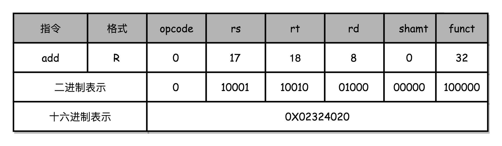
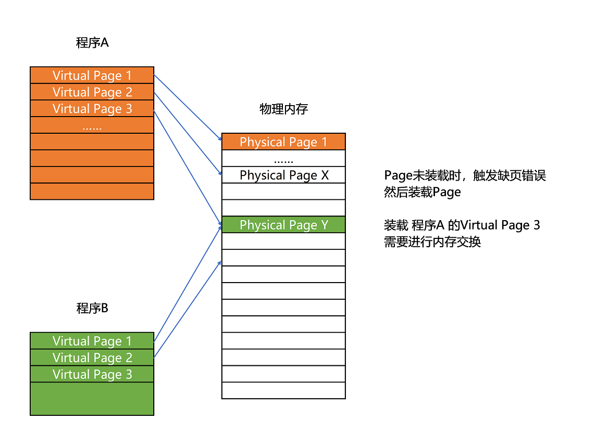
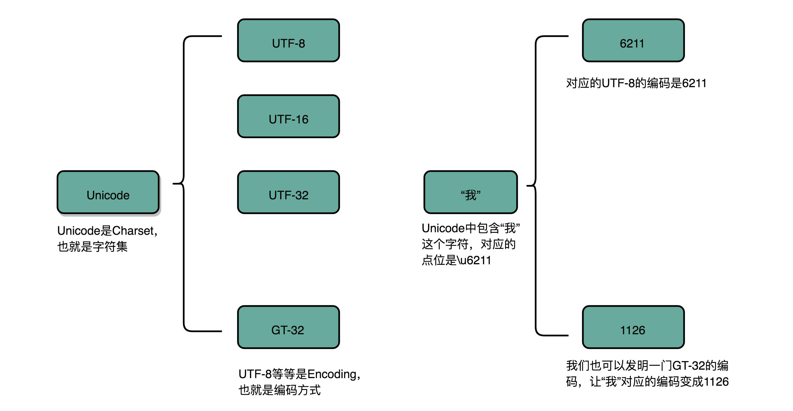
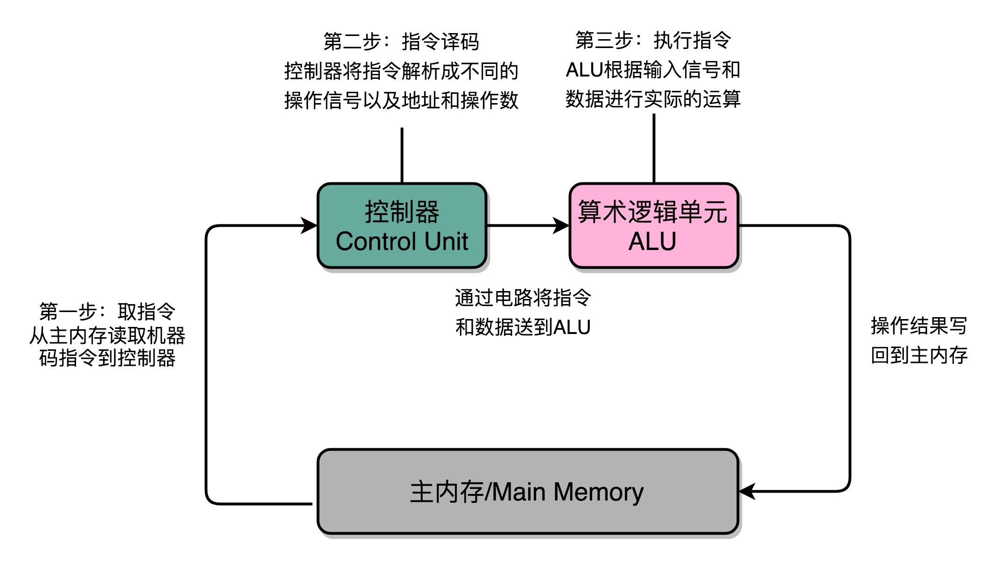

# 深入浅出计算机组成原理

- [开篇词 | 为什么你需要学习计算机组成原理？](#chapter0)
- [01 | 冯·诺依曼体系结构：计算机组成的金字塔](#chapter1)
- [02 | 给你一张知识地图，计算机组成原理应该这么学](#chapter2)
- [03 | 通过你的CPU主频，我们来谈谈“性能”究竟是什么？](#chapter3)
- [04 | 穿越功耗墙，我们该从哪些方面提升“性能”？](#chapter4)
- [05 | 计算机指令：让我们试试用纸带编程](#chapter5)
- [06 | 指令跳转：原来if...else就是goto](#chapter6)
- [07 | 函数调用：为什么会发生stack overflow？](#chapter7)
- [08 | ELF和静态链接：为什么程序无法同时在Linux和Windows下运行？](#chapter8)
- [09 | 程序装载：“640K内存”真的不够用么？](#chapter9)
- [10 | 动态链接：程序内部的“共享单车”](#chapter10)
- [11 | 二进制编码：“手持两把锟斤拷，口中疾呼烫烫烫”？](#chapter11)
- [12 | 理解电路：从电报机到门电路，我们如何做到“千里传信”？](#chapter12)
- [13 | 加法器：如何像搭乐高一样搭电路（上）？](#chapter13)
- [14 | 乘法器：如何像搭乐高一样搭电路（下）？](#chapter14)
- [15 | 浮点数和定点数（上）：怎么用有限的Bit表示尽可能多的信息？](#chapter15)
- [16 | 浮点数和定点数（下）：深入理解浮点数到底有什么用？](#chapter16)
- [17 | 建立数据通路（上）：指令+运算=CPU](#chapter17)
- [18 | 建立数据通路（中）：指令+运算=CPU](#chapter18)

<h1 id="chapter0">开篇词 | 为什么你需要学习计算机组成原理？</h1>

正所谓“练拳不练功，到老一场空”。**如果越早去弄清楚计算机的底层原理，在你的知识体系中“储蓄”起这些知识，也就意味着你有越长的时间来收获学习知识的“利息”。虽然一开始可能不起眼，但是随着时间带来的复利效应，你的长线投资项目，就能让你在成长的过程中越走越快。**

## 计算机底层知识的“第一课”

我们直接用肉眼来看，计算机是由 CPU、内存、显示器这些设备组成的硬件，但是，计算机系的学生毕业之后，大部分却都是从事各种软件开发工作。显然，在硬件和软件之间需要一座桥梁，而“计算机组成原理”就扮演了这样一个角色，它既隔离了软件和硬件，也提供了让软件无需关心硬件，就能直接操作硬件的接口。

也就是说，你只需要对硬件有原理性的理解，就可以信赖硬件的可靠性，安安心心用高级语言来写程序。无论是写操作系统和编译器这样的硬核代码，还是写 Web 应用和手机 App 这样的应用层代码，你都可以做到心里有底。

除此之外，组成原理是计算机其他核心课程的一个“导引”。学习组成原理之后，向下，你可以学习数字电路相关的课程，向上，你可以学习编译原理、操作系统这些核心课程。如果想要深入理解，甚至设计一台自己的计算机，体系结构是必不可少的一门课，而组成原理是计算机体系结构的一个入门版本。


## 理论和实践相结合

说了这么多计算机组成原理的重要性，但到底该怎么学呢？

互联网时代，我们从来不缺少资料。无论是 Coursera 上北京大学的《计算机组成》开放课程，还是图灵奖作者写的《计算机组成与设计：硬件 / 软件接口》，都珠玉在前，是非常优秀的学习资料。不过“买书如山倒，读书如抽丝”。从业这么多年，周围想要好好学一学组成原理的工程师不少，但是真的坚持下来学完、学好的却不多。大部分买来的书，都是前面 100 页已经发黄了，后面 500 页从来没有打开过；更有不少非科班出身的程序员，直接说“这些书根本看不懂”。

对这些问题，找到了三个主要原因：

1. 广。组成原理中的概念非常多，每个概念的信息量也非常大。比如想要理解 CPU 中的算术逻辑单元（也就是 ALU）是怎么实现加法的，需要牵涉到如何把整数表示成二进制，还需要了解这些表示背后的电路、逻辑门、CPU 时钟、触发器等知识。
2. 深。组成原理中的很多概念，阐述开来就是计算机学科的另外一门核心课程。比如，计算机的指令是怎么从你写的 C、Java 这样的高级语言，变成计算机可以执行的机器码的？如果我们展开并深入讲解这个问题，就会变成《编译原理》这样一门核心课程。
3. 学不能致用。学东西是要拿来用的，但因为这门课本身的属性，很多人在学习时，常常沉溺于概念和理论中，无法和自己日常的开发工作联系起来，以此来解决工作中遇到的问题，所以，学习往往没有成就感，就很难有动力坚持下去。

**因此，要把这些知识点和日常工作、生活以及整个计算机行业的发展史联系起来，真正看懂、学会、记住组成原理的核心内容，更多地从“为什么”这个角度，去理解这些知识点，而不是只是去记忆“是什么”。**

<h1 id="chapter1">01 | 冯·诺依曼体系结构：计算机组成的金字塔</h1>

## 计算机的基本硬件组成

早年，要自己组装一台计算机，要先有三大件，CPU、内存和主板。

在这三大件中，我们首先要说的是 **CPU**，它是计算机最重要的核心配件，全名你肯定知道，叫中央处理器（Central Processing Unit）。为什么说 CPU 是“最重要”的呢？因为计算机的所有“计算”都是由 CPU 来进行的。自然，CPU 也是整台计算机中造价最昂贵的部分之一。

第二个重要的配件，就是**内存**（Memory）。你撰写的程序、打开的浏览器、运行的游戏，都要加载到内存里才能运行。程序读取的数据、计算得到的结果，也都要放在内存里。内存越大，能加载的东西自然也就越多。

存放在内存里的程序和数据，需要被 CPU 读取，CPU 计算完之后，还要把数据写回到内存。然而 CPU 不能直接插到内存上，反之亦然。于是，就带来了最后一个大件——**主板**（Motherboard）。

主板是一个有着各种各样，有时候多达数十乃至上百个插槽的配件。我们的 CPU 要插在主板上，内存也要插在主板上。主板的**芯片组**（Chipset）和**总线**（Bus）解决了 CPU 和内存之间如何通信的问题。芯片组控制了数据传输的流转，也就是数据从哪里到哪里的问题。总线则是实际数据传输的高速公路。因此，**总线速度**（Bus Speed）决定了数据能传输得多快。

有了三大件，只要配上**电源**供电，计算机差不多就可以跑起来了。但是现在还缺少各类输入（Input）/ 输出（Output）设备，也就是我们常说的 **I/O 设备**。如果你用的是自己的个人电脑，那显示器肯定必不可少，只有有了显示器我们才能看到计算机输出的各种图像、文字，这也就是所谓的**输出设备**。

同样的，鼠标和键盘也都是必不可少的配件。这样我才能输入文本，写下这篇文章。它们也就是所谓的**输入设备**。

最后，你自己配的个人计算机，还要配上一个硬盘。这样各种数据才能持久地保存下来。绝大部分人都会给自己的机器装上一个机箱，配上风扇，解决灰尘和散热的问题。不过机箱和风扇，算不上是计算机的必备硬件，我们拿个纸板或者外面放个电风扇，也一样能用。

说了这么多，其实你应该有感觉了，显示器、鼠标、键盘和硬盘这些东西并不是一台计算机必须的部分。你想一想，我们其实只需要有 I/O 设备，能让我们从计算机里输入和输出信息，是不是就可以了？答案当然是肯定的。

你肯定去过网吧吧？不知道你注意到没有，很多网吧的计算机就没有硬盘，而是直接通过局域网，读写远程网络硬盘里面的数据。我们日常用的各类云服务器，只要让计算机能通过网络，SSH 远程登陆访问就好了，因此也没必要配显示器、鼠标、键盘这些东西。这样不仅能够节约成本，还更方便维护。

还有一个很特殊的设备，就是**显卡**（Graphics Card）。现在，使用图形界面操作系统的计算机，无论是 Windows、Mac OS 还是 Linux，显卡都是必不可少的。有人可能要说了，我装机的时候没有买显卡，计算机一样可以正常跑起来啊！那是因为，现在的主板都带了内置的显卡。如果你用计算机玩游戏，做图形渲染或者跑深度学习应用，你多半就需要买一张单独的显卡，插在主板上。显卡之所以特殊，是因为显卡里有除了 CPU 之外的另一个“处理器”，也就是 **GPU**（Graphics Processing Unit，图形处理器），GPU 一样可以做各种“计算”的工作。

鼠标、键盘以及硬盘，这些都是插在主板上的。作为外部 I/O 设备，它们是通过主板上的**南桥**（SouthBridge）芯片组，来控制和 CPU 之间的通信的。“南桥”芯片的名字很直观，一方面，它在主板上的位置，通常在主板的“南面”。另一方面，它的作用就是作为“桥”，来连接鼠标、键盘以及硬盘这些外部设备和 CPU 之间的通信。

有了南桥，自然对应着也有“北桥”。是的，以前的主板上通常也有“北桥”芯片，用来作为“桥”，连接 CPU 和内存、显卡之间的通信。不过，随着时间的变迁，现在的主板上的“北桥”芯片的工作，已经被移到了 CPU 的内部，所以你在主板上，已经看不到北桥芯片了。

## 冯·诺依曼体系结构

那我们平时最常用的智能手机的组成，也是这样吗？

我们手机里只有 SD 卡（Secure Digital Memory Card）这样类似硬盘功能的存储卡插槽，并没有内存插槽、CPU 插槽这些东西。没错，因为手机尺寸的原因，手机制造商们选择把 CPU、内存、网络通信，乃至摄像头芯片，都封装到一个芯片，然后再嵌入到手机主板上。这种方式叫 **SoC**，也就是 System on a Chip（系统芯片）。

这样看起来，个人电脑和智能手机的硬件组成方式不太一样。可是，我们写智能手机上的 App，和写个人电脑的客户端应用似乎没有什么差别，都是通过“高级语言”这样的编程语言撰写、编译之后，一样是把代码和数据加载到内存里来执行。这是为什么呢？因为，无论是个人电脑、服务器、智能手机，还是 Raspberry Pi 这样的微型卡片机，都遵循着同一个“计算机”的抽象概念。这是怎么样一个“计算机”呢？这其实就是，计算机祖师爷之一冯·诺依曼（John von Neumann）提出的**冯·诺依曼体系结构**（Von Neumann architecture），也叫**存储程序计算机**。

什么是存储程序计算机呢？这里面其实暗含了两个概念，一个是“**可编程**”计算机，一个是“**存储**”计算机。

说到“可编程”，估计你会有点懵，你可以先想想，什么是“不可编程”。计算机是由各种门电路组合而成的，然后通过组装出一个固定的电路板，来完成一个特定的计算程序。一旦需要修改功能，就要重新组装电路。这样的话，计算机就是“不可编程”的，因为程序在计算机硬件层面是“写死”的。最常见的就是老式计算器，电路板设好了加减乘除，做不了任何计算逻辑固定之外的事情。

我们再来看“存储”计算机。这其实是说，程序本身是存储在计算机的内存里，可以通过加载不同的程序来解决不同的问题。有“存储程序计算机”，自然也有不能存储程序的计算机。典型的就是早年的“Plugboard”这样的插线板式的计算机。整个计算机就是一个巨大的插线板，通过在板子上不同的插头或者接口的位置插入线路，来实现不同的功能。这样的计算机自然是“可编程”的，但是编写好的程序不能存储下来供下一次加载使用，不得不每次要用到和当前不同的“程序”的时候，重新插板子，重新“编程”。

可以看到，无论是“不可编程”还是“不可存储”，都会让使用计算机的效率大大下降。而这个对于效率的追求，也就是“存储程序计算机”的由来。

于是我们的冯祖师爷，基于当时在秘密开发的 EDVAC 写了一篇报告[First Draft of a Report on the EDVAC](https://en.wikipedia.org/wiki/First_Draft_of_a_Report_on_the_EDVAC)，描述了他心目中的一台计算机应该长什么样。这篇报告在历史上有个很特殊的简称，叫 **First Draft**，翻译成中文，其实就是《第一份草案》。这样，现代计算机的发展就从祖师爷写的一份草案开始了。

**First Draft** 里面说了一台计算机应该有哪些部分组成，我们一起来看看。

首先是一个包含算术逻辑单元（Arithmetic Logic Unit，ALU）和处理器寄存器（Processor Register）的**处理器单元**（Processing Unit），用来完成各种算术和逻辑运算。因为它能够完成各种数据的处理或者计算工作，因此也有人把这个叫作数据通路（Datapath）或者运算器。

然后是一个包含指令寄存器（Instruction Register）和程序计数器（Program Counter）的**控制器单元**（Control Unit/CU），用来控制程序的流程，通常就是不同条件下的分支和跳转。在现在的计算机里，上面的算术逻辑单元和这里的控制器单元，共同组成了我们说的 CPU。

接着是用来存储数据（Data）和指令（Instruction）的**内存**。以及更大容量的**外部存储**，在过去，可能是磁带、磁鼓这样的设备，现在通常就是硬盘。

最后就是各种**输入和输出设备**，以及对应的输入和输出机制。我们现在无论是使用什么样的计算机，其实都是和输入输出设备在打交道。个人电脑的鼠标键盘是输入设备，显示器是输出设备。我们用的智能手机，触摸屏既是输入设备，又是输出设备。而跑在各种云上的服务器，则是通过网络来进行输入和输出。这个时候，网卡既是输入设备又是输出设备。

<orange>任何一台计算机的任何一个部件都可以归到运算器、控制器、存储器、输入设备和输出设备中，而所有的现代计算机也都是基于这个基础架构来设计开发的。</orange>

而所有的计算机程序，也都可以抽象为从**输入设备**读取输入信息，通过**运算器**和**控制器**来执行存储在**存储器**里的程序，最终把结果输出到**输出设备**中。而我们所有撰写的无论高级还是低级语言的程序，也都是基于这样一个抽象框架来进行运作的。


## 总结延伸

可以说，冯·诺依曼体系结构确立了我们现在每天使用的计算机硬件的基础架构。因此，学习计算机组成原理，其实就是学习和拆解冯·诺依曼体系结构。

具体来说，学习组成原理，其实就是学习控制器、运算器的工作原理，也就是 CPU 是怎么工作的，以及为何这样设计；学习内存的工作原理，从最基本的电路，到上层抽象给到 CPU 乃至应用程序的接口是怎样的；学习 CPU 是怎么和输入设备、输出设备打交道的。

学习组成原理，就是在理解从控制器、运算器、存储器、输入设备以及输出设备，从电路这样的硬件，到最终开放给软件的接口，是怎么运作的，为什么要设计成这样，以及在软件开发层面怎么尽可能用好它。

<h1 id="chapter2">02 | 给你一张知识地图，计算机组成原理应该这么学</h1>


从这张图可以看出来，**整个计算机组成原理，就是围绕着计算机是如何组织运作展开的**。

## 计算机组成原理知识地图

计算机组成原理的英文叫 Computer Organization。这里的 Organization 是“组织机构”的意思。计算机由很多个不同的部件放在一起，变成了一个“组织机构”。这个组织机构最终能够进行各种计算、控制、读取输入，进行输出，达成各种强大的功能。

在这张图里面，我们把整个计算机组成原理的知识点拆分成了四大部分，分别是计算机的基本组成、计算机的指令和计算、处理器设计，以及存储器和 I/O 设备。

首先，我们来看**计算机的基本组成**。

这一部分，你需要学习计算机是由哪些硬件组成的。这些硬件，又是怎么对应到经典的冯·诺依曼体系结构中的，也就是<orange>运算器、控制器、存储器、输入设备和输出设备这五大基本组件</orange>。除此之外，你还需要了解<orange>计算机的两个核心指标，性能和功耗</orange>。性能和功耗也是我们在应用和设计五大基本组件中需要重点考虑的因素。

了解了组成部分，接下来你需要掌握**计算机的指令和计算**。

在计算机指令部分，你需要搞明白，我们每天撰写的一行行 C、Java、PHP 程序，是怎么在计算机里面跑起来的。这里面，你既需要了解我们的程序是怎么通过编译器和汇编器，变成一条条机器指令这样的编译过程（如果把编译过程展开的话，可以变成一门完整的编译原理课程），还需要知道我们的操作系统是怎么链接、装载、执行这些程序的（这部分知识如果再深入学习，又可以变成一门操作系统课程）。而这一条条指令执行的控制过程，就是由计算机五大组件之一的**控制器**来控制的。

在计算机的计算部分，你要从二进制和编码开始，理解我们的数据在计算机里的表示，以及我们是怎么从数字电路层面，实现加法、乘法这些基本的运算功能的。实现这些运算功能的 ALU（Arithmetic Logic Unit/ALU），也就是算术逻辑单元，其实就是我们计算机五大组件之一的**运算器**。

这里面有一个在今天看起来特别重要的知识点，就是浮点数（Floating Point）。浮点数是我们在日常运用中非常容易用错的一种数据表示形式。掌握浮点数能让你对数据的编码、存储和计算能够有一个从表到里的深入理解。尤其在 AI 火热的今天，浮点数是机器学习中重度使用的数据表示形式，掌握它更是非常有必要。

明白计算机指令和计算是如何运转的，我们就可以深入到 **CPU 的设计**中去一探究竟了。

CPU 时钟可以用来构造寄存器和内存的锁存器和触发器，因此，CPU 时钟应该是我们学习 CPU 的前导知识。搞明白我们为什么需要 CPU 时钟（CPU Clock），以及寄存器和内存是用什么样的硬件组成的之后，我们可以再来看看，整个计算机的数据通路是如何构造出来的。

数据通路，其实就是连接了整个运算器和控制器，并最终组成了 CPU。而出于对于性能和功耗的考虑，你要进一步理解和掌握面向流水线设计的 CPU、数据和控制冒险，以及分支预测的相关技术。

既然 CPU 作为控制器要和输入输出设备通信，那么我们就要知道异常和中断发生的机制。在 CPU 设计部分的最后，我会讲一讲指令的并行执行，看看如何直接在 CPU 层面，通过 SIMD 来支持并行计算。

最后，我们需要看一看，计算机五大组成部分之一，**存储器的原理**。通过存储器的层次结构作为基础的框架引导，你需要掌握从上到下的 CPU 高速缓存、内存、SSD 硬盘和机械硬盘的工作原理，它们之间的性能差异，以及实际应用中利用这些设备会遇到的挑战。存储器其实很多时候又扮演了输入输出设备的角色，所以你需要进一步了解，CPU 和这些存储器之间是如何进行通信的，以及我们最重视的性能问题是怎么一回事；理解什么是 IO_WAIT，如何通过 DMA 来提升程序性能。

对于存储器，我们不仅需要它们能够正常工作，还要确保里面的数据不能丢失。于是你要掌握我们是如何通过 RAID、Erasure Code、ECC 以及分布式 HDFS，这些不同的技术，来确保数据的完整性和访问性能。

## 学习计算机组成原理，究竟有没有好办法？

首先，**学会提问自己来串联知识点**。学完一个知识点之后，你可以从下面两个方面，问一下自己。

- 我写的程序，是怎样从输入的代码，变成运行的程序，并得到最终结果的？
- 整个过程中，计算器层面到底经历了哪些步骤，有哪些地方是可以优化的？

无论是程序的编译、链接、装载和执行，以及计算时需要用到的逻辑电路、ALU，乃至 CPU 自发为你做的流水线、指令级并行和分支预测，还有对应访问到的硬盘、内存，以及加载到高速缓存中的数据，这些都对应着我们学习中的一个个知识点。建议你自己脑子里过一遍，最好时口头表述一遍或者写下来，这样对你彻底掌握这些知识点都会非常有帮助。

其次，**写一些示例程序来验证知识点**。

最后，**通过和计算机硬件发展的历史做对照**。

比如说，奔腾 4 和 SPARC 的失败，以及 ARM 的成功，能让我们记住 CPU 指令集的繁与简、权衡性能和功耗的重要性，而现今高速发展的机器学习和边缘计算，又给计算机硬件设计带来了新的挑战。

## 给松鼠症患者的学习资料

## 入门书籍

一本是《计算机是怎样跑起来的》，另一本是《程序是怎样跑起来的》。

除此之外，计算机组成中，硬件层面的基础实现，比如寄存器、ALU 这些电路是怎么回事，你可以去看一看 Coursera 上的北京大学免费公开课[《Computer Organization》](https://www.coursera.org/learn/jisuanji-zucheng)。这个视频课程的视频部分也就 10 多个小时。在学习专栏相应章节的前后去浏览一遍，相信对你了解程序在电路层面会变成什么样子有所帮助。

## 深入学习书籍

《计算机组成与设计：硬件 / 软件接口》和经典的《深入理解计算机系统》这两本书。

如果引发了你对于计算机体系结构的兴趣，你还可以深入读一读《计算机体系结构：量化研究方法》。

## 课外阅读

在上面这些教材之外，对于资深程序员来说，来自 Redhat 的 **What Every Programmer Should Know About Memory** 是写出高性能程序不可不读的经典材料。而 LMAX 开源的 Disruptor，则是通过实际应用程序，来理解计算机组成原理中各个知识点的最好范例了。

《编码：隐匿在计算机软硬件背后的语言》和《程序员的自我修养：链接、装载和库》是理解计算机硬件和操作系统层面代码执行的优秀阅读材料。

<h1 id="chapter3">03 | 通过你的CPU主频，我们来谈谈“性能”究竟是什么？</h1>

## 什么是性能？时间的倒数

计算机的性能，其实和我们干体力劳动很像，好比是我们要搬东西。对于计算机的性能，我们需要有个标准来衡量。这个标准中主要有两个指标。

第一个是**响应时间**（Response time）或者叫执行时间（Execution time）。想要提升响应时间这个性能指标，你可以理解为让计算机“跑得更快”。


> 图中是我们实际系统里性能监测工具 NewRelic 中的响应时间，代表了每个外部的 Web 请求的执行时间

第二个是**吞吐率**（Throughput）或者带宽（Bandwidth），想要提升这个指标，你可以理解为让计算机“搬得更多”。


所以说，响应时间指的就是，我们执行一个程序，到底需要花多少时间。花的时间越少，自然性能就越好。

而吞吐率是指我们在一定的时间范围内，到底能处理多少事情。这里的“事情”，在计算机里就是处理的数据或者执行的程序指令。

和搬东西来做对比，如果我们的响应时间短，跑得快，我们可以来回多跑几趟多搬几趟。所以说，缩短程序的响应时间，一般来说都会提升吞吐率。

除了缩短响应时间，我们还有别的方法吗？当然有，比如说，我们还可以多找几个人一起来搬，这就类似现代的服务器都是 8 核、16 核的。人多力量大，同时处理数据，在单位时间内就可以处理更多数据，吞吐率自然也就上去了。

提升吞吐率的办法有很多。大部分时候，我们只要多加一些机器，多堆一些硬件就好了。但是响应时间的提升却没有那么容易，因为 CPU 的性能提升其实在 10 年前就处于“挤牙膏”的状态了，所以我们得慎重地来分析对待。

我们一般把性能，定义成响应时间的倒数，也就是：

> 性能 = 1/ 响应时间

这样一来，响应时间越短，性能的数值就越大。同样一个程序，在 Intel 最新的 CPU Coffee Lake 上，只需要 30s 就能运行完成，而在 5 年前 CPU Sandy Bridge 上，需要 1min 才能完成。那么我们自然可以算出来，Coffee Lake 的性能是 1/30，Sandy Bridge 的性能是 1/60，两个的性能比为 2。于是，我们就可以说，Coffee Lake 的性能是 Sandy Bridge 的 2 倍。

过去几年流行的手机跑分软件，就是把多个预设好的程序在手机上运行，然后根据运行需要的时间，算出一个分数来给出手机的性能评估。而在业界，各大 CPU 和服务器厂商组织了一个叫作 **SPEC**（Standard Performance Evaluation Corporation）的第三方机构，专门用来指定各种“跑分”的规则。


SPEC 提供的 CPU 基准测试程序，就好像 CPU 届的“高考”，通过数十个不同的计算程序，对于 CPU 的性能给出一个最终评分。这些程序丰富多彩，有编译器、解释器、视频压缩、人工智能国际象棋等等，涵盖了方方面面的应用场景。感兴趣的话，你可以点击[这个链接](https://www.spec.org/cpu2017/results/cpu2017.html)看看。

## 计算机的计时单位：CPU 时钟

虽然时间是一个很自然的用来衡量性能的指标，但是用时间来衡量时，有两个问题。

**第一个就是时间不“准”**。如果用你自己随便写的一个程序，来统计程序运行的时间，每一次统计结果不会完全一样。有可能这一次花了 45ms，下一次变成了 53ms。

计算机可能同时运行着好多个程序，CPU 实际上不停地在各个程序之间进行切换。在这些走掉的时间里面，很可能 CPU 切换去运行别的程序了。而且，有些程序在运行的时候，可能要从网络、硬盘去读取数据，要等网络和硬盘把数据读出来，给到内存和 CPU。所以说，**要想准确统计某个程序运行时间，进而去比较两个程序的实际性能，我们得把这些时间给刨除掉**。

那这件事怎么实现呢？Linux 下有一个叫 time 的命令，可以帮我们统计出来，同样的 Wall Clock Time 下，程序实际在 CPU 上到底花了多少时间。

我们简单运行一下 time 命令。它会返回三个值，第一个是 **real time**，也就是我们说的 Wall Clock Time，也就是运行程序整个过程中流逝掉的时间；第二个是 **user time**，也就是 CPU 在运行你的程序，在用户态运行指令的时间；第三个是 **sys time**，是 CPU 在运行你的程序，在操作系统内核里运行指令的时间。而**程序实际花费的 CPU 执行时间（CPU Time），就是 user time 加上 sys time**。

```c++
$ time seq 1000000 | wc -l
1000000


real  0m0.101s
user  0m0.031s
sys   0m0.016s
```

在我给的这个例子里，你可以看到，实际上程序用了 0.101s，但是 CPU time 只有 0.031+0.016 = 0.047s。运行程序的时间里，只有不到一半是实际花在这个程序上的。


**其次，即使我们已经拿到了 CPU 时间，我们也不一定可以直接“比较”出两个程序的性能差异**。即使在同一台计算机上，CPU 可能满载运行也可能降频运行，降频运行的时候自然花的时间会多一些。

除了 CPU 之外，时间这个性能指标还会受到主板、内存这些其他相关硬件的影响。所以，我们需要对“时间”这个我们可以感知的指标进行拆解，把程序的 CPU 执行时间变成 CPU 时钟周期数（CPU Cycles）和 时钟周期时间（Clock Cycle）的乘积。

> 程序的 CPU 执行时间 =CPU 时钟周期数×时钟周期时间

我们先来理解一下什么是时钟周期时间。你在买电脑的时候，一定关注过 CPU 的主频。比如我手头的这台电脑就是 Intel Core-i7-7700HQ 2.8GHz，这里的 2.8GHz 就是电脑的主频（Frequency/Clock Rate）。这个 2.8GHz，我们可以先粗浅地认为，CPU 在 1 秒时间内，可以执行的简单指令的数量是 2.8G 条。

如果想要更准确一点描述，这个 2.8GHz 就代表，我们 CPU 的一个“钟表”能够识别出来的最小的时间间隔。就像我们挂在墙上的挂钟，都是“滴答滴答”一秒一秒地走，所以通过墙上的挂钟能够识别出来的最小时间单位就是秒。

而在 CPU 内部，和我们平时戴的电子石英表类似，有一个叫晶体振荡器（Oscillator Crystal）的东西，简称为晶振。我们把晶振当成 CPU 内部的电子表来使用。晶振带来的每一次“滴答”，就是时钟周期时间。

在我这个 2.8GHz 的 CPU 上，这个时钟周期时间，就是 1/2.8G。我们的 CPU，是按照这个“时钟”提示的时间来进行自己的操作。主频越高，意味着这个表走得越快，我们的 CPU 也就“被逼”着走得越快。

如果你自己组装过台式机的话，可能听说过“超频”这个概念，这说的其实就相当于把买回来的 CPU 内部的钟给调快了，于是 CPU 的计算跟着这个时钟的节奏，也就自然变快了。当然这个快不是没有代价的，CPU 跑得越快，散热的压力也就越大。就和人一样，超过生理极限，CPU 就会崩溃了。

我们现在回到上面程序 CPU 执行时间的公式。

> 程序的 CPU 执行时间 =CPU 时钟周期数×时钟周期时间

最简单的提升性能方案，自然缩短时钟周期时间，也就是提升主频。换句话说，就是换一块好一点的 CPU。不过，这个是我们这些软件工程师控制不了的事情，所以我们就把目光挪到了乘法的另一个因子——CPU 时钟周期数上。如果能够减少程序需要的 CPU 时钟周期数量，一样能够提升程序性能。

对于 CPU 时钟周期数，我们可以再做一个分解，把它变成“指令数×**每条指令的平均时钟周期数**（Cycles Per Instruction，简称 CPI）”。不同的指令需要的 Cycles 是不同的，加法和乘法都对应着一条 CPU 指令，但是乘法需要的 Cycles 就比加法要多，自然也就慢。在这样拆分了之后，我们的程序的 CPU 执行时间就可以变成这样三个部分的乘积。

程序的 CPU 执行时间 = 指令数×CPI×Clock Cycle Time

因此，如果我们想要解决性能问题，其实就是要优化这三者。

1. 时钟周期时间，就是计算机主频，这个取决于计算机硬件。

2. 每条指令的平均时钟周期数 CPI，就是一条指令到底需要多少 CPU Cycle。

> 在后面讲解 CPU 结构的时候，我们会看到，现代的 CPU 通过流水线技术（Pipeline），让一条指令需要的 CPU Cycle 尽可能地少。因此，对于 CPI 的优化，也是计算机组成和体系结构中的重要一环。

3. 指令数，代表执行我们的程序到底需要多少条指令、用哪些指令。

> 这个很多时候就把挑战交给了编译器。同样的代码，编译成计算机指令时候，就有各种不同的表示方式。

## 总结延伸

主要对于“响应时间”这个性能指标进行抽丝剥茧，拆解成了计算机时钟周期、CPI 以及指令数这三个独立的指标的乘积，并且为你指明了优化计算机性能的三条康庄大道。

也就是，提升计算机主频，优化 CPU 设计使得在单个时钟周期内能够执行更多指令，以及通过编译器来减少需要的指令数。

<h1 id="chapter4">04 | 穿越功耗墙，我们该从哪些方面提升“性能”？</h1>

## 功耗：CPU 的“人体极限”

然而，计算机科学界从来不相信“大力出奇迹”。奔腾 4 的 CPU 主频从来没有达到过 10GHz，最终它的主频上限定格在 3.8GHz。这还不是最糟的，更糟糕的事情是，大家发现，奔腾 4 的主频虽然高，但是它的实际性能却配不上同样的主频。想要用在笔记本上的奔腾 4 2.4GHz 处理器，其性能只和基于奔腾 3 架构的奔腾 M 1.6GHz 处理器差不多。

于是，这一次的“大力出悲剧”，不仅让 Intel 的对手 AMD 获得了喘息之机，更是代表着“主频时代”的终结。后面几代 Intel CPU 主频不但没有上升，反而下降了。到如今，2019 年的最高配置 Intel i9 CPU，主频也只不过是 5GHz 而已。相较于 1978 年到 2000 年，这 20 年里 300 倍的主频提升，从 2000 年到现在的这 19 年，CPU 的主频大概提高了 3 倍。


> CPU 的主频变化，在奔腾 4 时代进入了瓶颈期，

奔腾 4 的主频为什么没能超过 3.8GHz 的障碍呢？答案就是功耗问题。什么是功耗问题呢？我们先看一个直观的例子。

一个 3.8GHz 的奔腾 4 处理器，满载功率是 130 瓦。这个 130 瓦是什么概念呢？机场允许带上飞机的充电宝的容量上限是 100 瓦时。如果我们把这个 CPU 安在手机里面，不考虑屏幕内存之类的耗电，这个 CPU 满载运行 45 分钟，充电宝里面就没电了。而 iPhone X 使用 ARM 架构的 CPU，功率则只有 4.5 瓦左右。

我们的 CPU，一般都被叫作**超大规模集成电路**（Very-Large-Scale Integration，VLSI）。这些电路，实际上都是一个个晶体管组合而成的。CPU 在计算，其实就是让晶体管里面的“开关”不断地去“打开”和“关闭”，来组合完成各种运算和功能。

想要计算得快，一方面，我们要在 CPU 里，同样的面积里面，多放一些晶体管，也就是**增加密度**；另一方面，我们要让晶体管“打开”和“关闭”得更快一点，也就是**提升主频**。而这两者，都会增加功耗，带来耗电和散热的问题。

这么说可能还是有点抽象，我还是给你举一个例子。你可以把一个计算机 CPU 想象成一个巨大的工厂，里面有很多工人，相当于 CPU 上面的晶体管，互相之间协同工作。

为了工作得快一点，我们要在工厂里多塞一点人。你可能会问，为什么不把工厂造得大一点呢？这是因为，人和人之间如果离得远了，互相之间走过去需要花的时间就会变长，这也会导致性能下降。这就好像如果 CPU 的面积大，晶体管之间的距离变大，电信号传输的时间就会变长，运算速度自然就慢了。

除了多塞一点人，我们还希望每个人的动作都快一点，这样同样的时间里就可以多干一点活儿了。这就相当于提升 CPU 主频，但是动作快，每个人就要出汗散热。要是太热了，对工厂里面的人来说会中暑生病，对 CPU 来说就会崩溃出错。

我们会在 CPU 上面抹硅脂、装风扇，乃至用上水冷或者其他更好的散热设备，就好像在工厂里面装风扇、空调，发冷饮一样。但是同样的空间下，装上风扇空调能够带来的散热效果也是有极限的。

因此，在 CPU 里面，能够放下的晶体管数量和晶体管的“开关”频率也都是有限的。一个 CPU 的功率，可以用这样一个公式来表示：

> 功耗 ~= 1/2 ×负载电容×电压的平方×开关频率×晶体管数量

那么，为了要提升性能，我们需要不断地增加晶体管数量。同样的面积下，我们想要多放一点晶体管，就要把晶体管造得小一点。这个就是平时我们所说的提升“制程”。从 28nm 到 7nm，相当于晶体管本身变成了原来的 1/4 大小。这个就相当于我们在工厂里，同样的活儿，我们要找瘦小一点的工人，这样一个工厂里面就可以多一些人。我们还要提升主频，让开关的频率变快，也就是要找手脚更快的工人。


但是，功耗增加太多，就会导致 CPU 散热跟不上，这时，我们就需要降低电压。这里有一点非常关键，在整个功耗的公式里面，功耗和电压的平方是成正比的。这意味着电压下降到原来的 1/5，整个的功耗会变成原来的 1/25。

事实上，从 5MHz 主频的 8086 到 5GHz 主频的 Intel i9，CPU 的电压已经从 5V 左右下降到了 1V 左右。这也是为什么我们 CPU 的主频提升了 1000 倍，但是功耗只增长了 40 倍。比如说，我写这篇文章用的是 Surface Go，在这样的轻薄笔记本上，微软就是选择了把电压下降到 0.25V 的低电压 CPU，使得笔记本能有更长的续航时间。

## 并行优化，理解阿姆达尔定律

虽然制程的优化和电压的下降，在过去的 20 年里，让我们的 CPU 性能有所提升。但是从上世纪九十年代到本世纪初，软件工程师们所用的“面向摩尔定律编程”的套路越来越用不下去了。“写程序不考虑性能，等明年 CPU 性能提升一倍，到时候性能自然就不成问题了”，这种想法已经不可行了。

于是，从奔腾 4 开始，Intel 意识到通过提升主频比较“难”去实现性能提升，边开始推出 Core Duo 这样的多核 CPU，通过提升“吞吐率”而不是“响应时间”，来达到目的。

这也是一个最常见的提升性能的方式，**通过并行提高性能**。

但是，并不是所有问题，都可以通过并行提高性能来解决。如果想要使用这种思想，需要满足这样几个条件。

- 第一，需要进行的计算，本身可以分解成几个可以并行的任务。好比上面的乘法和加法计算，几个人可以同时进行，不会影响最后的结果。
- 第二，需要能够分解好问题，并确保几个人的结果能够汇总到一起。
- 第三，在“汇总”这个阶段，是没有办法并行进行的，还是得顺序执行，一步一步来。

这就引出了我们在进行性能优化中，常常用到的一个经验定律，**阿姆达尔定律**（Amdahl’s Law）。这个定律说的就是，对于一个程序进行优化之后，处理器并行运算之后效率提升的情况。具体可以用这样一个公式来表示：

> 优化后的执行时间 = 受优化影响的执行时间 / 加速倍数 + 不受影响的执行时间


## 总结延伸

我们可以看到，无论是简单地通过提升主频，还是增加更多的 CPU 核心数量，通过并行来提升性能，都会遇到相应的瓶颈。仅仅简单地通过“堆硬件”的方式，在今天已经不能很好地满足我们对于程序性能的期望了。于是，工程师们需要从其他方面开始下功夫了。

在“摩尔定律”和“并行计算”之外，在整个计算机组成层面，还有这样几个原则性的性能提升方法。

1. 加速大概率事件。
2. 通过流水线提高性能。
3. 通过预测提高性能。

<h1 id="chapter5">05 | 计算机指令：让我们试试用纸带编程</h1>

当年学写程序的时候，不像现在这样，都是用一种古老的物理设备，叫作“打孔卡（Punched Card）”。用这种设备写程序，可没法像今天这样，掏出键盘就能打字，而是要先在脑海里或者在纸上写出程序，然后在纸带或者卡片上打洞。这样，要写的程序、要处理的数据，就变成一条条纸带或者一张张卡片，之后再交给当时的计算机去处理。


你看这个穿孔纸带是不是有点儿像我们现在考试用的答题卡？那个时候，人们在特定的位置上打洞或者不打洞，来代表“0”或者“1”。

为什么早期的计算机程序要使用打孔卡，而不能像我们现在一样，用 C 或者 Python 这样的高级语言来写呢？原因很简单，因为计算机或者说 CPU 本身，并没有能力理解这些高级语言。即使在 2019 年的今天，我们使用的现代个人计算机，仍然只能处理所谓的“机器码”，也就是一连串的“0”和“1”这样的数字。

## 在软硬件接口中，CPU 帮我们做了什么事？

我们常说，CPU 就是计算机的大脑。CPU 的全称是 Central Processing Unit，中文是中央处理器。

从**硬件**的角度来看，CPU 就是一个超大规模集成电路，通过电路实现了加法、乘法乃至各种各样的处理逻辑。

如果我们从**软件**工程师的角度来讲，CPU 就是一个执行各种**计算机指令**（Instruction Code）的逻辑机器。这里的计算机指令，就好比一门 CPU 能够听得懂的语言，我们也可以把它叫作**机器语言**（Machine Language）。

不同的 CPU 能够听懂的语言不太一样。比如，我们的个人电脑用的是 Intel 的 CPU，苹果手机用的是 ARM 的 CPU。这两者能听懂的语言就不太一样。类似这样两种 CPU 各自支持的语言，就是两组不同的**计算机指令集**，英文叫 Instruction Set。这里面的“Set”，其实就是数学上的集合，代表不同的单词、语法。

所以，如果我们在自己电脑上写一个程序，然后把这个程序复制一下，装到自己的手机上，肯定是没办法正常运行的，因为这两者语言不通。而一台电脑上的程序，简单复制一下到另外一台电脑上，通常就能正常运行，因为这两台 CPU 有着相同的指令集，也就是说，它们的语言相通的。

一个计算机程序，不可能只有一条指令，而是由成千上万条指令组成的。但是 CPU 里不能一直放着所有指令，所以计算机程序平时是存储在存储器中的。这种程序指令存储在存储器里面的计算机，我们就叫作**存储程序型计算机**（Stored-program Computer）。

说到这里，你可能要问了，难道还有不是存储程序型的计算机么？其实，在没有现代计算机之前，有着聪明才智的工程师们，早就发明了一种叫 Plugboard Computer 的计算设备。我把它直译成“插线板计算机”。在一个布满了各种插口和插座的板子上，工程师们用不同的电线来连接不同的插口和插座，从而来完成各种计算任务。下面这个图就是一台 IBM 的 Plugboard，看起来是不是有一股满满的蒸汽朋克范儿？

## 从编译到汇编，代码怎么变成机器码？

了解了计算机指令和计算机指令集，接下来我们来看看，平时编写的代码，到底是怎么变成一条条计算机指令，最后被 CPU 执行的呢？我们拿一小段真实的 C 语言程序来看看。

```c++
// test.c
int main()
{
  int a = 1; 
  int b = 2;
  a = a + b;
}
```

这是一段再简单不过的 C 语言程序，即便你不了解 C 语言，应该也可以看懂。我们给两个变量 a、b 分别赋值 1、2，然后再将 a、b 两个变量中的值加在一起，重新赋值给了 a 整个变量。

要让这段程序在一个 Linux 操作系统上跑起来，我们需要把整个程序翻译成一个**汇编语言**（ASM，Assembly Language）的程序，这个过程我们一般叫编译（Compile）成汇编代码。

针对汇编代码，我们可以再用汇编器（Assembler）翻译成机器码（Machine Code）。这些机器码由“0”和“1”组成的机器语言表示。这一条条机器码，就是一条条的**计算机指令**。这样一串串的 16 进制数字，就是我们 CPU 能够真正认识的计算机指令。

在一个 Linux 操作系统上，我们可以简单地使用 gcc 和 objdump 这样两条命令，把对应的汇编代码和机器码都打印出来。

```shell
$ gcc -g -c test.c
$ objdump -d -M intel -S test.o
```

可以看到，左侧有一堆数字，这些就是一条条机器码；右边有一系列的 push、mov、add、pop 等，这些就是对应的汇编代码。一行 C 语言代码，有时候只对应一条机器码和汇编代码，有时候则是对应两条机器码和汇编代码。汇编代码和机器码之间是一一对应的。

```c++
test.o:     file format elf64-x86-64
Disassembly of section .text:
0000000000000000 <main>:
int main()
{
   0:   55                      push   rbp
   1:   48 89 e5                mov    rbp,rsp
  int a = 1; 
   4:   c7 45 fc 01 00 00 00    mov    DWORD PTR [rbp-0x4],0x1
  int b = 2;
   b:   c7 45 f8 02 00 00 00    mov    DWORD PTR [rbp-0x8],0x2
  a = a + b;
  12:   8b 45 f8                mov    eax,DWORD PTR [rbp-0x8]
  15:   01 45 fc                add    DWORD PTR [rbp-0x4],eax
}
  18:   5d                      pop    rbp
  19:   c3                      ret    
```

这个时候你可能又要问了，我们实际在用 GCC（GUC 编译器套装，GNU Compiler Collectipon）编译器的时候，可以直接把代码编译成机器码呀，为什么还需要汇编代码呢？原因很简单，你看着那一串数字表示的机器码，是不是摸不着头脑？但是即使你没有学过汇编代码，看的时候多少也能“猜”出一些这些代码的含义。

因为汇编代码其实就是“给程序员看的机器码”，也正因为这样，机器码和汇编代码是一一对应的。我们人类很容易记住 add、mov 这些用英文表示的指令，而 8b 45 f8 这样的指令，由于很难一下子看明白是在干什么，所以会非常难以记忆。尽管早年互联网上到处流传，大神程序员着拿小刀在光盘上刻出操作系统的梗，但是要让你用打孔卡来写个程序，估计浪费的卡片比用上的卡片要多得多。


从高级语言到汇编代码，再到机器码，就是一个日常开发程序，最终变成了 CPU 可以执行的计算机指令的过程。

## 解析指令和机器码

了解了这个过程，下面我们放大局部，来看看这一行行的汇编代码和机器指令，到底是什么意思。

我们就从平时用的电脑、手机这些设备来说起。这些设备的 CPU 到底有哪些指令呢？这个还真有不少，我们日常用的 Intel CPU，有 2000 条左右的 CPU 指令，实在是太多了，所以我没法一一来给你讲解。不过一般来说，常见的指令可以分成五大类。

- 第一类是**算术类指令**。我们的加减乘除，在 CPU 层面，都会变成一条条算术类指令。

- 第二类是**数据传输类指令**。给变量赋值、在内存里读写数据，用的都是数据传输类指令。

- 第三类是**逻辑类指令**。逻辑上的与或非，都是这一类指令。

- 第四类是**条件分支类指令**。日常我们写的“if/else”，其实都是条件分支类指令。

- 最后一类是**无条件跳转指令**。写一些大一点的程序，我们常常需要写一些函数或者方法。在调用函数的时候，其实就是发起了一个无条件跳转指令。


下面我们来看看，汇编器是怎么把对应的汇编代码，翻译成为机器码的。

我们说过，不同的 CPU 有不同的指令集，也就对应着不同的汇编语言和不同的机器码。为了方便你快速理解这个机器码的计算方式，我们选用最简单的 MIPS 指令集，来看看机器码是如何生成的。

MIPS 是一组由 MIPS 技术公司在 80 年代中期设计出来的 CPU 指令集。就在最近，MIPS 公司把整个指令集和芯片架构都完全开源了。想要深入研究 CPU 和指令集的同学，这里推荐[一些资料](https://www.mips.com/mipsopen/)，你可以自己了解下。


MIPS 的指令是一个 32 位的整数，高 6 位叫**操作码**（Opcode），也就是代表这条指令具体是一条什么样的指令，剩下的 26 位有三种格式，分别是 R、I 和 J。

**R 指令**是一般用来做算术和逻辑操作，里面有读取和写入数据的寄存器的地址。如果是逻辑位移操作，后面还有位移操作的位移量，而最后的功能码，则是在前面的操作码不够的时候，扩展操作码表示对应的具体指令的。

**I 指令**，则通常是用在数据传输、条件分支，以及在运算的时候使用的并非变量还是常数的时候。这个时候，没有了位移量和操作码，也没有了第三个寄存器，而是把这三部分直接合并成了一个地址值或者一个常数。

**J 指令**就是一个跳转指令，高 6 位之外的 26 位都是一个跳转后的地址。

```c++
add $t0,$s2,$s1
```

以一个简单的加法算术指令 add t0,s1, $s2, 为例，给你解释。为了方便，我们下面都用十进制来表示对应的代码。

对应的 MIPS 指令里 opcode 是 0，rs 代表第一个寄存器 s1 的地址是 17，rt 代表第二个寄存器 s2 的地址是 18，rd 代表目标的临时寄存器 t0 的地址，是 8。因为不是位移操作，所以位移量是 0。把这些数字拼在一起，就变成了一个 MIPS 的加法指令。

为了读起来方便，我们一般把对应的二进制数，用 16 进制表示出来。在这里，也就是 0X02324020。这个数字也就是这条指令对应的机器码。



回到开头我们说的打孔带。如果我们用打孔代表 1，没有打孔代表 0，用 4 行 8 列代表一条指令来打一个穿孔纸带，那么这条命令大概就长这样：


## 总结延伸

到这里，想必你也应该明白了，我们在这一讲的开头介绍的打孔卡，其实就是一种存储程序型计算机。

只是这整个程序的机器码，不是通过计算机编译出来的，而是由程序员，用人脑“编译”成一张张卡片的。对应的程序，也不是存储在设备里，而是存储成一张打好孔的卡片。但是整个程序运行的逻辑和其他 CPU 的机器语言没有什么分别，也是处理一串“0”和“1”组成的机器码而已。

然而，单单理解一条指令是怎么变成机器码的肯定是不够的。接下来的几节，我会深入讲解，包含条件、循环、函数、递归这些语句的完整程序，是怎么在 CPU 里面执行的。

<h1 id="chapter6">06 | 指令跳转：原来if...else就是goto</h1>

## CPU 是如何执行指令的？

拿我们用的 Intel CPU 来说，里面差不多有几百亿个晶体管。实际上，一条条计算机指令执行起来非常复杂。好在 CPU 在软件层面已经为我们做好了封装。对于我们这些做软件的程序员来说，我们只要知道，写好的代码变成了指令之后，是一条一条**顺序**执行的就可以了。

我们先不管几百亿的晶体管的背后是怎么通过电路运转起来的，逻辑上，我们可以认为，CPU 其实就是由一堆寄存器组成的。而寄存器就是 CPU 内部，由多个触发器（Flip-Flop）或者锁存器（Latches）组成的简单电路。

触发器和锁存器，其实就是两种不同原理的数字电路组成的逻辑门。这块内容并不是我们这节课的重点，所以你只要了解就好。如果想要深入学习的话，你可以学习数字电路的相关课程，这里我们不深入探讨。

好了，现在我们接着前面说。N 个触发器或者锁存器，就可以组成一个 N 位（Bit）的寄存器，能够保存 N 位的数据。比方说，我们用的 64 位 Intel 服务器，寄存器就是 64 位的。


一个 CPU 里面会有很多种不同功能的寄存器。我这里给你介绍三种比较特殊的。

一个是 **PC 寄存器**（Program Counter Register），我们也叫**指令地址寄存器**（Instruction Address Register）。顾名思义，它就是用来存放下一条需要执行的计算机指令的内存地址。

第二个是**指令寄存器**（Instruction Register），用来存放当前正在执行的指令。

第三个是**条件码寄存器**（Status Register），用里面的一个一个标记位（Flag），存放 CPU 进行算术或者逻辑计算的结果。

除了这些特殊的寄存器，CPU 里面还有更多用来存储数据和内存地址的寄存器。这样的寄存器通常一类里面不止一个。我们通常根据存放的数据内容来给它们取名字，比如整数寄存器、浮点数寄存器、向量寄存器和地址寄存器等等。有些寄存器既可以存放数据，又能存放地址，我们就叫它通用寄存器。


实际上，一个程序执行的时候，CPU 会根据 PC 寄存器里的地址，从内存里面把需要执行的指令读取到指令寄存器里面执行，然后根据指令长度自增，开始顺序读取下一条指令。可以看到，一个程序的一条条指令，在内存里面是连续保存的，也会一条条顺序加载。

而有些特殊指令，比如上一讲我们讲到 J 类指令，也就是跳转指令，会修改 PC 寄存器里面的地址值。这样，下一条要执行的指令就不是从内存里面顺序加载的了。事实上，这些跳转指令的存在，也是我们可以在写程序的时候，使用 if…else 条件语句和 while/for 循环语句的原因。

## 从 if…else 来看程序的执行和跳转

```c++
// test.c


#include <time.h>
#include <stdlib.h>


int main()
{
  srand(time(NULL));
  int r = rand() % 2;
  int a = 10;
  if (r == 0)
  {
    a = 1;
  } else {
    a = 2;
  } 
}
```

我们用 rand 生成了一个随机数 r，r 要么是 0，要么是 1。当 r 是 0 的时候，我们把之前定义的变量 a 设成 1，不然就设成 2。

```
$ gcc -g -c test.c
$ objdump -d -M intel -S test.o 
```

我们把这个程序编译成汇编代码。你可以忽略前后无关的代码，只关注于这里的 if…else 条件判断语句。对应的汇编代码是这样的：

```c++
    if (r == 0)
  3b:   83 7d fc 00             cmp    DWORD PTR [rbp-0x4],0x0
  3f:   75 09                   jne    4a <main+0x4a>
    {
        a = 1;
  41:   c7 45 f8 01 00 00 00    mov    DWORD PTR [rbp-0x8],0x1
  48:   eb 07                   jmp    51 <main+0x51>
    }
    else
    {
        a = 2;
  4a:   c7 45 f8 02 00 00 00    mov    DWORD PTR [rbp-0x8],0x2
  51:   b8 00 00 00 00          mov    eax,0x0
    } 
```

可以看到，这里对于 r ==  0 的条件判断，被编译成了 cmp 和 jne 这两条指令。

cmp 指令比较了前后两个操作数的值，这里的 DWORD PTR 代表操作的数据类型是 32 位的整数，而[rbp-0x4]则是一个寄存器的地址。所以，第一个操作数就是从寄存器里拿到的变量 r 的值。第二个操作数 0x0 就是我们设定的常量 0 的 16 进制表示。cmp 指令的比较结果，会存入到***条件码寄存器**当中去。

在这里，如果比较的结果是 True，也就是 r == 0，就把**零标志条件码**（对应的条件码是 ZF，Zero Flag）设置为 1。除了零标志之外，Intel 的 CPU 下还有**进位标志**（CF，Carry Flag）、**符号标志**（SF，Sign Flag）以及**溢出标志**（OF，Overflow Flag），用在不同的判断条件下。

cmp 指令执行完成之后，PC 寄存器会自动自增，开始执行下一条 jne 的指令。

跟着的 jne 指令，是 jump if not equal 的意思，它会查看对应的零标志位。如果为 0，会跳转到后面跟着的操作数 4a 的位置。这个 4a，对应这里汇编代码的行号，也就是上面设置的 else 条件里的第一条指令。当跳转发生的时候，PC 寄存器就不再是自增变成下一条指令的地址，而是被直接设置成这里的 4a 这个地址。这个时候，CPU 再把 4a 地址里的指令加载到指令寄存器中来执行。

跳转到执行地址为 4a 的指令，实际是一条 mov 指令，第一个操作数和前面的 cmp 指令一样，是另一个 32 位整型的寄存器地址，以及对应的 2 的 16 进制值 0x2。mov 指令把 2 设置到对应的寄存器里去，相当于一个赋值操作。然后，PC 寄存器里的值继续自增，执行下一条 mov 指令。

这条 mov 指令的第一个操作数 eax，代表累加寄存器，第二个操作数 0x0 则是 16 进制的 0 的表示。这条指令其实没有实际的作用，它的作用是一个占位符。我们回过头去看前面的 if 条件，如果满足的话，在赋值的 mov 指令执行完成之后，有一个 jmp 的无条件跳转指令。跳转的地址就是这一行的地址 51。我们的 main 函数没有设定返回值，而 mov eax, 0x0 其实就是给 main 函数生成了一个默认的为 0 的返回值到累加器里面。if 条件里面的内容执行完成之后也会跳转到这里，和 else 里的内容结束之后的位置是一样的。


上一讲我们讲打孔卡的时候说到，读取打孔卡的机器会顺序地一段一段地读取指令，然后执行。执行完一条指令，它会自动地顺序读取下一条指令。如果执行的当前指令带有跳转的地址，比如往后跳 10 个指令，那么机器会自动将卡片带往后移动 10 个指令的位置，再来执行指令。同样的，机器也能向前移动，去读取之前已经执行过的指令。这也就是我们的 while/for 循环实现的原理。

## 如何通过 if…else 和 goto 来实现循环？

```c++
int main()
{
    int a = 0;
    for (int i = 0; i < 3; i++)
    {
        a += i;
    }
}
```

我们再看一段简单的利用 for 循环的程序。我们循环自增变量 i 三次，三次之后，i>=3，就会跳出循环。整个程序，对应的 Intel 汇编代码就是这样的：

```java
    for (int i = 0; i < 3; i++)
   b:   c7 45 f8 00 00 00 00    mov    DWORD PTR [rbp-0x8],0x0
  12:   eb 0a                   jmp    1e <main+0x1e>
    {
        a += i;
  14:   8b 45 f8                mov    eax,DWORD PTR [rbp-0x8]
  17:   01 45 fc                add    DWORD PTR [rbp-0x4],eax
    for (int i = 0; i < 3; i++)
  1a:   83 45 f8 01             add    DWORD PTR [rbp-0x8],0x1
  1e:   83 7d f8 02             cmp    DWORD PTR [rbp-0x8],0x2
  22:   7e f0                   jle    14 <main+0x14>
  24:   b8 00 00 00 00          mov    eax,0x0
    }
```

可以看到，对应的循环也是用 1e 这个地址上的 cmp 比较指令，和紧接着的 jle 条件跳转指令来实现的。主要的差别在于，这里的 jle 跳转的地址，在这条指令之前的地址 14，而非 if…else 编译出来的跳转指令之后。往前跳转使得条件满足的时候，PC 寄存器会把指令地址设置到之前执行过的指令位置，重新执行之前执行过的指令，直到条件不满足，顺序往下执行 jle 之后的指令，整个循环才结束。


如果你看一长条打孔卡的话，就会看到卡片往后移动一段，执行了之后，又反向移动，去重新执行前面的指令。

其实，你有没有觉得，jle 和 jmp 指令，有点像程序语言里面的 goto 命令，直接指定了一个特定条件下的跳转位置。虽然我们在用高级语言开发程序的时候反对使用 goto，但是实际在机器指令层面，无论是 if…else…也好，还是 for/while 也好，都是用和 goto 相同的跳转到特定指令位置的方式来实现的。

## 总结延伸

这一节，我们在单条指令的基础上，学习了程序里的多条指令，究竟是怎么样一条一条被执行的。除了简单地通过 PC 寄存器自增的方式顺序执行外，条件码寄存器会记录下当前执行指令的条件判断状态，然后通过跳转指令读取对应的条件码，修改 PC 寄存器内的下一条指令的地址，最终实现 if…else 以及 for/while 这样的程序控制流程。

你会发现，虽然我们可以用高级语言，可以用不同的语法，比如 if…else 这样的条件分支，或者 while/for 这样的循环方式，来实现不用的程序运行流程，但是回归到计算机可以识别的机器指令级别，其实都只是一个简单的地址跳转而已，也就是一个类似于 goto 的语句。

想要在硬件层面实现这个 goto 语句，除了本身需要用来保存下一条指令地址，以及当前正要执行指令的 PC 寄存器、指令寄存器外，我们只需要再增加一个条件码寄存器，来保留条件判断的状态。这样简简单单的三个寄存器，就可以实现条件判断和循环重复执行代码的功能。

下一节，我们会进一步讲解，如果程序中出现函数或者过程这样可以复用的代码模块，对应的指令是怎么样执行的，会和我们这里的 if…else 有什么不同。

<h1 id="chapter7">07 | 函数调用：为什么会发生stack overflow？</h1>

在开发软件的过程中我们经常会遇到错误，如果你用 Google 搜过出错信息，那你多少应该都访问过Stack Overflow这个网站。作为全球最大的程序员问答网站，Stack Overflow 的名字来自于一个常见的报错，就是栈溢出（stack overflow）。

## 为什么我们需要程序栈？

和前面几讲一样，我们还是从一个非常简单的 C 程序 function_example.c 看起。

```c++
// function_example.c
#include <stdio.h>
int static add(int a, int b)
{
    return a+b;
}

int main()
{
    int x = 5;
    int y = 10;
    int u = add(x, y);
}
```

这个程序定义了一个简单的函数 add，接受两个参数 a 和 b，返回值就是 a+b。而 main 函数里则定义了两个变量 x 和 y，然后通过调用这个 add 函数，来计算 u=x+y，最后把 u 的数值打印出来。

```c++
$ gcc -g -c function_example.c
$ objdump -d -M intel -S function_example.o
```

我们把这个程序编译之后，objdump 出来。我们来看一看对应的汇编代码。

```c++
int static add(int a, int b)
{
   0:   55                      push   rbp
   1:   48 89 e5                mov    rbp,rsp
   4:   89 7d fc                mov    DWORD PTR [rbp-0x4],edi
   7:   89 75 f8                mov    DWORD PTR [rbp-0x8],esi
    return a+b;
   a:   8b 55 fc                mov    edx,DWORD PTR [rbp-0x4]
   d:   8b 45 f8                mov    eax,DWORD PTR [rbp-0x8]
  10:   01 d0                   add    eax,edx
}
  12:   5d                      pop    rbp
  13:   c3                      ret    
0000000000000014 <main>:
int main()
{
  14:   55                      push   rbp
  15:   48 89 e5                mov    rbp,rsp
  18:   48 83 ec 10             sub    rsp,0x10
    int x = 5;
  1c:   c7 45 fc 05 00 00 00    mov    DWORD PTR [rbp-0x4],0x5
    int y = 10;
  23:   c7 45 f8 0a 00 00 00    mov    DWORD PTR [rbp-0x8],0xa
    int u = add(x, y);
  2a:   8b 55 f8                mov    edx,DWORD PTR [rbp-0x8]
  2d:   8b 45 fc                mov    eax,DWORD PTR [rbp-0x4]
  30:   89 d6                   mov    esi,edx
  32:   89 c7                   mov    edi,eax
  34:   e8 c7 ff ff ff          call   0 <add>
  39:   89 45 f4                mov    DWORD PTR [rbp-0xc],eax
  3c:   b8 00 00 00 00          mov    eax,0x0
}
  41:   c9                      leave  
  42:   c3                      ret    
```

可以看出来，在这段代码里，main 函数和上一节我们讲的的程序执行区别并不大，它主要是把 jump 指令换成了函数调用的 call 指令。call 指令后面跟着的，仍然是跳转后的程序地址。

这些你理解起来应该不成问题。我们下面来看一个有意思的部分。

我们来看 add 函数。可以看到，add 函数编译之后，代码先执行了一条 push 指令和一条 mov 指令；在函数执行结束的时候，又执行了一条 pop 和一条 ret 指令。这四条指令的执行，其实就是在进行我们接下来要讲**压栈**（Push）和**出栈**（Pop）操作。

你有没有发现，函数调用和上一节我们讲的 if…else 和 for/while 循环有点像。它们两个都是在原来顺序执行的指令过程里，执行了一个内存地址的跳转指令，让指令从原来顺序执行的过程里跳开，从新的跳转后的位置开始执行。

但是，这两个跳转有个区别，if…else 和 for/while 的跳转，是跳转走了就不再回来了，就在跳转后的新地址开始顺序地执行指令，就好像徐志摩在《再别康桥》里面写的：“我挥一挥衣袖，不带走一片云彩”，继续进行新的生活了。而函数调用的跳转，在对应函数的指令执行完了之后，还要再回到函数调用的地方，继续执行 call 之后的指令，就好像贺知章在《回乡偶书》里面写的那样：“少小离家老大回，乡音未改鬓毛衰”，不管走多远，最终还是要回来。

不过，仔细琢磨一下，你会发现这个方法有些问题。如果函数 A 调用了函数 B，然后函数 B 再调用函数 A，我们就得面临在 A 里面插入 B 的指令，然后在 B 里面插入 A 的指令，这样就会产生无穷无尽地替换。就好像两面镜子面对面放在一块儿，任何一面镜子里面都会看到无穷多面镜子。

看来，把被调用函数的指令直接插入在调用处的方法行不通。那我们就换一个思路，能不能把后面要跳回来执行的指令地址给记录下来呢？就像前面讲 PC 寄存器一样，我们可以专门设立一个“程序调用寄存器”，来存储接下来要跳转回来执行的指令地址。等到函数调用结束，从这个寄存器里取出地址，再跳转到这个记录的地址，继续执行就好了。

但是在多层函数调用里，简单只记录一个地址也是不够的。我们在调用函数 A 之后，A 还可以调用函数 B，B 还能调用函数 C。这一层又一层的调用并没有数量上的限制。在所有函数调用返回之前，每一次调用的返回地址都要记录下来，但是我们 CPU 里的寄存器数量并不多。像我们一般使用的 Intel i7 CPU 只有 16 个 64 位寄存器，调用的层数一多就存不下了。

最终，计算机科学家们想到了一个比单独记录跳转回来的地址更完善的办法。我们在内存里面开辟一段空间，用栈这个**后进先出**（LIFO，Last In First Out）的数据结构。栈就像一个乒乓球桶，每次程序调用函数之前，我们都把调用返回后的地址写在一个乒乓球上，然后塞进这个球桶。这个操作其实就是我们常说的**压栈**。如果函数执行完了，我们就从球桶里取出最上面的那个乒乓球，很显然，这就是**出栈**。

拿到出栈的乒乓球，找到上面的地址，把程序跳转过去，就返回到了函数调用后的下一条指令了。如果函数 A 在执行完成之前又调用了函数 B，那么在取出乒乓球之前，我们需要往球桶里塞一个乒乓球。而我们从球桶最上面拿乒乓球的时候，拿的也一定是最近一次的，也就是最下面一层的函数调用完成后的地址。乒乓球桶的底部，就是**栈底**，最上面的乒乓球所在的位置，就是**栈顶**。


在真实的程序里，压栈的不只有函数调用完成后的返回地址。比如函数 A 在调用 B 的时候，需要传输一些参数数据，这些参数数据在寄存器不够用的时候也会被压入栈中。整个函数 A 所占用的所有内存空间，就是函数 A 的**栈帧**（Stack Frame）。Frame 在中文里也有“相框”的意思，所以，每次到这里，我都有种感觉，整个函数 A 所需要的内存空间就像是被这么一个“相框”给框了起来，放在了栈里面。

而实际的程序栈布局，顶和底与我们的乒乓球桶相比是倒过来的。底在最上面，顶在最下面，这样的布局是因为栈底的内存地址是在一开始就固定的。而一层层压栈之后，栈顶的内存地址是在逐渐变小而不是变大。


对应上面函数 add 的汇编代码，我们来仔细看看，main 函数调用 add 函数时，add 函数入口在 0～1 行，add 函数结束之后在 12～13 行。

我们在调用第 34 行的 call 指令时，会把当前的 PC 寄存器里的下一条指令的地址压栈，保留函数调用结束后要执行的指令地址。而 add 函数的第 0 行，push rbp 这个指令，就是在进行压栈。这里的 rbp 又叫栈帧指针（Frame Pointer），是一个存放了当前栈帧位置的寄存器。push rbp 就把之前调用函数，也就是 main 函数的栈帧的栈底地址，压到栈顶。

接着，第 1 行的一条命令 mov rbp, rsp 里，则是把 rsp 这个栈指针（Stack Pointer）的值复制到 rbp 里，而 rsp 始终会指向栈顶。这个命令意味着，rbp 这个栈帧指针指向的地址，变成当前最新的栈顶，也就是 add 函数的栈帧的栈底地址了。

而在函数 add 执行完成之后，又会分别调用第 12 行的 pop rbp 来将当前的栈顶出栈，这部分操作维护好了我们整个栈帧。然后，我们可以调用第 13 行的 ret 指令，这时候同时要把 call 调用的时候压入的 PC 寄存器里的下一条指令出栈，更新到 PC 寄存器中，将程序的控制权返回到出栈后的栈顶。

## 如何构造一个 stack  overflow？

通过引入栈，我们可以看到，无论有多少层的函数调用，或者在函数 A 里调用函数 B，再在函数 B 里调用 A，这样的递归调用，我们都只需要通过维持 rbp 和 rsp，这两个维护栈顶所在地址的寄存器，就能管理好不同函数之间的跳转。不过，栈的大小也是有限的。如果函数调用层数太多，我们往栈里压入它存不下的内容，程序在执行的过程中就会遇到栈溢出的错误，这就是大名鼎鼎的“stack  overflow”。

要构造一个栈溢出的错误并不困难，最简单的办法，就是我们上面说的 Infiinite Mirror Effect 的方式，让函数 A 调用自己，并且不设任何终止条件。这样一个无限递归的程序，在不断地压栈过程中，将整个栈空间填满，并最终遇上 stack  overflow。

```c++
int a()
{
  return a();
}

int main()
{
  a();
  return 0;
}
```

除了无限递归，递归层数过深，在栈空间里面创建非常占内存的变量（比如一个巨大的数组），这些情况都很可能给你带来 stack  overflow。相信你理解了栈在程序运行的过程里面是怎么回事，未来在遇到 stackoverflow 这个错误的时候，不会完全没有方向了。

## 如何利用函数内联进行性能优化？

上面我们提到一个方法，把一个实际调用的函数产生的指令，直接插入到的位置，来替换对应的函数调用指令。尽管这个通用的函数调用方案，被我们否决了，但是如果被调用的函数里，没有调用其他函数，这个方法还是可以行得通的。

事实上，这就是一个常见的编译器进行自动优化的场景，我们通常叫函数内联（Inline）。我们只要在 GCC 编译的时候，加上对应的一个让编译器自动优化的参数 -O，编译器就会在可行的情况下，进行这样的指令替换。

我们来看一段代码。

```c++
#include <stdio.h>
#include <time.h>
#include <stdlib.h>

int static add(int a, int b)
{
    return a+b;
}

int main()
{
    srand(time(NULL));
    int x = rand() % 5
    int y = rand() % 10;
    int u = add(x, y)
    printf("u = %d\n", u)
}
```

为了避免编译器优化掉太多代码，我小小修改了一下 function_example.c，让参数 x 和 y 都变成了，通过随机数生成，并在代码的最后加上将 u 通过 printf 打印出来的语句。

```c++
$ gcc -g -c -O function_example_inline.c
$ objdump -d -M intel -S function_example_inline.o
```

上面的 function_example_inline.c 的编译出来的汇编代码，没有把 add 函数单独编译成一段指令顺序，而是在调用 u = add(x, y) 的时候，直接替换成了一个 add 指令。

```c++
    return a+b;
  4c:   01 de                   add    esi,ebx
```

除了依靠编译器的自动优化，你还可以在定义函数的地方，加上 inline 的关键字，来提示编译器对函数进行内联。

内联带来的优化是，CPU 需要执行的指令数变少了，根据地址跳转的过程不需要了，压栈和出栈的过程也不用了。

不过内联并不是没有代价，内联意味着，我们把可以复用的程序指令在调用它的地方完全展开了。如果一个函数在很多地方都被调用了，那么就会展开很多次，整个程序占用的空间就会变大了。


这样没有调用其他函数，只会被调用的函数，我们一般称之为**叶子函数（或叶子过程）**。

## 总结延伸

这一节，我们讲了一个程序的函数间调用，在 CPU 指令层面是怎么执行的。其中一定需要你牢记的，就是**程序栈**这个新概念。

我们可以方便地通过压栈和出栈操作，使得程序在不同的函数调用过程中进行转移。而函数内联和栈溢出，一个是我们常常可以选择的优化方案，另一个则是我们会常遇到的程序 Bug。

通过加入了程序栈，我们相当于在指令跳转的过程种，加入了一个“记忆”的功能，能在跳转去运行新的指令之后，再回到跳出去的位置，能够实现更加丰富和灵活的指令执行流程。这个也为我们在程序开发的过程中，提供了“函数”这样一个抽象，使得我们在软件开发的过程中，可以复用代码和指令，而不是只能简单粗暴地复制、粘贴代码和指令。

<h1 id="chapter8">08 | ELF和静态链接：为什么程序无法同时在Linux和Windows下运行？</h1>

## 编译、链接和装载：拆解程序执行

我们说过，写好的 C 语言代码，可以通过编译器编译成汇编代码，然后汇编代码再通过汇编器变成 CPU 可以理解的机器码，于是 CPU 就可以执行这些机器码了。你现在对这个过程应该不陌生了，但是这个描述把过程大大简化了。下面，我们一起具体来看，C 语言程序是如何变成一个可执行程序的。

不知道你注意到没有，过去几节，我们通过 gcc 生成的文件和 objdump 获取到的汇编指令都有些小小的问题。我们先把前面的 add 函数示例，拆分成两个文件 add_lib.c 和 link_example.c。

```c++
// add_lib.c
int add(int a, int b)
{
    return a+b;
}
```

```c++
// link_example.c

#include <stdio.h>
int main()
{
    int a = 10;
    int b = 5;
    int c = add(a, b);
    printf("c = %d\n", c);
}
```

我们通过 gcc 来编译这两个文件，然后通过 objdump 命令看看它们的汇编代码。

```c++
$ gcc -g -c add_lib.c link_example.c
$ objdump -d -M intel -S add_lib.o
$ objdump -d -M intel -S link_example.o
```

```c++
add_lib.o:     file format elf64-x86-64
Disassembly of section .text:
0000000000000000 <add>:
   0:   55                      push   rbp
   1:   48 89 e5                mov    rbp,rsp
   4:   89 7d fc                mov    DWORD PTR [rbp-0x4],edi
   7:   89 75 f8                mov    DWORD PTR [rbp-0x8],esi
   a:   8b 55 fc                mov    edx,DWORD PTR [rbp-0x4]
   d:   8b 45 f8                mov    eax,DWORD PTR [rbp-0x8]
  10:   01 d0                   add    eax,edx
  12:   5d                      pop    rbp
  13:   c3                      ret    
```

```c++
link_example.o:     file format elf64-x86-64
Disassembly of section .text:
0000000000000000 <main>:
   0:   55                      push   rbp
   1:   48 89 e5                mov    rbp,rsp
   4:   48 83 ec 10             sub    rsp,0x10
   8:   c7 45 fc 0a 00 00 00    mov    DWORD PTR [rbp-0x4],0xa
   f:   c7 45 f8 05 00 00 00    mov    DWORD PTR [rbp-0x8],0x5
  16:   8b 55 f8                mov    edx,DWORD PTR [rbp-0x8]
  19:   8b 45 fc                mov    eax,DWORD PTR [rbp-0x4]
  1c:   89 d6                   mov    esi,edx
  1e:   89 c7                   mov    edi,eax
  20:   b8 00 00 00 00          mov    eax,0x0
  25:   e8 00 00 00 00          call   2a <main+0x2a>
  2a:   89 45 f4                mov    DWORD PTR [rbp-0xc],eax
  2d:   8b 45 f4                mov    eax,DWORD PTR [rbp-0xc]
  30:   89 c6                   mov    esi,eax
  32:   48 8d 3d 00 00 00 00    lea    rdi,[rip+0x0]        # 39 <main+0x39>
  39:   b8 00 00 00 00          mov    eax,0x0
  3e:   e8 00 00 00 00          call   43 <main+0x43>
  43:   b8 00 00 00 00          mov    eax,0x0
  48:   c9                      leave  
  49:   c3                      ret    
```

既然代码已经被我们“编译”成了指令，我们不妨尝试运行一下 ./link_example.o。

不幸的是，文件没有执行权限，我们遇到一个 Permission denied 错误。即使通过 chmod 命令赋予 link_example.o 文件可执行的权限，运行./link_example.o 仍然只会得到一条 cannot execute binary file: Exec format error 的错误。

我们再仔细看一下 objdump 出来的两个文件的代码，会发现两个程序的地址都是从 0 开始的。如果地址是一样的，程序如果需要通过 call 指令调用函数的话，它怎么知道应该跳转到哪一个文件里呢？

这么说吧，无论是这里的运行报错，还是 objdump 出来的汇编代码里面的重复地址，都是因为 add_lib.o 以及 link_example.o 并不是一个**可执行文件**（Executable Program），而是**目标文件**（Object File）。只有通过链接器（Linker）把多个目标文件以及调用的各种函数库链接起来，我们才能得到一个可执行文件。

我们通过 gcc 的 -o 参数，可以生成对应的可执行文件，对应执行之后，就可以得到这个简单的加法调用函数的结果。

```c++
$ gcc -o link-example add_lib.o link_example.o
$ ./link_example
c = 15
```

实际上，“**C 语言代码 - 汇编代码 - 机器码**”  这个过程，在我们的计算机上进行的时候是由两部分组成的。

第一个部分由编译（Compile）、汇编（Assemble）以及链接（Link）三个阶段组成。在这三个阶段完成之后，我们就生成了一个可执行文件。

第二部分，我们通过装载器（Loader）把可执行文件装载（Load）到内存中。CPU 从内存中读取指令和数据，来开始真正执行程序。


## ELF 格式和链接：理解链接过程

程序最终是通过装载器变成指令和数据的，所以其实我们生成的可执行代码也并不仅仅是一条条的指令。我们还是通过 objdump 指令，把可执行文件的内容拿出来看看。

```c++
link_example:     file format elf64-x86-64
Disassembly of section .init:
...
Disassembly of section .plt:
...
Disassembly of section .plt.got:
...
Disassembly of section .text:
...

 6b0:   55                      push   rbp
 6b1:   48 89 e5                mov    rbp,rsp
 6b4:   89 7d fc                mov    DWORD PTR [rbp-0x4],edi
 6b7:   89 75 f8                mov    DWORD PTR [rbp-0x8],esi
 6ba:   8b 55 fc                mov    edx,DWORD PTR [rbp-0x4]
 6bd:   8b 45 f8                mov    eax,DWORD PTR [rbp-0x8]
 6c0:   01 d0                   add    eax,edx
 6c2:   5d                      pop    rbp
 6c3:   c3                      ret    
00000000000006c4 <main>:
 6c4:   55                      push   rbp
 6c5:   48 89 e5                mov    rbp,rsp
 6c8:   48 83 ec 10             sub    rsp,0x10
 6cc:   c7 45 fc 0a 00 00 00    mov    DWORD PTR [rbp-0x4],0xa
 6d3:   c7 45 f8 05 00 00 00    mov    DWORD PTR [rbp-0x8],0x5
 6da:   8b 55 f8                mov    edx,DWORD PTR [rbp-0x8]
 6dd:   8b 45 fc                mov    eax,DWORD PTR [rbp-0x4]
 6e0:   89 d6                   mov    esi,edx
 6e2:   89 c7                   mov    edi,eax
 6e4:   b8 00 00 00 00          mov    eax,0x0
 6e9:   e8 c2 ff ff ff          call   6b0 <add>
 6ee:   89 45 f4                mov    DWORD PTR [rbp-0xc],eax
 6f1:   8b 45 f4                mov    eax,DWORD PTR [rbp-0xc]
 6f4:   89 c6                   mov    esi,eax
 6f6:   48 8d 3d 97 00 00 00    lea    rdi,[rip+0x97]        # 794 <_IO_stdin_used+0x4>
 6fd:   b8 00 00 00 00          mov    eax,0x0
 702:   e8 59 fe ff ff          call   560 <printf@plt>
 707:   b8 00 00 00 00          mov    eax,0x0
 70c:   c9                      leave  
 70d:   c3                      ret    
 70e:   66 90                   xchg   ax,ax
...
Disassembly of section .fini:
...
```

你会发现，可执行代码 dump 出来内容，和之前的目标代码长得差不多，但是长了很多。因为在 Linux 下，可执行文件和目标文件所使用的都是一种叫 **ELF**（Execuatable and Linkable File Format）的文件格式，中文名字叫**可执行与可链接文件格式**，这里面不仅存放了编译成的汇编指令，还保留了很多别的数据。

比如我们过去所有 objdump 出来的代码里，你都可以看到对应的函数名称，像 add、main 等等，乃至你自己定义的全局可以访问的变量名称，都存放在这个 ELF 格式文件里。这些名字和它们对应的地址，在 ELF 文件里面，存储在一个叫作**符号表**（Symbols Table）的位置里。符号表相当于一个地址簿，把名字和地址关联了起来。

我们先只关注和我们的 add 以及 main 函数相关的部分。你会发现，这里面，main 函数里调用 add 的跳转地址，不再是下一条指令的地址了，而是 add 函数的入口地址了，这就是 EFL 格式和链接器的功劳。


ELF 文件格式把各种信息，分成一个一个的 Section 保存起来。ELF 有一个基本的文件头（File Header），用来表示这个文件的基本属性，比如是否是可执行文件，对应的 CPU、操作系统等等。除了这些基本属性之外，大部分程序还有这么一些 Section：

1. 首先是.text Section，也叫作**代码段**或者指令段（Code Section），用来保存程序的代码和指令；
2. 接着是.data Section，也叫作**数据段**（Data Section），用来保存程序里面设置好的初始化数据信息；
3. 然后就是.rel.text Secion，叫作**重定位表**（Relocation Table）。重定位表里，保留的是当前的文件里面，哪些跳转地址其实是我们不知道的。比如上面的 link_example.o 里面，我们在 main 函数里面调用了 add 和 printf 这两个函数，但是在链接发生之前，我们并不知道该跳转到哪里，这些信息就会存储在重定位表里；
4. 最后是.symtab Section，叫作**符号表**（Symbol Table）。符号表保留了我们所说的当前文件里面定义的函数名称和对应地址的地址簿。

链接器会扫描所有输入的目标文件，然后把所有符号表里的信息收集起来，构成一个全局的符号表。然后再根据重定位表，把所有不确定要跳转地址的代码，根据符号表里面存储的地址，进行一次修正。最后，把所有的目标文件的对应段进行一次合并，变成了最终的可执行代码。这也是为什么，可执行文件里面的函数调用的地址都是正确的。


在链接器把程序变成可执行文件之后，要装载器去执行程序就容易多了。装载器不再需要考虑地址跳转的问题，只需要解析 ELF 文件，把对应的指令和数据，加载到内存里面供 CPU 执行就可以了。

## 总结延伸

讲到这里，相信你已经猜到，为什么同样一个程序，在 Linux 下可以执行而在 Windows 下不能执行了。其中一个非常重要的原因就是，两个操作系统下可执行文件的格式不一样。

我们今天讲的是 Linux 下的 ELF 文件格式，而 Windows 的可执行文件格式是一种叫作 **PE**（Portable Executable Format）的文件格式。Linux 下的装载器只能解析 ELF 格式而不能解析 PE 格式。

如果我们有一个可以能够解析 PE 格式的装载器，我们就有可能在 Linux 下运行 Windows 程序了。这样的程序真的存在吗？没错，Linux 下著名的开源项目 Wine，就是通过兼容 PE 格式的装载器，使得我们能直接在 Linux 下运行 Windows 程序的。而现在微软的 Windows 里面也提供了 WSL，也就是 Windows Subsystem for Linux，可以解析和加载 ELF 格式的文件。

我们去写可以用的程序，也不仅仅是把所有代码放在一个文件里来编译执行，而是可以拆分成不同的函数库，最后通过一个静态链接的机制，使得不同的文件之间既有分工，又能通过静态链接来“合作”，变成一个可执行的程序。

对于 ELF 格式的文件，为了能够实现这样一个静态链接的机制，里面不只是简单罗列了程序所需要执行的指令，还会包括链接所需要的重定位表和符号表。

<h1 id="chapter9">09 | 程序装载：“640K内存”真的不够用么？</h1>

计算机这个行业的历史上有过很多成功的预言，最著名的自然是“摩尔定律”。当然免不了的也有很多“失败”的预测，其中一个最著名的就是，比尔·盖茨在上世纪 80 年代说的“640K ought to be enough for anyone”，也就是“640K 内存对哪个人来说都够用了”。

## 程序装载面临的挑战

上一讲，我们看到了如何通过链接器，把多个文件合并成一个最终可执行文件。在运行这些可执行文件的时候，我们其实是通过一个装载器，解析 ELF 或者 PE 格式的可执行文件。装载器会把对应的指令和数据加载到内存里面来，让 CPU 去执行。

说起来只是装载到内存里面这一句话的事儿，实际上装载器需要满足两个要求。

- **第一，可执行程序加载后占用的内存空间应该是连续的**。我们在第 6 讲讲过，执行指令的时候，程序计数器是顺序地一条一条指令执行下去。这也就意味着，这一条条指令需要连续地存储在一起。

- **第二，我们需要同时加载很多个程序，并且不能让程序自己规定在内存中加载的位置**。虽然编译出来的指令里已经有了对应的各种各样的内存地址，但是实际加载的时候，我们其实没有办法确保，这个程序一定加载在哪一段内存地址上。因为我们现在的计算机通常会同时运行很多个程序，可能你想要的内存地址已经被其他加载了的程序占用了。

要满足这两个基本的要求，我们很容易想到一个办法。那就是我们可以在内存里面，找到一段连续的内存空间，然后分配给装载的程序，然后把这段连续的内存空间地址，和整个程序指令里指定的内存地址做一个映射。

我们把指令里用到的内存地址叫作**虚拟内存地址**（Virtual Memory Address），实际在内存硬件里面的空间地址，我们叫**物理内存地址**（Physical Memory Address）。

程序里有指令和各种内存地址，我们只需要关心虚拟内存地址就行了。对于任何一个程序来说，它看到的都是同样的内存地址。我们维护一个虚拟内存到物理内存的映射表，这样实际程序指令执行的时候，会通过虚拟内存地址，找到对应的物理内存地址，然后执行。因为是连续的内存地址空间，所以我们只需要维护映射关系的起始地址和对应的空间大小就可以了。

## 内存分段

这种找出一段连续的物理内存和虚拟内存地址进行映射的方法，我们叫**分段**（Segmentation）。这里的段，就是指系统分配出来的那个连续的内存空间。


分段的办法很好，解决了程序本身不需要关心具体的物理内存地址的问题，但它也有一些不足之处，第一个就是**内存碎片**（Memory Fragmentation）的问题。

我们来看这样一个例子。我现在手头的这台电脑，有 1GB 的内存。我们先启动一个图形渲染程序，占用了 512MB 的内存，接着启动一个 Chrome 浏览器，占用了 128MB 内存，再启动一个 Python 程序，占用了 256MB 内存。这个时候，我们关掉 Chrome，于是空闲内存还有 1024 - 512 - 256 = 256MB。按理来说，我们有足够的空间再去装载一个 200MB 的程序。但是，这 256MB 的内存空间不是连续的，而是被分成了两段 128MB 的内存。因此，实际情况是，我们的程序没办法加载进来。


当然，这个我们也有办法解决。解决的办法叫**内存交换**（Memory Swapping）。

我们可以把 Python 程序占用的那 256MB 内存写到硬盘上，然后再从硬盘上读回来到内存里面。不过读回来的时候，我们不再把它加载到原来的位置，而是紧紧跟在那已经被占用了的 512MB 内存后面。这样，我们就有了连续的 256MB 内存空间，就可以去加载一个新的 200MB 的程序。如果你自己安装过 Linux 操作系统，你应该遇到过分配一个 swap 硬盘分区的问题。这块分出来的磁盘空间，其实就是专门给 Linux 操作系统进行内存交换用的。

虚拟内存、分段，再加上内存交换，看起来似乎已经解决了计算机同时装载运行很多个程序的问题。不过，你千万不要大意，这三者的组合仍然会遇到一个性能瓶颈。硬盘的访问速度要比内存慢很多，而每一次内存交换，我们都需要把一大段连续的内存数据写到硬盘上。所以，如果内存交换的时候，交换的是一个很占内存空间的程序，这样整个机器都会显得卡顿。

## 内存分页

既然问题出在内存碎片和内存交换的空间太大上，那么解决问题的办法就是，少出现一些内存碎片。另外，当需要进行内存交换的时候，让需要交换写入或者从磁盘装载的数据更少一点，这样就可以解决这个问题。这个办法，在现在计算机的内存管理里面，就叫作**内存分页**（Paging）。

**和分段这样分配一整段连续的空间给到程序相比，分页是把整个物理内存空间切成一段段固定尺寸的大小**。而对应的程序所需要占用的虚拟内存空间，也会同样切成一段段固定尺寸的大小。这样一个连续并且尺寸固定的内存空间，我们叫**页**（Page）。从虚拟内存到物理内存的映射，不再是拿整段连续的内存的物理地址，而是按照一个一个页来的。页的尺寸一般远远小于整个程序的大小。在 Linux 下，我们通常只设置成 4KB。你可以通过命令看看你手头的 Linux 系统设置的页的大小。

```c++
$ getconf PAGE_SIZE
```

由于内存空间都是预先划分好的，也就没有了不能使用的碎片，而只有被释放出来的很多 4KB 的页。即使内存空间不够，需要让现有的、正在运行的其他程序，通过内存交换释放出一些内存的页出来，一次性写入磁盘的也只有少数的一个页或者几个页，不会花太多时间，让整个机器被内存交换的过程给卡住。



更进一步地，分页的方式使得我们在加载程序的时候，不再需要一次性都把程序加载到物理内存中。我们完全可以在进行虚拟内存和物理内存的页之间的映射之后，并不真的把页加载到物理内存里，而是只在程序运行中，需要用到对应虚拟内存页里面的指令和数据时，再加载到物理内存里面去。

实际上，我们的操作系统，的确是这么做的。当要读取特定的页，却发现数据并没有加载到物理内存里的时候，就会触发一个来自于 CPU 的**缺页错误**（Page Fault）。我们的操作系统会捕捉到这个错误，然后将对应的页，从存放在硬盘上的虚拟内存里读取出来，加载到物理内存里。这种方式，使得我们可以运行那些远大于我们实际物理内存的程序。同时，这样一来，任何程序都不需要一次性加载完所有指令和数据，只需要加载当前需要用到就行了。

通过虚拟内存、内存交换和内存分页这三个技术的组合，我们最终得到了一个让程序不需要考虑实际的物理内存地址、大小和当前分配空间的解决方案。这些技术和方法，对于我们程序的编写、编译和链接过程都是透明的。这也是我们在计算机的软硬件开发中常用的一种方法，就是**加入一个间接层**。

通过引入虚拟内存、页映射和内存交换，我们的程序本身，就不再需要考虑对应的真实的内存地址、程序加载、内存管理等问题了。任何一个程序，都只需要把内存当成是一块完整而连续的空间来直接使用。

## 总结延伸

现在回到开头我问你的问题，我们的电脑只要 640K 内存就够了吗？很显然，现在来看，比尔·盖茨的这个判断是不合理的，那为什么他会这么认为呢？因为他也是一个很优秀的程序员啊！

在虚拟内存、内存交换和内存分页这三者结合之下，你会发现，其实要运行一个程序，“必需”的内存是很少的。CPU 只需要执行当前的指令，极限情况下，内存也只需要加载一页就好了。再大的程序，也可以分成一页。每次，只在需要用到对应的数据和指令的时候，从硬盘上交换到内存里面来就好了。以我们现在 4K 内存一页的大小，640K 内存也能放下足足 160 页呢，也无怪乎在比尔·盖茨会说出“640K ought to be enough for anyone”这样的话。

不过呢，硬盘的访问速度比内存慢很多，所以我们现在的计算机，没有个几 G 的内存都不好意思和人打招呼。

那么，除了程序分页装载这种方式之外，我们还有其他优化内存使用的方式么？下一讲，我们就一起来看看“动态装载”，学习一下让两个不同的应用程序，共用一个共享程序库的办法。

<h1 id="chapter10">10 | 动态链接：程序内部的“共享单车”</h1>

我们之前讲过，程序的链接，是把对应的不同文件内的代码段，合并到一起，成为最后的可执行文件。这个链接的方式，让我们在写代码的时候做到了“复用”。同样的功能代码只要写一次，然后提供给很多不同的程序进行链接就行了。

这么说来，“链接”其实有点儿像我们日常生活中的**标准化、模块化**生产。我们有一个可以生产标准螺帽的生产线，就可以生产很多个不同的螺帽。只要需要螺帽，我们都可以通过**链接**的方式，去**复制**一个出来，放到需要的地方去，大到汽车，小到信箱。

但是，如果我们有很多个程序都要通过装载器装载到内存里面，那里面链接好的同样的功能代码，也都需要再装载一遍，再占一遍内存空间。这就好比，假设每个人都有骑自行车的需要，那我们给每个人都生产一辆自行车带在身边，固然大家都有自行车用了，但是马路上肯定会特别拥挤。


## 链接可以分动、静，共享运行省内存

我们上一节解决程序装载到内存的时候，讲了很多方法。说起来，最根本的问题其实就是**内存空间不够用**。如果我们能够让同样功能的代码，在不同的程序里面，不需要各占一份内存空间，那该有多好啊！就好比，现在马路上的共享单车，我们并不需要给每个人都造一辆自行车，只要马路上有这些单车，谁需要的时候，直接通过手机扫码，都可以解锁骑行。

这个思路就引入一种新的链接方法，叫作**动态链接**（Dynamic Link）。相应的，我们之前说的合并代码段的方法，就是**静态链接**（Static Link）。

在动态链接的过程中，我们想要“链接”的，不是存储在硬盘上的目标文件代码，而是加载到内存中的**共享库**（Shared Libraries）。顾名思义，这里的共享库重在“共享“这两个字。

这个加载到内存中的共享库会被很多个程序的指令调用到。在 Windows 下，这些共享库文件就是.dll 文件，也就是 Dynamic-Link Libary（DLL，动态链接库）。在 Linux 下，这些共享库文件就是.so 文件，也就是 Shared Object（一般我们也称之为动态链接库）。这两大操作系统下的文件名后缀，一个用了“动态链接”的意思，另一个用了“共享”的意思，正好覆盖了两方面的含义。


## 地址无关很重要，相对地址解烦恼

不过，要想要在程序运行的时候共享代码，也有一定的要求，就是这些机器码必须是“**地址无关**”的。也就是说，我们编译出来的共享库文件的指令代码，是地址无关码（Position-Independent Code）。换句话说就是，这段代码，无论加载在哪个内存地址，都能够正常执行。如果不是这样的代码，就是地址相关的代码。

你可以想想，大部分函数库其实都可以做到地址无关，因为它们都接受特定的输入，进行确定的操作，然后给出返回结果就好了。无论是实现一个向量加法，还是实现一个打印的函数，这些代码逻辑和输入的数据在内存里面的位置并不重要。

而常见的地址相关的代码，比如绝对地址代码（Absolute Code）、利用重定位表的代码等等，都是地址相关的代码。你回想一下我们之前讲过的重定位表。在程序链接的时候，我们就把函数调用后要跳转访问的地址确定下来了，这意味着，如果这个函数加载到一个不同的内存地址，跳转就会失败。


对于所有动态链接共享库的程序来讲，虽然我们的共享库用的都是同一段物理内存地址，但是在不同的应用程序里，它所在的虚拟内存地址是不同的。我们没办法、也不应该要求动态链接同一个共享库的不同程序，必须把这个共享库所使用的虚拟内存地址变成一致。如果这样的话，我们写的程序就必须明确地知道内部的内存地址分配。

那么问题来了，我们要怎么样才能做到，动态共享库编译出来的代码指令，都是地址无关码呢？

动态代码库内部的变量和函数调用都很容易解决，我们只需要使用**相对地址**（Relative Address）就好了。各种指令中使用到的内存地址，给出的不是一个绝对的地址空间，而是一个相对于当前指令偏移量的内存地址。因为整个共享库是放在一段连续的虚拟内存地址中的，无论装载到哪一段地址，不同指令之间的相对地址都是不变的。

## PLT 和 GOT，动态链接的解决方案

要实现动态链接共享库，也并不困难，和前面的静态链接里的符号表和重定向表类似，还是和前面一样，我们还是拿出一小段代码来看一看。

首先，lib.h 定义了动态链接库的一个函show_me_the_money。

```c++
// lib.h
#ifndef LIB_H
#define LIB_H

void show_me_the_money(int money);

#endif
```

lib.c 包含了 lib.h 的实际实现。

```c++
// lib.c
#include <stdio.h>

void show_me_the_money(int money)
{
    printf("Show me USD %d from lib.c \n", money);
}
```

然后，show_me_poor.c 调用了 lib 里面的函数。

```c++
// show_me_poor.c
#include "lib.h"
int main()
{
    int money = 5;
    show_me_the_money(money);
}
```

最后，我们把 lib.c 编译成了一个动态链接库，也就是 .so 文件。

```c++
$ gcc lib.c -fPIC -shared -o lib.so
$ gcc -o show_me_poor show_me_poor.c ./lib.so
```

你可以看到，在编译的过程中，我们指定了一个 **-fPIC** 的参数。这个参数其实就是 Position Independent Code 的意思，也就是我们要把这个编译成一个地址无关代码。

然后，我们再通过 gcc 编译 show_me_poor 动态链接了 lib.so 的可执行文件。在这些操作都完成了之后，我们把 show_me_poor 这个文件通过 objdump 出来看一下。

```c++
$ objdump -d -M intel -S show_me_poor
```

```c++
……
0000000000400540 <show_me_the_money@plt-0x10>:
  400540:       ff 35 12 05 20 00       push   QWORD PTR [rip+0x200512]        # 600a58 <_GLOBAL_OFFSET_TABLE_+0x8>
  400546:       ff 25 14 05 20 00       jmp    QWORD PTR [rip+0x200514]        # 600a60 <_GLOBAL_OFFSET_TABLE_+0x10>
  40054c:       0f 1f 40 00             nop    DWORD PTR [rax+0x0]

0000000000400550 <show_me_the_money@plt>:
  400550:       ff 25 12 05 20 00       jmp    QWORD PTR [rip+0x200512]        # 600a68 <_GLOBAL_OFFSET_TABLE_+0x18>
  400556:       68 00 00 00 00          push   0x0
  40055b:       e9 e0 ff ff ff          jmp    400540 <_init+0x28>
……
0000000000400676 <main>:
  400676:       55                      push   rbp
  400677:       48 89 e5                mov    rbp,rsp
  40067a:       48 83 ec 10             sub    rsp,0x10
  40067e:       c7 45 fc 05 00 00 00    mov    DWORD PTR [rbp-0x4],0x5
  400685:       8b 45 fc                mov    eax,DWORD PTR [rbp-0x4]
  400688:       89 c7                   mov    edi,eax
  40068a:       e8 c1 fe ff ff          call   400550 <show_me_the_money@plt>
  40068f:       c9                      leave  
  400690:       c3                      ret    
  400691:       66 2e 0f 1f 84 00 00    nop    WORD PTR cs:[rax+rax*1+0x0]
  400698:       00 00 00 
  40069b:       0f 1f 44 00 00          nop    DWORD PTR [rax+rax*1+0x0]
……
```

我们还是只关心整个可执行文件中的一小部分内容。你应该可以看到，在 main 函数调用 show_me_the_money 的函数的时候，对应的代码是这样的：

```c++
call   400550 <show_me_the_money@plt>
```

这里后面有一个 @plt 的关键字，代表了我们需要从 PLT，也就是**程序链接表**（Procedure Link Table）里面找要调用的函数。对应的地址呢，则是 400550 这个地址。

那当我们把目光挪到上面的 400550 这个地址，你又会看到里面进行了一次跳转，这个跳转指定的跳转地址，你可以在后面的注释里面可以看到，GLOBAL_OFFSET_TABLE+0x18。这里的 GLOBAL_OFFSET_TABLE，就是我接下来要说的全局偏移表。

```c++
  400550:       ff 25 12 05 20 00       jmp    QWORD PTR [rip+0x200512]        # 600a68 <_GLOBAL_OFFSET_TABLE_+0x18>
```

在动态链接对应的共享库，我们在共享库的 data section 里面，保存了一张**全局偏移表**（GOT，Global Offset Table）。**虽然共享库的代码部分的物理内存是共享的，但是数据部分是各个动态链接它的应用程序里面各加载一份的**。所有需要引用当前共享库外部的地址的指令，都会查询 GOT，来找到当前运行程序的虚拟内存里的对应位置。而 GOT 表里的数据，则是在我们加载一个个共享库的时候写进去的。

不同的进程，调用同样的 lib.so，各自 GOT 里面指向最终加载的动态链接库里面的虚拟内存地址是不同的。

这样，虽然不同的程序调用的同样的动态库，各自的内存地址是独立的，调用的又都是同一个动态库，但是不需要去修改动态库里面的代码所使用的地址，而是各个程序各自维护好自己的 GOT，能够找到对应的动态库就好了。


我们的 GOT 表位于共享库自己的数据段里。GOT 表在内存里和对应的代码段位置之间的偏移量，始终是确定的。这样，我们的共享库就是地址无关的代码，对应的各个程序只需要在物理内存里面加载同一份代码。而我们又要通过各个可执行程序在加载时，生成的各不相同的 GOT 表，来找到它需要调用到的外部变量和函数的地址。

这是一个典型的、不修改代码，而是通过修改“**地址数据**”来进行关联的办法。它有点像我们在 C 语言里面用函数指针来调用对应的函数，并不是通过预先已经确定好的函数名称来调用，而是利用当时它在内存里面的动态地址来调用。

## 总结延伸

这一讲，我们终于在静态链接和程序装载之后，利用动态链接把我们的内存利用到了极致。同样功能的代码生成的共享库，我们只要在内存里面保留一份就好了。这样，我们不仅能够做到代码在开发阶段的复用，也能做到代码在运行阶段的复用。

实际上，在进行 Linux 下的程序开发的时候，我们一直会用到各种各样的动态链接库。C 语言的标准库就在 1MB 以上。我们撰写任何一个程序可能都需要用到这个库，常见的 Linux 服务器里，/usr/bin 下面就有上千个可执行文件。如果每一个都把标准库静态链接进来的，几 GB 乃至几十 GB 的磁盘空间一下子就用出去了。如果我们服务端的多进程应用要开上千个进程，几 GB 的内存空间也会一下子就用出去了。这个问题在过去计算机的内存较少的时候更加显著。

通过动态链接这个方式，可以说彻底解决了这个问题。就像共享单车一样，如果仔细经营，是一个很有社会价值的事情，但是如果粗暴地把它变成无限制地复制生产，给每个人造一辆，只会在系统内制造大量无用的垃圾。

过去的 05～09 这五讲里，我们已经把程序怎么从源代码变成指令、数据，并装载到内存里面，由 CPU 一条条执行下去的过程讲完了。希望你能有所收获，对于一个程序是怎么跑起来的，有了一个初步的认识。

<h1 id="chapter11">11 | 二进制编码：“手持两把锟斤拷，口中疾呼烫烫烫”？</h1>

上算法和数据结构课的时候，老师们都会和你说，程序 = 算法 + 数据结构。如果对应到组成原理或者说硬件层面，算法就是我们前面讲的各种计算机指令，数据结构就对应我们接下来要讲的二进制数据。

## 理解二进制的“逢二进一”

如果我们想要把一个十进制的数，转化成二进制，使用**短除法**就可以了。也就是，把十进制数除以 2 的余数，作为最右边的一位。然后用商继续除以 2，把对应的余数紧靠着刚才余数的右侧，这样递归迭代，直到商为 0 就可以了。

比如，我们想把 13 这个十进制数，用短除法转化成二进制，需要经历以下几个步骤：


因此，对应的二进制数，就是 1101。

刚才我们举的例子都是正数，对于负数来说，情况也是一样的吗？我们可以把一个数最左侧的一位，当成是对应的正负号，比如 0 为正数，1 为负数，这样来进行标记。

这样，一个 4 位的二进制数， 0011 就表示为 +3。而 1011 最左侧的第一位是 1，所以它就表示 -3。这个其实就是整数的**原码表示法**。原码表示法有一个很直观的缺点就是，0 可以用两个不同的编码来表示，1000 代表 0， 0000 也代表 0。习惯万事一一对应的程序员看到这种情况，必然会被“逼死”。

于是，我们就有了另一种表示方法。我们仍然通过最左侧第一位的 0 和 1，来判断这个数的正负。但是，我们不再把这一位当成单独的符号位，在剩下几位计算出的十进制前加上正负号，而是在计算整个二进制值的时候，在左侧最高位前面加个负号。

比如，一个 4 位的二进制补码数值 1011，转换成十进制，就是 −1×2<sup>3</sup>+0×2<sup>2</sup>+1×2<sup>1</sup>+1×2<sup>0</sup>=−5。如果最高位是 1，这个数必然是负数；最高位是 0，必然是正数。并且，只有 0000 表示 0，1000 在这样的情况下表示 -8。一个 4 位的二进制数，可以表示从 -8 到 7 这 16 个整数，不会白白浪费一位。

当然更重要的一点是，用补码来表示负数，使得我们的整数相加变得很容易，不需要做任何特殊处理，只是把它当成普通的二进制相加，就能得到正确的结果。

我们简单一点，拿一个 4 位的整数来算一下，比如 -5 + 1 = -4，-5 + 6 = 1。我们各自把它们转换成二进制来看一看。如果它们和无符号的二进制整数的加法用的是同样的计算方式，这也就意味着它们是同样的电路。


## 字符串的表示，从编码到数字

不仅数值可以用二进制表示，字符乃至更多的信息都能用二进制表示。最典型的例子就是**字符串**（Character String）。最早计算机只需要使用英文字符，加上数字和一些特殊符号，然后用 8 位的二进制，就能表示我们日常需要的所有字符了，这个就是我们常常说的 **ASCII 码**（American Standard Code for Information Interchange，美国信息交换标准代码）。


ASCII 码就好比一个字典，用 8 位二进制中的 128 个不同的数，映射到 128 个不同的字符里。比如，小写字母 a 在 ASCII 里面，就是第 97 个，也就是二进制的 0110 0001，对应的十六进制表示就是 61。而大写字母 A，就是第 65 个，也就是二进制的 0100 0001，对应的十六进制表示就是 41。

在 ASCII 码里面，数字 9 不再像整数表示法里一样，用 0000 1001 来表示，而是用 0011 1001 来表示。字符串 15 也不是用 0000 1111 这 8 位来表示，而是变成两个字符 1 和 5 连续放在一起，也就是 0011 0001 和 0011 0101，需要用两个 8 位来表示。

我们可以看到，最大的 32 位整数，就是 2147483647。如果用整数表示法，只需要 32 位就能表示了。但是如果用字符串来表示，一共有 10 个字符，每个字符用 8 位的话，需要整整 80 位。比起整数表示法，要多占很多空间。

这也是为什么，很多时候我们在存储数据的时候，要采用二进制序列化这样的方式，而不是简单地把数据通过 CSV 或者 JSON，这样的文本格式存储来进行序列化。**不管是整数也好，浮点数也好，采用二进制序列化会比存储文本省下不少空间。**

ASCII 码只表示了 128 个字符，一开始倒也堪用，毕竟计算机是在美国发明的。然而随着越来越多的不同国家的人都用上了计算机，想要表示譬如中文这样的文字，128 个字符显然是不太够用的。于是，计算机工程师们开始各显神通，给自己国家的语言创建了对应的**字符集**（Charset）和**字符编码**（Character Encoding）。

字符集，表示的可以是字符的一个集合。比如“中文”就是一个字符集，不过这样描述一个字符集并不准确。想要更精确一点，我们可以说，“第一版《新华字典》里面出现的所有汉字”，这是一个字符集。这样，我们才能明确知道，一个字符在不在这个集合里面。比如，我们日常说的 Unicode，其实就是一个字符集，包含了 150 种语言的 14 万个不同的字符。

而字符编码则是对于字符集里的这些字符，怎么一一用二进制表示出来的一个字典。我们上面说的 Unicode，就可以用 UTF-8、UTF-16，乃至 UTF-32 来进行编码，存储成二进制。所以，有了 Unicode，其实我们可以用不止 UTF-8 一种编码形式，我们也可以自己发明一套 GT-32 编码，比如就叫作 Geek Time 32 好了。只要别人知道这套编码规则，就可以正常传输、显示这段代码。



同样的文本，采用不同的编码存储下来。如果另外一个程序，用一种不同的编码方式来进行解码和展示，就会出现乱码。这就好像两个军队用密语通信，如果用错了密码本，那看到的消息就会不知所云。在中文世界里，最典型的就是“手持两把锟斤拷，口中疾呼烫烫烫”的典故。

我曾经听说过这么一个笑话，没有经验的同学，在看到程序输出“烫烫烫”的时候，以为是程序让 CPU 过热发出报警，于是尝试给 CPU 降频来解决问题。

既然今天要彻底搞清楚编码知识，我们就来弄清楚“锟斤拷”和“烫烫烫”的来龙去脉。


首先，“锟斤拷”的来源是这样的。如果我们想要用 Unicode 编码记录一些文本，特别是一些遗留的老字符集内的文本，但是这些字符在 Unicode 中可能并不存在。于是，Unicode 会统一把这些字符记录为 U+FFFD 这个编码。如果用 UTF-8 的格式存储下来，就是\xef\xbf\xbd。如果连续两个这样的字符放在一起，\xef\xbf\xbd\xef\xbf\xbd，这个时候，如果程序把这个字符，用 GB2312 的方式进行 decode，就会变成“锟斤拷”。这就好比我们用 GB2312 这本密码本，去解密别人用 UTF-8 加密的信息，自然没办法读出有用的信息。

而“烫烫烫”，则是因为如果你用了 Visual Studio 的调试器，默认使用 MBCS 字符集。“烫”在里面是由 0xCCCC 来表示的，而 0xCC 又恰好是未初始化的内存的赋值。于是，在读到没有赋值的内存地址或者变量的时候，电脑就开始大叫“烫烫烫”了。

## 总结延伸

到这里，相信你发现，我们可以用二进制编码的方式，表示任意的信息。只要建立起字符集和字符编码，并且得到大家的认同，我们就可以在计算机里面表示这样的信息了。所以说，如果你有心，要发明一门自己的克林贡语并不是什么难事。

不过，光是明白怎么把数值和字符在逻辑层面用二进制表示是不够的。我们在计算机组成里面，关心的不只是数值和字符的逻辑表示，更要弄明白，在硬件层面，这些数值和我们一直提的晶体管和电路有什么关系。下一讲，我就会为你揭开神秘的面纱。我会从时钟和 D 触发器讲起，最终让你明白，计算机里的加法，是如何通过电路来实现的。

<h1 id="chapter12">12 | 理解电路：从电报机到门电路，我们如何做到“千里传信”？</h1>

我们前面讲过机器指令，你应该知道，所有最终执行的程序其实都是使用“0”和“1”这样的二进制代码来表示的。上一讲里，我也向你展示了，对应的整数和字符串，其实也是用“0”和“1”这样的二进制代码来表示的。

## 从信使到电报，我们怎么做到“千里传书”？

马拉松的故事相信你听说过。公元前 490 年，在雅典附近的马拉松海边，发生了波斯和希腊之间的希波战争。雅典和斯巴达领导的希腊联军胜利之后，雅典飞毛腿菲迪皮德斯跑了历史上第一个马拉松，回雅典报喜。这个时候，人们在远距离报信的时候，采用的是派人跑腿，传口信或者送信的方式。

但是，这样靠人传口信或者送信的方式，实在是太慢了。在军事用途中，信息能否更早更准确地传递出去经常是事关成败的大事。所以我们看到中国古代的军队有“击鼓进军”和“鸣金收兵”，通过打鼓和敲钲发出不同的声音，来传递军队的号令。

如果我们把军队当成一台计算机，那“金”和“鼓”就是这台计算机的“1”和“0”。我们可以通过不同的编码方式，来指挥这支军队前进、后退、转向、追击等等。

“金”和“鼓”比起跑腿传口信，固然效率更高了，但是能够传递的范围还是非常有限，超出个几公里恐怕就听不见了。于是，人们发明了更多能够往更远距离传信的方式，比如海上的灯塔、长城上的烽火台。因为光速比声速更快，传的距离也可以更远。


但是，这些传递信息的方式都面临一个问题，就是受限于只有“1”和“0”这两种信号，不能传递太复杂的信息，那电报的发明就解决了这个问题。

从信息编码的角度来说，金、鼓、灯塔、烽火台类似电报的二进制编码。电报传输的信号有两种，一种是短促的**点信号**（dot 信号），一种是长一点的**划信号**（dash 信号）。我们把“点”当成“1”，把“划”当成“0”。这样一来，我们的电报信号就是另一种特殊的二进制编码了。电影里最常见的电报信号是“SOS”，这个信号表示出来就是 “点点点划划划点点点”。

比起灯塔和烽火台这样的设备，电报信号有两个明显的优势。第一，信号的传输距离迅速增加。因为电报本质上是通过电信号来进行传播的，所以从输入信号到输出信号基本上没有延时。第二，输入信号的速度加快了很多。电报机只有一个按钮，按下就是输入信号，按的时间短一点，就是发出了一个“点”信号；按的时间长一些，就是一个“划”信号。只要一个手指，就能快速发送电报。

而且，制造一台电报机也非常容易。电报机本质上就是一个“**蜂鸣器 + 长长的电线 + 按钮开关**”。蜂鸣器装在接收方手里，开关留在发送方手里。双方用长长的电线连在一起。当按钮开关按下的时候，电线的电路接通了，蜂鸣器就会响。短促地按下，就是一个短促的点信号；按的时间稍微长一些，就是一个稍长的划信号。


## 理解继电器，给跑不动的信号续一秒

有了电报机，只要铺设好电报线路，就可以传输我们需要的讯息了。但是这里面又出现了一个新的挑战，就是随着电线的线路越长，电线的电阻就越大。当电阻很大，而电压不够的时候，即使你按下开关，蜂鸣器也不会响。

你可能要说了，我们可以提高电压或者用更粗的电线，使得电阻更小，这样就可以让整个线路铺得更长一些。但是这个再长，也没办法从北京铺设到上海吧。要想从北京把电报发到上海，我们还得想些别的办法。

对于电报来说，电线太长了，使得线路接通也没有办法让蜂鸣器响起来。那么，我们就不要一次铺太长的线路，而把一小段距离当成一个线路，也和驿站建立一个小电报站。我们在小电报站里面安排一个电报员，他听到上一个小电报站发来的信息，然后原样输入，发到下一个电报站去。这样，我们的信号就可以一段段传输下去，而不会因为距离太长，导致电阻太大，没有办法成功传输信号。为了能够实现这样**接力传输信号**，在电路里面，工程师们造了一个叫作**继电器**（Relay）的设备。


事实上，这个过程中，我们需要在每一阶段**原样传输信号**，所以你可以想想，我们是不是可以设计一个设备来代替这个电报员？相比使用人工听蜂鸣器的声音，来重复输入信号，利用电磁效应和磁铁，来实现这个事情会更容易。

我们把原先用来输出声音的蜂鸣器，换成一段环形的螺旋线圈，让电路封闭通上电。因为电磁效应，这段螺旋线圈会产生一个带有磁性的电磁场。我们原本需要输入的按钮开关，就可以用一块磁力稍弱的磁铁把它设在“关”的状态。这样，按下上一个电报站的开关，螺旋线圈通电产生了磁场之后，磁力就会把开关“吸”下来，接通到下一个电报站的电路。

如果我们在中间所有小电报站都用这个“**螺旋线圈 + 磁性开关**”的方式，来替代蜂鸣器和普通开关，而只在电报的始发和终点用普通的开关和蜂鸣器，我们就有了一个拆成一段一段的电报线路，接力传输电报信号。这样，我们就不需要中间安排人力来听打电报内容，也不需要解决因为线缆太长导致的电阻太大或者电压不足的问题了。我们只要在终点站安排电报员，听写最终的电报内容就可以了。这样是不是比之前更省事了？

事实上，继电器还有一个名字就叫作**电驿**，这个“驿”就是驿站的驿，可以说非常形象了。这个接力的策略不仅可以用在电报中，在通信类的科技产品中其实都可以用到。

比如说，你在家里用 WiFi，如果你的屋子比较大，可能某些房间的信号就不好。你可以选用支持“中继”的 WiFi 路由器，在信号衰减的地方，增加一个 WiFi 设备，接收原来的 WiFi 信号，再重新从当前节点传输出去。这种中继对应的英文名词和继电器是一样的，也叫 Relay。

输出端的作用，不仅仅是通过一个蜂鸣器或者灯泡，提供一个供人观察的输出信号，通过“螺旋线圈 + 磁性开关”，使得我们有“开”和“关”这两种状态，这个“开”和“关”表示的“1”和“0”，还可以作为后续线路的输入信号，让我们开始可以通过最简单的电路，来组合形成我们需要的逻辑。

通过这些线圈和开关，我们也可以很容易地创建出 “与（AND）”“或（OR）”“非（NOT）”这样的逻辑。我们在输入端的电路上，提供串联的两个开关，只有两个开关都打开，电路才接通，输出的开关也才能接通，这其实就是模拟了计算机里面的“与”操作。

我们在输入端的电路，提供两条独立的线路到输出端，两条线路上各有一个开关，那么任何一个开关打开了，到输出端的电路都是接通的，这其实就是模拟了计算机中的“或”操作。

当我们把输出端的“螺旋线圈 + 磁性开关”的组合，从默认关掉，只有通电有了磁场之后打开，换成默认是打开通电的，只有通电之后才关闭，我们就得到了一个计算机中的“非”操作。输出端开和关正好和输入端相反。这个在数字电路中，也叫作**反向器**（Inverter）。


与、或、非的电路都非常简单，要想做稍微复杂一点的工作，我们需要很多电路的组合。不过，这也彰显了现代计算机体系中一个重要的思想，就是通过分层和组合，逐步搭建起更加强大的功能。

回到我们前面看的电报机原型，虽然一个按钮开关的电报机很“容易”操作，但是却不“方便”操作。因为电报员要熟记每一个字母对应的摩尔斯电码，并且需要快速按键来进行输入。一旦输错很难纠正。但是，因为电路之间可以通过与、或、非组合完成更复杂的功能，我们完全可以设计一个和打字机一样的电报机，每按下一个字母按钮，就会接通一部分电路，然后把这个字母的摩尔斯电码输出出去。

虽然在电报机时代，我们没有这么做，但是在计算机时代，我们其实就是这样做的。我们不再是给计算机“0”和“1”，而是通过千万个晶体管组合在一起，最终使得我们可以用“高级语言”，指挥计算机去干什么。

## 总结延伸

可以说，电报是现代计算机的一个最简单的原型。它和我们现在使用的现代计算机有很多相似之处。我们通过电路的“开”和“关”，来表示“1”和“0”。就像晶体管在不同的情况下，表现为导电的“1”和绝缘的“0”的状态。

我们通过电报机这个设备，看到了如何通过“螺旋线圈 + 开关”，来构造基本的逻辑电路，我们也叫门电路。一方面，我们可以通过继电器或者中继，进行长距离的信号传输。另一方面，我们也可以通过设置不同的线路和开关状态，实现更多不同的信号表示和处理方式，这些线路的连接方式其实就是我们在数字电路中所说的门电路。而这些门电路，也是我们创建 CPU 和内存的基本逻辑单元。我们的各种对于计算机二进制的“0”和“1”的操作，其实就是来自于门电路，叫作组合逻辑电路。

<h1 id="chapter13">13 | 加法器：如何像搭乐高一样搭电路（上）？</h1>

上一讲，我们看到了如何通过电路，在计算机硬件层面设计最基本的单元，门电路。我给你看的门电路非常简单，只能做简单的 “与（AND）”“或（OR）”“NOT（非）”和“异或（XOR）”，这样最基本的单比特逻辑运算。下面这些门电路的标识，你需要非常熟悉，后续的电路都是由这些门电路组合起来的。


这些基本的门电路，是我们计算机硬件端的最基本的“积木”，就好像乐高积木里面最简单的小方块。看似不起眼，但是把它们组合起来，最终可以搭出一个星球大战里面千年隼这样的大玩意儿。我们今天包含十亿级别晶体管的现代 CPU，都是由这样一个一个的门电路组合而成的。

## 异或门和半加器

我们看到的基础门电路，输入都是两个单独的 bit，输出是一个单独的 bit。如果我们要对 2 个 8 位（bit）的数，计算与、或、非这样的简单逻辑运算，其实很容易。只要连续摆放 8 个开关，来代表一个 8 位数。这样的两组开关，从左到右，上下单个的位开关之间，都统一用“与门”或者“或门”连起来，就是两个 8 位数的 AND 或者 OR 的运算了。

比起 AND 或者 OR 这样的电路外，要想实现整数的加法，就需要组建稍微复杂一点儿的电路了。

我们先回归一个最简单的 8 位的无符号整数的加法。这里的“无符号”，表示我们并不需要使用补码来表示负数。无论高位是“0”还是“1”，这个整数都是一个正数。

我们很直观就可以想到，要表示一个 8 位数的整数，简单地用 8 个 bit，也就是 8 个像上一讲的电路开关就好了。那 2 个 8 位整数的加法，就是 2 排 8 个开关。加法得到的结果也是一个 8 位的整数，所以又需要 1 排 8 位的开关。要想实现加法，我们就要看一下，通过什么样的门电路，能够连接起加数和被加数，得到最后期望的和。


要做到这一点，我们先来看看，我们人在计算加法的时候一般会怎么操作。二进制的加法和十进制没什么区别，所以我们一样可以用**列竖式**来计算。我们仍然是从右到左，一位一位进行计算，只是把从逢 10 进 1 变成逢 2 进 1。


你会发现，其实计算一位数的加法很简单。我们先就看最简单的个位数。输入一共是 4 种组合，00、01、10、11。得到的结果，也不复杂。

一方面，我们需要知道，加法计算之后的个位是什么，在输入的两位是 00 和 11 的情况下，对应的输出都应该是 0；在输入的两位是 10 和 01 的情况下，输出都是 1。结果你会发现，这个输入和输出的对应关系，其实就是我在上一讲留给你的思考题里面的“异或门（XOR）”。

讲与、或、非门的时候，我们很容易就能和程序里面的“AND（通常是 & 符号）”“ OR（通常是 | 符号）”和“ NOT（通常是 ! 符号）”对应起来。可能你没有想过，为什么我们会需要“异或（XOR）”，这样一个在逻辑运算里面没有出现的形式，作为一个基本电路。**其实，异或门就是一个最简单的整数加法，所需要使用的基本门电路**。

算完个位的输出还不算完，输入的两位都是 11 的时候，我们还需要向更左侧的一位进行进位。那这个就对应一个与门，也就是有且只有在加数和被加数都是 1 的时候，我们的进位才会是 1。

所以，通过一个异或门计算出个位，通过一个与门计算出是否进位，我们就通过电路算出了一个一位数的加法。于是，**我们把两个门电路打包，给它取一个名字，就叫作半加器（Half Adder）**。


## 全加器

你肯定很奇怪，为什么我们给这样的电路组合，取名叫半加器（Half Adder）？莫非还有一个全加器（Full Adder）么？你猜得没错。半加器可以解决个位的加法问题，但是如果放到二位上来说，就不够用了。我们这里的竖式是个二进制的加法，所以如果从右往左数，第二列不是十位，我称之为“二位”。对应的再往左，就应该分别是四位、八位。

二位用一个半加器不能计算完成的原因也很简单。因为二位除了一个加数和被加数之外，还需要加上来自个位的进位信号，一共需要三个数进行相加，才能得到结果。但是我们目前用到的，无论是最简单的门电路，还是用两个门电路组合而成的半加器，输入都只能是两个 bit，也就是两个开关。那我们该怎么办呢？

实际上，解决方案也并不复杂。**我们用两个半加器和一个或门，就能组合成一个全加器**。第一个半加器，我们用和个位的加法一样的方式，得到是否进位 X 和对应的二个数加和后的结果 Y，这样两个输出。然后，我们把这个加和后的结果 Y，和个位数相加后输出的进位信息 U，再连接到一个半加器上，就会再拿到一个是否进位的信号 V 和对应的加和后的结果 W。


这个 W 就是我们在二位上留下的结果。我们把两个半加器的进位输出，作为一个或门的输入连接起来，只要两次加法中任何一次需要进位，那么在二位上，我们就会向左侧的四位进一位。因为一共只有三个 bit 相加，即使 3 个 bit 都是 1，也最多会进一位。

这样，通过两个半加器和一个或门，我们就得到了一个，能够接受进位信号、加数和被加数，这样三个数组成的加法。这就是我们需要的全加器。

有了全加器，我们要进行对应的两个 8 bit 数的加法就很容易了。我们只要把 8 个全加器串联起来就好了。个位的全加器的进位信号作为二位全加器的输入信号，二位全加器的进位信号再作为四位的全加器的进位信号。这样一层层串接八层，我们就得到了一个支持 8 位数加法的算术单元。如果要扩展到 16 位、32 位，乃至 64 位，都只需要多串联几个输入位和全加器就好了。


唯一需要注意的是，对于这个全加器，在个位，我们只需要用一个半加器，或者让全加器的进位输入始终是 0。因为个位没有来自更右侧的进位。而最左侧的一位输出的进位信号，表示的并不是再进一位，而是表示我们的加法是否溢出了。

这也是很有意思的一点。以前我自己在了解二进制加法的时候，一直有这么个疑问，既然 int 这样的 16 位的整数加法，结果也是 16 位数，那我们怎么知道加法最终是否溢出了呢？因为结果也只存得下加法结果的 16 位数。我们并没有留下一个第 17 位，来记录这个加法的结果是否溢出。

看到全加器的电路设计，相信你应该明白，在整个加法器的结果中，我们其实有一个电路的信号，会标识出加法的结果是否溢出。我们可以把这个对应的信号，输出给到硬件中其他标志位里，让我们的计算机知道计算的结果是否溢出。而现代计算机也正是这样做的。这就是为什么你在撰写程序的时候，能够知道你的计算结果是否溢出在硬件层面得到的支持。

## 总结延伸

相信到这里，你应该已经体会到了，通过门电路来搭建算术计算的一个小功能，就好像搭乐高积木一样。

我们用两个门电路，搭出一个半加器，就好像我们拿两块乐高，叠在一起，变成一个长方形的乐高，这样我们就有了一个新的积木组件，柱子。我们再用两个柱子和一个长条的积木组合一下，就变成一个积木桥。然后几个积木桥串接在一起，又成了积木楼梯。

当我们想要搭建一个摩天大楼，我们需要很多很多楼梯。但是这个时候，我们已经不再关注最基础的一节楼梯是怎么用一块块积木搭建起来的。这其实就是计算机中，无论软件还是硬件中一个很重要的设计思想，**分层**。


从简单到复杂，我们一层层搭出了拥有更强能力的功能组件。在上面的一层，我们只需要考虑怎么用下一层的组件搭建出自己的功能，而不需要下沉到更低层的其他组件。就像你之前并没有深入学习过计算机组成原理，一样可以直接通过高级语言撰写代码，实现功能。

在硬件层面，我们通过门电路、半加器、全加器一层层搭出了加法器这样的功能组件。我们把这些用来做算术逻辑计算的组件叫作 ALU，也就是算术逻辑单元。当进一步打造强大的 CPU 时，我们不会再去关注最细颗粒的门电路，只需要把门电路组合而成的 ALU，当成一个能够完成基础计算的黑盒子就可以了。

<h1 id="chapter14">14 | 乘法器：如何像搭乐高一样搭电路（下）？</h1>

和学习小学数学一样，学完了加法之后，我们自然而然就要来学习乘法。既然是退回到小学，我们就把问题搞得简单一点，先来看两个 4 位数的乘法。这里的 4 位数，当然还是一个二进制数。我们是人类而不是电路，自然还是用列竖式的方式来进行计算。

十进制中的 13 乘以 9，计算的结果应该是 117。我们通过转换成二进制，然后列竖式的办法，来看看整个计算的过程是怎样的。


## 顺序乘法的实现过程

从列出竖式的过程中，你会发现，二进制的乘法有个很大的优点，就是这个过程你不需要背九九乘法口诀表了。因为单个位置上，乘数只能是 0 或者 1，所以实际的乘法，就退化成了位移和加法。

在 13×9 这个例子里面，被乘数 13 表示成二进制是 1101，乘数 9 在二进制里面是 1001。最右边的个位是 1，所以个位乘以被乘数，就是把被乘数 1101 复制下来。因为二位和四位都是 0，所以乘以被乘数都是 0，那么保留下来的都是 0000。乘数的八位是 1，我们仍然需要把被乘数 1101 复制下来。不过这里和个位位置的单纯复制有一点小小的差别，那就是要把复制好的结果向左侧移三位，然后把四位单独进行乘法加位移的结果，再加起来，我们就得到了最终的计算结果。

对应到我们之前讲的数字电路和 ALU，你可以看到，最后一步的加法，我们可以用上一讲的加法器来实现。乘法因为只有“0”和“1”两种情况，所以可以做成输入输出都是 4 个开关，中间用 1 个开关，同时来控制这 8 个开关的方式，这就实现了二进制下的单位的乘法。


至于位移也不麻烦，我们只要不是直接连线，把正对着的开关之间进行接通，而是斜着错开位置去接就好了。如果要左移一位，就错开一位接线；如果要左移两位，就错开两位接线。


这样，你会发现，我们并不需要引入任何新的、更复杂的电路，仍然用最基础的电路，只要用不同的接线方式，就能够实现一个“列竖式”的乘法。而且，因为二进制下，只有 0 和 1，也就是开关的开和闭这两种情况，所以我们的计算机也不需要去“背诵”九九乘法口诀表，不需要单独实现一个更复杂的电路，就能够实现乘法。

为了节约一点开关，也就是晶体管的数量。实际上，像 13×9 这样两个四位数的乘法，我们不需要把四次单位乘法的结果，用四组独立的开关单独都记录下来，然后再把这四个数加起来。因为这样做，需要很多组开关，如果我们计算一个 32 位的整数乘法，就要 32 组开关，太浪费晶体管了。如果我们顺序地来计算，只需要一组开关就好了。

我们先拿乘数最右侧的个位乘以被乘数，然后把结果写入用来存放计算结果的开关里面，然后，把被乘数左移一位，把乘数右移一位，仍然用乘数去乘以被乘数，然后把结果加到刚才的结果上。反复重复这一步骤，直到不能再左移和右移位置。这样，乘数和被乘数就像两列相向而驶的列车，仅仅需要简单的加法器、一个可以左移一位的电路和一个右移一位的电路，就能完成整个乘法。


你看这里画的乘法器硬件结构示意图。这里的控制测试，其实就是通过一个时钟信号，来控制左移、右移以及重新计算乘法和加法的时机。我们还是以计算 13×9，也就是二进制的 1101×1001 来具体看。


这个计算方式虽然节约电路了，但是也有一个很大的缺点，那就是慢。

你应该很容易就能发现，在这个乘法器的实现过程里，我们其实就是把乘法展开，变成了“**加法 + 位移**”来实现。我们用的是 4 位数，所以要进行 4 组“位移 + 加法”的操作。而且这 4 组操作还不能同时进行。因为**下一组的加法要依赖上一组的加法后的计算结果，下一组的位移也要依赖上一组的位移的结果。这样，整个算法是“顺序”的，每一组加法或者位移的运算都需要一定的时间**。

所以，最终这个乘法的计算速度，其实和我们要计算的数的位数有关。比如，这里的 4 位，就需要 4 次加法。而我们的现代 CPU 常常要用 32 位或者是 64 位来表示整数，那么对应就需要 32 次或者 64 次加法。比起 4 位数，要多花上 8 倍乃至 16 倍的时间。

换个我们在算法和数据结构中的术语来说就是，这样的一个顺序乘法器硬件进行计算的时间复杂度是 O(N)。这里的 N，就是乘法的数里面的**位数**。

## 并行加速方法

那么，我们有没有办法，把时间复杂度上降下来呢？研究数据结构和算法的时候，我们总是希望能够把 O(N) 的时间复杂度，降低到 O(logN)。办法还真的有。和软件开发里面改算法一样，在涉及 CPU 和电路的时候，我们可以改电路。

32 位数虽然是 32 次加法，但是我们可以让很多加法同时进行。回到这一讲开始，我们把位移和乘法的计算结果加到中间结果里的方法，32 位整数的乘法，其实就变成了 32 个整数相加。

前面顺序乘法器硬件的实现办法，就好像体育比赛里面的单败淘汰赛。只有一个擂台会存下最新的计算结果。每一场新的比赛就来一个新的选手，实现一次加法，实现完了剩下的还是原来那个守擂的，直到其余 31 个选手都上来比过一场。如果一场比赛需要一天，那么一共要比 31 场，也就是 31 天。


加速的办法，就是把比赛变成像世界杯足球赛那样的淘汰赛，32 个球队捉对厮杀，同时开赛。这样一天一下子就淘汰了 16 支队，也就是说，32 个数两两相加后，你可以得到 16 个结果。后面的比赛也是一样同时开赛捉对厮杀。只需要 5 天，也就是 O(log2N) 的时间，就能得到计算的结果。但是这种方式要求我们得有 16 个球场。因为在淘汰赛的第一轮，我们需要 16 场比赛同时进行。对应到我们 CPU 的硬件上，就是需要更多的晶体管开关，来放下中间计算结果。


## 电路并行

上面我们说的并行加速的办法，看起来还是有点儿笨。我们回头来做一个抽象的思考。之所以我们的计算会慢，核心原因其实是“顺序”计算，也就是说，要等前面的计算结果完成之后，我们才能得到后面的计算结果。

最典型的例子就是我们上一讲讲的加法器。每一个全加器，都要等待上一个全加器，把对应的进入输入结果算出来，才能算下一位的输出。位数越多，越往高位走，等待前面的步骤就越多，这个等待的时间有个专门的名词，叫作**门延迟**（Gate Delay）。

每通过一个门电路，我们就要等待门电路的计算结果，就是一层的门电路延迟，我们一般给它取一个“T”作为符号。一个全加器，其实就已经有了 3T 的延迟（进位需要经过 3 个门电路）。而 4 位整数，最高位的计算需要等待前面三个全加器的进位结果，也就是要等 9T 的延迟。如果是 64 位整数，那就要变成 63×3=189T 的延迟。这可不是个小数字啊！

除了门延迟之外，还有一个问题就是**时钟频率**。在上面的顺序乘法计算里面，如果我们想要用更少的电路，计算的中间结果需要保存在寄存器里面，然后等待下一个时钟周期的到来，控制测试信号才能进行下一次移位和加法，这个延迟比上面的门延迟更可观。

那么，我们有什么办法可以解决这个问题呢？实际上，在我们进行加法的时候，如果相加的两个数是确定的，那高位是否会进位其实也是确定的。对于我们人来说，我们本身去做计算都是顺序执行的，所以要一步一步计算进位。但是，计算机是连结的各种线路。我们不用让计算机模拟人脑的思考方式，来连结线路。

那怎么才能把线路连结得复杂一点，让高位和低位的计算同时出结果呢？怎样才能让高位不需要等待低位的进位结果，而是把低位的所有输入信号都放进来，直接计算出高位的计算结果和进位结果呢？

我们只要把进位部分的电路完全展开就好了。我们的半加器到全加器，再到加法器，都是用最基础的门电路组合而成的。门电路的计算逻辑，可以像我们做数学里面的多项式乘法一样完全展开。在展开之后呢，我们可以把原来需要较少的，但是有较多层前后计算依赖关系的门电路，展开成需要较多的，但是依赖关系更少的门电路。

我在这里画了一个示意图，展示了一下我们加法器。如果我们完全展开电路，高位的进位和计算结果，可以和低位的计算结果同时获得。这个的核心原因是电路是天然并行的，一个输入信号，可以同时传播到所有接通的线路当中。


如果一个 4 位整数最高位是否进位，展开门电路图，你会发现，我们只需要 3T 的延迟就可以拿到是否进位的计算结果。而对于 64 位的整数，也不会增加门延迟，只是从上往下复制这个电路，接入更多的信号而已。看到没？我们通过把电路变复杂，就解决了延迟的问题。

这个优化，本质上是利用了电路天然的并行性。电路只要接通，输入的信号自动传播到了所有接通的线路里面，这其实也是硬件和软件最大的不同。

无论是这里把对应的门电路逻辑进行完全展开以减少门延迟，还是上面的乘法通过并行计算多个位的乘法，都是把我们完成一个计算的电路变复杂了。而电路变复杂了，也就意味着晶体管变多了。

之前很多同学在我们讨论计算机的性能问题的时候，都提到，为什么晶体管的数量增加可以优化计算机的计算性能。实际上，这里的门电路展开和上面的并行计算乘法都是很好的例子。我们通过更多的晶体管，就可以拿到更低的门延迟，以及用更少的时钟周期完成一个计算指令。

## 总结延伸

讲到这里，相信你已经发现，我们通过之前两讲的 ALU 和门电路，搭建出来了乘法器。如果愿意的话，我们可以把很多在生活中不得不顺序执行的事情，通过简单地连结一下线路，就变成并行执行了。这是因为，硬件电路有一个很大的特点，那就是信号都是实时传输的。

我们也看到了，通过精巧地设计电路，用较少的门电路和寄存器，就能够计算完成乘法这样相对复杂的运算。是用更少更简单的电路，但是需要更长的门延迟和时钟周期；还是用更复杂的电路，但是更短的门延迟和时钟周期来计算一个复杂的指令，这之间的权衡，其实就是计算机体系结构中 RISC 和 CISC 的经典历史路线之争。

<h1 id="chapter15">15 | 浮点数和定点数（上）：怎么用有限的Bit表示尽可能多的信息？</h1>

## 浮点数的不精确性

你可以在 Linux 下打开 Python 的命令行 Console，也可以在 Chrome 浏览器里面通过开发者工具，打开浏览器里的 Console，在里面输入“0.3 + 0.6”，然后看看你会得到一个什么样的结果。

```javascript
>>> 0.3 + 0.6
0.8999999999999999
```

不知道你有没有大吃一惊，这么简单的一个加法，无论是在 Python 还是在 JavaScript 里面，算出来的结果居然不是准确的 0.9，而是 0.8999999999999999 这么个结果。这是为什么呢？

## 定点数的表示

有一个很直观的想法，就是我们用 4 个比特来表示 0～9 的整数，那么 32 个比特就可以表示 8 个这样的整数。然后我们把最右边的 2 个 0～9 的整数，当成小数部分；把左边 6 个 0～9 的整数，当成整数部分。这样，我们就可以用 32 个比特，来表示从 0 到 999999.99 这样 1 亿个实数了。


这种用二进制来表示十进制的编码方式，叫作**BCD 编码**（Binary-Coded Decimal）。其实它的运用非常广泛，最常用的是在超市、银行这样需要用小数记录金额的情况里。在超市里面，我们的小数最多也就到分。这样的表示方式，比较直观清楚，也满足了小数部分的计算。

不过，这样的表示方式也有几个缺点。

- **第一，这样的表示方式有点“浪费”。**本来 32 个比特我们可以表示 40 亿个不同的数，但是在 BCD 编码下，只能表示 1 亿个数，如果我们要精确到分的话，那么能够表示的最大金额也就是到 100 万。如果我们的货币单位是人民币或者美元还好，如果我们的货币单位变成了津巴布韦币，这个数量就不太够用了。
- **第二，这样的表示方式没办法同时表示很大的数字和很小的数字。**我们在写程序的时候，实数的用途可能是多种多样的。有时候我们想要表示商品的金额，关心的是 9.99 这样小的数字；有时候，我们又要进行物理学的运算，需要表示光速，也就是 3×108 这样很大的数字。那么，我们有没有一个办法，既能够表示很小的数，又能表示很大的数呢？

## 浮点数的表示

答案当然是有的，就是你可能经常听说过的**浮点数**（Floating Point），也就是 **float 类型**。

我们先来想一想。如果我们想在一张便签纸上，用一行来写一个十进制数，能够写下多大范围的数？因为我们要让人能够看清楚，所以字最小也有一个限制。你会发现一个和上面我们用 BCD 编码表示数一样的问题，就是纸张的宽度限制了我们能够表示的数的大小。如果宽度只放得下 8 个数字，那么我们还是只能写下最大到 99999999 这样的数字。

其实，这里的纸张宽度，就和我们 32 个比特一样，是在空间层面的限制。那么，在现实生活中，我们是怎么表示一个很大的数的呢？比如说，我们想要在一本科普书里，写一下宇宙内原子的数量，莫非是用一页纸，用好多行写下很多个 0 么？

当然不是了，我们会用科学计数法来表示这个数字。宇宙内的原子的数量，大概在 10 的 82 次方左右，我们就用 1.0×10<sup>82</sup> 这样的形式来表示这个数值，不需要写下 82 个 0。

在计算机里，我们也可以用一样的办法，用科学计数法来表示实数。浮点数的科学计数法的表示，有一个 **IEEE** 的标准，它定义了两个基本的格式。一个是用 32 比特表示单精度的浮点数，也就是我们常常说的 float 或者 float32 类型。另外一个是用 64 比特表示双精度的浮点数，也就是我们平时说的 double 或者 float64 类型。

双精度类型和单精度类型差不多，这里，我们来看单精度类型，双精度你自然也就明白了。


单精度的 32 个比特可以分成三部分。

第一部分是一个**符号位**，用来表示是正数还是负数。我们一般用 **s** 来表示。在浮点数里，我们不像正数分符号数还是无符号数，所有的浮点数都是有符号的。

接下来是一个 8 个比特组成的**指数位**。我们一般用 **e** 来表示。8 个比特能够表示的整数空间，就是 0～255。我们在这里用 1～254 映射到 -126～127 这 254 个有正有负的数上。因为我们的浮点数，不仅仅想要表示很大的数，还希望能够表示很小的数，所以指数位也会有负数。

你发现没，我们没有用到 0 和 255。没错，这里的 0（也就是 8 个比特全部为 0） 和 255 （也就是 8 个比特全部为 1）另有它用，我们等一下再讲。

最后，是一个 23 个比特组成的**有效数位**。我们用 **f** 来表示。综合科学计数法，我们的浮点数就可以表示成下面这样：
> (−1)<sup>s</sup>×1.f×2<sup>e</sup>

你会发现，这里的浮点数，没有办法表示 0。的确，要表示 0 和一些特殊的数，我们就要用上在 e 里面留下的 0 和 255 这两个表示，这两个表示其实是两个标记位。在 e 为 0 且 f 为 0 的时候，我们就把这个浮点数认为是 0。至于其它的 e 是 0 或者 255 的特殊情况，你可以看下面这个表格，分别可以表示出无穷大、无穷小、NAN 以及一个特殊的不规范数。


我们可以以 0.5 为例子。0.5 的符号为 s 应该是 0，f 应该是 0，而 e 应该是 -1，也就是0.5=(−1)<sup>0</sup>×1.0×2<sup>−1</sup>=0.5，对应的浮点数表示，就是 32 个比特。


在这样的浮点数表示下，不考虑符号的话，浮点数能够表示的最小的数和最大的数，差不多是 1.17×10−<sup>38</sup> 和 3.40×10<sup>38</sup>。比前面的 BCD 编码能够表示的范围大多了。

## 总结延伸

你会看到，在这样的表示方式下，浮点数能够表示的数据范围一下子大了很多。正是因为这个数对应的小数点的位置是“浮动”的，它才被称为浮点数。随着指数位 e 的值的不同，小数点的位置也在变动。对应的，前面的 BCD 编码的实数，就是小数点固定在某一位的方式，我们也就把它称为**定点数**。

回到我们最开头，为什么我们用 0.3 + 0.6 不能得到 0.9 呢？这是因为，浮点数没有办法精确表示 0.3、0.6 和 0.9。事实上，我们拿出 0.1～0.9 这 9 个数，其中只有 0.5 能够被精确地表示成二进制的浮点数，也就是 s = 0、e = -1、f = 0 这样的情况。

而 0.3、0.6 乃至我们希望的 0.9，都只是一个近似的表达。这个也为我们带来了一个挑战，就是浮点数无论是表示还是计算其实都是近似计算。那么，在使用过程中，我们该怎么来使用浮点数，以及使用浮点数会遇到些什么问题呢？下一讲，我会用更多的实际代码案例，来带你看看浮点数计算中的各种“坑”。

<h1 id="chapter16">16 | 浮点数和定点数（下）：深入理解浮点数到底有什么用？</h1>

你是不是感到很疑惑，浮点数的近似值究竟是怎么算出来的？浮点数的加法计算又是怎么回事儿？在实践应用中，我们怎么才用好浮点数呢？这一节，我们就一起来看这几个问题。

## 浮点数的二进制转化

我们首先来看，十进制的浮点数怎么表示成二进制。

我们输入一个任意的十进制浮点数，背后都会对应一个二进制表示。比方说，我们输入了一个十进制浮点数 9.1。那么按照之前的讲解，在二进制里面，我们应该把它变成一个“**符号位 s+ 指数位 e+ 有效位数 f**”的组合。第一步，我们要做的，就是把这个数变成二进制。

首先，我们把这个数的整数部分，变成一个二进制。这个我们前面讲二进制的时候已经讲过了。这里的 9，换算之后就是 1001。

接着，我们把对应的小数部分也换算成二进制。小数怎么换成二进制呢？我们先来定义一下，小数的二进制表示是怎么回事。我们拿 0.1001 这样一个二进制小数来举例说明。和上面的整数相反，我们把小数点后的每一位，都表示对应的 2 的 -N 次方。那么 0.1001，转化成十进制就是：

1×2<sup>−1</sup>+0×2<sup>−2</sup>+0×2<sup>−3</sup>+1×2<sup>−4</sup>=0.5625

和整数的二进制表示采用“除以 2，然后看余数”的方式相比，小数部分转换成二进制是用一个相似的反方向操作，就是乘以 2，然后看看是否超过 1。如果超过 1，我们就记下 1，并把结果减去 1，进一步循环操作。在这里，我们就会看到，0.1 其实变成了一个无限循环的二进制小数，0.000110011。这里的“0011”会无限循环下去。


然后，我们把整数部分和小数部分拼接在一起，9.1 这个十进制数就变成了 1001.000110011…这样一个二进制表示。

上一讲我们讲过，浮点数其实是用二进制的科学计数法来表示的，所以我们可以把小数点左移三位，这个数就变成了：

1.001000110011…×2<sup>3</sup>

那这个二进制的科学计数法表示，我们就可以对应到了浮点数的格式里了。这里的符号位 s = 0，对应的有效位 f=001000110011…。因为 f 最长只有 23 位，那这里“0011”无限循环，最多到 23 位就截止了。于是，f=00100011001100110011 001。最后的一个“0011”循环中的最后一个“1”会被截断掉。对应的指数为 e，代表的应该是 3。因为指数位有正又有负，所以指数位在 127 之前代表负数，之后代表正数，那 3 其实对应的是加上 127 的偏移量 130，转化成二进制，就是 130，对应的就是指数位的二进制，表示出来就是 10000010。


然后，我们把“s+e+f”拼在一起，就可以得到浮点数 9.1 的二进制表示了。最终得到的二进制表示就变成了：

010000010 0010 0011001100110011 001

如果我们再把这个浮点数表示换算成十进制， 实际准确的值是 9.09999942779541015625。相信你现在应该不会感觉奇怪了。

## 浮点数的加法和精度损失

搞清楚了怎么把一个十进制的数值，转化成 IEEE-754 标准下的浮点数表示，我们现在来看一看浮点数的加法是怎么进行的。其实原理也很简单，你记住六个字就行了，那就是先对齐、再计算。

两个浮点数的指数位可能是不一样的，所以我们要把两个的指数位，变成一样的，然后只去计算有效位的加法就好了。

比如 0.5，表示成浮点数，对应的指数位是 -1，有效位是 00…（后面全是 0，记住 f 前默认有一个 1）。0.125 表示成浮点数，对应的指数位是 -3，有效位也还是 00…（后面全是 0，记住 f 前默认有一个 1）。

那我们在计算 0.5+0.125 的浮点数运算的时候，首先要把两个的指数位对齐，也就是把指数位都统一成两个其中较大的 -1。对应的有效位 1.00…也要对应右移两位，因为 f 前面有一个默认的 1，所以就会变成 0.01。然后我们计算两者相加的有效位 1.f，就变成了有效位 1.01，而指数位是 -1，这样就得到了我们想要的加法后的结果。

实现这样一个加法，也只需要位移。和整数加法类似的半加器和全加器的方法就能够实现，在电路层面，也并没有引入太多新的复杂性。


回到浮点数的加法过程，你会发现，其中指数位较小的数，需要在有效位进行右移，在右移的过程中，最右侧的有效位就被丢弃掉了。这会导致对应的指数位较小的数，在加法发生之前，就**丢失精度**。两个相加数的指数位差的越大，位移的位数越大，可能丢失的精度也就越大。当然，也有可能你的运气非常好，右移丢失的有效位都是 0。这种情况下，对应的加法虽然丢失了需要加的数字的精度，但是因为对应的值都是 0，实际的加法的数值结果不会有精度损失。

2 位浮点数的有效位长度一共只有 23 位，如果两个数的指数位差出 23 位，较小的数右移 24 位之后，所有的有效位就都丢失了。这也就意味着，虽然浮点数可以表示上到 3.40×10<sup>38</sup>，下到 1.17×10<sup>-38</sup> 这样的数值范围。但是在实际计算的时候，只要两个数，差出 224，也就是差不多 1600 万倍，那这两个数相加之后，结果完全不会变化。

你可以试一下，我下面用一个简单的 Java 程序，让一个值为 2000 万的 32 位浮点数和 1 相加，你会发现，+1 这个过程因为精度损失，被“完全抛弃”了。

```java
public class FloatPrecision {
  public static void main(String[] args) {
    float a = 20000000.0f;
    float b = 1.0f;
    float c = a + b;
    System.out.println("c is " + c);
    float d = c - a;
    System.out.println("d is " + d);
  }
}
```

对应的输出结果就是：

```c++
c is 2.0E7
d is 0.0
```

## Kahan Summation 算法

那么，我们有没有什么办法来解决这个精度丢失问题呢？虽然我们在计算浮点数的时候，常常可以容忍一定的精度损失，但是像上面那样，如果我们连续加 2000 万个 1，2000 万的数值都会被精度损失丢掉了，就会影响我们的计算结果。

一个常见的应用场景是，在一些“积少成多”的计算过程中，比如在机器学习中，我们经常要计算海量样本计算出来的梯度或者 loss，于是会出现几亿个浮点数的相加。每个浮点数可能都差不多大，但是随着累积值的越来越大，就会出现“大数吃小数”的情况。

我们可以做一个简单的实验，用一个循环相加 2000 万个 1.0f，最终的结果会是 1600 万左右，而不是 2000 万。这是因为，加到 1600 万之后的加法因为精度丢失都没有了。这个代码比起上面的使用 2000 万来加 1.0 更具有现实意义。

```java
public class FloatPrecision {
  public static void main(String[] args) {
    float sum = 0.0f;
    for (int i = 0; i < 20000000; i++) {
      float x = 1.0f;
      sum += x;      
    }
    System.out.println("sum is " + sum);   
  }  
}
```

对应的输出结果是：

```java
sum is 1.6777216E7
```

面对这个问题，聪明的计算机科学家们也想出了具体的解决办法。他们发明了一种叫作[Kahan Summation](https://en.wikipedia.org/wiki/Kahan_summation_algorithm)的算法来解决这个问题。算法的对应代码我也放在文稿中了。从中你可以看到，同样是 2000 万个 1.0f 相加，用这种算法我们得到了准确的 2000 万的结果。

```java
public class KahanSummation {
  public static void main(String[] args) {
    float sum = 0.0f;
    float c = 0.0f;
    for (int i = 0; i < 20000000; i++) {
      float x = 1.0f;
      float y = x - c;
      float t = sum + y;
      c = (t-sum)-y;
      sum = t;      
    }
    System.out.println("sum is " + sum);   
  }  
}
```

对应的输出结果就是：

```java
sum is 2.0E7
```

其实这个算法的原理其实并不复杂，就是在每次的计算过程中，都用一次减法，把当前加法计算中损失的精度记录下来，然后在后面的循环中，把这个精度损失放在要加的小数上，再做一次运算。

如果你对这个背后的数学原理特别感兴趣，可以去看一看[Wikipedia](https://en.wikipedia.org/wiki/Kahan_summation_algorithm) 链接里面对应的数学证明，也可以生成一些数据试一试这个算法。这个方法在实际的数值计算中也是常用的，也是大量数据累加中，解决浮点数精度带来的“大数吃小数”问题的必备方案。

## 总结延伸

到这里，我们已经讲完了浮点数的表示、加法计算以及可能会遇到的精度损失问题。可以看到，虽然浮点数能够表示的数据范围变大了很多，但是在实际应用的时候，由于存在精度损失，会导致加法的结果和我们的预期不同，乃至于完全没有加上的情况。

所以，一般情况下，在实践应用中，对于需要精确数值的，比如银行存款、电商交易，我们都会使用定点数或者整数类型。

比方说，你一定在 MySQL 里用过 decimal(12,2)，来表示订单金额。如果我们的银行存款用 32 位浮点数表示，就会出现，马云的账户里有 2 千万，我的账户里只剩 1 块钱。结果银行一汇总总金额，那 1 块钱在账上就“不翼而飞”了。

而浮点数呢，则更适合我们不需要有一个非常精确的计算结果的情况。因为在真实的物理世界里，很多数值本来就不是精确的，我们只需要有限范围内的精度就好了。比如，从我家到办公室的距离，就不存在一个 100% 精确的值。我们可以精确到公里、米，甚至厘米，但是既没有必要、也没有可能去精确到微米乃至纳米。

对于浮点数加法中可能存在的精度损失，特别是大量加法运算中累积产生的巨大精度损失，我们可以用 Kahan Summation 这样的软件层面的算法来解决。

<h1 id="chapter17">17 | 建立数据通路（上）：指令+运算=CPU</h1>

## 指令周期（Instruction Cycle）

前面讲计算机机器码的时候，我向你介绍过 PC 寄存器、指令寄存器，还介绍过 MIPS 体系结构的计算机所用到的 R、I、J 类指令。如果我们仔细看一看，可以发现，计算机每执行一条指令的过程，可以分解成这样几个步骤。

1. **Fetch（取得指令）**，也就是从 PC 寄存器里找到对应的指令地址，根据指令地址从内存里把具体的指令，加载到指令寄存器中，然后把 PC 寄存器自增，好在未来执行下一条指令。
2. **Decode（指令译码）**，也就是根据指令寄存器里面的指令，解析成要进行什么样的操作，是 R、I、J 中的哪一种指令，具体要操作哪些寄存器、数据或者内存地址。
3. **Execute（执行指令）**，也就是实际运行对应的 R、I、J 这些特定的指令，进行算术逻辑操作、数据传输或者直接的地址跳转。
4. 重复进行 1～3 的步骤。

这样的步骤，其实就是一个永不停歇的“**Fetch - Decode - Execute**”的循环，我们把这个循环称之为**指令周期**（Instruction Cycle）。


在这个循环过程中，不同部分其实是由计算机中的不同组件完成的。不知道你还记不记得，我们在专栏一开始讲的计算机组成的五大组件？

在取指令的阶段，我们的指令是放在**存储器**里的，实际上，通过 PC 寄存器和指令寄存器取出指令的过程，是由**控制器**（Control Unit）操作的。指令的解码过程，也是由**控制器**进行的。一旦到了执行指令阶段，无论是进行算术操作、逻辑操作的 R 型指令，还是进行数据传输、条件分支的 I 型指令，都是由**算术逻辑单元**（ALU）操作的，也就是由**运算器**处理的。不过，如果是一个简单的无条件地址跳转，那么我们可以直接在**控制器**里面完成，不需要用到运算器。



除了 Instruction Cycle 这个指令周期，在 CPU 里面我们还会提到另外两个常见的 Cycle。一个叫 **Machine Cycle**，**机器周期**或者 **CPU 周期**。CPU 内部的操作速度很快，但是访问内存的速度却要慢很多。每一条指令都需要从内存里面加载而来，所以我们一般把从内存里面读取一条指令的最短时间，称为 CPU 周期。

还有一个是我们之前提过的 **Clock Cycle**，也就是**时钟周期**以及我们机器的主频。一个 CPU 周期，通常会由几个时钟周期累积起来。一个 CPU 周期的时间，就是这几个 Clock Cycle 的总和。

对于一个指令周期来说，我们取出一条指令，然后执行它，至少需要两个 CPU 周期。取出指令至少需要一个 CPU 周期，执行至少也需要一个 CPU 周期，复杂的指令则需要更多的 CPU 周期。


所以，我们说一个指令周期，包含多个 CPU 周期，而一个 CPU 周期包含多个时钟周期。

## 建立数据通路

在专栏一开始，不少同学留言问到，ALU 就是运算器吗？在讨论计算机五大组件的运算器的时候，我们提到过好几个不同的相关名词，比如 ALU、运算器、处理器单元、数据通路，它们之间到底是什么关系呢？

名字是什么其实并不重要，一般来说，我们可以认为，数据通路就是我们的处理器单元。它通常由两类原件组成。

- 第一类叫操作元件，也叫组合逻辑元件（Combinational Element），其实就是我们的 ALU。在前面讲 ALU 的过程中可以看到，它们的功能就是在特定的输入下，根据下面的组合电路的逻辑，生成特定的输出。
- 第二类叫存储元件，也有叫状态元件（State Element）的。比如我们在计算过程中需要用到的寄存器，无论是通用寄存器还是状态寄存器，其实都是存储元件。

我们通过数据总线的方式，把它们连接起来，就可以完成数据的存储、处理和传输了，这就是所谓的**建立数据通路**了。

下面我们来说**控制器**。它的逻辑就没那么复杂了。我们可以把它看成只是机械地重复“Fetch -  Decode - Execute“循环中的前两个步骤，然后把最后一个步骤，通过控制器产生的控制信号，交给 ALU 去处理。

听起来是不是很简单？实际上，控制器的电路特别复杂。下面我给你详细解析一下。

一方面，所有 CPU 支持的指令，都会在控制器里面，被解析成不同的输出信号。我们之前说过，现在的 Intel CPU 支持 2000 个以上的指令。这意味着，控制器输出的控制信号，至少有 2000 种不同的组合。

运算器里的 ALU 和各种组合逻辑电路，可以认为是一个固定功能的电路。控制器“翻译”出来的，就是不同的控制信号。这些控制信号，告诉 ALU 去做不同的计算。可以说正是控制器的存在，让我们可以“编程”来实现功能，能让我们的“存储程序型计算机”名副其实。


## CPU 所需要的硬件电路

那么，要想搭建出来整个 CPU，我们需要在数字电路层面，实现这样一些功能。

首先，自然是我们之前已经讲解过的 ALU 了，它实际就是一个没有状态的，根据输入计算输出结果的第一个电路。

第二，我们需要有一个能够进行状态读写的电路元件，也就是我们的寄存器。我们需要有一个电路，能够存储到上一次的计算结果。这个计算结果并不一定要立刻拿到电路的下游去使用，但是可以在需要的时候拿出来用。常见的能够进行状态读写的电路，就有锁存器（Latch），以及我们后面要讲的 D 触发器（Data/Delay Flip-flop）的电路。

第三，我们需要有一个“自动”的电路，按照固定的周期，不停地实现 PC 寄存器自增，自动地去执行“Fetch - Decode - Execute“的步骤。我们的程序执行，并不是靠人去拨动开关来执行指令的。我们希望有一个“自动”的电路，不停地去一条条执行指令。

我们看似写了各种复杂的高级程序进行各种函数调用、条件跳转。其实只是修改 PC 寄存器里面的地址。PC 寄存器里面的地址一修改，计算机就可以加载一条指令新指令，往下运行。实际上，PC 寄存器还有一个名字，就叫作程序计数器。顾名思义，就是随着时间变化，不断去数数。数的数字变大了，就去执行一条新指令。所以，我们需要的就是一个自动数数的电路。

第四，我们需要有一个“译码”的电路。无论是对于指令进行 decode，还是对于拿到的内存地址去获取对应的数据或者指令，我们都需要通过一个电路找到对应的数据。这个对应的自然就是“译码器”的电路了。

好了，现在我们把这四类电路，通过各种方式组合在一起，就能最终组成功能强大的 CPU 了。但是，要实现这四种电路中的中间两种，我们还需要时钟电路的配合。下一节，我们一起来看一看，这些基础的电路功能是怎么实现的，以及怎么把这些电路组合起来变成一个 CPU。

## 总结延伸

好了，到这里，我们已经把 CPU 运转需要的数据通路和控制器介绍完了，也找出了需要完成这些功能，需要的 4 种基本电路。它们分别是，ALU 这样的组合逻辑电路、用来存储数据的锁存器和 D 触发器电路、用来实现 PC 寄存器的计数器电路，以及用来解码和寻址的译码器电路。

虽然 CPU 已经是由几十亿个晶体管组成的及其复杂的电路，但是它仍然是由这样一个个基本功能的电路组成的。只要搞清楚这些电路的运作原理，你自然也就弄明白了 CPU 的工作原理。

<h1 id="chapter18">18 | 建立数据通路（中）：指令+运算=CPU</h1>

上一讲，我们看到，要能够实现一个完整的 CPU 功能，除了加法器这样的电路之外，我们还需要实现其他功能的电路。其中有一些电路，和我们实现过的加法器一样，只需要给定输入，就能得到固定的输出。这样的电路，我们称之为**组合逻辑电路**（Combinational Logic Circuit）。

但是，光有组合逻辑电路是不够的。你可以想一下，如果只有组合逻辑电路，我们的 CPU 会是什么样的？电路输入是确定的，对应的输出自然也就确定了。那么，我们要进行不同的计算，就要去手动拨动各种开关，来改变电路的开闭状态。这样的计算机，不像我们现在每天用的功能强大的电子计算机，反倒更像古老的计算尺或者机械计算机，干不了太复杂的工作，只能协助我们完成一些计算工作。

这样，我们就需要引入第二类的电路，也就是**时序逻辑电路**（Sequential Logic Circuit）。时序逻辑电路可以帮我们解决这样几个问题。

第一个就是**自动运行**的问题。时序电路接通之后可以不停地开启和关闭开关，进入一个自动运行的状态。这个使得我们上一讲说的，控制器不停地让 PC 寄存器自增读取下一条指令成为可能。

第二个是**存储**的问题。通过时序电路实现的触发器，能把计算结果存储在特定的电路里面，而不是像组合逻辑电路那样，一旦输入有任何改变，对应的输出也会改变。

第三个本质上解决了各个功能按照**时序协调**的问题。无论是程序实现的软件指令，还是到硬件层面，各种指令的操作都有先后的顺序要求。时序电路使得不同的事件按照时间顺序发生。

## 时钟信号的硬件实现

想要实现时序逻辑电路，第一步我们需要的就是一个**时钟**。我在第 3 讲说过，CPU 的主频是由一个晶体振荡器来实现的，而这个晶体振荡器生成的电路信号，就是我们的时钟信号。

实现这样一个电路，和我们之前讲的，通过电的磁效应产生开关信号的方法是一样的。只不过，这里的磁性开关，打开的不再是后续的线路，而是当前的线路。

在下面这张图里你可以看到，我们在原先一般只放一个开关的信号输入端，放上了两个开关。一个开关 A，一开始是断开的，由我们手工控制；另外一个开关 B，一开始是合上的，磁性线圈对准一开始就合上的开关 B。

于是，一旦我们合上开关 A，磁性线圈就会通电，产生磁性，开关 B 就会从合上变成断开。一旦这个开关断开了，电路就中断了，磁性线圈就失去了磁性。于是，开关 B 又会弹回到合上的状态。这样一来，电路接通，线圈又有了磁性。我们的电路就会来回不断地在开启、关闭这两个状态中切换。


这个不断切换的过程，对于下游电路来说，就是不断地产生新的 0 和 1 这样的信号。如果你在下游的电路上接上一个灯泡，就会发现这个灯泡在亮和暗之间不停切换。这个按照固定的周期不断在 0 和 1 之间切换的信号，就是我们的**时钟信号**（Clock Signal）。

一般这样产生的时钟信号，就像你在各种教科书图例中看到的一样，是一个振荡产生的 0、1 信号。


这种电路，其实就相当于把电路的输出信号作为输入信号，再回到当前电路。这样的电路构造方式呢，我们叫作**反馈电路**（Feedback Circuit）。

接下来，我们还会看到更多的反馈电路。上面这个反馈电路一般可以用下面这个示意图来表示，其实就是一个输出结果接回输入的**反相器**（Inverter），也就是我们之前讲过的**非门**。


## 通过 D 触发器实现存储功能

有了时钟信号，我们的系统里就有了一个像“自动门”一样的开关。利用这个开关和相同的反馈电路，我们就可以构造出一个有“记忆”功能的电路。这个有记忆功能的电路，可以实现在 CPU 中用来存储计算结果的寄存器，也可以用来实现计算机五大组成部分之一的存储器。


我们先来看下面这个 RS 触发器电路。这个电路由两个或非门电路组成。我在图里面，把它标成了 A 和 B。


1. 在这个电路一开始，输入开关都是关闭的，所以或非门（NOR）A 的输入是 0 和 0。对应到我列的这个真值表，输出就是 1。而或非门 B 的输入是 0 和 A 的输出 1，对应输出就是 0。B 的输出 0 反馈到 A，和之前的输入没有变化，A 的输出仍然是 1。而整个电路的**输出 Q**，也就是 0。
2. 当我们把 A 前面的开关 R 合上的时候，A 的输入变成了 1 和 0，输出就变成了 0，对应 B 的输入变成 0 和 0，输出就变成了 1。B 的输出 1 反馈给到了 A，A 的输入变成了 1 和 1，输出仍然是 0。所以把 A 的开关合上之后，电路仍然是稳定的，不会像晶振那样振荡，但是整个电路的**输出 Q** 变成了 1。
3. 这个时候，如果我们再把 A 前面的开关 R 打开，A 的输入变成和 1 和 0，输出还是 0，对应的 B 的输入没有变化，输出也还是 1。B 的输出 1 反馈给到了 A，A 的输入变成了 1 和 0，输出仍然是 0。这个时候，电路仍然稳定。**开关 R 和 S 的状态和上面的第一步是一样的，但是最终的输出 Q 仍然是 1**，和第 1 步里 Q 状态是相反的。我们的输入和刚才第二步的开关状态不一样，但是输出结果仍然保留在了第 2 步时的输出没有发生变化。
4. 这个时候，只有我们再去关闭下面的开关 S，才可以看到，这个时候，B 有一个输入必然是 1，所以 B 的输出必然是 0，也就是电路的最终**输出 Q** 必然是 0。

这样一个电路，我们称之为触发器（Flip-Flop）。接通开关 R，输出变为 1，即使断开开关，输出还是 1 不变。接通开关 S，输出变为 0，即使断开开关，输出也还是 0。也就是，**当两个开关都断开的时候，最终的输出结果，取决于之前动作的输出结果，这个也就是我们说的记忆功能**。

这里的这个电路是最简单的 RS 触发器，也就是所谓的复位置位触发器（Reset-Set Flip Flop) 。对应的输出结果的真值表，你可以看下面这个表格。可以看到，当两个开关都是 0 的时候，对应的输出不是 1 或者 0，而是和 Q 的上一个状态一致。


再往这个电路里加两个与门和一个小小的时钟信号，我们就可以实现一个利用时钟信号来操作一个电路了。这个电路可以帮我们实现什么时候可以往 Q 里写入数据。

我们看看下面这个电路，这个在我们的上面的 R-S 触发器基础之上，在 R 和 S 开关之后，加入了两个与门，同时给这两个与门加入了一个**时钟信号 CLK** 作为电路输入。

这样，当时钟信号 CLK 在低电平的时候，与门的输入里有一个 0，两个实际的 R 和 S 后的与门的输出必然是 0。也就是说，无论我们怎么按 R 和 S 的开关，根据 R-S 触发器的真值表，对应的 Q 的输出都不会发生变化。


如果这个时候，我们让 R 和 S 的开关，也用一个反相器连起来，也就是通过同一个开关控制 R 和 S。只要 CLK 信号是 1，R 和 S 就可以设置输出 Q。而当 CLK 信号是 0 的时候，无论 R 和 S 怎么设置，输出信号 Q 是不变的。这样，这个电路就成了我们最常用的 D 型触发器。用来控制 R 和 S 这两个开关的信号呢，我们视作一个输入的数据信号 D，也就是 Data，这就是 D 型触发器的由来。

一个 D 型触发器，只能控制 1 个比特的读写，但是如果我们同时拿出多个 D 型触发器并列在一起，并且把用同一个 CLK 信号控制作为所有 D 型触发器的开关，这就变成了一个 N 位的 D 型触发器，也就可以同时控制 N 位的读写。

CPU 里面的寄存器可以直接通过 D 型触发器来构造。我们可以在 D 型触发器的基础上，加上更多的开关，来实现清 0 或者全部置为 1 这样的快捷操作。

## 总结延伸

好了，到了这里，我们可以顺一顺思路了。通过引入了时序电路，我们终于可以把数据“存储”下来了。我们通过反馈电路，创建了时钟信号，然后再利用这个时钟信号和门电路组合，实现了“状态记忆”的功能。

电路的输出信号不单单取决于当前的输入信号，还要取决于输出信号之前的状态。最常见的这个电路就是我们的 D 触发器，它也是我们实际在 CPU 内实现存储功能的寄存器的实现方式。

这也是现代计算机体系结构中的“冯·诺伊曼”机的一个关键，就是程序需要可以“存储”，而不是靠固定的线路连接或者手工拨动开关，来实现计算机的可存储和可编程的功能。

有了时钟信号和触发器之后，我们还差一个“自动”需求没有实现。我们的计算机还不能做到自动地不停地从内存里面读取指令去执行。这一部分，我们留在下一讲。下一讲里，我们看看怎么让程序自动运转起来。

