# 深入浅出计算机组成原理

- [开篇词 | 为什么你需要学习计算机组成原理？](#chapter0)
- [01 | 冯·诺依曼体系结构：计算机组成的金字塔](#chapter1)
- [02 | 给你一张知识地图，计算机组成原理应该这么学](#chapter2)
- [03 | 通过你的CPU主频，我们来谈谈“性能”究竟是什么？](#chapter3)
- [04 | 穿越功耗墙，我们该从哪些方面提升“性能”？](#chapter4)
- [05 | 计算机指令：让我们试试用纸带编程](#chapter5)
- [06 | 指令跳转：原来if...else就是goto](#chapter6)
- [07 | 函数调用：为什么会发生stack overflow？](#chapter7)
- [08 | ELF和静态链接：为什么程序无法同时在Linux和Windows下运行？](#chapter8)
- [09 | 程序装载：“640K内存”真的不够用么？](#chapter9)
- [10 | 动态链接：程序内部的“共享单车”](#chapter10)
- [11 | 二进制编码：“手持两把锟斤拷，口中疾呼烫烫烫”？](#chapter11)
- [12 | 理解电路：从电报机到门电路，我们如何做到“千里传信”？](#chapter12)
- [13 | 加法器：如何像搭乐高一样搭电路（上）？](#chapter13)
- [14 | 乘法器：如何像搭乐高一样搭电路（下）？](#chapter14)
- [15 | 浮点数和定点数（上）：怎么用有限的Bit表示尽可能多的信息？](#chapter15)
- [16 | 浮点数和定点数（下）：深入理解浮点数到底有什么用？](#chapter16)
- [17 | 建立数据通路（上）：指令+运算=CPU](#chapter17)
- [18 | 建立数据通路（中）：指令+运算=CPU](#chapter18)
- [19 | 建立数据通路（下）：指令+运算=CPU](#chapter19)
- [20 | 面向流水线的指令设计（上）：一心多用的现代CPU](#chapter20)
- [21 | 面向流水线的指令设计（下）：奔腾4是怎么失败的？](#chapter21)
- [22 | 冒险和预测（一）：hazard是“危”也是“机”](#chapter22)
- [23 | 冒险和预测（二）：流水线里的接力赛](#chapter23)
- [24 | 冒险和预测（三）：CPU里的“线程池”](#chapter24)
- [25 | 冒险和预测（四）：今天下雨了，明天还会下雨么？](#chapter25)
- [26 | Superscalar和VLIW：如何让CPU的吞吐率超过1？](#chapter26)
- [27 | SIMD：如何加速矩阵乘法？](#chapter27)
- [28 | 异常和中断：程序出错了怎么办？](#chapter28)
- [29 | CISC和RISC：为什么手机芯片都是ARM？](#chapter29)
- [30 | GPU（上）：为什么玩游戏需要使用GPU？](#chapter30)
- [31 | GPU（下）：为什么深度学习需要使用GPU？](#chapter31)
- [32 | FPGA和ASIC：计算机体系结构的黄金时代](#chapter32)
- [33 | 解读TPU：设计和拆解一块ASIC芯片](#chapter33)
- [34 | 理解虚拟机：你在云上拿到的计算机是什么样的？](#chapter34)
- [35 | 存储器层次结构全景：数据存储的大金字塔长什么样？](#chapter35)
- [36 | 局部性原理：数据库性能跟不上，加个缓存就好了？](#chapter36)

<h1 id="chapter0">开篇词 | 为什么你需要学习计算机组成原理？</h1>

正所谓“练拳不练功，到老一场空”。**如果越早去弄清楚计算机的底层原理，在你的知识体系中“储蓄”起这些知识，也就意味着你有越长的时间来收获学习知识的“利息”。虽然一开始可能不起眼，但是随着时间带来的复利效应，你的长线投资项目，就能让你在成长的过程中越走越快。**

## 计算机底层知识的“第一课”

我们直接用肉眼来看，计算机是由 CPU、内存、显示器这些设备组成的硬件，但是，计算机系的学生毕业之后，大部分却都是从事各种软件开发工作。显然，在硬件和软件之间需要一座桥梁，而“计算机组成原理”就扮演了这样一个角色，它既隔离了软件和硬件，也提供了让软件无需关心硬件，就能直接操作硬件的接口。

也就是说，你只需要对硬件有原理性的理解，就可以信赖硬件的可靠性，安安心心用高级语言来写程序。无论是写操作系统和编译器这样的硬核代码，还是写 Web 应用和手机 App 这样的应用层代码，你都可以做到心里有底。

除此之外，组成原理是计算机其他核心课程的一个“导引”。学习组成原理之后，向下，你可以学习数字电路相关的课程，向上，你可以学习编译原理、操作系统这些核心课程。如果想要深入理解，甚至设计一台自己的计算机，体系结构是必不可少的一门课，而组成原理是计算机体系结构的一个入门版本。


## 理论和实践相结合

说了这么多计算机组成原理的重要性，但到底该怎么学呢？

互联网时代，我们从来不缺少资料。无论是 Coursera 上北京大学的《计算机组成》开放课程，还是图灵奖作者写的《计算机组成与设计：硬件 / 软件接口》，都珠玉在前，是非常优秀的学习资料。不过“买书如山倒，读书如抽丝”。从业这么多年，周围想要好好学一学组成原理的工程师不少，但是真的坚持下来学完、学好的却不多。大部分买来的书，都是前面 100 页已经发黄了，后面 500 页从来没有打开过；更有不少非科班出身的程序员，直接说“这些书根本看不懂”。

对这些问题，找到了三个主要原因：

1. 广。组成原理中的概念非常多，每个概念的信息量也非常大。比如想要理解 CPU 中的算术逻辑单元（也就是 ALU）是怎么实现加法的，需要牵涉到如何把整数表示成二进制，还需要了解这些表示背后的电路、逻辑门、CPU 时钟、触发器等知识。
2. 深。组成原理中的很多概念，阐述开来就是计算机学科的另外一门核心课程。比如，计算机的指令是怎么从你写的 C、Java 这样的高级语言，变成计算机可以执行的机器码的？如果我们展开并深入讲解这个问题，就会变成《编译原理》这样一门核心课程。
3. 学不能致用。学东西是要拿来用的，但因为这门课本身的属性，很多人在学习时，常常沉溺于概念和理论中，无法和自己日常的开发工作联系起来，以此来解决工作中遇到的问题，所以，学习往往没有成就感，就很难有动力坚持下去。

**因此，要把这些知识点和日常工作、生活以及整个计算机行业的发展史联系起来，真正看懂、学会、记住组成原理的核心内容，更多地从“为什么”这个角度，去理解这些知识点，而不是只是去记忆“是什么”。**

<h1 id="chapter1">01 | 冯·诺依曼体系结构：计算机组成的金字塔</h1>

## 计算机的基本硬件组成

早年，要自己组装一台计算机，要先有三大件，CPU、内存和主板。

在这三大件中，我们首先要说的是 **CPU**，它是计算机最重要的核心配件，全名你肯定知道，叫中央处理器（Central Processing Unit）。为什么说 CPU 是“最重要”的呢？因为计算机的所有“计算”都是由 CPU 来进行的。自然，CPU 也是整台计算机中造价最昂贵的部分之一。

第二个重要的配件，就是**内存**（Memory）。你撰写的程序、打开的浏览器、运行的游戏，都要加载到内存里才能运行。程序读取的数据、计算得到的结果，也都要放在内存里。内存越大，能加载的东西自然也就越多。

存放在内存里的程序和数据，需要被 CPU 读取，CPU 计算完之后，还要把数据写回到内存。然而 CPU 不能直接插到内存上，反之亦然。于是，就带来了最后一个大件——**主板**（Motherboard）。

主板是一个有着各种各样，有时候多达数十乃至上百个插槽的配件。我们的 CPU 要插在主板上，内存也要插在主板上。主板的**芯片组**（Chipset）和**总线**（Bus）解决了 CPU 和内存之间如何通信的问题。芯片组控制了数据传输的流转，也就是数据从哪里到哪里的问题。总线则是实际数据传输的高速公路。因此，**总线速度**（Bus Speed）决定了数据能传输得多快。

有了三大件，只要配上**电源**供电，计算机差不多就可以跑起来了。但是现在还缺少各类输入（Input）/ 输出（Output）设备，也就是我们常说的 **I/O 设备**。如果你用的是自己的个人电脑，那显示器肯定必不可少，只有有了显示器我们才能看到计算机输出的各种图像、文字，这也就是所谓的**输出设备**。

同样的，鼠标和键盘也都是必不可少的配件。这样我才能输入文本，写下这篇文章。它们也就是所谓的**输入设备**。

最后，你自己配的个人计算机，还要配上一个硬盘。这样各种数据才能持久地保存下来。绝大部分人都会给自己的机器装上一个机箱，配上风扇，解决灰尘和散热的问题。不过机箱和风扇，算不上是计算机的必备硬件，我们拿个纸板或者外面放个电风扇，也一样能用。

说了这么多，其实你应该有感觉了，显示器、鼠标、键盘和硬盘这些东西并不是一台计算机必须的部分。你想一想，我们其实只需要有 I/O 设备，能让我们从计算机里输入和输出信息，是不是就可以了？答案当然是肯定的。

你肯定去过网吧吧？不知道你注意到没有，很多网吧的计算机就没有硬盘，而是直接通过局域网，读写远程网络硬盘里面的数据。我们日常用的各类云服务器，只要让计算机能通过网络，SSH 远程登陆访问就好了，因此也没必要配显示器、鼠标、键盘这些东西。这样不仅能够节约成本，还更方便维护。

还有一个很特殊的设备，就是**显卡**（Graphics Card）。现在，使用图形界面操作系统的计算机，无论是 Windows、Mac OS 还是 Linux，显卡都是必不可少的。有人可能要说了，我装机的时候没有买显卡，计算机一样可以正常跑起来啊！那是因为，现在的主板都带了内置的显卡。如果你用计算机玩游戏，做图形渲染或者跑深度学习应用，你多半就需要买一张单独的显卡，插在主板上。显卡之所以特殊，是因为显卡里有除了 CPU 之外的另一个“处理器”，也就是 **GPU**（Graphics Processing Unit，图形处理器），GPU 一样可以做各种“计算”的工作。

鼠标、键盘以及硬盘，这些都是插在主板上的。作为外部 I/O 设备，它们是通过主板上的**南桥**（SouthBridge）芯片组，来控制和 CPU 之间的通信的。“南桥”芯片的名字很直观，一方面，它在主板上的位置，通常在主板的“南面”。另一方面，它的作用就是作为“桥”，来连接鼠标、键盘以及硬盘这些外部设备和 CPU 之间的通信。

有了南桥，自然对应着也有“北桥”。是的，以前的主板上通常也有“北桥”芯片，用来作为“桥”，连接 CPU 和内存、显卡之间的通信。不过，随着时间的变迁，现在的主板上的“北桥”芯片的工作，已经被移到了 CPU 的内部，所以你在主板上，已经看不到北桥芯片了。

## 冯·诺依曼体系结构

那我们平时最常用的智能手机的组成，也是这样吗？

我们手机里只有 SD 卡（Secure Digital Memory Card）这样类似硬盘功能的存储卡插槽，并没有内存插槽、CPU 插槽这些东西。没错，因为手机尺寸的原因，手机制造商们选择把 CPU、内存、网络通信，乃至摄像头芯片，都封装到一个芯片，然后再嵌入到手机主板上。这种方式叫 **SoC**，也就是 System on a Chip（系统芯片）。

这样看起来，个人电脑和智能手机的硬件组成方式不太一样。可是，我们写智能手机上的 App，和写个人电脑的客户端应用似乎没有什么差别，都是通过“高级语言”这样的编程语言撰写、编译之后，一样是把代码和数据加载到内存里来执行。这是为什么呢？因为，无论是个人电脑、服务器、智能手机，还是 Raspberry Pi 这样的微型卡片机，都遵循着同一个“计算机”的抽象概念。这是怎么样一个“计算机”呢？这其实就是，计算机祖师爷之一冯·诺依曼（John von Neumann）提出的**冯·诺依曼体系结构**（Von Neumann architecture），也叫**存储程序计算机**。

什么是存储程序计算机呢？这里面其实暗含了两个概念，一个是“**可编程**”计算机，一个是“**存储**”计算机。

说到“可编程”，估计你会有点懵，你可以先想想，什么是“不可编程”。计算机是由各种门电路组合而成的，然后通过组装出一个固定的电路板，来完成一个特定的计算程序。一旦需要修改功能，就要重新组装电路。这样的话，计算机就是“不可编程”的，因为程序在计算机硬件层面是“写死”的。最常见的就是老式计算器，电路板设好了加减乘除，做不了任何计算逻辑固定之外的事情。

我们再来看“存储”计算机。这其实是说，程序本身是存储在计算机的内存里，可以通过加载不同的程序来解决不同的问题。有“存储程序计算机”，自然也有不能存储程序的计算机。典型的就是早年的“Plugboard”这样的插线板式的计算机。整个计算机就是一个巨大的插线板，通过在板子上不同的插头或者接口的位置插入线路，来实现不同的功能。这样的计算机自然是“可编程”的，但是编写好的程序不能存储下来供下一次加载使用，不得不每次要用到和当前不同的“程序”的时候，重新插板子，重新“编程”。

可以看到，无论是“不可编程”还是“不可存储”，都会让使用计算机的效率大大下降。而这个对于效率的追求，也就是“存储程序计算机”的由来。

于是我们的冯祖师爷，基于当时在秘密开发的 EDVAC 写了一篇报告[First Draft of a Report on the EDVAC](https://en.wikipedia.org/wiki/First_Draft_of_a_Report_on_the_EDVAC)，描述了他心目中的一台计算机应该长什么样。这篇报告在历史上有个很特殊的简称，叫 **First Draft**，翻译成中文，其实就是《第一份草案》。这样，现代计算机的发展就从祖师爷写的一份草案开始了。

**First Draft** 里面说了一台计算机应该有哪些部分组成，我们一起来看看。

首先是一个包含算术逻辑单元（Arithmetic Logic Unit，ALU）和处理器寄存器（Processor Register）的**处理器单元**（Processing Unit），用来完成各种算术和逻辑运算。因为它能够完成各种数据的处理或者计算工作，因此也有人把这个叫作数据通路（Datapath）或者运算器。

然后是一个包含指令寄存器（Instruction Register）和程序计数器（Program Counter）的**控制器单元**（Control Unit/CU），用来控制程序的流程，通常就是不同条件下的分支和跳转。在现在的计算机里，上面的算术逻辑单元和这里的控制器单元，共同组成了我们说的 CPU。

接着是用来存储数据（Data）和指令（Instruction）的**内存**。以及更大容量的**外部存储**，在过去，可能是磁带、磁鼓这样的设备，现在通常就是硬盘。

最后就是各种**输入和输出设备**，以及对应的输入和输出机制。我们现在无论是使用什么样的计算机，其实都是和输入输出设备在打交道。个人电脑的鼠标键盘是输入设备，显示器是输出设备。我们用的智能手机，触摸屏既是输入设备，又是输出设备。而跑在各种云上的服务器，则是通过网络来进行输入和输出。这个时候，网卡既是输入设备又是输出设备。

<orange>任何一台计算机的任何一个部件都可以归到运算器、控制器、存储器、输入设备和输出设备中，而所有的现代计算机也都是基于这个基础架构来设计开发的。</orange>

而所有的计算机程序，也都可以抽象为从**输入设备**读取输入信息，通过**运算器**和**控制器**来执行存储在**存储器**里的程序，最终把结果输出到**输出设备**中。而我们所有撰写的无论高级还是低级语言的程序，也都是基于这样一个抽象框架来进行运作的。

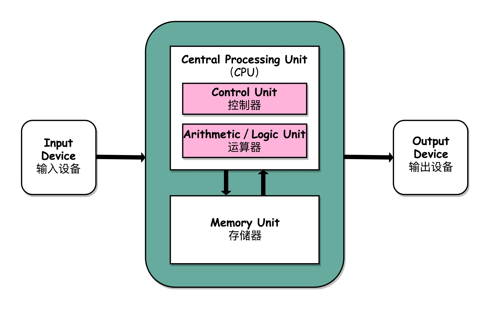

## 总结延伸

可以说，冯·诺依曼体系结构确立了我们现在每天使用的计算机硬件的基础架构。因此，学习计算机组成原理，其实就是学习和拆解冯·诺依曼体系结构。

具体来说，学习组成原理，其实就是学习控制器、运算器的工作原理，也就是 CPU 是怎么工作的，以及为何这样设计；学习内存的工作原理，从最基本的电路，到上层抽象给到 CPU 乃至应用程序的接口是怎样的；学习 CPU 是怎么和输入设备、输出设备打交道的。

学习组成原理，就是在理解从控制器、运算器、存储器、输入设备以及输出设备，从电路这样的硬件，到最终开放给软件的接口，是怎么运作的，为什么要设计成这样，以及在软件开发层面怎么尽可能用好它。

<h1 id="chapter2">02 | 给你一张知识地图，计算机组成原理应该这么学</h1>


从这张图可以看出来，**整个计算机组成原理，就是围绕着计算机是如何组织运作展开的**。

## 计算机组成原理知识地图

计算机组成原理的英文叫 Computer Organization。这里的 Organization 是“组织机构”的意思。计算机由很多个不同的部件放在一起，变成了一个“组织机构”。这个组织机构最终能够进行各种计算、控制、读取输入，进行输出，达成各种强大的功能。

在这张图里面，我们把整个计算机组成原理的知识点拆分成了四大部分，分别是计算机的基本组成、计算机的指令和计算、处理器设计，以及存储器和 I/O 设备。

首先，我们来看**计算机的基本组成**。

这一部分，你需要学习计算机是由哪些硬件组成的。这些硬件，又是怎么对应到经典的冯·诺依曼体系结构中的，也就是<orange>运算器、控制器、存储器、输入设备和输出设备这五大基本组件</orange>。除此之外，你还需要了解<orange>计算机的两个核心指标，性能和功耗</orange>。性能和功耗也是我们在应用和设计五大基本组件中需要重点考虑的因素。

了解了组成部分，接下来你需要掌握**计算机的指令和计算**。

在计算机指令部分，你需要搞明白，我们每天撰写的一行行 C、Java、PHP 程序，是怎么在计算机里面跑起来的。这里面，你既需要了解我们的程序是怎么通过编译器和汇编器，变成一条条机器指令这样的编译过程（如果把编译过程展开的话，可以变成一门完整的编译原理课程），还需要知道我们的操作系统是怎么链接、装载、执行这些程序的（这部分知识如果再深入学习，又可以变成一门操作系统课程）。而这一条条指令执行的控制过程，就是由计算机五大组件之一的**控制器**来控制的。

在计算机的计算部分，你要从二进制和编码开始，理解我们的数据在计算机里的表示，以及我们是怎么从数字电路层面，实现加法、乘法这些基本的运算功能的。实现这些运算功能的 ALU（Arithmetic Logic Unit/ALU），也就是算术逻辑单元，其实就是我们计算机五大组件之一的**运算器**。

这里面有一个在今天看起来特别重要的知识点，就是浮点数（Floating Point）。浮点数是我们在日常运用中非常容易用错的一种数据表示形式。掌握浮点数能让你对数据的编码、存储和计算能够有一个从表到里的深入理解。尤其在 AI 火热的今天，浮点数是机器学习中重度使用的数据表示形式，掌握它更是非常有必要。

明白计算机指令和计算是如何运转的，我们就可以深入到 **CPU 的设计**中去一探究竟了。

CPU 时钟可以用来构造寄存器和内存的锁存器和触发器，因此，CPU 时钟应该是我们学习 CPU 的前导知识。搞明白我们为什么需要 CPU 时钟（CPU Clock），以及寄存器和内存是用什么样的硬件组成的之后，我们可以再来看看，整个计算机的数据通路是如何构造出来的。

数据通路，其实就是连接了整个运算器和控制器，并最终组成了 CPU。而出于对于性能和功耗的考虑，你要进一步理解和掌握面向流水线设计的 CPU、数据和控制冒险，以及分支预测的相关技术。

既然 CPU 作为控制器要和输入输出设备通信，那么我们就要知道异常和中断发生的机制。在 CPU 设计部分的最后，我会讲一讲指令的并行执行，看看如何直接在 CPU 层面，通过 SIMD 来支持并行计算。

最后，我们需要看一看，计算机五大组成部分之一，**存储器的原理**。通过存储器的层次结构作为基础的框架引导，你需要掌握从上到下的 CPU 高速缓存、内存、SSD 硬盘和机械硬盘的工作原理，它们之间的性能差异，以及实际应用中利用这些设备会遇到的挑战。存储器其实很多时候又扮演了输入输出设备的角色，所以你需要进一步了解，CPU 和这些存储器之间是如何进行通信的，以及我们最重视的性能问题是怎么一回事；理解什么是 IO_WAIT，如何通过 DMA 来提升程序性能。

对于存储器，我们不仅需要它们能够正常工作，还要确保里面的数据不能丢失。于是你要掌握我们是如何通过 RAID、Erasure Code、ECC 以及分布式 HDFS，这些不同的技术，来确保数据的完整性和访问性能。

## 学习计算机组成原理，究竟有没有好办法？

首先，**学会提问自己来串联知识点**。学完一个知识点之后，你可以从下面两个方面，问一下自己。

- 我写的程序，是怎样从输入的代码，变成运行的程序，并得到最终结果的？
- 整个过程中，计算器层面到底经历了哪些步骤，有哪些地方是可以优化的？

无论是程序的编译、链接、装载和执行，以及计算时需要用到的逻辑电路、ALU，乃至 CPU 自发为你做的流水线、指令级并行和分支预测，还有对应访问到的硬盘、内存，以及加载到高速缓存中的数据，这些都对应着我们学习中的一个个知识点。建议你自己脑子里过一遍，最好时口头表述一遍或者写下来，这样对你彻底掌握这些知识点都会非常有帮助。

其次，**写一些示例程序来验证知识点**。

最后，**通过和计算机硬件发展的历史做对照**。

比如说，奔腾 4 和 SPARC 的失败，以及 ARM 的成功，能让我们记住 CPU 指令集的繁与简、权衡性能和功耗的重要性，而现今高速发展的机器学习和边缘计算，又给计算机硬件设计带来了新的挑战。

## 给松鼠症患者的学习资料

## 入门书籍

一本是《计算机是怎样跑起来的》，另一本是《程序是怎样跑起来的》。

除此之外，计算机组成中，硬件层面的基础实现，比如寄存器、ALU 这些电路是怎么回事，你可以去看一看 Coursera 上的北京大学免费公开课[《Computer Organization》](https://www.coursera.org/learn/jisuanji-zucheng)。这个视频课程的视频部分也就 10 多个小时。在学习专栏相应章节的前后去浏览一遍，相信对你了解程序在电路层面会变成什么样子有所帮助。

## 深入学习书籍

《计算机组成与设计：硬件 / 软件接口》和经典的《深入理解计算机系统》这两本书。

如果引发了你对于计算机体系结构的兴趣，你还可以深入读一读《计算机体系结构：量化研究方法》。

## 课外阅读

在上面这些教材之外，对于资深程序员来说，来自 Redhat 的 **What Every Programmer Should Know About Memory** 是写出高性能程序不可不读的经典材料。而 LMAX 开源的 Disruptor，则是通过实际应用程序，来理解计算机组成原理中各个知识点的最好范例了。

《编码：隐匿在计算机软硬件背后的语言》和《程序员的自我修养：链接、装载和库》是理解计算机硬件和操作系统层面代码执行的优秀阅读材料。

<h1 id="chapter3">03 | 通过你的CPU主频，我们来谈谈“性能”究竟是什么？</h1>

## 什么是性能？时间的倒数

计算机的性能，其实和我们干体力劳动很像，好比是我们要搬东西。对于计算机的性能，我们需要有个标准来衡量。这个标准中主要有两个指标。

第一个是**响应时间**（Response time）或者叫执行时间（Execution time）。想要提升响应时间这个性能指标，你可以理解为让计算机“跑得更快”。


> 图中是我们实际系统里性能监测工具 NewRelic 中的响应时间，代表了每个外部的 Web 请求的执行时间

第二个是**吞吐率**（Throughput）或者带宽（Bandwidth），想要提升这个指标，你可以理解为让计算机“搬得更多”。


所以说，响应时间指的就是，我们执行一个程序，到底需要花多少时间。花的时间越少，自然性能就越好。

而吞吐率是指我们在一定的时间范围内，到底能处理多少事情。这里的“事情”，在计算机里就是处理的数据或者执行的程序指令。

和搬东西来做对比，如果我们的响应时间短，跑得快，我们可以来回多跑几趟多搬几趟。所以说，缩短程序的响应时间，一般来说都会提升吞吐率。

除了缩短响应时间，我们还有别的方法吗？当然有，比如说，我们还可以多找几个人一起来搬，这就类似现代的服务器都是 8 核、16 核的。人多力量大，同时处理数据，在单位时间内就可以处理更多数据，吞吐率自然也就上去了。

提升吞吐率的办法有很多。大部分时候，我们只要多加一些机器，多堆一些硬件就好了。但是响应时间的提升却没有那么容易，因为 CPU 的性能提升其实在 10 年前就处于“挤牙膏”的状态了，所以我们得慎重地来分析对待。

我们一般把性能，定义成响应时间的倒数，也就是：

> 性能 = 1/ 响应时间

这样一来，响应时间越短，性能的数值就越大。同样一个程序，在 Intel 最新的 CPU Coffee Lake 上，只需要 30s 就能运行完成，而在 5 年前 CPU Sandy Bridge 上，需要 1min 才能完成。那么我们自然可以算出来，Coffee Lake 的性能是 1/30，Sandy Bridge 的性能是 1/60，两个的性能比为 2。于是，我们就可以说，Coffee Lake 的性能是 Sandy Bridge 的 2 倍。

过去几年流行的手机跑分软件，就是把多个预设好的程序在手机上运行，然后根据运行需要的时间，算出一个分数来给出手机的性能评估。而在业界，各大 CPU 和服务器厂商组织了一个叫作 **SPEC**（Standard Performance Evaluation Corporation）的第三方机构，专门用来指定各种“跑分”的规则。


SPEC 提供的 CPU 基准测试程序，就好像 CPU 届的“高考”，通过数十个不同的计算程序，对于 CPU 的性能给出一个最终评分。这些程序丰富多彩，有编译器、解释器、视频压缩、人工智能国际象棋等等，涵盖了方方面面的应用场景。感兴趣的话，你可以点击[这个链接](https://www.spec.org/cpu2017/results/cpu2017.html)看看。

## 计算机的计时单位：CPU 时钟

虽然时间是一个很自然的用来衡量性能的指标，但是用时间来衡量时，有两个问题。

**第一个就是时间不“准”**。如果用你自己随便写的一个程序，来统计程序运行的时间，每一次统计结果不会完全一样。有可能这一次花了 45ms，下一次变成了 53ms。

计算机可能同时运行着好多个程序，CPU 实际上不停地在各个程序之间进行切换。在这些走掉的时间里面，很可能 CPU 切换去运行别的程序了。而且，有些程序在运行的时候，可能要从网络、硬盘去读取数据，要等网络和硬盘把数据读出来，给到内存和 CPU。所以说，**要想准确统计某个程序运行时间，进而去比较两个程序的实际性能，我们得把这些时间给刨除掉**。

那这件事怎么实现呢？Linux 下有一个叫 time 的命令，可以帮我们统计出来，同样的 Wall Clock Time 下，程序实际在 CPU 上到底花了多少时间。

我们简单运行一下 time 命令。它会返回三个值，第一个是 **real time**，也就是我们说的 Wall Clock Time，也就是运行程序整个过程中流逝掉的时间；第二个是 **user time**，也就是 CPU 在运行你的程序，在用户态运行指令的时间；第三个是 **sys time**，是 CPU 在运行你的程序，在操作系统内核里运行指令的时间。而**程序实际花费的 CPU 执行时间（CPU Time），就是 user time 加上 sys time**。

```c++
$ time seq 1000000 | wc -l
1000000


real  0m0.101s
user  0m0.031s
sys   0m0.016s
```

在我给的这个例子里，你可以看到，实际上程序用了 0.101s，但是 CPU time 只有 0.031+0.016 = 0.047s。运行程序的时间里，只有不到一半是实际花在这个程序上的。


**其次，即使我们已经拿到了 CPU 时间，我们也不一定可以直接“比较”出两个程序的性能差异**。即使在同一台计算机上，CPU 可能满载运行也可能降频运行，降频运行的时候自然花的时间会多一些。

除了 CPU 之外，时间这个性能指标还会受到主板、内存这些其他相关硬件的影响。所以，我们需要对“时间”这个我们可以感知的指标进行拆解，把程序的 CPU 执行时间变成 CPU 时钟周期数（CPU Cycles）和 时钟周期时间（Clock Cycle）的乘积。

> 程序的 CPU 执行时间 =CPU 时钟周期数×时钟周期时间

我们先来理解一下什么是时钟周期时间。你在买电脑的时候，一定关注过 CPU 的主频。比如我手头的这台电脑就是 Intel Core-i7-7700HQ 2.8GHz，这里的 2.8GHz 就是电脑的主频（Frequency/Clock Rate）。这个 2.8GHz，我们可以先粗浅地认为，CPU 在 1 秒时间内，可以执行的简单指令的数量是 2.8G 条。

如果想要更准确一点描述，这个 2.8GHz 就代表，我们 CPU 的一个“钟表”能够识别出来的最小的时间间隔。就像我们挂在墙上的挂钟，都是“滴答滴答”一秒一秒地走，所以通过墙上的挂钟能够识别出来的最小时间单位就是秒。

而在 CPU 内部，和我们平时戴的电子石英表类似，有一个叫晶体振荡器（Oscillator Crystal）的东西，简称为晶振。我们把晶振当成 CPU 内部的电子表来使用。晶振带来的每一次“滴答”，就是时钟周期时间。

在我这个 2.8GHz 的 CPU 上，这个时钟周期时间，就是 1/2.8G。我们的 CPU，是按照这个“时钟”提示的时间来进行自己的操作。主频越高，意味着这个表走得越快，我们的 CPU 也就“被逼”着走得越快。

如果你自己组装过台式机的话，可能听说过“超频”这个概念，这说的其实就相当于把买回来的 CPU 内部的钟给调快了，于是 CPU 的计算跟着这个时钟的节奏，也就自然变快了。当然这个快不是没有代价的，CPU 跑得越快，散热的压力也就越大。就和人一样，超过生理极限，CPU 就会崩溃了。

我们现在回到上面程序 CPU 执行时间的公式。

> 程序的 CPU 执行时间 =CPU 时钟周期数×时钟周期时间

最简单的提升性能方案，自然缩短时钟周期时间，也就是提升主频。换句话说，就是换一块好一点的 CPU。不过，这个是我们这些软件工程师控制不了的事情，所以我们就把目光挪到了乘法的另一个因子——CPU 时钟周期数上。如果能够减少程序需要的 CPU 时钟周期数量，一样能够提升程序性能。

对于 CPU 时钟周期数，我们可以再做一个分解，把它变成“指令数×**每条指令的平均时钟周期数**（Cycles Per Instruction，简称 CPI）”。不同的指令需要的 Cycles 是不同的，加法和乘法都对应着一条 CPU 指令，但是乘法需要的 Cycles 就比加法要多，自然也就慢。在这样拆分了之后，我们的程序的 CPU 执行时间就可以变成这样三个部分的乘积。

程序的 CPU 执行时间 = 指令数×CPI×Clock Cycle Time

因此，如果我们想要解决性能问题，其实就是要优化这三者。

1. 时钟周期时间，就是计算机主频，这个取决于计算机硬件。

2. 每条指令的平均时钟周期数 CPI，就是一条指令到底需要多少 CPU Cycle。

> 在后面讲解 CPU 结构的时候，我们会看到，现代的 CPU 通过流水线技术（Pipeline），让一条指令需要的 CPU Cycle 尽可能地少。因此，对于 CPI 的优化，也是计算机组成和体系结构中的重要一环。

3. 指令数，代表执行我们的程序到底需要多少条指令、用哪些指令。

> 这个很多时候就把挑战交给了编译器。同样的代码，编译成计算机指令时候，就有各种不同的表示方式。

## 总结延伸

主要对于“响应时间”这个性能指标进行抽丝剥茧，拆解成了计算机时钟周期、CPI 以及指令数这三个独立的指标的乘积，并且为你指明了优化计算机性能的三条康庄大道。

也就是，提升计算机主频，优化 CPU 设计使得在单个时钟周期内能够执行更多指令，以及通过编译器来减少需要的指令数。

<h1 id="chapter4">04 | 穿越功耗墙，我们该从哪些方面提升“性能”？</h1>

## 功耗：CPU 的“人体极限”

然而，计算机科学界从来不相信“大力出奇迹”。奔腾 4 的 CPU 主频从来没有达到过 10GHz，最终它的主频上限定格在 3.8GHz。这还不是最糟的，更糟糕的事情是，大家发现，奔腾 4 的主频虽然高，但是它的实际性能却配不上同样的主频。想要用在笔记本上的奔腾 4 2.4GHz 处理器，其性能只和基于奔腾 3 架构的奔腾 M 1.6GHz 处理器差不多。

于是，这一次的“大力出悲剧”，不仅让 Intel 的对手 AMD 获得了喘息之机，更是代表着“主频时代”的终结。后面几代 Intel CPU 主频不但没有上升，反而下降了。到如今，2019 年的最高配置 Intel i9 CPU，主频也只不过是 5GHz 而已。相较于 1978 年到 2000 年，这 20 年里 300 倍的主频提升，从 2000 年到现在的这 19 年，CPU 的主频大概提高了 3 倍。


> CPU 的主频变化，在奔腾 4 时代进入了瓶颈期，

奔腾 4 的主频为什么没能超过 3.8GHz 的障碍呢？答案就是功耗问题。什么是功耗问题呢？我们先看一个直观的例子。

一个 3.8GHz 的奔腾 4 处理器，满载功率是 130 瓦。这个 130 瓦是什么概念呢？机场允许带上飞机的充电宝的容量上限是 100 瓦时。如果我们把这个 CPU 安在手机里面，不考虑屏幕内存之类的耗电，这个 CPU 满载运行 45 分钟，充电宝里面就没电了。而 iPhone X 使用 ARM 架构的 CPU，功率则只有 4.5 瓦左右。

我们的 CPU，一般都被叫作**超大规模集成电路**（Very-Large-Scale Integration，VLSI）。这些电路，实际上都是一个个晶体管组合而成的。CPU 在计算，其实就是让晶体管里面的“开关”不断地去“打开”和“关闭”，来组合完成各种运算和功能。

想要计算得快，一方面，我们要在 CPU 里，同样的面积里面，多放一些晶体管，也就是**增加密度**；另一方面，我们要让晶体管“打开”和“关闭”得更快一点，也就是**提升主频**。而这两者，都会增加功耗，带来耗电和散热的问题。

这么说可能还是有点抽象，我还是给你举一个例子。你可以把一个计算机 CPU 想象成一个巨大的工厂，里面有很多工人，相当于 CPU 上面的晶体管，互相之间协同工作。

为了工作得快一点，我们要在工厂里多塞一点人。你可能会问，为什么不把工厂造得大一点呢？这是因为，人和人之间如果离得远了，互相之间走过去需要花的时间就会变长，这也会导致性能下降。这就好像如果 CPU 的面积大，晶体管之间的距离变大，电信号传输的时间就会变长，运算速度自然就慢了。

除了多塞一点人，我们还希望每个人的动作都快一点，这样同样的时间里就可以多干一点活儿了。这就相当于提升 CPU 主频，但是动作快，每个人就要出汗散热。要是太热了，对工厂里面的人来说会中暑生病，对 CPU 来说就会崩溃出错。

我们会在 CPU 上面抹硅脂、装风扇，乃至用上水冷或者其他更好的散热设备，就好像在工厂里面装风扇、空调，发冷饮一样。但是同样的空间下，装上风扇空调能够带来的散热效果也是有极限的。

因此，在 CPU 里面，能够放下的晶体管数量和晶体管的“开关”频率也都是有限的。一个 CPU 的功率，可以用这样一个公式来表示：

> 功耗 ~= 1/2 ×负载电容×电压的平方×开关频率×晶体管数量

那么，为了要提升性能，我们需要不断地增加晶体管数量。同样的面积下，我们想要多放一点晶体管，就要把晶体管造得小一点。这个就是平时我们所说的提升“制程”。从 28nm 到 7nm，相当于晶体管本身变成了原来的 1/4 大小。这个就相当于我们在工厂里，同样的活儿，我们要找瘦小一点的工人，这样一个工厂里面就可以多一些人。我们还要提升主频，让开关的频率变快，也就是要找手脚更快的工人。


但是，功耗增加太多，就会导致 CPU 散热跟不上，这时，我们就需要降低电压。这里有一点非常关键，在整个功耗的公式里面，功耗和电压的平方是成正比的。这意味着电压下降到原来的 1/5，整个的功耗会变成原来的 1/25。

事实上，从 5MHz 主频的 8086 到 5GHz 主频的 Intel i9，CPU 的电压已经从 5V 左右下降到了 1V 左右。这也是为什么我们 CPU 的主频提升了 1000 倍，但是功耗只增长了 40 倍。比如说，我写这篇文章用的是 Surface Go，在这样的轻薄笔记本上，微软就是选择了把电压下降到 0.25V 的低电压 CPU，使得笔记本能有更长的续航时间。

## 并行优化，理解阿姆达尔定律

虽然制程的优化和电压的下降，在过去的 20 年里，让我们的 CPU 性能有所提升。但是从上世纪九十年代到本世纪初，软件工程师们所用的“面向摩尔定律编程”的套路越来越用不下去了。“写程序不考虑性能，等明年 CPU 性能提升一倍，到时候性能自然就不成问题了”，这种想法已经不可行了。

于是，从奔腾 4 开始，Intel 意识到通过提升主频比较“难”去实现性能提升，边开始推出 Core Duo 这样的多核 CPU，通过提升“吞吐率”而不是“响应时间”，来达到目的。

这也是一个最常见的提升性能的方式，**通过并行提高性能**。

但是，并不是所有问题，都可以通过并行提高性能来解决。如果想要使用这种思想，需要满足这样几个条件。

- 第一，需要进行的计算，本身可以分解成几个可以并行的任务。好比上面的乘法和加法计算，几个人可以同时进行，不会影响最后的结果。
- 第二，需要能够分解好问题，并确保几个人的结果能够汇总到一起。
- 第三，在“汇总”这个阶段，是没有办法并行进行的，还是得顺序执行，一步一步来。

这就引出了我们在进行性能优化中，常常用到的一个经验定律，**阿姆达尔定律**（Amdahl’s Law）。这个定律说的就是，对于一个程序进行优化之后，处理器并行运算之后效率提升的情况。具体可以用这样一个公式来表示：

> 优化后的执行时间 = 受优化影响的执行时间 / 加速倍数 + 不受影响的执行时间


## 总结延伸

我们可以看到，无论是简单地通过提升主频，还是增加更多的 CPU 核心数量，通过并行来提升性能，都会遇到相应的瓶颈。仅仅简单地通过“堆硬件”的方式，在今天已经不能很好地满足我们对于程序性能的期望了。于是，工程师们需要从其他方面开始下功夫了。

在“摩尔定律”和“并行计算”之外，在整个计算机组成层面，还有这样几个原则性的性能提升方法。

1. 加速大概率事件。
2. 通过流水线提高性能。
3. 通过预测提高性能。

<h1 id="chapter5">05 | 计算机指令：让我们试试用纸带编程</h1>

当年学写程序的时候，不像现在这样，都是用一种古老的物理设备，叫作“打孔卡（Punched Card）”。用这种设备写程序，可没法像今天这样，掏出键盘就能打字，而是要先在脑海里或者在纸上写出程序，然后在纸带或者卡片上打洞。这样，要写的程序、要处理的数据，就变成一条条纸带或者一张张卡片，之后再交给当时的计算机去处理。


你看这个穿孔纸带是不是有点儿像我们现在考试用的答题卡？那个时候，人们在特定的位置上打洞或者不打洞，来代表“0”或者“1”。

为什么早期的计算机程序要使用打孔卡，而不能像我们现在一样，用 C 或者 Python 这样的高级语言来写呢？原因很简单，因为计算机或者说 CPU 本身，并没有能力理解这些高级语言。即使在 2019 年的今天，我们使用的现代个人计算机，仍然只能处理所谓的“机器码”，也就是一连串的“0”和“1”这样的数字。

## 在软硬件接口中，CPU 帮我们做了什么事？

我们常说，CPU 就是计算机的大脑。CPU 的全称是 Central Processing Unit，中文是中央处理器。

从**硬件**的角度来看，CPU 就是一个超大规模集成电路，通过电路实现了加法、乘法乃至各种各样的处理逻辑。

如果我们从**软件**工程师的角度来讲，CPU 就是一个执行各种**计算机指令**（Instruction Code）的逻辑机器。这里的计算机指令，就好比一门 CPU 能够听得懂的语言，我们也可以把它叫作**机器语言**（Machine Language）。

不同的 CPU 能够听懂的语言不太一样。比如，我们的个人电脑用的是 Intel 的 CPU，苹果手机用的是 ARM 的 CPU。这两者能听懂的语言就不太一样。类似这样两种 CPU 各自支持的语言，就是两组不同的**计算机指令集**，英文叫 Instruction Set。这里面的“Set”，其实就是数学上的集合，代表不同的单词、语法。

所以，如果我们在自己电脑上写一个程序，然后把这个程序复制一下，装到自己的手机上，肯定是没办法正常运行的，因为这两者语言不通。而一台电脑上的程序，简单复制一下到另外一台电脑上，通常就能正常运行，因为这两台 CPU 有着相同的指令集，也就是说，它们的语言相通的。

一个计算机程序，不可能只有一条指令，而是由成千上万条指令组成的。但是 CPU 里不能一直放着所有指令，所以计算机程序平时是存储在存储器中的。这种程序指令存储在存储器里面的计算机，我们就叫作**存储程序型计算机**（Stored-program Computer）。

说到这里，你可能要问了，难道还有不是存储程序型的计算机么？其实，在没有现代计算机之前，有着聪明才智的工程师们，早就发明了一种叫 Plugboard Computer 的计算设备。我把它直译成“插线板计算机”。在一个布满了各种插口和插座的板子上，工程师们用不同的电线来连接不同的插口和插座，从而来完成各种计算任务。下面这个图就是一台 IBM 的 Plugboard，看起来是不是有一股满满的蒸汽朋克范儿？

## 从编译到汇编，代码怎么变成机器码？

了解了计算机指令和计算机指令集，接下来我们来看看，平时编写的代码，到底是怎么变成一条条计算机指令，最后被 CPU 执行的呢？我们拿一小段真实的 C 语言程序来看看。

```c++
// test.c
int main()
{
  int a = 1; 
  int b = 2;
  a = a + b;
}
```

这是一段再简单不过的 C 语言程序，即便你不了解 C 语言，应该也可以看懂。我们给两个变量 a、b 分别赋值 1、2，然后再将 a、b 两个变量中的值加在一起，重新赋值给了 a 整个变量。

要让这段程序在一个 Linux 操作系统上跑起来，我们需要把整个程序翻译成一个**汇编语言**（ASM，Assembly Language）的程序，这个过程我们一般叫编译（Compile）成汇编代码。

针对汇编代码，我们可以再用汇编器（Assembler）翻译成机器码（Machine Code）。这些机器码由“0”和“1”组成的机器语言表示。这一条条机器码，就是一条条的**计算机指令**。这样一串串的 16 进制数字，就是我们 CPU 能够真正认识的计算机指令。

在一个 Linux 操作系统上，我们可以简单地使用 gcc 和 objdump 这样两条命令，把对应的汇编代码和机器码都打印出来。

```shell
$ gcc -g -c test.c
$ objdump -d -M intel -S test.o
```

可以看到，左侧有一堆数字，这些就是一条条机器码；右边有一系列的 push、mov、add、pop 等，这些就是对应的汇编代码。一行 C 语言代码，有时候只对应一条机器码和汇编代码，有时候则是对应两条机器码和汇编代码。汇编代码和机器码之间是一一对应的。

```c++
test.o:     file format elf64-x86-64
Disassembly of section .text:
0000000000000000 <main>:
int main()
{
   0:   55                      push   rbp
   1:   48 89 e5                mov    rbp,rsp
  int a = 1; 
   4:   c7 45 fc 01 00 00 00    mov    DWORD PTR [rbp-0x4],0x1
  int b = 2;
   b:   c7 45 f8 02 00 00 00    mov    DWORD PTR [rbp-0x8],0x2
  a = a + b;
  12:   8b 45 f8                mov    eax,DWORD PTR [rbp-0x8]
  15:   01 45 fc                add    DWORD PTR [rbp-0x4],eax
}
  18:   5d                      pop    rbp
  19:   c3                      ret    
```

这个时候你可能又要问了，我们实际在用 GCC（GUC 编译器套装，GNU Compiler Collectipon）编译器的时候，可以直接把代码编译成机器码呀，为什么还需要汇编代码呢？原因很简单，你看着那一串数字表示的机器码，是不是摸不着头脑？但是即使你没有学过汇编代码，看的时候多少也能“猜”出一些这些代码的含义。

因为汇编代码其实就是“给程序员看的机器码”，也正因为这样，机器码和汇编代码是一一对应的。我们人类很容易记住 add、mov 这些用英文表示的指令，而 8b 45 f8 这样的指令，由于很难一下子看明白是在干什么，所以会非常难以记忆。尽管早年互联网上到处流传，大神程序员着拿小刀在光盘上刻出操作系统的梗，但是要让你用打孔卡来写个程序，估计浪费的卡片比用上的卡片要多得多。


从高级语言到汇编代码，再到机器码，就是一个日常开发程序，最终变成了 CPU 可以执行的计算机指令的过程。

## 解析指令和机器码

了解了这个过程，下面我们放大局部，来看看这一行行的汇编代码和机器指令，到底是什么意思。

我们就从平时用的电脑、手机这些设备来说起。这些设备的 CPU 到底有哪些指令呢？这个还真有不少，我们日常用的 Intel CPU，有 2000 条左右的 CPU 指令，实在是太多了，所以我没法一一来给你讲解。不过一般来说，常见的指令可以分成五大类。

- 第一类是**算术类指令**。我们的加减乘除，在 CPU 层面，都会变成一条条算术类指令。

- 第二类是**数据传输类指令**。给变量赋值、在内存里读写数据，用的都是数据传输类指令。

- 第三类是**逻辑类指令**。逻辑上的与或非，都是这一类指令。

- 第四类是**条件分支类指令**。日常我们写的“if/else”，其实都是条件分支类指令。

- 最后一类是**无条件跳转指令**。写一些大一点的程序，我们常常需要写一些函数或者方法。在调用函数的时候，其实就是发起了一个无条件跳转指令。


下面我们来看看，汇编器是怎么把对应的汇编代码，翻译成为机器码的。

我们说过，不同的 CPU 有不同的指令集，也就对应着不同的汇编语言和不同的机器码。为了方便你快速理解这个机器码的计算方式，我们选用最简单的 MIPS 指令集，来看看机器码是如何生成的。

MIPS 是一组由 MIPS 技术公司在 80 年代中期设计出来的 CPU 指令集。就在最近，MIPS 公司把整个指令集和芯片架构都完全开源了。想要深入研究 CPU 和指令集的同学，这里推荐[一些资料](https://www.mips.com/mipsopen/)，你可以自己了解下。

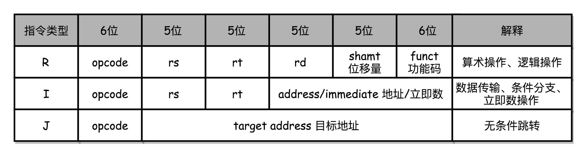

MIPS 的指令是一个 32 位的整数，高 6 位叫**操作码**（Opcode），也就是代表这条指令具体是一条什么样的指令，剩下的 26 位有三种格式，分别是 R、I 和 J。

**R 指令**是一般用来做算术和逻辑操作，里面有读取和写入数据的寄存器的地址。如果是逻辑位移操作，后面还有位移操作的位移量，而最后的功能码，则是在前面的操作码不够的时候，扩展操作码表示对应的具体指令的。

**I 指令**，则通常是用在数据传输、条件分支，以及在运算的时候使用的并非变量还是常数的时候。这个时候，没有了位移量和操作码，也没有了第三个寄存器，而是把这三部分直接合并成了一个地址值或者一个常数。

**J 指令**就是一个跳转指令，高 6 位之外的 26 位都是一个跳转后的地址。

```c++
add $t0,$s2,$s1
```

以一个简单的加法算术指令 add t0,s1, $s2, 为例，给你解释。为了方便，我们下面都用十进制来表示对应的代码。

对应的 MIPS 指令里 opcode 是 0，rs 代表第一个寄存器 s1 的地址是 17，rt 代表第二个寄存器 s2 的地址是 18，rd 代表目标的临时寄存器 t0 的地址，是 8。因为不是位移操作，所以位移量是 0。把这些数字拼在一起，就变成了一个 MIPS 的加法指令。

为了读起来方便，我们一般把对应的二进制数，用 16 进制表示出来。在这里，也就是 0X02324020。这个数字也就是这条指令对应的机器码。


回到开头我们说的打孔带。如果我们用打孔代表 1，没有打孔代表 0，用 4 行 8 列代表一条指令来打一个穿孔纸带，那么这条命令大概就长这样：


## 总结延伸

到这里，想必你也应该明白了，我们在这一讲的开头介绍的打孔卡，其实就是一种存储程序型计算机。

只是这整个程序的机器码，不是通过计算机编译出来的，而是由程序员，用人脑“编译”成一张张卡片的。对应的程序，也不是存储在设备里，而是存储成一张打好孔的卡片。但是整个程序运行的逻辑和其他 CPU 的机器语言没有什么分别，也是处理一串“0”和“1”组成的机器码而已。

然而，单单理解一条指令是怎么变成机器码的肯定是不够的。接下来的几节，我会深入讲解，包含条件、循环、函数、递归这些语句的完整程序，是怎么在 CPU 里面执行的。

<h1 id="chapter6">06 | 指令跳转：原来if...else就是goto</h1>

## CPU 是如何执行指令的？

拿我们用的 Intel CPU 来说，里面差不多有几百亿个晶体管。实际上，一条条计算机指令执行起来非常复杂。好在 CPU 在软件层面已经为我们做好了封装。对于我们这些做软件的程序员来说，我们只要知道，写好的代码变成了指令之后，是一条一条**顺序**执行的就可以了。

我们先不管几百亿的晶体管的背后是怎么通过电路运转起来的，逻辑上，我们可以认为，CPU 其实就是由一堆寄存器组成的。而寄存器就是 CPU 内部，由多个触发器（Flip-Flop）或者锁存器（Latches）组成的简单电路。

触发器和锁存器，其实就是两种不同原理的数字电路组成的逻辑门。这块内容并不是我们这节课的重点，所以你只要了解就好。如果想要深入学习的话，你可以学习数字电路的相关课程，这里我们不深入探讨。

好了，现在我们接着前面说。N 个触发器或者锁存器，就可以组成一个 N 位（Bit）的寄存器，能够保存 N 位的数据。比方说，我们用的 64 位 Intel 服务器，寄存器就是 64 位的。


一个 CPU 里面会有很多种不同功能的寄存器。我这里给你介绍三种比较特殊的。

一个是 **PC 寄存器**（Program Counter Register），我们也叫**指令地址寄存器**（Instruction Address Register）。顾名思义，它就是用来存放下一条需要执行的计算机指令的内存地址。

第二个是**指令寄存器**（Instruction Register），用来存放当前正在执行的指令。

第三个是**条件码寄存器**（Status Register），用里面的一个一个标记位（Flag），存放 CPU 进行算术或者逻辑计算的结果。

除了这些特殊的寄存器，CPU 里面还有更多用来存储数据和内存地址的寄存器。这样的寄存器通常一类里面不止一个。我们通常根据存放的数据内容来给它们取名字，比如整数寄存器、浮点数寄存器、向量寄存器和地址寄存器等等。有些寄存器既可以存放数据，又能存放地址，我们就叫它通用寄存器。


实际上，一个程序执行的时候，CPU 会根据 PC 寄存器里的地址，从内存里面把需要执行的指令读取到指令寄存器里面执行，然后根据指令长度自增，开始顺序读取下一条指令。可以看到，一个程序的一条条指令，在内存里面是连续保存的，也会一条条顺序加载。

而有些特殊指令，比如上一讲我们讲到 J 类指令，也就是跳转指令，会修改 PC 寄存器里面的地址值。这样，下一条要执行的指令就不是从内存里面顺序加载的了。事实上，这些跳转指令的存在，也是我们可以在写程序的时候，使用 if…else 条件语句和 while/for 循环语句的原因。

## 从 if…else 来看程序的执行和跳转

```c++
// test.c


#include <time.h>
#include <stdlib.h>


int main()
{
  srand(time(NULL));
  int r = rand() % 2;
  int a = 10;
  if (r == 0)
  {
    a = 1;
  } else {
    a = 2;
  } 
}
```

我们用 rand 生成了一个随机数 r，r 要么是 0，要么是 1。当 r 是 0 的时候，我们把之前定义的变量 a 设成 1，不然就设成 2。

```
$ gcc -g -c test.c
$ objdump -d -M intel -S test.o 
```

我们把这个程序编译成汇编代码。你可以忽略前后无关的代码，只关注于这里的 if…else 条件判断语句。对应的汇编代码是这样的：

```c++
    if (r == 0)
  3b:   83 7d fc 00             cmp    DWORD PTR [rbp-0x4],0x0
  3f:   75 09                   jne    4a <main+0x4a>
    {
        a = 1;
  41:   c7 45 f8 01 00 00 00    mov    DWORD PTR [rbp-0x8],0x1
  48:   eb 07                   jmp    51 <main+0x51>
    }
    else
    {
        a = 2;
  4a:   c7 45 f8 02 00 00 00    mov    DWORD PTR [rbp-0x8],0x2
  51:   b8 00 00 00 00          mov    eax,0x0
    } 
```

可以看到，这里对于 r ==  0 的条件判断，被编译成了 cmp 和 jne 这两条指令。

cmp 指令比较了前后两个操作数的值，这里的 DWORD PTR 代表操作的数据类型是 32 位的整数，而[rbp-0x4]则是一个寄存器的地址。所以，第一个操作数就是从寄存器里拿到的变量 r 的值。第二个操作数 0x0 就是我们设定的常量 0 的 16 进制表示。cmp 指令的比较结果，会存入到***条件码寄存器**当中去。

在这里，如果比较的结果是 True，也就是 r == 0，就把**零标志条件码**（对应的条件码是 ZF，Zero Flag）设置为 1。除了零标志之外，Intel 的 CPU 下还有**进位标志**（CF，Carry Flag）、**符号标志**（SF，Sign Flag）以及**溢出标志**（OF，Overflow Flag），用在不同的判断条件下。

cmp 指令执行完成之后，PC 寄存器会自动自增，开始执行下一条 jne 的指令。

跟着的 jne 指令，是 jump if not equal 的意思，它会查看对应的零标志位。如果为 0，会跳转到后面跟着的操作数 4a 的位置。这个 4a，对应这里汇编代码的行号，也就是上面设置的 else 条件里的第一条指令。当跳转发生的时候，PC 寄存器就不再是自增变成下一条指令的地址，而是被直接设置成这里的 4a 这个地址。这个时候，CPU 再把 4a 地址里的指令加载到指令寄存器中来执行。

跳转到执行地址为 4a 的指令，实际是一条 mov 指令，第一个操作数和前面的 cmp 指令一样，是另一个 32 位整型的寄存器地址，以及对应的 2 的 16 进制值 0x2。mov 指令把 2 设置到对应的寄存器里去，相当于一个赋值操作。然后，PC 寄存器里的值继续自增，执行下一条 mov 指令。

这条 mov 指令的第一个操作数 eax，代表累加寄存器，第二个操作数 0x0 则是 16 进制的 0 的表示。这条指令其实没有实际的作用，它的作用是一个占位符。我们回过头去看前面的 if 条件，如果满足的话，在赋值的 mov 指令执行完成之后，有一个 jmp 的无条件跳转指令。跳转的地址就是这一行的地址 51。我们的 main 函数没有设定返回值，而 mov eax, 0x0 其实就是给 main 函数生成了一个默认的为 0 的返回值到累加器里面。if 条件里面的内容执行完成之后也会跳转到这里，和 else 里的内容结束之后的位置是一样的。


上一讲我们讲打孔卡的时候说到，读取打孔卡的机器会顺序地一段一段地读取指令，然后执行。执行完一条指令，它会自动地顺序读取下一条指令。如果执行的当前指令带有跳转的地址，比如往后跳 10 个指令，那么机器会自动将卡片带往后移动 10 个指令的位置，再来执行指令。同样的，机器也能向前移动，去读取之前已经执行过的指令。这也就是我们的 while/for 循环实现的原理。

## 如何通过 if…else 和 goto 来实现循环？

```c++
int main()
{
    int a = 0;
    for (int i = 0; i < 3; i++)
    {
        a += i;
    }
}
```

我们再看一段简单的利用 for 循环的程序。我们循环自增变量 i 三次，三次之后，i>=3，就会跳出循环。整个程序，对应的 Intel 汇编代码就是这样的：

```java
    for (int i = 0; i < 3; i++)
   b:   c7 45 f8 00 00 00 00    mov    DWORD PTR [rbp-0x8],0x0
  12:   eb 0a                   jmp    1e <main+0x1e>
    {
        a += i;
  14:   8b 45 f8                mov    eax,DWORD PTR [rbp-0x8]
  17:   01 45 fc                add    DWORD PTR [rbp-0x4],eax
    for (int i = 0; i < 3; i++)
  1a:   83 45 f8 01             add    DWORD PTR [rbp-0x8],0x1
  1e:   83 7d f8 02             cmp    DWORD PTR [rbp-0x8],0x2
  22:   7e f0                   jle    14 <main+0x14>
  24:   b8 00 00 00 00          mov    eax,0x0
    }
```

可以看到，对应的循环也是用 1e 这个地址上的 cmp 比较指令，和紧接着的 jle 条件跳转指令来实现的。主要的差别在于，这里的 jle 跳转的地址，在这条指令之前的地址 14，而非 if…else 编译出来的跳转指令之后。往前跳转使得条件满足的时候，PC 寄存器会把指令地址设置到之前执行过的指令位置，重新执行之前执行过的指令，直到条件不满足，顺序往下执行 jle 之后的指令，整个循环才结束。


如果你看一长条打孔卡的话，就会看到卡片往后移动一段，执行了之后，又反向移动，去重新执行前面的指令。

其实，你有没有觉得，jle 和 jmp 指令，有点像程序语言里面的 goto 命令，直接指定了一个特定条件下的跳转位置。虽然我们在用高级语言开发程序的时候反对使用 goto，但是实际在机器指令层面，无论是 if…else…也好，还是 for/while 也好，都是用和 goto 相同的跳转到特定指令位置的方式来实现的。

## 总结延伸

这一节，我们在单条指令的基础上，学习了程序里的多条指令，究竟是怎么样一条一条被执行的。除了简单地通过 PC 寄存器自增的方式顺序执行外，条件码寄存器会记录下当前执行指令的条件判断状态，然后通过跳转指令读取对应的条件码，修改 PC 寄存器内的下一条指令的地址，最终实现 if…else 以及 for/while 这样的程序控制流程。

你会发现，虽然我们可以用高级语言，可以用不同的语法，比如 if…else 这样的条件分支，或者 while/for 这样的循环方式，来实现不用的程序运行流程，但是回归到计算机可以识别的机器指令级别，其实都只是一个简单的地址跳转而已，也就是一个类似于 goto 的语句。

想要在硬件层面实现这个 goto 语句，除了本身需要用来保存下一条指令地址，以及当前正要执行指令的 PC 寄存器、指令寄存器外，我们只需要再增加一个条件码寄存器，来保留条件判断的状态。这样简简单单的三个寄存器，就可以实现条件判断和循环重复执行代码的功能。

下一节，我们会进一步讲解，如果程序中出现函数或者过程这样可以复用的代码模块，对应的指令是怎么样执行的，会和我们这里的 if…else 有什么不同。

<h1 id="chapter7">07 | 函数调用：为什么会发生stack overflow？</h1>

在开发软件的过程中我们经常会遇到错误，如果你用 Google 搜过出错信息，那你多少应该都访问过Stack Overflow这个网站。作为全球最大的程序员问答网站，Stack Overflow 的名字来自于一个常见的报错，就是栈溢出（stack overflow）。

## 为什么我们需要程序栈？

和前面几讲一样，我们还是从一个非常简单的 C 程序 function_example.c 看起。

```c++
// function_example.c
#include <stdio.h>
int static add(int a, int b)
{
    return a+b;
}

int main()
{
    int x = 5;
    int y = 10;
    int u = add(x, y);
}
```

这个程序定义了一个简单的函数 add，接受两个参数 a 和 b，返回值就是 a+b。而 main 函数里则定义了两个变量 x 和 y，然后通过调用这个 add 函数，来计算 u=x+y，最后把 u 的数值打印出来。

```c++
$ gcc -g -c function_example.c
$ objdump -d -M intel -S function_example.o
```

我们把这个程序编译之后，objdump 出来。我们来看一看对应的汇编代码。

```c++
int static add(int a, int b)
{
   0:   55                      push   rbp
   1:   48 89 e5                mov    rbp,rsp
   4:   89 7d fc                mov    DWORD PTR [rbp-0x4],edi
   7:   89 75 f8                mov    DWORD PTR [rbp-0x8],esi
    return a+b;
   a:   8b 55 fc                mov    edx,DWORD PTR [rbp-0x4]
   d:   8b 45 f8                mov    eax,DWORD PTR [rbp-0x8]
  10:   01 d0                   add    eax,edx
}
  12:   5d                      pop    rbp
  13:   c3                      ret    
0000000000000014 <main>:
int main()
{
  14:   55                      push   rbp
  15:   48 89 e5                mov    rbp,rsp
  18:   48 83 ec 10             sub    rsp,0x10
    int x = 5;
  1c:   c7 45 fc 05 00 00 00    mov    DWORD PTR [rbp-0x4],0x5
    int y = 10;
  23:   c7 45 f8 0a 00 00 00    mov    DWORD PTR [rbp-0x8],0xa
    int u = add(x, y);
  2a:   8b 55 f8                mov    edx,DWORD PTR [rbp-0x8]
  2d:   8b 45 fc                mov    eax,DWORD PTR [rbp-0x4]
  30:   89 d6                   mov    esi,edx
  32:   89 c7                   mov    edi,eax
  34:   e8 c7 ff ff ff          call   0 <add>
  39:   89 45 f4                mov    DWORD PTR [rbp-0xc],eax
  3c:   b8 00 00 00 00          mov    eax,0x0
}
  41:   c9                      leave  
  42:   c3                      ret    
```

可以看出来，在这段代码里，main 函数和上一节我们讲的的程序执行区别并不大，它主要是把 jump 指令换成了函数调用的 call 指令。call 指令后面跟着的，仍然是跳转后的程序地址。

这些你理解起来应该不成问题。我们下面来看一个有意思的部分。

我们来看 add 函数。可以看到，add 函数编译之后，代码先执行了一条 push 指令和一条 mov 指令；在函数执行结束的时候，又执行了一条 pop 和一条 ret 指令。这四条指令的执行，其实就是在进行我们接下来要讲**压栈**（Push）和**出栈**（Pop）操作。

你有没有发现，函数调用和上一节我们讲的 if…else 和 for/while 循环有点像。它们两个都是在原来顺序执行的指令过程里，执行了一个内存地址的跳转指令，让指令从原来顺序执行的过程里跳开，从新的跳转后的位置开始执行。

但是，这两个跳转有个区别，if…else 和 for/while 的跳转，是跳转走了就不再回来了，就在跳转后的新地址开始顺序地执行指令，就好像徐志摩在《再别康桥》里面写的：“我挥一挥衣袖，不带走一片云彩”，继续进行新的生活了。而函数调用的跳转，在对应函数的指令执行完了之后，还要再回到函数调用的地方，继续执行 call 之后的指令，就好像贺知章在《回乡偶书》里面写的那样：“少小离家老大回，乡音未改鬓毛衰”，不管走多远，最终还是要回来。

不过，仔细琢磨一下，你会发现这个方法有些问题。如果函数 A 调用了函数 B，然后函数 B 再调用函数 A，我们就得面临在 A 里面插入 B 的指令，然后在 B 里面插入 A 的指令，这样就会产生无穷无尽地替换。就好像两面镜子面对面放在一块儿，任何一面镜子里面都会看到无穷多面镜子。

看来，把被调用函数的指令直接插入在调用处的方法行不通。那我们就换一个思路，能不能把后面要跳回来执行的指令地址给记录下来呢？就像前面讲 PC 寄存器一样，我们可以专门设立一个“程序调用寄存器”，来存储接下来要跳转回来执行的指令地址。等到函数调用结束，从这个寄存器里取出地址，再跳转到这个记录的地址，继续执行就好了。

但是在多层函数调用里，简单只记录一个地址也是不够的。我们在调用函数 A 之后，A 还可以调用函数 B，B 还能调用函数 C。这一层又一层的调用并没有数量上的限制。在所有函数调用返回之前，每一次调用的返回地址都要记录下来，但是我们 CPU 里的寄存器数量并不多。像我们一般使用的 Intel i7 CPU 只有 16 个 64 位寄存器，调用的层数一多就存不下了。

最终，计算机科学家们想到了一个比单独记录跳转回来的地址更完善的办法。我们在内存里面开辟一段空间，用栈这个**后进先出**（LIFO，Last In First Out）的数据结构。栈就像一个乒乓球桶，每次程序调用函数之前，我们都把调用返回后的地址写在一个乒乓球上，然后塞进这个球桶。这个操作其实就是我们常说的**压栈**。如果函数执行完了，我们就从球桶里取出最上面的那个乒乓球，很显然，这就是**出栈**。

拿到出栈的乒乓球，找到上面的地址，把程序跳转过去，就返回到了函数调用后的下一条指令了。如果函数 A 在执行完成之前又调用了函数 B，那么在取出乒乓球之前，我们需要往球桶里塞一个乒乓球。而我们从球桶最上面拿乒乓球的时候，拿的也一定是最近一次的，也就是最下面一层的函数调用完成后的地址。乒乓球桶的底部，就是**栈底**，最上面的乒乓球所在的位置，就是**栈顶**。


在真实的程序里，压栈的不只有函数调用完成后的返回地址。比如函数 A 在调用 B 的时候，需要传输一些参数数据，这些参数数据在寄存器不够用的时候也会被压入栈中。整个函数 A 所占用的所有内存空间，就是函数 A 的**栈帧**（Stack Frame）。Frame 在中文里也有“相框”的意思，所以，每次到这里，我都有种感觉，整个函数 A 所需要的内存空间就像是被这么一个“相框”给框了起来，放在了栈里面。

而实际的程序栈布局，顶和底与我们的乒乓球桶相比是倒过来的。底在最上面，顶在最下面，这样的布局是因为栈底的内存地址是在一开始就固定的。而一层层压栈之后，栈顶的内存地址是在逐渐变小而不是变大。


对应上面函数 add 的汇编代码，我们来仔细看看，main 函数调用 add 函数时，add 函数入口在 0～1 行，add 函数结束之后在 12～13 行。

我们在调用第 34 行的 call 指令时，会把当前的 PC 寄存器里的下一条指令的地址压栈，保留函数调用结束后要执行的指令地址。而 add 函数的第 0 行，push rbp 这个指令，就是在进行压栈。这里的 rbp 又叫栈帧指针（Frame Pointer），是一个存放了当前栈帧位置的寄存器。push rbp 就把之前调用函数，也就是 main 函数的栈帧的栈底地址，压到栈顶。

接着，第 1 行的一条命令 mov rbp, rsp 里，则是把 rsp 这个栈指针（Stack Pointer）的值复制到 rbp 里，而 rsp 始终会指向栈顶。这个命令意味着，rbp 这个栈帧指针指向的地址，变成当前最新的栈顶，也就是 add 函数的栈帧的栈底地址了。

而在函数 add 执行完成之后，又会分别调用第 12 行的 pop rbp 来将当前的栈顶出栈，这部分操作维护好了我们整个栈帧。然后，我们可以调用第 13 行的 ret 指令，这时候同时要把 call 调用的时候压入的 PC 寄存器里的下一条指令出栈，更新到 PC 寄存器中，将程序的控制权返回到出栈后的栈顶。

## 如何构造一个 stack  overflow？

通过引入栈，我们可以看到，无论有多少层的函数调用，或者在函数 A 里调用函数 B，再在函数 B 里调用 A，这样的递归调用，我们都只需要通过维持 rbp 和 rsp，这两个维护栈顶所在地址的寄存器，就能管理好不同函数之间的跳转。不过，栈的大小也是有限的。如果函数调用层数太多，我们往栈里压入它存不下的内容，程序在执行的过程中就会遇到栈溢出的错误，这就是大名鼎鼎的“stack  overflow”。

要构造一个栈溢出的错误并不困难，最简单的办法，就是我们上面说的 Infiinite Mirror Effect 的方式，让函数 A 调用自己，并且不设任何终止条件。这样一个无限递归的程序，在不断地压栈过程中，将整个栈空间填满，并最终遇上 stack  overflow。

```c++
int a()
{
  return a();
}

int main()
{
  a();
  return 0;
}
```

除了无限递归，递归层数过深，在栈空间里面创建非常占内存的变量（比如一个巨大的数组），这些情况都很可能给你带来 stack  overflow。相信你理解了栈在程序运行的过程里面是怎么回事，未来在遇到 stackoverflow 这个错误的时候，不会完全没有方向了。

## 如何利用函数内联进行性能优化？

上面我们提到一个方法，把一个实际调用的函数产生的指令，直接插入到的位置，来替换对应的函数调用指令。尽管这个通用的函数调用方案，被我们否决了，但是如果被调用的函数里，没有调用其他函数，这个方法还是可以行得通的。

事实上，这就是一个常见的编译器进行自动优化的场景，我们通常叫函数内联（Inline）。我们只要在 GCC 编译的时候，加上对应的一个让编译器自动优化的参数 -O，编译器就会在可行的情况下，进行这样的指令替换。

我们来看一段代码。

```c++
#include <stdio.h>
#include <time.h>
#include <stdlib.h>

int static add(int a, int b)
{
    return a+b;
}

int main()
{
    srand(time(NULL));
    int x = rand() % 5
    int y = rand() % 10;
    int u = add(x, y)
    printf("u = %d\n", u)
}
```

为了避免编译器优化掉太多代码，我小小修改了一下 function_example.c，让参数 x 和 y 都变成了，通过随机数生成，并在代码的最后加上将 u 通过 printf 打印出来的语句。

```c++
$ gcc -g -c -O function_example_inline.c
$ objdump -d -M intel -S function_example_inline.o
```

上面的 function_example_inline.c 的编译出来的汇编代码，没有把 add 函数单独编译成一段指令顺序，而是在调用 u = add(x, y) 的时候，直接替换成了一个 add 指令。

```c++
    return a+b;
  4c:   01 de                   add    esi,ebx
```

除了依靠编译器的自动优化，你还可以在定义函数的地方，加上 inline 的关键字，来提示编译器对函数进行内联。

内联带来的优化是，CPU 需要执行的指令数变少了，根据地址跳转的过程不需要了，压栈和出栈的过程也不用了。

不过内联并不是没有代价，内联意味着，我们把可以复用的程序指令在调用它的地方完全展开了。如果一个函数在很多地方都被调用了，那么就会展开很多次，整个程序占用的空间就会变大了。

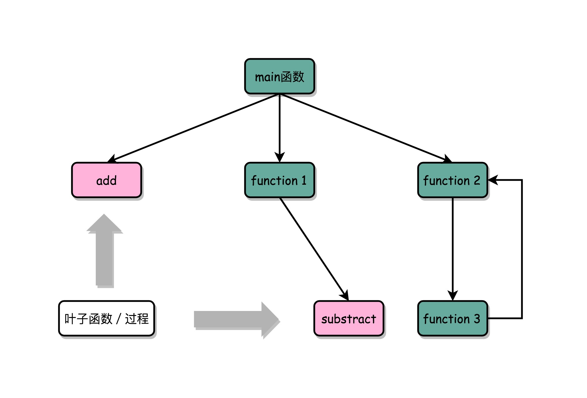

这样没有调用其他函数，只会被调用的函数，我们一般称之为**叶子函数（或叶子过程）**。

## 总结延伸

这一节，我们讲了一个程序的函数间调用，在 CPU 指令层面是怎么执行的。其中一定需要你牢记的，就是**程序栈**这个新概念。

我们可以方便地通过压栈和出栈操作，使得程序在不同的函数调用过程中进行转移。而函数内联和栈溢出，一个是我们常常可以选择的优化方案，另一个则是我们会常遇到的程序 Bug。

通过加入了程序栈，我们相当于在指令跳转的过程种，加入了一个“记忆”的功能，能在跳转去运行新的指令之后，再回到跳出去的位置，能够实现更加丰富和灵活的指令执行流程。这个也为我们在程序开发的过程中，提供了“函数”这样一个抽象，使得我们在软件开发的过程中，可以复用代码和指令，而不是只能简单粗暴地复制、粘贴代码和指令。

<h1 id="chapter8">08 | ELF和静态链接：为什么程序无法同时在Linux和Windows下运行？</h1>

## 编译、链接和装载：拆解程序执行

我们说过，写好的 C 语言代码，可以通过编译器编译成汇编代码，然后汇编代码再通过汇编器变成 CPU 可以理解的机器码，于是 CPU 就可以执行这些机器码了。你现在对这个过程应该不陌生了，但是这个描述把过程大大简化了。下面，我们一起具体来看，C 语言程序是如何变成一个可执行程序的。

不知道你注意到没有，过去几节，我们通过 gcc 生成的文件和 objdump 获取到的汇编指令都有些小小的问题。我们先把前面的 add 函数示例，拆分成两个文件 add_lib.c 和 link_example.c。

```c++
// add_lib.c
int add(int a, int b)
{
    return a+b;
}
```

```c++
// link_example.c

#include <stdio.h>
int main()
{
    int a = 10;
    int b = 5;
    int c = add(a, b);
    printf("c = %d\n", c);
}
```

我们通过 gcc 来编译这两个文件，然后通过 objdump 命令看看它们的汇编代码。

```c++
$ gcc -g -c add_lib.c link_example.c
$ objdump -d -M intel -S add_lib.o
$ objdump -d -M intel -S link_example.o
```

```c++
add_lib.o:     file format elf64-x86-64
Disassembly of section .text:
0000000000000000 <add>:
   0:   55                      push   rbp
   1:   48 89 e5                mov    rbp,rsp
   4:   89 7d fc                mov    DWORD PTR [rbp-0x4],edi
   7:   89 75 f8                mov    DWORD PTR [rbp-0x8],esi
   a:   8b 55 fc                mov    edx,DWORD PTR [rbp-0x4]
   d:   8b 45 f8                mov    eax,DWORD PTR [rbp-0x8]
  10:   01 d0                   add    eax,edx
  12:   5d                      pop    rbp
  13:   c3                      ret    
```

```c++
link_example.o:     file format elf64-x86-64
Disassembly of section .text:
0000000000000000 <main>:
   0:   55                      push   rbp
   1:   48 89 e5                mov    rbp,rsp
   4:   48 83 ec 10             sub    rsp,0x10
   8:   c7 45 fc 0a 00 00 00    mov    DWORD PTR [rbp-0x4],0xa
   f:   c7 45 f8 05 00 00 00    mov    DWORD PTR [rbp-0x8],0x5
  16:   8b 55 f8                mov    edx,DWORD PTR [rbp-0x8]
  19:   8b 45 fc                mov    eax,DWORD PTR [rbp-0x4]
  1c:   89 d6                   mov    esi,edx
  1e:   89 c7                   mov    edi,eax
  20:   b8 00 00 00 00          mov    eax,0x0
  25:   e8 00 00 00 00          call   2a <main+0x2a>
  2a:   89 45 f4                mov    DWORD PTR [rbp-0xc],eax
  2d:   8b 45 f4                mov    eax,DWORD PTR [rbp-0xc]
  30:   89 c6                   mov    esi,eax
  32:   48 8d 3d 00 00 00 00    lea    rdi,[rip+0x0]        # 39 <main+0x39>
  39:   b8 00 00 00 00          mov    eax,0x0
  3e:   e8 00 00 00 00          call   43 <main+0x43>
  43:   b8 00 00 00 00          mov    eax,0x0
  48:   c9                      leave  
  49:   c3                      ret    
```

既然代码已经被我们“编译”成了指令，我们不妨尝试运行一下 ./link_example.o。

不幸的是，文件没有执行权限，我们遇到一个 Permission denied 错误。即使通过 chmod 命令赋予 link_example.o 文件可执行的权限，运行./link_example.o 仍然只会得到一条 cannot execute binary file: Exec format error 的错误。

我们再仔细看一下 objdump 出来的两个文件的代码，会发现两个程序的地址都是从 0 开始的。如果地址是一样的，程序如果需要通过 call 指令调用函数的话，它怎么知道应该跳转到哪一个文件里呢？

这么说吧，无论是这里的运行报错，还是 objdump 出来的汇编代码里面的重复地址，都是因为 add_lib.o 以及 link_example.o 并不是一个**可执行文件**（Executable Program），而是**目标文件**（Object File）。只有通过链接器（Linker）把多个目标文件以及调用的各种函数库链接起来，我们才能得到一个可执行文件。

我们通过 gcc 的 -o 参数，可以生成对应的可执行文件，对应执行之后，就可以得到这个简单的加法调用函数的结果。

```c++
$ gcc -o link-example add_lib.o link_example.o
$ ./link_example
c = 15
```

实际上，“**C 语言代码 - 汇编代码 - 机器码**”  这个过程，在我们的计算机上进行的时候是由两部分组成的。

第一个部分由编译（Compile）、汇编（Assemble）以及链接（Link）三个阶段组成。在这三个阶段完成之后，我们就生成了一个可执行文件。

第二部分，我们通过装载器（Loader）把可执行文件装载（Load）到内存中。CPU 从内存中读取指令和数据，来开始真正执行程序。


## ELF 格式和链接：理解链接过程

程序最终是通过装载器变成指令和数据的，所以其实我们生成的可执行代码也并不仅仅是一条条的指令。我们还是通过 objdump 指令，把可执行文件的内容拿出来看看。

```c++
link_example:     file format elf64-x86-64
Disassembly of section .init:
...
Disassembly of section .plt:
...
Disassembly of section .plt.got:
...
Disassembly of section .text:
...

 6b0:   55                      push   rbp
 6b1:   48 89 e5                mov    rbp,rsp
 6b4:   89 7d fc                mov    DWORD PTR [rbp-0x4],edi
 6b7:   89 75 f8                mov    DWORD PTR [rbp-0x8],esi
 6ba:   8b 55 fc                mov    edx,DWORD PTR [rbp-0x4]
 6bd:   8b 45 f8                mov    eax,DWORD PTR [rbp-0x8]
 6c0:   01 d0                   add    eax,edx
 6c2:   5d                      pop    rbp
 6c3:   c3                      ret    
00000000000006c4 <main>:
 6c4:   55                      push   rbp
 6c5:   48 89 e5                mov    rbp,rsp
 6c8:   48 83 ec 10             sub    rsp,0x10
 6cc:   c7 45 fc 0a 00 00 00    mov    DWORD PTR [rbp-0x4],0xa
 6d3:   c7 45 f8 05 00 00 00    mov    DWORD PTR [rbp-0x8],0x5
 6da:   8b 55 f8                mov    edx,DWORD PTR [rbp-0x8]
 6dd:   8b 45 fc                mov    eax,DWORD PTR [rbp-0x4]
 6e0:   89 d6                   mov    esi,edx
 6e2:   89 c7                   mov    edi,eax
 6e4:   b8 00 00 00 00          mov    eax,0x0
 6e9:   e8 c2 ff ff ff          call   6b0 <add>
 6ee:   89 45 f4                mov    DWORD PTR [rbp-0xc],eax
 6f1:   8b 45 f4                mov    eax,DWORD PTR [rbp-0xc]
 6f4:   89 c6                   mov    esi,eax
 6f6:   48 8d 3d 97 00 00 00    lea    rdi,[rip+0x97]        # 794 <_IO_stdin_used+0x4>
 6fd:   b8 00 00 00 00          mov    eax,0x0
 702:   e8 59 fe ff ff          call   560 <printf@plt>
 707:   b8 00 00 00 00          mov    eax,0x0
 70c:   c9                      leave  
 70d:   c3                      ret    
 70e:   66 90                   xchg   ax,ax
...
Disassembly of section .fini:
...
```

你会发现，可执行代码 dump 出来内容，和之前的目标代码长得差不多，但是长了很多。因为在 Linux 下，可执行文件和目标文件所使用的都是一种叫 **ELF**（Execuatable and Linkable File Format）的文件格式，中文名字叫**可执行与可链接文件格式**，这里面不仅存放了编译成的汇编指令，还保留了很多别的数据。

比如我们过去所有 objdump 出来的代码里，你都可以看到对应的函数名称，像 add、main 等等，乃至你自己定义的全局可以访问的变量名称，都存放在这个 ELF 格式文件里。这些名字和它们对应的地址，在 ELF 文件里面，存储在一个叫作**符号表**（Symbols Table）的位置里。符号表相当于一个地址簿，把名字和地址关联了起来。

我们先只关注和我们的 add 以及 main 函数相关的部分。你会发现，这里面，main 函数里调用 add 的跳转地址，不再是下一条指令的地址了，而是 add 函数的入口地址了，这就是 EFL 格式和链接器的功劳。


ELF 文件格式把各种信息，分成一个一个的 Section 保存起来。ELF 有一个基本的文件头（File Header），用来表示这个文件的基本属性，比如是否是可执行文件，对应的 CPU、操作系统等等。除了这些基本属性之外，大部分程序还有这么一些 Section：

1. 首先是.text Section，也叫作**代码段**或者指令段（Code Section），用来保存程序的代码和指令；
2. 接着是.data Section，也叫作**数据段**（Data Section），用来保存程序里面设置好的初始化数据信息；
3. 然后就是.rel.text Secion，叫作**重定位表**（Relocation Table）。重定位表里，保留的是当前的文件里面，哪些跳转地址其实是我们不知道的。比如上面的 link_example.o 里面，我们在 main 函数里面调用了 add 和 printf 这两个函数，但是在链接发生之前，我们并不知道该跳转到哪里，这些信息就会存储在重定位表里；
4. 最后是.symtab Section，叫作**符号表**（Symbol Table）。符号表保留了我们所说的当前文件里面定义的函数名称和对应地址的地址簿。

链接器会扫描所有输入的目标文件，然后把所有符号表里的信息收集起来，构成一个全局的符号表。然后再根据重定位表，把所有不确定要跳转地址的代码，根据符号表里面存储的地址，进行一次修正。最后，把所有的目标文件的对应段进行一次合并，变成了最终的可执行代码。这也是为什么，可执行文件里面的函数调用的地址都是正确的。


在链接器把程序变成可执行文件之后，要装载器去执行程序就容易多了。装载器不再需要考虑地址跳转的问题，只需要解析 ELF 文件，把对应的指令和数据，加载到内存里面供 CPU 执行就可以了。

## 总结延伸

讲到这里，相信你已经猜到，为什么同样一个程序，在 Linux 下可以执行而在 Windows 下不能执行了。其中一个非常重要的原因就是，两个操作系统下可执行文件的格式不一样。

我们今天讲的是 Linux 下的 ELF 文件格式，而 Windows 的可执行文件格式是一种叫作 **PE**（Portable Executable Format）的文件格式。Linux 下的装载器只能解析 ELF 格式而不能解析 PE 格式。

如果我们有一个可以能够解析 PE 格式的装载器，我们就有可能在 Linux 下运行 Windows 程序了。这样的程序真的存在吗？没错，Linux 下著名的开源项目 Wine，就是通过兼容 PE 格式的装载器，使得我们能直接在 Linux 下运行 Windows 程序的。而现在微软的 Windows 里面也提供了 WSL，也就是 Windows Subsystem for Linux，可以解析和加载 ELF 格式的文件。

我们去写可以用的程序，也不仅仅是把所有代码放在一个文件里来编译执行，而是可以拆分成不同的函数库，最后通过一个静态链接的机制，使得不同的文件之间既有分工，又能通过静态链接来“合作”，变成一个可执行的程序。

对于 ELF 格式的文件，为了能够实现这样一个静态链接的机制，里面不只是简单罗列了程序所需要执行的指令，还会包括链接所需要的重定位表和符号表。

<h1 id="chapter9">09 | 程序装载：“640K内存”真的不够用么？</h1>

计算机这个行业的历史上有过很多成功的预言，最著名的自然是“摩尔定律”。当然免不了的也有很多“失败”的预测，其中一个最著名的就是，比尔·盖茨在上世纪 80 年代说的“640K ought to be enough for anyone”，也就是“640K 内存对哪个人来说都够用了”。

## 程序装载面临的挑战

上一讲，我们看到了如何通过链接器，把多个文件合并成一个最终可执行文件。在运行这些可执行文件的时候，我们其实是通过一个装载器，解析 ELF 或者 PE 格式的可执行文件。装载器会把对应的指令和数据加载到内存里面来，让 CPU 去执行。

说起来只是装载到内存里面这一句话的事儿，实际上装载器需要满足两个要求。

- **第一，可执行程序加载后占用的内存空间应该是连续的**。我们在第 6 讲讲过，执行指令的时候，程序计数器是顺序地一条一条指令执行下去。这也就意味着，这一条条指令需要连续地存储在一起。

- **第二，我们需要同时加载很多个程序，并且不能让程序自己规定在内存中加载的位置**。虽然编译出来的指令里已经有了对应的各种各样的内存地址，但是实际加载的时候，我们其实没有办法确保，这个程序一定加载在哪一段内存地址上。因为我们现在的计算机通常会同时运行很多个程序，可能你想要的内存地址已经被其他加载了的程序占用了。

要满足这两个基本的要求，我们很容易想到一个办法。那就是我们可以在内存里面，找到一段连续的内存空间，然后分配给装载的程序，然后把这段连续的内存空间地址，和整个程序指令里指定的内存地址做一个映射。

我们把指令里用到的内存地址叫作**虚拟内存地址**（Virtual Memory Address），实际在内存硬件里面的空间地址，我们叫**物理内存地址**（Physical Memory Address）。

程序里有指令和各种内存地址，我们只需要关心虚拟内存地址就行了。对于任何一个程序来说，它看到的都是同样的内存地址。我们维护一个虚拟内存到物理内存的映射表，这样实际程序指令执行的时候，会通过虚拟内存地址，找到对应的物理内存地址，然后执行。因为是连续的内存地址空间，所以我们只需要维护映射关系的起始地址和对应的空间大小就可以了。

## 内存分段

这种找出一段连续的物理内存和虚拟内存地址进行映射的方法，我们叫**分段**（Segmentation）。这里的段，就是指系统分配出来的那个连续的内存空间。

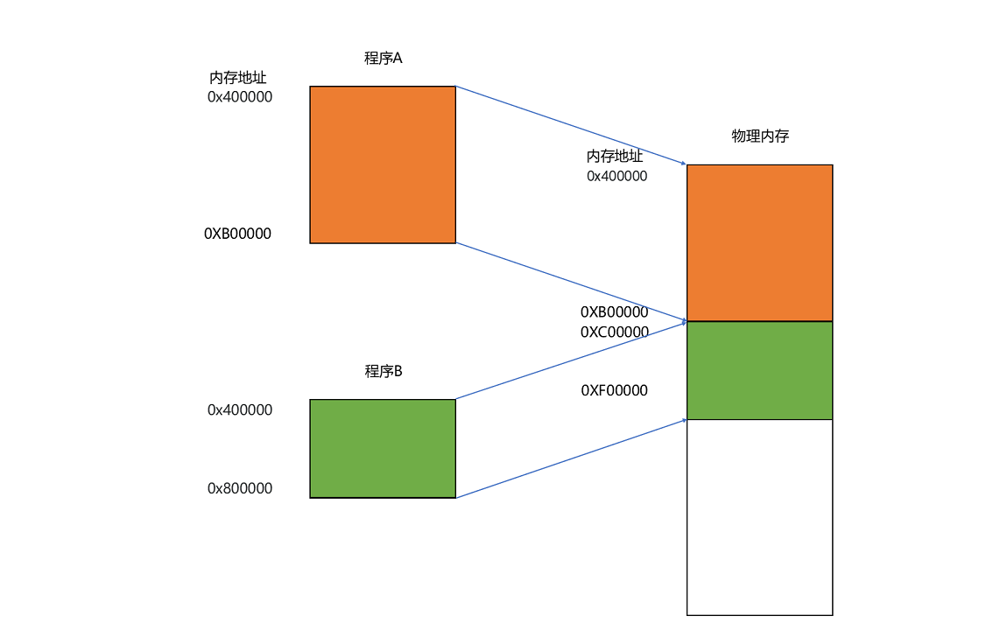

分段的办法很好，解决了程序本身不需要关心具体的物理内存地址的问题，但它也有一些不足之处，第一个就是**内存碎片**（Memory Fragmentation）的问题。

我们来看这样一个例子。我现在手头的这台电脑，有 1GB 的内存。我们先启动一个图形渲染程序，占用了 512MB 的内存，接着启动一个 Chrome 浏览器，占用了 128MB 内存，再启动一个 Python 程序，占用了 256MB 内存。这个时候，我们关掉 Chrome，于是空闲内存还有 1024 - 512 - 256 = 256MB。按理来说，我们有足够的空间再去装载一个 200MB 的程序。但是，这 256MB 的内存空间不是连续的，而是被分成了两段 128MB 的内存。因此，实际情况是，我们的程序没办法加载进来。


当然，这个我们也有办法解决。解决的办法叫**内存交换**（Memory Swapping）。

我们可以把 Python 程序占用的那 256MB 内存写到硬盘上，然后再从硬盘上读回来到内存里面。不过读回来的时候，我们不再把它加载到原来的位置，而是紧紧跟在那已经被占用了的 512MB 内存后面。这样，我们就有了连续的 256MB 内存空间，就可以去加载一个新的 200MB 的程序。如果你自己安装过 Linux 操作系统，你应该遇到过分配一个 swap 硬盘分区的问题。这块分出来的磁盘空间，其实就是专门给 Linux 操作系统进行内存交换用的。

虚拟内存、分段，再加上内存交换，看起来似乎已经解决了计算机同时装载运行很多个程序的问题。不过，你千万不要大意，这三者的组合仍然会遇到一个性能瓶颈。硬盘的访问速度要比内存慢很多，而每一次内存交换，我们都需要把一大段连续的内存数据写到硬盘上。所以，如果内存交换的时候，交换的是一个很占内存空间的程序，这样整个机器都会显得卡顿。

## 内存分页

既然问题出在内存碎片和内存交换的空间太大上，那么解决问题的办法就是，少出现一些内存碎片。另外，当需要进行内存交换的时候，让需要交换写入或者从磁盘装载的数据更少一点，这样就可以解决这个问题。这个办法，在现在计算机的内存管理里面，就叫作**内存分页**（Paging）。

**和分段这样分配一整段连续的空间给到程序相比，分页是把整个物理内存空间切成一段段固定尺寸的大小**。而对应的程序所需要占用的虚拟内存空间，也会同样切成一段段固定尺寸的大小。这样一个连续并且尺寸固定的内存空间，我们叫**页**（Page）。从虚拟内存到物理内存的映射，不再是拿整段连续的内存的物理地址，而是按照一个一个页来的。页的尺寸一般远远小于整个程序的大小。在 Linux 下，我们通常只设置成 4KB。你可以通过命令看看你手头的 Linux 系统设置的页的大小。

```c++
$ getconf PAGE_SIZE
```

由于内存空间都是预先划分好的，也就没有了不能使用的碎片，而只有被释放出来的很多 4KB 的页。即使内存空间不够，需要让现有的、正在运行的其他程序，通过内存交换释放出一些内存的页出来，一次性写入磁盘的也只有少数的一个页或者几个页，不会花太多时间，让整个机器被内存交换的过程给卡住。


更进一步地，分页的方式使得我们在加载程序的时候，不再需要一次性都把程序加载到物理内存中。我们完全可以在进行虚拟内存和物理内存的页之间的映射之后，并不真的把页加载到物理内存里，而是只在程序运行中，需要用到对应虚拟内存页里面的指令和数据时，再加载到物理内存里面去。

实际上，我们的操作系统，的确是这么做的。当要读取特定的页，却发现数据并没有加载到物理内存里的时候，就会触发一个来自于 CPU 的**缺页错误**（Page Fault）。我们的操作系统会捕捉到这个错误，然后将对应的页，从存放在硬盘上的虚拟内存里读取出来，加载到物理内存里。这种方式，使得我们可以运行那些远大于我们实际物理内存的程序。同时，这样一来，任何程序都不需要一次性加载完所有指令和数据，只需要加载当前需要用到就行了。

通过虚拟内存、内存交换和内存分页这三个技术的组合，我们最终得到了一个让程序不需要考虑实际的物理内存地址、大小和当前分配空间的解决方案。这些技术和方法，对于我们程序的编写、编译和链接过程都是透明的。这也是我们在计算机的软硬件开发中常用的一种方法，就是**加入一个间接层**。

通过引入虚拟内存、页映射和内存交换，我们的程序本身，就不再需要考虑对应的真实的内存地址、程序加载、内存管理等问题了。任何一个程序，都只需要把内存当成是一块完整而连续的空间来直接使用。

## 总结延伸

现在回到开头我问你的问题，我们的电脑只要 640K 内存就够了吗？很显然，现在来看，比尔·盖茨的这个判断是不合理的，那为什么他会这么认为呢？因为他也是一个很优秀的程序员啊！

在虚拟内存、内存交换和内存分页这三者结合之下，你会发现，其实要运行一个程序，“必需”的内存是很少的。CPU 只需要执行当前的指令，极限情况下，内存也只需要加载一页就好了。再大的程序，也可以分成一页。每次，只在需要用到对应的数据和指令的时候，从硬盘上交换到内存里面来就好了。以我们现在 4K 内存一页的大小，640K 内存也能放下足足 160 页呢，也无怪乎在比尔·盖茨会说出“640K ought to be enough for anyone”这样的话。

不过呢，硬盘的访问速度比内存慢很多，所以我们现在的计算机，没有个几 G 的内存都不好意思和人打招呼。

那么，除了程序分页装载这种方式之外，我们还有其他优化内存使用的方式么？下一讲，我们就一起来看看“动态装载”，学习一下让两个不同的应用程序，共用一个共享程序库的办法。

<h1 id="chapter10">10 | 动态链接：程序内部的“共享单车”</h1>

我们之前讲过，程序的链接，是把对应的不同文件内的代码段，合并到一起，成为最后的可执行文件。这个链接的方式，让我们在写代码的时候做到了“复用”。同样的功能代码只要写一次，然后提供给很多不同的程序进行链接就行了。

这么说来，“链接”其实有点儿像我们日常生活中的**标准化、模块化**生产。我们有一个可以生产标准螺帽的生产线，就可以生产很多个不同的螺帽。只要需要螺帽，我们都可以通过**链接**的方式，去**复制**一个出来，放到需要的地方去，大到汽车，小到信箱。

但是，如果我们有很多个程序都要通过装载器装载到内存里面，那里面链接好的同样的功能代码，也都需要再装载一遍，再占一遍内存空间。这就好比，假设每个人都有骑自行车的需要，那我们给每个人都生产一辆自行车带在身边，固然大家都有自行车用了，但是马路上肯定会特别拥挤。


## 链接可以分动、静，共享运行省内存

我们上一节解决程序装载到内存的时候，讲了很多方法。说起来，最根本的问题其实就是**内存空间不够用**。如果我们能够让同样功能的代码，在不同的程序里面，不需要各占一份内存空间，那该有多好啊！就好比，现在马路上的共享单车，我们并不需要给每个人都造一辆自行车，只要马路上有这些单车，谁需要的时候，直接通过手机扫码，都可以解锁骑行。

这个思路就引入一种新的链接方法，叫作**动态链接**（Dynamic Link）。相应的，我们之前说的合并代码段的方法，就是**静态链接**（Static Link）。

在动态链接的过程中，我们想要“链接”的，不是存储在硬盘上的目标文件代码，而是加载到内存中的**共享库**（Shared Libraries）。顾名思义，这里的共享库重在“共享“这两个字。

这个加载到内存中的共享库会被很多个程序的指令调用到。在 Windows 下，这些共享库文件就是.dll 文件，也就是 Dynamic-Link Libary（DLL，动态链接库）。在 Linux 下，这些共享库文件就是.so 文件，也就是 Shared Object（一般我们也称之为动态链接库）。这两大操作系统下的文件名后缀，一个用了“动态链接”的意思，另一个用了“共享”的意思，正好覆盖了两方面的含义。


## 地址无关很重要，相对地址解烦恼

不过，要想要在程序运行的时候共享代码，也有一定的要求，就是这些机器码必须是“**地址无关**”的。也就是说，我们编译出来的共享库文件的指令代码，是地址无关码（Position-Independent Code）。换句话说就是，这段代码，无论加载在哪个内存地址，都能够正常执行。如果不是这样的代码，就是地址相关的代码。

你可以想想，大部分函数库其实都可以做到地址无关，因为它们都接受特定的输入，进行确定的操作，然后给出返回结果就好了。无论是实现一个向量加法，还是实现一个打印的函数，这些代码逻辑和输入的数据在内存里面的位置并不重要。

而常见的地址相关的代码，比如绝对地址代码（Absolute Code）、利用重定位表的代码等等，都是地址相关的代码。你回想一下我们之前讲过的重定位表。在程序链接的时候，我们就把函数调用后要跳转访问的地址确定下来了，这意味着，如果这个函数加载到一个不同的内存地址，跳转就会失败。


对于所有动态链接共享库的程序来讲，虽然我们的共享库用的都是同一段物理内存地址，但是在不同的应用程序里，它所在的虚拟内存地址是不同的。我们没办法、也不应该要求动态链接同一个共享库的不同程序，必须把这个共享库所使用的虚拟内存地址变成一致。如果这样的话，我们写的程序就必须明确地知道内部的内存地址分配。

那么问题来了，我们要怎么样才能做到，动态共享库编译出来的代码指令，都是地址无关码呢？

动态代码库内部的变量和函数调用都很容易解决，我们只需要使用**相对地址**（Relative Address）就好了。各种指令中使用到的内存地址，给出的不是一个绝对的地址空间，而是一个相对于当前指令偏移量的内存地址。因为整个共享库是放在一段连续的虚拟内存地址中的，无论装载到哪一段地址，不同指令之间的相对地址都是不变的。

## PLT 和 GOT，动态链接的解决方案

要实现动态链接共享库，也并不困难，和前面的静态链接里的符号表和重定向表类似，还是和前面一样，我们还是拿出一小段代码来看一看。

首先，lib.h 定义了动态链接库的一个函show_me_the_money。

```c++
// lib.h
#ifndef LIB_H
#define LIB_H

void show_me_the_money(int money);

#endif
```

lib.c 包含了 lib.h 的实际实现。

```c++
// lib.c
#include <stdio.h>

void show_me_the_money(int money)
{
    printf("Show me USD %d from lib.c \n", money);
}
```

然后，show_me_poor.c 调用了 lib 里面的函数。

```c++
// show_me_poor.c
#include "lib.h"
int main()
{
    int money = 5;
    show_me_the_money(money);
}
```

最后，我们把 lib.c 编译成了一个动态链接库，也就是 .so 文件。

```c++
$ gcc lib.c -fPIC -shared -o lib.so
$ gcc -o show_me_poor show_me_poor.c ./lib.so
```

你可以看到，在编译的过程中，我们指定了一个 **-fPIC** 的参数。这个参数其实就是 Position Independent Code 的意思，也就是我们要把这个编译成一个地址无关代码。

然后，我们再通过 gcc 编译 show_me_poor 动态链接了 lib.so 的可执行文件。在这些操作都完成了之后，我们把 show_me_poor 这个文件通过 objdump 出来看一下。

```c++
$ objdump -d -M intel -S show_me_poor
```

```c++
……
0000000000400540 <show_me_the_money@plt-0x10>:
  400540:       ff 35 12 05 20 00       push   QWORD PTR [rip+0x200512]        # 600a58 <_GLOBAL_OFFSET_TABLE_+0x8>
  400546:       ff 25 14 05 20 00       jmp    QWORD PTR [rip+0x200514]        # 600a60 <_GLOBAL_OFFSET_TABLE_+0x10>
  40054c:       0f 1f 40 00             nop    DWORD PTR [rax+0x0]

0000000000400550 <show_me_the_money@plt>:
  400550:       ff 25 12 05 20 00       jmp    QWORD PTR [rip+0x200512]        # 600a68 <_GLOBAL_OFFSET_TABLE_+0x18>
  400556:       68 00 00 00 00          push   0x0
  40055b:       e9 e0 ff ff ff          jmp    400540 <_init+0x28>
……
0000000000400676 <main>:
  400676:       55                      push   rbp
  400677:       48 89 e5                mov    rbp,rsp
  40067a:       48 83 ec 10             sub    rsp,0x10
  40067e:       c7 45 fc 05 00 00 00    mov    DWORD PTR [rbp-0x4],0x5
  400685:       8b 45 fc                mov    eax,DWORD PTR [rbp-0x4]
  400688:       89 c7                   mov    edi,eax
  40068a:       e8 c1 fe ff ff          call   400550 <show_me_the_money@plt>
  40068f:       c9                      leave  
  400690:       c3                      ret    
  400691:       66 2e 0f 1f 84 00 00    nop    WORD PTR cs:[rax+rax*1+0x0]
  400698:       00 00 00 
  40069b:       0f 1f 44 00 00          nop    DWORD PTR [rax+rax*1+0x0]
……
```

我们还是只关心整个可执行文件中的一小部分内容。你应该可以看到，在 main 函数调用 show_me_the_money 的函数的时候，对应的代码是这样的：

```c++
call   400550 <show_me_the_money@plt>
```

这里后面有一个 @plt 的关键字，代表了我们需要从 PLT，也就是**程序链接表**（Procedure Link Table）里面找要调用的函数。对应的地址呢，则是 400550 这个地址。

那当我们把目光挪到上面的 400550 这个地址，你又会看到里面进行了一次跳转，这个跳转指定的跳转地址，你可以在后面的注释里面可以看到，GLOBAL_OFFSET_TABLE+0x18。这里的 GLOBAL_OFFSET_TABLE，就是我接下来要说的全局偏移表。

```c++
  400550:       ff 25 12 05 20 00       jmp    QWORD PTR [rip+0x200512]        # 600a68 <_GLOBAL_OFFSET_TABLE_+0x18>
```

在动态链接对应的共享库，我们在共享库的 data section 里面，保存了一张**全局偏移表**（GOT，Global Offset Table）。**虽然共享库的代码部分的物理内存是共享的，但是数据部分是各个动态链接它的应用程序里面各加载一份的**。所有需要引用当前共享库外部的地址的指令，都会查询 GOT，来找到当前运行程序的虚拟内存里的对应位置。而 GOT 表里的数据，则是在我们加载一个个共享库的时候写进去的。

不同的进程，调用同样的 lib.so，各自 GOT 里面指向最终加载的动态链接库里面的虚拟内存地址是不同的。

这样，虽然不同的程序调用的同样的动态库，各自的内存地址是独立的，调用的又都是同一个动态库，但是不需要去修改动态库里面的代码所使用的地址，而是各个程序各自维护好自己的 GOT，能够找到对应的动态库就好了。


我们的 GOT 表位于共享库自己的数据段里。GOT 表在内存里和对应的代码段位置之间的偏移量，始终是确定的。这样，我们的共享库就是地址无关的代码，对应的各个程序只需要在物理内存里面加载同一份代码。而我们又要通过各个可执行程序在加载时，生成的各不相同的 GOT 表，来找到它需要调用到的外部变量和函数的地址。

这是一个典型的、不修改代码，而是通过修改“**地址数据**”来进行关联的办法。它有点像我们在 C 语言里面用函数指针来调用对应的函数，并不是通过预先已经确定好的函数名称来调用，而是利用当时它在内存里面的动态地址来调用。

## 总结延伸

这一讲，我们终于在静态链接和程序装载之后，利用动态链接把我们的内存利用到了极致。同样功能的代码生成的共享库，我们只要在内存里面保留一份就好了。这样，我们不仅能够做到代码在开发阶段的复用，也能做到代码在运行阶段的复用。

实际上，在进行 Linux 下的程序开发的时候，我们一直会用到各种各样的动态链接库。C 语言的标准库就在 1MB 以上。我们撰写任何一个程序可能都需要用到这个库，常见的 Linux 服务器里，/usr/bin 下面就有上千个可执行文件。如果每一个都把标准库静态链接进来的，几 GB 乃至几十 GB 的磁盘空间一下子就用出去了。如果我们服务端的多进程应用要开上千个进程，几 GB 的内存空间也会一下子就用出去了。这个问题在过去计算机的内存较少的时候更加显著。

通过动态链接这个方式，可以说彻底解决了这个问题。就像共享单车一样，如果仔细经营，是一个很有社会价值的事情，但是如果粗暴地把它变成无限制地复制生产，给每个人造一辆，只会在系统内制造大量无用的垃圾。

过去的 05～09 这五讲里，我们已经把程序怎么从源代码变成指令、数据，并装载到内存里面，由 CPU 一条条执行下去的过程讲完了。希望你能有所收获，对于一个程序是怎么跑起来的，有了一个初步的认识。

<h1 id="chapter11">11 | 二进制编码：“手持两把锟斤拷，口中疾呼烫烫烫”？</h1>

上算法和数据结构课的时候，老师们都会和你说，程序 = 算法 + 数据结构。如果对应到组成原理或者说硬件层面，算法就是我们前面讲的各种计算机指令，数据结构就对应我们接下来要讲的二进制数据。

## 理解二进制的“逢二进一”

如果我们想要把一个十进制的数，转化成二进制，使用**短除法**就可以了。也就是，把十进制数除以 2 的余数，作为最右边的一位。然后用商继续除以 2，把对应的余数紧靠着刚才余数的右侧，这样递归迭代，直到商为 0 就可以了。

比如，我们想把 13 这个十进制数，用短除法转化成二进制，需要经历以下几个步骤：


因此，对应的二进制数，就是 1101。

刚才我们举的例子都是正数，对于负数来说，情况也是一样的吗？我们可以把一个数最左侧的一位，当成是对应的正负号，比如 0 为正数，1 为负数，这样来进行标记。

这样，一个 4 位的二进制数， 0011 就表示为 +3。而 1011 最左侧的第一位是 1，所以它就表示 -3。这个其实就是整数的**原码表示法**。原码表示法有一个很直观的缺点就是，0 可以用两个不同的编码来表示，1000 代表 0， 0000 也代表 0。习惯万事一一对应的程序员看到这种情况，必然会被“逼死”。

于是，我们就有了另一种表示方法。我们仍然通过最左侧第一位的 0 和 1，来判断这个数的正负。但是，我们不再把这一位当成单独的符号位，在剩下几位计算出的十进制前加上正负号，而是在计算整个二进制值的时候，在左侧最高位前面加个负号。

比如，一个 4 位的二进制补码数值 1011，转换成十进制，就是 −1×2<sup>3</sup>+0×2<sup>2</sup>+1×2<sup>1</sup>+1×2<sup>0</sup>=−5。如果最高位是 1，这个数必然是负数；最高位是 0，必然是正数。并且，只有 0000 表示 0，1000 在这样的情况下表示 -8。一个 4 位的二进制数，可以表示从 -8 到 7 这 16 个整数，不会白白浪费一位。

当然更重要的一点是，用补码来表示负数，使得我们的整数相加变得很容易，不需要做任何特殊处理，只是把它当成普通的二进制相加，就能得到正确的结果。

我们简单一点，拿一个 4 位的整数来算一下，比如 -5 + 1 = -4，-5 + 6 = 1。我们各自把它们转换成二进制来看一看。如果它们和无符号的二进制整数的加法用的是同样的计算方式，这也就意味着它们是同样的电路。


## 字符串的表示，从编码到数字

不仅数值可以用二进制表示，字符乃至更多的信息都能用二进制表示。最典型的例子就是**字符串**（Character String）。最早计算机只需要使用英文字符，加上数字和一些特殊符号，然后用 8 位的二进制，就能表示我们日常需要的所有字符了，这个就是我们常常说的 **ASCII 码**（American Standard Code for Information Interchange，美国信息交换标准代码）。


ASCII 码就好比一个字典，用 8 位二进制中的 128 个不同的数，映射到 128 个不同的字符里。比如，小写字母 a 在 ASCII 里面，就是第 97 个，也就是二进制的 0110 0001，对应的十六进制表示就是 61。而大写字母 A，就是第 65 个，也就是二进制的 0100 0001，对应的十六进制表示就是 41。

在 ASCII 码里面，数字 9 不再像整数表示法里一样，用 0000 1001 来表示，而是用 0011 1001 来表示。字符串 15 也不是用 0000 1111 这 8 位来表示，而是变成两个字符 1 和 5 连续放在一起，也就是 0011 0001 和 0011 0101，需要用两个 8 位来表示。

我们可以看到，最大的 32 位整数，就是 2147483647。如果用整数表示法，只需要 32 位就能表示了。但是如果用字符串来表示，一共有 10 个字符，每个字符用 8 位的话，需要整整 80 位。比起整数表示法，要多占很多空间。

这也是为什么，很多时候我们在存储数据的时候，要采用二进制序列化这样的方式，而不是简单地把数据通过 CSV 或者 JSON，这样的文本格式存储来进行序列化。**不管是整数也好，浮点数也好，采用二进制序列化会比存储文本省下不少空间。**

ASCII 码只表示了 128 个字符，一开始倒也堪用，毕竟计算机是在美国发明的。然而随着越来越多的不同国家的人都用上了计算机，想要表示譬如中文这样的文字，128 个字符显然是不太够用的。于是，计算机工程师们开始各显神通，给自己国家的语言创建了对应的**字符集**（Charset）和**字符编码**（Character Encoding）。

字符集，表示的可以是字符的一个集合。比如“中文”就是一个字符集，不过这样描述一个字符集并不准确。想要更精确一点，我们可以说，“第一版《新华字典》里面出现的所有汉字”，这是一个字符集。这样，我们才能明确知道，一个字符在不在这个集合里面。比如，我们日常说的 Unicode，其实就是一个字符集，包含了 150 种语言的 14 万个不同的字符。

而字符编码则是对于字符集里的这些字符，怎么一一用二进制表示出来的一个字典。我们上面说的 Unicode，就可以用 UTF-8、UTF-16，乃至 UTF-32 来进行编码，存储成二进制。所以，有了 Unicode，其实我们可以用不止 UTF-8 一种编码形式，我们也可以自己发明一套 GT-32 编码，比如就叫作 Geek Time 32 好了。只要别人知道这套编码规则，就可以正常传输、显示这段代码。


同样的文本，采用不同的编码存储下来。如果另外一个程序，用一种不同的编码方式来进行解码和展示，就会出现乱码。这就好像两个军队用密语通信，如果用错了密码本，那看到的消息就会不知所云。在中文世界里，最典型的就是“手持两把锟斤拷，口中疾呼烫烫烫”的典故。

我曾经听说过这么一个笑话，没有经验的同学，在看到程序输出“烫烫烫”的时候，以为是程序让 CPU 过热发出报警，于是尝试给 CPU 降频来解决问题。

既然今天要彻底搞清楚编码知识，我们就来弄清楚“锟斤拷”和“烫烫烫”的来龙去脉。


首先，“锟斤拷”的来源是这样的。如果我们想要用 Unicode 编码记录一些文本，特别是一些遗留的老字符集内的文本，但是这些字符在 Unicode 中可能并不存在。于是，Unicode 会统一把这些字符记录为 U+FFFD 这个编码。如果用 UTF-8 的格式存储下来，就是\xef\xbf\xbd。如果连续两个这样的字符放在一起，\xef\xbf\xbd\xef\xbf\xbd，这个时候，如果程序把这个字符，用 GB2312 的方式进行 decode，就会变成“锟斤拷”。这就好比我们用 GB2312 这本密码本，去解密别人用 UTF-8 加密的信息，自然没办法读出有用的信息。

而“烫烫烫”，则是因为如果你用了 Visual Studio 的调试器，默认使用 MBCS 字符集。“烫”在里面是由 0xCCCC 来表示的，而 0xCC 又恰好是未初始化的内存的赋值。于是，在读到没有赋值的内存地址或者变量的时候，电脑就开始大叫“烫烫烫”了。

## 总结延伸

到这里，相信你发现，我们可以用二进制编码的方式，表示任意的信息。只要建立起字符集和字符编码，并且得到大家的认同，我们就可以在计算机里面表示这样的信息了。所以说，如果你有心，要发明一门自己的克林贡语并不是什么难事。

不过，光是明白怎么把数值和字符在逻辑层面用二进制表示是不够的。我们在计算机组成里面，关心的不只是数值和字符的逻辑表示，更要弄明白，在硬件层面，这些数值和我们一直提的晶体管和电路有什么关系。下一讲，我就会为你揭开神秘的面纱。我会从时钟和 D 触发器讲起，最终让你明白，计算机里的加法，是如何通过电路来实现的。

<h1 id="chapter12">12 | 理解电路：从电报机到门电路，我们如何做到“千里传信”？</h1>

我们前面讲过机器指令，你应该知道，所有最终执行的程序其实都是使用“0”和“1”这样的二进制代码来表示的。上一讲里，我也向你展示了，对应的整数和字符串，其实也是用“0”和“1”这样的二进制代码来表示的。

## 从信使到电报，我们怎么做到“千里传书”？

马拉松的故事相信你听说过。公元前 490 年，在雅典附近的马拉松海边，发生了波斯和希腊之间的希波战争。雅典和斯巴达领导的希腊联军胜利之后，雅典飞毛腿菲迪皮德斯跑了历史上第一个马拉松，回雅典报喜。这个时候，人们在远距离报信的时候，采用的是派人跑腿，传口信或者送信的方式。

但是，这样靠人传口信或者送信的方式，实在是太慢了。在军事用途中，信息能否更早更准确地传递出去经常是事关成败的大事。所以我们看到中国古代的军队有“击鼓进军”和“鸣金收兵”，通过打鼓和敲钲发出不同的声音，来传递军队的号令。

如果我们把军队当成一台计算机，那“金”和“鼓”就是这台计算机的“1”和“0”。我们可以通过不同的编码方式，来指挥这支军队前进、后退、转向、追击等等。

“金”和“鼓”比起跑腿传口信，固然效率更高了，但是能够传递的范围还是非常有限，超出个几公里恐怕就听不见了。于是，人们发明了更多能够往更远距离传信的方式，比如海上的灯塔、长城上的烽火台。因为光速比声速更快，传的距离也可以更远。


但是，这些传递信息的方式都面临一个问题，就是受限于只有“1”和“0”这两种信号，不能传递太复杂的信息，那电报的发明就解决了这个问题。

从信息编码的角度来说，金、鼓、灯塔、烽火台类似电报的二进制编码。电报传输的信号有两种，一种是短促的**点信号**（dot 信号），一种是长一点的**划信号**（dash 信号）。我们把“点”当成“1”，把“划”当成“0”。这样一来，我们的电报信号就是另一种特殊的二进制编码了。电影里最常见的电报信号是“SOS”，这个信号表示出来就是 “点点点划划划点点点”。

比起灯塔和烽火台这样的设备，电报信号有两个明显的优势。第一，信号的传输距离迅速增加。因为电报本质上是通过电信号来进行传播的，所以从输入信号到输出信号基本上没有延时。第二，输入信号的速度加快了很多。电报机只有一个按钮，按下就是输入信号，按的时间短一点，就是发出了一个“点”信号；按的时间长一些，就是一个“划”信号。只要一个手指，就能快速发送电报。

而且，制造一台电报机也非常容易。电报机本质上就是一个“**蜂鸣器 + 长长的电线 + 按钮开关**”。蜂鸣器装在接收方手里，开关留在发送方手里。双方用长长的电线连在一起。当按钮开关按下的时候，电线的电路接通了，蜂鸣器就会响。短促地按下，就是一个短促的点信号；按的时间稍微长一些，就是一个稍长的划信号。

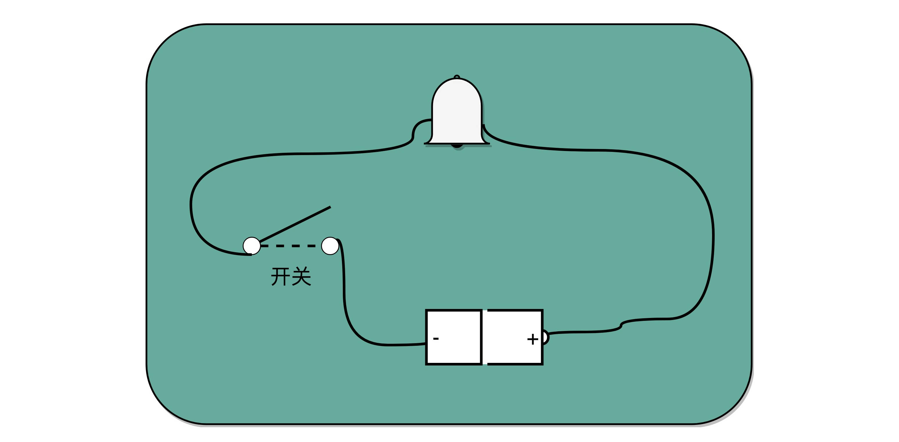

## 理解继电器，给跑不动的信号续一秒

有了电报机，只要铺设好电报线路，就可以传输我们需要的讯息了。但是这里面又出现了一个新的挑战，就是随着电线的线路越长，电线的电阻就越大。当电阻很大，而电压不够的时候，即使你按下开关，蜂鸣器也不会响。

你可能要说了，我们可以提高电压或者用更粗的电线，使得电阻更小，这样就可以让整个线路铺得更长一些。但是这个再长，也没办法从北京铺设到上海吧。要想从北京把电报发到上海，我们还得想些别的办法。

对于电报来说，电线太长了，使得线路接通也没有办法让蜂鸣器响起来。那么，我们就不要一次铺太长的线路，而把一小段距离当成一个线路，也和驿站建立一个小电报站。我们在小电报站里面安排一个电报员，他听到上一个小电报站发来的信息，然后原样输入，发到下一个电报站去。这样，我们的信号就可以一段段传输下去，而不会因为距离太长，导致电阻太大，没有办法成功传输信号。为了能够实现这样**接力传输信号**，在电路里面，工程师们造了一个叫作**继电器**（Relay）的设备。


事实上，这个过程中，我们需要在每一阶段**原样传输信号**，所以你可以想想，我们是不是可以设计一个设备来代替这个电报员？相比使用人工听蜂鸣器的声音，来重复输入信号，利用电磁效应和磁铁，来实现这个事情会更容易。

我们把原先用来输出声音的蜂鸣器，换成一段环形的螺旋线圈，让电路封闭通上电。因为电磁效应，这段螺旋线圈会产生一个带有磁性的电磁场。我们原本需要输入的按钮开关，就可以用一块磁力稍弱的磁铁把它设在“关”的状态。这样，按下上一个电报站的开关，螺旋线圈通电产生了磁场之后，磁力就会把开关“吸”下来，接通到下一个电报站的电路。

如果我们在中间所有小电报站都用这个“**螺旋线圈 + 磁性开关**”的方式，来替代蜂鸣器和普通开关，而只在电报的始发和终点用普通的开关和蜂鸣器，我们就有了一个拆成一段一段的电报线路，接力传输电报信号。这样，我们就不需要中间安排人力来听打电报内容，也不需要解决因为线缆太长导致的电阻太大或者电压不足的问题了。我们只要在终点站安排电报员，听写最终的电报内容就可以了。这样是不是比之前更省事了？

事实上，继电器还有一个名字就叫作**电驿**，这个“驿”就是驿站的驿，可以说非常形象了。这个接力的策略不仅可以用在电报中，在通信类的科技产品中其实都可以用到。

比如说，你在家里用 WiFi，如果你的屋子比较大，可能某些房间的信号就不好。你可以选用支持“中继”的 WiFi 路由器，在信号衰减的地方，增加一个 WiFi 设备，接收原来的 WiFi 信号，再重新从当前节点传输出去。这种中继对应的英文名词和继电器是一样的，也叫 Relay。

输出端的作用，不仅仅是通过一个蜂鸣器或者灯泡，提供一个供人观察的输出信号，通过“螺旋线圈 + 磁性开关”，使得我们有“开”和“关”这两种状态，这个“开”和“关”表示的“1”和“0”，还可以作为后续线路的输入信号，让我们开始可以通过最简单的电路，来组合形成我们需要的逻辑。

通过这些线圈和开关，我们也可以很容易地创建出 “与（AND）”“或（OR）”“非（NOT）”这样的逻辑。我们在输入端的电路上，提供串联的两个开关，只有两个开关都打开，电路才接通，输出的开关也才能接通，这其实就是模拟了计算机里面的“与”操作。

我们在输入端的电路，提供两条独立的线路到输出端，两条线路上各有一个开关，那么任何一个开关打开了，到输出端的电路都是接通的，这其实就是模拟了计算机中的“或”操作。

当我们把输出端的“螺旋线圈 + 磁性开关”的组合，从默认关掉，只有通电有了磁场之后打开，换成默认是打开通电的，只有通电之后才关闭，我们就得到了一个计算机中的“非”操作。输出端开和关正好和输入端相反。这个在数字电路中，也叫作**反向器**（Inverter）。


与、或、非的电路都非常简单，要想做稍微复杂一点的工作，我们需要很多电路的组合。不过，这也彰显了现代计算机体系中一个重要的思想，就是通过分层和组合，逐步搭建起更加强大的功能。

回到我们前面看的电报机原型，虽然一个按钮开关的电报机很“容易”操作，但是却不“方便”操作。因为电报员要熟记每一个字母对应的摩尔斯电码，并且需要快速按键来进行输入。一旦输错很难纠正。但是，因为电路之间可以通过与、或、非组合完成更复杂的功能，我们完全可以设计一个和打字机一样的电报机，每按下一个字母按钮，就会接通一部分电路，然后把这个字母的摩尔斯电码输出出去。

虽然在电报机时代，我们没有这么做，但是在计算机时代，我们其实就是这样做的。我们不再是给计算机“0”和“1”，而是通过千万个晶体管组合在一起，最终使得我们可以用“高级语言”，指挥计算机去干什么。

## 总结延伸

可以说，电报是现代计算机的一个最简单的原型。它和我们现在使用的现代计算机有很多相似之处。我们通过电路的“开”和“关”，来表示“1”和“0”。就像晶体管在不同的情况下，表现为导电的“1”和绝缘的“0”的状态。

我们通过电报机这个设备，看到了如何通过“螺旋线圈 + 开关”，来构造基本的逻辑电路，我们也叫门电路。一方面，我们可以通过继电器或者中继，进行长距离的信号传输。另一方面，我们也可以通过设置不同的线路和开关状态，实现更多不同的信号表示和处理方式，这些线路的连接方式其实就是我们在数字电路中所说的门电路。而这些门电路，也是我们创建 CPU 和内存的基本逻辑单元。我们的各种对于计算机二进制的“0”和“1”的操作，其实就是来自于门电路，叫作组合逻辑电路。

<h1 id="chapter13">13 | 加法器：如何像搭乐高一样搭电路（上）？</h1>

上一讲，我们看到了如何通过电路，在计算机硬件层面设计最基本的单元，门电路。我给你看的门电路非常简单，只能做简单的 “与（AND）”“或（OR）”“NOT（非）”和“异或（XOR）”，这样最基本的单比特逻辑运算。下面这些门电路的标识，你需要非常熟悉，后续的电路都是由这些门电路组合起来的。


这些基本的门电路，是我们计算机硬件端的最基本的“积木”，就好像乐高积木里面最简单的小方块。看似不起眼，但是把它们组合起来，最终可以搭出一个星球大战里面千年隼这样的大玩意儿。我们今天包含十亿级别晶体管的现代 CPU，都是由这样一个一个的门电路组合而成的。

## 异或门和半加器

我们看到的基础门电路，输入都是两个单独的 bit，输出是一个单独的 bit。如果我们要对 2 个 8 位（bit）的数，计算与、或、非这样的简单逻辑运算，其实很容易。只要连续摆放 8 个开关，来代表一个 8 位数。这样的两组开关，从左到右，上下单个的位开关之间，都统一用“与门”或者“或门”连起来，就是两个 8 位数的 AND 或者 OR 的运算了。

比起 AND 或者 OR 这样的电路外，要想实现整数的加法，就需要组建稍微复杂一点儿的电路了。

我们先回归一个最简单的 8 位的无符号整数的加法。这里的“无符号”，表示我们并不需要使用补码来表示负数。无论高位是“0”还是“1”，这个整数都是一个正数。

我们很直观就可以想到，要表示一个 8 位数的整数，简单地用 8 个 bit，也就是 8 个像上一讲的电路开关就好了。那 2 个 8 位整数的加法，就是 2 排 8 个开关。加法得到的结果也是一个 8 位的整数，所以又需要 1 排 8 位的开关。要想实现加法，我们就要看一下，通过什么样的门电路，能够连接起加数和被加数，得到最后期望的和。


要做到这一点，我们先来看看，我们人在计算加法的时候一般会怎么操作。二进制的加法和十进制没什么区别，所以我们一样可以用**列竖式**来计算。我们仍然是从右到左，一位一位进行计算，只是把从逢 10 进 1 变成逢 2 进 1。


你会发现，其实计算一位数的加法很简单。我们先就看最简单的个位数。输入一共是 4 种组合，00、01、10、11。得到的结果，也不复杂。

一方面，我们需要知道，加法计算之后的个位是什么，在输入的两位是 00 和 11 的情况下，对应的输出都应该是 0；在输入的两位是 10 和 01 的情况下，输出都是 1。结果你会发现，这个输入和输出的对应关系，其实就是我在上一讲留给你的思考题里面的“异或门（XOR）”。

讲与、或、非门的时候，我们很容易就能和程序里面的“AND（通常是 & 符号）”“ OR（通常是 | 符号）”和“ NOT（通常是 ! 符号）”对应起来。可能你没有想过，为什么我们会需要“异或（XOR）”，这样一个在逻辑运算里面没有出现的形式，作为一个基本电路。**其实，异或门就是一个最简单的整数加法，所需要使用的基本门电路**。

算完个位的输出还不算完，输入的两位都是 11 的时候，我们还需要向更左侧的一位进行进位。那这个就对应一个与门，也就是有且只有在加数和被加数都是 1 的时候，我们的进位才会是 1。

所以，通过一个异或门计算出个位，通过一个与门计算出是否进位，我们就通过电路算出了一个一位数的加法。于是，**我们把两个门电路打包，给它取一个名字，就叫作半加器（Half Adder）**。


## 全加器

你肯定很奇怪，为什么我们给这样的电路组合，取名叫半加器（Half Adder）？莫非还有一个全加器（Full Adder）么？你猜得没错。半加器可以解决个位的加法问题，但是如果放到二位上来说，就不够用了。我们这里的竖式是个二进制的加法，所以如果从右往左数，第二列不是十位，我称之为“二位”。对应的再往左，就应该分别是四位、八位。

二位用一个半加器不能计算完成的原因也很简单。因为二位除了一个加数和被加数之外，还需要加上来自个位的进位信号，一共需要三个数进行相加，才能得到结果。但是我们目前用到的，无论是最简单的门电路，还是用两个门电路组合而成的半加器，输入都只能是两个 bit，也就是两个开关。那我们该怎么办呢？

实际上，解决方案也并不复杂。**我们用两个半加器和一个或门，就能组合成一个全加器**。第一个半加器，我们用和个位的加法一样的方式，得到是否进位 X 和对应的二个数加和后的结果 Y，这样两个输出。然后，我们把这个加和后的结果 Y，和个位数相加后输出的进位信息 U，再连接到一个半加器上，就会再拿到一个是否进位的信号 V 和对应的加和后的结果 W。

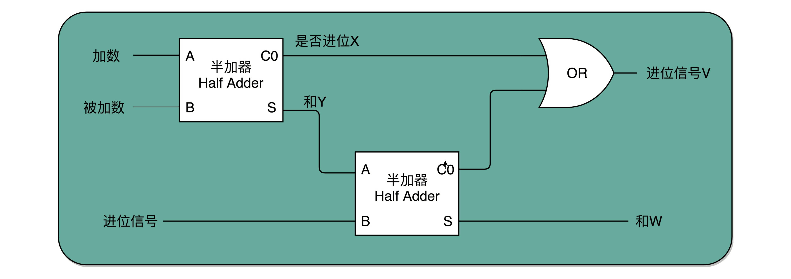

这个 W 就是我们在二位上留下的结果。我们把两个半加器的进位输出，作为一个或门的输入连接起来，只要两次加法中任何一次需要进位，那么在二位上，我们就会向左侧的四位进一位。因为一共只有三个 bit 相加，即使 3 个 bit 都是 1，也最多会进一位。

这样，通过两个半加器和一个或门，我们就得到了一个，能够接受进位信号、加数和被加数，这样三个数组成的加法。这就是我们需要的全加器。

有了全加器，我们要进行对应的两个 8 bit 数的加法就很容易了。我们只要把 8 个全加器串联起来就好了。个位的全加器的进位信号作为二位全加器的输入信号，二位全加器的进位信号再作为四位的全加器的进位信号。这样一层层串接八层，我们就得到了一个支持 8 位数加法的算术单元。如果要扩展到 16 位、32 位，乃至 64 位，都只需要多串联几个输入位和全加器就好了。


唯一需要注意的是，对于这个全加器，在个位，我们只需要用一个半加器，或者让全加器的进位输入始终是 0。因为个位没有来自更右侧的进位。而最左侧的一位输出的进位信号，表示的并不是再进一位，而是表示我们的加法是否溢出了。

这也是很有意思的一点。以前我自己在了解二进制加法的时候，一直有这么个疑问，既然 int 这样的 16 位的整数加法，结果也是 16 位数，那我们怎么知道加法最终是否溢出了呢？因为结果也只存得下加法结果的 16 位数。我们并没有留下一个第 17 位，来记录这个加法的结果是否溢出。

看到全加器的电路设计，相信你应该明白，在整个加法器的结果中，我们其实有一个电路的信号，会标识出加法的结果是否溢出。我们可以把这个对应的信号，输出给到硬件中其他标志位里，让我们的计算机知道计算的结果是否溢出。而现代计算机也正是这样做的。这就是为什么你在撰写程序的时候，能够知道你的计算结果是否溢出在硬件层面得到的支持。

## 总结延伸

相信到这里，你应该已经体会到了，通过门电路来搭建算术计算的一个小功能，就好像搭乐高积木一样。

我们用两个门电路，搭出一个半加器，就好像我们拿两块乐高，叠在一起，变成一个长方形的乐高，这样我们就有了一个新的积木组件，柱子。我们再用两个柱子和一个长条的积木组合一下，就变成一个积木桥。然后几个积木桥串接在一起，又成了积木楼梯。

当我们想要搭建一个摩天大楼，我们需要很多很多楼梯。但是这个时候，我们已经不再关注最基础的一节楼梯是怎么用一块块积木搭建起来的。这其实就是计算机中，无论软件还是硬件中一个很重要的设计思想，**分层**。


从简单到复杂，我们一层层搭出了拥有更强能力的功能组件。在上面的一层，我们只需要考虑怎么用下一层的组件搭建出自己的功能，而不需要下沉到更低层的其他组件。就像你之前并没有深入学习过计算机组成原理，一样可以直接通过高级语言撰写代码，实现功能。

在硬件层面，我们通过门电路、半加器、全加器一层层搭出了加法器这样的功能组件。我们把这些用来做算术逻辑计算的组件叫作 ALU，也就是算术逻辑单元。当进一步打造强大的 CPU 时，我们不会再去关注最细颗粒的门电路，只需要把门电路组合而成的 ALU，当成一个能够完成基础计算的黑盒子就可以了。

<h1 id="chapter14">14 | 乘法器：如何像搭乐高一样搭电路（下）？</h1>

和学习小学数学一样，学完了加法之后，我们自然而然就要来学习乘法。既然是退回到小学，我们就把问题搞得简单一点，先来看两个 4 位数的乘法。这里的 4 位数，当然还是一个二进制数。我们是人类而不是电路，自然还是用列竖式的方式来进行计算。

十进制中的 13 乘以 9，计算的结果应该是 117。我们通过转换成二进制，然后列竖式的办法，来看看整个计算的过程是怎样的。


## 顺序乘法的实现过程

从列出竖式的过程中，你会发现，二进制的乘法有个很大的优点，就是这个过程你不需要背九九乘法口诀表了。因为单个位置上，乘数只能是 0 或者 1，所以实际的乘法，就退化成了位移和加法。

在 13×9 这个例子里面，被乘数 13 表示成二进制是 1101，乘数 9 在二进制里面是 1001。最右边的个位是 1，所以个位乘以被乘数，就是把被乘数 1101 复制下来。因为二位和四位都是 0，所以乘以被乘数都是 0，那么保留下来的都是 0000。乘数的八位是 1，我们仍然需要把被乘数 1101 复制下来。不过这里和个位位置的单纯复制有一点小小的差别，那就是要把复制好的结果向左侧移三位，然后把四位单独进行乘法加位移的结果，再加起来，我们就得到了最终的计算结果。

对应到我们之前讲的数字电路和 ALU，你可以看到，最后一步的加法，我们可以用上一讲的加法器来实现。乘法因为只有“0”和“1”两种情况，所以可以做成输入输出都是 4 个开关，中间用 1 个开关，同时来控制这 8 个开关的方式，这就实现了二进制下的单位的乘法。


至于位移也不麻烦，我们只要不是直接连线，把正对着的开关之间进行接通，而是斜着错开位置去接就好了。如果要左移一位，就错开一位接线；如果要左移两位，就错开两位接线。


这样，你会发现，我们并不需要引入任何新的、更复杂的电路，仍然用最基础的电路，只要用不同的接线方式，就能够实现一个“列竖式”的乘法。而且，因为二进制下，只有 0 和 1，也就是开关的开和闭这两种情况，所以我们的计算机也不需要去“背诵”九九乘法口诀表，不需要单独实现一个更复杂的电路，就能够实现乘法。

为了节约一点开关，也就是晶体管的数量。实际上，像 13×9 这样两个四位数的乘法，我们不需要把四次单位乘法的结果，用四组独立的开关单独都记录下来，然后再把这四个数加起来。因为这样做，需要很多组开关，如果我们计算一个 32 位的整数乘法，就要 32 组开关，太浪费晶体管了。如果我们顺序地来计算，只需要一组开关就好了。

我们先拿乘数最右侧的个位乘以被乘数，然后把结果写入用来存放计算结果的开关里面，然后，把被乘数左移一位，把乘数右移一位，仍然用乘数去乘以被乘数，然后把结果加到刚才的结果上。反复重复这一步骤，直到不能再左移和右移位置。这样，乘数和被乘数就像两列相向而驶的列车，仅仅需要简单的加法器、一个可以左移一位的电路和一个右移一位的电路，就能完成整个乘法。


你看这里画的乘法器硬件结构示意图。这里的控制测试，其实就是通过一个时钟信号，来控制左移、右移以及重新计算乘法和加法的时机。我们还是以计算 13×9，也就是二进制的 1101×1001 来具体看。


这个计算方式虽然节约电路了，但是也有一个很大的缺点，那就是慢。

你应该很容易就能发现，在这个乘法器的实现过程里，我们其实就是把乘法展开，变成了“**加法 + 位移**”来实现。我们用的是 4 位数，所以要进行 4 组“位移 + 加法”的操作。而且这 4 组操作还不能同时进行。因为**下一组的加法要依赖上一组的加法后的计算结果，下一组的位移也要依赖上一组的位移的结果。这样，整个算法是“顺序”的，每一组加法或者位移的运算都需要一定的时间**。

所以，最终这个乘法的计算速度，其实和我们要计算的数的位数有关。比如，这里的 4 位，就需要 4 次加法。而我们的现代 CPU 常常要用 32 位或者是 64 位来表示整数，那么对应就需要 32 次或者 64 次加法。比起 4 位数，要多花上 8 倍乃至 16 倍的时间。

换个我们在算法和数据结构中的术语来说就是，这样的一个顺序乘法器硬件进行计算的时间复杂度是 O(N)。这里的 N，就是乘法的数里面的**位数**。

## 并行加速方法

那么，我们有没有办法，把时间复杂度上降下来呢？研究数据结构和算法的时候，我们总是希望能够把 O(N) 的时间复杂度，降低到 O(logN)。办法还真的有。和软件开发里面改算法一样，在涉及 CPU 和电路的时候，我们可以改电路。

32 位数虽然是 32 次加法，但是我们可以让很多加法同时进行。回到这一讲开始，我们把位移和乘法的计算结果加到中间结果里的方法，32 位整数的乘法，其实就变成了 32 个整数相加。

前面顺序乘法器硬件的实现办法，就好像体育比赛里面的单败淘汰赛。只有一个擂台会存下最新的计算结果。每一场新的比赛就来一个新的选手，实现一次加法，实现完了剩下的还是原来那个守擂的，直到其余 31 个选手都上来比过一场。如果一场比赛需要一天，那么一共要比 31 场，也就是 31 天。


加速的办法，就是把比赛变成像世界杯足球赛那样的淘汰赛，32 个球队捉对厮杀，同时开赛。这样一天一下子就淘汰了 16 支队，也就是说，32 个数两两相加后，你可以得到 16 个结果。后面的比赛也是一样同时开赛捉对厮杀。只需要 5 天，也就是 O(log2N) 的时间，就能得到计算的结果。但是这种方式要求我们得有 16 个球场。因为在淘汰赛的第一轮，我们需要 16 场比赛同时进行。对应到我们 CPU 的硬件上，就是需要更多的晶体管开关，来放下中间计算结果。


## 电路并行

上面我们说的并行加速的办法，看起来还是有点儿笨。我们回头来做一个抽象的思考。之所以我们的计算会慢，核心原因其实是“顺序”计算，也就是说，要等前面的计算结果完成之后，我们才能得到后面的计算结果。

最典型的例子就是我们上一讲讲的加法器。每一个全加器，都要等待上一个全加器，把对应的进入输入结果算出来，才能算下一位的输出。位数越多，越往高位走，等待前面的步骤就越多，这个等待的时间有个专门的名词，叫作**门延迟**（Gate Delay）。

每通过一个门电路，我们就要等待门电路的计算结果，就是一层的门电路延迟，我们一般给它取一个“T”作为符号。一个全加器，其实就已经有了 3T 的延迟（进位需要经过 3 个门电路）。而 4 位整数，最高位的计算需要等待前面三个全加器的进位结果，也就是要等 9T 的延迟。如果是 64 位整数，那就要变成 63×3=189T 的延迟。这可不是个小数字啊！

除了门延迟之外，还有一个问题就是**时钟频率**。在上面的顺序乘法计算里面，如果我们想要用更少的电路，计算的中间结果需要保存在寄存器里面，然后等待下一个时钟周期的到来，控制测试信号才能进行下一次移位和加法，这个延迟比上面的门延迟更可观。

那么，我们有什么办法可以解决这个问题呢？实际上，在我们进行加法的时候，如果相加的两个数是确定的，那高位是否会进位其实也是确定的。对于我们人来说，我们本身去做计算都是顺序执行的，所以要一步一步计算进位。但是，计算机是连结的各种线路。我们不用让计算机模拟人脑的思考方式，来连结线路。

那怎么才能把线路连结得复杂一点，让高位和低位的计算同时出结果呢？怎样才能让高位不需要等待低位的进位结果，而是把低位的所有输入信号都放进来，直接计算出高位的计算结果和进位结果呢？

我们只要把进位部分的电路完全展开就好了。我们的半加器到全加器，再到加法器，都是用最基础的门电路组合而成的。门电路的计算逻辑，可以像我们做数学里面的多项式乘法一样完全展开。在展开之后呢，我们可以把原来需要较少的，但是有较多层前后计算依赖关系的门电路，展开成需要较多的，但是依赖关系更少的门电路。

我在这里画了一个示意图，展示了一下我们加法器。如果我们完全展开电路，高位的进位和计算结果，可以和低位的计算结果同时获得。这个的核心原因是电路是天然并行的，一个输入信号，可以同时传播到所有接通的线路当中。


如果一个 4 位整数最高位是否进位，展开门电路图，你会发现，我们只需要 3T 的延迟就可以拿到是否进位的计算结果。而对于 64 位的整数，也不会增加门延迟，只是从上往下复制这个电路，接入更多的信号而已。看到没？我们通过把电路变复杂，就解决了延迟的问题。

这个优化，本质上是利用了电路天然的并行性。电路只要接通，输入的信号自动传播到了所有接通的线路里面，这其实也是硬件和软件最大的不同。

无论是这里把对应的门电路逻辑进行完全展开以减少门延迟，还是上面的乘法通过并行计算多个位的乘法，都是把我们完成一个计算的电路变复杂了。而电路变复杂了，也就意味着晶体管变多了。

之前很多同学在我们讨论计算机的性能问题的时候，都提到，为什么晶体管的数量增加可以优化计算机的计算性能。实际上，这里的门电路展开和上面的并行计算乘法都是很好的例子。我们通过更多的晶体管，就可以拿到更低的门延迟，以及用更少的时钟周期完成一个计算指令。

## 总结延伸

讲到这里，相信你已经发现，我们通过之前两讲的 ALU 和门电路，搭建出来了乘法器。如果愿意的话，我们可以把很多在生活中不得不顺序执行的事情，通过简单地连结一下线路，就变成并行执行了。这是因为，硬件电路有一个很大的特点，那就是信号都是实时传输的。

我们也看到了，通过精巧地设计电路，用较少的门电路和寄存器，就能够计算完成乘法这样相对复杂的运算。是用更少更简单的电路，但是需要更长的门延迟和时钟周期；还是用更复杂的电路，但是更短的门延迟和时钟周期来计算一个复杂的指令，这之间的权衡，其实就是计算机体系结构中 RISC 和 CISC 的经典历史路线之争。

<h1 id="chapter15">15 | 浮点数和定点数（上）：怎么用有限的Bit表示尽可能多的信息？</h1>

## 浮点数的不精确性

你可以在 Linux 下打开 Python 的命令行 Console，也可以在 Chrome 浏览器里面通过开发者工具，打开浏览器里的 Console，在里面输入“0.3 + 0.6”，然后看看你会得到一个什么样的结果。

```javascript
>>> 0.3 + 0.6
0.8999999999999999
```

不知道你有没有大吃一惊，这么简单的一个加法，无论是在 Python 还是在 JavaScript 里面，算出来的结果居然不是准确的 0.9，而是 0.8999999999999999 这么个结果。这是为什么呢？

## 定点数的表示

有一个很直观的想法，就是我们用 4 个比特来表示 0～9 的整数，那么 32 个比特就可以表示 8 个这样的整数。然后我们把最右边的 2 个 0～9 的整数，当成小数部分；把左边 6 个 0～9 的整数，当成整数部分。这样，我们就可以用 32 个比特，来表示从 0 到 999999.99 这样 1 亿个实数了。


这种用二进制来表示十进制的编码方式，叫作**BCD 编码**（Binary-Coded Decimal）。其实它的运用非常广泛，最常用的是在超市、银行这样需要用小数记录金额的情况里。在超市里面，我们的小数最多也就到分。这样的表示方式，比较直观清楚，也满足了小数部分的计算。

不过，这样的表示方式也有几个缺点。

- **第一，这样的表示方式有点“浪费”。**本来 32 个比特我们可以表示 40 亿个不同的数，但是在 BCD 编码下，只能表示 1 亿个数，如果我们要精确到分的话，那么能够表示的最大金额也就是到 100 万。如果我们的货币单位是人民币或者美元还好，如果我们的货币单位变成了津巴布韦币，这个数量就不太够用了。
- **第二，这样的表示方式没办法同时表示很大的数字和很小的数字。**我们在写程序的时候，实数的用途可能是多种多样的。有时候我们想要表示商品的金额，关心的是 9.99 这样小的数字；有时候，我们又要进行物理学的运算，需要表示光速，也就是 3×108 这样很大的数字。那么，我们有没有一个办法，既能够表示很小的数，又能表示很大的数呢？

## 浮点数的表示

答案当然是有的，就是你可能经常听说过的**浮点数**（Floating Point），也就是 **float 类型**。

我们先来想一想。如果我们想在一张便签纸上，用一行来写一个十进制数，能够写下多大范围的数？因为我们要让人能够看清楚，所以字最小也有一个限制。你会发现一个和上面我们用 BCD 编码表示数一样的问题，就是纸张的宽度限制了我们能够表示的数的大小。如果宽度只放得下 8 个数字，那么我们还是只能写下最大到 99999999 这样的数字。

其实，这里的纸张宽度，就和我们 32 个比特一样，是在空间层面的限制。那么，在现实生活中，我们是怎么表示一个很大的数的呢？比如说，我们想要在一本科普书里，写一下宇宙内原子的数量，莫非是用一页纸，用好多行写下很多个 0 么？

当然不是了，我们会用科学计数法来表示这个数字。宇宙内的原子的数量，大概在 10 的 82 次方左右，我们就用 1.0×10<sup>82</sup> 这样的形式来表示这个数值，不需要写下 82 个 0。

在计算机里，我们也可以用一样的办法，用科学计数法来表示实数。浮点数的科学计数法的表示，有一个 **IEEE** 的标准，它定义了两个基本的格式。一个是用 32 比特表示单精度的浮点数，也就是我们常常说的 float 或者 float32 类型。另外一个是用 64 比特表示双精度的浮点数，也就是我们平时说的 double 或者 float64 类型。

双精度类型和单精度类型差不多，这里，我们来看单精度类型，双精度你自然也就明白了。


单精度的 32 个比特可以分成三部分。

第一部分是一个**符号位**，用来表示是正数还是负数。我们一般用 **s** 来表示。在浮点数里，我们不像正数分符号数还是无符号数，所有的浮点数都是有符号的。

接下来是一个 8 个比特组成的**指数位**。我们一般用 **e** 来表示。8 个比特能够表示的整数空间，就是 0～255。我们在这里用 1～254 映射到 -126～127 这 254 个有正有负的数上。因为我们的浮点数，不仅仅想要表示很大的数，还希望能够表示很小的数，所以指数位也会有负数。

你发现没，我们没有用到 0 和 255。没错，这里的 0（也就是 8 个比特全部为 0） 和 255 （也就是 8 个比特全部为 1）另有它用，我们等一下再讲。

最后，是一个 23 个比特组成的**有效数位**。我们用 **f** 来表示。综合科学计数法，我们的浮点数就可以表示成下面这样：
> (−1)<sup>s</sup>×1.f×2<sup>e</sup>

你会发现，这里的浮点数，没有办法表示 0。的确，要表示 0 和一些特殊的数，我们就要用上在 e 里面留下的 0 和 255 这两个表示，这两个表示其实是两个标记位。在 e 为 0 且 f 为 0 的时候，我们就把这个浮点数认为是 0。至于其它的 e 是 0 或者 255 的特殊情况，你可以看下面这个表格，分别可以表示出无穷大、无穷小、NAN 以及一个特殊的不规范数。


我们可以以 0.5 为例子。0.5 的符号为 s 应该是 0，f 应该是 0，而 e 应该是 -1，也就是0.5=(−1)<sup>0</sup>×1.0×2<sup>−1</sup>=0.5，对应的浮点数表示，就是 32 个比特。


在这样的浮点数表示下，不考虑符号的话，浮点数能够表示的最小的数和最大的数，差不多是 1.17×10−<sup>38</sup> 和 3.40×10<sup>38</sup>。比前面的 BCD 编码能够表示的范围大多了。

## 总结延伸

你会看到，在这样的表示方式下，浮点数能够表示的数据范围一下子大了很多。正是因为这个数对应的小数点的位置是“浮动”的，它才被称为浮点数。随着指数位 e 的值的不同，小数点的位置也在变动。对应的，前面的 BCD 编码的实数，就是小数点固定在某一位的方式，我们也就把它称为**定点数**。

回到我们最开头，为什么我们用 0.3 + 0.6 不能得到 0.9 呢？这是因为，浮点数没有办法精确表示 0.3、0.6 和 0.9。事实上，我们拿出 0.1～0.9 这 9 个数，其中只有 0.5 能够被精确地表示成二进制的浮点数，也就是 s = 0、e = -1、f = 0 这样的情况。

而 0.3、0.6 乃至我们希望的 0.9，都只是一个近似的表达。这个也为我们带来了一个挑战，就是浮点数无论是表示还是计算其实都是近似计算。那么，在使用过程中，我们该怎么来使用浮点数，以及使用浮点数会遇到些什么问题呢？下一讲，我会用更多的实际代码案例，来带你看看浮点数计算中的各种“坑”。

<h1 id="chapter16">16 | 浮点数和定点数（下）：深入理解浮点数到底有什么用？</h1>

你是不是感到很疑惑，浮点数的近似值究竟是怎么算出来的？浮点数的加法计算又是怎么回事儿？在实践应用中，我们怎么才用好浮点数呢？这一节，我们就一起来看这几个问题。

## 浮点数的二进制转化

我们首先来看，十进制的浮点数怎么表示成二进制。

我们输入一个任意的十进制浮点数，背后都会对应一个二进制表示。比方说，我们输入了一个十进制浮点数 9.1。那么按照之前的讲解，在二进制里面，我们应该把它变成一个“**符号位 s+ 指数位 e+ 有效位数 f**”的组合。第一步，我们要做的，就是把这个数变成二进制。

首先，我们把这个数的整数部分，变成一个二进制。这个我们前面讲二进制的时候已经讲过了。这里的 9，换算之后就是 1001。

接着，我们把对应的小数部分也换算成二进制。小数怎么换成二进制呢？我们先来定义一下，小数的二进制表示是怎么回事。我们拿 0.1001 这样一个二进制小数来举例说明。和上面的整数相反，我们把小数点后的每一位，都表示对应的 2 的 -N 次方。那么 0.1001，转化成十进制就是：

1×2<sup>−1</sup>+0×2<sup>−2</sup>+0×2<sup>−3</sup>+1×2<sup>−4</sup>=0.5625

和整数的二进制表示采用“除以 2，然后看余数”的方式相比，小数部分转换成二进制是用一个相似的反方向操作，就是乘以 2，然后看看是否超过 1。如果超过 1，我们就记下 1，并把结果减去 1，进一步循环操作。在这里，我们就会看到，0.1 其实变成了一个无限循环的二进制小数，0.000110011。这里的“0011”会无限循环下去。


然后，我们把整数部分和小数部分拼接在一起，9.1 这个十进制数就变成了 1001.000110011…这样一个二进制表示。

上一讲我们讲过，浮点数其实是用二进制的科学计数法来表示的，所以我们可以把小数点左移三位，这个数就变成了：

1.001000110011…×2<sup>3</sup>

那这个二进制的科学计数法表示，我们就可以对应到了浮点数的格式里了。这里的符号位 s = 0，对应的有效位 f=001000110011…。因为 f 最长只有 23 位，那这里“0011”无限循环，最多到 23 位就截止了。于是，f=00100011001100110011 001。最后的一个“0011”循环中的最后一个“1”会被截断掉。对应的指数为 e，代表的应该是 3。因为指数位有正又有负，所以指数位在 127 之前代表负数，之后代表正数，那 3 其实对应的是加上 127 的偏移量 130，转化成二进制，就是 130，对应的就是指数位的二进制，表示出来就是 10000010。


然后，我们把“s+e+f”拼在一起，就可以得到浮点数 9.1 的二进制表示了。最终得到的二进制表示就变成了：

010000010 0010 0011001100110011 001

如果我们再把这个浮点数表示换算成十进制， 实际准确的值是 9.09999942779541015625。相信你现在应该不会感觉奇怪了。

## 浮点数的加法和精度损失

搞清楚了怎么把一个十进制的数值，转化成 IEEE-754 标准下的浮点数表示，我们现在来看一看浮点数的加法是怎么进行的。其实原理也很简单，你记住六个字就行了，那就是先对齐、再计算。

两个浮点数的指数位可能是不一样的，所以我们要把两个的指数位，变成一样的，然后只去计算有效位的加法就好了。

比如 0.5，表示成浮点数，对应的指数位是 -1，有效位是 00…（后面全是 0，记住 f 前默认有一个 1）。0.125 表示成浮点数，对应的指数位是 -3，有效位也还是 00…（后面全是 0，记住 f 前默认有一个 1）。

那我们在计算 0.5+0.125 的浮点数运算的时候，首先要把两个的指数位对齐，也就是把指数位都统一成两个其中较大的 -1。对应的有效位 1.00…也要对应右移两位，因为 f 前面有一个默认的 1，所以就会变成 0.01。然后我们计算两者相加的有效位 1.f，就变成了有效位 1.01，而指数位是 -1，这样就得到了我们想要的加法后的结果。

实现这样一个加法，也只需要位移。和整数加法类似的半加器和全加器的方法就能够实现，在电路层面，也并没有引入太多新的复杂性。


回到浮点数的加法过程，你会发现，其中指数位较小的数，需要在有效位进行右移，在右移的过程中，最右侧的有效位就被丢弃掉了。这会导致对应的指数位较小的数，在加法发生之前，就**丢失精度**。两个相加数的指数位差的越大，位移的位数越大，可能丢失的精度也就越大。当然，也有可能你的运气非常好，右移丢失的有效位都是 0。这种情况下，对应的加法虽然丢失了需要加的数字的精度，但是因为对应的值都是 0，实际的加法的数值结果不会有精度损失。

2 位浮点数的有效位长度一共只有 23 位，如果两个数的指数位差出 23 位，较小的数右移 24 位之后，所有的有效位就都丢失了。这也就意味着，虽然浮点数可以表示上到 3.40×10<sup>38</sup>，下到 1.17×10<sup>-38</sup> 这样的数值范围。但是在实际计算的时候，只要两个数，差出 224，也就是差不多 1600 万倍，那这两个数相加之后，结果完全不会变化。

你可以试一下，我下面用一个简单的 Java 程序，让一个值为 2000 万的 32 位浮点数和 1 相加，你会发现，+1 这个过程因为精度损失，被“完全抛弃”了。

```java
public class FloatPrecision {
  public static void main(String[] args) {
    float a = 20000000.0f;
    float b = 1.0f;
    float c = a + b;
    System.out.println("c is " + c);
    float d = c - a;
    System.out.println("d is " + d);
  }
}
```

对应的输出结果就是：

```c++
c is 2.0E7
d is 0.0
```

## Kahan Summation 算法

那么，我们有没有什么办法来解决这个精度丢失问题呢？虽然我们在计算浮点数的时候，常常可以容忍一定的精度损失，但是像上面那样，如果我们连续加 2000 万个 1，2000 万的数值都会被精度损失丢掉了，就会影响我们的计算结果。

一个常见的应用场景是，在一些“积少成多”的计算过程中，比如在机器学习中，我们经常要计算海量样本计算出来的梯度或者 loss，于是会出现几亿个浮点数的相加。每个浮点数可能都差不多大，但是随着累积值的越来越大，就会出现“大数吃小数”的情况。

我们可以做一个简单的实验，用一个循环相加 2000 万个 1.0f，最终的结果会是 1600 万左右，而不是 2000 万。这是因为，加到 1600 万之后的加法因为精度丢失都没有了。这个代码比起上面的使用 2000 万来加 1.0 更具有现实意义。

```java
public class FloatPrecision {
  public static void main(String[] args) {
    float sum = 0.0f;
    for (int i = 0; i < 20000000; i++) {
      float x = 1.0f;
      sum += x;      
    }
    System.out.println("sum is " + sum);   
  }  
}
```

对应的输出结果是：

```java
sum is 1.6777216E7
```

面对这个问题，聪明的计算机科学家们也想出了具体的解决办法。他们发明了一种叫作[Kahan Summation](https://en.wikipedia.org/wiki/Kahan_summation_algorithm)的算法来解决这个问题。算法的对应代码我也放在文稿中了。从中你可以看到，同样是 2000 万个 1.0f 相加，用这种算法我们得到了准确的 2000 万的结果。

```java
public class KahanSummation {
  public static void main(String[] args) {
    float sum = 0.0f;
    float c = 0.0f;
    for (int i = 0; i < 20000000; i++) {
      float x = 1.0f;
      float y = x - c;
      float t = sum + y;
      c = (t-sum)-y;
      sum = t;      
    }
    System.out.println("sum is " + sum);   
  }  
}
```

对应的输出结果就是：

```java
sum is 2.0E7
```

其实这个算法的原理其实并不复杂，就是在每次的计算过程中，都用一次减法，把当前加法计算中损失的精度记录下来，然后在后面的循环中，把这个精度损失放在要加的小数上，再做一次运算。

如果你对这个背后的数学原理特别感兴趣，可以去看一看[Wikipedia](https://en.wikipedia.org/wiki/Kahan_summation_algorithm) 链接里面对应的数学证明，也可以生成一些数据试一试这个算法。这个方法在实际的数值计算中也是常用的，也是大量数据累加中，解决浮点数精度带来的“大数吃小数”问题的必备方案。

## 总结延伸

到这里，我们已经讲完了浮点数的表示、加法计算以及可能会遇到的精度损失问题。可以看到，虽然浮点数能够表示的数据范围变大了很多，但是在实际应用的时候，由于存在精度损失，会导致加法的结果和我们的预期不同，乃至于完全没有加上的情况。

所以，一般情况下，在实践应用中，对于需要精确数值的，比如银行存款、电商交易，我们都会使用定点数或者整数类型。

比方说，你一定在 MySQL 里用过 decimal(12,2)，来表示订单金额。如果我们的银行存款用 32 位浮点数表示，就会出现，马云的账户里有 2 千万，我的账户里只剩 1 块钱。结果银行一汇总总金额，那 1 块钱在账上就“不翼而飞”了。

而浮点数呢，则更适合我们不需要有一个非常精确的计算结果的情况。因为在真实的物理世界里，很多数值本来就不是精确的，我们只需要有限范围内的精度就好了。比如，从我家到办公室的距离，就不存在一个 100% 精确的值。我们可以精确到公里、米，甚至厘米，但是既没有必要、也没有可能去精确到微米乃至纳米。

对于浮点数加法中可能存在的精度损失，特别是大量加法运算中累积产生的巨大精度损失，我们可以用 Kahan Summation 这样的软件层面的算法来解决。

<h1 id="chapter17">17 | 建立数据通路（上）：指令+运算=CPU</h1>

## 指令周期（Instruction Cycle）

前面讲计算机机器码的时候，我向你介绍过 PC 寄存器、指令寄存器，还介绍过 MIPS 体系结构的计算机所用到的 R、I、J 类指令。如果我们仔细看一看，可以发现，计算机每执行一条指令的过程，可以分解成这样几个步骤。

1. **Fetch（取得指令）**，也就是从 PC 寄存器里找到对应的指令地址，根据指令地址从内存里把具体的指令，加载到指令寄存器中，然后把 PC 寄存器自增，好在未来执行下一条指令。
2. **Decode（指令译码）**，也就是根据指令寄存器里面的指令，解析成要进行什么样的操作，是 R、I、J 中的哪一种指令，具体要操作哪些寄存器、数据或者内存地址。
3. **Execute（执行指令）**，也就是实际运行对应的 R、I、J 这些特定的指令，进行算术逻辑操作、数据传输或者直接的地址跳转。
4. 重复进行 1～3 的步骤。

这样的步骤，其实就是一个永不停歇的“**Fetch - Decode - Execute**”的循环，我们把这个循环称之为**指令周期**（Instruction Cycle）。


在这个循环过程中，不同部分其实是由计算机中的不同组件完成的。不知道你还记不记得，我们在专栏一开始讲的计算机组成的五大组件？

在取指令的阶段，我们的指令是放在**存储器**里的，实际上，通过 PC 寄存器和指令寄存器取出指令的过程，是由**控制器**（Control Unit）操作的。指令的解码过程，也是由**控制器**进行的。一旦到了执行指令阶段，无论是进行算术操作、逻辑操作的 R 型指令，还是进行数据传输、条件分支的 I 型指令，都是由**算术逻辑单元**（ALU）操作的，也就是由**运算器**处理的。不过，如果是一个简单的无条件地址跳转，那么我们可以直接在**控制器**里面完成，不需要用到运算器。


除了 Instruction Cycle 这个指令周期，在 CPU 里面我们还会提到另外两个常见的 Cycle。一个叫 **Machine Cycle**，**机器周期**或者 **CPU 周期**。CPU 内部的操作速度很快，但是访问内存的速度却要慢很多。每一条指令都需要从内存里面加载而来，所以我们一般把从内存里面读取一条指令的最短时间，称为 CPU 周期。

还有一个是我们之前提过的 **Clock Cycle**，也就是**时钟周期**以及我们机器的主频。一个 CPU 周期，通常会由几个时钟周期累积起来。一个 CPU 周期的时间，就是这几个 Clock Cycle 的总和。

对于一个指令周期来说，我们取出一条指令，然后执行它，至少需要两个 CPU 周期。取出指令至少需要一个 CPU 周期，执行至少也需要一个 CPU 周期，复杂的指令则需要更多的 CPU 周期。


所以，我们说一个指令周期，包含多个 CPU 周期，而一个 CPU 周期包含多个时钟周期。

## 建立数据通路

在专栏一开始，不少同学留言问到，ALU 就是运算器吗？在讨论计算机五大组件的运算器的时候，我们提到过好几个不同的相关名词，比如 ALU、运算器、处理器单元、数据通路，它们之间到底是什么关系呢？

名字是什么其实并不重要，一般来说，我们可以认为，数据通路就是我们的处理器单元。它通常由两类原件组成。

- 第一类叫操作元件，也叫组合逻辑元件（Combinational Element），其实就是我们的 ALU。在前面讲 ALU 的过程中可以看到，它们的功能就是在特定的输入下，根据下面的组合电路的逻辑，生成特定的输出。
- 第二类叫存储元件，也有叫状态元件（State Element）的。比如我们在计算过程中需要用到的寄存器，无论是通用寄存器还是状态寄存器，其实都是存储元件。

我们通过数据总线的方式，把它们连接起来，就可以完成数据的存储、处理和传输了，这就是所谓的**建立数据通路**了。

下面我们来说**控制器**。它的逻辑就没那么复杂了。我们可以把它看成只是机械地重复“Fetch -  Decode - Execute“循环中的前两个步骤，然后把最后一个步骤，通过控制器产生的控制信号，交给 ALU 去处理。

听起来是不是很简单？实际上，控制器的电路特别复杂。下面我给你详细解析一下。

一方面，所有 CPU 支持的指令，都会在控制器里面，被解析成不同的输出信号。我们之前说过，现在的 Intel CPU 支持 2000 个以上的指令。这意味着，控制器输出的控制信号，至少有 2000 种不同的组合。

运算器里的 ALU 和各种组合逻辑电路，可以认为是一个固定功能的电路。控制器“翻译”出来的，就是不同的控制信号。这些控制信号，告诉 ALU 去做不同的计算。可以说正是控制器的存在，让我们可以“编程”来实现功能，能让我们的“存储程序型计算机”名副其实。


## CPU 所需要的硬件电路

那么，要想搭建出来整个 CPU，我们需要在数字电路层面，实现这样一些功能。

首先，自然是我们之前已经讲解过的 ALU 了，它实际就是一个没有状态的，根据输入计算输出结果的第一个电路。

第二，我们需要有一个能够进行状态读写的电路元件，也就是我们的寄存器。我们需要有一个电路，能够存储到上一次的计算结果。这个计算结果并不一定要立刻拿到电路的下游去使用，但是可以在需要的时候拿出来用。常见的能够进行状态读写的电路，就有锁存器（Latch），以及我们后面要讲的 D 触发器（Data/Delay Flip-flop）的电路。

第三，我们需要有一个“自动”的电路，按照固定的周期，不停地实现 PC 寄存器自增，自动地去执行“Fetch - Decode - Execute“的步骤。我们的程序执行，并不是靠人去拨动开关来执行指令的。我们希望有一个“自动”的电路，不停地去一条条执行指令。

我们看似写了各种复杂的高级程序进行各种函数调用、条件跳转。其实只是修改 PC 寄存器里面的地址。PC 寄存器里面的地址一修改，计算机就可以加载一条指令新指令，往下运行。实际上，PC 寄存器还有一个名字，就叫作程序计数器。顾名思义，就是随着时间变化，不断去数数。数的数字变大了，就去执行一条新指令。所以，我们需要的就是一个自动数数的电路。

第四，我们需要有一个“译码”的电路。无论是对于指令进行 decode，还是对于拿到的内存地址去获取对应的数据或者指令，我们都需要通过一个电路找到对应的数据。这个对应的自然就是“译码器”的电路了。

好了，现在我们把这四类电路，通过各种方式组合在一起，就能最终组成功能强大的 CPU 了。但是，要实现这四种电路中的中间两种，我们还需要时钟电路的配合。下一节，我们一起来看一看，这些基础的电路功能是怎么实现的，以及怎么把这些电路组合起来变成一个 CPU。

## 总结延伸

好了，到这里，我们已经把 CPU 运转需要的数据通路和控制器介绍完了，也找出了需要完成这些功能，需要的 4 种基本电路。它们分别是，ALU 这样的组合逻辑电路、用来存储数据的锁存器和 D 触发器电路、用来实现 PC 寄存器的计数器电路，以及用来解码和寻址的译码器电路。

虽然 CPU 已经是由几十亿个晶体管组成的及其复杂的电路，但是它仍然是由这样一个个基本功能的电路组成的。只要搞清楚这些电路的运作原理，你自然也就弄明白了 CPU 的工作原理。

<h1 id="chapter18">18 | 建立数据通路（中）：指令+运算=CPU</h1>

上一讲，我们看到，要能够实现一个完整的 CPU 功能，除了加法器这样的电路之外，我们还需要实现其他功能的电路。其中有一些电路，和我们实现过的加法器一样，只需要给定输入，就能得到固定的输出。这样的电路，我们称之为**组合逻辑电路**（Combinational Logic Circuit）。

但是，光有组合逻辑电路是不够的。你可以想一下，如果只有组合逻辑电路，我们的 CPU 会是什么样的？电路输入是确定的，对应的输出自然也就确定了。那么，我们要进行不同的计算，就要去手动拨动各种开关，来改变电路的开闭状态。这样的计算机，不像我们现在每天用的功能强大的电子计算机，反倒更像古老的计算尺或者机械计算机，干不了太复杂的工作，只能协助我们完成一些计算工作。

这样，我们就需要引入第二类的电路，也就是**时序逻辑电路**（Sequential Logic Circuit）。时序逻辑电路可以帮我们解决这样几个问题。

第一个就是**自动运行**的问题。时序电路接通之后可以不停地开启和关闭开关，进入一个自动运行的状态。这个使得我们上一讲说的，控制器不停地让 PC 寄存器自增读取下一条指令成为可能。

第二个是**存储**的问题。通过时序电路实现的触发器，能把计算结果存储在特定的电路里面，而不是像组合逻辑电路那样，一旦输入有任何改变，对应的输出也会改变。

第三个本质上解决了各个功能按照**时序协调**的问题。无论是程序实现的软件指令，还是到硬件层面，各种指令的操作都有先后的顺序要求。时序电路使得不同的事件按照时间顺序发生。

## 时钟信号的硬件实现

想要实现时序逻辑电路，第一步我们需要的就是一个**时钟**。我在第 3 讲说过，CPU 的主频是由一个晶体振荡器来实现的，而这个晶体振荡器生成的电路信号，就是我们的时钟信号。

实现这样一个电路，和我们之前讲的，通过电的磁效应产生开关信号的方法是一样的。只不过，这里的磁性开关，打开的不再是后续的线路，而是当前的线路。

在下面这张图里你可以看到，我们在原先一般只放一个开关的信号输入端，放上了两个开关。一个开关 A，一开始是断开的，由我们手工控制；另外一个开关 B，一开始是合上的，磁性线圈对准一开始就合上的开关 B。

于是，一旦我们合上开关 A，磁性线圈就会通电，产生磁性，开关 B 就会从合上变成断开。一旦这个开关断开了，电路就中断了，磁性线圈就失去了磁性。于是，开关 B 又会弹回到合上的状态。这样一来，电路接通，线圈又有了磁性。我们的电路就会来回不断地在开启、关闭这两个状态中切换。


这个不断切换的过程，对于下游电路来说，就是不断地产生新的 0 和 1 这样的信号。如果你在下游的电路上接上一个灯泡，就会发现这个灯泡在亮和暗之间不停切换。这个按照固定的周期不断在 0 和 1 之间切换的信号，就是我们的**时钟信号**（Clock Signal）。

一般这样产生的时钟信号，就像你在各种教科书图例中看到的一样，是一个振荡产生的 0、1 信号。


这种电路，其实就相当于把电路的输出信号作为输入信号，再回到当前电路。这样的电路构造方式呢，我们叫作**反馈电路**（Feedback Circuit）。

接下来，我们还会看到更多的反馈电路。上面这个反馈电路一般可以用下面这个示意图来表示，其实就是一个输出结果接回输入的**反相器**（Inverter），也就是我们之前讲过的**非门**。


## 通过 D 触发器实现存储功能

有了时钟信号，我们的系统里就有了一个像“自动门”一样的开关。利用这个开关和相同的反馈电路，我们就可以构造出一个有“记忆”功能的电路。这个有记忆功能的电路，可以实现在 CPU 中用来存储计算结果的寄存器，也可以用来实现计算机五大组成部分之一的存储器。


我们先来看下面这个 RS 触发器电路。这个电路由两个或非门电路组成。我在图里面，把它标成了 A 和 B。


1. 在这个电路一开始，输入开关都是关闭的，所以或非门（NOR）A 的输入是 0 和 0。对应到我列的这个真值表，输出就是 1。而或非门 B 的输入是 0 和 A 的输出 1，对应输出就是 0。B 的输出 0 反馈到 A，和之前的输入没有变化，A 的输出仍然是 1。而整个电路的**输出 Q**，也就是 0。
2. 当我们把 A 前面的开关 R 合上的时候，A 的输入变成了 1 和 0，输出就变成了 0，对应 B 的输入变成 0 和 0，输出就变成了 1。B 的输出 1 反馈给到了 A，A 的输入变成了 1 和 1，输出仍然是 0。所以把 A 的开关合上之后，电路仍然是稳定的，不会像晶振那样振荡，但是整个电路的**输出 Q** 变成了 1。
3. 这个时候，如果我们再把 A 前面的开关 R 打开，A 的输入变成和 1 和 0，输出还是 0，对应的 B 的输入没有变化，输出也还是 1。B 的输出 1 反馈给到了 A，A 的输入变成了 1 和 0，输出仍然是 0。这个时候，电路仍然稳定。**开关 R 和 S 的状态和上面的第一步是一样的，但是最终的输出 Q 仍然是 1**，和第 1 步里 Q 状态是相反的。我们的输入和刚才第二步的开关状态不一样，但是输出结果仍然保留在了第 2 步时的输出没有发生变化。
4. 这个时候，只有我们再去关闭下面的开关 S，才可以看到，这个时候，B 有一个输入必然是 1，所以 B 的输出必然是 0，也就是电路的最终**输出 Q** 必然是 0。

这样一个电路，我们称之为触发器（Flip-Flop）。接通开关 R，输出变为 1，即使断开开关，输出还是 1 不变。接通开关 S，输出变为 0，即使断开开关，输出也还是 0。也就是，**当两个开关都断开的时候，最终的输出结果，取决于之前动作的输出结果，这个也就是我们说的记忆功能**。

这里的这个电路是最简单的 RS 触发器，也就是所谓的复位置位触发器（Reset-Set Flip Flop) 。对应的输出结果的真值表，你可以看下面这个表格。可以看到，当两个开关都是 0 的时候，对应的输出不是 1 或者 0，而是和 Q 的上一个状态一致。


再往这个电路里加两个与门和一个小小的时钟信号，我们就可以实现一个利用时钟信号来操作一个电路了。这个电路可以帮我们实现什么时候可以往 Q 里写入数据。

我们看看下面这个电路，这个在我们的上面的 R-S 触发器基础之上，在 R 和 S 开关之后，加入了两个与门，同时给这两个与门加入了一个**时钟信号 CLK** 作为电路输入。

这样，当时钟信号 CLK 在低电平的时候，与门的输入里有一个 0，两个实际的 R 和 S 后的与门的输出必然是 0。也就是说，无论我们怎么按 R 和 S 的开关，根据 R-S 触发器的真值表，对应的 Q 的输出都不会发生变化。


如果这个时候，我们让 R 和 S 的开关，也用一个反相器连起来，也就是通过同一个开关控制 R 和 S。只要 CLK 信号是 1，R 和 S 就可以设置输出 Q。而当 CLK 信号是 0 的时候，无论 R 和 S 怎么设置，输出信号 Q 是不变的。这样，这个电路就成了我们最常用的 D 型触发器。用来控制 R 和 S 这两个开关的信号呢，我们视作一个输入的数据信号 D，也就是 Data，这就是 D 型触发器的由来。

一个 D 型触发器，只能控制 1 个比特的读写，但是如果我们同时拿出多个 D 型触发器并列在一起，并且把用同一个 CLK 信号控制作为所有 D 型触发器的开关，这就变成了一个 N 位的 D 型触发器，也就可以同时控制 N 位的读写。

CPU 里面的寄存器可以直接通过 D 型触发器来构造。我们可以在 D 型触发器的基础上，加上更多的开关，来实现清 0 或者全部置为 1 这样的快捷操作。

## 总结延伸

好了，到了这里，我们可以顺一顺思路了。通过引入了时序电路，我们终于可以把数据“存储”下来了。我们通过反馈电路，创建了时钟信号，然后再利用这个时钟信号和门电路组合，实现了“状态记忆”的功能。

电路的输出信号不单单取决于当前的输入信号，还要取决于输出信号之前的状态。最常见的这个电路就是我们的 D 触发器，它也是我们实际在 CPU 内实现存储功能的寄存器的实现方式。

这也是现代计算机体系结构中的“冯·诺伊曼”机的一个关键，就是程序需要可以“存储”，而不是靠固定的线路连接或者手工拨动开关，来实现计算机的可存储和可编程的功能。

有了时钟信号和触发器之后，我们还差一个“自动”需求没有实现。我们的计算机还不能做到自动地不停地从内存里面读取指令去执行。这一部分，我们留在下一讲。下一讲里，我们看看怎么让程序自动运转起来。

<h1 id="chapter19">19 | 建立数据通路（下）：指令+运算=CPU</h1>

通过一个时钟信号，我们可以实现计数器，这个会成为我们的 PC 寄存器。然后，我们还需要一个能够帮我们在内存里面寻找指定数据地址的译码器，以及解析读取到的机器指令的译码器。这样，我们就能把所有学习到的硬件组件串联起来，变成一个 CPU，实现我们在计算机指令的执行部分的运行步骤。

## PC 寄存器所需要的计数器

我们常说的 PC 寄存器，还有个名字叫程序计数器。下面我们就来看看，它为什么叫作程序计数器。

有了时钟信号，我们可以提供定时的输入；有了 D 型触发器，我们可以在时钟信号控制的时间点写入数据。我们把这两个功能组合起来，就可以实现一个自动的计数器了。

加法器的两个输入，一个始终设置成 1，另外一个来自于一个 D 型触发器 A。我们把加法器的输出结果，写到这个 D 型触发器 A 里面。于是，D 型触发器里面的数据就会在固定的时钟信号为 1 的时候更新一次。


这样，我们就有了一个每过一个时钟周期，就能固定自增 1 的自动计数器了。这个自动计数器，可以拿来当我们的 PC 寄存器。事实上，PC 寄存器的这个 PC，英文就是 Program Counter，也就是**程序计数器**的意思。

每次自增之后，我们可以去对应的 D 型触发器里面取值，这也是我们下一条需要运行指令的地址。前面第 5 讲我们讲过，同一个程序的指令应该要顺序地存放在内存里面。这里就和前面对应上了，顺序地存放指令，就是为了让我们通过程序计数器就能定时地不断执行新指令。

加法计数、内存取值，乃至后面的命令执行，最终其实都是由我们一开始讲的时钟信号，来控制执行时间点和先后顺序的，这也是我们需要时序电路最核心的原因。

在最简单的情况下，我们需要让每一条指令，从程序计数，到获取指令、执行指令，都在一个时钟周期内完成。如果 PC 寄存器自增地太快，程序就会出错。因为前一次的运算结果还没有写回到对应的寄存器里面的时候，后面一条指令已经开始读取里面的数据来做下一次计算了。这个时候，如果我们的指令使用同样的寄存器，前一条指令的计算就会没有效果，计算结果就错了。

在这种设计下，我们需要在一个时钟周期里，确保执行完一条最复杂的 CPU 指令，也就是耗时最长的一条 CPU 指令。这样的 CPU 设计，我们称之为**单指令周期处理器**（Single Cycle Processor）。

很显然，这样的设计有点儿浪费。因为即便只调用一条非常简单的指令，我们也需要等待整个时钟周期的时间走完，才能执行下一条指令。在后面章节里我们会讲到，通过流水线技术进行性能优化，可以减少需要等待的时间，这里我们暂且说到这里。

## 读写数据所需要的译码器

现在，我们的数据能够存储在 D 型触发器里了。如果我们把很多个 D 型触发器放在一起，就可以形成一块很大的存储空间，甚至可以当成一块内存来用。像我现在手头这台电脑，有 16G 内存。那我们怎么才能知道，写入和读取的数据，是在这么大的内存的哪几个比特呢？

于是，我们就需要有一个电路，来完成“寻址”的工作。这个“寻址”电路，就是我们接下来要讲的译码器。

在现在实际使用的计算机里面，内存所使用的 DRAM，并不是通过上面的 D 型触发器来实现的，而是使用了一种 CMOS 芯片来实现的。不过，这并不影响我们从基础原理方面来理解译码器。在这里，我们还是可以把内存芯片，当成是很多个连在一起的 D 型触发器来实现的。

如果把“寻址”这件事情退化到最简单的情况，就是在两个地址中，去选择一个地址。这样的电路，我们叫作 **2-1 选择器**。我把它的电路实现画在了这里。

我们通过一个反相器、两个与门和一个或门，就可以实现一个 2-1 选择器。通过控制反相器的输入是 0 还是 1，能够决定对应的输出信号，是和地址 A，还是地址 B 的输入信号一致。


一个反向器只能有 0 和 1 这样两个状态，所以我们只能从两个地址中选择一个。如果输入的信号有三个不同的开关，我们就能从 2<sup>3</sup>，也就是 8 个地址中选择一个了。这样的电路，我们就叫 **3-8 译码器**。现代的计算机，如果 CPU 是 64 位的，就意味着我们的寻址空间也是 2<sup>64</sup>，那么我们就需要一个有 64 个开关的译码器。


所以说，其实译码器的本质，就是从输入的多个位的信号中，根据一定的开关和电路组合，选择出自己想要的信号。除了能够进行“寻址”之外，我们还可以把对应的需要运行的指令码，同样通过译码器，找出我们期望执行的指令，也就是在之前我们讲到过的 opcode，以及后面对应的操作数或者寄存器地址。只是，这样的“译码器”，比起 2-1 选择器和 3-8 译码器，要复杂的多。

## 建立数据通路，构造一个最简单的 CPU

D 触发器、自动计数以及译码器，再加上一个我们之前说过的 ALU，我们就凑齐了一个拼装一个 CPU 必须要的零件了。下面，我们就来看一看，怎么把这些零件组合起来，才能实现指令执行和算术逻辑计算的 CPU。


1. 首先，我们有一个自动计数器。这个自动计数器会随着时钟主频不断地自增，来作为我们的 PC 寄存器。
2. 在这个自动计数器的后面，我们连上一个译码器。译码器还要同时连着我们通过大量的 D 触发器组成的内存。
3. 自动计数器会随着时钟主频不断自增，从译码器当中，找到对应的计数器所表示的内存地址，然后读取出里面的 CPU 指令。
4. 读取出来的 CPU 指令会通过我们的 CPU 时钟的控制，写入到一个由 D 触发器组成的寄存器，也就是指令寄存器当中。
5. 在指令寄存器后面，我们可以再跟一个译码器。这个译码器不再是用来寻址的了，而是把我们拿到的指令，解析成 opcode 和对应的操作数。
6. 当我们拿到对应的 opcode 和操作数，对应的输出线路就要连接 ALU，开始进行各种算术和逻辑运算。对应的计算结果，则会再写回到 D 触发器组成的寄存器或者内存当中。

这样的一个完整的通路，也就完成了我们的 CPU 的一条指令的执行过程。在这个过程中，你会发现这样几个有意思的问题。

- 第一个，是我们之前在第 6 讲讲过的程序跳转所使用的条件码寄存器。那时，讲计算机的指令执行的时候，我们说高级语言中的 if…else，其实是变成了一条 cmp 指令和一条 jmp 指令。cmp 指令是在进行对应的比较，比较的结果会更新到条件码寄存器当中。jmp 指令则是根据条件码寄存器当中的标志位，来决定是否进行跳转以及跳转到什么地址。

不知道你当时看到这个知识点的时候，有没有一些疑惑，为什么我们的 if…else 会变成这样两条指令，而不是设计成一个复杂的电路，变成一条指令？到这里，我们就可以解释了。这样分成两个指令实现，完全匹配好了我们在电路层面，“译码 - 执行 - 更新寄存器“这样的步骤。

cmp 指令的执行结果放到了条件码寄存器里面，我们的条件跳转指令也是在 ALU 层面执行的，而不是在控制器里面执行的。这样的实现方式在电路层面非常直观，我们不需要一个非常复杂的电路，就能实现 if…else 的功能。

- 第二个，是关于我们在第17 讲里讲到的指令周期、CPU 周期和时钟周期的差异。在上面的抽象的逻辑模型中，你很容易发现，我们执行一条指令，其实可以不放在一个时钟周期里面，可以直接拆分到多个时钟周期。

我们可以在一个时钟周期里面，去自增 PC 寄存器的值，也就是指令对应的内存地址。然后，我们要根据这个地址从 D 触发器里面读取指令，这个还是可以在刚才那个时钟周期内。但是对应的指令写入到指令寄存器，我们可以放在一个新的时钟周期里面。指令译码给到 ALU 之后的计算结果，要写回到寄存器，又可以放到另一个新的时钟周期。所以，执行一条计算机指令，其实可以拆分到很多个时钟周期，而不是必须使用单指令周期处理器的设计。

因为从内存里面读取指令时间很长，所以如果使用单指令周期处理器，就意味着我们的指令都要去等待一些慢速的操作。这些不同指令执行速度的差异，也正是计算机指令有指令周期、CPU 周期和时钟周期之分的原因。因此，现代我们优化 CPU 的性能时，用的 CPU 都不是单指令周期处理器，而是通过流水线、分支预测等技术，来实现在一个周期里同时执行多个指令。

## 总结延伸

我们可以通过自动计数器的电路，来实现一个 PC 寄存器，不断生成下一条要执行的计算机指令的内存地址。然后通过译码器，从内存里面读出对应的指令，写入到 D 触发器实现的指令寄存器中。再通过另外一个译码器，把它解析成我们需要执行的指令和操作数的地址。这些电路，组成了我们计算机五大组成部分里面的控制器。

我们把 opcode 和对应的操作数，发送给 ALU 进行计算，得到计算结果，再写回到寄存器以及内存里面来，这个就是我们计算机五大组成部分里面的运算器。

我们的时钟信号，则提供了协调这样一条条指令的执行时间和先后顺序的机制。同样的，这也带来了一个挑战，那就是单指令周期处理器去执行一条指令的时间太长了。而这个挑战，也是我们接下来的几讲里要解答的问题。

<h1 id="chapter20">20 | 面向流水线的指令设计（上）：一心多用的现代CPU</h1>

## 愿得一心人，白首不相离：单指令周期处理器

学过前面三讲，你现在应该知道，一条 CPU 指令的执行，是由“取得指令（Fetch）- 指令译码（Decode）- 执行指令（Execute） ”这样三个步骤组成的。这个执行过程，至少需要花费一个时钟周期。因为在取指令的时候，我们需要通过时钟周期的信号，来决定计数器的自增。

那么，很自然地，我们希望能确保让这样一整条指令的执行，在一个时钟周期内完成。这样，我们一个时钟周期可以执行一条指令，CPI 也就是 1，看起来就比执行一条指令需要多个时钟周期性能要好。采用这种设计思路的处理器，就叫作单指令周期处理器（Single Cycle Processor），也就是在一个时钟周期内，处理器正好能处理一条指令。

不过，我们的时钟周期是固定的，但是指令的电路复杂程度是不同的，所以实际一条指令执行的时间是不同的。在第 13 讲和第 14 讲讲加法器和乘法器电路的时候，我给你看过，随着门电路层数的增加，由于门延迟的存在，位数多、计算复杂的指令需要的执行时间会更长。

不同指令的执行时间不同，但是我们需要让所有指令都在一个时钟周期内完成，那就只好把时钟周期和执行时间最长的那个指令设成一样。这就好比学校体育课 1000 米考试，我们要给这场考试预留的时间，肯定得和跑得最慢的那个同学一样。因为就算其他同学先跑完，也要等最慢的同学跑完间，我们才能进行下一项活动。


所以，在单指令周期处理器里面，无论是执行一条用不到 ALU 的无条件跳转指令，还是一条计算起来电路特别复杂的浮点数乘法运算，我们都等要等满一个时钟周期。在这个情况下，虽然 CPI 能够保持在 1，但是我们的时钟频率却没法太高。因为太高的话，有些复杂指令没有办法在一个时钟周期内运行完成。那么在下一个时钟周期到来，开始执行下一条指令的时候，前一条指令的执行结果可能还没有写入到寄存器里面。那下一条指令读取的数据就是不准确的，就会出现错误。


到这里你会发现，这和我们之前第 3 讲和第 4 讲讲时钟频率时候的说法不太一样。当时我们说，一个 CPU 时钟周期，可以认为是完成一条简单指令的时间。为什么到了这里，单指令周期处理器，反而变成了执行一条最复杂的指令的时间呢？

这是因为，无论是 PC 上使用的 Intel CPU，还是手机上使用的 ARM CPU，都不是单指令周期处理器，而是采用了一种叫作**指令流水线**（Instruction Pipeline）的技术。

## 无可奈何花落去，似曾相识燕归来：现代处理器的流水线设计

其实，CPU 执行一条指令的过程和我们开发软件功能的过程很像。

如果我们想开发一个手机 App 上的功能，并不是找来一个工程师，告诉他“你把这个功能开发出来”，然后他就吭哧吭哧把功能开发出来。真实的情况是，无论只有一个工程师，还是有一个开发团队，我们都需要先对开发功能的过程进行切分，把这个过程变成“撰写需求文档、开发后台 API、开发客户端 App、测试、发布上线”这样多个独立的过程。每一个后面的步骤，都要依赖前面的步骤。

我们的指令执行过程也是一样的，它会拆分成“取指令、译码、执行”这样三大步骤。更细分一点的话，执行的过程，其实还包含从寄存器或者内存中读取数据，通过 ALU 进行运算，把结果写回到寄存器或者内存中。

如果我们有一个开发团队，我们不会让后端工程师开发完 API 之后，就歇着等待前台 App 的开发、测试乃至发布，而是会在客户端 App 开发的同时，着手下一个需求的后端 API 开发。那么，同样的思路我们可以一样应用在 CPU 执行指令的过程中。

通过过去三讲，你应该已经知道了，CPU 的指令执行过程，其实也是由各个电路模块组成的。我们在取指令的时候，需要一个译码器把数据从内存里面取出来，写入到寄存器中；在指令译码的时候，我们需要另外一个译码器，把指令解析成对应的控制信号、内存地址和数据；到了指令执行的时候，我们需要的则是一个完成计算工作的 ALU。这些都是一个一个独立的组合逻辑电路，我们可以把它们看作一个团队里面的产品经理、后端工程师和客户端工程师，共同协作来完成任务。


这样一来，我们就不用把时钟周期设置成整条指令执行的时间，而是拆分成完成这样的一个一个小步骤需要的时间。同时，每一个阶段的电路在完成对应的任务之后，也不需要等待整个指令执行完成，而是可以直接执行下一条指令的对应阶段。

这就好像我们的后端程序员不需要等待功能上线，就会从产品经理手中拿到下一个需求，开始开发 API。这样的协作模式，就是我们所说的**指令流水线**。这里面每一个独立的步骤，我们就称之为**流水线阶段**或者流水线级（Pipeline Stage）。

如果我们把一个指令拆分成“取指令 - 指令译码 - 执行指令”这样三个部分，那这就是一个三级的流水线。如果我们进一步把“执行指令”拆分成“ALU 计算（指令执行）- 内存访问 - 数据写回”，那么它就会变成一个五级的流水线。

五级的流水线，就表示我们在同一个时钟周期里面，同时运行五条指令的不同阶段。这个时候，虽然执行一条指令的时钟周期变成了 5，但是我们可以把 CPU 的主频提得更高了。**我们不需要确保最复杂的那条指令在时钟周期里面执行完成，而只要保障一个最复杂的流水线级的操作，在一个时钟周期内完成就好了**。

如果某一个操作步骤的时间太长，我们就可以考虑把这个步骤，拆分成更多的步骤，让所有步骤需要执行的时间尽量都差不多长。这样，也就可以解决我们在单指令周期处理器中遇到的，性能瓶颈来自于最复杂的指令的问题。像我们现代的 ARM 或者 Intel 的 CPU，流水线级数都已经到了 14 级。

虽然我们不能通过流水线，来减少单条指令执行的“延时”这个性能指标，但是，通过同时在执行多条指令的不同阶段，我们提升了 CPU 的“吞吐率”。在外部看来，我们的 CPU 好像是“一心多用”，在同一时间，同时执行 5 条不同指令的不同阶段。在 CPU 内部，其实它就像生产线一样，不同分工的组件不断处理上游传递下来的内容，而不需要等待单件商品生产完成之后，再启动下一件商品的生产过程。

## 超长流水线的性能瓶颈

既然流水线可以增加我们的吞吐率，你可能要问了，为什么我们不把流水线级数做得更深呢？为什么不做成 20 级，乃至 40 级呢？这个其实有很多原因，我在之后几讲里面会详细讲解。这里，我先讲一个最基本的原因，就是增加流水线深度，其实是有性能成本的。

我们用来同步时钟周期的，不再是指令级别的，而是流水线阶段级别的。每一级流水线对应的输出，都要放到流水线寄存器（Pipeline Register）里面，然后在下一个时钟周期，交给下一个流水线级去处理。所以，每增加一级的流水线，就要多一级写入到流水线寄存器的操作。虽然流水线寄存器非常快，比如只有 20 皮秒（ps，10<sup>−12</sup> 秒）。


但是，如果我们不断加深流水线，这些操作占整个指令的执行时间的比例就会不断增加。最后，我们的性能瓶颈就会出现在这些 overhead 上。如果我们指令的执行有 3 纳秒，也就是 3000 皮秒。我们需要 20 级的流水线，那流水线寄存器的写入就需要花费 400 皮秒，占了超过 10%。如果我们需要 50 级流水线，就要多花费 1 纳秒在流水线寄存器上，占到 25%。这也就意味着，单纯地增加流水线级数，不仅不能提升性能，反而会有更多的 overhead 的开销。所以，设计合理的流水线级数也是现代 CPU 中非常重要的一点。

## 总结延伸

讲到这里，相信你已经能够理解，为什么我们的 CPU 需要流水线设计了，也能把每一个流水线阶段在干什么，和上一讲的整个 CPU 的数据通路的连接过程对上了。

可以看到，为了能够不浪费 CPU 的性能，我们通过把指令的执行过程，切分成一个一个流水线级，来提升 CPU 的吞吐率。而我们本身的 CPU 的设计，又是由一个个独立的组合逻辑电路串接起来形成的，天然能够适合这样采用流水线“专业分工”的工作方式。

因为每一级的 overhead，一味地增加流水线深度，并不能无限地提高性能。同样地，因为指令的执行不再是顺序地一条条执行，而是在上一条执行到一半的时候，下一条就已经启动了，所以也给我们的程序带来了很多挑战。这些挑战和对应的解决方案，就要请你坚持关注后面的几讲，我们一起来揭开答案了。

<h1 id="chapter21">21 | 面向流水线的指令设计（下）：奔腾4是怎么失败的？</h1>

## “主频战争”带来的超长流水线

我们在第 3 讲里讲过，我们其实并不能简单地通过 CPU 的主频，就来衡量 CPU 乃至计算机整机的性能。因为不同的 CPU 实际的体系架构和实现都不一样。同样的 CPU 主频，实际的性能可能差别很大。所以，在工业界，更好的衡量方式通常是，用 SPEC 这样的跑分程序，从多个不同的实际应用场景，来衡量计算机的性能。

但是，跑分对于消费者来说还是太复杂了。在 Pentium 4 的 CPU 面世之前，绝大部分消费者并不是根据跑分结果来判断 CPU 的性能的。大家判断一个 CPU 的性能，通常只看 CPU 的主频。而 CPU 的厂商们也通过不停地提升主频，把主频当成技术竞赛的核心指标。

Intel 一向在“主频战争”中保持领先，但是到了世纪之交的 1999 年到 2000 年，情况发生了变化。

1999 年，AMD 发布了基于 K7 架构的 Athlon 处理器，其综合性能超越了当年的 Pentium III。2000 年，在大部分 CPU 还在 500～850MHz 的频率下运行的时候，AMD 推出了第一代 Athlon 1000 处理器，成为第一款 1GHz 主频的消费级 CPU。在 2000 年前后，AMD 的 CPU 不但性能和主频比 Intel 的要强，价格还往往只有 Intel 的 2/3。

在巨大的外部压力之下，Intel 在 2001 年推出了新一代的 NetBurst 架构 CPU，也就是 Pentium 4 和 Pentium D。Pentium 4 的 CPU 有个最大的特点，就是高主频。2000 年的 Athlon 1000 的主频在当时是最高的，1GHz，然而 Pentium 4 设计的目标最高主频是 10GHz。


为了达到这个 10GHz，Intel 的工程师做出了一个重大的错误决策，就是在 NetBurst 架构上，使用超长的流水线。这个超长流水线有多长呢？我们拿在 Pentium 4 之前和之后的 CPU 的数字做个比较，你就知道了。

Pentium 4 之前的 Pentium III CPU，流水线的深度是 11 级，也就是一条指令最多会拆分成 11 个更小的步骤来操作，而 CPU 同时也最多会执行 11 条指令的不同 Stage。随着技术发展到今天，你日常用的手机 ARM 的 CPU 或者 Intel  i7 服务器的 CPU，流水线的深度是 14 级。

可以看到，差不多 20 年过去了，通过技术进步，现代 CPU 还是增加了一些流水线深度的。那 2000 年发布的 Pentium 4 的流水线深度是多少呢？答案是 20 级，比 Pentium III 差不多多了一倍，而到了代号为 Prescott 的 90 纳米工艺处理器 Pentium 4，Intel 更是把流水线深度增加到了 31 级。

要知道，增加流水线深度，在同主频下，其实是降低了 CPU 的性能。因为一个 Pipeline Stage，就需要一个时钟周期。那么我们把任务拆分成 31 个阶段，就需要 31 个时钟周期才能完成一个任务；而把任务拆分成 11 个阶段，就只需要 11 个时钟周期就能完成任务。在这种情况下，31 个 Stage 的 3GHz 主频的 CPU，其实和 11 个 Stage 的 1GHz 主频的 CPU，性能是差不多的。事实上，因为每个 Stage 都需要有对应的 Pipeline 寄存器的开销，这个时候，更深的流水线性能可能还会更差一些。

我在上一讲也说过，流水线技术并不能缩短单条指令的**响应时间**这个性能指标，但是可以增加在运行很多条指令时候的**吞吐率**。因为不同的指令，实际执行需要的时间是不同的。我们可以看这样一个例子。我们顺序执行这样三条指令。

1. 一条整数的加法，需要 200ps。
2. 一条整数的乘法，需要 300ps。
3. 一条浮点数的乘法，需要 600ps。

如果我们是在单指令周期的 CPU 上运行，最复杂的指令是一条浮点数乘法，那就需要 600ps。那这三条指令，都需要 600ps。三条指令的执行时间，就需要 1800ps。

如果我们采用的是 6 级流水线 CPU，每一个 Pipeline 的 Stage 都只需要 100ps。那么，在这三个指令的执行过程中，在指令 1 的第一个 100ps 的 Stage 结束之后，第二条指令就开始执行了。在第二条指令的第一个 100ps 的 Stage 结束之后，第三条指令就开始执行了。这种情况下，这三条指令顺序执行所需要的总时间，就是 800ps。那么在 1800ps 内，使用流水线的 CPU 比单指令周期的 CPU 就可以多执行一倍以上的指令数。

虽然每一条指令从开始到结束拿到结果的时间并没有变化，也就是响应时间没有变化。但是同样时间内，完成的指令数增多了，也就是吞吐率上升了。


## 新的挑战：冒险和分支预测

那到这里可能你就要问了，这样看起来不是很好么？Intel 的 CPU 支持的指令集很大，我们之前说过有 2000 多条指令。有些指令很简单，执行也很快，比如无条件跳转指令，不需要通过 ALU 进行任何计算，只要更新一下 PC 寄存器里面的内容就好了。而有些指令很复杂，比如浮点数的运算，需要进行指数位比较、对齐，然后对有效位进行移位，然后再进行计算。两者的执行时间相差二三十倍也很正常。

既然这样，Pentium 4 的超长流水线看起来很合理呀，为什么 Pentium 4 最终成为 Intel 在技术架构层面的大失败呢？

**第一个，自然是我们在第 3 讲里讲过的功耗问题**。提升流水线深度，必须要和提升 CPU 主频同时进行。因为在单个 Pipeline Stage 能够执行的功能变简单了，也就意味着单个时钟周期内能够完成的事情变少了。所以，只有提升时钟周期，CPU 在指令的响应时间这个指标上才能保持和原来相同的性能。

同时，由于流水线深度的增加，我们需要的电路数量变多了，也就是我们所使用的晶体管也就变多了。

主频的提升和晶体管数量的增加都使得我们 CPU 的功耗变大了。这个问题导致了 Pentium 4 在整个生命周期里，都成为了耗电和散热的大户。而 Pentium 4 是在 2000～2004 年作为 Intel 的主打 CPU 出现在市场上的。这个时间段，正是笔记本电脑市场快速发展的时间。在笔记本电脑上，功耗和散热比起台式机是一个更严重的问题了。即使性能更好，别人的笔记本可以用上 2 小时，你的只能用 30 分钟，那谁也不爱买啊！

更何况，Pentium 4 的性能还更差一些。**这个就要我们说到第二点了，就是上面说的流水线技术带来的性能提升，是一个理想情况。在实际的程序执行中，并不一定能够做得到**。

还回到我们刚才举的三条指令的例子。如果这三条指令，是下面这样的三条代码，会发生什么情况呢？

```java
int a = 10 + 5; // 指令1
int b = a * 2; // 指令2
float c = b * 1.0f; // 指令3
```

我们会发现，指令 2，不能在指令 1 的第一个 Stage 执行完成之后进行。因为指令 2，依赖指令 1 的计算结果。同样的，指令 3 也要依赖指令 2 的计算结果。这样，即使我们采用了流水线技术，这三条指令执行完成的时间，也是 200 + 300 + 600 = 1100 ps，而不是之前说的 800ps。而如果指令 1 和 2 都是浮点数运算，需要 600ps。那这个依赖关系会导致我们需要的时间变成 1800ps，和单指令周期 CPU 所要花费的时间是一样的。

这个依赖问题，就是我们在计算机组成里面所说的**冒险**（Hazard）问题。这里我们只列举了在数据层面的依赖，也就是数据冒险。在实际应用中，还会有**结构冒险、控制冒险**等其他的依赖问题。

对应这些冒险问题，我们也有在**乱序执行、分支预测**等相应的解决方案。我们在后面的几讲里面，会详细讲解对应的知识。

但是，我们的流水线越长，这个冒险的问题就越难一解决。这是因为，同一时间同时在运行的指令太多了。如果我们只有 3 级流水线，我们可以把后面没有依赖关系的指令放到前面来执行。这个就是我们所说的乱序执行的技术。比方说，我们可以扩展一下上面的 3 行代码，再加上几行代码。

```java
int a = 10 + 5; // 指令1
int b = a * 2; // 指令2
float c = b * 1.0f; // 指令3
int x = 10 + 5; // 指令4
int y = a * 2; // 指令5
float z = b * 1.0f; // 指令6
int o = 10 + 5; // 指令7
int p = a * 2; // 指令8
float q = b * 1.0f; // 指令9
```

我们可以不先执行 1、2、3 这三条指令，而是在流水线里，先执行 1、4、7 三条指令。这三条指令之间是没有依赖关系的。然后再执行 2、5、8 以及 3、6、9。这样，我们又能够充分利用 CPU 的计算能力了。

但是，如果我们有 20 级流水线，意味着我们要确保这 20 条指令之间没有依赖关系。这个挑战一下子就变大了很多。毕竟我们平时撰写程序，通常前后的代码都是有一定的依赖关系的，几十条没有依赖关系的指令可不好找。这也是为什么，超长流水线的执行效率发而降低了的一个重要原因。

## 总结延伸

相信到这里，你对 CPU 的流水线技术，有了一个更加深入的了解。你会发现，流水线技术和其他技术一样，都讲究一个“折衷”（Trade-Off）。一个合理的流水线深度，会提升我们 CPU 执行计算机指令的吞吐率。我们一般用 IPC（Instruction Per Cycle）来衡量 CPU 执行指令的效率。

IPC 呢，其实就是我们之前在第 3 讲讲的 CPI（Cycle Per Instruction）的倒数。也就是说， IPC = 3 对应着 CPI = 0.33。Pentium 4 和 Pentium D 的 IPC 都远低于自己上一代的 Pentium III 以及竞争对手 AMD 的 Athlon CPU。

过深的流水线，不仅不能提升计算机指令的吞吐率，更会加大计算的功耗和散热问题。Intel 自己在笔记本电脑市场，也很快放弃了 Pentium 4，而是主推了使用 Pentium III 架构的图拉丁 CPU。

而流水线带来的吞吐率提升，只是一个理想情况下的理论值。在实践的应用过程中，还需要解决指令之间的依赖问题。这个使得我们的流水线，特别是超长的流水线的执行效率变得很低。要想解决好**冒险**的依赖关系问题，我们需要引入乱序执行、分支预测等技术，这也是我在后面几讲里面要详细讲解的内容。

<h1 id="chapter22">22 | 冒险和预测（一）：hazard是“危”也是“机”</h1>

任何一本讲解 CPU 的流水线设计的教科书，都会提到流水线设计需要解决的三大冒险，分别是**结构冒险**（Structural Hazard）、**数据冒险**（Data Hazard）以及**控制冒险**（Control Hazard）。

这三大冒险的名字很有意思，它们都叫作 **hazard**（冒险）。喜欢玩游戏的话，你应该知道一个著名的游戏，生化危机，英文名就叫 Biohazard。的确，hazard 还有一个意思就是“危机”。那为什么在流水线设计里，hazard 没有翻译成“危机”，而是要叫“冒险”呢？

在 CPU 的流水线设计里，固然我们会遇到各种“危险”情况，使得流水线里的下一条指令不能正常运行。但是，我们其实还是通过“抢跑”的方式，“冒险”拿到了一个提升指令吞吐率的机会。流水线架构的 CPU，是我们主动进行的冒险选择。我们期望能够通过冒险带来更高的回报，所以，这不是无奈之下的应对之举，自然也算不上什么危机了。

事实上，对于各种冒险可能造成的问题，我们其实都准备好了应对的方案。这一讲里，我们先从结构冒险和数据冒险说起，一起来看看这些冒险及其对应的应对方案。

## 结构冒险：为什么工程师都喜欢用机械键盘？

我们先来看一看结构冒险。结构冒险，本质上是一个硬件层面的资源竞争问题，也就是一个硬件电路层面的问题。

CPU 在同一个时钟周期，同时在运行两条计算机指令的不同阶段。但是这两个不同的阶段，可能会用到同样的硬件电路。

最典型的例子就是内存的数据访问。请你看看下面这张示意图，其实就是第 20 讲里对应的 5 级流水线的示意图。

可以看到，在第 1 条指令执行到访存（MEM）阶段的时候，流水线里的第 4 条指令，在执行取指令（Fetch）的操作。访存和取指令，都要进行内存数据的读取。我们的内存，只有一个地址译码器的作为地址输入，那就只能在一个时钟周期里面读取一条数据，没办法同时执行第 1 条指令的读取内存数据和第 4 条指令的读取指令代码。


类似的资源冲突，其实你在日常使用计算机的时候也会遇到。最常见的就是薄膜键盘的“锁键”问题。常用的最廉价的薄膜键盘，并不是每一个按键的背后都有一根独立的线路，而是多个键共用一个线路。如果我们在同一时间，按下两个共用一个线路的按键，这两个按键的信号就没办法都传输出去。

这也是为什么，重度键盘用户，都要买贵一点儿的机械键盘或者电容键盘。因为这些键盘的每个按键都有独立的传输线路，可以做到“全键无冲”，这样，无论你是要大量写文章、写程序，还是打游戏，都不会遇到按下了键却没生效的情况。

“全键无冲”这样的资源冲突解决方案，其实本质就是**增加资源**。同样的方案，我们一样可以用在 CPU 的结构冒险里面。对于访问内存数据和取指令的冲突，一个直观的解决方案就是把我们的内存分成两部分，让它们各有各的地址译码器。这两部分分别是**存放指令的程序内存**和**存放数据的数据内存**。

这样把内存拆成两部分的解决方案，在计算机体系结构里叫作哈佛架构（Harvard Architecture），来自哈佛大学设计Mark I 型计算机时候的设计。对应的，我们之前说的冯·诺依曼体系结构，又叫作普林斯顿架构（Princeton Architecture）。从这些名字里，我们可以看到，早年的计算机体系结构的设计，其实产生于美国各个高校之间的竞争中。

不过，我们今天使用的 CPU，仍然是冯·诺依曼体系结构的，并没有把内存拆成程序内存和数据内存这两部分。因为如果那样拆的话，对程序指令和数据需要的内存空间，我们就没有办法根据实际的应用去动态分配了。虽然解决了资源冲突的问题，但是也失去了灵活性。


不过，借鉴了哈佛结构的思路，现代的 CPU 虽然没有在内存层面进行对应的拆分，却在 CPU 内部的高速缓存部分进行了区分，把高速缓存分成了**指令缓存**（Instruction Cache）和**数据缓存**（Data Cache）两部分。

内存的访问速度远比 CPU 的速度要慢，所以现代的 CPU 并不会直接读取主内存。它会从主内存把指令和数据加载到高速缓存中，这样后续的访问都是访问高速缓存。而指令缓存和数据缓存的拆分，使得我们的 CPU 在进行数据访问和取指令的时候，不会再发生资源冲突的问题了。

## 数据冒险：三种不同的依赖关系

结构冒险是一个硬件层面的问题，我们可以靠增加硬件资源的方式来解决。然而还有很多冒险问题，是程序逻辑层面的事儿。其中，最常见的就是数据冒险。

数据冒险，其实就是同时在执行的多个指令之间，有数据依赖的情况。这些数据依赖，我们可以分成三大类，分别是**先写后读**（Read After Write，RAW）、**先读后写**（Write After Read，WAR）和**写后再写**（Write After Write，WAW）。下面，我们分别看一下这几种情况。

## 先写后读（Read After Write）

我们先来一起看看先写后读这种情况。这里有一段简单的 C 语言代码编译出来的汇编指令。这段代码简单地定义两个变量 a 和 b，然后计算 a = a + 2。再根据计算出来的结果，计算 b = a + 3。

```c++
int main() {
  int a = 1;
  int b = 2;
  a = a + 2;
  b = a + 3;
}
```

```c++
int main() {
   0:   55                      push   rbp
   1:   48 89 e5                mov    rbp,rsp
  int a = 1;
   4:   c7 45 fc 01 00 00 00    mov    DWORD PTR [rbp-0x4],0x1
  int b = 2;
   b:   c7 45 f8 02 00 00 00    mov    DWORD PTR [rbp-0x8],0x2
  a = a + 2;
  12:   83 45 fc 02             add    DWORD PTR [rbp-0x4],0x2
  b = a + 3;
  16:   8b 45 fc                mov    eax,DWORD PTR [rbp-0x4]
  19:   83 c0 03                add    eax,0x3
  1c:   89 45 f8                mov    DWORD PTR [rbp-0x8],eax
}
  1f:   5d                      pop    rbp
  20:   c3                      ret  
```

你可以看到，在内存地址为 12 的机器码，我们把 0x2 添加到 rbp-0x4 对应的内存地址里面。然后，在紧接着的内存地址为 16 的机器码，我们又要从 rbp-0x4 这个内存地址里面，把数据写入到 eax 这个寄存器里面。

所以，我们需要保证，在内存地址为 16 的指令读取 rbp-0x4 里面的值之前，内存地址 12 的指令写入到 rbp-0x4 的操作必须完成。这就是先写后读所面临的数据依赖。如果这个顺序保证不了，我们的程序就会出错。

这个先写后读的依赖关系，我们一般被称之为**数据依赖**，也就是 Data Dependency。

## 先读后写（Write After Read）

我们还会面临的另外一种情况，先读后写。我们小小地修改一下代码，先计算 a = b + a，然后再计算 b = a + b。

```c++
int main() {
  int a = 1;
  int b = 2;
  a = b + a;
  b = a + b;
}
```

```c++
int main() {
   0:   55                      push   rbp
   1:   48 89 e5                mov    rbp,rsp
   int a = 1;
   4:   c7 45 fc 01 00 00 00    mov    DWORD PTR [rbp-0x4],0x1
   int b = 2;
   b:   c7 45 f8 02 00 00 00    mov    DWORD PTR [rbp-0x8],0x2
   a = b + a;
  12:   8b 45 f8                mov    eax,DWORD PTR [rbp-0x8]
  15:   01 45 fc                add    DWORD PTR [rbp-0x4],eax
   b = a + b;
  18:   8b 45 fc                mov    eax,DWORD PTR [rbp-0x4]
  1b:   01 45 f8                add    DWORD PTR [rbp-0x8],eax
}
  1e:   5d                      pop    rbp
  1f:   c3                      ret       
```

我们同样看看对应生成的汇编代码。在内存地址为 15 的汇编指令里，我们要把 eax 寄存器里面的值读出来，再加到 rbp-0x4 的内存地址里。接着在内存地址为 18 的汇编指令里，我们要再写入更新 eax 寄存器里面。

如果我们在内存地址 18 的 eax 的写入先完成了，在内存地址为 15 的代码里面取出 eax 才发生，我们的程序计算就会出错。这里，我们同样要保障对于 eax 的先读后写的操作顺序。

这个先读后写的依赖，一般被叫作**反依赖**，也就是 Anti-Dependency。

## 写后再写（Write After Write）

我们再次小小地改写上面的代码。这次，我们先设置变量 a = 1，然后再设置变量 a = 2。

```c++
int main() {
  int a = 1;
  a = 2;
}
```

```c++
int main() {
   0:   55                      push   rbp
   1:   48 89 e5                mov    rbp,rsp
  int a = 1;
   4:   c7 45 fc 01 00 00 00    mov    DWORD PTR [rbp-0x4],0x1
  a = 2;
   b:   c7 45 fc 02 00 00 00    mov    DWORD PTR [rbp-0x4],0x2
}
```

在这个情况下，你会看到，内存地址 4 所在的指令和内存地址 b 所在的指令，都是将对应的数据写入到 rbp-0x4 的内存地址里面。如果内存地址 b 的指令在内存地址 4 的指令之后写入。那么这些指令完成之后，rbp-0x4 里的数据就是错误的。这就会导致后续需要使用这个内存地址里的数据指令，没有办法拿到正确的值。所以，我们也需要保障内存地址 4 的指令的写入，在内存地址 b 的指令的写入之前完成。

这个写后再写的依赖，一般被叫作**输出依赖**，也就是 Output Dependency。

## 再等等：通过流水线停顿解决数据冒险

除了读之后再进行读，你会发现，对于同一个寄存器或者内存地址的操作，都有明确强制的顺序要求。而这个顺序操作的要求，也为我们使用流水线带来了很大的挑战。因为流水线架构的核心，就是在前一个指令还没有结束的时候，后面的指令就要开始执行。

所以，我们需要有解决这些数据冒险的办法。其中最简单的一个办法，不过也是最笨的一个办法，就是[流水线停顿](https://en.wikipedia.org/wiki/Pipeline_stall)（Pipeline Stall），或者叫流水线冒泡（Pipeline Bubbling）。

流水线停顿的办法很容易理解。如果我们发现了后面执行的指令，会对前面执行的指令有数据层面的依赖关系，那最简单的办法就是“**再等等**”。我们在进行指令译码的时候，会拿到对应指令所需要访问的寄存器和内存地址。所以，在这个时候，我们能够判断出来，这个指令是否会触发数据冒险。如果会触发数据冒险，我们就可以决定，让整个流水线停顿一个或者多个周期。


我在前面说过，时钟信号会不停地在 0 和 1 之前自动切换。其实，我们并没有办法真的停顿下来。流水线的每一个操作步骤必须要干点儿事情。所以，在实践过程中，我们并不是让流水线停下来，而是在执行后面的操作步骤前面，插入一个 NOP 操作，也就是执行一个其实什么都不干的操作。


这个插入的指令，就好像一个水管（Pipeline）里面，进了一个空的气泡。在水流经过的时候，没有传送水到下一个步骤，而是给了一个什么都没有的空气泡。这也是为什么，我们的流水线停顿，又被叫作流水线冒泡（Pipeline Bubble）的原因。

## 总结延伸

讲到这里，相信你已经弄明白了什么是结构冒险，什么是数据冒险，以及数据冒险所要保障的三种依赖，也就是数据依赖、反依赖以及输出依赖。

一方面，我们可以通过增加资源来解决结构冒险问题。我们现代的 CPU 的体系结构，其实也是在冯·诺依曼体系结构下，借鉴哈佛结构的一个混合结构的解决方案。我们的内存虽然没有按照功能拆分，但是在高速缓存层面进行了拆分，也就是拆分成指令缓存和数据缓存这样的方式，从硬件层面，使得同一个时钟下对于相同资源的竞争不再发生。

另一方面，我们也可以通过“等待”，也就是插入无效的 NOP 操作的方式，来解决冒险问题。这就是所谓的流水线停顿。不过，流水线停顿这样的解决方案，是以牺牲 CPU 性能为代价的。因为，实际上在最差的情况下，我们的流水线架构的 CPU，又会退化成单指令周期的 CPU 了。

所以，下一讲，我们进一步看看，其他更高级的解决数据冒险的方案，以及控制冒险的解决方案，也就是操作数前推、乱序执行和还有分支预测技术。

<h1 id="chapter23">23 | 冒险和预测（二）：流水线里的接力赛</h1>

我们就来看看计算机组成原理中，一个更加精巧的解决方案，**操作数前推**。

## NOP 操作和指令对齐

要想理解操作数前推技术，我们先来回顾一下，第 5 讲讲过的，MIPS 体系结构下的 R、I、J 三类指令，以及第 20 讲里的五级流水线“取指令（IF）- 指令译码（ID）- 指令执行（EX）- 内存访问（MEM）- 数据写回（WB） ”。


在 MIPS 的体系结构下，不同类型的指令，会在流水线的不同阶段进行不同的操作。

我们以 MIPS 的 LOAD，这样从内存里读取数据到寄存器的指令为例，来仔细看看，它需要经历的 5 个完整的流水线。STORE 这样从寄存器往内存里写数据的指令，不需要有写回寄存器的操作，也就是没有数据写回的流水线阶段。至于像 ADD 和 SUB 这样的加减法指令，所有操作都在寄存器完成，所以没有实际的内存访问（MEM）操作。


有些指令没有对应的流水线阶段，但是我们并不能跳过对应的阶段直接执行下一阶段。不然，如果我们先后执行一条 LOAD 指令和一条 ADD 指令，就会发生 LOAD 指令的 WB 阶段和 ADD 指令的 WB 阶段，在同一个时钟周期发生。这样，相当于触发了一个结构冒险事件，产生了资源竞争。

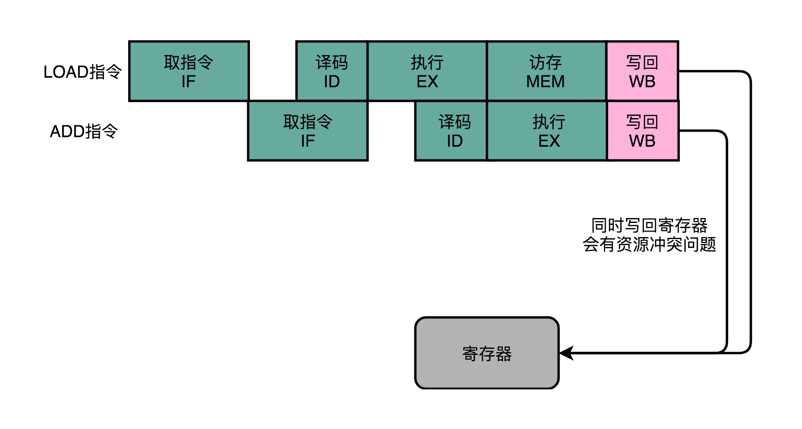

所以，在实践当中，各个指令不需要的阶段，并不会直接跳过，而是会运行一次 NOP 操作。通过插入一个 NOP 操作，我们可以使后一条指令的每一个 Stage，一定不和前一条指令的同 Stage 在一个时钟周期执行。这样，就不会发生先后两个指令，在同一时钟周期竞争相同的资源，产生结构冒险了。


## 流水线里的接力赛：操作数前推

通过 NOP 操作进行对齐，我们在流水线里，就不会遇到资源竞争产生的结构冒险问题了。除了可以解决结构冒险之外，这个 NOP 操作，也是我们之前讲的流水线停顿插入的对应操作。

但是，插入过多的 NOP 操作，意味着我们的 CPU 总是在空转，干吃饭不干活。那么，我们有没有什么办法，尽量少插入一些 NOP 操作呢？不要着急，下面我们就以两条先后发生的 ADD 指令作为例子，看看能不能找到一些好的解决方案。

```c++
add $t0, $s2,$s1
add $s2, $s1,$t0
```

这两条指令很简单。

1. 第一条指令，把 s1 和 s2 寄存器里面的数据相加，存入到 t0 这个寄存器里面。
2. 第二条指令，把 s1 和 t0 寄存器里面的数据相加，存入到 s2 这个寄存器里面。

因为后一条的 add 指令，依赖寄存器 t0 里的值。而 t0 里面的值，又来自于前一条指令的计算结果。所以后一条指令，需要等待前一条指令的数据写回阶段完成之后，才能执行。就像上一讲里讲的那样，我们遇到了一个数据依赖类型的冒险。于是，我们就不得不通过流水线停顿来解决这个冒险问题。我们要在第二条指令的译码阶段之后，插入对应的 NOP 指令，直到前一条指令的数据写回完成之后，才能继续执行。

这样的方案，虽然解决了数据冒险的问题，但是也浪费了两个时钟周期。我们的第 2 条指令，其实就是多花了 2 个时钟周期，运行了两次空转的 NOP 操作。


不过，其实我们第二条指令的执行，未必要等待第一条指令写回完成，才能进行。如果我们第一条指令的执行结果，能够直接传输给第二条指令的执行阶段，作为输入，那我们的第二条指令，就不用再从寄存器里面，把数据再单独读出来一次，才来执行代码。

我们完全可以在第一条指令的执行阶段完成之后，直接将结果数据传输给到下一条指令的 ALU。然后，下一条指令不需要再插入两个 NOP 阶段，就可以继续正常走到执行阶段。


这样的解决方案，我们就叫作**操作数前推**（Operand Forwarding），或者操作数旁路（Operand Bypassing）。其实我觉得，更合适的名字应该叫**操作数转发**。这里的 Forward，其实就是我们写 Email 时的“转发”（Forward）的意思。不过现有的经典教材的中文翻译一般都叫“前推”，我们也就不去纠正这个说法了，你明白这个意思就好。

转发，其实是这个技术的**逻辑含义**，也就是在第 1 条指令的执行结果，直接“转发”给了第 2 条指令的 ALU 作为输入。另外一个名字，旁路（Bypassing），则是这个技术的**硬件含义**。为了能够实现这里的“转发”，我们在 CPU 的硬件里面，需要再单独拉一根信号传输的线路出来，使得 ALU 的计算结果，能够重新回到 ALU 的输入里来。这样的一条线路，就是我们的“旁路”。它越过（Bypass）了写入寄存器，再从寄存器读出的过程，也为我们节省了 2 个时钟周期。

操作数前推的解决方案不但可以单独使用，还可以和流水线冒泡一起使用。有的时候，虽然我们可以把操作数转发到下一条指令，但是下一条指令仍然需要停顿一个时钟周期。

比如说，我们先去执行一条 LOAD 指令，再去执行 ADD 指令。LOAD 指令在访存阶段才能把数据读取出来，所以下一条指令的执行阶段，需要在访存阶段完成之后，才能进行。


总的来说，操作数前推的解决方案，比流水线停顿更进了一步。流水线停顿的方案，有点儿像游泳比赛的接力方式。下一名运动员，需要在前一个运动员游玩了全程之后，触碰到了游泳池壁才能出发。而操作数前推，就好像短跑接力赛。后一个运动员可以提前抢跑，而前一个运动员会多跑一段主动把交接棒传递给他。

## 总结延伸

这一讲，我给你介绍了一个更加高级，也更加复杂的解决数据冒险问题方案，就是操作数前推，或者叫操作数旁路。

操作数前推，就是通过在硬件层面制造一条旁路，让一条指令的计算结果，可以直接传输给下一条指令，而不再需要“指令 1 写回寄存器，指令 2 再读取寄存器“这样多此一举的操作。这样直接传输带来的好处就是，后面的指令可以减少，甚至消除原本需要通过流水线停顿，才能解决的数据冒险问题。

这个前推的解决方案，不仅可以单独使用，还可以和前面讲解过的流水线冒泡结合在一起使用。因为有些时候，我们的操作数前推并不能减少所有“冒泡”，只能去掉其中的一部分。我们仍然需要通过插入一些“气泡”来解决冒险问题。

通过操作数前推，我们进一步提升了 CPU 的运行效率。那么，我们是不是还能找到别的办法，进一步地减少浪费呢？毕竟，看到现在，我们仍然少不了要插入很多 NOP 的“气泡”。那就请你继续坚持学习下去。下一讲，我们来看看，CPU 是怎么通过乱序执行，进一步减少“气泡”的。

<h1 id="chapter24">24 | 冒险和预测（三）：CPU里的“线程池”</h1>

过去两讲，我为你讲解了通过增加资源、停顿等待以及主动转发数据的方式，来解决结构冒险和数据冒险问题。对于结构冒险，由于限制来自于同一时钟周期不同的指令，要访问相同的硬件资源，解决方案是增加资源。对于数据冒险，由于限制来自于数据之间的各种依赖，我们可以提前把数据转发到下一个指令。

但是即便综合运用这三种技术，我们仍然会遇到不得不停下整个流水线，等待前面的指令完成的情况，也就是采用流水线停顿的解决方案。比如说，上一讲里最后给你的例子，即使我们进行了操作数前推，因为第二条加法指令依赖于第一条指令从内存中获取的数据，我们还是要插入一次 NOP 的操作。


那这个时候你就会想了，那我们能不能让后面没有数据依赖的指令，在前面指令停顿的时候先执行呢？

答案当然是可以的。毕竟，流水线停顿的时候，对应的电路闲着也是闲着。那我们完全可以先完成后面指令的执行阶段。

## 填上空闲的 NOP：上菜的顺序不必是点菜的顺序

之前我为你讲解的，无论是流水线停顿，还是操作数前推，归根到底，只要前面指令的特定阶段还没有执行完成，后面的指令就会被“阻塞”住。

但是这个“阻塞”很多时候是没有必要的。因为尽管你的代码生成的指令是顺序的，但是如果后面的指令不需要依赖前面指令的执行结果，完全可以不必等待前面的指令运算完成。

比如说，下面这三行代码。

```c++
a = b + c
d = a * e
x = y * z
```

计算里面的 x ，却要等待 a 和 d 都计算完成，实在没啥必要。所以我们完全可以在 d 的计算等待 a 的计算的过程中，先把 x 的结果给算出来。

在流水线里，后面的指令不依赖前面的指令，那就不用等待前面的指令执行，它完全可以先执行。


可以看到，因为第三条指令并不依赖于前两条指令的计算结果，所以在第二条指令等待第一条指令的访存和写回阶段的时候，第三条指令就已经执行完成了。

这就好比你开了一家餐馆，顾客会排队来点菜。餐馆的厨房里会有洗菜、切菜、炒菜、上菜这样的各个步骤。后厨也是按照点菜的顺序开始做菜的。但是不同的菜需要花费的时间和工序可能都有差别。有些菜做起来特别麻烦，特别慢。比如做一道佛跳墙有好几道工序。我们没有必要非要等先点的佛跳墙上菜了，再开始做后面的炒鸡蛋。只要有厨子空出来了，就可以先动手做前面的简单菜，先给客户端上去。

这样的解决方案，在计算机组成里面，被称为**乱序执行**（Out-of-Order Execution，OoOE）。乱序执行，最早来自于著名的 IBM 360。相信你一定听说过《人月神话》这本软件工程届的经典著作，它讲的就是 IBM 360 开发过程中的“人生体会”。而 IBM 360 困难的开发过程，也少不了第一次引入乱序执行这个新的 CPU 技术。

## CPU 里的“线程池”：理解乱序执行

那么，我们的 CPU 怎样才能实现乱序执行呢？是不是像玩俄罗斯方块一样，把后面的指令，找一个前面的坑填进去就行了？事情并没有这么简单。其实，从今天软件开发的维度来思考，乱序执行好像是在指令的执行阶段，引入了一个“线程池”。我们下面就来看一看，在 CPU 里，乱序执行的过程究竟是怎样的。

使用乱序执行技术后，CPU 里的流水线就和我之前给你看的 5 级流水线不太一样了。我们一起来看一看下面这张图。


1. 在取指令和指令译码的时候，乱序执行的 CPU 和其他使用流水线架构的 CPU 是一样的。它会一级一级顺序地进行取指令和指令译码的工作。
2. 在指令译码完成之后，就不一样了。CPU 不会直接进行指令执行，而是进行一次指令分发，把指令发到一个叫作保留站（Reservation Stations）的地方。顾名思义，这个保留站，就像一个火车站一样。发送到车站的指令，就像是一列列的火车。
3. 这些指令不会立刻执行，而要等待它们所依赖的数据，传递给它们之后才会执行。这就好像一列列的火车都要等到乘客来齐了才能出发。
4. 一旦指令依赖的数据来齐了，指令就可以交到后面的功能单元（Function Unit，FU），其实就是 ALU，去执行了。我们有很多功能单元可以并行运行，但是不同的功能单元能够支持执行的指令并不相同。就和我们的铁轨一样，有些从上海北上，可以到北京和哈尔滨；有些是南下的，可以到广州和深圳。
5. 指令执行的阶段完成之后，我们并不能立刻把结果写回到寄存器里面去，而是把结果再存放到一个叫作重排序缓冲区（Re-Order Buffer，ROB）的地方。
6. 在重排序缓冲区里，我们的 CPU 会按照取指令的顺序，对指令的计算结果重新排序。只有排在前面的指令都已经完成了，才会提交指令，完成整个指令的运算结果。
7. 实际的指令的计算结果数据，并不是直接写到内存或者高速缓存里，而是先写入存储缓冲区（Store Buffer 面，最终才会写入到高速缓存和内存里。

可以看到，在乱序执行的情况下，只有 CPU 内部指令的执行层面，可能是“乱序”的。只要我们能在指令的译码阶段正确地分析出指令之间的数据依赖关系，这个“乱序”就只会在互相没有影响的指令之间发生。

即便指令的执行过程中是乱序的，我们在最终指令的计算结果写入到寄存器和内存之前，依然会进行一次排序，以确保所有指令在外部看来仍然是有序完成的。

有了乱序执行，我们重新去执行上面的 3 行代码。

```c++
a = b + c
d = a * e
x = y * z
```

里面的 d 依赖于 a 的计算结果，不会在 a 的计算完成之前执行。但是我们的 CPU 并不会闲着，因为 x = y * z 的指令同样会被分发到保留站里。因为 x 所依赖的 y 和 z 的数据是准备好的， 这里的乘法运算不会等待计算 d，而会先去计算 x 的值。

如果我们只有一个 FU 能够计算乘法，那么这个 FU 并不会因为 d 要等待 a 的计算结果，而被闲置，而是会先被拿去计算 x。

在 x 计算完成之后，d 也等来了 a 的计算结果。这个时候，我们的 FU 就会去计算出 d 的结果。然后在重排序缓冲区里，把对应的计算结果的提交顺序，仍然设置成 a -> d -> x，而计算完成的顺序是 x -> a -> d。

在这整个过程中，整个计算乘法的 FU 都没有闲置，这也意味着我们的 CPU 的吞吐率最大化了。

整个乱序执行技术，就好像在指令的执行阶段提供一个“线程池”。指令不再是顺序执行的，而是根据池里所拥有的资源，以及各个任务是否可以进行执行，进行动态调度。在执行完成之后，又重新把结果在一个队列里面，按照指令的分发顺序重新排序。即使内部是“乱序”的，但是在外部看起来，仍然是井井有条地顺序执行。

乱序执行，极大地提高了 CPU 的运行效率。核心原因是，现代 CPU 的运行速度比访问主内存的速度要快很多。如果完全采用顺序执行的方式，很多时间都会浪费在前面指令等待获取内存数据的时间里。CPU 不得不加入 NOP 操作进行空转。而现代 CPU 的流水线级数也已经相对比较深了，到达了 14 级。这也意味着，同一个时钟周期内并行执行的指令数是很多的。

而乱序执行，以及我们后面要讲的高速缓存，弥补了 CPU 和内存之间的性能差异。同样，也充分利用了较深的流水行带来的并发性，使得我们可以充分利用 CPU 的性能。

## 总结延伸

好了，总结一下。这一讲里，我为你介绍了乱序执行，这个解决流水线阻塞的技术方案。因为数据的依赖关系和指令先后执行的顺序问题，很多时候，流水线不得不“阻塞”在特定的指令上。即使后续别的指令，并不依赖正在执行的指令和阻塞的指令，也不能继续执行。

而乱序执行，则是在指令执行的阶段通过一个类似线程池的保留站，让系统自己去动态调度先执行哪些指令。这个动态调度巧妙地解决了流水线阻塞的问题。指令执行的先后顺序，不再和它们在程序中的顺序有关。我们只要保证不破坏数据依赖就好了。CPU 只要等到在指令结果的最终提交的阶段，再通过重排序的方式，确保指令“实际上”是顺序执行的。

<h1 id="chapter25">25 | 冒险和预测（四）：今天下雨了，明天还会下雨么？</h1>

过去三讲，我主要为你介绍了结构冒险和数据冒险，以及增加资源、流水线停顿、操作数前推、乱序执行，这些解决各种“冒险”的技术方案。

在结构冒险和数据冒险中，你会发现，所有的流水线停顿操作都要从**指令执行阶段**开始。流水线的前两个阶段，也就是取指令（IF）和指令译码（ID）的阶段，是不需要停顿的。CPU 会在流水线里面直接去取下一条指令，然后进行译码。

取指令和指令译码不会需要遇到任何停顿，这是基于一个假设。这个假设就是，所有的指令代码都是顺序加载执行的。不过这个假设，在执行的代码中，一旦遇到 if…else 这样的条件分支，或者 for/while 循环，就会不成立。


我们先来回顾一下，第 6 讲里讲的 cmp 比较指令、jmp 和 jle 这样的条件跳转指令。可以看到，在 jmp 指令发生的时候，CPU 可能会跳转去执行其他指令。jmp 后的那一条指令是否应该顺序加载执行，在流水线里面进行取指令的时候，我们没法知道。要等 jmp 指令执行完成，去更新了 PC 寄存器之后，我们才能知道，是否执行下一条指令，还是跳转到另外一个内存地址，去取别的指令。

这种为了确保能取到正确的指令，而不得不进行等待延迟的情况，就是今天我们要讲的**控制冒险**（Control Harzard）。这也是流水线设计里最后一种冒险。

## 分支预测：今天下雨了，明天还会继续下雨么？

在遇到了控制冒险之后，我们的 CPU 具体会怎么应对呢？除了流水线停顿，等待前面的 jmp 指令执行完成之后，再去取最新的指令，还有什么好办法吗？当然是有的。我们一起来看一看。

## 缩短分支延迟

第一个办法，叫作**缩短分支延迟**。回想一下我们的条件跳转指令，条件跳转指令其实进行了两种电路操作。

第一种，是进行条件比较。这个条件比较，需要的输入是，根据指令的 opcode，就能确认的条件码寄存器。

第二种，是进行实际的跳转，也就是把要跳转的地址信息写入到 PC 寄存器。无论是 opcode，还是对应的条件码寄存器，还是我们跳转的地址，都是在指令译码（ID）的阶段就能获得的。而对应的条件码比较的电路，只要是简单的逻辑门电路就可以了，并不需要一个完整而复杂的 ALU。

所以，我们可以将条件判断、地址跳转，都提前到指令译码阶段进行，而不需要放在指令执行阶段。对应的，我们也要在 CPU 里面设计对应的旁路，在指令译码阶段，就提供对应的判断比较的电路。

这种方式，本质上和前面数据冒险的操作数前推的解决方案类似，就是在硬件电路层面，把一些计算结果更早地反馈到流水线中。这样反馈变得更快了，后面的指令需要等待的时间就变短了。

不过只是改造硬件，并不能彻底解决问题。跳转指令的比较结果，仍然要在指令执行的时候才能知道。在流水线里，第一条指令进行指令译码的时钟周期里，我们其实就要去取下一条指令了。这个时候，我们其实还没有开始指令执行阶段，自然也就不知道比较的结果。

## 分支预测

所以，这个时候，我们就引入了一个新的解决方案，叫作**分支预测**（Branch Prediction）技术，也就是说，让我们的 CPU 来猜一猜，条件跳转后执行的指令，应该是哪一条。

最简单的分支预测技术，叫作“**假装分支不发生**”。顾名思义，自然就是仍然按照顺序，把指令往下执行。其实就是 CPU 预测，条件跳转一定不发生。这样的预测方法，其实也是一种**静态预测**技术。就好像猜硬币的时候，你一直猜正面，会有 50% 的正确率。

如果分支预测是正确的，我们自然赚到了。这个意味着，我们节省下来本来需要停顿下来等待的时间。如果分支预测失败了呢？那我们就把后面已经取出指令已经执行的部分，给丢弃掉。这个丢弃的操作，在流水线里面，叫作 Zap 或者 Flush。CPU 不仅要执行后面的指令，对于这些已经在流水线里面执行到一半的指令，我们还需要做对应的清除操作。比如，清空已经使用的寄存器里面的数据等等，这些清除操作，也有一定的开销。

所以，CPU 需要提供对应的丢弃指令的功能，通过控制信号清除掉已经在流水线中执行的指令。只要对应的清除开销不要太大，我们就是划得来的。


## 动态分支预测

第三个办法，叫作**动态分支预测**。

上面的静态预测策略，看起来比较简单，预测的准确率也许有 50%。但是如果运气不好，可能就会特别差。于是，工程师们就开始思考，我们有没有更好的办法呢？比如，根据之前条件跳转的比较结果来预测，是不是会更准一点？

我们日常生活里，最经常会遇到的预测就是天气预报。如果没有气象台给你天气预报，你想要猜一猜明天是不是下雨，你会怎么办？

有一个简单的策略，就是完全根据今天的天气来猜。如果今天下雨，我们就预测明天下雨。如果今天天晴，就预测明天也不会下雨。这是一个很符合我们日常生活经验的预测。因为一般下雨天，都是连着下几天，不断地间隔地发生“天晴 - 下雨 - 天晴 - 下雨”的情况并不多见。

那么，把这样的实践拿到生活中来是不是有效呢？我在这里给了一张 2019 年 1 月上海的天气情况的表格。


我们用前一天的是不是下雨，直接来预测后一天会不会下雨。这个表格里一共有 31 天，那我们就可以预测 30 次。你可以数一数，按照这种预测方式，我们可以预测正确 23 次，正确率是 76.7%，比随机预测的 50% 要好上不少。

而同样的策略，我们一样可以放在分支预测上。这种策略，我们叫**一级分支预测**（One Level Branch Prediction），或者叫 **1 比特饱和计数**（1-bit saturating counter）。这个方法，其实就是用一个比特，去记录当前分支的比较情况，直接用当前分支的比较情况，来预测下一次分支时候的比较情况。

只用一天下雨，就预测第二天下雨，这个方法还是有些“草率”，我们可以用更多的信息，而不只是一次的分支信息来进行预测。于是，我们可以引入一个**状态机**（State Machine）来做这个事情。

如果连续发生下雨的情况，我们就认为更有可能下雨。之后如果只有一天放晴了，我们仍然认为会下雨。在连续下雨之后，要连续两天放晴，我们才会认为之后会放晴。整个状态机的流转，可以参考我在文稿里放的图。


这个状态机里，我们一共有 4 个状态，所以我们需要 2 个比特来记录对应的状态。这样这整个策略，就可以叫作 **2 比特饱和计数**，或者叫**双模态预测器**（Bimodal Predictor）。

好了，现在你可以用这个策略，再去对照一下上面的天气情况。如果天气的初始状态我们放在“多半放晴”的状态下，我们预测的结果的正确率会是 22 次，也就是 73.3% 的正确率。可以看到，并不是更复杂的算法，效果一定就更好。实际的预测效果，和实际执行的指令高度相关。

## 为什么循环嵌套的改变会影响性能？

说完了分支预测，现在我们先来看一个 Java 程序。

```java
public class BranchPrediction {
    public static void main(String args[]) {        
        long start = System.currentTimeMillis();
        for (int i = 0; i < 100; i++) {
            for (int j = 0; j <1000; j ++) {
                for (int k = 0; k < 10000; k++) {
                }
            }
        }
        long end = System.currentTimeMillis();
        System.out.println("Time spent is " + (end - start));
                
        start = System.currentTimeMillis();
        for (int i = 0; i < 10000; i++) {
            for (int j = 0; j <1000; j ++) {
                for (int k = 0; k < 100; k++) {
                }
            }
        }
        end = System.currentTimeMillis();
        System.out.println("Time spent is " + (end - start) + "ms");
    }
}
```

这是一个简单的三重循环，里面没有任何逻辑代码。我们用两种不同的循环顺序各跑一次。第一次，最外重循环循环了 100 次，第二重循环 1000 次，最内层的循环了 10000 次。第二次，我们把顺序倒过来，最外重循环 10000 次，第二重还是 1000 次，最内层 100 次。

事实上，这段代码在这个专栏一开始的几讲里面，就有同学来提问，想要弄明白这里面的关系。

你可以先猜一猜，这样两次运行，花费的时间是一样的么？结果应该会让你大吃一惊。我们可以看看对应的命令行输出。

```c++
Time spent in first loop is 5ms
Time spent in second loop is 15ms
```

同样循环了十亿次，第一段程序只花了 5 毫秒，而第二段程序则花了 15 毫秒，足足多了 2 倍。

这个差异就来自我们上面说的分支预测。我们在前面讲过，循环其实也是利用 cmp 和 jle 这样先比较后跳转的指令来实现的。如果对 for 循环的汇编代码或者机器代码的实现不太清楚，你可以回头去复习一下第 6 讲。

这里的代码，每一次循环都有一个 cmp 和 jle 指令。每一个 jle 就意味着，要比较条件码寄存器的状态，决定是顺序执行代码，还是要跳转到另外一个地址。也就是说，在每一次循环发生的时候，都会有一次“分支”。


分支预测策略最简单的一个方式，自然是“**假定分支不发生**”。对应到上面的循环代码，就是循环始终会进行下去。在这样的情况下，上面的第一段循环，也就是内层 k 循环 10000 次的代码。每隔 10000 次，才会发生一次预测上的错误。而这样的错误，在第二层 j 的循环发生的次数，是 1000 次。

最外层的 i 的循环是 100 次。每个外层循环一次里面，都会发生 1000 次最内层 k 的循环的预测错误，所以一共会发生 100 × 1000 = 10 万次预测错误。

上面的第二段循环，也就是内存 k 的循环 100 次的代码，则是每 100 次循环，就会发生一次预测错误。这样的错误，在第二层 j 的循环发生的次数，还是 1000 次。最外层 i 的循环是 10000 次，所以一共会发生 1000 × 10000 = 1000 万次预测错误。

到这里，相信你能猜到为什么同样空转次数相同的循环代码，第一段代码运行的时间要少得多了。因为第一段代码发生“分支预测”错误的情况比较少，更多的计算机指令，在流水线里顺序运行下去了，而不需要把运行到一半的指令丢弃掉，再去重新加载新的指令执行。

## 总结延伸

好了，这一讲，我给你讲解了什么是控制冒险，以及应对控制冒险的三个方式。

第一种方案，类似我们的操作数前推，其实是在改造我们的 CPU 功能，通过增加对应的电路的方式，来缩短分支带来的延迟。另外两种解决方案，无论是“假装分支不发生”，还是“动态分支预测”，其实都是在进行“分支预测”。只是，“假装分支不发生”是一种简单的静态预测方案而已。

在动态分支预测技术里，我给你介绍了一级分支预测，或者叫 1 比特饱和计数的方法。其实就是认为，预测结果和上一次的条件跳转是一致的。在此基础上，我还介绍了利用更多信息的，就是 2 比特饱和计数，或者叫双模态预测器的方法。这个方法其实也只是通过一个状态机，多看了一步过去的跳转比较结果。

这个方法虽然简单，但是却非常有效。在 SPEC 89 版本的测试当中，使用这样的饱和计数方法，预测的准确率能够高达 93.5%。Intel 的 CPU，一直到 Pentium 时代，在还没有使用 MMX 指令集的时候，用的就是这种分支预测方式。

这一讲的最后，我给你看了一个有意思的例子。通过交换内外循环的顺序，我们体验了一把控制冒险导致的性能差异。虽然执行的指令数是一样的，但是分支预测失败得多的程序，性能就要差上几倍。

<h1 id="chapter26">26 | Superscalar和VLIW：如何让CPU的吞吐率超过1？</h1>

程序的 CPU 执行时间 = 指令数 × CPI × Clock Cycle Time

这个公式里，有一个叫 CPI 的指标。我们知道，CPI 的倒数，又叫作 IPC（Instruction Per Clock），也就是一个时钟周期里面能够执行的指令数，代表了 CPU 的吞吐率。那么，这个指标，放在我们前面几节反复优化流水线架构的 CPU 里，能达到多少呢？

答案是，最佳情况下，IPC 也只能到 1。因为无论做了哪些流水线层面的优化，即使做到了指令执行层面的乱序执行，CPU 仍然只能在一个时钟周期里面，取一条指令。


这说明，无论指令后续能优化得多好，一个时钟周期也只能执行完这样一条指令，IPC 只能是 1。但是，我们现在用的 Intel CPU 或者 ARM 的 CPU，一般的 IPC 都能做到 2 以上，这是怎么做到的呢？

## 多发射与超标量：同一实践执行的两条指令

之前讲 CPU 的硬件组成的时候，我们把所有算术和逻辑运算都抽象出来，变成了一个 ALU 这样的“黑盒子”。你应该还记得第 13 讲到第 16 讲，关于加法器、乘法器、乃至浮点数计算的部分，其实整数的计算和浮点数的计算过程差异还是不小的。实际上，整数和浮点数计算的电路，在 CPU 层面也是分开的。

一直到 80386，我们的 CPU 都是没有专门的浮点数计算的电路的。当时的浮点数计算，都是用软件进行模拟的。所以，在 80386 时代，Intel 给 386 配了单独的 387 芯片，专门用来做浮点数运算。那个时候，你买 386 芯片的话，会有 386sx 和 386dx 这两种芯片可以选择。386dx 就是带了 387 浮点数计算芯片的，而 sx 就是不带浮点数计算芯片的。

其实，我们现在用的 Intel CPU 芯片也是一样的。虽然浮点数计算已经变成 CPU 里的一部分，但并不是所有计算功能都在一个 ALU 里面，真实的情况是，我们会有多个 ALU。这也是为什么，在第 24 讲讲乱序执行的时候，你会看到，其实指令的执行阶段，是由很多个功能单元（FU）并行（Parallel）进行的。

不过，在指令乱序执行的过程中，我们的取指令（IF）和指令译码（ID）部分并不是并行进行的。

既然指令的执行层面可以并行进行，为什么取指令和指令译码不行呢？如果想要实现并行，该怎么办呢？

其实只要我们把取指令和指令译码，也一样通过增加硬件的方式，并行进行就好了。我们可以一次性从内存里面取出多条指令，然后分发给多个并行的指令译码器，进行译码，然后对应交给不同的功能单元去处理。这样，我们在一个时钟周期里，能够完成的指令就不只一条了。IPC 也就能做到大于 1 了。


这种 CPU 设计，我们叫作**多发射**（Mulitple Issue）和**超标量**（Superscalar）。

什么叫多发射呢？这个词听起来很抽象，其实它意思就是说，我们同一个时间，可能会同时把多条指令发射（Issue）到不同的译码器或者后续处理的流水线中去。

在超标量的 CPU 里面，有很多条并行的流水线，而不是只有一条流水线。“超标量“这个词是说，本来我们在一个时钟周期里面，只能执行一个标量（Scalar）的运算。在多发射的情况下，我们就能够超越这个限制，同时进行多次计算。


你可以看我画的这个超标量设计的流水线示意图。仔细看，你应该能看到一个有意思的现象，每一个功能单元的流水线的长度是不同的。事实上，不同的功能单元的流水线长度本来就不一样。我们平时所说的 14 级流水线，指的通常是进行整数计算指令的流水线长度。如果是浮点数运算，实际的流水线长度则会更长一些。

## Intel 的失败之作：安腾的超长指令字设计

无论是之前几讲里讲的乱序执行，还是现在更进一步的超标量技术，在实际的硬件层面，其实实施起来都挺麻烦的。这是因为，在乱序执行和超标量的体系里面，我们的 CPU 要解决依赖冲突的问题。这也就是前面几讲我们讲的冒险问题。

CPU 需要在指令执行之前，去判断指令之间是否有依赖关系。如果有对应的依赖关系，指令就不能分发到执行阶段。因为这样，上面我们所说的超标量 CPU 的多发射功能，又被称为**动态多发射处理器**。这些对于依赖关系的检测，都会使得我们的 CPU 电路变得更加复杂。

于是，计算机科学家和工程师们就又有了一个大胆的想法。我们能不能不把分析和解决依赖关系的事情，放在硬件里面，而是放到软件里面来干呢？

我们就来看看一个非常大胆的 CPU 设计想法，叫作超长指令字设计（Very Long Instruction Word，VLIW）。这个设计呢，不仅想让编译器来优化指令数，还想直接通过编译器，来优化 CPI。

围绕着这个设计的，是 Intel 一个著名的“史诗级”失败，也就是著名的 IA-64 架构的安腾（Itanium）处理器。只不过，这一次，责任不全在 Intel，还要拉上可以称之为硅谷起源的另一家公司，也就是惠普。

之所以称为“史诗”级失败，这个说法来源于惠普最早给这个架构取的名字，**显式并发指令运算**（Explicitly Parallel Instruction Computer），这个名字的缩写 **EPIC**，正好是“史诗”的意思。

好巧不巧，安腾处理器和和我之前给你介绍过的 Pentium 4 一样，在市场上是一个失败的产品。在经历了 12 年之久的设计研发之后，安腾一代只卖出了几千套。而安腾二代，在从 2002 年开始反复挣扎了 16 年之后，最终在 2018 年被 Intel 宣告放弃，退出了市场。自此，世上再也没有这个“史诗”服务器了。

那么，我们就来看看，这个超长指令字的安腾处理器是怎么回事儿。

在乱序执行和超标量的 CPU 架构里，指令的前后依赖关系，是由 CPU 内部的硬件电路来检测的。而到了**超长指令字**的架构里面，这个工作交给了编译器这个软件。


我从专栏第 5 讲开始，就给你看了不少 C 代码到汇编代码和机器代码的对照。编译器在这个过程中，其实也能够知道前后数据的依赖。于是，我们可以让编译器把没有依赖关系的代码位置进行交换。然后，再把多条连续的指令打包成一个指令包。安腾的 CPU 就是把 3 条指令变成一个指令包。


CPU 在运行的时候，不再是取一条指令，而是取出一个指令包。然后，译码解析整个指令包，解析出 3 条指令直接并行运行。可以看到，使用**超长指令字**架构的 CPU，同样是采用流水线架构的。也就是说，一组（Group）指令，仍然要经历多个时钟周期。同样的，下一组指令并不是等上一组指令执行完成之后再执行，而是在上一组指令的指令译码阶段，就开始取指令了。

值得注意的一点是，流水线停顿这件事情在**超长指令字**里面，很多时候也是由编译器来做的。除了停下整个处理器流水线，**超长指令字**的 CPU 不能在某个时钟周期停顿一下，等待前面依赖的操作执行完成。编译器需要在适当的位置插入 NOP 操作，直接在编译出来的机器码里面，就把流水线停顿这个事情在软件层面就安排妥当。

虽然安腾的设想很美好，Intel 也曾经希望能够让安腾架构成为替代 x86 的新一代架构，但是最终安腾还是在前前后后折腾将近 30 年后失败了。2018 年，Intel 宣告安腾 9500 会在 2021 年停止供货。

安腾失败的原因有很多，其中有一个重要的原因就是“向前兼容”。

一方面，安腾处理器的指令集和 x86 是不同的。这就意味着，原来 x86 上的所有程序是没有办法在安腾上运行的，而需要通过编译器重新编译才行。

另一方面，安腾处理器的 VLIW 架构决定了，如果安腾需要提升并行度，就需要增加一个指令包里包含的指令数量，比方说从 3 个变成 6 个。一旦这么做了，虽然同样是 VLIW 架构，同样指令集的安腾 CPU，程序也需要重新编译。因为原来编译器判断的依赖关系是在 3 个指令以及由 3 个指令组成的指令包之间，现在要变成 6 个指令和 6 个指令组成的指令包。编译器需要重新编译，交换指令顺序以及 NOP 操作，才能满足条件。甚至，我们需要重新来写编译器，才能让程序在新的 CPU 上跑起来。

于是，安腾就变成了一个既不容易向前兼容，又不容易向后兼容的 CPU。那么，它的失败也就不足为奇了。

可以看到，技术思路上的先进想法，在实际的业界应用上会遇到更多具体的实践考验。无论是指令集向前兼容性，还是对应 CPU 未来的扩展，在设计的时候，都需要更多地去考虑实践因素。

## 总结延伸

超标量可以让 CPU 不仅在指令执行阶段是并行的，在取指令和指令译码的时候，也是并行的。通过超标量技术，可以使得你所使用的 CPU 的 IPC 超过 1。

超标量技术和你之前看到的其他流水线技术一样，依赖于在硬件层面，能够检测到对应的指令的先后依赖关系，解决“冒险”问题。所以，它也使得 CPU 的电路变得更复杂了。

因为这些复杂性，惠普和 Intel 又共同推出了著名的安腾处理器。通过在编译器层面，直接分析出指令的前后依赖关系。于是，硬件在代码编译之后，就可以直接拿到调换好先后顺序的指令。并且这些指令中，可以并行执行的部分，会打包在一起组成一个指令包。安腾处理器在取指令和指令译码的时候，拿到的不再是单个指令，而是这样一个指令包。并且在指令执行阶段，可以并行执行指令包里所有的指令。

虽然看起来，VLIW 在技术层面更具有颠覆性，不仅仅只是一个硬件层面的改造，而且利用了软件层面的编译器，来组合解决提升 CPU 指令吞吐率的问题。然而，最终 VLIW 却没有得到市场和业界的认可。

<h1 id="chapter27">27 | SIMD：如何加速矩阵乘法？</h1>

**超线程**（Hyper-Threading）技术，以及可能没有那么熟悉的**单指令多数据流**（SIMD）技术。

## 超线程：Intel 多卖给你的那一倍 CPU

Pentium 4 失败的一个重要原因，就是它的 CPU 的流水线级数太深了。早期的 Pentium 4 的流水线深度高达 20 级，而后期的代号为 Prescott 的 Pentium 4 的流水线级数，更是到了 31 级。超长的流水线，使得之前我们讲的很多解决“冒险”、提升并发的方案都用不上。

因为这些解决“冒险”、提升并发的方案，本质上都是一种指令级并行（Instruction-level parallelism，简称 IPL）的技术方案。换句话说就是，CPU 想要在同一个时间，去并行地执行两条指令。而这两条指令呢，原本在我们的代码里，是有先后顺序的。无论是我们在流水线里面讲到的流水线架构、分支预测以及乱序执行，还是我们在上一讲说的超标量和超长指令字，都是想要通过同一时间执行两条指令，来提升 CPU 的吞吐率。

然而在 Pentium 4 这个 CPU 上，这些方法都可能因为流水线太深，而起不到效果。我之前讲过，更深的流水线意味着同时在流水线里面的指令就多，相互的依赖关系就多。于是，很多时候我们不得不把流水线停顿下来，插入很多 NOP 操作，来解决这些依赖带来的“冒险”问题。

不知道是不是因为当时面临的竞争太激烈了，为了让 Pentium 4 的 CPU 在性能上更有竞争力一点，2002 年底，Intel 在的 3.06GHz 主频的 Pentium 4 CPU 上，第一次引入了**超线程**（Hyper-Threading）技术。

什么是超线程技术呢？Intel 想，既然 CPU 同时运行那些在代码层面有前后依赖关系的指令，会遇到各种冒险问题，我们不如去找一些和这些指令完全独立，没有依赖关系的指令来运行好了。那么，这样的指令哪里来呢？自然同时运行在另外一个程序里了。

你所用的计算机，其实同一个时间可以运行很多个程序。比如，我现在一边在浏览器里写这篇文章，后台同样运行着一个 Python 脚本程序。而这两个程序，是完全相互独立的。它们两个的指令完全并行运行，而不会产生依赖问题带来的“冒险”。

然而这个时候，你可能就会觉得奇怪了，这么做似乎不需要什么新技术呀。现在我们用的 CPU 都是多核的，本来就可以用多个不同的 CPU 核心，去运行不同的任务。即使当时的 Pentium 4 是单核的，我们的计算机本来也能同时运行多个进程，或者多个线程。这个超线程技术有什么特别的用处呢？

无论是上面说的多个 CPU 核心运行不同的程序，还是在单个 CPU 核心里面切换运行不同线程的任务，在同一时间点上，一个物理的 CPU 核心只会运行一个线程的指令，所以其实我们并没有真正地做到指令的并行运行。


线程可不是这样。超线程的 CPU，其实是把一个物理层面 CPU 核心，“伪装”成两个逻辑层面的 CPU 核心。这个 CPU，会在硬件层面增加很多电路，使得我们可以在一个 CPU 核心内部，维护两个不同线程的指令的状态信息。

比如，在一个物理 CPU 核心内部，会有双份的 PC 寄存器、指令寄存器乃至条件码寄存器。这样，这个 CPU 核心就可以维护两条并行的指令的状态。在外面看起来，似乎有两个逻辑层面的 CPU 在同时运行。所以，超线程技术一般也被叫作**同时多线程**（Simultaneous Multi-Threading，简称 SMT）技术。

不过，在 CPU 的其他功能组件上，Intel 可不会提供双份。无论是指令译码器还是 ALU，一个 CPU 核心仍然只有一份。因为超线程并不是真的去同时运行两个指令，那就真的变成物理多核了。超线程的目的，是在一个线程 A 的指令，在流水线里停顿的时候，让另外一个线程去执行指令。因为这个时候，CPU 的译码器和 ALU 就空出来了，那么另外一个线程 B，就可以拿来干自己需要的事情。这个线程 B 可没有对于线程 A 里面指令的关联和依赖。

这样，CPU 通过很小的代价，就能实现“同时”运行多个线程的效果。通常我们只要在 CPU 核心的添加 10% 左右的逻辑功能，增加可以忽略不计的晶体管数量，就能做到这一点。

不过，你也看到了，我们并没有增加真的功能单元。所以超线程只在特定的应用场景下效果比较好。一般是在那些各个线程“等待”时间比较长的应用场景下。比如，我们需要应对很多请求的数据库应用，就很适合使用超线程。各个指令都要等待访问内存数据，但是并不需要做太多计算。

于是，我们就可以利用好超线程。我们的 CPU 计算并没有跑满，但是往往当前的指令要停顿在流水线上，等待内存里面的数据返回。这个时候，让 CPU 里的各个功能单元，去处理另外一个数据库连接的查询请求就是一个很好的应用案例。


我这里放了一张我的电脑里运行 CPU-Z 的截图。你可以看到，在右下角里，我的 CPU 的 Cores，被标明了是 4，而 Threads，则是 8。这说明我手头的这个 CPU，只有 4 个物理的 CPU 核心，也就是所谓的 4 核 CPU。但是在逻辑层面，它“装作”有 8 个 CPU 核心，可以利用超线程技术，来同时运行 8 条指令。如果你用的是 Windows，可以去下载安装一个CPU-Z来看看你手头的 CPU 里面对应的参数。

## SIMD：如何加速矩阵乘法？

在上面的 CPU 信息的图里面，你会看到，中间有一组信息叫作 Instructions，里面写了有 MMX、SSE 等等。这些信息就是这个 CPU 所支持的指令集。这里的 MMX 和 SSE 的指令集，也就引出了我要给你讲的最后一个提升 CPU 性能的技术方案，**SIMD**，中文叫作**单指令多数据流**（Single Instruction Multiple Data）。

我们先来体会一下 SIMD 的性能到底怎么样。下面是两段示例程序，一段呢，是通过循环的方式，给一个 list 里面的每一个数加 1。另一段呢，是实现相同的功能，但是直接调用 NumPy 这个库的 add 方法。在统计两段程序的性能的时候，我直接调用了 Python 里面的 timeit 的库。

```py
$ python
>>> import numpy as np
>>> import timeit
>>> a = list(range(1000))
>>> b = np.array(range(1000))
>>> timeit.timeit("[i + 1 for i in a]", setup="from __main__ import a", number=1000000)
32.82800309999993
>>> timeit.timeit("np.add(1, b)", setup="from __main__ import np, b", number=1000000)
0.9787889999997788
>>>
```

从两段程序的输出结果来看，你会发现，两个功能相同的代码性能有着巨大的差异，足足差出了 30 多倍。也难怪所有用 Python 讲解数据科学的教程里，往往在一开始就告诉你不要使用循环，而要把所有的计算都向量化（Vectorize）。

有些同学可能会猜测，是不是因为 Python 是一门解释性的语言，所以这个性能差异会那么大。第一段程序的循环的每一次操作都需要 Python 解释器来执行，而第二段的函数调用是一次调用编译好的原生代码，所以才会那么快。如果你这么想，不妨试试直接用 C 语言实现一下 1000 个元素的数组里面的每个数加 1。你会发现，即使是 C 语言编译出来的代码，还是远远低于 NumPy。原因就是，NumPy 直接用到了 SIMD 指令，能够并行进行向量的操作。

而前面使用循环来一步一步计算的算法呢，一般被称为 **SISD**，也就是**单指令单数据**（Single Instruction Single Data）的处理方式。如果你手头的是一个多核 CPU 呢，那么它同时处理多个指令的方式可以叫作 **MIMD**，也就是**多指令多数据**（Multiple Instruction Multiple Dataa）。

为什么 SIMD 指令能快那么多呢？这是因为，SIMD 在获取数据和执行指令的时候，都做到了并行。一方面，在从内存里面读取数据的时候，SIMD 是一次性读取多个数据。

就以我们上面的程序为例，数组里面的每一项都是一个 integer，也就是需要 4 Bytes 的内存空间。Intel 在引入 SSE 指令集的时候，在 CPU 里面添上了 8 个 128 Bits 的寄存器。128 Bits 也就是 16 Bytes ，也就是说，一个寄存器一次性可以加载 4 个整数。比起循环分别读取 4 次对应的数据，时间就省下来了。


在数据读取到了之后，在指令的执行层面，SIMD 也是可以并行进行的。4 个整数各自加 1，互相之前完全没有依赖，也就没有冒险问题需要处理。只要 CPU 里有足够多的功能单元，能够同时进行这些计算，这个加法就是 4 路同时并行的，自然也省下了时间。

所以，对于那些在计算层面存在大量“数据并行”（Data Parallelism）的计算中，使用 SIMD 是一个很划算的办法。在这个大量的“数据并行”，其实通常就是实践当中的向量运算或者矩阵运算。在实际的程序开发过程中，过去通常是在进行图片、视频、音频的处理。最近几年则通常是在进行各种机器学习算法的计算。

而基于 SIMD 的向量计算指令，也正是在 Intel 发布 Pentium 处理器的时候，被引入的指令集。当时的指令集叫作 **MMX**，也就是 Matrix Math eXtensions 的缩写，中文名字就是**矩阵数学扩展**。而 Pentium 处理器，也是 CPU 第一次有能力进行多媒体处理。这也正是拜 SIMD 和 MMX 所赐。

从 Pentium 时代开始，我们能在电脑上听 MP3、看 VCD 了，而不用专门去买一块“声霸卡”或者“显霸卡”了。没错，在那之前，在电脑上看 VCD，是需要专门买能够解码 VCD 的硬件插到电脑上去的。而到了今天，通过 GPU 快速发展起来的深度学习技术，也一样受益于 SIMD 这样的指令级并行方案，在后面讲解 GPU 的时候，我们还会遇到它。

## 总结延伸

这一讲，我们讲完了超线程和 SIMD 这两个 CPU 的“并行计算”方案。超线程，其实是一个“线程级并行”的解决方案。它通过让一个物理 CPU 核心，“装作”两个逻辑层面的 CPU 核心，使得 CPU 可以同时运行两个不同线程的指令。虽然，这样的运行仍然有着种种的限制，很多场景下超线程并不一定能带来 CPU 的性能提升。但是 Intel 通过超线程，让使用者有了“占到便宜”的感觉。同样的 4 核心的 CPU，在有些情况下能够发挥出 8 核心 CPU 的作用。而超线程在今天，也已经成为 Intel CPU 的标配了。

而 SIMD 技术，则是一种“指令级并行”的加速方案，或者我们可以说，它是一种“数据并行”的加速方案。在处理向量计算的情况下，同一个向量的不同维度之间的计算是相互独立的。而我们的 CPU 里的寄存器，又能放得下多条数据。于是，我们可以一次性取出多条数据，交给 CPU 并行计算。

正是 SIMD 技术的出现，使得我们在 Pentium 时代的个人 PC，开始有了多媒体运算的能力。可以说，Intel 的 MMX、SSE 指令集，和微软的 Windows 95 这样的图形界面操作系统，推动了 PC 快速进入家庭的历史进程。

<h1 id="chapter28">28 | 异常和中断：程序出错了怎么办？</h1>

## 异常：硬件、系统和应用的组合拳

一提到计算机当中的**异常**（Exception），可能你的第一反应就是 C++ 或者 Java 中的 Exception。不过我们今天讲的，并不是这些软件开发过程中遇到的“软件异常”，而是和硬件、系统相关的“硬件异常”。

当然，“软件异常”和“硬件异常”并不是实际业界使用的专有名词，只是我为了方便给你说明，和 C++、Java 中软件抛出的 Exception 进行的人为区分，你明白这个意思就好。

比如，我们在硬件层面，当加法器进行两个数相加的时候，会遇到算术溢出；或者，你在玩游戏的时候，按下键盘发送了一个信号给到 CPU，CPU 要去执行一个现有流程之外的指令，这也是一个“异常”。

同样，来自软件层面的，比如我们的程序进行系统调用，发起一个读文件的请求。这样应用程序向系统调用发起请求的情况，一样是通过“异常”来实现的。

**关于异常，最有意思的一点就是，它其实是一个硬件和软件组合到一起的处理过程。异常的前半生，也就是异常的发生和捕捉，是在硬件层面完成的。但是异常的后半生，也就是说，异常的处理，其实是由软件来完成的。**

计算机会为每一种可能会发生的异常，分配一个异常代码（Exception Number）。有些教科书会把异常代码叫作中断向量（Interrupt Vector）。异常发生的时候，通常是 CPU 检测到了一个特殊的信号。比如，你按下键盘上的按键，输入设备就会给 CPU 发一个信号。或者，正在执行的指令发生了加法溢出，同样，我们可以有一个进位溢出的信号。这些信号呢，在组成原理里面，我们一般叫作发生了一个事件（Event）。CPU 在检测到事件的时候，其实也就拿到了对应的异常代码。

**这些异常代码里，I/O 发出的信号的异常代码，是由操作系统来分配的，也就是由软件来设定的。而像加法溢出这样的异常代码，则是由 CPU 预先分配好的，也就是由硬件来分配的。这又是另一个软件和硬件共同组合来处理异常的过程。**

拿到异常代码之后，CPU 就会触发异常处理的流程。计算机在内存里，会保留一个异常表（Exception Table）。也有地方，把这个表叫作中断向量表（Interrupt Vector Table），好和上面的中断向量对应起来。这个异常表有点儿像我们在第 10 讲里讲的 GOT 表，存放的是不同的异常代码对应的异常处理程序（Exception Handler）所在的地址。

我们的 CPU 在拿到了异常码之后，会先把当前的程序执行的现场，保存到程序栈里面，然后根据异常码查询，找到对应的异常处理程序，最后把后续指令执行的指挥权，交给这个异常处理程序。


这样“检测异常，拿到异常码，再根据异常码进行查表处理”的模式，在日常开发的过程中是很常见的。


比如说，现在我们日常进行的 Web 或者 App 开发，通常都是前后端分离的。前端的应用，会向后端发起 HTTP 的请求。当后端遇到了异常，通常会给到前端一个对应的错误代码。前端的应用根据这个错误代码，在应用层面去进行错误处理。在不能处理的时候，它会根据错误代码向用户显示错误信息。

```java
public class LastChanceHandler implements Thread.UncaughtExceptionHandler {
    @Override
    public void uncaughtException(Thread t, Throwable e) {
        // do something here - log to file and upload to    server/close resources/delete files...
    }
}

Thread.setDefaultUncaughtExceptionHandler(new LastChanceHandler());
```

再比如说，Java 里面，我们使用一个线程池去运行调度任务的时候，可以指定一个异常处理程序。对于各个线程在执行任务出现的异常情况，我们是通过异常处理程序进行处理，而不是在实际的任务代码里处理。这样，我们就把业务处理代码就和异常处理代码的流程分开了。

## 异常的分类：中断、陷阱、故障和中止

我在前面说了，异常可以由硬件触发，也可以由软件触发。那我们平时会碰到哪些异常呢？下面我们就一起来看看。

1. 第一种异常叫**中断**（Interrupt）。顾名思义，自然就是程序在执行到一半的时候，被打断了。这个打断执行的信号，来自于 CPU 外部的 I/O 设备。你在键盘上按下一个按键，就会对应触发一个相应的信号到达 CPU 里面。CPU 里面某个开关的值发生了变化，也就触发了一个中断类型的异常。
2. 第二种异常叫**陷阱**（Trap）。陷阱，其实是我们程序员“故意“主动触发的异常。就好像你在程序里面打了一个断点，这个断点就是设下的一个"陷阱"。当程序的指令执行到这个位置的时候，就掉到了这个陷阱当中。然后，对应的异常处理程序就会来处理这个"陷阱"当中的猎物。

> 最常见的一类陷阱，发生在我们的应用程序调用系统调用的时候，也就是从程序的用户态切换到内核态的时候。我们在第 3 讲讲 CPU 性能的时候说过，可以用 Linux 下的 time 指令，去查看一个程序运行实际花费的时间，里面有在用户态花费的时间（user time），也有在内核态发生的时间（system time）。

> 我们的应用程序通过系统调用去读取文件、创建进程，其实也是通过触发一次陷阱来进行的。这是因为，我们用户态的应用程序没有权限来做这些事情，需要把对应的流程转交给有权限的异常处理程序来进行。

3. 第三种异常叫**故障**（Fault）。它和陷阱的区别在于，陷阱是我们开发程序的时候刻意触发的异常，而故障通常不是。比如，我们在程序执行的过程中，进行加法计算发生了溢出，其实就是故障类型的异常。这个异常不是我们在开发的时候计划内的，也一样需要有对应的异常处理程序去处理。

故障和陷阱、中断的一个重要区别是，故障在异常程序处理完成之后，仍然回来处理当前的指令，而不是去执行程序中的下一条指令。因为当前的指令因为故障的原因并没有成功执行完成。

4. 最后一种异常叫中止（Abort）。与其说这是一种异常类型，不如说这是故障的一种特殊情况。当 CPU 遇到了故障，但是恢复不过来的时候，程序就不得不中止了。


在这四种异常里，中断异常的信号来自系统外部，而不是在程序自己执行的过程中，所以我们称之为“异步”类型的异常。而陷阱、故障以及中止类型的异常，是在程序执行的过程中发生的，所以我们称之为“同步“类型的异常。

在处理异常的过程当中，无论是异步的中断，还是同步的陷阱和故障，我们都是采用同一套处理流程，也就是上面所说的，“保存现场、异常代码查询、异常处理程序调用“。而中止类型的异常，其实是在故障类型异常的一种特殊情况。当故障发生，但是我们发现没有异常处理程序能够处理这种异常的情况下，程序就不得不进入中止状态，也就是最终会退出当前的程序执行。

## 异常的处理：上下文切换

在实际的异常处理程序执行之前，CPU 需要去做一次“保存现场”的操作。这个保存现场的操作，和我在第 7 讲里讲解函数调用的过程非常相似。

因为切换到异常处理程序的时候，其实就好像是去调用一个异常处理函数。指令的控制权被切换到了另外一个"函数"里面，所以我们自然要把当前正在执行的指令去压栈。这样，我们才能在异常处理程序执行完成之后，重新回到当前的指令继续往下执行。

不过，切换到异常处理程序，比起函数调用，还是要更复杂一些。原因有下面几点。

第一点，因为异常情况往往发生在程序正常执行的预期之外，比如中断、故障发生的时候。所以，除了本来程序压栈要做的事情之外，我们还需要把 CPU 内当前运行程序用到的所有寄存器，都放到栈里面。最典型的就是条件码寄存器里面的内容。

第二点，像陷阱这样的异常，涉及程序指令在用户态和内核态之间的切换。对应压栈的时候，对应的数据是压到内核栈里，而不是程序栈里。

第三点，像故障这样的异常，在异常处理程序执行完成之后。从栈里返回出来，继续执行的不是顺序的下一条指令，而是故障发生的当前指令。因为当前指令因为故障没有正常执行成功，必须重新去执行一次。

所以，对于异常这样的处理流程，不像是顺序执行的指令间的函数调用关系。而是更像两个不同的独立进程之间在 CPU 层面的切换，所以这个过程我们称之为**上下文切换**（Context Switch）。

## 总结延伸

这一讲，我给你讲了计算机里的“异常”处理流程。这里的异常可以分成中断、陷阱、故障、中止这样四种情况。这四种异常，分别对应着 I/O 设备的输入、程序主动触发的状态切换、异常情况下的程序出错以及出错之后无可挽回的退出程序。

当 CPU 遭遇了异常的时候，计算机就需要有相应的应对措施。CPU 会通过“查表法”来解决这个问题。在硬件层面和操作系统层面，各自定义了所有 CPU 可能会遇到的异常代码，并且通过这个异常代码，在异常表里面查询相应的异常处理程序。在捕捉异常的时候，我们的硬件 CPU 在进行相应的操作，而在处理异常层面，则是由作为软件的异常处理程序进行相应的操作。

而在实际处理异常之前，计算机需要先去做一个“保留现场”的操作。有了这个操作，我们才能在异常处理完成之后，重新回到之前执行的指令序列里面来。这个保留现场的操作，和我们之前讲解指令的函数调用很像。但是，因为“异常”和函数调用有一个很大的不同，那就是它的发生时间。函数调用的压栈操作我们在写程序的时候完全能够知道，而“异常”发生的时间却很不确定。所以，“异常”发生的时候，我们称之为发生了一次“上下文切换”（Context Switch）。这个时候，除了普通需要压栈的数据外，计算机还需要把所有寄存器信息都存储到栈里面去。

<h1 id="chapter29">29 | CISC和RISC：为什么手机芯片都是ARM？</h1>

我在第 5 讲讲计算机指令的时候，给你看过 MIPS 体系结构计算机的机器指令格式。MIPS 的指令都是固定的 32 位长度，如果要用一个打孔卡来表示，并不复杂。


第 6 讲的时候，我带你编译了一些简单的 C 语言程序，看了 x86 体系结构下的汇编代码。眼尖的话，你应该能发现，每一条机器码的长度是不一样的。


而 CPU 的指令集里的机器码是固定长度还是可变长度，也就是**复杂指令集**（Complex Instruction Set Computing，简称 CISC）和**精简指令集**（Reduced Instruction Set Computing，简称 RISC）这两种风格的指令集一个最重要的差别。那今天我们就来看复杂指令集和精简指令集之间的对比、差异以及历史纠葛。

## CISC VS RISC：历史的车轮不总是向前的

在计算机历史的早期，其实没有什么 CISC 和 RISC 之分。或者说，所有的 CPU 其实都是 CISC。

虽然冯·诺依曼高屋建瓴地提出了存储程序型计算机的基础架构，但是实际的计算机设计和制造还是严格受硬件层面的限制。当时的计算机很慢，存储空间也很小。《人月神话》这本软件工程界的名著，讲的是花了好几年设计 IBM 360 这台计算机的经验。IBM 360 的最低配置，每秒只能运行 34500 条指令，只有 8K 的内存。为了让计算机能够做尽量多的工作，每一个字节乃至每一个比特都特别重要。

所以，CPU 指令集的设计，需要仔细考虑硬件限制。为了性能考虑，很多功能都直接通过硬件电路来完成。为了少用内存，指令的长度也是可变的。就像算法和数据结构里的赫夫曼编码（Huffman coding）一样，常用的指令要短一些，不常用的指令可以长一些。那个时候的计算机，想要用尽可能少的内存空间，存储尽量多的指令。

不过，历史的车轮滚滚向前，计算机的性能越来越好，存储的空间也越来越大了。到了 70 年代末，RISC 开始登上了历史的舞台。当时，UC Berkeley的大卫·帕特森（David Patterson）教授发现，实际在 CPU 运行的程序里，80% 的时间都是在使用 20% 的简单指令。于是，他就提出了 RISC 的理念。自此之后，RISC 类型的 CPU 开始快速蓬勃发展。


RISC 架构的 CPU 究竟是什么样的呢？为什么它能在这么短的时间内受到如此大的追捧？

RISC 架构的 CPU 的想法其实非常直观。既然我们 80% 的时间都在用 20% 的简单指令，那我们能不能只要那 20% 的简单指令就好了呢？答案当然是可以的。因为指令数量多，计算机科学家们在软硬件两方面都受到了很多挑战。

在硬件层面，我们要想支持更多的复杂指令，CPU 里面的电路就要更复杂，设计起来也就更困难。更复杂的电路，在散热和功耗层面，也会带来更大的挑战。在软件层面，支持更多的复杂指令，编译器的优化就变得更困难。毕竟，面向 2000 个指令来优化编译器和面向 500 个指令来优化编译器的困难是完全不同的。

于是，在 RISC 架构里面，CPU 选择把指令“精简”到 20% 的简单指令。而原先的复杂指令，则通过用简单指令组合起来来实现，让软件来实现硬件的功能。这样，CPU 的整个硬件设计就会变得更简单了，在硬件层面提升性能也会变得更容易了。

RISC 的 CPU 里完成指令的电路变得简单了，于是也就腾出了更多的空间。这个空间，常常被拿来放通用寄存器。因为 RISC 完成同样的功能，执行的指令数量要比 CISC 多，所以，如果需要反复从内存里面读取指令或者数据到寄存器里来，那么很多时间就会花在访问内存上。于是，RISC 架构的 CPU 往往就有更多的通用寄存器。

除了寄存器这样的存储空间，RISC 的 CPU 也可以把更多的晶体管，用来实现更好的分支预测等相关功能，进一步去提升 CPU 实际的执行效率。

总的来说，对于 CISC 和 RISC 的对比，我们可以一起回到第 4 讲讲的程序运行时间的公式：

程序的 CPU 执行时间 = 指令数  ×  CPI  ×  Clock Cycle Time

CISC 的架构，其实就是通过优化**指令数**，来减少 CPU 的执行时间。而 RISC 的架构，其实是在优化 CPI。因为指令比较简单，需要的时钟周期就比较少。

因为 RISC 降低了 CPU 硬件的设计和开发难度，所以从 80 年代开始，大部分新的 CPU 都开始采用 RISC 架构。从 IBM 的 PowerPC，到 SUN 的 SPARC，都是 RISC 架构。所有人看到仍然采用 CISC 架构的 Intel CPU，都可以批评一句“Complex and messy”。但是，为什么无论是在 PC 上，还是服务器上，仍然是 Intel 成为最后的赢家呢？

## Intel 的进化：微指令架构的出现

面对这么多负面评价的 Intel，自然也不能无动于衷。更何况，x86 架构的问题并不能说明 Intel 的工程师不够厉害。事实上，在整个 CPU 设计的领域，Intel 集中了大量优秀的人才。无论是成功的 Pentium 时代引入的超标量设计，还是失败的 Pentium 4 时代引入的超线程技术，都是异常精巧的工程实现。

而 x86 架构所面临的种种问题，其实都来自于一个最重要的考量，那就是指令集的向前兼容性。因为 x86 在商业上太成功了，所以市场上有大量的 Intel CPU。而围绕着这些 CPU，又有大量的操作系统、编译器。这些系统软件只支持 x86 的指令集，就比如著名的 Windows 95。而在这些系统软件上，又有各种各样的应用软件。

如果 Intel 要放弃 x86 的架构和指令集，开发一个 RISC 架构的 CPU，面临的第一个问题就是所有这些软件都是不兼容的。事实上，Intel 并非没有尝试过在 x86 之外另起炉灶，这其实就是我在第26 讲介绍的安腾处理器。当时，Intel 想要在 CPU 进入 64 位的时代的时候，丢掉 x86 的历史包袱，所以推出了全新的 IA-64 的架构。但是，却因为不兼容 x86 的指令集，遭遇了重大的失败。

反而是 AMD，趁着 Intel 研发安腾的时候，推出了兼容 32 位 x86 指令集的 64 位架构，也就是 AMD64。如果你现在在 Linux 下安装各种软件包，一定经常会看到像下面这样带有 AMD64 字样的内容。这是因为 x86 下的 64 位的指令集 x86-64，并不是 Intel 发明的，而是 AMD 发明的。

```c++
Get:1 http://archive.ubuntu.com/ubuntu bionic/main amd64 fontconfig amd64 2.12.6-0ubuntu2 [169 kB]
```

花开两朵，各表一枝。Intel 在开发安腾处理器的同时，也在不断借鉴其他 RISC 处理器的设计思想。既然核心问题是要始终向前兼容 x86 的指令集，那么我们能不能不修改指令集，但是让 CISC 风格的指令集，用 RISC 的形式在 CPU 里面运行呢？

于是，从 Pentium Pro 时代开始，Intel 就开始在处理器里引入了**微指令**（Micro-Instructions/Micro-Ops）架构。而微指令架构的引入，也让 CISC 和 RISC 的分界变得模糊了。


在微指令架构的 CPU 里面，编译器编译出来的机器码和汇编代码并没有发生什么变化。但在指令译码的阶段，指令译码器“翻译”出来的，不再是某一条 CPU 指令。译码器会把一条机器码，“**翻译**”成好几条“微指令”。这里的一条条微指令，就不再是 CISC 风格的了，而是变成了固定长度的 RISC 风格的了。

这些 RISC 风格的微指令，会被放到一个微指令缓冲区里面，然后再从缓冲区里面，分发给到后面的超标量，并且是乱序执行的流水线架构里面。不过这个流水线架构里面接受的，就不是复杂的指令，而是精简的指令了。在这个架构里，我们的指令译码器相当于变成了设计模式里的一个“适配器”（Adaptor）。这个适配器，填平了 CISC 和 RISC 之间的指令差异。

不过，凡事有好处就有坏处。这样一个能够把 CISC 的指令译码成 RISC 指令的指令译码器，比原来的指令译码器要复杂。这也就意味着更复杂的电路和更长的译码时间：本来以为可以通过 RISC 提升的性能，结果又有一部分浪费在了指令译码上。针对这个问题，我们有没有更好的办法呢？

我在前面说过，之所以大家认为 RISC 优于 CISC，来自于一个数字统计，那就是在实际的程序运行过程中，有 80% 运行的代码用着 20% 的常用指令。这意味着，CPU 里执行的代码有很强的局部性。而对于有着很强局部性的问题，常见的一个解决方案就是使用缓存。

所以，Intel 就在 CPU 里面加了一层 L0 Cache。这个 Cache 保存的就是指令译码器把 CISC 的指令“翻译”成 RISC 的微指令的结果。于是，在大部分情况下，CPU 都可以从 Cache 里面拿到译码结果，而不需要让译码器去进行实际的译码操作。这样不仅优化了性能，因为译码器的晶体管开关动作变少了，还减少了功耗。

因为“微指令”架构的存在，从 Pentium Pro 开始，Intel 处理器已经不是一个纯粹的 CISC 处理器了。它同样融合了大量 RISC 类型的处理器设计。不过，由于 Intel 本身在 CPU 层面做的大量优化，比如乱序执行、分支预测等相关工作，x86 的 CPU 始终在功耗上还是要远远超过 RISC 架构的 ARM，所以最终在智能手机崛起替代 PC 的时代，落在了 ARM 后面。

## ARM 和 RISC-V：CPU 的现在与未来

2017 年，ARM 公司的 CEO Simon Segards 宣布，ARM 累积销售的芯片数量超过了 1000 亿。作为一个从 12 个人起步，在 80 年代想要获取 Intel 的 80286 架构授权来制造 CPU 的公司，ARM 是如何在移动端把自己的芯片塑造成了最终的霸主呢？

ARM 这个名字现在的含义，是“Advanced RISC Machines”。你从名字就能够看出来，ARM 的芯片是基于 RISC 架构的。不过，ARM 能够在移动端战胜 Intel，并不是因为 RISC 架构。

到了 21 世纪的今天，CISC 和 RISC 架构的分界已经没有那么明显了。Intel 和 AMD 的 CPU 也都是采用译码成 RISC 风格的微指令来运行。而 ARM 的芯片，一条指令同样需要多个时钟周期，有乱序执行和多发射。我甚至看到过这样的评价，“ARM 和 RISC 的关系，只有在名字上”。

ARM 真正能够战胜 Intel，我觉得主要是因为下面这两点原因。

第一点是功耗优先的设计。一个 4 核的 Intel i7 的 CPU，设计的时候功率就是 130W。而一块 ARM A8 的单个核心的 CPU，设计功率只有 2W。两者之间差出了 100 倍。在移动设备上，功耗是一个远比性能更重要的指标，毕竟我们不能随时在身上带个发电机。ARM 的 CPU，主频更低，晶体管更少，高速缓存更小，乱序执行的能力更弱。所有这些，都是为了功耗所做的妥协。

第二点则是低价。ARM 并没有自己垄断 CPU 的生产和制造，只是进行 CPU 设计，然后把对应的知识产权授权出去，让其他的厂商来生产 ARM 架构的 CPU。它甚至还允许这些厂商可以基于 ARM 的架构和指令集，设计属于自己的 CPU。像苹果、三星、华为，它们都是拿到了基于 ARM 体系架构设计和制造 CPU 的授权。ARM 自己只是收取对应的专利授权费用。多个厂商之间的竞争，使得 ARM 的芯片在市场上价格很便宜。所以，尽管 ARM 的芯片的出货量远大于 Intel，但是收入和利润却比不上 Intel。

不过，ARM 并不是开源的。所以，在 ARM 架构逐渐垄断移动端芯片市场的时候，“开源硬件”也慢慢发展起来了。一方面，MIPS 在 2019 年宣布开源；另一方面，从 UC Berkeley 发起的RISC-V项目也越来越受到大家的关注。而 RISC 概念的发明人，图灵奖的得主大卫·帕特森教授从伯克利退休之后，成了 RISC-V 国际开源实验室的负责人，开始推动 RISC-V 这个“CPU 届的 Linux”的开发。可以想见，未来的开源 CPU，也多半会像 Linux 一样，逐渐成为一个业界的主流选择。如果想要“打造一个属于自己 CPU”，不可不关注这个项目。

## 总结延伸

这一讲，我从 RISC 和 CISC 架构之前的差异说起，讲到 RISC 的指令是固定长度的，CISC 的指令是可变长度的。RISC 的指令集里的指令数少，而且单个指令只完成简单的功能，所以被称为“精简”。CISC 里的指令数多，为了节约内存，直接在硬件层面能够完成复杂的功能，所以被称为“复杂”。RISC 的通过减少 CPI 来提升性能，而 CISC 通过减少需要的指令数来提升性能。

然后，我们进一步介绍了 Intel 的 x86 CPU 的“微指令”的设计思路。“微指令”使得我们在机器码层面保留了 CISC 风格的 x86 架构的指令集。但是，通过指令译码器和 L0 缓存的组合，使得这些指令可以快速翻译成 RISC 风格的微指令，使得实际执行指令的流水线可以用 RISC 的架构来搭建。使用“微指令”设计思路的 CPU，不能再称之为 CISC 了，而更像一个 RISC 和 CISC 融合的产物。

过去十年里，Intel 仍然把持着 PC 和服务器市场，但是更多的市场上的 CPU 芯片来自基于 ARM 架构的智能手机了。而在 ARM 似乎已经垄断了移动 CPU 市场的时候，开源的 RISC-V 出现了，也给了计算机工程师们新的设计属于自己的 CPU 的机会。

<h1 id="chapter30">30 | GPU（上）：为什么玩游戏需要使用GPU？</h1>

讲完了 CPU，我带你一起来看一看计算机里的另外一个处理器，也就是被称之为 GPU 的图形处理器。过去几年里，因为深度学习的大发展，GPU 一下子火起来了，似乎 GPU 成了一个专为深度学习而设计的处理器。那 GPU 的架构究竟是怎么回事儿呢？它最早是用来做什么而被设计出来的呢？

想要理解 GPU 的设计，我们就要从 GPU 的老本行图形处理说起。因为图形处理才是 GPU 设计用来做的事情。只有了解了图形处理的流程，我们才能搞明白，为什么 GPU 要设计成现在这样；为什么在深度学习上，GPU 比起 CPU 有那么大的优势。

## GPU 的历史进程

GPU 是随着我们开始在计算机里面需要渲染三维图形的出现，而发展起来的设备。图形渲染和设备的先驱，第一个要算是 SGI（Silicon Graphics Inc.）这家公司。SGI 的名字翻译成中文就是“硅谷图形公司”。这家公司从 80 年代起就开发了很多基于 Unix 操作系统的工作站。它的创始人 Jim Clark 是斯坦福的教授，也是图形学的专家。

后来，他也是网景公司（Netscape）的创始人之一。而 Netscape，就是那个曾经和 IE 大战 300 回合的浏览器公司，虽然最终败在微软的 Windows 免费捆绑 IE 的策略下，但是也留下了 Firefox 这个完全由开源基金会管理的浏览器。不过这个都是后话了。

到了 90 年代中期，随着个人电脑的性能越来越好，PC 游戏玩家们开始有了“3D 显卡”的需求。那个时代之前的 3D 游戏，其实都是伪 3D。比如，大神卡马克开发的著名Wolfenstein 3D（德军总部 3D），从不同视角看到的是 8 幅不同的贴图，实际上并不是通过图形学绘制渲染出来的多边形。

这样的情况下，游戏玩家的视角旋转个 10 度，看到的画面并没有变化。但是如果转了 45 度，看到的画面就变成了另外一幅图片。而如果我们能实时渲染基于多边形的 3D 画面的话，那么任何一点点的视角变化，都会实时在画面里面体现出来，就好像你在真实世界里面看到的一样。

而在 90 年代中期，随着硬件和技术的进步，我们终于可以在 PC 上用硬件直接实时渲染多边形了。“真 3D”游戏开始登上历史舞台了。“古墓丽影”“最终幻想 7”，这些游戏都是在那个时代诞生的。当时，很多国内的计算机爱好者梦寐以求的，是一块 Voodoo  FX 的显卡。

那为什么 CPU 的性能已经大幅度提升了，但是我们还需要单独的 GPU 呢？想要了解这个问题，我们先来看一看三维图像实际通过计算机渲染出来的流程。

## 图形渲染的流程

现在我们电脑里面显示出来的 3D 的画面，其实是通过多边形组合出来的。你可以看看下面这张图，你在玩的各种游戏，里面的人物的脸，并不是那个相机或者摄像头拍出来的，而是通过多边形建模（Polygon Modeling）创建出来的。


而实际这些人物在画面里面的移动、动作，乃至根据光线发生的变化，都是通过计算机根据图形学的各种计算，实时渲染出来的。

这个对于图像进行实时渲染的过程，可以被分解成下面这样 5 个步骤：

1. 顶点处理（Vertex Processing）
2. 图元处理（Primitive Processing）
3. 栅格化（Rasterization）
4. 片段处理（Fragment Processing）
5. 像素操作（Pixel Operations）

## 顶点处理

图形渲染的第一步是顶点处理。构成多边形建模的每一个多边形呢，都有多个顶点（Vertex）。这些顶点都有一个在三维空间里的坐标。但是我们的屏幕是二维的，所以在确定当前视角的时候，我们需要把这些顶点在三维空间里面的位置，转化到屏幕这个二维空间里面。这个转换的操作，就被叫作顶点处理。

如果你稍微学过一点图形学的话，应该知道，这样的转化都是通过线性代数的计算来进行的。可以想见，我们的建模越精细，需要转换的顶点数量就越多，计算量就越大。**而且，这里面每一个顶点位置的转换，互相之间没有依赖，是可以并行独立计算的**。


## 图元处理

在顶点处理完成之后呢，我们需要开始进行第二步，也就是图元处理。图元处理，其实就是要把顶点处理完成之后的各个顶点连起来，变成多边形。其实转化后的顶点，仍然是在一个三维空间里，只是第三维的 Z 轴，是正对屏幕的“深度”。所以我们针对这些多边形，需要做一个操作，叫剔除和裁剪（Cull and Clip），也就是把不在屏幕里面，或者一部分不在屏幕里面的内容给去掉，减少接下来流程的工作量。


## 栅格化

在图元处理完成之后呢，渲染还远远没有完成。我们的屏幕分辨率是有限的。它一般是通过一个个“像素（Pixel）”来显示出内容的。所以，对于做完图元处理的多边形，我们要开始进行第三步操作。这个操作就是把它们转换成屏幕里面的一个个像素点。这个操作呢，就叫作栅格化。**这个栅格化操作，有一个特点和上面的顶点处理是一样的，就是每一个图元都可以并行独立地栅格化。**


## 片段处理

在栅格化变成了像素点之后，我们的图还是“黑白”的。我们还需要计算每一个像素的颜色、透明度等信息，给像素点上色。这步操作，就是片段处理。**这步操作，同样也可以每个片段并行、独立进行，和上面的顶点处理和栅格化一样。**


## 像素操作

最后一步呢，我们就要把不同的多边形的像素点“混合（Blending）”到一起。可能前面的多边形可能是半透明的，那么前后的颜色就要混合在一起变成一个新的颜色；或者前面的多边形遮挡住了后面的多边形，那么我们只要显示前面多边形的颜色就好了。最终，输出到显示设备。


经过这完整的 5 个步骤之后，我们就完成了从三维空间里的数据的渲染，变成屏幕上你可以看到的 3D 动画了。这样 5 个步骤的渲染流程呢，一般也被称之为**图形流水线**（Graphic Pipeline）。这个名字和我们讲解 CPU 里面的流水线非常相似，都叫 **Pipeline**。


## 解放图形渲染的 GPU

我们可以想一想，如果用 CPU 来进行这个渲染过程，需要花上多少资源呢？我们可以通过一些数据来做个粗略的估算。

在上世纪 90 年代的时候，屏幕的分辨率还没有现在那么高。一般的 CRT 显示器也就是 640×480 的分辨率。这意味着屏幕上有 30 万个像素需要渲染。为了让我们的眼睛看到画面不晕眩，我们希望画面能有 60 帧。于是，每秒我们就要重新渲染 60 次这个画面。也就是说，每秒我们需要完成 1800 万次单个像素的渲染。从栅格化开始，每个像素有 3 个流水线步骤，即使每次步骤只有 1 个指令，那我们也需要 5400 万条指令，也就是 54M 条指令。

90 年代的 CPU 的性能是多少呢？93 年出货的第一代 Pentium 处理器，主频是 60MHz，后续逐步推出了 66MHz、75MHz、100MHz 的处理器。以这个性能来看，用 CPU 来渲染 3D 图形，基本上就要把 CPU 的性能用完了。因为实际的每一个渲染步骤可能不止一个指令，我们的 CPU 可能根本就跑不动这样的三维图形渲染。

也就是在这个时候，Voodoo FX 这样的图形加速卡登上了历史舞台。既然图形渲染的流程是固定的，那我们直接用硬件来处理这部分过程，不用 CPU 来计算是不是就好了？很显然，这样的硬件会比制造有同样计算性能的 CPU 要便宜得多。因为整个计算流程是完全固定的，不需要流水线停顿、乱序执行等等的各类导致 CPU 计算变得复杂的问题。我们也不需要有什么可编程能力，只要让硬件按照写好的逻辑进行运算就好了。

那个时候，整个顶点处理的过程还是都由 CPU 进行的，不过后续所有到图元和像素级别的处理都是通过 Voodoo FX 或者 TNT 这样的显卡去处理的。也就是从这个时代开始，我们能玩上“真 3D”的游戏了。

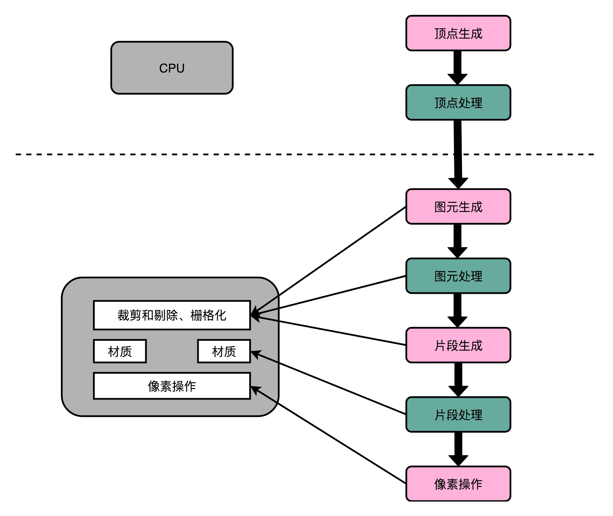

不过，无论是 Voodoo FX 还是 NVidia TNT。整个显卡的架构还不同于我们现代的显卡，也没有现代显卡去进行各种加速深度学习的能力。这个能力，要到 NVidia 提出 Unified Shader Archicture 才开始具备。这也是我们下一讲要讲的内容。

## 总结延伸

这一讲里，我带你了解了一个基于多边形建模的三维图形的渲染过程。这个渲染过程需要经过顶点处理、图元处理、栅格化、片段处理以及像素操作这 5 个步骤。这 5 个步骤把存储在内存里面的多边形数据变成了渲染在屏幕上的画面。因为里面的很多步骤，都需要渲染整个画面里面的每一个像素，所以其实计算量是很大的。我们的 CPU 这个时候，就有点跑不动了。

于是，像 3dfx 和 NVidia 这样的厂商就推出了 3D 加速卡，用硬件来完成图元处理开始的渲染流程。这些加速卡和现代的显卡还不太一样，它们是用固定的处理流程来完成整个 3D 图形渲染的过程。不过，因为不用像 CPU 那样考虑计算和处理能力的通用性。我们就可以用比起 CPU 芯片更低的成本，更好地完成 3D 图形的渲染工作。而 3D 游戏的时代也是从这个时候开始的。

<h1 id="chapter31">31 | GPU（下）：为什么深度学习需要使用GPU？</h1>

## Shader 的诞生和可编程图形处理器

不知道你有没有发现，在 Voodoo 和 TNT 显卡的渲染管线里面，没有“顶点处理“这个步骤。在当时，把多边形的顶点进行线性变化，转化到我们的屏幕的坐标系的工作还是由 CPU 完成的。所以，CPU 的性能越好，能够支持的多边形也就越多，对应的多边形建模的效果自然也就越像真人。而 3D 游戏的多边形性能也受限于我们 CPU 的性能。无论你的显卡有多快，如果 CPU 不行，3D 画面一样还是不行。

所以，1999 年 NVidia 推出的 GeForce 256 显卡，就把顶点处理的计算能力，也从 CPU 里挪到了显卡里。不过，这对于想要做好 3D 游戏的程序员们还不够，即使到了 GeForce 256。整个图形渲染过程都是在硬件里面固定的管线来完成的。程序员们在加速卡上能做的事情呢，只有改配置来实现不同的图形渲染效果。如果通过改配置做不到，我们就没有什么办法了。

这个时候，程序员希望我们的 GPU 也能有一定的可编程能力。这个编程能力不是像 CPU 那样，有非常通用的指令，可以进行任何你希望的操作，而是在整个的**渲染管线**（Graphics Pipeline）的一些特别步骤，能够自己去定义处理数据的算法或者操作。于是，从 2001 年的 Direct3D 8.0 开始，微软第一次引入了**可编程管线**（Programable Function Pipeline）的概念。


一开始的可编程管线呢，仅限于顶点处理（Vertex Processing）和片段处理（Fragment Processing）部分。比起原来只能通过显卡和 Direct3D 这样的图形接口提供的固定配置，程序员们终于也可以开始在图形效果上开始大显身手了。

这些可以编程的接口，我们称之为 **Shader**，中文名称就是**着色器**。之所以叫“着色器”，是因为一开始这些“可编程”的接口，只能修改顶点处理和片段处理部分的程序逻辑。我们用这些接口来做的，也主要是光照、亮度、颜色等等的处理，所以叫着色器。

这个时候的 GPU，有两类 Shader，也就是 Vertex Shader 和 Fragment Shader。我们在上一讲看到，在进行顶点处理的时候，我们操作的是多边形的顶点；在片段操作的时候，我们操作的是屏幕上的像素点。对于顶点的操作，通常比片段要复杂一些。所以一开始，这两类 Shader 都是独立的硬件电路，也各自有独立的编程接口。因为这么做，硬件设计起来更加简单，一块 GPU 上也能容纳下更多的 Shader。

不过呢，大家很快发现，虽然我们在顶点处理和片段处理上的具体逻辑不太一样，但是里面用到的指令集可以用同一套。而且，虽然把 Vertex Shader 和 Fragment Shader 分开，可以减少硬件设计的复杂程度，但是也带来了一种浪费，有一半 Shader 始终没有被使用。在整个渲染管线里，Vertext Shader 运行的时候，Fragment Shader 停在那里什么也没干。Fragment Shader 在运行的时候，Vertext Shader 也停在那里发呆。

本来 GPU 就不便宜，结果设计的电路有一半时间是闲着的。喜欢精打细算抠出每一分性能的硬件工程师当然受不了了。于是，**统一着色器架构**（Unified Shader Architecture）就应运而生了。

既然大家用的指令集是一样的，那不如就在 GPU 里面放很多个一样的 Shader 硬件电路，然后通过统一调度，把顶点处理、图元处理、片段处理这些任务，都交给这些 Shader 去处理，让整个 GPU 尽可能地忙起来。这样的设计，就是我们现代 GPU 的设计，就是统一着色器架构。

有意思的是，这样的 GPU 并不是先在 PC 里面出现的，而是来自于一台游戏机，就是微软的 XBox 360。后来，这个架构才被用到 ATI 和 NVidia 的显卡里。这个时候的“着色器”的作用，其实已经和它的名字关系不大了，而是变成了一个通用的抽象计算模块的名字。

正是因为 Shader 变成一个“通用”的模块，才有了把 GPU 拿来做各种通用计算的用法，也就是 **GPGPU**（General-Purpose Computing on Graphics Processing Units，通用图形处理器）。而正是因为 GPU 可以拿来做各种通用的计算，才有了过去 10 年深度学习的火热。

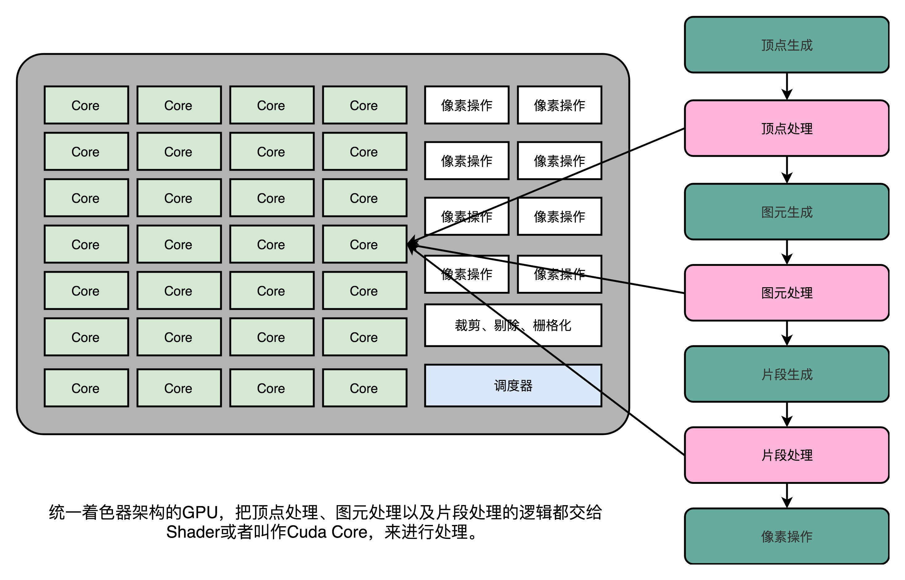

## 现代 GPU 的三个核心创意

讲完了现代 GPU 的进化史，那么接下来，我们就来看看，为什么现代的 GPU 在图形渲染、深度学习上能那么快。

## 芯片瘦身

我们先来回顾一下，之前花了很多讲仔细讲解的现代 CPU。现代 CPU 里的晶体管变得越来越多，越来越复杂，其实已经不是用来实现“计算”这个核心功能，而是拿来实现处理乱序执行、进行分支预测，以及我们之后要在存储器讲的高速缓存部分。

而在 GPU 里，这些电路就显得有点多余了，GPU 的整个处理过程是一个流式处理（Stream Processing）的过程。因为没有那么多分支条件，或者复杂的依赖关系，我们可以把 GPU 里这些对应的电路都可以去掉，做一次小小的瘦身，只留下取指令、指令译码、ALU 以及执行这些计算需要的寄存器和缓存就好了。一般来说，我们会把这些电路抽象成三个部分，就是下面图里的取指令和指令译码、ALU 和执行上下文。

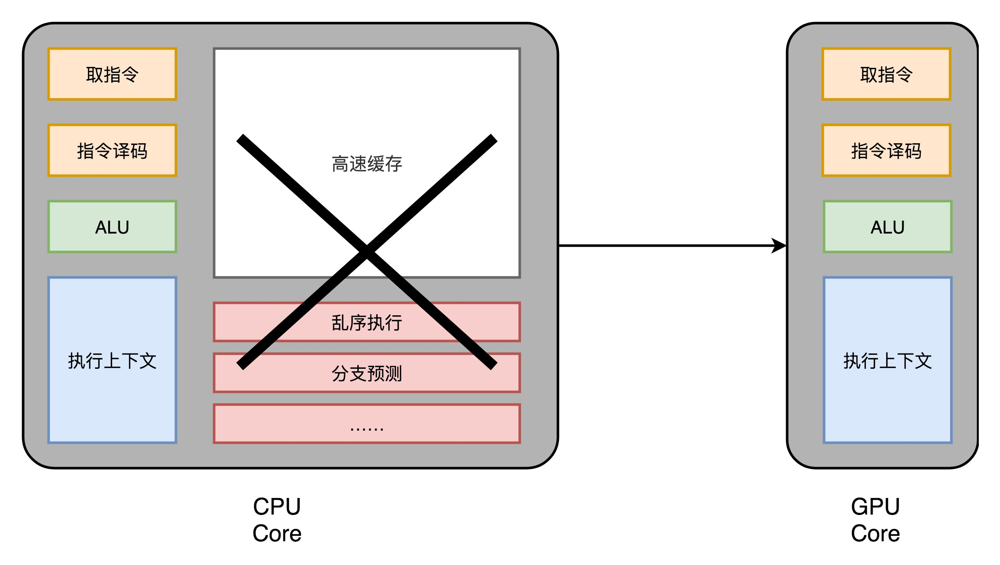

## 多核并行和 SIMT

这样一来，我们的 GPU 电路就比 CPU 简单很多了。于是，我们就可以在一个 GPU 里面，塞很多个这样并行的 GPU 电路来实现计算，就好像 CPU 里面的多核 CPU 一样。和 CPU 不同的是，我们不需要单独去实现什么多线程的计算。因为 GPU 的运算是天然并行的。


我们在上一讲里面其实已经看到，无论是对多边形里的顶点进行处理，还是屏幕里面的每一个像素进行处理，每个点的计算都是独立的。所以，简单地添加多核的 GPU，就能做到并行加速。不过光这样加速还是不够，工程师们觉得，性能还有进一步被压榨的空间。

我们在第 27 讲里面讲过，CPU 里有一种叫作 SIMD 的处理技术。这个技术是说，在做向量计算的时候，我们要执行的指令是一样的，只是同一个指令的数据有所不同而已。在 GPU 的渲染管线里，这个技术可就大有用处了。

无论是顶点去进行线性变换，还是屏幕上临近像素点的光照和上色，都是在用相同的指令流程进行计算。所以，GPU 就借鉴了 CPU 里面的 SIMD，用了一种叫作SIMT（Single Instruction，Multiple Threads）的技术。SIMT 呢，比 SIMD 更加灵活。在 SIMD 里面，CPU 一次性取出了固定长度的多个数据，放到寄存器里面，用一个指令去执行。而 SIMT，可以把多条数据，交给不同的线程去处理。

各个线程里面执行的指令流程是一样的，但是可能根据数据的不同，走到不同的条件分支。这样，相同的代码和相同的流程，可能执行不同的具体的指令。这个线程走到的是 if 的条件分支，另外一个线程走到的就是 else 的条件分支了。

于是，我们的 GPU 设计就可以进一步进化，也就是在取指令和指令译码的阶段，取出的指令可以给到后面多个不同的 ALU 并行进行运算。这样，我们的一个 GPU 的核里，就可以放下更多的 ALU，同时进行更多的并行运算了。

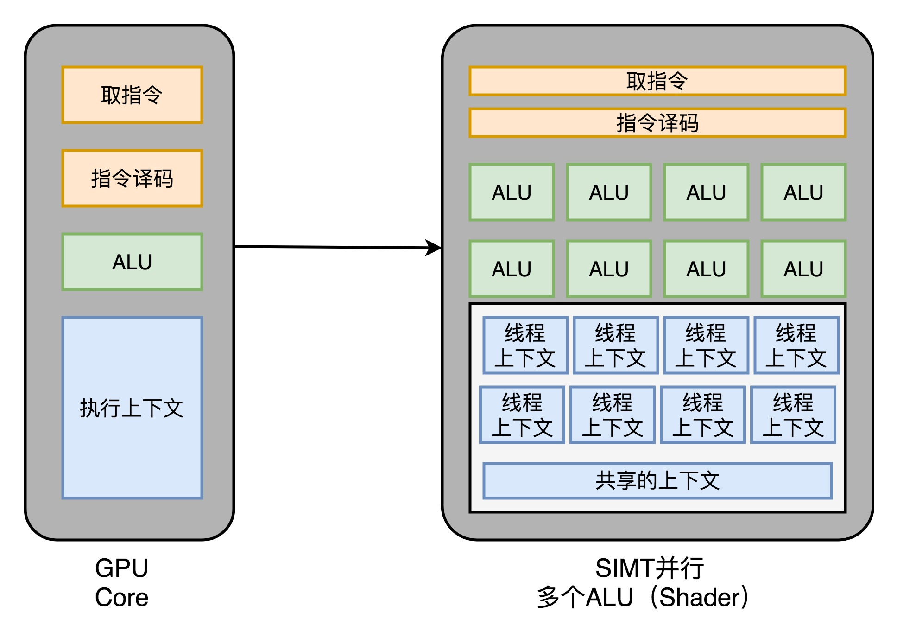

## GPU 里的“超线程”

虽然 GPU 里面的主要以数值计算为主。不过既然已经是一个“通用计算”的架构了，GPU 里面也避免不了会有 if…else 这样的条件分支。但是，在 GPU 里我们可没有 CPU 这样的分支预测的电路。这些电路在上面“芯片瘦身”的时候，就已经被我们砍掉了。

所以，GPU 里的指令，可能会遇到和 CPU 类似的“流水线停顿”问题。想到流水线停顿，你应该就能记起，我们之前在 CPU 里面讲过超线程技术。在 GPU 上，我们一样可以做类似的事情，也就是遇到停顿的时候，调度一些别的计算任务给当前的 ALU。

和超线程一样，既然要调度一个不同的任务过来，我们就需要针对这个任务，提供更多的**执行上下文**。所以，一个 Core 里面的**执行上下文**的数量，需要比 ALU 多。


## GPU 在深度学习上的性能差异

在通过芯片瘦身、SIMT 以及更多的执行上下文，我们就有了一个更擅长并行进行暴力运算的 GPU。这样的芯片，也正适合我们今天的深度学习的使用场景。

一方面，GPU 是一个可以进行“通用计算”的框架，我们可以通过编程，在 GPU 上实现不同的算法。另一方面，现在的深度学习计算，都是超大的向量和矩阵，海量的训练样本的计算。整个计算过程中，没有复杂的逻辑和分支，非常适合 GPU 这样并行、计算能力强的架构。

我们去看 NVidia 2080 显卡的技术规格，就可以算出，它到底有多大的计算能力。

2080 一共有 46 个 SM（Streaming Multiprocessor，流式处理器），这个 SM 相当于 GPU 里面的 GPU Core，所以你可以认为这是一个 46 核的 GPU，有 46 个取指令指令译码的渲染管线。每个 SM 里面有 64 个 Cuda Core。你可以认为，这里的 Cuda Core 就是我们上面说的 ALU 的数量或者 Pixel Shader 的数量，46x64 呢一共就有 2944 个 Shader。然后，还有 184 个 TMU，TMU 就是 Texture Mapping Unit，也就是用来做纹理映射的计算单元，它也可以认为是另一种类型的 Shader。


2080 的主频是 1515MHz，如果自动超频（Boost）的话，可以到 1700MHz。而 NVidia 的显卡，根据硬件架构的设计，每个时钟周期可以执行两条指令。所以，能做的浮点数运算的能力，就是：

（2944 + 184）× 1700 MHz × 2  = 10.06  TFLOPS

对照一下官方的技术规格，正好就是 10.07TFLOPS。

那么，最新的 Intel i9 9900K 的性能是多少呢？不到 1TFLOPS。而 2080 显卡和 9900K 的价格却是差不多的。所以，在实际进行深度学习的过程中，用 GPU 所花费的时间，往往能减少一到两个数量级。而大型的深度学习模型计算，往往又是多卡并行，要花上几天乃至几个月。这个时候，用 CPU 显然就不合适了。

今天，随着 GPGPU 的推出，GPU 已经不只是一个图形计算设备，更是一个用来做数值计算的好工具了。同样，也是因为 GPU 的快速发展，带来了过去 10 年深度学习的繁荣。

## 总结延伸

这一讲里面，我们讲了，GPU 一开始是没有“可编程”能力的，程序员们只能够通过配置来设计需要用到的图形渲染效果。随着“可编程管线”的出现，程序员们可以在顶点处理和片段处理去实现自己的算法。为了进一步去提升 GPU 硬件里面的芯片利用率，微软在 XBox 360 里面，第一次引入了“统一着色器架构”，使得 GPU 变成了一个有“通用计算”能力的架构。

接着，我们从一个 CPU 的硬件电路出发，去掉了对 GPU 没有什么用的分支预测和乱序执行电路，来进行瘦身。之后，基于渲染管线里面顶点处理和片段处理就是天然可以并行的了。我们在 GPU 里面可以加上很多个核。

又因为我们的渲染管线里面，整个指令流程是相同的，我们又引入了和 CPU 里的 SIMD 类似的 SIMT 架构。这个改动，进一步增加了 GPU 里面的 ALU 的数量。最后，为了能够让 GPU 不要遭遇流水线停顿，我们又在同一个 GPU 的计算核里面，加上了更多的执行上下文，让 GPU 始终保持繁忙。

GPU 里面的多核、多 ALU，加上多 Context，使得它的并行能力极强。同样架构的 GPU，如果光是做数值计算的话，算力在同样价格的 CPU 的十倍以上。而这个强大计算能力，以及“统一着色器架构”，使得 GPU 非常适合进行深度学习的计算模式，也就是海量计算，容易并行，并且没有太多的控制分支逻辑。

使用 GPU 进行深度学习，往往能够把深度学习算法的训练时间，缩短一个，乃至两个数量级。而 GPU 现在也越来越多地用在各种科学计算和机器学习上，而不仅仅是用在图形渲染上了。

<h1 id="chapter32">32 | FPGA和ASIC：计算机体系结构的黄金时代</h1>

过去很长一段时间里，大家在讲到高科技、互联网、信息技术的时候，谈的其实都是“软件”。从 1995 年微软发布 Windows 95 开始，高科技似乎就等同于软件业和互联网。著名的风险投资基金 Andreessen Horowitz 的合伙人 Marc Andreessen，在 2011 年发表了一篇博客，声称“Software is Eating the World”。Marc Andreessen，不仅是投资人，更是 Netscape 的创始人之一。他当时的搭档就是我们在前两讲提过的 SGI 创始人 Jim Clark。

的确，过去 20 年计算机工业界的中心都在软件上。似乎硬件对大家来说，慢慢变成了一个黑盒子。虽然必要，但却显得有点无关紧要。

不过，在上世纪 70～80 年代，计算机的世界可不是这样的。那个时候，计算机工业届最激动人心的，是层出不穷的硬件。无论是 Intel 的 8086，还是摩托罗拉的 68000，这样用于个人电脑的 CPU，还是直到今天大家还会提起的 Macintosh，还有史上最畅销的计算机 Commodore 64，都是在那个时代被创造出来的。

不过，随着计算机主频提升越来越困难。这几年，计算机硬件又进入了一个新的、快速发展的时期。

从树莓派基金会这样的非盈利组织开发 35 美元的单片机，到 Google 这样的巨头为了深度学习专门开发出来的 TPU，新的硬件层出不穷，也无怪乎 David Patterson 老爷爷，去年在拿图灵奖之后专门发表讲话，说计算机体系结构又进入了一个黄金时代。那今天我就带你一起来看看，FPGA 和 ASIC 这两个最近比较时髦的硬件发展。

## FPGA

之前我们讲解 CPU 的硬件实现的时候说过，其实 CPU 其实就是一些简单的门电路像搭积木一样搭出来的。从最简单的门电路，搭建成半加器、全加器，然后再搭建成完整功能的 ALU。这些电路里呢，有完成各种实际计算功能的组合逻辑电路，也有用来控制数据访问，创建出寄存器和内存的时序逻辑电路。如果你对这块儿内容印象不深，可以回顾一下第 12 讲到第 14 讲的内容，以及第 17 讲的内容。

好了，那现在我问你一个问题，在我们现代 CPU 里面，有多少个晶体管这样的电路开关呢？这个答案说出来有点儿吓人。一个四核 i7 的 Intel CPU，上面的晶体管数量差不多有 20 亿个。那接着问题就来了，我们要想设计一个 CPU，就要想办法连接这 20 亿个晶体管。

这已经够难了，后面还有更难的。就像我们写程序一样，连接晶体管不是一次就能完事儿了的。设计更简单一点儿的专用于特定功能的芯片，少不了要几个月。而设计一个 CPU，往往要以“年”来计。在这个过程中，硬件工程师们要设计、验证各种各样的技术方案，可能会遇到各种各样的 Bug。如果我们每次验证一个方案，都要单独设计生产一块芯片，那这个代价也太高了。

我们有没有什么办法，不用单独制造一块专门的芯片来验证硬件设计呢？能不能设计一个硬件，通过不同的程序代码，来操作这个硬件之前的电路连线，通过“编程”让这个硬件变成我们设计的电路连线的芯片呢？


这个，就是我们接下来要说的 FPGA，也就是**现场可编程门阵列**（Field-Programmable Gate Array）。看到这个名字，你可能要说了，这里面每个单词单独我都认识，放到一起就不知道是什么意思了。

没关系，我们就从 FPGA 里面的每一个字符，一个一个来看看它到底是什么意思。

- P 代表 Programmable，这个很容易理解。也就是说这是一个可以通过编程来控制的硬件。
- G 代表 Gate 也很容易理解，它就代表芯片里面的门电路。我们能够去进行编程组合的就是这样一个一个门电路。
- A 代表的 Array，叫作阵列，说的是在一块 FPGA 上，密密麻麻列了大量 Gate 这样的门电路。
- 最后一个 F，不太容易理解。它其实是说，一块 FPGA 这样的板子，可以在“现场”多次进行编程。它不像 PAL（Programmable Array Logic，可编程阵列逻辑）这样更古老的硬件设备，只能“编程”一次，把预先写好的程序一次性烧录到硬件里面，之后就不能再修改了。

这么看来，其实“FPGA”这样的组合，基本上解决了我们前面说的想要设计硬件的问题。我们可以像软件一样对硬件编程，可以反复烧录，还有海量的门电路，可以组合实现复杂的芯片功能。

不过，相信你和我一样好奇，我们究竟怎么对硬件进行编程呢？我们之前说过，CPU 其实就是通过晶体管，来实现各种组合逻辑或者时序逻辑。那么，我们怎么去“编程”连接这些线路呢？

FPGA 的解决方案很精巧，我把它总结为这样三个步骤。

**第一，用存储换功能实现组合逻辑。**在实现 CPU 的功能的时候，我们需要完成各种各样的电路逻辑。在 FPGA 里，这些基本的电路逻辑，不是采用布线连接的方式进行的，而是预先根据我们在软件里面设计的逻辑电路，算出对应的真值表，然后直接存到一个叫作 LUT（Look-Up Table，查找表）的电路里面。这个 LUT 呢，其实就是一块存储空间，里面存储了“特定的输入信号下，对应输出 0 还是 1”。

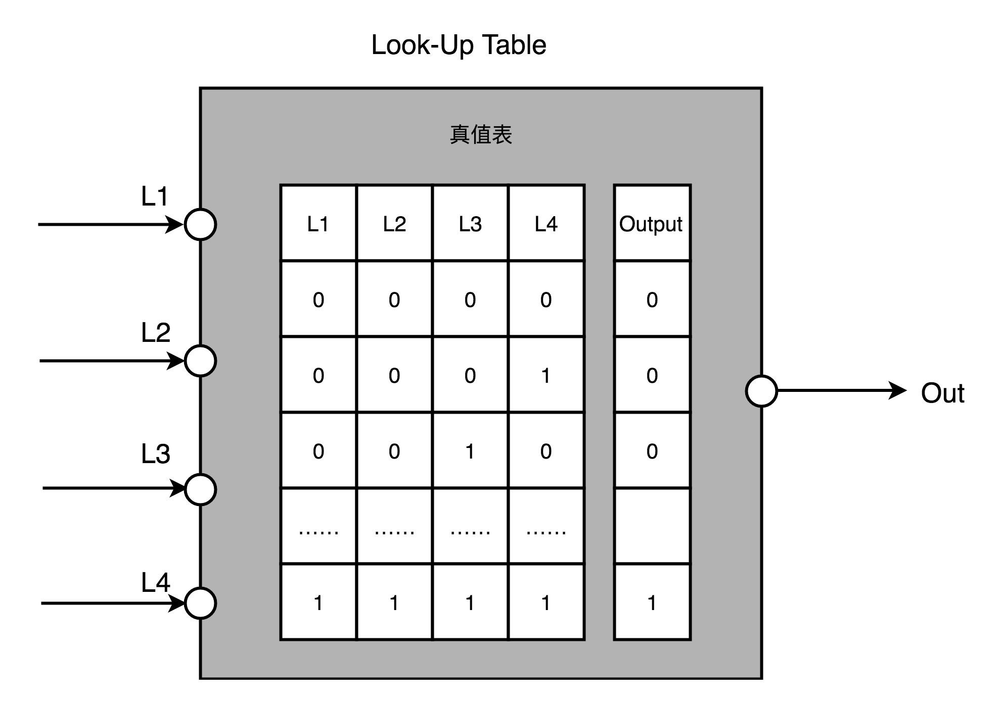

如果还没理解，你可以想一下这个问题。假如现在我们要实现一个函数，这个函数需要返回斐波那契数列的第 N 项，并且限制这个 N 不会超过 100。该怎么解决这个问题呢？

斐波那契数列的通项公式是 f(N) = f(N-1) + f(N-2) 。所以，我们的第一种办法，自然是写一个程序，从第 1 项开始算。但其实还有一种办法，就是我们预先用程序算好斐波那契数量前 100 项，然后把它预先放到一个数组里面。这个数组就像 [1, 1, 2, 3, 5…] 这样。当要计算第 N 项的时候呢，我们并不是去计算得到结果，而是直接查找这个数组里面的第 N 项。

这里面的关键就在于，这个查表的办法，不只能够提供斐波那契数列。如果我们要有一个获得 N 的 5 次方的函数，一样可以先计算好，放在表里面进行查询。这个“查表”的方法，其实就是 FPGA 通过 LUT 来实现各种组合逻辑的办法。

**第二，对于需要实现的时序逻辑电路，我们可以在 FPGA 里面直接放上 D 触发器，作为寄存器。**这个和 CPU 里的触发器没有什么本质不同。不过，我们会把很多个 LUT 的电路和寄存器组合在一起，变成一个叫作逻辑簇（Logic Cluster）的东西。在 FPGA 里，这样组合了多个 LUT 和寄存器的设备，也被叫做 CLB（Configurable Logic Block，可配置逻辑块）。

我们通过配置 CLB 实现的功能有点儿像我们前面讲过的全加器。它已经在最基础的门电路上做了组合，能够提供更复杂一点的功能。更复杂的芯片功能，我们不用再从门电路搭起，可以通过 CLB 组合搭建出来。


**第三，FPGA 是通过可编程逻辑布线，来连接各个不同的 CLB，最终实现我们想要实现的芯片功能。**这个可编程逻辑布线，你可以把它当成我们的铁路网。整个铁路系统已经铺好了，但是整个铁路网里面，设计了很多个道岔。我们可以通过控制道岔，来确定不同的列车线路。在可编程逻辑布线里面，“编程”在做的，就是拨动像道岔一样的各个电路开关，最终实现不同 CLB 之间的连接，完成我们想要的芯片功能。

于是，通过 LUT 和寄存器，我们能够组合出很多 CLB，而通过连接不同的 CLB，最终有了我们想要的芯片功能。最关键的是，这个组合过程是可以“编程”控制的。而且这个编程出来的软件，还可以后续改写，重新写入到硬件里。让同一个硬件实现不同的芯片功能。从这个角度来说，FPGA 也是“软件吞噬世界”的一个很好的例子。

## ASIC

除了 CPU、GPU，以及刚刚的 FPGA，我们其实还需要用到很多其他芯片。比如，现在手机里就有专门用在摄像头里的芯片；录音笔里会有专门处理音频的芯片。尽管一个 CPU 能够处理好手机拍照的功能，也能处理好录音的功能，但是我们直接在手机或者录音笔里塞上一个 Intel CPU，显然比较浪费。

于是，我们就考虑为这些有专门用途的场景，单独设计一个芯片。这些专门设计的芯片呢，我们称之为 **ASIC**（Application-Specific Integrated Circuit），也就是**专用集成电路**。事实上，过去几年，ASIC 发展得特别快。因为 ASIC 是针对专门用途设计的，所以它的电路更精简，单片的制造成本也比 CPU 更低。而且，因为电路精简，所以通常能耗要比用来做通用计算的 CPU 更低。而我们上一讲所说的早期的图形加速卡，其实就可以看作是一种 ASIC。

因为 ASIC 的生产制造成本，以及能耗上的优势，过去几年里，有不少公司设计和开发 ASIC 用来“挖矿”。这个“挖矿”，说的其实就是设计专门的数值计算芯片，用来“挖”比特币、ETH 这样的数字货币。

那么，我们能不能用刚才说的 FPGA 来做 ASIC 的事情呢？当然是可以的。我们对 FPGA 进行“编程”，其实就是把 FPGA 的电路变成了一个 ASIC。这样的芯片，往往在成本和功耗上优于需要做通用计算的 CPU 和 GPU。

那你可能又要问了，那为什么我们干脆不要用 ASIC 了，全都用 FPGA 不就好了么？你要知道，其实 FPGA 一样有缺点，那就是它的硬件上有点儿“浪费”。这个很容易理解，我一说你就明白了。

每一个 LUT 电路，其实都是一个小小的“浪费”。一个 LUT 电路设计出来之后，既可以实现与门，又可以实现或门，自然用到的晶体管数量，比单纯连死的与门或者或门的要多得多。同时，因为用的晶体管多，它的能耗也比单纯连死的电路要大，单片 FPGA 的生产制造的成本也比 ASIC 要高不少。

当然，有缺点就有优点，FPGA 的优点在于，它没有硬件研发成本。ASIC 的电路设计，需要仿真、验证，还需要经过流片（Tape out），变成一个印刷的电路版，最终变成芯片。这整个从研发到上市的过程，最低花费也要几万美元，高的话，会在几千万乃至数亿美元。更何况，整个设计还有失败的可能。所以，如果我们设计的专用芯片，只是要制造几千片，那买几千片现成的 FPGA，可能远比花上几百万美元，来设计、制造 ASIC 要经济得多。

实际上，到底使用 ASIC 这样的专用芯片，还是采用 FPGA 这样可编程的通用硬件，核心的决策因素还是成本。不过这个成本，不只是单个芯片的生产制造成本，还要考虑**总体拥有成本**（Total Cost of Ownership），也就是说，除了生产成本之外，我们要把研发成本也算进去。如果我们只制造了一片芯片，那么成本就是“这枚芯片的成本 + 为了这枚芯片建的生产线的成本 + 芯片的研发成本”，而不只是“芯片的原材料沙子的成本 + 生产的电费”。

单个 ASIC 的生产制造成本比 FPGA 低，ASIC 的能耗也比能实现同样功能的 FPGA 要低。能耗低，意味着长时间运行这些芯片，所用的电力成本也更低。

但是，ASIC 有一笔很高的 NRE（Non-Recuring Engineering Cost，一次性工程费用）成本。这个成本，就是 ASIC 实际“研发”的成本。只有需要大量生产 ASIC 芯片的时候，我们才能摊薄这份研发成本。

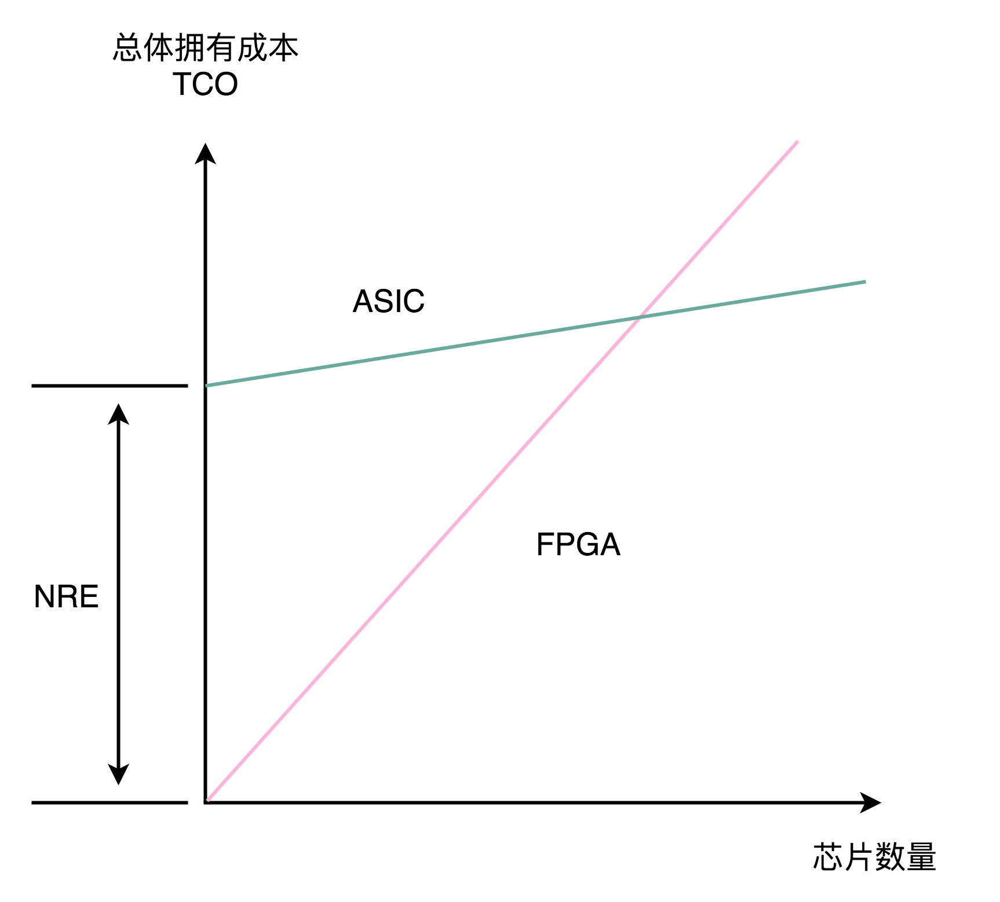

其实，在我们的日常软件开发过程中，也需要做同样的决策。很多我们需要的功能，可能在市面上已经有开源的软件可以实现。我们可以在开源的软件之上做配置或者开发插件，也可以选择自己从头开始写代码。

在开源软件或者是买来的商业软件上启动，往往能很快让产品上线。如果从头开始写代码，往往会有一笔不地的 NRE 成本，也就是研发成本。但是通常我们自己写的代码，能够 100% 贴近我们的业务需求，后续随着业务需求的改造成本会更低。如果要大规模部署很多服务器的话，服务器的成本会更低。学会从 TCO 和 NRE 的成本去衡量做决策，也是每一个架构师的必修课。

## 总结延伸

好了，这一讲里，我为你介绍了 FPGA 和 ASIC 这两种近年来非常时髦的芯片。

FPGA 本质上是一个可以通过编程，来控制硬件电路的芯片。我们通过用 LUT 这样的存储设备，来代替需要的硬连线的电路，有了可编程的逻辑门，然后把很多 LUT 和寄存器放在一起，变成一个更复杂的逻辑电路，也就是 CLB，然后通过控制可编程布线中的很多开关，最终设计出属于我们自己的芯片功能。FPGA，常常被我们用来进行芯片的设计和验证工作，也可以直接拿来当成专用的芯片，替换掉 CPU 或者 GPU，以节约成本。

相比 FPGA，ASIC 在“专用”上更进一步。它是针对特定的使用场景设计出来的芯片，比如，摄像头、音频、“挖矿”或者深度学习。虽然 ASIC 的研发成本高昂，但是生产制造成本和能耗都很低。所以，对于有大量需求的专用芯片，用 ASIC 是很划得来的。而在 FPGA 和 ASIC 之间进行取舍，就要看两者的整体拥有成本哪一个更低了。

专用芯片的故事我们还没有讲完，下一讲，我们来看看 Google 开发的 TPU，这个近两年最知名的 ASIC 芯片的故事。

<h1 id="chapter33">33 | 解读TPU：设计和拆解一块ASIC芯片</h1>

过去几年，最知名、最具有实用价值的 ASIC 就是 TPU 了。各种解读 TPU 论文内容的文章网上也很多。不过，这些文章更多地是从机器学习或者 AI 的角度，来讲解 TPU。

上一讲，我为你讲解了 FPGA 和 ASIC，讲解了 FPGA 如何实现通过“软件”来控制“硬件”，以及我们可以进一步把 FPGA 设计出来的电路变成一块 ASIC 芯片。

不过呢，这些似乎距离我们真实的应用场景有点儿远。我们怎么能够设计出来一块有真实应用场景的 ASIC 呢？如果要去设计一块 ASIC，我们应该如何思考和拆解问题呢？今天，我就带着你一起学习一下，如何设计一块专用芯片。

## TPU V1 想要解决什么问题？

黑格尔说，“世上没有无缘无故的爱，也没有无缘无故的恨”。第一代 TPU 的设计并不是异想天开的创新，而是来自于真实的需求。

从 2012 年解决计算机视觉问题开始，深度学习一下子进入了大爆发阶段，也一下子带火了 GPU，NVidia 的股价一飞冲天。我们在第 31 讲讲过，GPU 天生适合进行海量、并行的矩阵数值计算，于是它被大量用在深度学习的模型训练上。

不过你有没有想过，在深度学习热起来之后，计算量最大的是什么呢？并不是进行深度学习的训练，而是深度学习的推断部分。

所谓**推断部分**，是指我们在完成深度学习训练之后，把训练完成的模型存储下来。这个存储下来的模型，是许许多多个向量组成的参数。然后，我们根据这些参数，去计算输入的数据，最终得到一个计算结果。这个推断过程，可能是在互联网广告领域，去推测某一个用户是否会点击特定的广告；也可能是我们在经过高铁站的时候，扫一下身份证进行一次人脸识别，判断一下是不是你本人。

虽然训练一个深度学习的模型需要花的时间不少，但是实际在推断上花的时间要更多。比如，我们上面说的高铁，去年（2018 年）一年就有 20 亿人次坐了高铁，这也就意味着至少进行了 20 亿次的人脸识别“推断“工作。

所以，第一代的 TPU，首先优化的并不是深度学习的模型训练，而是深度学习的模型推断。这个时候你可能要问了，那模型的训练和推断有什么不同呢？主要有三个点。

**第一点，深度学习的推断工作更简单，对灵活性的要求也就更低。**模型推断的过程，我们只需要去计算一些矩阵的乘法、加法，调用一些 Sigmoid 或者 RELU 这样的激活函数。这样的过程可能需要反复进行很多层，但是也只是这些计算过程的简单组合。

**第二点，深度学习的推断的性能，首先要保障响应时间的指标。**我们在第 4 讲讲过，计算机关注的性能指标，有响应时间（Response Time）和吞吐率（Throughput）。我们在模型训练的时候，只需要考虑吞吐率问题就行了。因为一个模型训练少则好几分钟，多的话要几个月。而推断过程，像互联网广告的点击预测，我们往往希望能在几十毫秒乃至几毫秒之内就完成，而人脸识别也不希望会超过几秒钟。很显然，模型训练和推断对于性能的要求是截然不同的。

**第三点，深度学习的推断工作，希望在功耗上尽可能少一些。**深度学习的训练，对功耗没有那么敏感，只是希望训练速度能够尽可能快，多费点电就多费点儿了。这是因为，深度学习的推断，要 7×24h 地跑在数据中心里面。而且，对应的芯片，要大规模地部署在数据中心。一块芯片减少 5% 的功耗，就能节省大量的电费。而深度学习的训练工作，大部分情况下只是少部分算法工程师用少量的机器进行。很多时候，只是做小规模的实验，尽快得到结果，节约人力成本。少数几台机器多花的电费，比起算法工程师的工资来说，只能算九牛一毛了。

这三点的差别，也就带出了第一代 TPU 的设计目标。那就是，在保障响应时间的情况下，能够尽可能地提高**能效比**这个指标，也就是进行同样多数量的推断工作，花费的整体能源要显著低于 CPU 和 GPU。

## 深入理解 TPU V1

## 快速上线和向前兼容，一个 FPU 的设计

如果你来设计 TPU，除了满足上面的深度学习的推断特性之外，还有什么是你要重点考虑的呢？你可以停下来思考一下，然后再继续往下看。

不知道你的答案是什么，我的第一反应是，有两件事情必须要考虑，第一个是 TPU 要有向前兼容性，第二个是希望 TPU 能够尽早上线。我下面说说我考虑这两点的原因。


第一点，向前兼容。在计算机产业界里，因为没有考虑向前兼容，惨遭失败的产品数不胜数。典型的有我在第 26 讲提过的安腾处理器。所以，TPU 并没有设计成一个独立的“CPU“，而是设计成一块像显卡一样，插在主板 PCI-E 接口上的板卡。更进一步地，TPU 甚至没有像我们之前说的现代 GPU 一样，设计成自己有对应的取指令的电路，而是通过 CPU，向 TPU 发送需要执行的指令。

这两个设计，使得我们的 TPU 的硬件设计变得简单了，我们只需要专心完成一个专用的“计算芯片”就好了。所以，TPU 整个芯片的设计上线时间也就缩短到了 15 个月。不过，这样一个 TPU，其实是第 26 讲里我们提过的 387 浮点数计算芯片，是一个像 FPU（浮点数处理器）的协处理器（Coprocessor），而不是像 CPU 和 GPU 这样可以独立工作的 Processor Unit。

## 专用电路和大量缓存，适应推断的工作流程

明确了 TPU 整体的设计思路之后，我们可以来看一看，TPU 内部有哪些芯片和数据处理流程。我在文稿里面，放了 TPU 的模块图和对应的芯片布局图，你可以对照着看一下。


你可以看到，在芯片模块图里面，有单独的矩阵乘法单元（Matrix Multiply Unit）、累加器（Accumulators）模块、激活函数（Activation）模块和归一化 / 池化（Normalization/Pool）模块。而且，这些模块是顺序串联在一起的。

这是因为，一个深度学习的推断过程，是由很多层的计算组成的。而每一个层（Layer）的计算过程，就是先进行矩阵乘法，再进行累加，接着调用激活函数，最后进行归一化和池化。这里的硬件设计呢，就是把整个流程变成一套固定的硬件电路。这也是一个 ASIC 的典型设计思路，其实就是把确定的程序指令流程，变成固定的硬件电路。

接着，我们再来看下面的芯片布局图，其中控制电路（Control）只占了 2%。这是因为，TPU 的计算过程基本上是一个固定的流程。不像我们之前讲的 CPU 那样，有各种复杂的控制功能，比如冒险、分支预测等等。

你可以看到，超过一半的 TPU 的面积，都被用来作为 Local Unified Buffer（本地统一缓冲区）（29%）和矩阵乘法单元（Matrix Mutliply Unit）了。

相比于矩阵乘法单元，累加器、实现激活函数和后续的归一 / 池化功能的激活管线（Activation Pipeline）也用得不多。这是因为，在深度学习推断的过程中，矩阵乘法的计算量是最大的，计算也更复杂，所以比简单的累加器和激活函数要占用更多的晶体管。

而统一缓冲区（Unified Buffer），则由 SRAM 这样高速的存储设备组成。SRAM 一般被直接拿来作为 CPU 的寄存器或者高速缓存。我们在后面的存储器部分会具体讲。SRAM 比起内存使用的 DRAM 速度要快上很多，但是因为电路密度小，所以占用的空间要大很多。统一缓冲区之所以使用 SRAM，是因为在整个的推断过程中，它会高频反复地被矩阵乘法单元读写，来完成计算。

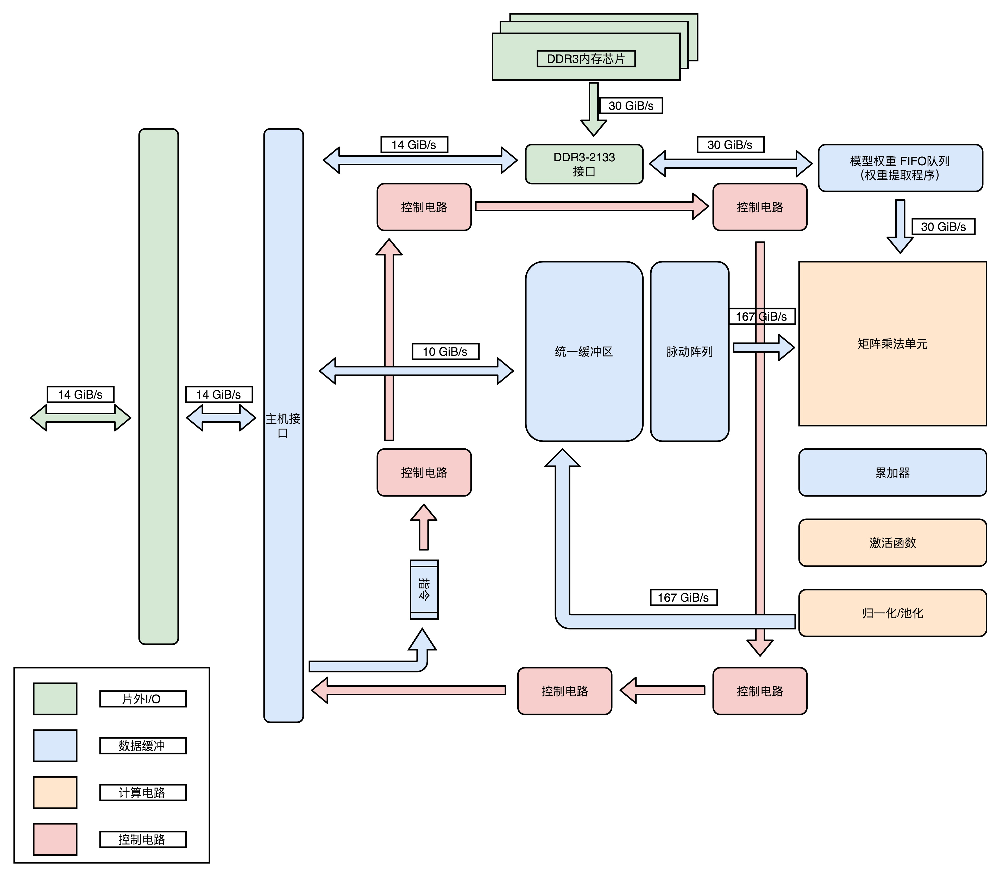

可以看到，整个 TPU 里面，每一个组件的设计，完全是为了深度学习的推断过程设计出来的。这也是我们设计开发 ASIC 的核心原因：用特制的硬件，最大化特定任务的运行效率。

## 细节优化，使用 8  Bits 数据

除了整个 TPU 的模块设计和芯片布局之外，TPU 在各个细节上也充分考虑了自己的应用场景，我们可以拿里面的矩阵乘法单元（Matrix Multiply Unit）来作为一个例子。

如果你仔细一点看的话，会发现这个矩阵乘法单元，没有用 32 Bits 来存放一个浮点数，而是只用了一个 8 Bits 来存放浮点数。这是因为，在实践的机器学习应用中，会对数据做归一化（Normalization）和正则化（Regularization）的处理。咱们毕竟不是一个机器学习课，所以我就不深入去讲什么是归一化和正则化了，你只需要知道，这两个操作呢，会使得我们在深度学习里面操作的数据都不会变得太大。通常来说呢，都能控制在 -3 到 3 这样一定的范围之内。

因为这个数值上的特征，我们需要的浮点数的精度也不需要太高了。我们在第 16 讲讲解浮点数的时候说过，32 位浮点数的精度，差不多可以到 1/1600 万。如果我们用 8 位或者 16 位表示浮点数，也能把精度放到 2^6 或者 2^12，也就是 1/64 或者 1/4096。在深度学习里，常常够用了。特别是在模型推断的时候，要求的计算精度，往往可以比模型训练低。所以，8 Bits 的矩阵乘法器，就可以放下更多的计算量，使得 TPU 的推断速度更快。

## 用数字说话，TPU 的应用效果

那么，综合了这么多优秀设计点的 TPU，实际的使用效果怎么样呢？不管设计得有多好，最后还是要拿效果和数据说话。俗话说，是骡子是马，总要拿出来溜溜啊。

Google 在 TPU 的论文里面给出了答案。一方面，在性能上，TPU 比现在的 CPU、GPU 在深度学习的推断任务上，要快 15～30 倍。而在能耗比上，更是好出 30～80 倍。另一方面，Google 已经用 TPU 替换了自家数据中心里 95% 的推断任务，可谓是拿自己的实际业务做了一个明证。

## 总结延伸

这一讲，我从第一代 TPU 的设计目标讲起，为你解读了 TPU 的设计。你可以通过这篇文章，回顾我们过去 32 讲提到的各种知识点。

第一代 TPU，是为了做各种深度学习的推断而设计出来的，并且希望能够尽早上线。这样，Google 才能节约现有数据中心里面的大量计算资源。

从深度学习的推断角度来考虑，TPU 并不需要太灵活的可编程能力，只要能够迭代完成常见的深度学习推断过程中一层的计算过程就好了。所以，TPU 的硬件构造里面，把矩阵乘法、累加器和激活函数都做成了对应的专门的电路。

为了满足深度学习推断功能的响应时间短的需求，TPU 设置了很大的使用 SRAM 的 Unified Buffer（UB），就好像一个 CPU 里面的寄存器一样，能够快速响应对于这些数据的反复读取。

为了让 TPU 尽可能快地部署在数据中心里面，TPU 采用了现有的 PCI-E 接口，可以和 GPU 一样直接插在主板上，并且采用了作为一个没有取指令功能的协处理器，就像 387 之于 386 一样，仅仅用来进行需要的各种运算。

在整个电路设计的细节层面，TPU 也尽可能做到了优化。因为机器学习的推断功能，通常做了数值的归一化，所以对于矩阵乘法的计算精度要求有限，整个矩阵乘法的计算模块采用了 8 Bits 来表示浮点数，而不是像 Intel CPU 里那样用上了 32 Bits。

最终，综合了种种硬件设计点之后的 TPU，做到了在深度学习的推断层面更高的能效比。按照 Google 论文里面给出的官方数据，它可以比 CPU、GPU 快上 15～30 倍，能耗比更是可以高出 30～80 倍。而 TPU，也最终替代了 Google 自己的数据中心里，95% 的深度学习推断任务。

<h1 id="chapter34">34 | 理解虚拟机：你在云上拿到的计算机是什么样的？</h1>

上世纪 60 年代，计算机还是异常昂贵的设备，实际的计算机使用需求要面临两个挑战。第一，计算机特别昂贵，我们要尽可能地让计算机忙起来，一直不断地去处理一些计算任务。第二，很多工程师想要用上计算机，但是没有能力自己花钱买一台，所以呢，我们要让很多人可以共用一台计算机。

## 缘起分时系统

为了应对这两个问题，分时系统的计算机就应运而生了。

无论是个人用户，还是一个小公司或者小机构，你都不需要花大价钱自己去买一台电脑。你只需要买一个输入输出的终端，就好像一套鼠标、键盘、显示器这样的设备，然后通过电话线，连到放在大公司机房里面的计算机就好了。这台计算机，会自动给程序或任务分配计算时间。你只需要为你花费的“计算时间”和使用的电话线路付费就可以了。比方说，比尔·盖茨中学时候用的学校的计算机，就是 GE 的分时系统。

## 从“黑色星期五”到公有云

现代公有云上的系统级虚拟机能够快速发展，其实和分时系统的设计思路是一脉相承的，这其实就是来自于电商巨头亚马逊大量富余的计算能力。

和国内有“双十一”一样，美国会有感恩节的“黑色星期五（Black Friday）”和“网络星期一（Cyber Monday）”，这样一年一度的大型电商促销活动。几天的活动期间，会有大量的用户进入亚马逊这样的网站，看商品、下订单、买东西。这个时候，整个亚马逊需要的服务器计算资源可能是平时的数十倍。

于是，亚马逊会按照“黑色星期五”和“网络星期一”的用户访问量，来准备服务器资源。这个就带来了一个问题，那就是在一年的 365 天里，有 360 天这些服务器资源是大量空闲的。要知道，这个空闲的服务器数量不是一台两台，也不是几十几百台。根据媒体的估算，亚马逊的云服务器 AWS 在 2014 年就已经超过了 150 万台，到了 2019 年的今天，估计已经有超过千万台的服务器。

平时有这么多闲着的服务器实在是太浪费了，所以，亚马逊就想把这些服务器给租出去。出租物理服务器当然是可行的，但是却不太容易自动化，也不太容易面向中小客户。

直接出租物理服务器，意味着亚马逊只能进行服务器的“整租”，这样大部分中小客户就不愿意了。为了节约数据中心的空间，亚马逊实际用的物理服务器，大部分多半是强劲的高端 8 核乃至 12 核的服务器。想要租用这些服务器的中小公司，起步往往只需要 1 个 CPU 核心乃至更少资源的服务器。一次性要他们去租一整台服务器，就好像刚毕业想要租个单间，结果你非要整租个别墅给他。

这个“整租”的问题，还发生在“时间”层面。物理服务器里面装好的系统和应用，不租了而要再给其他人使用，就必须清空里面已经装好的程序和数据，得做一次“重装”。如果我们只是暂时不用这个服务器了，过一段时间又要租这个服务器，数据中心服务商就不得不先重装整个系统，然后租给别人。等别人不用了，再重装系统租给你，特别地麻烦。

其实，对于想要租用服务器的用户来说，最好的体验不是租房子，而是住酒店。我住一天，我就付一天的钱。这次是全家出门，一次多定几间酒店房间就好啦。

而这样的需求，用虚拟机技术来实现，再好不过了。虚拟机技术，使得我们可以在一台物理服务器上，同时运行多个虚拟服务器，并且可以动态去分配，每个虚拟服务器占用的资源。对于不运行的虚拟服务器，我们也可以把这个虚拟服务器“关闭”。这个“关闭”了的服务器，就和一个被关掉的物理服务器一样，它不会再占用实际的服务器资源。但是，当我们重新打开这个虚拟服务器的时候，里面的数据和应用都在，不需要再重新安装一次。

## 虚拟机的技术变迁

那虚拟机技术到底是怎么一回事呢？下面我带你具体来看一看，它的技术变迁过程，好让你能更加了解虚拟机，从而更好地使用它。

**虚拟机**（Virtual Machine）技术，其实就是指在现有硬件的操作系统上，能够**模拟**一个计算机系统的技术。而模拟一个计算机系统，最简单的办法，其实不能算是虚拟机技术，而是一个模拟器（Emulator）。

## 解释型虚拟机

要模拟一个计算机系统，最简单的办法，就是兼容这个计算机系统的指令集。我们可以开发一个应用程序，跑在我们的操作系统上。这个应用程序呢，可以识别我们想要模拟的、计算机系统的程序格式和指令，然后一条条去解释执行。

在这个过程中，我们把原先的操作系统叫作**宿主机**（Host），把能够有能力去模拟指令执行的软件，叫作**模拟器**（Emulator），而实际运行在模拟器上被“虚拟”出来的系统呢，我们叫**客户机**（Guest VM）。

这个方式，其实和运行 Java 程序的 Java 虚拟机很像。只不过，Java 虚拟机运行的是 Java 自己定义发明的中间代码，而不是一个特定的计算机系统的指令。

这种解释执行另一个系统的方式，有没有真实的应用案例呢？当然是有的，如果你是一个 Android 开发人员，你在开发机上跑的 Android 模拟器，其实就是这种方式。如果你喜欢玩一些老游戏，可以注意研究一下，很多能在 Windows 下运行的游戏机模拟器，用的也是类似的方式。

**这种解释执行方式的最大的优势就是，模拟的系统可以跨硬件。**比如，Android 手机用的 CPU 是 ARM 的，而我们的开发机用的是 Intel X86 的，两边的 CPU 指令集都不一样，但是一样可以正常运行。如果你想玩的街机游戏，里面的硬件早就已经停产了，那你自然只能选择 MAME 这样的模拟器。


不过这个方式也有两个明显的缺陷。第一个是，我们做不到精确的“模拟”。很多的老旧的硬件的程序运行，要依赖特定的电路乃至电路特有的时钟频率，想要通过软件达到 100% 模拟是很难做到的。第二个缺陷就更麻烦了，那就是这种解释执行的方式，性能实在太差了。因为我们并不是直接把指令交给 CPU 去执行的，而是要经过各种解释和翻译工作。

所以，虽然模拟器这样的形式有它的实际用途。甚至为了解决性能问题，也有类似于 Java 当中的 JIT 这样的“编译优化”的办法，把本来解释执行的指令，编译成 Host 可以直接运行的指令。但是，这个性能还是不能让人满意。毕竟，我们本来是想要把空余的计算资源租用出去的。如果我们空出来的计算能力算是个大平层，结果经过模拟器之后能够租出去的计算能力就变成了一个格子间，那我们就划不来了。

## Type-1 和 Type-2：虚拟机的性能提升

所以，我们希望我们的虚拟化技术，能够克服上面的模拟器方式的两个缺陷。同时，我们可以放弃掉模拟器方式能做到的跨硬件平台的这个能力。因为毕竟对于我们想要做的云服务里的“服务器租赁”业务来说，中小客户想要租的也是一个 x86 的服务器。而另外一方面，他们希望这个租用的服务器用起来，和直接买一台或者租一台物理服务器没有区别。作为出租方的我们，也希望服务器不要因为用了虚拟化技术，而在中间损耗掉太多的性能。

所以，首先我们需要一个“全虚拟化”的技术，也就是说，我们可以在现有的物理服务器的硬件和操作系统上，去跑一个完整的、不需要做任何修改的客户机操作系统（Guest OS）。那么，我们怎么在一个操作系统上，再去跑多个完整的操作系统呢？答案就是，我们自己做软件开发中很常用的一个解决方案，就是加入一个中间层。在虚拟机技术里面，这个中间层就叫作**虚拟机监视器**，英文叫 VMM（Virtual Machine Manager）或者 Hypervisor。


如果说我们宿主机的 OS 是房东的话，这个虚拟机监视器呢，就好像一个二房东。我们运行的虚拟机，都不是直接和房东打交道，而是要和这个二房东打交道。我们跑在上面的虚拟机呢，会把整个的硬件特征都映射到虚拟机环境里，这包括整个完整的 CPU 指令集、I/O 操作、中断等等。

既然要通过虚拟机监视器这个二房东，我们实际的指令是怎么落到硬件上去实际执行的呢？这里有两种办法，也就是 Type-1 和 Type-2 这两种类型的虚拟机。

我们先来看 Type-2 类型的虚拟机。在 Type-2 虚拟机里，我们上面说的虚拟机监视器好像一个运行在操作系统上的软件。你的客户机的操作系统呢，把最终到硬件的所有指令，都发送给虚拟机监视器。而虚拟机监视器，又会把这些指令再交给宿主机的操作系统去执行。

那这时候你就会问了，这和上面的模拟器看起来没有那么大分别啊？看起来，我们只是把在模拟器里的指令翻译工作，挪到了虚拟机监视器里。没错，Type-2 型的虚拟机，更多是用在我们日常的个人电脑里，而不是用在数据中心里。

在数据中心里面用的虚拟机，我们通常叫作 Type-1 型的虚拟机。这个时候，客户机的指令交给虚拟机监视器之后呢，不再需要通过宿主机的操作系统，才能调用硬件，而是可以直接由虚拟机监视器去调用硬件。

另外，在数据中心里面，我们并不需要在 Intel x86 上面去跑一个 ARM 的程序，而是直接在 x86 上虚拟一个 x86 硬件的计算机和操作系统。所以，我们的指令不需要做什么翻译工作，可以直接往下传递执行就好了，所以指令的执行效率也会很高。

所以，在 Type-1 型的虚拟机里，我们的虚拟机监视器其实并不是一个操作系统之上的应用层程序，而是一个嵌入在操作系统内核里面的一部分。无论是 KVM、XEN 还是微软自家的 Hyper-V，其实都是系统级的程序。


因为虚拟机监视器需要直接和硬件打交道，所以它也需要包含能够直接操作硬件的驱动程序。所以 Type-1 的虚拟机监视器更大一些，同时兼容性也不能像 Type-2 型那么好。不过，因为它一般都是部署在我们的数据中心里面，硬件完全是统一可控的，这倒不是一个问题了。

## Docker：新时代的最佳选择？

虽然，Type-1 型的虚拟机看起来已经没有什么硬件损耗。但是，这里面还是有一个浪费的资源。在我们实际的物理机上，我们可能同时运行了多个的虚拟机，而这每一个虚拟机，都运行了一个属于自己的单独的操作系统。

多运行一个操作系统，意味着我们要多消耗一些资源在 CPU、内存乃至磁盘空间上。那我们能不能不要多运行的这个操作系统呢？

其实是可以的。因为我们想要的未必是一个完整的、独立的、全虚拟化的虚拟机。我们很多时候想要租用的不是“独立服务器”，而是独立的计算资源。在服务器领域，我们开发的程序都是跑在 Linux 上的。其实我们并不需要一个独立的操作系统，只要一个能够进行资源和环境隔离的“独立空间”就好了。那么，能够满足这个需求的解决方案，就是过去几年特别火热的 Docker 技术。使用 Docker 来搭建微服务，可以说是过去两年大型互联网公司的必经之路了。


在实践的服务器端的开发中，虽然我们的应用环境需要各种各样不同的依赖，可能是不同的 PHP 或者 Python 的版本，可能是操作系统里面不同的系统库，但是通常来说，我们其实都是跑在 Linux 内核上的。通过 Docker，我们不再需要在操作系统上再跑一个操作系统，而只需要通过容器编排工具，比如 Kubernetes 或者 Docker Swarm，能够进行各个应用之间的环境和资源隔离就好了。

这种隔离资源的方式呢，也有人称之为“操作系统级虚拟机”，好和上面的全虚拟化虚拟机对应起来。不过严格来说，Docker 并不能算是一种虚拟机技术，而只能算是一种资源隔离的技术而已。

## 总结延伸

这一讲，我从最古老的分时系统讲起，介绍了虚拟机的相关技术。我们现在的云服务平台上，你能够租到的服务器其实都是虚拟机，而不是物理机。而正是虚拟机技术的出现，使得整个云服务生态得以出现。

虚拟机是模拟一个计算机系统的技术，而其中最简单的办法叫模拟器。我们日常在 PC 上进行 Android 开发，其实就是在使用这样的模拟器技术。不过模拟器技术在性能上实在不行，所以我们才有了虚拟化这样的技术。

在宿主机的操作系统上，运行一个虚拟机监视器，然后再在虚拟机监视器上运行客户机的操作系统，这就是现代的虚拟化技术。这里的虚拟化技术可以分成 Type-1 和 Type-2 这两种类型。

Type-1 类型的虚拟化机，实际的指令不需要再通过宿主机的操作系统，而可以直接通过虚拟机监视器访问硬件，所以性能比 Type-2 要好。而 Type-2 类型的虚拟机，所有的指令需要经历客户机操作系统、虚拟机监视器、宿主机操作系统，所以性能上要慢上不少。不过因为经历了宿主机操作系统的一次“翻译”过程，它的硬件兼容性往往会更好一些。

今天，即使是 Type-1 型的虚拟机技术，我们也会觉得有一些性能浪费。我们常常在同一个物理机上，跑上 8 个、10 个的虚拟机。而且这些虚拟机的操作系统，其实都是同一个 Linux Kernel 的版本。于是，轻量级的 Docker 技术就进入了我们的视野。Docker 也被很多人称之为“操作系统级”的虚拟机技术。不过 Docker 并没有再单独运行一个客户机的操作系统，而是直接运行在宿主机操作系统的内核之上。所以，Docker 也是现在流行的微服务架构底层的基础设施。

<h1 id="chapter35">35 | 存储器层次结构全景：数据存储的大金字塔长什么样？</h1>

如果你自己组装过 PC 机，你肯定知道，想要 CPU，我们只要买一个就好了，但是存储器，却有不同的设备要买。比方说，我们要买内存，还要买硬盘。买硬盘的时候，不少人会买一块 SSD 硬盘作为系统盘，还会买上一块大容量的 HDD 机械硬盘作为数据盘。内存和硬盘都是我们的存储设备。而且，像硬盘这样的持久化存储设备，同时也是一个 I/O 设备。

在实际的软件开发过程中，我们常常会遇到服务端的请求响应时间长，吞吐率不够的情况。在分析对应问题的时候，相信你没少听过类似“主要瓶颈不在 CPU，而在 I/O”的论断。可见，存储在计算机中扮演着多么重要的角色。那接下来这一整个章节，我会为你梳理和讲解整个存储器系统。

这一讲，我们先从存储器的层次结构说起，让你对各种存储器设备有一个整体的了解。

## 理解存储器的层次结构

在有计算机之前，我们通常把信息和数据存储在书、文件这样的物理介质里面。有了计算机之后，我们通常把数据存储在计算机的存储器里面。而存储器系统是一个通过各种不同的方法和设备，一层一层组合起来的系统。下面，我们把计算机的存储器层次结构和我们日常生活里处理信息、阅读书籍做个对照，好让你更容易理解、记忆存储器的层次结构。

我们常常把 CPU 比喻成计算机的“大脑”。我们思考的东西，就好比 CPU 中的**寄存器**（Register）。寄存器与其说是存储器，其实它更像是 CPU 本身的一部分，只能存放极其有限的信息，但是速度非常快，和 CPU 同步。

而我们大脑中的记忆，就好比 **CPU Cache**（CPU 高速缓存，我们常常简称为“缓存”）。CPU Cache 用的是一种叫作 **SRAM**（Static Random-Access Memory，静态随机存取存储器）的芯片。

## SRAM

SRAM 之所以被称为“静态”存储器，是因为只要处在通电状态，里面的数据就可以保持存在。而一旦断电，里面的数据就会丢失了。在 SRAM 里面，一个比特的数据，需要 6～8 个晶体管。所以 SRAM 的存储密度不高。同样的物理空间下，能够存储的数据有限。不过，因为 SRAM 的电路简单，所以访问速度非常快。


在 CPU 里，通常会有 L1、L2、L3 这样三层高速缓存。每个 CPU 核心都有一块属于自己的 L1 高速缓存，通常分成**指令缓存**和**数据缓存**，分开存放 CPU 使用的指令和数据。

不知道你还记不记得我们在第 22 讲讲过的哈佛架构，这里的指令缓存和数据缓存，其实就是来自于哈佛架构。L1 的 Cache 往往就嵌在 CPU 核心的内部。

L2 的 Cache 同样是每个 CPU 核心都有的，不过它往往不在 CPU 核心的内部。所以，L2 Cache 的访问速度会比 L1 稍微慢一些。而 L3 Cache，则通常是多个 CPU 核心共用的，尺寸会更大一些，访问速度自然也就更慢一些。

你可以把 CPU 中的 L1 Cache 理解为我们的短期记忆，把 L2/L3 Cache 理解成长期记忆，把内存当成我们拥有的书架或者书桌。 当我们自己记忆中没有资料的时候，可以从书桌或者书架上拿书来翻阅。这个过程中就相当于，数据从内存中加载到 CPU 的寄存器和 Cache 中，然后通过“大脑”，也就是 CPU，进行处理和运算。

## DRAM

内存用的芯片和 Cache 有所不同，它用的是一种叫作 DRAM（Dynamic Random Access Memory，动态随机存取存储器）的芯片，比起 SRAM 来说，它的密度更高，有更大的容量，而且它也比 SRAM 芯片便宜不少。

DRAM 被称为“动态”存储器，是因为 DRAM 需要靠不断地“刷新”，才能保持数据被存储起来。DRAM 的一个比特，只需要一个晶体管和一个电容就能存储。所以，DRAM 在同样的物理空间下，能够存储的数据也就更多，也就是存储的“密度”更大。但是，因为数据是存储在电容里的，电容会不断漏电，所以需要定时刷新充电，才能保持数据不丢失。DRAM 的数据访问电路和刷新电路都比 SRAM 更复杂，所以访问延时也就更长。


整个存储器的层次结构，其实都类似于 SRAM 和 DRAM 在性能和价格上的差异。SRAM 更贵，速度更快。DRAM 更便宜，容量更大。SRAM 好像我们的大脑中的记忆，而 DRAM 就好像属于我们自己的书桌。

大脑（CPU）中的记忆（L1 Cache），不仅受成本层面的限制，更受物理层面的限制。这就好比 L1 Cache 不仅昂贵，其访问速度和它到 CPU 的物理距离有关。芯片造得越大，总有部分离 CPU 的距离会变远。电信号的传输速度又受物理原理的限制，没法超过光速。所以想要快，并不是靠多花钱就能解决的。

我们自己的书房和书桌（也就是内存）空间一般是有限的，没有办法放下所有书（也就是数据）。如果想要扩大空间的话，就相当于要多买几平方米的房子，成本就会很高。于是，想要放下更多的书，我们就要寻找更加廉价的解决方案。

没错，我们想到了公共图书馆。对于内存来说，**SSD**（Solid-state drive 或 Solid-state disk，固态硬盘）、**HDD**（Hard Disk Drive，硬盘）这些被称为**硬盘**的外部存储设备，就是公共图书馆。于是，我们就可以去家附近的图书馆借书了。图书馆有更多的空间（存储空间）和更多的书（数据）。

你应该也在自己的个人电脑上用过 SSD 硬盘。过去几年，SSD 这种基于 NAND 芯片的高速硬盘，价格已经大幅度下降。

而 HDD 硬盘则是一种完全符合“磁盘”这个名字的传统硬件。“磁盘”的硬件结构，决定了它的访问速度受限于它的物理结构，是最慢的。

这些我们后面都会详细说，你可以对照下面这幅图了解一下，对存储器层次之间的作用和关联有个大致印象就可以了。

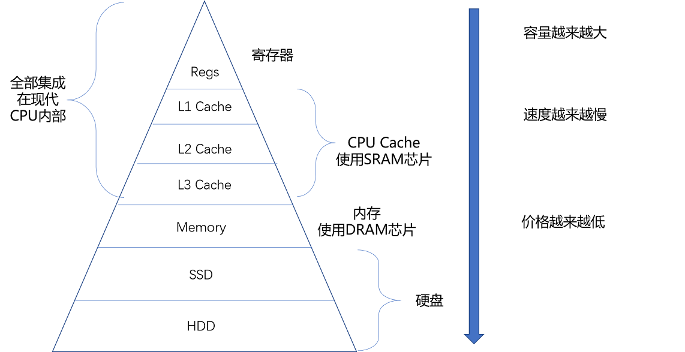

从 Cache、内存，到 SSD 和 HDD 硬盘，一台现代计算机中，就用上了所有这些存储器设备。其中，容量越小的设备速度越快，而且，CPU 并不是直接和每一种存储器设备打交道，而是每一种存储器设备，只和它相邻的存储设备打交道。比如，CPU Cache 是从内存里加载而来的，或者需要写回内存，并不会直接写回数据到硬盘，也不会直接从硬盘加载数据到 CPU Cache 中，而是先加载到内存，再从内存加载到 Cache 中。

**这样，各个存储器只和相邻的一层存储器打交道，并且随着一层层向下，存储器的容量逐层增大，访问速度逐层变慢，而单位存储成本也逐层下降，也就构成了我们日常所说的存储器层次结构。**

## 使用存储器的时候，该如何权衡价格和性能？

存储器在不同层级之间的性能差异和价格差异，都至少在一个数量级以上。L1 Cache 的访问延时是 1 纳秒（ns），而内存就已经是 100 纳秒了。在价格上，这两者也差出了 400 倍。

我这里放了一张各种存储器成本的对比表格，你可以看看。你也可以在点击这个链接，通过拖拉，查看 1990～2020 年随着硬件设备的进展，访问延时的变化。


因为这个价格和性能的差异，你会看到，我们实际在进行电脑硬件配置的时候，会去组合配置各种存储设备。

我们可以找一台现在主流的笔记本电脑来看看，比如，一款入门级的惠普战 66 的笔记本电脑。今天在京东上的价格是 4999 人民币。它的配置是下面这样的。

1. Intle i5-8265U 的 CPU（这是一块 4 核的 CPU）

- 这块 CPU 每个核有 32KB，一共 128KB 的 L1 指令 Cache。
- 同样，每个核还有 32KB，一共 128KB 的 L1 数据 Cache，指令 Cache 和数据 Cache 都是采用 8 路组相连的放置策略。
- 每个核有 256KB，一共 1MB 的 L2 Cache。L2 Cache 是用 4 路组相连的放置策略。
- 最后还有一块多个核心共用的 12MB 的 L3 Cache，采用的是 12 路组相连的放置策略。

2. 8GB 的内存
3. 一块 128G 的 SSD 硬盘
4. 一块 1T 的 HDD 硬盘

你可以看到，在一台实际的计算机里面，越是速度快的设备，容量就越小。这里一共十多兆的 Cache，成本只是几十美元。而 8GB 的内存、128G 的 SSD 以及 1T 的 HDD，大概零售价格加在一起，也就和我们的高速缓存的价格差不多。

## 总结延伸

我们常常把 CPU 比喻成高速运转的大脑，那么和大脑同步的寄存器（Register），就存放着我们当下正在思考和处理的数据。而 L1-L3 的 CPU Cache，好比存放在我们大脑中的短期到长期的记忆。我们需要小小花费一点时间，就能调取并进行处理。

我们自己的书桌书架就好比计算机的内存，能放下更多的书也就是数据，但是找起来和看起来就要慢上不少。而图书馆更像硬盘这个外存，能够放下更多的数据，找起来也更费时间。从寄存器、CPU Cache，到内存、硬盘，这样一层层下来的存储器，速度越来越慢，空间越来越大，价格也越来越便宜。

这三个“越来越”的特性，使得我们在组装计算机的时候，要组合使用各种存储设备。越是快且贵的设备，实际在一台计算机里面的存储空间往往就越小。而越是慢且便宜的设备，在实际组装的计算机里面的存储空间就会越大。

在后面的关于存储器的内容里，我会带着你进一步深入了解，各个层次的存储器是如何运作的，在不同类型的应用和性能要求下，是否可以靠人工添加一层缓存层来解决问题，以及在程序开发层面，如何利用好不同层次的存储器设备的访问原理和特性。

<h1 id="chapter36">36 | 局部性原理：数据库性能跟不上，加个缓存就好了？</h1>

平时进行服务端软件开发的时候，我们通常会把数据存储在数据库里。而服务端系统遇到的第一个性能瓶颈，往往就发生在访问数据库的时候。这个时候，大部分工程师和架构师会拿出一种叫作“缓存”的武器，通过使用 Redis 或者 Memcache 这样的开源软件，在数据库前面提供一层缓存的数据，来缓解数据库面临的压力，提升服务端的程序性能。


那么，不知道你有没有想过，这种添加缓存的策略一定是有效的吗？或者说，这种策略在什么情况下是有效的呢？如果从理论角度去分析，添加缓存一定是我们的最佳策略么？进一步地，如果我们对于访问性能的要求非常高，希望数据在 1 毫秒，乃至 100 微妙内完成处理，我们还能用这个添加缓存的策略么？

## 理解局部性原理

我们先来回顾一下，上一讲的这张不同存储器的性能和价目表。可以看到，不同的存储器设备之间，访问速度、价格和容量都有几十乃至上千倍的差异。


以上一讲的 Intel 8265U 的 CPU 为例，它的 L1 Cache 只有 256K，L2 Cache 有个 1MB，L3 Cache 有 12MB。一共 13MB 的存储空间，如果按照 7 美元 /1MB 的价格计算，就要 91 美元。

我们的内存有 8GB，容量是 CPU Cache 的 600 多倍，按照表上的价格差不多就是 120 美元。如果按照今天京东上的价格，恐怕不到 40 美元。128G 的 SSD 和 1T 的 HDD，现在的价格加起来也不会超过 100 美元。虽然容量是内存的 16 倍乃至 128 倍，但是它们的访问速度却不到内存的 1/1000。

性能和价格的巨大差异，给我们工程师带来了一个挑战：**我们能不能既享受 CPU Cache 的速度，又享受内存、硬盘巨大的容量和低廉的价格呢？**你可以停下来自己思考一下，或者点击文章右上方的“请朋友读”，邀请你的朋友一起来思考这个问题。然后，再一起听我的讲解。

好了，现在我公布答案。想要同时享受到这三点，前辈们已经探索出了答案，那就是，存储器中数据的**局部性原理**（Principle of Locality）。我们可以利用这个局部性原理，来制定管理和访问数据的策略。这个局部性原理包括**时间局部性**（temporal locality）和**空间局部性**（spatial locality）这两种策略。

我们先来看**时间局部性**。这个策略是说，如果一个数据被访问了，那么它在短时间内还会被再次访问。这么看这个策略有点奇怪是吧？我用一个简单的例子给你解释下，你一下就能明白了。

比如说，《哈利波特与魔法石》这本小说，我今天读了一会儿，没读完，明天还会继续读。同理，在一个电子商务型系统中，如果一个用户打开了 App，看到了首屏。我们推断他应该很快还会再次访问网站的其他内容或者页面，我们就将这个用户的个人信息，从存储在硬盘的数据库读取到内存的缓存中来。这利用的就是时间局部性。

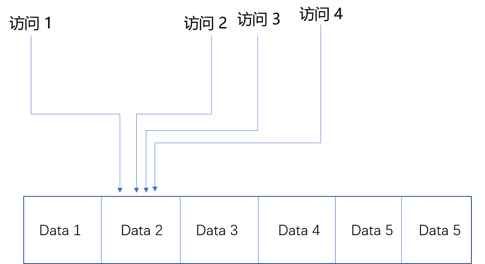

我们再来看**空间局部性**。这个策略是说，如果一个数据被访问了，那么和它相邻的数据也很快会被访问。

我们还拿刚才读《哈利波特与魔法石》的例子来说。我读完了这本书之后，感觉这书不错，所以就会借阅整套“哈利波特”。这就好比我们的程序，在访问了数组的首项之后，多半会循环访问它的下一项。因为，在存储数据的时候，数组内的多项数据会存储在相邻的位置。这就好比图书馆会把“哈利波特”系列放在一个书架上，摆放在一起，加载的时候，也会一并加载。我们去图书馆借书，往往会一次性把 7 本都借回来。


有了时间局部性和空间局部性，我们不用再把所有数据都放在内存里，也不用都放在 HDD 硬盘上，而是把访问次数多的数据，放在贵但是快一点的存储器里，把访问次数少的数据，放在慢但是大一点的存储器里。这样组合使用内存、SSD 硬盘以及 HDD 硬盘，使得我们可以用最低的成本提供实际所需要的数据存储、管理和访问的需求。

## 如何花最少的钱，装下亚马逊的所有商品？

了解了局部性原理，下面我用一些真实世界中的数据举个例子，带你做个小小的思维体操，来看一看通过局部性原理，利用不同层次存储器的组合，究竟会有什么样的好处。

我们现在要提供一个亚马逊这样的电商网站。我们假设里面有 6 亿件商品，如果每件商品需要 4MB 的存储空间（考虑到商品图片的话，4MB 已经是一个相对较小的估计了），那么一共需要 2400TB（  =  6 亿  × 4MB）的数据存储。

如果我们把数据都放在内存里面，那就需要 3600 万美元（  =  2400TB/1MB  × 0.015 美元  =  3600 万美元）。但是，这 6 亿件商品中，不是每一件商品都会被经常访问。比如说，有 Kindle 电子书这样的热销商品，也一定有基本无人问津的商品，比如偏门的缅甸语词典。

如果我们只在内存里放前 1% 的热门商品，也就是 600 万件热门商品，而把剩下的商品，放在机械式的 HDD 硬盘上，那么，我们需要的存储成本就下降到 45.6 万美元（  =  3600 万美元 × 1% + 2400TB / 1MB × 0.00004 美元），是原来成本的 1.3% 左右。

这里我们用的就是时间局部性。我们把有用户访问过的数据，加载到内存中，一旦内存里面放不下了，我们就把最长时间没有在内存中被访问过的数据，从内存中移走，这个其实就是我们常用的 **LRU（Least Recently Used）缓存算法**。热门商品被访问得多，就会始终被保留在内存里，而冷门商品被访问得少，就只存放在 HDD 硬盘上，数据的读取也都是直接访问硬盘。即使加载到内存中，也会很快被移除。越是热门的商品，越容易在内存中找到，也就更好地利用了内存的随机访问性能。

那么，只放 600 万件商品真的可以满足我们实际的线上服务请求吗？这个就要看 LRU 缓存策略的**缓存命中率**（Hit Rate/Hit Ratio）了，也就是访问的数据中，可以在我们设置的内存缓存中找到的，占有多大比例。

内存的随机访问请求需要 100ns。这也就意味着，在极限情况下，内存可以支持 1000 万次随机访问。我们用了 24TB 内存，如果 8G 一条的话，意味着有 3000 条内存，可以支持每秒 300 亿次（  =  24TB/8GB  ×  1s/100ns）访问。以亚马逊 2017 年 3 亿的用户数来看，我们估算每天的活跃用户为 1 亿，这 1 亿用户每人平均会访问 100 个商品，那么平均每秒访问的商品数量，就是 12 万次。

但是如果数据没有命中内存，那么对应的数据请求就要访问到 HDD 磁盘了。刚才的图表中，我写了，一块 HDD 硬盘只能支撑每秒 100 次的随机访问，2400TB 的数据，以 4TB 一块磁盘来计算，有 600 块磁盘，也就是能支撑每秒 6 万次（  =  2400TB/4TB  × 1s/10ms  ）的随机访问。

这就意味着，所有的商品访问请求，都直接到了 HDD 磁盘，HDD 磁盘支撑不了这样的压力。我们至少要 50% 的缓存命中率，HDD 磁盘才能支撑对应的访问次数。不然的话，我们要么选择添加更多数量的 HDD 硬盘，做到每秒 12 万次的随机访问，或者将 HDD 替换成 SSD 硬盘，让单个硬盘可以支持更多的随机访问请求。


当然，这里我们只是一个简单的估算。在实际的应用程序中，查看一个商品的数据可能意味着不止一次的随机内存或者随机磁盘的访问。对应的数据存储空间也不止要考虑数据，还需要考虑维护数据结构的空间，而缓存的命中率和访问请求也要考虑均值和峰值的问题。

通过这个估算过程，你需要理解，如何进行存储器的硬件规划。你需要考虑硬件的成本、访问的数据量以及访问的数据分布，然后根据这些数据的估算，来组合不同的存储器，能用尽可能低的成本支撑所需要的服务器压力。而当你用上了数据访问的局部性原理，组合起了多种存储器，你也就理解了怎么基于存储器层次结构，来进行硬件规划了。

## 总结延伸

这一讲，我们讲解了计算机存储器层次结构中最重要的一个优化思路，就是局部性原理。

在实际的计算机日常的开发和应用中，我们对于数据的访问总是会存在一定的局部性。有时候，这个局部性是时间局部性，就是我们最近访问过的数据还会被反复访问。有时候，这个局部性是空间局部性，就是我们最近访问过数据附近的数据很快会被访问到。

而局部性的存在，使得我们可以在应用开发中使用缓存这个有利的武器。比如，通过将热点数据加载并保留在速度更快的存储设备里面，我们可以用更低的成本来支撑服务器。

通过亚马逊这个例子，我们可以看到，我们可以通过快速估算的方式，来判断这个添加缓存的策略是否能够满足我们的需求，以及在估算的服务器负载的情况下，需要规划多少硬件设备。这个“估算 + 规划”的能力，是每一个期望成长为架构师的工程师，必须掌握的能力。

最后，回到这一讲的开头，我问了你这样一个问题，在遇到性能问题，特别是访问存储器的性能问题的时候，是否可以简单地添加一层数据缓存就能让问题迎刃而解呢？今天这个亚马逊网站商品数据的例子，似乎给了我们一个“Yes”的答案。那么，这个答案是否放之四海皆准呢？后面的几讲，我们会深入各种应用场景，进一步来回答这个问题。

