# 编译原理之美

- [理解代码：编译器的前端技术](#frontend)
- [正则文法和有限自动机：纯手工打造词法分析器](#finiteAutomaton)
- [语法分析（一）：纯手工打造公式计算器](#grammaticalAnalysis1)
- [语法分析（二）：解决二元表达式中的难点](#grammaticalAnalysis2)
- [语法分析（三）：实现一门简单的脚本语言](#grammaticalAnalysis3)
- [编译器前端工具（一）：用 Antlr 生成词法、语法分析器](#frontendTool1)

<h1 id="frontend">理解代码：编译器的前端技术</h1>

这里的“前端（Front End）”指的是编译器对程序代码的分析和理解过程。它通常只跟语言的语法有关，跟目标机器无关。而与之对应的“后端（Back End）”则是生成目标代码的过程，跟目标机器有关。为了方便你理解，我用一张图直观地展现了编译器的整个编译过程。


## 词法分析（Lexical Analysis）

通常，编译器的第一项工作叫做词法分析。就像阅读文章一样，文章是由一个个的中文单词组成的。程序处理也一样，只不过这里不叫单词，而是叫做“词法记号”，英文叫 Token。

举个例子，看看下面这段代码，如果我们要读懂它，首先要怎么做呢？

```c++
#include <stdio.h>
int main(int argc, char* argv[]){
    int age = 45;
    if (age >= 17+8+20) {
        printf("Hello old man!\\n");
    }
    else{
        printf("Hello young man!\\n");
    }
    return 0;
}
```

我们会识别出 if、else、int 这样的关键字，main、printf、age 这样的标识符，+、-、= 这样的操作符号，还有花括号、圆括号、分号这样的符号，以及数字字面量、字符串字面量等。这些都是 Token。

我们可以通过制定一些规则来区分每个不同的 Token，我举了几个例子，你可以看一下。

- <strong>识别 age 这样的标识符。</strong>它以字母开头，后面可以是字母或数字，直到遇到第一个既不是字母又不是数字的字符时结束。

- <strong>识别 >= 这样的操作符。</strong> 当扫描到一个 > 字符的时候，就要注意，它可能是一个 GT（Greater Than，大于）操作符。但由于 GE（Greater Equal，大于等于）也是以 > 开头的，所以再往下再看一位，如果是 =，那么这个 Token 就是 GE，否则就是 GT。

- <strong>识别 45 这样的数字字面量。</strong>当扫描到一个数字字符的时候，就开始把它看做数字，直到遇到非数字的字符。

这些规则可以通过手写程序来实现。事实上，很多编译器的词法分析器都是手写实现的，例如 GNU 的 C 语言编译器。

如果嫌手写麻烦，或者你想花更多时间陪恋人或家人，也可以偷点儿懒，用词法分析器的生成工具来生成，比如 Lex（或其 GNU 版本，Flex）。这些生成工具是基于一些规则来工作的，这些规则用“正则文法”表达，符合正则文法的表达式称为“正则表达式”。生成工具可以读入正则表达式，生成一种叫“有限自动机”的算法，来完成具体的词法分析工作。

有限自动机是有限个状态的自动机器。我们可以拿抽水马桶举例，它分为两个状态：“注水”和“水满”。摁下冲马桶的按钮，它转到“注水”的状态，而浮球上升到一定高度，就会把注水阀门关闭，它转到“水满”状态。

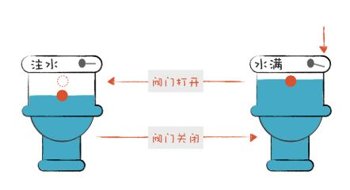

词法分析器也是一样，它分析整个程序的字符串，当遇到不同的字符时，会驱使它迁移到不同的状态。例如，词法分析程序在扫描 age 的时候，处于“标识符”状态，等它遇到一个 > 符号，就切换到“比较操作符”的状态。词法分析过程，就是这样一个个状态迁移的过程。

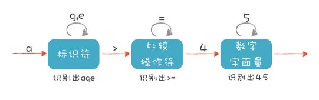

## 语法分析 （Syntactic Analysis, or Parsing）

编译器下一个阶段的工作是语法分析。词法分析是识别一个个的单词，而语法分析就是在词法分析的基础上识别出程序的语法结构。这个结构是一个树状结构，是计算机容易理解和执行的。

以自然语言为例。自然语言有定义良好的语法结构，比如，“我喜欢又聪明又勇敢的你”这个句子包含了“主、谓、宾”三个部分。主语是“我”，谓语是“喜欢”，宾语部分是“又聪明又勇敢的你”。其中宾语部分又可以拆成两部分，“又聪明又勇敢”是定语部分，用来修饰“你”。定语部分又可以分成“聪明”和“勇敢”两个最小的单位。

这样拆下来，会构造一棵树，里面的每个子树都有一定的结构，而这个结构要符合语法。比如，汉语是用“主谓宾”的结构，日语是用“主宾谓”的结构。这时，我们说汉语和日语的语法规则是不同的。

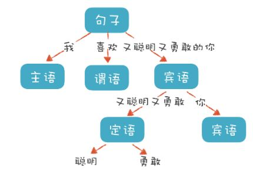

程序也有定义良好的语法结构，它的语法分析过程，就是构造这么一棵树。一个程序就是一棵树，这棵树叫做**抽象语法树**（Abstract Syntax Tree，AST）。树的每个节点（子树）是一个语法单元，这个单元的构成规则就叫“语法”。每个节点还可以有下级节点。

如果你觉得不够直观，可以参考[网址](https://resources.jointjs.com/demos/javascript-ast)，它能够生成 JavaScript 语言的 AST，并以更加直观的方式呈现。

在这个网址里输入一个可以计算的表达式，例如“2+3\*5”，你会得到一棵类似下图的 AST。

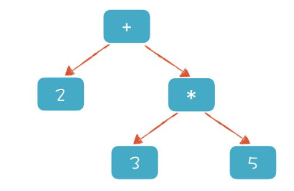

**形成 AST 以后有什么好处呢？就是计算机很容易去处理。**比如，针对表达式形成的这棵树，从根节点遍历整棵树就可以获得表达式的值。基于这个原理，我在后面的课程中会带你实现一个计算器，并实现自定义公式功能。

如果再把循环语句、判断语句、赋值语句等节点加到 AST 上，并解释执行它，那么你实际上就实现了一个脚本语言。而执行脚本语言的过程，就是遍历 AST 的过程。当然，在后面的课程中，我也会带你实际实现一个脚本语言。

**好了，你已经知道了 AST 的作用，那么怎样写程序构造它呢？**

一种非常直观的构造思路是自上而下进行分析。首先构造根节点，代表整个程序，之后向下扫描 Token 串，构建它的子节点。当它看到一个 int 类型的 Token 时，知道这儿遇到了一个变量声明语句，于是建立一个“变量声明”节点；接着遇到 age，建立一个子节点，这是第一个变量；之后遇到 =，意味着这个变量有初始化值，那么建立一个初始化的子节点；最后，遇到“字面量”，其值是 45。

这样，一棵子树就扫描完毕了。程序退回到根节点，开始构建根节点的第二个子节点。这样递归地扫描，直到构建起一棵完整的树。

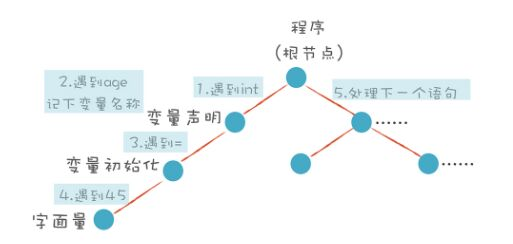

这个算法就是非常常用的递归下降算法（Recursive Descent Parsing）。

递归下降算法是一种自顶向下的算法，与之对应的，还有自底向上的算法。这个算法会先将最下面的叶子节点识别出来，然后再组装上一级节点。有点儿像搭积木，我们总是先构造出小的单元，然后再组装成更大的单元。

很多同学其实已经做过语法解析的工作，比如编写一个自定义公式的功能，对公式的解析就是语法分析过程。另一个例子是分析日志文件等文本文件，对每行日志的解析，本质上也是语法分析过程。解析用 XML、JSON 写的各种配置文件、模型定义文件的过程，其实本质也是语法分析过程，甚至还包含了语义分析工作。

## 语义分析（Semantic Analysis）

好了，讲完了词法分析、语法分析，编译器接下来做的工作是语义分析。说白了，语义分析就是要让计算机理解我们的真实意图，把一些模棱两可的地方消除掉。

你可能会觉得理解自然语言的含义已经很难了，所以计算机语言的语义分析也一定很难。其实语义分析没那么复杂，因为计算机语言的语义一般可以表达为一些规则，你只要检查是否符合这些规则就行了。比如：

- 某个表达式的计算结果是什么数据类型？如果有数据类型不匹配的情况，是否要做自动转换？
- 如果在一个代码块的内部和外部有相同名称的变量，我在执行的时候到底用哪个？ 就像“我喜欢又聪明又勇敢的你”中的“你”，到底指的是谁，需要明确。
- 在同一个作用域内，不允许有两个名称相同的变量，这是唯一性检查。你不能刚声明一个变量 a，紧接着又声明同样名称的一个变量 a，这就不允许了。

语义分析基本上就是做这样的事情，也就是根据语义规则进行分析判断。

语义分析工作的某些成果，会作为属性标注在抽象语法树上，比如在 age 这个标识符节点和 45 这个字面量节点上，都会标识它的数据类型是 int 型的。

在这个树上还可以标记很多属性，有些属性是在之前的两个阶段就被标注上了，比如所处的源代码行号，这一行的第几个字符。这样，在编译程序报错的时候，就可以比较清楚地了解出错的位置。

做了这些属性标注以后，编译器在后面就可以依据这些信息生成目标代码了，我们在编译技术的后端部分会去讲。

## 小结

- 词法分析是把程序分割成一个个 Token 的过程，可以通过构造有限自动机来实现。
- 语法分析是把程序的结构识别出来，并形成一棵便于由计算机处理的抽象语法树。可以用递归下降的算法来实现。
- 语义分析是消除语义模糊，生成一些属性信息，让计算机能够依据这些信息生成目标代码。

<h1 id="finiteAutomaton">正则文法和有限自动机：纯手工打造词法分析器</h1>

字符串是一连串的字符形成的，怎么把它断开成一个个的 Token 呢？分割的依据是什么呢？本节课，会通过讲解正则表达式（Regular Expression）和有限自动机的知识带你解决这个问题。

其实，我们手工打造词法分析器的过程，就是写出正则表达式，画出有限自动机的图形，然后根据图形直观地写出解析代码的过程。而我今天带你写的词法分析器，能够分析以下 3 个程序语句：

- age >= 45
- int age = 40
- 2+3\*5

它们分别是关系表达式、变量声明和初始化语句，以及算术表达式。

接下来，我们先来解析一下“age >= 45”这个关系表达式，这样你就能理解有限自动机的概念，知道它是做词法解析的核心机制了。

## 解析 age >= 45


我们来描述一下标识符、比较操作符和数字字面量这三种 Token 的词法规则。

- **标识符：**第一个字符必须是字母，后面的字符可以是字母或数字。
- **比较操作符：**> 和 >=（其他比较操作符暂时忽略）。
- **数字字面量：**全部由数字构成（像带小数点的浮点数，暂时不管它）。

我们就是依据这样的规则，来构造有限自动机的。这样，词法分析程序在遇到 age、>= 和 45 时，会分别识别成标识符、比较操作符和数字字面量。不过上面的图只是一个简化的示意图，一个严格意义上的有限自动机是下面这种画法：

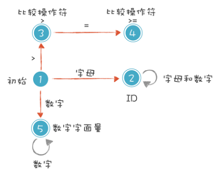

解释一下上图的 5 种状态。

1.  **初始状态：**刚开始启动词法分析的时候，程序所处的状态。
2.  **标识符状态：**在初始状态时，当第一个字符是字母的时候，迁移到状态 2。当后续字符是字母和数字时，保留在状态 2。如果不是，就离开状态 2，写下该 Token，回到初始状态。
3.  **大于操作符（GT）：**在初始状态时，当第一个字符是 > 时，进入这个状态。它是比较操作符的一种情况。
4.  **大于等于操作符（GE）：**如果状态 3 的下一个字符是 =，就进入状态 4，变成 >=。它也是比较操作符的一种情况。
5.  **数字字面量：**在初始状态时，下一个字符是数字，进入这个状态。如果后续仍是数字，就保持在状态 5。

补充一下，你能看到上图中的圆圈有单线的也有双线的。双线的意思是这个状态已经是一个合法的 Token 了，单线的意思是这个状态还是临时状态。

按照这 5 种状态迁移过程，你很容易编成程序（我用 Java 写了代码示例，你可以用自己熟悉的语言编写）。我们先从状态 1 开始，在遇到不同的字符时，分别进入 2、3、5 三个状态：

```java
DfaState newState = DfaState.Initial;
if (isAlpha(ch)) {              // 第一个字符是字母
    newState = DfaState.Id; // 进入 Id 状态
    token.type = TokenType.Identifier;
    tokenText.append(ch);
} else if (isDigit(ch)) {       // 第一个字符是数字
    newState = DfaState.IntLiteral;
    token.type = TokenType.IntLiteral;
    tokenText.append(ch);
} else if (ch == '>') {         // 第一个字符是 >
    newState = DfaState.GT;
    token.type = TokenType.GT;
    tokenText.append(ch);
}
```

上面的代码中，用 Java 中的枚举（enum）类型定义了一些枚举值来代表不同的状态，让代码更容易读。

我们接着处理进入 2、3、5 三个状态之后的状态迁移过程：

```java
case Initial:
    state = initToken(ch);          // 重新确定后续状态
    break;
case Id:
    if (isAlpha(ch) || isDigit(ch)) {
        tokenText.append(ch);       // 保持标识符状态
    } else {
        state = initToken(ch); // 退出标识符状态，并保存 Token
    }
    break;
case GT:
    if (ch == '=') {
        token.type = TokenType.GE;  // 转换成 GE
        state = DfaState.GE;
        tokenText.append(ch);
    } else {
        state = initToken(ch);      // 退出 GT 状态，并保存 Token
    }
    break;
case GE:
    state = initToken(ch);        // 退出当前状态，并保存 Token
    break;
case IntLiteral:
    if (isDigit(ch)) {
        tokenText.append(ch);    // 继续保持在数字字面量状态
    } else {
        state = initToken(ch);    // 退出当前状态，并保存 Token
    }
    break;
```

示例程序的输出如下，其中第一列是 Token 的类型，第二列是 Token 的文本值：

```java
Identifier   age
GE           >=  
IntLiteral   45  
```

上面的例子虽然简单，但其实已经讲清楚了词法原理，**就是依据构造好的有限自动机，在不同的状态中迁移，从而解析出 Token 来。**你只要再扩展这个有限自动机，增加里面的状态和迁移路线，就可以逐步实现一个完整的词法分析器了。

## 初识正则表达式

上面的例子涉及了 4 种 Token，这 4 种 Token 用正则表达式表达，是下面的样子：

```java
Id :        [a-zA-Z_] ([a-zA-Z_] | [0-9])*
IntLiteral: [0-9]+
GT :        '>'
GE :        '>='
```

## 解析 int age = 40，处理标识符和关键字规则的冲突

说完正则表达式，我们接着去处理其他词法，比如解析“int age = 40”这个语句，以这个语句为例研究一下词法分析中会遇到的问题：多个规则之间的冲突。

如果我们把这个语句涉及的词法规则用正则表达式写出来，是下面这个样子：

```
Int:        'int'
Id :        [a-zA-Z_] ([a-zA-Z_] | [0-9])*
Assignment : '='
```

int 这个字符串，既符合标识符的规则，又符合 int 这个关键字的规则，这两个规则发生了重叠。这样就起冲突了，我们扫描字符串的时候，到底该用哪个规则呢？

**在这里，我们来回顾一下：什么是关键字？**

> 关键字是语言设计中作为语法要素的词汇，例如表示数据类型的 int、char，表示程序结构的 while、if，表述特殊数据取值的 null、NAN 等。

> 除了关键字，还有一些词汇叫保留字。保留字在当前的语言设计中还没用到，但是保留下来，因为将来会用到。我们命名自己的变量、类名称，不可以用到跟关键字和保留字相同的字符串。**那么我们在词法分析器中，如何把关键字和保留字跟标识符区分开呢？**

以“int age = 40”为例，我们把有限自动机修改成下面的样子，借此解决关键字和标识符的冲突。

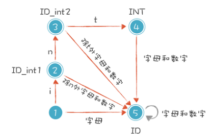

这个思路其实很简单。在识别普通的标识符之前，你先看看它是关键字还是保留字就可以了。具体做法是：

> 当第一个字符是 i 的时候，我们让它进入一个特殊的状态。接下来，如果它遇到 n 和 t，就进入状态 4。但这还没有结束，如果后续的字符还有其他的字母和数字，它又变成了普通的标识符。比如，我们可以声明一个 intA（int 和 A 是连着的）这样的变量，而不会跟 int 关键字冲突。

相应的代码也修改一下，文稿里的第一段代码要改成：

```java
if (isAlpha(ch)) {
    if (ch == 'i') {
        newState = DfaState.Id_int1;  // 对字符 i 特殊处理
    } else {
        newState = DfaState.Id;
    }
    ...  // 后续代码
}
```

第二段代码要增加下面的语句：

```java
case Id_int1:
    if (ch == 'n') {
        state = DfaState.Id_int2;
        tokenText.append(ch);
    }
    else if (isDigit(ch) || isAlpha(ch)){
        state = DfaState.Id;    // 切换回 Id 状态
        tokenText.append(ch);
    }
    else {
        state = initToken(ch);
    }
    break;
case Id_int2:
    if (ch == 't') {
        state = DfaState.Id_int3;
        tokenText.append(ch);
    }
    else if (isDigit(ch) || isAlpha(ch)){
        state = DfaState.Id;    // 切换回 Id 状态
        tokenText.append(ch);
    }
    else {
        state = initToken(ch);
    }
    break;
case Id_int3:
    if (isBlank(ch)) {
        token.type = TokenType.Int;
        state = initToken(ch);
    }
    else{
        state = DfaState.Id;    // 切换回 Id 状态
        tokenText.append(ch);
    }
    break;
```

接着，我们运行示例代码，就会输出下面的信息：

```
Int               int
Identifier        age
Assignment        =  
IntLiteral        45  
```

## 解析算术表达式

解析完“int age = 40”之后，我们再按照上面的方法增加一些规则，这样就能处理算术表达式，例如“2+3\*5”。 增加的词法规则如下：

```
Plus :  '+'
Minus : '-'
Star :  '*'
Slash : '/'
```

然后再修改一下有限自动机和代码，就能解析“2+3\*5”了，会得到下面的输出：

```
IntLiteral  2
Plus        +  
IntLiteral  3  
Star        *  
IntLiteral  5  
```

## 小结

本节课，我们实现了一个简单的词法分析器。你可以看到，要实现一个词法分析器，首先需要写出每个词法的正则表达式，并画出有限自动机，之后，只要用代码表示这种状态迁移过程就可以了。

**我们总是说理解原理以后，实现并不困难。**

反之，如果你在编程工作中遇到困难，往往是因为不清楚原理，没有将原理吃透。而这门课就是要帮助你真正吃透编译技术中的几个核心原理，让你将知识应用到实际工作中，解决工作中遇到的困难。

<h1 id="grammaticalAnalysis1">语法分析（一）：纯手工打造公式计算器</h1>

本节课将继续“手工打造”之旅，让你纯手工实现一个公式计算器，借此掌握**语法分析的原理**和**递归下降算法（Recursive Descent Parsing），并初步了解上下文无关文法（Context-free Grammar，CFG）。**

所举例的公式计算器支持加减乘除算术运算，比如支持“2 + 3 \* 5”的运算。

在学习语法分析时，我们习惯把上面的公式称为表达式。这个表达式看上去很简单，但你能借此学到很多语法分析的原理，例如左递归、优先级和结合性等问题。

## 解析变量声明语句：理解“下降”的含义

语法分析的结果是生成 AST。算法分为自顶向下和自底向上算法，其中，递归下降算法是一种常见的自顶向下算法。

我们首先把变量声明语句的规则，用形式化的方法表达一下。它的左边是一个非终结符（Non-terminal）。右边是它的产生式（Production Rule）。在语法解析的过程中，左边会被右边替代。如果替代之后还有非终结符，那么继续这个替代过程，直到最后全部都是终结符（Terminal），也就是 Token。只有终结符才可以成为 AST 的叶子节点。这个过程，也叫做推导（Derivation）过程：

```
intDeclaration : Int Identifier ('=' additiveExpression)?;
```

你可以看到，int 类型变量的声明，需要有一个 Int 型的 Token，加一个变量标识符，后面跟一个可选的赋值表达式。我们把上面的文法翻译成程序语句，伪代码如下：

```java
// 伪代码
MatchIntDeclare(){
  MatchToken(Int)；        // 匹配 Int 关键字
  MatchIdentifier();       // 匹配标识符
  MatchToken(equal);       // 匹配等号
  MatchExpression();       // 匹配表达式
}
```

实际代码在 SimpleCalculator.java 类的 IntDeclare() 方法中：

```java
SimpleASTNode node = null;
Token token = tokens.peek();    // 预读
if (token != null && token.getType() == TokenType.Int) {   // 匹配 Int
    token = tokens.read();      // 消耗掉 int
    if (tokens.peek().getType() == TokenType.Identifier) { // 匹配标识符
        token = tokens.read();  // 消耗掉标识符
        // 创建当前节点，并把变量名记到 AST 节点的文本值中，
        // 这里新建一个变量子节点也是可以的
        node = new SimpleASTNode(ASTNodeType.IntDeclaration, token.getText());
        token = tokens.peek();  // 预读
        if (token != null && token.getType() == TokenType.Assignment) {
            tokens.read();      // 消耗掉等号
            SimpleASTNode child = additive(tokens);  // 匹配一个表达式
            if (child == null) {
                throw new Exception("invalide variable initialization, expecting an expression");
            }
            else{
                node.addChild(child);
            }
        }
    } else {
        throw new Exception("variable name expected");
    }
}
```

直白地描述一下上面的算法：

> 解析变量声明语句时，我先看第一个 Token 是不是 int。如果是，那我创建一个 AST 节点，记下 int 后面的变量名称，然后再看后面是不是跟了初始化部分，也就是等号加一个表达式。我们检查一下有没有等号，有的话，接着再匹配一个表达式。

另外，从上面的代码中我们看到，程序是从一个 Token 的流中顺序读取。代码中的 peek() 方法是预读，只是读取下一个 Token，但并不把它从 Token 流中移除。在代码中，我们用 peek() 方法可以预先看一下下一个 Token 是否是等号，从而知道后面跟着的是不是一个表达式。而 read() 方法会从 Token 流中移除，下一个 Token 变成了当前的 Token。

这里需要注意的是，通过 peek() 方法来预读，实际上是对代码的优化，这有点儿预测的意味。我们后面会讲带有预测的自顶向下算法，它能减少回溯的次数。

我们把解析变量声明语句和表达式的算法分别写成函数。在语法分析的时候，调用这些函数跟后面的 Token 串做模式匹配。匹配上了，就返回一个 AST 节点，否则就返回 null。如果中间发现跟语法规则不符，就报编译错误。

在这个过程中，上级文法嵌套下级文法，上级的算法调用下级的算法。表现在生成 AST 中，上级算法生成上级节点，下级算法生成下级节点。**这就是“下降”的含义。**

**程序结构基本上是跟文法规则同构的。这就是递归下降算法的优点，非常直观。**

接着说回来，我们继续运行这个示例程序，输出 AST：

```java
Programm Calculator
    IntDeclaration age
        AssignmentExp =
            IntLiteral 45
```

前面的文法和算法都很简单，这样级别的文法没有超出正则文法。也就是说，并没有超出我们做词法分析时用到的文法。

## 用上下文无关文法描述算术表达式

我们解析算术表达式的时候，会遇到更复杂的情况，这时，正则文法不够用，我们必须用上下文无关文法来表达。

算术表达式要包含加法和乘法两种运算（简单起见，我们把减法与加法等同看待，把除法也跟乘法等同看待），加法和乘法运算有不同的优先级。我们的规则要能匹配各种可能的算术表达式：

- 2+3\*5
- 2\*3+5
- 2\*3
- ......

思考一番之后，我们把规则分成两级：第一级是加法规则，第二级是乘法规则。把乘法规则作为加法规则的子规则，这样在解析形成 AST 时，乘法节点就一定是加法节点的子节点，从而被优先计算。

```java
additiveExpression
    :   multiplicativeExpression
    |   additiveExpression Plus multiplicativeExpression
    ;

multiplicativeExpression
    :   IntLiteral
    |   multiplicativeExpression Star IntLiteral
    ;
```

你看，我们可以通过文法的嵌套，实现对运算优先级的支持。这样我们在解析“2 + 3 \* 5”这个算术表达式时会形成类似下面的 AST：

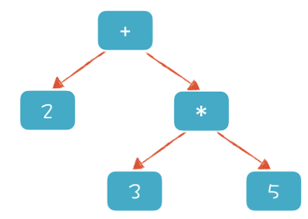

如果要计算表达式的值，只需要对根节点求值就可以了。为了完成对根节点的求值，需要对下级节点递归求值，所以我们先完成“3 \* 5 = 15”，然后再计算“2 + 15 = 17”。

应该注意的是，加法规则中还递归地又引用了加法规则。通过这种递归的定义，我们能展开、形成所有各种可能的算术表达式。比如“2+3\*5” 的推导过程：

```java
-->additiveExpression + multiplicativeExpression
-->multiplicativeExpression + multiplicativeExpression
-->IntLiteral + multiplicativeExpression
-->IntLiteral + multiplicativeExpression * IntLiteral
-->IntLiteral + IntLiteral * IntLiteral
```

这种文法已经没有办法改写成正则文法了，它比正则文法的表达能力更强，叫做<strong>“上下文无关文法”。</strong>正则文法是上下文无关文法的一个子集。它们的区别呢，就是上下文无关文法允许递归调用，而正则文法不允许。

上下文无关的意思是，无论在任何情况下，文法的推导规则都是一样的。比如，在变量声明语句中可能要用到一个算术表达式来做变量初始化，而在其他地方可能也会用到算术表达式。不管在什么地方，算术表达式的语法都一样，都允许用加法和乘法，计算优先级也不变。好在你见到的大多数计算机语言，都能用上下文无关文法来表达它的语法。

那有没有上下文相关的情况需要处理呢？也是有的，但那不是语法分析阶段负责的，而是放在语义分析阶段来处理的。

## 解析算术表达式：理解“递归”的含义

我们之前的算法只算是用到了“下降”，没有涉及“递归”，现在，我们就来看看如何用递归的算法翻译递归的文法。

我们先按照前面说的，把文法直观地翻译成算法。但是，我们遇到麻烦了。这个麻烦就是出现了无穷多次调用的情况。我们来看个例子。

为了简单化，我们采用下面这个简化的文法，去掉了乘法的层次：

```java
additiveExpression
    :   IntLiteral
    |   additiveExpression Plus IntLiteral
    ;
```

在解析 “2 + 3”这样一个最简单的加法表达式的时候，我们直观地将其翻译成算法，结果出现了如下的情况：

- 首先匹配是不是整型字面量，发现不是；
- 然后匹配是不是加法表达式，这里是递归调用；
- 会重复上面两步，无穷无尽。

“additiveExpression Plus multiplicativeExpression”这个文法规则的第一部分就递归地引用了自身，这种情况叫做**左递归。**通过上面的分析，我们知道左递归是递归下降算法无法处理的，这是递归下降算法最大的问题。

怎么解决呢？把“additiveExpression”调换到加号后面怎么样？我们来试一试。

```java
additiveExpression
    :   multiplicativeExpression
    |   multiplicativeExpression Plus additiveExpression
    ;
```

我们接着改写成算法，这个算法确实不会出现无限调用的问题：

```java
private SimpleASTNode additive(TokenReader tokens) throws Exception {
    SimpleASTNode child1 = multiplicative();  // 计算第一个子节点
    SimpleASTNode node = child1;  // 如果没有第二个子节点，就返回这个
    Token token = tokens.peek();
    if (child1 != null && token != null) {
        if (token.getType() == TokenType.Plus) {
            token = tokens.read();
            SimpleASTNode child2 = additive(); // 递归地解析第二个节点
            if (child2 != null) {
                node = new SimpleASTNode(ASTNodeType.AdditiveExp, token.getText());
                node.addChild(child1);
                node.addChild(child2);
            } else {
                throw new Exception("invalid additive expression, expecting the right part.");
            }
        }
    }
    return node;
}
```

> 我们先尝试能否匹配乘法表达式，如果不能，那么这个节点肯定不是加法节点，因为加法表达式的两个产生式都必须首先匹配乘法表达式。遇到这种情况，返回 null 就可以了，调用者就这次匹配没有成功。如果乘法表达式匹配成功，那就再尝试匹配加号右边的部分，也就是去递归地匹配加法表达式。如果匹配成功，就构造一个加法的 ASTNode 返回。

同样的，乘法的文法规则也可以做类似的改写：

```java
multiplicativeExpression
    :   IntLiteral
    |   IntLiteral Star multiplicativeExpression
    ;
```

现在我们貌似解决了左递归问题，运行这个算法解析 “2+3\*5”，得到下面的 AST：

```java
Programm Calculator
    AdditiveExp +
        IntLiteral 2
        MulticativeExp *
            IntLiteral 3
            IntLiteral 5
```

是不是看上去一切正常？可如果让这个程序解析“2+3+4”呢？

```java
Programm Calculator
    AdditiveExp +
        IntLiteral 2
        AdditiveExp +
            IntLiteral 3
            IntLiteral 4
```

问题是什么呢？计算顺序发生错误了。连续相加的表达式要从左向右计算，这是加法运算的结合性规则。但按照我们生成的 AST，变成从右向左了，先计算了“3+4”，然后才跟“2”相加。这可不行！

为什么产生上面的问题呢？是因为我们修改了文法，把文法中加号左右两边的部分调换了一下。造成的影响是什么呢？你可以推导一下“2+3+4”的解析过程：

- 首先调用乘法表达式匹配函数 multiplicative()，成功，返回了一个字面量节点 2。
- 接着看看右边是否能递归地匹配加法表达式。
- 匹配的结果，真的返回了一个加法表达式“3+4”，这个变成了第二个子节点。错误就出在这里了。这样的匹配顺序，“3+4”一定会成为子节点，在求值时被优先计算。

## 实现表达式求值

上面帮助你理解了“递归”的含义，接下来，我要带你实现表达式的求值。其实，要实现一个表达式计算，只需要基于 AST 做求值运算。这个计算过程比较简单，只需要对这棵树做深度优先的遍历就好了。

深度优先的遍历也是一个递归算法。以上文中“2 + 3 \* 5”的 AST 为例看一下。

- 对表达式的求值，等价于对 AST 根节点求值。
- 首先求左边子节点，算出是 2。
- 接着对右边子节点求值，这时候需要递归计算下一层。计算完了以后，返回是 15（3\*5）。
- 把左右节点相加，计算出根节点的值 17。

它的求值过程输出如下，你可以看到求值过程中遍历了整棵树：

```java
    Calculating: AdditiveExp          // 计算根节点
        Calculating: IntLiteral      // 计算第一个子节点
        Result: 2                     // 结果是 2
        Calculating: MulticativeExp   // 递归计算第二个子节点
            Calculating: IntLiteral
            Result: 3
            Calculating: IntLiteral
            Result: 5
        Result: 15                // 忽略递归的细节，得到结果是 15
    Result: 17                    // 根节点的值是 17
```

<h1 id="grammaticalAnalysis2">04 | 语法分析（二）：解决二元表达式中的难点</h1>

我们初步实现了一个公式计算器的过程中遇到了一些问题，比如怎么消除左递归，怎么确保正确的优先级和结合性。所以本节课的主要目的就是解决这几个问题，让你掌握像算术运算这样的二元表达式（Binary Expression）。

不过在课程开始之前，我想先带你简单地温习一下什么是左递归（Left Recursive）、优先级（Priority）和结合性（Associativity）。

在二元表达式的语法规则中，如果产生式的第一个元素是它自身，那么程序就会无限地递归下去，这种情况就叫做**左递归。**比如加法表达式的产生式“加法表达式 + 乘法表达式”，就是左递归的。而优先级和结合性则是计算机语言中与表达式有关的核心概念。它们都涉及了语法规则的设计问题。

## 书写语法规则，并进行推导

我们已经知道，语法规则是由上下文无关文法表示的，而上下文无关文法是由一组替换规则（又叫产生式）组成的，比如算术表达式的文法规则可以表达成下面这种形式：

```java
add -> mul | add + mul
mul -> pri | mul * pri
pri -> Id | Num | (add)
```

按照上面的产生式，add 可以替换成 mul，或者 add + mul。这样的替换过程又叫做“推导”。以“2+3\*5” 和 “2+3+4”这两个算术表达式为例，这两个算术表达式的推导过程分别如下图所示：

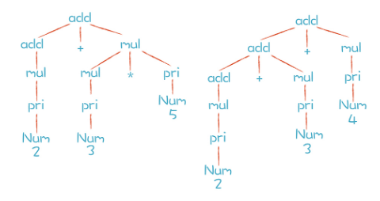

通过上图的推导过程，你可以清楚地看到这两个表达式是怎样生成的。而分析过程中形成的这棵树，其实就是 AST。只不过我们手写的算法在生成 AST 的时候，通常会做一些简化，省略掉中间一些不必要的节点。比如，“add-add-mul-pri-Num”这一条分支，实际手写时会被简化成“add-Num”。其实，简化 AST 也是优化编译过程的一种手段，如果不做简化，呈现的效果就是上图的样子。

那么，上图中两颗树的叶子节点有哪些呢？Num、+ 和 \* 都是终结符，终结符都是词法分析中产生的 Token。而那些非叶子节点，就是非终结符。**文法的推导过程，就是把非终结符不断替换的过程，让最后的结果没有非终结符，只有终结符。**

而在实际应用中，语法规则经常写成下面这种形式：

```java
add ::= mul | add + mul
mul ::= pri | mul * pri
pri ::= Id | Num | (add)
```

这种写法叫做 **“巴科斯范式”，**简称 BNF。Antlr 和 Yacc 这两个工具都用这种写法。为了简化书写，我有时会在课程中把“::=”简化成一个冒号。你看到的时候，知道是什么意思就可以了。

你有时还会听到一个术语，叫做 **扩展巴科斯范式 (EBNF)。**它跟普通的 BNF 表达式最大的区别，就是里面会用到类似正则表达式的一些写法。比如下面这个规则中运用了 \* 号，来表示这个部分可以重复 0 到多次：

```java
add -> mul (+ mul)*
```

其实这种写法跟标准的 BNF 写法是等价的，但是更简洁。为什么是等价的呢？因为一个项多次重复，就等价于通过递归来推导。从这里我们还可以得到一个推论：就是上下文无关文法包含了正则文法，比正则文法能做更多的事情。

## 确保正确的优先级

掌握了语法规则的写法之后，我们来看看如何用语法规则来保证表达式的优先级。刚刚，我们由加法规则推导到乘法规则，这种方式保证了 AST 中的乘法节点一定会在加法节点的下层，也就保证了乘法计算优先于加法计算。

听到这儿，你一定会想到，我们应该把关系运算（>、=、<）放在加法的上层，逻辑运算（and、or）放在关系运算的上层。的确如此，我们试着将它写出来：

```java
exp -> or | or = exp
or -> and | or || and
and -> equal | and && equal
equal -> rel | equal == rel | equal != rel
rel -> add | rel > add | rel < add | rel >= add | rel <= add
add -> mul | add + mul | add - mul
mul -> pri | mul * pri | mul / pri
```

这里表达的优先级从低到高是：赋值运算、逻辑运算（or）、逻辑运算（and）、相等比较（equal）、大小比较（rel）、加法运算（add）、乘法运算（mul）和基础表达式（pri）。

实际语言中还有更多不同的优先级，比如位运算等。而且优先级是能够改变的，比如我们通常会在语法里通过括号来改变计算的优先级。不过这怎么表达成语法规则呢？

其实，我们在最低层，也就是优先级最高的基础表达式（pri）这里，用括号把表达式包裹起来，递归地引用表达式就可以了。这样的话，只要在解析表达式的时候遇到括号，那么就知道这个是最优先的。这样的话就实现了优先级的改变：

```java
pri -> Id | Literal | (exp)
```

弄明白优先级的问题以后，我们再来讨论一下结合性这个问题。

## 确保正确的结合性

在上一讲中，针对算术表达式写的第二个文法是错的，因为它的计算顺序是错的。“2+3+4”这个算术表达式，先计算了“3+4”然后才和“2”相加，计算顺序从右到左，正确的应该是从左往右才对。

**这就是运算符的结合性问题。**什么是结合性呢？同样优先级的运算符是从左到右计算还是从右到左计算叫做结合性。我们常见的加减乘除等算术运算是左结合的，“.”符号也是左结合的。

比如“rectangle.center.x” 是先获得长方形（rectangle）的中心点（center），再获得这个点的 x 坐标。计算顺序是从左向右的。那有没有右结合的例子呢？肯定是有的。赋值运算就是典型的右结合的例子，比如“x = y = 10”。

我们再来回顾一下“2+3+4”计算顺序出错的原因。用之前错误的右递归的文法解析这个表达式形成的简化版本的 AST 如下：

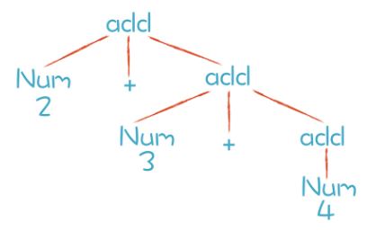

根据这个 AST 做计算会出现计算顺序的错误。不过如果我们将递归项写在左边，就不会出现这种结合性的错误。于是我们得出一个规律：**对于左结合的运算符，递归项要放在左边；而右结合的运算符，递归项放在右边。**

所以你能看到，我们在写加法表达式的规则的时候，是这样写的：

```java
add -> mul | add + mul
```

## 消除左递归

我提到过左递归的情况，也指出递归下降算法不能处理左递归。这里我要补充一点，并不是所有的算法都不能处理左递归，对于另外一些算法，左递归是没有问题的，比如 LR 算法。

消除左递归，用一个标准的方法，就能够把左递归文法改写成非左递归的文法。以加法表达式规则为例，原来的文法是“add -> add + mul”，现在我们改写成：

```java
add -> mul add'
add' -> + mul add' | ε
```

文法中，ε（读作 epsilon）是空集的意思。接下来，我们用刚刚改写的规则再次推导一下 “2+3+4”这个表达式，得到了下图中左边的结果：

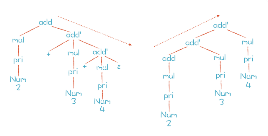

左边的分析树是推导后的结果。问题是，由于 add’的规则是右递归的，如果用标准的递归下降算法，我们会跟上一讲一样，又会出现运算符结合性的错误。我们期待的 AST 是右边的那棵，它的结合性才是正确的。那么有没有解决办法呢？

答案是有的。我们仔细分析一下上面语法规则的推导过程。只有第一步是按照 add 规则推导，之后都是按照 add’规则推导，一直到结束。

如果用 EBNF 方式表达，也就是允许用 \* 号和 + 号表示重复，上面两条规则可以合并成一条：

```java
add -> mul (+ mul)*
```

写成这样有什么好处呢？能够优化我们写算法的思路。对于 (+ mul)\* 这部分，我们其实可以写成一个循环，而不是一次次的递归调用。伪代码如下：

```java
mul();
while(next token is +){
  mul()
  createAddNode
}
```

我们扩展一下话题。在研究递归函数的时候，有一个概念叫做**尾递归，**尾递归函数的最后一句是递归地调用自身。

编译程序通常都会把尾递归转化为一个循环语句，使用的原理跟上面的伪代码是一样的。相对于递归调用来说，循环语句对系统资源的开销更低，因此，把尾递归转化为循环语句也是一种编译优化技术。

好了，我们继续左递归的话题。现在我们知道怎么写这种左递归的算法了，大概是下面的样子：

```java
private SimpleASTNode additive(TokenReader tokens) throws Exception {
    SimpleASTNode child1 = multiplicative(tokens);  // 应用 add 规则
    SimpleASTNode node = child1;
    if (child1 != null) {
        while (true) {                              // 循环应用 add'
            Token token = tokens.peek();
            if (token != null && (token.getType() == TokenType.Plus || token.getType() == TokenType.Minus)) {
                token = tokens.read();              // 读出加号
                SimpleASTNode child2 = multiplicative(tokens);  // 计算下级节点
                node = new SimpleASTNode(ASTNodeType.Additive, token.getText());
                node.addChild(child1);              // 注意，新节点在顶层，保证正确的结合性
                node.addChild(child2);
                child1 = node;
            } else {
                break;
            }
        }
    }
    return node;
}
```

修改完后，再次运行语法分析器分析“2+3+4+5”，会得到正确的 AST：

```java
Programm Calculator
    AdditiveExp +
        AdditiveExp +
            AdditiveExp +
                IntLiteral 2
                IntLiteral 3
            IntLiteral 4
        IntLiteral 5
```

## 小结

今天我们针对优先级、结合性和左递归这三个问题做了更系统的研究。我来带你梳理一下本节课的重点知识：

- 优先级是通过在语法推导中的层次来决定的，优先级越低的，越先尝试推导。
- 结合性是跟左递归还是右递归有关的，左递归导致左结合，右递归导致右结合。
- 左递归可以通过改写语法规则来避免，而改写后的语法又可以表达成简洁的 EBNF 格式，从而启发我们用循环代替右递归。

为了研究和解决这三个问题，我们还特别介绍了语法规则的产生式写法以及 BNF、EBNF 写法。在后面的课程中我们会不断用到这个技能，还会用工具来生成语法分析器，我们提供给工具的就是书写良好的语法规则。

<h1 id="grammaticalAnalysis3">语法分析（三）：实现一门简单的脚本语言</h1>

继续实现一些功能，比如：

- 支持变量声明和初始化语句，就像“int age” “int age = 45”和“int age = 17+8+20”；
- 支持赋值语句“age = 45”；
- 在表达式中可以使用变量，例如“age + 10 \*2”；
- 实现一个命令行终端，能够读取输入的语句并输出结果。

为了实现这些新的语法，我们首先要把它们用语法规则描述出来。

## 增加所需要的语法规则

首先，一门脚本语言是要支持语句的，比如变量声明语句、赋值语句等等。单独一个表达式，也可以视为语句，叫做“表达式语句”。你在终端里输入 2+3；，就能回显出 5 来，这就是表达式作为一个语句在执行。按照我们的语法，无非是在表达式后面多了个分号而已。C 语言和 Java 都会采用分号作为语句结尾的标识，我们也可以这样写。

我们用扩展巴科斯范式（EBNF）写出下面的语法规则：

```java
programm: statement+;  

statement
: intDeclaration
| expressionStatement
| assignmentStatement
;
```

**变量声明语句**以 int 开头，后面跟标识符，然后有可选的初始化部分，也就是一个等号和一个表达式，最后再加分号：

```java
intDeclaration : 'int' Identifier ( '=' additiveExpression)? ';';
```

**表达式语句**目前只支持加法表达式，未来可以加其他的表达式，比如条件表达式，它后面同样加分号：

```java
expressionStatement : additiveExpression ';';
```

**赋值语句**是标识符后面跟着等号和一个表达式，再加分号：

```java
assignmentStatement : Identifier '=' additiveExpression ';';
```

为了在表达式中可以使用变量，我们还需要把 primaryExpression 改写，除了包含整型字面量以外，还要包含标识符和用括号括起来的表达式：

```java
primaryExpression : Identifier| IntLiteral | '(' additiveExpression ')';
```

这样，我们就把想实现的语法特性，都用语法规则表达出来了。接下来，我们就一步一步实现这些特性。

## 让脚本语言支持变量

之前实现的公式计算器只支持了数字字面量的运算，如果能在表达式中用上变量，会更有用，比如能够执行下面两句：

```java
int age = 45;
age + 10 * 2;
```

这两个语句里面的语法特性包含了变量声明、给变量赋值，以及在表达式里引用变量。为了给变量赋值，我们必须在脚本语言的解释器中开辟一个存储区，记录不同的变量和它们的值：

```java
private HashMap<String, Integer> variables = new HashMap<String, Integer>();
```

我们简单地用了一个 HashMap 作为变量存储区。在变量声明语句和赋值语句里，都可以修改这个变量存储区中的数据，而获取变量值可以采用下面的代码：

```java
if (variables.containsKey(varName)) {
    Integer value = variables.get(varName);  // 获取变量值
    if (value != null) {
        result = value;                      // 设置返回值
    } else {                                 // 有这个变量，没有值
        throw new Exception("variable " + varName + " has not been set any value");
    }
}
else{ // 没有这个变量。
    throw new Exception("unknown variable: " + varName);
}
```

通过这样的一个简单的存储机制，我们就能支持变量了。当然，这个存储机制可能过于简单了，我们后面讲到作用域的时候，这么简单的存储机制根本不够。不过目前我们先这么用着，以后再考虑改进它。

## 解析赋值语句

接下来，我们来解析赋值语句，例如“age = age + 10 \* 2；”：

```java
private SimpleASTNode assignmentStatement(TokenReader tokens) throws Exception {
    SimpleASTNode node = null;
    Token token = tokens.peek();    // 预读，看看下面是不是标识符
    if (token != null && token.getType() == TokenType.Identifier) {
        token = tokens.read();      // 读入标识符
        node = new SimpleASTNode(ASTNodeType.AssignmentStmt, token.getText());
        token = tokens.peek();      // 预读，看看下面是不是等号
        if (token != null && token.getType() == TokenType.Assignment) {
            tokens.read();          // 取出等号
            SimpleASTNode child = additive(tokens);
            if (child == null) {    // 出错，等号右面没有一个合法的表达式
                throw new Exception("invalide assignment statement, expecting an expression");
            }
            else{
                node.addChild(child);   // 添加子节点
                token = tokens.peek();  // 预读，看看后面是不是分号
                if (token != null && token.getType() == TokenType.SemiColon) {
                    tokens.read();      // 消耗掉这个分号

                } else {            // 报错，缺少分号
                    throw new Exception("invalid statement, expecting semicolon");
                }
            }
        }
        else {
            tokens.unread();    // 回溯，吐出之前消化掉的标识符
            node = null;
        }
    }
    return node;
}
```

为了方便你理解，我来解读一下上面这段代码的逻辑：

> 我们既然想要匹配一个赋值语句，那么首先应该看看第一个 Token 是不是标识符。如果不是，那么就返回 null，匹配失败。如果第一个 Token 确实是标识符，我们就把它消耗掉，接着看后面跟着的是不是等号。如果不是等号，那证明我们这个不是一个赋值语句，可能是一个表达式什么的。那么我们就要回退刚才消耗掉的 Token，就像什么都没有发生过一样，并且返回 null。回退的时候调用的方法就是 unread()。

利用上面的代码，我们还可以改造一下变量声明语句中对变量初始化的部分，让它在初始化的时候支持表达式，因为这个地方跟赋值语句很像，例如“int newAge = age + 10 \* 2；”。

## 理解递归下降算法中的回溯

不知道你有没有发现，我在设计语法规则的过程中，其实故意设计了一个陷阱，这个陷阱能帮我们更好地理解递归下降算法的一个特点：**回溯。**理解这个特点能帮助你更清晰地理解递归下降算法的执行过程，从而再去想办法优化它。

考虑一下 age = 45；这个语句。肉眼看过去，你马上知道它是个赋值语句，但是当我们用算法去做模式匹配时，就会发生一些特殊的情况。看一下我们对 statement 语句的定义：

```
statement
: intDeclaration
| expressionStatement
| assignmentStatement
;
```

我们首先尝试 intDeclaration，但是 age = 45；语句不是以 int 开头的，所以这个尝试会返回 null。然后我们接着尝试 expressionStatement，看一眼下面的算法：

```java
private SimpleASTNode expressionStatement() throws Exception {
        int pos = tokens.getPosition();  // 记下初始位置
        SimpleASTNode node = additive(); // 匹配加法规则
        if (node != null) {
            Token token = tokens.peek();
            if (token != null && token.getType() == TokenType.SemiColon) {   // 要求一定以分号结尾
                tokens.read();
            } else {
                node = null;
                tokens.setPosition(pos); // 回溯
            }
        }
        return node;
    }
```

出现了什么情况呢？age = 45；语句最左边是一个标识符。根据我们的语法规则，标识符是一个合法的 addtiveExpresion，因此 additive() 函数返回一个非空值。接下来，后面应该扫描到一个分号才对，但是显然不是，标识符后面跟的是等号，这证明模式匹配失败。

失败了该怎么办呢？我们的算法一定要把 Token 流的指针拨回到原来的位置，就像一切都没发生过一样。因为我们不知道 addtive() 这个函数往下尝试了多少步，因为它可能是一个很复杂的表达式，消耗掉了很多个 Token，所以我们必须记下算法开始时候的位置，并在失败时回到这个位置。**尝试一个规则不成功之后，恢复到原样，再去尝试另外的规则，这个现象就叫做“回溯”。**

因为有可能需要回溯，所以递归下降算法有时会做一些无用功。在 assignmentStatement 的算法中，我们就通过 unread()，回溯了一个 Token。而在 expressionStatement 中，我们不确定要回溯几步，只好提前记下初始位置。匹配 expressionStatement 失败后，算法去尝试匹配 assignmentStatement。这次获得了成功。

试探和回溯的过程，是递归下降算法的一个典型特征。通过上面的例子，你应该对这个典型特征有了更清晰的理解。递归下降算法虽然简单，但它通过试探和回溯，却总是可以把正确的语法匹配出来，这就是它的强大之处。当然，缺点是回溯会拉低一点儿效率。但我们可以在这个基础上进行改进和优化，实现带有预测分析的递归下降，以及非递归的预测分析。有了对递归下降算法的清晰理解，我们去学习其他的语法分析算法的时候，也会理解得更快。

我们接着再讲回溯牵扯出的另一个问题：**什么时候该回溯，什么时候该提示语法错误？**

大家在阅读示例代码的过程中，应该发现里面有一些错误处理的代码，并抛出了异常。比如在赋值语句中，如果等号后面没有成功匹配一个加法表达式，我们认为这个语法是错的。因为在我们的语法中，等号后面只能跟表达式，没有别的可能性。

```java
token = tokens.read();          // 读出等号
node = additive();    // 匹配一个加法表达式
if (node == null) {
    // 等号右边一定需要有另一个表达式  
    throw new Exception("invalide assignment expression, expecting an additive expression");
}
```

在写编译程序的时候，我们不仅仅要能够解析正确的语法，还要尽可能针对语法错误提供友好的提示，帮助用户迅速定位错误。错误定位越是准确、提示越是友好，我们就越喜欢它。

好了，到目前为止，已经能够能够处理几种不同的语句，如变量声明语句，赋值语句、表达式语句，那么我们把所有这些成果放到一起，来体会一下使用自己的脚本语言的乐趣吧！

我们需要一个交互式的界面来输入程序，并执行程序，这个交互式的界面就叫做**REPL。**

## 实现一个简单的 REPL

脚本语言一般都会提供一个命令行窗口，让你输入一条一条的语句，马上解释执行它，并得到输出结果，比如 Node.js、Python 等都提供了这样的界面。**这个输入、执行、打印的循环过程就叫做 REPL（Read-Eval-Print Loop）。**你可以在 REPL 中迅速试验各种语句，REPL 即时反馈的特征会让你乐趣无穷。所以，即使是非常资深的程序员，也会经常用 REPL 来验证自己的一些思路，它相当于一个语言的 PlayGround（游戏场），是个必不可少的工具。

在 SimpleScript.java 中，我们也实现了一个简单的 REPL。基本上就是从终端一行行的读入代码，当遇到分号的时候，就解释执行，代码如下：

```java
SimpleParser parser = new SimpleParser();
SimpleScript script = new SimpleScript();
BufferedReader reader = new BufferedReader(new InputStreamReader(System.in));   // 从终端获取输入

String scriptText = "";
System.out.print("\n>");   // 提示符

while (true) {             // 无限循环
    try {
        String line = reader.readLine().trim(); // 读入一行
        if (line.equals("exit();")) {   // 硬编码退出条件
            System.out.println("good bye!");
            break;
        }
        scriptText += line + "\n";
        if (line.endsWith(";")) { // 如果没有遇到分号的话，会再读一行
            ASTNode tree = parser.parse(scriptText); // 语法解析
            if (verbose) {
                parser.dumpAST(tree, "");
            }

            script.evaluate(tree, ""); // 对 AST 求值，并打印

            System.out.print("\n>");   // 显示一个提示符

            scriptText = "";
        }

    } catch (Exception e) { // 如果发现语法错误，报错，然后可以继续执行
        System.out.println(e.getLocalizedMessage());
        System.out.print("\n>");   // 提示符
        scriptText = "";
    }
}
```

运行 java craft.SimpleScript，你就可以在终端里尝试各种语句了。如果是正确的语句，系统马上会反馈回结果。如果是错误的语句，REPL 还能反馈回错误信息，并且能够继续处理下面的语句。我们前面添加的处理语法错误的代码，现在起到了作用！下面是在我电脑上的运行情况：

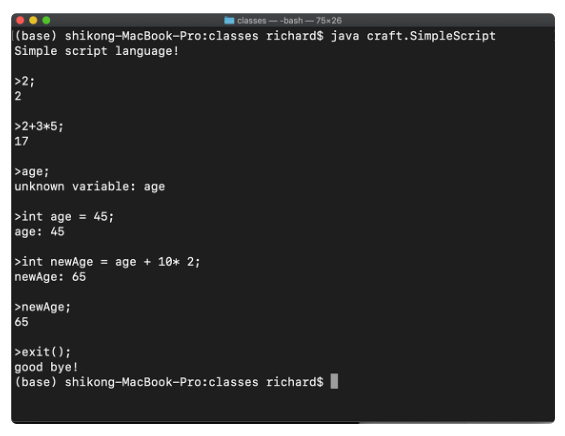

如果你用 java craft.SimpleScript -v 启动 REPL，则进入 Verbose 模式，它还会每次打印出 AST，你可以尝试一下。

退出 REPL 需要在终端输入 ctl+c，或者调用 exit() 函数。我们目前的解释器并没有支持函数，所以我们是在 REPL 里硬编码来实现 exit() 函数的。后面的课程里，我会带你真正地实现函数特性。

## 小结

学完这讲以后，你也能找到了一点感觉：Shell 脚本也好，PHP 也好，JavaScript 也好，Python 也好，其实都可以这样写出来。

回顾过去几讲，你已经可以分析词法、语法、进行计算，还解决了左递归、优先级、结合性的问题。甚至，你还能处理语法错误，让脚本解释器不会因为输入错误而崩溃。

<h1 id="frontendTool1">编译器前端工具（一）：用Antlr生成词法、语法分析器</h1>

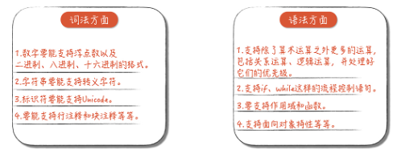

如果让编译程序实现上面这么多工作，完全手写效率会有点儿低，那么我们有什么方法可以提升效率呢？答案是借助工具。

编译器前端工具有很多，比如 Lex（以及 GNU 的版本 Flex）、Yacc（以及 GNU 的版本 Bison）、JavaCC 等等。你可能会问了：“那为什么我们这节课只讲 Antlr，不选别的工具呢？”主要有两个原因。

第一个原因是 Antlr 能支持更广泛的目标语言，包括 Java、C#、JavaScript、Python、Go、C++、Swift。无论你用上面哪种语言，都可以用它生成词法和语法分析的功能。而我们就使用它生成了 Java 语言和 C++ 语言两个版本的代码。

第二个原因是 Antlr 的语法更加简单。它能把类似左递归的一些常见难点在工具中解决，对提升工作效率有很大的帮助。这一点，你会在后面的课程中直观地感受到。

接下来，我们先来了解一下 Antlr 这个工具。

## 初识 Antlr

Antlr 是一个开源的工具，支持根据规则文件生成词法分析器和语法分析器，它自身是用 Java 实现的。

## 用 Antlr 生成词法分析器

你可能对 Antlr 还不怎么熟悉，所以我会先带你使用前面课程中，你已经比较熟悉的那些词法规则，让 Antlr 生成一个新的词法分析器，然后再借鉴一些成熟的规则文件，把词法分析器提升到更加专业、实用的级别。

Antlr 通过解析规则文件来生成编译器。规则文件以.g4 结尾，词法规则和语法规则可以放在同一个文件里。不过为了清晰起见，我们还是把它们分成两个文件，先用一个文件编写词法规则。

**为了让你快速进入状态，我们先做一个简单的练习预热一下。**我们创建一个 Hello.g4 文件，用于保存词法规则，然后把之前用过的一些词法规则写进去。

```
lexer grammar Hello;  //lexer 关键字意味着这是一个词法规则文件，名称是 Hello，要与文件名相同

// 关键字
If :               'if';
Int :              'int';

// 字面量
IntLiteral:        [0-9]+;
StringLiteral:      '"' .*? '"' ;  // 字符串字面量

// 操作符
AssignmentOP:       '=' ;
RelationalOP:       '>'|'>='|'<' |'<=' ;
Star:               '*';
Plus:               '+';
Sharp:              '#';
SemiColon:          ';';
Dot:                '.';
Comm:               ',';
LeftBracket :       '[';
RightBracket:       ']';
LeftBrace:          '{';
RightBrace:         '}';
LeftParen:          '(';
RightParen:         ')';

// 标识符
Id :                [a-zA-Z_] ([a-zA-Z_] | [0-9])*;

// 空白字符，抛弃
Whitespace:         [ \t]+ -> skip;
Newline:            ( '\r' '\n'?|'\n')-> skip;
```

你能很直观地看到，每个词法规则都是大写字母开头，这是 Antlr 对词法规则的约定。而语法规则是以小写字母开头的。其中，每个规则都是用我们已经了解的正则表达式编写的。

接下来，我们来编译词法规则，在终端中输入命令：

```
antlr Hello.g4
```

这个命令是让 Antlr 编译规则文件，并生成 Hello.java 文件和其他两个辅助文件。你可以打开看一看文件里面的内容。接着，我用下面的命令编译 Hello.java：

```shell
javac *.java
```

结果会生成 Hello.class 文件，这就是我们生成的词法分析器。接下来，我们来写个脚本文件，让生成的词法分析器解析一下：

```java
int age = 45;
if (age >= 17+8+20){
  printf("Hello old man!");
}
```

我们将上面的脚本存成 hello.play 文件，然后在终端输入下面的命令：

```shell
grun Hello tokens -tokens hello.play
```

grun 命令实际上是调用了我们刚才生成的词法分析器，即 Hello 类，打印出对 hello.play 词法分析的结果：

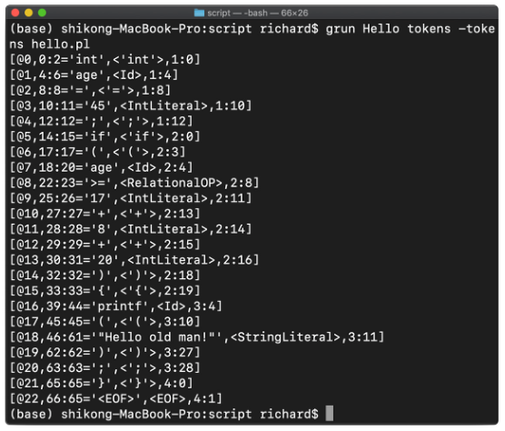

从结果中看到，我们的词法分析器把每个 Token 都识别了，还记录了它们在代码中的位置、文本值、类别。上面这些都是 Token 的属性。

以第二行 [@1, 4:6=‘age’,< Id >,1:4] 为例，其中 @1 是 Token 的流水编号，表明这是 1 号 Token；4:6 是 Token 在字符流中的开始和结束位置；age 是文本值，Id 是其 Token 类别；最后的 1:4 表示这个 Token 在源代码中位于第 1 行、第 4 列。

非常好，现在我们已经让 Antlr 顺利跑起来了！接下来，让词法规则更完善、更严密一些吧！**怎么做呢？当然是参考成熟的规则文件。**

从 Antlr 的一些示范性的规则文件中，我选了 Java 的作为参考。先看看我们之前写的字符串字面量的规则：

```
StringLiteral:      '"' .*? '"' ;  // 字符串字面量
```

我们的版本相当简化，就是在双引号可以包含任何字符。可这在实际中不大好用，因为连转义功能都没有提供。我们对于一些不可见的字符，比如回车，要提供转义功能，如“\n”。同时，如果字符串里本身有双引号的话，也要将它转义，如“\”。Unicode 也要转义。最后，转义字符本身也需要转义，如“\\”。

下面这一段内容是 Java 语言中的字符串字面量的完整规则。你可以看一下文稿，这个规则就很细致了，把各种转义的情况都考虑进去了：

```
STRING_LITERAL:     '"' (~["\\\r\n] | EscapeSequence)* '"';

fragment EscapeSequence
    : '\\' [btnfr"'\\]
    | '\\' ([0-3]? [0-7])? [0-7]
    | '\\' 'u'+ HexDigit HexDigit HexDigit HexDigit
    ;

fragment HexDigit
    : [0-9a-fA-F]
    ;  
```

在这个规则文件中，fragment 指的是一个语法片段，是为了让规则定义更清晰。它本身并不生成 Token，只有 StringLiteral 规则才会生成 Token。

当然了，除了字符串字面量，数字字面量、标识符的规则也可以定义得更严密。不过，因为这些规则文件都很严密，写出来都很长，在这里我就不一一展开了。如果感兴趣，我推荐你在下载的规则文件中找到这些部分看一看。你还可以参考不同作者写的词法规则，体会一下他们的设计思路。和高手过招，会更快地提高你的水平。

我也拷贝了一些成熟的词法规则，编写了一个 CommonLexer.g4 的规则文件，这个词法规则是我们后面工作的基础，它基本上已经达到了专业、实用的程度。

在带你借鉴了成熟的规则文件之后，我想穿插性地讲解一下在词法规则中对 Token 归类的问题。在设计词法规则时，你经常会遇到这个问题，解决这个问题，词法规则会更加完善。

在前面练习的规则文件中，我们把 >=、>、< 都归类为关系运算符，算作同一类 Token，而 +、\* 等都单独作为另一类 Token。那么，哪些可以归并成一类，哪些又是需要单独列出的呢？

我们再来回顾一下在“**02 | 正则文法和有限自动机：纯手工打造词法分析器**”里做词法分析时遇到的一个问题。当时，我们分析了词法冲突的问题，即标识符和关键字的规则是有重叠的。Antlr 是怎么解决这个问题的呢？很简单，它引入了优先级的概念。在 Antlr 的规则文件中，越是前面声明的规则，优先级越高。所以，我们把关键字的规则放在 ID 的规则前面。算法在执行的时候，会首先检查是否为关键字，然后才会检查是否为 ID，也就是标识符。

这跟我们当时构造有限自动机做词法分析是一样的。那时，我们先判断是不是关键字，如果不是关键字，才识别为标识符。而在 Antlr 里，仅仅通过声明的顺序就解决了这个问题，省了很多事儿啊！

## 用 Antlr 生成语法分析器
