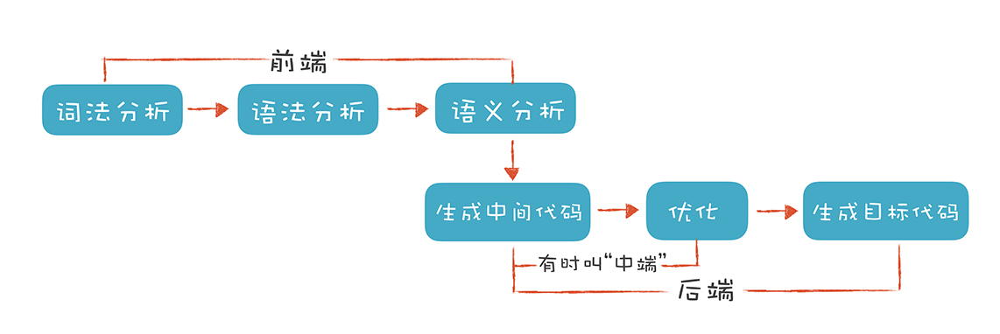

# 编译原理之美

- [理解代码：编译器的前端技术](#frontend)

<h1 id="frontend">理解代码：编译器的前端技术</h1>

这里的“前端（Front End）”指的是编译器对程序代码的分析和理解过程。它通常只跟语言的语法有关，跟目标机器无关。而与之对应的“后端（Back End）”则是生成目标代码的过程，跟目标机器有关。为了方便你理解，我用一张图直观地展现了编译器的整个编译过程。



## 词法分析（Lexical Analysis）

通常，编译器的第一项工作叫做词法分析。就像阅读文章一样，文章是由一个个的中文单词组成的。程序处理也一样，只不过这里不叫单词，而是叫做“词法记号”，英文叫 Token。

举个例子，看看下面这段代码，如果我们要读懂它，首先要怎么做呢？

```c++
#include <stdio.h>
int main(int argc, char* argv[]){
    int age = 45;
    if (age >= 17+8+20) {
        printf("Hello old man!\\n");
    }
    else{
        printf("Hello young man!\\n");
    }
    return 0;
}
```

我们会识别出 if、else、int 这样的关键字，main、printf、age 这样的标识符，+、-、= 这样的操作符号，还有花括号、圆括号、分号这样的符号，以及数字字面量、字符串字面量等。这些都是 Token。

我们可以通过制定一些规则来区分每个不同的 Token，我举了几个例子，你可以看一下。

- <strong>识别 age 这样的标识符。</strong>它以字母开头，后面可以是字母或数字，直到遇到第一个既不是字母又不是数字的字符时结束。

- <strong>识别 >= 这样的操作符。</strong> 当扫描到一个 > 字符的时候，就要注意，它可能是一个 GT（Greater Than，大于）操作符。但由于 GE（Greater Equal，大于等于）也是以 > 开头的，所以再往下再看一位，如果是 =，那么这个 Token 就是 GE，否则就是 GT。

- <strong>识别 45 这样的数字字面量。</strong>当扫描到一个数字字符的时候，就开始把它看做数字，直到遇到非数字的字符。

这些规则可以通过手写程序来实现。事实上，很多编译器的词法分析器都是手写实现的，例如 GNU 的 C 语言编译器。

