# 趣谈网络协议

- [为什么要学习网络协议？](#chapter1)
- [网络分层的真实含义是什么？](#chapter2)
- [ifconfig：最熟悉又陌生的命令行](#chapter3)
- [DHCP 与 PXE：IP 是怎么来的，又是怎么没的？](#chapter4)
- [从物理层到 MAC 层：如何在宿舍里自己组网玩联机游戏？](#chapter5)
- [交换机与 VLAN：办公室太复杂，我要回学校](#chapter6)
- [ICMP 与 ping：投石问路的侦察兵](#chapter7)
- [世界这么大，我想出网关：欧洲十国游与玄奘西行](#chapter8)
- [路由协议：西出网关无故人，敢问路在何方](#chapter9)
- [UDP协议：因性善而简单，难免碰到“城会玩”](#chapter10)
- [TCP协议（上）：因性恶而复杂，先恶后善反轻松](#chapter11)
- [TCP协议（下）：西行必定多妖孽，恒心智慧消磨难](#chapter12)
- [套接字Socket：Talk is cheap, show me the code](#chapter13)
- [HTTP协议：看个新闻原来这么麻烦](#chapter14)
- [HTTPS协议：点外卖的过程原来这么复杂](#chapter15)
- [流媒体协议：如何在直播里看到美女帅哥？](#chapter16)
- [P2P协议：我下小电影，99%急死你](#chapter17)
- [DNS协议：网络世界的地址簿](#chapter18)
- [HTTPDNS：网络世界的地址簿也会指错路](#chapter19)
- [CDN：你去小卖部取过快递么？](#chapter20)
- [数据中心：我是开发商，自己拿地盖别墅](#chapter21)
- [VPN：朝中有人好做官](#chapter22)
- 
  

<h1 id="chapter1">为什么要学习网络协议？</h1>

当 "Hello World!" 从显示器打印出来的时候，还记得你激动的心情吗？

```java
public class HelloWorld {
  public static void main(String[] args){
    System.out.println("Hello World!");
  }
}
```

如果你是程序员，一定看得懂上面这一段文字。这是每一个程序员向计算机世界说“你好，世界”的方式。但是，你不一定知道，这段文字也是一种协议，是人类和计算机沟通的协议，**只有通过这种协议，计算机才知道我们想让它做什么。**

## 协议三要素

当然，这种协议还是更接近人类语言，机器不能直接读懂，需要进行翻译，翻译的工作教给编译器，也就是程序员常说的 compile。这个过程比较复杂，其中的编译原理非常复杂，我在这里不进行详述。

但是可以看得出，计算机语言作为程序员控制一台计算机工作的协议，具备了协议的三要素。

- **语法**，就是这一段内容要符合一定的规则和格式。例如，括号要成对，结束要使用分号等。
- **语义**，就是这一段内容要代表某种意义。例如数字减去数字是有意义的，数字减去文本一般来说就没有意义。
- **顺序**，就是先干啥，后干啥。例如，可以先加上某个数值，然后再减去某个数值。

会了计算机语言，你就能够教给一台计算机完成你的工作了。恭喜你，入门了！

但是，要想打造互联网世界的通天塔，只教给一台机器做什么是不够的，你需要学会教给一大片机器做什么。这就需要网络协议。**只有通过网络协议，才能使一大片机器互相协作、共同完成一件事。**

当你想要买一个商品，常规的做法就是打开浏览器，输入购物网站的地址。浏览器就会给你显示一个缤纷多彩的页面。

那你有没有深入思考过，浏览器是如何做到这件事情的？它之所以能够显示缤纷多彩的页面，是因为它收到了一段来自 HTTP 协议的“东西”。我拿网易考拉来举例，格式就像下面这样：

```java
HTTP/1.1 200 OK
Date: Tue, 27 Mar 2018 16:50:26 GMT
Content-Type: text/html;charset=UTF-8
Content-Language: zh-CN

<!DOCTYPE html>
<html>
<head>
<base href="https://pages.kaola.com/" />
<meta charset="utf-8"/> <title> 网易考拉 3 周年主会场 </title>
```

首先，符合语法，也就是说，只有按照上面那个格式来，浏览器才认。例如，上来是**状态**，然后是**首部**，然后是**内容**。

第二，符合语义，就是要按照约定的意思来。例如，状态 200，表述的意思是网页成功返回。如果不成功，就是我们常见的“404”。

第三，符合顺序，你一点浏览器，就是发送出一个 HTTP 请求，然后才有上面那一串 HTTP 返回的东西。

## 我们常用的网络协议有哪些？

在经济学领域，有个伦纳德·里德（Leonard E. Read）创作的《铅笔的故事》。这个故事通过一个铅笔的诞生过程，来讲述复杂的经济学理论。这里，我也用一个下单的过程，看看互联网世界的运行过程中，都使用了哪些网络协议。

你先在浏览器里面输入 <a href="https://www.kaola.com">https://www.kaola.com</a> ，这是一个<strong>URL</strong>。浏览器只知道名字是“www.kaola.com”，但是不知道具体的地点，所以不知道应该如何访问。于是，它打开地址簿去查找。可以使用一般的地址簿协议<strong>DNS</strong>去查找，还可以使用另一种更加精准的地址簿查找协议<strong>HTTPDNS</strong>。

无论用哪一种方法查找，最终都会得到这个地址：106.114.138.24。这个是**IP**地址，是互联网世界的“门牌号”。

知道了目标地址，浏览器就开始打包它的请求。对于普通的浏览请求，往往会使用**HTTP**协议；但是对于购物的请求，往往需要进行加密传输，因而会使用**HTTPS**协议。无论是什么协议，里面都会写明“你要买什么和买多少”。

DNS、HTTP、HTTPS 所在的层我们称为**应用层**。经过应用层封装后，浏览器会将应用层的包交给下一层去完成，通过 socket 编程来实现。下一层是**传输层**。传输层有两种协议，一种是无连接的协议**UDP**，一种是面向连接的协议**TCP**。对于支付来讲，往往使用 TCP 协议。所谓的面向连接就是，TCP 会保证这个包能够到达目的地。如果不能到达，就会重新发送，直至到达。

TCP 协议里面会有两个端口，一个是浏览器监听的端口，一个是电商的服务器监听的端口。操作系统往往通过端口来判断，它得到的包应该给哪个进程。


传输层封装完毕后，浏览器会将包交给操作系统的**网络层**。网络层的协议是 IP 协议。在 IP 协议里面会有源 IP 地址，即浏览器所在机器的 IP 地址和目标 IP 地址，也即电商网站所在服务器的 IP 地址。


操作系统既然知道了目标 IP 地址，就开始想如何根据这个门牌号找到目标机器。操作系统往往会判断，这个目标 IP 地址是本地人，还是外地人。如果是本地人，从门牌号就能看出来，但是显然电商网站不在本地，而在遥远的地方。

操作系统知道要离开本地去远方。虽然不知道远方在何处，但是可以这样类比一下：如果去国外要去海关，去外地就要去**网关**。而操作系统启动的时候，就会被 DHCP 协议配置 IP 地址，以及默认的网关的 IP 地址 192.168.1.1。

操作系统如何将 IP 地址发给网关呢？在本地通信基本靠吼，于是操作系统大吼一声，谁是 192.168.1.1 啊？网关会回答它，我就是，我的本地地址在村东头。这个本地地址就是**MAC**地址，而大吼的那一声是**ARP**协议。


于是操作系统将 IP 包交给了下一层，也就是**MAC 层**。网卡再将包发出去。由于这个包里面是有 MAC 地址的，因而它能够到达网关。

网关收到包之后，会根据自己的知识，判断下一步应该怎么走。网关往往是一个路由器，到某个 IP 地址应该怎么走，这个叫作路由表。

路由器有点像玄奘西行路过的一个个国家的一个个城关。每个城关都连着两个国家，每个国家相当于一个局域网，在每个国家内部，都可以使用本地的地址 MAC 进行通信。

一旦跨越城关，就需要拿出 IP 头来，里面写着贫僧来自东土大唐（就是源 IP 地址），欲往西天拜佛求经（指的是目标 IP 地址）。路过宝地，借宿一晚，明日启行，请问接下来该怎么走啊？

城关往往是知道这些“知识”的，因为城关和临近的城关也会经常沟通。到哪里应该怎么走，这种沟通的协议称为**路由协议**，常用的有**OSPF**和**BGP**。

城关与城关之间是一个国家，当网络包知道了下一步去哪个城关，还是要使用国家内部的 MAC 地址，通过下一个城关的 MAC 地址，找到下一个城关，然后再问下一步的路怎么走，一直到走出最后一个城关。

最后一个城关知道这个网络包要去的地方。于是，对着这个国家吼一声，谁是目标 IP 啊？目标服务器就会回复一个 MAC 地址。网络包过关后，通过这个 MAC 地址就能找到目标服务器。

目标服务器发现 MAC 地址对上了，取下 MAC 头来，发送给操作系统的网络层。发现 IP 也对上了，就取下 IP 头。IP 头里会写上一层封装的是 TCP 协议，然后将其交给传输层，即**TCP 层**。

在这一层里，对于收到的每个包，都会有一个回复的包说明收到了。这个回复的包绝非这次下单请求的结果，例如购物是否成功，扣了多少钱等，而仅仅是 TCP 层的一个说明，即收到之后的回复。当然这个回复，会沿着刚才来的方向走回去，报个平安。

如果过一段时间还是没到，发送端的 TCP 层会重新发送这个包，还是上面的过程，直到有一天收到平安到达的回复。**这个重试绝非你的浏览器重新将下单这个动作重新请求一次**。对于浏览器来讲，就发送了一次下单请求，TCP 层不断自己闷头重试。除非 TCP 这一层出了问题，例如连接断了，才轮到浏览器的应用层重新发送下单请求。

当网络包平安到达 TCP 层之后，TCP 头中有目标端口号，通过这个端口号，可以找到电商网站的进程正在监听这个端口号，假设一个 Tomcat，将这个包发给电商网站。


电商网站的进程得到 HTTP 请求的内容，知道了要买东西，买多少。往往一个电商网站最初接待请求的这个 Tomcat 只是个接待员，负责统筹处理这个请求，而不是所有的事情都自己做。例如，这个接待员要告诉专门管理订单的进程，登记要买某个商品，买多少，要告诉管理库存的进程，库存要减少多少，要告诉支付的进程，应该付多少钱，等等。

如何告诉相关的进程呢？往往通过 RPC 调用，即远程过程调用的方式来实现。远程过程调用就是当告诉管理订单进程的时候，接待员不用关心中间的网络互连问题，会由 RPC 框架统一处理。RPC 框架有很多种，有基于 HTTP 协议放在 HTTP 的报文里面的，有直接封装在 TCP 报文里面的。

当接待员发现相应的部门都处理完毕，就回复一个 HTTPS 的包，告知下单成功。这个 HTTPS 的包，会像来的时候一样，经过千难万险到达你的个人电脑，最终进入浏览器，显示支付成功。

<h1 id="chapter2">网络分层的真实含义是什么？</h1>

教科书或者老师往往会打一个十分不恰当的比喻：为什么网络要分层呀？因为不同的层次之间有不同的沟通方式，这个叫作协议。例如，一家公司也是分“层次”的，分总经理、经理、组长、员工。总经理之间有他们的沟通方式，经理和经理之间也有沟通方式，同理组长和员工。有没有听过类似的比喻？

那么**第一个问题**来了。请问经理在握手的时候，员工在干什么？很多人听过 TCP 建立连接的**三次握手协议**，也会把它当知识点背诵。同理问你，TCP 在进行三次握手的时候，IP 层和 MAC 层对应都有什么操作呢？

除了上面这个不恰当的比喻，教科书还会列出每个层次所包含的协议，然后开始逐层地去讲这些协议。但是这些协议之间的关系呢？却很少有教科书会讲。

学习第三层的时候会提到，IP 协议里面包含**目标地址**和**源地址。**第三层里往往还会学习**路由协议**。路由就像中转站，我们从原始地址 A 到目标地址 D，中间经过两个中转站 A->B->C->D，是通过路由转发的。

那么**第二个问题**来了。A 知道自己的下一个中转站是 B，那从 A 发出来的包，应该把 B 的 IP 地址放在哪里呢？B 知道自己的下一个中转站是 C，从 B 发出来的包，应该把 C 的 IP 地址放在哪里呢？如果放在 IP 协议中的目标地址，那包到了中转站，怎么知道最终的目的地址是 D 呢？

**再问你一个问题**。你一定经常听说二层设备、三层设备。二层设备处理的通常是 MAC 层的东西。那我发送一个 HTTP 的包，是在第七层工作的，那是不是不需要经过二层设备？或者即便经过了，二层设备也不处理呢？或者换一种问法，二层设备处理的包里，有没有 HTTP 层的内容呢？

最终，我想问你**一个综合的问题**。从你的电脑，通过 SSH 登录到公有云主机里面，都需要经历哪些过程？或者说你打开一个电商网站，都需要经历哪些过程？说得越详细越好。

## 网络为什么要分层？

这里我们先探讨第一个问题，网络为什么要分层？因为，是个复杂的程序都要分层。

理解计算机网络中的概念，一个很好的角度是，想象网络包就是一段 Buffer，或者一块内存，是有格式的。同时，想象自己是一个处理网络包的程序，而且这个程序可以跑在电脑上，可以跑在服务器上，可以跑在交换机上，也可以跑在路由器上。你想象自己有很多的网口，从某个口拿进一个网络包来，用自己的程序处理一下，再从另一个网口发送出去。

当然网络包的格式很复杂，这个程序也很复杂。**复杂的程序都要分层，这是程序设计的要求。**比如，复杂的电商还会分数据库层、缓存层、Compose 层、Controller 层和接入层，每一层专注做本层的事情。

## 程序是如何工作的？


当一个网络包从一个网口经过的时候，你看到了，首先先看看要不要请进来，处理一把。有的网口配置了混杂模式，凡是经过的，全部拿进来。

拿进来以后，就要交给一段程序来处理。于是，你调用**process_layer2(buffer)**。当然，这是一个假的函数。但是你明白其中的意思，知道肯定是有这么个函数的。那这个函数是干什么的呢？从 Buffer 中，摘掉二层的头，看一看，应该根据头里面的内容做什么操作。

假设你发现这个包的 MAC 地址和你的相符，那说明就是发给你的，于是需要调用**process_layer3(buffer)**。这个时候，Buffer 里面往往就没有二层的头了，因为已经在上一个函数的处理过程中拿掉了，或者将开始的偏移量移动了一下。在这个函数里面，摘掉三层的头，看看到底是发送给自己的，还是希望自己转发出去的。

如何判断呢？如果 IP 地址不是自己的，那就应该转发出去；如果 IP 地址是自己的，那就是发给自己的。根据 IP 头里面的标示，拿掉三层的头，进行下一层的处理，到底是调用 process_tcp(buffer) 呢，还是调用 process_udp(buffer) 呢？

假设这个地址是 TCP 的，则会调用**process_tcp(buffer)**。这时候，Buffer 里面没有三层的头，就需要查看四层的头，看这是一个发起，还是一个应答，又或者是一个正常的数据包，然后分别由不同的逻辑进行处理。如果是发起或者应答，接下来可能要发送一个回复包；如果是一个正常的数据包，就需要交给上层了。交给谁呢？是不是有 process_http(buffer) 函数呢？

没有的，如果你是一个网络包处理程序，你不需要有 process_http(buffer)，而是应该交给应用去处理。交给哪个应用呢？在四层的头里面有端口号，不同的应用监听不同的端口号。如果发现浏览器应用在监听这个端口，那你发给浏览器就行了。至于浏览器怎么处理，和你没有关系。

浏览器自然是解析 HTML，显示出页面来。电脑的主人看到页面很开心，就点了鼠标。点击鼠标的动作被浏览器捕获。浏览器知道，又要发起另一个 HTTP 请求了，于是使用端口号，将请求发给了你。

你应该调用**send_tcp(buffer)**。不用说，Buffer 里面就是 HTTP 请求的内容。这个函数里面加一个 TCP 的头，记录下源端口号。浏览器会给你目的端口号，一般为 80 端口。

然后调用**send_layer3(buffer)**。Buffer 里面已经有了 HTTP 的头和内容，以及 TCP 的头。在这个函数里面加一个 IP 的头，记录下源 IP 的地址和目标 IP 的地址。

然后调用**send_layer2(buffer)**。Buffer 里面已经有了 HTTP 的头和内容、TCP 的头，以及 IP 的头。这个函数里面要加一下 MAC 的头，记录下源 MAC 地址，得到的就是本机器的 MAC 地址和目标的 MAC 地址。不过，这个还要看当前知道不知道，知道就直接加上；不知道的话，就要通过一定的协议处理过程，找到 MAC 地址。反正要填一个，不能空着。

万事俱备，只要 Buffer 里面的内容完整，就可以从网口发出去了，你作为一个程序的任务就算告一段落了。

## 揭秘层与层之间的关系

**只要是在网络上跑的包，都是完整的。可以有下层没上层，绝对不可能有上层没下层。**

所以，**对 TCP 协议来说，三次握手也好，重试也好，只要想发出去包，就要有 IP 层和 MAC 层，不然是发不出去的。**

经常有人会问这样一个问题，我都知道那台机器的 IP 地址了，直接发给他消息呗，要 MAC 地址干啥？这里的关键就是，没有 MAC 地址消息是发不出去的。

所以如果一个 HTTP 协议的包跑在网络上，它一定是完整的。无论这个包经过哪些设备，它都是完整的。

所谓的二层设备、三层设备，都是这些设备上跑的程序不同而已。一个 HTTP 协议的包经过一个二层设备，二层设备收进去的是整个网络包。这里面 HTTP、TCP、 IP、 MAC 都有。什么叫二层设备呀，就是只把 MAC 头摘下来，看看到底是丢弃、转发，还是自己留着。那什么叫三层设备呢？就是把 MAC 头摘下来之后，再把 IP 头摘下来，看看到底是丢弃、转发，还是自己留着。

## 总结

总结一下今天的内容，理解网络协议的工作模式，有两个小窍门：

- 始终想象自己是一个处理网络包的程序：如何拿到网络包，如何根据规则进行处理，如何发出去；
- 始终牢记一个原则：只要是在网络上跑的包，都是完整的。可以有下层没上层，绝对不可能有上层没下层。

<h1 id="chapter3">ifconfig：最熟悉又陌生的命令行</h1>

即便没有专业学过计算机的人，只要倒腾过电脑，重装过系统，大多也会知道这个问题的答案：在 Windows 上是 ipconfig，在 Linux 上是 ifconfig。

那你知道在 Linux 上还有什么其他命令可以查看 IP 地址吗？答案是 ip addr。如果回答不上来这个问题，那你可能没怎么用过 Linux。

那你知道 ifconfig 和 ip addr 的区别吗？这是一个有关 net-tools 和 iproute2 的“历史”故事，你刚来到第三节，暂时不用了解这么细，但这也是一个常考的知识点。

想象一下，你登录进入一个被裁剪过的非常小的 Linux 系统中，发现既没有 ifconfig 命令，也没有 ip addr 命令，你是不是感觉这个系统压根儿没法用？这个时候，你可以自行安装 net-tools 和 iproute2 这两个工具。当然，大多数时候这两个命令是系统自带的。

安装好后，我们来运行一下 ip addr。不出意外，应该会输出下面的内容。

```shell
root@test:~# ip addr
1: lo: <LOOPBACK,UP,LOWER_UP> mtu 65536 qdisc noqueue state UNKNOWN group default
    link/loopback 00:00:00:00:00:00 brd 00:00:00:00:00:00
    inet 127.0.0.1/8 scope host lo
       valid_lft forever preferred_lft forever
    inet6 ::1/128 scope host
       valid_lft forever preferred_lft forever
2: eth0: <BROADCAST,MULTICAST,UP,LOWER_UP> mtu 1500 qdisc pfifo_fast state UP group default qlen 1000
    link/ether fa:16:3e:c7:79:75 brd ff:ff:ff:ff:ff:ff
    inet 10.100.122.2/24 brd 10.100.122.255 scope global eth0
       valid_lft forever preferred_lft forever
    inet6 fe80::f816:3eff:fec7:7975/64 scope link
       valid_lft forever preferred_lft forever
```

这个命令显示了这台机器上所有的网卡。大部分的网卡都会有一个 IP 地址，当然，这不是必须的。在后面的分享中，我们会遇到没有 IP 地址的情况。

<span class="orange">IP 地址是一个网卡在网络世界的通讯地址，相当于我们现实世界的门牌号码。</span>既然是门牌号码，不能大家都一样，不然就会起冲突。比方说，假如大家都叫六单元 1001 号，那快递就找不到地方了。所以，有时候咱们的电脑弹出网络地址冲突，出现上不去网的情况，多半是 IP 地址冲突了。

如上输出的结果，10.100.122.2 就是一个 IP 地址。这个地址被点分隔为四个部分，每个部分 8 个 bit，所以 IP 地址总共是 32 位。这样产生的 IP 地址的数量很快就不够用了。因为当时设计 IP 地址的时候，哪知道今天会有这么多的计算机啊！因为不够用，于是就有了 IPv6，也就是上面输出结果里面 inet6 fe80::f816:3eff:fec7:7975/64。这个有 128 位，现在看来是够了，但是未来的事情谁知道呢？

本来 32 位的 IP 地址就不够，还被分成了 5 类。现在想想，当时分配地址的时候，真是太奢侈了。


在网络地址中，至少在当时设计的时候，对于 A、B、 C 类主要分两部分，前面一部分是网络号，后面一部分是主机号。这很好理解，大家都是六单元 1001 号，我是小区 A 的六单元 1001 号，而你是小区 B 的六单元 1001 号。

下面这个表格，详细地展示了 A、B、C 三类地址所能包含的主机的数量。在后文中，我也会多次借助这个表格来讲解。


这里面有个尴尬的事情，就是 C 类地址能包含的最大主机数量实在太少了，只有 254 个。当时设计的时候恐怕没想到，现在估计一个网吧都不够用吧。而 B 类地址能包含的最大主机数量又太多了。6 万多台机器放在一个网络下面，一般的企业基本达不到这个规模，闲着的地址就是浪费。

## 无类型域间选路（CIDR）

于是有了一个折中的方式叫作**无类型域间选路**，简称**CIDR**。这种方式打破了原来设计的几类地址的做法，将 32 位的 IP 地址一分为二，前面是**网络号**，后面是**主机号**。从哪里分呢？你如果注意观察的话可以看到，10.100.122.2/24，这个 IP 地址中有一个斜杠，斜杠后面有个数字 24。这种地址表示形式，就是 CIDR。后面 24 的意思是，32 位中，前 24 位是网络号，后 8 位是主机号。

伴随着 CIDR 存在的，一个是**广播地址**，10.100.122.255。如果发送这个地址，所有 10.100.122 网络里面的机器都可以收到。另一个是**子网掩码**，255.255.255.0。

将子网掩码和 IP 地址进行 AND 计算。前面三个 255，转成二进制都是 1。1 和任何数值取 AND，都是原来数值，因而前三个数不变，为 10.100.122。后面一个 0，转换成二进制是 0，0 和任何数值取 AND，都是 0，因而最后一个数变为 0，合起来就是 10.100.122.0。这就是**网络号**。**将子网掩码和 IP 地址按位计算 AND，就可得到网络号。**

## 公有 IP 地址和私有 IP 地址

在日常的工作中，几乎不用划分 A 类、B 类或者 C 类，所以时间长了，很多人就忘记了这个分类，而只记得 CIDR。但是有一点还是要注意的，就是公有 IP 地址和私有 IP 地址。


我们继续看上面的表格。表格最右列是私有 IP 地址段。平时我们看到的数据中心里，办公室、家里或学校的 IP 地址，一般都是私有 IP 地址段。因为这些地址允许组织内部的 IT 人员自己管理、自己分配，而且可以重复。因此，你学校的某个私有 IP 地址段和我学校的可以是一样的。

公有 IP 地址有个组织统一分配，你需要去买。如果你搭建一个网站，给你学校的人使用，让你们学校的 IT 人员给你一个 IP 地址就行。但是假如你要做一个类似网易 163 这样的网站，就需要有公有 IP 地址，这样全世界的人才能访问。

表格中的 192.168.0.x 是最常用的私有 IP 地址。你家里有 Wi-Fi，对应就会有一个 IP 地址。一般你家里地上网设备不会超过 256 个，所以 /24 基本就够了。有时候我们也能见到 /16 的 CIDR，这两种是最常见的，也是最容易理解的。

不需要将十进制转换为二进制 32 位，就能明显看出 192.168.0 是网络号，后面是主机号。而整个网络里面的第一个地址 192.168.0.1，往往就是你这个私有网络的出口地址。例如，你家里的电脑连接 Wi-Fi，Wi-Fi 路由器的地址就是 192.168.0.1，而 192.168.0.255 就是广播地址。一旦发送这个地址，整个 192.168.0 网络里面的所有机器都能收到。

但是也不总都是这样的情况。因此，其他情况往往就会很难理解，还容易出错。

## 举例：一个容易“犯错”的 CIDR

我们来看 16.158.165.91/22 这个 CIDR。求一下这个网络的第一个地址、子网掩码和广播地址。

/22 不是 8 的整数倍，不好办，只能先变成二进制来看。16.158 的部分不会动，它占了前 16 位。中间的 165，变为二进制为 ‭10100101‬。除了前面的 16 位，还剩 6 位。所以，这 8 位中前 6 位是网络号，16.158.<101001>，而 <01>.91 是机器号。

第一个地址是 16.158.<101001><00>.1，即 16.158.164.1。子网掩码是 255.255.<111111><00>.0，即 255.255.252.0。广播地址为 16.158.<101001><11>.255，即 16.158.167.255。

这五类地址中，还有一类 D 类是**组播地址**。使用这一类地址，属于某个组的机器都能收到。这有点类似在公司里面大家都加入了一个邮件组。发送邮件，加入这个组的都能收到。组播地址在后面讲述 VXLAN 协议的时候会提到。

讲了这么多，才讲了上面的输出结果中很小的一部分，是不是觉得原来并没有真的理解 ip addr 呢？我们接着来分析。

在 IP 地址的后面有个 scope，对于 eth0 这张网卡来讲，是 global，说明这张网卡是可以对外的，可以接收来自各个地方的包。对于 lo 来讲，是 host，说明这张网卡仅仅可以供本机相互通信。

lo 全称是**loopback**，又称**环回接口**，往往会被分配到 127.0.0.1 这个地址。这个地址用于本机通信，经过内核处理后直接返回，不会在任何网络中出现。

## MAC 地址

在 IP 地址的上一行是 link/ether fa:16:3e:c7:79:75 brd ff:ff:ff:ff:ff:ff，这个被称为**MAC 地址**，是一个网卡的物理地址，用十六进制，6 个 byte 表示。

MAC 地址是一个很容易让人“误解”的地址。因为 MAC 地址号称全局唯一，不会有两个网卡有相同的 MAC 地址，而且网卡自生产出来，就带着这个地址。很多人看到这里就会想，既然这样，整个互联网的通信，全部用 MAC 地址好了，只要知道了对方的 MAC 地址，就可以把信息传过去。

这样当然是不行的。 **一个网络包要从一个地方传到另一个地方，除了要有确定的地址，还需要有定位功能。** 而有门牌号码属性的 IP 地址，才是有远程定位功能的。

<span class="orange">MAC 地址更像是身份证，是一个唯一的标识。</span>它的唯一性设计是为了组网的时候，不同的网卡放在一个网络里面的时候，可以不用担心冲突。从硬件角度，保证不同的网卡有不同的标识。

所以，MAC 地址的通信范围比较小，局限在一个子网里面。例如，从 192.168.0.2/24 访问 192.168.0.3/24 是可以用 MAC 地址的。一旦跨子网，即从 192.168.0.2/24 到 192.168.1.2/24，MAC 地址就不行了，需要 IP 地址起作用了。

## 网络设备的状态标识

解析完了 MAC 地址，我们再来看 <BROADCAST,MULTICAST,UP,LOWER_UP> 是干什么的？这个叫作**net_device flags，网络设备的状态标识**。

UP 表示网卡处于启动的状态；BROADCAST 表示这个网卡有广播地址，可以发送广播包；MULTICAST 表示网卡可以发送多播包；LOWER_UP 表示 L1 是启动的，也即网线插着呢。MTU1500 是指什么意思呢？是哪一层的概念呢？最大传输单元 MTU 为 1500，这是以太网的默认值。

上一节，我们讲过网络包是层层封装的。MTU 是二层 MAC 层的概念。MAC 层有 MAC 的头，以太网规定连 MAC 头带正文合起来，不允许超过 1500 个字节。正文里面有 IP 的头、TCP 的头、HTTP 的头。如果放不下，就需要分片来传输。

qdisc pfifo_fast 是什么意思呢？qdisc 全称是**queueing discipline**，中文叫**排队规则**。内核如果需要通过某个网络接口发送数据包，它都需要按照为这个接口配置的 qdisc（排队规则）把数据包加入队列。

最简单的 qdisc 是 pfifo，它不对进入的数据包做任何的处理，数据包采用先入先出的方式通过队列。pfifo_fast 稍微复杂一些，它的队列包括三个波段（band）。在每个波段里面，使用先进先出规则。

三个波段（band）的优先级也不相同。band 0 的优先级最高，band 2 的最低。如果 band 0 里面有数据包，系统就不会处理 band 1 里面的数据包，band 1 和 band 2 之间也是一样。

数据包是按照服务类型（**Type of Service，TOS**）被分配到三个波段（band）里面的。TOS 是 IP 头里面的一个字段，代表了当前的包是高优先级的，还是低优先级的。

队列是个好东西，后面我们讲云计算中的网络的时候，会有很多用户共享一个网络出口的情况，这个时候如何排队，每个队列有多粗，队列处理速度应该怎么提升，我都会详细为你讲解。

## 总结

- IP 是地址，有定位功能；MAC 是身份证，无定位功能；
- CIDR 可以用来判断是不是本地人；
- IP 分公有的 IP 和私有的 IP。后面的章节中我会谈到“出国门”，就与这个有关。

<h1 id="chapter4">DHCP与PXE：IP是怎么来的，又是怎么没的？</h1>

## 如何配置 IP 地址？

那如何配置呢？如果有相关的知识和积累，你可以用命令行自己配置一个地址。可以使用 ifconfig，也可以使用 ip addr。设置好了以后，用这两个命令，将网卡 up 一下，就可以开始工作了。

**使用 net-tools：**

```
sudo ifconfig eth1 10.0.0.1/24
$ sudo ifconfig eth1 up
```

**使用 iproute2：**

```
sudo ip addr add 10.0.0.1/24 dev eth1
$ sudo ip link set up eth1
```

你可能会问了，自己配置这个自由度太大了吧，我是不是配置什么都可以？如果配置一个和谁都不搭边的地址呢？例如，旁边的机器都是 192.168.1.x，我非得配置一个 16.158.23.6，会出现什么现象呢？

不会出现任何现象，就是包发不出去呗。为什么发不出去呢？我来举例说明。

192.168.1.6 就在你这台机器的旁边，甚至是在同一个交换机上，而你把机器的地址设为了 16.158.23.6。在这台机器上，你企图去 ping192.168.1.6，你觉得只要将包发出去，同一个交换机的另一台机器马上就能收到，对不对？

可是 Linux 系统不是这样的，它没你想得那么智能。你用肉眼看到那台机器就在旁边，它则需要根据自己的逻辑进行处理。

还记得我们在第二节说过的原则吗？**只要是在网络上跑的包，都是完整的，可以有下层没上层，绝对不可能有上层没下层。**

所以，你看着它有自己的源 IP 地址 16.158.23.6，也有目标 IP 地址 192.168.1.6，但是包发不出去，这是因为 MAC 层还没填。

自己的 MAC 地址自己知道，这个容易。但是目标 MAC 填什么呢？是不是填 192.168.1.6 这台机器的 MAC 地址呢？

当然不是。Linux 首先会判断，要去的这个地址和我是一个网段的吗，或者和我的一个网卡是同一网段的吗？只有是一个网段的，它才会发送 ARP 请求，获取 MAC 地址。如果发现不是呢？

**Linux 默认的逻辑是，如果这是一个跨网段的调用，它便不会直接将包发送到网络上，而是企图将包发送到网关。**

如果你配置了网关的话，Linux 会获取网关的 MAC 地址，然后将包发出去。对于 192.168.1.6 这台机器来讲，虽然路过它家门的这个包，目标 IP 是它，但是无奈 MAC 地址不是它的，所以它的网卡是不会把包收进去的。

如果没有配置网关呢？那包压根就发不出去。

如果将网关配置为 192.168.1.6 呢？不可能，Linux 不会让你配置成功的，因为网关要和当前的网络至少一个网卡是同一个网段的，怎么可能 16.158.23.6 的网关是 192.168.1.6 呢？

所以，当你需要手动配置一台机器的网络 IP 时，一定要好好问问你的网络管理员。如果在机房里面，要去网络管理员那里申请，让他给你分配一段正确的 IP 地址。当然，真正配置的时候，一定不是直接用命令配置的，而是放在一个配置文件里面。**不同系统的配置文件格式不同，但是无非就是 CIDR、子网掩码、广播地址和网关地址。**

## 动态主机配置协议（DHCP）

原来配置 IP 有这么多门道儿啊。你可能会问了，配置了 IP 之后一般不能变的，配置一个服务端的机器还可以，但是如果是客户端的机器呢？我抱着一台笔记本电脑在公司里走来走去，或者白天来晚上走，每次使用都要配置 IP 地址，那可怎么办？还有人事、行政等非技术人员，如果公司所有的电脑都需要 IT 人员配置，肯定忙不过来啊。

因此，我们需要有一个自动配置的协议，也就是称**动态主机配置协议（Dynamic Host Configuration Protocol）**，简称**DHCP**。

有了这个协议，网络管理员就轻松多了。他只需要配置一段共享的 IP 地址。每一台新接入的机器都通过 DHCP 协议，来这个共享的 IP 地址里申请，然后自动配置好就可以了。等人走了，或者用完了，还回去，这样其他的机器也能用。

所以说，**如果是数据中心里面的服务器，IP 一旦配置好，基本不会变，这就相当于买房自己装修。DHCP 的方式就相当于租房。你不用装修，都是帮你配置好的。你暂时用一下，用完退租就可以了。**

## 解析 DHCP 的工作方式

当一台机器新加入一个网络的时候，肯定一脸懵，啥情况都不知道，只知道自己的 MAC 地址。怎么办？先吼一句，我来啦，有人吗？这时候的沟通基本靠“吼”。这一步，我们称为**DHCP Discover。**

新来的机器使用 IP 地址 0.0.0.0 发送了一个广播包，目的 IP 地址为 255.255.255.255。广播包封装了 UDP，UDP 封装了 BOOTP。其实 DHCP 是 BOOTP 的增强版，但是如果你去抓包的话，很可能看到的名称还是 BOOTP 协议。

在这个广播包里面，新人大声喊：我是新来的（Boot request），我的 MAC 地址是这个，我还没有 IP，谁能给租给我个 IP 地址！

格式就像这样：


如果一个网络管理员在网络里面配置了**DHCP Server**的话，他就相当于这些 IP 的管理员。他立刻能知道来了一个“新人”。这个时候，我们可以体会 MAC 地址唯一的重要性了。当一台机器带着自己的 MAC 地址加入一个网络的时候，MAC 是它唯一的身份，如果连这个都重复了，就没办法配置了。

只有 MAC 唯一，IP 管理员才能知道这是一个新人，需要租给它一个 IP 地址，这个过程我们称为**DHCP Offer**。同时，DHCP Server 为此客户保留为它提供的 IP 地址，从而不会为其他 DHCP 客户分配此 IP 地址。

DHCP Offer 的格式就像这样，里面有给新人分配的地址。


DHCP Server 仍然使用广播地址作为目的地址，因为，此时请求分配 IP 的新人还没有自己的 IP。DHCP Server 回复说，我分配了一个可用的 IP 给你，你看如何？除此之外，服务器还发送了子网掩码、网关和 IP 地址租用期等信息。

新来的机器很开心，它的“吼”得到了回复，并且有人愿意租给它一个 IP 地址了，这意味着它可以在网络上立足了。当然更令人开心的是，如果有多个 DHCP Server，这台新机器会收到多个 IP 地址，简直受宠若惊。

它会选择其中一个 DHCP Offer，一般是最先到达的那个，并且会向网络发送一个 DHCP Request 广播数据包，包中包含客户端的 MAC 地址、接受的租约中的 IP 地址、提供此租约的 DHCP 服务器地址等，并告诉所有 DHCP Server 它将接受哪一台服务器提供的 IP 地址，告诉其他 DHCP 服务器，谢谢你们的接纳，并请求撤销它们提供的 IP 地址，以便提供给下一个 IP 租用请求者。


此时，由于还没有得到 DHCP Server 的最后确认，客户端仍然使用 0.0.0.0 为源 IP 地址、255.255.255.255 为目标地址进行广播。在 BOOTP 里面，接受某个 DHCP Server 的分配的 IP。

当 DHCP Server 接收到客户机的 DHCP request 之后，会广播返回给客户机一个 DHCP ACK 消息包，表明已经接受客户机的选择，并将这一 IP 地址的合法租用信息和其他的配置信息都放入该广播包，发给客户机，欢迎它加入网络大家庭。


最终租约达成的时候，还是需要广播一下，让大家都知道。

## IP 地址的收回和续租

既然是租房子，就是有租期的。租期到了，管理员就要将 IP 收回。

如果不用的话，收回就收回了。就像你租房子一样，如果还要续租的话，不能到了时间再续租，而是要提前一段时间给房东说。DHCP 也是这样。

客户机会在租期过去 50% 的时候，直接向为其提供 IP 地址的 DHCP Server 发送 DHCP request 消息包。客户机接收到该服务器回应的 DHCP ACK 消息包，会根据包中所提供的新的租期以及其他已经更新的 TCP/IP 参数，更新自己的配置。这样，IP 租用更新就完成了。

好了，一切看起来完美。DHCP 协议大部分人都知道，但是其实里面隐藏着一个细节，很多人可能不会去注意。接下来，我就讲一个有意思的事情：网络管理员不仅能自动分配 IP 地址，还能帮你自动安装操作系统！

## 预启动执行环境（PXE）

普通的笔记本电脑，一般不会有这种需求。因为你拿到电脑时，就已经有操作系统了，即便你自己重装操作系统，也不是很麻烦的事情。但是，在数据中心里就不一样了。数据中心里面的管理员可能一下子就拿到几百台空的机器，一个个安装操作系统，会累死的。

其实，这个过程和操作系统启动的过程有点儿像。首先，启动 BIOS。这是一个特别小的小系统，只能干特别小的一件事情。其实就是读取硬盘的 MBR 启动扇区，将 GRUB 启动起来；然后将权力交给 GRUB，GRUB 加载内核、加载作为根文件系统的 initramfs 文件；然后将权力交给内核；最后内核启动，初始化整个操作系统。

那我们安装操作系统的过程，只能插在 BIOS 启动之后了。因为没安装系统之前，连启动扇区都没有。因而这个过程叫做**预启动执行环境（Pre-boot Execution Environment）**，简称**PXE。**

PXE 协议分为客户端和服务器端，由于还没有操作系统，只能先把客户端放在 BIOS 里面。当计算机启动时，BIOS 把 PXE 客户端调入内存里面，就可以连接到服务端做一些操作了。

首先，PXE 客户端自己也需要有个 IP 地址。因为 PXE 的客户端启动起来，就可以发送一个 DHCP 的请求，让 DHCP Server 给它分配一个地址。PXE 客户端有了自己的地址，那它怎么知道 PXE 服务器在哪里呢？对于其他的协议，都好办，要么人告诉他。例如，告诉浏览器要访问的 IP 地址，或者在配置中告诉它；例如，微服务之间的相互调用。

但是 PXE 客户端启动的时候，啥都没有。好在 DHCP Server 除了分配 IP 地址以外，还可以做一些其他的事情。这里有一个 DHCP Server 的一个样例配置：

```s
ddns-update-style interim;
ignore client-updates;
allow booting;
allow bootp;
subnet 192.168.1.0 netmask 255.255.255.0
{
option routers 192.168.1.1;
option subnet-mask 255.255.255.0;
option time-offset -18000;
default-lease-time 21600;
max-lease-time 43200;
range dynamic-bootp 192.168.1.240 192.168.1.250;
filename "pxelinux.0";
next-server 192.168.1.180;
}
```

按照上面的原理，默认的 DHCP Server 是需要配置的，无非是我们配置 IP 的时候所需要的 IP 地址段、子网掩码、网关地址、租期等。如果想使用 PXE，则需要配置 next-server，指向 PXE 服务器的地址，另外要配置初始启动文件 filename。

这样 PXE 客户端启动之后，发送 DHCP 请求之后，除了能得到一个 IP 地址，还可以知道 PXE 服务器在哪里，也可以知道如何从 PXE 服务器上下载某个文件，去初始化操作系统。

## 解析 PXE 的工作过程

首先，启动 PXE 客户端。第一步是通过 DHCP 协议告诉 DHCP Server，我刚来，一穷二白，啥都没有。DHCP Server 便租给它一个 IP 地址，同时也给它 PXE 服务器的地址、启动文件 pxelinux.0。

其次，PXE 客户端知道要去 PXE 服务器下载这个文件后，就可以初始化机器。于是便开始下载，下载的时候使用的是 TFTP 协议。所以 PXE 服务器上，往往还需要有一个 TFTP 服务器。PXE 客户端向 TFTP 服务器请求下载这个文件，TFTP 服务器说好啊，于是就将这个文件传给它。

然后，PXE 客户端收到这个文件后，就开始执行这个文件。这个文件会指示 PXE 客户端，向 TFTP 服务器请求计算机的配置信息 pxelinux.cfg。TFTP 服务器会给 PXE 客户端一个配置文件，里面会说内核在哪里、initramfs 在哪里。PXE 客户端会请求这些文件。

最后，启动 Linux 内核。一旦启动了操作系统，以后就啥都好办了。


## 总结

- DHCP 协议主要是用来给客户租用 IP 地址，和房产中介很像，要商谈、签约、续租，广播还不能“抢单”；
- DHCP 协议能给客户推荐“装修队”PXE，能够安装操作系统，这个在云计算领域大有用处。

<h1 id="chapter5">从物理层到MAC层：如何在宿舍里自己组网玩联机游戏？</h1>

## 第一层（物理层）

使用路由器，是在第三层上。我们先从第一层物理层开始说。

物理层能折腾啥？现在的同学可能想不到，我们当时去学校配电脑的地方买网线，卖网线的师傅都会问，你的网线是要电脑连电脑啊，还是电脑连网口啊？

我们要的是电脑连电脑。这种方式就是一根网线，有两个头。一头插在一台电脑的网卡上，另一头插在另一台电脑的网卡上。但是在当时，普通的网线这样是通不了的，所以水晶头要做交叉线，用的就是所谓的**1－3、2－6 交叉接法。**

水晶头的第 1、2 和第 3、6 脚，它们分别起着收、发信号的作用。将一端的 1 号和 3 号线、2 号和 6 号线互换一下位置，就能够在物理层实现一端发送的信号，另一端能收到。

当然电脑连电脑，除了网线要交叉，还需要配置这两台电脑的 IP 地址、子网掩码和默认网关。这三个概念上一节详细描述过了。要想两台电脑能够通信，这三项必须配置成为一个网络，可以一个是 192.168.0.1/24，另一个是 192.168.0.2/24，否则是不通的。

这里我想问你一个问题，两台电脑之间的网络包，包含 MAC 层吗？当然包含，要完整。IP 层要封装了 MAC 层才能将包放入物理层。

到此为止，两台电脑已经构成了一个最小的**局域网**，也即**LAN。**可以玩联机局域网游戏啦！

等到第三个哥们也买了一台电脑，怎么把三台电脑连在一起呢？

先别说交换机，当时交换机也贵。有一个叫作**Hub**的东西，也就是**集线器**。这种设备有多个口，可以将宿舍里的多台电脑连接起来。但是，和交换机不同，集线器没有大脑，它完全在物理层工作。它会将自己收到的每一个字节，都复制到其他端口上去。这是第一层物理层联通的方案。

## 第二层（数据链路层）

你可能已经发现问题了。Hub 采取的是广播的模式，如果每一台电脑发出的包，宿舍的每个电脑都能收到，那就麻烦了。这就需要解决几个问题：

1.  这个包是发给谁的？谁应该接收？
2.  大家都在发，会不会产生混乱？有没有谁先发、谁后发的规则？
3.  如果发送的时候出现了错误，怎么办？

这几个问题，都是第二层，数据链路层，也即 MAC 层要解决的问题。**MAC**的全称是**Medium Access Control**，即**媒体访问控制。**控制什么呢？其实就是控制在往媒体上发数据的时候，谁先发、谁后发的问题。防止发生混乱。这解决的是第二个问题。这个问题中的规则，学名叫**多路访问**。有很多算法可以解决这个问题。就像车管所管束马路上跑的车，能想的办法都想过了。

比如接下来这三种方式：

- 方式一：分多个车道。每个车一个车道，你走你的，我走我的。这在计算机网络里叫作**信道划分；**
- 方式二：今天单号出行，明天双号出行，轮着来。这在计算机网络里叫作**轮流协议；**
- 方式三：不管三七二十一，有事儿先出门，发现特堵，就回去。错过高峰再出。我们叫作**随机接入协议。**著名的以太网，用的就是这个方式。

解决了第二个问题，就是解决了媒体接入控制的问题，MAC 的问题也就解决好了。这和 MAC 地址没什么关系。

接下来要解决第一个问题：发给谁，谁接收？这里用到一个物理地址，叫作**链路层地址。**但是因为第二层主要解决媒体接入控制的问题，所以它常被称为**MAC 地址**。

解决第一个问题就牵扯到第二层的网络包格式。对于以太网，第二层的最开始，就是目标的 MAC 地址和源的 MAC 地址。


接下来是**类型**，大部分的类型是 IP 数据包，然后 IP 里面包含 TCP、UDP，以及 HTTP 等，这都是里层封装的事情。

有了这个目标 MAC 地址，数据包在链路上广播，MAC 的网卡才能发现，这个包是给它的。MAC 的网卡把包收进来，然后打开 IP 包，发现 IP 地址也是自己的，再打开 TCP 包，发现端口是自己，也就是 80，而 nginx 就是监听 80。

于是将请求提交给 nginx，nginx 返回一个网页。然后将网页需要发回请求的机器。然后层层封装，最后到 MAC 层。因为来的时候有源 MAC 地址，返回的时候，源 MAC 就变成了目标 MAC，再返给请求的机器。

对于以太网，第二层的最后面是**CRC**，也就是**循环冗余检测**。通过 XOR 异或的算法，来计算整个包是否在发送的过程中出现了错误，主要解决第三个问题。

这里还有一个没有解决的问题，当源机器知道目标机器的时候，可以将目标地址放入包里面，如果不知道呢？一个广播的网络里面接入了 N 台机器，我怎么知道每个 MAC 地址是谁呢？这就是**ARP 协议**，也就是已知 IP 地址，求 MAC 地址的协议。


在一个局域网里面，当知道了 IP 地址，不知道 MAC 怎么办呢？靠“吼”。


广而告之，发送一个广播包，谁是这个 IP 谁来回答。具体询问和回答的报文就像下面这样：


为了避免每次都用 ARP 请求，机器本地也会进行 ARP 缓存。当然机器会不断地上线下线，IP 也可能会变，所以 ARP 的 MAC 地址缓存过一段时间就会过期。

## 局域网

这种组网的方法，对一个宿舍来说没有问题，但是一旦机器数目增多，问题就出现了。因为 Hub 是广播的，不管某个接口是否需要，所有的 Bit 都会被发送出去，然后让主机来判断是不是需要。这种方式路上的车少就没问题，车一多，产生冲突的概率就提高了。而且把不需要的包转发过去，纯属浪费。看来 Hub 这种不管三七二十一都转发的设备是不行了，需要点儿智能的。因为每个口都只连接一台电脑，这台电脑又不怎么换 IP 和 MAC 地址，只要记住这台电脑的 MAC 地址，如果目标 MAC 地址不是这台电脑的，这个口就不用转发了。

谁能知道目标 MAC 地址是否就是连接某个口的电脑的 MAC 地址呢？这就需要一个能把 MAC 头拿下来，检查一下目标 MAC 地址，然后根据策略转发的设备，按第二节课中讲过的，这个设备显然是个二层设备，我们称为**交换机。**

交换机怎么知道每个口的电脑的 MAC 地址呢？这需要交换机会学习。

一台 MAC1 电脑将一个包发送给另一台 MAC2 电脑，当这个包到达交换机的时候，一开始交换机也不知道 MAC2 的电脑在哪个口，所以没办法，它只能将包转发给除了来的那个口之外的其他所有的口。但是，这个时候，交换机会干一件非常聪明的事情，就是交换机会记住，MAC1 是来自一个明确的口。以后有包的目的地址是 MAC1 的，直接发送到这个口就可以了。

当交换机作为一个关卡一样，过了一段时间之后，就有了整个网络的一个结构了，这个时候，基本上不用广播了，全部可以准确转发。当然，每个机器的 IP 地址会变，所在的口也会变，因而交换机上的学习的结果，我们称为**转发表**，是有一个过期时间的。

有了交换机，一般来说，你接个几十台、上百台机器打游戏，应该没啥问题。你可以组个战队了。能上网了，就可以玩网游了。

## 总结

第一，MAC 层是用来解决多路访问的堵车问题的；

第二，ARP 是通过吼的方式来寻找目标 MAC 地址的，吼完之后记住一段时间，这个叫作缓存；

第三，交换机是有 MAC 地址学习能力的，学完了它就知道谁在哪儿了，不用广播了。

<h1 id="chapter6">交换机与VLAN：办公室太复杂，我要回学校</h1>

## 拓扑结构是怎么形成的？

我们常见到的办公室大多是一排排的桌子，每个桌子都有网口，一排十几个座位就有十几个网口，一个楼层就会有几十个甚至上百个网口。如果算上所有楼层，这个场景自然比你宿舍里的复杂多了。具体哪里复杂呢？我来给你具体讲解。

首先，这个时候，一个交换机肯定不够用，需要多台交换机，交换机之间连接起来，就形成一个稍微复杂的**拓扑结构**。

我们先来看**两台交换机**的情形。两台交换机连接着三个局域网，每个局域网上都有多台机器。如果机器 1 只知道机器 4 的 IP 地址，当它想要访问机器 4，把包发出去的时候，它必须要知道机器 4 的 MAC 地址。


于是机器 1 发起广播，机器 2 收到这个广播，但是这不是找它的，所以没它什么事。交换机 A 一开始是不知道任何拓扑信息的，在它收到这个广播后，采取的策略是，除了广播包来的方向外，它还要转发给其他所有的网口。于是机器 3 也收到广播信息了，但是这和它也没什么关系。

当然，交换机 B 也是能够收到广播信息的，但是这时候它也是不知道任何拓扑信息的，因而也是进行广播的策略，将包转发到局域网三。这个时候，机器 4 和机器 5 都收到了广播信息。机器 4 主动响应说，这是找我的，这是我的 MAC 地址。于是一个 ARP 请求就成功完成了。

在上面的过程中，交换机 A 和交换机 B 都是能够学习到这样的信息：机器 1 是在左边这个网口的。当了解到这些拓扑信息之后，情况就好转起来。当机器 2 要访问机器 1 的时候，机器 2 并不知道机器 1 的 MAC 地址，所以机器 2 会发起一个 ARP 请求。这个广播消息会到达机器 1，也同时会到达交换机 A。这个时候交换机 A 已经知道机器 1 是不可能在右边的网口的，所以这个广播信息就不会广播到局域网二和局域网三。

当机器 3 要访问机器 1 的时候，也需要发起一个广播的 ARP 请求。这个时候交换机 A 和交换机 B 都能够收到这个广播请求。交换机 A 当然知道主机 A 是在左边这个网口的，所以会把广播消息转发到局域网一。同时，交换机 B 收到这个广播消息之后，由于它知道机器 1 是不在右边这个网口的，所以不会将消息广播到局域网三。

## 如何解决常见的环路问题？

这样看起来，两台交换机工作得非常好。随着办公室越来越大，交换机数目肯定越来越多。当整个拓扑结构复杂了，这么多网线，绕过来绕过去，不可避免地会出现一些意料不到的情况。其中常见的问题就是**环路问题**。

例如这个图，当两个交换机将两个局域网同时连接起来的时候。你可能会觉得，这样反而有了高可用性。但是却不幸地出现了环路。出现了环路会有什么结果呢？


我们来想象一下机器 1 访问机器 2 的过程。一开始，机器 1 并不知道机器 2 的 MAC 地址，所以它需要发起一个 ARP 的广播。广播到达机器 2，机器 2 会把 MAC 地址返回来，看起来没有这两个交换机什么事情。

但是问题来了，这两个交换机还是都能够收到广播包的。交换机 A 一开始是不知道机器 2 在哪个局域网的，所以它会把广播消息放到局域网二，在局域网二广播的时候，交换机 B 右边这个网口也是能够收到广播消息的。交换机 B 会将这个广播息信息发送到局域网一。局域网一的这个广播消息，又会到达交换机 A 左边的这个接口。交换机 A 这个时候还是不知道机器 2 在哪个局域网，于是将广播包又转发到局域网二。左转左转左转，好像是个圈哦。

可能有人会说，当两台交换机都能够逐渐学习到拓扑结构之后，是不是就可以了？

别想了，压根儿学不会的。机器 1 的广播包到达交换机 A 和交换机 B 的时候，本来两个交换机都学会了机器 1 是在局域网一的，但是当交换机 A 将包广播到局域网二之后，交换机 B 右边的网口收到了来自交换机 A 的广播包。根据学习机制，这彻底损坏了交换机 B 的三观，刚才机器 1 还在左边的网口呢，怎么又出现在右边的网口呢？哦，那肯定是机器 1 换位置了，于是就误会了，交换机 B 就学会了，机器 1 是从右边这个网口来的，把刚才学习的那一条清理掉。同理，交换机 A 右边的网口，也能收到交换机 B 转发过来的广播包，同样也误会了，于是也学会了，机器 1 从右边的网口来，不是从左边的网口来。

然而当广播包从左边的局域网一广播的时候，两个交换机再次刷新三观，原来机器 1 是在左边的，过一会儿，又发现不对，是在右边的，过一会，又发现不对，是在左边的。

这还是一个包转来转去，每台机器都会发广播包，交换机转发也会复制广播包，当广播包越来越多的时候，按照上一节讲过一个共享道路的算法，也就是路会越来越堵，最后谁也别想走。所以，必须有一个方法解决环路的问题，怎么破除环路呢？

## STP 协议中那些难以理解的概念

在数据结构中，有一个方法叫作**最小生成树**。有环的我们常称为**图**。将图中的环破了，就生成了**树**。在计算机网络中，生成树的算法叫作**STP**，全称**Spanning Tree Protocol**。

STP 协议比较复杂，一开始很难看懂，但是其实这是一场血雨腥风的武林比武或者华山论剑，最终决出五岳盟主的方式。


在 STP 协议里面有很多概念，译名就非常拗口，但是我一作比喻，你很容易就明白了。

- **Root Bridge**，也就是**根交换机**。这个比较容易理解，可以比喻为“掌门”交换机，是某棵树的老大，是掌门，最大的大哥。
- **Designated Bridges**，有的翻译为**指定交换机**。这个比较难理解，可以想像成一个“小弟”，对于树来说，就是一棵树的树枝。所谓“指定”的意思是，我拜谁做大哥，其他交换机通过这个交换机到达根交换机，也就相当于拜他做了大哥。这里注意是树枝，不是叶子，因为叶子往往是主机。
- **Bridge Protocol Data Units （BPDU）** ，**网桥协议数据单元**。可以比喻为“相互比较实力”的协议。行走江湖，比的就是武功，拼的就是实力。当两个交换机碰见的时候，也就是相连的时候，就需要互相比一比内力了。BPDU 只有掌门能发，已经隶属于某个掌门的交换机只能传达掌门的指示。
- **Priority Vector**，**优先级向量**。可以比喻为实力 （值越小越牛）。实力是啥？就是一组 ID 数目，[Root Bridge ID, Root Path Cost, Bridge ID, and Port ID]。为什么这样设计呢？这是因为要看怎么来比实力。先看 Root Bridge ID。拿出老大的 ID 看看，发现掌门一样，那就是师兄弟；再比 Root Path Cost，也即我距离我的老大的距离，也就是拿和掌门关系比，看同一个门派内谁和老大关系铁；最后比 Bridge ID，比我自己的 ID，拿自己的本事比。

## STP 的工作过程是怎样的？

接下来，我们来看 STP 的工作过程。

一开始，江湖纷争，异常混乱。大家都觉得自己是掌门，谁也不服谁。于是，所有的交换机都认为自己是掌门，每个网桥都被分配了一个 ID。这个 ID 里有管理员分配的优先级，当然网络管理员知道哪些交换机贵，哪些交换机好，就会给它们分配高的优先级。这种交换机生下来武功就很高，起步就是乔峰。


既然都是掌门，互相都连着网线，就互相发送 BPDU 来比功夫呗。这一比就发现，有人是岳不群，有人是封不平，赢的接着当掌门，输的就只好做小弟了。当掌门的还会继续发 BPDU，而输的人就没有机会了。它们只有在收到掌门发的 BPDU 的时候，转发一下，表示服从命令。

数字表示优先级。就像这个图，5 和 6 碰见了，6 的优先级低，所以乖乖做小弟。于是一个小门派形成，5 是掌门，6 是小弟。其他诸如 1-7、2-8、3-4 这样的小门派，也诞生了。于是江湖出现了很多小的门派，小的门派，接着合并。

合并的过程会出现以下四种情形，我分别来介绍。

## 情形一：掌门遇到掌门

当 5 碰到了 1，掌门碰见掌门，1 觉得自己是掌门，5 也刚刚跟别人 PK 完成为掌门。这俩掌门比较功夫，最终 1 胜出。于是输掉的掌门 5 就会率领所有的小弟归顺。结果就是 1 成为大掌门。

## 情形二：同门相遇

同门相遇可以是掌门与自己的小弟相遇，这说明存在“环”了。这个小弟已经通过其他门路拜在你门下，结果你还不认识，就 PK 了一把。结果掌门发现这个小弟功夫不错，不应该级别这么低，就把它招到门下亲自带，那这个小弟就相当于升职了。


我们再来看，假如 1 和 6 相遇。6 原来就拜在 1 的门下，只不过 6 的上司是 5，5 的上司是 1。1 发现，6 距离我才只有 2，比从 5 这里过来的 5（=4+1）近多了，那 6 就直接汇报给我吧。于是，5 和 6 分别汇报给 1。

同门相遇还可以是小弟相遇。这个时候就要比较谁和掌门的关系近，当然近的当大哥。刚才 5 和 6 同时汇报给 1 了，后来 5 和 6 再比较功夫的时候发现，5 你直接汇报给 1 距离是 4，如果 5 汇报给 6 再汇报给 1，距离只有 2+1=3，所以 5 干脆拜 6 为上司。

## 情形三：掌门与其他帮派小弟相遇

小弟拿本帮掌门和这个掌门比较，赢了，这个掌门拜入门来。输了，会拜入新掌门，并且逐渐拉拢和自己连接的兄弟，一起弃暗投明。


例如，2 和 7 相遇，虽然 7 是小弟，2 是掌门。就个人武功而言，2 比 7 强，但是 7 的掌门是 1，比 2 牛，所以没办法，2 要拜入 7 的门派，并且连同自己的小弟都一起拜入。

## 情形四：不同门小弟相遇

各自拿掌门比较，输了的拜入赢的门派，并且逐渐将与自己连接的兄弟弃暗投明。


例如，5 和 4 相遇。虽然 4 的武功好于 5，但是 5 的掌门是 1，比 4 牛，于是 4 拜入 5 的门派。后来当 3 和 4 相遇的时候，3 发现 4 已经叛变了，4 说我现在老大是 1，比你牛，要不你也来吧，于是 3 也拜入 1。

最终，生成一棵树，武林一统，天下太平。但是天下大势，分久必合，合久必分，天下统一久了，也会有相应的问题。

## 如何解决广播问题和安全问题？

毕竟机器多了，交换机也多了，就算交换机比 Hub 智能一些，但是还是难免有广播的问题，一大波机器，相关的部门、不相关的部门，广播一大堆，性能就下来了。

由于在同一个广播域里面，很多包都会在一个局域网里面飘啊飘，碰到了一个会抓包的程序员，就能抓到这些包，如果没有加密，就能看到这些敏感信息了。

那咋办，分部门，分会议室呗。那我们就来看看怎么分。

有两种分的方法，一个是**物理隔离**。每个部门设一个单独的会议室，对应到网络方面，就是每个部门有单独的交换机，配置单独的子网，这样部门之间的沟通就需要路由器了。路由器咱们还没讲到，以后再说。这样的问题在于，有的部门人多，有的部门人少。人少的部门慢慢人会变多，人多的部门也可能人越变越少。如果每个部门有单独的交换机，口多了浪费，少了又不够用。

另外一种方式是**虚拟隔离**，就是用我们常说的**VLAN**，或者叫**虚拟局域网**。使用 VLAN，一个交换机上会连属于多个局域网的机器，那交换机怎么区分哪个机器属于哪个局域网呢？


我们只需要在原来的二层的头上加一个 TAG，里面有一个 VLAN ID，一共 12 位。为什么是 12 位呢？因为 12 位可以划分 4096 个 VLAN。这样是不是还不够啊。现在的情况证明，目前云计算厂商里面绝对不止 4096 个用户。当然每个用户需要一个 VLAN 了啊，怎么办呢，这个我们在后面的章节再说。

如果我们买的交换机是支持 VLAN 的，当这个交换机把二层的头取下来的时候，就能够识别这个 VLAN ID。这样只有相同 VLAN 的包，才会互相转发，不同 VLAN 的包，是看不到的。这样广播问题和安全问题就都能够解决了。


我们可以设置交换机每个口所属的 VLAN。如果某个口坐的是程序员，他们属于 VLAN 10；如果某个口坐的是人事，他们属于 VLAN 20；如果某个口坐的是财务，他们属于 VLAN 30。这样，财务发的包，交换机只会转发到 VLAN 30 的口上。程序员啊，你就监听 VLAN 10 吧，里面除了代码，啥都没有。

而且对于交换机来讲，每个 VLAN 的口都是可以重新设置的。一个财务走了，把他所在的作为的口从 VLAN 30 移除掉，来了一个程序员，坐在财务的位置上，就把这个口设置为 VLAN 10，十分灵活。

有人会问交换机之间怎么连接呢？将两个交换机连接起来的口应该设置成什么 VLAN 呢？对于支持 VLAN 的交换机，有一种口叫作**Trunk 口**。它可以转发属于任何 VLAN 的口。交换机之间可以通过这种口相互连接。

## 总结

- 当交换机的数目越来越多的时候，会遭遇环路问题，让网络包迷路，这就需要使用 STP 协议，通过华山论剑比武的方式，将有环路的图变成没有环路的树，从而解决环路问题。
- 交换机数目多会面临隔离问题，可以通过 VLAN 形成虚拟局域网，从而解决广播问题和安全问题。

<h1 id="chapter7">ICMP与ping：投石问路的侦察兵</h1>

## ICMP 协议的格式

你知道 ping 是如何工作的吗？

ping 是基于 ICMP 协议工作的。**ICMP**全称**Internet Control Message Protocol**，就是**互联网控制报文协议**。这里面的关键词是“控制”，那具体是怎么控制的呢？

网络包在异常复杂的网络环境中传输时，常常会遇到各种各样的问题。当遇到问题的时候，总不能“死个不明不白”，要传出消息来，报告情况，这样才可以调整传输策略。这就相当于我们经常看到的电视剧里，古代行军的时候，为将为帅者需要通过侦察兵、哨探或传令兵等人肉的方式来掌握情况，控制整个战局。

ICMP 报文是封装在 IP 包里面的。因为传输指令的时候，肯定需要源地址和目标地址。它本身非常简单。因为作为侦查兵，要轻装上阵，不能携带大量的包袱。


ICMP 报文有很多的类型，不同的类型有不同的代码。**最常用的类型是主动请求为 8，主动请求的应答为 0**。

## 查询报文类型

我们经常在电视剧里听到这样的话：主帅说，来人哪！前方战事如何，快去派人打探，一有情况，立即通报！

这种是主帅发起的，主动查看敌情，对应 ICMP 的**查询报文类型**。例如，常用的**ping 就是查询报文，是一种主动请求，并且获得主动应答的 ICMP 协议。**所以，ping 发的包也是符合 ICMP 协议格式的，只不过它在后面增加了自己的格式。

对 ping 的主动请求，进行网络抓包，称为**ICMP ECHO REQUEST。**同理主动请求的回复，称为**ICMP ECHO REPLY**。比起原生的 ICMP，这里面多了两个字段，一个是**标识符**。这个很好理解，你派出去两队侦查兵，一队是侦查战况的，一队是去查找水源的，要有个标识才能区分。另一个是**序号**，你派出去的侦查兵，都要编个号。如果派出去 10 个，回来 10 个，就说明前方战况不错；如果派出去 10 个，回来 2 个，说明情况可能不妙。

在选项数据中，ping 还会存放发送请求的时间值，来计算往返时间，说明路程的长短。

## 差错报文类型

当然也有另外一种方式，就是差错报文。

主帅骑马走着走着，突然来了一匹快马，上面的小兵气喘吁吁的：报告主公，不好啦！张将军遭遇埋伏，全军覆没啦！这种是异常情况发起的，来报告发生了不好的事情，对应 ICMP 的**差错报文类型**。

我举几个 ICMP 差错报文的例子：**终点不可达为 3，源抑制为 4，超时为 11，重定向为 5**。这些都是什么意思呢？我给你具体解释一下。

**第一种是终点不可达**。小兵：报告主公，您让把粮草送到张将军那里，结果没有送到。

如果你是主公，你肯定会问，为啥送不到？具体的原因在代码中表示就是，网络不可达代码为 0，主机不可达代码为 1，协议不可达代码为 2，端口不可达代码为 3，需要进行分片但设置了不分片位代码为 4。

具体的场景就像这样：

- 网络不可达：主公，找不到地方呀？
- 主机不可达：主公，找到地方没这个人呀？
- 协议不可达：主公，找到地方，找到人，口号没对上，人家天王盖地虎，我说 12345！
- 端口不可达：主公，找到地方，找到人，对了口号，事儿没对上，我去送粮草，人家说他们在等救兵。
- 需要进行分片但设置了不分片位：主公，走到一半，山路狭窄，想换小车，但是您的将令，严禁换小车，就没办法送到了。

**第二种是源站抑制**，也就是让源站放慢发送速度。小兵：报告主公，您粮草送的太多了吃不完。

**第三种是时间超时**，也就是超过网络包的生存时间还是没到。小兵：报告主公，送粮草的人，自己把粮草吃完了，还没找到地方，已经饿死啦。

**第四种是路由重定向**，也就是让下次发给另一个路由器。小兵：报告主公，上次送粮草的人本来只要走一站地铁，非得从五环绕，下次别这样了啊。

差错报文的结构相对复杂一些。除了前面还是 IP，ICMP 的前 8 字节不变，后面则跟上出错的那个 IP 包的 IP 头和 IP 正文的前 8 个字节。

而且这类侦查兵特别恪尽职守，不但自己返回来报信，还把一部分遗物也带回来。

- 侦察兵：报告主公，张将军已经战死沙场，这是张将军的印信和佩剑。
- 主公：神马？张将军是怎么死的（可以查看 ICMP 的前 8 字节）？没错，这是张将军的剑，是他的剑（IP 数据包的头及正文前 8 字节）。

## ping：查询报文类型的使用

接下来，我们重点来看 ping 的发送和接收过程。


假定主机 A 的 IP 地址是 192.168.1.1，主机 B 的 IP 地址是 192.168.1.2，它们都在同一个子网。那当你在主机 A 上运行“ping 192.168.1.2”后，会发生什么呢?

ping 命令执行的时候，源主机首先会构建一个 ICMP 请求数据包，ICMP 数据包内包含多个字段。最重要的是两个，第一个是**类型字段**，对于请求数据包而言该字段为 8；另外一个是**顺序号**，主要用于区分连续 ping 的时候发出的多个数据包。每发出一个请求数据包，顺序号会自动加 1。为了能够计算往返时间 RTT，它会在报文的数据部分插入发送时间。

然后，由 ICMP 协议将这个数据包连同地址 192.168.1.2 一起交给 IP 层。IP 层将以 192.168.1.2 作为目的地址，本机 IP 地址作为源地址，加上一些其他控制信息，构建一个 IP 数据包。

接下来，需要加入 MAC 头。如果在本节 ARP 映射表中查找出 IP 地址 192.168.1.2 所对应的 MAC 地址，则可以直接使用；如果没有，则需要发送 ARP 协议查询 MAC 地址，获得 MAC 地址后，由数据链路层构建一个数据帧，目的地址是 IP 层传过来的 MAC 地址，源地址则是本机的 MAC 地址；还要附加上一些控制信息，依据以太网的介质访问规则，将它们传送出去。

主机 B 收到这个数据帧后，先检查它的目的 MAC 地址，并和本机的 MAC 地址对比，如符合，则接收，否则就丢弃。接收后检查该数据帧，将 IP 数据包从帧中提取出来，交给本机的 IP 层。同样，IP 层检查后，将有用的信息提取后交给 ICMP 协议。

主机 B 会构建一个 ICMP 应答包，应答数据包的类型字段为 0，顺序号为接收到的请求数据包中的顺序号，然后再发送出去给主机 A。

在规定的时间内，源主机如果没有接到 ICMP 的应答包，则说明目标主机不可达；如果接收到了 ICMP 应答包，则说明目标主机可达。此时，源主机会检查，用当前时刻减去该数据包最初从源主机上发出的时刻，就是 ICMP 数据包的时间延迟。

当然这只是最简单的，同一个局域网里面的情况。如果跨网段的话，还会涉及网关的转发、路由器的转发等等。但是对于 ICMP 的头来讲，是没什么影响的。会影响的是根据目标 IP 地址，选择路由的下一跳，还有每经过一个路由器到达一个新的局域网，需要换 MAC 头里面的 MAC 地址。这个过程后面几节会详细描述，这里暂时不多说。

如果在自己的可控范围之内，当遇到网络不通的问题的时候，除了直接 ping 目标的 IP 地址之外，还应该有一个清晰的网络拓扑图。并且从理论上来讲，应该要清楚地知道一个网络包从源地址到目标地址都需要经过哪些设备，然后逐个 ping 中间的这些设备或者机器。如果可能的话，在这些关键点，通过 tcpdump -i eth0 icmp，查看包有没有到达某个点，回复的包到达了哪个点，可以更加容易推断出错的位置。

经常会遇到一个问题，如果不在我们的控制范围内，很多中间设备都是禁止 ping 的，但是 ping 不通不代表网络不通。这个时候就要使用 telnet，通过其他协议来测试网络是否通，这个就不在本篇的讲述范围了。

说了这么多，你应该可以看出 ping 这个程序是使用了 ICMP 里面的 ECHO REQUEST 和 ECHO REPLY 类型的。

## Traceroute：差错报文类型的使用

那其他的类型呢？是不是只有真正遇到错误的时候，才能收到呢？那也不是，有一个程序 Traceroute，是个“大骗子”。它会使用 ICMP 的规则，故意制造一些能够产生错误的场景。

所以，**Traceroute 的第一个作用就是故意设置特殊的 TTL，来追踪去往目的地时沿途经过的路由器**。Traceroute 的参数指向某个目的 IP 地址，它会发送一个 UDP 的数据包。将 TTL 设置成 1，也就是说一旦遇到一个路由器或者一个关卡，就表示它“牺牲”了。

如果中间的路由器不止一个，当然碰到第一个就“牺牲”。于是，返回一个 ICMP 包，也就是网络差错包，类型是时间超时。那大军前行就带一顿饭，试一试走多远会被饿死，然后找个哨探回来报告，那我就知道大军只带一顿饭能走多远了。

接下来，将 TTL 设置为 2。第一关过了，第二关就“牺牲”了，那我就知道第二关有多远。如此反复，直到到达目的主机。这样，Traceroute 就拿到了所有的路由器 IP。当然，有的路由器压根不会回这个 ICMP。这也是 Traceroute 一个公网的地址，看不到中间路由的原因。

怎么知道 UDP 有没有到达目的主机呢？Traceroute 程序会发送一份 UDP 数据报给目的主机，但它会选择一个不可能的值作为 UDP 端口号（大于 30000）。当该数据报到达时，将使目的主机的 UDP 模块产生一份“端口不可达”错误 ICMP 报文。如果数据报没有到达，则可能是超时。

这就相当于故意派人去西天如来那里去请一本《道德经》，结果人家信佛不信道，消息就会被打出来。被打的消息传回来，你就知道西天是能够到达的。为什么不去取《心经》呢？因为 UDP 是无连接的。也就是说这人一派出去，你就得不到任何音信。你无法区别到底是半路走丢了，还是真的信佛遁入空门了，只有让人家打出来，你才会得到消息。

**Traceroute 还有一个作用是故意设置不分片，从而确定路径的 MTU。**要做的工作首先是发送分组，并设置“不分片”标志。发送的第一个分组的长度正好与出口 MTU 相等。如果中间遇到窄的关口会被卡住，会发送 ICMP 网络差错包，类型为“需要进行分片但设置了不分片位”。其实，这是人家故意的好吧，每次收到 ICMP“不能分片”差错时就减小分组的长度，直到到达目标主机。

## 总结

- ICMP 相当于网络世界的侦察兵。我讲了两种类型的 ICMP 报文，一种是主动探查的查询报文，一种异常报告的差错报文；
- ping 使用查询报文，Traceroute 使用差错报文。

<h1 id="chapter8">世界这么大，我想出网关：欧洲十国游与玄奘西行</h1>

## 怎么在宿舍上网？

还记得咱们在宿舍的时候买了台交换机，几台机器组了一个局域网打游戏吗？可惜啊，只能打局域网的游戏，不能上网啊！盼啊盼啊，终于盼到大二，允许宿舍开通网络了。学校给每个宿舍的网口分配了一个 IP 地址。这个 IP 是校园网的 IP，完全由网管部门控制。宿舍网的 IP 地址多为 192.168.1.x。校园网的 IP 地址，假设是 10.10.x.x。

这个时候，你要在宿舍上网，有两个办法：

第一个办法，让你们宿舍长再买一个网卡。这个时候，你们宿舍长的电脑里就有两张网卡。一张网卡的线插到你们宿舍的交换机上，另一张网卡的线插到校园网的网口。而且，这张新的网卡的 IP 地址要按照学校网管部门分配的配置，不然上不了网。**这种情况下，如果你们宿舍的人要上网，就需要一直开着宿舍长的电脑。**

第二个办法，你们共同出钱买个家庭路由器（反正当时我们买不起）。家庭路由器会有内网网口和外网网口。把外网网口的线插到校园网的网口上，将这个外网网口配置成和网管部的一样。内网网口连上你们宿舍的所有的电脑。**这种情况下，如果你们宿舍的人要上网，就需要一直开着路由器。**

这两种方法其实是一样的。只不过第一种方式，让你的宿舍长的电脑，变成一个有多个口的路由器而已。而你买的家庭路由器，里面也跑着程序，和你宿舍长电脑里的功能一样，只不过是一个嵌入式的系统。

当你的宿舍长能够上网之后，接下来，就是其他人的电脑怎么上网的问题。这就需要配置你们的**网卡。**当然 DHCP 是可以默认配置的。在进行网卡配置的时候，除了 IP 地址，还需要配置一个**Gateway**的东西，这个就是**网关**。

## 你了解 MAC 头和 IP 头的细节吗？

一旦配置了 IP 地址和网关，往往就能够指定目标地址进行访问了。由于在跨网关访问的时候，牵扯到 MAC 地址和 IP 地址的变化，这里有必要详细描述一下 MAC 头和 IP 头的细节。


在 MAC 头里面，先是目标 MAC 地址，然后是源 MAC 地址，然后有一个协议类型，用来说明里面是 IP 协议。IP 头里面的版本号，目前主流的还是 IPv4，服务类型 TOS 在第三节讲 ip addr 命令的时候讲过，TTL 在第 7 节讲 ICMP 协议的时候讲过。另外，还有 8 位标识协议。这里到了下一层的协议，也就是，是 TCP 还是 UDP。最重要的就是源 IP 和目标 IP。先是源 IP 地址，然后是目标 IP 地址。

在任何一台机器上，当要访问另一个 IP 地址的时候，都会先判断，这个目标 IP 地址，和当前机器的 IP 地址，是否在同一个网段。怎么判断同一个网段呢？需要 CIDR 和子网掩码，这个在第三节的时候也讲过了。

**如果是同一个网段**，例如，你访问你旁边的兄弟的电脑，那就没网关什么事情，直接将源地址和目标地址放入 IP 头中，然后通过 ARP 获得 MAC 地址，将源 MAC 和目的 MAC 放入 MAC 头中，发出去就可以了。

**如果不是同一网段**，例如，你要访问你们校园网里面的 BBS，该怎么办？这就需要发往默认网关 Gateway。Gateway 的地址一定是和源 IP 地址是一个网段的。往往不是第一个，就是第二个。例如 192.168.1.0/24 这个网段，Gateway 往往会是 192.168.1.1/24 或者 192.168.1.2/24。

如何发往默认网关呢？网关不是和源 IP 地址是一个网段的么？这个过程就和发往同一个网段的其他机器是一样的：将源地址和目标 IP 地址放入 IP 头中，通过 ARP 获得网关的 MAC 地址，将源 MAC 和网关的 MAC 放入 MAC 头中，发送出去。网关所在的端口，例如 192.168.1.1/24 将网络包收进来，然后接下来怎么做，就完全看网关的了。

**网关往往是一个路由器，是一个三层转发的设备。**啥叫三层设备？前面也说过了，就是把 MAC 头和 IP 头都取下来，然后根据里面的内容，看看接下来把包往哪里转发的设备。

在你的宿舍里面，网关就是你宿舍长的电脑。一个路由器往往有多个网口，如果是一台服务器做这个事情，则就有多个网卡，其中一个网卡是和源 IP 同网段的。

很多情况下，人们把网关就叫作路由器。其实不完全准确，而另一种比喻更加恰当：<strong><span class="orange">路由器是一台设备，它有五个网口或者网卡，相当于有五只手，分别连着五个局域网。每只手的 IP 地址都和局域网的 IP 地址相同的网段，每只手都是它握住的那个局域网的网关。</span></strong>

任何一个想发往其他局域网的包，都会到达其中一只手，被拿进来，拿下 MAC 头和 IP 头，看看，根据自己的路由算法，选择另一只手，加上 IP 头和 MAC 头，然后扔出去。

## 静态路由是什么？

这个时候，问题来了，该选择哪一只手？IP 头和 MAC 头加什么内容，哪些变、哪些不变呢？这个问题比较复杂，大致可以分为两类，一个是**静态路由**，一个是**动态路由**。动态路由下一节我们详细地讲。这一节我们先说静态路由。

**静态路由，其实就是在路由器上，配置一条一条规则。**这些规则包括：想访问 BBS 站（它肯定有个网段），从 2 号口出去，下一跳是 IP2；想访问教学视频站（它也有个自己的网段），从 3 号口出去，下一跳是 IP3，然后保存在路由器里。

每当要选择从哪只手抛出去的时候，就一条一条的匹配规则，找到符合的规则，就按规则中设置的那样，从某个口抛出去，找下一跳 IPX。

## IP 头和 MAC 头哪些变、哪些不变？

对于 IP 头和 MAC 头哪些变、哪些不变的问题，可以分两种类型。我把它们称为“**欧洲十国游”型**和“**玄奘西行”型**。

之前我说过，MAC 地址是一个局域网内才有效的地址。因而，MAC 地址只要过网关，就必定会改变，因为已经换了局域网。两者主要的区别在于 IP 地址是否改变。不改变 IP 地址的网关，我们称为**转发网关；**改变 IP 地址的网关，我们称为**NAT 网关**。

## “欧洲十国游”型


服务器 A 要访问服务器 B。首先，服务器 A 会思考，192.168.4.101 和我不是一个网段的，因而需要先发给网关。那网关是谁呢？已经静态配置好了，网关是 192.168.1.1。网关的 MAC 地址是多少呢？发送 ARP 获取网关的 MAC 地址，然后发送包。包的内容是这样的：

- 源 MAC：服务器 A 的 MAC
- 目标 MAC：192.168.1.1 这个网口的 MAC
- 源 IP：192.168.1.101
- 目标 IP：192.168.4.101

包到达 192.168.1.1 这个网口，发现 MAC 一致，将包收进来，开始思考往哪里转发。

在路由器 A 中配置了静态路由之后，要想访问 192.168.4.0/24，要从 192.168.56.1 这个口出去，下一跳为 192.168.56.2。

于是，路由器 A 思考的时候，匹配上了这条路由，要从 192.168.56.1 这个口发出去，发给 192.168.56.2，那 192.168.56.2 的 MAC 地址是多少呢？路由器 A 发送 ARP 获取 192.168.56.2 的 MAC 地址，然后发送包。包的内容是这样的：

- 源 MAC：192.168.56.1 的 MAC 地址
- 目标 MAC：192.168.56.2 的 MAC 地址
- 源 IP：192.168.1.101
- 目标 IP：192.168.4.101

包到达 192.168.56.2 这个网口，发现 MAC 一致，将包收进来，开始思考往哪里转发。

在路由器 B 中配置了静态路由，要想访问 192.168.4.0/24，要从 192.168.4.1 这个口出去，没有下一跳了。因为我右手这个网卡，就是这个网段的，我是最后一跳了。

于是，路由器 B 思考的时候，匹配上了这条路由，要从 192.168.4.1 这个口发出去，发给 192.168.4.101。那 192.168.4.101 的 MAC 地址是多少呢？路由器 B 发送 ARP 获取 192.168.4.101 的 MAC 地址，然后发送包。包的内容是这样的：

- 源 MAC：192.168.4.1 的 MAC 地址
- 目标 MAC：192.168.4.101 的 MAC 地址
- 源 IP：192.168.1.101
- 目标 IP：192.168.4.101

包到达服务器 B，MAC 地址匹配，将包收进来。

通过这个过程可以看出，每到一个新的局域网，MAC 都是要变的，但是 IP 地址都不变。在 IP 头里面，不会保存任何网关的 IP 地址。**所谓的下一跳是，某个 IP 要将这个 IP 地址转换为 MAC 放入 MAC 头。**

之所以将这种模式比喻称为欧洲十国游，是因为在整个过程中，IP 头里面的地址都是不变的。IP 地址在三个局域网都可见，在三个局域网之间的网段都不会冲突。在三个网段之间传输包，IP 头不改变。这就像在欧洲各国之间旅游，一个签证就能搞定。


## “玄奘西行”型

这里遇见的第一个问题是，局域网之间没有商量过，各定各的网段，因而 IP 段冲突了。最左面大唐的地址是 192.168.1.101，最右面印度的地址也是 192.168.1.101，如果单从 IP 地址上看，简直是自己访问自己，其实是大唐的 192.168.1.101 要访问印度的 192.168.1.101。

怎么解决这个问题呢？既然局域网之间没有商量过，你们各管各的，那到国际上，也即中间的局域网里面，就需要使用另外的地址。

首先，目标服务器 B 在国际上要有一个国际的身份，我们给它一个 192.168.56.2。在网关 B 上，我们记下来，国际身份 192.168.56.2 对应国内身份 192.168.1.101。凡是要访问 192.168.56.2，都转成 192.168.1.101。

于是，源服务器 A 要访问目标服务器 B，要指定的目标地址为 192.168.56.2。这是它的国际身份。服务器 A 想，192.168.56.2 和我不是一个网段的，因而需要发给网关，网关是谁？已经静态配置好了，网关是 192.168.1.1，网关的 MAC 地址是多少？发送 ARP 获取网关的 MAC 地址，然后发送包。包的内容是这样的：

- 源 MAC：服务器 A 的 MAC
- 目标 MAC：192.168.1.1 这个网口的 MAC
- 源 IP：192.168.1.101
- 目标 IP：192.168.56.2

包到达 192.168.1.1 这个网口，发现 MAC 一致，将包收进来，开始思考往哪里转发。

在路由器 A 中配置了静态路由：要想访问 192.168.56.2/24，要从 192.168.56.1 这个口出去，没有下一跳了，因为我右手这个网卡，就是这个网段的，我是最后一跳了。

于是，路由器 A 思考的时候，匹配上了这条路由，要从 192.168.56.1 这个口发出去，发给 192.168.56.2。那 192.168.56.2 的 MAC 地址是多少呢？路由器 A 发送 ARP 获取 192.168.56.2 的 MAC 地址。

当网络包发送到中间的局域网的时候，服务器 A 也需要有个国际身份，因而在国际上，源 IP 地址也不能用 192.168.1.101，需要改成 192.168.56.1。发送包的内容是这样的：

- 源 MAC：192.168.56.1 的 MAC 地址
- 目标 MAC：192.168.56.2 的 MAC 地址
- 源 IP：192.168.56.1
- 目标 IP：192.168.56.2

包到达 192.168.56.2 这个网口，发现 MAC 一致，将包收进来，开始思考往哪里转发。

路由器 B 是一个 NAT 网关，它上面配置了，要访问国际身份 192.168.56.2 对应国内身份 192.168.1.101，于是改为访问 192.168.1.101。

在路由器 B 中配置了静态路由：要想访问 192.168.1.0/24，要从 192.168.1.1 这个口出去，没有下一跳了，因为我右手这个网卡，就是这个网段的，我是最后一跳了。

于是，路由器 B 思考的时候，匹配上了这条路由，要从 192.168.1.1 这个口发出去，发给 192.168.1.101。

那 192.168.1.101 的 MAC 地址是多少呢？路由器 B 发送 ARP 获取 192.168.1.101 的 MAC 地址，然后发送包。内容是这样的：

- 源 MAC：192.168.1.1 的 MAC 地址
- 目标 MAC：192.168.1.101 的 MAC 地址
- 源 IP：192.168.56.1
- 目标 IP：192.168.1.101

包到达服务器 B，MAC 地址匹配，将包收进来。

从服务器 B 接收的包可以看出，源 IP 为服务器 A 的国际身份，因而发送返回包的时候，也发给这个国际身份，由路由器 A 做 NAT，转换为国内身份。

从这个过程可以看出，IP 地址也会变。这个过程用英文说就是**Network Address Translation**，简称**NAT。**

其实这第二种方式我们经常见，现在大家每家都有家用路由器，家里的网段都是 192.168.1.x，所以你肯定访问不了你邻居家的这个私网的 IP 地址的。所以，当我们家里的包发出去的时候，都被家用路由器 NAT 成为了运营商的地址了。

很多办公室访问外网的时候，也是被 NAT 过的，因为不可能办公室里面的 IP 也是公网可见的，公网地址实在是太贵了，所以一般就是整个办公室共用一个到两个出口 IP 地址。你可以通过 <a href="https://www.whatismyip.com/">https://www.whatismyip.com/</a> 查看自己的出口 IP 地址。

## 总结

- 如果离开本局域网，就需要经过网关，网关是路由器的一个网口；
- 路由器是一个三层设备，里面有如何寻找下一跳的规则；
- 经过路由器之后 MAC 头要变，如果 IP 不变，相当于不换护照的欧洲旅游，如果 IP 变，相当于换护照的玄奘西行。

<h1 id="chapter9">路由协议：西出网关无故人，敢问路在何方</h1>

## 如何配置路由？

通过上一节的内容，你应该已经知道，路由器就是一台网络设备，它有多张网卡。当一个入口的网络包送到路由器时，它会根据一个本地的转发信息库，来决定如何正确地转发流量。这个转发信息库通常被称为**路由表**。

一张路由表中会有多条路由规则。每一条规则至少包含这三项信息。

- 目的网络：这个包想去哪儿？
- 出口设备：将包从哪个口扔出去？
- 下一跳网关：下一个路由器的地址。

通过 route 命令和 ip route 命令都可以进行查询或者配置。

例如，我们设置 ip route add 10.176.48.0/20 via 10.173.32.1 dev eth0，就说明要去 10.176.48.0/20 这个目标网络，要从 eth0 端口出去，经过 10.173.32.1。

上一节的例子中，网关上的路由策略就是按照这三项配置信息进行配置的。这种配置方式的一个核心思想是：**根据目的 IP 地址来配置路由**。

## 如何配置策略路由？

当然，在真实的复杂的网络环境中，除了可以根据目的 ip 地址配置路由外，还可以根据多个参数来配置路由，这就称为**策略路由**。

可以配置多个路由表，可以根据源 IP 地址、入口设备、TOS 等选择路由表，然后在路由表中查找路由。这样可以使得来自不同来源的包走不同的路由。

例如，我们设置：

```
ip rule add from 192.168.1.0/24 table 10 
ip rule add from 192.168.2.0/24 table 20
```

表示从 192.168.1.10/24 这个网段来的，使用 table 10 中的路由表，而从 192.168.2.0/24 网段来的，使用 table20 的路由表。

在一条路由规则中，也可以走多条路径。例如，在下面的路由规则中：

```
ip route add default scope global nexthop via 100.100.100.1 weight 1 nexthop via 200.200.200.1 weight 2
```

下一跳有两个地方，分别是 100.100.100.1 和 200.200.200.1，权重分别为 1 比 2。

在什么情况下会用到如此复杂的配置呢？我来举一个现实中的例子。

我是房东，家里从运营商那儿拉了两根网线。这两根网线分别属于两个运行商。一个带宽大一些，一个带宽小一些。这个时候，我就不能买普通的家用路由器了，得买个高级点的，可以接两个外网的。

家里的网络呢，就是普通的家用网段 192.168.1.x/24。家里有两个租户，分别把线连到路由器上。IP 地址为 192.168.1.101/24 和 192.168.1.102/24，网关都是 192.168.1.1/24，网关在路由器上。

就像上一节说的一样，家里的网段是私有网段，出去的包需要 NAT 成公网的 IP 地址，因而路由器是一个 NAT 路由器。

两个运营商都要为这个网关配置一个公网的 IP 地址。如果你去查看你们家路由器里的网段，基本就是我图中画的样子。


运行商里面也有一个 IP 地址，在运营商网络里面的网关。不同的运营商方法不一样，有的是 /32 的，也即一个一对一连接。

例如，运营商 1 给路由器分配的地址是 183.134.189.34/32，而运营商网络里面的网关是 183.134.188.1/32。有的是 /30 的，也就是分了一个特别小的网段。运营商 2 给路由器分配的地址是 60.190.27.190/30，运营商网络里面的网关是 60.190.27.189/30。

根据这个网络拓扑图，可以将路由配置成这样：

```s
ip route list table main 
60.190.27.189/30 dev eth3  proto kernel  scope link  src 60.190.27.190
183.134.188.1 dev eth2  proto kernel  scope link  src 183.134.189.34
192.168.1.0/24 dev eth1  proto kernel  scope link  src 192.168.1.1
127.0.0.0/8 dev lo  scope link
default via 183.134.188.1 dev eth2
```

当路由这样配置的时候，就告诉这个路由器如下的规则：

- 如果去运营商二，就走 eth3；
- 如果去运营商一呢，就走 eth2；
- 如果访问内网，就走 eth1；
- 如果所有的规则都匹配不上，默认走运营商一，也即走快的网络。

但是问题来了，租户 A 不想多付钱，他说我就上上网页，从不看电影，凭什么收我同样贵的网费啊？没关系，咱有技术可以解决。

下面我添加一个 Table，名字叫**chao**。

```s
# echo 200 chao >> /etc/iproute2/rt_tables
```

添加一条规则：

```s
# ip rule add from 192.168.1.101 table chao
# ip rule ls
0:    from all lookup local 
32765:    from 10.0.0.10 lookup chao
32766:    from all lookup main 
32767:    from all lookup default
```

设定规则为：从 192.168.1.101 来的包都查看个 chao 这个新的路由表。

在 chao 路由表中添加规则：

```s
# ip route add default via 60.190.27.189 dev eth3 table chao
# ip route flush cache
```

默认的路由走慢的，谁让你不付钱。

上面说的都是静态的路由，一般来说网络环境简单的时候，在自己的可控范围之内，自己捣鼓还是可以的。但是有时候网络环境复杂并且多变，如果总是用静态路由，一旦网络结构发生变化，让网络管理员手工修改路由太复杂了，因而需要动态路由算法。

## 动态路由算法

使用动态路由路由器，可以根据路由协议算法生成动态路由表，随网络运行状况的变化而变化。那路由算法是什么样的呢？

我们可以想象唐僧西天取经，需要解决两大问题，一个是在每个国家如何找到正确的路，去换通关文牒、吃饭、休息；一个是在国家之间，野外行走的时候，如何找到正确的路、水源的问题。


无论是一个国家内部，还是国家之间，我们都可以将复杂的路径，抽象为一种叫作图的数据结构。至于唐僧西行取经，肯定想走得路越少越好，道路越短越好，因而这就转化成为**如何在图中找到最短路径**的问题。

咱们在大学里面学习计算机网络与数据结构的时候，知道求最短路径常用的有两种方法，一种是 Bellman-Ford 算法，一种是 Dijkstra 算法。在计算机网络中基本也是用这两种方法计算的。

## 1. 距离矢量路由算法

第一大类的算法称为**距离矢量路由（distance vector routing）**。它是基于 Bellman-Ford 算法的。

这种算法的基本思路是，每个路由器都保存一个路由表，包含多行，每行对应网络中的一个路由器，每一行包含两部分信息，一个是要到目标路由器，从那条线出去，另一个是到目标路由器的距离。

由此可以看出，每个路由器都是知道全局信息的。那这个信息如何更新呢？每个路由器都知道自己和邻居之间的距离，每过几秒，每个路由器都将自己所知的到达所有的路由器的距离告知邻居，每个路由器也能从邻居那里得到相似的信息。

每个路由器根据新收集的信息，计算和其他路由器的距离，比如自己的一个邻居距离目标路由器的距离是 M，而自己距离邻居是 x，则自己距离目标路由器是 x+M。

这个算法比较简单，但是还是有问题。

**第一个问题就是好消息传得快，坏消息传得慢。**如果有个路由器加入了这个网络，它的邻居就能很快发现它，然后将消息广播出去。要不了多久，整个网络就都知道了。但是一旦一个路由器挂了，挂的消息是没有广播的。当每个路由器发现原来的道路到不了这个路由器的时候，感觉不到它已经挂了，而是试图通过其他的路径访问，直到试过了所有的路径，才发现这个路由器是真的挂了。


原来的网络包括两个节点，B 和 C。A 加入了网络，它的邻居 B 很快就发现 A 启动起来了。于是它将自己和 A 的距离设为 1，同样 C 也发现 A 起来了，将自己和 A 的距离设置为 2。但是如果 A 挂掉，情况就不妙了。B 本来和 A 是邻居，发现连不上 A 了，但是 C 还是能够连上，只不过距离远了点，是 2，于是将自己的距离设置为 3。殊不知 C 的距离 2 其实是基于原来自己的距离为 1 计算出来的。C 发现自己也连不上 A，并且发现 B 设置为 3，于是自己改成距离 4。依次类推，数越来越大，直到超过一个阈值，我们才能判定 A 真的挂了。

**这种算法的第二个问题是，每次发送的时候，要发送整个全局路由表。**网络大了，谁也受不了，所以最早的路由协议 RIP 就是这个算法。它适用于小型网络（小于 15 跳）。当网络规模都小的时候，没有问题。现在一个数据中心内部路由器数目就很多，因而不适用了。

所以上面的两个问题，限制了距离矢量路由的网络规模。

## 2. 链路状态路由算法

第二大类算法是**链路状态路由（link state routing）**，基于 Dijkstra 算法。

这种算法的基本思路是：当一个路由器启动的时候，首先是发现邻居，向邻居 say hello，邻居都回复。然后计算和邻居的距离，发送一个 echo，要求马上返回，除以二就是距离。然后将自己和邻居之间的链路状态包广播出去，发送到整个网络的每个路由器。这样每个路由器都能够收到它和邻居之间的关系的信息。因而，每个路由器都能在自己本地构建一个完整的图，然后针对这个图使用 Dijkstra 算法，找到两点之间的最短路径。

不像距离距离矢量路由协议那样，更新时发送整个路由表。链路状态路由协议只广播更新的或改变的网络拓扑，这使得更新信息更小，节省了带宽和 CPU 利用率。而且一旦一个路由器挂了，它的邻居都会广播这个消息，可以使得坏消息迅速收敛。

## 动态路由协议

## 1. 基于链路状态路由算法的 OSPF

**OSPF（Open Shortest Path First，开放式最短路径优先）**就是这样一个基于链路状态路由协议，广泛应用在数据中心中的协议。由于主要用在数据中心内部，用于路由决策，因而称为**内部网关协议（Interior Gateway Protocol，简称IGP）。**

内部网关协议的重点就是找到最短的路径。在一个组织内部，路径最短往往最优。当然有时候 OSPF 可以发现多个最短的路径，可以在这多个路径中进行负载均衡，这常常被称为**等价路由**。


这一点非常重要。有了等价路由，到一个地方去可以有相同的两个路线，可以分摊流量，还可以当一条路不通的时候，走另外一条路。这个在后面我们讲数据中心的网络的时候，一般应用的接入层会有负载均衡 LVS。它可以和 OSPF 一起，实现高吞吐量的接入层设计。

## 2. 基于距离矢量路由算法的 BGP

但是外网的路由协议，也即国家之间的，又有所不同。我们称为**外网路由协议（Border Gateway Protocol，简称BGP）。**

对于网络包，每个数据中心都设置自己的 Policy。例如，哪些外部的 IP 可以让内部知晓，哪些内部的 IP 可以让外部知晓，哪些可以通过，哪些不能通过。这就好比，虽然从我家里到目的地最近，但是不能谁都能从我家走啊！

在网络世界，这一个个国家成为自治系统**AS**（Autonomous System）。自治系统分几种类型。

- Stub AS：对外只有一个连接。这类 AS 不会传输其他 AS 的包。例如，个人或者小公司的网络。
- Multihomed AS：可能有多个连接连到其他的 AS，但是大多拒绝帮其他的 AS 传输包。例如一些大公司的网络。
- Transit AS：有多个连接连到其他的 AS，并且可以帮助其他的 AS 传输包。例如主干网。

每个自治系统都有边界路由器，通过它和外面的世界建立联系。


**BGP 又分为两类，eBGP 和 iBGP。**自治系统间，边界路由器之间使用 eBGP 广播路由。内部网络也需要访问其他的自治系统。边界路由器如何将 BGP 学习到的路由导入到内部网络呢？就是通过运行 iBGP，使得内部的路由器能够找到到达外网目的地的最好的边界路由器。

BGP 协议使用的算法是**路径矢量路由协议**（path-vector protocol）。它是距离矢量路由协议的升级版。

前面说了距离矢量路由协议的缺点。其中一个是收敛慢。在 BGP 里面，除了下一跳 hop 之外，还包括了自治系统 AS 的路径，从而可以避免坏消息传的慢的问题，也即上面所描述的，B 知道 C 原来能够到达 A，是因为通过自己，一旦自己都到达不了 A 了，就不用假设 C 还能到达 A 了。

另外，在路径中将一个自治系统看成一个整体，不区分自治系统内部的路由器，这样自治系统的数目是非常有限的。就像大家都能记住出去玩，从中国出发先到韩国然后到日本，只要不计算细到具体哪一站，就算是发送全局信息，也是没有问题的。

## 总结

- 路由分静态路由和动态路由，静态路由可以配置复杂的策略路由，控制转发策略；
- 动态路由主流算法有两种，距离矢量算法和链路状态算法。基于两种算法产生两种协议，BGP 协议和 OSPF 协议。

<h1 id="chapter10">UDP协议：因性善而简单，难免碰到“城会玩”</h1>

## TCP 和 UDP 有哪些区别？

一般面试的时候我问这两个协议的区别，大部分人会回答，TCP 是面向连接的，UDP 是面向无连接的。

什么叫面向连接，什么叫无连接呢？在互通之前，面向连接的协议会先建立连接。例如，TCP 会三次握手，而 UDP 不会。为什么要建立连接呢？你 TCP 三次握手，我 UDP 也可以发三个包玩玩，有什么区别吗？

**所谓的建立连接，是为了在客户端和服务端维护连接，而建立一定的数据结构来维护双方交互的状态，用这样的数据结构来保证所谓的面向连接的特性。**

例如，**TCP 提供可靠交付**。通过 TCP 连接传输的数据，无差错、不丢失、不重复、并且按序到达。我们都知道 IP 包是没有任何可靠性保证的，一旦发出去，就像西天取经，走丢了、被妖怪吃了，都只能随它去。但是 TCP 号称能做到那个连接维护的程序做的事情，这个下两节我会详细描述。而**UDP 继承了 IP 包的特性，不保证不丢失，不保证按顺序到达。**

再如，**TCP 是面向字节流的**。发送的时候发的是一个流，没头没尾。IP 包可不是一个流，而是一个个的 IP 包。之所以变成了流，这也是 TCP 自己的状态维护做的事情。而**UDP 继承了 IP 的特性，基于数据报的，一个一个地发，一个一个地收。**

还有**TCP 是可以有拥塞控制的**。它意识到包丢弃了或者网络的环境不好了，就会根据情况调整自己的行为，看看是不是发快了，要不要发慢点。**UDP 就不会，应用让我发，我就发，管它洪水滔天。**

因而**TCP 其实是一个有状态服务**，通俗地讲就是有脑子的，里面精确地记着发送了没有，接收到没有，发送到哪个了，应该接收哪个了，错一点儿都不行。而**UDP 则是无状态服务**。通俗地说是没脑子的，天真无邪的，发出去就发出去了。

我们可以这样比喻，如果 MAC 层定义了本地局域网的传输行为，IP 层定义了整个网络端到端的传输行为，这两层基本定义了这样的基因：网络传输是以包为单位的，二层叫帧，网络层叫包，传输层叫段。我们笼统地称为包。包单独传输，自行选路，在不同的设备封装解封装，不保证到达。基于这个基因，生下来的孩子 UDP 完全继承了这些特性，几乎没有自己的思想。

## UDP 包头是什么样的？

前面章节我已经讲过包的传输过程，这里不再赘述。当我发送的 UDP 包到达目标机器后，发现 MAC 地址匹配，于是就取下来，将剩下的包传给处理 IP 层的代码。把 IP 头取下来，发现目标 IP 匹配，接下来呢？这里面的数据包是给谁呢？

发送的时候，我知道我发的是一个 UDP 的包，收到的那台机器咋知道的呢？所以在 IP 头里面有个 8 位协议，这里会存放，数据里面到底是 TCP 还是 UDP，当然这里是 UDP。于是，如果我们知道 UDP 头的格式，就能从数据里面，将它解析出来。解析出来以后呢？数据给谁处理呢？

处理完传输层的事情，内核的事情基本就干完了，里面的数据应该交给应用程序自己去处理，可是一台机器上跑着这么多的应用程序，应该给谁呢？

无论应用程序写的使用 TCP 传数据，还是 UDP 传数据，都要监听一个端口。正是这个端口，用来区分应用程序，要不说端口不能冲突呢。两个应用监听一个端口，到时候包给谁呀？所以，按理说，无论是 TCP 还是 UDP 包头里面应该有端口号，根据端口号，将数据交给相应的应用程序。

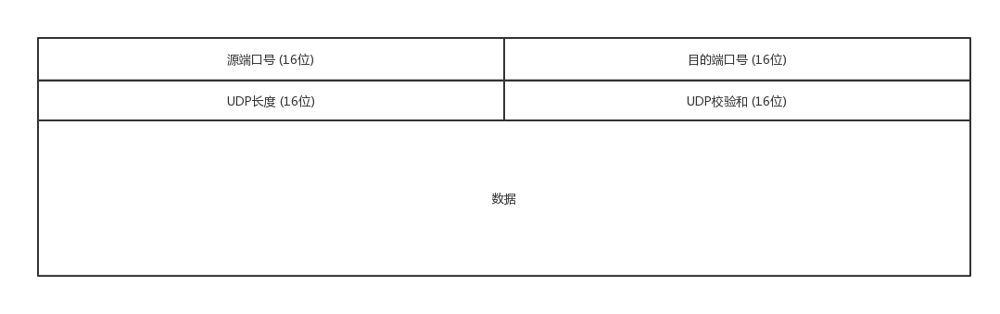

当我们看到 UDP 包头的时候，发现的确有端口号，有源端口号和目标端口号。因为是两端通信嘛，这很好理解。但是你还会发现，UDP 除了端口号，再没有其他的了。和下两节要讲的 TCP 头比起来，这个简直简单得一塌糊涂啊！

## UDP 的三大特点

1. **沟通简单**，不需要一肚子花花肠子（大量的数据结构、处理逻辑、包头字段）。前提是它相信网络世界是美好的，秉承性善论，相信网络通路默认就是很容易送达的，不容易被丢弃的。
2. **轻信他人**。它不会建立连接，虽然有端口号，但是监听在这个地方，谁都可以传给他数据，他也可以传给任何人数据，甚至可以同时传给多个人数据。
3. **愣头青，做事不懂权变**。不知道什么时候该坚持，什么时候该退让。它不会根据网络的情况进行发包的拥塞控制，无论网络丢包丢成啥样了，它该怎么发还怎么发。

## UDP 的三大使用场景

1. **需要资源少，在网络情况比较好的内网，或者对于丢包不敏感的应用**

> 我们在第四节讲的 DHCP 就是基于 UDP 协议的。一般的获取 IP 地址都是内网请求，而且一次获取不到 IP 又没事，过一会儿还有机会。我们讲过 PXE 可以在启动的时候自动安装操作系统，操作系统镜像的下载使用的 TFTP，这个也是基于 UDP 协议的。在还没有操作系统的时候，客户端拥有的资源很少，不适合维护一个复杂的状态机，而是因为是内网，一般也没啥问题。

2. **不需要一对一沟通，建立连接，而是可以广播的应用**

> 对于多播，我们在讲 IP 地址的时候，讲过一个 D 类地址，也即组播地址，使用这个地址，可以将包组播给一批机器。当一台机器上的某个进程想监听某个组播地址的时候，需要发送 IGMP 包，所在网络的路由器就能收到这个包，知道有个机器上有个进程在监听这个组播地址。当路由器收到这个组播地址的时候，会将包转发给这台机器，这样就实现了跨路由器的组播。

3. **需要处理速度快，时延低，可以容忍少数丢包，但是要求即便网络拥塞，也毫不退缩，一往无前的时候**

> UDP 简单、处理速度快，不像 TCP 那样，操这么多的心，各种重传啊，保证顺序啊，前面的不收到，后面的没法处理啊。不然等这些事情做完了，时延早就上去了。而 TCP 在网络不好出现丢包的时候，拥塞控制策略会主动的退缩，降低发送速度，这就相当于本来环境就差，还自断臂膀，用户本来就卡，这下更卡了。

## “城会玩”一：网页或者 APP 的访问

原来访问网页和手机 APP 都是基于 HTTP 协议的。HTTP 协议是基于 TCP 的，建立连接都需要多次交互，对于时延比较大的目前主流的移动互联网来讲，建立一次连接需要的时间会比较长，然而既然是移动中，TCP 可能还会断了重连，也是很耗时的。而且目前的 HTTP 协议，往往采取多个数据通道共享一个连接的情况，这样本来为了加快传输速度，但是 TCP 的严格顺序策略使得哪怕共享通道，前一个不来，后一个和前一个即便没关系，也要等着，时延也会加大。

而**QUIC**（全称**Quick UDP Internet Connections，快速 UDP 互联网连接**）是 Google 提出的一种基于 UDP 改进的通信协议，其目的是降低网络通信的延迟，提供更好的用户互动体验。

QUIC 在应用层上，会自己实现快速连接建立、减少重传时延，自适应拥塞控制，是应用层“城会玩”的代表。这一节主要是讲 UDP，QUIC 我们放到应用层去讲。

## “城会玩”二：流媒体的协议

现在直播比较火，直播协议多使用 RTMP，这个协议我们后面的章节也会讲，而这个 RTMP 协议也是基于 TCP 的。TCP 的严格顺序传输要保证前一个收到了，下一个才能确认，如果前一个收不到，下一个就算包已经收到了，在缓存里面，也需要等着。对于直播来讲，这显然是不合适的，因为老的视频帧丢了其实也就丢了，就算再传过来用户也不在意了，他们要看新的了，如果老是没来就等着，卡顿了，新的也看不了，那就会丢失客户，所以直播，实时性比较比较重要，宁可丢包，也不要卡顿的。

另外，对于丢包，其实对于视频播放来讲，有的包可以丢，有的包不能丢，因为视频的连续帧里面，有的帧重要，有的不重要，如果必须要丢包，隔几个帧丢一个，其实看视频的人不会感知，但是如果连续丢帧，就会感知了，因而在网络不好的情况下，应用希望选择性的丢帧。

还有就是当网络不好的时候，TCP 协议会主动降低发送速度，这对本来当时就卡的看视频来讲是要命的，应该应用层马上重传，而不是主动让步。因而，很多直播应用，都基于 UDP 实现了自己的视频传输协议。

## “城会玩”三：实时游戏

游戏有一个特点，就是实时性比较高。快一秒你干掉别人，慢一秒你被别人爆头，所以很多职业玩家会买非常专业的鼠标和键盘，争分夺秒。

因而，实时游戏中客户端和服务端要建立长连接，来保证实时传输。但是游戏玩家很多，服务器却不多。由于维护 TCP 连接需要在内核维护一些数据结构，因而一台机器能够支撑的 TCP 连接数目是有限的，然后 UDP 由于是没有连接的，在异步 IO 机制引入之前，常常是应对海量客户端连接的策略。

另外还是 TCP 的强顺序问题，对战的游戏，对网络的要求很简单，玩家通过客户端发送给服务器鼠标和键盘行走的位置，服务器会处理每个用户发送过来的所有场景，处理完再返回给客户端，客户端解析响应，渲染最新的场景展示给玩家。

如果出现一个数据包丢失，所有事情都需要停下来等待这个数据包重发。客户端会出现等待接收数据，然而玩家并不关心过期的数据，激战中卡 1 秒，等能动了都已经死了。

游戏对实时要求较为严格的情况下，采用自定义的可靠 UDP 协议，自定义重传策略，能够把丢包产生的延迟降到最低，尽量减少网络问题对游戏性造成的影响。

## “城会玩”四：IoT 物联网

一方面，物联网领域终端资源少，很可能只是个内存非常小的嵌入式系统，而维护 TCP 协议代价太大；另一方面，物联网对实时性要求也很高，而 TCP 还是因为上面的那些原因导致时延大。Google 旗下的 Nest 建立 Thread Group，推出了物联网通信协议 Thread，就是基于 UDP 协议的。

## “城会玩”五：移动通信领域

在 4G 网络里，移动流量上网的数据面对的协议 GTP-U 是基于 UDP 的。因为移动网络协议比较复杂，而 GTP 协议本身就包含复杂的手机上线下线的通信协议。如果基于 TCP，TCP 的机制就显得非常多余，这部分协议我会在后面的章节单独讲解。

## 总结

- 如果将 TCP 比作成熟的社会人，UDP 则是头脑简单的小朋友。TCP 复杂，UDP 简单；TCP 维护连接，UDP 谁都相信；TCP 会坚持知进退；UDP 愣头青一个，勇往直前；
- UDP 虽然简单，但它有简单的用法。它可以用在环境简单、需要多播、应用层自己控制传输的地方。例如 DHCP、VXLAN、QUIC 等。

<h1 id="chapter11">TCP协议（上）：因性恶而复杂，先恶后善反轻松</h1>

上一节，我们讲的 UDP，基本上包括了传输层所必须的端口字段。它就像我们小时候一样简单，相信“网之初，性本善，不丢包，不乱序”。

后来呢，我们都慢慢长大，了解了社会的残酷，变得复杂而成熟，就像 TCP 协议一样。它之所以这么复杂，那是因为它秉承的是“性恶论”。它天然认为网络环境是恶劣的，丢包、乱序、重传，拥塞都是常有的事情，一言不合就可能送达不了，因而要从算法层面来保证可靠性。

## TCP 包头格式

我们先来看 TCP 头的格式。从这个图上可以看出，它比 UDP 复杂得多。

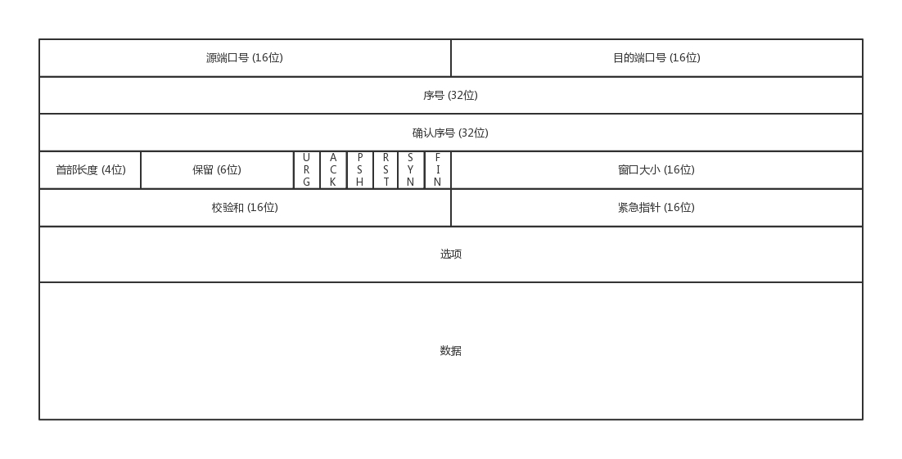

首先，源端口号和目标端口号是不可少的，这一点和 UDP 是一样的。如果没有这两个端口号。数据就不知道应该发给哪个应用。

接下来是包的序号。为什么要给包编号呢？当然是为了解决乱序的问题。不编好号怎么确认哪个应该先来，哪个应该后到呢。编号是为了解决乱序问题。既然是社会老司机，做事当然要稳重，一件件来，面临再复杂的情况，也临危不乱。

还应该有的就是确认序号。发出去的包应该有确认，要不然我怎么知道对方有没有收到呢？如果没有收到就应该重新发送，直到送达。这个可以解决不丢包的问题。作为老司机，做事当然要靠谱，答应了就要做到，暂时做不到也要有个回复。

TCP 是靠谱的协议，但是这不能说明它面临的网络环境好。从 IP 层面来讲，如果网络状况的确那么差，是没有任何可靠性保证的，而作为 IP 的上一层 TCP 也无能为力，唯一能做的就是更加努力，不断重传，通过各种算法保证。也就是说，对于 TCP 来讲，IP 层你丢不丢包，我管不着，但是我在我的层面上，会努力保证可靠性。

接下来有一些状态位。例如 SYN 是发起一个连接，ACK 是回复，RST 是重新连接，FIN 是结束连接等。TCP 是面向连接的，因而双方要维护连接的状态，这些带状态位的包的发送，会引起双方的状态变更。

还有一个重要的就是窗口大小。TCP 要做流量控制，通信双方各声明一个窗口，标识自己当前能够的处理能力，别发送的太快，撑死我，也别发的太慢，饿死我。

通过对 TCP 头的解析，我们知道要掌握 TCP 协议，重点应该关注以下几个问题：

- 顺序问题 ，稳重不乱；
- 丢包问题，承诺靠谱；
- 连接维护，有始有终；
- 流量控制，把握分寸；
- 拥塞控制，知进知退。

## TCP 的三次握手

所有的问题，首先都要先建立一个连接，所以我们先来看连接维护问题。

TCP 的连接建立，我们常常称为三次握手。

我们也常称为“请求 -> 应答 -> 应答之应答”的三个回合。这个看起来简单，其实里面还是有很多的学问，很多的细节。

首先，为什么要三次，而不是两次？按说两个人打招呼，一来一回就可以了啊？为了可靠，为什么不是四次？

我们还是假设这个通路是非常不可靠的，A 要发起一个连接，当发了第一个请求杳无音信的时候，会有很多的可能性，比如第一个请求包丢了，再如没有丢，但是绕了弯路，超时了，还有 B 没有响应，不想和我连接。

A 不能确认结果，于是再发，再发。终于，有一个请求包到了 B，但是请求包到了 B 的这个事情，目前 A 还是不知道的，A 还有可能再发。

B 收到了请求包，就知道了 A 的存在，并且知道 A 要和它建立连接。如果 B 不乐意建立连接，则 A 会重试一阵后放弃，连接建立失败，没有问题；如果 B 是乐意建立连接的，则会发送应答包给 A。

当然对于 B 来说，这个应答包也是一入网络深似海，不知道能不能到达 A。这个时候 B 自然不能认为连接是建立好了，因为应答包仍然会丢，会绕弯路，或者 A 已经挂了都有可能。

B 发送的应答可能会发送多次，但是只要一次到达 A，A 就认为连接已经建立了，因为对于 A 来讲，他的消息有去有回。A 会给 B 发送应答之应答，而 B 也在等这个消息，才能确认连接的建立，只有等到了这个消息，对于 B 来讲，才算它的消息有去有回。

当然 A 发给 B 的应答之应答也会丢，也会绕路，甚至 B 挂了。按理来说，还应该有个应答之应答之应答，这样下去就没底了。所以四次握手是可以的，四十次都可以，关键四百次也不能保证就真的可靠了。只要双方的消息都有去有回，就基本可以了。

好在大部分情况下，A 和 B 建立了连接之后，A 会马上发送数据的，一旦 A 发送数据，则很多问题都得到了解决。例如 A 发给 B 的应答丢了，当 A 后续发送的数据到达的时候，B 可以认为这个连接已经建立，或者 B 压根就挂了，A 发送的数据，会报错，说 B 不可达，A 就知道 B 出事情了。

当然你可以说 A 比较坏，就是不发数据，建立连接后空着。我们在程序设计的时候，可以要求开启 keepalive 机制，即使没有真实的数据包，也有探活包。

另外，你作为服务端 B 的程序设计者，对于 A 这种长时间不发包的客户端，可以主动关闭，从而空出资源来给其他客户端使用。

三次握手除了双方建立连接外，主要还是为了沟通一件事情，就是**TCP 包的序号的问题**。

A 要告诉 B，我这面发起的包的序号起始是从哪个号开始的，B 同样也要告诉 A，B 发起的包的序号起始是从哪个号开始的。为什么序号不能都从 1 开始呢？因为这样往往会出现冲突。

例如，A 连上 B 之后，发送了 1、2、3 三个包，但是发送 3 的时候，中间丢了，或者绕路了，于是重新发送，后来 A 掉线了，重新连上 B 后，序号又从 1 开始，然后发送 2，但是压根没想发送 3，但是上次绕路的那个 3 又回来了，发给了 B，B 自然认为，这就是下一个包，于是发生了错误。

因而，每个连接都要有不同的序号。这个序号的起始序号是随着时间变化的，可以看成一个 32 位的计数器，每 4ms 加一，如果计算一下，如果到重复，需要 4 个多小时，那个绕路的包早就死翘翘了，因为我们都知道 IP 包头里面有个 TTL，也即生存时间。

好了，双方终于建立了信任，建立了连接。前面也说过，为了维护这个连接，双方都要维护一个状态机，在连接建立的过程中，双方的状态变化时序图就像这样。

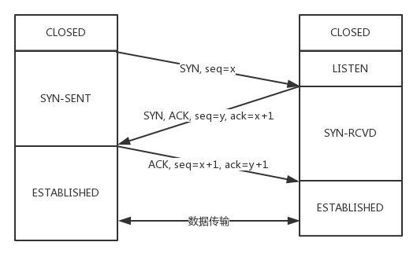

一开始，客户端和服务端都处于 CLOSED 状态。先是服务端主动监听某个端口，处于 LISTEN 状态。然后客户端主动发起连接 SYN，之后处于 SYN-SENT 状态。服务端收到发起的连接，返回 SYN，并且 ACK 客户端的 SYN，之后处于 SYN-RCVD 状态。客户端收到服务端发送的 SYN 和 ACK 之后，发送 ACK 的 ACK，之后处于 ESTABLISHED 状态，因为它一发一收成功了。服务端收到 ACK 的 ACK 之后，处于 ESTABLISHED 状态，因为它也一发一收了。

## TCP 四次挥手

好了，说完了连接，接下来说一说“拜拜”，好说好散。这常被称为四次挥手。

A：B 啊，我不想玩了。

B：哦，你不想玩了啊，我知道了。

这个时候，还只是 A 不想玩了，也即 A 不会再发送数据，但是 B 能不能在 ACK 的时候，直接关闭呢？当然不可以了，很有可能 A 是发完了最后的数据就准备不玩了，但是 B 还没做完自己的事情，还是可以发送数据的，所以称为半关闭的状态。

这个时候 A 可以选择不再接收数据了，也可以选择最后再接收一段数据，等待 B 也主动关闭。

B：A 啊，好吧，我也不玩了，拜拜。

A：好的，拜拜。

这样整个连接就关闭了。但是这个过程有没有异常情况呢？当然有，上面是和平分手的场面。

A 开始说“不玩了”，B 说“知道了”，这个回合，是没什么问题的，因为在此之前，双方还处于合作的状态，如果 A 说“不玩了”，没有收到回复，则 A 会重新发送“不玩了”。但是这个回合结束之后，就有可能出现异常情况了，因为已经有一方率先撕破脸。

一种情况是，A 说完“不玩了”之后，直接跑路，是会有问题的，因为 B 还没有发起结束，而如果 A 跑路，B 就算发起结束，也得不到回答，B 就不知道该怎么办了。另一种情况是，A 说完“不玩了”，B 直接跑路，也是有问题的，因为 A 不知道 B 是还有事情要处理，还是过一会儿会发送结束。

那怎么解决这些问题呢？TCP 协议专门设计了几个状态来处理这些问题。我们来看断开连接的时候的**状态时序图**。

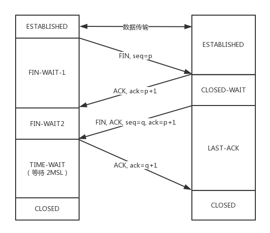

断开的时候，我们可以看到，当 A 说“不玩了”，就进入 FIN_WAIT_1 的状态，B 收到“A 不玩”的消息后，发送知道了，就进入 CLOSE_WAIT 的状态。

A 收到“B 说知道了”，就进入 FIN_WAIT_2 的状态，如果这个时候 B 直接跑路，则 A 将永远在这个状态。TCP 协议里面并没有对这个状态的处理，但是 Linux 有，可以调整 tcp_fin_timeout 这个参数，设置一个超时时间。

如果 B 没有跑路，发送了“B 也不玩了”的请求到达 A 时，A 发送“知道 B 也不玩了”的 ACK 后，从 FIN_WAIT_2 状态结束，按说 A 可以跑路了，但是最后的这个 ACK 万一 B 收不到呢？则 B 会重新发一个“B 不玩了”，这个时候 A 已经跑路了的话，B 就再也收不到 ACK 了，因而 TCP 协议要求 A 最后等待一段时间 TIME_WAIT，这个时间要足够长，长到如果 B 没收到 ACK 的话，“B 说不玩了”会重发的，A 会重新发一个 ACK 并且足够时间到达 B。

A 直接跑路还有一个问题是，A 的端口就直接空出来了，但是 B 不知道，B 原来发过的很多包很可能还在路上，如果 A 的端口被一个新的应用占用了，这个新的应用会收到上个连接中 B 发过来的包，虽然序列号是重新生成的，但是这里要上一个双保险，防止产生混乱，因而也需要等足够长的时间，等到原来 B 发送的所有的包都死翘翘，再空出端口来。

等待的时间设为 2MSL，**MSL**是**Maximum Segment Lifetime，报文最大生存时间**，它是任何报文在网络上存在的最长时间，超过这个时间报文将被丢弃。因为 TCP 报文基于是 IP 协议的，而 IP 头中有一个 TTL 域，是 IP 数据报可以经过的最大路由数，每经过一个处理他的路由器此值就减 1，当此值为 0 则数据报将被丢弃，同时发送 ICMP 报文通知源主机。协议规定 MSL 为 2 分钟，实际应用中常用的是 30 秒，1 分钟和 2 分钟等。

还有一个异常情况就是，B 超过了 2MSL 的时间，依然没有收到它发的 FIN 的 ACK，怎么办呢？按照 TCP 的原理，B 当然还会重发 FIN，这个时候 A 再收到这个包之后，A 就表示，我已经在这里等了这么长时间了，已经仁至义尽了，之后的我就都不认了，于是就直接发送 RST，B 就知道 A 早就跑了。

## TCP 状态机

将连接建立和连接断开的两个时序状态图综合起来，就是这个著名的 TCP 的状态机。学习的时候比较建议将这个状态机和时序状态机对照着看，不然容易晕。

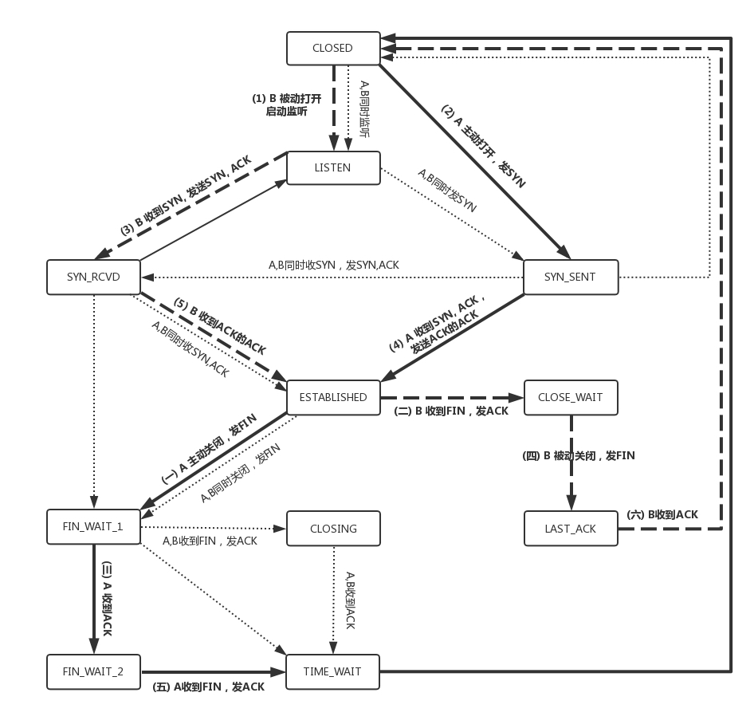

在这个图中，加黑加粗的部分，是上面说到的主要流程，其中阿拉伯数字的序号，是连接过程中的顺序，而大写中文数字的序号，是连接断开过程中的顺序。加粗的实线是客户端 A 的状态变迁，加粗的虚线是服务端 B 的状态变迁。

## 总结

- TCP 包头很复杂，但是主要关注五个问题，顺序问题，丢包问题，连接维护，流量控制，拥塞控制；
- 连接的建立是经过三次握手，断开的时候四次挥手，一定要掌握的我画的那个状态图。

<h1 id="chapter12">TCP协议（下）：西行必定多妖孽，恒心智慧消磨难</h1>

我们前面说到玄奘西行，要出网关。既然出了网关，那就是在公网上传输数据，公网往往是不可靠的，因而需要很多的机制去保证传输的可靠性，这里面需要恒心，也即各种**重传的策略**，还需要有智慧，也就是说，这里面包含着**大量的算法**。

## 如何做个靠谱的人？

网络协议上，就是客户端每发送的一个包，服务器端都应该有个回复，如果服务器端超过一定的时间没有回复，客户端就会重新发送这个包，直到有回复。

这个发送应答的过程是什么样呢？可以是**上一个收到了应答，再发送下一个**。这种模式有点像两个人直接打电话，你一句，我一句。但是这种方式的缺点是效率比较低。如果一方在电话那头处理的时间比较长，这一头就要干等着，双方都没办法干其他事情。咱们在日常工作中也不是这样的，不能你交代你的下属办一件事情，就一直打着电话看着他做，而是应该他按照你的安排，先将事情记录下来，办完一件回复一件。在他办事情的过程中，你还可以同时交代新的事情，这样双方就并行了。

如果使⽤这种模式，其实需要你和你的下属就不能靠脑⼦了，⽽是要都准备⼀个本⼦，你每交代下属⼀个事情，双方的本子都要记录⼀下。

当你的下属做完⼀件事情，就回复你，做完了，你就在你的本⼦上将这个事情划去。同时你的本⼦上每件事情都有时限，如果超过了时限下属还没有回复，你就要主动重新交代⼀下：上次那件事情，你还没回复我，咋样啦？

既然多件事情可以一起处理，那就需要给每个事情编个号，防止弄错了。例如，程序员平时看任务的时候，都会看 JIRA 的 ID，而不是每次都要描述一下具体的事情。在大部分情况下，对于事情的处理是按照顺序来的，先来的先处理，这就给应答和汇报工作带来了方便。等开周会的时候，每个程序员都可以将 JIRA ID 的列表拉出来，说以上的都做完了，⽽不⽤⼀个个说。

## 如何实现一个靠谱的协议？

TCP 协议使用的也是同样的模式。为了保证顺序性，每一个包都有一个 ID。在建立连接的时候，会商定起始的 ID 是什么，然后按照 ID 一个个发送。为了保证不丢包，对于发送的包都要进行应答，但是这个应答也不是一个一个来的，而是会应答某个之前的 ID，表示都收到了，这种模式称为**累计确认**或者**累计应答（cumulative acknowledgment）。**

为了记录所有发送的包和接收的包，TCP 也需要发送端和接收端分别都有缓存来保存这些记录。发送端的缓存里是按照包的 ID 一个个排列，根据处理的情况分成四个部分。

第一部分：发送了并且已经确认的。

第二部分：发送了并且尚未确认的。

第三部分：没有发送，但是已经等待发送的。

第四部分：没有发送，并且暂时还不会发送的。

这里面为什么要区分第三部分和第四部分呢？没交代的，一下子全交代了不就完了吗？

这就是我们上一节提到的十个词口诀里的“流量控制，把握分寸”。作为项目管理人员，你应该根据以往的工作情况和这个员工反馈的能力、抗压力等，先在心中估测一下，这个人一天能做多少工作。如果工作布置少了，就会不饱和；如果工作布置多了，他就会做不完；如果你使劲逼迫，人家可能就要辞职了。

到底一个员工能够同时处理多少事情呢？在 TCP 里，接收端会给发送端报一个窗口的大小，叫**Advertised window**。这个窗口的大小应该等于上面的第二部分加上第三部分，就是已经交代了没做完的加上马上要交代的。超过这个窗口的，接收端做不过来，就不能发送了。

于是，发送端需要保持下面的数据结构。


- LastByteAcked：第一部分和第二部分的分界线
- LastByteSent：第二部分和第三部分的分界线
- LastByteAcked + AdvertisedWindow：第三部分和第四部分的分界线

对于接收端来讲，它的缓存里记录的内容要简单一些。

第一部分：接受并且确认过的。

第二部分：还没接收，但是马上就能接收的。

第三部分：还没接收，也没法接收的。

对应的数据结构就像这样。

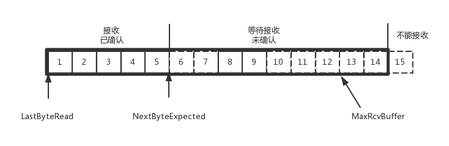

- MaxRcvBuffer：最大缓存的量；
- LastByteRead 之后是已经接收了，但是还没被应用层读取的；
- NextByteExpected 是第一部分和第二部分的分界线。

第二部分的窗口有多大呢？

NextByteExpected 和 LastByteRead 的差其实是还没被应用层读取的部分占用掉的 MaxRcvBuffer 的量，我们定义为 A。

AdvertisedWindow 其实是 MaxRcvBuffer 减去 A。

也就是：AdvertisedWindow=MaxRcvBuffer-((NextByteExpected-1)-LastByteRead)。

那第二部分和第三部分的分界线在哪里呢？NextByteExpected 加 AdvertisedWindow 就是第二部分和第三部分的分界线，其实也就是 LastByteRead 加上 MaxRcvBuffer。

其中第二部分里面，由于受到的包可能不是顺序的，会出现空挡，只有和第一部分连续的，可以马上进行回复，中间空着的部分需要等待，哪怕后面的已经来了。

## 顺序问题与丢包问题

还是刚才的图，在发送端来看，1、2、3 已经发送并确认；4、5、6、7、8、9 都是发送了还没确认；10、11、12 是还没发出的；13、14、15 是接收方没有空间，不准备发的。

在接收端来看，1、2、3、4、5 是已经完成 ACK，但是没读取的；6、7 是等待接收的；8、9 是已经接收，但是没有 ACK 的。

发送端和接收端当前的状态如下：

- 1、2、3 没有问题，双方达成了一致。
- 4、5 接收方说 ACK 了，但是发送方还没收到，有可能丢了，有可能在路上。
- 6、7、8、9 肯定都发了，但是 8、9 已经到了，但是 6、7 没到，出现了乱序，缓存着但是没办法 ACK。

根据这个例子，我们可以知道，顺序问题和丢包问题都有可能发生，所以我们先来看**确认与重发的机制**。

假设 4 的确认到了，不幸的是，5 的 ACK 丢了，6、7 的数据包丢了，这该怎么办呢？

一种方法就是**超时重试**，也即对每一个发送了，但是没有 ACK 的包，都有设一个定时器，超过了一定的时间，就重新尝试。但是这个超时的时间如何评估呢？这个时间不宜过短，时间必须大于往返时间 RTT，否则会引起不必要的重传。也不宜过长，这样超时时间变长，访问就变慢了。

估计往返时间，需要 TCP 通过采样 RTT 的时间，然后进行加权平均，算出一个值，而且这个值还是要不断变化的，因为网络状况不断的变化。除了采样 RTT，还要采样 RTT 的波动范围，计算出一个估计的超时时间。由于重传时间是不断变化的，我们称为**自适应重传算法（Adaptive Retransmission Algorithm）。**

如果过一段时间，5、6、7 都超时了，就会重新发送。接收方发现 5 原来接收过，于是丢弃 5；6 收到了，发送 ACK，要求下一个是 7，7 不幸又丢了。当 7 再次超时的时候，有需要重传的时候，TCP 的策略是**超时间隔加倍**。**每当遇到一次超时重传的时候，都会将下一次超时时间间隔设为先前值的两倍**。**两次超时，就说明网络环境差，不宜频繁反复发送。**

超时触发重传存在的问题是，超时周期可能相对较长。那是不是可以有更快的方式呢？

有一个可以快速重传的机制，当接收方收到一个序号大于下一个所期望的报文段时，就检测到了数据流中的一个间格，于是发送三个冗余的 ACK，客户端收到后，就在定时器过期之前，重传丢失的报文段。

例如，接收方发现 6、8、9 都已经接收了，就是 7 没来，那肯定是丢了，于是发送三个 6 的 ACK，要求下一个是 7。客户端收到 3 个，就会发现 7 的确又丢了，不等超时，马上重发。

还有一种方式称为**Selective Acknowledgment（SACK）**。这种方式需要在 TCP 头里加一个 SACK 的东西，可以将缓存的地图发送给发送方。例如可以发送 ACK6、SACK8、SACK9，有了地图，发送方一下子就能看出来是 7 丢了。

## 流量控制问题

我们再来看流量控制机制，在对于包的确认中，同时会携带一个窗口的大小。

我们先假设窗口不变的情况，窗口始终为 9。4 的确认来的时候，会右移一个，这个时候第 13 个包也可以发送了。

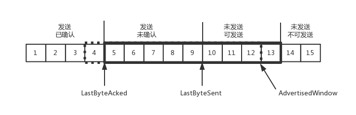

这个时候，假设发送端发送过猛，会将第三部分的 10、11、12、13 全部发送完毕，之后就停止发送了，未发送可发送部分为 0。

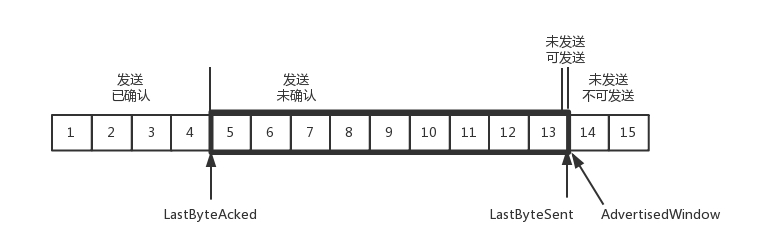

当对于包 5 的确认到达的时候，在客户端相当于窗口再滑动了一格，这个时候，才可以有更多的包可以发送了，例如第 14 个包才可以发送。

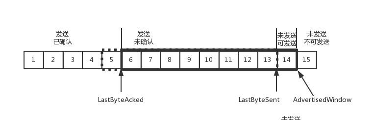

如果接收方实在处理的太慢，导致缓存中没有空间了，可以通过确认信息修改窗口的大小，甚至可以设置为 0，则发送方将暂时停止发送。

我们假设一个极端情况，接收端的应用一直不读取缓存中的数据，当数据包 6 确认后，窗口大小就不能再是 9 了，就要缩小一个变为 8。

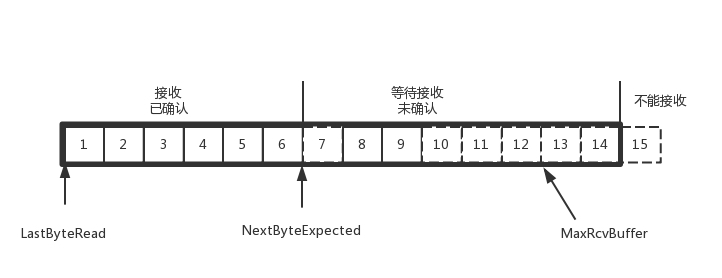

这个新的窗口 8 通过 6 的确认消息到达发送端的时候，你会发现窗口没有平行右移，而是仅仅左面的边右移了，窗口的大小从 9 改成了 8。

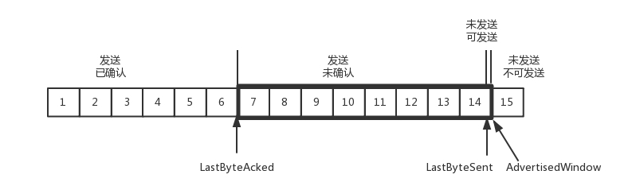

如果接收端还是一直不处理数据，则随着确认的包越来越多，窗口越来越小，直到为 0。

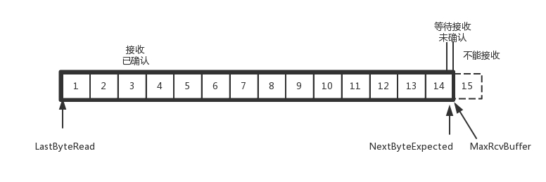

当这个窗口通过包 14 的确认到达发送端的时候，发送端的窗口也调整为 0，停止发送。

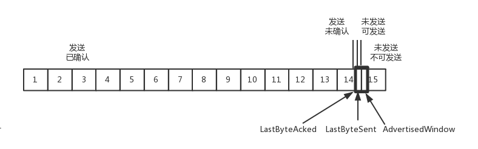

如果这样的话，发送方会定时发送窗口探测数据包，看是否有机会调整窗口的大小。当接收方比较慢的时候，要防止低能窗口综合征，别空出一个字节来就赶快告诉发送方，然后马上又填满了，可以当窗口太小的时候，不更新窗口，直到达到一定大小，或者缓冲区一半为空，才更新窗口。

这就是我们常说的流量控制。

## 拥塞控制问题

最后，我们看一下拥塞控制的问题，也是通过窗口的大小来控制的，前面的滑动窗口 rwnd 是怕发送方把接收方缓存塞满，而拥塞窗口 cwnd，是怕把网络塞满。

这里有一个公式 LastByteSent - LastByteAcked <= min {cwnd, rwnd} ，是拥塞窗口和滑动窗口共同控制发送的速度。

那发送方怎么判断网络是不是满呢？这其实是个挺难的事情，因为对于 TCP 协议来讲，他压根不知道整个网络路径都会经历什么，对他来讲就是一个黑盒。TCP 发送包常被比喻为往一个水管里面灌水，而 TCP 的拥塞控制就是在不堵塞，不丢包的情况下，尽量发挥带宽。

水管有粗细，网络有带宽，也即每秒钟能够发送多少数据；水管有长度，端到端有时延。在理想状态下，水管里面水的量 = 水管粗细 x 水管长度。对于到网络上，通道的容量 = 带宽 × 往返延迟。

如果我们设置发送窗口，使得发送但未确认的包为为通道的容量，就能够撑满整个管道。

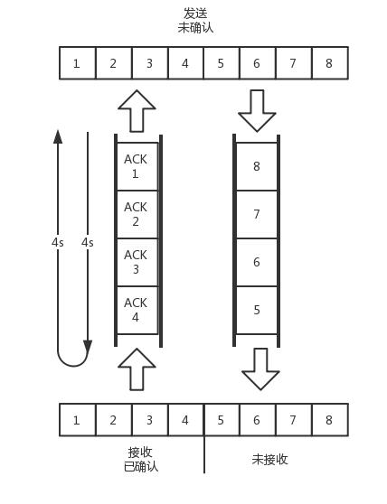

如图所示，假设往返时间为 8s，去 4s，回 4s，每秒发送一个包，每个包 1024byte。已经过去了 8s，则 8 个包都发出去了，其中前 4 个包已经到达接收端，但是 ACK 还没有返回，不能算发送成功。5-8 后四个包还在路上，还没被接收。这个时候，整个管道正好撑满，在发送端，已发送未确认的为 8 个包，正好等于带宽，也即每秒发送 1 个包，乘以来回时间 8s。

如果我们在这个基础上再调大窗口，使得单位时间内更多的包可以发送，会出现什么现象呢？

我们来想，原来发送一个包，从一端到达另一端，假设一共经过四个设备，每个设备处理一个包时间耗费 1s，所以到达另一端需要耗费 4s，如果发送的更加快速，则单位时间内，会有更多的包到达这些中间设备，这些设备还是只能每秒处理一个包的话，多出来的包就会被丢弃，这是我们不想看到的。

这个时候，我们可以想其他的办法，例如这个四个设备本来每秒处理一个包，但是我们在这些设备上加缓存，处理不过来的在队列里面排着，这样包就不会丢失，但是缺点是会增加时延，这个缓存的包，4s 肯定到达不了接收端了，如果时延达到一定程度，就会超时重传，也是我们不想看到的。

于是 TCP 的拥塞控制主要来避免两种现象，**包丢失**和**超时重传**。一旦出现了这些现象就说明，发送速度太快了，要慢一点。但是一开始我怎么知道速度多快呢，我怎么知道应该把窗口调整到多大呢？

如果我们通过漏斗往瓶子里灌水，我们就知道，不能一桶水一下子倒进去，肯定会溅出来，要一开始慢慢的倒，然后发现总能够倒进去，就可以越倒越快。这叫作慢启动。

一条 TCP 连接开始，cwnd 设置为一个报文段，一次只能发送一个；当收到这一个确认的时候，cwnd 加一，于是一次能够发送两个；当这两个的确认到来的时候，每个确认 cwnd 加一，两个确认 cwnd 加二，于是一次能够发送四个；当这四个的确认到来的时候，每个确认 cwnd 加一，四个确认 cwnd 加四，于是一次能够发送八个。可以看出这是**指数性的增长**。

涨到什么时候是个头呢？有一个值 ssthresh 为 65535 个字节，当超过这个值的时候，就要小心一点了，不能倒这么快了，可能快满了，再慢下来。

每收到一个确认后，cwnd 增加 1/cwnd，我们接着上面的过程来，一次发送八个，当八个确认到来的时候，每个确认增加 1/8，八个确认一共 cwnd 增加 1，于是一次能够发送九个，变成了线性增长。

但是线性增长还是增长，还是越来越多，直到有一天，水满则溢，出现了拥塞，这时候一般就会一下子降低倒水的速度，等待溢出的水慢慢渗下去。

拥塞的一种表现形式是丢包，需要超时重传，这个时候，将 sshresh 设为 cwnd/2，将 cwnd 设为 1，重新开始慢启动。这真是一旦超时重传，马上回到解放前。但是这种方式太激进了，将一个高速的传输速度一下子停了下来，会造成网络卡顿。

前面我们讲过**快速重传算法**。当接收端发现丢了一个中间包的时候，发送三次前一个包的 ACK，于是发送端就会快速的重传，不必等待超时再重传。TCP 认为这种情况不严重，因为大部分没丢，只丢了一小部分，cwnd 减半为 cwnd/2，然后 sshthresh = cwnd，当三个包返回的时候，cwnd = sshthresh + 3，也就是没有一夜回到解放前，而是还在比较高的值，呈线性增长。

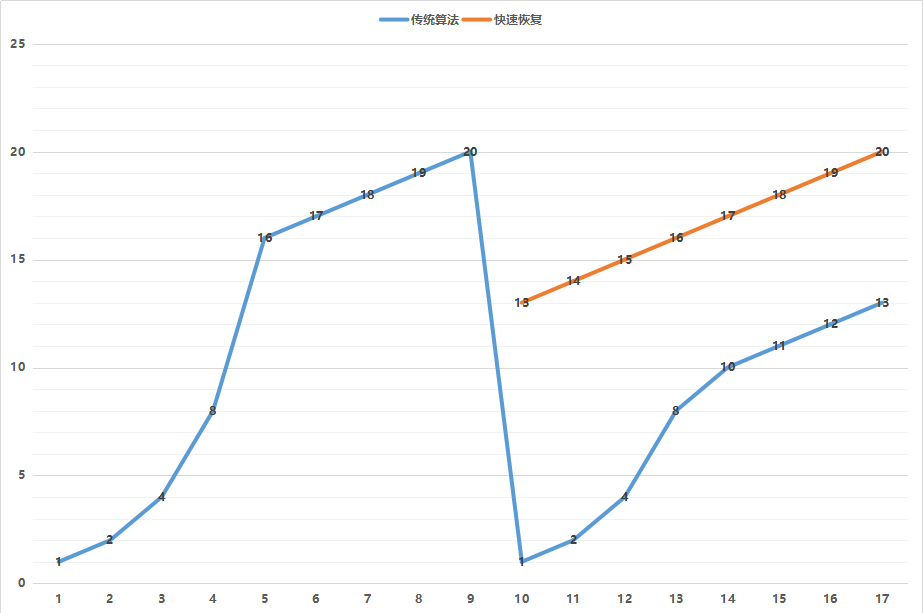

就像前面说的一样，正是这种知进退，使得时延很重要的情况下，反而降低了速度。但是如果你仔细想一下，TCP 的拥塞控制主要来避免的两个现象都是有问题的。

**第一个问题**是丢包并不代表着通道满了，也可能是管子本来就漏水。例如公网上带宽不满也会丢包，这个时候就认为拥塞了，退缩了，其实是不对的。

**第二个问题**是 TCP 的拥塞控制要等到将中间设备都填充满了，才发生丢包，从而降低速度，这时候已经晚了。其实 TCP 只要填满管道就可以了，不应该接着填，直到连缓存也填满。

为了优化这两个问题，后来有了**TCP BBR 拥塞算法**。它企图找到一个平衡点，就是通过不断的加快发送速度，将管道填满，但是不要填满中间设备的缓存，因为这样时延会增加，在这个平衡点可以很好的达到高带宽和低时延的平衡。

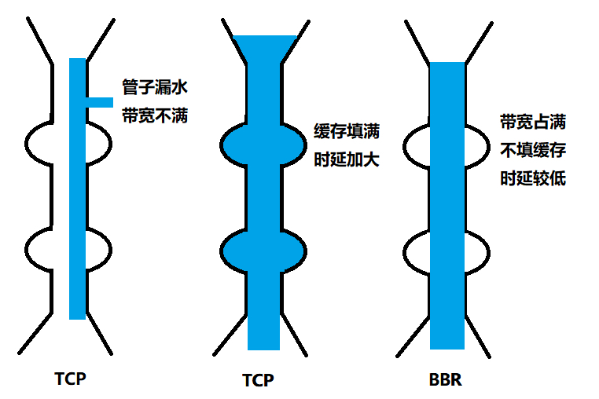

## 总结

- 顺序问题、丢包问题、流量控制都是通过滑动窗口来解决的，这其实就相当于你领导和你的工作备忘录，布置过的工作要有编号，干完了有反馈，活不能派太多，也不能太少；
- 拥塞控制是通过拥塞窗口来解决的，相当于往管道里面倒水，快了容易溢出，慢了浪费带宽，要摸着石头过河，找到最优值。

<h1 id="chapter13">套接字Socket：Talk is cheap, show me the code</h1>

前面讲完了 TCP 和 UDP 协议，还没有上手过，这一节咱们讲讲基于 TCP 和 UDP 协议的 Socket 编程。

Socket 这个名字很有意思，可以作插口或者插槽讲。虽然我们是写软件程序，但是你可以想象为弄一根网线，一头插在客户端，一头插在服务端，然后进行通信。所以在通信之前，双方都要建立一个 Socket。

在建立 Socket 的时候，应该设置什么参数呢？Socket 编程进行的是端到端的通信，往往意识不到中间经过多少局域网，多少路由器，因而能够设置的参数，也只能是端到端协议之上网络层和传输层的。

在网络层，Socket 函数需要指定到底是 IPv4 还是 IPv6，分别对应设置为 AF_INET 和 AF_INET6。另外，还要指定到底是 TCP 还是 UDP。还记得咱们前面讲过的，TCP 协议是基于数据流的，所以设置为 SOCK_STREAM，而 UDP 是基于数据报的，因而设置为 SOCK_DGRAM。

## 基于 TCP 协议的 Socket 程序函数调用过程

两端创建了 Socket 之后，接下来的过程中，TCP 和 UDP 稍有不同，我们先来看 TCP。

TCP 的服务端要先监听一个端口，一般是先调用 bind 函数，给这个 Socket 赋予一个 IP 地址和端口。为什么需要端口呢？要知道，你写的是一个应用程序，当一个网络包来的时候，内核要通过 TCP 头里面的这个端口，来找到你这个应用程序，把包给你。为什么要 IP 地址呢？有时候，一台机器会有多个网卡，也就会有多个 IP 地址，你可以选择监听所有的网卡，也可以选择监听一个网卡，这样，只有发给这个网卡的包，才会给你。

当服务端有了 IP 和端口号，就可以调用 listen 函数进行监听。在 TCP 的状态图里面，有一个 listen 状态，当调用这个函数之后，服务端就进入了这个状态，这个时候客户端就可以发起连接了。

在内核中，为每个 Socket 维护两个队列。一个是已经建立了连接的队列，这时候连接三次握手已经完毕，处于 established 状态；一个是还没有完全建立连接的队列，这个时候三次握手还没完成，处于 syn_rcvd 的状态。

接下来，服务端调用 accept 函数，拿出一个已经完成的连接进行处理。如果还没有完成，就要等着。

在服务端等待的时候，客户端可以通过 connect 函数发起连接。先在参数中指明要连接的 IP 地址和端口号，然后开始发起三次握手。内核会给客户端分配一个临时的端口。一旦握手成功，服务端的 accept 就会返回另一个 Socket。

这是一个经常考的知识点，就是监听的 Socket 和真正用来传数据的 Socket 是两个，一个叫作**监听 Socket**，一个叫作**已连接 Socket**。

连接建立成功之后，双方开始通过 read 和 write 函数来读写数据，就像往一个文件流里面写东西一样。

这个图就是基于 TCP 协议的 Socket 程序函数调用过程。

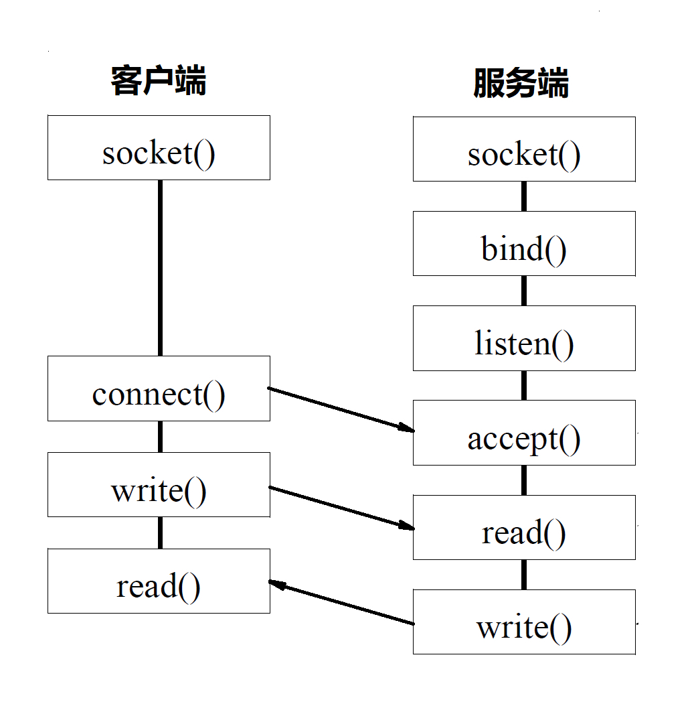

说 TCP 的 Socket 就是一个文件流，是非常准确的。因为，Socket 在 Linux 中就是以文件的形式存在的。除此之外，还存在文件描述符。写入和读出，也是通过文件描述符。

在内核中，Socket 是一个文件，那对应就有文件描述符。每一个进程都有一个数据结构 task_struct，里面指向一个文件描述符数组，来列出这个进程打开的所有文件的文件描述符。文件描述符是一个整数，是这个数组的下标。

这个数组中的内容是一个指针，指向内核中所有打开的文件的列表。既然是一个文件，就会有一个 inode，只不过 Socket 对应的 inode 不像真正的文件系统一样，保存在硬盘上的，而是在内存中的。在这个 inode 中，指向了 Socket 在内核中的 Socket 结构。

在这个结构里面，主要的是两个队列，一个是**发送队列**，一个是**接收队列**。在这两个队列里面保存的是一个缓存 sk_buff。这个缓存里面能够看到完整的包的结构。看到这个，是不是能和前面讲过的收发包的场景联系起来了？

整个数据结构我也画了一张图。

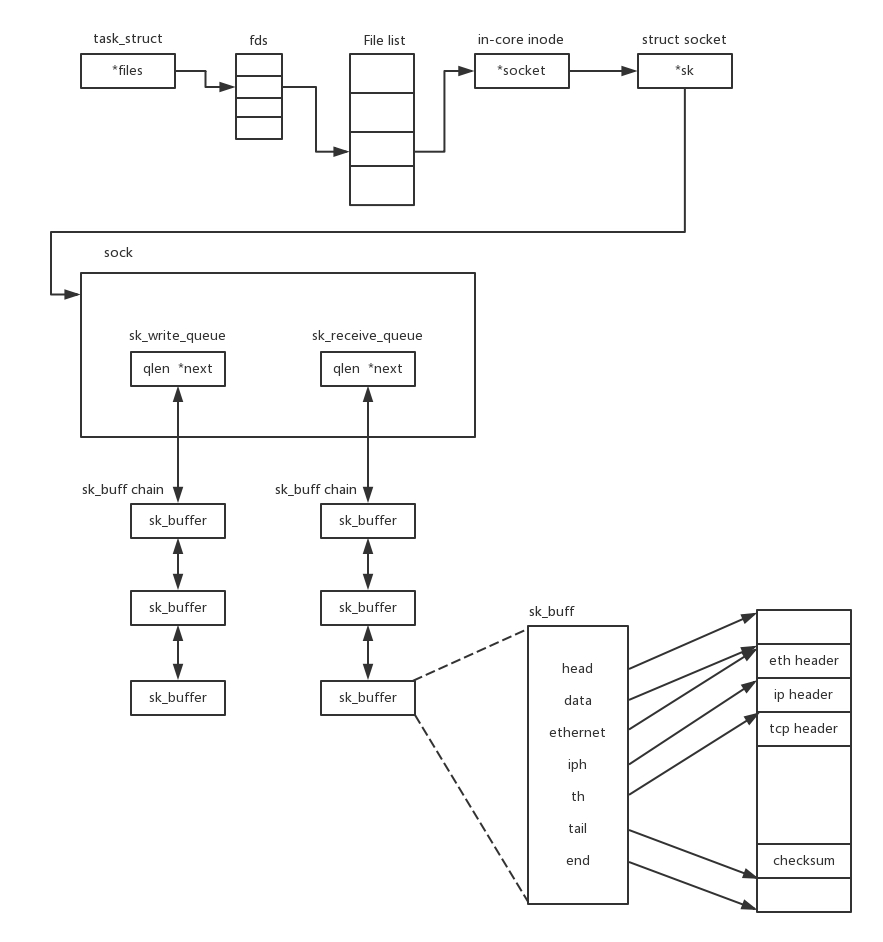

## 基于 UDP 协议的 Socket 程序函数调用过程

对于 UDP 来讲，过程有些不一样。UDP 是没有连接的，所以不需要三次握手，也就不需要调用 listen 和 connect，但是，UDP 的的交互仍然需要 IP 和端口号，因而也需要 bind。UDP 是没有维护连接状态的，因而不需要每对连接建立一组 Socket，而是只要有一个 Socket，就能够和多个客户端通信。也正是因为没有连接状态，每次通信的时候，都调用 sendto 和 recvfrom，都可以传入 IP 地址和端口。

这个图的内容就是基于 UDP 协议的 Socket 程序函数调用过程。

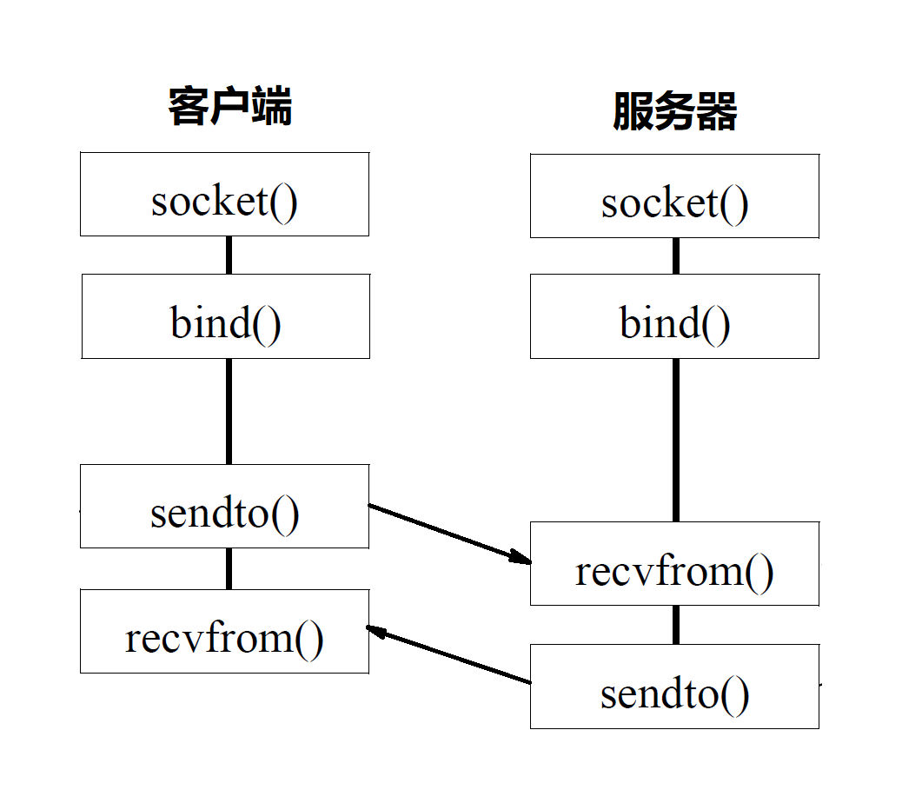

## 服务器如何接更多的项目？

会了这几个基本的 Socket 函数之后，你就可以轻松地写一个网络交互的程序了。就像上面的过程一样，在建立连接后，进行一个 while 循环。客户端发了收，服务端收了发。

当然这只是万里长征的第一步，因为如果使用这种方法，基本上只能一对一沟通。如果你是一个服务器，同时只能服务一个客户，肯定是不行的。这就相当于老板成立一个公司，只有自己一个人，自己亲自上来服务客户，只能干完了一家再干下一家，这样赚不来多少钱。

那作为老板你就要想了，我最多能接多少项目呢？当然是越多越好。

我们先来算一下理论值，也就是**最大连接数**，系统会用一个四元组来标识一个 TCP 连接。

```s
{本机 IP, 本机端口, 对端 IP, 对端端口}
```

服务器通常固定在某个本地端口上监听，等待客户端的连接请求。因此，服务端端 TCP 连接四元组中只有对端 IP, 也就是客户端的 IP 和对端的端口，也即客户端的端口是可变的，因此，最大 TCP 连接数 = 客户端 IP 数×客户端端口数。对 IPv4，客户端的 IP 数最多为 2 的 32 次方，客户端的端口数最多为 2 的 16 次方，也就是服务端单机最大 TCP 连接数，约为 2 的 48 次方。

当然，服务端最大并发 TCP 连接数远不能达到理论上限。首先主要是**文件描述符限制**，按照上面的原理，Socket 都是文件，所以首先要通过 ulimit 配置文件描述符的数目；另一个限制是**内存**，按上面的数据结构，每个 TCP 连接都要占用一定内存，操作系统是有限的。

所以，作为老板，在资源有限的情况下，要想接更多的项目，就需要降低每个项目消耗的资源数目。

## 方式一：将项目外包给其他公司（多进程方式）

这就相当于你是一个代理，在那里监听来的请求。一旦建立了一个连接，就会有一个已连接 Socket，这时候你可以创建一个子进程，然后将基于已连接 Socket 的交互交给这个新的子进程来做。就像来了一个新的项目，但是项目不一定是你自己做，可以再注册一家子公司，招点人，然后把项目转包给这家子公司做，以后对接就交给这家子公司了，你又可以去接新的项目了。

这里有一个问题是，如何创建子公司，并如何将项目移交给子公司呢？

在 Linux 下，创建子进程使用 fork 函数。通过名字可以看出，这是在父进程的基础上完全拷贝一个子进程。在 Linux 内核中，会复制文件描述符的列表，也会复制内存空间，还会复制一条记录当前执行到了哪一行程序的进程。显然，复制的时候在调用 fork，复制完毕之后，父进程和子进程都会记录当前刚刚执行完 fork。这两个进程刚复制完的时候，几乎一模一样，只是根据 fork 的返回值来区分到底是父进程，还是子进程。如果返回值是 0，则是子进程；如果返回值是其他的整数，就是父进程。

进程复制过程我画在这里。


因为复制了文件描述符列表，而文件描述符都是指向整个内核统一的打开文件列表的，因而父进程刚才因为 accept 创建的已连接 Socket 也是一个文件描述符，同样也会被子进程获得。

接下来，子进程就可以通过这个已连接 Socket 和客户端进行互通了，当通信完毕之后，就可以退出进程，那父进程如何知道子进程干完了项目，要退出呢？还记得 fork 返回的时候，如果是整数就是父进程吗？这个整数就是子进程的 ID，父进程可以通过这个 ID 查看子进程是否完成项目，是否需要退出。

## 方式二：将项目转包给独立的项目组（多线程方式）

上面这种方式你应该也能发现问题，如果每次接一个项目，都申请一个新公司，然后干完了，就注销掉这个公司，实在是太麻烦了。毕竟一个新公司要有新公司的资产，有新的办公家具，每次都买了再卖，不划算。

于是你应该想到了，我们可以使用**线程**。相比于进程来讲，这样要轻量级的多。如果创建进程相当于成立新公司，购买新办公家具，而创建线程，就相当于在同一个公司成立项目组。一个项目做完了，那这个项目组就可以解散，组成另外的项目组，办公家具可以共用。

在 Linux 下，通过 pthread_create 创建一个线程，也是调用 do_fork。不同的是，虽然新的线程在 task 列表会新创建一项，但是很多资源，例如文件描述符列表、进程空间，还是共享的，只不过多了一个引用而已。

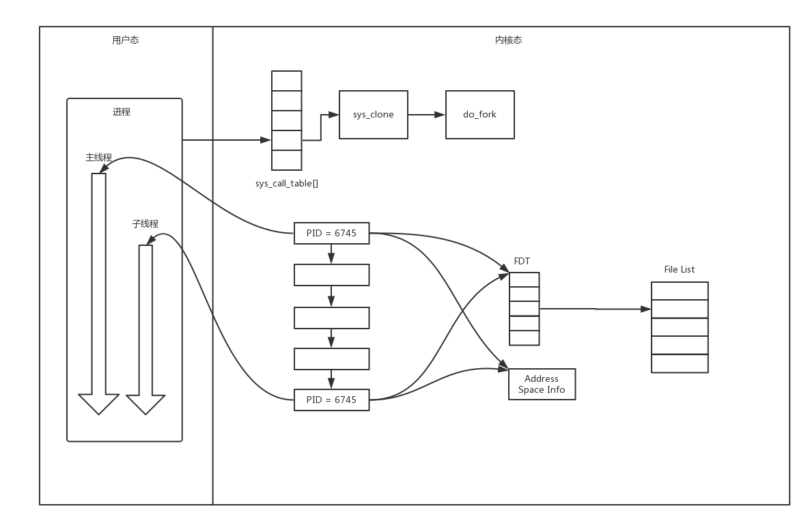

新的线程也可以通过已连接 Socket 处理请求，从而达到并发处理的目的。

上面基于进程或者线程模型的，其实还是有问题的。新到来一个 TCP 连接，就需要分配一个进程或者线程。一台机器无法创建很多进程或者线程。有个**C10K**，它的意思是一台机器要维护 1 万个连接，就要创建 1 万个进程或者线程，那么操作系统是无法承受的。如果维持 1 亿用户在线需要 10 万台服务器，成本也太高了。

其实 C10K 问题就是，你接项目接的太多了，如果每个项目都成立单独的项目组，就要招聘 10 万人，你肯定养不起，那怎么办呢？

## 方式三：一个项目组支撑多个项目（IO 多路复用，一个线程维护多个 Socket）

当然，一个项目组可以看多个项目了。这个时候，每个项目组都应该有个项目进度墙，将自己组看的项目列在那里，然后每天通过项目墙看每个项目的进度，一旦某个项目有了进展，就派人去盯一下。

由于 Socket 是文件描述符，因而某个线程盯的所有的 Socket，都放在一个文件描述符集合 fd_set 中，这就是**项目进度墙**，然后调用 select 函数来监听文件描述符集合是否有变化。一旦有变化，就会依次查看每个文件描述符。那些发生变化的文件描述符在 fd_set 对应的位都设为 1，表示 Socket 可读或者可写，从而可以进行读写操作，然后再调用 select，接着盯着下一轮的变化。。

## 方式四：一个项目组支撑多个项目（IO 多路复用，从“派人盯着”到“有事通知”）

上面 select 函数还是有问题的，因为每次 Socket 所在的文件描述符集合中有 Socket 发生变化的时候，都需要通过轮询的方式，也就是需要将全部项目都过一遍的方式来查看进度，这大大影响了一个项目组能够支撑的最大的项目数量。因而使用 select，能够同时盯的项目数量由 FD_SETSIZE 限制。

如果改成事件通知的方式，情况就会好很多，项目组不需要通过轮询挨个盯着这些项目，而是当项目进度发生变化的时候，主动通知项目组，然后项目组再根据项目进展情况做相应的操作。

能完成这件事情的函数叫 epoll，它在内核中的实现不是通过轮询的方式，而是通过注册 callback 函数的方式，当某个文件描述符发送变化的时候，就会主动通知。

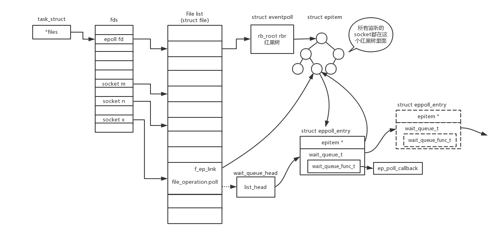

如图所示，假设进程打开了 Socket m, n, x 等多个文件描述符，现在需要通过 epoll 来监听是否这些 Socket 都有事件发生。其中 epoll_create 创建一个 epoll 对象，也是一个文件，也对应一个文件描述符，同样也对应着打开文件列表中的一项。在这项里面有一个红黑树，在红黑树里，要保存这个 epoll 要监听的所有 Socket。

当 epoll_ctl 添加一个 Socket 的时候，其实是加入这个红黑树，同时红黑树里面的节点指向一个结构，将这个结构挂在被监听的 Socket 的事件列表中。当一个 Socket 来了一个事件的时候，可以从这个列表中得到 epoll 对象，并调用 call  back 通知它。

这种通知方式使得监听的 Socket 数据增加的时候，效率不会大幅度降低，能够同时监听的 Socket 的数目也非常的多了。上限就为系统定义的、进程打开的最大文件描述符个数。因而，**epoll 被称为解决 C10K 问题的利器**。

## 总结

- 你需要记住 TCP 和 UDP 的 Socket 的编程中，客户端和服务端都需要调用哪些函数；
- 写一个能够支撑大量连接的高并发的服务端不容易，需要多进程、多线程，而 epoll 机制能解决 C10K 问题。

<h1 id="chapter14">HTTP协议：看个新闻原来这么麻烦</h1>

前面讲述完**传输层**，接下来开始讲**应用层**的协议。从哪里开始讲呢，就从咱们最常用的 HTTP 协议开始。

HTTP 协议，几乎是每个人上网用的第一个协议，同时也是很容易被人忽略的协议。

http://www.163.com 是个 URL，叫作**统一资源定位符**。之所以叫统一，是因为它是有格式的。HTTP 称为协议，www.163.com 是一个域名，表示互联网上的一个位置。有的 URL 会有更详细的位置标识，例如 http://www.163.com/index.html 。正是因为这个东西是统一的，所以当你把这样一个字符串输入到浏览器的框里的时候，浏览器才知道如何进行统一处理。

## HTTP 请求的准备

浏览器会将 www.163.com 这个域名发送给 DNS 服务器，让它解析为 IP 地址。有关 DNS 的过程，其实非常复杂，这个在后面专门介绍 DNS 的时候，我会详细描述，这里我们先不管，反正它会被解析成为 IP 地址。那接下来是发送 HTTP 请求吗？

不是的，HTTP 是基于 TCP 协议的，当然是要先建立 TCP 连接了，怎么建立呢？还记得第 11 节讲过的三次握手吗？

目前使用的 HTTP 协议大部分都是 1.1。在 1.1 的协议里面，默认是开启了 Keep-Alive 的，这样建立的 TCP 连接，就可以在多次请求中复用。

学习了 TCP 之后，你应该知道，TCP 的三次握手和四次挥手，还是挺费劲的。如果好不容易建立了连接，然后就做了一点儿事情就结束了，有点儿浪费人力和物力。

## HTTP 请求的构建

建立了连接以后，浏览器就要发送 HTTP 的请求。

请求的格式就像这样。

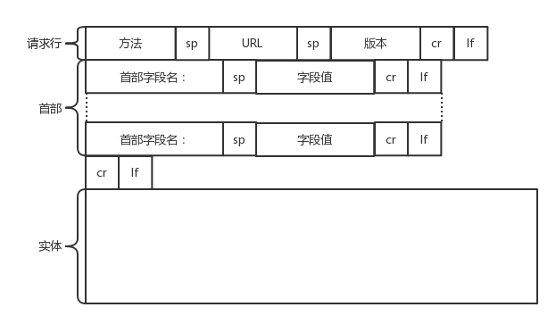

HTTP 的报文大概分为三大部分。第一部分是**请求行**，第二部分是请求的**首部**，第三部分才是请求的**正文实体**。

## 第一部分：请求行

在请求行中，URL 就是 <a href="http://www.163.com">http://www.163.com</a> ，版本为 HTTP 1.1。这里要说一下的，就是方法。方法有几种类型。

对于访问网页来讲，最常用的类型就是**GET**。顾名思义，GET 就是去服务器获取一些资源。对于访问网页来讲，要获取的资源往往是一个页面。其实也有很多其他的格式，比如说返回一个 JSON 字符串，到底要返回什么，是由服务器端的实现决定的。

另外一种类型叫做**POST**。它需要主动告诉服务端一些信息，而非获取。要告诉服务端什么呢？一般会放在正文里面。正文可以有各种各样的格式。常见的格式也是 JSON。

例如，我们下一节要讲的支付场景，客户端就需要把“我是谁？我要支付多少？我要买啥？”告诉服务器，这就需要通过 POST 方法。

再如，在云计算里，如果我们的服务器端，要提供一个基于 HTTP 协议的创建云主机的 API，也会用到 POST 方法。这个时候往往需要将“我要创建多大的云主机？多少 CPU 多少内存？多大硬盘？”这些信息放在 JSON 字符串里面，通过 POST 的方法告诉服务器端。

还有一种类型叫**PUT**，就是向指定资源位置上传最新内容。但是，HTTP 的服务器往往是不允许上传文件的，所以 PUT 和 POST 就都变成了要传给服务器东西的方法。

在实际使用过程中，这两者还会有稍许的区别。POST 往往是用来创建一个资源的，而 PUT 往往是用来修改一个资源的。

例如，云主机已经创建好了，我想对这个云主机打一个标签，说明这个云主机是生产环境的，另外一个云主机是测试环境的。那怎么修改这个标签呢？往往就是用 PUT 方法。

再有一种常见的就是**DELETE**。这个顾名思义就是用来删除资源的。例如，我们要删除一个云主机，就会调用 DELETE 方法。

## 第二部分：首部字段

请求行下面就是我们的首部字段。首部是 key value，通过冒号分隔。这里面，往往保存了一些非常重要的字段。

例如，**Accept-Charset**，表示**客户端可以接受的字符集**。防止传过来的是另外的字符集，从而导致出现乱码。

再如，**Content-Type**是指**正文的格式**。例如，我们进行 POST 的请求，如果正文是 JSON，那么我们就应该将这个值设置为 JSON。

这里需要重点说一下的就是**缓存**。为啥要使用缓存呢？那是因为一个非常大的页面有很多东西。

例如，我浏览一个商品的详情，里面有这个商品的价格、库存、展示图片、使用手册等等。商品的展示图片会保持较长时间不变，而库存会根据用户购买的情况经常改变。如果图片非常大，而库存数非常小，如果我们每次要更新数据的时候都要刷新整个页面，对于服务器的压力就会很大。

对于这种高并发场景下的系统，在真正的业务逻辑之前，都需要有个接入层，将这些静态资源的请求拦在最外面。

这个架构的图就像这样。

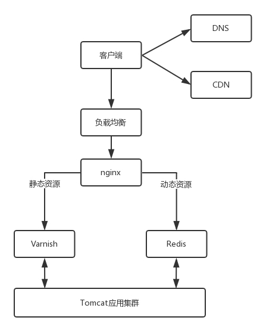

其中 DNS、CDN 我在后面的章节会讲。和这一节关系比较大的就是 Nginx 这一层，它如何处理 HTTP 协议呢？对于静态资源，有 Vanish 缓存层。当缓存过期的时候，才会访问真正的 Tomcat 应用集群。

在 HTTP 头里面，**Cache-control**是用来**控制缓存**的。当客户端发送的请求中包含 max-age 指令时，如果判定缓存层中，资源的缓存时间数值比指定时间的数值小，那么客户端可以接受缓存的资源；当指定 max-age 值为 0，那么缓存层通常需要将请求转发给应用集群。

另外，**If-Modified-Since**也是一个关于缓存的。也就是说，如果服务器的资源在某个时间之后更新了，那么客户端就应该下载最新的资源；如果没有更新，服务端会返回“304 Not Modified”的响应，那客户端就不用下载了，也会节省带宽。

到此为止，我们仅仅是拼凑起了 HTTP 请求的报文格式，接下来，浏览器会把它交给下一层传输层。怎么交给传输层呢？其实也无非是用 Socket 这些东西，只不过用的浏览器里，这些程序不需要你自己写，有人已经帮你写好了。

## HTTP 请求的发送

HTTP 协议是基于 TCP 协议的，所以它使用面向连接的方式发送请求，通过 stream 二进制流的方式传给对方。当然，到了 TCP 层，它会把二进制流变成一个的报文段发送给服务器。

在发送给每个报文段的时候，都需要对方有一个回应 ACK，来保证报文可靠地到达了对方。如果没有回应，那么 TCP 这一层会进行重新传输，直到可以到达。同一个包有可能被传了好多次，但是 HTTP 这一层不需要知道这一点，因为是 TCP 这一层在埋头苦干。

TCP 层发送每一个报文的时候，都需要加上自己的地址（即源地址）和它想要去的地方（即目标地址），将这两个信息放到 IP 头里面，交给 IP 层进行传输。

IP 层需要查看目标地址和自己是否是在同一个局域网。如果是，就发送 ARP 协议来请求这个目标地址对应的 MAC 地址，然后将源 MAC 和目标 MAC 放入 MAC 头，发送出去即可；如果不在同一个局域网，就需要发送到网关，还要需要发送 ARP 协议，来获取网关的 MAC 地址，然后将源 MAC 和网关 MAC 放入 MAC 头，发送出去。

网关收到包发现 MAC 符合，取出目标 IP 地址，根据路由协议找到下一跳的路由器，获取下一跳路由器的 MAC 地址，将包发给下一跳路由器。

这样路由器一跳一跳终于到达目标的局域网。这个时候，最后一跳的路由器能够发现，目标地址就在自己的某一个出口的局域网上。于是，在这个局域网上发送 ARP，获得这个目标地址的 MAC 地址，将包发出去。

目标的机器发现 MAC 地址符合，就将包收起来；发现 IP 地址符合，根据 IP 头中协议项，知道自己上一层是 TCP 协议，于是解析 TCP 的头，里面有序列号，需要看一看这个序列包是不是我要的，如果是就放入缓存中然后返回一个 ACK，如果不是就丢弃。

TCP 头里面还有端口号，HTTP 的服务器正在监听这个端口号。于是，目标机器自然知道是 HTTP 服务器这个进程想要这个包，于是将包发给 HTTP 服务器。HTTP 服务器的进程看到，原来这个请求是要访问一个网页，于是就把这个网页发给客户端。

## HTTP 返回的构建

HTTP 的返回报文也是有一定格式的。这也是基于 HTTP 1.1 的。


状态码会反应 HTTP 请求的结果。“200”意味着大吉大利；而我们最不想见的，就是“404”，也就是“服务端无法响应这个请求”。然后，短语会大概说一下原因。

接下来是返回首部的**key value**。

这里面，**Retry-After**表示，告诉客户端应该在多长时间以后再次尝试一下。“503 错误”是说“服务暂时不再和这个值配合使用”。

在返回的头部里面也会有**Content-Type**，表示返回的是 HTML，还是 JSON。

构造好了返回的 HTTP 报文，接下来就是把这个报文发送出去。还是交给 Socket 去发送，还是交给 TCP 层，让 TCP 层将返回的 HTML，也分成一个个小的段，并且保证每个段都可靠到达。

这些段加上 TCP 头后会交给 IP 层，然后把刚才的发送过程反向走一遍。虽然两次不一定走相同的路径，但是逻辑过程是一样的，一直到达客户端。

客户端发现 MAC 地址符合、IP 地址符合，于是就会交给 TCP 层。根据序列号看是不是自己要的报文段，如果是，则会根据 TCP 头中的端口号，发给相应的进程。这个进程就是浏览器，浏览器作为客户端也在监听某个端口。

当浏览器拿到了 HTTP 的报文。发现返回“200”，一切正常，于是就从正文中将 HTML 拿出来。HTML 是一个标准的网页格式。浏览器只要根据这个格式，展示出一个绚丽多彩的网页。

这就是一个正常的 HTTP 请求和返回的完整过程。

## HTTP 2.0

当然 HTTP 协议也在不断地进化过程中，在 HTTP1.1 基础上便有了 HTTP 2.0。

HTTP 1.1 在应用层以纯文本的形式进行通信。每次通信都要带完整的 HTTP 的头，而且不考虑 pipeline 模式的话，每次的过程总是像上面描述的那样一去一回。这样在实时性、并发性上都存在问题。

为了解决这些问题，HTTP 2.0 会对 HTTP 的头进行一定的压缩，将原来每次都要携带的大量 key  value 在两端建立一个索引表，对相同的头只发送索引表中的索引。

另外，HTTP 2.0 协议将一个 TCP 的连接中，切分成多个流，每个流都有自己的 ID，而且流可以是客户端发往服务端，也可以是服务端发往客户端。它其实只是一个虚拟的通道。流是有优先级的。

HTTP 2.0 还将所有的传输信息分割为更小的消息和帧，并对它们采用二进制格式编码。常见的帧有**Header 帧**，用于传输 Header 内容，并且会开启一个新的流。再就是**Data 帧**，用来传输正文实体。多个 Data 帧属于同一个流。

通过这两种机制，HTTP 2.0 的客户端可以将多个请求分到不同的流中，然后将请求内容拆成帧，进行二进制传输。这些帧可以打散乱序发送， 然后根据每个帧首部的流标识符重新组装，并且可以根据优先级，决定优先处理哪个流的数据。

我们来举一个例子。

假设我们的一个页面要发送三个独立的请求，一个获取 css，一个获取 js，一个获取图片 jpg。如果使用 HTTP 1.1 就是串行的，但是如果使用 HTTP 2.0，就可以在一个连接里，客户端和服务端都可以同时发送多个请求或回应，而且不用按照顺序一对一对应。

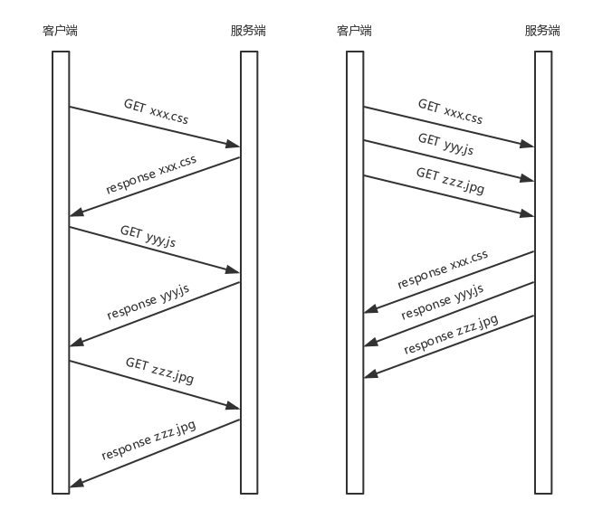

HTTP 2.0 其实是将三个请求变成三个流，将数据分成帧，乱序发送到一个 TCP 连接中。

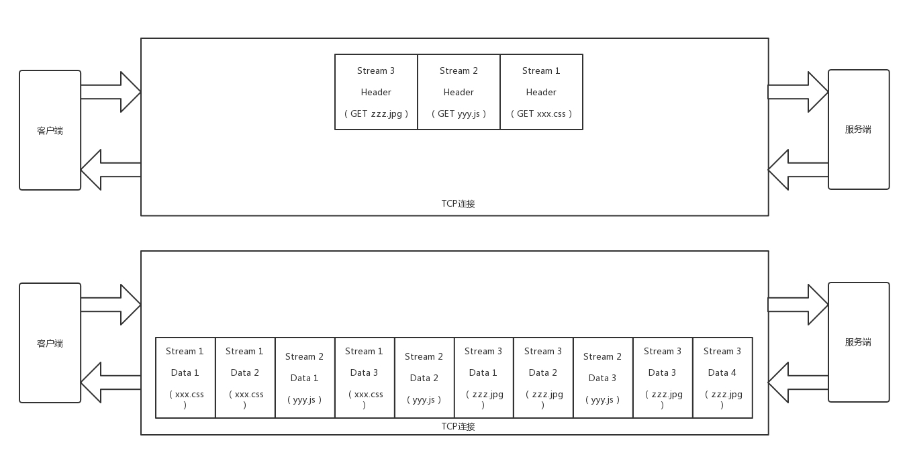

HTTP 2.0 成功解决了 HTTP 1.1 的队首阻塞问题，同时，也不需要通过 HTTP 1.x 的 pipeline 机制用多条 TCP 连接来实现并行请求与响应；减少了 TCP 连接数对服务器性能的影响，同时将页面的多个数据 css、js、 jpg 等通过一个数据链接进行传输，能够加快页面组件的传输速度。

## QUIC 协议的“城会玩”

HTTP 2.0 虽然大大增加了并发性，但还是有问题的。因为 HTTP 2.0 也是基于 TCP 协议的，TCP 协议在处理包时是有严格顺序的。

当其中一个数据包遇到问题，TCP 连接需要等待这个包完成重传之后才能继续进行。虽然 HTTP 2.0 通过多个 stream，使得逻辑上一个 TCP 连接上的并行内容，进行多路数据的传输，然而这中间并没有关联的数据。一前一后，前面 stream 2 的帧没有收到，后面 stream 1 的帧也会因此阻塞。

于是，就又到了从 TCP 切换到 UDP，进行“城会玩”的时候了。这就是 Google 的 QUIC 协议，接下来我们来看它是如何“城会玩”的。

## 机制一：自定义连接机制

我们都知道，一条 TCP 连接是由四元组标识的，分别是源 IP、源端口、目的 IP、目的端口。一旦一个元素发生变化时，就需要断开重连，重新连接。在移动互联情况下，当手机信号不稳定或者在 WIFI 和 移动网络切换时，都会导致重连，从而进行再次的三次握手，导致一定的时延。

这在 TCP 是没有办法的，但是基于 UDP，就可以在 QUIC 自己的逻辑里面维护连接的机制，不再以四元组标识，而是以一个 64 位的随机数作为 ID 来标识，而且 UDP 是无连接的，所以当 IP 或者端口变化的时候，只要 ID 不变，就不需要重新建立连接。

## 机制二：自定义重传机制

前面我们讲过，TCP 为了保证可靠性，通过使用**序号**和**应答**机制，来解决顺序问题和丢包问题。

任何一个序号的包发过去，都要在一定的时间内得到应答，否则一旦超时，就会重发这个序号的包。那怎么样才算超时呢？还记得我们提过的**自适应重传算法**吗？这个超时是通过**采样往返时间 RTT**不断调整的。

其实，在 TCP 里面超时的采样存在不准确的问题。例如，发送一个包，序号为 100，发现没有返回，于是再发送一个 100，过一阵返回一个 ACK101。这个时候客户端知道这个包肯定收到了，但是往返时间是多少呢？是 ACK 到达的时间减去后一个 100 发送的时间，还是减去前一个 100 发送的时间呢？事实是，第一种算法把时间算短了，第二种算法把时间算长了。

QUIC 也有个序列号，是递增的。任何一个序列号的包只发送一次，下次就要加一了。例如，发送一个包，序号是 100，发现没有返回；再次发送的时候，序号就是 101 了；如果返回的 ACK  100，就是对第一个包的响应。如果返回 ACK  101 就是对第二个包的响应，RTT 计算相对准确。

但是这里有一个问题，就是怎么知道包 100 和包 101 发送的是同样的内容呢？QUIC 定义了一个 offset 概念。QUIC 既然是面向连接的，也就像 TCP 一样，是一个数据流，发送的数据在这个数据流里面有个偏移量 offset，可以通过 offset 查看数据发送到了哪里，这样只要这个 offset 的包没有来，就要重发；如果来了，按照 offset 拼接，还是能够拼成一个流。

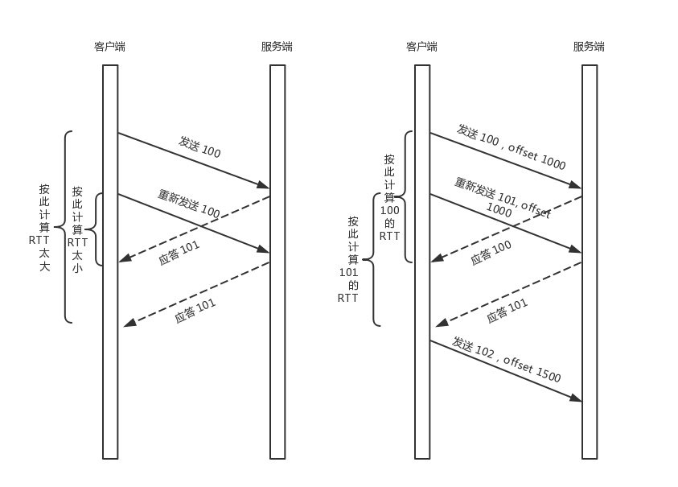

## 机制三：无阻塞的多路复用

有了自定义的连接和重传机制，我们就可以解决上面 HTTP  2.0 的多路复用问题。

同 HTTP 2.0 一样，同一条 QUIC 连接上可以创建多个 stream，来发送多个 HTTP 请求。但是，QUIC 是基于 UDP 的，一个连接上的多个 stream 之间没有依赖。这样，假如 stream2 丢了一个 UDP 包，后面跟着 stream3 的一个 UDP 包，虽然 stream2 的那个包需要重传，但是 stream3 的包无需等待，就可以发给用户。

## 机制四：自定义流量控制

TCP 的流量控制是通过**滑动窗口协议**。QUIC 的流量控制也是通过 window_update，来告诉对端它可以接受的字节数。但是 QUIC 的窗口是适应自己的多路复用机制的，不但在一个连接上控制窗口，还在一个连接中的每个 stream 控制窗口。

还记得吗？在 TCP 协议中，接收端的窗口的起始点是下一个要接收并且 ACK 的包，即便后来的包都到了，放在缓存里面，窗口也不能右移，因为 TCP 的 ACK 机制是基于序列号的累计应答，一旦 ACK 了一个系列号，就说明前面的都到了，所以只要前面的没到，后面的到了也不能 ACK，就会导致后面的到了，也有可能超时重传，浪费带宽。

QUIC 的 ACK 是基于 offset 的，每个 offset 的包来了，进了缓存，就可以应答，应答后就不会重发，中间的空挡会等待到来或者重发即可，而窗口的起始位置为当前收到的最大 offset，从这个 offset 到当前的 stream 所能容纳的最大缓存，是真正的窗口大小。显然，这样更加准确。

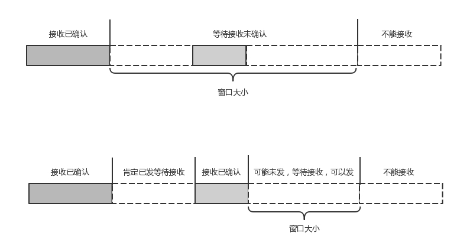

另外，还有整个连接的窗口，需要对于所有的 stream 的窗口做一个统计。

## 总结

- HTTP 协议虽然很常用，也很复杂，重点记住 GET、POST、 PUT、DELETE 这几个方法，以及重要的首部字段；
- HTTP 2.0 通过头压缩、分帧、二进制编码、多路复用等技术提升性能；
- QUIC 协议通过基于 UDP 自定义的类似 TCP 的连接、重试、多路复用、流量控制技术，进一步提升性能。

<h1 id="chapter15">HTTPS协议：点外卖的过程原来这么复杂</h1>

你发送一个请求，说我要点个外卖，但是这个网络包被截获了，于是在服务器回复你之前，黑客先假装自己就是外卖网站，然后给你回复一个假的消息说：“好啊好啊，来来来，银行卡号、密码拿来。”如果这时候你真把银行卡密码发给它，那你就真的上套了。

那怎么解决这个问题呢？当然一般的思路就是**加密**。加密分为两种方式一种是**对称加密**，一种是**非对称加密**。

在对称加密算法中，加密和解密使用的密钥是相同的。也就是说，加密和解密使用的是同一个密钥。因此，对称加密算法要保证安全性的话，密钥要做好保密。只能让使用的人知道，不能对外公开。

在非对称加密算法中，加密使用的密钥和解密使用的密钥是不相同的。一把是作为公开的公钥，另一把是作为谁都不能给的私钥。公钥加密的信息，只有私钥才能解密。私钥加密的信息，只有公钥才能解密。

因为对称加密算法相比非对称加密算法来说，效率要高得多，性能也好，所以交互的场景下多用对称加密。

## 对称加密

假设你和外卖网站约定了一个密钥，你发送请求的时候用这个密钥进行加密，外卖网站用同样的密钥进行解密。这样就算中间的黑客截获了你的请求，但是它没有密钥，还是破解不了。

这看起来很完美，但是中间有个问题，你们两个怎么来约定这个密钥呢？如果这个密钥在互联网上传输，也是很有可能让黑客截获的。黑客一旦截获这个秘钥，它可以佯作不知，静静地等着你们两个交互。这时候你们之间互通的任何消息，它都能截获并且查看，就等你把银行卡账号和密码发出来。

我们在谍战剧里面经常看到这样的场景，就是特工破译的密码会有个密码本，截获无线电台，通过密码本就能将原文破解出来。怎么把密码本给对方呢？只能通过**线下传输**。

比如，你和外卖网站偷偷约定时间地点，它给你一个纸条，上面写着你们两个的密钥，然后说以后就用这个密钥在互联网上定外卖了。当然你们接头的时候，也会先约定一个口号，什么“天王盖地虎”之类的，口号对上了，才能把纸条给它。但是，“天王盖地虎”同样也是对称加密密钥，同样存在如何把“天王盖地虎”约定成口号的问题。而且在谍战剧中一对一接头可能还可以，在互联网应用中，客户太多，这样是不行的。

## 非对称加密

所以，只要是对称加密，就会永远在这个死循环里出不来，这个时候，就需要非对称加密介入进来。

非对称加密的私钥放在外卖网站这里，不会在互联网上传输，这样就能保证这个秘钥的私密性。但是，对应私钥的公钥，是可以在互联网上随意传播的，只要外卖网站把这个公钥给你，你们就可以愉快地互通了。

比如说你用公钥加密，说“我要定外卖”，黑客在中间就算截获了这个报文，因为它没有私钥也是解不开的，所以这个报文可以顺利到达外卖网站，外卖网站用私钥把这个报文解出来，然后回复，“那给我银行卡和支付密码吧”。

先别太乐观，这里还是有问题的。回复的这句话，是外卖网站拿私钥加密的，互联网上人人都可以把它打开，当然包括黑客。那外卖网站可以拿公钥加密吗？当然不能，因为它自己的私钥只有它自己知道，谁也解不开。

另外，这个过程还有一个问题，黑客也可以模拟发送“我要定外卖”这个过程的，因为它也有外卖网站的公钥。

为了解决这个问题，看来一对公钥私钥是不够的，客户端也需要有自己的公钥和私钥，并且客户端要把自己的公钥，给外卖网站。

这样，客户端给外卖网站发送的时候，用外卖网站的公钥加密。而外卖网站给客户端发送消息的时候，使用客户端的公钥。这样就算有黑客企图模拟客户端获取一些信息，或者半路截获回复信息，但是由于它没有私钥，这些信息它还是打不开。

## 数字证书

不对称加密也会有同样的问题，如何将不对称加密的公钥给对方呢？一种是放在一个公网的地址上，让对方下载；另一种就是在建立连接的时候，传给对方。

这两种方法有相同的问题，那就是，作为一个普通网民，你怎么鉴别别人给你的公钥是对的。会不会有人冒充外卖网站，发给你一个它的公钥。接下来，你和它所有的互通，看起来都是没有任何问题的。毕竟每个人都可以创建自己的公钥和私钥。

例如，我自己搭建了一个网站 cliu8site，可以通过这个命令先创建私钥。

```s
openssl genrsa -out cliu8siteprivate.key 1024
```

然后，再根据这个私钥，创建对应的公钥。

```s
openssl rsa -in cliu8siteprivate.key -pubout -outcliu8sitepublic.pem
```

这个时候就需要权威部门的介入了，就像每个人都可以打印自己的简历，说自己是谁，但是有公安局盖章的，就只有户口本，这个才能证明你是你。这个由权威部门颁发的称为**证书（Certificate）。**

证书里面有什么呢？当然应该有**公钥**，这是最重要的；还有证书的**所有者**，就像户口本上有你的姓名和身份证号，说明这个户口本是你的；另外还有证书的**发布机构**和证书的**有效期**，这个有点像身份证上的机构是哪个区公安局，有效期到多少年。

这个证书是怎么生成的呢？会不会有人假冒权威机构颁发证书呢？就像有假身份证、假户口本一样。生成证书需要发起一个证书请求，然后将这个请求发给一个权威机构去认证，这个权威机构我们称为**CA（Certificate Authority）。**

```s
openssl req -key cliu8siteprivate.key -new -out cliu8sitecertificate.req
```

将这个请求发给权威机构，权威机构会给这个证书卡一个章，我们称为**签名算法。**问题又来了，那怎么签名才能保证是真的权威机构签名的呢？当然只有用只掌握在权威机构手里的东西签名了才行，这就是 CA 的私钥。

签名算法大概是这样工作的：一般是对信息做一个 Hash 计算，得到一个 Hash 值，这个过程是不可逆的，也就是说无法通过 Hash 值得出原来的信息内容。在把信息发送出去时，把这个 Hash 值加密后，作为一个签名和信息一起发出去。

权威机构给证书签名的命令是这样的。

```s
openssl x509 -req -in cliu8sitecertificate.req -CA cacertificate.pem -CAkey caprivate.key -out cliu8sitecertificate.pem
```

这个命令会返回 Signature ok，而 cliu8sitecertificate.pem 就是签过名的证书。CA 用自己的私钥给外卖网站的公钥签名，就相当于给外卖网站背书，形成了外卖网站的证书。

我们来查看这个证书的内容。

```
openssl x509 -in cliu8sitecertificate.pem -noout -text 
```

这里面有个 Issuer，也即证书是谁颁发的；Subject，就是证书颁发给谁；Validity 是证书期限；Public-key 是公钥内容；Signature Algorithm 是签名算法。

这下好了，你不会从外卖网站上得到一个公钥，而是会得到一个证书，这个证书有个发布机构 CA，你只要得到这个发布机构 CA 的公钥，去解密外卖网站证书的签名，如果解密成功了，Hash 也对的上，就说明这个外卖网站的公钥没有啥问题。

你有没有发现，又有新问题了。要想验证证书，需要 CA 的公钥，问题是，你怎么确定 CA 的公钥就是对的呢？

所以，CA 的公钥也需要更牛的 CA 给它签名，然后形成 CA 的证书。要想知道某个 CA 的证书是否可靠，要看 CA 的上级证书的公钥，能不能解开这个 CA 的签名。就像你不相信区公安局，可以打电话问市公安局，让市公安局确认区公安局的合法性。这样层层上去，直到全球皆知的几个著名大 CA，称为**root CA**，做最后的背书。通过这种**层层授信背书**的方式，从而保证了非对称加密模式的正常运转。

除此之外，还有一种证书，称为**Self-Signed Certificate**，就是自己给自己签名。这个给人一种“我就是我，你爱信不信”的感觉。这里我就不多说了。

## HTTPS 的工作模式

我们可以知道，非对称加密在性能上不如对称加密，那是否能将两者结合起来呢？例如，公钥私钥主要用于传输非对称加密的秘钥，而真正的双方大数据量的通信都是通过对称加密进行的。

当然是可以的。这就是 HTTPS 协议的总体思路。

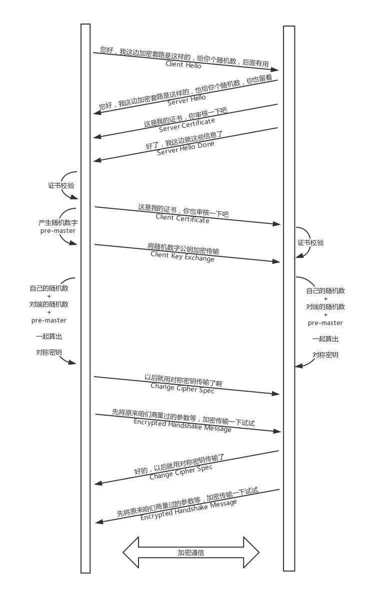

当你登录一个外卖网站的时候，由于是 HTTPS，客户端会发送 Client Hello 消息到服务器，以明文传输 TLS 版本信息、加密套件候选列表、压缩算法候选列表等信息。另外，还会有一个随机数，在协商对称密钥的时候使用。

这就类似在说：“您好，我想定外卖，但你要保密我吃的是什么。这是我的加密套路，再给你个随机数，你留着。”

然后，外卖网站返回 Server Hello 消息, 告诉客户端，服务器选择使用的协议版本、加密套件、压缩算法等，还有一个随机数，用于后续的密钥协商。

这就类似在说：“您好，保密没问题，你的加密套路还挺多，咱们就按套路 2 来吧，我这里也有个随机数，你也留着。”

然后，外卖网站会给你一个服务器端的证书，然后说：“Server Hello Done，我这里就这些信息了。”

你当然不相信这个证书，于是你从自己信任的 CA 仓库中，拿 CA 的证书里面的公钥去解密外卖网站的证书。如果能够成功，则说明外卖网站是可信的。这个过程中，你可能会不断往上追溯 CA、CA 的 CA、CA 的 CA 的 CA，反正直到一个授信的 CA，就可以了。

证书验证完毕之后，觉得这个外卖网站可信，于是客户端计算产生随机数字 Pre-master，发送 Client Key Exchange，用证书中的公钥加密，再发送给服务器，服务器可以通过私钥解密出来。

到目前为止，无论是客户端还是服务器，都有了三个随机数，分别是：自己的、对端的，以及刚生成的 Pre-Master 随机数。通过这三个随机数，可以在客户端和服务器产生相同的对称密钥。

有了对称密钥，客户端就可以说：“Change Cipher Spec，咱们以后都采用协商的通信密钥和加密算法进行加密通信了。”

然后发送一个 Encrypted Handshake Message，将已经商定好的参数等，采用协商密钥进行加密，发送给服务器用于数据与握手验证。

同样，服务器也可以发送 Change Cipher Spec，说：“没问题，咱们以后都采用协商的通信密钥和加密算法进行加密通信了”，并且也发送 Encrypted Handshake Message 的消息试试。当双方握手结束之后，就可以通过对称密钥进行加密传输了。

这个过程除了加密解密之外，其他的过程和 HTTP 是一样的，过程也非常复杂。

上面的过程只包含了 HTTPS 的单向认证，也即客户端验证服务端的证书，是大部分的场景，也可以在更加严格安全要求的情况下，启用双向认证，双方互相验证证书。

## 重放与篡改

其实，这里还有一些没有解决的问题，例如重放和篡改的问题。

没错，有了加密和解密，黑客截获了包也打不开了，但是它可以发送 N 次。这个往往通过 Timestamp 和 Nonce 随机数联合起来，然后做一个不可逆的签名来保证。

Nonce 随机数保证唯一，或者 Timestamp 和 Nonce 合起来保证唯一，同样的，请求只接受一次，于是服务器多次受到相同的 Timestamp 和 Nonce，则视为无效即可。

如果有人想篡改 Timestamp 和 Nonce，还有签名保证不可篡改性，如果改了用签名算法解出来，就对不上了，可以丢弃了。

## 总结

- 加密分对称加密和非对称加密。对称加密效率高，但是解决不了密钥传输问题；非对称加密可以解决这个问题，但是效率不高。
-  非对称加密需要通过证书和权威机构来验证公钥的合法性。
-  HTTPS 是综合了对称加密和非对称加密算法的 HTTP 协议。既保证传输安全，也保证传输效率。

<h1 id="chapter16">流媒体协议：如何在直播里看到美女帅哥？</h1>

最近直播比较火，很多人都喜欢看直播，那一个直播系统里面都有哪些组成部分，都使用了什么协议呢？

## 三个名词系列

我这里列三个名词系列，你先大致有个印象。

- **名词系列一**：AVI、MPEG、RMVB、MP4、MOV、FLV、WebM、WMV、ASF、MKV。例如 RMVB 和 MP4，看着是不是很熟悉？
- **名词系列二**：H.261、 H.262、H.263、H.264、H.265。这个是不是就没怎么听过了？别着急，你先记住，要重点关注 H.264。
- **名词系列三**：MPEG-1、MPEG-2、MPEG-4、MPEG-7。MPEG 好像听说过，但是后面的数字是怎么回事？是不是又熟悉又陌生？

这里，我想问你个问题，视频是什么？我说，其实就是快速播放一连串连续的图片。

每一张图片，我们称为一**帧**。只要每秒钟帧的数据足够多，也即播放得足够快。比如每秒 30 帧，以人的眼睛的敏感程度，是看不出这是一张张独立的图片的，这就是我们常说的**帧率（FPS）。**

每一张图片，都是由**像素**组成的，假设为 1024*768（这个像素数不算多）。每个像素由 RGB 组成，每个 8 位，共 24 位。

我们来算一下，每秒钟的视频有多大？

30 帧 × 1024 × 768 × 24 = 566,231,040Bits = 70,778,880Bytes

如果一分钟呢？4,246,732,800Bytes，已经是 4 个 G 了。

是不是不算不知道，一算吓一跳？这个数据量实在是太大，根本没办法存储和传输。如果这样存储，你的硬盘很快就满了；如果这样传输，那多少带宽也不够用啊！

怎么办呢？人们想到了**编码**，就是看如何用尽量少的 Bit 数保存视频，使播放的时候画面看起来仍然很精美。**编码是一个压缩的过程。**

## 视频和图片的压缩过程有什么特点？

之所以能够对视频流中的图片进行压缩，因为视频和图片有这样一些特点。

1. **空间冗余**：图像的相邻像素之间有较强的相关性，一张图片相邻像素往往是渐变的，不是突变的，没必要每个像素都完整地保存，可以隔几个保存一个，中间的用算法计算出来。
2. **时间冗余**：视频序列的相邻图像之间内容相似。一个视频中连续出现的图片也不是突变的，可以根据已有的图片进行预测和推断。
3. **视觉冗余**：人的视觉系统对某些细节不敏感，因此不会每一个细节都注意到，可以允许丢失一些数据。
4. **编码冗余**：不同像素值出现的概率不同，概率高的用的字节少，概率低的用的字节多，类似**霍夫曼编码（Huffman Coding）**的思路。

总之，用于编码的算法非常复杂，而且多种多样，但是编码过程其实都是类似的。

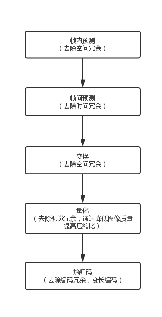

## 视频编码的两大流派

能不能形成一定的标准呢？要不然开发视频播放的人得累死了。当然能，我这里就给你介绍，视频编码的两大流派。

- 流派一：ITU（International Telecommunications Union）的 VCEG（Video Coding Experts Group），这个称为**国际电联下的 VCEG**。既然是电信，可想而知，他们最初做视频编码，主要侧重传输。名词系列二，就是这个组织制定的标准。
- 流派二：ISO（International Standards Organization）的 MPEG（Moving Picture Experts Group），这个是**ISO 旗下的 MPEG**，本来是做视频存储的。例如，编码后保存在 VCD 和 DVD 中。当然后来也慢慢侧重视频传输了。名词系列三，就是这个组织制定的标准。

后来，ITU-T（国际电信联盟电信标准化部门，ITU Telecommunication Standardization Sector）与 MPEG 联合制定了 H.264/MPEG-4 AVC，这才是我们这一节要重点关注的。

经过编码之后，生动活泼的一帧一帧的图像，就变成了一串串让人看不懂的二进制，这个二进制可以放在一个文件里面，按照一定的格式保存起来，这就是名词系列一。

其实这些就是视频保存成文件的格式。例如，前几个字节是什么意义，后几个字节是什么意义，然后是数据，数据中保存的就是编码好的结果。

## 如何在直播里看到帅哥美女？

当然，这个二进制也可以通过某种网络协议进行封装，放在互联网上传输，这个时候就可以进行网络直播了。

网络协议将**编码**好的视频流，从主播端推送到服务器，在服务器上有个运行了同样协议的服务端来接收这些网络包，从而得到里面的视频流，这个过程称为**接流**。

服务端接到视频流之后，可以对视频流进行一定的处理，例如**转码**，也即从一个编码格式，转成另一种格式。因为观众使用的客户端千差万别，要保证他们都能看到直播。

**流处理**完毕之后，就可以等待观众的客户端来请求这些视频流。观众的客户端请求的过程称为**拉流**。

如果有非常多的观众，同时看一个视频直播，那都从一个服务器上**拉流**，压力太大了，因而需要一个视频的**分发**网络，将视频预先加载到就近的边缘节点，这样大部分观众看的视频，是从边缘节点拉取的，就能降低服务器的压力。

当观众的客户端将视频流拉下来之后，就需要进行**解码**，也即通过上述过程的逆过程，将一串串看不懂的二进制，再转变成一帧帧生动的图片，在客户端**播放**出来，这样你就能看到美女帅哥啦。

整个直播过程，可以用这个的图来描述。

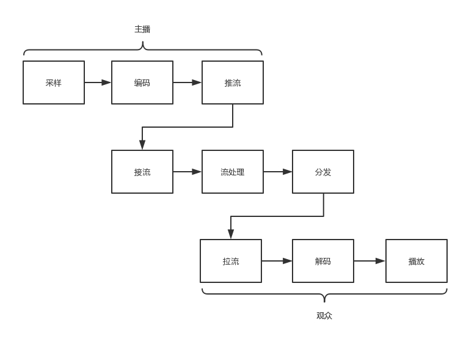

接下来，我们依次来看一下每个过程。

## 编码：如何将丰富多彩的图片变成二进制流？

虽然我们说视频是一张张图片的序列，但是如果每张图片都完整，就太大了，因而会将视频序列分成三种帧。

- **I 帧**，也称关键帧。里面是完整的图片，只需要本帧数据，就可以完成解码。
- **P 帧**，前向预测编码帧。P 帧表示的是这一帧跟之前的一个关键帧（或 P 帧）的差别，解码时需要用之前缓存的画面，叠加上和本帧定义的差别，生成最终画面。
- **B 帧**，双向预测内插编码帧。B 帧记录的是本帧与前后帧的差别。要解码 B 帧，不仅要取得之前的缓存画面，还要解码之后的画面，通过前后画面的数据与本帧数据的叠加，取得最终的画面。

可以看出，I 帧最完整，B 帧压缩率最高，而压缩后帧的序列，应该是在 IBBP 的间隔出现的。这就是**通过时序进行编码**。

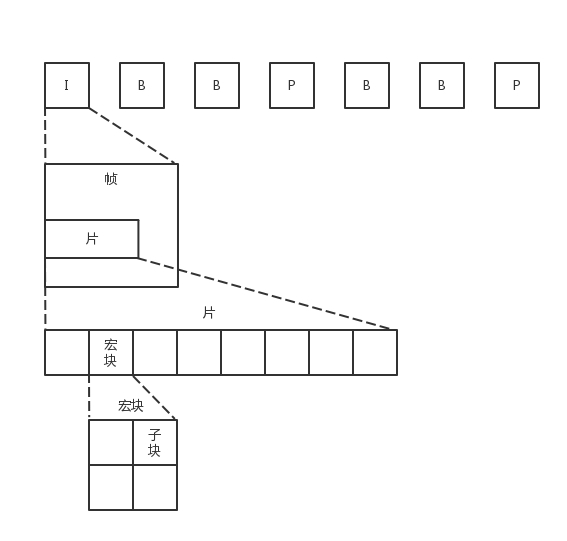

在一帧中，分成多个片，每个片中分成多个宏块，每个宏块分成多个子块，这样将一张大的图分解成一个个小块，可以方便进行**空间上的编码**。

尽管时空非常立体的组成了一个序列，但是总归还是要压缩成一个二进制流。这个流是有结构的，是一个个的**网络提取层单元（NALU，Network Abstraction Layer Unit）**。变成这种格式就是为了传输，因为网络上的传输，默认的是一个个的包，因而这里也就分成了一个个的单元。

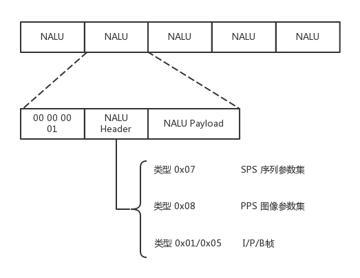

每一个 NALU 首先是一个起始标识符，用于标识 NALU 之间的间隔；然后是 NALU 的头，里面主要配置了 NALU 的类型；最终 Payload 里面是 NALU 承载的数据。

在 NALU 头里面，主要的内容是类型**NAL Type**。

- 0x07 表示 SPS，是序列参数集， 包括一个图像序列的所有信息，如图像尺寸、视频格式等。
- 0x08 表示 PPS，是图像参数集，包括一个图像的所有分片的所有相关信息，包括图像类型、序列号等。

在传输视频流之前，必须要传输这两类参数，不然无法解码。为了保证容错性，每一个 I 帧前面，都会传一遍这两个参数集合。

如果 NALU Header 里面的表示类型是 SPS 或者 PPS，则 Payload 中就是真正的参数集的内容。

如果类型是帧，则 Payload 中才是正的视频数据，当然也是一帧一帧存放的，前面说了，一帧的内容还是挺多的，因而每一个 NALU 里面保存的是一片。对于每一片，到底是 I 帧，还是 P 帧，还是 B 帧，在片结构里面也有个 Header，这里面有个类型，然后是片的内容。

这样，整个格式就出来了，<span class="orange">一个视频，可以拆分成一系列的帧，每一帧拆分成一系列的片，每一片都放在一个 NALU 里面，NALU 之间都是通过特殊的起始标识符分隔，在每一个 I 帧的第一片前面，要插入单独保存 SPS 和 PPS 的 NALU，最终形成一个长长的 NALU 序列</span>

## 推流：如何把数据流打包传输到对端？

那这个格式是不是就能够直接在网上传输到对端，开始直播了呢？其实还不是，还需要将这个二进制的流打包成网络包进行发送，这里我们使用**RTMP 协议**。这就进入了第二个过程，**推流**。

RTMP 是基于 TCP 的，因而肯定需要双方建立一个 TCP 的连接。在有 TCP 的连接的基础上，还需要建立一个 RTMP 的连接，也即在程序里面，你需要调用 RTMP 类库的 Connect 函数，显示创建一个连接。

RTMP 为什么需要建立一个单独的连接呢？

因为它们需要商量一些事情，保证以后的传输能正常进行。主要就是两个事情，一个是**版本号**，如果客户端、服务器的版本号不一致，则不能工作。另一个就是**时间戳**，视频播放中，时间是很重要的，后面的数据流互通的时候，经常要带上时间戳的差值，因而一开始双方就要知道对方的时间戳。

未来沟通这些事情，需要发送六条消息：客户端发送 C0、C1、  C2，服务器发送 S0、  S1、  S2。

首先，客户端发送 C0 表示自己的版本号，不必等对方的回复，然后发送 C1 表示自己的时间戳。

服务器只有在收到 C0 的时候，才能返回 S0，表明自己的版本号，如果版本不匹配，可以断开连接。

服务器发送完 S0 后，也不用等什么，就直接发送自己的时间戳 S1。客户端收到 S1 的时候，发一个知道了对方时间戳的 ACK  C2。同理服务器收到 C1 的时候，发一个知道了对方时间戳的 ACK  S2。

于是，握手完成。

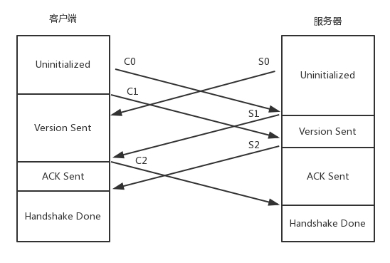

握手之后，双方需要互相传递一些控制信息，例如 Chunk 块的大小、窗口大小等。

真正传输数据的时候，还是需要创建一个流 Stream，然后通过这个 Stream 来推流 publish。

推流的过程，就是将 NALU 放在 Message 里面发送，这个也称为**RTMP Packet 包**。Message 的格式就像这样。

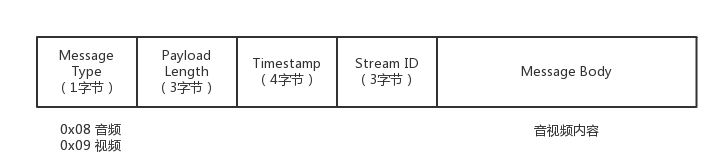

发送的时候，去掉 NALU 的起始标识符。因为这部分对于 RTMP 协议来讲没有用。接下来，将 SPS 和 PPS 参数集封装成一个 RTMP 包发送，然后发送一个个片的 NALU。

RTMP 在收发数据的时候并不是以 Message 为单位的，而是把 Message 拆分成 Chunk 发送，而且必须在一个 Chunk 发送完成之后，才能开始发送下一个 Chunk。每个 Chunk 中都带有 Message  ID，表示属于哪个 Message，接收端也会按照这个 ID 将 Chunk 组装成 Message。

前面连接的时候，设置的 Chunk 块大小就是指这个 Chunk。将大的消息变为小的块再发送，可以在低带宽的情况下，减少网络拥塞。

这有一个分块的例子，你可以看一下。

假设一个视频的消息长度为 307，但是 Chunk 大小约定为 128，于是会拆分为三个 Chunk。

第一个 Chunk 的 Type＝0，表示 Chunk 头是完整的；头里面 Timestamp 为 1000，总长度 Length 为 307，类型为 9，是个视频，Stream  ID 为 12346，正文部分承担 128 个字节的 Data。

第二个 Chunk 也要发送 128 个字节，Chunk 头由于和第一个 Chunk 一样，因此采用 Chunk Type＝3，表示头一样就不再发送了。

第三个 Chunk 要发送的 Data 的长度为 307-128-128=51 个字节，还是采用 Type＝3。

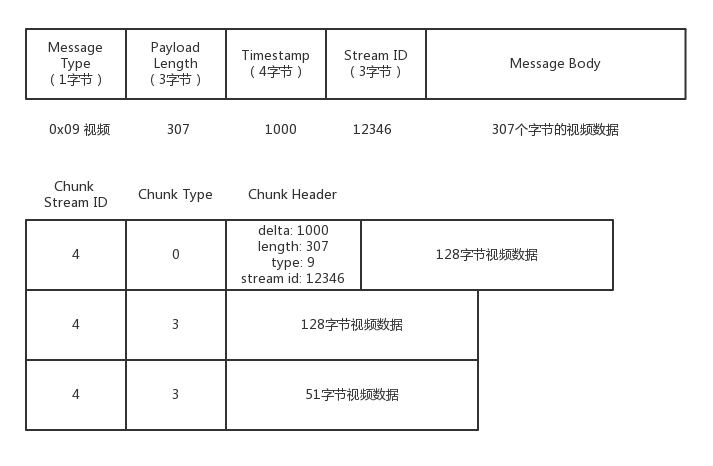

就这样数据就源源不断到达流媒体服务器，整个过程就像这样。

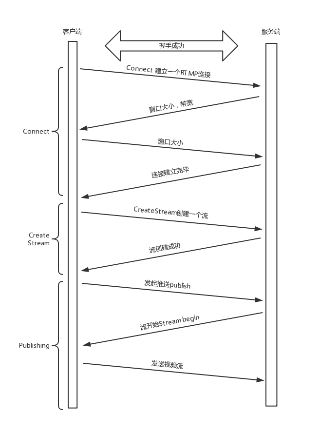

这个时候，大量观看直播的观众就可以通过 RTMP 协议从流媒体服务器上拉取，但是这么多的用户量，都去同一个地方拉取，服务器压力会很大，而且用户分布在全国甚至全球，如果都去统一的一个地方下载，也会时延比较长，需要有分发网络。

分发网络分为**中心**和**边缘**两层。边缘层服务器部署在全国各地及横跨各大运营商里，和用户距离很近。中心层是流媒体服务集群，负责内容的转发。智能负载均衡系统，根据用户的地理位置信息，就近选择边缘服务器，为用户提供推 / 拉流服务。中心层也负责转码服务，例如，把 RTMP 协议的码流转换为 HLS 码流。

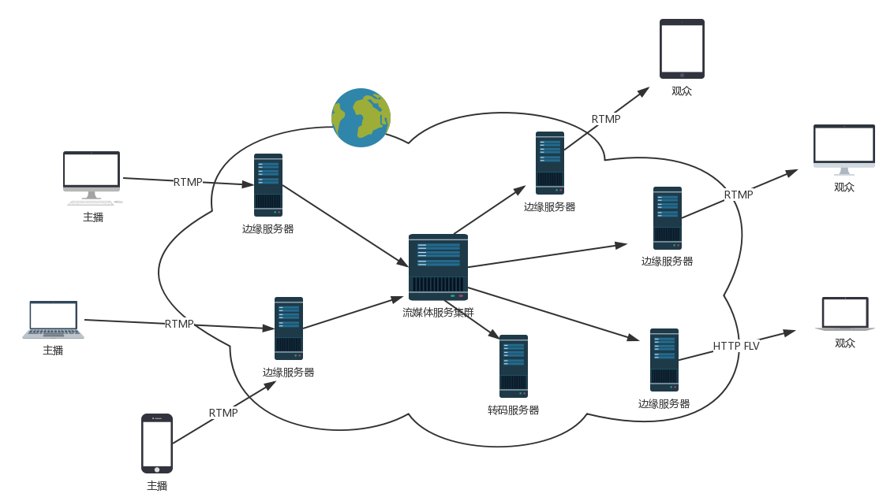

这套机制在后面的 DNS、HTTPDNS、CDN 的章节会更有详细的描述。

## 拉流：观众的客户端如何看到视频？

接下来，我们再来看观众的客户端通过 RTMP 拉流的过程。

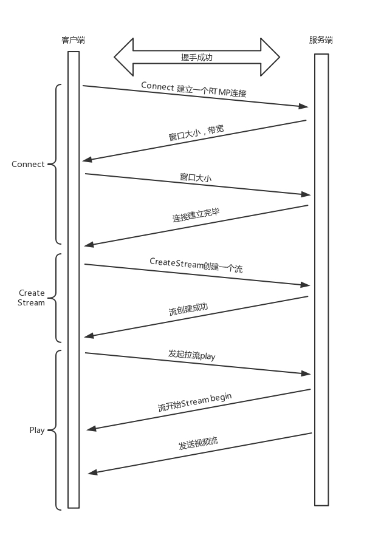

先读到的是 H.264 的解码参数，例如 SPS 和 PPS，然后对收到的 NALU 组成的一个个帧，进行解码，交给播发器播放，一个绚丽多彩的视频画面就出来了。

## 总结

-  视频名词比较多，编码两大流派达成了一致，都是通过时间、空间的各种算法来压缩数据；
-  压缩好的数据，为了传输组成一系列 NALU，按照帧和片依次排列；
-  排列好的 NALU，在网络传输的时候，要按照 RTMP 包的格式进行包装，RTMP 的包会拆分成 Chunk 进行传输；
-  推送到流媒体集群的视频流经过转码和分发，可以被客户端通过 RTMP 协议拉取，然后组合为 NALU，解码成视频格式进行播放。

<h1 id="chapter17">P2P协议：我下小电影，99%急死你</h1>

当然，最简单的方式就是通过**HTTP**进行下载。但是相信你有过这样的体验，通过浏览器下载的时候，只要文件稍微大点，下载的速度就奇慢无比。

还有种下载文件的方式，就是通过**FTP**，也即**文件传输协议**。FTP 采用两个 TCP 连接来传输一个文件。

- **控制连接**：服务器以被动的方式，打开众所周知用于 FTP 的端口 21，客户端则主动发起连接。该连接将命令从客户端传给服务器，并传回服务器的应答。常用的命令有：list——获取文件目录；reter——取一个文件；store——存一个文件。
- **数据连接**：每当一个文件在客户端与服务器之间传输时，就创建一个数据连接。

## FTP 的两种工作模式

每传输一个文件，都要建立一个全新的数据连接。FTP 有两种工作模式，分别是**主动模式（PORT）**和**被动模式（PASV）**，这些都是站在 FTP 服务器的角度来说的。

主动模式下，客户端随机打开一个大于 1024 的端口 N，向服务器的命令端口 21 发起连接，同时开放 N+1 端口监听，并向服务器发出 “port N+1” 命令，由服务器从自己的数据端口 20，主动连接到客户端指定的数据端口 N+1。

被动模式下，当开启一个 FTP 连接时，客户端打开两个任意的本地端口 N（大于 1024）和 N+1。第一个端口连接服务器的 21 端口，提交 PASV 命令。然后，服务器会开启一个任意的端口 P（大于 1024），返回“227 entering passive mode”消息，里面有 FTP 服务器开放的用来进行数据传输的端口。客户端收到消息取得端口号之后，会通过 N+1 号端口连接服务器的端口 P，然后在两个端口之间进行数据传输。

## P2P 是什么？

但是无论是 HTTP 的方式，还是 FTP 的方式，都有一个比较大的缺点，就是**难以解决单一服务器的带宽压力**， 因为它们使用的都是传统的客户端服务器的方式。

后来，一种创新的、称为 P2P 的方式流行起来。**P2P**就是**peer-to-peer**。资源开始并不集中地存储在某些设备上，而是分散地存储在多台设备上。这些设备我们姑且称为 peer。

想要下载一个文件的时候，你只要得到那些已经存在了文件的 peer，并和这些 peer 之间，建立点对点的连接，而不需要到中心服务器上，就可以就近下载文件。一旦下载了文件，你也就成为 peer 中的一员，你旁边的那些机器，也可能会选择从你这里下载文件，所以当你使用 P2P 软件的时候，例如 BitTorrent，往往能够看到，既有下载流量，也有上传的流量，也即你自己也加入了这个 P2P 的网络，自己从别人那里下载，同时也提供给其他人下载。可以想象，这种方式，参与的人越多，下载速度越快，一切完美。

## 种子（.torrent）文件

但是有一个问题，当你想下载一个文件的时候，怎么知道哪些 peer 有这个文件呢？

这就用到**种子**啦，也即咱们比较熟悉的.torrent 文件。.torrent 文件由两部分组成，分别是：**announce（tracker URL）**和**文件信息**。

文件信息里面有这些内容。

- **info 区**：这里指定的是该种子有几个文件、文件有多长、目录结构，以及目录和文件的名字。
- **Name 字段**：指定顶层目录名字。
- **每个段的大小**：BitTorrent（简称 BT）协议把一个文件分成很多个小段，然后分段下载。
- **段哈希值**：将整个种子中，每个段的 SHA-1 哈希值拼在一起。

下载时，BT 客户端首先解析.torrent 文件，得到 tracker 地址，然后连接 tracker 服务器。tracker 服务器回应下载者的请求，将其他下载者（包括发布者）的 IP 提供给下载者。下载者再连接其他下载者，根据.torrent 文件，两者分别对方告知自己已经有的块，然后交换对方没有的数据。此时不需要其他服务器参与，并分散了单个线路上的数据流量，因此减轻了服务器的负担。

下载者每得到一个块，需要算出下载块的 Hash 验证码，并与.torrent 文件中的对比。如果一样，则说明块正确，不一样则需要重新下载这个块。这种规定是为了解决下载内容的准确性问题。

从这个过程也可以看出，这种方式特别依赖 tracker。tracker 需要收集下载者信息的服务器，并将此信息提供给其他下载者，使下载者们相互连接起来，传输数据。虽然下载的过程是非中心化的，但是加入这个 P2P 网络的时候，都需要借助 tracker 中心服务器，这个服务器是用来登记有哪些用户在请求哪些资源。

所以，这种工作方式有一个弊端，一旦 tracker 服务器出现故障或者线路遭到屏蔽，BT 工具就无法正常工作了。

## 去中心化网络（DHT）

于是，后来就有了一种叫作**DHT（Distributed Hash Table）**的去中心化网络。每个加入这个 DHT 网络的人，都要负责存储这个网络里的资源信息和其他成员的联系信息，相当于所有人一起构成了一个庞大的分布式存储数据库。

有一种著名的 DHT 协议，叫**Kademlia 协议**。这个和区块链的概念一样，很抽象，我来详细讲一下这个协议。

任何一个 BitTorrent 启动之后，它都有两个角色。一个是**peer**，监听一个 TCP 端口，用来上传和下载文件，这个角色表明，我这里有某个文件。另一个角色**DHT node**，监听一个 UDP 的端口，通过这个角色，这个节点加入了一个 DHT 的网络。

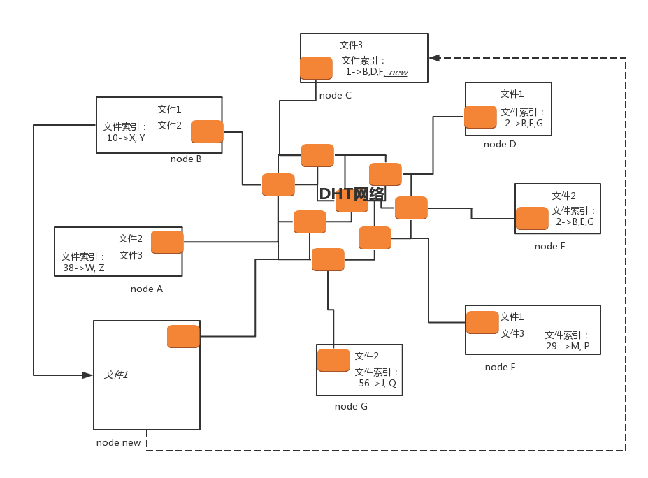

在 DHT 网络里面，每一个 DHT node 都有一个 ID。这个 ID 是一个很长的串。每个 DHT node 都有责任掌握一些知识，也就是**文件索引**，也即它应该知道某些文件是保存在哪些节点上。它只需要有这些知识就可以了，而它自己本身不一定就是保存这个文件的节点。

## 哈希值

当然，每个 DHT node 不会有全局的知识，也即不知道所有的文件保存在哪里，它只需要知道一部分。那应该知道哪一部分呢？这就需要用哈希算法计算出来。

每个文件可以计算出一个哈希值，而**DHT node 的 ID 是和哈希值相同长度的串**。

DHT 算法是这样规定的：如果一个文件计算出一个哈希值，则和这个哈希值一样的那个 DHT node，就有责任知道从哪里下载这个文件，即便它自己没保存这个文件。

当然不一定这么巧，总能找到和哈希值一模一样的，有可能一模一样的 DHT node 也下线了，所以 DHT 算法还规定：除了一模一样的那个 DHT node 应该知道，ID 和这个哈希值非常接近的 N 个 DHT node 也应该知道。

什么叫和哈希值接近呢？例如只修改了最后一位，就很接近；修改了倒数 2 位，也不远；修改了倒数 3 位，也可以接受。总之，凑齐了规定的 N 这个数就行。

刚才那个图里，文件 1 通过哈希运算，得到匹配 ID 的 DHT node 为 node C，当然还会有其他的，我这里没有画出来。所以，node C 有责任知道文件 1 的存放地址，虽然 node C 本身没有存放文件 1。

同理，文件 2 通过哈希运算，得到匹配 ID 的 DHT node 为 node E，但是 node D 和 E 的 ID 值很近，所以 node D 也知道。当然，文件 2 本身没有必要一定在 node D 和 E 里，但是碰巧这里就在 E 那有一份。

接下来一个新的节点 node new 上线了。如果想下载文件 1，它首先要加入 DHT 网络，如何加入呢？

在这种模式下，种子.torrent 文件里面就不再是 tracker 的地址了，而是一个 list 的 node 的地址，而所有这些 node 都是已经在 DHT 网络里面的。当然随着时间的推移，很可能有退出的，有下线的，但是我们假设，不会所有的都联系不上，总有一个能联系上。

node new 只要在种子里面找到一个 DHT node，就加入了网络。

node new 会计算文件 1 的哈希值，并根据这个哈希值了解到，和这个哈希值匹配，或者很接近的 node 上知道如何下载这个文件，例如计算出来的哈希值就是 node C。

但是 node new 不知道怎么联系上 node C，因为种子里面的 node 列表里面很可能没有 node C，但是它可以问，DHT 网络特别像一个社交网络，node new 只有去它能联系上的 node 问，你们知道不知道 node C 的联系方式呀？

在 DHT 网络中，每个 node 都保存了一定的联系方式，但是肯定没有 node 的所有联系方式。DHT 网络中，节点之间通过互相通信，也会交流联系方式，也会删除联系方式。和人们的方式一样，你有你的朋友圈，你的朋友有它的朋友圈，你们互相加微信，就互相认识了，过一段时间不联系，就删除朋友关系。

有个理论是，社交网络中，任何两个人直接的距离不超过六度，也即你想联系比尔盖茨，也就六个人就能够联系到了。

所以，node new 想联系 node C，就去万能的朋友圈去问，并且求转发，朋友再问朋友，很快就能找到。如果找不到 C，也能找到和 C 的 ID 很像的节点，它们也知道如何下载文件 1。

在 node C 上，告诉 node new，下载文件 1，要去 B、D、 F，于是 node new 选择和 node B 进行 peer 连接，开始下载，它一旦开始下载，自己本地也有文件 1 了，于是 node new 告诉 node C 以及和 node C 的 ID 很像的那些节点，我也有文件 1 了，可以加入那个文件拥有者列表了。

但是你会发现 node new 上没有文件索引，但是根据哈希算法，一定会有某些文件的哈希值是和 node new 的 ID 匹配上的。在 DHT 网络中，会有节点告诉它，你既然加入了咱们这个网络，你也有责任知道某些文件的下载地址。

好了，一切都分布式了。

这里面遗留几个细节的问题。

- DHT node ID 以及文件哈希是个什么东西？

节点 ID 是一个随机选择的 160bits（20 字节）空间，文件的哈希也使用这样的 160bits 空间。

- 所谓 ID 相似，具体到什么程度算相似？

在 Kademlia 网络中，距离是通过异或（XOR）计算的。我们就不以 160bits 举例了。我们以 5 位来举例。

01010 与 01000 的距离，就是两个 ID 之间的异或值，为 00010，也即为 2。 01010 与 00010 的距离为 01000，也即为 8,。01010 与 00011 的距离为 01001，也即 8+1=9 。以此类推，高位不同的，表示距离更远一些；低位不同的，表示距离更近一些，总的距离为所有的不同的位的距离之和。

这个距离不能比喻为地理位置，因为在 Kademlia 网络中，位置近不算近，ID 近才算近，所以我把这个距离比喻为社交距离，也即在朋友圈中的距离，或者社交网络中的距离。这个和你住的位置没有关系，和人的经历关系比较大。

还是以 5 位 ID 来举例，就像在领英中，排第一位的表示最近一份工作在哪里，第二位的表示上一份工作在哪里，然后第三位的是上上份工作，第四位的是研究生在哪里读，第五位的表示大学在哪里读。

如果你是一个猎头，在上面找候选人，当然最近的那份工作是最重要的。而对于工作经历越丰富的候选人，大学在哪里读的反而越不重要。

## DHT 网络中的朋友圈是怎么维护的？

就像人一样，虽然我们常联系人的只有少数，但是朋友圈里肯定是远近都有。DHT 网络的朋友圈也是一样，远近都有，并且**按距离分层**。

假设某个节点的 ID 为 01010，如果一个节点的 ID，前面所有位数都与它相同，只有最后 1 位不同。这样的节点只有 1 个，为 01011。与基础节点的异或值为 00001，即距离为 1；对于 01010 而言，这样的节点归为“k-bucket 1”。

如果一个节点的 ID，前面所有位数都相同，从倒数第 2 位开始不同，这样的节点只有 2 个，即 01000 和 01001，与基础节点的异或值为 00010 和 00011，即距离范围为 2 和 3；对于 01010 而言，这样的节点归为“k-bucket 2”。

如果一个节点的 ID，前面所有位数相同，从倒数第 i 位开始不同，这样的节点只有 2^(i-1) 个，与基础节点的距离范围为 [2^(i-1), 2^i)；对于 01010 而言，这样的节点归为“k-bucket i”。

最终到从倒数 160 位就开始都不同。

你会发现，差距越大，陌生人越多，但是朋友圈不能都放下，所以每一层都只放 K 个，这是参数可以配置。

## DHT 网络是如何查找朋友的？

假设，node A 的 ID 为 00110，要找 node B ID 为 10000，异或距离为 10110，距离范围在 [2^4, 2^5)，所以这个目标节点可能在“k-bucket 5”中，这就说明 B 的 ID 与 A 的 ID 从第 5 位开始不同，所以 B 可能在“k-bucket 5”中。

然后，A 看看自己的 k-bucket 5 有没有 B。如果有，太好了，找到你了；如果没有，在 k-bucket 5 里随便找一个 C。因为是二进制，C、B 都和 A 的第 5 位不同，那么 C 的 ID 第 5 位肯定与 B 相同，即它与 B 的距离会小于 2^4，相当于比 A、B 之间的距离缩短了一半以上。

再请求 C，在它自己的通讯录里，按同样的查找方式找一下 B。如果 C 知道 B，就告诉 A；如果 C 也不知道 B，那 C 按同样的搜索方法，可以在自己的通讯录里找到一个离 B 更近的 D 朋友（D、B 之间距离小于 2^3），把 D 推荐给 A，A 请求 D 进行下一步查找。

Kademlia 的这种查询机制，是通过折半查找的方式来收缩范围，对于总的节点数目为 N，最多只需要查询 log2(N) 次，就能够找到。  

例如，图中这个最差的情况。

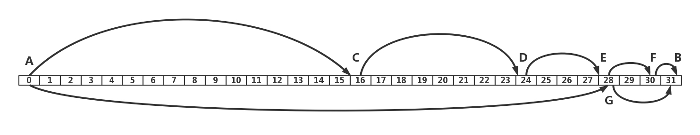

在 DHT 网络中，朋友之间怎么沟通呢？

Kademlia 算法中，每个节点只有 4 个指令。

- PING：测试一个节点是否在线，还活着没，相当于打个电话，看还能打通不。
- STORE：要求一个节点存储一份数据，既然加入了组织，有义务保存一份数据。
- FIND_NODE：根据节点 ID 查找一个节点，就是给一个 160 位的 ID，通过上面朋友圈的方式找到那个节点。
- FIND_VALUE：根据 KEY 查找一个数据，实则上跟 FIND_NODE 非常类似。KEY 就是文件对应的 160 位的 ID，就是要找到保存了文件的节点。

DHT 网络中，朋友圈如何更新呢？

- 每个 bucket 里的节点，都按最后一次接触的时间倒序排列，这就相当于，朋友圈里面最近联系过的人往往是最熟的。
- 每次执行四个指令中的任意一个都会触发更新。
- 当一个节点与自己接触时，检查它是否已经在 k-bucket 中，也就是说是否已经在朋友圈。如果在，那么将它挪到 k-bucket 列表的最底，也就是最新的位置，刚联系过，就置顶一下，方便以后多联系；如果不在，新的联系人要不要加到通讯录里面呢？假设通讯录已满的情况，PING 一下列表最上面，也即最旧的一个节点。如果 PING 通了，将旧节点挪到列表最底，并丢弃新节点，老朋友还是留一下；如果 PING 不通，删除旧节点，并将新节点加入列表，这人联系不上了，删了吧。

这个机制保证了任意节点加入和离开都不影响整体网络。

## 总结

- 下载一个文件可以使用 HTTP 或 FTP，这两种都是集中下载的方式，而 P2P 则换了一种思路，采取非中心化下载的方式；
- P2P 也是有两种，一种是依赖于 tracker 的，也即元数据集中，文件数据分散；另一种是基于分布式的哈希算法，元数据和文件数据全部分散。

<h1 id="chapter18">DNS协议：网络世界的地址簿</h1>

前面我们讲了平时常见的看新闻、支付、直播、下载等场景，现在网站的数目非常多，常用的网站就有二三十个，如果全部用 IP 地址进行访问，恐怕很难记住。于是，就需要一个地址簿，根据名称，就可以查看具体的地址。

## DNS 服务器

在网络世界，也是这样的。你肯定记得住网站的名称，但是很难记住网站的 IP 地址，因而也需要一个地址簿，就是**DNS 服务器**。

由此可见，DNS 在日常生活中多么重要。每个人上网，都需要访问它，但是同时，这对它来讲也是非常大的挑战。一旦它出了故障，整个互联网都将瘫痪。另外，上网的人分布在全世界各地，如果大家都去同一个地方访问某一台服务器，时延将会非常大。因而，**DNS 服务器，一定要设置成高可用、高并发和分布式的**。

于是，就有了这样**树状的层次结构**。

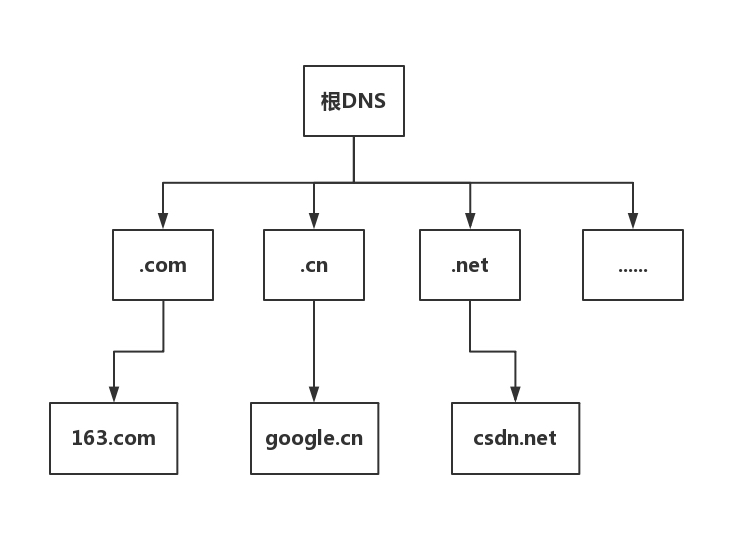

- 根 DNS 服务器 ：返回顶级域 DNS 服务器的 IP 地址
- 顶级域 DNS 服务器：返回权威 DNS 服务器的 IP 地址
- 权威 DNS 服务器 ：返回相应主机的 IP 地址

## DNS 解析流程

为了提高 DNS 的解析性能，很多网络都会就近部署 DNS 缓存服务器。于是，就有了以下的 DNS 解析流程。

1. 电脑客户端会发出一个 DNS 请求，问 www.163.com 的 IP 是啥啊，并发给本地域名服务器 (本地 DNS)。那本地域名服务器 (本地 DNS) 是什么呢？如果是通过 DHCP 配置，本地 DNS 由你的网络服务商（ISP），如电信、移动等自动分配，它通常就在你网络服务商的某个机房。
2. 本地 DNS 收到来自客户端的请求。你可以想象这台服务器上缓存了一张域名与之对应 IP 地址的大表格。如果能找到 www.163.com，它直接就返回 IP 地址。如果没有，本地 DNS 会去问它的根域名服务器：“老大，能告诉我 www.163.com 的 IP 地址吗？”根域名服务器是最高层次的，全球共有 13 套。它不直接用于域名解析，但能指明一条道路。
3. 根 DNS 收到来自本地 DNS 的请求，发现后缀是 .com，说：“哦，www.163.com 啊，这个域名是由.com 区域管理，我给你它的顶级域名服务器的地址，你去问问它吧。”
4. 本地 DNS 转向问顶级域名服务器：“老二，你能告诉我 www.163.com 的 IP 地址吗？”顶级域名服务器就是大名鼎鼎的比如 .com、.net、 .org 这些一级域名，它负责管理二级域名，比如 163.com，所以它能提供一条更清晰的方向。
5. 顶级域名服务器说：“我给你负责 www.163.com 区域的权威 DNS 服务器的地址，你去问它应该能问到。”
6. 本地 DNS 转向问权威 DNS 服务器：“您好，www.163.com 对应的 IP 是啥呀？”163.com 的权威 DNS 服务器，它是域名解析结果的原出处。为啥叫权威呢？就是我的域名我做主。
7. 权威 DNS 服务器查询后将对应的 IP 地址 X.X.X.X 告诉本地 DNS。
8. 本地 DNS 再将 IP 地址返回客户端，客户端和目标建立连接。

至此，我们完成了 DNS 的解析过程。现在总结一下，整个过程我画成了一个图。

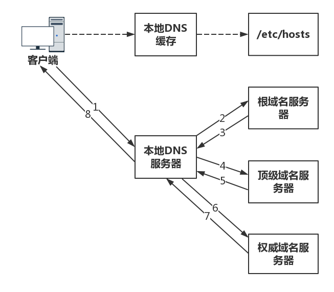

## 负载均衡

站在客户端角度，这是一次**DNS 递归查询过程。因为本地 DNS 全权为它效劳，它只要坐等结果即可。在这个过程中，DNS 除了可以通过名称映射为 IP 地址，它还可以做另外一件事，就是负载均衡**。

DNS 首先可以做**内部负载均衡**。

例如，一个应用要访问数据库，在这个应用里面应该配置这个数据库的 IP 地址，还是应该配置这个数据库的域名呢？显然应该配置域名，因为一旦这个数据库，因为某种原因，换到了另外一台机器上，而如果有多个应用都配置了这台数据库的话，一换 IP 地址，就需要将这些应用全部修改一遍。但是如果配置了域名，则只要在 DNS 服务器里，将域名映射为新的 IP 地址，这个工作就完成了，大大简化了运维。

在这个基础上，我们可以再进一步。例如，某个应用要访问另外一个应用，如果配置另外一个应用的 IP 地址，那么这个访问就是一对一的。但是当被访问的应用撑不住的时候，我们其实可以部署多个。但是，访问它的应用，如何在多个之间进行负载均衡？只要配置成为域名就可以了。在域名解析的时候，我们只要配置策略，这次返回第一个 IP，下次返回第二个 IP，就可以实现负载均衡了。

另外一个更加重要的是，DNS 还可以做**全局负载均衡**。

为了保证我们的应用高可用，往往会部署在多个机房，每个地方都会有自己的 IP 地址。当用户访问某个域名的时候，这个 IP 地址可以轮询访问多个数据中心。如果一个数据中心因为某种原因挂了，只要在 DNS 服务器里面，将这个数据中心对应的 IP 地址删除，就可以实现一定的高可用。

另外，我们肯定希望北京的用户访问北京的数据中心，上海的用户访问上海的数据中心，这样，客户体验就会非常好，访问速度就会超快。这就是全局负载均衡的概念。

## 示例：DNS 访问数据中心中对象存储上的静态资源

我们通过 DNS 访问数据中心中对象存储上的静态资源为例，看一看整个过程。

假设全国有多个数据中心，托管在多个运营商，每个数据中心三个可用区（Available Zone）。对象存储通过跨可用区部署，实现高可用性。在每个数据中心中，都至少部署两个内部负载均衡器，内部负载均衡器后面对接多个对象存储的前置服务器（Proxy-server）。

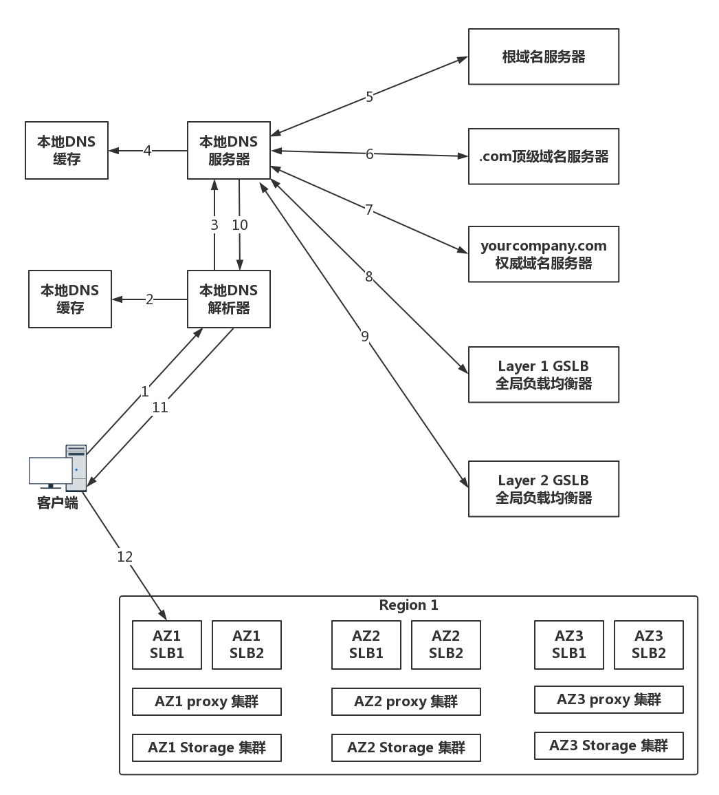

1. 当一个客户端要访问 object.yourcompany.com 的时候，需要将域名转换为 IP 地址进行访问，所以它要请求本地 DNS 解析器。
2. 本地 DNS 解析器先查看看本地的缓存是否有这个记录。如果有则直接使用，因为上面的过程太复杂了，如果每次都要递归解析，就太麻烦了。
3. 如果本地无缓存，则需要请求本地的 DNS 服务器。
4. 本地的 DNS 服务器一般部署在你的数据中心或者你所在的运营商的网络中，本地 DNS 服务器也需要看本地是否有缓存，如果有则返回，因为它也不想把上面的递归过程再走一遍。
5. 至 7. 如果本地没有，本地 DNS 才需要递归地从根 DNS 服务器，查到.com 的顶级域名服务器，最终查到 yourcompany.com 的权威 DNS 服务器，给本地 DNS 服务器，权威 DNS 服务器按说会返回真实要访问的 IP 地址。

对于不需要做全局负载均衡的简单应用来讲，yourcompany.com 的权威 DNS 服务器可以直接将 object.yourcompany.com 这个域名解析为一个或者多个 IP 地址，然后客户端可以通过多个 IP 地址，进行简单的轮询，实现简单的负载均衡。

但是对于复杂的应用，尤其是跨地域跨运营商的大型应用，则需要更加复杂的全局负载均衡机制，因而需要专门的设备或者服务器来做这件事情，这就是**全局负载均衡器（GSLB，Global Server Load Balance）**。

在 yourcompany.com 的 DNS 服务器中，一般是通过配置 CNAME 的方式，给 object.yourcompany.com 起一个别名，例如 object.vip.yourcomany.com，然后告诉本地 DNS 服务器，让它请求 GSLB 解析这个域名，GSLB 就可以在解析这个域名的过程中，通过自己的策略实现负载均衡。

图中画了两层的 GSLB，是因为分运营商和地域。我们希望不同运营商的客户，可以访问相同运营商机房中的资源，这样不跨运营商访问，有利于提高吞吐量，减少时延。

1. 第一层 GSLB，通过查看请求它的本地 DNS 服务器所在的运营商，就知道用户所在的运营商。假设是移动，通过 CNAME 的方式，通过另一个别名 object.yd.yourcompany.com，告诉本地 DNS 服务器去请求第二层的 GSLB。
2. 第二层 GSLB，通过查看请求它的本地 DNS 服务器所在的地址，就知道用户所在的地理位置，然后将距离用户位置比较近的 Region 里面，六个**内部负载均衡（SLB，Server Load Balancer）**的地址，返回给本地 DNS 服务器。
3. 本地 DNS 服务器将结果返回给本地 DNS 解析器。
4. 本地 DNS 解析器将结果缓存后，返回给客户端。
5. 客户端开始访问属于相同运营商的距离较近的 Region 1 中的对象存储，当然客户端得到了六个 IP 地址，它可以通过负载均衡的方式，随机或者轮询选择一个可用区进行访问。对象存储一般会有三个备份，从而可以实现对存储读写的负载均衡。

## 总结

- DNS 是网络世界的地址簿，可以通过域名查地址，因为域名服务器是按照树状结构组织的，因而域名查找是使用递归的方法，并通过缓存的方式增强性能；
- 在域名和 IP 的映射过程中，给了应用基于域名做负载均衡的机会，可以是简单的负载均衡，也可以根据地址和运营商做全局的负载均衡。

<h1 id="chapter19">HTTPDNS：网络世界的地址簿也会指错路</h1>

上一节我们知道了 DNS 的两项功能，第一是根据名称查到具体的地址，另外一个是可以针对多个地址做负载均衡，而且可以在多个地址中选择一个距离你近的地方访问。

然而有时候这个地址簿也经常给你指错路，明明距离你 500 米就有个吃饭的地方，非要把你推荐到 5 公里外。为什么会出现这样的情况呢？

还记得吗？当我们发出请求解析 DNS 的时候，首先，会先连接到运营商本地的 DNS 服务器，由这个服务器帮我们去整棵 DNS 树上进行解析，然后将解析的结果返回给客户端。但是本地的 DNS 服务器，作为一个本地导游，往往有自己的“小心思”。

## 传统 DNS 存在哪些问题？

### **1. 域名缓存问题**

它可以在本地做一个缓存，也就是说，不是每一个请求，它都会去访问权威 DNS 服务器，而是访问过一次就把结果缓存到自己本地，当其他人来问的时候，直接就返回这个缓存数据。

另外，有的运营商会把一些静态页面，缓存到本运营商的服务器内，这样用户请求的时候，就不用跨运营商进行访问，这样既加快了速度，也减少了运营商之间流量计算的成本。在域名解析的时候，不会将用户导向真正的网站，而是指向这个缓存的服务器。

很多情况下是看不出问题的，但是当页面更新，用户会访问到老的页面，问题就出来了。例如，你听说一个餐馆推出了一个新菜，你想去尝一下。结果导游告诉你，在这里吃也是一样的。有的游客会觉得没问题，但是对于想尝试新菜的人来说，如果导游说带你去，但其实并没有吃到新菜，你是不是也会非常失望呢？

再就是本地的缓存，往往使得全局负载均衡失败，因为上次进行缓存的时候，缓存中的地址不一定是这次访问离客户最近的地方，如果把这个地址返回给客户，那肯定就会绕远路。

就像上一次客户要吃西湖醋鱼的事，导游知道西湖边有一家，因为当时游客就在西湖边，可是，下一次客户在灵隐寺，想吃西湖醋鱼的时候，导游还指向西湖边的那一家，那这就绕的太远了。

### **2. 域名转发问题**

缓存问题还是说本地域名解析服务，还是会去权威 DNS 服务器中查找，只不过不是每次都要查找。可以说这还是大导游、大中介。还有一些小导游、小中介，有了请求之后，直接转发给其他运营商去做解析，自己只是外包了出去。

这样的问题是，如果是 A 运营商的客户，访问自己运营商的 DNS 服务器，如果 A 运营商去权威 DNS 服务器查询的话，权威 DNS 服务器知道你是 A 运营商的，就返回给一个部署在 A 运营商的网站地址，这样针对相同运营商的访问，速度就会快很多。

但是 A 运营商偷懒，将解析的请求转发给 B 运营商，B 运营商去权威 DNS 服务器查询的话，权威服务器会误认为，你是 B 运营商的，那就返回给你一个在 B 运营商的网站地址吧，结果客户的每次访问都要跨运营商，速度就会很慢。

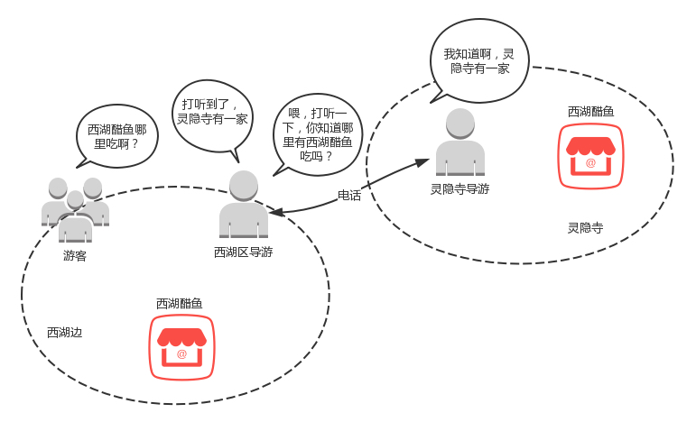

### **3. 出口 NAT 问题**

前面讲述网关的时候，我们知道，出口的时候，很多机房都会配置**NAT**，也即**网络地址转换**，使得从这个网关出去的包，都换成新的 IP 地址，当然请求返回的时候，在这个网关，再将 IP 地址转换回去，所以对于访问来说是没有任何问题。

但是一旦做了网络地址的转换，权威的 DNS 服务器，就没办法通过这个地址，来判断客户到底是来自哪个运营商，而且极有可能因为转换过后的地址，误判运营商，导致跨运营商的访问。

### **4. 域名更新问题**

本地 DNS 服务器是由不同地区、不同运营商独立部署的。对域名解析缓存的处理上，实现策略也有区别，有的会偷懒，忽略域名解析结果的 TTL 时间限制，在权威 DNS 服务器解析变更的时候，解析结果在全网生效的周期非常漫长。但是有的时候，在 DNS 的切换中，场景对生效时间要求比较高。

例如双机房部署的时候，跨机房的负载均衡和容灾多使用 DNS 来做。当一个机房出问题之后，需要修改权威 DNS，将域名指向新的 IP 地址，但是如果更新太慢，那很多用户都会出现访问异常。

这就像，有的导游比较勤快、敬业，时时刻刻关注酒店、餐馆、交通的变化，问他的时候，往往会得到最新情况。有的导游懒一些，8 年前背的导游词就没换过，问他的时候，指的路往往就是错的。

### **5. 解析延迟问题**

从上一节的 DNS 查询过程来看，DNS 的查询过程需要递归遍历多个 DNS 服务器，才能获得最终的解析结果，这会带来一定的时延，甚至会解析超时。

## HTTPDNS 的工作模式

既然 DNS 解析中有这么多问题，那怎么办呢？难不成退回到直接用 IP 地址？这样显然不合适，所以就有了**HTTPDNS**。

**HTTPNDS 其实就是，不走传统的 DNS 解析，而是自己搭建基于 HTTP 协议的 DNS 服务器集群，分布在多个地点和多个运营商。当客户端需要 DNS 解析的时候，直接通过 HTTP 协议进行请求这个服务器集群，得到就近的地址。**

这就相当于每家基于 HTTP 协议，自己实现自己的域名解析，自己做一个自己的地址簿，而不使用统一的地址簿。但是默认的域名解析都是走 DNS 的，因而使用 HTTPDNS 需要绕过默认的 DNS 路径，就不能使用默认的客户端。使用 HTTPDNS 的，往往是手机应用，需要在手机端嵌入支持 HTTPDNS 的客户端 SDK。

通过自己的 HTTPDNS 服务器和自己的 SDK，实现了从依赖本地导游，到自己上网查询做旅游攻略，进行自由行，爱怎么玩怎么玩。这样就能够避免依赖导游，而导游又不专业，你还不能把他怎么样的尴尬。

下面我来解析一下**HTTPDNS 的工作模式**。

在客户端的 SDK 里动态请求服务端，获取 HTTPDNS 服务器的 IP 列表，缓存到本地。随着不断地解析域名，SDK 也会在本地缓存 DNS 域名解析的结果。

当手机应用要访问一个地址的时候，首先看是否有本地的缓存，如果有就直接返回。这个缓存和本地 DNS 的缓存不一样的是，这个是手机应用自己做的，而非整个运营商统一做的。如何更新、何时更新，手机应用的客户端可以和服务器协调来做这件事情。

如果本地没有，就需要请求 HTTPDNS 的服务器，在本地 HTTPDNS 服务器的 IP 列表中，选择一个发出 HTTP 的请求，会返回一个要访问的网站的 IP 列表。

请求的方式是这样的。

```s
curl http://106.2.xxx.xxx/d?dn=c.m.163.com
{"dns":[{"host":"c.m.163.com","ips":["223.252.199.12"],"ttl":300,"http2":0}],"client":{"ip":"106.2.81.50","line":269692944}}
```

手机客户端自然知道手机在哪个运营商、哪个地址。由于是直接的 HTTP 通信，HTTPDNS 服务器能够准确知道这些信息，因而可以做精准的全局负载均衡。

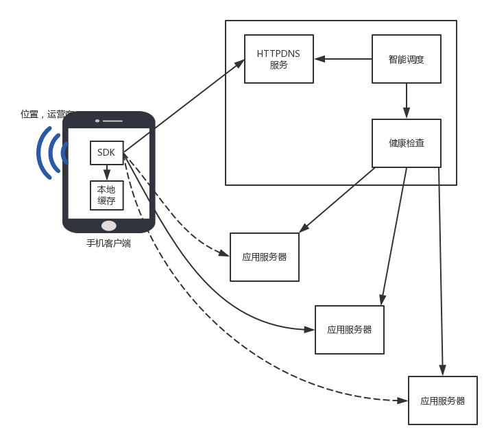

当然，当所有这些都不工作的时候，可以切换到传统的 LocalDNS 来解析，慢也比访问不到好。那 HTTPDNS 是如何解决上面的问题的呢？

其实归结起来就是两大问题。一是解析速度和更新速度的平衡问题，二是智能调度的问题，对应的解决方案是 HTTPDNS 的缓存设计和调度设计。

## HTTPDNS 的缓存设计

解析 DNS 过程复杂，通信次数多，对解析速度造成很大影响。为了加快解析，因而有了缓存，但是这又会产生缓存更新速度不及时的问题。最要命的是，这两个方面都掌握在别人手中，也即本地 DNS 服务器手中，它不会为你定制，你作为客户端干着急没办法。

而 HTTPDNS 就是将解析速度和更新速度全部掌控在自己手中。一方面，解析的过程，不需要本地 DNS 服务递归的调用一大圈，一个 HTTP 的请求直接搞定，要实时更新的时候，马上就能起作用；另一方面为了提高解析速度，本地也有缓存，缓存是在客户端 SDK 维护的，过期时间、更新时间，都可以自己控制。

HTTPDNS 的缓存设计策略也是咱们做应用架构中常用的缓存设计模式，也即分为**客户端、缓存、数据源三层**。

- 对于应用架构来讲，就是应用、缓存、数据库。常见的是 Tomcat、Redis、MySQL。
- 对于 HTTPDNS 来讲，就是手机客户端、DNS 缓存、HTTPDNS 服务器。  

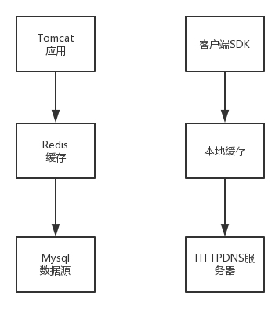

只要是缓存模式，就存在缓存的过期、更新、不一致的问题，解决思路也是很像的。

例如 DNS 缓存在内存中，也可以持久化到存储上，从而 APP 重启之后，能够尽快从存储中加载上次累积的经常访问的网站的解析结果，就不需要每次都全部解析一遍，再变成缓存。这有点像 Redis 是基于内存的缓存，但是同样提供持久化的能力，使得重启或者主备切换的时候，数据不会完全丢失。

SDK 中的缓存会严格按照缓存过期时间，如果缓存没有命中，或者已经过期，而且客户端不允许使用过期的记录，则会发起一次解析，保障记录是更新的。

解析可以**同步进行**，也就是直接调用 HTTPDNS 的接口，返回最新的记录，更新缓存；也可以**异步进行**，添加一个解析任务到后台，由后台任务调用 HTTPDNS 的接口。

**同步更新**的优点是实时性好，缺点是如果有多个请求都发现过期的时候，同时会请求 HTTPDNS 多次，其实是一种浪费。

同步更新的方式对应到应用架构中缓存的**Cache-Aside 机制**，也即先读缓存，不命中读数据库，同时将结果写入缓存。

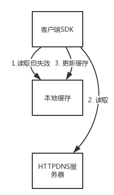

**异步更新**的**优点**是，可以将多个请求都发现过期的情况，合并为一个对于 HTTPDNS 的请求任务，只执行一次，减少 HTTPDNS 的压力。同时可以在即将过期的时候，就创建一个任务进行预加载，防止过期之后再刷新，称为**预加载**。

它的**缺点**是当前请求拿到过期数据的时候，如果客户端允许使用过期数据，需要冒一次风险。如果过期的数据还能请求，就没问题；如果不能请求，则失败一次，等下次缓存更新后，再请求方能成功。

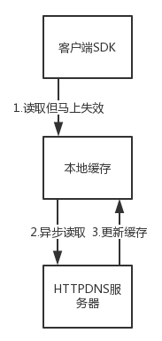

异步更新的机制对应到应用架构中缓存的**Refresh-Ahead 机制**，即业务仅仅访问缓存，当过期的时候定期刷新。在著名的应用缓存 Guava Cache 中，有个 RefreshAfterWrite 机制，对于并发情况下，多个缓存访问不命中从而引发并发回源的情况，可以采取只有一个请求回源的模式。在应用架构的缓存中，也常常用**数据预热**或者**预加载**的机制。

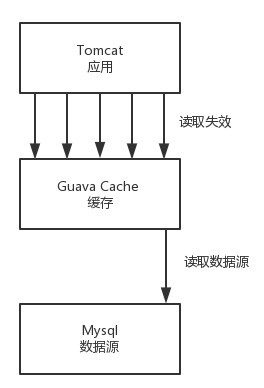

## HTTPDNS 的调度设计

由于客户端嵌入了 SDK，因而就不会因为本地 DNS 的各种缓存、转发、NAT，让权威 DNS 服务器误会客户端所在的位置和运营商，而可以拿到第一手资料。

在**客户端**，可以知道手机是哪个国家、哪个运营商、哪个省，甚至哪个市，HTTPDNS 服务端可以根据这些信息，选择最佳的服务节点返回。

如果有多个节点，还会考虑错误率、请求时间、服务器压力、网络状况等，进行综合选择，而非仅仅考虑地理位置。当有一个节点宕机或者性能下降的时候，可以尽快进行切换。

要做到这一点，需要客户端使用 HTTPDNS 返回的 IP 访问业务应用。客户端的 SDK 会收集网络请求数据，如错误率、请求时间等网络请求质量数据，并发送到统计后台，进行分析、聚合，以此查看不同的 IP 的服务质量。

在**服务端**，应用可以通过调用 HTTPDNS 的管理接口，配置不同服务质量的优先级、权重。HTTPDNS 会根据这些策略综合地理位置和线路状况算出一个排序，优先访问当前那些优质的、时延低的 IP 地址。

HTTPDNS 通过智能调度之后返回的结果，也会缓存在客户端。为了不让缓存使得调度失真，客户端可以根据不同的移动网络运营商 WIFI 的 SSID 来分维度缓存。不同的运营商或者 WIFI 解析出来的结果会不同。

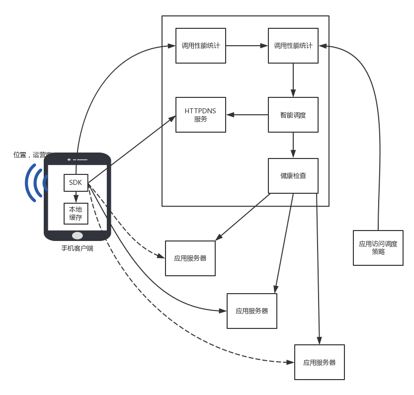

## 总结

- 传统的 DNS 有很多问题，例如解析慢、更新不及时。因为缓存、转发、NAT 问题导致客户端误会自己所在的位置和运营商，从而影响流量的调度。
- HTTPDNS 通过客户端 SDK 和服务端，通过 HTTP 直接调用解析 DNS 的方式，绕过了传统 DNS 的这些缺点，实现了智能的调度。

<h1 id="chapter20">CDN：你去小卖部取过快递么？</h1>

当一个用户想访问一个网站的时候，指定这个网站的域名，DNS 就会将这个域名解析为地址，然后用户请求这个地址，返回一个网页。就像你要买个东西，首先要查找商店的位置，然后去商店里面找到自己想要的东西，最后拿着东西回家。

**那这里面还有没有可以优化的地方呢？**

例如你去电商网站下单买个东西，这个东西一定要从电商总部的中心仓库送过来吗？原来基本是这样的，每一单都是单独配送，所以你可能要很久才能收到你的宝贝。但是后来电商网站的物流系统学聪明了，他们在全国各地建立了很多仓库，而不是只有总部的中心仓库才可以发货。

电商网站根据统计大概知道，北京、上海、广州、深圳、杭州等地，每天能够卖出去多少书籍、卫生纸、包、电器等存放期比较长的物品。这些物品用不着从中心仓库发出，所以平时就可以将它们分布在各地仓库里，客户一下单，就近的仓库发出，第二天就可以收到了。

这样，用户体验大大提高。当然，这里面也有个难点就是，生鲜这类东西保质期太短，如果提前都备好货，但是没有人下单，那肯定就坏了。这个问题，我后文再说。

**我们先说，我们的网站访问可以借鉴“就近配送”这个思路。**

全球有这么多的数据中心，无论在哪里上网，临近不远的地方基本上都有数据中心。是不是可以在这些数据中心里部署几台机器，形成一个缓存的集群来缓存部分数据，那么用户访问数据的时候，就可以就近访问了呢？

当然是可以的。这些分布在各个地方的各个数据中心的节点，就称为**边缘节点**。

由于边缘节点数目比较多，但是每个集群规模比较小，不可能缓存下来所有东西，因而可能无法命中，这样就会在边缘节点之上。有区域节点，规模就要更大，缓存的数据会更多，命中的概率也就更大。在区域节点之上是中心节点，规模更大，缓存数据更多。如果还不命中，就只好回源网站访问了。


这就是**CDN 分发系统的架构**。CDN 系统的缓存，也是一层一层的，能不访问后端真正的源，就不打扰它。这也是电商网站物流系统的思路，北京局找不到，找华北局，华北局找不到，再找北方局。

有了这个分发系统之后，接下来就是，**客户端如何找到相应的边缘节点进行访问呢？**

还记得我们讲过的基于 DNS 的全局负载均衡吗？这个负载均衡主要用来选择一个就近的同样运营商的服务器进行访问。你会发现，CDN 分发网络也是一个分布在多个区域、多个运营商的分布式系统，也可以用相同的思路选择最合适的边缘节点。

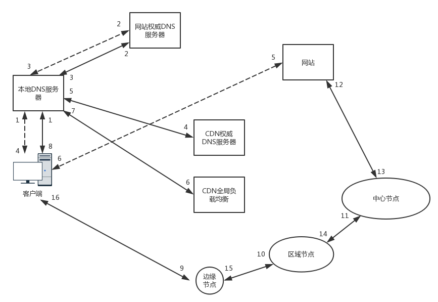

**在没有 CDN 的情况下**，用户向浏览器输入 www.web.com 这个域名，客户端访问本地 DNS 服务器的时候，如果本地 DNS 服务器有缓存，则返回网站的地址；如果没有，递归查询到网站的权威 DNS 服务器，这个权威 DNS 服务器是负责 web.com 的，它会返回网站的 IP 地址。本地 DNS 服务器缓存下 IP 地址，将 IP 地址返回，然后客户端直接访问这个 IP 地址，就访问到了这个网站。

然而**有了 CDN 之后，情况发生了变化**。在 web.com 这个权威 DNS 服务器上，会设置一个 CNAME 别名，指向另外一个域名 www.web.cdn.com，返回给本地 DNS 服务器。

当本地 DNS 服务器拿到这个新的域名时，需要继续解析这个新的域名。这个时候，再访问的就不是 web.com 的权威 DNS 服务器了，而是 web.cdn.com 的权威 DNS 服务器，这是 CDN 自己的权威 DNS 服务器。在这个服务器上，还是会设置一个 CNAME，指向另外一个域名，也即 CDN 网络的全局负载均衡器。

接下来，本地 DNS 服务器去请求 CDN 的全局负载均衡器解析域名，全局负载均衡器会为用户选择一台合适的缓存服务器提供服务，选择的依据包括：

- 根据用户 IP 地址，判断哪一台服务器距用户最近；
- 用户所处的运营商；
- 根据用户所请求的 URL 中携带的内容名称，判断哪一台服务器上有用户所需的内容；
- 查询各个服务器当前的负载情况，判断哪一台服务器尚有服务能力。

基于以上这些条件，进行综合分析之后，全局负载均衡器会返回一台缓存服务器的 IP 地址。

本地 DNS 服务器缓存这个 IP 地址，然后将 IP 返回给客户端，客户端去访问这个边缘节点，下载资源。缓存服务器响应用户请求，将用户所需内容传送到用户终端。如果这台缓存服务器上并没有用户想要的内容，那么这台服务器就要向它的上一级缓存服务器请求内容，直至追溯到网站的源服务器将内容拉到本地。

## CDN 可以进行缓存的内容有很多种。

保质期长的日用品比较容易缓存，因为不容易过期，对应到就像电商仓库系统里，就是静态页面、图片等，因为这些东西也不怎么变，所以适合缓存。


还记得这个**接入层缓存的架构**吗？在进入数据中心的时候，我们希望通过最外层接入层的缓存，将大部分静态资源的访问拦在边缘。而 CDN 则更进一步，将这些静态资源缓存到离用户更近的数据中心。越接近客户，访问性能越好，时延越低。

但是静态内容中，有一种特殊的内容，也大量使用了 CDN，这个就是前面讲过的**流媒体**。

CDN 支持**流媒体协议**，例如前面讲过的 RTMP 协议。在很多情况下，这相当于一个代理，从上一级缓存读取内容，转发给用户。由于流媒体往往是连续的，因而可以进行预先缓存的策略，也可以预先推送到用户的客户端。

对于静态页面来讲，内容的分发往往采取**拉取**的方式，也即当发现未命中的时候，再去上一级进行拉取。但是，流媒体数据量大，如果出现**回源**，压力会比较大，所以往往采取主动**推送**的模式，将热点数据主动推送到边缘节点。

对于流媒体来讲，很多 CDN 还提供**预处理服务**，也即文件在分发之前，经过一定的处理。例如将视频转换为不同的码流，以适应不同的网络带宽的用户需求；再如对视频进行分片，降低存储压力，也使得客户端可以选择使用不同的码率加载不同的分片。这就是我们常见的，“我要看超清、标清、流畅等”。

对于流媒体 CDN 来讲，有个关键的问题是**防盗链**问题。因为视频是要花大价钱买版权的，为了挣点钱，收点广告费，如果流媒体被其他的网站盗走，在人家的网站播放，那损失可就大了。

最常用也最简单的方法就是**HTTP 头的 referer 字段**， 当浏览器发送请求的时候，一般会带上 referer，告诉服务器是从哪个页面链接过来的，服务器基于此可以获得一些信息用于处理。如果 refer 信息不是来自本站，就阻止访问或者跳到其它链接。

**referer 的机制相对比较容易破解，所以还需要配合其他的机制。**

一种常用的机制是**时间戳防盗链**。使用 CDN 的管理员可以在配置界面上，和 CDN 厂商约定一个加密字符串。

客户端取出当前的时间戳，要访问的资源及其路径，连同加密字符串进行签名算法得到一个字符串，然后生成一个下载链接，带上这个签名字符串和截止时间戳去访问 CDN。

在 CDN 服务端，根据取出过期时间，和当前 CDN 节点时间进行比较，确认请求是否过期。然后 CDN 服务端有了资源及路径，时间戳，以及约定的加密字符串，根据相同的签名算法计算签名，如果匹配则一致，访问合法，才会将资源返回给客户。

然而比如在电商仓库中，我在前面提过，有关生鲜的缓存就是非常麻烦的事情，这对应着就是动态的数据，比较难以缓存。怎么办呢？现在也有**动态 CDN，主要有两种模式**。

- 一种为**生鲜超市模式**，也即**边缘计算的模式**。既然数据是动态生成的，所以数据的逻辑计算和存储，也相应的放在边缘的节点。其中定时从源数据那里同步存储的数据，然后在边缘进行计算得到结果。就像对生鲜的烹饪是动态的，没办法事先做好缓存，因而将生鲜超市放在你家旁边，既能够送货上门，也能够现场烹饪，也是边缘计算的一种体现。
- 另一种是**冷链运输模式**，也即**路径优化的模式**。数据不是在边缘计算生成的，而是在源站生成的，但是数据的下发则可以通过 CDN 的网络，对路径进行优化。因为 CDN 节点较多，能够找到离源站很近的边缘节点，也能找到离用户很近的边缘节点。中间的链路完全由 CDN 来规划，选择一个更加可靠的路径，使用类似专线的方式进行访问。

对于常用的 TCP 连接，在公网上传输的时候经常会丢数据，导致 TCP 的窗口始终很小，发送速度上不去。根据前面的 TCP 流量控制和拥塞控制的原理，在 CDN 加速网络中可以调整 TCP 的参数，使得 TCP 可以更加激进地传输数据。

可以通过多个请求复用一个连接，保证每次动态请求到达时。连接都已经建立了，不必临时三次握手或者建立过多的连接，增加服务器的压力。另外，可以通过对传输数据进行压缩，增加传输效率。

所有这些手段就像冷链运输，整个物流优化了，全程冷冻高速运输。不管生鲜是从你旁边的超市送到你家的，还是从产地送的，保证到你家是新鲜的。

## 总结

- CDN 和电商系统的分布式仓储系统一样，分为中心节点、区域节点、边缘节点，而数据缓存在离用户最近的位置。
- CDN 最擅长的是缓存静态数据，除此之外还可以缓存流媒体数据，这时候要注意使用防盗链。它也支持动态数据的缓存，一种是边缘计算的生鲜超市模式，另一种是链路优化的冷链运输模式。

<h1 id="chapter21">数据中心：我是开发商，自己拿地盖别墅</h1>

数据中心是一个大杂烩，几乎要用到前面学过的所有知识。

前面讲办公室网络的时候，我们知道办公室里面有很多台电脑。如果要访问外网，需要经过一个叫**网关**的东西，而网关往往是一个路由器。

数据中心里面也有一大堆的电脑，但是它和咱们办公室里面的笔记本或者台式机不一样。数据中心里面是服务器。服务器被放在一个个叫作**机架（Rack）**的架子上面。

数据中心的入口和出口也是路由器，由于在数据中心的边界，就像在一个国家的边境，称为**边界路由器（Border Router）**。为了高可用，边界路由器会有多个。

一般家里只会连接一个运营商的网络，而为了高可用， 为了当一个运营商出问题的时候，还可以通过另外一个运营商来提供服务，所以数据中心的边界路由器会连接多个运营商网络。

既然是路由器，就需要跑路由协议，数据中心往往就是路由协议中的自治区域（AS）。数据中心里面的机器要想访问外面的网站，数据中心里面也是有对外提供服务的机器，都可以通过 BGP 协议，获取内外互通的路由信息。这就是我们常听到的**多线 BGP**的概念。

如果数据中心非常简单，没几台机器，那就像家里或者宿舍一样，所有的服务器都直接连到路由器上就可以了。但是数据中心里面往往有非常多的机器，当塞满一机架的时候，需要有交换机将这些服务器连接起来，可以互相通信。

这些交换机往往是放在机架顶端的，所以经常称为**TOR（Top Of Rack）交换机**。这一层的交换机常常称为**接入层（Access Layer）**。注意这个接入层和原来讲过的应用的接入层不是一个概念。

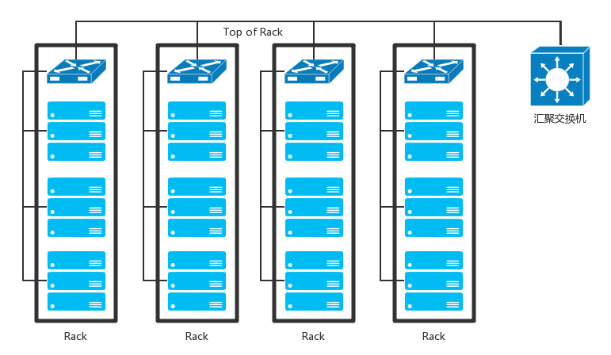

当一个机架放不下的时候，就需要多个机架，还需要有交换机将多个机架连接在一起。这些交换机对性能的要求更高，带宽也更大。这些交换机称为**汇聚层交换机（Aggregation Layer）**。

数据中心里面的每一个连接都是需要考虑高可用的。这里首先要考虑的是，如果一台机器只有一个网卡，上面连着一个网线，接入到 TOR 交换机上。如果网卡坏了，或者不小心网线掉了，机器就上不去了。所以，需要至少两个网卡、两个网线插到 TOR 交换机上，但是两个网卡要工作得像一张网卡一样，这就是常说的**网卡绑定（bond）**。

这就需要服务器和交换机都支持一种协议**LACP（Link Aggregation Control Protocol）**。它们互相通信，将多个网卡聚合称为一个网卡，多个网线聚合成一个网线，在网线之间可以进行负载均衡，也可以为了高可用作准备。

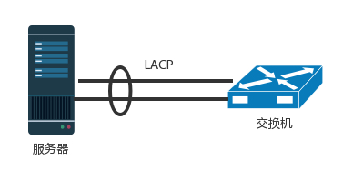

网卡有了高可用保证，但交换机还有问题。如果一个机架只有一个交换机，它挂了，那整个机架都不能上网了。因而 TOR 交换机也需要高可用，同理接入层和汇聚层的连接也需要高可用性，也不能单线连着。

最传统的方法是，部署两个接入交换机、两个汇聚交换机。服务器和两个接入交换机都连接，接入交换机和两个汇聚都连接，当然这样会形成环，所以需要启用 STP 协议，去除环，但是这样两个汇聚就只能一主一备了。STP 协议里我们学过，只有一条路会起作用。

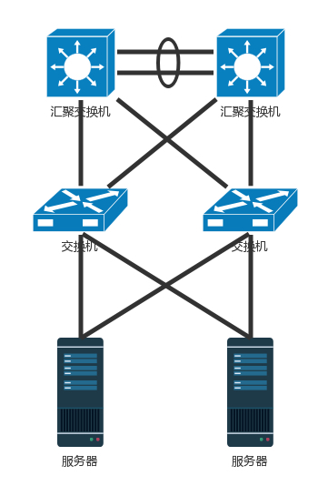

交换机有一种技术叫作**堆叠**，所以另一种方法是，将多个交换机形成一个逻辑的交换机，服务器通过多根线分配连到多个接入层交换机上，而接入层交换机多根线分别连接到多个交换机上，并且通过堆叠的私有协议，形成**双活**的连接方式。

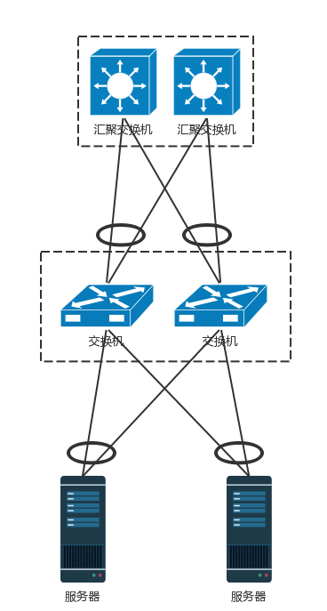

由于对带宽要求更大，而且挂了影响也更大，所以两个堆叠可能就不够了，可以就会有更多的，比如四个堆叠为一个逻辑的交换机。

汇聚层将大量的计算节点相互连接在一起，形成一个集群。在这个集群里面，服务器之间通过二层互通，这个区域常称为一个**POD（Point Of Delivery）**，有时候也称为一个**可用区（Available Zone）**。

当节点数目再多的时候，一个可用区放不下，需要将多个可用区连在一起，连接多个可用区的交换机称为**核心交换机**。

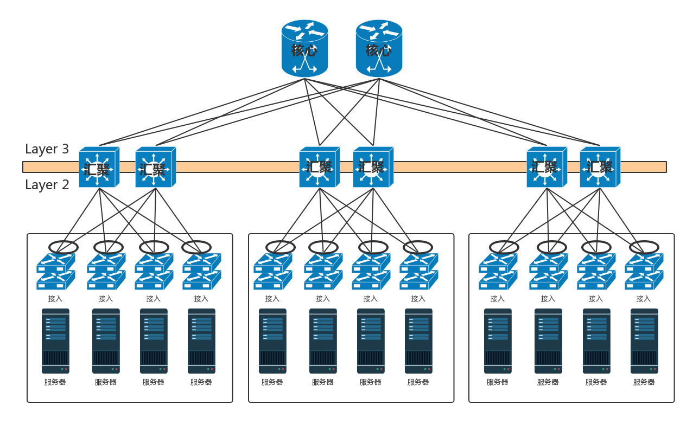

核心交换机吞吐量更大，高可用要求更高，肯定需要堆叠，但是往往仅仅堆叠，不足以满足吞吐量，因而还是需要部署多组核心交换机。核心和汇聚交换机之间为了高可用，也是全互连模式的。

这个时候还存在那个问题，出现环路怎么办？

一种方式是，不同的可用区在不同的二层网络，需要分配不同的网段。汇聚和核心之间通过三层网络互通的，二层都不在一个广播域里面，不会存在二层环路的问题。三层有环是没有问题的，只要通过路由协议选择最佳的路径就可以了。那为啥二层不能有环路，而三层可以呢？你可以回忆一下二层环路的情况。

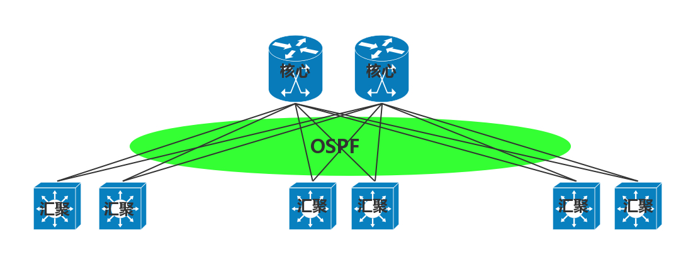

如图，核心层和汇聚层之间通过内部的路由协议 OSPF，找到最佳的路径进行访问，而且还可以通过 ECMP 等价路由，在多个路径之间进行负载均衡和高可用。

但是随着数据中心里面的机器越来越多，尤其是有了云计算、大数据，集群规模非常大，而且都要求在一个二层网络里面。这就需要二层互连从**汇聚层**上升为**核心层**，也即在核心以下，全部是二层互连，全部在一个广播域里面，这就是常说的**大二层**。

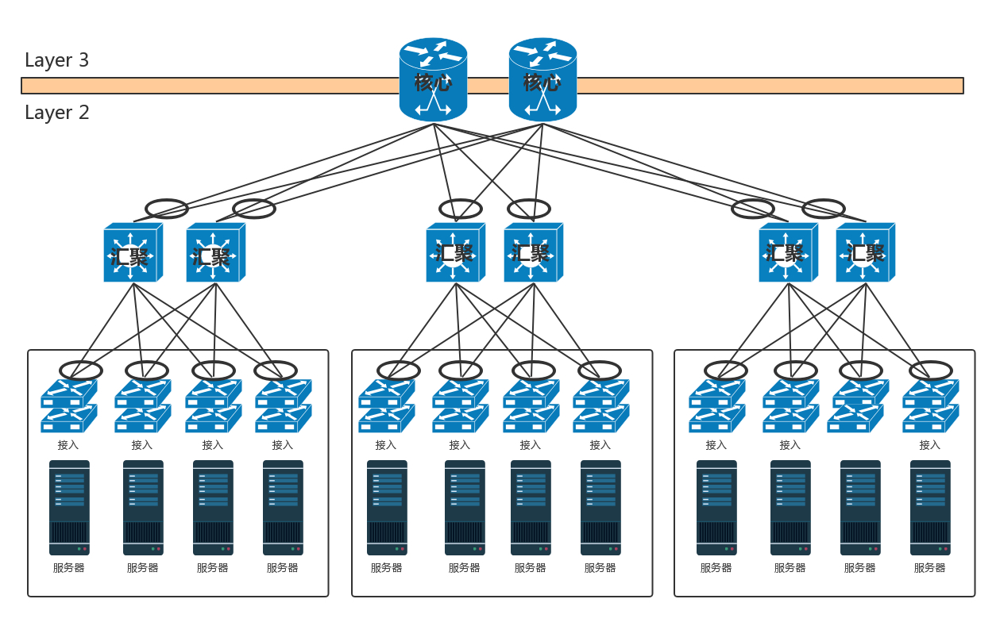

如果大二层横向流量不大，核心交换机数目不多，可以做堆叠，但是如果横向流量很大，仅仅堆叠满足不了，就需要部署多组核心交换机，而且要和汇聚层进行全互连。由于堆叠只解决一个核心交换机组内的无环问题，而组之间全互连，还需要其他机制进行解决。

如果是 STP，那部署多组核心无法扩大横向流量的能力，因为还是只有一组起作用。

于是大二层就引入了**TRILL（Transparent Interconnection of Lots of Link）**，即**多链接透明互联协议**。它的基本思想是，二层环有问题，三层环没有问题，那就把三层的路由能力模拟在二层实现。

运行 TRILL 协议的交换机称为**RBridge**，是**具有路由转发特性的网桥设备**，只不过这个路由是根据 MAC 地址来的，不是根据 IP 来的。

Rbridage 之间通过**链路状态协议**运作。记得这个路由协议吗？通过它可以学习整个大二层的拓扑，知道访问哪个 MAC 应该从哪个网桥走；还可以计算最短的路径，也可以通过等价的路由进行负载均衡和高可用性。

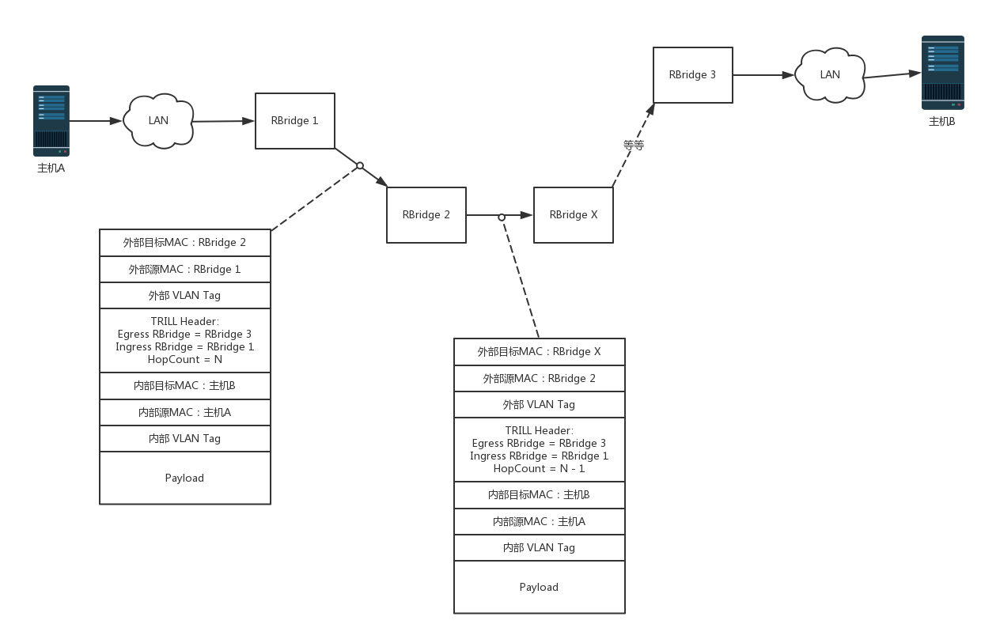

TRILL 协议在原来的 MAC 头外面加上自己的头，以及外层的 MAC 头。TRILL 头里面的 Ingress RBridge，有点像 IP 头里面的源 IP 地址，Egress RBridge 是目标 IP 地址，这两个地址是端到端的，在中间路由的时候，不会发生改变。而外层的 MAC，可以有下一跳的 Bridge，就像路由的下一跳，也是通过 MAC 地址来呈现的一样。

如图中所示的过程，有一个包要从主机 A 发送到主机 B，中间要经过 RBridge 1、RBridge 2、RBridge X 等等，直到 RBridge 3。在 RBridge 2 收到的包里面，分内外两层，内层就是传统的主机 A 和主机 B 的 MAC 地址以及内层的 VLAN。

在外层首先加上一个 TRILL 头，里面描述这个包从 RBridge 1 进来的，要从 RBridge 3 出去，并且像三层的 IP 地址一样有跳数。然后再外面，目的 MAC 是 RBridge 2，源 MAC 是 RBridge 1，以及外层的 VLAN。

当 RBridge 2 收到这个包之后，首先看 MAC 是否是自己的 MAC，如果是，要看自己是不是 Egress RBridge，也即是不是最后一跳；如果不是，查看跳数是不是大于 0，然后通过类似路由查找的方式找到下一跳 RBridge X，然后将包发出去。

RBridge 2 发出去的包，内层的信息是不变的，外层的 TRILL 头里面。同样，描述这个包从 RBridge 1 进来的，要从 RBridge 3 出去，但是跳数要减 1。外层的目标 MAC 变成 RBridge X，源 MAC 变成 RBridge 2。

如此一直转发，直到 RBridge 3，将外层解出来，发送内层的包给主机 B。

这个过程是不是和 IP 路由很像？

对于大二层的广播包，也需要通过分发树的技术来实现。我们知道 STP 是将一个有环的图，通过去掉边形成一棵树，而分发树是一个有环的图形成多棵树，不同的树有不同的 VLAN，有的广播包从 VLAN A 广播，有的从 VLAN B 广播，实现负载均衡和高可用。

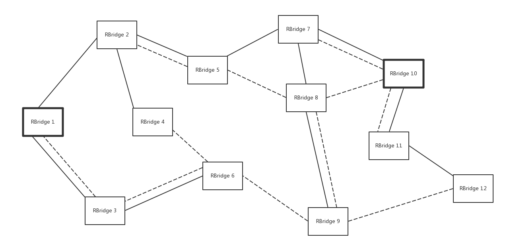

核心交换机之外，就是边界路由器了。至此从服务器到数据中心边界的层次情况已经清楚了。

在核心交换上面，往往会挂一些安全设备，例如入侵检测、DDoS 防护等等。这是整个数据中心的屏障，防止来自外来的攻击。核心交换机上往往还有负载均衡器，原理前面的章节已经说过了。

在有的数据中心里面，对于存储设备，还会有一个存储网络，用来连接 SAN 和 NAS。但是对于新的云计算来讲，往往不使用传统的 SAN 和 NAS，而使用部署在 x86 机器上的软件定义存储，这样存储也是服务器了，而且可以和计算节点融合在一个机架上，从而更加有效率，也就没有了单独的存储网络了。

于是整个数据中心的网络如下图所示。

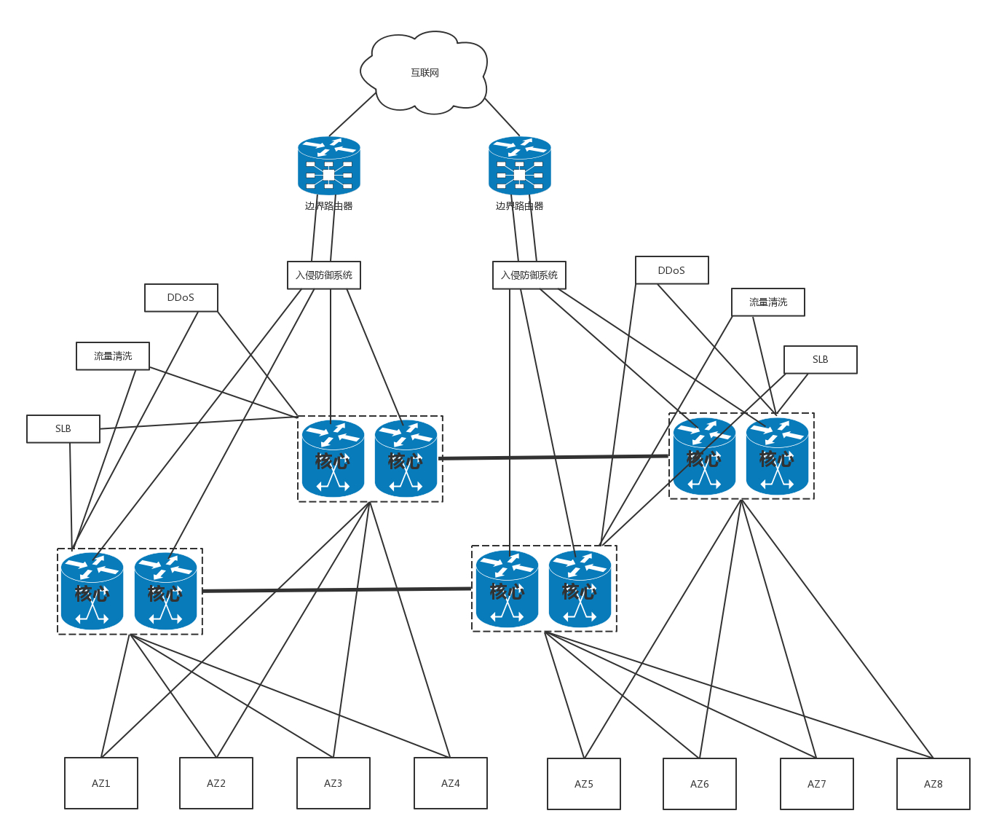

这是一个典型的三层网络结构。这里的三层不是指 IP 层，而是指接入层、汇聚层、核心层三层。这种模式非常有利于外部流量请求到内部应用。这个类型的流量，是从外到内或者从内到外，对应到上面那张图里，就是从上到下，从下到上，上北下南，所以称为**南北流量**。

但是随着云计算和大数据的发展，节点之间的交互越来越多，例如大数据计算经常要在不同的节点将数据拷贝来拷贝去，这样需要经过交换机，使得数据从左到右，从右到左，左西右东，所以称为**东西流量**。

为了解决东西流量的问题，演进出了**叶脊网络（Spine/Leaf）。**

- **叶子交换机（leaf）**，直接连接物理服务器。L2/L3 网络的分界点在叶子交换机上，叶子交换机之上是三层网络。
- **脊交换机（spine switch）**，相当于核心交换机。叶脊之间通过 ECMP 动态选择多条路径。脊交换机现在只是为叶子交换机提供一个弹性的 L3 路由网络。南北流量可以不用直接从脊交换机发出，而是通过与 leaf 交换机并行的交换机，再接到边界路由器出去。

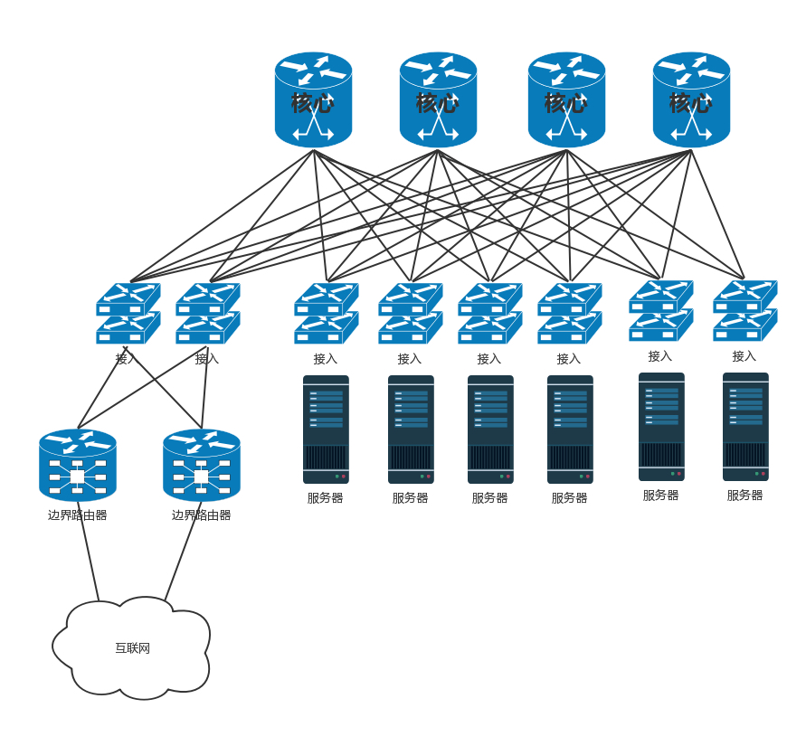

传统的三层网络架构是垂直的结构，而叶脊网络架构是扁平的结构，更易于水平扩展。

## 总结

- 数据中心分为三层。服务器连接到接入层，然后是汇聚层，再然后是核心层，最外面是边界路由器和安全设备。
- 数据中心的所有链路都需要高可用性。服务器需要绑定网卡，交换机需要堆叠，三层设备可以通过等价路由，二层设备可以通过 TRILL 协议。
- 随着云和大数据的发展，东西流量相对于南北流量越来越重要，因而演化为叶脊网络结构。

<h1 id="chapter22">VPN：朝中有人好做官</h1>

前面我们讲到了数据中心，里面很复杂，但是有的公司有多个数据中心，需要将多个数据中心连接起来，或者需要办公室和数据中心连接起来。这该怎么办呢？

- 第一种方式是走公网，但是公网太不安全，你的隐私可能会被别人偷窥。
- 第二种方式是租用专线的方式把它们连起来，这是土豪的做法，需要花很多钱。
- 第三种方式是用 VPN 来连接，这种方法比较折中，安全又不贵。

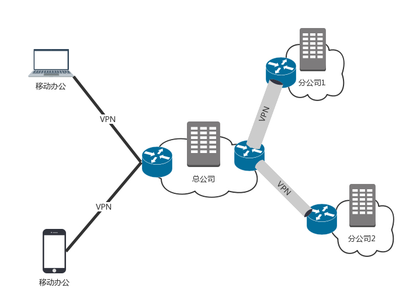

**VPN**，全名**Virtual Private Network，虚拟专用网**，就是利用开放的公众网络，建立专用数据传输通道，将远程的分支机构、移动办公人员等连接起来。

## VPN 是如何工作的？

VPN 通过隧道技术在公众网络上仿真一条点到点的专线，是通过利用一种协议来传输另外一种协议的技术，这里面涉及三种协议：**乘客协议**、**隧道协议**和**承载协议**。

我们以 IPsec 协议为例来说明。


你知道如何通过自驾进行海南游吗？这其中，你的车怎么通过琼州海峡呢？这里用到轮渡，其实这就用到**隧道协议**。

在广州这边开车是有“协议”的，例如靠右行驶、红灯停、绿灯行，这个就相当于“被封装”的**乘客协议**。当然在海南那面，开车也是同样的协议。这就相当于需要连接在一起的一个公司的两个分部。

但是在海上坐船航行，也有它的协议，例如要看灯塔、要按航道航行等。这就是外层的**承载协议**。

那我的车如何从广州到海南呢？这就需要你遵循开车的协议，将车开上轮渡，所有通过轮渡的车都关在船舱里面，按照既定的规则排列好，这就是**隧道协议**。

在大海上，你的车是关在船舱里面的，就像在隧道里面一样，这个时候内部的乘客协议，也即驾驶协议没啥用处，只需要船遵从外层的承载协议，到达海南就可以了。

到达之后，外部承载协议的任务就结束了，打开船舱，将车开出来，就相当于取下承载协议和隧道协议的头。接下来，在海南该怎么开车，就怎么开车，还是内部的乘客协议起作用。

在最前面的时候说了，直接使用公网太不安全，所以接下来我们来看一种十分安全的 VPN，**IPsec VPN**。这是基于 IP 协议的**安全隧道协议**，为了保证在公网上面信息的安全，因而采取了一定的机制保证安全性。

- 机制一：**私密性**，防止信息泄漏给未经授权的个人，通过加密把数据从明文变成无法读懂的密文，从而确保数据的私密性。

> 前面讲 HTTPS 的时候，说过加密可以分为对称加密和非对称加密。对称加密速度快一些。而 VPN 一旦建立，需要传输大量数据，因而我们采取对称加密。但是同样，对称加密还是存在加密秘钥如何传输的问题，这里需要用到因特网密钥交换（IKE，Internet Key Exchange）协议。

- 机制二：**完整性**，数据没有被非法篡改，通过对数据进行 hash 运算，产生类似于指纹的数据摘要，以保证数据的完整性。
- 机制三：**真实性**，数据确实是由特定的对端发出，通过身份认证可以保证数据的真实性。

那如何保证对方就是真正的那个人呢？

- 第一种方法就是**预共享密钥**，也就是双方事先商量好一个暗号，比如“天王盖地虎，宝塔镇河妖”，对上了，就说明是对的。
- 另外一种方法就是**用数字签名来验证**。咋签名呢？当然是使用私钥进行签名，私钥只有我自己有，所以如果对方能用我的数字证书里面的公钥解开，就说明我是我。

基于以上三个特性，组成了**IPsec VPN 的协议簇**。这个协议簇内容比较丰富。

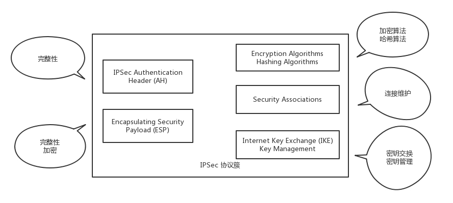

在这个协议簇里面，有两种协议，这两种协议的区别在于封装网络包的格式不一样。

- 一种协议称为**AH（Authentication Header）**，只能进行数据摘要 ，不能实现数据加密。
- 还有一种**ESP（Encapsulating Security Payload）**，能够进行数据加密和数据摘要。

在这个协议簇里面，还有两类算法，分别是**加密算法**和**摘要算法**。

这个协议簇还包含两大组件，一个用于 VPN 的双方要进行对称密钥的交换的**IKE 组件**，另一个是 VPN 的双方要对连接进行维护的**SA（Security Association）组件**。

## IPsec VPN 的建立过程

下面来看 IPsec VPN 的建立过程，这个过程分两个阶段。

**第一个阶段，建立 IKE 自己的 SA**。这个 SA 用来维护一个通过身份认证和安全保护的通道，为第二个阶段提供服务。在这个阶段，通过 DH（Diffie-Hellman）算法计算出一个对称密钥 K。

DH 算法是一个比较巧妙的算法。客户端和服务端约定两个公开的质数 p 和 q，然后客户端随机产生一个数 a 作为自己的私钥，服务端随机产生一个 b 作为自己的私钥，客户端可以根据 p、q 和 a 计算出公钥 A，服务端根据 p、q 和 b 计算出公钥 B，然后双方交换公钥 A 和 B。

到此客户端和服务端可以根据已有的信息，各自独立算出相同的结果 K，就是**对称密钥**。但是这个过程，对称密钥从来没有在通道上传输过，只传输了生成密钥的材料，通过这些材料，截获的人是无法算出的。

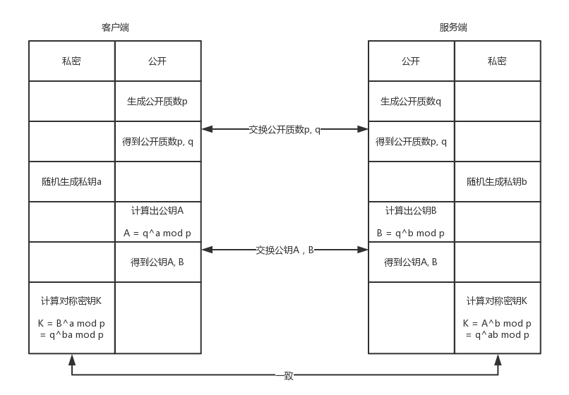

有了这个对称密钥 K，接下来是**第二个阶段，建立 IPsec SA**。在这个 SA 里面，双方会生成一个随机的对称密钥 M，由 K 加密传给对方，然后使用 M 进行双方接下来通信的数据。对称密钥 M 是有过期时间的，会过一段时间，重新生成一次，从而防止被破解。

IPsec SA 里面有以下内容：

- SPI（Security Parameter Index），用于标识不同的连接；
- 双方商量好的加密算法、哈希算法和封装模式；
- 生存周期，超过这个周期，就需要重新生成一个 IPsec SA，重新生成对称密钥。

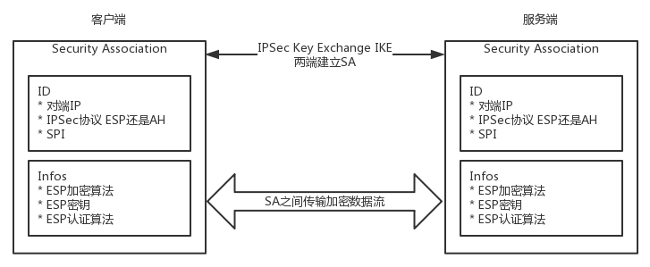

当 IPsec 建立好，接下来就可以开始打包封装传输了。

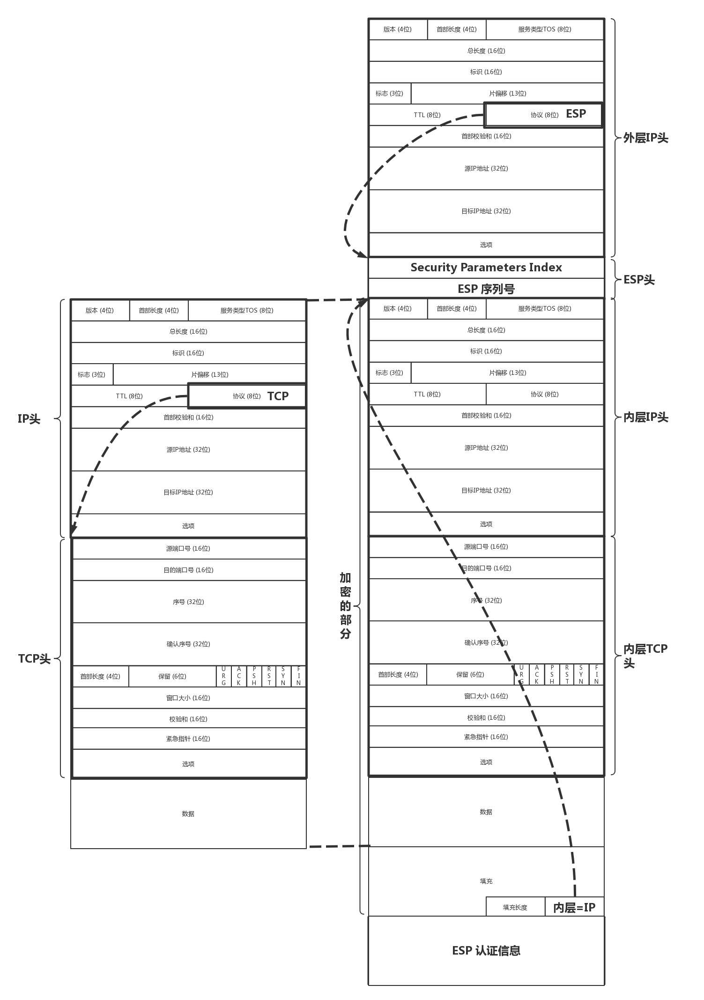

左面是原始的 IP 包，在 IP 头里面，会指定上一层的协议为 TCP。ESP 要对 IP 包进行封装，因而 IP 头里面的上一层协议为 ESP。在 ESP 的正文里面，ESP 的头部有双方商讨好的 SPI，以及这次传输的序列号。

接下来全部是加密的内容。可以通过对称密钥进行解密，解密后在正文的最后，指明了里面的协议是什么。如果是 IP，则需要先解析 IP 头，然后解析 TCP 头，这是从隧道出来后解封装的过程。

有了 IPsec VPN 之后，客户端发送的明文的 IP 包，都会被加上 ESP 头和 IP 头，在公网上传输，由于加密，可以保证不被窃取，到了对端后，去掉 ESP 的头，进行解密。

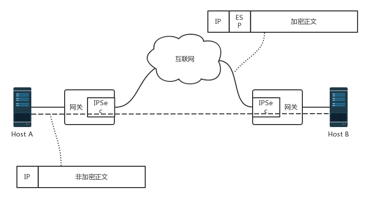

这种点对点的基于 IP 的 VPN，能满足互通的要求，但是速度往往比较慢，这是由底层 IP 协议的特性决定的。IP 不是面向连接的，是尽力而为的协议，每个 IP 包自由选择路径，到每一个路由器，都自己去找下一跳，丢了就丢了，是靠上一层 TCP 的重发来保证可靠性。

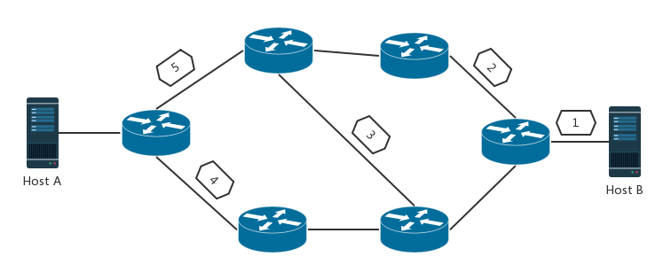

因为 IP 网络从设计的时候，就认为是不可靠的，所以即使同一个连接，也可能选择不同的道路，这样的好处是，一条道路崩溃的时候，总有其他的路可以走。当然，带来的代价就是，不断的路由查找，效率比较差。

和 IP 对应的另一种技术称为 ATM。这种协议和 IP 协议的不同在于，它是面向连接的。你可以说 TCP 也是面向连接的啊。这两个不同，ATM 和 IP 是一个层次的，和 TCP 不是一个层次的。

另外，TCP 所谓的面向连接，是不停地重试来保证成功，其实下层的 IP 还是不面向连接的，丢了就丢了。ATM 是传输之前先建立一个连接，形成一个虚拟的通路，一旦连接建立了，所有的包都按照相同的路径走，不会分头行事。

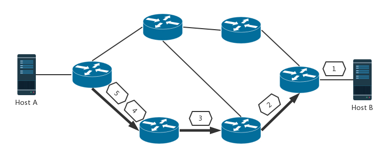

好处是不需要每次都查路由表的，虚拟路径已经建立，打上了标签，后续的包傻傻的跟着走就是了，不用像 IP 包一样，每个包都思考下一步怎么走，都按相同的路径走，这样效率会高很多。

但是一旦虚拟路径上的某个路由器坏了，则这个连接就断了，什么也发不过去了，因为其他的包还会按照原来的路径走，都掉坑里了，它们不会选择其他的路径走。

ATM 技术虽然没有成功，但其屏弃了繁琐的路由查找，改为简单快速的标签交换，将具有全局意义的路由表改为只有本地意义的标签表，这些都可以大大提高一台路由器的转发功力。

有没有一种方式将两者的优点结合起来呢？这就是**多协议标签交换（MPLS，Multi-Protocol Label Switching）**。MPLS 的格式如图所示，在原始的 IP 头之外，多了 MPLS 的头，里面可以打标签。

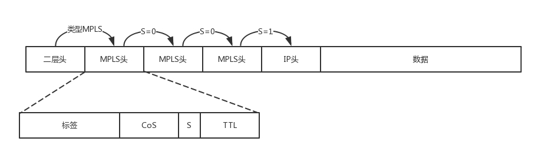

在二层头里面，有类型字段，0x0800 表示 IP，0x8847 表示 MPLS Label。

在 MPLS 头里面，首先是标签值占 20 位，接着是 3 位实验位，再接下来是 1 位栈底标志位，表示当前标签是否位于栈底了。这样就允许多个标签被编码到同一个数据包中，形成标签栈。最后是 8 位 TTL 存活时间字段，如果标签数据包的出发 TTL 值为 0，那么该数据包在网络中的生命期被认为已经过期了。

有了标签，还需要设备认这个标签，并且能够根据这个标签转发，这种能够转发标签的路由器称为**标签交换路由器**（LSR，Label Switching Router）。

这种路由器会有两个表格，一个就是传统的 FIB，也即路由表，另一个就是 LFIB，标签转发表。有了这两个表，既可以进行普通的路由转发，也可以进行基于标签的转发。

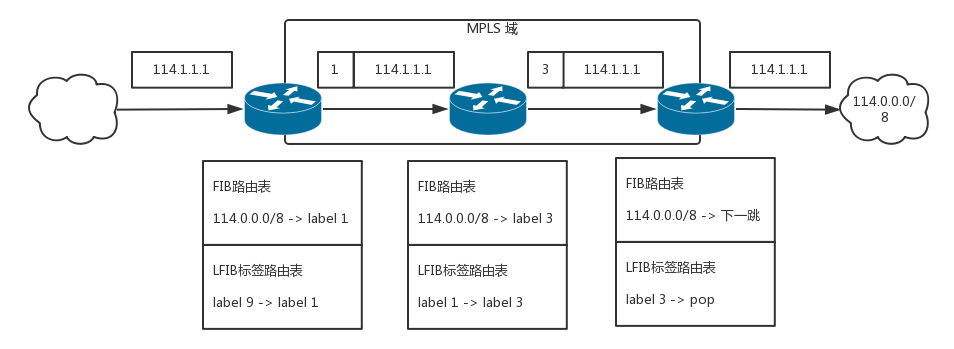

有了标签转发表，转发的过程如图所示，就不用每次都进行普通路由的查找了。

这里我们区分 MPLS 区域和非 MPLS 区域。在 MPLS 区域中间，使用标签进行转发，非 MPLS 区域，使用普通路由转发，在边缘节点上，需要有能力将对于普通路由的转发，变成对于标签的转发。

例如图中要访问 114.1.1.1，在边界上查找普通路由，发现马上要进入 MPLS 区域了，进去了对应标签 1，于是在 IP 头外面加一个标签 1，在区域里面，标签 1 要变成标签 3，标签 3 到达出口边缘，将标签去掉，按照路由发出。

这样一个通过标签转换而建立的路径称为 LSP，标签交换路径。在一条 LSP 上，沿数据包传送的方向，相邻的 LSR 分别叫**上游 LSR（upstream LSR）**和**下游 LSR（downstream LSR）**。

有了标签，转发是很简单的事，但是如何生成标签，却是 MPLS 中最难修炼的部分。在 MPLS 秘笈中，这部分被称为**LDP（Label Distribution Protocol）**，是一个动态的生成标签的协议。

其实 LDP 与 IP 帮派中的路由协议十分相像，通过 LSR 的交互，互相告知去哪里应该打哪个标签，称为标签分发，往往是从下游开始的。

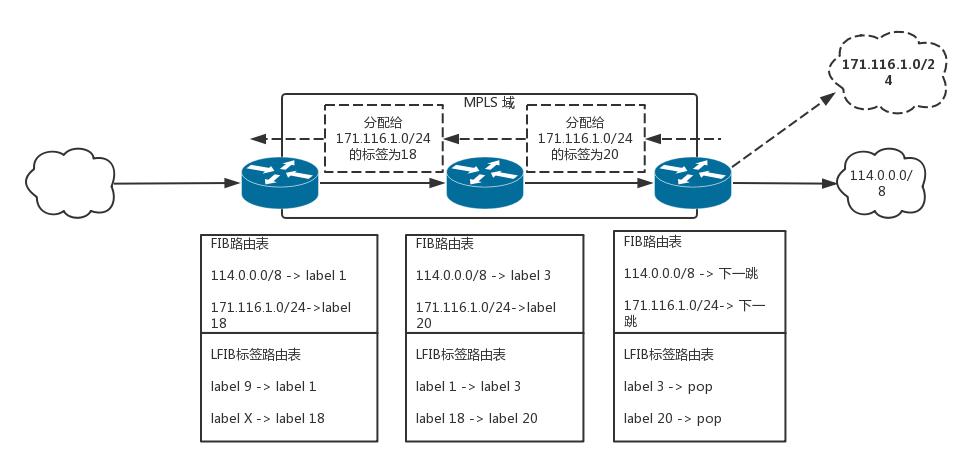

如果有一个边缘节点发现自己的路由表中出现了新的目的地址，它就要给别人说，我能到达一条新的路径了。

如果此边缘节点存在上游 LSR，并且尚有可供分配的标签，则该节点为新的路径分配标签，并向上游发出标签映射消息，其中包含分配的标签等信息。

收到标签映射消息的 LSR 记录相应的标签映射信息，在其标签转发表中增加相应的条目。此 LSR 为它的上游 LSR 分配标签，并继续向上游 LSR 发送标签映射消息。

当入口 LSR 收到标签映射消息时，在标签转发表中增加相应的条目。这时，就完成了 LSP 的建立。有了标签，转发轻松多了，但是这个和 VPN 什么关系呢？

可以想象，如果我们 VPN 通道里面包的转发，都是通过标签的方式进行，效率就会高很多。所以要想个办法把 MPLS 应用于 VPN。

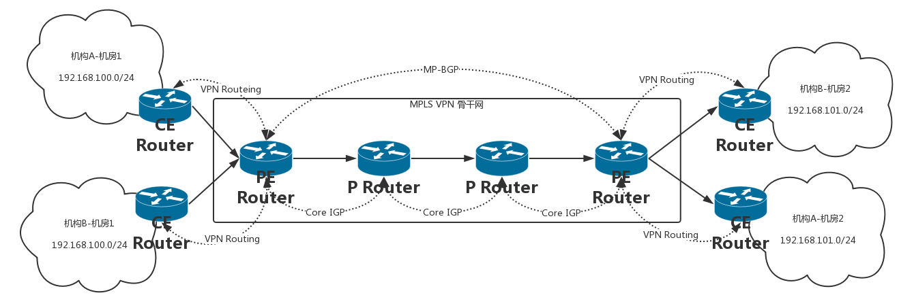

在 MPLS VPN 中，网络中的路由器分成以下几类：

- PE（Provider Edge）：运营商网络与客户网络相连的边缘网络设备；
- CE（Customer Edge）：客户网络与 PE 相连接的边缘设备；
- P（Provider）：这里特指运营商网络中除 PE 之外的其他运营商网络设备。

为什么要这样分呢？因为我们发现，在运营商网络里面，也即 P Router 之间，使用标签是没有问题的，因为都在运营商的管控之下，对于网段，路由都可以自己控制。但是一旦客户要接入这个网络，就复杂得多。

首先是客户地址重复的问题。客户所使用的大多数都是私网的地址 (192.168.X.X;10.X.X.X;172.X.X.X)，而且很多情况下都会与其它的客户重复。

比如，机构 A 和机构 B 都使用了 192.168.101.0/24 网段的地址，这就发生了地址空间重叠（Overlapping Address Spaces）。

首先困惑的是 BGP 协议，既然 VPN 将两个数据中心连起来，应该看起来像一个数据中心一样，那么如何到达另一端需要通过 BGP 将路由广播过去，传统 BGP 无法正确处理地址空间重叠的 VPN 的路由。

假设机构 A 和机构 B 都使用了 192.168.101.0/24 网段的地址，并各自发布了一条去往此网段的路由，BGP 将只会选择其中一条路由，从而导致去往另一个 VPN 的路由丢失。

所以 PE 路由器之间使用特殊的 MP-BGP 来发布 VPN 路由，在相互沟通的消息中，在一般 32 位 IPv4 的地址之前加上一个客户标示的区分符用于客户地址的区分，这种称为 VPN-IPv4 地址族，这样 PE 路由器会收到如下的消息，机构 A 的 192.168.101.0/24 应该往这面走，机构 B 的 192.168.101.0/24 则应该去另外一个方向。

另外困惑的是**路由表**，当两个客户的 IP 包到达 PE 的时候，PE 就困惑了，因为网段是重复的。

如何区分哪些路由是属于哪些客户 VPN 内的？如何保证 VPN 业务路由与普通路由不相互干扰？

在 PE 上，可以通过 VRF（VPN Routing&Forwarding Instance）建立每个客户一个路由表，与其它 VPN 客户路由和普通路由相互区分。可以理解为专属于客户的小路由器。

远端 PE 通过 MP-BGP 协议把业务路由放到近端 PE，近端 PE 根据不同的客户选择出相关客户的业务路由放到相应的 VRF 路由表中。

VPN 报文转发采用两层标签方式：

- 第一层（外层）标签在骨干网内部进行交换，指示从 PE 到对端 PE 的一条 LSP。VPN 报文利用这层标签，可以沿 LSP 到达对端 PE；
- 第二层（内层）标签在从对端 PE 到达 CE 时使用，在 PE 上，通过查找 VRF 表项，指示报文应被送到哪个 VPN 用户，或者更具体一些，到达哪一个 CE。这样，对端 PE 根据内层标签可以找到转发报文的接口。

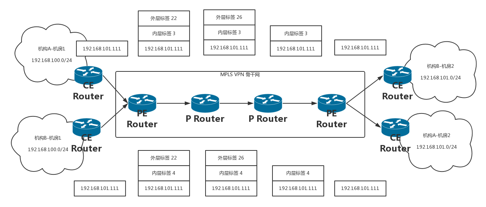

我们来举一个例子，看 MPLS VPN 的包发送过程。

1. 机构 A 和机构 B 都发出一个目的地址为 192.168.101.0/24 的 IP 报文，分别由各自的 CE 将报文发送至 PE。
2. PE 会根据报文到达的接口及目的地址查找 VPN 实例表项 VRF，匹配后将报文转发出去，同时打上内层和外层两个标签。假设通过 MP-BGP 配置的路由，两个报文在骨干网走相同的路径。
3. MPLS 网络利用报文的外层标签，将报文传送到出口 PE，报文在到达出口 PE 2 前一跳时已经被剥离外层标签，仅含内层标签。
4. 出口 PE 根据内层标签和目的地址查找 VPN 实例表项 VRF，确定报文的出接口，将报文转发至各自的 CE。
5. CE 根据正常的 IP 转发过程将报文传送到目的地。

## 总结

- VPN 可以将一个机构的多个数据中心通过隧道的方式连接起来，让机构感觉在一个数据中心里面，就像自驾游通过琼州海峡一样；
- 完全基于软件的 IPsec VPN 可以保证私密性、完整性、真实性、简单便宜，但是性能稍微差一些；
- MPLS-VPN 综合和 IP 转发模式和 ATM 的标签转发模式的优势，性能较好，但是需要从运营商购买。

