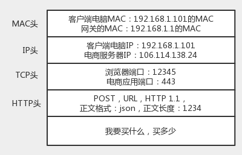

# 趣谈网络协议

- [为什么要学习网络协议？](#chapter1)
- [网络分层的真实含义是什么？](#chapter2)
- [ifconfig：最熟悉又陌生的命令行](#chapter3)
- [DHCP 与 PXE：IP 是怎么来的，又是怎么没的？](#chapter4)
- [从物理层到 MAC 层：如何在宿舍里自己组网玩联机游戏？](#chapter5)
- [交换机与 VLAN：办公室太复杂，我要回学校](#chapter6)
- [ICMP 与 ping：投石问路的侦察兵](#chapter7)
- [世界这么大，我想出网关：欧洲十国游与玄奘西行](#chapter8)
- [路由协议：西出网关无故人，敢问路在何方](#chapter9)
- [UDP协议：因性善而简单，难免碰到“城会玩”](#chapter10)
- 

<h1 id="chapter1">为什么要学习网络协议？</h1>

当 "Hello World!" 从显示器打印出来的时候，还记得你激动的心情吗？

```java
public class HelloWorld {
  public static void main(String[] args){
    System.out.println("Hello World!");
  }
}
```

如果你是程序员，一定看得懂上面这一段文字。这是每一个程序员向计算机世界说“你好，世界”的方式。但是，你不一定知道，这段文字也是一种协议，是人类和计算机沟通的协议，**只有通过这种协议，计算机才知道我们想让它做什么。**

## 协议三要素

当然，这种协议还是更接近人类语言，机器不能直接读懂，需要进行翻译，翻译的工作教给编译器，也就是程序员常说的 compile。这个过程比较复杂，其中的编译原理非常复杂，我在这里不进行详述。

但是可以看得出，计算机语言作为程序员控制一台计算机工作的协议，具备了协议的三要素。

- **语法**，就是这一段内容要符合一定的规则和格式。例如，括号要成对，结束要使用分号等。
- **语义**，就是这一段内容要代表某种意义。例如数字减去数字是有意义的，数字减去文本一般来说就没有意义。
- **顺序**，就是先干啥，后干啥。例如，可以先加上某个数值，然后再减去某个数值。

会了计算机语言，你就能够教给一台计算机完成你的工作了。恭喜你，入门了！

但是，要想打造互联网世界的通天塔，只教给一台机器做什么是不够的，你需要学会教给一大片机器做什么。这就需要网络协议。**只有通过网络协议，才能使一大片机器互相协作、共同完成一件事。**

当你想要买一个商品，常规的做法就是打开浏览器，输入购物网站的地址。浏览器就会给你显示一个缤纷多彩的页面。

那你有没有深入思考过，浏览器是如何做到这件事情的？它之所以能够显示缤纷多彩的页面，是因为它收到了一段来自 HTTP 协议的“东西”。我拿网易考拉来举例，格式就像下面这样：

```java
HTTP/1.1 200 OK
Date: Tue, 27 Mar 2018 16:50:26 GMT
Content-Type: text/html;charset=UTF-8
Content-Language: zh-CN

<!DOCTYPE html>
<html>
<head>
<base href="https://pages.kaola.com/" />
<meta charset="utf-8"/> <title> 网易考拉 3 周年主会场 </title>
```

首先，符合语法，也就是说，只有按照上面那个格式来，浏览器才认。例如，上来是**状态**，然后是**首部**，然后是**内容**。

第二，符合语义，就是要按照约定的意思来。例如，状态 200，表述的意思是网页成功返回。如果不成功，就是我们常见的“404”。

第三，符合顺序，你一点浏览器，就是发送出一个 HTTP 请求，然后才有上面那一串 HTTP 返回的东西。

## 我们常用的网络协议有哪些？

在经济学领域，有个伦纳德·里德（Leonard E. Read）创作的《铅笔的故事》。这个故事通过一个铅笔的诞生过程，来讲述复杂的经济学理论。这里，我也用一个下单的过程，看看互联网世界的运行过程中，都使用了哪些网络协议。

你先在浏览器里面输入 <a href="https://www.kaola.com">https://www.kaola.com</a> ，这是一个<strong>URL</strong>。浏览器只知道名字是“www.kaola.com”，但是不知道具体的地点，所以不知道应该如何访问。于是，它打开地址簿去查找。可以使用一般的地址簿协议<strong>DNS</strong>去查找，还可以使用另一种更加精准的地址簿查找协议<strong>HTTPDNS</strong>。

无论用哪一种方法查找，最终都会得到这个地址：106.114.138.24。这个是**IP**地址，是互联网世界的“门牌号”。

知道了目标地址，浏览器就开始打包它的请求。对于普通的浏览请求，往往会使用**HTTP**协议；但是对于购物的请求，往往需要进行加密传输，因而会使用**HTTPS**协议。无论是什么协议，里面都会写明“你要买什么和买多少”。

DNS、HTTP、HTTPS 所在的层我们称为**应用层**。经过应用层封装后，浏览器会将应用层的包交给下一层去完成，通过 socket 编程来实现。下一层是**传输层**。传输层有两种协议，一种是无连接的协议**UDP**，一种是面向连接的协议**TCP**。对于支付来讲，往往使用 TCP 协议。所谓的面向连接就是，TCP 会保证这个包能够到达目的地。如果不能到达，就会重新发送，直至到达。

TCP 协议里面会有两个端口，一个是浏览器监听的端口，一个是电商的服务器监听的端口。操作系统往往通过端口来判断，它得到的包应该给哪个进程。


传输层封装完毕后，浏览器会将包交给操作系统的**网络层**。网络层的协议是 IP 协议。在 IP 协议里面会有源 IP 地址，即浏览器所在机器的 IP 地址和目标 IP 地址，也即电商网站所在服务器的 IP 地址。


操作系统既然知道了目标 IP 地址，就开始想如何根据这个门牌号找到目标机器。操作系统往往会判断，这个目标 IP 地址是本地人，还是外地人。如果是本地人，从门牌号就能看出来，但是显然电商网站不在本地，而在遥远的地方。

操作系统知道要离开本地去远方。虽然不知道远方在何处，但是可以这样类比一下：如果去国外要去海关，去外地就要去**网关**。而操作系统启动的时候，就会被 DHCP 协议配置 IP 地址，以及默认的网关的 IP 地址 192.168.1.1。

操作系统如何将 IP 地址发给网关呢？在本地通信基本靠吼，于是操作系统大吼一声，谁是 192.168.1.1 啊？网关会回答它，我就是，我的本地地址在村东头。这个本地地址就是**MAC**地址，而大吼的那一声是**ARP**协议。



于是操作系统将 IP 包交给了下一层，也就是**MAC 层**。网卡再将包发出去。由于这个包里面是有 MAC 地址的，因而它能够到达网关。

网关收到包之后，会根据自己的知识，判断下一步应该怎么走。网关往往是一个路由器，到某个 IP 地址应该怎么走，这个叫作路由表。

路由器有点像玄奘西行路过的一个个国家的一个个城关。每个城关都连着两个国家，每个国家相当于一个局域网，在每个国家内部，都可以使用本地的地址 MAC 进行通信。

一旦跨越城关，就需要拿出 IP 头来，里面写着贫僧来自东土大唐（就是源 IP 地址），欲往西天拜佛求经（指的是目标 IP 地址）。路过宝地，借宿一晚，明日启行，请问接下来该怎么走啊？

城关往往是知道这些“知识”的，因为城关和临近的城关也会经常沟通。到哪里应该怎么走，这种沟通的协议称为**路由协议**，常用的有**OSPF**和**BGP**。

城关与城关之间是一个国家，当网络包知道了下一步去哪个城关，还是要使用国家内部的 MAC 地址，通过下一个城关的 MAC 地址，找到下一个城关，然后再问下一步的路怎么走，一直到走出最后一个城关。

最后一个城关知道这个网络包要去的地方。于是，对着这个国家吼一声，谁是目标 IP 啊？目标服务器就会回复一个 MAC 地址。网络包过关后，通过这个 MAC 地址就能找到目标服务器。

目标服务器发现 MAC 地址对上了，取下 MAC 头来，发送给操作系统的网络层。发现 IP 也对上了，就取下 IP 头。IP 头里会写上一层封装的是 TCP 协议，然后将其交给传输层，即**TCP 层**。

在这一层里，对于收到的每个包，都会有一个回复的包说明收到了。这个回复的包绝非这次下单请求的结果，例如购物是否成功，扣了多少钱等，而仅仅是 TCP 层的一个说明，即收到之后的回复。当然这个回复，会沿着刚才来的方向走回去，报个平安。

如果过一段时间还是没到，发送端的 TCP 层会重新发送这个包，还是上面的过程，直到有一天收到平安到达的回复。**这个重试绝非你的浏览器重新将下单这个动作重新请求一次**。对于浏览器来讲，就发送了一次下单请求，TCP 层不断自己闷头重试。除非 TCP 这一层出了问题，例如连接断了，才轮到浏览器的应用层重新发送下单请求。

当网络包平安到达 TCP 层之后，TCP 头中有目标端口号，通过这个端口号，可以找到电商网站的进程正在监听这个端口号，假设一个 Tomcat，将这个包发给电商网站。


电商网站的进程得到 HTTP 请求的内容，知道了要买东西，买多少。往往一个电商网站最初接待请求的这个 Tomcat 只是个接待员，负责统筹处理这个请求，而不是所有的事情都自己做。例如，这个接待员要告诉专门管理订单的进程，登记要买某个商品，买多少，要告诉管理库存的进程，库存要减少多少，要告诉支付的进程，应该付多少钱，等等。

如何告诉相关的进程呢？往往通过 RPC 调用，即远程过程调用的方式来实现。远程过程调用就是当告诉管理订单进程的时候，接待员不用关心中间的网络互连问题，会由 RPC 框架统一处理。RPC 框架有很多种，有基于 HTTP 协议放在 HTTP 的报文里面的，有直接封装在 TCP 报文里面的。

当接待员发现相应的部门都处理完毕，就回复一个 HTTPS 的包，告知下单成功。这个 HTTPS 的包，会像来的时候一样，经过千难万险到达你的个人电脑，最终进入浏览器，显示支付成功。

<h1 id="chapter2">网络分层的真实含义是什么？</h1>

教科书或者老师往往会打一个十分不恰当的比喻：为什么网络要分层呀？因为不同的层次之间有不同的沟通方式，这个叫作协议。例如，一家公司也是分“层次”的，分总经理、经理、组长、员工。总经理之间有他们的沟通方式，经理和经理之间也有沟通方式，同理组长和员工。有没有听过类似的比喻？

那么**第一个问题**来了。请问经理在握手的时候，员工在干什么？很多人听过 TCP 建立连接的**三次握手协议**，也会把它当知识点背诵。同理问你，TCP 在进行三次握手的时候，IP 层和 MAC 层对应都有什么操作呢？

除了上面这个不恰当的比喻，教科书还会列出每个层次所包含的协议，然后开始逐层地去讲这些协议。但是这些协议之间的关系呢？却很少有教科书会讲。

学习第三层的时候会提到，IP 协议里面包含**目标地址**和**源地址。**第三层里往往还会学习**路由协议**。路由就像中转站，我们从原始地址 A 到目标地址 D，中间经过两个中转站 A->B->C->D，是通过路由转发的。

那么**第二个问题**来了。A 知道自己的下一个中转站是 B，那从 A 发出来的包，应该把 B 的 IP 地址放在哪里呢？B 知道自己的下一个中转站是 C，从 B 发出来的包，应该把 C 的 IP 地址放在哪里呢？如果放在 IP 协议中的目标地址，那包到了中转站，怎么知道最终的目的地址是 D 呢？

**再问你一个问题**。你一定经常听说二层设备、三层设备。二层设备处理的通常是 MAC 层的东西。那我发送一个 HTTP 的包，是在第七层工作的，那是不是不需要经过二层设备？或者即便经过了，二层设备也不处理呢？或者换一种问法，二层设备处理的包里，有没有 HTTP 层的内容呢？

最终，我想问你**一个综合的问题**。从你的电脑，通过 SSH 登录到公有云主机里面，都需要经历哪些过程？或者说你打开一个电商网站，都需要经历哪些过程？说得越详细越好。

## 网络为什么要分层？

这里我们先探讨第一个问题，网络为什么要分层？因为，是个复杂的程序都要分层。

理解计算机网络中的概念，一个很好的角度是，想象网络包就是一段 Buffer，或者一块内存，是有格式的。同时，想象自己是一个处理网络包的程序，而且这个程序可以跑在电脑上，可以跑在服务器上，可以跑在交换机上，也可以跑在路由器上。你想象自己有很多的网口，从某个口拿进一个网络包来，用自己的程序处理一下，再从另一个网口发送出去。

当然网络包的格式很复杂，这个程序也很复杂。**复杂的程序都要分层，这是程序设计的要求。**比如，复杂的电商还会分数据库层、缓存层、Compose 层、Controller 层和接入层，每一层专注做本层的事情。

## 程序是如何工作的？


当一个网络包从一个网口经过的时候，你看到了，首先先看看要不要请进来，处理一把。有的网口配置了混杂模式，凡是经过的，全部拿进来。

拿进来以后，就要交给一段程序来处理。于是，你调用**process_layer2(buffer)**。当然，这是一个假的函数。但是你明白其中的意思，知道肯定是有这么个函数的。那这个函数是干什么的呢？从 Buffer 中，摘掉二层的头，看一看，应该根据头里面的内容做什么操作。

假设你发现这个包的 MAC 地址和你的相符，那说明就是发给你的，于是需要调用**process_layer3(buffer)**。这个时候，Buffer 里面往往就没有二层的头了，因为已经在上一个函数的处理过程中拿掉了，或者将开始的偏移量移动了一下。在这个函数里面，摘掉三层的头，看看到底是发送给自己的，还是希望自己转发出去的。

如何判断呢？如果 IP 地址不是自己的，那就应该转发出去；如果 IP 地址是自己的，那就是发给自己的。根据 IP 头里面的标示，拿掉三层的头，进行下一层的处理，到底是调用 process_tcp(buffer) 呢，还是调用 process_udp(buffer) 呢？

假设这个地址是 TCP 的，则会调用**process_tcp(buffer)**。这时候，Buffer 里面没有三层的头，就需要查看四层的头，看这是一个发起，还是一个应答，又或者是一个正常的数据包，然后分别由不同的逻辑进行处理。如果是发起或者应答，接下来可能要发送一个回复包；如果是一个正常的数据包，就需要交给上层了。交给谁呢？是不是有 process_http(buffer) 函数呢？

没有的，如果你是一个网络包处理程序，你不需要有 process_http(buffer)，而是应该交给应用去处理。交给哪个应用呢？在四层的头里面有端口号，不同的应用监听不同的端口号。如果发现浏览器应用在监听这个端口，那你发给浏览器就行了。至于浏览器怎么处理，和你没有关系。

浏览器自然是解析 HTML，显示出页面来。电脑的主人看到页面很开心，就点了鼠标。点击鼠标的动作被浏览器捕获。浏览器知道，又要发起另一个 HTTP 请求了，于是使用端口号，将请求发给了你。

你应该调用**send_tcp(buffer)**。不用说，Buffer 里面就是 HTTP 请求的内容。这个函数里面加一个 TCP 的头，记录下源端口号。浏览器会给你目的端口号，一般为 80 端口。

然后调用**send_layer3(buffer)**。Buffer 里面已经有了 HTTP 的头和内容，以及 TCP 的头。在这个函数里面加一个 IP 的头，记录下源 IP 的地址和目标 IP 的地址。

然后调用**send_layer2(buffer)**。Buffer 里面已经有了 HTTP 的头和内容、TCP 的头，以及 IP 的头。这个函数里面要加一下 MAC 的头，记录下源 MAC 地址，得到的就是本机器的 MAC 地址和目标的 MAC 地址。不过，这个还要看当前知道不知道，知道就直接加上；不知道的话，就要通过一定的协议处理过程，找到 MAC 地址。反正要填一个，不能空着。

万事俱备，只要 Buffer 里面的内容完整，就可以从网口发出去了，你作为一个程序的任务就算告一段落了。

## 揭秘层与层之间的关系

**只要是在网络上跑的包，都是完整的。可以有下层没上层，绝对不可能有上层没下层。**

所以，**对 TCP 协议来说，三次握手也好，重试也好，只要想发出去包，就要有 IP 层和 MAC 层，不然是发不出去的。**

经常有人会问这样一个问题，我都知道那台机器的 IP 地址了，直接发给他消息呗，要 MAC 地址干啥？这里的关键就是，没有 MAC 地址消息是发不出去的。

所以如果一个 HTTP 协议的包跑在网络上，它一定是完整的。无论这个包经过哪些设备，它都是完整的。

所谓的二层设备、三层设备，都是这些设备上跑的程序不同而已。一个 HTTP 协议的包经过一个二层设备，二层设备收进去的是整个网络包。这里面 HTTP、TCP、 IP、 MAC 都有。什么叫二层设备呀，就是只把 MAC 头摘下来，看看到底是丢弃、转发，还是自己留着。那什么叫三层设备呢？就是把 MAC 头摘下来之后，再把 IP 头摘下来，看看到底是丢弃、转发，还是自己留着。

## 总结

总结一下今天的内容，理解网络协议的工作模式，有两个小窍门：

- 始终想象自己是一个处理网络包的程序：如何拿到网络包，如何根据规则进行处理，如何发出去；
- 始终牢记一个原则：只要是在网络上跑的包，都是完整的。可以有下层没上层，绝对不可能有上层没下层。

<h1 id="chapter3">ifconfig：最熟悉又陌生的命令行</h1>

即便没有专业学过计算机的人，只要倒腾过电脑，重装过系统，大多也会知道这个问题的答案：在 Windows 上是 ipconfig，在 Linux 上是 ifconfig。

那你知道在 Linux 上还有什么其他命令可以查看 IP 地址吗？答案是 ip addr。如果回答不上来这个问题，那你可能没怎么用过 Linux。

那你知道 ifconfig 和 ip addr 的区别吗？这是一个有关 net-tools 和 iproute2 的“历史”故事，你刚来到第三节，暂时不用了解这么细，但这也是一个常考的知识点。

想象一下，你登录进入一个被裁剪过的非常小的 Linux 系统中，发现既没有 ifconfig 命令，也没有 ip addr 命令，你是不是感觉这个系统压根儿没法用？这个时候，你可以自行安装 net-tools 和 iproute2 这两个工具。当然，大多数时候这两个命令是系统自带的。

安装好后，我们来运行一下 ip addr。不出意外，应该会输出下面的内容。

```shell
root@test:~# ip addr
1: lo: <LOOPBACK,UP,LOWER_UP> mtu 65536 qdisc noqueue state UNKNOWN group default
    link/loopback 00:00:00:00:00:00 brd 00:00:00:00:00:00
    inet 127.0.0.1/8 scope host lo
       valid_lft forever preferred_lft forever
    inet6 ::1/128 scope host
       valid_lft forever preferred_lft forever
2: eth0: <BROADCAST,MULTICAST,UP,LOWER_UP> mtu 1500 qdisc pfifo_fast state UP group default qlen 1000
    link/ether fa:16:3e:c7:79:75 brd ff:ff:ff:ff:ff:ff
    inet 10.100.122.2/24 brd 10.100.122.255 scope global eth0
       valid_lft forever preferred_lft forever
    inet6 fe80::f816:3eff:fec7:7975/64 scope link
       valid_lft forever preferred_lft forever
```

这个命令显示了这台机器上所有的网卡。大部分的网卡都会有一个 IP 地址，当然，这不是必须的。在后面的分享中，我们会遇到没有 IP 地址的情况。

<span class="orange">IP 地址是一个网卡在网络世界的通讯地址，相当于我们现实世界的门牌号码。</span>既然是门牌号码，不能大家都一样，不然就会起冲突。比方说，假如大家都叫六单元 1001 号，那快递就找不到地方了。所以，有时候咱们的电脑弹出网络地址冲突，出现上不去网的情况，多半是 IP 地址冲突了。

如上输出的结果，10.100.122.2 就是一个 IP 地址。这个地址被点分隔为四个部分，每个部分 8 个 bit，所以 IP 地址总共是 32 位。这样产生的 IP 地址的数量很快就不够用了。因为当时设计 IP 地址的时候，哪知道今天会有这么多的计算机啊！因为不够用，于是就有了 IPv6，也就是上面输出结果里面 inet6 fe80::f816:3eff:fec7:7975/64。这个有 128 位，现在看来是够了，但是未来的事情谁知道呢？

本来 32 位的 IP 地址就不够，还被分成了 5 类。现在想想，当时分配地址的时候，真是太奢侈了。


在网络地址中，至少在当时设计的时候，对于 A、B、 C 类主要分两部分，前面一部分是网络号，后面一部分是主机号。这很好理解，大家都是六单元 1001 号，我是小区 A 的六单元 1001 号，而你是小区 B 的六单元 1001 号。

下面这个表格，详细地展示了 A、B、C 三类地址所能包含的主机的数量。在后文中，我也会多次借助这个表格来讲解。


这里面有个尴尬的事情，就是 C 类地址能包含的最大主机数量实在太少了，只有 254 个。当时设计的时候恐怕没想到，现在估计一个网吧都不够用吧。而 B 类地址能包含的最大主机数量又太多了。6 万多台机器放在一个网络下面，一般的企业基本达不到这个规模，闲着的地址就是浪费。

## 无类型域间选路（CIDR）

于是有了一个折中的方式叫作**无类型域间选路**，简称**CIDR**。这种方式打破了原来设计的几类地址的做法，将 32 位的 IP 地址一分为二，前面是**网络号**，后面是**主机号**。从哪里分呢？你如果注意观察的话可以看到，10.100.122.2/24，这个 IP 地址中有一个斜杠，斜杠后面有个数字 24。这种地址表示形式，就是 CIDR。后面 24 的意思是，32 位中，前 24 位是网络号，后 8 位是主机号。

伴随着 CIDR 存在的，一个是**广播地址**，10.100.122.255。如果发送这个地址，所有 10.100.122 网络里面的机器都可以收到。另一个是**子网掩码**，255.255.255.0。

将子网掩码和 IP 地址进行 AND 计算。前面三个 255，转成二进制都是 1。1 和任何数值取 AND，都是原来数值，因而前三个数不变，为 10.100.122。后面一个 0，转换成二进制是 0，0 和任何数值取 AND，都是 0，因而最后一个数变为 0，合起来就是 10.100.122.0。这就是**网络号**。**将子网掩码和 IP 地址按位计算 AND，就可得到网络号。**

## 公有 IP 地址和私有 IP 地址

在日常的工作中，几乎不用划分 A 类、B 类或者 C 类，所以时间长了，很多人就忘记了这个分类，而只记得 CIDR。但是有一点还是要注意的，就是公有 IP 地址和私有 IP 地址。


我们继续看上面的表格。表格最右列是私有 IP 地址段。平时我们看到的数据中心里，办公室、家里或学校的 IP 地址，一般都是私有 IP 地址段。因为这些地址允许组织内部的 IT 人员自己管理、自己分配，而且可以重复。因此，你学校的某个私有 IP 地址段和我学校的可以是一样的。

公有 IP 地址有个组织统一分配，你需要去买。如果你搭建一个网站，给你学校的人使用，让你们学校的 IT 人员给你一个 IP 地址就行。但是假如你要做一个类似网易 163 这样的网站，就需要有公有 IP 地址，这样全世界的人才能访问。

表格中的 192.168.0.x 是最常用的私有 IP 地址。你家里有 Wi-Fi，对应就会有一个 IP 地址。一般你家里地上网设备不会超过 256 个，所以 /24 基本就够了。有时候我们也能见到 /16 的 CIDR，这两种是最常见的，也是最容易理解的。

不需要将十进制转换为二进制 32 位，就能明显看出 192.168.0 是网络号，后面是主机号。而整个网络里面的第一个地址 192.168.0.1，往往就是你这个私有网络的出口地址。例如，你家里的电脑连接 Wi-Fi，Wi-Fi 路由器的地址就是 192.168.0.1，而 192.168.0.255 就是广播地址。一旦发送这个地址，整个 192.168.0 网络里面的所有机器都能收到。

但是也不总都是这样的情况。因此，其他情况往往就会很难理解，还容易出错。

## 举例：一个容易“犯错”的 CIDR

我们来看 16.158.165.91/22 这个 CIDR。求一下这个网络的第一个地址、子网掩码和广播地址。

/22 不是 8 的整数倍，不好办，只能先变成二进制来看。16.158 的部分不会动，它占了前 16 位。中间的 165，变为二进制为 ‭10100101‬。除了前面的 16 位，还剩 6 位。所以，这 8 位中前 6 位是网络号，16.158.<101001>，而 <01>.91 是机器号。

第一个地址是 16.158.<101001><00>.1，即 16.158.164.1。子网掩码是 255.255.<111111><00>.0，即 255.255.252.0。广播地址为 16.158.<101001><11>.255，即 16.158.167.255。

这五类地址中，还有一类 D 类是**组播地址**。使用这一类地址，属于某个组的机器都能收到。这有点类似在公司里面大家都加入了一个邮件组。发送邮件，加入这个组的都能收到。组播地址在后面讲述 VXLAN 协议的时候会提到。

讲了这么多，才讲了上面的输出结果中很小的一部分，是不是觉得原来并没有真的理解 ip addr 呢？我们接着来分析。

在 IP 地址的后面有个 scope，对于 eth0 这张网卡来讲，是 global，说明这张网卡是可以对外的，可以接收来自各个地方的包。对于 lo 来讲，是 host，说明这张网卡仅仅可以供本机相互通信。

lo 全称是**loopback**，又称**环回接口**，往往会被分配到 127.0.0.1 这个地址。这个地址用于本机通信，经过内核处理后直接返回，不会在任何网络中出现。

## MAC 地址

在 IP 地址的上一行是 link/ether fa:16:3e:c7:79:75 brd ff:ff:ff:ff:ff:ff，这个被称为**MAC 地址**，是一个网卡的物理地址，用十六进制，6 个 byte 表示。

MAC 地址是一个很容易让人“误解”的地址。因为 MAC 地址号称全局唯一，不会有两个网卡有相同的 MAC 地址，而且网卡自生产出来，就带着这个地址。很多人看到这里就会想，既然这样，整个互联网的通信，全部用 MAC 地址好了，只要知道了对方的 MAC 地址，就可以把信息传过去。

这样当然是不行的。 **一个网络包要从一个地方传到另一个地方，除了要有确定的地址，还需要有定位功能。** 而有门牌号码属性的 IP 地址，才是有远程定位功能的。

<span class="orange">MAC 地址更像是身份证，是一个唯一的标识。</span>它的唯一性设计是为了组网的时候，不同的网卡放在一个网络里面的时候，可以不用担心冲突。从硬件角度，保证不同的网卡有不同的标识。

所以，MAC 地址的通信范围比较小，局限在一个子网里面。例如，从 192.168.0.2/24 访问 192.168.0.3/24 是可以用 MAC 地址的。一旦跨子网，即从 192.168.0.2/24 到 192.168.1.2/24，MAC 地址就不行了，需要 IP 地址起作用了。

## 网络设备的状态标识

解析完了 MAC 地址，我们再来看 <BROADCAST,MULTICAST,UP,LOWER_UP> 是干什么的？这个叫作**net_device flags，网络设备的状态标识**。

UP 表示网卡处于启动的状态；BROADCAST 表示这个网卡有广播地址，可以发送广播包；MULTICAST 表示网卡可以发送多播包；LOWER_UP 表示 L1 是启动的，也即网线插着呢。MTU1500 是指什么意思呢？是哪一层的概念呢？最大传输单元 MTU 为 1500，这是以太网的默认值。

上一节，我们讲过网络包是层层封装的。MTU 是二层 MAC 层的概念。MAC 层有 MAC 的头，以太网规定连 MAC 头带正文合起来，不允许超过 1500 个字节。正文里面有 IP 的头、TCP 的头、HTTP 的头。如果放不下，就需要分片来传输。

qdisc pfifo_fast 是什么意思呢？qdisc 全称是**queueing discipline**，中文叫**排队规则**。内核如果需要通过某个网络接口发送数据包，它都需要按照为这个接口配置的 qdisc（排队规则）把数据包加入队列。

最简单的 qdisc 是 pfifo，它不对进入的数据包做任何的处理，数据包采用先入先出的方式通过队列。pfifo_fast 稍微复杂一些，它的队列包括三个波段（band）。在每个波段里面，使用先进先出规则。

三个波段（band）的优先级也不相同。band 0 的优先级最高，band 2 的最低。如果 band 0 里面有数据包，系统就不会处理 band 1 里面的数据包，band 1 和 band 2 之间也是一样。

数据包是按照服务类型（**Type of Service，TOS**）被分配到三个波段（band）里面的。TOS 是 IP 头里面的一个字段，代表了当前的包是高优先级的，还是低优先级的。

队列是个好东西，后面我们讲云计算中的网络的时候，会有很多用户共享一个网络出口的情况，这个时候如何排队，每个队列有多粗，队列处理速度应该怎么提升，我都会详细为你讲解。

## 总结

- IP 是地址，有定位功能；MAC 是身份证，无定位功能；
- CIDR 可以用来判断是不是本地人；
- IP 分公有的 IP 和私有的 IP。后面的章节中我会谈到“出国门”，就与这个有关。

<h1 id="chapter4">DHCP与PXE：IP是怎么来的，又是怎么没的？</h1>

## 如何配置 IP 地址？

那如何配置呢？如果有相关的知识和积累，你可以用命令行自己配置一个地址。可以使用 ifconfig，也可以使用 ip addr。设置好了以后，用这两个命令，将网卡 up 一下，就可以开始工作了。

**使用 net-tools：**

```
sudo ifconfig eth1 10.0.0.1/24
$ sudo ifconfig eth1 up
```

**使用 iproute2：**

```
sudo ip addr add 10.0.0.1/24 dev eth1
$ sudo ip link set up eth1
```

你可能会问了，自己配置这个自由度太大了吧，我是不是配置什么都可以？如果配置一个和谁都不搭边的地址呢？例如，旁边的机器都是 192.168.1.x，我非得配置一个 16.158.23.6，会出现什么现象呢？

不会出现任何现象，就是包发不出去呗。为什么发不出去呢？我来举例说明。

192.168.1.6 就在你这台机器的旁边，甚至是在同一个交换机上，而你把机器的地址设为了 16.158.23.6。在这台机器上，你企图去 ping192.168.1.6，你觉得只要将包发出去，同一个交换机的另一台机器马上就能收到，对不对？

可是 Linux 系统不是这样的，它没你想得那么智能。你用肉眼看到那台机器就在旁边，它则需要根据自己的逻辑进行处理。

还记得我们在第二节说过的原则吗？**只要是在网络上跑的包，都是完整的，可以有下层没上层，绝对不可能有上层没下层。**

所以，你看着它有自己的源 IP 地址 16.158.23.6，也有目标 IP 地址 192.168.1.6，但是包发不出去，这是因为 MAC 层还没填。

自己的 MAC 地址自己知道，这个容易。但是目标 MAC 填什么呢？是不是填 192.168.1.6 这台机器的 MAC 地址呢？

当然不是。Linux 首先会判断，要去的这个地址和我是一个网段的吗，或者和我的一个网卡是同一网段的吗？只有是一个网段的，它才会发送 ARP 请求，获取 MAC 地址。如果发现不是呢？

**Linux 默认的逻辑是，如果这是一个跨网段的调用，它便不会直接将包发送到网络上，而是企图将包发送到网关。**

如果你配置了网关的话，Linux 会获取网关的 MAC 地址，然后将包发出去。对于 192.168.1.6 这台机器来讲，虽然路过它家门的这个包，目标 IP 是它，但是无奈 MAC 地址不是它的，所以它的网卡是不会把包收进去的。

如果没有配置网关呢？那包压根就发不出去。

如果将网关配置为 192.168.1.6 呢？不可能，Linux 不会让你配置成功的，因为网关要和当前的网络至少一个网卡是同一个网段的，怎么可能 16.158.23.6 的网关是 192.168.1.6 呢？

所以，当你需要手动配置一台机器的网络 IP 时，一定要好好问问你的网络管理员。如果在机房里面，要去网络管理员那里申请，让他给你分配一段正确的 IP 地址。当然，真正配置的时候，一定不是直接用命令配置的，而是放在一个配置文件里面。**不同系统的配置文件格式不同，但是无非就是 CIDR、子网掩码、广播地址和网关地址。**

## 动态主机配置协议（DHCP）

原来配置 IP 有这么多门道儿啊。你可能会问了，配置了 IP 之后一般不能变的，配置一个服务端的机器还可以，但是如果是客户端的机器呢？我抱着一台笔记本电脑在公司里走来走去，或者白天来晚上走，每次使用都要配置 IP 地址，那可怎么办？还有人事、行政等非技术人员，如果公司所有的电脑都需要 IT 人员配置，肯定忙不过来啊。

因此，我们需要有一个自动配置的协议，也就是称**动态主机配置协议（Dynamic Host Configuration Protocol）**，简称**DHCP**。

有了这个协议，网络管理员就轻松多了。他只需要配置一段共享的 IP 地址。每一台新接入的机器都通过 DHCP 协议，来这个共享的 IP 地址里申请，然后自动配置好就可以了。等人走了，或者用完了，还回去，这样其他的机器也能用。

所以说，**如果是数据中心里面的服务器，IP 一旦配置好，基本不会变，这就相当于买房自己装修。DHCP 的方式就相当于租房。你不用装修，都是帮你配置好的。你暂时用一下，用完退租就可以了。**

## 解析 DHCP 的工作方式

当一台机器新加入一个网络的时候，肯定一脸懵，啥情况都不知道，只知道自己的 MAC 地址。怎么办？先吼一句，我来啦，有人吗？这时候的沟通基本靠“吼”。这一步，我们称为**DHCP Discover。**

新来的机器使用 IP 地址 0.0.0.0 发送了一个广播包，目的 IP 地址为 255.255.255.255。广播包封装了 UDP，UDP 封装了 BOOTP。其实 DHCP 是 BOOTP 的增强版，但是如果你去抓包的话，很可能看到的名称还是 BOOTP 协议。

在这个广播包里面，新人大声喊：我是新来的（Boot request），我的 MAC 地址是这个，我还没有 IP，谁能给租给我个 IP 地址！

格式就像这样：


如果一个网络管理员在网络里面配置了**DHCP Server**的话，他就相当于这些 IP 的管理员。他立刻能知道来了一个“新人”。这个时候，我们可以体会 MAC 地址唯一的重要性了。当一台机器带着自己的 MAC 地址加入一个网络的时候，MAC 是它唯一的身份，如果连这个都重复了，就没办法配置了。

只有 MAC 唯一，IP 管理员才能知道这是一个新人，需要租给它一个 IP 地址，这个过程我们称为**DHCP Offer**。同时，DHCP Server 为此客户保留为它提供的 IP 地址，从而不会为其他 DHCP 客户分配此 IP 地址。

DHCP Offer 的格式就像这样，里面有给新人分配的地址。


DHCP Server 仍然使用广播地址作为目的地址，因为，此时请求分配 IP 的新人还没有自己的 IP。DHCP Server 回复说，我分配了一个可用的 IP 给你，你看如何？除此之外，服务器还发送了子网掩码、网关和 IP 地址租用期等信息。

新来的机器很开心，它的“吼”得到了回复，并且有人愿意租给它一个 IP 地址了，这意味着它可以在网络上立足了。当然更令人开心的是，如果有多个 DHCP Server，这台新机器会收到多个 IP 地址，简直受宠若惊。

它会选择其中一个 DHCP Offer，一般是最先到达的那个，并且会向网络发送一个 DHCP Request 广播数据包，包中包含客户端的 MAC 地址、接受的租约中的 IP 地址、提供此租约的 DHCP 服务器地址等，并告诉所有 DHCP Server 它将接受哪一台服务器提供的 IP 地址，告诉其他 DHCP 服务器，谢谢你们的接纳，并请求撤销它们提供的 IP 地址，以便提供给下一个 IP 租用请求者。


此时，由于还没有得到 DHCP Server 的最后确认，客户端仍然使用 0.0.0.0 为源 IP 地址、255.255.255.255 为目标地址进行广播。在 BOOTP 里面，接受某个 DHCP Server 的分配的 IP。

当 DHCP Server 接收到客户机的 DHCP request 之后，会广播返回给客户机一个 DHCP ACK 消息包，表明已经接受客户机的选择，并将这一 IP 地址的合法租用信息和其他的配置信息都放入该广播包，发给客户机，欢迎它加入网络大家庭。


最终租约达成的时候，还是需要广播一下，让大家都知道。

## IP 地址的收回和续租

既然是租房子，就是有租期的。租期到了，管理员就要将 IP 收回。

如果不用的话，收回就收回了。就像你租房子一样，如果还要续租的话，不能到了时间再续租，而是要提前一段时间给房东说。DHCP 也是这样。

客户机会在租期过去 50% 的时候，直接向为其提供 IP 地址的 DHCP Server 发送 DHCP request 消息包。客户机接收到该服务器回应的 DHCP ACK 消息包，会根据包中所提供的新的租期以及其他已经更新的 TCP/IP 参数，更新自己的配置。这样，IP 租用更新就完成了。

好了，一切看起来完美。DHCP 协议大部分人都知道，但是其实里面隐藏着一个细节，很多人可能不会去注意。接下来，我就讲一个有意思的事情：网络管理员不仅能自动分配 IP 地址，还能帮你自动安装操作系统！

## 预启动执行环境（PXE）

普通的笔记本电脑，一般不会有这种需求。因为你拿到电脑时，就已经有操作系统了，即便你自己重装操作系统，也不是很麻烦的事情。但是，在数据中心里就不一样了。数据中心里面的管理员可能一下子就拿到几百台空的机器，一个个安装操作系统，会累死的。

其实，这个过程和操作系统启动的过程有点儿像。首先，启动 BIOS。这是一个特别小的小系统，只能干特别小的一件事情。其实就是读取硬盘的 MBR 启动扇区，将 GRUB 启动起来；然后将权力交给 GRUB，GRUB 加载内核、加载作为根文件系统的 initramfs 文件；然后将权力交给内核；最后内核启动，初始化整个操作系统。

那我们安装操作系统的过程，只能插在 BIOS 启动之后了。因为没安装系统之前，连启动扇区都没有。因而这个过程叫做**预启动执行环境（Pre-boot Execution Environment）**，简称**PXE。**

PXE 协议分为客户端和服务器端，由于还没有操作系统，只能先把客户端放在 BIOS 里面。当计算机启动时，BIOS 把 PXE 客户端调入内存里面，就可以连接到服务端做一些操作了。

首先，PXE 客户端自己也需要有个 IP 地址。因为 PXE 的客户端启动起来，就可以发送一个 DHCP 的请求，让 DHCP Server 给它分配一个地址。PXE 客户端有了自己的地址，那它怎么知道 PXE 服务器在哪里呢？对于其他的协议，都好办，要么人告诉他。例如，告诉浏览器要访问的 IP 地址，或者在配置中告诉它；例如，微服务之间的相互调用。

但是 PXE 客户端启动的时候，啥都没有。好在 DHCP Server 除了分配 IP 地址以外，还可以做一些其他的事情。这里有一个 DHCP Server 的一个样例配置：

```s
ddns-update-style interim;
ignore client-updates;
allow booting;
allow bootp;
subnet 192.168.1.0 netmask 255.255.255.0
{
option routers 192.168.1.1;
option subnet-mask 255.255.255.0;
option time-offset -18000;
default-lease-time 21600;
max-lease-time 43200;
range dynamic-bootp 192.168.1.240 192.168.1.250;
filename "pxelinux.0";
next-server 192.168.1.180;
}
```

按照上面的原理，默认的 DHCP Server 是需要配置的，无非是我们配置 IP 的时候所需要的 IP 地址段、子网掩码、网关地址、租期等。如果想使用 PXE，则需要配置 next-server，指向 PXE 服务器的地址，另外要配置初始启动文件 filename。

这样 PXE 客户端启动之后，发送 DHCP 请求之后，除了能得到一个 IP 地址，还可以知道 PXE 服务器在哪里，也可以知道如何从 PXE 服务器上下载某个文件，去初始化操作系统。

## 解析 PXE 的工作过程

首先，启动 PXE 客户端。第一步是通过 DHCP 协议告诉 DHCP Server，我刚来，一穷二白，啥都没有。DHCP Server 便租给它一个 IP 地址，同时也给它 PXE 服务器的地址、启动文件 pxelinux.0。

其次，PXE 客户端知道要去 PXE 服务器下载这个文件后，就可以初始化机器。于是便开始下载，下载的时候使用的是 TFTP 协议。所以 PXE 服务器上，往往还需要有一个 TFTP 服务器。PXE 客户端向 TFTP 服务器请求下载这个文件，TFTP 服务器说好啊，于是就将这个文件传给它。

然后，PXE 客户端收到这个文件后，就开始执行这个文件。这个文件会指示 PXE 客户端，向 TFTP 服务器请求计算机的配置信息 pxelinux.cfg。TFTP 服务器会给 PXE 客户端一个配置文件，里面会说内核在哪里、initramfs 在哪里。PXE 客户端会请求这些文件。

最后，启动 Linux 内核。一旦启动了操作系统，以后就啥都好办了。


## 总结

- DHCP 协议主要是用来给客户租用 IP 地址，和房产中介很像，要商谈、签约、续租，广播还不能“抢单”；
- DHCP 协议能给客户推荐“装修队”PXE，能够安装操作系统，这个在云计算领域大有用处。

<h1 id="chapter5">从物理层到MAC层：如何在宿舍里自己组网玩联机游戏？</h1>

## 第一层（物理层）

使用路由器，是在第三层上。我们先从第一层物理层开始说。

物理层能折腾啥？现在的同学可能想不到，我们当时去学校配电脑的地方买网线，卖网线的师傅都会问，你的网线是要电脑连电脑啊，还是电脑连网口啊？

我们要的是电脑连电脑。这种方式就是一根网线，有两个头。一头插在一台电脑的网卡上，另一头插在另一台电脑的网卡上。但是在当时，普通的网线这样是通不了的，所以水晶头要做交叉线，用的就是所谓的**1－3、2－6 交叉接法。**

水晶头的第 1、2 和第 3、6 脚，它们分别起着收、发信号的作用。将一端的 1 号和 3 号线、2 号和 6 号线互换一下位置，就能够在物理层实现一端发送的信号，另一端能收到。

当然电脑连电脑，除了网线要交叉，还需要配置这两台电脑的 IP 地址、子网掩码和默认网关。这三个概念上一节详细描述过了。要想两台电脑能够通信，这三项必须配置成为一个网络，可以一个是 192.168.0.1/24，另一个是 192.168.0.2/24，否则是不通的。

这里我想问你一个问题，两台电脑之间的网络包，包含 MAC 层吗？当然包含，要完整。IP 层要封装了 MAC 层才能将包放入物理层。

到此为止，两台电脑已经构成了一个最小的**局域网**，也即**LAN。**可以玩联机局域网游戏啦！

等到第三个哥们也买了一台电脑，怎么把三台电脑连在一起呢？

先别说交换机，当时交换机也贵。有一个叫作**Hub**的东西，也就是**集线器**。这种设备有多个口，可以将宿舍里的多台电脑连接起来。但是，和交换机不同，集线器没有大脑，它完全在物理层工作。它会将自己收到的每一个字节，都复制到其他端口上去。这是第一层物理层联通的方案。

## 第二层（数据链路层）

你可能已经发现问题了。Hub 采取的是广播的模式，如果每一台电脑发出的包，宿舍的每个电脑都能收到，那就麻烦了。这就需要解决几个问题：

1.  这个包是发给谁的？谁应该接收？
2.  大家都在发，会不会产生混乱？有没有谁先发、谁后发的规则？
3.  如果发送的时候出现了错误，怎么办？

这几个问题，都是第二层，数据链路层，也即 MAC 层要解决的问题。**MAC**的全称是**Medium Access Control**，即**媒体访问控制。**控制什么呢？其实就是控制在往媒体上发数据的时候，谁先发、谁后发的问题。防止发生混乱。这解决的是第二个问题。这个问题中的规则，学名叫**多路访问**。有很多算法可以解决这个问题。就像车管所管束马路上跑的车，能想的办法都想过了。

比如接下来这三种方式：

- 方式一：分多个车道。每个车一个车道，你走你的，我走我的。这在计算机网络里叫作**信道划分；**
- 方式二：今天单号出行，明天双号出行，轮着来。这在计算机网络里叫作**轮流协议；**
- 方式三：不管三七二十一，有事儿先出门，发现特堵，就回去。错过高峰再出。我们叫作**随机接入协议。**著名的以太网，用的就是这个方式。

解决了第二个问题，就是解决了媒体接入控制的问题，MAC 的问题也就解决好了。这和 MAC 地址没什么关系。

接下来要解决第一个问题：发给谁，谁接收？这里用到一个物理地址，叫作**链路层地址。**但是因为第二层主要解决媒体接入控制的问题，所以它常被称为**MAC 地址**。

解决第一个问题就牵扯到第二层的网络包格式。对于以太网，第二层的最开始，就是目标的 MAC 地址和源的 MAC 地址。


接下来是**类型**，大部分的类型是 IP 数据包，然后 IP 里面包含 TCP、UDP，以及 HTTP 等，这都是里层封装的事情。

有了这个目标 MAC 地址，数据包在链路上广播，MAC 的网卡才能发现，这个包是给它的。MAC 的网卡把包收进来，然后打开 IP 包，发现 IP 地址也是自己的，再打开 TCP 包，发现端口是自己，也就是 80，而 nginx 就是监听 80。

于是将请求提交给 nginx，nginx 返回一个网页。然后将网页需要发回请求的机器。然后层层封装，最后到 MAC 层。因为来的时候有源 MAC 地址，返回的时候，源 MAC 就变成了目标 MAC，再返给请求的机器。

对于以太网，第二层的最后面是**CRC**，也就是**循环冗余检测**。通过 XOR 异或的算法，来计算整个包是否在发送的过程中出现了错误，主要解决第三个问题。

这里还有一个没有解决的问题，当源机器知道目标机器的时候，可以将目标地址放入包里面，如果不知道呢？一个广播的网络里面接入了 N 台机器，我怎么知道每个 MAC 地址是谁呢？这就是**ARP 协议**，也就是已知 IP 地址，求 MAC 地址的协议。


在一个局域网里面，当知道了 IP 地址，不知道 MAC 怎么办呢？靠“吼”。


广而告之，发送一个广播包，谁是这个 IP 谁来回答。具体询问和回答的报文就像下面这样：


为了避免每次都用 ARP 请求，机器本地也会进行 ARP 缓存。当然机器会不断地上线下线，IP 也可能会变，所以 ARP 的 MAC 地址缓存过一段时间就会过期。

## 局域网

这种组网的方法，对一个宿舍来说没有问题，但是一旦机器数目增多，问题就出现了。因为 Hub 是广播的，不管某个接口是否需要，所有的 Bit 都会被发送出去，然后让主机来判断是不是需要。这种方式路上的车少就没问题，车一多，产生冲突的概率就提高了。而且把不需要的包转发过去，纯属浪费。看来 Hub 这种不管三七二十一都转发的设备是不行了，需要点儿智能的。因为每个口都只连接一台电脑，这台电脑又不怎么换 IP 和 MAC 地址，只要记住这台电脑的 MAC 地址，如果目标 MAC 地址不是这台电脑的，这个口就不用转发了。

谁能知道目标 MAC 地址是否就是连接某个口的电脑的 MAC 地址呢？这就需要一个能把 MAC 头拿下来，检查一下目标 MAC 地址，然后根据策略转发的设备，按第二节课中讲过的，这个设备显然是个二层设备，我们称为**交换机。**

交换机怎么知道每个口的电脑的 MAC 地址呢？这需要交换机会学习。

一台 MAC1 电脑将一个包发送给另一台 MAC2 电脑，当这个包到达交换机的时候，一开始交换机也不知道 MAC2 的电脑在哪个口，所以没办法，它只能将包转发给除了来的那个口之外的其他所有的口。但是，这个时候，交换机会干一件非常聪明的事情，就是交换机会记住，MAC1 是来自一个明确的口。以后有包的目的地址是 MAC1 的，直接发送到这个口就可以了。

当交换机作为一个关卡一样，过了一段时间之后，就有了整个网络的一个结构了，这个时候，基本上不用广播了，全部可以准确转发。当然，每个机器的 IP 地址会变，所在的口也会变，因而交换机上的学习的结果，我们称为**转发表**，是有一个过期时间的。

有了交换机，一般来说，你接个几十台、上百台机器打游戏，应该没啥问题。你可以组个战队了。能上网了，就可以玩网游了。

## 总结

第一，MAC 层是用来解决多路访问的堵车问题的；

第二，ARP 是通过吼的方式来寻找目标 MAC 地址的，吼完之后记住一段时间，这个叫作缓存；

第三，交换机是有 MAC 地址学习能力的，学完了它就知道谁在哪儿了，不用广播了。

<h1 id="chapter6">交换机与VLAN：办公室太复杂，我要回学校</h1>

## 拓扑结构是怎么形成的？

我们常见到的办公室大多是一排排的桌子，每个桌子都有网口，一排十几个座位就有十几个网口，一个楼层就会有几十个甚至上百个网口。如果算上所有楼层，这个场景自然比你宿舍里的复杂多了。具体哪里复杂呢？我来给你具体讲解。

首先，这个时候，一个交换机肯定不够用，需要多台交换机，交换机之间连接起来，就形成一个稍微复杂的**拓扑结构**。

我们先来看**两台交换机**的情形。两台交换机连接着三个局域网，每个局域网上都有多台机器。如果机器 1 只知道机器 4 的 IP 地址，当它想要访问机器 4，把包发出去的时候，它必须要知道机器 4 的 MAC 地址。


于是机器 1 发起广播，机器 2 收到这个广播，但是这不是找它的，所以没它什么事。交换机 A 一开始是不知道任何拓扑信息的，在它收到这个广播后，采取的策略是，除了广播包来的方向外，它还要转发给其他所有的网口。于是机器 3 也收到广播信息了，但是这和它也没什么关系。

当然，交换机 B 也是能够收到广播信息的，但是这时候它也是不知道任何拓扑信息的，因而也是进行广播的策略，将包转发到局域网三。这个时候，机器 4 和机器 5 都收到了广播信息。机器 4 主动响应说，这是找我的，这是我的 MAC 地址。于是一个 ARP 请求就成功完成了。

在上面的过程中，交换机 A 和交换机 B 都是能够学习到这样的信息：机器 1 是在左边这个网口的。当了解到这些拓扑信息之后，情况就好转起来。当机器 2 要访问机器 1 的时候，机器 2 并不知道机器 1 的 MAC 地址，所以机器 2 会发起一个 ARP 请求。这个广播消息会到达机器 1，也同时会到达交换机 A。这个时候交换机 A 已经知道机器 1 是不可能在右边的网口的，所以这个广播信息就不会广播到局域网二和局域网三。

当机器 3 要访问机器 1 的时候，也需要发起一个广播的 ARP 请求。这个时候交换机 A 和交换机 B 都能够收到这个广播请求。交换机 A 当然知道主机 A 是在左边这个网口的，所以会把广播消息转发到局域网一。同时，交换机 B 收到这个广播消息之后，由于它知道机器 1 是不在右边这个网口的，所以不会将消息广播到局域网三。

## 如何解决常见的环路问题？

这样看起来，两台交换机工作得非常好。随着办公室越来越大，交换机数目肯定越来越多。当整个拓扑结构复杂了，这么多网线，绕过来绕过去，不可避免地会出现一些意料不到的情况。其中常见的问题就是**环路问题**。

例如这个图，当两个交换机将两个局域网同时连接起来的时候。你可能会觉得，这样反而有了高可用性。但是却不幸地出现了环路。出现了环路会有什么结果呢？


我们来想象一下机器 1 访问机器 2 的过程。一开始，机器 1 并不知道机器 2 的 MAC 地址，所以它需要发起一个 ARP 的广播。广播到达机器 2，机器 2 会把 MAC 地址返回来，看起来没有这两个交换机什么事情。

但是问题来了，这两个交换机还是都能够收到广播包的。交换机 A 一开始是不知道机器 2 在哪个局域网的，所以它会把广播消息放到局域网二，在局域网二广播的时候，交换机 B 右边这个网口也是能够收到广播消息的。交换机 B 会将这个广播息信息发送到局域网一。局域网一的这个广播消息，又会到达交换机 A 左边的这个接口。交换机 A 这个时候还是不知道机器 2 在哪个局域网，于是将广播包又转发到局域网二。左转左转左转，好像是个圈哦。

可能有人会说，当两台交换机都能够逐渐学习到拓扑结构之后，是不是就可以了？

别想了，压根儿学不会的。机器 1 的广播包到达交换机 A 和交换机 B 的时候，本来两个交换机都学会了机器 1 是在局域网一的，但是当交换机 A 将包广播到局域网二之后，交换机 B 右边的网口收到了来自交换机 A 的广播包。根据学习机制，这彻底损坏了交换机 B 的三观，刚才机器 1 还在左边的网口呢，怎么又出现在右边的网口呢？哦，那肯定是机器 1 换位置了，于是就误会了，交换机 B 就学会了，机器 1 是从右边这个网口来的，把刚才学习的那一条清理掉。同理，交换机 A 右边的网口，也能收到交换机 B 转发过来的广播包，同样也误会了，于是也学会了，机器 1 从右边的网口来，不是从左边的网口来。

然而当广播包从左边的局域网一广播的时候，两个交换机再次刷新三观，原来机器 1 是在左边的，过一会儿，又发现不对，是在右边的，过一会，又发现不对，是在左边的。

这还是一个包转来转去，每台机器都会发广播包，交换机转发也会复制广播包，当广播包越来越多的时候，按照上一节讲过一个共享道路的算法，也就是路会越来越堵，最后谁也别想走。所以，必须有一个方法解决环路的问题，怎么破除环路呢？

## STP 协议中那些难以理解的概念

在数据结构中，有一个方法叫作**最小生成树**。有环的我们常称为**图**。将图中的环破了，就生成了**树**。在计算机网络中，生成树的算法叫作**STP**，全称**Spanning Tree Protocol**。

STP 协议比较复杂，一开始很难看懂，但是其实这是一场血雨腥风的武林比武或者华山论剑，最终决出五岳盟主的方式。


在 STP 协议里面有很多概念，译名就非常拗口，但是我一作比喻，你很容易就明白了。

- **Root Bridge**，也就是**根交换机**。这个比较容易理解，可以比喻为“掌门”交换机，是某棵树的老大，是掌门，最大的大哥。
- **Designated Bridges**，有的翻译为**指定交换机**。这个比较难理解，可以想像成一个“小弟”，对于树来说，就是一棵树的树枝。所谓“指定”的意思是，我拜谁做大哥，其他交换机通过这个交换机到达根交换机，也就相当于拜他做了大哥。这里注意是树枝，不是叶子，因为叶子往往是主机。
- **Bridge Protocol Data Units （BPDU）** ，**网桥协议数据单元**。可以比喻为“相互比较实力”的协议。行走江湖，比的就是武功，拼的就是实力。当两个交换机碰见的时候，也就是相连的时候，就需要互相比一比内力了。BPDU 只有掌门能发，已经隶属于某个掌门的交换机只能传达掌门的指示。
- **Priority Vector**，**优先级向量**。可以比喻为实力 （值越小越牛）。实力是啥？就是一组 ID 数目，[Root Bridge ID, Root Path Cost, Bridge ID, and Port ID]。为什么这样设计呢？这是因为要看怎么来比实力。先看 Root Bridge ID。拿出老大的 ID 看看，发现掌门一样，那就是师兄弟；再比 Root Path Cost，也即我距离我的老大的距离，也就是拿和掌门关系比，看同一个门派内谁和老大关系铁；最后比 Bridge ID，比我自己的 ID，拿自己的本事比。

## STP 的工作过程是怎样的？

接下来，我们来看 STP 的工作过程。

一开始，江湖纷争，异常混乱。大家都觉得自己是掌门，谁也不服谁。于是，所有的交换机都认为自己是掌门，每个网桥都被分配了一个 ID。这个 ID 里有管理员分配的优先级，当然网络管理员知道哪些交换机贵，哪些交换机好，就会给它们分配高的优先级。这种交换机生下来武功就很高，起步就是乔峰。


既然都是掌门，互相都连着网线，就互相发送 BPDU 来比功夫呗。这一比就发现，有人是岳不群，有人是封不平，赢的接着当掌门，输的就只好做小弟了。当掌门的还会继续发 BPDU，而输的人就没有机会了。它们只有在收到掌门发的 BPDU 的时候，转发一下，表示服从命令。

数字表示优先级。就像这个图，5 和 6 碰见了，6 的优先级低，所以乖乖做小弟。于是一个小门派形成，5 是掌门，6 是小弟。其他诸如 1-7、2-8、3-4 这样的小门派，也诞生了。于是江湖出现了很多小的门派，小的门派，接着合并。

合并的过程会出现以下四种情形，我分别来介绍。

## 情形一：掌门遇到掌门

当 5 碰到了 1，掌门碰见掌门，1 觉得自己是掌门，5 也刚刚跟别人 PK 完成为掌门。这俩掌门比较功夫，最终 1 胜出。于是输掉的掌门 5 就会率领所有的小弟归顺。结果就是 1 成为大掌门。

## 情形二：同门相遇

同门相遇可以是掌门与自己的小弟相遇，这说明存在“环”了。这个小弟已经通过其他门路拜在你门下，结果你还不认识，就 PK 了一把。结果掌门发现这个小弟功夫不错，不应该级别这么低，就把它招到门下亲自带，那这个小弟就相当于升职了。


我们再来看，假如 1 和 6 相遇。6 原来就拜在 1 的门下，只不过 6 的上司是 5，5 的上司是 1。1 发现，6 距离我才只有 2，比从 5 这里过来的 5（=4+1）近多了，那 6 就直接汇报给我吧。于是，5 和 6 分别汇报给 1。

同门相遇还可以是小弟相遇。这个时候就要比较谁和掌门的关系近，当然近的当大哥。刚才 5 和 6 同时汇报给 1 了，后来 5 和 6 再比较功夫的时候发现，5 你直接汇报给 1 距离是 4，如果 5 汇报给 6 再汇报给 1，距离只有 2+1=3，所以 5 干脆拜 6 为上司。

## 情形三：掌门与其他帮派小弟相遇

小弟拿本帮掌门和这个掌门比较，赢了，这个掌门拜入门来。输了，会拜入新掌门，并且逐渐拉拢和自己连接的兄弟，一起弃暗投明。


例如，2 和 7 相遇，虽然 7 是小弟，2 是掌门。就个人武功而言，2 比 7 强，但是 7 的掌门是 1，比 2 牛，所以没办法，2 要拜入 7 的门派，并且连同自己的小弟都一起拜入。

## 情形四：不同门小弟相遇

各自拿掌门比较，输了的拜入赢的门派，并且逐渐将与自己连接的兄弟弃暗投明。


例如，5 和 4 相遇。虽然 4 的武功好于 5，但是 5 的掌门是 1，比 4 牛，于是 4 拜入 5 的门派。后来当 3 和 4 相遇的时候，3 发现 4 已经叛变了，4 说我现在老大是 1，比你牛，要不你也来吧，于是 3 也拜入 1。

最终，生成一棵树，武林一统，天下太平。但是天下大势，分久必合，合久必分，天下统一久了，也会有相应的问题。

## 如何解决广播问题和安全问题？

毕竟机器多了，交换机也多了，就算交换机比 Hub 智能一些，但是还是难免有广播的问题，一大波机器，相关的部门、不相关的部门，广播一大堆，性能就下来了。

由于在同一个广播域里面，很多包都会在一个局域网里面飘啊飘，碰到了一个会抓包的程序员，就能抓到这些包，如果没有加密，就能看到这些敏感信息了。

那咋办，分部门，分会议室呗。那我们就来看看怎么分。

有两种分的方法，一个是**物理隔离**。每个部门设一个单独的会议室，对应到网络方面，就是每个部门有单独的交换机，配置单独的子网，这样部门之间的沟通就需要路由器了。路由器咱们还没讲到，以后再说。这样的问题在于，有的部门人多，有的部门人少。人少的部门慢慢人会变多，人多的部门也可能人越变越少。如果每个部门有单独的交换机，口多了浪费，少了又不够用。

另外一种方式是**虚拟隔离**，就是用我们常说的**VLAN**，或者叫**虚拟局域网**。使用 VLAN，一个交换机上会连属于多个局域网的机器，那交换机怎么区分哪个机器属于哪个局域网呢？


我们只需要在原来的二层的头上加一个 TAG，里面有一个 VLAN ID，一共 12 位。为什么是 12 位呢？因为 12 位可以划分 4096 个 VLAN。这样是不是还不够啊。现在的情况证明，目前云计算厂商里面绝对不止 4096 个用户。当然每个用户需要一个 VLAN 了啊，怎么办呢，这个我们在后面的章节再说。

如果我们买的交换机是支持 VLAN 的，当这个交换机把二层的头取下来的时候，就能够识别这个 VLAN ID。这样只有相同 VLAN 的包，才会互相转发，不同 VLAN 的包，是看不到的。这样广播问题和安全问题就都能够解决了。


我们可以设置交换机每个口所属的 VLAN。如果某个口坐的是程序员，他们属于 VLAN 10；如果某个口坐的是人事，他们属于 VLAN 20；如果某个口坐的是财务，他们属于 VLAN 30。这样，财务发的包，交换机只会转发到 VLAN 30 的口上。程序员啊，你就监听 VLAN 10 吧，里面除了代码，啥都没有。

而且对于交换机来讲，每个 VLAN 的口都是可以重新设置的。一个财务走了，把他所在的作为的口从 VLAN 30 移除掉，来了一个程序员，坐在财务的位置上，就把这个口设置为 VLAN 10，十分灵活。

有人会问交换机之间怎么连接呢？将两个交换机连接起来的口应该设置成什么 VLAN 呢？对于支持 VLAN 的交换机，有一种口叫作**Trunk 口**。它可以转发属于任何 VLAN 的口。交换机之间可以通过这种口相互连接。

## 总结

- 当交换机的数目越来越多的时候，会遭遇环路问题，让网络包迷路，这就需要使用 STP 协议，通过华山论剑比武的方式，将有环路的图变成没有环路的树，从而解决环路问题。
- 交换机数目多会面临隔离问题，可以通过 VLAN 形成虚拟局域网，从而解决广播问题和安全问题。

<h1 id="chapter7">ICMP与ping：投石问路的侦察兵</h1>

## ICMP 协议的格式

你知道 ping 是如何工作的吗？

ping 是基于 ICMP 协议工作的。**ICMP**全称**Internet Control Message Protocol**，就是**互联网控制报文协议**。这里面的关键词是“控制”，那具体是怎么控制的呢？

网络包在异常复杂的网络环境中传输时，常常会遇到各种各样的问题。当遇到问题的时候，总不能“死个不明不白”，要传出消息来，报告情况，这样才可以调整传输策略。这就相当于我们经常看到的电视剧里，古代行军的时候，为将为帅者需要通过侦察兵、哨探或传令兵等人肉的方式来掌握情况，控制整个战局。

ICMP 报文是封装在 IP 包里面的。因为传输指令的时候，肯定需要源地址和目标地址。它本身非常简单。因为作为侦查兵，要轻装上阵，不能携带大量的包袱。


ICMP 报文有很多的类型，不同的类型有不同的代码。**最常用的类型是主动请求为 8，主动请求的应答为 0**。

## 查询报文类型

我们经常在电视剧里听到这样的话：主帅说，来人哪！前方战事如何，快去派人打探，一有情况，立即通报！

这种是主帅发起的，主动查看敌情，对应 ICMP 的**查询报文类型**。例如，常用的**ping 就是查询报文，是一种主动请求，并且获得主动应答的 ICMP 协议。**所以，ping 发的包也是符合 ICMP 协议格式的，只不过它在后面增加了自己的格式。

对 ping 的主动请求，进行网络抓包，称为**ICMP ECHO REQUEST。**同理主动请求的回复，称为**ICMP ECHO REPLY**。比起原生的 ICMP，这里面多了两个字段，一个是**标识符**。这个很好理解，你派出去两队侦查兵，一队是侦查战况的，一队是去查找水源的，要有个标识才能区分。另一个是**序号**，你派出去的侦查兵，都要编个号。如果派出去 10 个，回来 10 个，就说明前方战况不错；如果派出去 10 个，回来 2 个，说明情况可能不妙。

在选项数据中，ping 还会存放发送请求的时间值，来计算往返时间，说明路程的长短。

## 差错报文类型

当然也有另外一种方式，就是差错报文。

主帅骑马走着走着，突然来了一匹快马，上面的小兵气喘吁吁的：报告主公，不好啦！张将军遭遇埋伏，全军覆没啦！这种是异常情况发起的，来报告发生了不好的事情，对应 ICMP 的**差错报文类型**。

我举几个 ICMP 差错报文的例子：**终点不可达为 3，源抑制为 4，超时为 11，重定向为 5**。这些都是什么意思呢？我给你具体解释一下。

**第一种是终点不可达**。小兵：报告主公，您让把粮草送到张将军那里，结果没有送到。

如果你是主公，你肯定会问，为啥送不到？具体的原因在代码中表示就是，网络不可达代码为 0，主机不可达代码为 1，协议不可达代码为 2，端口不可达代码为 3，需要进行分片但设置了不分片位代码为 4。

具体的场景就像这样：

- 网络不可达：主公，找不到地方呀？
- 主机不可达：主公，找到地方没这个人呀？
- 协议不可达：主公，找到地方，找到人，口号没对上，人家天王盖地虎，我说 12345！
- 端口不可达：主公，找到地方，找到人，对了口号，事儿没对上，我去送粮草，人家说他们在等救兵。
- 需要进行分片但设置了不分片位：主公，走到一半，山路狭窄，想换小车，但是您的将令，严禁换小车，就没办法送到了。

**第二种是源站抑制**，也就是让源站放慢发送速度。小兵：报告主公，您粮草送的太多了吃不完。

**第三种是时间超时**，也就是超过网络包的生存时间还是没到。小兵：报告主公，送粮草的人，自己把粮草吃完了，还没找到地方，已经饿死啦。

**第四种是路由重定向**，也就是让下次发给另一个路由器。小兵：报告主公，上次送粮草的人本来只要走一站地铁，非得从五环绕，下次别这样了啊。

差错报文的结构相对复杂一些。除了前面还是 IP，ICMP 的前 8 字节不变，后面则跟上出错的那个 IP 包的 IP 头和 IP 正文的前 8 个字节。

而且这类侦查兵特别恪尽职守，不但自己返回来报信，还把一部分遗物也带回来。

- 侦察兵：报告主公，张将军已经战死沙场，这是张将军的印信和佩剑。
- 主公：神马？张将军是怎么死的（可以查看 ICMP 的前 8 字节）？没错，这是张将军的剑，是他的剑（IP 数据包的头及正文前 8 字节）。

## ping：查询报文类型的使用

接下来，我们重点来看 ping 的发送和接收过程。


假定主机 A 的 IP 地址是 192.168.1.1，主机 B 的 IP 地址是 192.168.1.2，它们都在同一个子网。那当你在主机 A 上运行“ping 192.168.1.2”后，会发生什么呢?

ping 命令执行的时候，源主机首先会构建一个 ICMP 请求数据包，ICMP 数据包内包含多个字段。最重要的是两个，第一个是**类型字段**，对于请求数据包而言该字段为 8；另外一个是**顺序号**，主要用于区分连续 ping 的时候发出的多个数据包。每发出一个请求数据包，顺序号会自动加 1。为了能够计算往返时间 RTT，它会在报文的数据部分插入发送时间。

然后，由 ICMP 协议将这个数据包连同地址 192.168.1.2 一起交给 IP 层。IP 层将以 192.168.1.2 作为目的地址，本机 IP 地址作为源地址，加上一些其他控制信息，构建一个 IP 数据包。

接下来，需要加入 MAC 头。如果在本节 ARP 映射表中查找出 IP 地址 192.168.1.2 所对应的 MAC 地址，则可以直接使用；如果没有，则需要发送 ARP 协议查询 MAC 地址，获得 MAC 地址后，由数据链路层构建一个数据帧，目的地址是 IP 层传过来的 MAC 地址，源地址则是本机的 MAC 地址；还要附加上一些控制信息，依据以太网的介质访问规则，将它们传送出去。

主机 B 收到这个数据帧后，先检查它的目的 MAC 地址，并和本机的 MAC 地址对比，如符合，则接收，否则就丢弃。接收后检查该数据帧，将 IP 数据包从帧中提取出来，交给本机的 IP 层。同样，IP 层检查后，将有用的信息提取后交给 ICMP 协议。

主机 B 会构建一个 ICMP 应答包，应答数据包的类型字段为 0，顺序号为接收到的请求数据包中的顺序号，然后再发送出去给主机 A。

在规定的时间内，源主机如果没有接到 ICMP 的应答包，则说明目标主机不可达；如果接收到了 ICMP 应答包，则说明目标主机可达。此时，源主机会检查，用当前时刻减去该数据包最初从源主机上发出的时刻，就是 ICMP 数据包的时间延迟。

当然这只是最简单的，同一个局域网里面的情况。如果跨网段的话，还会涉及网关的转发、路由器的转发等等。但是对于 ICMP 的头来讲，是没什么影响的。会影响的是根据目标 IP 地址，选择路由的下一跳，还有每经过一个路由器到达一个新的局域网，需要换 MAC 头里面的 MAC 地址。这个过程后面几节会详细描述，这里暂时不多说。

如果在自己的可控范围之内，当遇到网络不通的问题的时候，除了直接 ping 目标的 IP 地址之外，还应该有一个清晰的网络拓扑图。并且从理论上来讲，应该要清楚地知道一个网络包从源地址到目标地址都需要经过哪些设备，然后逐个 ping 中间的这些设备或者机器。如果可能的话，在这些关键点，通过 tcpdump -i eth0 icmp，查看包有没有到达某个点，回复的包到达了哪个点，可以更加容易推断出错的位置。

经常会遇到一个问题，如果不在我们的控制范围内，很多中间设备都是禁止 ping 的，但是 ping 不通不代表网络不通。这个时候就要使用 telnet，通过其他协议来测试网络是否通，这个就不在本篇的讲述范围了。

说了这么多，你应该可以看出 ping 这个程序是使用了 ICMP 里面的 ECHO REQUEST 和 ECHO REPLY 类型的。

## Traceroute：差错报文类型的使用

那其他的类型呢？是不是只有真正遇到错误的时候，才能收到呢？那也不是，有一个程序 Traceroute，是个“大骗子”。它会使用 ICMP 的规则，故意制造一些能够产生错误的场景。

所以，**Traceroute 的第一个作用就是故意设置特殊的 TTL，来追踪去往目的地时沿途经过的路由器**。Traceroute 的参数指向某个目的 IP 地址，它会发送一个 UDP 的数据包。将 TTL 设置成 1，也就是说一旦遇到一个路由器或者一个关卡，就表示它“牺牲”了。

如果中间的路由器不止一个，当然碰到第一个就“牺牲”。于是，返回一个 ICMP 包，也就是网络差错包，类型是时间超时。那大军前行就带一顿饭，试一试走多远会被饿死，然后找个哨探回来报告，那我就知道大军只带一顿饭能走多远了。

接下来，将 TTL 设置为 2。第一关过了，第二关就“牺牲”了，那我就知道第二关有多远。如此反复，直到到达目的主机。这样，Traceroute 就拿到了所有的路由器 IP。当然，有的路由器压根不会回这个 ICMP。这也是 Traceroute 一个公网的地址，看不到中间路由的原因。

怎么知道 UDP 有没有到达目的主机呢？Traceroute 程序会发送一份 UDP 数据报给目的主机，但它会选择一个不可能的值作为 UDP 端口号（大于 30000）。当该数据报到达时，将使目的主机的 UDP 模块产生一份“端口不可达”错误 ICMP 报文。如果数据报没有到达，则可能是超时。

这就相当于故意派人去西天如来那里去请一本《道德经》，结果人家信佛不信道，消息就会被打出来。被打的消息传回来，你就知道西天是能够到达的。为什么不去取《心经》呢？因为 UDP 是无连接的。也就是说这人一派出去，你就得不到任何音信。你无法区别到底是半路走丢了，还是真的信佛遁入空门了，只有让人家打出来，你才会得到消息。

**Traceroute 还有一个作用是故意设置不分片，从而确定路径的 MTU。**要做的工作首先是发送分组，并设置“不分片”标志。发送的第一个分组的长度正好与出口 MTU 相等。如果中间遇到窄的关口会被卡住，会发送 ICMP 网络差错包，类型为“需要进行分片但设置了不分片位”。其实，这是人家故意的好吧，每次收到 ICMP“不能分片”差错时就减小分组的长度，直到到达目标主机。

## 总结

- ICMP 相当于网络世界的侦察兵。我讲了两种类型的 ICMP 报文，一种是主动探查的查询报文，一种异常报告的差错报文；
- ping 使用查询报文，Traceroute 使用差错报文。

<h1 id="chapter8">世界这么大，我想出网关：欧洲十国游与玄奘西行</h1>

## 怎么在宿舍上网？

还记得咱们在宿舍的时候买了台交换机，几台机器组了一个局域网打游戏吗？可惜啊，只能打局域网的游戏，不能上网啊！盼啊盼啊，终于盼到大二，允许宿舍开通网络了。学校给每个宿舍的网口分配了一个 IP 地址。这个 IP 是校园网的 IP，完全由网管部门控制。宿舍网的 IP 地址多为 192.168.1.x。校园网的 IP 地址，假设是 10.10.x.x。

这个时候，你要在宿舍上网，有两个办法：

第一个办法，让你们宿舍长再买一个网卡。这个时候，你们宿舍长的电脑里就有两张网卡。一张网卡的线插到你们宿舍的交换机上，另一张网卡的线插到校园网的网口。而且，这张新的网卡的 IP 地址要按照学校网管部门分配的配置，不然上不了网。**这种情况下，如果你们宿舍的人要上网，就需要一直开着宿舍长的电脑。**

第二个办法，你们共同出钱买个家庭路由器（反正当时我们买不起）。家庭路由器会有内网网口和外网网口。把外网网口的线插到校园网的网口上，将这个外网网口配置成和网管部的一样。内网网口连上你们宿舍的所有的电脑。**这种情况下，如果你们宿舍的人要上网，就需要一直开着路由器。**

这两种方法其实是一样的。只不过第一种方式，让你的宿舍长的电脑，变成一个有多个口的路由器而已。而你买的家庭路由器，里面也跑着程序，和你宿舍长电脑里的功能一样，只不过是一个嵌入式的系统。

当你的宿舍长能够上网之后，接下来，就是其他人的电脑怎么上网的问题。这就需要配置你们的**网卡。**当然 DHCP 是可以默认配置的。在进行网卡配置的时候，除了 IP 地址，还需要配置一个**Gateway**的东西，这个就是**网关**。

## 你了解 MAC 头和 IP 头的细节吗？

一旦配置了 IP 地址和网关，往往就能够指定目标地址进行访问了。由于在跨网关访问的时候，牵扯到 MAC 地址和 IP 地址的变化，这里有必要详细描述一下 MAC 头和 IP 头的细节。


在 MAC 头里面，先是目标 MAC 地址，然后是源 MAC 地址，然后有一个协议类型，用来说明里面是 IP 协议。IP 头里面的版本号，目前主流的还是 IPv4，服务类型 TOS 在第三节讲 ip addr 命令的时候讲过，TTL 在第 7 节讲 ICMP 协议的时候讲过。另外，还有 8 位标识协议。这里到了下一层的协议，也就是，是 TCP 还是 UDP。最重要的就是源 IP 和目标 IP。先是源 IP 地址，然后是目标 IP 地址。

在任何一台机器上，当要访问另一个 IP 地址的时候，都会先判断，这个目标 IP 地址，和当前机器的 IP 地址，是否在同一个网段。怎么判断同一个网段呢？需要 CIDR 和子网掩码，这个在第三节的时候也讲过了。

**如果是同一个网段**，例如，你访问你旁边的兄弟的电脑，那就没网关什么事情，直接将源地址和目标地址放入 IP 头中，然后通过 ARP 获得 MAC 地址，将源 MAC 和目的 MAC 放入 MAC 头中，发出去就可以了。

**如果不是同一网段**，例如，你要访问你们校园网里面的 BBS，该怎么办？这就需要发往默认网关 Gateway。Gateway 的地址一定是和源 IP 地址是一个网段的。往往不是第一个，就是第二个。例如 192.168.1.0/24 这个网段，Gateway 往往会是 192.168.1.1/24 或者 192.168.1.2/24。

如何发往默认网关呢？网关不是和源 IP 地址是一个网段的么？这个过程就和发往同一个网段的其他机器是一样的：将源地址和目标 IP 地址放入 IP 头中，通过 ARP 获得网关的 MAC 地址，将源 MAC 和网关的 MAC 放入 MAC 头中，发送出去。网关所在的端口，例如 192.168.1.1/24 将网络包收进来，然后接下来怎么做，就完全看网关的了。

**网关往往是一个路由器，是一个三层转发的设备。**啥叫三层设备？前面也说过了，就是把 MAC 头和 IP 头都取下来，然后根据里面的内容，看看接下来把包往哪里转发的设备。

在你的宿舍里面，网关就是你宿舍长的电脑。一个路由器往往有多个网口，如果是一台服务器做这个事情，则就有多个网卡，其中一个网卡是和源 IP 同网段的。

很多情况下，人们把网关就叫作路由器。其实不完全准确，而另一种比喻更加恰当：<strong><span class="orange">路由器是一台设备，它有五个网口或者网卡，相当于有五只手，分别连着五个局域网。每只手的 IP 地址都和局域网的 IP 地址相同的网段，每只手都是它握住的那个局域网的网关。</span></strong>

任何一个想发往其他局域网的包，都会到达其中一只手，被拿进来，拿下 MAC 头和 IP 头，看看，根据自己的路由算法，选择另一只手，加上 IP 头和 MAC 头，然后扔出去。

## 静态路由是什么？

这个时候，问题来了，该选择哪一只手？IP 头和 MAC 头加什么内容，哪些变、哪些不变呢？这个问题比较复杂，大致可以分为两类，一个是**静态路由**，一个是**动态路由**。动态路由下一节我们详细地讲。这一节我们先说静态路由。

**静态路由，其实就是在路由器上，配置一条一条规则。**这些规则包括：想访问 BBS 站（它肯定有个网段），从 2 号口出去，下一跳是 IP2；想访问教学视频站（它也有个自己的网段），从 3 号口出去，下一跳是 IP3，然后保存在路由器里。

每当要选择从哪只手抛出去的时候，就一条一条的匹配规则，找到符合的规则，就按规则中设置的那样，从某个口抛出去，找下一跳 IPX。

## IP 头和 MAC 头哪些变、哪些不变？

对于 IP 头和 MAC 头哪些变、哪些不变的问题，可以分两种类型。我把它们称为“**欧洲十国游”型**和“**玄奘西行”型**。

之前我说过，MAC 地址是一个局域网内才有效的地址。因而，MAC 地址只要过网关，就必定会改变，因为已经换了局域网。两者主要的区别在于 IP 地址是否改变。不改变 IP 地址的网关，我们称为**转发网关；**改变 IP 地址的网关，我们称为**NAT 网关**。

## “欧洲十国游”型


服务器 A 要访问服务器 B。首先，服务器 A 会思考，192.168.4.101 和我不是一个网段的，因而需要先发给网关。那网关是谁呢？已经静态配置好了，网关是 192.168.1.1。网关的 MAC 地址是多少呢？发送 ARP 获取网关的 MAC 地址，然后发送包。包的内容是这样的：

- 源 MAC：服务器 A 的 MAC
- 目标 MAC：192.168.1.1 这个网口的 MAC
- 源 IP：192.168.1.101
- 目标 IP：192.168.4.101

包到达 192.168.1.1 这个网口，发现 MAC 一致，将包收进来，开始思考往哪里转发。

在路由器 A 中配置了静态路由之后，要想访问 192.168.4.0/24，要从 192.168.56.1 这个口出去，下一跳为 192.168.56.2。

于是，路由器 A 思考的时候，匹配上了这条路由，要从 192.168.56.1 这个口发出去，发给 192.168.56.2，那 192.168.56.2 的 MAC 地址是多少呢？路由器 A 发送 ARP 获取 192.168.56.2 的 MAC 地址，然后发送包。包的内容是这样的：

- 源 MAC：192.168.56.1 的 MAC 地址
- 目标 MAC：192.168.56.2 的 MAC 地址
- 源 IP：192.168.1.101
- 目标 IP：192.168.4.101

包到达 192.168.56.2 这个网口，发现 MAC 一致，将包收进来，开始思考往哪里转发。

在路由器 B 中配置了静态路由，要想访问 192.168.4.0/24，要从 192.168.4.1 这个口出去，没有下一跳了。因为我右手这个网卡，就是这个网段的，我是最后一跳了。

于是，路由器 B 思考的时候，匹配上了这条路由，要从 192.168.4.1 这个口发出去，发给 192.168.4.101。那 192.168.4.101 的 MAC 地址是多少呢？路由器 B 发送 ARP 获取 192.168.4.101 的 MAC 地址，然后发送包。包的内容是这样的：

- 源 MAC：192.168.4.1 的 MAC 地址
- 目标 MAC：192.168.4.101 的 MAC 地址
- 源 IP：192.168.1.101
- 目标 IP：192.168.4.101

包到达服务器 B，MAC 地址匹配，将包收进来。

通过这个过程可以看出，每到一个新的局域网，MAC 都是要变的，但是 IP 地址都不变。在 IP 头里面，不会保存任何网关的 IP 地址。**所谓的下一跳是，某个 IP 要将这个 IP 地址转换为 MAC 放入 MAC 头。**

之所以将这种模式比喻称为欧洲十国游，是因为在整个过程中，IP 头里面的地址都是不变的。IP 地址在三个局域网都可见，在三个局域网之间的网段都不会冲突。在三个网段之间传输包，IP 头不改变。这就像在欧洲各国之间旅游，一个签证就能搞定。


## “玄奘西行”型

这里遇见的第一个问题是，局域网之间没有商量过，各定各的网段，因而 IP 段冲突了。最左面大唐的地址是 192.168.1.101，最右面印度的地址也是 192.168.1.101，如果单从 IP 地址上看，简直是自己访问自己，其实是大唐的 192.168.1.101 要访问印度的 192.168.1.101。

怎么解决这个问题呢？既然局域网之间没有商量过，你们各管各的，那到国际上，也即中间的局域网里面，就需要使用另外的地址。

首先，目标服务器 B 在国际上要有一个国际的身份，我们给它一个 192.168.56.2。在网关 B 上，我们记下来，国际身份 192.168.56.2 对应国内身份 192.168.1.101。凡是要访问 192.168.56.2，都转成 192.168.1.101。

于是，源服务器 A 要访问目标服务器 B，要指定的目标地址为 192.168.56.2。这是它的国际身份。服务器 A 想，192.168.56.2 和我不是一个网段的，因而需要发给网关，网关是谁？已经静态配置好了，网关是 192.168.1.1，网关的 MAC 地址是多少？发送 ARP 获取网关的 MAC 地址，然后发送包。包的内容是这样的：

- 源 MAC：服务器 A 的 MAC
- 目标 MAC：192.168.1.1 这个网口的 MAC
- 源 IP：192.168.1.101
- 目标 IP：192.168.56.2

包到达 192.168.1.1 这个网口，发现 MAC 一致，将包收进来，开始思考往哪里转发。

在路由器 A 中配置了静态路由：要想访问 192.168.56.2/24，要从 192.168.56.1 这个口出去，没有下一跳了，因为我右手这个网卡，就是这个网段的，我是最后一跳了。

于是，路由器 A 思考的时候，匹配上了这条路由，要从 192.168.56.1 这个口发出去，发给 192.168.56.2。那 192.168.56.2 的 MAC 地址是多少呢？路由器 A 发送 ARP 获取 192.168.56.2 的 MAC 地址。

当网络包发送到中间的局域网的时候，服务器 A 也需要有个国际身份，因而在国际上，源 IP 地址也不能用 192.168.1.101，需要改成 192.168.56.1。发送包的内容是这样的：

- 源 MAC：192.168.56.1 的 MAC 地址
- 目标 MAC：192.168.56.2 的 MAC 地址
- 源 IP：192.168.56.1
- 目标 IP：192.168.56.2

包到达 192.168.56.2 这个网口，发现 MAC 一致，将包收进来，开始思考往哪里转发。

路由器 B 是一个 NAT 网关，它上面配置了，要访问国际身份 192.168.56.2 对应国内身份 192.168.1.101，于是改为访问 192.168.1.101。

在路由器 B 中配置了静态路由：要想访问 192.168.1.0/24，要从 192.168.1.1 这个口出去，没有下一跳了，因为我右手这个网卡，就是这个网段的，我是最后一跳了。

于是，路由器 B 思考的时候，匹配上了这条路由，要从 192.168.1.1 这个口发出去，发给 192.168.1.101。

那 192.168.1.101 的 MAC 地址是多少呢？路由器 B 发送 ARP 获取 192.168.1.101 的 MAC 地址，然后发送包。内容是这样的：

- 源 MAC：192.168.1.1 的 MAC 地址
- 目标 MAC：192.168.1.101 的 MAC 地址
- 源 IP：192.168.56.1
- 目标 IP：192.168.1.101

包到达服务器 B，MAC 地址匹配，将包收进来。

从服务器 B 接收的包可以看出，源 IP 为服务器 A 的国际身份，因而发送返回包的时候，也发给这个国际身份，由路由器 A 做 NAT，转换为国内身份。

从这个过程可以看出，IP 地址也会变。这个过程用英文说就是**Network Address Translation**，简称**NAT。**

其实这第二种方式我们经常见，现在大家每家都有家用路由器，家里的网段都是 192.168.1.x，所以你肯定访问不了你邻居家的这个私网的 IP 地址的。所以，当我们家里的包发出去的时候，都被家用路由器 NAT 成为了运营商的地址了。

很多办公室访问外网的时候，也是被 NAT 过的，因为不可能办公室里面的 IP 也是公网可见的，公网地址实在是太贵了，所以一般就是整个办公室共用一个到两个出口 IP 地址。你可以通过 <a href="https://www.whatismyip.com/">https://www.whatismyip.com/</a> 查看自己的出口 IP 地址。

## 总结

- 如果离开本局域网，就需要经过网关，网关是路由器的一个网口；
- 路由器是一个三层设备，里面有如何寻找下一跳的规则；
- 经过路由器之后 MAC 头要变，如果 IP 不变，相当于不换护照的欧洲旅游，如果 IP 变，相当于换护照的玄奘西行。

<h1 id="chapter9">路由协议：西出网关无故人，敢问路在何方</h1>

## 如何配置路由？

通过上一节的内容，你应该已经知道，路由器就是一台网络设备，它有多张网卡。当一个入口的网络包送到路由器时，它会根据一个本地的转发信息库，来决定如何正确地转发流量。这个转发信息库通常被称为**路由表**。

一张路由表中会有多条路由规则。每一条规则至少包含这三项信息。

- 目的网络：这个包想去哪儿？
- 出口设备：将包从哪个口扔出去？
- 下一跳网关：下一个路由器的地址。

通过 route 命令和 ip route 命令都可以进行查询或者配置。

例如，我们设置 ip route add 10.176.48.0/20 via 10.173.32.1 dev eth0，就说明要去 10.176.48.0/20 这个目标网络，要从 eth0 端口出去，经过 10.173.32.1。

上一节的例子中，网关上的路由策略就是按照这三项配置信息进行配置的。这种配置方式的一个核心思想是：**根据目的 IP 地址来配置路由**。

## 如何配置策略路由？

当然，在真实的复杂的网络环境中，除了可以根据目的 ip 地址配置路由外，还可以根据多个参数来配置路由，这就称为**策略路由**。

可以配置多个路由表，可以根据源 IP 地址、入口设备、TOS 等选择路由表，然后在路由表中查找路由。这样可以使得来自不同来源的包走不同的路由。

例如，我们设置：

```
ip rule add from 192.168.1.0/24 table 10 
ip rule add from 192.168.2.0/24 table 20
```

表示从 192.168.1.10/24 这个网段来的，使用 table 10 中的路由表，而从 192.168.2.0/24 网段来的，使用 table20 的路由表。

在一条路由规则中，也可以走多条路径。例如，在下面的路由规则中：

```
ip route add default scope global nexthop via 100.100.100.1 weight 1 nexthop via 200.200.200.1 weight 2
```

下一跳有两个地方，分别是 100.100.100.1 和 200.200.200.1，权重分别为 1 比 2。

在什么情况下会用到如此复杂的配置呢？我来举一个现实中的例子。

我是房东，家里从运营商那儿拉了两根网线。这两根网线分别属于两个运行商。一个带宽大一些，一个带宽小一些。这个时候，我就不能买普通的家用路由器了，得买个高级点的，可以接两个外网的。

家里的网络呢，就是普通的家用网段 192.168.1.x/24。家里有两个租户，分别把线连到路由器上。IP 地址为 192.168.1.101/24 和 192.168.1.102/24，网关都是 192.168.1.1/24，网关在路由器上。

就像上一节说的一样，家里的网段是私有网段，出去的包需要 NAT 成公网的 IP 地址，因而路由器是一个 NAT 路由器。

两个运营商都要为这个网关配置一个公网的 IP 地址。如果你去查看你们家路由器里的网段，基本就是我图中画的样子。


运行商里面也有一个 IP 地址，在运营商网络里面的网关。不同的运营商方法不一样，有的是 /32 的，也即一个一对一连接。

例如，运营商 1 给路由器分配的地址是 183.134.189.34/32，而运营商网络里面的网关是 183.134.188.1/32。有的是 /30 的，也就是分了一个特别小的网段。运营商 2 给路由器分配的地址是 60.190.27.190/30，运营商网络里面的网关是 60.190.27.189/30。

根据这个网络拓扑图，可以将路由配置成这样：

```s
ip route list table main 
60.190.27.189/30 dev eth3  proto kernel  scope link  src 60.190.27.190
183.134.188.1 dev eth2  proto kernel  scope link  src 183.134.189.34
192.168.1.0/24 dev eth1  proto kernel  scope link  src 192.168.1.1
127.0.0.0/8 dev lo  scope link
default via 183.134.188.1 dev eth2
```

当路由这样配置的时候，就告诉这个路由器如下的规则：

- 如果去运营商二，就走 eth3；
- 如果去运营商一呢，就走 eth2；
- 如果访问内网，就走 eth1；
- 如果所有的规则都匹配不上，默认走运营商一，也即走快的网络。

但是问题来了，租户 A 不想多付钱，他说我就上上网页，从不看电影，凭什么收我同样贵的网费啊？没关系，咱有技术可以解决。

下面我添加一个 Table，名字叫**chao**。

```s
# echo 200 chao >> /etc/iproute2/rt_tables
```

添加一条规则：

```s
# ip rule add from 192.168.1.101 table chao
# ip rule ls
0:    from all lookup local 
32765:    from 10.0.0.10 lookup chao
32766:    from all lookup main 
32767:    from all lookup default
```

设定规则为：从 192.168.1.101 来的包都查看个 chao 这个新的路由表。

在 chao 路由表中添加规则：

```s
# ip route add default via 60.190.27.189 dev eth3 table chao
# ip route flush cache
```

默认的路由走慢的，谁让你不付钱。

上面说的都是静态的路由，一般来说网络环境简单的时候，在自己的可控范围之内，自己捣鼓还是可以的。但是有时候网络环境复杂并且多变，如果总是用静态路由，一旦网络结构发生变化，让网络管理员手工修改路由太复杂了，因而需要动态路由算法。

## 动态路由算法

使用动态路由路由器，可以根据路由协议算法生成动态路由表，随网络运行状况的变化而变化。那路由算法是什么样的呢？

我们可以想象唐僧西天取经，需要解决两大问题，一个是在每个国家如何找到正确的路，去换通关文牒、吃饭、休息；一个是在国家之间，野外行走的时候，如何找到正确的路、水源的问题。


无论是一个国家内部，还是国家之间，我们都可以将复杂的路径，抽象为一种叫作图的数据结构。至于唐僧西行取经，肯定想走得路越少越好，道路越短越好，因而这就转化成为**如何在图中找到最短路径**的问题。

咱们在大学里面学习计算机网络与数据结构的时候，知道求最短路径常用的有两种方法，一种是 Bellman-Ford 算法，一种是 Dijkstra 算法。在计算机网络中基本也是用这两种方法计算的。

## 1. 距离矢量路由算法

第一大类的算法称为**距离矢量路由（distance vector routing）**。它是基于 Bellman-Ford 算法的。

这种算法的基本思路是，每个路由器都保存一个路由表，包含多行，每行对应网络中的一个路由器，每一行包含两部分信息，一个是要到目标路由器，从那条线出去，另一个是到目标路由器的距离。

由此可以看出，每个路由器都是知道全局信息的。那这个信息如何更新呢？每个路由器都知道自己和邻居之间的距离，每过几秒，每个路由器都将自己所知的到达所有的路由器的距离告知邻居，每个路由器也能从邻居那里得到相似的信息。

每个路由器根据新收集的信息，计算和其他路由器的距离，比如自己的一个邻居距离目标路由器的距离是 M，而自己距离邻居是 x，则自己距离目标路由器是 x+M。

这个算法比较简单，但是还是有问题。

**第一个问题就是好消息传得快，坏消息传得慢。**如果有个路由器加入了这个网络，它的邻居就能很快发现它，然后将消息广播出去。要不了多久，整个网络就都知道了。但是一旦一个路由器挂了，挂的消息是没有广播的。当每个路由器发现原来的道路到不了这个路由器的时候，感觉不到它已经挂了，而是试图通过其他的路径访问，直到试过了所有的路径，才发现这个路由器是真的挂了。


原来的网络包括两个节点，B 和 C。A 加入了网络，它的邻居 B 很快就发现 A 启动起来了。于是它将自己和 A 的距离设为 1，同样 C 也发现 A 起来了，将自己和 A 的距离设置为 2。但是如果 A 挂掉，情况就不妙了。B 本来和 A 是邻居，发现连不上 A 了，但是 C 还是能够连上，只不过距离远了点，是 2，于是将自己的距离设置为 3。殊不知 C 的距离 2 其实是基于原来自己的距离为 1 计算出来的。C 发现自己也连不上 A，并且发现 B 设置为 3，于是自己改成距离 4。依次类推，数越来越大，直到超过一个阈值，我们才能判定 A 真的挂了。

**这种算法的第二个问题是，每次发送的时候，要发送整个全局路由表。**网络大了，谁也受不了，所以最早的路由协议 RIP 就是这个算法。它适用于小型网络（小于 15 跳）。当网络规模都小的时候，没有问题。现在一个数据中心内部路由器数目就很多，因而不适用了。

所以上面的两个问题，限制了距离矢量路由的网络规模。

## 2. 链路状态路由算法

第二大类算法是**链路状态路由（link state routing）**，基于 Dijkstra 算法。

这种算法的基本思路是：当一个路由器启动的时候，首先是发现邻居，向邻居 say hello，邻居都回复。然后计算和邻居的距离，发送一个 echo，要求马上返回，除以二就是距离。然后将自己和邻居之间的链路状态包广播出去，发送到整个网络的每个路由器。这样每个路由器都能够收到它和邻居之间的关系的信息。因而，每个路由器都能在自己本地构建一个完整的图，然后针对这个图使用 Dijkstra 算法，找到两点之间的最短路径。

不像距离距离矢量路由协议那样，更新时发送整个路由表。链路状态路由协议只广播更新的或改变的网络拓扑，这使得更新信息更小，节省了带宽和 CPU 利用率。而且一旦一个路由器挂了，它的邻居都会广播这个消息，可以使得坏消息迅速收敛。

## 动态路由协议

## 1. 基于链路状态路由算法的 OSPF

**OSPF（Open Shortest Path First，开放式最短路径优先）**就是这样一个基于链路状态路由协议，广泛应用在数据中心中的协议。由于主要用在数据中心内部，用于路由决策，因而称为**内部网关协议（Interior Gateway Protocol，简称IGP）。**

内部网关协议的重点就是找到最短的路径。在一个组织内部，路径最短往往最优。当然有时候 OSPF 可以发现多个最短的路径，可以在这多个路径中进行负载均衡，这常常被称为**等价路由**。


这一点非常重要。有了等价路由，到一个地方去可以有相同的两个路线，可以分摊流量，还可以当一条路不通的时候，走另外一条路。这个在后面我们讲数据中心的网络的时候，一般应用的接入层会有负载均衡 LVS。它可以和 OSPF 一起，实现高吞吐量的接入层设计。

## 2. 基于距离矢量路由算法的 BGP

但是外网的路由协议，也即国家之间的，又有所不同。我们称为**外网路由协议（Border Gateway Protocol，简称BGP）。**

对于网络包，每个数据中心都设置自己的 Policy。例如，哪些外部的 IP 可以让内部知晓，哪些内部的 IP 可以让外部知晓，哪些可以通过，哪些不能通过。这就好比，虽然从我家里到目的地最近，但是不能谁都能从我家走啊！

在网络世界，这一个个国家成为自治系统**AS**（Autonomous System）。自治系统分几种类型。

- Stub AS：对外只有一个连接。这类 AS 不会传输其他 AS 的包。例如，个人或者小公司的网络。
- Multihomed AS：可能有多个连接连到其他的 AS，但是大多拒绝帮其他的 AS 传输包。例如一些大公司的网络。
- Transit AS：有多个连接连到其他的 AS，并且可以帮助其他的 AS 传输包。例如主干网。

每个自治系统都有边界路由器，通过它和外面的世界建立联系。


**BGP 又分为两类，eBGP 和 iBGP。**自治系统间，边界路由器之间使用 eBGP 广播路由。内部网络也需要访问其他的自治系统。边界路由器如何将 BGP 学习到的路由导入到内部网络呢？就是通过运行 iBGP，使得内部的路由器能够找到到达外网目的地的最好的边界路由器。

BGP 协议使用的算法是**路径矢量路由协议**（path-vector protocol）。它是距离矢量路由协议的升级版。

前面说了距离矢量路由协议的缺点。其中一个是收敛慢。在 BGP 里面，除了下一跳 hop 之外，还包括了自治系统 AS 的路径，从而可以避免坏消息传的慢的问题，也即上面所描述的，B 知道 C 原来能够到达 A，是因为通过自己，一旦自己都到达不了 A 了，就不用假设 C 还能到达 A 了。

另外，在路径中将一个自治系统看成一个整体，不区分自治系统内部的路由器，这样自治系统的数目是非常有限的。就像大家都能记住出去玩，从中国出发先到韩国然后到日本，只要不计算细到具体哪一站，就算是发送全局信息，也是没有问题的。

## 总结

- 路由分静态路由和动态路由，静态路由可以配置复杂的策略路由，控制转发策略；
- 动态路由主流算法有两种，距离矢量算法和链路状态算法。基于两种算法产生两种协议，BGP 协议和 OSPF 协议。

<h1 id="chapter10">UDP协议：因性善而简单，难免碰到“城会玩”</h1>

